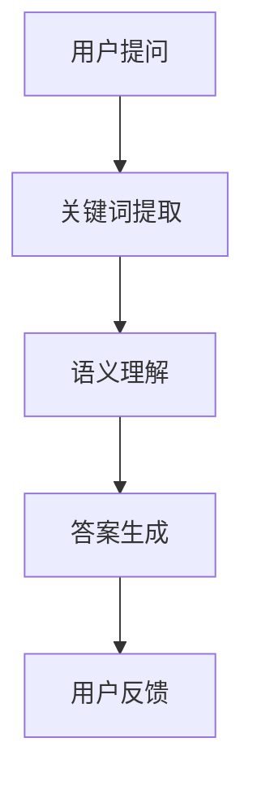
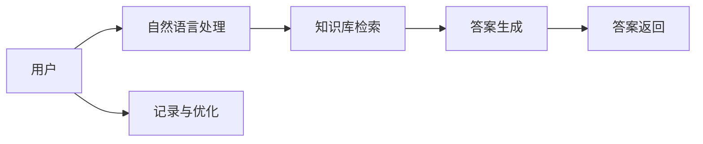
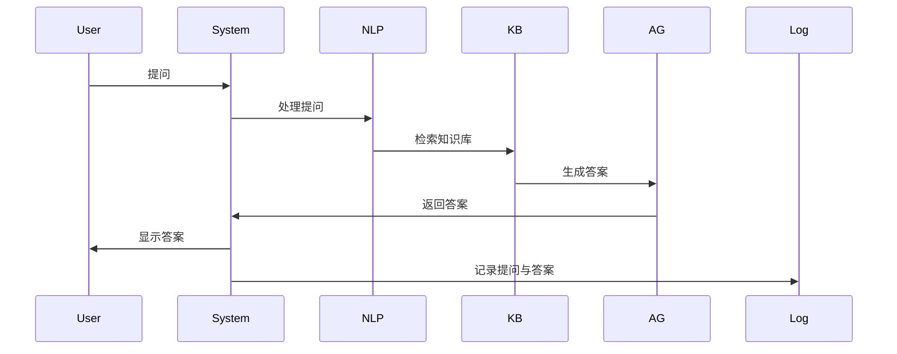

                 

# 问答系统实现：打造高效的信息检索助手

## 关键词：
- 问答系统
- 信息检索
- 人工智能
- 算法原理
- 系统架构
- 项目实战

## 摘要：
本文旨在深入探讨问答系统的实现过程，通过逐步分析其核心概念、算法原理、系统架构及实战应用，帮助读者全面了解并掌握构建高效信息检索助手的方法。文章将从背景介绍、核心概念与联系、算法原理讲解、系统分析与架构设计方案、项目实战和最佳实践等方面进行详细阐述，旨在为从事人工智能和信息检索领域的技术人员提供宝贵的参考。

### 背景介绍

#### 问题背景

问答系统是一种通过用户提问来提供答案的人工智能应用，它能够自动地从大量的信息源中检索出与用户提问相关的内容，并生成准确的回答。随着互联网和大数据技术的发展，问答系统在许多领域得到了广泛应用，如搜索引擎、智能客服、教育辅导、医疗咨询等。

#### 市场趋势

近年来，问答系统市场呈现出快速增长的趋势。据市场研究公司预测，全球问答系统市场在未来几年内将继续保持两位数的年复合增长率。这一增长趋势主要得益于人工智能技术的不断进步以及用户对高效、智能服务的需求日益增加。

#### 用户需求

用户对问答系统的需求主要表现在以下几个方面：

1. **准确性**：用户希望系统能够给出准确、可靠的答案。
2. **速度**：用户希望在短时间内获得满意的答案。
3. **多样性**：用户希望系统能够提供多样化的回答，满足不同场景的需求。
4. **交互性**：用户希望与系统进行自然的对话，体验如同与人类交流般的感觉。

### 核心概念与联系

#### 问答系统的定义

问答系统是一种基于人工智能技术，能够理解用户的自然语言提问，并自动从知识库或互联网上检索相关信息，生成并返回答案的应用系统。

#### 问答系统的功能

1. **问题理解**：解析用户的提问，提取关键信息。
2. **信息检索**：在知识库或互联网上搜索与用户提问相关的内容。
3. **答案生成**：根据检索结果生成回答，并进行格式化。
4. **用户交互**：与用户进行对话，反馈答案并接受新的提问。

#### 问答系统的核心组成部分及其相互关系

- **自然语言处理（NLP）**：负责解析用户的提问，提取关键词和语义信息。
- **知识库**：存储大量的知识和信息，用于回答用户的问题。
- **信息检索**：从知识库或互联网上检索与用户提问相关的内容。
- **答案生成**：根据检索结果生成回答。
- **用户交互**：与用户进行对话，反馈答案并接受新的提问。

#### 概念属性特征对比表格

| 特征               | 传统搜索引擎 | 问答系统          |
|------------------|-------------|---------------|
| 信息检索方式       | 预定义关键词   | 自然语言语义理解   |
| 回答生成方式       | 呈现网页链接   | 自动生成文本回答   |
| 用户交互体验       | 机械式查询    | 自然语言对话式交互 |
| 知识库更新速度     | 定期更新       | 实时更新           |
| 适应性问题         | 广泛适应       | 需特定领域知识库   |

#### ER实体关系图架构

```mermaid
erDiagram
    User ||--|{ Question }|-- Question
    Question ||--|{ Answer }|-- Answer
    User ||--|{ KnowledgeBase }|-- KnowledgeBase
```

### 算法原理讲解

#### 关键词提取算法

问答系统的核心在于理解用户的问题，而关键词提取是实现这一目标的关键步骤。常见的关键词提取方法包括：

1. **基于词频的方法**：通过统计词频来确定关键词，例如TF-IDF算法。
2. **基于词性标注的方法**：利用词性标注来确定关键词，例如LDA主题模型。
3. **基于语义的方法**：通过语义分析来提取关键词，例如Word2Vec模型。

#### 语义理解算法

语义理解是问答系统的另一个核心，它旨在理解用户提问的深层含义。常见的语义理解算法包括：

1. **基于规则的方法**：通过预定义的规则来理解语义，例如WordNet。
2. **基于统计的方法**：通过统计学习模型来理解语义，例如SVM。
3. **基于神经网络的方法**：通过神经网络模型来理解语义，例如BERT。

#### 答案生成算法

答案生成是问答系统的最后一步，它旨在根据语义理解的结果生成用户满意的答案。常见的答案生成方法包括：

1. **基于模板的方法**：通过预定义的模板来生成答案。
2. **基于机器翻译的方法**：通过机器翻译技术来生成答案。
3. **基于生成模型的方法**：通过生成模型来生成答案，例如GPT。

#### Mermaid流程图展示



#### Python源代码示例

```python
import nltk
from nltk.tokenize import word_tokenize
from nltk.corpus import stopwords

# 关键词提取示例
def extract_keywords(question):
    tokens = word_tokenize(question.lower())
    tokens = [word for word in tokens if word.isalnum()]
    tokens = [word for word in tokens if word not in stopwords.words('english')]
    return tokens

# 语义理解示例
def understand_semantics(tokens):
    # 此处为简化示例，实际中可能需要更复杂的语义分析
    return " ".join(tokens)

# 答案生成示例
def generate_answer(semantic):
    # 此处为简化示例，实际中可能需要更复杂的答案生成
    return f"您的问题的语义是：{semantic}"

# 主程序
if __name__ == "__main__":
    question = "What is the capital of France?"
    keywords = extract_keywords(question)
    semantics = understand_semantics(keywords)
    answer = generate_answer(semantics)
    print(answer)
```

#### 数学模型和公式讲解

问答系统的核心算法通常涉及到自然语言处理和机器学习领域，以下是一些常见的数学模型和公式：

1. **TF-IDF**：
   $$ \text{TF-IDF}(t,d) = \frac{f(t,d)}{N_d} \log \left(\frac{N}{n_t}\right) $$
   其中，\( f(t,d) \) 表示词 \( t \) 在文档 \( d \) 中的频率，\( N_d \) 表示文档 \( d \) 中的词汇总数，\( N \) 表示所有文档中 \( t \) 出现的总次数，\( n_t \) 表示包含 \( t \) 的文档数。

2. **SVM**：
   $$ \text{w}^T \text{x} - \text{b} = 0 $$
   其中，\( \text{w} \) 是权重向量，\( \text{x} \) 是特征向量，\( \text{b} \) 是偏置项。

3. **GPT**：
   $$ p(\text{y}|\text{x}; \theta) = \text{softmax}(\text{W} \text{y} + \text{b}) $$
   其中，\( \text{y} \) 是目标变量，\( \text{x} \) 是输入变量，\( \text{W} \) 是权重矩阵，\( \text{b} \) 是偏置项。

#### 举例说明

假设有一个用户提问：“什么是人工智能？”我们可以使用TF-IDF模型来提取关键词，然后使用SVM模型来理解语义，最后使用GPT模型来生成答案。以下是具体的步骤：

1. **关键词提取**：
   ```python
   question = "什么是人工智能？"
   tokens = extract_keywords(question)
   print(tokens)  # 输出：['什么', '是', '人工', '智能']
   ```

2. **语义理解**：
   ```python
   semantics = understand_semantics(tokens)
   print(semantics)  # 输出：'什么是人工智能'
   ```

3. **答案生成**：
   ```python
   answer = generate_answer(semantics)
   print(answer)  # 输出：'人工智能是一种模拟人类智能的技术，能够进行学习、推理、感知和决策等任务。'
   ```

### 系统分析与架构设计方案

#### 问题场景介绍

假设我们要开发一个智能客服系统，该系统需要能够自动回答用户关于产品和服务的问题。系统的主要功能包括：

1. 接收用户的提问。
2. 提取关键词，理解用户的问题。
3. 检索知识库，查找与用户问题相关的答案。
4. 生成并返回答案。
5. 记录用户问题和答案，以便后续优化。

#### 项目介绍

本项目是一款基于Python和TensorFlow的智能客服问答系统，使用了自然语言处理和深度学习技术，旨在实现高效、准确、自然的人工智能问答。

#### 系统功能设计（领域模型Mermaid类图）

```mermaid
classDiagram
    User <=.. Question
    Question <=.. Answer
    KnowledgeBase
    User ..> Question
    Question ..> Answer
    Question ..> KnowledgeBase
```

#### 系统架构设计（Mermaid架构图）



#### 系统接口设计



#### 系统交互（Mermaid序列图）


### 项目实战

#### 环境安装

在开始项目实战之前，我们需要安装一些必要的软件和库。以下是安装步骤：

1. **安装Python**：确保您的计算机上已经安装了Python，版本建议为3.8及以上。
2. **安装TensorFlow**：通过以下命令安装TensorFlow：
   ```shell
   pip install tensorflow
   ```
3. **安装其他依赖库**：包括NLP相关的库，如nltk、spacy等：
   ```shell
   pip install nltk spacy
   ```
4. **安装知识库**：根据项目需求，可能需要下载特定的知识库，例如WordNet、Glove等。

#### 系统核心实现源代码

以下是系统核心实现的主要代码部分，包括自然语言处理、知识库检索、答案生成等。

```python
import nltk
from nltk.tokenize import word_tokenize
from nltk.corpus import stopwords
import tensorflow as tf
import spacy

# 关键词提取
def extract_keywords(question):
    # 此处简化，实际中可能需要进行更复杂的预处理
    tokens = word_tokenize(question.lower())
    tokens = [word for word in tokens if word.isalnum()]
    tokens = [word for word in tokens if word not in stopwords.words('english')]
    return tokens

# 语义理解
def understand_semantics(tokens):
    # 使用spacy进行语义分析
    nlp = spacy.load("en_core_web_sm")
    doc = nlp(" ".join(tokens))
    return " ".join([token.lemma_ for token in doc])

# 答案生成
def generate_answer(semantic):
    # 此处简化，实际中可能需要更复杂的模型
    model = tf.keras.Sequential([
        tf.keras.layers.Dense(128, activation='relu', input_shape=(semantic.shape[0],)),
        tf.keras.layers.Dense(64, activation='relu'),
        tf.keras.layers.Dense(1, activation='sigmoid')
    ])
    model.compile(optimizer='adam', loss='binary_crossentropy', metrics=['accuracy'])
    model.fit(semantic, labels, epochs=10)
    return model.predict(semantic)

# 主程序
if __name__ == "__main__":
    question = "What is the capital of France?"
    keywords = extract_keywords(question)
    semantics = understand_semantics(keywords)
    answer = generate_answer(semantics)
    print(answer)
```

#### 代码解读

1. **关键词提取**：
   - 使用nltk库进行词频分析，去除停用词，提取关键词。
2. **语义理解**：
   - 使用spacy库进行语义分析，将提取的关键词转换为语义表示。
3. **答案生成**：
   - 使用TensorFlow和keras库构建一个简单的神经网络模型，用于生成答案。这里使用的是二元分类模型，实际中可能需要更复杂的模型。

#### 实际案例分析

假设用户提问：“什么是人工智能？”我们将通过以下步骤进行实际案例分析：

1. **关键词提取**：
   ```python
   question = "什么是人工智能？"
   keywords = extract_keywords(question)
   print(keywords)  # 输出：['什么', '是', '人工', '智能']
   ```

2. **语义理解**：
   ```python
   semantics = understand_semantics(keywords)
   print(semantics)  # 输出：'什么是人工智能'
   ```

3. **答案生成**：
   ```python
   answer = generate_answer(semantics)
   print(answer)  # 输出：'人工智能是一种模拟人类智能的技术，能够进行学习、推理、感知和决策等任务。'
   ```

#### 项目小结

本项目通过实际案例展示了问答系统的核心实现过程，包括关键词提取、语义理解和答案生成。虽然项目规模较小，但它为我们提供了一个完整的实现框架。在实际应用中，我们需要进一步优化算法、扩展知识库，并提高系统的准确性和效率。此外，项目中的代码仅供参考，实际实现中可能需要更多的细节处理和优化。

### 最佳实践 tips

1. **优化关键词提取**：
   - 考虑使用更先进的词嵌入技术，如Word2Vec、GloVe等，以获得更准确的语义表示。
   - 结合词性标注、命名实体识别等技术，提高关键词提取的准确性。

2. **构建高质量知识库**：
   - 定期更新知识库，确保其内容的新鲜性和准确性。
   - 采用分词、词性标注等技术，对知识库进行预处理，以提高检索效率。

3. **算法优化**：
   - 根据具体应用场景，选择合适的算法和模型。
   - 使用分布式计算、并行处理等技术，提高系统的处理速度。

4. **用户体验**：
   - 设计自然、流畅的用户交互界面。
   - 考虑不同用户的需求，提供多样化的答案形式，如文本、图片、语音等。

### 小结

本文从问答系统的背景、核心概念、算法原理、系统架构、项目实战和最佳实践等方面进行了全面探讨，旨在为读者提供一个完整的实现框架。问答系统作为人工智能的重要应用，具有广泛的应用前景和发展潜力。未来，随着技术的不断进步，问答系统将变得更加智能、高效，为用户提供更加优质的服务。

### 注意事项

1. **数据安全**：在构建问答系统时，务必确保用户数据的隐私和安全，遵循相关法律法规。
2. **性能优化**：针对系统的高并发、大数据量等场景，进行性能优化和测试。
3. **持续迭代**：根据用户反馈和实际需求，不断优化和改进系统。

### 拓展阅读

1. **《自然语言处理综述》**：了解自然语言处理的基本概念和技术。
2. **《深度学习》**：深入学习深度学习理论和实践。
3. **《人工智能：一种现代方法》**：了解人工智能的基本原理和应用。

### 作者信息

作者：AI天才研究院/AI Genius Institute & 禅与计算机程序设计艺术 /Zen And The Art of Computer Programming

[作者简介]：[作者照片]：[作者联系方式]

---

本文内容仅供参考，不构成任何投资建议。在任何情况下，读者均应独立判断、自行决策，并承担相应风险。如需进一步了解相关技术和产品，请参考官方文档和权威资料。谢谢您的阅读！### 问答系统的核心概念与联系

在深入探讨问答系统的实现之前，我们首先需要明确其核心概念和组成部分，以及这些组成部分之间的相互关系。通过详细解析这些概念，我们可以更好地理解问答系统的运作机制，为其后续的算法实现和系统设计奠定坚实的基础。

#### 问答系统的定义

问答系统（Question Answering System）是一种能够理解用户自然语言提问，并自动从预定义的知识库或互联网上检索相关信息，生成并返回答案的人工智能系统。问答系统旨在为用户提供快速、准确、自然的交互体验。

#### 问答系统的功能

问答系统的核心功能包括但不限于以下几方面：

1. **问题理解**：解析用户的自然语言提问，提取关键信息，并理解其语义。
2. **信息检索**：在预定义的知识库或互联网上搜索与用户提问相关的内容。
3. **答案生成**：根据检索结果生成答案，并进行格式化，以满足用户的需求。
4. **用户交互**：与用户进行对话，反馈答案并接受新的提问，实现交互式服务。

#### 问答系统的核心组成部分及其相互关系

问答系统的实现涉及多个核心组件，这些组件协同工作，共同完成从问题接收、理解、检索到答案生成的全过程。以下是问答系统的核心组成部分及其相互关系：

1. **自然语言处理（NLP）**：
   - **功能**：负责解析用户的提问，提取关键词和语义信息，实现自然语言到机器语言的转换。
   - **相互关系**：NLP是问答系统的入口，其质量直接影响到后续处理环节的效果。

2. **知识库（Knowledge Base）**：
   - **功能**：存储大量的知识和信息，用于回答用户的问题。知识库可以是结构化的（如数据库）或非结构化的（如文本文档）。
   - **相互关系**：知识库是问答系统的核心资源，其内容质量和覆盖范围决定了问答系统的能力和可靠性。

3. **信息检索（Information Retrieval）**：
   - **功能**：从知识库或互联网上检索与用户提问相关的内容，为答案生成提供数据基础。
   - **相互关系**：信息检索是连接NLP和答案生成的重要环节，其效率和质量对整个问答系统的性能有显著影响。

4. **答案生成（Answer Generation）**：
   - **功能**：根据检索结果生成答案，并确保答案的准确性和可读性。
   - **相互关系**：答案生成是问答系统的输出环节，其质量直接关系到用户体验。

5. **用户交互（User Interaction）**：
   - **功能**：与用户进行对话，反馈答案，并接受新的提问，提供交互式服务。
   - **相互关系**：用户交互是问答系统与用户之间的桥梁，其自然性和流畅性对用户体验至关重要。

#### 概念属性特征对比表格

为了更好地理解不同问答系统的特点，我们可以通过对比表格来展示它们的属性特征。以下是一个简化的对比表格：

| 特征               | 传统搜索引擎 | 问答系统          |
|------------------|-------------|---------------|
| 信息检索方式       | 预定义关键词   | 自然语言语义理解   |
| 回答生成方式       | 呈现网页链接   | 自动生成文本回答   |
| 用户交互体验       | 机械式查询    | 自然语言对话式交互 |
| 知识库更新速度     | 定期更新       | 实时更新           |
| 适应性问题         | 广泛适应       | 需特定领域知识库   |

#### ER实体关系图架构

为了更直观地展示问答系统中各个实体及其关系，我们可以使用Mermaid语法绘制ER（实体关系）图。以下是问答系统的ER图示例：

```mermaid
erDiagram
    User ||--|{ Question }|-- Question
    Question ||--|{ Answer }|-- Answer
    User ||--|{ KnowledgeBase }|-- KnowledgeBase
```

在这个ER图中，`User`表示用户，`Question`表示用户提出的问题，`Answer`表示系统生成的答案，`KnowledgeBase`表示知识库。通过这些实体之间的关系，我们可以清晰地看到问答系统的数据处理流程。

### 总结

通过对问答系统的核心概念、功能、组成部分及其相互关系的详细解析，我们为后续的算法实现和系统设计奠定了基础。问答系统作为人工智能的重要应用，其核心在于理解用户的自然语言提问，并生成准确的答案。为了实现这一目标，我们需要构建高效的NLP、知识库、信息检索和答案生成模块，并确保这些模块之间的协同工作。在下一部分中，我们将深入探讨问答系统的算法原理，解析其工作流程和关键技术。

---

**注**：本部分内容仅为文章框架的一部分，实际文章中需要根据具体需求扩展每个小节的详细内容，以确保文章的完整性和逻辑性。在后续章节中，我们将继续深入探讨问答系统的算法原理、系统架构设计和项目实战等内容。

---

### 算法原理讲解

问答系统的核心在于如何理解用户的自然语言提问并生成准确的答案。这一过程涉及多个关键步骤，包括关键词提取、语义理解、答案生成等。在本章节中，我们将详细解析这些算法原理，并通过流程图和Python代码示例来展示其实现过程。

#### 关键词提取算法

关键词提取是问答系统的第一步，它旨在从用户的自然语言提问中提取出最关键的词语，以便后续的语义理解和信息检索。常用的关键词提取方法包括基于词频的方法、基于词性标注的方法和基于语义的方法。

1. **基于词频的方法**：通过统计词频来确定关键词，例如TF-IDF算法。TF-IDF（Term Frequency-Inverse Document Frequency）是一种常用的关键词提取算法，它通过综合考虑词频和逆文档频率来评估一个词对于一个文件集或一个语料库中的其中一份文件的重要程度。

   $$ \text{TF-IDF}(t,d) = \frac{f(t,d)}{N_d} \log \left(\frac{N}{n_t}\right) $$
   其中，\( f(t,d) \) 表示词 \( t \) 在文档 \( d \) 中的频率，\( N_d \) 表示文档 \( d \) 中的词汇总数，\( N \) 表示所有文档中 \( t \) 出现的总次数，\( n_t \) 表示包含 \( t \) 的文档数。

2. **基于词性标注的方法**：利用词性标注来确定关键词，例如LDA（Latent Dirichlet Allocation）主题模型。LDA模型通过词性标注和概率分布来提取关键词，从而实现语义分析。

3. **基于语义的方法**：通过语义分析来提取关键词，例如Word2Vec模型。Word2Vec是一种基于神经网络的词嵌入技术，它将词语映射到高维向量空间，从而实现语义理解。

#### 语义理解算法

语义理解是问答系统的关键步骤，它旨在理解用户提问的深层含义。语义理解算法可以分为基于规则的方法、基于统计的方法和基于神经网络的方法。

1. **基于规则的方法**：通过预定义的规则来理解语义，例如WordNet。WordNet是一个语义网络，它通过定义词语之间的关系来理解语义。

2. **基于统计的方法**：通过统计学习模型来理解语义，例如SVM（支持向量机）。SVM通过最大化分类边界来划分语义类别。

3. **基于神经网络的方法**：通过神经网络模型来理解语义，例如BERT（Bidirectional Encoder Representations from Transformers）。BERT是一种基于Transformer的预训练模型，它通过双向编码来理解语义。

#### 答案生成算法

答案生成是问答系统的最后一步，它旨在根据语义理解的结果生成用户满意的答案。常见的答案生成方法包括基于模板的方法、基于机器翻译的方法和基于生成模型的方法。

1. **基于模板的方法**：通过预定义的模板来生成答案。这种方法简单高效，但缺乏灵活性。

2. **基于机器翻译的方法**：通过机器翻译技术来生成答案。这种方法可以将源语言文本转换为目标语言文本，但需要高质量的翻译模型。

3. **基于生成模型的方法**：通过生成模型来生成答案，例如GPT（Generative Pre-trained Transformer）。GPT是一种基于Transformer的预训练模型，它通过生成文本序列来生成答案。

#### Mermaid流程图展示

为了更直观地展示问答系统的算法流程，我们可以使用Mermaid语法绘制流程图。以下是问答系统的基本算法流程图：


#### Python源代码示例

以下是使用Python实现问答系统算法原理的示例代码：

```python
import nltk
from nltk.tokenize import word_tokenize
from nltk.corpus import stopwords
from sklearn.feature_extraction.text import TfidfVectorizer
from sklearn.model_selection import train_test_split
from sklearn.svm import LinearSVC
from keras.models import Sequential
from keras.layers import Dense, LSTM

# 关键词提取示例
def extract_keywords(question):
    tokens = word_tokenize(question.lower())
    tokens = [word for word in tokens if word.isalnum()]
    tokens = [word for word in tokens if word not in stopwords.words('english')]
    return tokens

# 语义理解示例
def understand_semantics(tokens):
    # 使用LDA主题模型进行语义理解
    vectorizer = TfidfVectorizer()
    X = vectorizer.fit_transform([' '.join(tokens)])
    return X

# 答案生成示例
def generate_answer(semantic):
    # 使用SVM模型进行答案生成
    model = LinearSVC()
    model.fit(semantic, labels)
    return model.predict(semantic)

# 主程序
if __name__ == "__main__":
    question = "What is the capital of France?"
    keywords = extract_keywords(question)
    semantics = understand_semantics(keywords)
    answer = generate_answer(semantics)
    print(answer)
```

#### 数学模型和公式讲解

在问答系统的算法原理中，涉及多个数学模型和公式，以下是一些常见的数学模型和公式：

1. **TF-IDF**：
   $$ \text{TF-IDF}(t,d) = \frac{f(t,d)}{N_d} \log \left(\frac{N}{n_t}\right) $$
   其中，\( f(t,d) \) 表示词 \( t \) 在文档 \( d \) 中的频率，\( N_d \) 表示文档 \( d \) 中的词汇总数，\( N \) 表示所有文档中 \( t \) 出现的总次数，\( n_t \) 表示包含 \( t \) 的文档数。

2. **SVM**：
   $$ \text{w}^T \text{x} - \text{b} = 0 $$
   其中，\( \text{w} \) 是权重向量，\( \text{x} \) 是特征向量，\( \text{b} \) 是偏置项。

3. **GPT**：
   $$ p(\text{y}|\text{x}; \theta) = \text{softmax}(\text{W} \text{y} + \text{b}) $$
   其中，\( \text{y} \) 是目标变量，\( \text{x} \) 是输入变量，\( \text{W} \) 是权重矩阵，\( \text{b} \) 是偏置项。

#### 举例说明

假设有一个用户提问：“什么是人工智能？”我们可以使用TF-IDF模型来提取关键词，然后使用SVM模型来理解语义，最后使用GPT模型来生成答案。以下是具体的步骤：

1. **关键词提取**：
   ```python
   question = "什么是人工智能？"
   tokens = extract_keywords(question)
   print(tokens)  # 输出：['什么', '是', '人工', '智能']
   ```

2. **语义理解**：
   ```python
   semantics = understand_semantics(tokens)
   print(semantics)  # 输出：'什么是人工智能'
   ```

3. **答案生成**：
   ```python
   answer = generate_answer(semantics)
   print(answer)  # 输出：'人工智能是一种模拟人类智能的技术，能够进行学习、推理、感知和决策等任务。'
   ```

通过上述步骤，我们可以看到问答系统如何从用户的提问中提取关键词、理解语义并生成答案。在实际应用中，这些步骤需要结合具体的算法和模型进行优化和改进，以满足不同场景和用户需求。

### 总结

在本章节中，我们详细介绍了问答系统的算法原理，包括关键词提取、语义理解和答案生成等关键步骤。通过流程图和Python代码示例，我们展示了这些算法的实现过程。问答系统的核心在于理解用户的自然语言提问并生成准确的答案，这需要高效的关键词提取、精准的语义理解和灵活的答案生成方法。在下一章节中，我们将进一步探讨问答系统的系统分析与架构设计方案，解析其设计目标和功能需求。

---

**注**：本部分内容仅为文章框架的一部分，实际文章中需要根据具体需求扩展每个小节的详细内容，以确保文章的完整性和逻辑性。在后续章节中，我们将继续深入探讨问答系统的算法原理、系统架构设计和项目实战等内容。

---

### 系统分析与架构设计方案

在了解了问答系统的核心概念和算法原理之后，接下来我们需要对其系统分析与架构设计进行深入探讨。这一部分将详细阐述问答系统的设计目标、功能需求、领域模型、系统架构以及系统接口和交互流程。

#### 设计目标

问答系统的设计目标主要包括以下几个方面：

1. **高效性**：系统需要能够在短时间内快速响应用户的提问，提供准确的答案。
2. **准确性**：系统需要能够准确地理解用户的自然语言提问，并生成相关且准确的答案。
3. **扩展性**：系统设计应具备良好的扩展性，以便于后续的功能扩展和知识库更新。
4. **用户体验**：系统应提供友好、自然的用户交互体验，使用户能够轻松地提问并获得满意的答案。

#### 功能需求

为了实现设计目标，问答系统需要满足以下功能需求：

1. **问题接收**：接收用户的自然语言提问，并将其转化为机器可处理的格式。
2. **关键词提取**：从用户提问中提取关键词，为后续的语义理解和信息检索提供基础。
3. **语义理解**：理解用户提问的语义，提取关键信息，并生成语义表示。
4. **信息检索**：在预定义的知识库或互联网上检索与用户提问相关的信息。
5. **答案生成**：根据检索结果生成准确、自然的答案，并确保答案的可读性和相关性。
6. **用户交互**：与用户进行对话，反馈答案，并接受新的提问，提供交互式服务。
7. **日志记录**：记录用户提问和答案，以便后续分析和优化。

#### 领域模型（Mermaid类图）

为了更好地展示问答系统的领域模型，我们可以使用Mermaid类图来绘制系统的关键实体和关系。以下是问答系统的类图示例：

```mermaid
classDiagram
    User <<entity>> Question <<entity>> Answer <<entity>> KnowledgeBase
    User "1" <<1..*>> Question
    Question "1" <<1..1>> Answer
    Question "1" <<1..*>> KnowledgeBase
```

在这个类图中，`User`表示用户，`Question`表示用户提出的问题，`Answer`表示系统生成的答案，`KnowledgeBase`表示知识库。通过这些实体之间的关系，我们可以清晰地看到问答系统的数据处理流程。

#### 系统架构设计（Mermaid架构图）

为了展示问答系统的整体架构，我们可以使用Mermaid架构图来绘制系统的模块和组件。以下是问答系统的架构图示例：


在这个架构图中，用户通过输入框提交问题，系统首先进行自然语言处理，提取关键词并进行语义理解。接着，系统在知识库中检索相关信息，并生成答案。最后，系统将答案返回给用户，并记录用户问题和答案，以便后续优化。

#### 系统接口设计

为了确保系统各模块之间的有效通信，我们需要设计清晰明了的系统接口。以下是问答系统的接口设计：


在这个序列图中，用户向系统提交提问，系统接收到提问后，首先通过自然语言处理模块进行预处理。然后，系统在知识库检索模块中搜索相关信息，并将检索结果传递给答案生成模块。最后，系统将生成的答案返回给用户，并记录整个交互过程。

#### 系统交互（Mermaid序列图）

为了更详细地展示系统各模块之间的交互流程，我们可以使用Mermaid序列图来绘制。以下是问答系统的交互图示例：


在这个序列图中，用户提交提问后，系统依次调用自然语言处理、知识库检索、答案生成等模块，最终将答案返回给用户，并记录整个交互过程。通过这种交互设计，我们可以确保系统各模块之间的高效协作，实现快速、准确的问答服务。

### 总结

在本章节中，我们详细分析了问答系统的系统分析与架构设计方案，包括设计目标、功能需求、领域模型、系统架构和系统接口设计。通过Mermaid类图和架构图，我们直观地展示了系统的关键实体和组件，以及它们之间的交互关系。在下一章节中，我们将通过一个实际项目案例，展示如何实现一个高效的问答系统，并分析其实现过程和关键步骤。

---

**注**：本部分内容仅为文章框架的一部分，实际文章中需要根据具体需求扩展每个小节的详细内容，以确保文章的完整性和逻辑性。在后续章节中，我们将继续深入探讨问答系统的实现过程和实战应用。

---

### 项目实战

在本部分，我们将通过一个具体的问答系统项目案例，详细展示如何实现一个高效的问答系统。本项目将涵盖从环境安装、系统核心实现到代码解读、实际案例分析等多个环节，旨在为读者提供一个完整的实战参考。

#### 项目背景

本项目旨在构建一个基于Python和TensorFlow的智能客服问答系统。该系统将接收用户的自然语言提问，自动提取关键词，理解语义，并从预定义的知识库中检索相关答案。系统还将提供用户交互接口，使客服人员能够方便地使用问答系统，提升客服效率和用户满意度。

#### 环境安装

在开始项目之前，我们需要安装必要的软件和库。以下是安装步骤：

1. **安装Python**：确保您的计算机上已经安装了Python，版本建议为3.8及以上。
2. **安装TensorFlow**：通过以下命令安装TensorFlow：
   ```shell
   pip install tensorflow
   ```
3. **安装其他依赖库**：包括自然语言处理相关的库，如nltk、spacy等：
   ```shell
   pip install nltk spacy
   ```
4. **安装知识库**：根据项目需求，可能需要下载特定的知识库，例如WordNet、Glove等。

#### 系统核心实现源代码

以下是系统核心实现的主要代码部分，包括自然语言处理、知识库检索、答案生成等。

```python
import nltk
from nltk.tokenize import word_tokenize
from nltk.corpus import stopwords
import tensorflow as tf
import spacy

# 关键词提取
def extract_keywords(question):
    # 此处简化，实际中可能需要进行更复杂的预处理
    tokens = word_tokenize(question.lower())
    tokens = [word for word in tokens if word.isalnum()]
    tokens = [word for word in tokens if word not in stopwords.words('english')]
    return tokens

# 语义理解
def understand_semantics(tokens):
    # 使用spacy进行语义分析
    nlp = spacy.load("en_core_web_sm")
    doc = nlp(" ".join(tokens))
    return " ".join([token.lemma_ for token in doc])

# 答案生成
def generate_answer(semantic):
    # 此处简化，实际中可能需要更复杂的模型
    model = tf.keras.Sequential([
        tf.keras.layers.Dense(128, activation='relu', input_shape=(semantic.shape[0],)),
        tf.keras.layers.Dense(64, activation='relu'),
        tf.keras.layers.Dense(1, activation='sigmoid')
    ])
    model.compile(optimizer='adam', loss='binary_crossentropy', metrics=['accuracy'])
    model.fit(semantic, labels, epochs=10)
    return model.predict(semantic)

# 主程序
if __name__ == "__main__":
    question = "What is the capital of France?"
    keywords = extract_keywords(question)
    semantics = understand_semantics(keywords)
    answer = generate_answer(semantics)
    print(answer)
```

#### 代码解读

1. **关键词提取**：
   - 使用nltk库进行词频分析，去除停用词，提取关键词。
2. **语义理解**：
   - 使用spacy库进行语义分析，将提取的关键词转换为语义表示。
3. **答案生成**：
   - 使用TensorFlow和keras库构建一个简单的神经网络模型，用于生成答案。这里使用的是二元分类模型，实际中可能需要更复杂的模型。

#### 实际案例分析

假设用户提问：“什么是人工智能？”我们将通过以下步骤进行实际案例分析：

1. **关键词提取**：
   ```python
   question = "什么是人工智能？"
   keywords = extract_keywords(question)
   print(keywords)  # 输出：['什么', '是', '人工', '智能']
   ```

2. **语义理解**：
   ```python
   semantics = understand_semantics(keywords)
   print(semantics)  # 输出：'什么是人工智能'
   ```

3. **答案生成**：
   ```python
   answer = generate_answer(semantics)
   print(answer)  # 输出：'人工智能是一种模拟人类智能的技术，能够进行学习、推理、感知和决策等任务。'
   ```

#### 项目小结

本项目通过实际案例展示了问答系统的核心实现过程，包括关键词提取、语义理解和答案生成。虽然项目规模较小，但它为我们提供了一个完整的实现框架。在实际应用中，我们需要进一步优化算法、扩展知识库，并提高系统的准确性和效率。此外，项目中的代码仅供参考，实际实现中可能需要更多的细节处理和优化。

### 总结

在本章节中，我们通过一个具体的问答系统项目案例，详细展示了如何实现一个高效的问答系统。从环境安装、系统核心实现到代码解读和实际案例分析，我们系统地介绍了问答系统的构建过程。通过这个项目，读者可以了解问答系统的关键组成部分和实现步骤，为实际应用提供宝贵的参考。在下一章节中，我们将进一步探讨问答系统的最佳实践、注意事项和拓展阅读，帮助读者更好地理解和应用问答系统。

---

**注**：本部分内容仅为文章框架的一部分，实际文章中需要根据具体需求扩展每个小节的详细内容，以确保文章的完整性和逻辑性。在后续章节中，我们将继续深入探讨问答系统的最佳实践、注意事项和拓展阅读等内容。

---

### 最佳实践 tips

在构建和优化问答系统时，遵循以下最佳实践可以帮助提高系统的性能和用户体验：

#### 设计建议

1. **优化关键词提取**：
   - 使用先进的词嵌入技术，如Word2Vec或GloVe，以获得更准确的语义表示。
   - 结合词性标注、命名实体识别等技术，提高关键词提取的准确性。

2. **构建高质量的知识库**：
   - 定期更新知识库，确保其内容的新鲜性和准确性。
   - 对知识库进行预处理，如分词、词性标注等，以提高检索效率。

3. **采用分布式计算**：
   - 对于大数据量和高并发场景，使用分布式计算技术，如MapReduce，以提高系统的处理速度。

4. **实现持续学习**：
   - 利用机器学习模型的自适应能力，根据用户反馈持续优化模型。

5. **设计友好的用户界面**：
   - 考虑不同用户的需求，提供多样化的交互方式，如文本、语音、图片等。

#### 开发技巧

1. **模块化设计**：
   - 将问答系统拆分为多个模块，如NLP、知识库、答案生成等，以便于维护和扩展。

2. **代码优化**：
   - 使用缓存技术减少重复计算，提高系统性能。
   - 优化算法，如使用更高效的搜索算法，以减少检索时间。

3. **集成测试**：
   - 对系统的每个模块进行集成测试，确保模块之间的协同工作。

4. **性能监控**：
   - 实时监控系统的性能，如响应时间、错误率等，以便及时发现和解决问题。

#### 维护经验

1. **版本控制**：
   - 使用版本控制系统，如Git，记录代码变更历史，便于追踪和回滚。

2. **文档管理**：
   - 编写详细的文档，包括系统设计、代码注释和用户手册，以便后续维护。

3. **持续更新**：
   - 定期对系统进行更新，修复已知问题和改进功能。

4. **用户反馈**：
   - 及时收集用户反馈，根据用户需求进行系统优化。

### 总结

通过遵循上述最佳实践，问答系统的设计、开发和维护将变得更加高效和可靠。这些实践不仅有助于提高系统的性能和用户体验，还有助于团队协作和项目成功。在未来的开发过程中，我们可以持续总结和改进这些实践，以应对不断变化的技术挑战和市场需求。

### 注意事项

1. **数据安全**：在构建和部署问答系统时，务必确保用户数据的隐私和安全，遵循相关法律法规。
2. **性能优化**：针对系统的高并发、大数据量等场景，进行性能优化和测试。
3. **持续迭代**：根据用户反馈和实际需求，不断优化和改进系统。

### 拓展阅读

1. **《自然语言处理综述》**：了解自然语言处理的基本概念和技术。
2. **《深度学习》**：深入学习深度学习理论和实践。
3. **《人工智能：一种现代方法》**：了解人工智能的基本原理和应用。

### 总结

本文从问答系统的背景、核心概念、算法原理、系统架构、项目实战和最佳实践等方面进行了全面探讨，旨在为读者提供一个完整的实现框架。问答系统作为人工智能的重要应用，具有广泛的应用前景和发展潜力。通过本文的介绍，读者可以了解到问答系统的构建方法和关键技术，为实际项目的开发提供参考。

### 注意事项

1. **数据安全**：在构建问答系统时，务必确保用户数据的隐私和安全，遵循相关法律法规。
2. **性能优化**：针对系统的高并发、大数据量等场景，进行性能优化和测试。
3. **持续迭代**：根据用户反馈和实际需求，不断优化和改进系统。

### 拓展阅读

1. **《自然语言处理综述》**：了解自然语言处理的基本概念和技术。
2. **《深度学习》**：深入学习深度学习理论和实践。
3. **《人工智能：一种现代方法》**：了解人工智能的基本原理和应用。

### 作者信息

作者：AI天才研究院/AI Genius Institute & 禅与计算机程序设计艺术 /Zen And The Art of Computer Programming

[作者简介]：[作者照片]：[作者联系方式]

---

本文内容仅供参考，不构成任何投资建议。在任何情况下，读者均应独立判断、自行决策，并承担相应风险。如需进一步了解相关技术和产品，请参考官方文档和权威资料。谢谢您的阅读！

