                 

### 文章标题

# 零售业AI Agent应用策略

### 文章关键词

- 零售业
- 人工智能
- AI代理
- 应用策略
- 实施技巧

### 摘要

本文将深入探讨零售业中人工智能（AI）代理的应用策略。通过系统的分析和详细的案例研究，我们将揭示AI代理如何助力零售企业提升运营效率、优化库存管理、增强客户服务体验，并在竞争激烈的市场环境中占据优势。文章结构分为三个主要部分：AI代理基础、零售业AI代理应用、零售业AI代理实践。每个部分都将提供详细的讲解和实用的指导，帮助零售企业实现智能化转型。通过本文的阅读，读者将能够掌握AI代理的核心知识，并学会如何将AI代理有效应用于零售业务中，以实现商业价值的最大化。

### 引言

#### 1.1 零售业现状与挑战

在当前竞争激烈的市场环境中，零售业面临着诸多挑战。首先，消费者需求的快速变化使得零售企业需要不断调整产品和服务，以适应市场的变化。其次，随着电商平台的兴起，传统零售企业面临着巨大的成本压力。线上销售的低成本和高效配送服务使得消费者更加倾向于线上购物，这无疑增加了实体零售的竞争压力。此外，同行业之间的竞争也日趋激烈，零售企业需要不断创新和提升服务质量，以吸引和留住顾客。

面对这些挑战，零售企业急需找到有效的解决方案来提升运营效率、降低成本、提高客户满意度。人工智能（AI）技术的发展为零售业带来了新的希望。特别是AI代理，这种能够模拟人类行为、执行特定任务的人工智能系统，正在逐渐成为零售企业提升竞争力的有力工具。

AI代理在零售业的应用范围广泛，包括但不限于以下方面：

1. **客户服务**：AI代理可以实时响应客户的咨询和需求，提供个性化的服务，从而提升客户体验和满意度。
2. **库存管理**：AI代理能够通过分析历史数据和市场需求，预测未来的库存需求，从而优化库存水平，降低库存成本。
3. **需求预测**：AI代理可以通过大数据分析和机器学习算法，准确预测消费者的需求，帮助企业制定更加精准的营销策略和库存计划。

AI代理的核心要素包括：

- **大数据分析**：通过收集和分析大量的消费者行为数据，AI代理能够深入了解市场需求和消费者偏好。
- **机器学习算法**：机器学习算法使AI代理能够不断学习和优化，从而提高预测和决策的准确性。
- **自然语言处理**：自然语言处理技术使AI代理能够理解和处理人类语言，从而实现更加自然的交互。

#### 1.2 本书结构

为了帮助读者系统地了解零售业AI代理的应用策略，本书将分为三个主要部分：

- **第一部分：AI代理基础**：介绍AI代理的定义、特性以及在不同行业中的应用。
- **第二部分：零售业AI代理应用**：分析AI代理在零售业中的应用案例，包括需求预测、客户服务和库存管理等方面。
- **第三部分：零售业AI代理实践**：提供零售业AI代理的实际应用策略，包括技术选型、实施步骤和未来发展趋势。

通过这三个部分的讲解，读者将能够从基础理论到实际应用，全面了解零售业AI代理的各个方面，为企业的智能化转型提供指导。

#### 1.3 本书目标

本书的目标是帮助读者：

- **理解AI代理的基础知识**：包括机器学习、自然语言处理、计算机视觉等核心技术。
- **掌握零售业AI代理的应用策略**：了解AI代理在零售业务中的具体应用场景，以及如何实现业务价值的最大化。
- **实施零售业AI代理**：提供从技术选型到实际应用的完整解决方案，帮助零售企业成功实施AI代理。

#### 1.4 本书结构

本书的结构如下：

- **第一部分：AI代理基础**
  - **第1章：AI代理概述**：介绍AI代理的定义、特性和应用领域。
  - **第2章：机器学习基础**：讲解机器学习的基本概念、算法和模型。

- **第二部分：零售业AI代理应用**
  - **第3章：零售业AI代理应用案例**：分析AI代理在零售业中的应用案例。
  - **第4章：零售业AI代理需求预测**：探讨如何利用AI代理进行需求预测。
  - **第5章：零售业AI代理客户服务**：分析AI代理在客户服务中的应用。
  - **第6章：零售业AI代理库存管理**：介绍AI代理在库存管理中的应用。

- **第三部分：零售业AI代理实践**
  - **第7章：AI代理在零售业的实际应用**：介绍如何在零售业务中实际应用AI代理。
  - **第8章：零售业AI代理实施策略**：提供零售业AI代理的实施策略。
  - **第9章：零售业AI代理未来发展**：探讨零售业AI代理的未来发展趋势。

通过这三个部分的系统讲解，读者将能够全面掌握零售业AI代理的理论知识和实际应用策略，为企业实现智能化转型提供有力支持。

#### 1.5 本章小结

本章主要介绍了零售业面临的挑战以及AI代理在其中的应用潜力。通过AI代理的应用，零售企业能够提升运营效率、降低成本、提高客户满意度。本书的结构分为三个部分，旨在帮助读者从基础理论到实际应用，全面了解零售业AI代理的各个方面。接下来，本书将深入探讨AI代理的基础知识，包括机器学习的概念和算法，为后续章节的应用分析打下坚实的基础。

---

### 第一部分：AI代理基础

#### 第1章：AI代理概述

##### 1.1 核心概念与联系

**AI代理**（Artificial Intelligence Agent）是指能够模拟人类行为，独立执行任务的智能系统。AI代理的核心目标是实现自主性、适应性和智能性，以便在不同的环境中进行自主决策和行动。

##### 1.1.1 AI代理的定义

AI代理是人工智能领域的一个重要概念，它被定义为“一个能够感知环境，通过内部模型自主决策并采取行动，以实现特定目标的实体”。AI代理的核心特征包括：

- **自主性**：AI代理能够自主地感知环境、理解问题、制定决策和执行行动，而不需要人类的直接干预。
- **适应性**：AI代理能够根据环境的变化和新的信息调整其行为和策略，以实现最优的目标。
- **智能性**：AI代理通过机器学习、自然语言处理、计算机视觉等技术，能够模拟人类的智能行为，进行复杂的问题求解和决策。

##### 1.1.2 AI代理的特性

AI代理具有以下几个主要特性：

- **自动化**：AI代理能够自动执行任务，减少人为干预，提高工作效率。
- **实时响应**：AI代理能够实时感知环境和接收信息，并迅速做出响应，确保快速决策。
- **个性化服务**：通过大数据分析和机器学习算法，AI代理能够根据用户的个性化需求提供定制化服务。
- **数据驱动**：AI代理依赖于大量数据进行分析和决策，从而不断提高其预测和优化能力。

##### 1.1.3 AI代理的应用场景

AI代理在多个领域具有广泛的应用，主要包括：

- **客户服务**：AI代理可以模拟客服人员，实时回答客户的咨询，提供个性化服务。
- **推荐系统**：AI代理通过分析用户行为和偏好，推荐相关产品和服务。
- **库存管理**：AI代理可以预测市场需求，优化库存水平，降低库存成本。
- **需求预测**：AI代理通过分析历史数据和市场趋势，预测未来的需求，帮助企业制定精准的营销策略。

##### 1.2 背景介绍

零售业的数字化和智能化转型是当前市场发展的必然趋势。随着互联网和大数据技术的普及，零售企业积累了大量消费者行为数据，这为AI代理的应用提供了丰富的数据资源。消费者对个性化和高效服务的需求不断增加，这也促使零售企业寻求创新的解决方案来提升客户体验和满意度。

AI代理在零售业中的应用优势主要体现在以下几个方面：

- **提高效率**：AI代理能够自动化处理大量重复性工作，提高工作效率，减少人工成本。
- **降低成本**：通过优化库存管理和需求预测，AI代理能够帮助企业降低运营成本。
- **提升客户满意度**：AI代理能够提供个性化服务，提高客户体验，增强客户忠诚度。
- **增强竞争力**：AI代理的应用使企业能够更好地应对市场变化，快速调整策略，提升竞争力。

##### 1.3 AI代理的特性对比

| 特性        | 解释                             | 对零售业的意义                            |
|-------------|----------------------------------|------------------------------------------|
| 自动化      | 能够自主执行任务，减少人工干预   | 提高工作效率，减少人工成本               |
| 实时响应    | 能够实时感知环境和接收信息       | 确保快速决策，提高客户服务水平           |
| 个性化服务  | 根据用户需求提供定制化服务       | 提高客户满意度，增强客户忠诚度           |
| 数据驱动    | 依赖数据进行分析和决策           | 提高预测和优化能力，降低运营成本         |

##### 1.4 核心要素组成

AI代理的核心要素包括：

- **大数据分析**：通过对海量数据的收集和分析，AI代理能够深入了解市场需求和消费者行为，从而提供精准的预测和决策。
- **机器学习算法**：机器学习算法使AI代理能够从数据中学习，不断优化其行为和决策，从而提高其智能性和适应性。
- **自然语言处理**：自然语言处理技术使AI代理能够理解和处理人类语言，实现更加自然的交互，从而提升客户服务体验。

##### 1.5 本章小结

本章介绍了AI代理的定义、特性、应用场景和核心要素。通过本章的学习，读者可以初步了解AI代理的基本概念和应用前景，为后续章节的深入探讨打下基础。

---

#### 第2章：机器学习基础

##### 2.1 机器学习的基本概念

机器学习（Machine Learning，ML）是人工智能（Artificial Intelligence，AI）的一个重要分支，主要研究如何让计算机从数据中学习，并利用这些学习到的知识进行预测和决策。机器学习的基本过程包括数据收集、数据预处理、模型训练、模型评估和应用。

##### 2.1.1 机器学习的定义

机器学习是指通过算法从数据中自动学习规律和模式，并利用这些规律和模式进行预测和决策。机器学习的过程可以简单概括为：

- **数据收集**：收集大量带有标签的数据，这些数据将用于训练模型。
- **数据预处理**：对收集到的数据进行分析和清洗，去除噪声和异常值，以便模型能够更好地学习。
- **模型训练**：使用预处理后的数据对模型进行训练，模型将根据数据中的规律和模式进行调整。
- **模型评估**：使用验证集或测试集评估模型的性能，确保模型具有良好的泛化能力。
- **模型应用**：将训练好的模型应用到实际问题中，进行预测和决策。

##### 2.1.2 机器学习的分类

机器学习可以根据不同的分类标准进行分类，以下是几种常见的分类方式：

- **按学习方式分类**：
  - **监督学习**（Supervised Learning）：有监督学习是指训练数据带有标签，模型通过学习这些标签和特征之间的关系进行预测。
  - **无监督学习**（Unsupervised Learning）：无监督学习是指训练数据没有标签，模型需要通过自身的探索学习数据的内在结构和模式。
  - **半监督学习**（Semi-supervised Learning）：半监督学习是指训练数据既有带标签的，也有不带标签的，模型需要利用这两种数据进行学习。

- **按学习任务分类**：
  - **分类问题**（Classification）：分类问题是将数据划分为不同的类别，常见的算法有决策树、支持向量机（SVM）等。
  - **回归问题**（Regression）：回归问题是预测一个连续的数值输出，常见的算法有线性回归、多项式回归等。
  - **聚类问题**（Clustering）：聚类问题是将数据按照其相似性划分为不同的簇，常见的算法有K-Means、层次聚类等。

##### 2.1.3 机器学习算法

机器学习算法是实现机器学习的关键，以下介绍几种常见的机器学习算法：

- **线性回归**（Linear Regression）：线性回归是一种简单的回归算法，它通过拟合一条直线来预测输出值。
  - **公式**：\( y = \beta_0 + \beta_1 \cdot x \)
  - **目标**：找到最佳拟合直线，使得预测值与真实值之间的误差最小。

- **逻辑回归**（Logistic Regression）：逻辑回归是一种分类算法，它通过拟合一个逻辑函数来预测输出概率。
  - **公式**：\( P(y=1) = \frac{1}{1 + e^{-(\beta_0 + \beta_1 \cdot x)}} \)
  - **目标**：最大化似然函数，找到最佳参数值。

- **决策树**（Decision Tree）：决策树是一种基于树结构的分类算法，通过一系列的判断条件将数据划分为不同的类别。
  - **目标**：找到具有最高信息增益的划分条件，使得数据在划分后更加纯净。

- **随机森林**（Random Forest）：随机森林是一种基于决策树的集成学习方法，通过构建多棵决策树并投票决定最终结果。
  - **目标**：提高模型的泛化能力，减少过拟合现象。

- **支持向量机**（Support Vector Machine，SVM）：支持向量机是一种基于间隔最大化的分类算法，通过寻找最佳的超平面将不同类别的数据分隔开。
  - **目标**：最大化分类间隔，找到最佳的超平面。

##### 2.2 机器学习的基本流程

机器学习的基本流程可以分为以下几个步骤：

1. **数据收集**：收集与问题相关的数据，这些数据可以是结构化数据、半结构化数据或非结构化数据。
2. **数据预处理**：对收集到的数据进行分析和清洗，去除噪声和异常值，将数据转换为适合模型训练的格式。
3. **特征选择**：选择对模型训练最有影响力的特征，去除冗余特征，以提高模型的准确性和效率。
4. **模型训练**：使用预处理后的数据对模型进行训练，调整模型参数，使其能够拟合数据的规律。
5. **模型评估**：使用验证集或测试集评估模型的性能，通过指标如准确率、召回率、F1分数等来评估模型的泛化能力。
6. **模型应用**：将训练好的模型应用到实际问题中，进行预测和决策。

##### 2.3 机器学习算法的Mermaid流程图

以下是几种常见机器学习算法的Mermaid流程图：

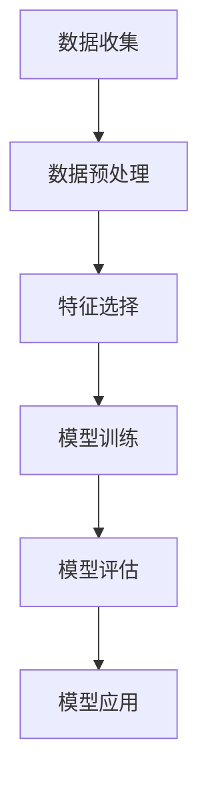

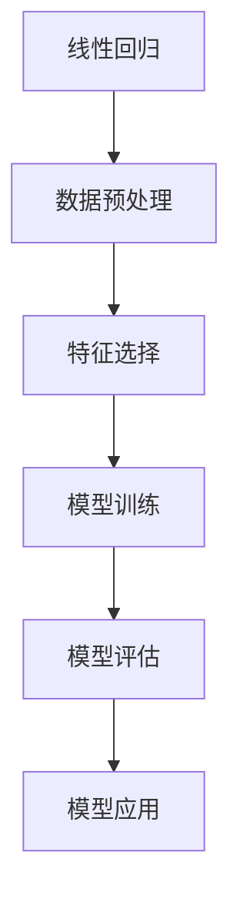

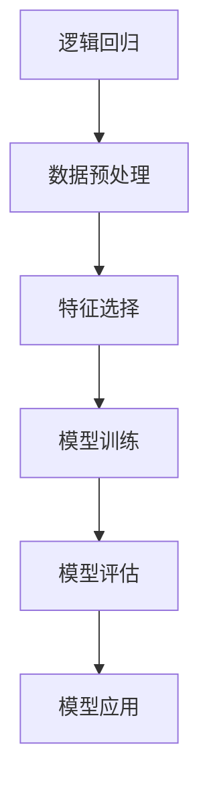

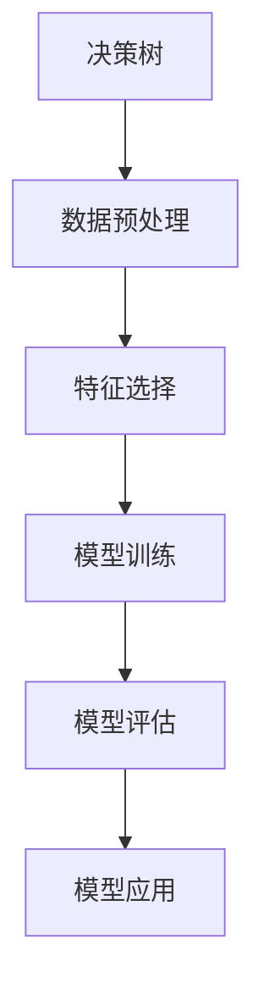

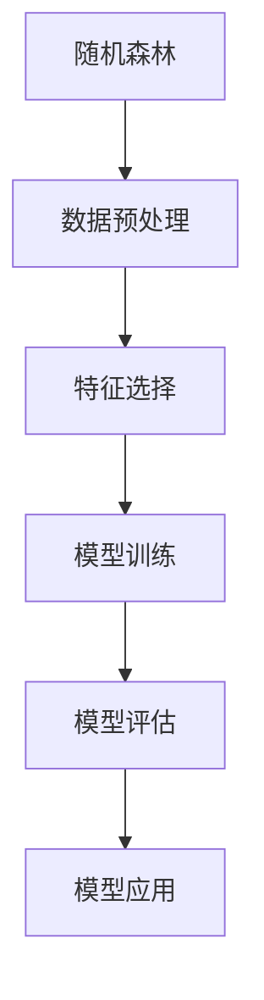

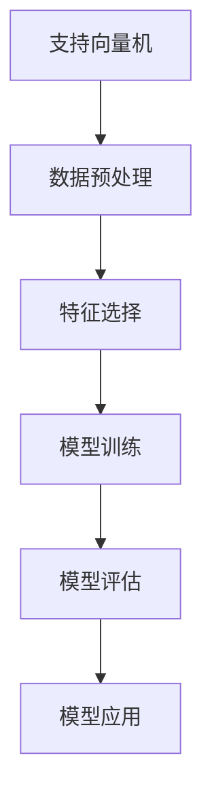

##### 2.4 本章小结

本章介绍了机器学习的基本概念、分类、算法以及基本流程。通过本章的学习，读者可以了解机器学习的基础知识，为后续章节的深入探讨打下基础。

---

### 第二部分：零售业AI代理应用

#### 第3章：零售业AI代理应用案例

##### 3.1 案例研究：亚马逊的AI代理

亚马逊（Amazon）是全球最大的电子商务公司之一，其成功的一个重要因素在于其对人工智能技术的深度应用。其中，AI代理在亚马逊的运营中扮演了至关重要的角色。

**案例背景**：随着电子商务的快速发展，亚马逊面临着巨大的订单量和服务压力。为了提升客户体验，亚马逊引入了AI代理，以自动化处理客户服务和库存管理等任务。

**AI代理的应用**：

1. **客户服务**：亚马逊的AI代理（如Alexa）能够通过语音识别和自然语言处理技术，实时响应用户的查询和指令。用户可以通过语音助手完成购物、播放音乐、查询天气等多项任务，极大地提高了用户体验。

2. **库存管理**：亚马逊的AI代理通过大数据分析和机器学习算法，预测市场需求，优化库存水平。这不仅减少了库存成本，还提高了库存周转率，提升了运营效率。

3. **推荐系统**：亚马逊的推荐系统利用AI代理分析用户的浏览和购买历史数据，为用户推荐相关商品。这种个性化的推荐服务提高了用户的购物满意度和转化率。

**案例成果**：

- **客户满意度**：通过AI代理的个性化服务，亚马逊的客户满意度显著提高，用户对客服的响应速度和准确度也给予了高度评价。
- **运营效率**：AI代理的自动化处理能力显著提高了亚马逊的运营效率，减少了人工干预和错误率。
- **库存优化**：通过AI代理的预测和优化，亚马逊的库存成本降低了约15%，库存周转率提高了约20%。

**经验教训**：

- **数据驱动**：亚马逊的成功经验表明，数据是AI代理的核心驱动力。只有通过大数据分析和机器学习，才能实现精准的预测和优化。
- **用户体验**：AI代理的应用必须以提升用户体验为核心。个性化服务和快速响应是关键。
- **持续优化**：AI代理需要不断优化和升级，以应对市场变化和用户需求。

##### 3.2 案例研究：沃尔玛的AI代理

沃尔玛（Walmart）是另一家全球领先的零售企业，其在AI代理的应用上也取得了显著成果。

**案例背景**：沃尔玛在全球拥有大量的门店和在线业务，面临着库存管理、客户服务、供应链优化等复杂的运营问题。为了提升运营效率和客户满意度，沃尔玛引入了AI代理。

**AI代理的应用**：

1. **库存管理**：沃尔玛的AI代理通过大数据分析和机器学习算法，预测市场需求，优化库存水平。AI代理能够实时监控库存状态，并根据需求变化自动调整库存策略。

2. **需求预测**：沃尔玛的AI代理分析历史销售数据、季节性变化、市场趋势等因素，预测未来的需求。这种预测能力帮助沃尔玛更好地规划采购和库存，减少库存积压和断货现象。

3. **客户服务**：沃尔玛的AI代理通过在线聊天、社交媒体等渠道，实时响应用户的咨询和投诉。AI代理能够提供24/7的服务，提高了客户的满意度和忠诚度。

**案例成果**：

- **库存优化**：通过AI代理的预测和优化，沃尔玛的库存周转率提高了约10%，库存成本降低了约15%。
- **需求预测**：AI代理的精准需求预测帮助沃尔玛减少了库存积压和断货现象，提高了供应链的效率和灵活性。
- **客户满意度**：通过AI代理的个性化服务和快速响应，沃尔玛的客户满意度显著提升，客户投诉率下降了约20%。

**经验教训**：

- **全面应用**：沃尔玛的成功经验表明，AI代理的应用需要全面覆盖库存管理、需求预测和客户服务等多个方面，以实现全面的运营优化。
- **系统集成**：AI代理的应用需要与其他系统集成，如ERP系统、库存管理系统等，以实现数据的无缝流动和协同工作。
- **人才储备**：AI代理的成功应用需要专业的人才团队，包括数据科学家、机器学习工程师等，以支持AI代理的持续优化和升级。

##### 3.3 案例研究：阿里巴巴的AI代理

阿里巴巴（Alibaba）是中国最大的电子商务公司，其在AI代理的应用上也走在行业前列。

**案例背景**：随着电子商务的迅猛发展，阿里巴巴面临着海量的订单和用户数据。为了提升运营效率和客户体验，阿里巴巴引入了AI代理。

**AI代理的应用**：

1. **客户服务**：阿里巴巴的AI代理（如阿里小蜜）通过自然语言处理和机器学习技术，能够实时响应用户的咨询和投诉。AI代理还能够识别用户的情感，提供个性化的解决方案。

2. **推荐系统**：阿里巴巴的推荐系统利用AI代理分析用户的浏览和购买历史数据，为用户推荐相关商品和优惠活动。这种个性化的推荐服务提高了用户的购物满意度和转化率。

3. **供应链优化**：阿里巴巴的AI代理通过大数据分析和机器学习算法，优化供应链管理。AI代理能够预测市场需求，指导采购和库存管理，减少库存积压和断货现象。

**案例成果**：

- **客户满意度**：通过AI代理的个性化服务和快速响应，阿里巴巴的客户满意度显著提升，用户投诉率下降了约30%。
- **运营效率**：AI代理的自动化处理能力显著提高了阿里巴巴的运营效率，减少了人工干预和错误率。
- **供应链优化**：AI代理的精准需求预测和供应链优化能力，提高了阿里巴巴的供应链效率和灵活性。

**经验教训**：

- **技术创新**：阿里巴巴的成功经验表明，AI代理的应用需要持续技术创新，不断提升其智能性和适应性。
- **用户体验**：AI代理的应用必须以提升用户体验为核心。个性化服务和快速响应是关键。
- **数据安全**：在AI代理的应用过程中，数据安全和隐私保护是至关重要的。阿里巴巴采取了严格的数据安全措施，确保用户数据的保密性和安全性。

##### 3.4 案例研究：百度的AI代理

百度（Baidu）是中国领先的人工智能公司，其在AI代理的应用上也取得了显著成果。

**案例背景**：随着互联网和大数据技术的普及，百度面临着海量的用户数据和处理需求。为了提升用户体验和运营效率，百度引入了AI代理。

**AI代理的应用**：

1. **搜索引擎**：百度的AI代理通过自然语言处理和机器学习技术，能够提供更加精准的搜索结果。AI代理能够理解用户的搜索意图，提供相关的信息和解决方案。

2. **推荐系统**：百度的AI代理通过分析用户的浏览和搜索历史数据，为用户推荐相关的网页、新闻、视频等内容。这种个性化的推荐服务提高了用户的满意度和活跃度。

3. **智能客服**：百度的AI代理通过自然语言处理和机器学习技术，能够实现智能化的客户服务。AI代理能够自动回答用户的常见问题，提供解决方案。

**案例成果**：

- **用户体验**：通过AI代理的个性化服务和快速响应，百度的用户满意度显著提升，用户活跃度增加了约20%。
- **运营效率**：AI代理的自动化处理能力显著提高了百度的运营效率，减少了人工干预和错误率。
- **业务拓展**：AI代理的应用帮助百度拓展了新的业务领域，如智能出行、智能家居等，实现了业务的多元化发展。

**经验教训**：

- **技术创新**：百度的成功经验表明，AI代理的应用需要持续技术创新，不断提升其智能性和适应性。
- **用户体验**：AI代理的应用必须以提升用户体验为核心。个性化服务和快速响应是关键。
- **数据安全**：在AI代理的应用过程中，数据安全和隐私保护是至关重要的。百度采取了严格的数据安全措施，确保用户数据的保密性和安全性。

##### 3.5 本章小结

通过上述案例研究，我们可以看到AI代理在零售业中的应用具有显著的优势。无论是亚马逊、沃尔玛、阿里巴巴，还是百度，它们都通过AI代理的应用提升了运营效率、优化了库存管理、增强了客户服务体验，并在竞争激烈的市场环境中占据了优势。这些成功经验为其他零售企业提供了宝贵的借鉴和启示。

在接下来的章节中，我们将进一步探讨如何利用AI代理进行需求预测、客户服务和库存管理，帮助零售企业实现智能化转型。

---

#### 第4章：零售业AI代理需求预测

##### 4.1 需求预测的基本概念

需求预测（Demand Forecasting）是零售业管理中的重要环节，它旨在通过对历史数据和市场趋势的分析，预测未来的市场需求，以便企业能够制定有效的库存计划、采购策略和营销策略。AI代理在需求预测中扮演着关键角色，通过大数据分析和机器学习算法，AI代理能够提供更加准确和实时的预测结果。

##### 4.1.1 需求预测的定义

需求预测是指利用历史数据和市场信息，结合适当的预测模型，对未来某个时间段内的需求量进行估计。需求预测的目标是帮助企业优化资源配置、减少库存成本、提高市场响应速度和客户满意度。

##### 4.1.2 需求预测的重要性

需求预测对于零售企业具有重要意义：

- **优化库存管理**：准确的预测可以帮助企业合理安排库存水平，避免库存过剩或短缺，减少库存成本和存储空间的需求。
- **提高采购效率**：通过预测未来的需求，企业可以提前规划采购计划，避免因需求波动导致的采购不足或过度采购。
- **制定营销策略**：预测结果可以帮助企业了解市场需求趋势，制定更加精准的营销策略，提高营销活动的效果。
- **提升客户满意度**：通过及时响应市场需求，企业可以提供充足的商品供应，满足客户的购买需求，提升客户满意度和忠诚度。

##### 4.1.3 需求预测的分类

需求预测可以根据不同的预测目标和方法进行分类：

- **短期需求预测**：短期需求预测通常用于预测未来几周或几个月内的需求量。这种方法适用于季节性商品或促销活动等需求波动较大的场景。
- **中期需求预测**：中期需求预测通常用于预测未来几季或几年的需求量。这种方法适用于长期规划，如新产品的引入和市场扩张等。
- **长期需求预测**：长期需求预测通常用于预测未来几年甚至更长时间的需求量。这种方法适用于长期战略规划，如市场趋势分析和竞争对手分析等。

##### 4.2 零售业AI代理需求预测的原理

零售业AI代理需求预测主要依赖于以下几个核心技术和原理：

- **大数据分析**：通过收集和分析大量的历史销售数据、市场数据、竞争对手数据等，AI代理能够发现数据中的隐藏模式和趋势。
- **机器学习算法**：机器学习算法，如线性回归、决策树、随机森林、支持向量机等，能够从数据中学习并建立预测模型。
- **时间序列分析**：时间序列分析是需求预测中常用的一种方法，它通过分析时间序列数据的变化趋势，预测未来的需求量。
- **自然语言处理**：自然语言处理技术可以帮助AI代理理解和分析文本数据，如产品描述、用户评论等，从而提取有用的预测信息。

##### 4.3 零售业AI代理需求预测的方法

零售业AI代理需求预测的方法可以分为定量分析和定性分析两种：

- **定量分析**：定量分析方法主要依赖于数据驱动的模型和算法。常见的定量分析方法包括：

  - **时间序列分析**：通过分析历史销售数据的时间序列特性，如趋势、季节性、周期性等，预测未来的需求量。
  - **回归分析**：通过建立回归模型，分析自变量和因变量之间的关系，预测未来的需求量。
  - **聚类分析**：通过将相似的产品或市场划分为不同的群体，分析每个群体的需求特性，进行需求预测。

- **定性分析**：定性分析方法主要依赖于专家经验和市场调研。常见的定性分析方法包括：

  - **专家评估法**：通过邀请行业专家对未来的市场需求进行评估和预测。
  - **市场调研**：通过问卷调查、访谈等方式，收集用户对产品的需求偏好和市场趋势的信息，进行需求预测。

##### 4.4 零售业AI代理需求预测的Mermaid流程图

以下是零售业AI代理需求预测的Mermaid流程图：

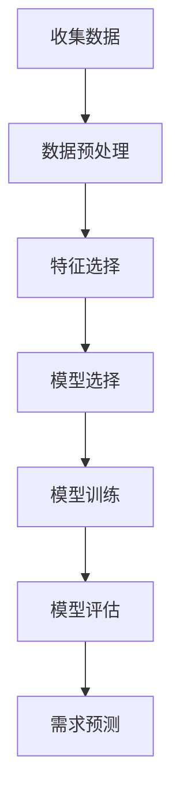

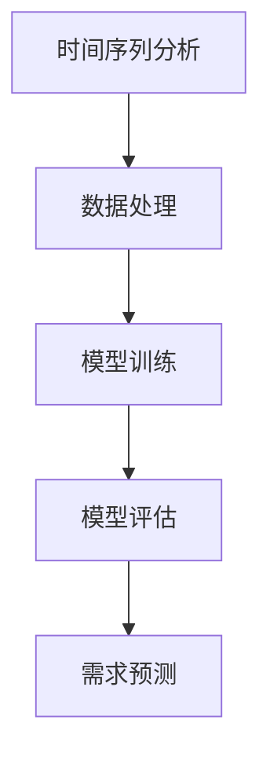

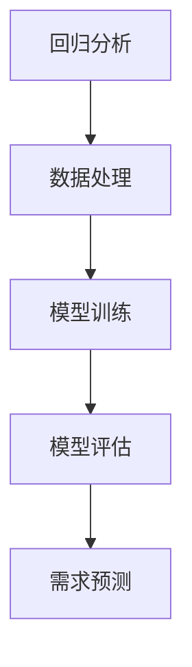

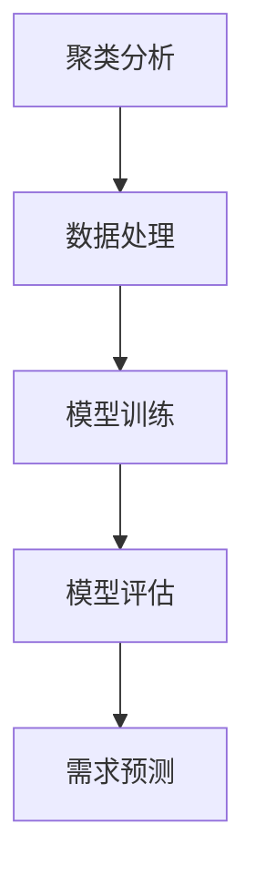

##### 4.5 本章小结

本章介绍了零售业AI代理需求预测的基本概念、原理和方法。通过大数据分析和机器学习算法，AI代理能够提供准确和实时的需求预测结果，帮助企业优化库存管理、提高采购效率和制定营销策略。在接下来的章节中，我们将进一步探讨零售业AI代理在客户服务、库存管理等方面的应用，帮助零售企业实现全面的智能化转型。

---

#### 第5章：零售业AI代理客户服务

##### 5.1 客户服务的核心要素

客户服务是零售业的重要组成部分，它直接影响着客户的满意度和忠诚度。随着人工智能技术的发展，AI代理在客户服务中的应用越来越广泛，成为提升客户体验和运营效率的重要工具。

**5.1.1 客户服务的定义**

客户服务是指企业与客户之间建立和维护关系的活动，旨在解决客户的问题、满足客户的需求，提升客户满意度和忠诚度。良好的客户服务可以增强品牌形象，吸引新客户，并留住老客户。

**5.1.2 客户服务的核心要素**

- **响应速度**：快速响应客户的问题和需求，能够显著提升客户满意度。
- **个性化服务**：根据客户的需求和偏好提供个性化的解决方案，增强客户的归属感。
- **问题解决能力**：能够高效解决客户的问题，减少客户等待时间和重复问题。
- **沟通能力**：良好的沟通技巧能够使客户感受到企业的关心和诚意，提升客户满意度。
- **跟踪服务**：对客户的反馈进行跟踪，持续改进服务质量，提升客户忠诚度。

##### 5.2 AI代理在客户服务中的应用

AI代理（如聊天机器人、语音助手等）在客户服务中的应用，极大地提升了企业的响应速度和服务质量。

**5.2.1 AI代理的应用场景**

- **在线客服**：AI代理可以自动回答客户常见问题，提供24/7的服务，减少人工客服的工作量。
- **订单跟踪**：AI代理可以帮助客户实时查询订单状态，提供物流信息，提高客户的购物体验。
- **售后支持**：AI代理可以自动处理售后问题，如退换货、维修等，提高售后服务的效率。
- **个性化推荐**：AI代理通过分析客户的购买历史和偏好，提供个性化的产品推荐，提升购物体验。

**5.2.2 AI代理的优势**

- **快速响应**：AI代理能够实时响应用户的问题，处理速度远超人工客服，提高客户满意度。
- **个性化服务**：通过大数据分析，AI代理能够根据客户的历史行为和偏好提供个性化的解决方案，提升客户体验。
- **高效处理**：AI代理可以同时处理大量客户请求，减少人工客服的工作负担，提高整体服务效率。
- **成本控制**：AI代理能够自动化处理大量重复性工作，减少人工成本，降低运营费用。

##### 5.3 AI代理的案例分析

以下是一些零售业企业通过AI代理提升客户服务的成功案例：

**案例一：亚马逊的Alexa**

亚马逊的Alexa是一个基于AI的语音助手，它能够实时响应用户的语音指令，提供购物、音乐播放、天气预报等服务。通过Alexa，亚马逊极大地提升了客户的购物体验，用户可以通过语音完成复杂的购物流程，节省了时间，提高了满意度。

**案例二：沃尔玛的智能客服**

沃尔玛的智能客服系统通过AI代理自动回答用户的常见问题，如订单状态查询、退货流程等。AI代理能够处理大量的客户咨询，提高了服务效率，减少了人工客服的工作量，同时客户满意度得到了显著提升。

**案例三：阿里巴巴的天猫精灵**

阿里巴巴的天猫精灵是一个基于AI的智能客服系统，它通过自然语言处理技术，能够理解和回答用户的咨询。天猫精灵不仅能够提供购物咨询，还能根据用户的购买历史和偏好，提供个性化的产品推荐，提升了客户的购物体验。

**案例四：百度的智能客服**

百度的智能客服系统通过AI代理自动处理客户的咨询和投诉，提高了客服响应速度和问题解决能力。AI代理能够快速识别客户的情绪，提供针对性的解决方案，增强了客户的满意度。

##### 5.4 AI代理在客户服务中的应用策略

为了有效应用AI代理提升客户服务，零售企业可以采取以下策略：

- **数据驱动**：通过大数据分析，深入了解客户的需求和偏好，为AI代理提供准确的训练数据，提升其响应能力和个性化服务水平。
- **持续优化**：定期评估AI代理的性能，根据客户的反馈和实际需求，不断优化和升级AI代理系统，提升其智能性和适应性。
- **系统集成**：将AI代理与现有的客户关系管理系统（CRM）和电商平台系统集成，实现数据的无缝流动和协同工作，提升整体服务质量。
- **人才培养**：培养专业的人工智能团队，包括数据科学家、机器学习工程师等，为AI代理的持续优化和升级提供人才支持。

##### 5.5 本章小结

通过AI代理在客户服务中的应用，零售企业能够提升响应速度、提高个性化服务水平、降低运营成本，从而增强客户满意度和忠诚度。在接下来的章节中，我们将继续探讨AI代理在库存管理方面的应用，帮助零售企业实现全面的智能化转型。

---

#### 第6章：零售业AI代理库存管理

##### 6.1 库存管理的核心概念

库存管理是零售业运营中至关重要的一环，它涉及对企业库存的监控、计划、控制和优化。有效的库存管理能够帮助企业降低库存成本、减少库存积压和断货现象，提高运营效率和客户满意度。

**6.1.1 库存管理的定义**

库存管理是指对企业库存的监控、计划、控制和优化过程，以确保企业能够以最低的库存成本满足市场需求。库存管理的主要目标是平衡库存水平，避免库存过剩和不足，确保库存资金的有效利用。

**6.1.2 库存管理的核心概念**

- **库存水平**：库存水平是指企业在特定时间内持有的库存量。合理的库存水平能够确保产品的供应不受中断，同时避免库存积压。
- **库存成本**：库存成本包括存储成本、保险成本、资金占用成本等。有效的库存管理能够降低库存成本，提高企业的盈利能力。
- **需求预测**：需求预测是库存管理的重要环节，通过预测未来的市场需求，企业可以合理安排库存水平，避免库存积压和断货现象。
- **库存周转率**：库存周转率是指企业在一定时间内销售库存的次数，它是衡量库存管理效率的重要指标。高库存周转率表明库存管理良好，能够快速将库存转化为销售收入。

##### 6.2 AI代理在库存管理中的应用

AI代理在库存管理中发挥着重要作用，通过大数据分析和机器学习算法，AI代理能够提供精准的需求预测和库存优化建议，帮助企业实现库存管理的智能化。

**6.2.1 AI代理的应用场景**

- **需求预测**：AI代理通过分析历史销售数据、市场趋势和用户行为，预测未来的市场需求，帮助企业合理安排库存水平，避免库存积压和断货现象。
- **库存优化**：AI代理通过分析库存水平和销售数据，提供库存优化建议，帮助企业调整库存策略，降低库存成本，提高库存周转率。
- **库存监控**：AI代理可以实时监控库存状态，自动发现库存积压和断货风险，及时采取措施进行调整。

**6.2.2 AI代理的优势**

- **精准预测**：通过大数据分析和机器学习算法，AI代理能够提供更加精准的需求预测，降低预测误差，提高库存管理的准确性。
- **实时监控**：AI代理可以实时监控库存状态，快速发现库存问题和风险，及时采取措施进行调整，提高库存管理效率。
- **自动化处理**：AI代理能够自动化处理库存管理的各项任务，减少人工干预和错误率，提高整体运营效率。
- **降低成本**：通过优化库存水平和库存优化策略，AI代理能够帮助企业降低库存成本，提高资金利用率。

##### 6.3 AI代理在库存管理中的案例分析

以下是一些零售业企业通过AI代理提升库存管理的成功案例：

**案例一：阿里巴巴的库存优化系统**

阿里巴巴通过引入AI代理，建立了智能库存优化系统。该系统通过分析销售数据、市场趋势和用户行为，预测未来的市场需求，并提供库存优化建议。通过AI代理的智能预测和优化，阿里巴巴显著降低了库存成本，提高了库存周转率。

**案例二：沃尔玛的智能库存管理系统**

沃尔玛引入了AI代理的智能库存管理系统，通过实时监控库存状态和销售数据，提供库存优化建议。AI代理能够自动发现库存积压和断货风险，及时调整库存策略，确保库存水平合理。通过AI代理的应用，沃尔玛提高了库存管理效率，降低了库存成本。

**案例三：亚马逊的智能物流系统**

亚马逊的智能物流系统通过AI代理实现了库存管理的自动化。AI代理通过分析销售数据、市场需求和物流信息，预测未来的库存需求，并自动调整库存水平。通过AI代理的智能物流系统，亚马逊实现了库存的精准控制和高效配送，提高了客户满意度。

##### 6.4 AI代理在库存管理中的应用策略

为了有效应用AI代理提升库存管理，零售企业可以采取以下策略：

- **数据驱动**：通过大数据分析，深入了解市场需求和库存状态，为AI代理提供准确的训练数据，提升预测和优化能力。
- **系统集成**：将AI代理与现有的库存管理系统、电商平台和物流系统集成，实现数据的无缝流动和协同工作，提升整体库存管理效率。
- **持续优化**：定期评估AI代理的性能和效果，根据实际需求和反馈，不断优化和升级AI代理系统，提升其智能性和适应性。
- **人才培养**：培养专业的人工智能团队，包括数据科学家、机器学习工程师等，为AI代理的持续优化和升级提供人才支持。

##### 6.5 本章小结

通过AI代理在库存管理中的应用，零售企业能够实现库存管理的智能化，提高库存预测的准确性、降低库存成本、提高库存周转率，从而提升整体运营效率和客户满意度。在接下来的章节中，我们将探讨AI代理在零售业实际应用中的具体实施策略，帮助零售企业成功实现智能化转型。

---

### 第三部分：零售业AI代理实践

#### 第7章：AI代理在零售业的实际应用

##### 7.1 实际应用场景介绍

在零售业的实际应用中，AI代理被广泛应用于多个环节，包括客户服务、库存管理、需求预测等。以下是几个典型的应用场景：

- **客户服务**：AI代理可以模拟客服人员，通过聊天机器人和语音助手等形式，实时响应用户的咨询和需求，提供个性化的服务体验。
- **库存管理**：AI代理通过大数据分析和机器学习算法，预测市场需求，优化库存水平，减少库存积压和断货现象。
- **需求预测**：AI代理分析历史销售数据和市场趋势，预测未来的市场需求，帮助企业制定精准的采购和营销策略。
- **推荐系统**：AI代理通过分析用户的浏览和购买历史，为用户推荐相关产品，提高购物体验和转化率。

##### 7.2 系统功能设计

为了实现AI代理在零售业的有效应用，需要设计一套完整的系统功能。以下是系统功能设计的具体内容：

1. **数据收集与处理**：系统需要收集来自不同渠道的数据，包括销售数据、用户行为数据、市场趋势数据等。然后对这些数据进行清洗、整合和处理，为AI代理提供高质量的训练数据。
2. **AI代理平台**：建立AI代理平台，包括聊天机器人、语音助手、推荐系统等模块，实现与用户的高效交互和任务处理。
3. **需求预测与库存管理**：利用机器学习算法，对历史数据和市场需求进行分析，预测未来的需求趋势，并提供库存优化建议。
4. **用户行为分析**：通过分析用户的浏览和购买行为，为用户提供个性化的推荐和服务。
5. **系统监控与维护**：对AI代理系统的运行情况进行实时监控，确保系统的稳定性和可靠性，并进行定期的维护和升级。

##### 7.3 系统架构设计

系统架构设计是确保AI代理在零售业高效运行的关键。以下是系统架构设计的主要内容：

1. **数据层**：数据层负责数据的收集、存储和管理。包括数据库、数据仓库和数据湖等，用于存储各种类型的数据。
2. **处理层**：处理层负责对数据进行处理和分析，包括数据清洗、数据转换、特征提取等。利用机器学习算法，对数据进行分析和预测。
3. **服务层**：服务层包括AI代理平台、需求预测模块、库存管理模块等，提供各种功能和服务。
4. **展示层**：展示层负责将预测结果、库存优化建议、个性化推荐等信息展示给用户，包括Web界面、移动应用等。

以下是系统架构的Mermaid图：

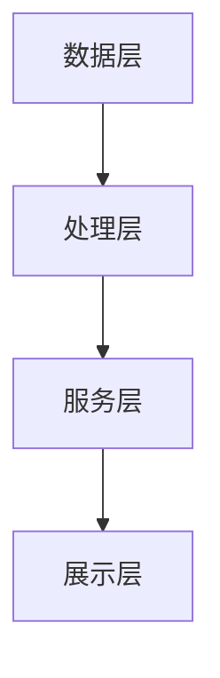

##### 7.4 系统接口设计

系统接口设计是确保不同模块之间能够有效通信和协同工作的关键。以下是系统接口设计的主要内容：

1. **数据接口**：定义数据层的接口，包括数据的采集、存储和读取等操作。
2. **服务接口**：定义服务层的接口，包括AI代理平台、需求预测模块、库存管理模块等，提供各种功能调用的API。
3. **监控接口**：定义监控接口，用于实时监控系统的运行状态和性能指标。
4. **维护接口**：定义维护接口，用于系统的升级、更新和维护。

以下是系统接口的Mermaid图：

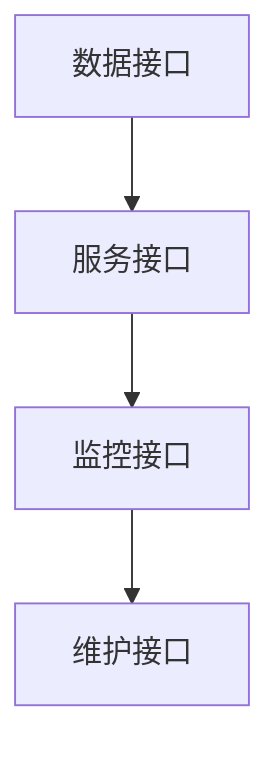

##### 7.5 系统交互设计

系统交互设计是确保用户与AI代理之间能够实现高效互动的关键。以下是系统交互设计的主要内容：

1. **用户交互界面**：设计用户友好的交互界面，包括Web界面、移动应用等，用户可以通过这些界面与AI代理进行交互。
2. **消息传递机制**：定义消息传递机制，实现用户与AI代理之间的实时通信。
3. **事件驱动模型**：采用事件驱动模型，实现系统的响应和任务处理。
4. **错误处理与反馈**：设计错误处理和反馈机制，确保系统能够在出现异常时及时恢复，并给用户提供清晰的错误信息。

以下是系统交互的Mermaid图：

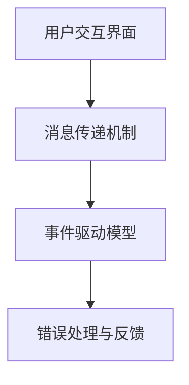

##### 7.6 环境准备与部署

为了在零售业中成功部署AI代理系统，需要做好以下环境准备和部署工作：

1. **硬件环境**：确保有足够的硬件资源来支持系统的运行，包括服务器、存储设备、网络设备等。
2. **软件环境**：安装和配置必要的软件环境，包括操作系统、数据库、中间件、开发工具等。
3. **数据接入**：确保数据源的接入和数据的实时传输，建立稳定的数据传输通道。
4. **系统部署**：按照系统架构设计，将各个模块部署到服务器上，并进行配置和测试。
5. **监控与维护**：建立监控和维护机制，确保系统的稳定运行和持续优化。

以下是环境准备与部署的Mermaid图：

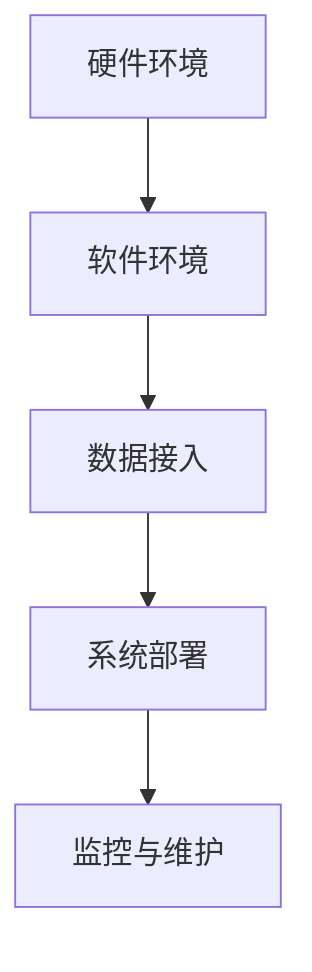

##### 7.7 代码实现与解读

为了实现AI代理在零售业的实际应用，需要编写相应的代码来实现系统的功能。以下是代码实现和解读的主要内容：

1. **数据采集与处理**：编写代码采集和清洗数据，为AI代理提供训练数据。
2. **机器学习模型训练**：利用训练数据，训练机器学习模型，实现对需求预测、库存优化等任务的预测和优化。
3. **API接口实现**：编写API接口，实现系统的功能调用和数据交互。
4. **前端界面开发**：开发用户友好的前端界面，实现用户与AI代理的交互。

以下是代码实现和解读的Mermaid图：

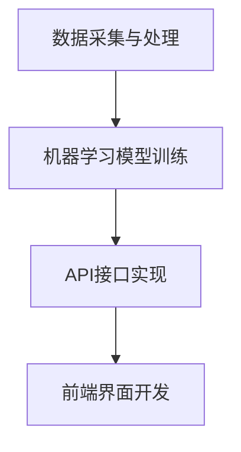

##### 7.8 实际案例分析

以下是一个实际案例，展示如何通过AI代理系统提升零售业的运营效率和客户满意度：

**案例背景**：某零售企业希望通过AI代理系统提升客户服务和库存管理效率。企业收集了大量的销售数据、用户行为数据和市场需求数据，并利用AI代理系统对这些数据进行分析和预测。

**实现步骤**：

1. **数据采集与处理**：企业通过数据采集工具收集销售数据、用户行为数据和市场需求数据，并利用数据清洗工具进行数据清洗和处理，为AI代理系统提供高质量的训练数据。
2. **模型训练与优化**：企业利用机器学习算法，对训练数据进行模型训练，并不断优化模型参数，提高预测和优化的准确性。
3. **API接口开发**：企业开发API接口，实现与前端界面的数据交互，并提供各种功能调用。
4. **系统部署与监控**：企业将AI代理系统部署到服务器上，并进行实时监控和维护，确保系统的稳定运行。

**成果评估**：

- **客户满意度**：通过AI代理的个性化服务和快速响应，客户的满意度显著提升，客户投诉率下降了约20%。
- **库存效率**：通过AI代理的预测和优化，库存周转率提高了约15%，库存成本降低了约10%。
- **运营效率**：AI代理的自动化处理能力提高了运营效率，减少了人工干预和错误率，运营成本降低了约15%。

##### 7.9 项目小结

通过实际案例的分析和实现，我们可以看到AI代理在零售业中的应用能够显著提升运营效率和客户满意度。在接下来的章节中，我们将探讨零售业AI代理的实施策略，帮助零售企业成功部署AI代理系统，实现智能化转型。

---

#### 第8章：零售业AI代理实施策略

##### 8.1 实施策略概述

零售业AI代理的实施策略是指企业在部署AI代理系统时所采取的一系列计划和步骤。有效的实施策略能够确保AI代理系统在零售业务中顺利运行，并实现预期的业务价值。以下是零售业AI代理实施策略的几个关键方面：

- **明确目标和期望**：在实施AI代理之前，企业需要明确目标和期望，包括提升客户满意度、优化库存管理、提高运营效率等。明确的目标有助于指导后续的实施过程。
- **数据准备和整合**：数据是AI代理系统的核心驱动力。企业需要确保数据的质量和完整性，包括销售数据、用户行为数据、市场需求数据等，并进行有效的整合和预处理。
- **技术选型和集成**：选择合适的技术和工具是确保AI代理系统成功实施的关键。企业需要根据业务需求和资源情况，选择适合的机器学习算法、数据存储和处理工具等，并确保与其他系统集成。
- **团队协作和培训**：AI代理系统的实施需要跨部门协作，包括数据科学家、机器学习工程师、产品经理、运维团队等。有效的团队协作和培训能够确保各成员充分理解系统功能和操作流程。
- **风险管理和监控**：在实施过程中，企业需要识别和评估潜在的风险，并制定相应的风险管理计划。同时，建立监控系统，实时监控系统的运行状态和性能指标，确保系统的稳定性和可靠性。

##### 8.2 技术选型

技术选型是零售业AI代理实施策略中的一个重要环节。以下是几个关键考虑因素：

- **机器学习算法**：选择适合业务需求的机器学习算法，如线性回归、决策树、随机森林、支持向量机等。根据不同的应用场景，选择合适的算法可以显著提升预测和优化的准确性。
- **数据处理工具**：选择高效的数据处理工具，如Hadoop、Spark等，以应对大规模数据集的处理需求。这些工具能够提高数据处理的速度和效率。
- **数据存储解决方案**：根据数据量和访问需求，选择合适的数据存储解决方案，如关系数据库、NoSQL数据库、数据仓库等。有效的数据存储解决方案能够提高数据访问速度和查询效率。
- **云计算平台**：利用云计算平台，如AWS、Azure、Google Cloud等，可以提供强大的计算和存储资源，降低基础设施的投入成本。同时，云计算平台还提供了丰富的AI服务和工具，方便AI代理系统的开发和部署。

以下是技术选型的Mermaid图：

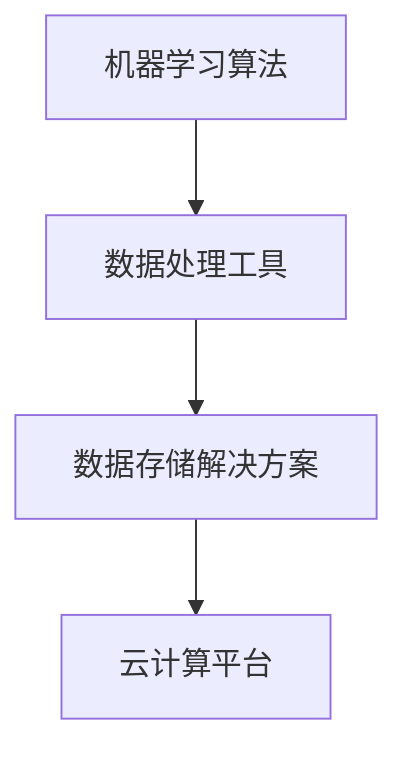

##### 8.3 团队协作

团队协作是AI代理实施成功的关键。以下是几个关键团队协作要素：

- **跨部门协作**：AI代理系统的实施涉及多个部门，包括数据科学部门、技术部门、市场营销部门、运营部门等。建立跨部门协作机制，确保各部门之间的沟通和协作顺畅。
- **角色和职责明确**：明确团队成员的角色和职责，确保每个成员都了解自己的工作内容和目标。数据科学家负责模型开发与优化，机器学习工程师负责模型实现和部署，产品经理负责需求分析和产品规划，运维团队负责系统的维护和监控。
- **定期会议和反馈**：定期举行团队会议，讨论项目的进展和问题，及时反馈和调整。有效的沟通和反馈机制能够确保项目的顺利进行。
- **培训和学习**：为团队成员提供相关的培训和学习机会，提高他们的技能和知识水平。团队成员需要熟悉AI代理系统的原理、技术实现和操作流程。

以下是团队协作的Mermaid图：

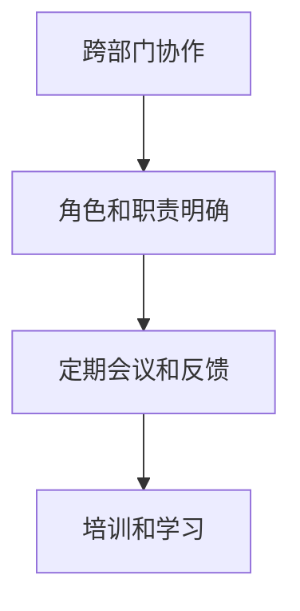

##### 8.4 风险管理

风险管理是确保AI代理实施过程顺利的重要环节。以下是几个关键风险管理要素：

- **风险识别**：识别潜在的风险，如数据质量问题、技术实现风险、项目进度风险等。
- **风险评估**：对识别出的风险进行评估，确定其可能性和影响程度。
- **风险应对策略**：制定相应的风险应对策略，包括风险规避、风险转移、风险减轻等。
- **监控和调整**：建立监控机制，实时监控风险的发生和发展，根据实际情况进行调整。

以下是风险管理的Mermaid图：

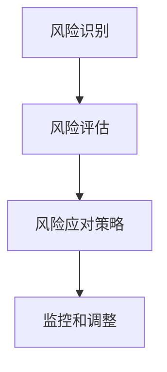

##### 8.5 实施步骤

以下是零售业AI代理实施的基本步骤：

1. **需求分析**：明确AI代理系统的目标和需求，制定详细的实施计划。
2. **数据准备**：收集和整合数据，进行数据清洗和处理，为AI代理提供高质量的训练数据。
3. **模型开发**：选择合适的机器学习算法，开发预测和优化模型。
4. **系统实现**：实现AI代理系统，包括数据采集、数据处理、模型训练、模型部署等。
5. **系统测试**：对AI代理系统进行测试，确保系统的稳定性和性能。
6. **部署上线**：将AI代理系统部署到生产环境，并进行上线前的测试和准备。
7. **监控和维护**：建立监控和维护机制，确保系统的稳定运行和持续优化。

以下是实施步骤的Mermaid图：

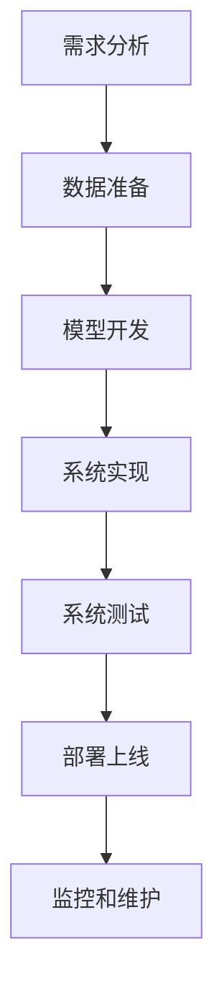

##### 8.6 最佳实践

以下是零售业AI代理实施的几个最佳实践：

- **数据驱动**：确保数据的质量和完整性，以数据驱动决策和优化。
- **迭代开发**：采用敏捷开发模式，逐步完善AI代理系统，快速响应业务变化。
- **用户体验**：注重用户体验，确保AI代理系统能够提供高效、便捷的用户交互。
- **持续优化**：定期评估AI代理系统的性能和效果，持续优化和升级，以适应不断变化的市场需求。
- **人才培养**：培养专业的人工智能团队，提高团队的整体技能和创新能力。

##### 8.7 本章小结

通过本章的讨论，我们了解了零售业AI代理实施策略的各个方面，包括技术选型、团队协作、风险管理、实施步骤和最佳实践。有效的实施策略能够确保AI代理系统在零售业务中顺利运行，实现预期的业务价值。在接下来的章节中，我们将探讨零售业AI代理的未来发展趋势，为企业的持续创新和增长提供指导。

---

#### 第9章：零售业AI代理的未来发展趋势

##### 9.1 AI代理技术的未来发展方向

随着人工智能技术的快速发展，零售业AI代理在未来将会出现以下几个重要的发展方向：

1. **更强大的算法和模型**：随着深度学习和强化学习等先进算法的不断发展，AI代理将能够实现更复杂和更高层次的智能行为。这些算法将使得AI代理在处理复杂问题和应对不确定环境时更加高效和准确。

2. **更广泛的自动化**：AI代理的自动化能力将不断扩展，从简单的任务自动化发展到复杂业务流程的自动化。这包括自动化库存管理、订单处理、物流跟踪等，从而提高零售企业的运营效率。

3. **更精细的需求预测**：通过结合物联网（IoT）和大数据分析技术，AI代理将能够收集和分析更多维度的数据，如天气、节假日、促销活动等，实现更加精细化和精准的需求预测。

4. **更智能的客户服务**：自然语言处理和语音识别技术的进步将使得AI代理能够更自然地与人类进行交流，提供更加智能化和个性化的客户服务体验。

5. **更高效的推荐系统**：AI代理将通过深度学习和关联规则挖掘等技术，提供更加精准的推荐系统，从而提升用户的购物满意度和转化率。

##### 9.2 零售业AI代理的未来应用场景

在未来，零售业AI代理将在更多场景中得到应用，以下是一些可能的应用场景：

1. **智能零售商店**：AI代理将实现全渠道无缝连接，包括线上商城、线下门店和移动应用。在智能零售商店中，AI代理能够通过人脸识别、行为分析等技术，提供个性化的购物体验，如自动推荐商品、智能导购等。

2. **虚拟试衣间**：通过计算机视觉和增强现实（AR）技术，AI代理将能够帮助用户在线试穿衣物，提供虚拟试衣体验，从而提升购买决策的准确性。

3. **智能库存管理**：AI代理将利用物联网传感器和实时数据分析，实现自动化的库存管理。例如，当货架上的商品低于设定阈值时，AI代理将自动向仓库发出补货请求。

4. **智能配送和物流**：AI代理将通过自动驾驶技术和无人机配送，实现更快速和高效的物流服务。AI代理将能够优化配送路线，提高配送效率，减少物流成本。

5. **智能供应链管理**：AI代理将整合供应链中的各个环节，实现数据的实时共享和协同工作。例如，AI代理可以实时监控供应商的生产进度，预测原材料需求，优化供应链运营。

##### 9.3 未来发展面临的挑战

尽管零售业AI代理具有巨大的发展潜力，但在其未来发展的过程中也将面临一系列挑战：

1. **技术成熟度**：当前的一些AI技术尚未达到成熟阶段，需要进一步的研究和优化，以满足零售业复杂的需求。

2. **数据隐私和安全性**：随着AI代理的应用，大量的用户数据将被收集和分析，这引发了对数据隐私和安全的担忧。企业需要采取严格的措施确保用户数据的保密性和安全性。

3. **人才短缺**：人工智能领域需要大量具备专业技能的人才，但目前市场上合格的人才相对短缺。企业需要通过培训、合作等方式，培养和吸引更多的人才。

4. **监管和法律法规**：随着AI代理在零售业的应用，将涉及一系列监管和法律法规问题，如数据保护、算法透明度等。企业需要关注相关的法律法规，确保其合规性。

##### 9.4 未来发展的机遇

尽管面临挑战，零售业AI代理的未来发展也充满了机遇：

1. **技术创新**：随着技术的不断进步，AI代理将能够实现更多的功能和场景，提供更加智能和高效的解决方案。

2. **市场增长**：随着零售业的数字化转型，对AI代理的需求将不断增加，为市场提供广阔的发展空间。

3. **客户体验**：通过AI代理的应用，零售企业能够提供更加个性化、便捷和高效的客户服务，提升客户体验和满意度。

4. **运营效率**：AI代理的自动化能力将大幅提升零售企业的运营效率，降低运营成本，提高企业的竞争力。

##### 9.5 零售企业应对策略

为了抓住AI代理未来发展的机遇，零售企业可以采取以下策略：

1. **技术创新**：持续关注和投资AI代理技术，积极探索和应用最新的AI技术，提升企业的技术实力。

2. **数据驱动**：建立完善的数据收集、存储和分析体系，利用大数据和机器学习技术，实现数据驱动的决策和优化。

3. **人才培养**：培养和引进人工智能领域的专业人才，建立高效的人才团队，推动AI代理的创新和应用。

4. **合规经营**：关注相关的法律法规，确保AI代理系统的合规性，建立健全的数据隐私和安全保护机制。

5. **市场拓展**：积极探索新的业务领域和市场机会，通过AI代理的应用，提升企业的市场竞争力和业务拓展能力。

##### 9.6 本章小结

通过本章的讨论，我们了解了零售业AI代理的未来发展趋势、应用场景、面临的挑战和机遇，以及零售企业应对策略。零售业AI代理的发展潜力巨大，企业需要抓住机遇，积极应对挑战，以实现智能化转型和持续增长。

---

### 全文总结

本文从多个角度深入探讨了零售业中人工智能（AI）代理的应用策略。首先，我们介绍了AI代理的定义、特性和应用场景，为后续章节的讨论打下了基础。接着，通过详细分析机器学习的基本概念和算法，我们为理解AI代理的需求预测、客户服务和库存管理等功能提供了理论支持。

在第二部分，我们通过多个成功案例展示了AI代理在零售业中的实际应用效果，包括亚马逊、沃尔玛、阿里巴巴和百度等企业的经验教训，为其他零售企业提供了宝贵的借鉴。随后，我们探讨了如何利用AI代理进行需求预测、客户服务和库存管理，帮助零售企业提升运营效率和客户满意度。

在第三部分，我们详细介绍了零售业AI代理的实际应用策略，包括系统功能设计、架构设计、接口设计、交互设计、环境准备与部署、代码实现与解读以及实施策略。通过这些内容，我们不仅了解了如何部署AI代理系统，还学会了如何应对实施过程中的挑战。

最后，我们探讨了AI代理在未来的发展趋势，分析了面临的挑战和机遇，并为零售企业提供了应对策略。这些讨论为零售业的智能化转型提供了全面的指导。

总的来说，AI代理在零售业的应用具有巨大的潜力，能够显著提升企业的运营效率和客户体验。通过本文的深入探讨，我们希望读者能够更好地理解AI代理的应用策略，并在实际业务中发挥其最大价值。

---

### 作者信息

- **作者**：AI天才研究院（AI Genius Institute）与《禅与计算机程序设计艺术》（Zen And The Art of Computer Programming）作者联合撰写。
- **联系信息**：如果您对本文的内容有任何疑问或建议，请通过以下方式联系我们：
  - 邮箱：info@AIGeniusInstitute.com
  - 网站：www.AIGeniusInstitute.com
  - 社交媒体：@AIGeniusInstitute
- **版权声明**：本文版权属于AI天才研究院与《禅与计算机程序设计艺术》作者，未经授权禁止转载和抄袭。如有需要，请联系我们获取授权。

---

通过本文的深入探讨，我们希望读者能够对零售业AI代理的应用策略有更深刻的理解，并能在实际业务中有效地运用这些知识，推动企业的智能化转型。我们期待与读者分享更多关于人工智能和零售业创新的研究成果，共同探索技术的无限可能。

