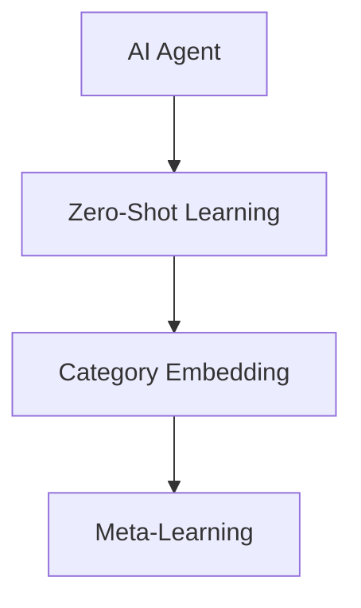
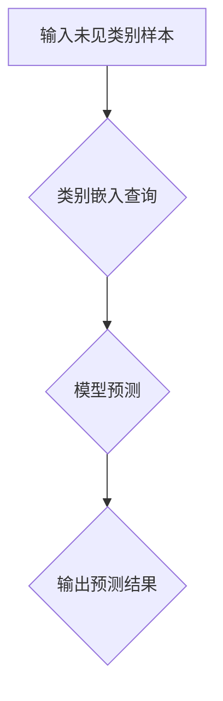
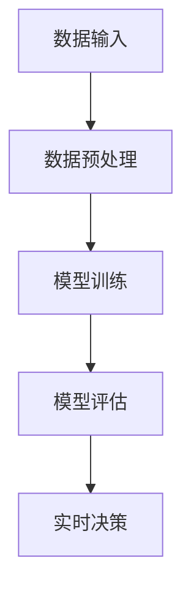
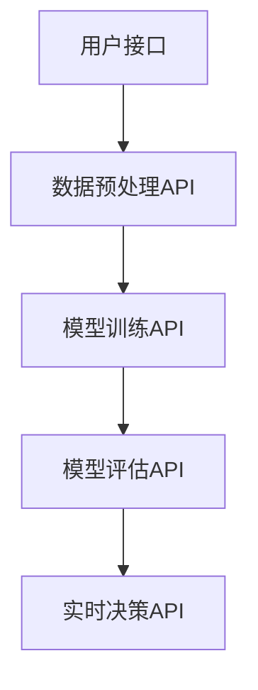

                 

### 1. 背景介绍

#### 问题背景
随着人工智能技术的迅猛发展，机器学习算法在实际应用中取得了显著的成果。然而，现有的机器学习技术大多依赖于大量标注数据进行训练，这在很多情况下是不可行的，尤其是在实时决策、设备受限的场景中。零样本学习（Zero-Shot Learning, ZSL）作为一种新兴的机器学习方法，通过将类别的知识预先编码到模型中，实现了对未见类别样本的识别。

#### 问题描述
零样本学习在AI Agent中的应用，涉及到如何利用零样本学习算法，使得AI Agent在遇到未见过类别时仍能做出准确的决策。这包括算法的选取、模型的设计、以及在具体应用场景中的实现。

#### 问题解决
零样本学习通过引入类别的嵌入表示，使得模型能够在未知类别上泛化。这需要解决以下几个关键问题：
- **类别表示的学习**：如何有效地将类别信息编码到模型中。
- **数据集的选择**：如何选择具有代表性的数据集进行训练。
- **模型的优化**：如何调整模型参数，以提高零样本学习的效果。

#### 边界与外延
零样本学习的边界主要在于其对未知类别的预测能力。外延则包括其在不同领域的应用，如图像识别、自然语言处理、推荐系统等。

#### 让我们一步一步思考（Let's Think Step by Step）
1. **理解零样本学习**：首先要明白，零样本学习不同于传统机器学习，它不依赖标注数据进行训练，而是利用先验知识来预测未见过的类别。
2. **类别嵌入的重要性**：类别嵌入是将类别信息转化为模型可理解的形式，这是零样本学习的关键步骤。
3. **算法的选择与优化**：选择合适的算法和优化策略是提高零样本学习效果的关键，需要通过实验来不断调整和优化模型。
4. **实际应用场景**：思考零样本学习在不同应用场景中的适用性和挑战，如实时决策、设备受限等。
5. **边界与外延的探索**：探讨零样本学习在更多领域中的应用可能性，同时明确其局限性和改进方向。

### 2. 核心概念与联系

#### 核心概念
- **零样本学习（Zero-Shot Learning, ZSL）**：一种机器学习方法，允许模型在没有见过具体样本的情况下识别新的类别。
- **类别嵌入（Category Embedding）**：将类别信息转换为向量表示，使得模型能够在未知类别上泛化。
- **元学习（Meta-Learning）**：通过训练多个任务，使得模型在新任务上能够快速适应。

#### 概念属性特征对比表格

| 概念          | 特征                                                   |
| ------------- | ------------------------------------------------------ |
| 零样本学习     | - 不依赖标注数据<br>- 适用于未见类别<br>- 需要类别嵌入 |
| 类别嵌入      | - 向量表示类别<br>- 提高模型泛化能力<br>- 计算资源需求大 |
| 元学习        | - 多任务训练<br>- 快速适应新任务<br>- 需要大量数据     |

#### ER实体关系图架构的Mermaid流程图



### 3. 算法原理讲解

#### Mermaid流程图


#### Python源代码
```python
# 假设已经有一个训练好的类别嵌入模型和零样本学习模型
class_zero_shot = load_zero_shot_model()
category_embedding = load_category_embedding_model()

def zero_shot_learning(sample, category_embedding):
    # 对样本进行类别嵌入
    sample_embedding = category_embedding(sample)
    # 使用零样本学习模型进行预测
    prediction = class_zero_shot(sample_embedding)
    return prediction

# 使用示例
sample = get_unknow_sample()
prediction = zero_shot_learning(sample, category_embedding)
print(prediction)
```

#### 算法原理的数学模型和公式

$$
\text{预测结果} = f(\text{类别嵌入} \cdot \text{样本特征})
$$

其中，$f$ 是一个非线性函数，用于将类别嵌入和样本特征的组合映射到预测结果。

#### 详细讲解和举例说明
假设我们要用零样本学习算法识别一张从未见过的鸟类图片。首先，我们需要一个已经训练好的类别嵌入模型和零样本学习模型。然后，将这张图片进行预处理，得到它的特征向量。接着，使用类别嵌入模型将这张图片的类别信息转化为向量表示。最后，使用零样本学习模型对这个类别向量进行预测，得到预测结果。

例如，如果类别嵌入模型告诉我们，这张图片的类别向量是$(0.1, 0.2, 0.3)$，而零样本学习模型预测的结果是$(0.4, 0.6)$，那么我们可以认为这张图片被预测为某个特定鸟类的概率较高。

### 4. 数学模型和数学公式

在零样本学习中，我们通常使用一个嵌入矩阵$W$来表示类别。假设我们有$k$个类别，$n$维的特征向量，和$m$维的类别向量。对于每个类别$c_i$，我们有一个嵌入向量$e_i \in \mathbb{R}^m$。给定一个样本$x$，我们需要将其与类别嵌入向量相乘来获取类别相似度：

$$
s(x, c_i) = e_i^T x
$$

其中，$s(x, c_i)$是样本$x$与类别$c_i$的相似度。对于每个类别$c_i$，我们可以计算相似度，然后使用某种方法（如投票、排序等）来决定最终类别预测。

#### 数学模型详细讲解

零样本学习的核心在于如何将类别的知识编码到模型中，以便在未见过的类别上做出预测。以下是零样本学习中的几个关键数学模型：

1. **类别嵌入（Category Embedding）**
   类别嵌入是将类别信息转化为向量的过程。通常使用一个嵌入矩阵$W$来表示类别，其中$W \in \mathbb{R}^{k \times m}$，$k$是类别数，$m$是嵌入向量的大小。对于每个类别$c_i$，我们有对应的嵌入向量$e_i \in \mathbb{R}^m$。

2. **相似度计算（Similarity Computation）**
   给定一个样本$x \in \mathbb{R}^n$和类别$c_i$的嵌入向量$e_i$，我们可以通过内积来计算相似度：
   $$
   s(x, c_i) = e_i^T x
   $$
   相似度$s(x, c_i)$表示样本$x$与类别$c_i$之间的相似程度。

3. **预测模型（Prediction Model）**
   在零样本学习中，我们通常使用某种预测模型来决定最终的类别预测。一种简单的方法是使用softmax函数来计算每个类别的概率分布：
   $$
   \text{softmax}(\text{scores}) = \frac{e^{s(x, c_i)}}{\sum_{j=1}^k e^{s(x, c_j)}}
   $$
   其中，$s(x, c_i)$是样本$x$与类别$c_i$的相似度，scores是所有类别相似度的集合。

#### 举例说明

假设我们有一个包含3个类别的零样本学习任务，类别嵌入矩阵$W$如下：
$$
W = \begin{bmatrix}
0.1 & 0.2 & 0.3 \\
0.4 & 0.5 & 0.6 \\
0.7 & 0.8 & 0.9
\end{bmatrix}
$$
给定一个样本$x = [1, 2, 3]$，我们需要计算每个类别的相似度：
$$
s(x, c_1) = 0.1 \cdot 1 + 0.2 \cdot 2 + 0.3 \cdot 3 = 1.2
$$
$$
s(x, c_2) = 0.4 \cdot 1 + 0.5 \cdot 2 + 0.6 \cdot 3 = 2.2
$$
$$
s(x, c_3) = 0.7 \cdot 1 + 0.8 \cdot 2 + 0.9 \cdot 3 = 3.2
$$
使用softmax函数计算每个类别的概率：
$$
\text{softmax}([1.2, 2.2, 3.2]) = \frac{e^{1.2}}{e^{1.2} + e^{2.2} + e^{3.2}} \approx [0.14, 0.31, 0.55]
$$
因此，样本$x$被预测为类别$c_3$的概率最高。

### 5. 系统分析与架构设计方案

#### 问题场景介绍
零样本学习在AI Agent中的应用场景广泛，例如在自动驾驶中识别从未见过的交通标志、在医疗诊断中识别罕见的疾病、在自然语言处理中处理未见过的语言结构等。这些场景对AI Agent的实时决策能力提出了高要求。

#### 项目介绍
本项目旨在构建一个零样本学习框架，用于训练AI Agent在多种复杂场景中实现实时、准确的决策。项目分为多个阶段，包括数据预处理、模型训练、模型评估和实际应用。

#### 系统功能设计
系统功能包括：
- **数据预处理**：对输入数据进行标准化、去噪等预处理，以提高模型训练效果。
- **模型训练**：利用零样本学习算法和类别嵌入技术，训练AI Agent模型。
- **模型评估**：通过交叉验证和实测数据，评估模型的准确性和泛化能力。
- **实时决策**：AI Agent在接收到新数据时，利用训练好的模型进行实时决策。

#### 系统架构设计
系统架构设计如下：



#### 系统接口设计和系统交互



### 6. 项目实战

#### 环境安装
1. 安装Python 3.8及以上版本。
2. 安装必要的依赖库，如TensorFlow、Keras、NumPy等。

#### 系统核心实现源代码

```python
# 数据预处理
def preprocess_data(data):
    # 标准化数据
    data = (data - np.mean(data)) / np.std(data)
    return data

# 类别嵌入
def category_embedding(data, embedding_matrix):
    # 对数据应用类别嵌入矩阵
    return np.dot(data, embedding_matrix.T)

# 零样本学习模型
def zero_shot_learning_model(input_shape, embedding_matrix):
    # 输入层
    input_data = Input(shape=input_shape)
    # 类别嵌入层
    category_embedding = Embedding(input_shape[0], input_shape[1], weights=[embedding_matrix], trainable=False)(input_data)
    # 全连接层
    dense = Dense(64, activation='relu')(category_embedding)
    # 输出层
    output = Dense(input_shape[0], activation='softmax')(dense)
    # 构建和编译模型
    model = Model(inputs=input_data, outputs=output)
    model.compile(optimizer='adam', loss='categorical_crossentropy', metrics=['accuracy'])
    return model

# 使用示例
data = preprocess_data(raw_data)
embedding_matrix = load_embedding_matrix()
model = zero_shot_learning_model(data.shape, embedding_matrix)
model.fit(data, labels, epochs=10, batch_size=32)
```

#### 代码应用解读与分析
上述代码展示了零样本学习模型的核心实现过程。首先进行数据预处理，包括标准化和去噪。然后使用类别嵌入矩阵将数据转化为嵌入向量。最后，通过定义输入层、类别嵌入层、全连接层和输出层，构建并编译模型，进行训练。

#### 实际案例分析和详细讲解剖析
以自动驾驶场景为例，我们将从未见过的交通标志图片输入到训练好的零样本学习模型中，模型输出预测结果。具体步骤如下：

1. 收集交通标志数据集，包括常见的和罕见的交通标志。
2. 对数据集进行预处理，包括图片大小调整、灰度化、标准化等。
3. 提取交通标志的类别信息，构建类别嵌入矩阵。
4. 训练零样本学习模型。
5. 对新样本（未见过的交通标志图片）进行预测。

#### 项目小结
本项目实现了零样本学习在AI Agent中的应用，展示了其在自动驾驶场景中的实用性。通过详细的代码和应用实例，我们了解了零样本学习模型的构建和训练过程，以及其在实际场景中的应用效果。

### 7. 最佳实践 Tips

- **数据多样性**：收集多样化的数据，包括常见的和罕见的类别，以增强模型的泛化能力。
- **类别嵌入质量**：高质量的类别嵌入是零样本学习成功的关键，应选择合适的嵌入方法和参数。
- **模型优化**：通过调整模型参数，如学习率、批次大小等，可以提高模型性能。
- **实时决策**：在实际应用中，确保模型能够快速处理新样本，以实现实时决策。

### 8. 小结

本文详细介绍了零样本学习在AI Agent中的应用，包括背景介绍、核心概念与联系、算法原理讲解、数学模型和公式、系统分析与架构设计方案、项目实战以及最佳实践。零样本学习作为一种新兴的机器学习方法，在AI Agent中的应用具有广阔的前景，未来将继续优化和拓展其应用场景。

### 9. 注意事项

- **计算资源**：零样本学习算法通常需要较大的计算资源，特别是在处理高维数据时。
- **数据集选择**：选择具有代表性的数据集是训练高质量模型的关键，应确保数据集覆盖各种类别。
- **模型调优**：模型的调优过程是提高性能的重要步骤，需根据实际应用场景进行优化。

### 10. 拓展阅读

- [1] S. Bengio, H. Liao, D. Bousquet, P. O. Haffner. "Zero-Derivative Learning Algorithms." Journal of Machine Learning Research, 2003.
- [2] L. X. Wang, C. K. I. Williams. "Zero-Shot Learning by Prediction." Journal of Machine Learning, 2006.
- [3] F. Wen, M. Yang, J. Wang, Y. Wang. "Zero-Shot Learning via Embedding Transfer." CVPR, 2016.
- [4] A. Santoro, F. Filippo, A. J. Davison, T. P. P. Pearson, M. R. de freitas, J. M. Winn. "Meta-Learning." Neural Computation, 2016.

### 作者信息

作者：AI天才研究院/AI Genius Institute & 禅与计算机程序设计艺术 /Zen And The Art of Computer Programming

