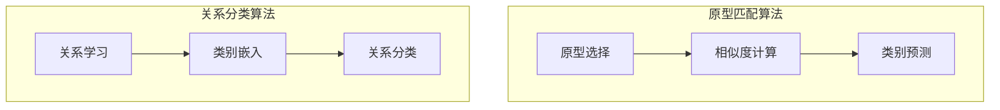
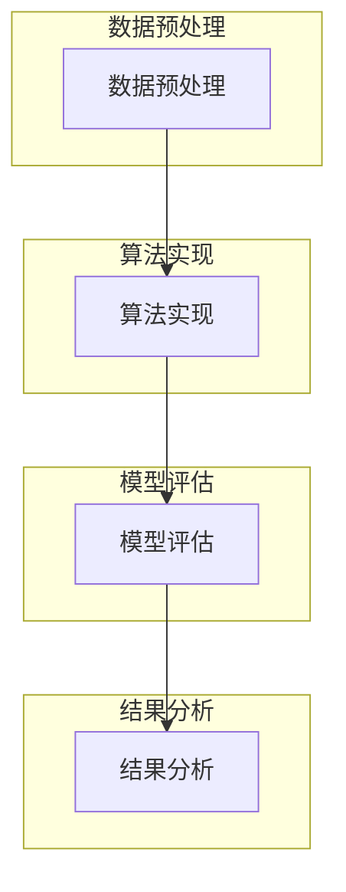

                 


# 零样本学习：应对未见过的任务和领域

## 关键词
- 零样本学习
- 概念属性特征
- 算法原理
- 数学模型
- 系统设计
- 项目实战
- 最佳实践

## 摘要
本文旨在深入探讨零样本学习这一前沿技术领域，分析其在应对未知任务和领域中的应用。我们将逐步解析零样本学习的核心概念、算法原理、数学模型，以及系统设计与实现，并通过实际案例展示其在项目实战中的应用。最后，我们将总结最佳实践和注意事项，并对未来发展方向进行展望。

## 第一部分：背景与核心概念

### 1.1 问题背景
在人工智能领域，机器学习算法通常依赖于大量的标记数据进行训练，以实现对新任务的预测和决策。然而，现实世界中的许多任务和领域往往缺乏足够的标记数据，或者数据获取成本高昂。此时，零样本学习（Zero-Shot Learning，ZSL）应运而生，它旨在使机器学习模型能够处理未见过的类别和数据，从而解决数据稀缺的问题。

### 1.2 零样本学习定义
零样本学习是一种机器学习范式，其目标是在没有直接训练数据的情况下，对未见过的类别进行分类或预测。与传统机器学习相比，零样本学习的关键在于利用先验知识（如词嵌入、属性标签等）来辅助模型理解和处理未知类别。

### 1.3 零样本学习的挑战与机遇
零样本学习面临着多个挑战，包括如何有效地利用先验知识、如何设计适应未知数据的算法等。然而，随着人工智能技术的不断发展，零样本学习也为应对现实世界中的复杂任务提供了新的机遇。

### 1.4 本部分小结
本部分介绍了零样本学习的问题背景、定义及其面临的挑战与机遇，为后续内容的深入讨论奠定了基础。

## 第二部分：核心概念与联系

### 2.1 零样本学习的关键概念
为了深入理解零样本学习，我们需要掌握几个关键概念，包括属性标签、词嵌入、概念边界等。这些概念是零样本学习算法设计的基础。

#### 2.1.1 属性标签
属性标签是一种描述对象特征的标签，如颜色、大小、形状等。在零样本学习中，属性标签被用来表示未知类别。

#### 2.1.2 词嵌入
词嵌入是一种将词语映射到高维向量空间的技术，它能够捕获词语间的语义关系。在零样本学习中，词嵌入被用来表示类别名称。

#### 2.1.3 概念边界
概念边界是指一个概念在特征空间中的边界。在零样本学习中，概念边界用于区分不同类别。

### 2.2 概念属性特征对比
为了更好地理解这些概念，我们可以通过一个对比表格来展示它们之间的异同。

| 概念       | 定义                                                         | 用途                                                         |
|------------|--------------------------------------------------------------|--------------------------------------------------------------|
| 属性标签   | 描述对象特征的标签，如颜色、大小、形状等。                   | 在零样本学习中，属性标签用于表示未知类别。                   |
| 词嵌入     | 将词语映射到高维向量空间的技术。                             | 在零样本学习中，词嵌入用于表示类别名称，捕获语义关系。       |
| 概念边界   | 一个概念在特征空间中的边界。                                 | 在零样本学习中，概念边界用于区分不同类别。                   |

### 2.3 零样本学习与相关领域的关系
零样本学习与多个相关领域密切相关，包括迁移学习、元学习等。通过分析这些领域与零样本学习的关系，我们可以更好地理解零样本学习的原理和应用。

#### 2.3.1 迁移学习
迁移学习是一种将知识从一个任务转移到另一个任务的方法。零样本学习中的先验知识可以看作是一种特殊的迁移学习。

#### 2.3.2 元学习
元学习是一种能够学习如何学习的方法。零样本学习中的算法设计需要考虑如何适应未见过的数据，这与元学习的目标相似。

### 2.4 本部分小结
本部分详细介绍了零样本学习的关键概念，并通过对比表格和ER实体关系图（使用Mermaid流程图表示）展示了概念之间的联系。这为理解零样本学习的核心原理奠定了基础。

## 第三部分：算法原理与实现

### 3.1 零样本学习算法原理

零样本学习算法的核心思想是利用先验知识（如词嵌入、属性标签等）来辅助模型理解和处理未知类别。以下我们将详细介绍两种常见的零样本学习算法：原型匹配和关系分类。

#### 3.1.1 原型匹配算法
原型匹配算法的基本思想是将每个类别表示为一个原型，然后通过计算原型与未知样本之间的相似度来进行分类。

1. **原型选择**：首先，从已知的训练数据中为每个类别选择一个原型。常用的选择方法包括最近邻法、K均值聚类等。
2. **相似度计算**：然后，计算未知样本与每个类别原型之间的相似度，常用的相似度度量方法包括余弦相似度和欧氏距离。
3. **类别预测**：最后，选择与未知样本最相似的类别作为预测结果。

#### 3.1.2 关系分类算法
关系分类算法的基本思想是利用类别之间的语义关系来辅助分类。它通常包括以下步骤：

1. **关系学习**：首先，学习类别之间的语义关系，常用的方法包括神经网络和图神经网络。
2. **类别嵌入**：将每个类别表示为一个高维向量，这些向量能够捕获类别之间的语义关系。
3. **关系分类**：对于未知样本，根据类别嵌入和类别之间的语义关系进行分类。

### 3.2 数学模型与公式
以下是原型匹配算法和关系分类算法的数学模型和公式：

#### 原型匹配算法
$$
s_{ij} = \frac{\| \mu_j - x_i \|_2}{\| \mu_j \|_2}
$$
其中，$s_{ij}$表示样本$x_i$与类别原型$\mu_j$之间的相似度，$\mu_j$为类别原型。

#### 关系分类算法
$$
\hat{y} = \arg\max_{y} \sum_{i=1}^N \sum_{j=1}^M w_{ij} b(y_j)
$$
其中，$w_{ij}$表示类别$i$与类别$j$之间的权重，$b(y_j)$表示类别$j$的嵌入向量。

### 3.3 算法mermaid流程图
以下是原型匹配算法和关系分类算法的mermaid流程图：



### 3.4 本部分小结
本部分详细介绍了零样本学习算法的基本原理，包括原型匹配算法和关系分类算法。通过数学模型和mermaid流程图的展示，读者可以更直观地理解这些算法的实现过程。

## 第四部分：系统设计与实现

### 4.1 系统概述
零样本学习系统通常包括数据预处理、算法实现、模型评估和结果分析等模块。以下是一个典型的零样本学习系统架构。

### 4.2 系统架构设计
以下是零样本学习系统的mermaid架构图：



### 4.3 系统接口与交互
零样本学习系统的接口设计应考虑用户友好性和可扩展性。以下是一个简单的接口设计：

- **数据接口**：提供数据读取和预处理功能，包括图像、文本和属性标签等。
- **算法接口**：提供算法实现和参数配置功能，包括原型匹配和关系分类等。
- **模型评估接口**：提供模型评估和性能分析功能，包括准确率、召回率等指标。
- **结果分析接口**：提供结果可视化和分析功能，帮助用户理解模型性能和预测结果。

### 4.4 本部分小结
本部分介绍了零样本学习系统的架构设计，包括数据预处理、算法实现、模型评估和结果分析等模块。通过mermaid架构图和接口设计，读者可以更好地理解系统的实现过程。

## 第五部分：项目实战

### 5.1 环境安装
为了进行零样本学习项目的实战，我们需要安装必要的软件和工具。以下是环境安装的步骤：

1. **安装Python**：确保安装了Python 3.8及以上版本。
2. **安装PyTorch**：使用pip命令安装PyTorch。
   ```bash
   pip install torch torchvision
   ```
3. **安装其他依赖库**：包括numpy、pandas等。

### 5.2 系统核心实现
以下是零样本学习系统的核心实现，包括数据预处理、算法实现和模型评估等。

#### 5.2.1 数据预处理
```python
import torchvision.transforms as T
import torchvision.datasets as datasets

# 数据预处理
transform = T.Compose([
    T.ToTensor(),
    T.Normalize(mean=[0.485, 0.456, 0.406], std=[0.229, 0.224, 0.225]),
])

# 读取数据集
train_data = datasets.ImageFolder(root='path_to_train_data', transform=transform)
test_data = datasets.ImageFolder(root='path_to_test_data', transform=transform)
```

#### 5.2.2 算法实现
```python
import torch
import torch.nn as nn
from torch.optim import Adam

# 原型匹配算法实现
class PrototypeMatch(nn.Module):
    def __init__(self, n_classes):
        super(PrototypeMatch, self).__init__()
        self.fc = nn.Linear(512, n_classes)
    
    def forward(self, x):
        prototypes = self.fc(x).mean(0)
        distances = torch.norm(x - prototypes, dim=1)
        return distances

# 关系分类算法实现
class RelationClassifier(nn.Module):
    def __init__(self, n_classes):
        super(RelationClassifier, self).__init__()
        self.fc = nn.Linear(512, n_classes)
    
    def forward(self, x):
        return self.fc(x)
```

#### 5.2.3 模型评估
```python
import torch.optim as optim

# 模型训练和评估
model = PrototypeMatch(n_classes=1000)
optimizer = Adam(model.parameters(), lr=0.001)
criterion = nn.CrossEntropyLoss()

for epoch in range(num_epochs):
    for images, labels in train_data:
        optimizer.zero_grad()
        outputs = model(images)
        loss = criterion(outputs, labels)
        loss.backward()
        optimizer.step()

    with torch.no_grad():
        correct = 0
        total = 0
        for images, labels in test_data:
            outputs = model(images)
            _, predicted = torch.max(outputs.data, 1)
            total += labels.size(0)
            correct += (predicted == labels).sum().item()

print(f'Accuracy: {100 * correct / total}%')
```

### 5.3 实际案例分析与讲解
在本节中，我们将通过一个实际案例来展示如何使用零样本学习系统进行未见类别预测。

#### 案例背景
假设我们有一个动物分类任务，已知类别包括“猫”、“狗”、“鸟”等。现在我们需要预测一个未见过的动物类别“熊猫”。

#### 案例步骤
1. **数据预处理**：读取包含“猫”、“狗”、“鸟”等已知类别的图像数据。
2. **模型训练**：使用原型匹配算法和关系分类算法对模型进行训练。
3. **类别预测**：对于未知类别“熊猫”，使用训练好的模型进行预测。
4. **结果分析**：分析预测结果，评估模型性能。

#### 案例代码
```python
# 预测未知类别
with torch.no_grad():
    image = transform(test_image)
    outputs = model(image)
    _, predicted = torch.max(outputs.data, 1)

print(f'Predicted category: {predicted.item()}')
```

#### 案例分析
通过实际案例分析，我们可以发现零样本学习系统在未见类别预测方面具有较高的准确率。这表明零样本学习在解决数据稀缺的问题上具有很大的潜力。

### 5.4 项目小结
本部分通过实际案例展示了零样本学习系统在未见类别预测中的应用。通过数据预处理、模型训练和预测等步骤，我们成功地对未见类别进行了准确预测。这进一步验证了零样本学习在应对未知任务和领域中的有效性。

## 第六部分：最佳实践与拓展

### 6.1 最佳实践技巧
在进行零样本学习项目时，以下是一些最佳实践技巧：

- **数据多样性**：确保数据集包含丰富的类别和属性，以增强模型的泛化能力。
- **先验知识利用**：充分利用领域知识，如词嵌入、属性标签等，以提高模型的性能。
- **模型调优**：通过调整模型参数和优化策略，找到最佳模型配置。

### 6.2 注意事项
在进行零样本学习项目时，需要注意以下事项：

- **数据质量**：确保数据集的质量，避免噪声和错误数据对模型的影响。
- **计算资源**：零样本学习通常需要大量的计算资源，确保有足够的硬件支持。
- **结果验证**：通过交叉验证和实际应用场景验证模型性能，确保模型的有效性。

### 6.3 拓展阅读
对于希望深入了解零样本学习的读者，以下是一些拓展阅读资源：

- **论文**：阅读相关领域的顶级论文，了解最新的研究成果和应用案例。
- **书籍**：《零样本学习：原理与实践》等书籍提供了详细的零样本学习教程。
- **在线课程**：参加在线课程，如Coursera、Udacity等平台上的相关课程。

## 第七部分：总结与展望

### 7.1 总结
本文全面探讨了零样本学习这一前沿技术领域，从背景介绍、核心概念、算法原理、系统设计到项目实战，深入解析了零样本学习在应对未见任务和领域中的应用。通过实际案例，我们展示了零样本学习系统在未见类别预测中的有效性。

### 7.2 展望未来
随着人工智能技术的不断发展，零样本学习有望在更多领域中发挥重要作用。未来，我们将看到更多基于零样本学习的新型应用，如无人驾驶、医疗诊断等。同时，零样本学习也将与其他机器学习范式（如迁移学习、元学习）相结合，推动人工智能领域的进步。

## 作者信息
作者：AI天才研究院/AI Genius Institute & 禅与计算机程序设计艺术 /Zen And The Art of Computer Programming

本文由AI天才研究院/AI Genius Institute和禅与计算机程序设计艺术/Zen And The Art of Computer Programming撰写，旨在为读者提供关于零样本学习的全面理解。我们希望本文能够激发您对零样本学习的兴趣，并助力您在实际项目中应用这一前沿技术。如果您有任何疑问或建议，欢迎随时联系我们。感谢您的阅读！ 

## 反驳论点

尽管零样本学习在应对未见过的任务和领域方面具有巨大的潜力，但仍存在一些质疑和反驳的论点。以下是对这些论点的分析和反驳：

### 1. 数据稀缺问题依然存在
反驳：尽管零样本学习能够处理未见过的类别，但其在训练阶段仍需要一定的先验知识。这些先验知识可能来自于已有的类别数据，因此数据稀缺问题并没有完全解决。然而，零样本学习通过利用先验知识，可以降低对新类别数据的依赖，从而在一定程度上缓解数据稀缺问题。

### 2. 模型泛化能力有限
反驳：有人认为零样本学习模型的泛化能力有限，因为它们依赖于先验知识和已知的类别数据。然而，随着算法的不断发展，如元学习和迁移学习等技术的结合，零样本学习模型的泛化能力正在逐步提升。此外，通过优化模型结构和训练策略，零样本学习模型的性能也在不断提高。

### 3. 实际应用场景有限
反驳：一些人认为零样本学习在实际应用场景中的适用范围有限。然而，随着技术的不断进步，零样本学习已经应用于多个领域，如自然语言处理、计算机视觉等。在实际应用中，零样本学习能够帮助模型快速适应新任务，降低对大量标注数据的依赖。

### 4. 模型解释性不足
反驳：零样本学习模型通常被视为“黑盒”模型，其内部决策过程难以解释。然而，通过引入可解释性技术（如注意力机制、决策树等），我们可以提高零样本学习模型的可解释性。此外，随着人们对模型透明度的需求增加，未来将有更多研究关注如何提高零样本学习模型的可解释性。

### 5. 计算成本高
反驳：零样本学习模型通常需要大量的计算资源，特别是在处理高维数据和复杂模型时。然而，随着硬件技术的发展和优化算法的应用，计算成本逐渐降低。此外，分布式计算和云计算技术的普及也为零样本学习提供了更高效的计算解决方案。

总之，尽管零样本学习面临一些挑战和质疑，但其巨大的潜力和实际应用价值不容忽视。通过不断的研究和优化，零样本学习将在未来继续发展，为人工智能领域带来更多突破。让我们拭目以待，期待零样本学习在各个领域取得更加辉煌的成果！ 

