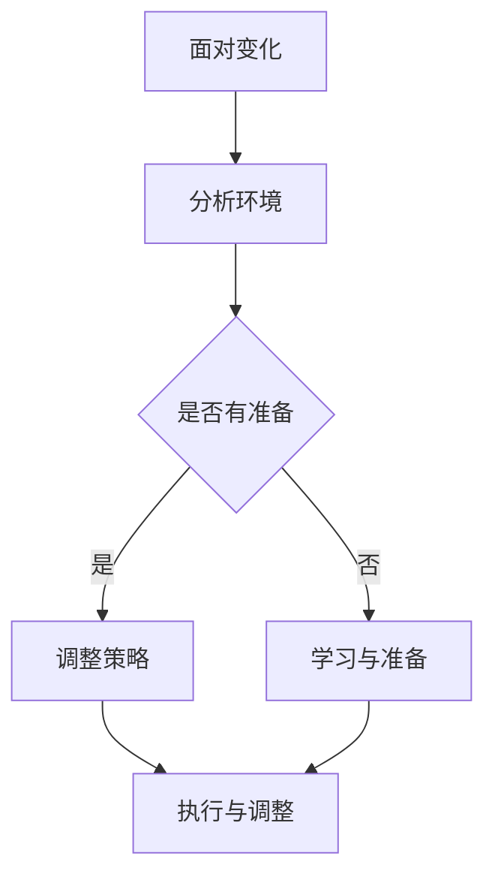
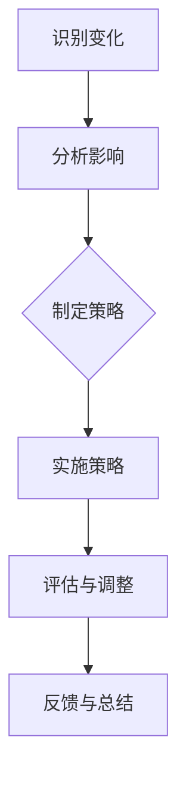
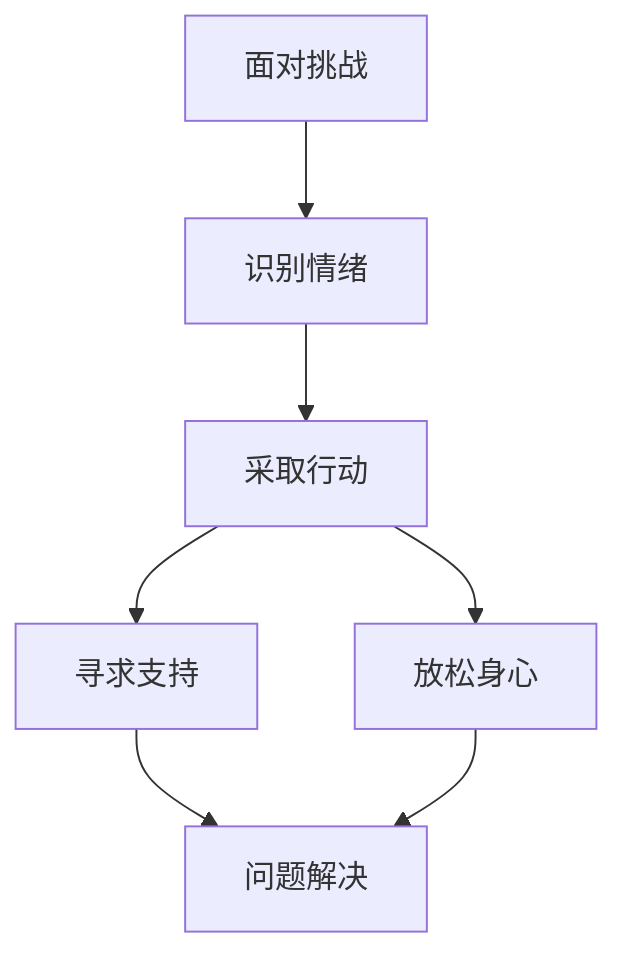
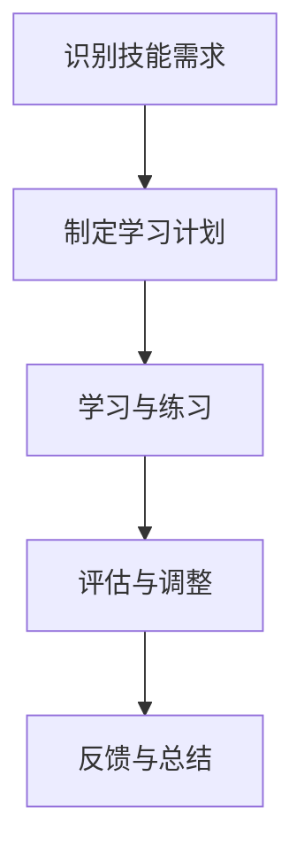

                 

### 面对万般变化，仍能泰然自在

#### 关键词：
- 适应性
- 变化应对
- 心态管理
- 技术进化

> 摘要：在信息技术领域，变化是常态。本文旨在探讨如何在面对不断变化的技术环境时，保持冷静、应对自如。我们将通过逻辑清晰的分析和一步步的推理，详细解析如何通过适应性思维、心态调整和技术进化来应对这种变化。

### 目录

1. 引言
2. 变化的本质与影响
3. 适应性思维导论
4. 变化与应对策略
5. 心态调整与情绪管理
6. 适应性技能提升
7. 实战案例剖析
8. 总结与展望
9. 作者：AI天才研究院 & 禅与计算机程序设计艺术

### 引言

在当今信息技术快速发展的时代，变化已经成为不可避免的现象。无论是编程语言、数据库技术，还是云计算和人工智能，这些技术的演进速度之快，使得每一个IT专业人士都需要具备高度的适应性。本文将探讨如何面对这种变化，并仍能保持泰然自若的态度。

首先，我们需要明确变化带来的两大核心影响：技术层面的挑战和个体层面的挑战。技术层面的挑战体现在需要不断学习新的技术、适应新的工具和方法。而个体层面的挑战则包括情绪管理、心理压力的应对以及如何在一个快速变化的环境中保持专业自信。

接下来，我们将逐步分析如何在技术层面上保持适应性，包括心态调整和技能提升。同时，通过具体的实战案例，我们将展示如何在实际项目中应用这些原则，从而在变化中找到平衡，实现个人和职业的双重成长。

### 变化的本质与影响

#### 核心概念与联系

**变化** 是一个广泛且抽象的概念，其本质在于事物不断从一种状态转移到另一种状态。在技术领域，变化主要体现在以下几个方面：

1. **技术演进**：新技术的不断涌现，如5G、区块链、量子计算等，对现有技术体系造成冲击。
2. **工具更新**：编程语言、开发框架、工具链等频繁更新，开发环境也在不断变化。
3. **市场需求**：客户需求的快速变化，要求技术解决方案也需要相应调整。

**联系** 方面，这些变化之间存在着紧密的联系。例如，技术的演进推动了工具的更新，而工具的更新又影响了开发环境和流程。市场需求的变化则要求技术解决方案更加灵活和高效。

下面使用Mermaid ER图来展示这些概念之间的关系：

```mermaid
erDiagram
    Technology -> Tool
    Tool -> Development Environment
    Market Demand -> Technology Solution
    Technology |.. Technology Evolution
    Tool |.. Tool Update
    Development Environment |.. Technical Challenge
    Market Demand |.. Individual Challenge
```

#### 变化对个体的影响

变化对个体的主要影响包括以下几个方面：

1. **学习压力**：需要不断学习新的知识和技能，以适应不断变化的技术环境。
2. **心理压力**：面对快速变化的环境，个体可能会感到不安和压力，影响工作效率和心态。
3. **职业发展**：技术变化对职业发展的影响尤为显著，如何适应新趋势，成为行业内的佼佼者，是每一个技术专业人士都需要面对的挑战。

### 适应性思维导论

适应性思维是一种能够帮助我们应对变化的思维方式，它包括以下几个方面：

1. **开放性**：保持开放的心态，接受新观念和新方法，不断拓宽视野。
2. **灵活性**：在面对变化时，能够迅速调整策略，灵活应对。
3. **前瞻性**：通过预见未来的变化，提前做好准备，减少应对变化的压力。
4. **反思性**：不断反思自己的行为和决策，从经验中学习，不断提升自己。

适应性思维的核心在于能够快速适应新环境，并在变化中找到新的平衡点。以下是一个简单的适应性思维流程图：



通过这个流程图，我们可以看到，适应性思维是一个循环过程，它需要我们在面对变化时，先进行分析，然后根据分析结果进行调整，并在执行过程中不断反思和优化。

### 变化与应对策略

在面对技术变化时，制定有效的应对策略至关重要。以下是一些常见的策略：

1. **持续学习**：保持对新技术和知识的持续关注，通过在线课程、研讨会和读书等方式，不断提升自己的技术水平。
2. **知识共享**：积极参与技术社区，分享自己的经验和见解，从他人那里获取灵感和新思路。
3. **灵活调整**：在项目开发中，根据需求变化和技术更新，灵活调整开发策略和工具。
4. **风险管理**：对项目中的潜在风险进行评估，并制定相应的应对措施。
5. **心态调整**：面对变化，保持积极的心态，学会从挑战中寻找机遇。

以下是一个简化的变化应对策略流程图：



通过这个流程图，我们可以看到，变化应对策略是一个持续迭代的过程，它要求我们在面对变化时，先进行分析，然后制定策略，实施策略，并在过程中不断评估和调整。

### 心态调整与情绪管理

在面对技术变化时，心态调整和情绪管理是保持高效工作的关键。以下是一些建议：

1. **接受变化**：认识到变化是不可避免的一部分，接受这个现实，减少抵触情绪。
2. **保持乐观**：面对困难时，保持乐观的心态，相信自己能够克服挑战。
3. **学会放松**：通过运动、冥想或阅读等方式，学会放松身心，减轻压力。
4. **寻求支持**：在遇到问题时，及时寻求同事、导师或专业顾问的帮助，共同解决问题。

以下是一个简单的情绪管理流程图：



通过这个流程图，我们可以看到，情绪管理是一个主动的过程，它要求我们在面对挑战时，先识别自己的情绪，然后采取行动，寻求支持或放松身心，从而有效解决问题。

### 适应性技能提升

提升适应性技能是应对技术变化的关键。以下是一些实用的技能提升方法：

1. **技术深化**：对已有的技术进行深入研究，掌握核心原理和最佳实践。
2. **跨学科学习**：学习其他相关领域的知识，如数据科学、心理学等，提升综合能力。
3. **项目管理**：学习项目管理知识，提升项目规划和执行能力。
4. **沟通能力**：提升沟通能力，提高团队协作效率。

以下是一个简化的适应性技能提升流程图：



通过这个流程图，我们可以看到，适应性技能提升是一个持续迭代的过程，它要求我们在识别技能需求后，制定学习计划，进行学习与练习，并在过程中不断评估和调整。

### 实战案例剖析

为了更好地理解如何在实践中应用适应性思维和应对策略，我们来看一个具体的实战案例。

**案例背景**：一家初创公司开发了一款基于区块链技术的去中心化应用（DApp）。然而，在产品开发过程中，他们面临了多个技术挑战，如区块链节点的部署、智能合约的安全性和网络延迟等问题。

**解决方案**：

1. **持续学习**：团队定期参加区块链相关的研讨会和培训，学习最新的技术动态和最佳实践。
2. **知识共享**：内部建立技术分享机制，鼓励团队成员分享自己的学习和实践经验。
3. **灵活调整**：在遇到技术难题时，团队迅速调整开发策略，如优化智能合约代码，以提高执行效率。
4. **心态调整**：通过定期的团队建设活动和放松时间，保持团队成员的心态平衡。

**实施效果**：通过上述策略，团队不仅成功解决了技术难题，还提升了项目的开发效率，最终成功发布了产品，并获得了市场的良好反馈。

**项目小结**：

1. **持续学习**：技术更新迅速，持续学习是提升团队竞争力的重要手段。
2. **知识共享**：知识共享可以加速团队的技术进步，提高整体工作效率。
3. **灵活调整**：面对变化，灵活调整是保持项目顺利推进的关键。
4. **心态调整**：良好的心态是应对挑战的重要保障。

### 最佳实践与总结

在应对技术变化的过程中，以下最佳实践和注意事项值得参考：

1. **最佳实践**：
   - **持续学习**：定期参加技术培训和研讨会，关注行业动态。
   - **知识共享**：建立内部知识库，鼓励团队成员分享经验和心得。
   - **心态调整**：通过运动、冥想等方式，保持良好的心态和情绪。
   - **风险管理**：对项目进行风险评估，制定应急预案。

2. **注意事项**：
   - **避免盲目跟风**：在引入新技术时，要充分评估其适用性和风险。
   - **合理分配资源**：确保团队有足够的时间和资源来应对技术变化。
   - **注重团队协作**：建立高效的团队协作机制，提高整体执行力。

3. **拓展阅读**：
   - 《黑客与画家》 - Paul Graham
   - 《设计模式：可复用面向对象软件的基础》 - Erich Gamma et al.
   - 《禅与计算机程序设计艺术》 - Donald E. Knuth

### 总结与展望

通过本文的探讨，我们了解到在面对技术变化时，适应性思维、心态调整和技术进化是关键。通过持续学习、知识共享、心态调整和风险管理，我们可以更好地应对技术变化，实现个人和职业的双重成长。未来，随着技术的不断演进，我们将继续探索如何在变化中找到平衡，为信息技术领域的发展贡献力量。

### 作者

**作者：AI天才研究院 / AI Genius Institute & 禅与计算机程序设计艺术 / Zen And The Art of Computer Programming**

