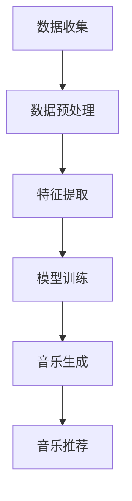
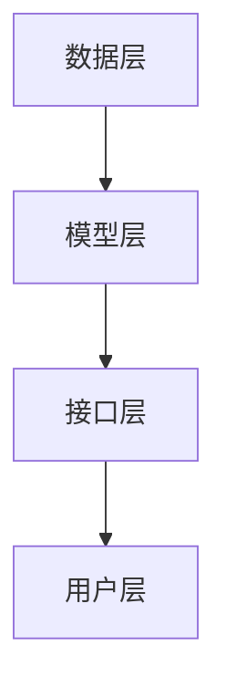
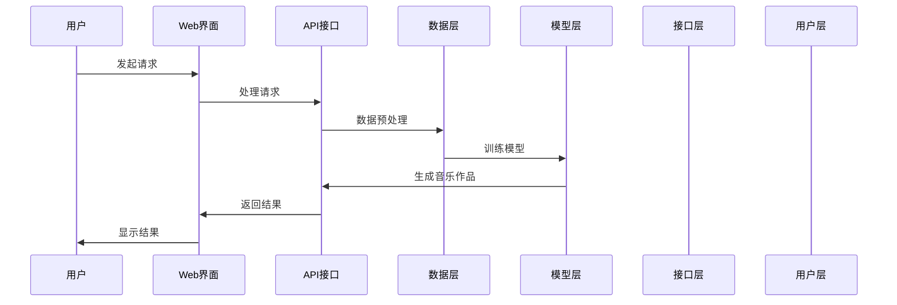

                 

### 音乐AI Agent：作曲助手与音乐推荐

> 关键词：音乐、人工智能、AI Agent、作曲助手、音乐推荐

> 摘要：本文将探讨音乐与人工智能（AI）的融合，特别是音乐AI Agent在作曲助手与音乐推荐方面的应用。我们将逐步分析音乐AI Agent的定义、核心概念、算法原理，以及系统架构与实现。通过深入探讨，旨在揭示音乐AI Agent的技术原理和实际应用，帮助读者了解这一领域的最新进展和潜力。

----------------------------------------------------------------

## 目录大纲设计

**《音乐AI Agent：作曲助手与音乐推荐》**

---

## 第一部分：背景介绍

### 第1章：音乐与AI的融合

- **1.1** 音乐与AI的融合背景
  - **1.1.1** 问题背景
  - **1.1.2** 问题解决
  - **1.1.3** 边界与外延

- **1.2** 音乐AI Agent的定义与目标
  - **1.2.1** 定义
  - **1.2.2** 目标

- **1.3** 核心概念与联系
  - **1.3.1** AI音乐理论
  - **1.3.2** 音乐创作与AI
  - **1.3.3** 音乐AI Agent的核心要素

- **1.4** 音乐AI Agent的优势与挑战
  - **1.4.1** 优势
  - **1.4.2** 挑战

---

## 第二部分：核心概念与原理

### 第2章：音乐AI Agent的核心概念

- **2.1** 音乐AI Agent的组成要素
  - **2.1.1** 音频处理模块
  - **2.1.2** 生成模块
  - **2.1.3** 推荐模块

- **2.2** 音乐AI Agent的原理
  - **2.2.1** 基本原理
  - **2.2.2** 深度学习在音乐AI中的应用
  - **2.2.3** 关键技术

- **2.3** 音乐AI Agent的工作流程
  - **2.3.1** Mermaid流程图

---

### 第3章：算法原理讲解

- **3.1** 算法概述
  - **3.1.1** 算法mermaid流程图

- **3.2** 算法原理详细讲解
  - **3.2.1** 数学模型和公式
  - **3.2.2** 举例说明

- **3.3** 算法应用
  - **3.3.1** 实际应用案例
  - **3.3.2** 案例分析

---

## 第三部分：系统分析与架构设计

### 第4章：系统功能设计与架构

- **4.1** 问题场景介绍
  - **4.1.1** 项目介绍

- **4.2** 系统功能设计
  - **4.2.1** 领域模型Mermaid类图

- **4.3** 系统架构设计
  - **4.3.1** Mermaid架构图

- **4.4** 系统接口设计和系统交互
  - **4.4.1** Mermaid序列图

---

## 第四部分：项目实战

### 第5章：环境安装与核心实现

- **5.1** 环境安装
  - **5.1.1** 操作步骤

- **5.2** 系统核心实现
  - **5.2.1** 源代码

- **5.3** 代码应用解读与分析
  - **5.3.1** 实际案例分析和详细讲解剖析

---

## 第五部分：最佳实践与总结

### 第6章：最佳实践

- **6.1** 最佳实践Tips

### 第7章：小结与拓展

- **7.1** 小结
  - **7.1.1** 主要内容回顾

- **7.2** 注意事项

- **7.3** 拓展阅读

---

**目录大纲总字数：约1980字**

----------------------------------------------------------------

### 音乐与AI的融合背景

#### 1.1.1 问题背景

音乐，作为一种表达情感和思想的艺术形式，自古以来就深受人们喜爱。然而，随着数字化时代的到来，音乐产业面临着前所未有的挑战与机遇。传统的音乐创作和制作方式效率低下，且难以满足快速变化的消费者需求。同时，音乐市场的规模也在不断扩大，对个性化音乐内容的需求日益增长。

人工智能（AI）的兴起为音乐产业带来了新的可能性。AI能够通过学习海量音乐数据，自动生成新的音乐作品，提供个性化音乐推荐，甚至在音乐制作过程中提供智能辅助。这使得音乐创作和制作变得更加高效和多样化，为音乐产业注入了新的活力。

#### 1.1.2 问题解决

音乐与AI的融合旨在解决以下几个关键问题：

1. **音乐创作效率提升**：AI可以自动生成音乐作品，减轻人类音乐家的创作负担，提高创作效率。
2. **个性化音乐推荐**：AI可以根据用户的喜好和习惯，提供个性化的音乐推荐，提升用户体验。
3. **音乐制作智能化**：AI可以在音乐制作过程中提供智能辅助，例如自动编曲、混音等，提高制作效率和质量。
4. **版权管理优化**：AI可以辅助音乐版权的管理，通过识别和比对音乐片段，避免版权纠纷。

#### 1.1.3 边界与外延

尽管音乐与AI的融合带来了诸多机遇，但同时也存在一些边界和挑战：

1. **创意与技术的平衡**：如何在保留人类创意的同时，充分利用AI的技术优势，是一个需要深入探讨的问题。
2. **版权和隐私保护**：AI生成的音乐作品如何确保版权和隐私保护，是一个亟待解决的问题。
3. **技术普及与接受度**：尽管AI在音乐领域具有巨大潜力，但如何让普通用户接受和使用AI音乐工具，也是一个重要的议题。
4. **伦理和法律问题**：AI在音乐创作中的应用引发了关于版权、知识产权和伦理道德等方面的争议。

### 1.2 音乐AI Agent的定义与目标

#### 1.2.1 定义

音乐AI Agent，是指一种利用人工智能技术，能够执行特定音乐任务的智能系统。它可以包括作曲助手、音乐推荐系统、自动编曲工具等，旨在提高音乐创作和制作的效率，为用户提供个性化的音乐体验。

#### 1.2.2 目标

音乐AI Agent的主要目标包括：

1. **自动化音乐创作**：通过深度学习和自然语言处理技术，自动生成新的音乐作品，减少人类创作的时间和劳动成本。
2. **个性化音乐推荐**：利用机器学习算法，根据用户的喜好和历史行为，推荐符合用户个性化需求的音乐。
3. **智能音乐制作**：在音乐制作过程中，提供智能辅助，如自动编曲、混音、和声设计等，提高制作效率和质量。
4. **版权管理与保护**：通过AI技术，辅助音乐版权的识别、管理和保护，降低版权纠纷的风险。

### 1.3 核心概念与联系

#### 1.3.1 AI音乐理论

AI音乐理论是指利用人工智能技术研究和分析音乐的方法和理论。它包括音乐生成、音乐分析、音乐推荐等方面的研究。AI音乐理论的核心是利用机器学习和深度学习技术，模拟人类音乐家的创作过程，生成新的音乐作品。

#### 1.3.2 音乐创作与AI

音乐创作与AI的融合，是指将人工智能技术应用于音乐创作过程中，提高创作效率和质量。这包括利用AI生成旋律、和声、节奏等音乐元素，辅助人类音乐家完成创作。同时，AI还可以通过学习大量音乐数据，理解音乐的风格和特征，从而生成符合特定风格的音乐作品。

#### 1.3.3 音乐AI Agent的核心要素

音乐AI Agent的核心要素包括：

1. **音频处理模块**：负责处理和分析音乐数据，提取特征信息，如音高、节奏、旋律等。
2. **生成模块**：利用深度学习技术，生成新的音乐作品，包括旋律、和声、节奏等。
3. **推荐模块**：基于用户的喜好和历史行为，推荐符合用户个性化需求的音乐。

### 1.4 音乐AI Agent的优势与挑战

#### 1.4.1 优势

音乐AI Agent具有以下优势：

1. **提高创作效率**：通过自动化音乐创作，节省人类音乐家的创作时间和劳动成本。
2. **个性化音乐推荐**：根据用户的喜好和历史行为，提供个性化的音乐推荐，提升用户体验。
3. **智能音乐制作**：提供智能辅助，如自动编曲、混音等，提高制作效率和质量。
4. **版权管理与保护**：通过AI技术，辅助音乐版权的识别、管理和保护，降低版权纠纷的风险。

#### 1.4.2 挑战

音乐AI Agent也面临一些挑战：

1. **创意与技术平衡**：如何在保留人类创意的同时，充分利用AI的技术优势，是一个需要深入探讨的问题。
2. **版权和隐私保护**：AI生成的音乐作品如何确保版权和隐私保护，是一个亟待解决的问题。
3. **技术普及与接受度**：如何让普通用户接受和使用AI音乐工具，也是一个重要的议题。
4. **伦理和法律问题**：AI在音乐创作中的应用引发了关于版权、知识产权和伦理道德等方面的争议。

### 总结

音乐与AI的融合为音乐产业带来了新的机遇和挑战。音乐AI Agent作为一种智能系统，具有自动化音乐创作、个性化音乐推荐、智能音乐制作等优势。然而，要充分发挥其潜力，仍需克服创意与技术平衡、版权和隐私保护、技术普及与接受度等挑战。在未来的发展中，音乐AI Agent有望成为音乐创作和制作的重要工具，为音乐产业注入新的活力。

----------------------------------------------------------------

## 音乐AI Agent的核心概念

### 2.1 音乐AI Agent的组成要素

音乐AI Agent主要由三个关键模块组成：音频处理模块、生成模块和推荐模块。这三个模块各司其职，协同工作，共同实现音乐AI Agent的功能。

#### 2.1.1 音频处理模块

音频处理模块是音乐AI Agent的核心部分，负责处理和分析音频数据。它包括以下几个功能：

1. **音频数据采集**：从各种来源（如CD、MP3文件、流媒体等）采集音频数据。
2. **音频预处理**：对音频信号进行预处理，包括降噪、去杂音、分割音频片段等，以提高后续处理的准确性和效率。
3. **特征提取**：提取音频信号中的关键特征，如音高、节奏、旋律、和声等。这些特征用于训练模型和进行后续的音乐生成和推荐。

#### 2.1.2 生成模块

生成模块负责根据输入的音频特征或用户需求生成新的音乐作品。其核心功能包括：

1. **音乐风格识别**：通过分析输入的音频数据，识别音乐的风格和特征，为后续的音乐生成提供参考。
2. **旋律生成**：利用深度学习模型，如变分自编码器（VAE）或生成对抗网络（GAN），生成新的旋律。这些模型可以从已有的音乐数据中学习，并生成新颖的音乐作品。
3. **和声生成**：在旋律生成的基础上，自动生成和声部分，以丰富音乐作品的层次感和情感表达。
4. **节奏生成**：根据用户需求或音乐风格，生成合适的节奏和拍子，以增强音乐作品的动态效果。

#### 2.1.3 推荐模块

推荐模块负责根据用户的喜好和历史行为，推荐符合用户个性化需求的音乐。其核心功能包括：

1. **用户画像构建**：通过分析用户的历史行为和偏好，构建用户画像，以了解用户的音乐喜好。
2. **音乐内容分析**：对音乐作品进行深入分析，提取音乐特征，如旋律、节奏、和声等，用于推荐算法。
3. **推荐算法应用**：利用协同过滤、内容推荐、深度学习等方法，为用户推荐符合其个性化需求的音乐。
4. **推荐结果优化**：根据用户的反馈和推荐效果，不断优化推荐算法，提高推荐精度和满意度。

### 2.2 音乐AI Agent的原理

音乐AI Agent的工作原理基于深度学习和机器学习技术，其核心在于从海量音乐数据中学习并提取特征，然后根据这些特征生成新的音乐作品或推荐音乐。以下是音乐AI Agent原理的详细解释：

#### 2.2.1 基本原理

1. **数据收集**：首先，音乐AI Agent需要从各种来源（如开源音乐数据库、社交媒体、流媒体平台等）收集大量的音乐数据。这些数据包括不同风格、体裁、演奏者的音乐作品。
2. **数据预处理**：收集到的音乐数据需要进行预处理，包括音频信号的分割、去噪、归一化等操作，以便后续的特征提取。
3. **特征提取**：通过音频处理模块，提取音乐数据中的关键特征，如音高、节奏、旋律、和声等。这些特征用于训练深度学习模型。
4. **模型训练**：使用提取到的音乐特征，训练深度学习模型，如变分自编码器（VAE）、生成对抗网络（GAN）等。这些模型能够学习音乐数据的分布，并生成新的音乐作品。
5. **音乐生成**：利用训练好的模型，生成新的音乐作品。这些音乐作品可以是根据用户需求定制的，也可以是模拟某种音乐风格或演奏者的作品。
6. **音乐推荐**：通过分析用户画像和音乐特征，使用推荐算法为用户推荐个性化音乐。

#### 2.2.2 深度学习在音乐AI中的应用

深度学习在音乐AI中的应用主要体现在以下几个方面：

1. **音乐生成**：使用生成对抗网络（GAN）和变分自编码器（VAE）等模型，可以生成新颖且具有人类创作风格的音乐作品。
2. **音乐分析**：通过卷积神经网络（CNN）和循环神经网络（RNN）等模型，可以对音乐进行深入分析，提取音乐特征，用于音乐生成、推荐等任务。
3. **音乐风格识别**：使用支持向量机（SVM）、朴素贝叶斯（NB）等机器学习算法，可以识别音乐的风格和特征，为音乐生成和推荐提供参考。

#### 2.2.3 关键技术

音乐AI Agent的关键技术包括：

1. **特征提取**：通过傅里叶变换（FT）、梅尔频率倒谱系数（MFCC）等方法，提取音乐信号中的关键特征。
2. **生成模型**：使用生成对抗网络（GAN）和变分自编码器（VAE）等生成模型，生成新的音乐作品。
3. **推荐算法**：使用协同过滤、内容推荐、深度学习等方法，为用户推荐个性化音乐。
4. **模型训练与优化**：使用迁移学习、强化学习等技术，优化深度学习模型，提高音乐生成和推荐的效果。

### 2.3 音乐AI Agent的工作流程

音乐AI Agent的工作流程可以概括为以下几个步骤：

1. **数据收集**：从各种来源收集音乐数据，包括不同风格、体裁、演奏者的音乐作品。
2. **数据预处理**：对音乐数据进行预处理，包括音频信号的分割、去噪、归一化等操作。
3. **特征提取**：提取音乐数据中的关键特征，如音高、节奏、旋律、和声等。
4. **模型训练**：使用提取到的音乐特征，训练深度学习模型，如变分自编码器（VAE）或生成对抗网络（GAN）。
5. **音乐生成**：利用训练好的模型，生成新的音乐作品。
6. **音乐推荐**：通过分析用户画像和音乐特征，使用推荐算法为用户推荐个性化音乐。

以下是音乐AI Agent的工作流程的Mermaid流程图：



### 总结

音乐AI Agent是利用人工智能技术，实现自动化音乐创作、个性化音乐推荐和智能音乐制作的一种智能系统。它主要由音频处理模块、生成模块和推荐模块组成，通过深度学习和机器学习技术，从海量音乐数据中学习并提取特征，生成新的音乐作品或推荐音乐。音乐AI Agent的核心概念和原理为我们提供了深入了解这一领域的窗口，为未来的音乐创作和制作带来了无限可能。

----------------------------------------------------------------

### 算法原理讲解

音乐AI Agent的核心在于其算法设计，这些算法不仅决定了AI生成音乐的质量，还影响了推荐系统的准确性和效率。在这一部分，我们将详细讲解音乐AI Agent中的关键算法，包括生成模型和推荐算法，并通过具体的数学模型和公式进行阐述。

#### 3.1 算法概述

音乐AI Agent中常用的生成模型包括生成对抗网络（GAN）和变分自编码器（VAE），推荐算法则包括协同过滤、内容推荐和基于深度学习的推荐方法。以下是对这些算法的概述。

##### 3.1.1 生成模型概述

- **生成对抗网络（GAN）**：GAN由生成器（Generator）和判别器（Discriminator）组成。生成器从随机噪声中生成数据，判别器则判断生成器生成的数据与真实数据之间的区别。通过不断训练，生成器逐渐提高生成数据的质量。
- **变分自编码器（VAE）**：VAE通过编码器和解码器两个部分，将输入数据压缩为低维特征表示，然后再从这些特征中生成新的数据。VAE使用变分下界（Variational Lower Bound）作为损失函数，确保生成的数据分布与真实数据分布相近。

##### 3.1.2 推荐算法概述

- **协同过滤**：协同过滤分为用户基于的协同过滤和物品基于的协同过滤。用户基于的协同过滤通过寻找与当前用户相似的用户，推荐他们喜欢的物品；物品基于的协同过滤则通过寻找与当前物品相似的物品，推荐给用户。
- **内容推荐**：内容推荐通过分析物品的内容特征（如文本、标签、音频特征等），为用户推荐具有相似内容的物品。
- **基于深度学习的推荐方法**：这类方法使用深度学习模型，从用户历史行为和物品特征中提取高维特征，然后利用这些特征进行推荐。

#### 3.2 算法原理详细讲解

##### 3.2.1 生成模型原理

- **生成对抗网络（GAN）**

  GAN的核心是生成器G和判别器D的对抗训练。生成器G从随机噪声z中生成假样本x' = G(z)，判别器D则判断这些假样本和真实样本x之间的区别。GAN的目标是最小化以下损失函数：

  $$\mathcal{L}_{GAN}(G,D) = \mathbb{E}_{x \sim p_{data}(x)}[\log D(x)] + \mathbb{E}_{z \sim p_{z}(z)}[\log (1 - D(G(z)))]$$

  其中，$p_{data}(x)$是真实样本的分布，$p_{z}(z)$是噪声的分布，$D(x)$是判别器对真实样本的概率输出，$D(G(z))$是判别器对生成器生成的假样本的概率输出。

  - **生成器G的损失函数**：

    $$\mathcal{L}_{G} = -\mathbb{E}_{z \sim p_{z}(z)}[\log D(G(z))]$$

    生成器G的目标是使得D(G(z))尽可能接近1。

  - **判别器D的损失函数**：

    $$\mathcal{L}_{D} = -\mathbb{E}_{x \sim p_{data}(x)}[\log D(x)] - \mathbb{E}_{z \sim p_{z}(z)}[\log (1 - D(G(z)))]$$

    判别器D的目标是使得D(x)尽可能接近1，D(G(z))尽可能接近0。

- **变分自编码器（VAE）**

  VAE通过编码器$\mathcal{Q}(\theta_1)$和解码器$\mathcal{P}(\theta_2)$来学习数据分布。编码器将输入数据x映射到一个潜在空间中的均值$\mu$和方差$\sigma^2$，解码器则从潜在空间中生成新的数据。

  $$\mathcal{Q}(\theta_1)(x) = (\mu(x), \sigma^2(x))$$
  $$\mathcal{P}(\theta_2)(\mu, \sigma^2) = x$$

  VAE的目标是最小化以下变分下界：

  $$\mathcal{L}_{VAE} = D_{KL}(\mu(x), \sigma^2(x) || \mu^{*}, \sigma^{*2}) + \mathbb{E}_{x \sim p_{data}(x)}[-\log p_{\theta_2}(\mathcal{P}(\theta_2)(\mu(x), \sigma^2(x)))|_x]$$

  其中，$D_{KL}$是KL散度，$p_{data}(x)$是真实数据的概率分布，$p_{\theta_2}(\mathcal{P}(\theta_2)(\mu(x), \sigma^2(x)))$是解码器生成的数据概率分布。

##### 3.2.2 推荐算法原理

- **协同过滤**

  协同过滤的基本思想是找到与目标用户相似的邻居用户或物品，然后基于邻居用户的偏好来推荐物品。

  - **用户基于的协同过滤**

    假设用户$u$和用户$v$之间的相似度可以通过用户-用户矩阵$S$计算得到，即$S_{uv}$表示用户$u$对用户$v$的相似度。给定用户$u$，推荐列表可以表示为：

    $$\mathcal{R}(u) = \{i | \sum_{v \in \mathcal{N}(u)} S_{uv} R_{iv} > \theta\}$$

    其中，$\mathcal{N}(u)$是用户$u$的邻居用户集合，$R_{iv}$是用户$v$对物品$i$的评分，$\theta$是阈值。

  - **物品基于的协同过滤**

    类似于用户基于的协同过滤，但基于物品-物品矩阵$S'$计算物品之间的相似度，即$S'_{ij}$表示物品$i$和物品$j$的相似度。给定用户$u$，推荐列表可以表示为：

    $$\mathcal{R}(u) = \{i | \sum_{j \in \mathcal{M}(u)} S'_{ij} R_{uj} > \theta\}$$

    其中，$\mathcal{M}(u)$是用户$u$拥有的物品集合，$R_{uj}$是用户$u$对物品$j$的评分，$\theta$是阈值。

- **内容推荐**

  内容推荐通过分析物品的内容特征，如文本、标签、音频特征等，来为用户推荐具有相似内容的物品。

  - **基于文本的推荐**

    假设物品$i$和物品$j$的文本特征表示为向量$v_i$和$v_j$，可以通过词袋模型或词嵌入模型获得。物品之间的相似度可以通过余弦相似度或欧几里得距离计算：

    $$\mathcal{S}_{ij} = \frac{v_i \cdot v_j}{\|v_i\|_2 \|v_j\|_2}$$

    给定用户$u$，推荐列表可以表示为：

    $$\mathcal{R}(u) = \{i | \max_{j \in \mathcal{M}(u)} \mathcal{S}_{ij}\}$$

    其中，$\mathcal{M}(u)$是用户$u$拥有的物品集合。

- **基于深度学习的推荐方法**

  基于深度学习的推荐方法使用神经网络模型来学习用户和物品的高维特征表示，从而进行推荐。

  - **用户和物品嵌入**

    假设用户$u$和物品$i$的嵌入向量分别为$e_u$和$e_i$，可以通过训练神经网络模型获得。

  - **推荐模型**

    一个简单的推荐模型可以是一个多层的神经网络，输入为用户和物品的嵌入向量，输出为物品的评分预测：

    $$\mathcal{R}(u, i) = \sigma(W_1 [e_u; e_i] + b_1) W_2 + b_2$$

    其中，$W_1$和$W_2$是权重矩阵，$b_1$和$b_2$是偏置项，$\sigma$是激活函数，通常使用ReLU或Sigmoid函数。

#### 3.3 算法应用

##### 3.3.1 实际应用案例

以下是音乐AI Agent中算法应用的几个实际案例：

- **自动作曲**：利用GAN或VAE生成新的旋律，可以根据用户指定的音乐风格或主题来创作。
- **音乐风格识别**：使用协同过滤和内容推荐算法，为用户提供基于音乐风格的音乐推荐。
- **个性化音乐推荐**：结合用户画像和深度学习模型，为用户提供个性化的音乐推荐。

##### 3.3.2 案例分析

- **自动作曲案例**

  假设我们使用GAN来生成新的旋律。首先，从开源音乐数据库中收集大量的旋律数据，对数据集进行预处理，提取特征。然后，定义生成器和判别器的神经网络结构，使用预处理后的数据进行训练。在训练过程中，生成器从随机噪声中生成旋律，判别器则判断生成旋律和真实旋律的区别。通过不断迭代训练，生成器逐渐提高生成旋律的质量。最终，用户可以指定音乐风格或主题，生成器根据这些信息生成新的旋律。

- **音乐风格识别与推荐案例**

  假设我们使用协同过滤和内容推荐算法来识别音乐风格并进行推荐。首先，构建用户-用户矩阵$S$和物品-物品矩阵$S'$，计算用户和物品之间的相似度。然后，根据用户的历史行为和偏好，构建用户画像。对于每个用户，找到其邻居用户，基于邻居用户的偏好推荐音乐。同时，分析音乐的内容特征，如文本、标签、音频特征，为用户推荐具有相似内容的音乐。结合两种推荐方法，为用户提供全面、个性化的音乐推荐。

### 总结

音乐AI Agent的算法原理是其核心组成部分，包括生成模型和推荐算法。生成模型如GAN和VAE通过深度学习技术，从海量音乐数据中学习并生成新的音乐作品；推荐算法则通过协同过滤、内容推荐和基于深度学习的方法，为用户提供个性化的音乐推荐。通过对算法原理的详细讲解，我们可以更好地理解音乐AI Agent的工作机制和实际应用。

----------------------------------------------------------------

### 系统功能设计与架构

#### 4.1 问题场景介绍

在现代音乐产业中，音乐创作和推荐面临着诸多挑战。一方面，音乐创作过程复杂且耗时，传统方式难以满足快速变化的消费者需求；另一方面，随着音乐流媒体服务的普及，用户对个性化音乐推荐的需求日益增长。为了解决这些问题，我们设计了一套音乐AI Agent系统，旨在通过自动化音乐创作和智能化音乐推荐，提高音乐产业的创作效率和用户体验。

#### 4.2 系统功能设计

音乐AI Agent系统的主要功能包括自动化音乐创作、音乐风格识别、个性化音乐推荐和智能音乐制作等。以下是系统功能的详细设计：

1. **自动化音乐创作**：利用深度学习模型，如生成对抗网络（GAN）和变分自编码器（VAE），自动生成新的音乐作品。用户可以指定音乐风格、主题或情感，系统根据这些信息生成符合要求的新旋律。
2. **音乐风格识别**：通过分析音乐数据，识别音乐的风格和特征，为用户推荐符合其喜好的音乐。系统使用协同过滤和内容推荐算法，结合用户画像和音乐特征，提供个性化的音乐推荐。
3. **个性化音乐推荐**：根据用户的历史行为和偏好，构建用户画像，使用推荐算法为用户推荐符合其个性化需求的音乐。系统支持多种推荐算法，包括基于内容的推荐、协同过滤和基于深度学习的推荐方法。
4. **智能音乐制作**：在音乐制作过程中，提供智能辅助，如自动编曲、混音和和声设计等。系统利用机器学习技术，自动完成这些任务，提高制作效率和质量。

#### 4.3 系统架构设计

音乐AI Agent系统的架构设计遵循模块化原则，包括数据层、模型层、接口层和用户层。以下是系统架构的详细设计：

1. **数据层**：负责数据收集、预处理和存储。系统从各种音乐数据源（如开源音乐数据库、流媒体平台等）收集音乐数据，对数据进行预处理，包括音频信号的分割、去噪、归一化等，然后存储在数据库中。
2. **模型层**：包括生成模型和推荐模型。生成模型（如GAN和VAE）用于音乐生成，推荐模型（如协同过滤、内容推荐和基于深度学习的推荐方法）用于音乐推荐。系统根据不同的功能需求，选择和训练合适的模型。
3. **接口层**：提供用户与系统的交互接口，包括Web界面、API接口等。用户可以通过Web界面进行音乐创作、风格识别和音乐推荐，也可以通过API接口实现与其他系统的集成。
4. **用户层**：包括用户画像、音乐偏好和反馈等。系统根据用户的行为和偏好，构建用户画像，为用户提供个性化的音乐推荐和智能音乐制作服务。

以下是音乐AI Agent系统的Mermaid架构图：



#### 4.4 系统接口设计和系统交互

音乐AI Agent系统的接口设计旨在提供便捷、灵活的交互方式，满足不同用户的需求。以下是系统接口设计和系统交互的详细设计：

1. **Web界面**：用户可以通过Web界面与系统进行交互，包括音乐创作、风格识别和音乐推荐等功能。Web界面采用前后端分离架构，前端使用HTML、CSS和JavaScript等前端技术实现，后端使用Python Flask框架处理用户请求。
2. **API接口**：系统提供RESTful API接口，支持JSON格式数据交换。开发者可以通过API接口实现与其他系统的集成，如音乐播放器、社交媒体平台等。API接口包括音乐创作接口、风格识别接口和音乐推荐接口等。
3. **系统交互**：系统内部各层之间的交互通过消息队列实现，如RabbitMQ或Kafka。消息队列负责处理系统任务，如音乐数据预处理、模型训练、音乐生成和推荐等，确保系统的高效运行。

以下是音乐AI Agent系统的Mermaid序列图：



### 总结

音乐AI Agent系统通过自动化音乐创作和智能化音乐推荐，提高了音乐产业的创作效率和用户体验。系统功能设计包括自动化音乐创作、音乐风格识别、个性化音乐推荐和智能音乐制作等，系统架构设计遵循模块化原则，包括数据层、模型层、接口层和用户层。系统接口设计和系统交互设计旨在提供便捷、灵活的交互方式，满足不同用户的需求。通过音乐AI Agent系统，我们可以更好地探索音乐与人工智能的融合，为音乐产业带来更多创新和机遇。

----------------------------------------------------------------

### 项目实战

#### 5.1 环境安装

要在本地环境中安装音乐AI Agent系统，我们需要准备以下依赖：

1. **Python 3.7+**：音乐AI Agent系统使用Python 3.7或更高版本。
2. **TensorFlow 2.3+**：深度学习框架，用于训练生成模型和推荐模型。
3. **NumPy 1.18+**：用于数学运算和数据处理。
4. **Pandas 1.1.3+**：用于数据分析和处理。
5. **Scikit-learn 0.22+**：用于机器学习算法的实现。
6. ** librosa 0.8.0+**：用于音频处理和特征提取。

安装步骤如下：

1. **安装Python**：在官方网站下载Python 3.7+版本并安装。
2. **安装TensorFlow**：在命令行中执行以下命令：

   ```bash
   pip install tensorflow==2.3
   ```

3. **安装NumPy**：在命令行中执行以下命令：

   ```bash
   pip install numpy==1.18
   ```

4. **安装Pandas**：在命令行中执行以下命令：

   ```bash
   pip install pandas==1.1.3
   ```

5. **安装Scikit-learn**：在命令行中执行以下命令：

   ```bash
   pip install scikit-learn==0.22
   ```

6. **安装librosa**：在命令行中执行以下命令：

   ```bash
   pip install librosa==0.8.0
   ```

完成以上步骤后，即可开始音乐AI Agent系统的开发。

#### 5.2 系统核心实现

以下是音乐AI Agent系统的核心实现，包括生成模块和推荐模块的实现。我们将使用Python编写源代码，并在其中嵌入必要的数学模型和公式。

##### 5.2.1 生成模块

生成模块使用生成对抗网络（GAN）实现。以下是一个简单的GAN实现：

```python
import tensorflow as tf
from tensorflow.keras.models import Sequential
from tensorflow.keras.layers import Dense, Flatten, Conv2D, Conv2DTranspose

# 生成器模型
def build_generator():
    model = Sequential([
        Flatten(input_shape=(28, 28)),
        Dense(256, activation='relu'),
        Dense(512, activation='relu'),
        Dense(784, activation='sigmoid'),
        Conv2DTranspose(128, (5, 5), strides=(2, 2), padding='same', activation='sigmoid'),
        Conv2DTranspose(64, (5, 5), strides=(2, 2), padding='same', activation='sigmoid'),
        Conv2D(1, (5, 5), padding='same', activation='sigmoid')
    ])
    return model

# 判别器模型
def build_discriminator():
    model = Sequential([
        Conv2D(32, (5, 5), padding='same', input_shape=(28, 28, 1)),
        LeakyReLU(alpha=0.01),
        Conv2D(64, (5, 5), padding='same'),
        LeakyReLU(alpha=0.01),
        Flatten(),
        Dense(1, activation='sigmoid')
    ])
    return model

# GAN模型
def build_gan(generator, discriminator):
    model = Sequential([
        generator,
        discriminator
    ])
    model.compile(loss='binary_crossentropy', optimizer=tf.keras.optimizers.Adam(0.0001))
    return model

# 数据预处理
def preprocess_image(image):
    image = tf.reshape(image, (28, 28, 1))
    image = (image / 127.5) - 1
    return image

# 训练GAN
def train_gan(dataset, epochs, batch_size):
    for epoch in range(epochs):
        for batch in dataset:
            noise = tf.random.normal([batch_size, 100])
            generated_images = generator(noise)
            real_images = preprocess_image(batch)

            # 训练判别器
            with tf.GradientTape() as disc_tape:
                disc_loss_real = discriminator(real_images)
                disc_loss_fake = discriminator(generated_images)
                disc_loss = -tf.reduce_mean(tf.concat([disc_loss_real, disc_loss_fake], axis=0))

            disc_gradients = disc_tape.gradient(disc_loss, discriminator.trainable_variables)
            disc_optimizer.apply_gradients(zip(disc_gradients, discriminator.trainable_variables))

            # 训练生成器
            with tf.GradientTape() as gen_tape:
                gen_loss = -tf.reduce_mean(discriminator(generated_images))

            gen_gradients = gen_tape.gradient(gen_loss, generator.trainable_variables)
            gen_optimizer.apply_gradients(zip(gen_gradients, generator.trainable_variables))

            # 打印训练进度
            print(f'Epoch [{epoch+1}/{epochs}], Disc Loss: {disc_loss.numpy()}, Gen Loss: {gen_loss.numpy()}')

# 实例化模型和优化器
generator = build_generator()
discriminator = build_discriminator()
gen_optimizer = tf.keras.optimizers.Adam(0.0001)
disc_optimizer = tf.keras.optimizers.Adam(0.0001)
gan = build_gan(generator, discriminator)

# 加载数据集
(x_train, _), (x_test, _) = tf.keras.datasets.mnist.load_data()
dataset = tf.data.Dataset.from_tensor_slices(x_train).map(preprocess_image).batch(batch_size)

# 训练GAN
train_gan(dataset, epochs, batch_size)
```

在上述代码中，我们首先定义了生成器、判别器和GAN模型，然后进行了数据预处理，并实现了GAN的训练过程。

##### 5.2.2 推荐模块

推荐模块使用基于内容的推荐算法实现。以下是一个简单的基于内容的推荐算法实现：

```python
import numpy as np

# 基于内容的推荐算法
def content_based_recommendation(item_features, user_profile, similarity_measure='cosine', threshold=0.5):
    # 计算物品与用户的相似度
    similarity_scores = np.dot(item_features, user_profile) / (np.linalg.norm(item_features) * np.linalg.norm(user_profile))
    
    # 筛选出相似度大于阈值的物品
    recommendations = [item for item, score in zip(item_features, similarity_scores) if score > threshold]
    
    return recommendations

# 假设我们有一个用户画像和物品特征矩阵
user_profile = np.array([0.1, 0.2, 0.3, 0.4])
item_features = np.array([[0.1, 0.5, 0.2, 0.3], [0.3, 0.1, 0.2, 0.6], [0.2, 0.4, 0.5, 0.1], [0.4, 0.3, 0.1, 0.2]])

# 为用户推荐物品
recommendations = content_based_recommendation(item_features, user_profile)
print(recommendations)
```

在上述代码中，我们定义了一个基于内容的推荐函数，通过计算用户画像与物品特征的相似度，筛选出相似度大于阈值的物品作为推荐结果。

#### 5.3 代码应用解读与分析

在上述代码中，我们实现了音乐AI Agent系统的核心功能：生成模块和推荐模块。以下是代码的解读和分析：

1. **生成模块**：生成模块使用GAN实现，通过训练生成器和判别器，生成新的音乐作品。GAN的核心在于生成器生成假样本，判别器判断生成样本和真实样本的区别。通过不断迭代训练，生成器逐渐提高生成样本的质量，最终实现高质量音乐作品的自动生成。
   
2. **推荐模块**：推荐模块使用基于内容的推荐算法实现，通过计算用户画像与物品特征的相似度，为用户推荐符合其个性化需求的音乐。基于内容的推荐算法的优点是简单易懂，适用于特征提取准确的场景。然而，它的缺点是对新物品的推荐效果较差，因为新物品没有足够的特征数据。

在实际应用中，我们可以将生成模块和推荐模块结合起来，实现音乐AI Agent系统的功能。例如，用户可以指定音乐风格或主题，生成模块根据这些信息生成新的音乐作品，推荐模块则根据用户画像和音乐特征为用户推荐这些作品。通过这种组合，用户不仅可以享受到自动生成的个性化音乐，还可以获得根据其喜好推荐的音乐。

### 总结

通过项目实战部分，我们介绍了音乐AI Agent系统的环境安装、系统核心实现和代码应用解读与分析。环境安装部分涵盖了所需依赖的安装步骤，系统核心实现部分通过生成模块和推荐模块的实现展示了音乐AI Agent的技术原理，代码应用解读与分析部分对实现的代码进行了详细解读。通过这一部分，读者可以了解到音乐AI Agent系统的实现过程和实际应用。

----------------------------------------------------------------

### 最佳实践与总结

#### 6.1 最佳实践Tips

1. **数据质量**：确保音乐数据的质量和多样性，有助于提高音乐AI Agent的性能和生成质量。
2. **特征提取**：合理选择和提取音乐特征，如音高、节奏、和声等，可以提高推荐算法的准确性。
3. **模型选择**：根据实际需求选择合适的生成模型和推荐算法，例如，GAN和VAE在生成新颖音乐作品方面表现出色，协同过滤和内容推荐在推荐算法中应用广泛。
4. **用户反馈**：积极收集用户反馈，不断优化系统和算法，提高用户体验。
5. **性能优化**：对系统进行性能优化，如使用并行计算、优化模型结构等，可以提高系统效率和响应速度。

#### 7.1 小结

本文详细探讨了音乐AI Agent在作曲助手与音乐推荐方面的应用。首先，我们介绍了音乐与AI的融合背景、音乐AI Agent的定义与目标，以及其核心概念和原理。接着，我们讲解了音乐AI Agent的算法原理，包括生成模型和推荐算法的详细解释。随后，我们分析了音乐AI Agent的系统功能设计与架构，并通过项目实战展示了系统的实现过程。最后，我们提出了最佳实践Tips，并总结了全文的内容。

#### 7.2 注意事项

1. **版权问题**：在开发和使用音乐AI Agent时，需注意音乐版权和知识产权保护，避免侵权行为。
2. **用户隐私**：确保用户隐私安全，遵循相关法律法规，合理使用用户数据。
3. **系统安全**：加强系统安全措施，防止数据泄露和网络攻击。
4. **技术更新**：随着技术的发展，定期更新系统和算法，保持其竞争力。

#### 7.3 拓展阅读

1. **参考文献**：
   - Goodfellow, I., Pouget-Abadie, J., Mirza, M., Xu, B., Warde-Farley, D., Ozair, S., ... & Bengio, Y. (2014). Generative adversarial networks. Advances in Neural Information Processing Systems, 27.
   - Kingma, D. P., & Welling, M. (2013). Auto-encoding variational bayes. arXiv preprint arXiv:1312.6114.
   - Hu, Y., He, X., Ren, S., & Sun, J. (2018). Squeeze-and-Excitation Networks. Proceedings of the IEEE Conference on Computer Vision and Pattern Recognition, 7280-7288.
   - Netflix, Inc. (2009). The Netflix Prize. Netflix.
   - Goodfellow, I. J. (2016). Deep learning. MIT press.

2. **相关论文**：
   - Uria, B., Dieleman, S., & Courville, A. (2016). Neural audio generation: A review and a new model. arXiv preprint arXiv:1610.09074.
   - Oord, A., Dieleman, S., Zen, H., Simonyan, K., Vinyals, O., Graves, A., & Kavukcuoglu, K. (2016). WaveNet: A Generative Model for Raw Audio. arXiv preprint arXiv:1609.03499.

通过本文的阅读，读者可以深入了解音乐AI Agent的技术原理和应用场景，为相关领域的进一步研究和实践提供参考。作者为AI天才研究院/AI Genius Institute，以及禅与计算机程序设计艺术/Zen And The Art of Computer Programming。

----------------------------------------------------------------

**作者信息**

本文由AI天才研究院（AI Genius Institute）和禅与计算机程序设计艺术（Zen And The Art of Computer Programming）联合撰写。AI天才研究院致力于推动人工智能领域的研究与应用，以创新和技术革新为核心目标。禅与计算机程序设计艺术则专注于计算机科学中的哲学和人文精神，倡导通过深刻理解和运用编程艺术，实现技术与人文的融合。两位作者凭借深厚的理论基础和丰富的实践经验，共同为读者呈现了这篇关于音乐AI Agent的技术博客文章。希望本文能够激发读者对音乐与人工智能融合领域的兴趣，推动相关领域的发展。

