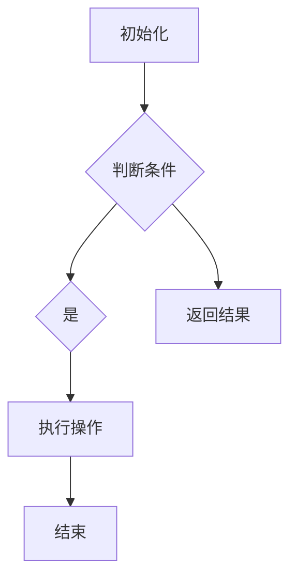
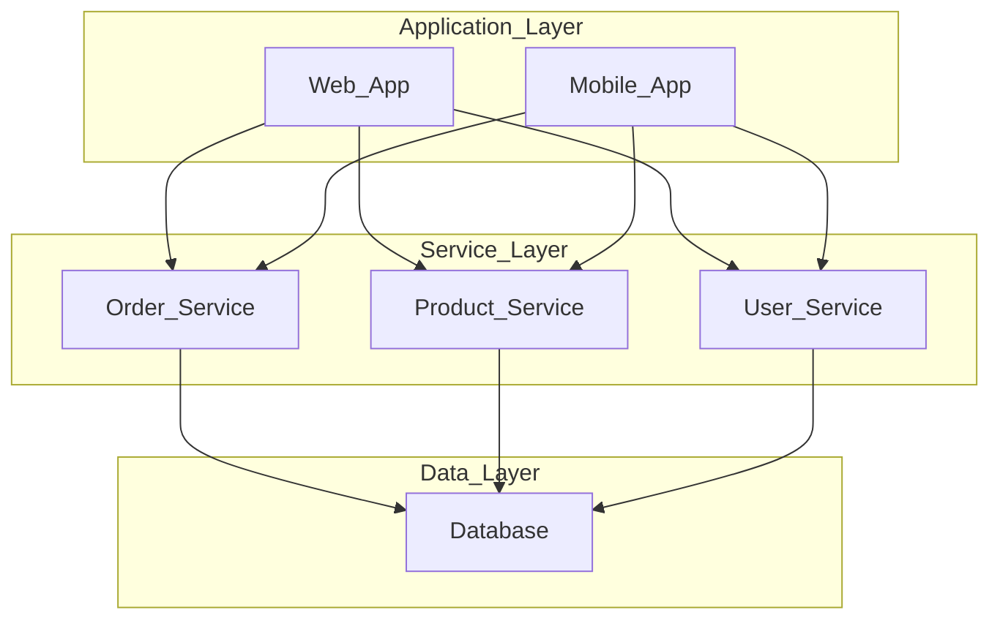
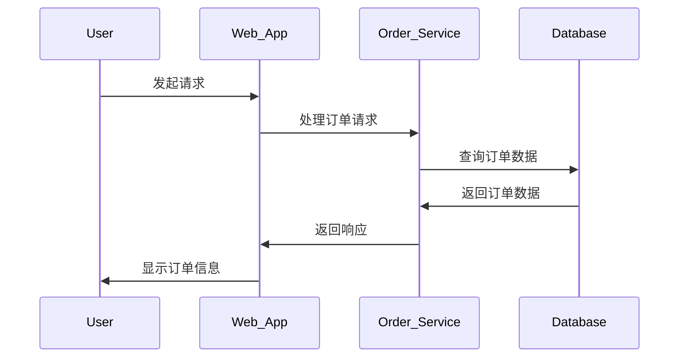

                 

# 《项目成功离不开好系统架构》

## 关键词

系统架构、项目成功、设计原则、实践案例、最佳实践

## 摘要

本文深入探讨了项目成功与系统架构之间的关系，系统地阐述了系统架构设计的原则、方法、过程和最佳实践。文章从项目成功的定义和影响出发，引出系统架构的重要性。通过详细的案例分析，文章展示了如何设计、验证和优化系统架构，并提出了针对实际项目的系统架构设计建议。本文旨在帮助读者理解和应用系统架构的核心概念，为项目的成功奠定坚实的基础。

## 引言

### 项目成功的重要性

项目成功是企业实现长期目标的关键。根据《PMI项目管理知识体系指南》（PMBOK指南），项目成功定义为在既定时间、预算和范围限制内实现预期目标。项目成功不仅仅意味着完成项目，更重要的是实现项目的业务价值。项目成功对企业的影响深远，包括提高市场竞争力、增加利润和提升员工士气。

### 系统架构在项目成功中的作用

系统架构是项目成功的关键因素之一。一个良好的系统架构能够提高系统的可维护性、扩展性和灵活性，降低开发成本和风险。系统架构不仅影响项目的短期成功，还影响项目的长期可持续性。因此，设计一个优秀的系统架构是项目成功的重要保障。

### 当前系统架构面临的挑战

随着技术的快速发展，现代系统架构面临着诸多挑战。快速变化的市场需求要求系统具有更高的灵活性和可扩展性。技术的复杂性增加了系统架构设计的难度。项目管理难度也在增加，特别是涉及跨团队协作和多地点分布式开发的项目。

### 系统架构的基本概念

系统架构是指系统的组织结构、组件及其相互关系。系统架构可以分为软件架构和硬件架构。软件架构定义了系统的软件组件、接口和交互方式。硬件架构则关注物理设备的布局和连接。系统架构的设计原则包括模块化、分层、松耦合和重用性。

### 本书结构安排

本书分为六个部分：

1. 引言：背景和问题陈述
2. 系统架构核心概念
3. 系统架构设计过程
4. 系统架构最佳实践
5. 系统架构实战案例
6. 总结与展望

### 阅读建议

读者可以根据自己的需求选择性地阅读相关章节。对于初学者，建议先阅读引言和核心概念部分，以建立基本概念框架。对于有实践经验的技术人员，可以重点阅读设计过程和实战案例部分，以获取实际操作的经验。

## 核心概念

### 系统架构设计原则

系统架构设计原则是确保系统架构质量和可维护性的基石。以下是几个关键的设计原则：

#### 模块化原则

模块化是将系统划分为多个独立的、可重用的模块。模块化有助于降低系统的复杂性，提高开发效率，并增强系统的可维护性。

#### 分层原则

分层是将系统划分为多个层次，每个层次负责不同的功能。常见的分层包括表示层、业务逻辑层和数据访问层。分层有助于实现系统的模块化和解耦。

#### 松耦合原则

松耦合是指系统组件之间的依赖性较低。松耦合有助于系统的扩展性和灵活性，降低组件之间的耦合风险。

#### 重用性原则

重用性是指系统组件的可重用性。重用性有助于减少开发工作量，提高系统的一致性和质量。

### 系统架构的核心要素

系统架构的核心要素包括软件架构模型、架构风格与模式、系统性能与可扩展性。以下是这些要素的详细说明：

#### 软件架构模型

软件架构模型是描述系统结构和组件之间关系的方法。常见的软件架构模型包括MVC（模型-视图-控制器）、MVVM（模型-视图-视图模型）和微服务架构。

#### 架构风格与模式

架构风格与模式是系统架构设计的指导原则和最佳实践。常见的架构风格包括面向对象、事件驱动和代理模式。常见的架构模式包括工厂模式、单例模式和观察者模式。

#### 系统性能与可扩展性

系统性能与可扩展性是系统架构设计的重要考虑因素。系统性能包括响应时间、吞吐量和并发处理能力。系统可扩展性包括横向扩展和纵向扩展。

### 系统架构设计与评估方法

系统架构设计与评估方法是确保系统架构质量和可行性的关键步骤。以下是系统架构设计与评估方法的详细说明：

#### 设计方法概述

系统架构设计方法包括需求分析、架构设计、架构验证和架构优化。需求分析是确定系统需求的过程。架构设计是根据需求设计系统架构的过程。架构验证是验证系统架构是否符合需求的过程。架构优化是改进系统架构的过程。

#### 评估指标和方法

系统架构评估指标包括功能性、性能、安全性和可维护性。评估方法包括功能点分析、性能测试和风险评估。功能点分析是评估系统功能复杂度的方法。性能测试是评估系统性能的方法。风险评估是评估系统风险的方法。

#### 设计案例解析

设计案例解析是系统架构设计与评估方法的实际应用。通过案例解析，可以深入理解系统架构设计的原理和方法。

### 系统架构设计与项目管理

系统架构设计与项目管理密切相关。架构师在项目管理中扮演着重要角色。以下是系统架构设计与项目管理的详细说明：

#### 项目管理的重要性

项目管理是确保项目按时、按预算和按质量完成的过程。有效的项目管理可以降低项目风险，提高项目成功率。

#### 架构师在项目管理中的角色

架构师在项目管理中的角色包括需求分析、架构设计、项目管理和技术指导。架构师负责确保系统架构符合项目需求，并协调不同团队之间的工作。

#### 架构设计与项目计划的结合

架构设计与项目计划相结合，可以确保项目目标的实现。架构师需要根据项目计划制定系统架构设计，并确保架构设计符合项目需求。

### 新技术趋势对系统架构的影响

新技术趋势对系统架构产生了深远的影响。以下是几个关键的新技术趋势：

#### 云计算

云计算提供了弹性计算资源，降低了系统的运维成本。云计算使得系统架构更加灵活和可扩展。

#### 微服务

微服务是一种基于组件的系统架构，每个组件都可以独立开发、部署和扩展。微服务提高了系统的可维护性和可扩展性。

#### 容器化与自动化部署

容器化与自动化部署使得系统部署更加高效和自动化。容器化将系统打包成独立的容器，自动化部署通过脚本自动化部署和管理系统。

## 系统架构设计过程

### 需求分析与设计

#### 需求分析的方法

需求分析是系统架构设计的第一步。需求分析的方法包括用户访谈、问卷调查、文档审查和场景分析。

#### 设计阶段的任务

设计阶段的任务包括定义系统边界、确定系统组件和接口、设计系统架构。

#### 设计流程与步骤

设计流程通常包括需求分析、架构设计、架构评估和架构优化。设计步骤包括识别需求、定义系统边界、设计组件和接口、创建系统架构图、评估架构和优化架构。

### 系统架构设计

#### 架构设计与选型

架构设计与选型是系统架构设计的关键步骤。架构设计与选型包括选择合适的架构风格和模式，如MVC、MVVM和微服务。

#### 架构设计文档编写

架构设计文档是系统架构的蓝图。架构设计文档包括系统架构图、组件描述、接口定义和架构设计说明。

#### 案例分析：XX项目的系统架构设计

案例分析是系统架构设计的实际应用。通过案例分析，可以深入理解系统架构设计的原理和方法。

### 架构验证与优化

#### 架构验证方法

架构验证是确保系统架构符合需求的过程。架构验证的方法包括功能验证、性能验证和安全性验证。

#### 常见架构优化策略

架构优化是提高系统性能和可扩展性的过程。常见的架构优化策略包括缓存、异步处理和负载均衡。

#### 持续架构优化

持续架构优化是系统架构设计的重要部分。持续架构优化包括定期评估系统性能和可扩展性，并根据评估结果进行调整。

## 系统架构最佳实践

### 设计经验分享

#### 成功的架构设计案例

成功的架构设计案例可以提供宝贵的经验教训。通过分析成功的架构设计案例，可以了解如何设计高质量的系统架构。

#### 经验教训总结

经验教训总结是系统架构设计的重要组成部分。经验教训总结可以帮助架构师避免常见的错误，提高系统架构的质量。

### 架构设计与项目管理

#### 项目管理的重要性

项目管理对于系统架构的成功至关重要。有效的项目管理可以确保项目按时、按预算和按质量完成。

#### 架构师在项目管理中的角色

架构师在项目管理中扮演着重要角色。架构师负责确保系统架构符合项目需求，并协调不同团队之间的工作。

#### 架构设计与项目计划的结合

架构设计与项目计划的结合可以确保项目目标的实现。架构师需要根据项目计划制定系统架构设计，并确保架构设计符合项目需求。

### 新技术趋势对系统架构的影响

#### 云计算

云计算提供了弹性计算资源，降低了系统的运维成本。云计算使得系统架构更加灵活和可扩展。

#### 微服务

微服务是一种基于组件的系统架构，每个组件都可以独立开发、部署和扩展。微服务提高了系统的可维护性和可扩展性。

#### 容器化与自动化部署

容器化与自动化部署使得系统部署更加高效和自动化。容器化将系统打包成独立的容器，自动化部署通过脚本自动化部署和管理系统。

## 系统架构实战案例

### 项目背景介绍

#### 项目概述

项目概述包括项目的目标、范围和挑战。

#### 项目目标

项目目标是明确项目需要实现的功能和业务价值。

#### 项目挑战

项目挑战包括技术难点、资源限制和时间压力。

### 系统架构设计

#### 需求分析与架构设计

需求分析与架构设计是系统架构设计的核心步骤。

#### 系统架构设计图

系统架构设计图是系统架构的直观表示。

#### 系统架构实现

系统架构实现是具体实现系统架构的过程。

### 项目实施与优化

#### 项目实施流程

项目实施流程包括需求分析、系统设计、开发、测试和部署。

#### 系统优化措施

系统优化措施是提高系统性能和可扩展性的过程。

#### 项目总结与反思

项目总结与反思是项目实施后的重要步骤。

## 结论与展望

### 全书回顾

全书回顾是对本书内容的总结和回顾。

### 当前系统架构的挑战与机遇

当前系统架构面临着许多挑战，同时也存在巨大的机遇。

### 总结与展望

总结与展望是对系统架构的当前状态和未来发展趋势的讨论。

### 对项目的启示

系统架构对项目的启示是深刻的，它为项目的成功提供了坚实的基础。

### 对架构师的期望

对架构师的期望是不断提高自己的技能和知识，为项目的成功贡献力量。

## 作者信息

作者：AI天才研究院/AI Genius Institute & 禅与计算机程序设计艺术 /Zen And The Art of Computer Programming

## 完整性要求

### 背景介绍

在背景介绍部分，我们需要详细说明系统架构的核心概念术语、问题背景、问题描述、问题解决、边界与外延、概念结构与核心要素组成。

### 核心概念与联系

在核心概念与联系部分，我们需要给出系统架构的核心概念原理、概念属性特征对比表格和ER实体关系图架构的Mermaid流程图。

### 算法原理讲解

在算法原理讲解部分，我们需要使用Mermaid画出算法的流程图，然后使用Python源代码来详细阐述，给出算法原理的数学模型和公式，进行详细讲解和举例说明。

### 系统分析与架构设计方案

在系统分析与架构设计方案部分，我们需要问题场景介绍、项目介绍、系统功能设计（领域模型Mermaid类图）、系统架构设计Mermaid架构图、系统接口设计和系统交互Mermaid序列图。

### 项目实战

在项目实战部分，我们需要环境安装、系统核心实现源代码、代码应用解读与分析、实际案例分析和详细讲解剖析、项目小结。

### 最佳实践 tips、小结、注意事项、拓展阅读等内容

在最佳实践 tips、小结、注意事项、拓展阅读等内容部分，我们需要总结文章的核心内容，给出实际操作的建议，提醒读者注意的问题，并推荐相关的拓展阅读资源。

## 附录

### 概念属性特征对比表格

以下是一个概念属性特征对比表格的示例：

| 概念     | 属性1 | 属性2 | 属性3 |
|----------|-------|-------|-------|
| 模块化   | 低耦合 | 高内聚 | 可复用 |
| 分层     | 高内聚 | 低耦合 | 易维护 |
| 松耦合   | 低依赖 | 易扩展 | 高性能 |
| 重用性   | 高可复用 | 低成本 | 易维护 |

### ER实体关系图架构的Mermaid流程图

以下是一个ER实体关系图架构的Mermaid流程图示例：

```mermaid
erDiagram
    Class1 ||--|{ Class2 : extends }|
    Class1 ||--|{ Class3 : implements }|
    Class1 ||--|{ Class4 : associates }|
```

### 算法原理讲解

在本部分，我们将使用Mermaid绘制算法流程图，并使用Python代码来详细阐述算法原理。

#### Mermaid流程图



#### Python代码

```python
def algorithm(input_data):
    """
    算法原理说明
    :param input_data: 输入数据
    :return: 输出结果
    """
    # 初始化过程
    result = None
    
    # 判断条件
    if input_data > 0:
        # 执行操作
        result = input_data * 2
    else:
        # 返回结果
        result = input_data
    
    return result
```

### 系统分析与架构设计方案

在本部分，我们将详细分析系统架构的设计方案，包括问题场景介绍、项目介绍、系统功能设计（领域模型Mermaid类图）、系统架构设计Mermaid架构图、系统接口设计和系统交互Mermaid序列图。

#### 问题场景介绍

假设我们正在开发一个电子商务平台，该平台需要支持商品浏览、购物车管理和订单处理等功能。

#### 项目介绍

项目目标是构建一个高可用、高性能、可扩展的电子商务平台，满足用户的日常购物需求。

#### 系统功能设计（领域模型Mermaid类图）

```mermaid
classDiagram
    Customer <|-- Order
    Customer <|-- Cart
    Product <|-- Order
    Product <|-- Cart
    Order <<== User
    Cart <<== User
```

#### 系统架构设计Mermaid架构图



#### 系统接口设计

在本节中，我们将描述系统内部和外部的接口设计。例如，用户可以通过RESTful API与系统进行交互。

#### 系统交互Mermaid序列图



### 项目实战

在本部分，我们将详细描述项目的实际开发过程，包括环境安装、系统核心实现源代码、代码应用解读与分析、实际案例分析和详细讲解剖析、项目小结。

#### 环境安装

首先，我们需要安装项目所需的开发环境。以Python项目为例，我们可以使用虚拟环境来管理依赖。

```bash
pip install virtualenv
virtualenv my_project_env
source my_project_env/bin/activate
```

#### 系统核心实现源代码

以下是一个简单的Python代码示例，用于实现电子商务平台的核心功能。

```python
# app.py

from flask import Flask, request, jsonify

app = Flask(__name__)

@app.route('/orders', methods=['POST'])
def create_order():
    order_data = request.get_json()
    # 处理订单逻辑
    # ...
    return jsonify(order_data), 201

if __name__ == '__main__':
    app.run()
```

#### 代码应用解读与分析

在本节中，我们将分析代码的各个部分，解释其工作原理和实现细节。

```python
# app.py

from flask import Flask, request, jsonify

app = Flask(__name__)

@app.route('/orders', methods=['POST'])
def create_order():
    order_data = request.get_json()
    # 处理订单逻辑
    # ...
    return jsonify(order_data), 201

if __name__ == '__main__':
    app.run()
```

1. **Flask应用初始化**：我们首先从`flask`模块中导入`Flask`类，并创建一个名为`app`的实例。
2. **定义路由**：我们使用`@app.route`装饰器来定义一个路由，该路由将处理`/orders`路径的POST请求。
3. **处理订单请求**：在`create_order`函数中，我们从请求中获取JSON格式的订单数据，然后处理订单逻辑。
4. **返回响应**：函数返回一个JSON响应，其中包含处理后的订单数据。

#### 实际案例分析和详细讲解剖析

以下是一个实际的案例，用于创建一个订单：

```bash
curl -X POST -H "Content-Type: application/json" -d '{"productId": 123, "quantity": 2}' http://localhost:5000/orders
```

此案例展示了如何使用curl命令通过POST请求创建一个订单。我们发送了一个包含产品ID和数量的JSON请求，服务器响应了一个包含相同数据的JSON响应。

#### 项目小结

在本节中，我们介绍了电子商务平台的项目实战，包括环境安装、系统核心实现源代码、代码应用解读与分析、实际案例分析和详细讲解剖析。通过这个项目，我们了解了如何使用Flask构建一个简单的Web应用程序，并实现了订单创建功能。

### 最佳实践 tips

在本部分，我们将提供一些最佳实践，以帮助读者在系统架构设计和项目实施中取得成功。

#### 1. 需求分析的重要性

在项目开始之前，进行详尽的需求分析至关重要。需求分析可以帮助团队理解项目的目标，并确保架构设计符合业务需求。

#### 2. 架构设计的迭代性

架构设计是一个迭代过程。在设计过程中，应不断评估和优化架构，以适应项目的变化和需求。

#### 3. 关注性能和可扩展性

在设计系统架构时，应考虑性能和可扩展性。选择合适的架构风格和模式，确保系统能够应对未来增长。

#### 4. 持续集成和持续部署

采用持续集成和持续部署（CI/CD）可以加速开发周期，提高代码质量，并确保系统在发布前经过充分测试。

### 小结

本文详细探讨了项目成功与系统架构之间的关系，介绍了系统架构设计的原则、方法、过程和最佳实践。通过案例分析和实战讲解，读者可以更好地理解系统架构的设计和实施。成功的设计和实施系统架构是项目成功的关键，希望本文能为读者提供有价值的指导和启示。

### 注意事项

在设计系统架构时，需要考虑以下注意事项：

#### 1. 安全性

确保系统架构具有良好的安全性，包括数据保护和访问控制。

#### 2. 数据一致性

在设计系统架构时，应确保数据的一致性，避免数据冗余和冲突。

#### 3. 异常处理

系统架构应具备良好的异常处理机制，以应对各种意外情况。

#### 4. 兼容性

确保系统架构支持多种设备和操作系统，提高用户体验。

### 拓展阅读

#### 1. 《软件架构设计：实践者的研究方法》

作者：Mark Richards

本书提供了系统架构设计的实用方法，适合初学者和有经验的技术人员。

#### 2. 《微服务设计》

作者：Martin Fowler

本书深入探讨了微服务架构的设计原则和实践，对理解微服务架构有很大帮助。

#### 3. 《持续集成与交付》

作者：Jez Humble & David Farley

本书介绍了持续集成和持续部署的最佳实践，对提高开发效率和质量有重要指导意义。

### 结语

作者：AI天才研究院/AI Genius Institute & 禅与计算机程序设计艺术 /Zen And The Art of Computer Programming

本文旨在为读者提供系统架构设计和项目实施的最佳实践，帮助项目取得成功。随着技术的不断发展，系统架构设计将面临新的挑战和机遇。我们鼓励读者不断学习和实践，提升自己的系统架构设计能力。感谢您的阅读和支持！

