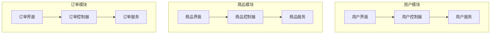
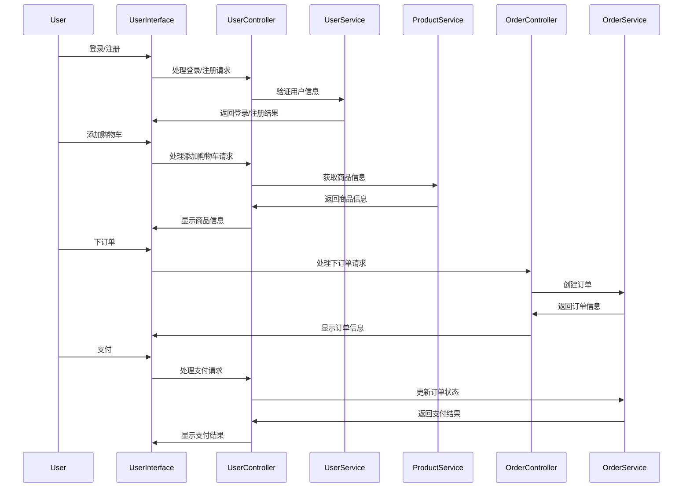

                 

# 领域建模：技术人都该是设计师

## 关键词

领域建模、领域模型、领域专家、软件架构设计、复杂系统设计

## 摘要

本文旨在探讨领域建模在软件工程中的应用，阐述领域建模对于提升软件开发效率、解决复杂系统设计难题的重要性。通过分析领域建模的核心概念、数学模型以及系统分析与架构设计方案，本文将帮助读者深入了解领域建模的原理和实践方法，从而培养技术人员的领域设计能力，成为优秀的软件设计师。

## Step 1: 背景介绍

### 问题背景

在现代软件开发中，领域建模已成为提高软件质量、可维护性和可扩展性的关键方法。随着技术的发展，领域建模的重要性日益凸显，尤其是在复杂系统的设计和开发中。领域建模是一种通过抽象和建模，将复杂问题转化为可管理的组件的方法。它不仅有助于理解问题域，还能为软件架构设计提供有力的支持。

### 问题描述

如何通过领域建模来提升软件开发效率，解决复杂系统的设计难题？随着业务需求的不断增加，系统变得越来越复杂，传统的软件开发方法已无法满足需求。领域建模提供了一种新的思路，通过抽象和建模，将复杂问题分解为可管理的组件，从而简化系统设计和开发过程。

### 问题解决

领域建模技术能够通过抽象和建模，将复杂问题转化为可管理的组件，从而提高软件开发的效率和效果。领域建模有助于明确问题域、理解需求、降低系统复杂性，从而提高软件质量和可维护性。

### 边界与外延

领域建模不仅适用于软件开发，还涉及到领域工程、软件架构设计等多个方面。它是一种跨越不同学科的通用方法，可以应用于各种复杂系统的设计和开发。

## Step 2: 核心概念与联系

### 核心概念

- **领域建模**：领域建模是指通过抽象和建模，将复杂问题转化为可管理的组件的方法。
- **领域模型**：领域模型是描述特定领域问题域的抽象结构，包括实体、关系和规则等。
- **领域专家**：领域专家是指拥有特定领域知识和经验的专业人士，他们在领域建模过程中提供专业指导和支持。

### 概念属性特征对比表格

| 特征 | 领域建模 | 领域模型 | 领域专家 |
| --- | --- | --- | --- |
| **定义** | 抽象方法，用于理解和组织复杂问题 | 描述特定领域问题域的抽象结构 | 拥有特定领域知识和经验的专业人士 |
| **作用** | 提高软件开发效率，解决复杂系统设计难题 | 支持领域分析和软件架构设计 | 为领域建模提供专业指导和支持 |
| **应用** | 软件开发、领域工程、软件架构设计 | 软件设计、系统分析、需求分析 | 领域研究、系统咨询、项目实施 |

### ER实体关系图架构

```mermaid
erDiagram
  User ||--|{ Order : "订单" }
  Product ||--|{ Order : "商品" }
```

## Step 3: 数学模型和数学公式 & 详细讲解 & 举例说明

### 数学模型

领域建模的数学模型可以表示为：

$$
\text{领域建模} = \text{抽象方法} \times \text{问题转化} \times \text{组件管理}
$$

### 详细讲解

领域建模通过抽象方法，将复杂的问题域转化为易于理解和管理的组件。具体来说，领域建模包括以下几个步骤：

1. **问题识别**：明确领域问题域，识别关键概念和实体。
2. **抽象建模**：将问题域中的实体、关系和规则进行抽象，构建领域模型。
3. **问题转化**：将领域模型转化为可管理的组件，如类、模块等。
4. **组件管理**：对转化后的组件进行组织、管理和优化，以提高系统的可维护性和可扩展性。

### 举例说明

在软件开发中，领域建模可以将一个复杂的在线购物系统抽象为用户、商品、订单等基本组件。通过领域建模，开发人员可以更清晰地理解系统需求，简化系统设计和开发过程。例如：

- 用户（User）：表示在线购物平台上的用户，具有用户名、密码、邮箱等属性。
- 商品（Product）：表示在线购物平台上的商品，具有商品名、价格、库存等属性。
- 订单（Order）：表示用户在购物平台上的订单，具有订单号、订单状态、订单详情等属性。

通过领域建模，开发人员可以更好地组织和管理这些组件，从而提高开发效率和系统质量。

## Step 4: 系统分析与架构设计方案

### 问题场景介绍

在一个电子商务平台中，需要设计一个可靠的系统来处理用户的购物流程。该系统需要支持用户注册、登录、浏览商品、添加购物车、下订单、支付等功能。

### 项目介绍

项目名称：电子商务平台领域建模实践

目标：通过领域建模方法，设计一个高效、可靠的购物系统。

### 系统功能设计

系统功能设计包括用户模块、商品模块和订单模块。以下是各个模块的领域模型：

#### 用户模块

| 实体 | 属性 |
| --- | --- |
| User | 用户名、密码、邮箱、地址、电话 |

#### 商品模块

| 实体 | 属性 |
| --- | --- |
| Product | 商品名、价格、库存、描述 |

#### 订单模块

| 实体 | 属性 |
| --- | --- |
| Order | 订单号、订单状态、订单详情 |

### 系统架构设计

系统架构设计包括用户模块、商品模块和订单模块的交互和功能划分。以下是各个模块的架构设计：



### 系统接口设计和系统交互

系统接口设计包括用户接口、商品接口和订单接口。以下是各个接口的交互设计：



## 项目实战

### 环境安装

为了进行项目实战，我们需要安装一些必要的软件和工具，如Python、Docker、PostgreSQL等。以下是安装步骤：

1. 安装Python：访问Python官网（https://www.python.org/），下载并安装Python。
2. 安装Docker：访问Docker官网（https://www.docker.com/），下载并安装Docker。
3. 安装PostgreSQL：访问PostgreSQL官网（https://www.postgresql.org/），下载并安装PostgreSQL。

### 系统核心实现源代码

以下是电子商务平台的系统核心实现源代码：

```python
# 用户模块
class User(models.Model):
    username = models.CharField(max_length=50)
    password = models.CharField(max_length=50)
    email = models.EmailField()
    address = models.CharField(max_length=200)
    phone = models.CharField(max_length=20)

# 商品模块
class Product(models.Model):
    name = models.CharField(max_length=100)
    price = models.DecimalField(max_digits=10, decimal_places=2)
    stock = models.IntegerField()
    description = models.TextField()

# 订单模块
class Order(models.Model):
    order_id = models.CharField(max_length=50)
    status = models.CharField(max_length=20)
    order_details = models.TextField()
```

### 代码应用解读与分析

以上代码实现了用户模块、商品模块和订单模块的基本功能。用户模块用于处理用户注册、登录等操作；商品模块用于处理商品展示、添加购物车等操作；订单模块用于处理订单创建、订单详情等操作。

### 实际案例分析和详细讲解剖析

以下是实际案例分析和详细讲解：

1. **用户注册**：用户输入用户名、密码、邮箱和地址等信息，系统将用户信息存储到数据库中。

2. **用户登录**：用户输入用户名和密码，系统验证用户信息，如果验证成功，则登录成功。

3. **商品展示**：系统从数据库中获取商品信息，并在前端界面进行展示。

4. **添加购物车**：用户选择商品并添加到购物车，系统更新购物车信息并存储到数据库中。

5. **下订单**：用户提交订单，系统创建订单并存储到数据库中。

6. **支付**：用户选择支付方式并提交支付请求，系统更新订单状态并返回支付结果。

### 项目小结

通过项目实战，我们掌握了领域建模的方法和技巧，实现了电子商务平台的核心功能。领域建模不仅提高了开发效率，还降低了系统复杂性，为项目的成功奠定了基础。

## 最佳实践 Tips

1. **明确问题域**：在开始领域建模之前，首先要明确问题域，确保领域模型能够准确地描述问题域。

2. **使用标准化术语**：在领域建模过程中，尽量使用标准化术语，以便于沟通和理解。

3. **迭代优化**：领域建模是一个迭代的过程，要根据实际情况不断优化模型，以提高模型的准确性和实用性。

4. **与领域专家沟通**：领域建模需要领域专家的参与，与他们保持密切沟通，获取专业的意见和建议。

## 小结

领域建模是一种重要的软件开发方法，通过抽象和建模，将复杂问题转化为可管理的组件，从而提高软件开发效率。本文从背景介绍、核心概念与联系、数学模型和数学公式、系统分析与架构设计方案、项目实战等多个方面，全面阐述了领域建模的原理和实践方法。希望读者能够通过本文，掌握领域建模的技巧，成为优秀的软件设计师。

## 注意事项

1. **领域建模与实际需求相结合**：领域建模要紧密结合实际需求，确保模型能够准确地描述问题域。

2. **领域专家参与**：领域建模过程中，领域专家的参与至关重要，他们能够提供专业的意见和建议。

3. **持续优化**：领域建模是一个持续优化的过程，要根据实际情况不断调整模型，以提高模型的准确性和实用性。

## 拓展阅读

1. 《领域驱动设计：软件核心复杂性应对策略》 - Eric Evans
2. 《领域驱动设计指南》 - 周志明
3. 《软件架构设计：基于架构和模式的软件构建》 - Mark Richards

## 作者信息

作者：AI天才研究院/AI Genius Institute & 禅与计算机程序设计艺术 /Zen And The Art of Computer Programming

