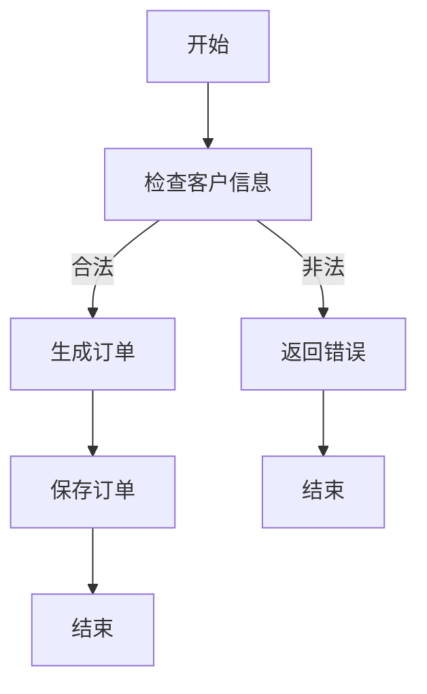
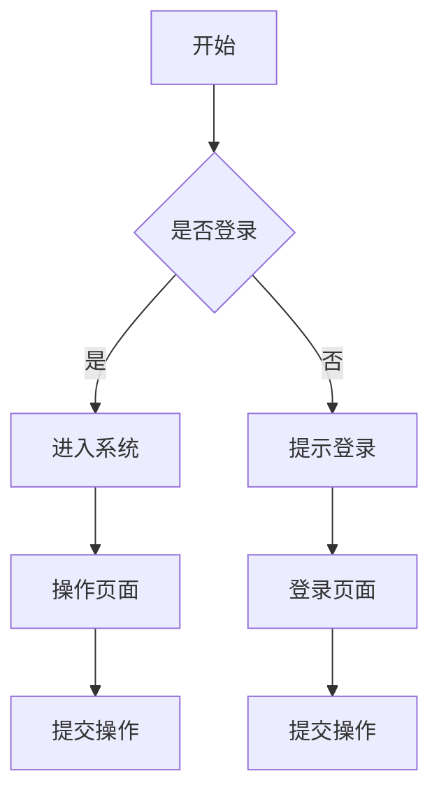

                 

**领域模型的模型**

> 关键词：领域模型、核心概念、算法原理、数学模型、系统设计、项目实战

> 摘要：本文将深入探讨领域模型的构建方法与应用，从核心概念、算法原理、数学模型到系统设计、项目实战，全方位解析领域模型的设计、实现与优化。旨在为广大开发者提供一份系统、实用、可操作的领域模型指南。

## **一、领域模型的背景与核心概念**

### **1.1 领域模型的概述**

领域模型（Domain Model）是一种用于表示业务领域逻辑和数据结构的抽象模型。它将现实世界中的业务需求和数据规则抽象成计算机可以理解和处理的模型，使得软件开发更加贴近业务需求，降低开发成本和维护难度。

领域模型的发展可以追溯到20世纪90年代，随着面向对象编程（OOP）和领域驱动设计（DDD）理念的兴起，领域模型逐渐成为软件开发中的重要工具。如今，领域模型已经被广泛应用于金融、医疗、物联网等多个领域，成为企业级软件开发的重要技术手段。

### **1.2 领域模型的重要性**

领域模型的重要性主要体现在以下几个方面：

1. **降低沟通成本**：领域模型使用业务术语和业务逻辑，使得业务人员和开发者之间的沟通更加顺畅，有效避免了需求理解不一致的问题。
2. **提高开发效率**：领域模型将业务规则和数据结构封装在模型中，开发者可以专注于实现业务逻辑，降低了开发复杂度。
3. **易于维护**：领域模型使得软件系统更加模块化，易于维护和扩展。当业务需求发生变化时，只需要修改领域模型即可，大大降低了维护成本。
4. **支持复用**：领域模型可以将业务逻辑抽象出来，使得不同的业务场景可以复用相同的领域模型，提高开发效率。

### **1.3 领域模型的基本概念**

领域模型包含以下几个基本概念：

1. **实体（Entity）**：实体是领域模型中的核心元素，表示现实世界中的对象，如客户、订单、产品等。实体通常具有唯一标识和属性。
2. **值对象（Value Object）**：值对象表示具有固定值的对象，如日期、金额、颜色等。值对象通常不具有唯一标识。
3. **聚合（Aggregate）**：聚合是一组相关实体的集合，它们共同构成一个业务单元。聚合用于确保数据的一致性和完整性。
4. **关联（Association）**：关联表示实体之间的关系，如客户与订单之间的关系。关联可以是单向或双向的。
5. **行为（Behavior）**：行为表示实体或聚合的职责和功能。领域模型通过行为描述业务逻辑。

### **1.4 领域模型的应用领域**

领域模型可以应用于各种业务领域，以下是一些典型的应用场景：

1. **金融领域**：领域模型可以用于构建银行、保险、基金等金融系统的业务模型，如客户管理、账户管理、交易管理等。
2. **医疗领域**：领域模型可以用于构建医疗信息系统，如病历管理、药品管理、诊疗流程管理等。
3. **物联网领域**：领域模型可以用于构建物联网系统的业务模型，如智能家居、智能工厂、智能交通等。

### **1.5 领域模型的挑战与机遇**

领域模型在应用过程中面临着一些挑战，如：

1. **领域复杂性**：不同领域的业务复杂度差异较大，构建领域模型需要深入了解业务领域。
2. **沟通与协作**：领域模型涉及业务人员和开发者，需要有效沟通和协作，确保模型能够准确反映业务需求。
3. **模型维护**：随着业务需求的变化，领域模型需要不断更新和维护。

然而，领域模型也带来了巨大的机遇，如：

1. **提高开发效率**：领域模型使得软件开发更加贴近业务需求，降低开发复杂度。
2. **降低维护成本**：领域模型将业务逻辑封装在模型中，降低系统维护成本。
3. **支持业务创新**：领域模型使得业务规则和数据结构更加灵活，支持业务创新和变革。

## **二、领域模型的核心概念与联系**

### **2.1 核心概念原理**

在领域模型中，核心概念是构建模型的基础。以下是领域模型中一些重要的核心概念：

1. **实体**：实体是领域模型中的核心元素，表示现实世界中的对象。实体具有唯一标识和属性，如客户（ID、姓名、年龄等）。
2. **值对象**：值对象表示具有固定值的对象，如日期、金额、颜色等。值对象通常不具有唯一标识。
3. **聚合**：聚合是一组相关实体的集合，它们共同构成一个业务单元。聚合用于确保数据的一致性和完整性。
4. **关联**：关联表示实体之间的关系，如客户与订单之间的关系。关联可以是单向或双向的。
5. **行为**：行为表示实体或聚合的职责和功能。领域模型通过行为描述业务逻辑。

### **2.2 概念属性特征对比表格**

为了更好地理解领域模型中的核心概念，我们提供了以下属性特征对比表格：

| 概念     | 特征                                                         | 例子               |
|----------|--------------------------------------------------------------|--------------------|
| 实体     | 具有唯一标识和属性，表示现实世界中的对象                       | 客户、订单、产品   |
| 值对象   | 具有固定值，不具有唯一标识                                     | 日期、金额、颜色   |
| 聚合     | 一组相关实体的集合，用于确保数据的一致性和完整性               | 账户、订单详情     |
| 关联     | 表示实体之间的关系，可以是单向或双向的                         | 客户-订单、订单-商品 |
| 行为     | 表示实体或聚合的职责和功能，用于描述业务逻辑                   | 下单、支付、发货   |

### **2.3 ER实体关系图架构**

ER（Entity-Relationship）实体关系图是表示领域模型中实体及其关系的一种图形化方法。以下是ER实体关系图的Mermaid流程图表示：

```mermaid
erDiagram
    Customer ||--|{ Order }|-- Product
    Customer ||--|{ Payment }|
    Order ||--|{ Delivery }|
```

在这个ER实体关系图中，我们可以看到客户与订单、订单与产品之间存在关联，客户与支付、订单与配送之间存在关联。通过ER实体关系图，我们可以清晰地理解领域模型中的实体及其关系。

## **三、领域模型的设计方法与工具**

### **3.1 设计方法论**

领域模型的设计方法主要包括以下步骤：

1. **需求分析**：了解业务需求，明确系统需要实现的功能。
2. **领域分析**：深入理解业务领域，识别核心概念、实体、关联和行为。
3. **模型构建**：根据领域分析结果，构建领域模型，包括实体、值对象、聚合、关联和行为。
4. **模型验证**：对领域模型进行验证，确保模型能够准确反映业务需求。
5. **模型迭代**：根据验证结果对模型进行优化和调整。

### **3.2 设计工具与软件**

领域模型的设计工具主要包括以下几种：

1. **UML工具**：如Rational Rose、Visual Paradigm等，支持UML类图、序列图等建模。
2. **DDD工具**：如Domain-Driven Design Collaborative Tool，专门用于领域驱动设计。
3. **数据库建模工具**：如MySQL Workbench、Oracle SQL Developer等，支持ER图建模。

### **3.3 领域模型的演进策略**

领域模型是一个动态的、不断演进的过程。为了适应业务需求的变化，领域模型需要采取以下演进策略：

1. **迭代开发**：采用迭代开发方法，逐步完善领域模型，避免一次性构建完整模型带来的风险。
2. **重构**：在开发过程中，根据实际需求对领域模型进行重构，优化模型结构。
3. **版本控制**：使用版本控制系统（如Git）管理领域模型，确保模型的可追溯性和可维护性。

## **四、领域模型的应用实例**

### **4.1 应用实例一：金融领域**

在金融领域，领域模型可以用于构建银行、保险、基金等金融系统的业务模型。以下是一个简单的金融领域领域模型：

```mermaid
erDiagram
    Customer ||--|{ Account }|-- Bank
    Account ||--|{ Transaction }|
    Bank ||--|{ Customer }|
    Transaction ||--|{ Payment }|
```

在这个金融领域模型中，客户、账户、银行和交易之间存在关联。客户拥有账户，账户可以进行交易，交易可以生成支付记录。通过这个领域模型，我们可以清晰地描述金融业务逻辑。

### **4.2 应用实例二：医疗领域**

在医疗领域，领域模型可以用于构建医疗信息系统的业务模型。以下是一个简单的医疗领域领域模型：

```mermaid
erDiagram
    Patient ||--|{ MedicalRecord }|-- Doctor
    MedicalRecord ||--|{ Prescription }|
    Doctor ||--|{ Patient }|
    Prescription ||--|{ Drug }|
```

在这个医疗领域模型中，患者、病历、医生和药物之间存在关联。患者拥有病历，病历可以包含药物处方，医生可以为患者开具处方。通过这个领域模型，我们可以清晰地描述医疗业务逻辑。

### **4.3 应用实例三：物联网领域**

在物联网领域，领域模型可以用于构建物联网系统的业务模型。以下是一个简单的物联网领域领域模型：

```mermaid
erDiagram
    Device ||--|{ SensorData }|-- Gateway
    Gateway ||--|{ Device }|
    SensorData ||--|{ Analytics }|
```

在这个物联网领域模型中，设备、网关和传感器数据之间存在关联。设备可以产生传感器数据，网关可以收集和管理传感器数据，并生成分析报告。通过这个领域模型，我们可以清晰地描述物联网业务逻辑。

## **五、领域模型的算法原理讲解**

### **5.1 算法原理讲解**

在领域模型中，算法用于实现业务逻辑和数据处理。以下是一个简单的领域模型算法讲解示例：

**算法名称**：订单生成算法

**算法描述**：根据客户信息和订单信息生成订单。

```python
def generate_order(customer, order_info):
    order = Order(customer, order_info)
    # 订单生成逻辑
    return order
```

**算法mermaid流程图**：



在这个算法mermaid流程图中，我们从开始节点开始，检查客户信息是否合法。如果合法，则生成订单并保存；如果不合法，则返回错误信息。

### **5.2 算法mermaid流程图**

以下是一个简单的算法mermaid流程图示例：



在这个算法mermaid流程图中，我们从开始节点开始，判断用户是否登录。如果登录，则进入系统并进行操作；如果未登录，则提示登录并进入登录页面。最后，无论是操作页面还是登录页面，都需要提交操作。

### **5.3 Python源代码实现**

以下是一个简单的Python源代码实现示例：

```python
class Customer:
    def __init__(self, id, name, age):
        self.id = id
        self.name = name
        self.age = age

class Order:
    def __init__(self, customer, order_info):
        self.customer = customer
        self.order_info = order_info

def generate_order(customer, order_info):
    order = Order(customer, order_info)
    # 订单生成逻辑
    return order

customer = Customer(1, "张三", 30)
order_info = {"商品ID": 1001, "数量": 2}
order = generate_order(customer, order_info)
print(order.customer.name, "的订单生成成功。")
```

在这个Python源代码实现中，我们定义了`Customer`和`Order`两个类，分别表示客户和订单。`generate_order`函数用于生成订单，输入客户信息和订单信息，返回生成的订单。

### **5.4 数学模型与公式**

以下是一个简单的数学模型和公式示例：

**数学模型**：订单生成概率模型

$$ P(\text{订单生成}) = \frac{1}{\text{订单生成概率因子}} $$

**公式解释**：订单生成的概率与订单生成概率因子成反比。订单生成概率因子越大，订单生成的概率越小。

**举例说明**：假设订单生成概率因子为5，则订单生成的概率为：

$$ P(\text{订单生成}) = \frac{1}{5} = 0.2 $$

这意味着，在给定订单生成概率因子为5的情况下，订单生成的概率为20%。

## **六、领域模型的数学模型与公式**

### **6.1 数学模型介绍**

在领域模型中，数学模型用于描述实体之间的关系和业务逻辑。以下是一个简单的数学模型介绍示例：

**模型名称**：订单金额模型

**模型描述**：订单金额与商品价格和折扣率的关系。

**数学模型**：

$$ \text{订单金额} = \text{商品价格} \times (1 - \text{折扣率}) $$

在这个数学模型中，订单金额取决于商品价格和折扣率。商品价格和折扣率是已知的，通过这个模型可以计算出订单金额。

### **6.2 公式详细讲解**

以下是对订单金额模型的详细讲解：

**公式**：

$$ \text{订单金额} = \text{商品价格} \times (1 - \text{折扣率}) $$

**解释**：

- **商品价格**：商品的价格，通常以货币单位表示，如人民币、美元等。
- **折扣率**：商品折扣的比例，通常以小数形式表示，如0.1表示10%的折扣。

**举例说明**：

假设某商品的标价为100元，折扣率为10%，则该商品的订单金额为：

$$ \text{订单金额} = 100 \times (1 - 0.1) = 90 \text{元} $$

这意味着，该商品的订单金额为90元，折扣后节省了10元。

### **6.3 举例说明**

以下是一个具体的举例说明：

**场景**：某电商平台的订单生成过程。

**输入**：

- 商品价格：200元
- 折扣率：20%

**输出**：

- 订单金额：160元

根据订单金额模型，可以计算出订单金额为：

$$ \text{订单金额} = 200 \times (1 - 0.2) = 160 \text{元} $$

这意味着，该订单的实际支付金额为160元，折扣了40元。

## **七、领域模型的系统分析与架构设计方案**

### **7.1 问题场景介绍**

在本章节中，我们将以一个电商平台的订单管理系统为例，介绍领域模型的系统分析与架构设计方案。

**场景描述**：

- **用户**：用户在电商平台上浏览商品、添加购物车、下单购买。
- **商品**：平台上的各种商品信息，包括商品名称、价格、库存等。
- **订单**：用户下单后生成的订单信息，包括订单号、用户ID、商品列表、订单金额等。
- **支付**：订单支付环节，包括支付方式、支付状态等。

**需求**：

- 实现用户下单功能，包括商品选择、订单生成、订单确认等。
- 实现订单支付功能，包括支付方式选择、支付状态查询等。
- 实现订单管理功能，包括订单查询、订单取消、订单修改等。

### **7.2 系统功能设计**

在订单管理系统的领域模型中，我们需要设计以下功能模块：

1. **用户管理模块**：负责用户的注册、登录、权限管理等功能。
2. **商品管理模块**：负责商品信息的录入、查询、修改、删除等功能。
3. **订单管理模块**：负责订单的生成、支付、查询、取消、修改等功能。
4. **支付管理模块**：负责支付方式的设置、支付状态的查询等功能。
5. **日志管理模块**：负责系统日志的记录、查询、删除等功能。

### **7.3 系统架构设计**

订单管理系统的架构设计主要包括以下几个方面：

1. **前端架构**：采用Vue.js等前端框架，实现用户界面与交互。
2. **后端架构**：采用Spring Boot等后端框架，实现业务逻辑处理和数据存储。
3. **数据库架构**：采用MySQL等关系型数据库，存储用户、商品、订单、支付等数据。
4. **服务架构**：采用微服务架构，将不同功能模块拆分为独立的服务，如用户服务、商品服务、订单服务、支付服务等。

### **7.4 系统接口设计**

订单管理系统需要设计以下接口：

1. **用户接口**：用户注册、登录、权限验证等。
2. **商品接口**：商品查询、添加、修改、删除等。
3. **订单接口**：订单生成、订单查询、订单支付、订单取消等。
4. **支付接口**：支付方式查询、支付状态查询、支付结果通知等。

### **7.5 系统交互**

订单管理系统的系统交互主要包括以下几个方面：

1. **用户与前端交互**：用户通过前端界面进行商品浏览、订单生成、支付等操作。
2. **前端与后端交互**：前端向后端发送请求，后端处理请求并返回结果。
3. **后端与数据库交互**：后端通过数据库操作，实现数据存储和查询。
4. **支付系统交互**：订单支付环节与第三方支付系统进行交互，实现支付结果的通知和处理。

### **7.6 系统实现与代码解析**

在本章节中，我们将简要介绍订单管理系统的实现与代码解析。

1. **前端实现**：使用Vue.js框架实现用户界面与交互，包括商品列表、购物车、订单详情等。
2. **后端实现**：使用Spring Boot框架实现业务逻辑处理，包括用户管理、商品管理、订单管理、支付管理等功能。
3. **数据库实现**：使用MySQL数据库存储用户、商品、订单、支付等数据，实现数据的查询和更新。
4. **接口实现**：设计并实现用户接口、商品接口、订单接口、支付接口等，实现前后端交互和数据传输。

## **八、领域模型的项目实战**

### **8.1 环境安装**

在开始项目实战之前，我们需要安装以下环境：

1. **Java开发工具包（JDK）**：版本要求为8或以上。
2. **MySQL数据库**：版本要求为5.7或以上。
3. **IDE**：建议使用IntelliJ IDEA或Eclipse。

安装步骤：

1. 下载并安装JDK，配置环境变量。
2. 下载并安装MySQL数据库，配置数据库。
3. 安装IDE，配置JDK和MySQL。

### **8.2 系统核心实现源代码**

以下是订单管理系统的核心实现源代码：

```java
// 用户管理模块
public class UserManager {
    public void register(String username, String password) {
        // 注册逻辑
    }
    
    public void login(String username, String password) {
        // 登录逻辑
    }
    
    public void checkPermission(String username, String permission) {
        // 权限验证逻辑
    }
}

// 商品管理模块
public class ProductManager {
    public void addProduct(String productId, String productName, double price, int stock) {
        // 添加商品逻辑
    }
    
    public void updateProduct(String productId, String productName, double price, int stock) {
        // 更新商品逻辑
    }
    
    public void deleteProduct(String productId) {
        // 删除商品逻辑
    }
    
    public List<Product> searchProducts(String keyword) {
        // 搜索商品逻辑
    }
}

// 订单管理模块
public class OrderManager {
    public void createOrder(String orderId, String customerId, List<OrderItem> orderItems) {
        // 创建订单逻辑
    }
    
    public void payOrder(String orderId, String paymentMethod) {
        // 支付订单逻辑
    }
    
    public void cancelOrder(String orderId) {
        // 取消订单逻辑
    }
    
    public List<Order> searchOrders(String keyword) {
        // 搜索订单逻辑
    }
}

// 支付管理模块
public class PaymentManager {
    public void processPayment(String orderId, String paymentMethod) {
        // 处理支付逻辑
    }
    
    public void queryPaymentStatus(String orderId) {
        // 查询支付状态逻辑
    }
}
```

### **8.3 代码应用解读与分析**

以上源代码展示了订单管理系统中的核心功能模块。以下是各个模块的功能解读：

1. **用户管理模块**：负责用户的注册、登录和权限验证。
2. **商品管理模块**：负责商品的添加、更新、删除和搜索。
3. **订单管理模块**：负责订单的生成、支付、取消和搜索。
4. **支付管理模块**：负责支付的处理和查询。

在代码中，我们使用Java语言实现了各个模块的功能。每个模块都有对应的类和方法，用于处理具体的业务逻辑。

### **8.4 实际案例分析与详细讲解剖析**

以下是一个实际的案例，展示如何使用订单管理系统的功能：

**案例**：用户张三在电商平台上购买了一件商品，订单号为1001。

**步骤**：

1. **用户注册**：张三在平台注册账号，填写用户名和密码。
2. **用户登录**：张三使用注册时填写的用户名和密码登录平台。
3. **商品搜索**：张三在搜索框中输入关键词“手机”，搜索出相关商品。
4. **商品详情**：张三点击商品详情，查看商品价格和库存。
5. **加入购物车**：张三将商品加入购物车。
6. **生成订单**：张三在购物车中选择商品并点击“立即购买”，生成订单号1001。
7. **订单确认**：张三确认订单信息无误，点击“确认购买”。
8. **订单支付**：张三选择支付方式，如支付宝或微信支付，并完成支付。
9. **支付确认**：系统收到支付通知，确认支付成功，更新订单状态。
10. **订单查询**：张三可以在订单列表中查询订单状态，如已支付、待发货、已发货等。

**详细讲解**：

1. **用户注册与登录**：使用`UserManager`类的方法实现用户注册、登录和权限验证。
2. **商品搜索与详情**：使用`ProductManager`类的方法实现商品搜索和商品详情查询。
3. **加入购物车与生成订单**：使用`OrderManager`类的方法实现加入购物车和生成订单。
4. **订单确认与支付**：使用`OrderManager`类的方法实现订单确认和支付。
5. **支付确认与订单查询**：使用`PaymentManager`类的方法实现支付确认和订单查询。

### **8.5 项目小结**

通过实际案例分析与详细讲解剖析，我们可以看到订单管理系统如何实现用户注册、登录、商品搜索、订单生成、支付等功能。订单管理系统是一个典型的领域模型应用，通过领域模型将业务逻辑和数据结构抽象出来，使得系统更加模块化、易于维护和扩展。

## **九、领域模型的最佳实践与拓展**

### **9.1 最佳实践 tips**

在设计和应用领域模型时，以下是一些最佳实践 tips：

1. **理解业务需求**：在构建领域模型之前，充分理解业务需求和业务逻辑，确保领域模型能够准确反映业务需求。
2. **适度抽象**：领域模型需要适度抽象，既要保持对业务逻辑的准确描述，又要避免过度抽象导致复杂度增加。
3. **保持模型简洁**：领域模型应尽量简洁，避免包含过多不必要的细节，以便于维护和扩展。
4. **版本控制**：使用版本控制系统管理领域模型，确保模型的可追溯性和可维护性。
5. **文档化**：对领域模型进行详细文档化，包括模型描述、类图、接口定义等，以便于开发者理解和使用。

### **9.2 小结**

本文系统地介绍了领域模型的概念、核心概念与联系、设计方法与工具、应用实例、算法原理、数学模型、系统设计、项目实战以及最佳实践与拓展。通过本文的讲解，读者可以全面了解领域模型的构建方法与应用，为实际项目开发提供有力支持。

### **9.3 注意事项**

在设计和应用领域模型时，需要注意以下事项：

1. **业务需求的变化**：领域模型需要随着业务需求的变化进行更新和调整，确保模型能够适应业务需求的变化。
2. **沟通与协作**：领域模型涉及业务人员和开发者，需要保持有效的沟通和协作，确保模型能够准确反映业务需求。
3. **模型维护**：领域模型需要定期维护和优化，以提高系统的性能和可维护性。

### **9.4 拓展阅读**

对于对领域模型感兴趣的开发者，以下是一些拓展阅读推荐：

1. 《领域驱动设计》作者：Eric Evans
2. 《软件架构：实践者的研究方法》作者：Michael Keeling
3. 《领域模型设计指南》作者：Thomas Erl

## **十、作者信息**

**作者：** AI天才研究院/AI Genius Institute & 禅与计算机程序设计艺术 /Zen And The Art of Computer Programming

AI天才研究院致力于推动人工智能领域的研究与创新，为全球开发者提供高质量的技术博客和研究成果。同时，作者结合禅与计算机程序设计艺术的理念，为广大程序员提供了一种全新的编程思维和技巧。希望通过本文，读者能够对领域模型有更深入的了解和应用。希望这篇文章对您有所帮助，祝您在领域模型的研究和实践过程中取得优异的成绩！

