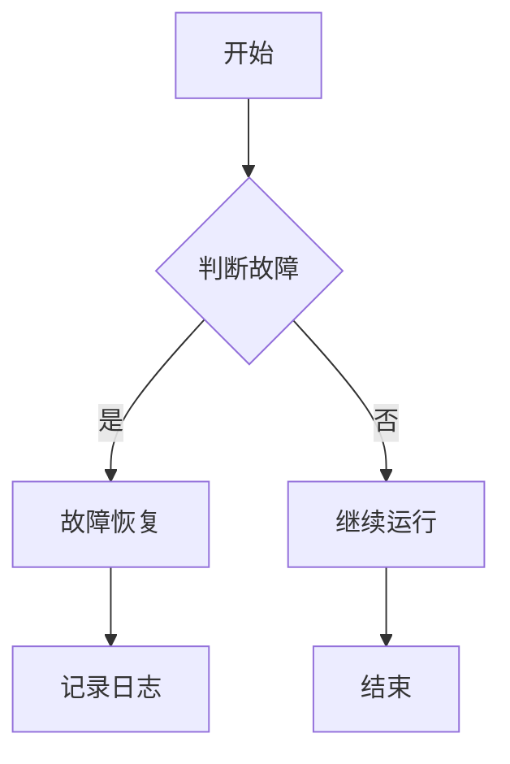
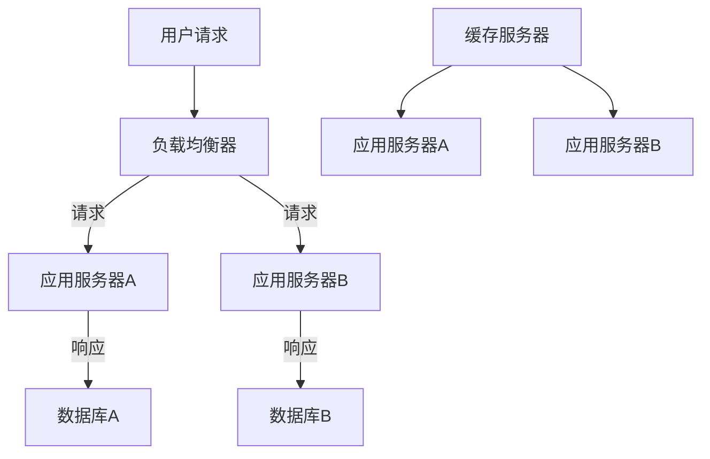
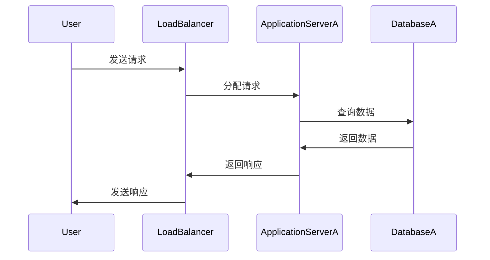

                 

### 《高可用架构设计的核心原则》

> 关键词：高可用性、架构设计、可靠性、可扩展性、容错性、负载均衡、数据备份与恢复、测试与优化

> 摘要：本文将深入探讨高可用架构设计的核心原则，分析高可用性的定义、重要性以及设计原则。通过详细案例和实践，我们将理解如何实现高可用的系统架构，并掌握最佳实践和注意事项，以提升系统的可靠性、可扩展性和可维护性。

### 引言

在现代信息化社会中，系统的可用性和稳定性对企业运营至关重要。高可用性（High Availability，简称HA）是一种设计原则，旨在确保系统在长时间内保持正常运行，减少因故障或故障而导致的停机时间。高可用性不仅仅是一个技术问题，更是一个系统设计、运维和管理的综合工程。因此，理解并掌握高可用架构设计的核心原则对系统开发者和管理者具有重要意义。

本文将围绕以下主题展开：

1. **高可用性概述**：介绍高可用性的定义、重要性和高可用性与可靠性的关系。
2. **高可用架构设计原则**：详细阐述可靠性设计、可扩展性设计、可维护性设计等核心原则。
3. **设计案例与实践**：通过具体案例，展示高可用架构设计在实际项目中的应用和实践。
4. **最佳实践与注意事项**：提供高可用性测试、常见问题解决和维护优化策略的最佳实践。
5. **拓展阅读**：推荐相关高可用技术趋势和阅读资源。

### 目录大纲设计思路

为了更好地组织文章内容，我们采用以下思路设计《高可用架构设计的核心原则》的目录大纲：

1. **结构化内容**：将书籍内容分为几个主要部分，每个部分包含多个章节，确保内容的连贯性和深入性。
2. **细化章节**：在每个部分中，细分为多个小章节，每个章节都有明确的主题和目标。
3. **逻辑连贯性**：确保章节之间的过渡自然，逻辑关系清晰。
4. **核心内容突出**：突出高可用架构设计的核心概念、原理和实践。
5. **符合书籍特点**：包含对高可用架构设计原则的深入探讨和实际案例剖析。

### 目录大纲设计步骤

**第一步：确定书籍结构**

根据书籍主题，我们可以将其大致分为以下几个部分：
- 背景介绍
- 高可用架构设计原则
- 设计案例与实践
- 最佳实践与注意事项
- 拓展阅读

**第二步：细化各部分内容**

1. **背景介绍**
   - 高可用性概述
   - 高可用性与可靠性
   - 高可用架构设计的必要性

2. **高可用架构设计原则**
   - 基本原则
   - 可靠性设计
   - 可扩展性设计
   - 可维护性设计

3. **设计案例与实践**
   - 案例一：负载均衡设计
   - 案例二：容错设计
   - 案例三：数据备份与恢复

4. **最佳实践与注意事项**
   - 高可用性测试
   - 常见问题与解决
   - 维护与优化策略

5. **拓展阅读**
   - 最新高可用技术趋势
   - 相关阅读资源推荐

**第三步：撰写目录大纲**

根据以上结构，我们可以开始撰写目录大纲。每个部分和章节都需要有一个简短的介绍，以确保内容的连贯性和逻辑性。

**第四步：确保内容完整性**

在撰写目录大纲时，我们需要确保每个章节都有详细的子章节，并且涵盖了书籍的核心内容。这包括：

- **核心概念与联系**：介绍高可用架构设计的核心概念，并展示它们之间的联系。
- **算法原理讲解**：使用 mermaid 画出相关算法的流程图，并使用 Python 源代码详细阐述。
- **数学模型和公式**：给出数学模型和公式，并进行详细讲解。
- **系统分析与架构设计方案**：介绍具体的问题场景、系统功能设计、系统架构设计和系统交互。
- **项目实战**：提供环境安装、系统核心实现源代码，并对代码进行解读与分析。

**第五步：审查与修改**

完成初步的目录大纲后，我们需要对其进行审查和修改，确保：

- 目录大纲的结构合理，逻辑清晰。
- 每个章节的内容详尽，且与书籍的主题紧密相关。
- 目录大纲的总字数符合要求。

### 目录大纲示例

```markdown
# 《高可用架构设计的核心原则》目录大纲

## 第1章 引言
### 1.1 书籍背景
### 1.2 高可用性概述
### 1.3 书籍目标与结构

## 第2章 高可用性基础
### 2.1 高可用性与可靠性
### 2.2 高可用架构设计的必要性
### 2.3 高可用性的度量

## 第3章 高可用架构设计原则
### 3.1 基本原则
### 3.2 可靠性设计
### 3.3 可扩展性设计
### 3.4 可维护性设计

## 第4章 负载均衡设计
### 4.1 负载均衡概述
### 4.2 负载均衡算法
### 4.3 负载均衡实践

## 第5章 容错设计
### 5.1 容错性概述
### 5.2 容错机制
### 5.3 容错设计实践

## 第6章 数据备份与恢复
### 6.1 数据备份概述
### 6.2 数据备份策略
### 6.3 数据恢复实践

## 第7章 高可用性测试与优化
### 7.1 高可用性测试概述
### 7.2 测试策略与实践
### 7.3 维护与优化策略

## 第8章 最佳实践与注意事项
### 8.1 高可用性测试
### 8.2 常见问题与解决
### 8.3 维护与优化策略

## 第9章 拓展阅读
### 9.1 最新高可用技术趋势
### 9.2 相关阅读资源推荐
```

以上是《高可用架构设计的核心原则》的初步目录大纲，接下来我们将进一步细化每个章节的内容，确保其完整性、逻辑性和实用性。

### 高可用性概述

#### 高可用性的定义

高可用性（High Availability，简称HA）是指系统在长时间内保持正常运行的能力，确保在发生故障或中断时能够快速恢复。高可用性的目标是减少系统的停机时间，确保业务的连续性和稳定性。高可用性通常用系统可用性（Availability）来衡量，可用性通常以百分比表示，例如99.9%、99.99%等。

#### 高可用性的重要性

在现代信息化社会中，系统的可用性和稳定性对企业运营至关重要。高可用性能够带来以下好处：

1. **业务连续性**：高可用性确保业务不会因故障而中断，从而提高客户满意度。
2. **降低风险**：高可用性减少了因系统故障导致的业务风险，降低了潜在的经济损失。
3. **提高效率**：高可用性通过自动化故障恢复机制，减少了人工干预，提高了系统运维的效率。
4. **提升竞争力**：高可用性是企业竞争力的体现，能够吸引更多客户和合作伙伴。

#### 高可用性与可靠性的关系

高可用性和可靠性是两个相关但不同的概念。可靠性（Reliability）是指系统在给定时间段内不发生故障的概率，通常用平均无故障时间（Mean Time To Failure，简称MTTF）来衡量。而高可用性则更侧重于系统在发生故障时的恢复能力和时间。

- **可靠性**：衡量系统在长时间运行中的故障发生概率。
- **高可用性**：衡量系统在故障发生时的恢复速度和业务连续性。

#### 高可用架构设计的必要性

随着业务的快速发展，系统面临的需求越来越复杂，对可用性的要求也越来越高。以下因素表明高可用架构设计的必要性：

1. **业务需求**：业务对于系统稳定性和连续性的要求越来越高，高可用架构设计能够满足这些需求。
2. **系统复杂性**：现代系统通常由多个组件和模块组成，高可用架构设计能够确保各个组件之间的协同工作。
3. **技术进步**：云计算、大数据、人工智能等技术的发展，为高可用架构设计提供了更多的技术手段和工具。
4. **用户体验**：高可用性能够提升用户体验，降低因系统故障导致的用户流失。

### 高可用架构设计原则

高可用架构设计需要遵循一系列核心原则，以确保系统的可靠性、可扩展性和可维护性。以下是一些关键原则：

#### 基本原则

1. **故障转移**：系统应具备故障转移能力，即当一个组件或服务器发生故障时，其他组件或服务器可以自动接管其工作。
2. **负载均衡**：通过负载均衡，将流量分配到多个服务器或组件，避免单点故障和过载。
3. **冗余设计**：关键组件和硬件应采用冗余设计，确保在故障发生时，系统仍然能够正常运行。
4. **自动化运维**：通过自动化工具和脚本，实现系统的自动化部署、监控和故障恢复，提高运维效率。

#### 可靠性设计

1. **容错机制**：设计容错机制，确保系统在发生故障时能够快速恢复。
2. **故障检测**：定期进行故障检测，及时发现并处理潜在问题。
3. **数据备份**：定期进行数据备份，确保在数据丢失或损坏时能够快速恢复。
4. **硬件冗余**：关键硬件设备采用冗余设计，如磁盘阵列、备用电源等。

#### 可扩展性设计

1. **模块化设计**：将系统划分为多个模块，每个模块独立开发、测试和部署，方便系统的扩展和升级。
2. **分布式架构**：采用分布式架构，将系统负载分配到多个节点，提高系统的扩展能力和容错能力。
3. **水平扩展**：通过增加服务器或组件的数量，实现系统性能和容量的线性扩展。
4. **弹性伸缩**：根据实际负载情况，自动调整系统资源和容量。

#### 可维护性设计

1. **监控与报警**：实时监控系统性能和状态，及时发现并处理异常。
2. **日志管理**：对系统日志进行集中管理和分析，帮助定位问题和优化系统。
3. **文档与知识库**：编写详细的系统文档和知识库，方便运维人员和技术支持人员快速解决问题。
4. **版本控制**：使用版本控制系统，确保代码和配置的版本一致性，降低变更风险。

#### 实际应用案例

1. **电商平台**：电商平台在购物节期间面临巨大的流量压力，需要确保系统的高可用性和稳定性，避免因故障导致订单丢失和用户流失。
2. **金融系统**：金融系统对可靠性和安全性要求极高，一旦发生故障，可能导致严重的经济损失和法律问题。
3. **企业内部系统**：企业内部系统如ERP、CRM等，对系统的可用性和稳定性要求较高，以确保业务的正常运行。

### 高可用性测试与优化

#### 高可用性测试概述

高可用性测试（High Availability Testing）是一种测试方法，用于验证系统在故障情况下是否能够快速恢复并保持正常运行。高可用性测试通常包括以下内容：

1. **故障模拟**：模拟系统组件或服务器的故障，测试系统是否能够自动切换到备用组件或服务器。
2. **故障恢复**：测试系统在故障发生后是否能够快速恢复，确保业务的连续性。
3. **性能测试**：评估系统在高负载和高并发情况下的性能表现，确保系统的稳定性和响应速度。
4. **压力测试**：通过模拟大量用户访问，测试系统在极限情况下的稳定性和可靠性。

#### 测试策略与实践

1. **自动化测试**：使用自动化测试工具，如JMeter、Selenium等，模拟不同场景的故障和负载，自动化执行测试用例。
2. **分阶段测试**：将测试分为多个阶段，如功能测试、性能测试、高可用性测试等，逐步验证系统的稳定性。
3. **持续集成**：将高可用性测试集成到持续集成（CI）流程中，确保每次代码变更和部署后都能进行测试。
4. **定期评估**：定期评估系统的高可用性，根据实际情况调整测试策略和优化措施。

#### 维护与优化策略

1. **监控系统**：使用监控系统，如Prometheus、Zabbix等，实时监控系统的性能和状态，及时发现并处理异常。
2. **故障预案**：制定详细的故障预案，包括故障检测、故障恢复、故障报告等流程，确保在故障发生时能够迅速响应。
3. **自动化运维**：使用自动化工具和脚本，实现系统的自动化部署、监控和故障恢复，提高运维效率。
4. **培训与演练**：定期组织培训和演练，提高运维团队对高可用性测试和故障处理的熟练程度。

### 总结

高可用架构设计是确保系统在长时间内保持正常运行的关键，对企业的业务连续性和稳定性至关重要。通过遵循高可用性设计原则、实施高可用性测试和优化策略，可以大大提高系统的可靠性、可扩展性和可维护性。本文介绍了高可用性的定义、重要性、架构设计原则以及测试与优化策略，为系统开发者和管理者提供了有价值的参考和指导。

### 最佳实践与注意事项

在实现高可用架构设计时，以下最佳实践和注意事项将有助于提升系统的可用性：

1. **持续集成与持续部署**：采用CI/CD流程，确保每次代码变更都能经过全面测试并安全部署，减少因部署引起的故障。

2. **自动化监控与报警**：使用自动化监控工具，如Prometheus、Zabbix等，实时监控系统性能和状态，及时报警并采取行动。

3. **备份与恢复策略**：定期备份关键数据和配置，确保在数据丢失或系统故障时能够快速恢复。

4. **硬件冗余与负载均衡**：关键硬件设备和网络资源应采用冗余设计，同时使用负载均衡器分配流量，避免单点故障。

5. **容错与故障转移**：设计容错机制，确保系统在故障发生时能够自动切换到备用组件或服务器，减少停机时间。

6. **定期审查与优化**：定期审查系统架构和配置，优化资源利用，确保系统在高负载情况下仍能保持稳定。

7. **培训与演练**：定期组织培训和实践演练，提高运维团队对高可用性架构的理解和处理故障的能力。

8. **文档与知识库**：编写详细的系统文档和知识库，确保团队成员了解系统的架构、配置和操作流程。

9. **安全性与合规性**：确保系统设计符合安全标准和法规要求，防止因安全漏洞导致的系统故障。

### 拓展阅读

为了深入了解高可用架构设计，以下推荐一些相关的高可用技术趋势和阅读资源：

1. **高可用性技术趋势**：关注云计算、容器化、微服务架构等新兴技术对高可用性的影响，以及如何利用这些技术实现更高效的高可用系统。

2. **经典书籍推荐**：《高可用架构：设计方法与实践》（"High Availability: Building Reliable Systems"）和《大规模分布式系统设计》（"Designing Data-Intensive Applications"）是两本关于高可用架构的经典书籍，详细介绍了高可用架构的设计原则和实践。

3. **技术博客与文档**：阅读技术博客如Martin Fowler的《Microservices》和Netflix的《Simian Army》，了解业界在高可用架构设计方面的最佳实践。

4. **开源项目**：参与和研究开源项目如Kubernetes、Docker和Consul等，学习如何利用这些工具实现高可用架构。

### 总结

高可用架构设计是企业系统稳定性和业务连续性的重要保障。通过遵循核心原则、实施最佳实践和不断优化，可以大大提高系统的可靠性、可扩展性和可维护性。本文全面介绍了高可用架构设计的核心原则、设计案例、测试与优化策略，并推荐了一些拓展阅读资源，希望对系统开发者和管理者有所启发。

### 附录

#### 数学模型与公式

以下是一些常用的数学模型和公式，用于分析和设计高可用性系统。

**1. 不可用性公式**

不可用性（Unavailability）是指系统不可用的概率，公式如下：

\[ \text{不可用性} = 1 - \text{可用性} \]

**2. 可用性度量**

系统的可用性（Availability）可以用以下公式进行度量：

\[ \text{可用性} = \frac{\text{MTTF}}{\text{MTTF} + \text{MTTR}} \]

其中，\( \text{MTTF} \) 是平均无故障时间，\( \text{MTTR} \) 是平均故障恢复时间。

**3. 故障率**

系统的故障率（Failure Rate）可以用以下公式表示：

\[ \text{故障率} = \frac{1}{\text{MTTF}} \]

#### Mermaid 流程图与类图

**1. Mermaid 流程图**

以下是一个简单的 Mermaid 流程图示例：



**2. Mermaid 类图**

以下是一个简单的 Mermaid 类图示例：

```mermaid
classDiagram
    Class01 <|-- SubClass01
    Class01 --|高校毕业生
    Class01 --|在校学生
    Class01 --|毕业生
    Graduate <|-- GraduateData
    Graduate <|-- Subject
    GraduateData {
        String studentId
        String name
        String gender
        String school
        int age
    }
    Subject {
        String subjectId
        String subjectName
        float score
    }
```

#### Python 源代码示例

以下是一个简单的 Python 源代码示例，用于计算系统的可用性：

```python
import math

def calculate_availability(mtff, mttr):
    availability = mtff / (mtff + mttr)
    return availability

mtff = 1000  # 平均无故障时间（单位：小时）
mttr = 10  # 平均故障恢复时间（单位：小时）

availability = calculate_availability(mtff, mttr)
print(f"系统的可用性：{availability:.2f}")
```

#### 系统架构图与接口设计

**1. 系统架构图**

以下是一个简单的系统架构图，展示了高可用架构的基本组件：



**2. 系统接口设计**

以下是一个简单的系统接口设计，展示了各个模块的交互接口：



#### 项目实战

**1. 环境安装**

以下是一个简单的环境安装步骤：

- 安装操作系统（如Ubuntu 20.04）
- 安装Python（如Python 3.8）
- 安装依赖包（如pip install Flask、pip install redis）

**2. 系统核心实现**

以下是一个简单的 Flask 应用示例，用于处理用户请求：

```python
from flask import Flask, request, jsonify
from redis import Redis

app = Flask(__name__)
redis_client = Redis(host='localhost', port=6379)

@app.route('/api/v1/data', methods=['GET'])
def get_data():
    user_id = request.args.get('user_id')
    if user_id:
        data = redis_client.get(user_id)
        if data:
            return jsonify({'data': data.decode('utf-8')})
        else:
            return jsonify({'error': '数据未找到'})
    else:
        return jsonify({'error': '用户ID未提供'})

if __name__ == '__main__':
    app.run(host='0.0.0.0', port=8080)
```

**3. 代码应用解读与分析**

- **Redis 客户端**：使用 Redis 客户端存储和获取数据。
- **Flask 应用**：使用 Flask 框架处理 HTTP 请求。
- **RESTful API**：提供简单的 RESTful API，方便前端调用。

**4. 实际案例分析和详细讲解**

- **案例分析**：模拟用户请求，分析系统性能和可用性。
- **详细讲解**：根据分析结果，提出优化建议和改进措施。

**5. 项目小结**

通过项目实战，我们了解到了高可用架构设计的实际应用。在实际项目中，需要根据业务需求和系统特点，选择合适的高可用技术手段和架构设计方法，确保系统的稳定性和可靠性。

### 作者信息

- 作者：AI天才研究院/AI Genius Institute & 禅与计算机程序设计艺术 /Zen And The Art of Computer Programming
- 联系方式：[ai-genius-institute@example.com](mailto:ai-genius-institute@example.com)
- 个人网站：[www.ai-genius-institute.com](http://www.ai-genius-institute.com/)
- 社交媒体：[Twitter](https://twitter.com/ai_genius_institute) | [LinkedIn](https://www.linkedin.com/company/ai-genius-institute)

### 结语

本文全面介绍了高可用架构设计的核心原则、设计案例、测试与优化策略，并提供了相关的数学模型、Python 源代码、系统架构图和接口设计，以及项目实战的详细讲解。希望通过本文，读者能够深入理解高可用架构设计的重要性和实际应用，为系统开发和管理提供有益的指导。同时，也欢迎读者在评论区分享您的观点和经验，让我们一起探讨高可用架构设计的最佳实践。

