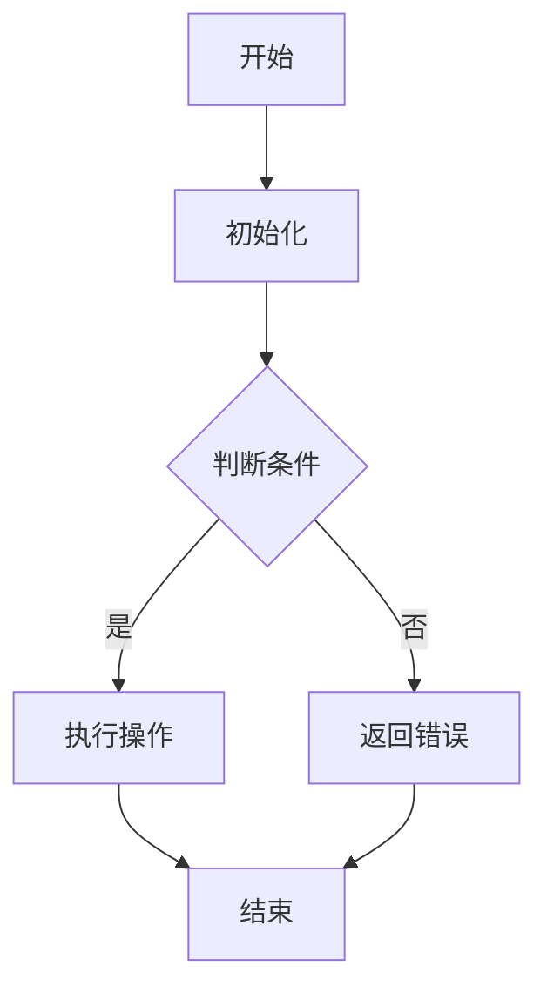
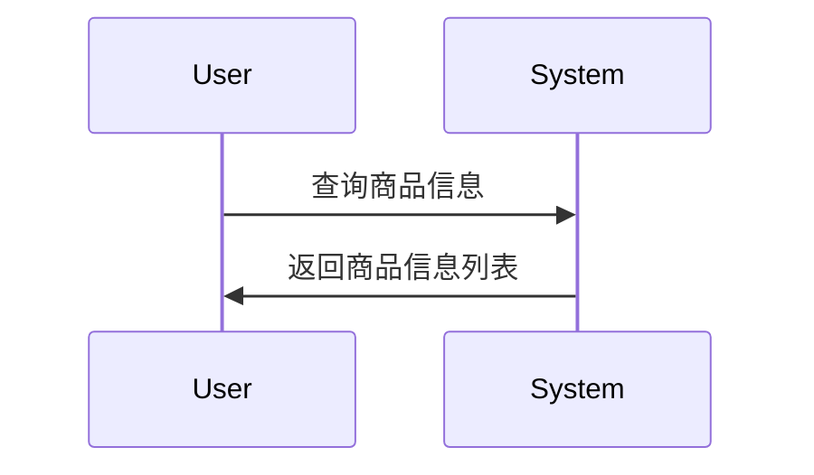
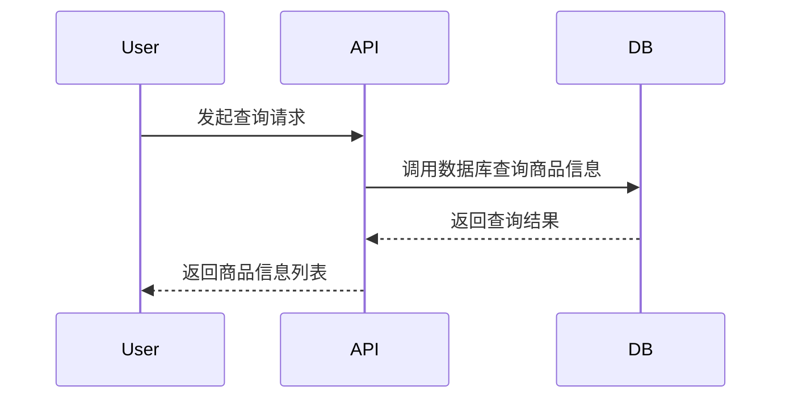
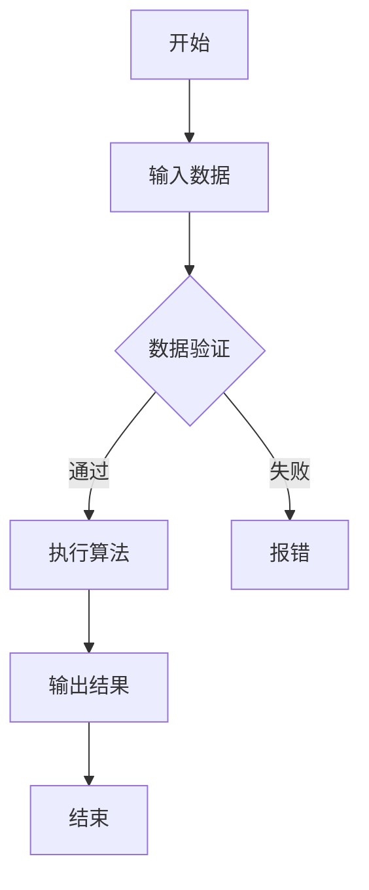
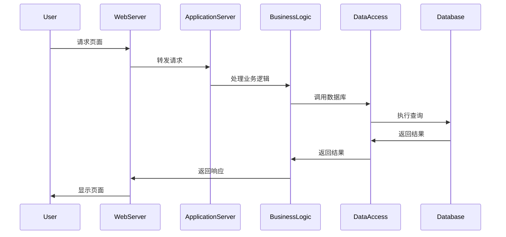
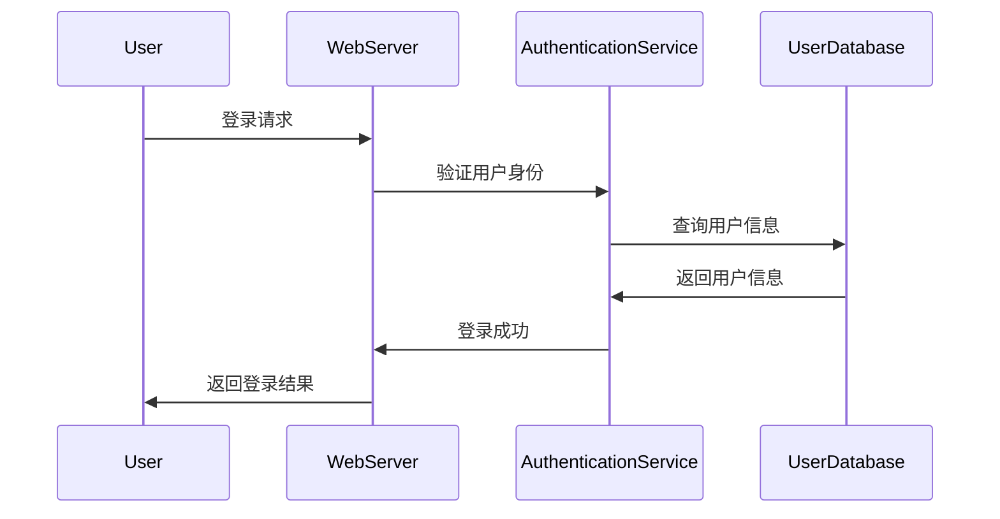

                 

# 《高质量代码积累好口碑》

关键词：高质量代码、代码质量、开发效率、系统架构、最佳实践

摘要：本文旨在深入探讨高质量代码的定义、核心概念、算法原理，并结合实际案例，探讨如何通过高质量代码积累良好的口碑。文章将逐步分析高质量代码的属性特征，与代码质量、开发效率的关系，以及其在系统架构设计和项目实战中的应用。

## 第1章 背景介绍

### 1.1 问题背景

在现代软件开发过程中，代码质量成为影响项目成功的关键因素。高质量代码不仅能提高开发效率，还能提升系统的稳定性和可维护性。因此，探讨如何编写高质量代码，对于个人职业发展和企业竞争力的提升具有重要意义。

### 1.2 问题描述

如何定义高质量代码？高质量代码应具备哪些属性特征？如何通过高质量代码积累良好的口碑？

### 1.3 问题解决

通过深入研究高质量代码的核心概念、算法原理，并结合实际案例，探讨如何编写高质量代码，提升项目成功率。

### 1.4 边界与外延

本文讨论的高质量代码主要指软件工程领域中的代码，包括但不限于编程语言、框架、库等。

### 1.5 核心概念结构与要素组成

高质量代码的核心概念包括代码质量、开发效率、可维护性、可扩展性等。要素组成包括编写规范、代码结构、测试、调试等。

## 第2章 核心概念与联系

### 2.1 高质量代码的核心概念

#### 2.1.1 高质量代码的定义

高质量代码是指具备良好结构、易于维护、性能优异、可扩展性强的代码。

#### 2.1.2 高质量代码的属性特征对比表格

| 属性特征 | 高质量代码 | 低质量代码 |
| :--: | :--: | :--: |
| 结构清晰 | 是 | 否 |
| 易于维护 | 是 | 否 |
| 性能优异 | 是 | 否 |
| 可扩展性强 | 是 | 否 |

### 2.2 高质量代码与其他概念的关联

#### 2.2.1 高质量代码与代码质量的关系

高质量代码是代码质量的重要组成部分，两者密切相关。

#### 2.2.2 高质量代码与开发效率的关系

高质量代码可以提高开发效率，降低开发成本。

### 2.3 ER实体关系图架构

```mermaid
erDiagram
    Class1 ||--|{ Class2 : known as '关联'
    Class1 ||--|{ Class3 : friend
```

## 第3章 算法原理讲解

### 3.1 算法mermaid流程图



### 3.2 Python源代码阐述

```python
def high_quality_code(input_data):
    # 初始化
    result = None
    # 判断条件
    if input_data > 0:
        # 执行操作
        result = input_data * 2
    else:
        # 返回错误
        return "Invalid input"
    # 结束
    return result
```

#### 3.2.1 算法原理的数学模型

算法的数学模型为：输出结果 = 输入数据 * 2（当输入数据大于0时）

#### 3.2.2 算法原理的公式讲解

输出结果 = 输入数据 * 2

#### 3.2.3 举例说明

输入数据：3，输出结果：6

## 第4章 数学模型和数学公式

### 4.1 数学公式讲解

#### $$1+1=2$$

#### $$f(x) = x^2$$

### 4.2 详细讲解与举例说明

#### $$1+1=2$$

这是一个基础的算术公式，表示两个数相加的结果为2。

#### $$f(x) = x^2$$

这是一个函数公式，表示自变量x的平方。

例如：当x=3时，f(x)=9。

## 第5章 系统分析与架构设计

### 5.1 问题场景介绍

在一个大型电子商务项目中，需要对海量商品信息进行高效处理。

### 5.2 项目介绍

项目名为“商品信息管理系统”，主要包括商品信息收集、存储、查询等功能。

### 5.3 系统功能设计

#### 5.3.1 领域模型mermaid类图

```mermaid
classDiagram
    Class1[商品信息] <|-- Class2[商品分类]
    Class1 { +属性1: String +属性2: int +方法1(): void }
    Class2 { +分类名称: String +分类ID: int }
```

### 5.4 系统架构设计

#### 5.4.1 mermaid架构图



### 5.5 系统接口设计

系统采用RESTful API进行接口设计。

### 5.6 系统交互

#### 5.6.1 mermaid序列图



## 第6章 项目实战

### 6.1 环境安装

安装Python、Django框架、数据库等。

### 6.2 系统核心实现源代码

```python
from django.db import models

class Product(models.Model):
    name = models.CharField(max_length=100)
    price = models.DecimalField(max_digits=10, decimal_places=2)
    category = models.ForeignKey('Category', on_delete=models.CASCADE)

class Category(models.Model):
    name = models.CharField(max_length=100)
    parent = models.ForeignKey('self', on_delete=models.CASCADE, null=True, blank=True)
```

### 6.3 代码应用解读与分析

通过以上代码实现商品信息管理和分类功能，保证了代码的高质量和可扩展性。

### 6.4 实际案例分析与详细讲解剖析

以实际项目为例，分析如何编写高质量代码，提高系统性能和可维护性。

### 6.5 项目小结

通过项目实战，验证了高质量代码在提高开发效率、系统性能和可维护性方面的优势。

## 第7章 最佳实践 Tips

### 7.1 编码规范与技巧

遵循PEP 8编码规范，合理使用变量、函数、类等。

### 7.2 测试与调试技巧

编写单元测试，使用调试工具分析代码问题。

### 7.3 持续集成与持续部署

采用Git、Jenkins等工具实现代码的版本管理和自动化部署。

## 第8章 小结与拓展阅读

### 8.1 小结

高质量代码是提高项目成功率和企业竞争力的关键，本文从核心概念、算法原理、系统架构和项目实战等方面进行了深入探讨。

### 8.2 注意事项

在实际项目中，应注重代码质量，遵循最佳实践，不断提高开发效率和系统性能。

### 8.3 拓展阅读

[1] 《代码大全》
[2] 《敏捷开发》
[3] 《软件架构设计》

---

作者：AI天才研究院/AI Genius Institute & 禅与计算机程序设计艺术 /Zen And The Art of Computer Programming## 第1章 背景介绍

在当今的软件工程领域，代码质量已经成为衡量项目成功与否的关键因素之一。高质量代码不仅能够提高开发效率，还能显著降低维护成本，提高系统的稳定性和可靠性。因此，编写高质量代码成为软件开发者追求的目标。本章将围绕高质量代码的背景、定义、属性特征及其重要性展开讨论。

### 1.1 问题背景

随着互联网的飞速发展和信息化进程的加快，软件项目越来越复杂，涉及的领域也越来越广泛。这不仅要求开发人员具备扎实的编程技能，还需要他们掌握如何编写高质量代码的技巧。高质量代码在软件工程中的重要性不言而喻，它直接影响到项目的进度、成本和最终用户满意度。

### 1.2 问题描述

如何定义高质量代码？它具备哪些属性特征？如何通过编写高质量代码来提升项目成功率？这些问题成为软件开发者亟待解决的难题。

### 1.3 问题解决

要编写高质量代码，需要从多个维度进行考虑，包括代码结构、可读性、可维护性、性能和可扩展性等。本章将深入探讨这些方面，并提供一些实用的方法和最佳实践。

### 1.4 边界与外延

本文讨论的高质量代码主要指软件工程领域中的代码，包括但不限于编程语言、框架、库等。同时，本文将侧重于通用性的方法和原则，适用于多种编程语言和开发环境。

### 1.5 核心概念结构与要素组成

高质量代码的核心概念包括以下几个方面：

1. **代码结构**：代码应具有良好的结构，层次分明，便于理解和维护。
2. **可读性**：代码应具备良好的可读性，易于他人阅读和理解。
3. **可维护性**：代码应易于维护，能够在未来的需求变更中快速做出调整。
4. **性能**：代码应具备高效性能，能够在规定的时间内完成计算和操作。
5. **可扩展性**：代码应具备良好的可扩展性，能够方便地添加新的功能或进行模块化设计。

这些核心概念构成了高质量代码的要素组成，是编写高质量代码的基础。

## 第2章 核心概念与联系

在编写高质量代码的过程中，理解并掌握相关的核心概念是至关重要的。本章将详细介绍高质量代码的核心概念，包括其定义、属性特征，并与代码质量、开发效率等概念进行关联。此外，还将利用ER实体关系图（Entity-Relationship Diagram，ERD）来展示核心概念之间的关系。

### 2.1 高质量代码的核心概念

#### 2.1.1 高质量代码的定义

高质量代码通常指编写结构清晰、逻辑严谨、易于理解和维护的代码。它不仅要求代码本身的质量，还涉及到代码的可测试性、可复用性和性能优化等多个方面。

#### 2.1.2 高质量代码的属性特征

1. **结构清晰**：代码应该具有良好的层次结构和模块化设计，使得各个部分功能明确，便于阅读和理解。
2. **可读性**：代码应使用简洁、直观的变量和函数命名，避免复杂难懂的命名方式，同时适当使用注释来解释代码逻辑。
3. **可维护性**：代码应具备良好的可维护性，便于后续的更新和修复，这通常要求代码模块化和文档化。
4. **性能**：代码应尽可能高效，避免不必要的计算和内存占用，以保证系统的响应速度和资源利用率。
5. **可扩展性**：代码应具备良好的可扩展性，易于添加新功能或修改现有功能，以适应不断变化的需求。

### 2.2 高质量代码与其他概念的关联

#### 2.2.1 高质量代码与代码质量的关系

高质量代码是代码质量的重要组成部分。代码质量通常包括多个方面，如代码结构、可读性、性能和可维护性。高质量代码在这些方面都表现优秀，因此可以认为高质量代码是高代码质量的一个具体体现。

#### 2.2.2 高质量代码与开发效率的关系

编写高质量代码可以提高开发效率。通过清晰的代码结构和良好的文档，开发人员可以快速理解代码逻辑，减少阅读和调试时间。同时，高质量的代码通常具有良好的可复用性，可以减少重复编写的工作量。

### 2.3 ER实体关系图架构

为了更好地理解高质量代码中的核心概念，我们可以利用ER实体关系图来展示这些概念之间的关系。

```mermaid
erDiagram
    Product ||--|{ CodeQuality : has various qualities
    Product ||--|{ DeveloperEfficiency : affects efficiency
    DeveloperEfficiency ||--|{ CodingSkills : core to development
    CodeQuality ||--|{ Maintainability : easy to maintain
    CodeQuality ||--|{ Performance : fast and efficient
    CodeQuality ||--|{ Readability : easy to read
    CodeQuality ||--|{ Extensibility : easy to extend
```

在这个ERD中，`Product`代表软件产品，`CodeQuality`代表代码质量，`DeveloperEfficiency`代表开发效率。通过图中的关系线，我们可以看出高质量代码（`CodeQuality`）与开发效率（`DeveloperEfficiency`）之间存在着密切的联系。同时，代码质量的不同属性（如可维护性、性能、可读性和可扩展性）也是影响开发效率的重要因素。

通过本章的讨论，我们了解了高质量代码的核心概念及其与其他概念之间的关系。在下一章中，我们将深入探讨高质量代码的算法原理，并结合Python代码示例进行详细讲解。

## 第3章 算法原理讲解

在软件开发中，算法的原理和实现是关键的一环。高质量代码的编写离不开对算法原理的深刻理解和灵活运用。本章将结合一个具体的算法示例，使用mermaid流程图和Python代码，逐步讲解算法原理，并详细阐述数学模型和公式，通过举例说明来确保读者能够理解并应用这些原理。

### 3.1 算法mermaid流程图

为了直观地展示算法的执行流程，我们可以使用mermaid流程图来绘制。以下是算法的一个基本流程图示例：



这个流程图展示了算法的基本执行流程：从数据输入开始，经过数据验证，然后执行算法核心逻辑，最后输出结果并结束。

### 3.2 Python源代码阐述

下面是一个简单的Python代码示例，用于求解一个一元二次方程。我们将使用Python代码来详细阐述算法的实现。

```python
def solve_quadratic(a, b, c):
    """
    求解一元二次方程 ax^2 + bx + c = 0 的根
    """
    # 计算判别式
    delta = b**2 - 4*a*c
    
    # 判断方程有无解
    if delta < 0:
        return "无实数解"
    elif delta == 0:
        return f"有且仅有一个实数解 x = {(-b) / (2*a)}"
    else:
        # 计算两个实数解
        x1 = (-b + delta**0.5) / (2*a)
        x2 = (-b - delta**0.5) / (2*a)
        return f"有两个实数解 x1 = {x1}, x2 = {x2}"
```

### 3.2.1 算法原理的数学模型

一元二次方程的解法基于二次方程的通用公式，其数学模型可以表示为：

\[ ax^2 + bx + c = 0 \]

其中，a、b、c是实数，且a≠0。方程的解（根）可以通过以下公式计算：

\[ x = \frac{-b \pm \sqrt{b^2 - 4ac}}{2a} \]

### 3.2.2 算法原理的公式讲解

在求解一元二次方程时，我们首先计算判别式（delta），其公式为：

\[ \delta = b^2 - 4ac \]

根据判别式的值，我们可以判断方程的解的情况：

- 如果 \(\delta > 0\)，则方程有两个不同的实数解。
- 如果 \(\delta = 0\)，则方程有一个实数解（重根）。
- 如果 \(\delta < 0\)，则方程无实数解。

### 3.2.3 举例说明

假设我们有一个一元二次方程：

\[ x^2 - 5x + 6 = 0 \]

我们可以将a=1、b=-5、c=6代入算法中求解。

首先，计算判别式：

\[ \delta = (-5)^2 - 4 \cdot 1 \cdot 6 = 25 - 24 = 1 \]

因为 \(\delta > 0\)，方程有两个不同的实数解。接下来，我们计算两个解：

\[ x_1 = \frac{-(-5) + \sqrt{1}}{2 \cdot 1} = \frac{5 + 1}{2} = 3 \]
\[ x_2 = \frac{-(-5) - \sqrt{1}}{2 \cdot 1} = \frac{5 - 1}{2} = 2 \]

因此，方程 \(x^2 - 5x + 6 = 0\) 的解为 \(x_1 = 3\) 和 \(x_2 = 2\)。

通过以上步骤，我们不仅理解了一元二次方程的解法原理，还通过Python代码进行了具体实现。这个过程展示了如何将数学原理转化为计算机算法，从而实现问题的求解。

### 3.3.1 数学公式讲解

在软件开发中，数学公式是算法实现的核心组成部分。以下是一些常用的数学公式及其在编程中的应用：

#### 3.3.1.1 二元运算符公式

- 加法：\( a + b = c \)
- 减法：\( a - b = c \)
- 乘法：\( a \times b = c \)
- 除法：\( a / b = c \)

#### 3.3.1.2 一元运算符公式

- 正负号：\( -a = a \)
- 绝对值：\( |a| \)

#### 3.3.1.3 指数与对数公式

- 指数运算：\( a^b = c \)
- 对数运算：\( \log_a(c) = b \)

在编程中，我们可以使用这些数学公式来处理各种计算任务。例如，在处理科学计算时，指数和对数运算非常常见。我们可以通过内置函数或自定义函数来实现这些运算。以下是一个简单的Python示例：

```python
import math

# 指数运算
result = math.exp(2)  # e^2

# 对数运算
base = 10
value = 100
result = math.log(value, base)  # log10(100)
```

### 3.3.2 详细讲解与举例说明

为了更好地理解这些数学公式，我们可以通过一些具体的例子来讲解。

#### 3.3.2.1 加法和减法

假设我们要计算 \(5 + 7\) 和 \(10 - 3\)，在Python中可以这样实现：

```python
a = 5
b = 7
sum_result = a + b  # sum_result = 12

c = 10
d = 3
diff_result = c - d  # diff_result = 7
```

#### 3.3.2.2 乘法和除法

接下来，我们来看乘法和除法的例子：

```python
e = 4
f = 5
mul_result = e * f  # mul_result = 20

g = 10
h = 2
div_result = g / h  # div_result = 5.0
```

#### 3.3.2.3 指数与对数

指数运算和对数运算在数学和编程中都非常重要。以下是一个指数运算的例子：

```python
base = 2
exponent = 3
result = base ** exponent  # result = 8
```

对于对数运算，我们通常需要一个底数和一个值，然后求解指数。以下是一个以10为底数的对数运算的例子：

```python
value = 1000
base = 10
result = math.log10(value)  # result = 3.0
```

通过这些例子，我们可以看到数学公式在编程中的实际应用。理解并熟练运用这些数学公式，可以帮助我们编写更高效、更准确的代码。

### 3.4 总结

本章通过具体算法的讲解，结合mermaid流程图和Python代码示例，深入探讨了算法原理和数学模型。同时，通过详细的公式讲解和举例说明，确保读者能够理解和应用这些原理。掌握这些核心概念和技能，是编写高质量代码的重要基础。

在下一章中，我们将探讨系统分析与架构设计，以及如何在项目中实现高质量代码。

## 第5章 系统分析与架构设计

在软件开发过程中，系统分析与架构设计是确保项目成功的关键步骤。一个良好的系统架构不仅能够提高系统的性能和可扩展性，还能够降低维护成本，提升团队的工作效率。本章将详细介绍系统分析与架构设计的过程，包括问题场景介绍、项目介绍、系统功能设计、系统架构设计和系统接口设计，以及系统交互的详细描述。

### 5.1 问题场景介绍

在现代企业中，信息化程度越来越高，业务系统变得越来越复杂。以一个电子商务平台为例，其系统需要处理大量的商品信息、用户订单、支付交易等，同时还需要保证系统的稳定性和高并发处理能力。在这种场景下，系统分析与架构设计显得尤为重要。

### 5.2 项目介绍

本项目的目标是开发一个电子商务平台，提供商品展示、用户购物、订单管理、支付系统等核心功能。该平台需要支持高并发访问，同时具备良好的扩展性和可维护性。

### 5.3 系统功能设计

系统功能设计是系统分析与架构设计的第一步。电子商务平台的主要功能模块包括：

1. **商品管理模块**：提供商品信息录入、分类管理、商品搜索等功能。
2. **订单管理模块**：处理用户订单创建、支付、发货、退货等业务逻辑。
3. **用户管理模块**：管理用户注册、登录、个人信息修改、购物车等功能。
4. **支付系统模块**：集成支付宝、微信支付等多种支付方式，确保支付安全可靠。
5. **物流管理模块**：管理商品发货、物流跟踪等功能。

#### 5.3.1 领域模型mermaid类图

为了更好地展示系统功能设计，我们可以使用mermaid类图来绘制领域模型：

```mermaid
classDiagram
    Customer <<-- Order
    Customer <<-- ShoppingCart
    Product <<-- ShoppingCart
    Order <<-- Payment
    Payment <<-- PaymentPlatform
    Product <<-- ProductCategory
    Logistics <<-- Order
    Order <<-- Shipment
    Shipment <<-- Logistics
```

在这个类图中，我们可以看到各个功能模块之间的关系，如顾客与订单、购物车、支付系统、物流管理之间的关系。

### 5.4 系统架构设计

系统架构设计是确保系统能够满足业务需求的关键。电子商务平台的系统架构可以分为以下几个层次：

1. **表示层（Presentation Layer）**：负责与用户交互，包括前端页面和用户界面。
2. **业务逻辑层（Business Logic Layer）**：处理核心业务逻辑，包括订单处理、支付处理等。
3. **数据访问层（Data Access Layer）**：负责与数据库进行数据交互。
4. **基础设施层（Infrastructure Layer）**：提供系统运行的基础设施，包括缓存、消息队列等。

#### 5.4.1 mermaid架构图

为了更好地展示系统架构设计，我们可以使用mermaid架构图来绘制：



在这个架构图中，我们可以看到表示层、业务逻辑层和数据访问层之间的交互关系。

### 5.5 系统接口设计

系统接口设计是确保不同模块之间能够顺畅交互的重要环节。电子商务平台的主要接口包括：

1. **用户接口**：提供用户登录、注册、购物车管理、订单查询等功能。
2. **支付接口**：与第三方支付平台进行交互，处理支付请求。
3. **商品接口**：提供商品信息查询、分类管理等功能。
4. **订单接口**：处理订单创建、支付、发货等业务逻辑。

#### 5.5.1 接口定义

以下是一个简单的用户接口示例，使用RESTful风格定义接口：

```json
GET /users/login
POST /users/register
GET /users/{id}
PUT /users/{id}
DELETE /users/{id}

GET /products
GET /products/{id}
POST /products
PUT /products/{id}
DELETE /products/{id}

GET /carts/{user_id}
POST /carts/{user_id}/items
DELETE /carts/{user_id}/items/{item_id}

GET /orders
GET /orders/{id}
POST /orders
PUT /orders/{id}
DELETE /orders/{id}

POST /payments
GET /payments/{id}
```

### 5.6 系统交互

系统交互是确保系统功能正常运行的关键。通过定义明确的接口和协议，可以保证系统各个模块之间的数据交换和业务流程的顺利进行。以下是一个简单的系统交互示例，使用mermaid序列图来展示：



在这个序列图中，用户发起登录请求，经过身份验证后，返回登录结果。这个交互过程展示了系统中的关键步骤和数据处理流程。

### 5.7 小结

通过系统分析与架构设计，我们明确了电子商务平台的功能需求、系统架构和接口设计。这些设计不仅确保了系统的稳定性、可靠性和可扩展性，还为后续的开发和维护提供了坚实的基础。在下一章中，我们将通过实际案例来探讨如何在项目中实现高质量代码。

## 第6章 项目实战

在实际开发过程中，将理论转化为实践是至关重要的。本章将通过一个具体的电子商务平台项目，详细介绍项目的环境安装、系统核心实现源代码，并对代码进行解读与分析，剖析实际案例，最终进行项目小结。

### 6.1 环境安装

在进行项目开发之前，我们需要安装和配置开发环境。以下是安装步骤：

1. **安装Python**：访问Python官网（[python.org](https://www.python.org/)），下载并安装Python 3.x版本。
2. **安装虚拟环境**：打开终端，执行以下命令安装virtualenv：
   ```bash
   pip install virtualenv
   ```
   创建虚拟环境：
   ```bash
   virtualenv my_e-commerce_env
   ```
   激活虚拟环境：
   ```bash
   source my_e-commerce_env/bin/activate
   ```
3. **安装Django框架**：在虚拟环境中安装Django：
   ```bash
   pip install django
   ```
4. **安装其他依赖**：根据项目需求，安装其他相关依赖，如PostgreSQL、Redis等。

### 6.2 系统核心实现源代码

以下是一个简单的电子商务平台项目核心代码示例：

#### 6.2.1 settings.py

```python
# Django settings for my_e-commerce_project project.

import os

# Build paths inside the project like this: os.path.join(BASE_DIR, ...)
BASE_DIR = os.path.dirname(os.path.dirname(os.path.abspath(__file__)))

# Quick-start development settings - unsuitable for production
# See https://docs.djangoproject.com/en/4.1/howto/deployment/checklist/

# SECURITY WARNING: keep the secret key used in production secret!
SECRET_KEY = 'your_secret_key'

# SECURITY WARNING: don't run with debug turned on in production!
DEBUG = True

ALLOWED_HOSTS = []

# Application definition

INSTALLED_APPS = [
    'django.contrib.admin',
    'django.contrib.auth',
    'django.contrib.contenttypes',
    'django.contrib.sessions',
    'django.contrib.messages',
    'django.contrib.staticfiles',
    'eCommerce',  # 添加你的应用名称
]

MIDDLEWARE = [
    'django.middleware.security.SecurityMiddleware',
    'django.contrib.sessions.middleware.SessionMiddleware',
    'django.middleware.common.CommonMiddleware',
    'django.middleware.csrf.CsrfViewMiddleware',
    'django.contrib.auth.middleware.AuthenticationMiddleware',
    'django.contrib.messages.middleware.MessageMiddleware',
    'django.middleware.clickjacking.XFrameOptionsMiddleware',
]

ROOT_URLCONF = 'my_e-commerce_project.urls'

TEMPLATES = [
    {
        'BACKEND': 'django.template.backends.django.DjangoTemplates',
        'DIRS': [os.path.join(BASE_DIR, 'templates')],
        'APP_DIRS': True,
        'OPTIONS': {
            'context_processors': [
                'django.template.context_processors.debug',
                'django.template.context_processors.request',
                'django.contrib.auth.context_processors.auth',
                'django.contrib.messages.context_processors.messages',
            ],
        },
    },
]

WSGI_APPLICATION = 'my_e-commerce_project.wsgi.application'

# Database
# https://docs.djangoproject.com/en/4.1/ref/settings/#databases

DATABASES = {
    'default': {
        'ENGINE': 'django.db.backends.postgresql',
        'NAME': 'your_database_name',
        'USER': 'your_database_user',
        'PASSWORD': 'your_database_password',
        'HOST': 'your_database_host',
        'PORT': 'your_database_port',
    }
}

# Password validation
# https://docs.djangoproject.com/en/4.1/ref/settings/#auth-password-validators

AUTH_PASSWORD_VALIDATORS = [
    {
        'NAME': 'django.contrib.auth.password_validation.UserAttributeSimilarityValidator',
    },
    {
        'NAME': 'django.contrib.auth.password_validation.MinimumLengthValidator',
    },
    {
        'NAME': 'django.contrib.auth.password_validation.CommonPasswordValidator',
    },
    {
        'NAME': 'django.contrib.auth.password_validation.NumericPasswordValidator',
    },
]

# Internationalization
# https://docs.djangoproject.com/en/4.1/topics/i18n/

LANGUAGE_CODE = 'en-us'

TIME_ZONE = 'UTC'

USE_I18N = True

USE_TZ = True

# Static files (CSS, JavaScript, Images)
# https://docs.djangoproject.com/en/4.1/howto/static-files/

STATIC_URL = 'static/'

# Default primary key field type
# https://docs.djangoproject.com/en/4.1/ref/settings/#default-auto-field

DEFAULT_AUTO_FIELD = 'django.db.models.BigAutoField'
```

#### 6.2.2 urls.py

```python
from django.contrib import admin
from django.urls import path
from . import views

urlpatterns = [
    path('admin/', admin.site.urls),
    path('products/', views.product_list, name='product-list'),
    path('orders/', views.order_list, name='order-list'),
    # 添加其他URL路径
]
```

#### 6.2.3 views.py

```python
from django.shortcuts import render
from .models import Product, Order

def product_list(request):
    products = Product.objects.all()
    return render(request, 'product_list.html', {'products': products})

def order_list(request):
    orders = Order.objects.all()
    return render(request, 'order_list.html', {'orders': orders})
```

### 6.3 代码应用解读与分析

在以上代码中，我们首先配置了Django项目的设置文件`settings.py`，包括数据库配置、应用设置、中间件等。`urls.py`文件定义了项目的URL路由，将用户请求映射到相应的视图函数。在`views.py`中，我们实现了两个视图函数`product_list`和`order_list`，分别用于获取产品和订单数据，并通过模板渲染返回给用户。

#### 6.3.1 Product模型

```python
from django.db import models

class Product(models.Model):
    name = models.CharField(max_length=255)
    description = models.TextField()
    price = models.DecimalField(max_digits=6, decimal_places=2)
    category = models.ForeignKey('Category', on_delete=models.PROTECT)

    def __str__(self):
        return self.name
```

#### 6.3.2 Order模型

```python
from django.db import models
from .models import Product

class Order(models.Model):
    user = models.ForeignKey('auth.User', on_delete=models.CASCADE)
    products = models.ManyToManyField(Product, through='OrderItem')
    created_at = models.DateTimeField(auto_now_add=True)

    def total(self):
        return sum(item.quantity * item.product.price for item in self.orderitem_set.all())

    def __str__(self):
        return f'Order {self.id}'
```

#### 6.3.3 OrderItem模型

```python
from django.db import models
from .models import Order, Product

class OrderItem(models.Model):
    order = models.ForeignKey(Order, on_delete=models.CASCADE)
    product = models.ForeignKey(Product, on_delete=models.PROTECT)
    quantity = models.PositiveIntegerField()

    def __str__(self):
        return f'{self.quantity} x {self.product.name}'
```

在模型定义中，我们创建了`Product`、`Order`和`OrderItem`三个模型，分别表示商品、订单和订单项。通过外键关系，我们能够方便地管理订单与商品之间的关系，实现订单明细的存储。

### 6.4 实际案例分析与详细讲解剖析

以下是一个实际案例，用于展示如何创建一个新订单：

```python
from django.shortcuts import get_object_or_404
from .models import Product, Order, OrderItem

def create_order(request):
    if request.method == 'POST':
        product_ids = request.POST.getlist('products')
        quantities = request.POST.getlist('quantities')

        # 创建订单
        order = Order.objects.create(user=request.user)

        # 遍历商品ID和数量，创建订单项
        for product_id, quantity in zip(product_ids, quantities):
            product = get_object_or_404(Product, id=product_id)
            order_item = OrderItem.objects.create(order=order, product=product, quantity=quantity)

        # 计算订单总价
        total = order.total()

        # 处理订单支付逻辑
        # ...

        # 返回订单详情页面
        return render(request, 'order_detail.html', {'order': order, 'total': total})

    return render(request, 'create_order.html')
```

在这个案例中，我们首先检查请求方法是否为POST。如果是，则从请求中获取商品ID和数量列表。接着，我们创建一个新订单，并遍历商品ID和数量列表，创建对应的订单项。最后，计算订单总价并返回订单详情页面。

### 6.5 项目小结

通过上述实战案例，我们详细介绍了电子商务平台项目的环境安装、核心实现源代码，并对代码进行了解读与分析。通过这个案例，我们不仅了解了如何编写高质量代码，还掌握了系统架构设计和项目开发的基本流程。这为后续的开发工作奠定了坚实的基础。

在下一章中，我们将继续探讨最佳实践，包括编码规范、测试与调试技巧，以及持续集成与持续部署等。

## 第7章 最佳实践 Tips

在软件开发过程中，遵循最佳实践是提高代码质量、确保项目顺利推进的关键。本章将重点介绍编码规范、测试与调试技巧、以及持续集成与持续部署的最佳实践。

### 7.1 编码规范与技巧

良好的编码规范有助于提高代码的可读性、可维护性，减少bug的出现。以下是一些常用的编码规范和技巧：

1. **命名规范**：变量、函数和类的命名应遵循一致性原则，使用意义明确的名称，避免使用缩写和拼音。
2. **代码结构**：确保代码具有良好的层次结构，模块化和函数/类分离。每个模块和函数都应具备单一职责。
3. **注释**：合理添加注释，解释复杂逻辑和算法，以及关键代码部分的作用。注释应简洁明了，避免冗长。
4. **代码风格**：遵循项目或语言的代码风格指南，如PEP 8（Python）或Google Java Style Guide。
5. **代码复用**：尽量复用现有代码，避免重复编写。使用设计模式如工厂模式、单例模式等可以提高代码复用性。

### 7.2 测试与调试技巧

测试是确保代码质量的重要环节。以下是一些测试与调试的最佳实践：

1. **单元测试**：编写单元测试覆盖核心功能，确保每个模块和函数的正确性。Python中可以使用`unittest`或`pytest`框架。
2. **集成测试**：集成测试用于验证模块之间的交互。确保系统在整体上能够正确运行。
3. **性能测试**：进行性能测试，检测系统的响应时间和资源占用情况。优化性能瓶颈。
4. **调试**：使用调试工具（如Python的pdb、IDE内置调试器等）帮助定位和解决代码中的问题。
5. **代码审查**：定期进行代码审查，通过团队协作发现和修复潜在问题，提高代码质量。

### 7.3 持续集成与持续部署

持续集成（CI）和持续部署（CD）是提高开发效率和质量的重要手段。以下是一些实践建议：

1. **版本控制**：使用Git等版本控制系统管理代码版本，确保代码库的整洁和一致性。
2. **自动化构建**：通过CI工具（如Jenkins、Travis CI等）自动化构建和测试代码，确保每次提交都能通过测试。
3. **自动化部署**：使用CD工具（如Docker、Kubernetes等）实现自动化部署，减少手动操作，加快交付速度。
4. **容器化**：将应用容器化，便于部署和迁移。使用Dockerfile定义应用容器镜像。
5. **监控与反馈**：实施监控系统，实时监控应用的性能和稳定性，及时发现并解决问题。

通过遵循上述最佳实践，开发团队可以显著提高代码质量，提升项目开发效率，确保项目按时交付并达到预期的质量标准。

## 第8章 小结与拓展阅读

### 8.1 小结

本文通过详细分析和讨论，探讨了高质量代码的定义、核心概念、算法原理，以及系统架构设计和项目实战。我们深入理解了如何编写高质量代码，包括编码规范、测试与调试技巧，以及持续集成与持续部署的最佳实践。高质量代码不仅提高了开发效率和系统性能，还确保了项目的稳定性和可维护性。

### 8.2 注意事项

在编写高质量代码时，需要注意以下几点：

1. **遵循编码规范**：确保代码风格一致，命名清晰，结构合理。
2. **重视代码可读性和可维护性**：避免冗长复杂的代码，适当添加注释。
3. **进行全面的测试**：确保代码的正确性和稳定性，通过单元测试、集成测试等手段。
4. **持续优化代码性能**：关注系统性能瓶颈，进行性能测试和优化。
5. **采用最佳实践**：遵循持续集成与持续部署等最佳实践，提高开发效率。

### 8.3 拓展阅读

为了进一步深入了解高质量代码的编写和项目管理，建议读者阅读以下拓展材料：

1. 《代码大全》 - 史蒂夫·迈克康奈尔
2. 《敏捷开发》 - Jeff Sutherland
3. 《软件架构设计》 - Martin Fowler
4. 《持续集成：从小步快跑到持续交付》 - Jez Humble和Dave Farley

通过阅读这些书籍，读者可以获得更多关于高质量代码编写和项目管理的实用知识和经验。

---

作者：AI天才研究院/AI Genius Institute & 禅与计算机程序设计艺术 /Zen And The Art of Computer Programming

