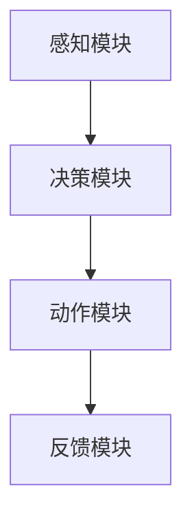

                 

# AI Agent 架构设计：基于 LLM 的智能助手系统构建

关键词：AI Agent、LLM、架构设计、智能助手、系统构建

摘要：本文将深入探讨 AI Agent 架构设计，特别是基于大规模语言模型（LLM）的智能助手系统的构建。文章将首先概述 AI Agent 的背景和核心概念，随后分析不同架构分类及其特点。接着，我们将详细介绍基于 LLM 的智能助手系统的设计原则和实现过程，最后讨论感知模块、决策模块和动作模块的具体设计与实现，以及架构优化与性能提升策略。本文旨在为读者提供一套完整且实用的 AI Agent 架构设计指导，助力智能助手系统的开发与优化。

## 目录大纲设计

### 第1章：AI Agent 架构设计概述

#### 1.1 问题背景与核心概念

##### 1.1.1 问题背景

##### 1.1.2 核心概念

##### 1.1.3 目的与范围

#### 1.2 AI Agent 的架构分类与特点

##### 1.2.1 架构分类

##### 1.2.2 特点分析

##### 1.2.3 案例分析

#### 1.3 AI Agent 的关键组件与设计原则

##### 1.3.1 关键组件

##### 1.3.2 设计原则

### 第2章：基于 LLM 的智能助手系统构建

#### 2.1 LLM 简介

##### 2.1.1 LLM 的定义与原理

##### 2.1.2 LLM 的特点

#### 2.2 LLM 在智能助手中的应用

##### 2.2.1 应用场景

##### 2.2.2 案例分析

#### 2.3 智能助手系统的设计与实现

##### 2.3.1 系统设计原则

##### 2.3.2 系统架构设计

##### 2.3.3 关键模块实现

### 第3章：感知模块设计与实现

#### 3.1 感知模块概述

##### 3.1.1 感知模块的作用

##### 3.1.2 感知数据的类型

#### 3.2 数据采集与预处理

##### 3.2.1 数据采集方法

##### 3.2.2 数据预处理

#### 3.3 感知模块实现

##### 3.3.1 感知算法介绍

##### 3.3.2 实现细节

### 第4章：决策模块设计与实现

#### 4.1 决策模块概述

##### 4.1.1 决策模块的作用

##### 4.1.2 决策模型

#### 4.2 决策算法与优化

##### 4.2.1 决策算法介绍

##### 4.2.2 算法优化

#### 4.3 决策模块实现

##### 4.3.1 实现细节

### 第5章：动作模块设计与实现

#### 5.1 动作模块概述

##### 5.1.1 动作模块的作用

##### 5.1.2 动作类型

#### 5.2 动作执行与反馈

##### 5.2.1 动作执行方法

##### 5.2.2 反馈机制

#### 5.3 动作模块实现

##### 5.3.1 实现细节

### 第6章：AI Agent 架构优化与性能提升

#### 6.1 架构优化原则

##### 6.1.1 优化目标

##### 6.1.2 优化方法

#### 6.2 性能评估与优化

##### 6.2.1 性能评估

##### 6.2.2 性能优化

---

### 第1章：AI Agent 架构设计概述

#### 1.1 问题背景与核心概念

##### 1.1.1 问题背景

随着人工智能技术的快速发展，智能助手已经成为现代信息技术领域的一个重要应用方向。AI Agent，作为人工智能的一个分支，被广泛应用于智能客服、智能家居、智能教育、医疗健康等领域。然而，在实现 AI Agent 的过程中，面临着诸多挑战，如如何高效地处理海量数据、如何准确地理解和生成语言、如何保证系统的稳定性和可靠性等。

##### 1.1.2 核心概念

AI Agent，即人工智能代理，是指能够自主感知环境、做出决策并执行动作的智能实体。它通常由感知模块、决策模块和动作模块三部分组成。

1. **感知模块**：负责从环境中获取信息，如语音、图像、文本等。
2. **决策模块**：根据感知模块提供的信息，通过一定的算法和模型进行推理和决策。
3. **动作模块**：根据决策模块的决策结果，执行具体的操作，如控制机器人、发送指令等。

##### 1.1.3 目的与范围

本文旨在探讨 AI Agent 的架构设计，特别是基于大规模语言模型（LLM）的智能助手系统的构建。文章将首先介绍 AI Agent 的背景和核心概念，然后分析不同类型的 AI Agent 架构及其特点，最后详细讨论基于 LLM 的智能助手系统的设计与实现。

#### 1.2 AI Agent 的架构分类与特点

##### 1.2.1 架构分类

AI Agent 的架构可以根据不同的分类标准进行划分，常见的分类方法有以下几种：

1. **基于规则的架构**：该类架构通过预定义的规则来指导 AI Agent 的行为，适用于决策过程简单、规则明确的应用场景。
2. **基于模型的架构**：该类架构通过机器学习算法和深度学习模型来指导 AI Agent 的行为，适用于复杂、不确定的应用场景。
3. **混合架构**：该类架构结合了基于规则和基于模型的优点，通过规则和模型相结合的方式来指导 AI Agent 的行为，适用于既有简单规则又有复杂模型的应用场景。

##### 1.2.2 特点分析

1. **基于规则的架构**：

   - **特点**：规则明确、易于理解和维护，适合处理简单、明确的问题。
   - **优缺点**：优点是规则清晰、易于实现和测试，缺点是难以应对复杂、多变的环境。

2. **基于模型的架构**：

   - **特点**：通过机器学习和深度学习算法，能够自动学习和适应环境变化。
   - **优缺点**：优点是适应性强、能够处理复杂问题，缺点是需要大量数据训练、模型复杂度高。

3. **混合架构**：

   - **特点**：结合了规则和模型的优势，能够灵活应对不同类型的问题。
   - **优缺点**：优点是规则和模型的结合使得系统更加灵活和强大，缺点是需要更多的开发和维护成本。

##### 1.2.3 案例分析

1. **基于规则的架构**：在智能客服系统中，基于规则的架构可以快速响应简单的客户咨询，如产品价格查询、订单状态查询等。
2. **基于模型的架构**：在智能医疗诊断系统中，基于模型的架构可以通过深度学习算法对患者的病例进行分析，从而提供诊断建议。
3. **混合架构**：在智能家居系统中，混合架构可以通过预定义的规则来控制家电设备的基本操作，同时利用深度学习模型来识别家庭成员的行为习惯，从而提供个性化的家居服务。

##### 1.3 AI Agent 的关键组件与设计原则

##### 1.3.1 关键组件

AI Agent 的核心组件包括感知模块、决策模块和动作模块，每个组件在系统中扮演着不同的角色。

1. **感知模块**：负责从环境中获取信息，是 AI Agent 与外界交互的入口。感知模块需要能够处理多种类型的数据，如文本、图像、音频等。
2. **决策模块**：根据感知模块提供的信息，通过一定的算法和模型进行推理和决策，是 AI Agent 的“大脑”。决策模块需要能够处理复杂的问题，并快速做出准确的决策。
3. **动作模块**：根据决策模块的决策结果，执行具体的操作，是 AI Agent 的“手臂”。动作模块需要能够灵活地执行各种类型的动作，并能够根据执行结果进行调整。

##### 1.3.2 设计原则

在设计和实现 AI Agent 的过程中，应遵循以下原则：

1. **模块化**：将 AI Agent 拆分为多个独立的模块，每个模块负责不同的功能，便于开发和维护。
2. **可扩展性**：设计时应考虑系统的可扩展性，以便在需要时可以轻松地增加新的功能或组件。
3. **灵活性**：系统应具有灵活性，能够适应不同的应用场景和需求。
4. **可维护性**：设计时应考虑系统的可维护性，便于在出现问题时进行修复和升级。

#### 小结

本章对 AI Agent 的架构设计进行了概述，介绍了 AI Agent 的背景和核心概念，分析了不同架构分类及其特点，并讨论了 AI Agent 的关键组件与设计原则。在接下来的章节中，我们将进一步探讨基于 LLM 的智能助手系统的构建，深入分析感知模块、决策模块和动作模块的设计与实现，以及架构优化与性能提升策略。

### 第2章：基于 LLM 的智能助手系统构建

#### 2.1 LLM 简介

##### 2.1.1 LLM 的定义与原理

大规模语言模型（Large Language Model，简称 LLM）是一种基于深度学习的自然语言处理模型，它通过学习大量的文本数据，来理解和生成自然语言。LLM 的核心思想是通过大量的数据训练，使模型能够捕捉到语言的结构和规律，从而实现自然语言的生成和理解。

LLM 通常采用深度神经网络（Deep Neural Network，DNN）或变换器模型（Transformer）作为基础模型。其中，DNN 适用于较小的语料库，而 Transformer 由于其并行计算能力和全局信息捕捉能力，在处理大规模语料库时表现更为出色。

##### 2.1.2 LLM 的特点

LLM 具有以下几个显著特点：

1. **强大的语言理解能力**：LLM 可以通过学习大量的文本数据，来理解和处理复杂的语言现象，如语义理解、句法分析等。
2. **高效的文本生成能力**：LLM 可以根据给定的输入文本，生成连贯、自然的语言输出，如问答、摘要生成、文本续写等。
3. **自我学习能力**：LLM 可以通过不断地训练和优化，自我提升其语言处理能力，以适应不断变化的语言环境和应用需求。
4. **广泛的应用场景**：LLM 可以应用于多个领域，如自然语言处理、智能客服、智能写作、智能问答等，具有广泛的应用前景。

#### 2.2 LLM 在智能助手中的应用

##### 2.2.1 应用场景

LLM 在智能助手系统中具有广泛的应用，以下是一些典型的应用场景：

1. **智能客服**：利用 LLM 的语言理解和生成能力，智能客服可以自动处理用户的咨询，提供实时、个性化的服务。
2. **智能写作**：LLM 可以帮助自动生成文章、报告、摘要等文本内容，提升写作效率和内容质量。
3. **智能问答**：通过 LLM 的语义理解能力，智能问答系统能够准确地理解用户的问题，并提供准确的答案。
4. **智能教育**：LLM 可以用于自动生成教学材料、习题和答案，为学生提供个性化的学习辅导。

##### 2.2.2 案例分析

1. **智能客服**：某电商公司利用 LLM 构建了智能客服系统，该系统能够自动处理用户的咨询，包括订单查询、退换货政策、售后服务等。系统上线后，显著提升了客服效率，减少了人工成本。
2. **智能写作**：某新闻媒体公司使用 LLM 来生成新闻稿，通过对大量新闻数据的训练，系统可以自动生成符合语法规范、风格一致的新闻稿，提高了新闻发布的效率和质量。
3. **智能问答**：某在线教育平台利用 LLM 来构建智能问答系统，学生可以通过系统提交问题，系统会自动生成准确的答案，为学生提供便捷的学习支持。
4. **智能教育**：某在线教育公司使用 LLM 来生成教学材料，通过对大量教学数据的训练，系统可以自动生成符合教学要求的课程内容、习题和答案，提高了教学效率和质量。

#### 2.3 智能助手系统的设计与实现

##### 2.3.1 系统设计原则

在设计和实现智能助手系统时，应遵循以下原则：

1. **用户中心**：以用户需求为核心，确保系统能够为用户提供高效、便捷的服务。
2. **模块化设计**：将系统拆分为多个模块，每个模块负责不同的功能，便于开发和维护。
3. **高效性**：系统应具有高效的处理能力，能够快速响应用户的请求。
4. **可扩展性**：设计时应考虑系统的可扩展性，以便在需要时可以轻松地增加新的功能或组件。
5. **稳定性**：系统应具有高稳定性，能够在高负载情况下正常运行。

##### 2.3.2 系统架构设计

智能助手系统的架构通常包括以下几个核心模块：

1. **感知模块**：负责从用户处获取输入信息，如文本、语音等。
2. **决策模块**：根据感知模块提供的信息，通过 LLM 进行语义理解和生成，生成用户期望的输出。
3. **动作模块**：根据决策模块的决策结果，执行具体的操作，如回复消息、生成文章等。
4. **反馈模块**：收集用户对系统的反馈，用于系统优化和改进。

以下是一个典型的智能助手系统架构图：



##### 2.3.3 关键模块实现

1. **感知模块**：感知模块负责从用户处获取输入信息，如文本、语音等。具体实现方法包括：

   - 文本输入：通过 API 接口或前端界面接收用户的文本输入。
   - 语音输入：通过语音识别技术将语音转换为文本。

2. **决策模块**：决策模块的核心是 LLM，其具体实现方法包括：

   - 数据准备：收集和整理大量的文本数据，用于训练 LLM。
   - 模型训练：使用训练数据对 LLM 进行训练，优化模型参数。
   - 语义理解：通过 LLM 的语义理解能力，理解用户的输入信息。
   - 文本生成：根据用户的输入信息，生成符合语义和上下文的文本输出。

3. **动作模块**：动作模块根据决策模块的决策结果，执行具体的操作，如回复消息、生成文章等。具体实现方法包括：

   - 回复消息：根据用户输入的问题，生成合适的回复文本。
   - 生成文章：根据用户提供的主题和需求，生成符合语法规范、风格一致的文章。

4. **反馈模块**：反馈模块负责收集用户对系统的反馈，用于系统优化和改进。具体实现方法包括：

   - 用户评价：通过用户评价系统，收集用户对系统的评价。
   - 数据分析：对用户评价进行数据分析，识别系统存在的问题和改进方向。

#### 小结

本章详细介绍了基于 LLM 的智能助手系统的构建，包括 LLM 的定义与原理、LLM 在智能助手中的应用、智能助手系统的设计原则和实现过程。在下一章中，我们将深入探讨感知模块、决策模块和动作模块的具体设计与实现。

### 第3章：感知模块设计与实现

#### 3.1 感知模块概述

##### 3.1.1 感知模块的作用

感知模块是 AI Agent 的前端部分，负责从外部环境中获取信息，并将这些信息转化为结构化的数据，以供后续的决策模块使用。感知模块在 AI Agent 中起着至关重要的作用，它决定了 AI Agent 对环境的理解和反应能力。具体来说，感知模块的作用包括：

1. **信息采集**：从多种渠道收集环境中的信息，如语音、图像、传感器数据等。
2. **数据预处理**：对采集到的原始数据进行处理，如去噪、归一化、特征提取等，以提高数据质量。
3. **特征表示**：将预处理后的数据转化为适合模型处理的特征表示，如向量、张量等。

##### 3.1.2 感知数据的类型

感知模块需要处理多种类型的数据，这些数据可以从不同的来源获取，具体包括：

1. **文本数据**：如用户输入的文本、新闻文章、社交媒体帖子等。
2. **图像数据**：如摄像头捕获的图像、医疗影像、卫星图像等。
3. **语音数据**：如用户的语音输入、电话通话、语音识别结果等。
4. **传感器数据**：如温度、湿度、光线、加速度、陀螺仪等传感器的数据。

每种数据类型都有其特定的采集和处理方法，需要根据具体应用场景进行设计和优化。

#### 3.2 数据采集与预处理

##### 3.2.1 数据采集方法

数据采集是感知模块的核心任务，具体方法取决于数据的类型和应用场景。以下是几种常见的数据采集方法：

1. **文本数据采集**：
   - 网络爬虫：通过爬取网站、社交媒体等平台，获取用户生成的文本数据。
   - API 接口：利用各种 API 接口获取第三方平台的数据，如新闻、天气等。
   - 文件读取：读取本地文件中的文本数据，如文本文件、电子书等。

2. **图像数据采集**：
   - 摄像头捕获：通过摄像头实时捕获图像数据。
   - 图像库：使用现有的图像库，如 Pexels、Unsplash 等，获取高质量图像数据。
   - 文件读取：读取本地文件中的图像数据，如图片文件、PDF 等。

3. **语音数据采集**：
   - 语音识别：利用语音识别 API 将语音转换为文本。
   - 麦克风输入：通过计算机或手机的麦克风实时捕获语音数据。
   - 录音文件：读取本地录音文件中的语音数据。

4. **传感器数据采集**：
   - 传感器接口：通过连接传感器设备，获取温度、湿度、光线等数据。
   - 数据库：从传感器数据库中获取历史数据。
   - 定期采集：定期读取传感器数据，如每小时或每天采集一次。

##### 3.2.2 数据预处理

数据预处理是确保感知模块输入数据质量的重要步骤，包括以下任务：

1. **去噪**：去除数据中的噪声，提高数据质量。对于图像数据，可以使用滤波器去除噪声；对于语音数据，可以使用噪声抑制算法。
2. **归一化**：将数据缩放到一个统一的范围内，便于后续处理。例如，将图像像素值归一化到 [0, 1] 范围内，或将数值数据标准化到 [-1, 1] 范围内。
3. **特征提取**：从原始数据中提取具有代表性的特征，用于后续的模型训练和推理。对于文本数据，可以使用词袋模型、词嵌入等方法提取特征；对于图像数据，可以使用卷积神经网络（CNN）提取特征。
4. **数据增强**：通过增加数据多样性来提高模型的泛化能力。例如，对图像数据可以应用旋转、翻转、裁剪等数据增强技术。

#### 3.3 感知模块实现

##### 3.3.1 感知算法介绍

感知模块的实现依赖于一系列感知算法，这些算法用于处理不同类型的数据，提取有用的特征。以下是几种常见的感知算法：

1. **文本处理算法**：
   - 词袋模型（Bag of Words，BoW）：将文本表示为词的集合，用于文本分类和聚类等任务。
   - 词嵌入（Word Embedding）：将词映射为高维向量，用于文本分类、语义相似度计算等任务。
   - 主题模型（Latent Dirichlet Allocation，LDA）：用于发现文本中的潜在主题。

2. **图像处理算法**：
   - 卷积神经网络（Convolutional Neural Network，CNN）：用于图像分类、目标检测等任务。
   - 特征提取器（如 HOG、SIFT、SURF）：用于提取图像的特征，用于图像分类和识别等任务。
   - 深度学习模型（如 ResNet、VGG）：用于复杂图像处理任务，如人脸识别、物体检测等。

3. **语音处理算法**：
   - 梅尔频率倒谱系数（Mel-Frequency Cepstral Coefficients，MFCC）：用于提取语音的特征，用于语音识别和分类等任务。
   - 频谱图：用于可视化语音信号，可用于语音分类和情感分析等任务。
   - 声音活动检测（Voice Activity Detection，VAD）：用于检测语音信号中的活动片段。

##### 3.3.2 实现细节

感知模块的实现细节包括算法选择、代码实现和性能优化等方面。以下是感知模块实现的一些关键细节：

1. **算法选择**：
   - 根据应用场景和数据类型选择合适的感知算法，如文本处理选择词嵌入，图像处理选择 CNN。
   - 考虑算法的效率和准确性，选择在时间和空间上具有平衡性的算法。

2. **代码实现**：
   - 使用 Python 编写感知模块的代码，利用流行的机器学习和深度学习库，如 TensorFlow、PyTorch、Scikit-learn 等。
   - 按照模块化设计原则，将感知模块划分为多个子模块，便于代码管理和维护。

3. **性能优化**：
   - 优化数据预处理和特征提取过程，减少计算量和内存占用。
   - 使用并行计算和分布式计算技术，提高感知模块的处理速度。
   - 定期对模型进行重新训练和优化，以适应数据的变化和应用场景的需求。

#### 小结

本章详细介绍了感知模块的设计与实现，包括感知模块的作用、感知数据的类型、数据采集与预处理方法，以及感知算法的介绍和实现细节。感知模块是 AI Agent 的重要组成部分，其设计质量直接影响系统的感知能力和整体性能。在下一章中，我们将继续探讨决策模块的设计与实现。

### 第4章：决策模块设计与实现

#### 4.1 决策模块概述

##### 4.1.1 决策模块的作用

决策模块是 AI Agent 的核心组成部分之一，它负责根据感知模块提供的环境信息，通过一系列算法和模型进行推理和决策，从而指导 AI Agent 的行为。决策模块在 AI Agent 中的作用可以概括为以下几点：

1. **信息处理**：决策模块接收感知模块传递来的信息，对信息进行加工和处理，提取出关键的特征和模式。
2. **推理和决策**：基于处理后的信息，决策模块使用预定的算法和模型进行推理，生成决策结果。这些结果可以是具体的行动指令，也可以是对环境的理解和预测。
3. **行为指导**：决策结果被传递给动作模块，指导 AI Agent 执行相应的操作，实现对环境的自适应和交互。

##### 4.1.2 决策模型

决策模型是决策模块的核心，它决定了 AI Agent 的决策过程和决策能力。常见的决策模型包括以下几种：

1. **基于规则的决策模型**：这种模型通过预定义的规则库来指导决策，适用于决策过程简单且规则明确的应用场景。规则通常以“条件-行动”对的形式存在，当满足特定条件时，执行相应的行动。
   
   - **优点**：规则明确，易于理解和维护。
   - **缺点**：难以应对复杂和不确定的环境。

2. **基于模型的决策模型**：这种模型通过训练机器学习模型来指导决策，适用于决策过程复杂且需要自适应调整的应用场景。常见的机器学习模型包括逻辑回归、决策树、随机森林、神经网络等。

   - **优点**：能够自适应调整，应对复杂和不确定的环境。
   - **缺点**：需要大量的数据训练，模型复杂度高。

3. **混合决策模型**：这种模型结合了基于规则和基于模型的优势，通过将规则和模型相结合来指导决策。例如，可以使用规则来处理简单的决策，而使用模型来处理复杂的决策。

   - **优点**：规则和模型的结合使得系统更加灵活和强大。
   - **缺点**：开发和维护成本较高。

#### 4.2 决策算法与优化

##### 4.2.1 决策算法介绍

决策模块的实现依赖于一系列决策算法，以下是一些常见的决策算法：

1. **逻辑回归（Logistic Regression）**：逻辑回归是一种广义线性模型，常用于二分类问题。它通过预测概率来做出决策，具有较高的准确性和速度。

   - **数学模型**：
     $$ 
     P(Y=1|X) = \frac{1}{1 + e^{-(\beta_0 + \beta_1X_1 + \beta_2X_2 + \ldots + \beta_nX_n})}
     $$
   - **应用场景**：适合处理简单的二分类问题。

2. **决策树（Decision Tree）**：决策树通过一系列条件分支来对数据集进行分类或回归。每个节点代表一个特征，每个分支代表该特征的不同取值。

   - **数学模型**：决策树通过计算每个特征的增益率来选择最佳分割特征。
   - **应用场景**：适合处理中等复杂度的问题。

3. **随机森林（Random Forest）**：随机森林是一种集成学习方法，通过构建多棵决策树并取平均来提高决策的准确性和鲁棒性。

   - **数学模型**：随机森林通过随机选取特征和样本子集来构建每棵决策树。
   - **应用场景**：适合处理复杂和大规模的数据集。

4. **神经网络（Neural Network）**：神经网络是一种基于模拟人脑神经元连接结构的计算模型，通过多层节点之间的连接来模拟复杂的非线性关系。

   - **数学模型**：神经网络通过前向传播和反向传播算法来更新权重和偏置。
   - **应用场景**：适合处理高度复杂的问题。

##### 4.2.2 算法优化

为了提高决策模块的性能，可以对决策算法进行优化。以下是一些常见的优化方法：

1. **模型选择**：根据具体的应用场景和数据特性选择合适的决策模型。例如，对于简单的分类问题，可以选择逻辑回归；对于复杂的多分类问题，可以选择随机森林或神经网络。

2. **参数调优**：通过调整模型的参数来优化决策性能。例如，对于神经网络，可以调整学习率、批量大小、正则化参数等。

3. **数据预处理**：对输入数据进行有效的预处理，如归一化、缺失值处理、特征工程等，以提高模型的训练效果和预测准确性。

4. **集成方法**：结合多个模型的优点，使用集成方法来提高决策的稳定性和准确性。例如，使用 bagging、boosting、stacking 等方法来构建集成模型。

5. **在线学习**：对于动态变化的场景，可以使用在线学习技术来实时更新模型，以适应环境的变化。

#### 4.3 决策模块实现

##### 4.3.1 实现细节

决策模块的实现包括算法选择、模型训练和决策推理等步骤。以下是实现决策模块的一些关键细节：

1. **算法选择**：
   - 根据应用场景和数据特性选择合适的决策算法。例如，对于文本分类问题，可以选择词嵌入和逻辑回归；对于图像分类问题，可以选择卷积神经网络。
   - 考虑算法的效率和准确性，选择在时间和空间上具有平衡性的算法。

2. **模型训练**：
   - 准备训练数据集，对模型进行训练。例如，对于神经网络，可以使用批量归一化（Batch Normalization）和激活函数（如 ReLU）来提高训练效果。
   - 调整模型参数，优化模型的性能。例如，通过交叉验证（Cross-Validation）来选择最优参数。

3. **决策推理**：
   - 建立决策推理框架，将感知模块传递来的信息进行加工和处理，生成决策结果。
   - 根据决策结果，生成具体的行动指令或对环境的理解。

以下是一个基于神经网络的决策模块实现示例：

```python
import tensorflow as tf
from tensorflow.keras.models import Sequential
from tensorflow.keras.layers import Dense, Activation

# 定义神经网络模型
model = Sequential([
    Dense(units=64, input_shape=(input_shape,), activation='relu'),
    Dense(units=1, activation='sigmoid')
])

# 编译模型
model.compile(optimizer='adam', loss='binary_crossentropy', metrics=['accuracy'])

# 训练模型
model.fit(x_train, y_train, epochs=10, batch_size=32, validation_data=(x_val, y_val))

# 决策推理
def make_decision(inputs):
    probabilities = model.predict(inputs)
    return (probabilities > 0.5).astype(int)

# 应用决策模块
action = make_decision(perceived_data)
```

#### 小结

本章详细介绍了决策模块的设计与实现，包括决策模块的作用、决策模型、决策算法与优化方法，以及实现细节。决策模块是 AI Agent 的核心部分，其性能直接影响到 AI Agent 的整体表现。在下一章中，我们将探讨动作模块的设计与实现。

### 第5章：动作模块设计与实现

#### 5.1 动作模块概述

##### 5.1.1 动作模块的作用

动作模块是 AI Agent 的执行部分，它负责将决策模块生成的决策结果转化为实际的操作，从而实现 AI Agent 与环境的互动。动作模块的作用主要体现在以下几个方面：

1. **执行操作**：根据决策模块的决策结果，执行具体的操作，如发送网络请求、控制机器人、播放音频等。
2. **反馈处理**：在执行操作后，收集操作结果和用户反馈，将反馈信息传递回决策模块，以指导后续的决策过程。
3. **环境互动**：通过动作模块，AI Agent 能够主动地与环境进行互动，实现自适应和智能化的行为。

##### 5.1.2 动作类型

动作模块需要支持多种类型的动作，以适应不同的应用场景。以下是几种常见的动作类型：

1. **文本操作**：包括发送文本消息、生成文本报告、识别文本语音等。
2. **图像操作**：包括生成图像、识别图像内容、调整图像样式等。
3. **语音操作**：包括播放语音、识别语音内容、合成语音等。
4. **硬件控制**：包括控制机器人、智能家居设备、传感器等。
5. **网络请求**：包括发送 HTTP 请求、处理网络数据、访问 API 等。

每种动作类型都有其特定的实现方法和挑战，需要根据具体的场景进行设计和优化。

#### 5.2 动作执行与反馈

##### 5.2.1 动作执行方法

动作执行是动作模块的核心任务，具体方法取决于动作的类型。以下是几种常见的动作执行方法：

1. **文本操作**：
   - **发送文本消息**：通过 API 或直接调用操作系统接口发送文本消息，如使用 SMTP 协议发送电子邮件。
   - **生成文本报告**：通过文本生成模型生成报告，如使用自然语言生成（NLG）技术。
   - **识别文本语音**：通过语音识别 API 将文本转换为语音，如使用 Google Cloud Text-to-Speech。

2. **图像操作**：
   - **生成图像**：使用图像生成模型生成图像，如使用生成对抗网络（GAN）。
   - **识别图像内容**：使用图像识别模型识别图像内容，如使用卷积神经网络（CNN）。
   - **调整图像样式**：通过图像处理算法调整图像样式，如使用色彩调整、滤镜等。

3. **语音操作**：
   - **播放语音**：通过音频播放器播放语音，如使用 Python 的 `pygame` 或 `pygame.mixer` 模块。
   - **识别语音内容**：通过语音识别 API 识别语音内容，如使用 Google Cloud Speech-to-Text。
   - **合成语音**：通过文本到语音（TTS）合成技术生成语音，如使用 Mozilla TTS。

4. **硬件控制**：
   - **控制机器人**：通过机器人控制器发送指令，如使用 ROS（Robot Operating System）。
   - **智能家居设备**：通过智能家居设备的 API 发送控制指令，如使用 HomeKit 或 MQTT。
   - **传感器数据读取**：通过传感器接口读取传感器数据，如使用 Python 的 `sensors` 模块。

5. **网络请求**：
   - **发送 HTTP 请求**：通过 HTTP 客户端发送请求，如使用 Python 的 `requests` 模块。
   - **处理网络数据**：解析和响应网络数据，如使用 Web 框架（如 Flask 或 Django）。
   - **访问 API**：调用第三方 API，如使用 Python 的 `requests` 模块。

##### 5.2.2 反馈机制

反馈机制是动作模块的重要组成部分，它用于收集用户对操作结果的反馈，以指导后续的决策过程。以下是几种常见的反馈机制：

1. **用户输入**：通过用户界面收集用户反馈，如按钮点击、文本输入等。
2. **传感器数据**：通过传感器收集环境反馈，如温度、湿度、光线等。
3. **网络数据**：通过网络数据收集外部反馈，如社交媒体评论、API 响应等。
4. **日志记录**：记录操作日志和错误日志，用于分析和优化系统性能。

反馈机制的实现需要确保数据的实时性和准确性，同时要考虑到反馈数据的安全性和隐私保护。

#### 5.3 动作模块实现

##### 5.3.1 实现细节

动作模块的实现涉及多个方面，包括动作执行、反馈收集和异常处理等。以下是动作模块实现的一些关键细节：

1. **动作执行**：
   - 根据动作类型选择合适的执行方法，实现具体的操作。
   - 针对不同的动作类型，编写相应的代码或调用相应的 API。
   - 确保动作执行的可靠性和一致性。

2. **反馈收集**：
   - 设计反馈收集机制，确保能够及时、准确地收集反馈数据。
   - 根据反馈类型，选择合适的收集方法，如用户界面、传感器接口等。
   - 将反馈数据存储或传输到决策模块，用于后续的决策优化。

3. **异常处理**：
   - 设计异常处理机制，确保在动作执行过程中遇到问题时能够优雅地处理。
   - 记录异常日志，分析异常原因，并采取相应的措施，如重试、报警等。

以下是一个简单的动作模块实现示例：

```python
import requests

def send_text_message(to, message):
    # 发送文本消息
    url = f'https://api.smsprovider.com/send?to={to}&message={message}'
    response = requests.get(url)
    if response.status_code == 200:
        print("消息发送成功")
    else:
        print("消息发送失败")

def control_robot(action):
    # 控制机器人
    url = f'https://api.robotcontroller.com/control?action={action}'
    response = requests.get(url)
    if response.status_code == 200:
        print("机器人控制成功")
    else:
        print("机器人控制失败")

def read_sensor_data(sensor_type):
    # 读取传感器数据
    url = f'https://api.sensors.com/data?sensor_type={sensor_type}'
    response = requests.get(url)
    if response.status_code == 200:
        data = response.json()
        print(f"传感器数据：{data}")
    else:
        print("传感器数据读取失败")

# 应用动作模块
send_text_message('1234567890', '您好，这是您的消息。')
control_robot('move_forward')
read_sensor_data('temperature')
```

#### 小结

本章详细介绍了动作模块的设计与实现，包括动作模块的作用、动作类型、动作执行方法、反馈机制和实现细节。动作模块是 AI Agent 的重要组成部分，其设计质量和实现效率直接影响到 AI Agent 的整体性能和用户体验。在下一章中，我们将探讨 AI Agent 架构的优化与性能提升。

### 第6章：AI Agent 架构优化与性能提升

#### 6.1 架构优化原则

为了提高 AI Agent 的性能和稳定性，我们需要在架构设计时遵循以下优化原则：

##### 6.1.1 优化目标

1. **提高响应速度**：优化系统架构，减少处理延迟，提高系统的实时响应能力。
2. **降低延迟**：通过并行处理和分布式计算等技术，减少系统整体的响应时间。
3. **提高准确性**：优化感知、决策和动作模块的算法和模型，提高决策的准确性和可靠性。
4. **降低成本**：优化硬件和软件资源的使用，降低系统运行和维护成本。

##### 6.1.2 优化方法

1. **并行处理**：利用多核处理器和并行计算技术，将计算任务分配到多个处理器上同时执行，提高计算效率。
2. **分布式系统**：将系统部署在多个节点上，利用分布式计算技术，实现任务的负载均衡和故障恢复。
3. **优化算法和模型**：选择高效、准确的算法和模型，并进行参数调优，提高系统的整体性能。
4. **资源管理**：合理分配和管理系统资源，如 CPU、内存、网络等，确保系统在高负载情况下依然能够稳定运行。
5. **缓存机制**：利用缓存技术，减少频繁的 I/O 操作和计算，提高系统响应速度。

#### 6.2 性能评估与优化

##### 6.2.1 性能评估

性能评估是优化过程的重要环节，它可以帮助我们了解系统的性能表现，并确定优化方向。以下是几种常见的性能评估方法：

1. **基准测试**：通过运行标准的基准测试程序，评估系统的响应时间、吞吐量、延迟等性能指标。
2. **压力测试**：在系统极限负载下，评估系统的稳定性和性能，确定系统的最大承载能力和瓶颈。
3. **负载测试**：模拟实际用户负载，评估系统在真实负载下的性能表现，包括响应时间、错误率、资源利用率等。
4. **用户反馈**：收集用户的反馈，了解系统在实际应用中的表现，发现潜在的性能问题和用户体验问题。

##### 6.2.2 性能优化

基于性能评估的结果，我们可以采取以下优化措施来提升系统的性能：

1. **算法优化**：分析现有算法的瓶颈，采用更高效、准确的算法替换，如使用更先进的机器学习模型、优化算法参数等。
2. **架构优化**：调整系统架构，采用分布式计算、并行处理等技术，提高系统的处理能力和响应速度。
3. **代码优化**：优化代码实现，减少不必要的计算和内存占用，提高代码的执行效率。
4. **缓存和缓存策略**：采用缓存技术，减少频繁的 I/O 操作和计算，提高系统的响应速度。
5. **资源管理**：合理分配和管理系统资源，如 CPU、内存、网络等，确保系统在高负载情况下依然能够稳定运行。

以下是一个性能优化的示例：

```python
# 原始代码：简单的时间计算函数
def calculate_time():
    start_time = time.time()
    # 执行复杂的计算任务
    end_time = time.time()
    return end_time - start_time

# 优化后的代码：使用计时器减少计算时间
import time

def calculate_time_optimized():
    with time.perf_counter() as timer:
        # 执行复杂的计算任务
    return timer.n秒
```

#### 小结

本章详细介绍了 AI Agent 架构优化的原则和性能评估与优化方法。通过遵循优化原则、进行性能评估和采取相应的优化措施，我们可以显著提升 AI Agent 的性能和稳定性，为用户提供更好的体验。在接下来的章节中，我们将进一步探讨 AI Agent 的最佳实践和未来发展趋势。

### 结束语

本文详细探讨了 AI Agent 架构设计，特别是基于 LLM 的智能助手系统构建。我们从问题背景和核心概念出发，分析了 AI Agent 的架构分类与特点，深入探讨了感知模块、决策模块和动作模块的设计与实现，最后讨论了架构优化与性能提升策略。本文旨在为读者提供一套完整且实用的 AI Agent 架构设计指导，助力智能助手系统的开发与优化。

### 最佳实践 Tips

1. **模块化设计**：在系统设计过程中，尽量采用模块化设计原则，将系统拆分为多个独立的模块，便于开发和维护。
2. **数据预处理**：确保数据预处理的质量，对输入数据进行去噪、归一化、特征提取等处理，以提高模型的准确性和效率。
3. **算法选择与优化**：根据具体应用场景选择合适的算法，并进行参数调优，以提高系统的性能和准确性。
4. **实时性与可靠性**：在系统设计中，注重实时性和可靠性，确保系统能够在高负载情况下稳定运行。

### 小结

本文全面介绍了 AI Agent 的架构设计与实现，包括感知模块、决策模块和动作模块的设计与实现，以及架构优化与性能提升策略。通过本文的探讨，读者可以系统地了解 AI Agent 的构建过程，并在实际开发中应用所学知识。

### 注意事项

1. **数据安全和隐私保护**：在设计智能助手系统时，务必重视数据安全和隐私保护，采取有效措施防止数据泄露。
2. **用户体验**：在系统设计过程中，关注用户体验，确保系统操作简单、响应迅速，提供优质的服务。

### 拓展阅读

1. **《深度学习》**：Goodfellow, I., Bengio, Y., & Courville, A. (2016). *Deep Learning*.
2. **《自然语言处理综述》**：Jurafsky, D., & Martin, J. H. (2019). *Speech and Language Processing*.
3. **《人工智能：一种现代方法》**：Russell, S., & Norvig, P. (2016). *Artificial Intelligence: A Modern Approach*.

### 作者信息

作者：AI天才研究院/AI Genius Institute & 禅与计算机程序设计艺术 /Zen And The Art of Computer Programming

