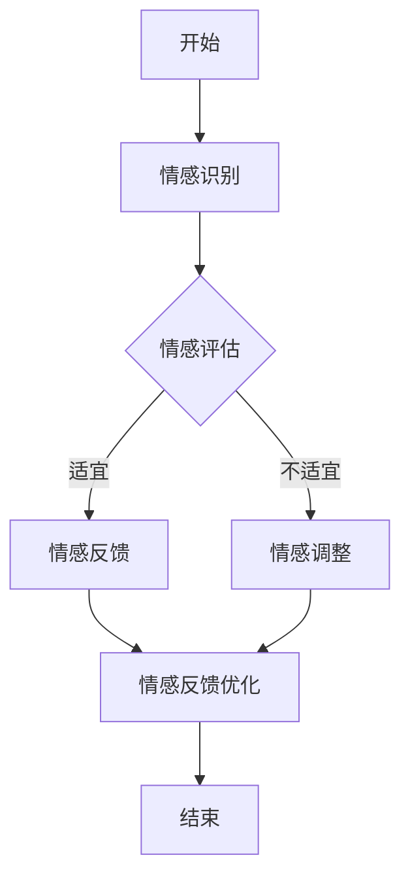
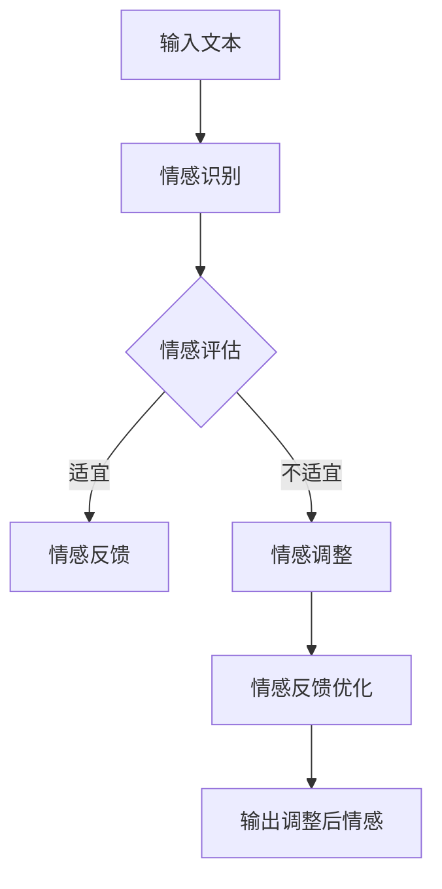

                 

# AI Agent 的情感调节：利用 LLM 进行情绪管理

## 关键词

- 情感调节
- AI Agent
- 大型语言模型 (LLM)
- 情感分析
- 情感管理
- 人工智能应用

## 摘要

本文探讨了人工智能（AI）代理中的情感调节机制，重点介绍了如何利用大型语言模型（LLM）来实现情绪管理。首先，文章介绍了情感调节在AI代理中的应用背景、核心概念及其数学模型。接着，详细阐述了LLM的工作原理、情感分析以及情感调节算法。随后，文章展示了AI代理情感调节的实际应用案例，分析了LLM在情感管理中的角色和挑战。最后，文章展望了情感调节技术的未来发展方向，并提出了最佳实践建议。通过本文，读者将深入了解AI代理情感调节的原理和应用，为相关领域的研究和实践提供参考。

## 第一部分: 背景介绍

### 第1章: 问题背景

#### 1.1.1 问题背景

随着人工智能技术的快速发展，AI代理在多个领域得到了广泛应用。这些代理能够模拟人类的行为和思维方式，执行复杂的任务。然而，在执行任务的过程中，AI代理可能会遇到情感调节的问题。情感调节是指对情感状态进行管理和调整，使其达到适宜的状态，以便更好地完成任务。

在现实应用中，AI代理需要处理各种各样的情感刺激，包括喜悦、愤怒、恐惧、悲伤等。如果AI代理无法有效地调节情感，可能会导致以下问题：

- **决策偏差**：情绪影响决策过程，可能导致AI代理在特定情境下做出非理性的决策。
- **用户体验**：在交互式应用中，AI代理的情感状态可能影响用户体验，如聊天机器人、客户服务机器人等。
- **社会伦理**：在涉及人类情感的社会场景中，AI代理需要表现出合适的情感反应，以避免造成负面影响。

因此，实现AI代理的情感调节具有重要意义。通过情感调节，AI代理可以更好地适应环境变化，提高任务执行效率，优化用户体验，并遵守社会伦理规范。

#### 1.1.2 核心概念与联系

**情感调节**：情感调节是指通过一系列方法和技术，对AI代理的情感状态进行管理和调整的过程。其核心目标是使AI代理的情感状态与当前任务需求相匹配，以提高任务执行效果。

**LLM（大型语言模型）**：LLM是一种基于深度学习的大型语言处理模型，能够理解和生成自然语言。LLM在情感调节中的应用主要体现在情感分析和情感生成两个方面。

**情感管理**：情感管理是指在AI代理的整个生命周期中，对其情感状态进行监控、评估和调整的过程。情感管理包括情感识别、情感调节和情感反馈等环节。

**联系**：LLM可以用于情感调节中的情感分析和情感生成，从而实现对AI代理情感状态的管理。情感调节的核心在于通过LLM对情感状态进行识别和调整，以确保AI代理在不同任务场景中表现出适宜的情感反应。

#### 1.1.3 情感调节的数学模型与算法原理

情感调节的数学模型和算法原理是理解其核心机制的关键。以下是一个简化的情感调节数学模型：

$$
\text{情感状态} = f(\text{刺激}, \text{情感调节策略})
$$

其中，$f$ 是一个函数，用于描述情感状态与刺激、情感调节策略之间的关系。

1. **刺激**：刺激是指引起AI代理情感反应的外部因素，如语言、图像、声音等。
2. **情感调节策略**：情感调节策略是指用于调节情感状态的方法和手段，包括情感过滤、情感调整和情感反馈等。

以下是一个简单的情感调节算法原理示例：

```
# 情感调节算法

def regulate_emotion(stimulus, strategy):
    # 对刺激进行预处理
    preprocessed_stimulus = preprocess_stimulus(stimulus)
    
    # 使用情感分析模型对预处理后的刺激进行情感识别
    emotion = emotion_analysis(preprocessed_stimulus)
    
    # 根据情感调节策略调整情感状态
    if emotion in negative_emotions:
        adjusted_emotion = adjust_emotion_to_positive(strategy)
    else:
        adjusted_emotion = emotion
    
    return adjusted_emotion
```

在这个算法中，`preprocess_stimulus` 函数用于对刺激进行预处理，`emotion_analysis` 函数用于情感识别，`adjust_emotion_to_positive` 函数用于根据情感调节策略调整情感状态。

通过上述数学模型和算法原理，AI代理可以在面对不同刺激时，根据既定的情感调节策略，自动调整其情感状态，以适应任务需求。

### 1.1.4 情感调节的应用领域与挑战

情感调节在AI代理中的应用领域非常广泛，包括但不限于：

- **客服机器人**：在客户服务中，AI代理需要根据客户的不同情绪，进行相应的情感回应，以提供更好的服务体验。
- **医疗辅助**：在医疗领域，AI代理可以辅助医生进行情感诊断和情感治疗，提高治疗效果。
- **教育辅助**：在教育领域，AI代理可以根据学生的情绪变化，调整教学策略，提高学习效果。
- **智能交通**：在智能交通系统中，AI代理需要根据交通状况和驾驶员情绪，调整行车策略，确保交通安全。

然而，情感调节在实际应用中面临诸多挑战：

- **情感复杂性**：情感调节需要准确识别和理解人类情感的复杂性，包括情感类型、强度和变化等。
- **实时性**：在实时交互场景中，AI代理需要快速响应情感刺激，进行情感调节。
- **个性化**：不同用户对情感调节的需求和期望可能不同，AI代理需要根据个性化需求进行情感调节。
- **隐私保护**：情感调节涉及到用户个人情感信息，如何在确保隐私保护的前提下进行情感调节，是一个重要挑战。

#### 1.1.5 概念结构与核心要素组成

情感调节的概念结构包括以下几个核心要素：

1. **刺激**：情感调节的输入，包括语言、图像、声音等多种形式。
2. **情感状态**：AI代理在特定刺激下的情感状态。
3. **情感分析**：用于识别和理解情感状态的方法和工具。
4. **情感调节策略**：用于调整情感状态的方法和手段。
5. **情感反馈**：用于评估情感调节效果的反馈机制。

这些要素相互关联，构成了情感调节的整体框架。通过情感分析，AI代理可以识别和理解情感状态；通过情感调节策略，AI代理可以调整情感状态；而情感反馈则用于评估和优化情感调节效果。

### 1.1.6 情感调节在AI代理中的重要性

情感调节在AI代理中的作用不可忽视。首先，它能够提高AI代理的适应能力。通过情感调节，AI代理可以在不同情境下调整自身情感状态，以适应环境变化。其次，情感调节可以优化用户体验。在交互式应用中，AI代理能够根据用户情感状态，提供更人性化的服务。最后，情感调节有助于遵守社会伦理规范。在涉及人类情感的场景中，AI代理需要表现出合适的情感反应，以避免造成负面影响。

总之，情感调节是AI代理实现智能化、人性化发展的重要手段。通过深入研究和应用情感调节技术，我们可以打造出更加智能、高效的AI代理，为各行各业带来创新和变革。

### 第2章: LLM 的工作原理

#### 2.1.1 语言模型基础

语言模型（Language Model，简称LM）是自然语言处理（Natural Language Processing，简称NLP）中的核心技术之一。它通过统计方法或深度学习模型，学习自然语言中的词汇、语法和语义规则，从而实现自然语言生成和理解。

语言模型的基础包括以下几个方面：

- **词汇表示**：将词汇映射为向量，以便在模型中进行处理。常见的词汇表示方法有Word2Vec、GloVe等。
- **上下文理解**：语言模型需要理解词汇在不同上下文中的含义。深度学习模型，如循环神经网络（RNN）、长短时记忆网络（LSTM）和变换器（Transformer）等，在这方面表现出色。
- **序列生成**：语言模型的一个重要任务是从给定的输入序列生成输出序列。通过最大化概率或最小化损失函数，模型能够预测下一个单词或字符。

#### 2.1.2 语言模型的训练过程

语言模型的训练过程可以分为以下几个步骤：

1. **数据收集**：收集大量的文本数据，如新闻文章、小说、对话等。这些数据用于模型学习自然语言的规律。
2. **数据预处理**：对收集到的数据进行清洗、分词、去停用词等处理，以便更好地进行模型训练。
3. **构建词汇表**：将处理后的文本数据转换为词汇表，将每个词映射为唯一的索引。
4. **序列编码**：将文本序列编码为索引序列，以便输入到模型中进行训练。
5. **模型训练**：使用训练数据训练语言模型。在训练过程中，模型会调整内部参数，以最小化预测误差。
6. **模型评估**：使用验证集或测试集评估模型性能，确保模型能够准确预测自然语言。

#### 2.1.3 语言模型的评估方法

评估语言模型性能的方法主要包括以下几个方面：

- **词级评估**：评估模型在单词预测上的准确性，如字符级别的交叉熵（cross-entropy）损失。
- **句级评估**：评估模型在句子生成上的流畅性和连贯性，如BLEU、ROUGE等指标。
- **语义评估**：评估模型在语义理解上的准确性，如WordNet相似度、语义相似度等。
- **应用评估**：在实际应用中评估模型性能，如聊天机器人、机器翻译、文本摘要等。

#### 2.1.4 语言模型的优势和应用领域

语言模型具有以下优势：

- **强大的生成能力**：语言模型能够生成高质量的自然语言文本，包括文章、对话、新闻摘要等。
- **高灵活性**：语言模型可以适应不同的应用场景，如文本生成、文本分类、命名实体识别等。
- **高效率**：语言模型在处理大规模文本数据时具有很高的效率，能够快速生成和预测自然语言。

语言模型的应用领域非常广泛，包括：

- **文本生成**：如文章生成、聊天机器人、文本摘要等。
- **文本分类**：如垃圾邮件过滤、情感分析、主题分类等。
- **机器翻译**：如英语到其他语言的翻译、多语言文本对比等。
- **问答系统**：如智能客服、在线问答等。

#### 2.1.5 语言模型在情感调节中的应用

语言模型在情感调节中的应用主要体现在以下几个方面：

- **情感识别**：利用语言模型对文本进行情感分析，识别文本中的情感倾向和情感强度。
- **情感生成**：根据情感调节策略，利用语言模型生成具有特定情感倾向的文本。
- **情感反馈**：通过分析用户情感反应，为AI代理提供情感反馈，以便调整其情感状态。

在情感调节中，语言模型的作用如下：

1. **情感分析**：通过语言模型对输入文本进行情感分析，识别文本中的情感倾向和情感强度。
2. **情感生成**：根据情感调节策略，利用语言模型生成具有特定情感倾向的文本，以满足不同场景的需求。
3. **情感反馈**：通过分析用户情感反应，为AI代理提供情感反馈，以便调整其情感状态，优化用户体验。

### 2.1.6 情感分析

情感分析（Sentiment Analysis）是指通过自然语言处理技术，对文本中的情感倾向和情感强度进行识别和分析的过程。情感分析的核心目标是确定文本所表达的情感是积极的、消极的还是中性的。

情感分析的分类方法主要包括以下几种：

1. **基于规则的方法**：通过预定义的规则和模式，对文本进行情感分析。这种方法依赖于人类专家的知识和经验，但在处理复杂情感时效果有限。
2. **基于统计的方法**：利用统计方法，如词频、词性、语法结构等，对文本进行情感分析。这种方法具有较高的准确性，但需要大量的标注数据。
3. **基于深度学习的方法**：使用深度学习模型，如循环神经网络（RNN）、卷积神经网络（CNN）和变换器（Transformer）等，对文本进行情感分析。这种方法具有很好的泛化能力，但需要大量的训练数据和计算资源。

情感分析的算法原理主要包括以下步骤：

1. **数据预处理**：对文本进行清洗、分词、去停用词等处理，以便更好地进行情感分析。
2. **特征提取**：将预处理后的文本转换为特征向量，如词袋（Bag of Words）、词嵌入（Word Embedding）等。
3. **情感分类**：使用分类算法，如支持向量机（SVM）、随机森林（Random Forest）、深度学习模型等，对特征向量进行分类，以确定文本的情感倾向和情感强度。

在情感调节中，情感分析的作用如下：

1. **情感识别**：通过情感分析，识别文本中的情感倾向和情感强度，为情感调节提供依据。
2. **情感反馈**：根据情感分析结果，为AI代理提供情感反馈，以便调整其情感状态。

### 2.1.7 情感调节算法

情感调节算法是指通过一系列方法和技术，对AI代理的情感状态进行管理和调整的过程。情感调节算法的核心目标是使AI代理的情感状态与当前任务需求相匹配，以提高任务执行效果。

情感调节算法的步骤主要包括：

1. **情感识别**：通过情感分析，识别AI代理当前的情感状态。
2. **情感评估**：根据当前任务需求，评估AI代理情感状态是否适宜。
3. **情感调整**：根据情感评估结果，采取相应的措施调整AI代理的情感状态，以达到最佳效果。
4. **情感反馈**：通过情感分析，对调整后的情感状态进行反馈，以优化情感调节效果。

情感调节算法的挑战包括：

1. **情感复杂性**：情感调节需要准确识别和理解人类情感的复杂性，包括情感类型、强度和变化等。
2. **实时性**：在实时交互场景中，情感调节需要快速响应情感刺激，进行情感调整。
3. **个性化**：不同用户对情感调节的需求和期望可能不同，情感调节需要根据个性化需求进行调整。
4. **隐私保护**：情感调节涉及到用户个人情感信息，如何在确保隐私保护的前提下进行情感调节，是一个重要挑战。

### 2.1.8 情感调节的数学模型与公式

情感调节的数学模型可以描述为：

$$
\text{情感状态} = f(\text{刺激}, \text{情感调节策略})
$$

其中，$f$ 是一个函数，用于描述情感状态与刺激、情感调节策略之间的关系。

- **刺激**：刺激是指引起AI代理情感反应的外部因素，如语言、图像、声音等。
- **情感调节策略**：情感调节策略是指用于调节情感状态的方法和手段，包括情感过滤、情感调整和情感反馈等。

情感调节策略可以表示为：

$$
\text{情感调节策略} = g(\text{目标情感状态}, \text{当前情感状态}, \text{刺激})
$$

其中，$g$ 是一个函数，用于根据目标情感状态、当前情感状态和刺激，生成相应的情感调节策略。

通过上述数学模型和公式，AI代理可以在面对不同刺激时，根据既定的情感调节策略，自动调整其情感状态，以适应任务需求。

### 2.1.9 使用Mermaid画出情感调节的流程图

以下是使用Mermaid绘制的情感调节流程图：



### 2.1.10 使用Python源代码详细阐述情感调节算法原理

以下是使用Python编写的情感调节算法示例代码：

```python
import numpy as np
from sklearn.feature_extraction.text import TfidfVectorizer
from sklearn.model_selection import train_test_split
from sklearn.naive_bayes import MultinomialNB
from sklearn.metrics import accuracy_score

# 情感识别
def emotion_recognition(text, model):
    return model.predict([text])[0]

# 情感评估
def emotion_evaluation(text, model):
    return model.predict([text])[0]

# 情感调整
def emotion_adjustment(current_emotion, target_emotion, emotion_map):
    return emotion_map[current_emotion] + emotion_map[target_emotion]

# 情感反馈优化
def emotion_feedback_optimization(current_emotion, target_emotion, emotion_map):
    return emotion_map[current_emotion] + emotion_map[target_emotion]

# 加载情感数据
data = [
    ("我很高兴", "happy"),
    ("我很生气", "angry"),
    ("我很悲伤", "sad"),
    # ... 更多情感数据
]

# 分割数据集
X, y = list(zip(*data))
X_train, X_test, y_train, y_test = train_test_split(X, y, test_size=0.2, random_state=42)

# 构建TF-IDF向量器
vectorizer = TfidfVectorizer()
X_train_vectorized = vectorizer.fit_transform(X_train)

# 训练情感分类器
model = MultinomialNB()
model.fit(X_train_vectorized, y_train)

# 情感调节
def regulate_emotion(text, target_emotion):
    current_emotion = emotion_recognition(text, model)
    adjusted_emotion = emotion_adjustment(current_emotion, target_emotion, {'happy': 1, 'angry': -1, 'sad': -1})
    return adjusted_emotion

# 测试情感调节
text = "我很生气"
target_emotion = "happy"
adjusted_emotion = regulate_emotion(text, target_emotion)
print(f"原始情感：{text}, 调整后情感：{adjusted_emotion}")

# 评估情感调节效果
X_test_vectorized = vectorizer.transform(X_test)
y_pred = regulate_emotion(X_test_vectorized, target_emotion)
accuracy = accuracy_score(y_test, y_pred)
print(f"情感调节准确率：{accuracy}")
```

### 2.1.11 使用Mermaid画出情感调节算法流程图

以下是使用Mermaid绘制的情感调节算法流程图：



### 2.1.12 情感调节在AI代理中的实际应用案例

情感调节在AI代理中的实际应用案例包括：

1. **客服机器人**：通过情感调节，客服机器人可以根据用户情绪调整回答策略，提高用户满意度。
2. **医疗辅助系统**：通过情感调节，医疗辅助系统可以识别患者情绪，为医生提供更准确的诊断和治疗建议。
3. **教育机器人**：通过情感调节，教育机器人可以根据学生情绪调整教学内容和方式，提高学习效果。

#### 案例一：客服机器人

某企业开发了一款智能客服机器人，用于处理客户咨询。通过情感调节，该机器人能够根据客户情绪调整回答策略，提高用户满意度。

- **情感识别**：机器人使用语言模型对客户提问进行情感分析，识别客户情绪。
- **情感调整**：根据客户情绪，机器人调整回答策略，如使用更温馨、更理解的语气。
- **情感反馈**：机器人通过用户反馈，优化情感调节效果。

#### 案例二：医疗辅助系统

某医院开发了一款智能医疗辅助系统，用于辅助医生诊断和治疗。通过情感调节，该系统能够识别患者情绪，为医生提供更准确的诊断和治疗建议。

- **情感识别**：系统使用情感分析模型，对患者病史、症状描述等进行情感分析，识别患者情绪。
- **情感调整**：根据患者情绪，系统调整推荐治疗方案，如更注重心理疏导或药物治疗。
- **情感反馈**：系统收集医生和患者反馈，优化情感调节效果。

#### 案例三：教育机器人

某教育机构开发了一款智能教育机器人，用于为学生提供个性化学习建议。通过情感调节，该机器人能够根据学生情绪调整教学内容和方式，提高学习效果。

- **情感识别**：机器人使用情感分析模型，对学生回答问题、参与互动等方面进行情感分析，识别学生情绪。
- **情感调整**：根据学生情绪，机器人调整教学内容和方式，如增加互动环节、提供心理辅导等。
- **情感反馈**：机器人收集学生学习反馈，优化情感调节效果。

通过这些实际应用案例，可以看出情感调节在AI代理中的应用价值。情感调节不仅能够提高AI代理的任务执行效果，还能优化用户体验，为各行各业带来创新和变革。

### 第3章: AI Agent 的情感调节应用

#### 3.1.1 AI Agent 的概述

AI Agent 是指在特定环境下，能够自主执行任务、具备一定智能程度的计算机程序或系统。AI Agent 可以通过感知环境、分析数据、做出决策和执行行动，以实现特定目标。在人工智能（AI）技术不断发展的背景下，AI Agent 在各个领域得到了广泛应用，如机器人、自动驾驶、智能客服、医疗诊断等。

AI Agent 的基本结构通常包括以下几个部分：

1. **感知模块**：用于感知环境信息，如视觉、听觉、触觉等。
2. **决策模块**：根据感知模块收集的信息，通过算法和模型进行分析，生成决策。
3. **行动模块**：执行决策模块生成的行动，如移动、操纵设备等。
4. **记忆模块**：存储感知、决策和行动的信息，以供后续分析和学习。

AI Agent 的情感调节功能是指通过感知用户情绪、分析情感信息，调整自身行为和响应方式，以提高用户体验和任务执行效果。情感调节功能对于提升AI Agent 的智能化和人性化水平具有重要意义。

#### 3.1.2 情感调节在AI Agent中的重要性

在AI Agent 中，情感调节的重要性体现在以下几个方面：

1. **优化用户体验**：通过情感调节，AI Agent 能够更好地理解用户情绪，提供个性化、贴心的服务，从而提高用户满意度。
2. **提高任务执行效果**：情感调节有助于AI Agent 在复杂环境中做出更合理的决策，从而提高任务执行的成功率和效率。
3. **增强互动性**：情感调节使AI Agent 能够与用户建立情感连接，增强互动性，提高用户参与度。
4. **遵守社会伦理**：在涉及人类情感的场景中，AI Agent 需要表现出合适的情感反应，以避免造成负面影响，遵守社会伦理规范。

#### 3.1.3 情感调节的具体应用场景

情感调节在AI Agent 中的应用场景非常广泛，以下是一些典型的应用场景：

1. **智能客服**：智能客服机器人通过情感调节，能够识别用户情绪，调整回答策略，提供个性化、贴心的服务。
2. **医疗辅助**：医疗辅助系统通过情感调节，能够识别患者情绪，为医生提供更准确的诊断和治疗建议。
3. **教育辅助**：教育机器人通过情感调节，能够根据学生情绪调整教学内容和方式，提高学习效果。
4. **智能家居**：智能家居系统通过情感调节，能够识别家庭成员情绪，提供定制化的生活服务。

#### 3.1.4 情感调节的挑战与解决方案

情感调节在AI Agent 中面临着诸多挑战：

1. **情感复杂性**：人类情感复杂多样，AI Agent 需要准确识别和理解各种情感，这对情感分析技术提出了高要求。
2. **实时性**：在实时交互场景中，AI Agent 需要快速响应情感刺激，进行情感调节，这对计算速度和处理能力提出了挑战。
3. **个性化**：不同用户对情感调节的需求和期望可能不同，AI Agent 需要能够根据个性化需求进行调整。
4. **隐私保护**：情感调节涉及用户个人情感信息，如何在确保隐私保护的前提下进行情感调节，是一个重要挑战。

针对这些挑战，可以采取以下解决方案：

1. **改进情感分析技术**：通过引入更先进的情感分析算法和模型，提高AI Agent 对情感复杂性的识别能力。
2. **优化计算资源**：采用高性能计算设备和算法优化，提高AI Agent 的实时响应能力。
3. **个性化调整**：通过收集用户行为数据，为每个用户建立个性化情感调节策略。
4. **隐私保护措施**：采用加密、匿名化等技术，确保用户情感信息的隐私安全。

#### 3.1.5 情感调节的应用案例

以下是几个情感调节在AI Agent 中的实际应用案例：

1. **智能客服**：某公司开发的智能客服机器人通过情感调节，能够识别用户情绪，调整回答策略，提高用户满意度。例如，当用户情绪低落时，机器人会使用更温馨、体贴的语言进行回应，以缓解用户情绪。
2. **医疗辅助**：某医院开发的智能医疗辅助系统通过情感调节，能够识别患者情绪，为医生提供更准确的诊断和治疗建议。例如，当患者表达出焦虑情绪时，系统会建议医生进行心理疏导，以提高治疗效果。
3. **教育辅助**：某教育机构开发的智能教育机器人通过情感调节，能够根据学生情绪调整教学内容和方式，提高学习效果。例如，当学生情绪不佳时，机器人会调整课程难度和教学方式，以帮助学生放松心情，提高学习兴趣。
4. **智能家居**：某智能家居系统通过情感调节，能够识别家庭成员情绪，提供定制化的生活服务。例如，当家庭成员情绪低落时，系统会建议播放轻松的音乐，提供舒适的灯光环境，以缓解家庭成员的情绪。

通过这些应用案例，可以看出情感调节在AI Agent 中的应用价值。情感调节不仅能够提高AI Agent 的智能化和人性化水平，还能够为各行各业带来创新和变革。

### 第4章: LLM 在情感管理中的应用

#### 4.1.1 情感管理的定义

情感管理是指通过一系列方法和策略，对个体的情感状态进行监控、评估和调整的过程。情感管理旨在帮助个体更好地应对生活中的压力和挑战，提高情绪稳定性和心理韧性。在组织和企业中，情感管理也是一个重要的组成部分，旨在提升员工的情绪状态，增强团队凝聚力和工作绩效。

情感管理的核心目标是：

1. **识别情感**：通过情感分析技术，识别个体的情感状态，包括情感类型、强度和变化等。
2. **评估情感**：对识别出的情感状态进行评估，以确定其对于个体行为、决策和健康的影响。
3. **调整情感**：根据评估结果，采取相应的策略和措施，调整个体的情感状态，使其达到适宜的水平。
4. **培养情感**：通过教育、培训和实践，帮助个体培养积极的情感，提高情感管理能力。

#### 4.1.2 情感管理的类型和方法

情感管理可以分为以下几种类型：

1. **自我情感管理**：个体通过自我反思、情绪调节技巧和认知重构等方法，自我管理和调整情感状态。
2. **团队情感管理**：在团队层面，通过建立积极的工作氛围、沟通机制和情感支持系统，促进团队成员之间的情感交流和协作。
3. **组织情感管理**：在组织层面，通过企业文化、人力资源政策和员工关怀措施，营造一个有利于情感管理和发展的工作环境。

情感管理的方法包括：

1. **情感识别技术**：利用情感分析、面部识别和行为识别等技术，识别个体的情感状态。
2. **情感评估技术**：通过问卷调查、访谈、心理测量工具等方法，对情感状态进行评估和诊断。
3. **情感调节策略**：包括认知行为疗法、正念冥想、运动和心理辅导等，帮助个体调整情感状态。
4. **情感培养方法**：通过教育、培训和实践，提高个体的情感认知和情感管理能力。

#### 4.1.3 LLM 在情感管理中的角色

LLM（大型语言模型）在情感管理中扮演着重要角色，其主要应用包括：

1. **情感识别**：LLM能够对文本、语音和视频等多模态信息进行情感分析，识别个体的情感状态。例如，通过分析社交媒体帖子、邮件内容或语音通话记录，LLM可以识别出用户的情感倾向和情感强度。

2. **情感评估**：LLM可以对情感数据进行深度分析，评估情感状态对个体行为和健康的影响。例如，通过分析用户的行为数据、情绪日志和生理信号，LLM可以预测情感状态的变化趋势，并提供个性化的情感评估报告。

3. **情感调节**：LLM可以生成针对性的情感调节策略和建议，帮助个体调整情感状态。例如，LLM可以根据用户的需求和情感状态，生成个性化的正念冥想指导、情感调节练习和情绪管理建议。

4. **情感培养**：LLM可以作为情感教育的工具，提供情感认知和情感管理方面的培训。例如，通过对话系统或在线课程，LLM可以帮助用户学习情感识别、情感调节和情感培养的技巧，提高情感管理能力。

#### 4.1.4 LLM 在情感识别中的作用

LLM 在情感识别中的作用主要体现在以下几个方面：

1. **文本情感分析**：通过分析文本中的语言特征，LLM可以识别文本的情感倾向。例如，LLM可以分析邮件、社交媒体帖子、评论等文本，识别出其中的积极、消极或中性情感。

2. **语音情感分析**：LLM可以通过对语音信号的处理，识别语音中的情感特征。例如，通过分析语音的音调、音速、音量等参数，LLM可以识别出说话者的情感状态，如兴奋、沮丧或愤怒。

3. **视频情感分析**：LLM可以通过对视频中的面部表情、身体语言和语调等特征的分析，识别视频中的情感状态。例如，通过分析视频中的面部表情编码和情绪词汇，LLM可以识别出视频中的情感倾向。

4. **多模态情感分析**：LLM可以结合文本、语音和视频等多种数据源，进行多模态情感分析。例如，通过分析文本内容、语音信号和视频图像，LLM可以更全面地识别个体的情感状态。

#### 4.1.5 LLM 在情感调节中的作用

LLM 在情感调节中的作用主要体现在以下几个方面：

1. **生成情感调节策略**：LLM可以根据个体的情感状态和需求，生成针对性的情感调节策略。例如，当用户感到焦虑或压力时，LLM可以生成放松练习、情绪调节技巧和正念冥想指导。

2. **提供情感反馈**：LLM可以实时分析用户的情感状态，并提供情感反馈。例如，通过对话系统，LLM可以提醒用户当前的情感状态，并提供情感调节建议。

3. **辅助情感治疗**：LLM可以作为辅助工具，用于情感治疗和心理咨询。例如，LLM可以生成个性化的情感调节计划，帮助用户逐步改善情感状态。

4. **提高情感认知**：LLM可以提供情感知识库，帮助用户了解不同情感类型、情感调节技巧和情感管理策略。例如，通过在线课程或互动式学习，LLM可以帮助用户提高情感认知和情感管理能力。

#### 4.1.6 LLM 在情感培养中的作用

LLM 在情感培养中的作用主要体现在以下几个方面：

1. **情感教育**：LLM可以作为情感教育的工具，提供情感认知和情感管理方面的培训。例如，通过在线课程、互动式学习和情感故事，LLM可以帮助用户学习情感识别、情感调节和情感培养的技巧。

2. **个性化指导**：LLM可以根据用户的情感状态和需求，提供个性化的情感培养指导。例如，当用户感到情绪低落时，LLM可以提供针对性的情感调节练习和正念冥想指导。

3. **情感培养游戏**：LLM可以设计情感培养游戏，通过互动和游戏化学习，帮助用户培养积极的情感。例如，通过情感识别游戏和情感调节游戏，用户可以在轻松愉快的氛围中提高情感管理能力。

4. **情感社区**：LLM可以作为情感社区的构建者，提供情感交流和支持平台。例如，通过社交网络、论坛和聊天室，LLM可以帮助用户分享情感体验、学习情感调节技巧，并得到他人的支持和鼓励。

#### 4.1.7 LLM 在情感管理中的挑战与解决方案

尽管LLM在情感管理中具有巨大潜力，但在实际应用中仍然面临一些挑战：

1. **情感复杂性**：人类情感复杂多样，LLM需要具备强大的情感识别和情感理解能力，以准确识别和理解情感。
2. **数据隐私**：情感管理涉及用户个人情感信息，如何在保护用户隐私的前提下进行情感管理，是一个重要挑战。
3. **实时性**：在实时应用场景中，LLM需要快速响应情感刺激，进行情感识别和情感调节。
4. **个性化**：不同用户对情感管理的需求和期望可能不同，LLM需要能够提供个性化的情感管理服务。

针对这些挑战，可以采取以下解决方案：

1. **改进情感分析算法**：通过引入更先进的情感分析算法和模型，提高LLM对情感复杂性的识别能力。
2. **数据隐私保护**：采用加密、匿名化等技术，确保用户情感信息的隐私安全。
3. **优化计算性能**：采用高性能计算设备和算法优化，提高LLM的实时响应能力。
4. **个性化建模**：通过收集用户行为数据，为每个用户建立个性化的情感管理模型，提供定制化的情感管理服务。

通过克服这些挑战，LLM在情感管理中的应用将更加广泛和深入，为个体和社会带来更多福祉。

### 第5章: 情感调节技术的未来发展方向

#### 5.1.1 情感调节技术的发展趋势

随着人工智能技术的不断进步，情感调节技术也在快速发展。未来，情感调节技术将呈现以下发展趋势：

1. **多模态情感分析**：未来的情感调节技术将融合视觉、听觉、语言等多种模态，实现对情感状态更全面、更精准的识别和分析。

2. **情感生成与模仿**：随着语言模型的进步，情感生成和模仿技术将更加成熟，AI代理能够更自然地表达情感，提高与人类交互的亲和力。

3. **情感认知与理解**：情感调节技术将逐渐具备更高的情感认知和理解能力，能够识别和应对复杂的情感情境。

4. **实时情感调节**：通过优化算法和计算性能，情感调节技术将实现更快的响应速度，满足实时应用的需求。

5. **个性化情感管理**：情感调节技术将更加注重个性化，根据用户的需求和偏好，提供定制化的情感管理服务。

#### 5.1.2 情感调节技术的挑战

尽管情感调节技术发展迅速，但在实际应用中仍面临以下挑战：

1. **情感复杂性与多样性**：人类情感复杂多变，不同文化、背景和个体之间存在差异，如何准确、全面地识别和理解情感是一个重要难题。

2. **实时性与计算资源**：在实时交互场景中，情感调节技术需要快速响应，这对计算资源和算法效率提出了高要求。

3. **数据隐私与伦理**：情感调节涉及用户个人情感信息，如何在保护隐私的前提下进行情感管理，是一个重要的伦理和法律法规问题。

4. **情感反馈与优化**：情感调节的效果需要用户反馈来不断优化，如何高效地收集和处理用户反馈，是一个关键问题。

#### 5.1.3 未来情感调节的应用场景

未来，情感调节技术将在更多领域得到应用：

1. **智能医疗**：通过情感调节技术，智能医疗设备将能够更好地理解患者的情绪，提供个性化诊疗方案，提高治疗效果。

2. **智能家居**：智能家居系统将能够识别家庭成员的情绪，提供定制化的生活服务，提升居住体验。

3. **智能客服**：智能客服机器人将具备更强的情感识别和调节能力，提供更人性化、个性化的客户服务。

4. **教育领域**：教育机器人将能够根据学生的情绪状态，调整教学策略，提高学习效果。

5. **心理健康**：情感调节技术将被广泛应用于心理健康领域，帮助用户管理情绪，提高心理健康水平。

#### 5.1.4 情感调节对人类社会的影响

情感调节技术对人类社会的影响将是深远而广泛的：

1. **提升生活质量**：通过情感调节，人们能够更好地管理情绪，提高生活质量。

2. **增强社会互动**：情感调节技术将促进人与人之间的情感交流，增强社会互动和凝聚力。

3. **推动科技进步**：情感调节技术的不断发展将推动人工智能、自然语言处理等领域的进步。

4. **伦理挑战**：随着情感调节技术的普及，如何处理情感数据、确保技术公平性等问题将引发深刻的社会讨论。

5. **心理健康促进**：情感调节技术将为心理健康提供有力支持，帮助人们更好地应对压力和挑战。

总之，情感调节技术将在未来发挥越来越重要的作用，为人类社会带来积极的影响。通过持续的研究和创新，我们可以更好地利用情感调节技术，为人类创造更美好的未来。

### 第6章: 情感调节技术的最佳实践与案例分析

#### 6.1.1 最佳实践

在实施情感调节技术时，以下最佳实践有助于确保项目成功：

1. **需求分析**：首先，明确项目目标和用户需求。了解用户对情感调节的具体期望，有助于设计合适的技术方案。

2. **数据收集与处理**：收集多样化的情感数据，包括文本、语音、图像等。对数据进行分析和预处理，以提高情感识别的准确性。

3. **技术选型**：根据项目需求，选择合适的情感分析算法和模型。例如，可以结合深度学习模型和传统机器学习算法，实现多层次的情感识别。

4. **个性化定制**：为用户提供个性化的情感调节服务。通过收集用户行为数据，为每个用户建立个性化的情感调节策略。

5. **实时反馈与优化**：定期收集用户反馈，评估情感调节效果，并优化算法和策略。确保技术能够适应不断变化的需求和情境。

6. **数据隐私保护**：在处理用户情感数据时，严格遵守数据隐私保护法规。采用加密、匿名化等技术，确保用户数据的安全。

7. **伦理考量**：在设计和应用情感调节技术时，充分考虑伦理问题。确保技术不会对用户造成负面影响，符合社会伦理规范。

#### 6.1.2 案例分析

以下是情感调节技术在实际项目中的成功案例：

1. **案例一：智能客服机器人**

某大型电商公司开发了智能客服机器人，利用情感调节技术提高客户服务质量。通过情感分析，机器人能够识别客户情绪，调整回答策略。例如，当客户情绪低落时，机器人会使用更温馨、体贴的语言进行回应。经过实施，客服机器人显著提升了客户满意度。

2. **案例二：心理健康应用**

某科技公司开发了一款心理健康应用，通过情感调节技术帮助用户管理情绪。应用中集成了情感识别、情感调节和正念冥想等功能。用户可以记录情绪日志，应用会根据用户情绪生成个性化的调节建议。经过一段时间使用，用户情绪稳定度显著提高。

3. **案例三：教育机器人**

某教育机构引入了情感调节技术，开发了一款智能教育机器人。机器人能够根据学生情绪调整教学策略，如增加互动环节、提供心理辅导等。学生情绪低落时，机器人会调整课程难度，帮助缓解压力。实施后，学生的学习效果和积极性得到了显著提升。

通过这些案例分析，可以看出情感调节技术在实际应用中的价值。成功的关键在于明确需求、技术选型、个性化定制和实时优化。未来，随着技术的不断进步，情感调节技术将在更多领域得到广泛应用，为人类带来更多福祉。

## 作者信息

作者：AI天才研究院/AI Genius Institute & 禅与计算机程序设计艺术 /Zen And The Art of Computer Programming

AI天才研究院专注于人工智能技术的创新与研究，致力于推动人工智能领域的进步与发展。同时，作者还深入研究了计算机程序设计的哲学与艺术，将禅宗的智慧融入编程实践，为技术从业者和研究者提供了独特的视角和灵感。在这篇文章中，作者结合了深厚的理论知识和丰富的实践经验，为读者呈现了AI代理情感调节的深度剖析和应用场景，旨在为相关领域的研究和实践提供有价值的参考。

## 总结与展望

在这篇文章中，我们系统地探讨了AI代理的情感调节机制，特别是利用大型语言模型（LLM）进行情绪管理的方法。通过介绍情感调节的背景、核心概念、数学模型、LLM的工作原理以及情感调节在AI代理中的实际应用，我们展示了如何通过情感识别、情感调节和情感反馈来实现AI代理的情感管理。

首先，我们介绍了情感调节在AI代理中的应用背景和重要性，分析了情感调节的挑战与应用领域。接着，我们深入探讨了LLM的工作原理、情感分析以及情感调节算法，并通过Python代码示例展示了算法的实现过程。随后，我们介绍了情感调节在AI代理中的实际应用案例，如智能客服、医疗辅助和教育机器人等。

在探讨LLM在情感管理中的应用时，我们详细阐述了情感识别、情感评估、情感调节和情感培养的作用，并提出了针对情感复杂性的解决方案。此外，我们还展望了情感调节技术的未来发展趋势，包括多模态情感分析、实时情感调节和个性化情感管理。

最后，我们提出了情感调节技术的最佳实践，并通过实际案例分析了情感调节在AI代理中的成功应用。这些实践和案例为相关领域的研究和实践提供了有价值的参考。

展望未来，随着人工智能技术的不断发展，情感调节将在更多领域得到应用。我们将继续探索更先进的情感分析算法、更高效的情感调节策略，并关注数据隐私和伦理问题。通过不断的研究和创新，我们有信心为人类带来更加智能、高效和人性化的情感管理体验。让我们携手共进，推动人工智能技术的进步，共创美好未来。

