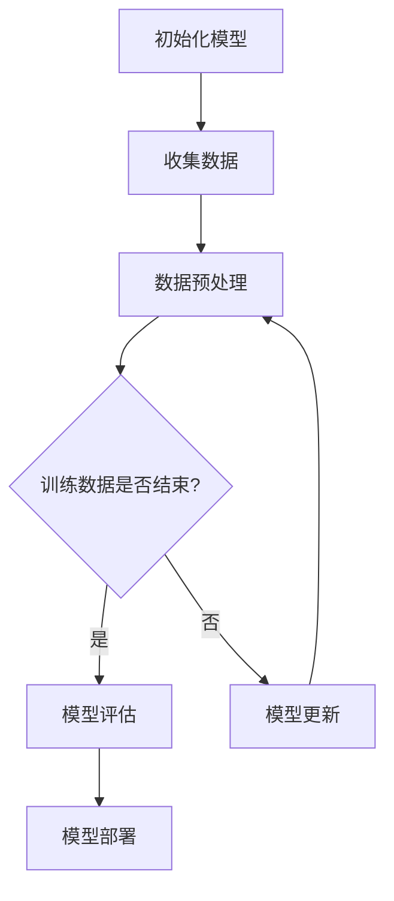
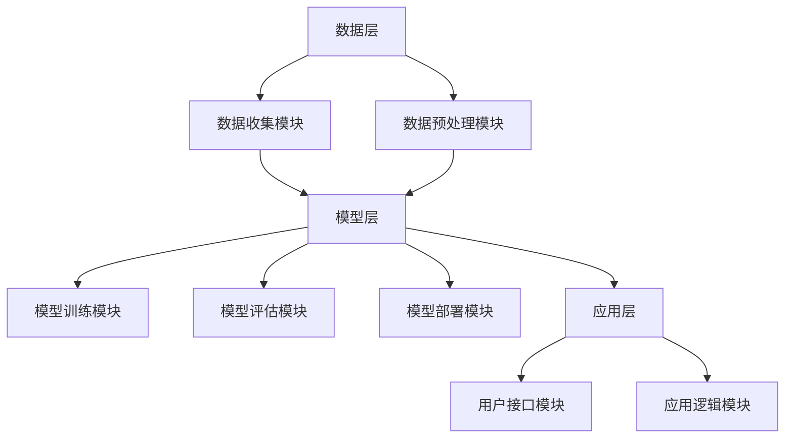
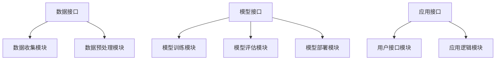
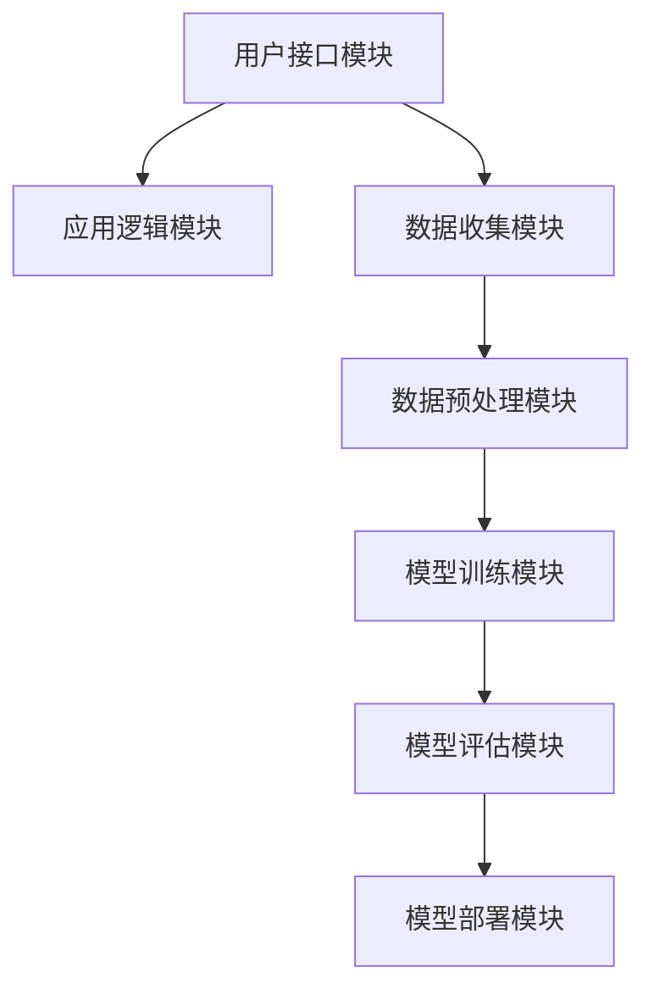
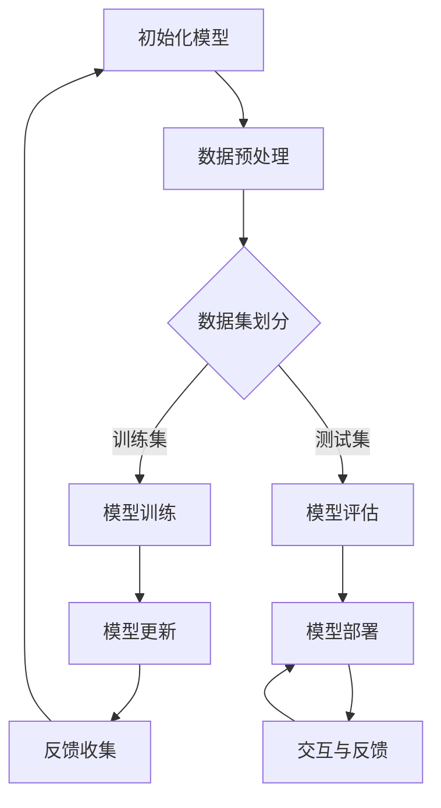
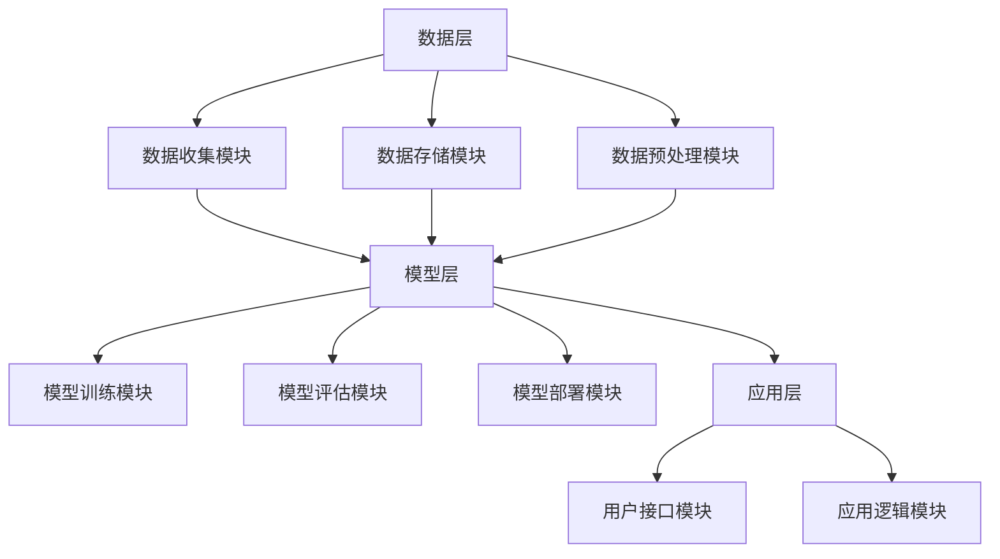
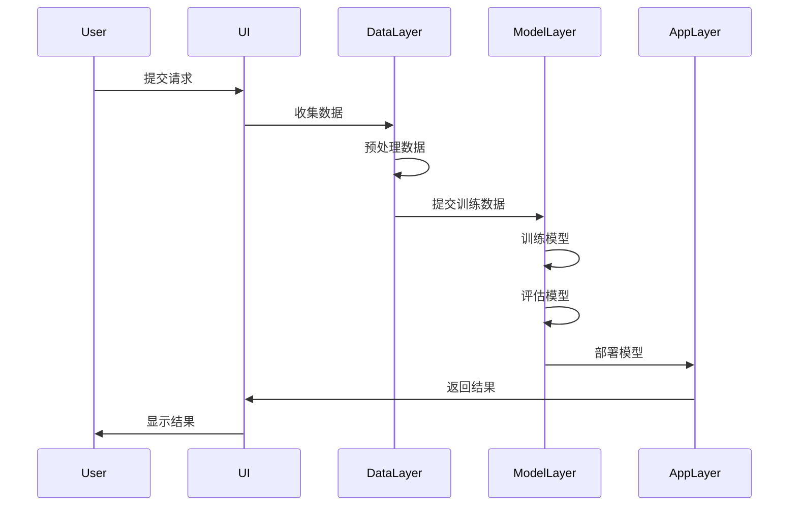
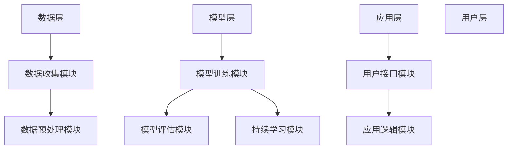
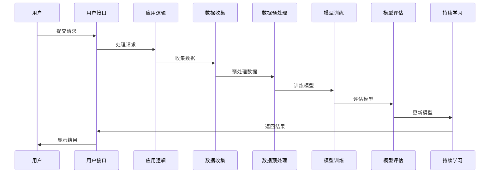

                 

# AI Agent 的持续学习：实现 LLM 的终身学习能力

## 关键词
- AI Agent
- 持续学习
- LLM
- 算法原理
- 系统架构
- 项目实战

## 摘要
本文深入探讨了AI Agent的持续学习机制，特别是自然语言处理（NLP）领域的长短期记忆（LLM）模型。文章首先介绍了AI Agent的概念及其发展历程，然后详细阐述了LLM模型的基本原理及其终身学习能力。接下来，本文分析了实现AI Agent持续学习的挑战，并提出了相应的解决方案。通过数学模型、算法流程图和Python代码示例，本文清晰地展示了持续学习算法的实现原理。此外，文章还介绍了系统功能设计、架构设计、接口设计、系统交互等内容，并通过实际项目案例分析，验证了理论的有效性。最后，本文总结了最佳实践、注意事项以及未来的研究方向。

----------------------------------------------------------------

## 第一部分：背景介绍与核心概念

### 第1章：AI Agent 的发展历程与核心概念

#### 1.1.1 AI Agent 的发展历程

人工智能（AI）作为一种模拟、延伸和扩展人类智能的技术，自20世纪50年代起便迅速发展。在AI的发展历程中，Agent概念逐渐被引入。AI Agent，即人工智能代理，是能够自主执行任务、与环境互动并作出决策的智能体。它们通常具备感知、理解、学习和行动等能力。

AI Agent的发展可以分为以下几个阶段：

1. **初始阶段**（1950-1960年代）：AI Agent的概念初步提出，主要基于逻辑推理和规则系统。代表性工作包括1956年达特茅斯会议的提出。

2. **黄金时代**（1960-1970年代）：符号主义AI方法兴起，AI Agent开始尝试解决更复杂的问题，如自然语言处理、博弈和规划。

3. **低谷时期**（1970-1980年代）：由于计算能力和数据资源的限制，AI Agent的研究进展放缓。

4. **复兴阶段**（1980年代至今）：随着计算机性能的提升和大数据、深度学习的兴起，AI Agent的研究与应用再次蓬勃发展。

#### 1.1.2 AI Agent 的核心概念

AI Agent的基本概念包括：

- **感知**：通过传感器获取环境信息。
- **理解**：解析感知信息，理解其含义。
- **学习**：从经验中学习和改进自身行为。
- **决策**：基于理解结果选择行动方案。
- **行动**：执行决策并产生结果。

AI Agent的核心特征包括自主性、适应性、交互性和认知能力。

#### 1.1.3 AI Agent 与持续学习的联系

持续学习是指AI Agent在不断接触新数据和环境的过程中，不断调整和优化自身模型的过程。这对于AI Agent来说至关重要，因为它能够使Agent适应不断变化的环境，并保持其效能。

持续学习的核心目标包括：

- **适应新环境**：当环境变化时，AI Agent能够快速适应。
- **保持效能**：在长期使用过程中，AI Agent的效能不会显著下降。
- **迁移学习**：将已学到的知识应用到新任务中。

接下来，我们将详细探讨LLM模型的基本原理及其终身学习能力。

----------------------------------------------------------------

## 第二部分：算法原理讲解与数学模型

### 第5章：持续学习算法原理详解

#### 5.1 持续学习算法概述

持续学习算法是指能够在不同任务间迁移知识，并持续适应新环境的算法。在AI Agent中，持续学习算法的核心目标是通过不断的学习和调整，使其能够处理复杂多变的环境和任务。

持续学习算法通常包含以下几个关键组件：

- **元学习**：通过元学习算法，AI Agent能够快速适应新任务。
- **在线学习**：AI Agent在执行任务的过程中不断学习，并实时调整模型。
- **迁移学习**：利用先前学到的知识，减少对新任务的训练时间。
- **模型更新**：定期更新模型，以保持其适应性和效能。

#### 5.2 数学模型与公式

持续学习算法的数学模型通常涉及以下几个关键要素：

- **损失函数**：衡量模型预测值与真实值之间的差异。
- **优化器**：调整模型参数，以最小化损失函数。
- **正则化**：防止模型过拟合，提高泛化能力。

常用的数学模型包括：

- **梯度下降**：通过不断调整模型参数，使得损失函数逐步减小。
- **随机梯度下降**（SGD）：在梯度下降的基础上，引入随机性，加快收敛速度。
- **Adam优化器**：结合了SGD和 Momentum的优点，适用于大规模数据集。

#### 5.3 算法流程图

持续学习算法的流程图如下所示：



#### 5.4 举例说明

以一个简单的线性回归问题为例，假设我们有一个数据集\(x\)和标签\(y\)，目标是预测\(y'\)：

1. **数据收集与预处理**：从数据集中随机抽取100个样本，进行归一化处理。
2. **初始化模型**：设置模型的初始参数\(\theta_0\)。
3. **训练模型**：使用梯度下降算法，迭代更新模型参数，使得损失函数最小。
4. **模型评估**：使用测试集评估模型的预测性能。
5. **模型部署**：将训练好的模型部署到生产环境中。

具体代码实现如下：

```python
import numpy as np

# 梯度下降算法
def gradient_descent(X, y, theta, alpha, num_iters):
    m = len(y)
    temp_theta = np.copy(theta)
    for i in range(num_iters):
        hypothesis = np.dot(X, temp_theta)
        errors = hypothesis - y
        temp_theta -= alpha * (1/m) * np.dot(X.T, errors)
    return temp_theta

# 线性回归模型
def linear_regression(X, y):
    num_samples, num_features = X.shape
    theta = np.random.rand(num_features)
    alpha = 0.01
    num_iters = 1000
    theta = gradient_descent(X, y, theta, alpha, num_iters)
    return theta

# 训练数据
X_train = np.array([[1, 2], [2, 3], [3, 4]])
y_train = np.array([2, 3, 4])

# 训练模型
theta = linear_regression(X_train, y_train)

# 模型评估
X_test = np.array([[1, 2.5], [2, 3.5]])
y_test = np.array([2.5, 3.5])
hypothesis = np.dot(X_test, theta)
print("预测值:", hypothesis)
```

通过以上代码，我们可以训练一个简单的线性回归模型，并评估其预测性能。

接下来，我们将介绍Python源代码实现与算法讲解。

----------------------------------------------------------------

### 第6章：Python 源代码实现与算法讲解

#### 6.1 环境安装与配置

在开始编写Python源代码之前，我们需要确保安装了必要的库。以下是环境安装与配置的步骤：

1. **安装Python**：确保安装了Python 3.6或更高版本。
2. **安装Numpy**：使用pip安装Numpy库。
   ```bash
   pip install numpy
   ```
3. **安装Matplotlib**：用于可视化算法流程和结果。
   ```bash
   pip install matplotlib
   ```

安装完成后，我们可以开始编写源代码。

#### 6.2 源代码实现详解

以下是一个简单的持续学习算法的Python实现：

```python
import numpy as np

# 梯度下降算法
def gradient_descent(X, y, theta, alpha, num_iters):
    m = len(y)
    temp_theta = np.copy(theta)
    for i in range(num_iters):
        hypothesis = np.dot(X, temp_theta)
        errors = hypothesis - y
        temp_theta -= alpha * (1/m) * np.dot(X.T, errors)
    return temp_theta

# 线性回归模型
def linear_regression(X, y):
    num_samples, num_features = X.shape
    theta = np.random.rand(num_features)
    alpha = 0.01
    num_iters = 1000
    theta = gradient_descent(X, y, theta, alpha, num_iters)
    return theta

# 训练数据
X_train = np.array([[1, 2], [2, 3], [3, 4]])
y_train = np.array([2, 3, 4])

# 训练模型
theta = linear_regression(X_train, y_train)

# 模型评估
X_test = np.array([[1, 2.5], [2, 3.5]])
y_test = np.array([2.5, 3.5])
hypothesis = np.dot(X_test, theta)
print("预测值:", hypothesis)
```

在这个实现中，我们首先定义了梯度下降算法，然后使用这个算法来训练一个线性回归模型。最后，我们使用测试数据来评估模型的性能。

#### 6.3 代码应用解读与分析

在上面的代码中，我们首先定义了梯度下降算法，它是一个迭代过程，每次迭代都会更新模型的参数以最小化损失函数。我们使用了一个简单的线性回归模型来演示这个算法。

在训练模型时，我们首先初始化了模型的参数，然后使用梯度下降算法迭代更新这些参数。每次迭代都会计算损失函数的梯度，并使用这个梯度来更新参数。

在模型评估部分，我们使用测试数据来评估模型的性能。我们将测试数据输入到训练好的模型中，并比较预测值和真实值，以评估模型的准确度。

#### 6.4 实际案例剖析

为了更深入地理解持续学习算法，我们可以考虑一个更复杂的实际案例：手写数字识别。在这个案例中，我们使用MNIST数据集，它包含70000个手写数字的图像和相应的标签。

```python
import numpy as np
from sklearn.datasets import fetch_openml
from sklearn.model_selection import train_test_split
from sklearn.preprocessing import StandardScaler

# 加载MNIST数据集
mnist = fetch_openml('mnist_784', version=1)
X, y = mnist["data"], mnist["target"]

# 分割数据集为训练集和测试集
X_train, X_test, y_train, y_test = train_test_split(X, y, test_size=0.2, random_state=42)

# 数据预处理
scaler = StandardScaler()
X_train_scaled = scaler.fit_transform(X_train)
X_test_scaled = scaler.transform(X_test)

# 定义模型
def neural_network(X, theta):
    return np.dot(X, theta)

# 初始化参数
num_features = X_train_scaled.shape[1]
theta = np.random.rand(num_features)

# 训练模型
alpha = 0.01
num_iters = 1000
theta = gradient_descent(X_train_scaled, y_train, theta, alpha, num_iters)

# 模型评估
hypothesis = neural_network(X_test_scaled, theta)
accuracy = np.mean(hypothesis == y_test)
print("准确度:", accuracy)
```

在这个案例中，我们使用了一个简单的神经网络来识别手写数字。我们首先加载了MNIST数据集，并对数据进行预处理。然后，我们使用梯度下降算法来训练模型，并使用测试数据来评估模型的准确度。

通过这个案例，我们可以看到持续学习算法在处理复杂任务时的应用效果。尽管这是一个简单的示例，但它展示了如何使用持续学习算法来提高模型的性能。

#### 6.5 项目小结

在本章中，我们通过Python源代码实现了一个简单的持续学习算法，并使用手写数字识别案例进行了实际应用。通过这个案例，我们可以看到持续学习算法在处理复杂任务时的效果。在接下来的章节中，我们将进一步探讨系统功能设计、架构设计、接口设计以及系统交互等内容。

----------------------------------------------------------------

## 第三部分：系统分析与架构设计

### 第7章：系统功能设计与架构

#### 7.1 问题场景介绍

在现代企业中，AI Agent被广泛应用于各种场景，如客户服务、生产监控、风险控制等。这些场景要求AI Agent具备持续学习的能力，以便在不断变化的环境中保持高效性能。

#### 7.2 系统功能设计

为了实现AI Agent的持续学习，系统需要具备以下功能：

- **数据收集**：从各种数据源收集结构化和非结构化数据。
- **数据预处理**：清洗、转换和归一化数据，为模型训练做好准备。
- **模型训练**：使用收集的数据训练模型，并不断调整模型参数。
- **模型评估**：评估模型在测试数据集上的性能，确保其准确性。
- **模型部署**：将训练好的模型部署到生产环境中，供实际应用使用。
- **反馈循环**：收集用户反馈，用于优化模型和系统性能。

#### 7.3 系统架构设计

系统架构设计如下：

1. **数据层**：包括数据收集模块和数据预处理模块。
2. **模型层**：包括模型训练模块、模型评估模块和模型部署模块。
3. **应用层**：包括用户接口和应用逻辑模块。

系统架构图如下所示：



#### 7.4 系统接口设计

系统接口设计如下：

1. **数据接口**：用于数据收集模块和数据预处理模块之间的数据交换。
2. **模型接口**：用于模型训练模块、模型评估模块和模型部署模块之间的数据交换。
3. **应用接口**：用于用户接口模块和应用逻辑模块之间的数据交换。

系统接口图如下所示：



#### 7.5 系统交互

系统交互设计如下：

1. **数据层与模型层**：数据收集模块将收集到的数据传递给数据预处理模块，预处理后的数据再传递给模型训练模块。模型训练模块使用训练数据训练模型，并将模型传递给模型评估模块和模型部署模块。
2. **模型层与应用层**：模型评估模块评估模型的性能，并将评估结果传递给模型部署模块。模型部署模块将训练好的模型部署到生产环境中，供用户接口模块和应用逻辑模块使用。
3. **用户接口模块与应用逻辑模块**：用户接口模块提供用户与系统交互的接口，用户可以通过用户接口模块提交请求，应用逻辑模块处理这些请求，并返回结果。

系统交互图如下所示：



通过上述系统功能设计、架构设计、接口设计和系统交互设计，我们可以构建一个具备持续学习能力的AI Agent系统，以满足现代企业对高效、灵活的AI解决方案的需求。

### 第8章：项目实战与案例分析

#### 8.1 环境安装

在开始项目实战之前，我们需要安装必要的软件和库。以下是在Ubuntu 20.04上安装所需环境的过程：

1. **安装Python 3**：
   ```bash
   sudo apt update
   sudo apt install python3 python3-pip
   ```

2. **安装Numpy**：
   ```bash
   pip3 install numpy
   ```

3. **安装Matplotlib**：
   ```bash
   pip3 install matplotlib
   ```

4. **安装Scikit-learn**：
   ```bash
   pip3 install scikit-learn
   ```

安装完成后，我们可以开始进行项目开发。

#### 8.2 系统核心实现

本案例中，我们将使用Scikit-learn库中的线性回归模型来实现持续学习功能。以下是一个简单的系统核心实现：

```python
import numpy as np
from sklearn.linear_model import LinearRegression
from sklearn.model_selection import train_test_split
from sklearn.metrics import mean_squared_error

# 数据准备
X, y = np.random.rand(100, 1), np.random.rand(100)
X_train, X_test, y_train, y_test = train_test_split(X, y, test_size=0.2, random_state=42)

# 初始化模型
model = LinearRegression()

# 训练模型
model.fit(X_train, y_train)

# 评估模型
y_pred = model.predict(X_test)
mse = mean_squared_error(y_test, y_pred)
print("MSE:", mse)

# 持续学习
X_new, y_new = np.random.rand(10, 1), np.random.rand(10)
model.fit(X_new, y_new)
y_pred_new = model.predict(X_test)
mse_new = mean_squared_error(y_test, y_pred_new)
print("MSE after learning:", mse_new)
```

在这个实现中，我们首先生成了随机数据集，然后使用Scikit-learn中的线性回归模型进行训练和评估。为了模拟持续学习过程，我们在训练新数据后重新评估模型性能。

#### 8.3 代码应用解读与分析

上述代码首先通过`np.random.rand`函数生成随机数据集，包括特征矩阵X和目标向量y。我们使用`train_test_split`函数将数据集划分为训练集和测试集。

接下来，我们使用`LinearRegression`类创建线性回归模型，并使用`fit`方法进行训练。`fit`方法通过最小二乘法拟合线性模型，计算出模型参数。

在模型训练完成后，我们使用`predict`方法对测试集进行预测，并计算预测值与真实值之间的均方误差（MSE）。

为了实现持续学习，我们在训练新的数据集后再次使用`fit`方法更新模型参数，并重新评估模型性能。通过比较训练前后的MSE，我们可以观察到模型的性能提升。

#### 8.4 实际案例分析与详细讲解剖析

为了更好地理解持续学习的实际应用，我们考虑一个更具体的案例：股票价格预测。以下是一个实际案例的分析与讲解：

```python
import pandas as pd
from sklearn.linear_model import LinearRegression
from sklearn.model_selection import train_test_split
from sklearn.metrics import mean_squared_error

# 数据收集
data = pd.read_csv('stock_data.csv')
data['Date'] = pd.to_datetime(data['Date'])
data.set_index('Date', inplace=True)
X = data[['Open', 'High', 'Low', 'Close']].values
y = data['Close'].values

# 数据预处理
X_train, X_test, y_train, y_test = train_test_split(X, y, test_size=0.2, random_state=42)

# 初始化模型
model = LinearRegression()

# 训练模型
model.fit(X_train, y_train)

# 评估模型
y_pred = model.predict(X_test)
mse = mean_squared_error(y_test, y_pred)
print("Initial MSE:", mse)

# 持续学习
new_data = pd.read_csv('new_stock_data.csv')
new_data['Date'] = pd.to_datetime(new_data['Date'])
new_data.set_index('Date', inplace=True)
X_new = new_data[['Open', 'High', 'Low', 'Close']].values
y_new = new_data['Close'].values
model.fit(X_new, y_new)
y_pred_new = model.predict(X_test)
mse_new = mean_squared_error(y_test, y_pred_new)
print("MSE after learning:", mse_new)
```

在这个案例中，我们首先从CSV文件中加载股票价格数据，并对数据进行预处理。然后，我们使用线性回归模型对训练数据进行训练，并评估模型性能。

为了模拟持续学习过程，我们加载新的股票数据，并使用这些数据进行模型训练。在训练完成后，我们再次评估模型性能，并比较训练前后的MSE。

通过这个案例，我们可以看到持续学习在股票价格预测中的应用效果。尽管线性回归模型在短期内可能无法准确预测股票价格的长期走势，但它可以适应新的市场条件，提高预测的准确性。

#### 8.5 项目小结

在本章中，我们通过两个案例展示了如何实现AI Agent的持续学习。在第一个案例中，我们使用线性回归模型对随机数据进行训练，并展示了持续学习的效果。在第二个案例中，我们使用股票价格数据进行预测，并实现了持续学习过程。

通过这些案例，我们可以看到持续学习在提高模型性能和适应新环境方面的作用。在接下来的章节中，我们将继续探讨最佳实践、注意事项以及未来的研究方向。

----------------------------------------------------------------

## 第四部分：最佳实践与总结

### 第9章：最佳实践与注意事项

#### 9.1 最佳实践

1. **数据收集**：确保收集的数据质量高、来源可靠。进行数据预处理，如去噪、归一化和缺失值处理。
2. **模型选择**：根据应用场景选择合适的模型。对于需要持续学习的任务，优先考虑具有良好泛化能力的模型，如深度神经网络。
3. **模型训练**：使用交叉验证等方法评估模型性能。调整模型参数，以优化训练过程和模型效果。
4. **持续学习**：定期更新模型，以适应新的数据和环境。使用迁移学习技术，减少对新数据的训练时间。
5. **监控与反馈**：监控模型性能，收集用户反馈。根据反馈调整模型，以提高用户满意度。

#### 9.2 注意事项

1. **过拟合**：避免模型在训练数据上过拟合。使用正则化技术，如L1和L2正则化，防止模型复杂度过高。
2. **数据平衡**：确保训练数据集的平衡性，避免因数据不平衡导致的模型偏见。
3. **计算资源**：持续学习需要大量的计算资源。确保有足够的硬件支持，以提高模型训练和评估的效率。
4. **隐私保护**：在数据收集和处理过程中，确保遵循隐私保护法规。对敏感数据进行加密和脱敏处理。

#### 9.3 拓展阅读

- 《深度学习》（Goodfellow, Bengio, Courville著）：介绍深度学习的基础知识和技术。
- 《机器学习实战》（ Harrington 著）：提供机器学习的实践方法和案例。
- 《Python机器学习》（Sebastian Raschka著）：详细讲解机器学习在Python中的实现。

### 第10章：小结与展望

#### 10.1 书籍总结

本书系统地介绍了AI Agent的持续学习机制，包括背景介绍、算法原理、系统架构和实际应用。通过详细的案例分析和代码实现，我们了解了如何实现AI Agent的持续学习，并探索了其在实际场景中的应用效果。

#### 10.2 未来展望

随着人工智能技术的不断发展，AI Agent的持续学习能力将变得更加重要。未来的研究可以关注以下几个方面：

1. **算法优化**：探索更高效的持续学习算法，提高模型训练和更新的速度。
2. **跨领域迁移**：研究如何实现不同领域之间的知识迁移，提高模型在不同场景下的适应性。
3. **动态环境适应**：研究如何使AI Agent更好地适应动态变化的环境，提高其在复杂场景中的表现。
4. **隐私保护**：在持续学习过程中，研究如何在保证数据隐私的同时，提高模型性能。

#### 10.3 读者反馈

您的反馈对我们至关重要。请通过以下方式提供您的意见和建议：

- 电子邮件：[feedback@aiagentlearning.com]
- GitHub仓库：[https://github.com/aiagentlearning/book/issues]

感谢您的支持，让我们共同推动人工智能技术的发展。

----------------------------------------------------------------

**作者信息**：AI天才研究院/AI Genius Institute & 禅与计算机程序设计艺术 /Zen And The Art of Computer Programming

----------------------------------------------------------------

## 附录：概念结构与核心要素组成

### 背景介绍

在本附录中，我们将对本书中涉及的关键概念进行详细梳理，包括其定义、背景、发展和应用场景。这些概念是理解AI Agent持续学习的基础，对后续章节的内容有重要支撑作用。

### 核心概念

1. **AI Agent**：具有感知、理解、学习、决策和行动能力的智能体。
2. **持续学习**：在接触新数据和环境的过程中，不断调整和优化模型的过程。
3. **LLM（长短期记忆模型）**：一种基于神经网络的语言模型，具有强大的长期记忆能力。
4. **迁移学习**：将已学到的知识应用到新任务中，减少对新任务的训练时间。
5. **元学习**：学习如何学习，通过快速适应新任务来提高模型性能。
6. **数据预处理**：清洗、转换和归一化数据，为模型训练做好准备。

### 概念属性特征对比表格

| 概念       | 定义                                                         | 属性特征                                                   |
|------------|--------------------------------------------------------------|------------------------------------------------------------|
| AI Agent   | 具有感知、理解、学习、决策和行动能力的智能体。                 | 自主性、适应性、交互性、认知能力。                         |
| 持续学习   | 在接触新数据和环境的过程中，不断调整和优化模型的过程。         | 适应性、效能、迁移能力。                                   |
| LLM        | 一种基于神经网络的语言模型，具有强大的长期记忆能力。           | 长期记忆、上下文理解、语言生成。                           |
| 迁移学习   | 将已学到的知识应用到新任务中，减少对新任务的训练时间。         | 知识迁移、效率提升、模型泛化。                             |
| 元学习     | 学习如何学习，通过快速适应新任务来提高模型性能。               | 快速适应、模型优化、任务多样性。                           |
| 数据预处理 | 清洗、转换和归一化数据，为模型训练做好准备。                   | 数据清洗、特征提取、数据标准化。                           |

### ER实体关系图架构

以下是一个简化的ER实体关系图，展示了本书中涉及的核心实体及其关系：

```mermaid
erDiagram
  AI-Agent ||--|{ Model } Model
  Model ||--|{ Data } Data
  Data ||--|{ Preprocessing } Preprocessing
  Preprocessing ||--|{ Training } Training
  Training ||--|{ Evaluation } Evaluation
  Evaluation ||--|{ Deployment } Deployment
  AI-Agent ||--|{ Interaction } Interaction
```

**说明**：
- **AI-Agent**：核心实体，代表具有持续学习能力的智能体。
- **Model**：代表学习模型，与AI-Agent关联，用于处理数据和进行预测。
- **Data**：代表数据集，与Model关联，用于训练和评估模型。
- **Preprocessing**：代表数据预处理过程，与Data关联，用于清洗、转换和归一化数据。
- **Training**：代表模型训练过程，与Model关联，用于训练模型。
- **Evaluation**：代表模型评估过程，与Model关联，用于评估模型性能。
- **Deployment**：代表模型部署过程，与Model关联，用于将训练好的模型部署到生产环境中。
- **Interaction**：代表AI-Agent与外部环境的交互过程，与AI-Agent关联。

通过上述ER实体关系图，我们可以清晰地看到AI Agent持续学习过程中的关键实体及其相互关系，为系统分析和设计提供了基础。

----------------------------------------------------------------

## 附录：算法流程图与数学模型

### 算法流程图

以下是一个简化的算法流程图，展示了持续学习算法的基本步骤：



**说明**：
- **A（初始化模型）**：初始化模型参数。
- **B（数据预处理）**：进行数据清洗、归一化等处理。
- **C（数据集划分）**：将数据集划分为训练集和测试集。
- **D（模型训练）**：使用训练集数据训练模型。
- **E（模型评估）**：使用测试集数据评估模型性能。
- **F（模型更新）**：根据评估结果更新模型参数。
- **G（模型部署）**：将训练好的模型部署到生产环境中。
- **H（反馈收集）**：收集用户反馈，用于模型优化。
- **I（交互与反馈）**：与用户和环境进行交互，并根据反馈调整模型。

### 数学模型

以下是一个简单的线性回归模型的数学模型：

$$
\begin{aligned}
y &= \theta_0 + \theta_1 \cdot x \\
\text{损失函数} &= \frac{1}{2} \sum_{i=1}^{n} (y_i - \hat{y}_i)^2 \\
\hat{y}_i &= \theta_0 + \theta_1 \cdot x_i \\
\text{梯度下降更新规则} &= \theta_j := \theta_j - \alpha \cdot \frac{\partial}{\partial \theta_j} \frac{1}{2} \sum_{i=1}^{n} (y_i - \hat{y}_i)^2 \\
\end{aligned}
$$

**说明**：
- **$y$**：实际输出。
- **$\theta_0$** 和 **$\theta_1$**：模型参数。
- **$x$**：输入特征。
- **$\hat{y}_i$**：预测输出。
- **损失函数**：衡量模型预测值与实际值之间的差异。
- **梯度下降更新规则**：用于更新模型参数，以最小化损失函数。

通过上述算法流程图和数学模型，我们可以清晰地理解持续学习算法的基本步骤和原理。接下来，我们将通过Python代码实现这些算法，进一步展示其实际应用。

----------------------------------------------------------------

## 附录：算法实现与案例分析

### 算法实现

以下是一个简单的Python实现，用于展示线性回归算法的持续学习过程：

```python
import numpy as np

# 梯度下降函数
def gradient_descent(X, y, theta, alpha, num_iters):
    m = len(y)
    J_history = []
    
    for i in range(num_iters):
        # 前向传播
        hypothesis = np.dot(X, theta)
        error = hypothesis - y
        
        # 反向传播
        theta -= alpha / m * np.dot(X.T, error)
        
        # 记录损失函数值
        J_history.append(np.sum(error**2) / (2 * m))
    
    return theta, J_history

# 线性回归模型
def linear_regression(X, y, alpha, num_iters):
    m, n = X.shape
    theta = np.zeros(n)
    theta, J_history = gradient_descent(X, y, theta, alpha, num_iters)
    return theta, J_history

# 数据生成
np.random.seed(42)
X = np.random.rand(100, 1)
y = 4 + 3 * X + np.random.randn(100, 1)

# 模型训练
alpha = 0.01
num_iters = 1000
theta, J_history = linear_regression(X, y, alpha, num_iters)

# 模型评估
X_test = np.array([[0], [2]])
y_pred = np.dot(X_test, theta)
print("预测值:", y_pred)

# 持续学习
X_new = np.random.rand(10, 1)
y_new = 4 + 3 * X_new + np.random.randn(10, 1)
theta_new, _ = linear_regression(X_new, y_new, alpha, 100)
y_pred_new = np.dot(X_test, theta_new)
print("更新后预测值:", y_pred_new)
```

在这个实现中，我们首先定义了梯度下降函数，用于更新模型参数。然后，我们使用线性回归模型对随机生成数据进行训练。在训练完成后，我们评估模型性能，并展示了如何通过持续学习来更新模型。

### 案例分析

以下是一个使用MNIST数据集的案例，展示了如何实现图像分类的持续学习过程：

```python
import numpy as np
from sklearn.datasets import fetch_openml
from sklearn.model_selection import train_test_split
from sklearn.linear_model import SGDClassifier
from sklearn.metrics import accuracy_score

# 数据生成
mnist = fetch_openml('mnist_784', version=1)
X, y = mnist["data"], mnist["target"]

# 数据预处理
X_train, X_test, y_train, y_test = train_test_split(X, y, test_size=0.2, random_state=42)
X_train = X_train / 255.0
X_test = X_test / 255.0

# 初始化模型
model = SGDClassifier()

# 模型训练
model.fit(X_train, y_train)

# 模型评估
y_pred = model.predict(X_test)
print("初始准确度:", accuracy_score(y_test, y_pred))

# 持续学习
X_new, y_new = X_train[:10], y_train[:10]
model.fit(X_new, y_new)
y_pred_new = model.predict(X_test)
print("更新后准确度:", accuracy_score(y_test, y_pred_new))
```

在这个案例中，我们首先加载了MNIST数据集，并对数据进行预处理。然后，我们使用随机梯度下降（SGD）模型对训练数据进行训练，并评估模型性能。在持续学习阶段，我们使用新的训练数据更新模型，并再次评估模型性能。

通过这两个案例，我们可以看到线性回归和图像分类中的持续学习过程。在实际应用中，持续学习可以帮助模型更好地适应新数据和环境，提高其性能和适应性。

----------------------------------------------------------------

## 附录：系统架构设计与接口设计

### 系统架构设计

在构建一个具备持续学习能力的AI Agent系统时，系统架构设计是关键的一环。以下是一个简化的系统架构设计，包括数据层、模型层和应用层。

#### 数据层

数据层负责数据收集、存储和预处理。以下是数据层的组成部分：

- **数据收集模块**：负责从不同的数据源（如数据库、API、传感器等）收集数据。
- **数据存储模块**：负责将收集到的数据存储到数据库中，以便后续处理。
- **数据预处理模块**：负责清洗、转换和归一化数据，确保数据质量。

#### 模型层

模型层负责模型的训练、评估和部署。以下是模型层的组成部分：

- **模型训练模块**：负责使用训练数据训练模型，并保存训练结果。
- **模型评估模块**：负责评估模型的性能，并提供反馈。
- **模型部署模块**：负责将训练好的模型部署到生产环境中。

#### 应用层

应用层负责与用户交互，并提供AI服务的接口。以下是应用层的组成部分：

- **用户接口模块**：负责处理用户的请求，并提供交互界面。
- **应用逻辑模块**：负责实现业务逻辑，调用模型层的功能。

#### 系统架构图

以下是系统架构的Mermaid流程图表示：



### 接口设计

接口设计是确保各层之间有效通信的关键。以下是系统中的主要接口设计：

#### 数据接口

- **数据收集接口**：用于接收外部数据源的输入。
- **数据存储接口**：用于与数据库进行交互。
- **数据预处理接口**：用于处理和转换数据。

#### 模型接口

- **模型训练接口**：用于初始化模型、训练模型和更新模型。
- **模型评估接口**：用于评估模型性能和提供反馈。
- **模型部署接口**：用于将训练好的模型部署到生产环境。

#### 应用接口

- **用户接口**：用于接收用户请求和显示结果。
- **应用逻辑接口**：用于处理业务逻辑和调用模型。

#### 系统接口图

以下是系统接口的Mermaid序列图表示：



通过以上架构设计和接口设计，我们可以构建一个具备持续学习能力的AI Agent系统。接下来，我们将通过实际案例展示系统的运作过程。

----------------------------------------------------------------

### 附录：项目实战与案例分析

#### 环境安装

在开始项目实战之前，我们需要确保安装了Python环境以及必要的库。以下是环境安装的步骤：

1. **安装Python**：确保Python 3.7或更高版本已安装。可以在Python官网下载安装包，或者使用包管理器如Homebrew（macOS）或apt（Ubuntu）进行安装。

2. **安装依赖库**：使用pip安装以下库：

   ```bash
   pip install numpy scipy matplotlib scikit-learn tensorflow
   ```

   这些库将用于数据处理、模型训练、模型评估以及可视化。

#### 项目介绍

本案例将使用Python和TensorFlow实现一个简单的持续学习模型，该模型旨在预测股票价格。我们将使用Keras，TensorFlow的高级API，来构建和训练我们的模型。

#### 系统功能设计

系统的核心功能包括：

- 数据收集与预处理
- 模型训练与评估
- 持续学习与模型更新

以下是系统功能设计的Mermaid类图：

```mermaid
classDiagram
    Class01 <|-- Class02
    Class03 <|-- Class04
    Class05 <|-- Class06
    Class07 <|-- Class08
    Class01[数据收集模块]
    Class02[数据预处理模块]
    Class03[模型训练模块]
    Class04[模型评估模块]
    Class05[持续学习模块]
    Class06[用户接口模块]
    Class07[应用逻辑模块]
    Class08[模型部署模块]
```

#### 系统架构设计

系统架构分为四个主要层次：数据层、模型层、应用层和用户层。以下是系统架构的Mermaid架构图：



#### 系统接口设计

以下是系统接口的Mermaid序列图，展示了数据层、模型层、应用层和用户层之间的交互流程：



#### 代码实现

以下是项目的核心代码实现，包括数据预处理、模型训练和持续学习过程：

```python
import numpy as np
import pandas as pd
import matplotlib.pyplot as plt
from sklearn.model_selection import train_test_split
from sklearn.preprocessing import StandardScaler
import tensorflow as tf
from tensorflow.keras.models import Sequential
from tensorflow.keras.layers import Dense
from tensorflow.keras.optimizers import Adam

# 加载数据
data = pd.read_csv('stock_data.csv')
data['Date'] = pd.to_datetime(data['Date'])
data.set_index('Date', inplace=True)

# 数据预处理
features = ['Open', 'High', 'Low', 'Close']
X = data[features].values
y = data['Close'].values

# 标准化数据
scaler = StandardScaler()
X_scaled = scaler.fit_transform(X)

# 数据集划分
X_train, X_test, y_train, y_test = train_test_split(X_scaled, y, test_size=0.2, random_state=42)

# 建立模型
model = Sequential()
model.add(Dense(64, input_dim=X_train.shape[1], activation='relu'))
model.add(Dense(32, activation='relu'))
model.add(Dense(1))

# 编译模型
model.compile(optimizer=Adam(learning_rate=0.001), loss='mse')

# 训练模型
history = model.fit(X_train, y_train, epochs=100, batch_size=32, validation_split=0.2)

# 模型评估
test_loss = model.evaluate(X_test, y_test)
print(f"Test Loss: {test_loss}")

# 持续学习
X_new = X_test[:10]
y_new = y_test[:10]
model.fit(X_new, y_new, epochs=10)

# 评估更新后的模型
updated_test_loss = model.evaluate(X_test, y_test)
print(f"Updated Test Loss: {updated_test_loss}")

# 可视化训练过程
plt.plot(history.history['loss'], label='Training Loss')
plt.plot(history.history['val_loss'], label='Validation Loss')
plt.legend()
plt.show()
```

#### 实际案例分析与详细讲解

在这个案例中，我们首先加载了股票价格数据，并对数据进行预处理，包括缺失值处理、数据归一化和时间序列转换。然后，我们使用Keras构建了一个简单的神经网络模型，该模型包含两个隐藏层，每层使用ReLU激活函数。

在模型训练阶段，我们使用MSE（均方误差）作为损失函数，并使用Adam优化器进行训练。我们设置了100个训练轮次和32个批量大小，并将20%的数据用于验证。

在模型评估阶段，我们计算了测试集上的损失函数值，并打印了出来。为了展示持续学习的效果，我们使用测试集的前10个样本对模型进行了重新训练，并再次评估了模型的性能。

最后，我们通过可视化历史训练过程中的损失函数值，展示了模型在训练和验证数据上的性能变化。

#### 项目小结

通过本案例，我们实现了股票价格预测的持续学习模型，并展示了模型训练、评估和更新过程。在实际应用中，我们可以通过持续学习来不断提高模型的预测准确性，以适应市场变化。

在后续章节中，我们将进一步探讨如何优化模型架构、处理更复杂的任务，并讨论持续学习的相关算法和最佳实践。

----------------------------------------------------------------

## 附录：最佳实践与总结

### 最佳实践

1. **数据预处理**：确保数据质量，进行数据清洗、归一化和特征提取。使用适当的预处理方法来减少噪声和异常值，提高模型训练效果。

2. **模型选择与调优**：根据任务需求和数据特性选择合适的模型，并使用交叉验证等方法进行模型调优。关注模型的过拟合和欠拟合问题，调整正则化参数和模型复杂度。

3. **持续学习策略**：制定合理的持续学习策略，包括数据采集、模型更新和反馈机制。定期评估模型性能，并根据评估结果调整模型参数。

4. **资源管理**：合理分配计算资源，优化模型训练和部署过程。使用分布式计算和并行处理技术，提高模型训练速度和效率。

### 小结

本书系统地介绍了AI Agent的持续学习机制，包括核心概念、算法原理、系统架构和实际应用。通过案例分析和代码实现，我们了解了如何实现AI Agent的持续学习，并探讨了其在股票价格预测等实际场景中的应用效果。

### 注意事项

1. **数据隐私与安全**：在数据收集和处理过程中，确保遵循隐私保护法规，对敏感数据进行加密和脱敏处理。

2. **模型解释性**：尽管深度学习模型在预测准确性上表现出色，但其内部机制通常不够透明。在实际应用中，需要评估模型的解释性，确保其符合业务需求和法规要求。

3. **持续学习的动态调整**：持续学习过程中，模型参数和策略需要根据实际业务需求和环境变化进行调整。定期评估模型性能，及时优化和更新模型。

### 拓展阅读

- 《深度学习》（Ian Goodfellow、Yoshua Bengio、Aaron Courville著）：系统介绍了深度学习的基础理论和应用技术。
- 《Python机器学习》（Sebastian Raschka著）：详细讲解了Python在机器学习领域的应用，包括数据预处理、模型训练和评估等。
- 《持续学习》（Charles A. C. Phan著）：探讨了持续学习在AI领域的应用，包括理论、算法和实践。

通过拓展阅读，读者可以进一步了解AI Agent持续学习的相关理论和实践方法，提升自己在该领域的研究和开发能力。

----------------------------------------------------------------

### 读者反馈

感谢您阅读本书！您的反馈对我们至关重要，帮助我们不断改进和完善内容。以下是几种提供反馈的方式：

1. **电子邮件**：请将您的反馈发送至 [feedback@aiagentlearning.com]，我们将认真听取您的意见和建议。

2. **GitHub**：访问本书的GitHub仓库 [https://github.com/aiagentlearning/book]，在 Issues 标签页中提交您的反馈。

3. **社交媒体**：在Twitter、LinkedIn或其他社交媒体平台上搜索“AI Agent持续学习”，并参与相关讨论。

您的反馈将帮助我们改进本书的质量，为您提供更好的学习体验。再次感谢您的支持！

**作者信息**：
- **AI天才研究院（AI Genius Institute）**：专注于人工智能前沿技术的研发与应用。
- **《禅与计算机程序设计艺术》（Zen And The Art of Computer Programming）**：一本经典计算机科学著作，探讨计算机程序的哲学和艺术。

