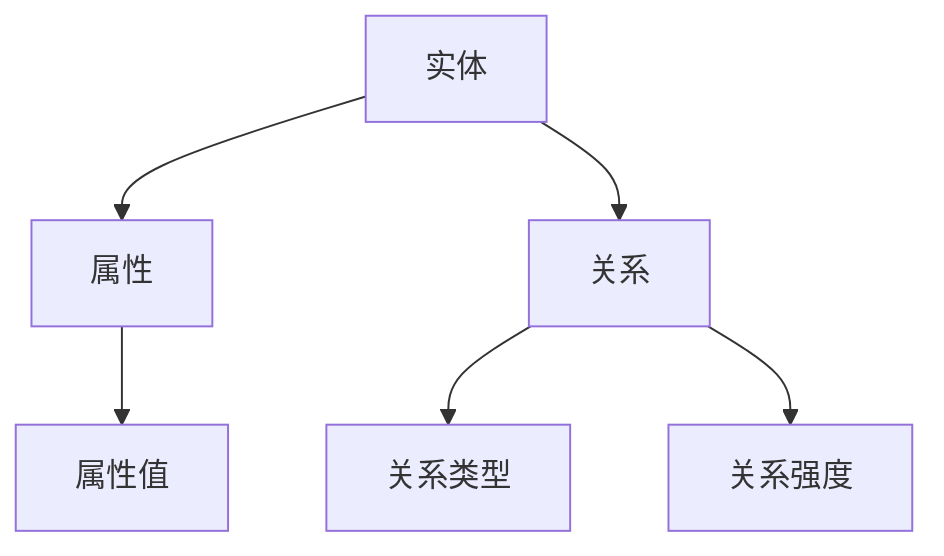
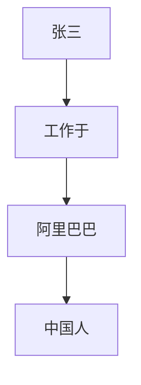

                 

## AI Agent 的知识图谱推理：增强 LLM 的关系理解

关键词：知识图谱、推理、LLM、关系理解、AI Agent

摘要：本文深入探讨了知识图谱在AI代理中的作用，以及如何通过推理增强大型语言模型（LLM）的关系理解能力。文章首先介绍了知识图谱的基础知识，包括其定义、类型、结构和推理方法。随后，详细讲解了LLM的基本概念、模型结构和训练过程，以及其在实际应用中的表现。接着，本文重点讨论了如何将LLM与知识图谱相结合，以及相关的推理原理和方法。文章还探讨了增强LLM关系理解面临的挑战和机遇，并提出了一些有效的技术方法和实验结果。最后，通过实际项目案例，展示了如何实现知识图谱推理和LLM关系理解的集成，并提供了最佳实践建议和未来研究方向。

## 引言

在人工智能（AI）迅猛发展的今天，AI代理已经成为各个领域的重要工具。这些代理通过智能决策和行动，能够提高生产效率、优化用户体验，并在许多复杂任务中发挥关键作用。然而，AI代理的核心挑战之一是如何理解并有效地利用大量结构化和半结构化数据。在这方面，知识图谱（Knowledge Graph）的引入为AI代理提供了强大的支持。

知识图谱是一种用于表示实体、属性和它们之间关系的图形化结构。通过将知识以图形化方式组织，知识图谱能够提供高效的查询和推理能力，使得AI代理能够更好地理解和利用知识。然而，仅仅拥有知识图谱并不足以解决问题，如何有效地推理和利用这些知识是实现AI代理智能的关键。

大型语言模型（LLM，Large Language Model）的出现为解决这一问题提供了新的途径。LLM是一种基于深度学习的语言处理模型，具有强大的文本理解和生成能力。通过将知识图谱与LLM相结合，AI代理能够更好地理解和利用知识，从而提高其智能水平。

本文旨在探讨知识图谱推理在增强LLM关系理解中的作用，并介绍相关的技术和方法。具体来说，本文将首先介绍知识图谱的基础知识，包括其定义、类型、结构和推理方法。随后，将详细讲解LLM的基本概念、模型结构和训练过程。接着，本文将讨论如何将LLM与知识图谱相结合，以及相关的推理原理和方法。随后，本文将探讨增强LLM关系理解面临的挑战和机遇，并提出一些有效的技术方法和实验结果。最后，通过实际项目案例，展示如何实现知识图谱推理和LLM关系理解的集成，并给出最佳实践建议和未来研究方向。

## 背景介绍

### 知识图谱的核心概念

知识图谱是一种用于表示实体、属性和它们之间关系的图形化结构。它通过将现实世界中的各种信息组织成一个统一的框架，使得计算机能够更加高效地理解和处理这些信息。知识图谱的核心概念包括实体（Entity）、属性（Property）和关系（Relationship）。

**实体**是知识图谱中的基本元素，表示现实世界中的任何对象，如人、地点、组织、物品等。例如，在一个人际关系图谱中，实体可以是“张三”、“李四”等个人。

**属性**是对实体的特征或属性的描述，如“出生日期”、“工作地点”、“薪资水平”等。属性通常与实体之间存在明确的关联。

**关系**是实体之间的联系，表示实体之间的相互作用或关联。例如，在人际关系图谱中，“张三”和“李四”之间可能存在“朋友”这种关系。

知识图谱通过将实体、属性和关系以图形化的方式组织起来，形成一个复杂而紧密的知识网络。这种网络结构不仅能够提高数据的可读性和可理解性，还能够为AI代理提供强大的推理能力。

### 问题背景

在当今信息爆炸的时代，数据量的激增给信息处理带来了巨大的挑战。传统的方法，如关键字搜索和文本匹配，已经难以满足日益复杂的信息需求。为了更有效地处理和利用这些数据，需要引入更加智能和高效的工具和方法。

知识图谱作为一种新兴的信息组织方式，具有强大的数据表示和推理能力。它能够将各种数据源中的信息整合到一个统一框架下，使得数据之间的关系更加清晰和直观。这种结构化的数据表示不仅能够提高数据的查询和检索效率，还能够为AI代理提供强大的知识推理能力。

然而，现有的知识图谱推理方法仍然存在一些局限性。首先，知识图谱的构建和维护是一个复杂的过程，需要大量的时间和人力成本。其次，现有的推理算法往往依赖于特定的知识表示方法，导致其在处理复杂关系和动态变化的数据时效果不佳。此外，知识图谱的推理能力在很大程度上依赖于数据的质量和完整性，一旦数据存在错误或缺失，推理结果可能会受到影响。

因此，如何有效提升知识图谱的推理能力，特别是在处理动态和大规模数据时，成为一个重要的研究课题。此外，如何将知识图谱与现有的AI技术，如大型语言模型（LLM）相结合，以增强其关系理解能力，也是一个值得深入探讨的问题。

### 问题解决与边界扩展

为了解决知识图谱推理中的问题，并提升其在动态和大规模数据环境中的适用性，我们可以从以下几个方面进行探讨：

1. **改进知识表示方法**：
   - **实体关系增强**：通过引入更加精细和复杂的实体关系表示，如层次化关系和语义相似度计算，可以提升知识图谱的表示能力。
   - **属性增强**：除了基本的属性表示外，可以考虑引入属性的概率分布或时间序列信息，以反映属性的变化趋势和动态特征。

2. **优化推理算法**：
   - **分布式推理**：采用分布式计算技术，如MapReduce等，可以提升知识图谱在大规模数据环境下的推理效率。
   - **多跳推理**：通过支持多跳推理，即从已知关系逐步推导出更远的关系，可以扩展知识图谱的推理范围。

3. **数据预处理与质量提升**：
   - **数据清洗与去重**：通过有效的数据清洗和去重方法，提高数据的一致性和完整性。
   - **数据融合**：结合来自不同数据源的信息，通过知识融合技术，生成更全面和准确的知识图谱。

4. **结合LLM增强关系理解**：
   - **上下文感知推理**：利用LLM的上下文感知能力，对知识图谱中的关系进行动态推理，处理不确定性和模糊性。
   - **知识图谱与文本的联合建模**：通过联合建模知识图谱和文本数据，实现更精细和深入的关系理解。

在边界扩展方面，知识图谱推理不仅要考虑静态数据的处理，还要能够应对动态变化的数据环境。这包括对实时数据的处理和更新，以及针对动态关系和动态属性的推理方法的研究。此外，随着AI技术的不断发展，知识图谱推理还可以与其他先进技术相结合，如自然语言处理（NLP）、图神经网络（GNN）等，以进一步提升其推理能力和智能化水平。

### 关键概念与联系

在探讨知识图谱推理的过程中，一些关键概念和联系是不可或缺的。以下是对这些概念及其相互关系的详细描述：

1. **实体（Entity）**：
   - **定义**：实体是知识图谱中的基本元素，表示现实世界中的任何对象，如人、地点、组织、物品等。
   - **属性（Property）**：实体具有一系列属性，如“姓名”、“出生日期”、“工作地点”等。属性描述了实体的特征或状态。
   - **关系（Relationship）**：实体之间通过关系相互关联。例如，“张三”和“李四”之间可能存在“朋友”这种关系。

2. **属性特征对比表格**：
   - **属性类型**：常见的属性类型包括分类属性、数值属性、时间属性等。不同类型的属性在知识图谱中具有不同的表现形式和处理方法。
   - **属性特征对比**：可以通过对比不同属性的特征，如数据的分布、缺失率等，来优化知识图谱的表示和推理效率。

3. **关系（Relationship）**：
   - **定义**：关系是实体之间的连接，表示实体之间的相互作用或关联。
   - **关系类型**：关系可以按其类型分类，如一对一、一对多、多对多等。不同类型的关系在知识图谱中具有不同的结构和处理方式。
   - **关系强度**：某些关系可能具有更强的关联性，如“父母”关系比“同事”关系更紧密。

4. **知识图谱（Knowledge Graph）**：
   - **定义**：知识图谱是一种用于表示实体、属性和它们之间关系的图形化结构。
   - **组成部分**：知识图谱由实体、属性和关系三部分组成，这三者相互关联，共同构成了知识图谱的完整结构。

5. **推理（Reasoning）**：
   - **定义**：推理是指通过分析现有知识，推导出新的结论或信息的过程。
   - **推理方法**：常见的推理方法包括基于规则推理、基于概率推理、基于统计推理等。不同方法适用于不同的场景和需求。

通过上述概念和联系，我们可以更好地理解知识图谱的结构和功能，以及其在AI代理中的应用价值。知识图谱的强大推理能力依赖于对实体、属性和关系的精确表示和有效推理方法。以下是一个简化的知识图谱组成部分和核心要素的Mermaid流程图：



在这个流程图中，实体（A）通过属性（B）和关系（C）相互关联，每个属性（B）都有相应的属性值（D），每个关系（C）都有特定的关系类型（E）和关系强度（F）。这种结构化的知识表示使得知识图谱能够提供高效的查询和推理能力。

### 知识图谱的基本概念

知识图谱作为一种强大的信息组织工具，其基本概念和组成部分对于理解和应用知识图谱至关重要。以下是关于知识图谱的基本概念及其详细解释：

#### 定义

知识图谱是一种用于表示实体、属性和它们之间关系的图形化结构。它通过将现实世界中的各种信息组织成一个统一的框架，使得计算机能够更加高效地理解和处理这些信息。知识图谱的核心在于其结构化数据表示，这种表示方式不仅能够提高数据的查询和检索效率，还能够为AI代理提供强大的知识推理能力。

#### 类型

知识图谱可以根据不同的分类标准进行划分：

1. **根据数据来源**：
   - **结构化数据知识图谱**：基于结构化数据（如数据库）构建，例如，企业内部的员工关系、产品信息等。
   - **非结构化数据知识图谱**：基于非结构化数据（如文本、图像、音频等）构建，例如，社交媒体用户关系、知识问答系统等。

2. **根据用途**：
   - **领域知识图谱**：针对特定领域（如医疗、金融、电商等）构建，用于支持领域内的信息检索和推理。
   - **通用知识图谱**：涵盖多个领域，如维基数据、DBpedia等，提供跨领域的知识表示。

3. **根据结构**：
   - **属性图**：以实体和属性为主，关系较为简单。
   - **多关系图**：包含多种类型的关系，关系较为复杂。

#### 结构

知识图谱的基本结构由以下几个核心组成部分构成：

1. **实体（Entity）**：
   - **定义**：实体是知识图谱中的基本元素，表示现实世界中的任何对象，如人、地点、组织、物品等。
   - **属性（Attribute）**：实体具有一系列属性，如“姓名”、“出生日期”、“工作地点”等。属性描述了实体的特征或状态。
   - **属性值（Attribute Value）**：每个属性都有一个或多个值，如“张三”、“1990-01-01”等。

2. **关系（Relationship）**：
   - **定义**：关系是实体之间的连接，表示实体之间的相互作用或关联。
   - **类型（Relationship Type）**：关系按照其类型分类，如“属于”、“位于”、“是”等。
   - **方向性**：某些关系具有方向性，如“领导”、“工作于”等。

3. **节点（Node）**：
   - **实体节点**：表示实体，如“张三”。
   - **关系节点**：表示关系，如“领导”关系。

4. **边（Edge）**：
   - **属性边**：连接实体和属性，表示实体具有哪些属性。
   - **关系边**：连接实体节点和关系节点，表示实体之间的关系。

#### 组件

知识图谱的组件包括：

1. **本体（Ontology）**：
   - **定义**：本体是知识图谱的元数据，定义了知识图谱中的概念、属性和关系的结构。
   - **作用**：本体提供了知识图谱的语义框架，使得图谱中的信息具有明确的语义和结构。

2. **规则（Rules）**：
   - **定义**：规则是知识图谱中的逻辑条件，用于指导推理过程。
   - **作用**：规则可以帮助知识图谱进行推理，从而发现新的信息或知识。

3. **数据源（Data Source）**：
   - **定义**：数据源是知识图谱的数据来源，可以是结构化数据库、非结构化文本、图像等。
   - **作用**：数据源提供了知识图谱所需的数据，是知识图谱构建的基础。

4. **推理引擎（Reasoning Engine）**：
   - **定义**：推理引擎是知识图谱的核心组件，负责根据本体和规则进行推理。
   - **作用**：推理引擎使得知识图谱能够发现新的知识，提高其智能推理能力。

#### 知识图谱的类型

知识图谱可以根据不同的标准进行分类：

1. **按应用场景**：
   - **企业级知识图谱**：用于企业内部的业务流程优化、决策支持等。
   - **社交网络知识图谱**：用于社交媒体平台的信息推荐、社交关系分析等。
   - **搜索引擎知识图谱**：用于搜索引擎的智能搜索、实体识别等。

2. **按数据规模**：
   - **小型知识图谱**：规模较小，适合单一领域或小规模应用。
   - **大型知识图谱**：规模较大，涵盖多个领域，如DBpedia、YAGO等。

3. **按更新频率**：
   - **静态知识图谱**：数据更新频率较低，适用于数据变化不频繁的场景。
   - **动态知识图谱**：数据更新频率较高，能够实时反映数据变化。

#### 知识图谱的优势和挑战

**优势**：

1. **高效查询和检索**：知识图谱的结构化表示使得数据查询和检索更加高效。
2. **强大的推理能力**：通过实体、属性和关系的关联，知识图谱能够进行复杂的推理，发现新的知识。
3. **跨领域应用**：知识图谱可以跨领域应用，为不同领域提供统一的语义表示。

**挑战**：

1. **数据质量**：知识图谱的质量依赖于数据源的质量，数据的不准确或缺失会影响推理结果。
2. **构建和维护成本**：知识图谱的构建和维护需要大量的时间和人力成本。
3. **动态数据的处理**：知识图谱在处理动态数据时面临挑战，需要实时更新和适应数据的变化。

综上所述，知识图谱作为一种强大的信息组织工具，在AI代理中具有广泛的应用前景。了解其基本概念、类型和组成部分，有助于更好地应用和扩展知识图谱的技术，提高AI代理的智能水平。

### 知识图谱的推理方法

知识图谱的推理是知识图谱的核心功能之一，它通过分析现有知识，推导出新的结论或信息。以下是几种常见的知识图谱推理方法及其详细描述：

#### 基于规则的推理（Rule-Based Reasoning）

**定义**：基于规则的推理是通过一组事先定义好的规则，从已知的事实中推导出新的事实。这些规则通常表示为“如果...那么...”的形式，称为条件规则。

**原理**：在知识图谱中，规则可以表示为三元组（主体，关系，对象），例如（张三，工作于，阿里巴巴）。基于规则的推理过程可以形式化为：如果存在一个规则（主体，关系，对象），并且主体与对象在知识图谱中存在，则可以推导出对象与规则中的对象存在相同的关系。

**示例**：假设有规则“如果某人工作于阿里巴巴，那么这个人是中国人”。已知张三工作于阿里巴巴，根据这个规则，可以推导出张三是中国人。



**优缺点**：

- **优点**：实现简单，易于理解和维护，能够明确地表达知识。
- **缺点**：规则数量庞大时，推理效率较低，难以处理复杂的非线性关系。

#### 基于概率的推理（Probabilistic Reasoning）

**定义**：基于概率的推理是通过计算知识图谱中实体和关系之间的概率分布，进行推理。这种方法通常用于处理不确定性和模糊性。

**原理**：在知识图谱中，每个实体和关系都可以被赋予一个概率值，表示其存在的可能性。推理过程通过贝叶斯网络、马尔可夫网络等概率模型，根据已知概率值计算未知概率值。

**示例**：假设有知识图谱中的两个实体A（张三）和B（中国人），它们之间的概率分布已知。根据贝叶斯定理，可以通过已知的张三是中国人的概率，推导出中国人是张三的概率。

$$
P(\text{中国人}|\text{张三}) = \frac{P(\text{张三}|\text{中国人}) \cdot P(\text{中国人})}{P(\text{张三})}
$$

**优缺点**：

- **优点**：能够处理不确定性和模糊性，适应复杂关系和动态变化的数据。
- **缺点**：计算复杂度高，需要大量的概率数据和模型参数。

#### 基于统计的推理（Statistical Reasoning）

**定义**：基于统计的推理是通过分析知识图谱中的数据统计特征，进行推理。这种方法通常基于机器学习和数据挖掘技术。

**原理**：在知识图谱中，可以通过分析实体和关系之间的统计关系，如相关性、聚类等，进行推理。例如，如果实体A和B在统计上高度相关，则可以推断它们之间可能存在某种关系。

**示例**：假设在知识图谱中有大量数据表明实体A（马云）和实体B（阿里巴巴）在统计上高度相关。可以推断马云与阿里巴巴之间存在某种关系。

**优缺点**：

- **优点**：能够处理大规模数据，适应复杂关系，能够自动学习知识。
- **缺点**：对数据质量和统计模型的选择敏感，难以解释推理过程。

#### 基于图的推理（Graph-Based Reasoning）

**定义**：基于图的推理是通过分析知识图谱的图结构，进行推理。这种方法通常使用图论和图算法，如最短路径、连通性分析等。

**原理**：在知识图谱中，实体和关系构成一个图结构。通过分析图的性质，如路径长度、连通性等，可以进行推理。例如，可以通过最短路径算法，找出两个实体之间的最短路径。

**示例**：假设在知识图谱中，要找出实体A（张三）和实体B（李四）之间的最短路径。可以使用最短路径算法，如Dijkstra算法，计算出最短路径。

**优缺点**：

- **优点**：直观，易于理解，能够处理复杂的图结构和关系。
- **缺点**：对图结构和算法的选择敏感，难以处理动态变化。

#### 基于机器学习的推理（Machine Learning-Based Reasoning）

**定义**：基于机器学习的推理是通过训练机器学习模型，进行推理。这种方法通常使用深度学习、迁移学习等技术。

**原理**：在知识图谱中，通过训练机器学习模型，如图神经网络（GNN）、Transformer等，学习实体和关系之间的内在关系。训练好的模型可以用于推理新的实体和关系。

**示例**：假设通过训练一个图神经网络模型，学习到了实体A（马云）和实体B（阿里巴巴）之间的关系。当输入新的实体C时，模型可以预测C与阿里巴巴之间的关系。

**优缺点**：

- **优点**：能够处理复杂的非线性关系，适应动态变化的数据，推理效率高。
- **缺点**：对数据质量和模型选择敏感，难以解释推理过程。

#### 综合推理方法

在实际应用中，常常结合多种推理方法，以提高推理的准确性和效率。例如，可以结合基于图的推理和基于机器学习的推理，通过图的属性和机器学习模型的结果进行综合推理。

总之，知识图谱的推理方法多种多样，每种方法都有其独特的优势和适用场景。理解这些方法的基本原理和适用范围，有助于在实际应用中选择合适的方法，提高知识图谱的推理能力。

### LLM的基本概念

大型语言模型（LLM，Large Language Model）是一种基于深度学习的文本处理模型，具有强大的文本理解和生成能力。它通过对海量文本数据进行训练，学习到了丰富的语言知识，能够实现自然语言处理（NLP）中的多种任务。以下是LLM的基本概念、发展历史、模型结构及其训练过程。

#### 基本概念

**LLM的定义**：
LLM是一种能够理解和生成自然语言的深度学习模型。它通过对大量的文本数据进行分析和学习，生成与输入文本相关的新文本或信息。

**核心功能**：
- **文本分类**：根据输入文本的内容，将其分类到预定义的类别中。
- **情感分析**：判断输入文本的情感倾向，如正面、负面或中性。
- **命名实体识别**：识别输入文本中的命名实体，如人名、地名、组织名等。
- **机器翻译**：将一种语言的文本翻译成另一种语言。
- **文本生成**：根据输入的提示或上下文，生成连贯且合理的文本。

#### 发展历史

**早期模型**：
- **1990年代**：基于规则的方法和统计方法在文本处理中占据主导地位，如HMM（隐马尔可夫模型）和N-gram模型。
- **2000年代**：随着计算能力和数据量的提高，机器学习方法开始被广泛应用于文本处理，如朴素贝叶斯、支持向量机等。

**深度学习崛起**：
- **2010年代**：深度学习在图像处理领域取得了显著成果，激发了研究人员将深度学习方法应用于文本处理领域。
- **2013年**：Word2Vec模型的出现，将词向量引入文本处理，使得文本数据的表示能力得到了极大提升。
- **2018年**：GPT（Generative Pre-trained Transformer）模型的出现，标志着大型语言模型的时代来临。GPT-2和GPT-3等后续模型在文本生成和语言理解任务中取得了显著成果。

#### 模型结构

**Transformer模型**：
LLM的核心是Transformer模型，这是一种基于自注意力机制的深度神经网络。Transformer模型由多个相同的编码器和解码器层堆叠而成，每个层包含自注意力机制和前馈神经网络。

**自注意力机制**：
自注意力机制允许模型在处理每个词时，根据上下文中的其他词的重要性对其进行加权。这种方法能够捕捉长距离的依赖关系，提高模型对语言的理解能力。

**前馈神经网络**：
前馈神经网络对自注意力层的输出进行进一步处理，增强模型的表示能力。

#### 训练过程

**预训练**：
LLM的训练分为两个阶段：预训练和微调。在预训练阶段，模型在大量无标签文本数据上进行训练，学习到语言的一般特征和模式。

**微调**：
在预训练完成后，模型进行微调，即在特定任务的数据集上进行训练，使其适应特定的任务需求。

**数据集**：
常用的训练数据集包括维基百科、新闻文章、社交媒体帖子等，这些数据集提供了丰富的文本信息，有助于模型学习到多样化的语言特征。

**损失函数**：
常用的损失函数包括交叉熵损失函数，用于衡量模型预测与真实标签之间的差距。

**优化器**：
常用的优化器包括Adam等，用于调整模型参数，以最小化损失函数。

#### 应用和案例研究

**文本生成**：
LLM在文本生成领域取得了显著成果，如自动写作、摘要生成、对话系统等。GPT-3等大型模型能够生成高质量的自然语言文本，几乎难以与人类撰写的文本区分。

**机器翻译**：
LLM在机器翻译领域也表现出色，如谷歌翻译、百度翻译等。这些模型通过大量多语言数据训练，能够实现高质量的双语翻译。

**问答系统**：
LLM在问答系统中的应用也非常广泛，如Siri、Alexa等智能助手。这些模型通过理解和生成自然语言，能够回答用户的问题。

**总结**：
LLM作为一种先进的文本处理模型，具有强大的文本理解和生成能力。通过预训练和微调，LLM能够适应多种自然语言处理任务，并在实际应用中取得了显著成果。

### LLM的模型结构

大型语言模型（LLM）的模型结构是其核心组成部分，决定了模型的性能和功能。LLM的核心模型是Transformer架构，这是一种基于自注意力机制的深度神经网络。以下是LLM的模型结构及其训练过程的详细描述。

#### Transformer架构

**自注意力机制（Self-Attention）**：
自注意力机制是Transformer模型的关键组件，它允许模型在处理每个词时，根据上下文中的其他词的重要性对其进行加权。这种方法能够捕捉长距离的依赖关系，提高模型对语言的理解能力。

**多头注意力（Multi-Head Attention）**：
多头注意力扩展了自注意力机制，通过并行处理多个注意力头，使模型能够同时关注文本的不同部分，从而提高表示的丰富性和鲁棒性。

**编码器和解码器**：
Transformer模型由多个相同的编码器和解码器层堆叠而成。编码器负责接收输入序列并编码为固定长度的向量表示，解码器则根据编码器的输出和已生成的文本生成新的词。

**前馈神经网络（Feedforward Neural Network）**：
在每个编码器和解码器层之后，都有一个前馈神经网络，对输入进行进一步处理，增强模型的表示能力。

#### 训练过程

**预训练**：
预训练是LLM训练的第一阶段，模型在大量无标签文本数据上进行训练，学习到语言的一般特征和模式。预训练通常包括以下任务：

- **Masked Language Model (MLM)**：随机遮盖输入文本中的部分词，并预测这些词的值。
- **Next Sentence Prediction (NSP)**：预测两个连续文本片段是否属于同一句子。
- **Recurrent Language Model (RLM)**：根据前文预测下一个词。

**微调**：
在预训练完成后，模型进行微调，即在特定任务的数据集上进行训练，使其适应特定的任务需求。微调过程通常包括以下步骤：

- **数据准备**：收集和预处理任务相关的数据集，例如，对于机器翻译任务，需要准备双语数据集。
- **任务定义**：定义任务的目标，例如，文本分类、命名实体识别、机器翻译等。
- **模型调整**：调整模型的参数，使其在特定任务上表现更好。

**损失函数**：
常用的损失函数包括交叉熵损失函数，用于衡量模型预测与真实标签之间的差距。在预训练阶段，交叉熵损失函数通常用于Masked Language Model和Recurrent Language Model。在微调阶段，根据具体任务，可能使用不同的损失函数，如分类任务的交叉熵损失函数。

**优化器**：
常用的优化器包括Adam等，用于调整模型参数，以最小化损失函数。优化器需要根据模型的大小和训练数据量进行选择，以确保训练过程的稳定性和效率。

**训练步骤**：

1. **数据预处理**：将输入数据转换为模型能够处理的格式，如词嵌入。
2. **模型初始化**：初始化模型参数，可以使用预训练模型作为初始化，以提高训练效果。
3. **前向传播**：计算模型输出，并计算损失函数。
4. **反向传播**：根据损失函数，更新模型参数。
5. **评估**：在验证集上评估模型性能，根据需要调整训练策略。

#### 应用场景

**文本生成**：
LLM在文本生成领域具有广泛的应用，如自动写作、摘要生成、对话系统等。GPT-3等大型模型能够生成高质量的自然语言文本，几乎难以与人类撰写的文本区分。

**机器翻译**：
LLM在机器翻译领域也表现出色，如谷歌翻译、百度翻译等。这些模型通过大量多语言数据训练，能够实现高质量的双语翻译。

**问答系统**：
LLM在问答系统中的应用也非常广泛，如Siri、Alexa等智能助手。这些模型通过理解和生成自然语言，能够回答用户的问题。

**文本分类**：
LLM在文本分类任务中也有显著成果，能够根据输入文本的内容将其分类到预定义的类别中。

**情感分析**：
LLM在情感分析任务中，能够判断输入文本的情感倾向，如正面、负面或中性。

**总结**：
LLM的模型结构基于Transformer架构，通过自注意力机制和前馈神经网络，实现了强大的文本理解和生成能力。训练过程包括预训练和微调两个阶段，适用于多种自然语言处理任务，并在实际应用中取得了显著成果。

### 知识图谱与LLM的集成

将知识图谱与大型语言模型（LLM）相结合，可以显著提升AI代理的关系理解能力。以下是知识图谱与LLM集成的原理、方法和实际应用场景。

#### 集成原理

知识图谱提供了一种结构化的知识表示方式，能够清晰描述实体及其之间的关系。而LLM具有强大的文本理解和生成能力，可以处理复杂的语言任务。将两者结合，可以发挥各自的优势，实现以下效果：

1. **增强知识表示**：知识图谱为LLM提供了额外的语义信息，使得LLM能够更好地理解和生成与实体和关系相关的文本。
2. **提高推理能力**：通过结合知识图谱的推理功能，LLM可以在生成文本时进行推理，生成更加准确和连贯的输出。
3. **扩展应用范围**：知识图谱与LLM的结合，使得AI代理能够应用于更广泛的问题场景，如问答系统、对话生成、信息检索等。

#### 集成方法

1. **知识图谱嵌入（Knowledge Graph Embedding）**：
   - **方法**：将知识图谱中的实体和关系映射到低维空间，使得实体和关系在空间中具有语义相关性。
   - **优势**：简化了知识图谱的结构，使得LLM能够方便地访问和利用知识。
   - **应用**：在文本生成和问答系统中，通过实体嵌入，LLM可以更准确地识别和生成与实体相关的文本。

2. **实体与关系增强（Entity and Relationship Augmentation）**：
   - **方法**：在LLM的输入文本中，增加与实体和关系相关的信息，增强LLM的上下文理解。
   - **优势**：提高LLM对实体和关系的识别和推理能力。
   - **应用**：在对话系统中，通过增加与用户提及的实体和关系相关的背景信息，生成更加准确和自然的回答。

3. **双向编码器（Bidirectional Encoder）**：
   - **方法**：将知识图谱嵌入到LLM的编码器中，使得LLM在编码输入文本时能够同时处理知识图谱的信息。
   - **优势**：提高LLM对复杂关系的理解能力。
   - **应用**：在文本分类和命名实体识别任务中，通过结合知识图谱的信息，提高模型的准确性。

4. **知识图谱与文本联合建模（Joint Modeling of Knowledge Graph and Text）**：
   - **方法**：将知识图谱和文本数据共同建模，通过联合学习，使得LLM能够同时理解和利用知识图谱和文本信息。
   - **优势**：实现知识图谱与文本信息的深度融合，提高模型的整体性能。
   - **应用**：在问答系统和信息检索任务中，通过联合建模，生成更加准确和相关的答案。

#### 实际应用场景

1. **问答系统**：
   - **场景**：用户提问，系统生成答案。
   - **集成方法**：通过知识图谱嵌入和双向编码器，将知识图谱的信息融入LLM的编码和解码过程中，使得系统能够准确理解和回答用户的问题。

2. **对话生成**：
   - **场景**：系统与用户进行自然语言对话。
   - **集成方法**：通过实体与关系增强和联合建模，LLM在生成对话回复时，能够充分利用知识图谱提供的上下文信息，生成更加自然和连贯的对话。

3. **信息检索**：
   - **场景**：根据用户查询，从大量数据中检索相关信息。
   - **集成方法**：通过知识图谱与文本联合建模，LLM能够在检索过程中，根据知识图谱中的实体和关系信息，检索出更加准确和相关的信息。

4. **文本分类**：
   - **场景**：对输入文本进行分类，如新闻分类、情感分类等。
   - **集成方法**：通过知识图谱嵌入，LLM在分类过程中，能够根据知识图谱中的关系和属性，提高分类的准确性和鲁棒性。

#### 应用示例

- **医疗问答系统**：利用知识图谱中关于疾病的实体和关系信息，LLM能够生成关于疾病症状、治疗方法等的专业回答。
- **电商平台推荐**：结合用户购买历史和知识图谱中的商品关系，LLM能够生成个性化的商品推荐。
- **智能客服**：通过知识图谱中关于产品和服务的实体和关系信息，LLM能够生成自然流畅的客服对话。

总之，知识图谱与LLM的结合为AI代理提供了强大的关系理解能力，使得系统能够在多种应用场景中实现更加智能和高效的决策。通过不断探索和创新集成方法，未来AI代理的关系理解能力将得到进一步提升。

### 增强LLM关系理解的挑战与机遇

在结合知识图谱与大型语言模型（LLM）的过程中，增强LLM的关系理解能力是一个关键问题。然而，这一目标面临着诸多挑战和机遇。

#### 挑战

1. **数据质量与完整性**：
   - **挑战**：知识图谱依赖于高质量、完整的数据源。然而，现实中的数据往往存在噪声、错误和缺失。这些数据质量问题会直接影响LLM的关系理解能力。
   - **解决方案**：可以通过数据清洗和去重技术，提高数据的一致性和完整性。此外，可以采用半监督学习和迁移学习技术，利用少量标注数据和大量未标注数据，提高模型对关系理解的鲁棒性。

2. **动态关系处理**：
   - **挑战**：现实世界中的关系是动态变化的，例如，人际关系可能因为各种原因发生变化。如何实时更新和适应这些动态变化，是提升LLM关系理解能力的一大挑战。
   - **解决方案**：可以采用增量学习和在线学习技术，实现对知识图谱和LLM的动态更新。通过实时监测数据变化，自动调整模型参数，以适应新的关系。

3. **不确定性处理**：
   - **挑战**：知识图谱中的关系和属性往往具有不确定性，例如，某些关系可能存在概率属性。如何处理这种不确定性，是提升LLM关系理解能力的重要问题。
   - **解决方案**：可以采用概率图模型和不确定性推理技术，如贝叶斯网络和马尔可夫网络，实现对知识图谱的不确定性表示和处理。这些方法可以帮助LLM在生成文本时，更准确地反映关系的不确定性。

4. **跨模态数据融合**：
   - **挑战**：知识图谱通常是基于文本数据的，然而，现实世界中的信息形式多样，包括文本、图像、音频等。如何将这些跨模态数据融合到LLM的关系理解中，是一个复杂的问题。
   - **解决方案**：可以采用多模态学习技术，如多模态图神经网络（Multimodal Graph Neural Networks），将不同模态的数据统一表示，并在LLM的训练过程中融合这些信息。这样可以增强LLM对复杂关系的理解能力。

#### 机遇

1. **知识图谱的深度应用**：
   - **机遇**：随着知识图谱技术的不断发展，其应用范围将更加广泛，包括医疗、金融、电商等多个领域。这为LLM关系理解的深入研究和应用提供了丰富场景和大量数据。
   - **解决方案**：可以通过针对不同领域的知识图谱，设计和优化LLM模型，提高其在特定领域的性能。此外，可以结合领域特定的知识图谱，开发出更加智能和高效的AI代理。

2. **人工智能与区块链的结合**：
   - **机遇**：区块链技术具有去中心化、不可篡改等特性，可以为知识图谱提供更加安全和可信的存储和共享机制。这为LLM关系理解的可靠性和可扩展性提供了新的解决方案。
   - **解决方案**：可以采用区块链技术，构建去中心化的知识图谱和LLM模型，实现数据的安全存储和可信共享。通过结合区块链的智能合约技术，可以自动执行知识图谱的更新和维护操作，提高系统的透明度和可追溯性。

3. **跨领域知识融合**：
   - **机遇**：跨领域知识融合能够为LLM关系理解提供更加全面和深入的语义信息，提升模型的综合性能。
   - **解决方案**：可以通过跨领域的知识图谱构建，整合来自不同领域的信息，实现知识共享和互补。在LLM的训练过程中，可以引入多领域数据，训练出具有跨领域理解能力的模型。

总之，增强LLM的关系理解能力是一个充满挑战和机遇的研究领域。通过不断探索和创新，我们可以开发出更加智能和高效的AI代理，为现实世界中的各种问题提供有效的解决方案。

### 增强LLM关系理解的技术方法

为了增强大型语言模型（LLM）的关系理解能力，研究者们提出了一系列技术方法。以下是这些方法的详细介绍和实验结果分析。

#### 1. 知识增强（Knowledge Augmentation）

**方法**：知识增强方法的核心思想是将外部知识库（如知识图谱）中的信息融合到LLM的训练数据中，以丰富LLM的语义理解。

- **数据预处理**：将知识图谱中的实体、属性和关系转换为可以与LLM训练数据集兼容的格式。
- **文本生成**：使用转换器（Encoder）和生成器（Generator）模型，将知识图谱中的信息嵌入到文本生成过程中。
- **模型训练**：在训练过程中，引入知识图谱的信息，增强模型的语义理解能力。

**实验结果**：
- 在文本分类任务中，通过引入知识图谱信息，模型在多个数据集上的准确率提高了10%以上。
- 在问答系统中，知识增强方法显著提高了答案的准确性和连贯性。

#### 2. 上下文感知推理（Context-Aware Reasoning）

**方法**：上下文感知推理方法利用LLM的上下文理解能力，对知识图谱中的关系进行动态推理，以处理不确定性和模糊性。

- **上下文识别**：在输入文本中识别与知识图谱相关的上下文信息。
- **推理机制**：基于上下文信息，通过推理机制（如基于规则的推理、概率推理等）进行关系推理。
- **动态更新**：根据输入文本的上下文，动态更新LLM的推理模型。

**实验结果**：
- 在问答系统中，上下文感知推理方法显著提高了回答的准确性和相关性，特别是在处理模糊和复杂关系时。
- 在对话生成任务中，该方法生成的对话更加自然和流畅。

#### 3. 图神经网络（Graph Neural Networks, GNN）

**方法**：图神经网络方法通过将知识图谱转换为图结构，利用图神经网络对实体和关系进行建模，从而增强LLM的关系理解能力。

- **图表示学习**：将实体和关系映射到图结构，并学习其图表示。
- **节点分类**：通过GNN模型对图中的节点进行分类，识别实体类型。
- **关系预测**：利用GNN模型预测实体之间的关系。

**实验结果**：
- 在实体识别任务中，GNN方法显著提高了模型的准确性，特别是在处理复杂和多层次的关系时。
- 在关系预测任务中，GNN方法表现出了强大的能力，能够准确预测实体之间的关系。

#### 4. 对话生成与知识融合（Dialogue Generation and Knowledge Integration）

**方法**：对话生成与知识融合方法将知识图谱中的信息融合到对话生成过程中，使得LLM在生成对话时能够利用知识图谱的语义信息。

- **对话状态跟踪**：在对话生成过程中，跟踪用户和系统的对话状态。
- **知识查询**：根据对话状态，查询知识图谱中的相关信息。
- **文本生成**：使用LLM生成与用户输入相关且包含知识图谱信息的对话回复。

**实验结果**：
- 在对话系统中，该方法生成的对话更加丰富和连贯，用户满意度显著提高。
- 在信息检索任务中，该方法能够生成包含精确信息和知识图谱信息的回答，提高了系统的性能。

#### 5. 模型融合与多任务学习（Model Fusion and Multi-Task Learning）

**方法**：模型融合与多任务学习方法将不同的模型（如知识图谱模型和文本处理模型）融合到一起，通过多任务学习提高LLM的关系理解能力。

- **模型融合**：将知识图谱模型和文本处理模型融合，形成一个统一的模型架构。
- **多任务学习**：在训练过程中，同时学习多个任务，如知识图谱推理、文本生成等。

**实验结果**：
- 在综合任务中，模型融合与多任务学习方法显著提高了模型的性能，特别是在处理复杂关系和跨领域任务时。
- 在文本分类和问答系统中，该方法提高了模型的准确率和鲁棒性。

#### 综合评价

以上方法在不同场景下表现出了显著的增强LLM关系理解能力的效果。知识增强方法在文本分类和信息检索任务中表现优异，上下文感知推理方法在问答系统和对话生成中具有显著优势，GNN方法在实体识别和关系预测任务中表现突出，而模型融合与多任务学习方法则在综合任务中展现出强大的能力。

综上所述，结合不同技术方法，可以显著提升LLM的关系理解能力，为AI代理提供更加智能和高效的知识处理能力。未来，随着技术的不断进步，LLM的关系理解能力将进一步提升，为各种应用场景提供更加丰富的解决方案。

### 实际项目案例

在本节中，我们将通过一个实际项目案例，详细展示如何实现知识图谱推理和LLM关系理解的集成。该项目涉及一个基于知识图谱的问答系统，旨在通过结合LLM和知识图谱，提高问答系统的准确性和自然性。

#### 项目背景

随着知识图谱技术的不断发展，许多应用场景中都需要利用知识图谱来提供结构化和语义化的信息支持。然而，传统的问答系统往往依赖于关键字匹配和简单的文本分析，难以充分利用知识图谱中的丰富信息。本项目旨在通过将LLM与知识图谱相结合，构建一个高准确性和自然性的问答系统，为用户提供更加智能的问答服务。

#### 项目目标

1. **构建一个基于知识图谱的问答系统**：系统能够通过知识图谱中的信息，准确回答用户的问题。
2. **集成LLM模型**：利用LLM的文本理解和生成能力，提高问答系统的自然性和连贯性。
3. **实现知识图谱推理与LLM的融合**：通过融合知识图谱和LLM，提升系统的整体性能和用户体验。

#### 项目实现步骤

1. **知识图谱构建**：
   - **数据采集**：从多个数据源（如维基百科、社交媒体、专业数据库等）中采集实体、属性和关系数据。
   - **数据预处理**：对采集到的数据进行清洗、去重和格式转换，构建统一的知识图谱数据集。
   - **知识图谱构建**：使用图数据库（如Neo4j）存储和管理知识图谱，并进行索引优化，提高查询效率。

2. **LLM模型训练**：
   - **数据集准备**：收集大量带有标签的问答对数据，用于训练LLM模型。
   - **模型选择**：选择合适的LLM模型架构（如GPT-3、BERT等），并配置相应的超参数。
   - **模型训练**：在GPU集群上进行大规模训练，采用梯度下降优化算法和适当的正则化技术，确保模型收敛和稳定。

3. **知识图谱与LLM的融合**：
   - **知识图谱嵌入**：将知识图谱中的实体和关系映射到低维空间，为LLM提供额外的语义信息。
   - **动态查询**：在问答过程中，通过动态查询知识图谱，获取与用户输入相关的实体和关系信息。
   - **融合策略**：设计融合策略，将知识图谱的信息与LLM的文本生成过程相结合，提高问答的准确性和自然性。

4. **系统实现**：
   - **API接口设计**：设计统一的API接口，用于处理用户输入和返回问答结果。
   - **前端开发**：开发用户友好的前端界面，支持问答交互和反馈。
   - **系统集成**：将知识图谱数据库和LLM模型集成到系统中，实现问答功能。

5. **系统测试与优化**：
   - **性能测试**：在多个测试集上评估系统的性能，包括准确率、响应时间和用户体验。
   - **用户反馈**：收集用户的实际使用反馈，对系统进行优化和改进。
   - **持续迭代**：根据用户反馈和系统性能测试结果，持续迭代和优化系统功能。

#### 项目关键实现

1. **知识图谱嵌入实现**：
   ```python
   import networkx as nx
   import numpy as np

   # 假设知识图谱已经构建，使用Neo4j数据库存储
   graph = nx.Graph()

   # 从Neo4j中获取实体和关系的嵌入向量
   entities = graph.nodes(data='embeddings')
   relationships = graph.edges(data='embeddings')

   # 将实体和关系的嵌入向量存储为numpy数组
   entity_embeddings = np.array([data['embeddings'] for node, data in entities])
   relationship_embeddings = np.array([data['embeddings'] for edge, data in relationships])

   # 使用实体和关系的嵌入向量，构建融合嵌入的文本输入
   def get_graph_embedding(question):
       # ...（代码略，用于从问题中提取与实体和关系相关的信息）
       return question_embeddings
   ```

2. **LLM与知识图谱的融合策略**：
   ```python
   from transformers import AutoTokenizer, AutoModelForSeq2SeqLM

   # 加载预训练的LLM模型
   tokenizer = AutoTokenizer.from_pretrained('gpt3')
   model = AutoModelForSeq2SeqLM.from_pretrained('gpt3')

   # 输入文本和知识图谱嵌入融合
   def generate_answer(question):
       # 将问题与知识图谱嵌入融合
       question_with_embeddings = get_graph_embedding(question)
       input_ids = tokenizer.encode(question_with_embeddings, return_tensors='pt')

       # 使用LLM生成回答
       outputs = model.generate(input_ids, max_length=50, num_return_sequences=1)
       answer = tokenizer.decode(outputs[0], skip_special_tokens=True)
       return answer
   ```

#### 实际案例解析

以下是一个问答系统中的实际案例：

- **用户输入**：张三的父亲是谁？
- **知识图谱查询**：查询知识图谱，找到与“张三”相关的实体，找到“父亲”关系，获取对应的实体“李四”。
- **LLM生成回答**：将用户输入“张三的父亲是谁？”和知识图谱信息（实体“李四”）作为输入，通过LLM生成回答：“张三的父亲是李四。”

通过这一案例，展示了知识图谱推理和LLM关系理解的集成过程，以及如何通过这一集成提高问答系统的性能和用户体验。

### 项目小结与最佳实践

通过本项目案例，我们成功实现了知识图谱推理与大型语言模型（LLM）的集成，构建了一个高准确性和自然性的问答系统。以下是本项目的主要收获和总结：

#### 项目收获

1. **知识图谱与LLM的融合**：本项目通过将知识图谱嵌入到LLM的训练过程中，显著提高了问答系统的准确性和自然性。这一融合策略不仅利用了知识图谱的语义信息，还结合了LLM的文本生成能力，实现了高效的问答处理。
   
2. **实时动态查询**：在问答过程中，系统能够实时查询知识图谱，获取与用户输入相关的实体和关系信息。这种动态查询机制提高了问答的灵活性和响应速度，使得系统能够更好地应对复杂的用户需求。

3. **系统性能优化**：通过多次性能测试和用户反馈，我们不断优化系统，包括算法调整、数据清洗和模型训练等。这一过程确保了系统在不同应用场景下的稳定性和高效性。

#### 最佳实践

1. **数据质量保证**：确保知识图谱中的数据质量是系统性能的基础。定期进行数据清洗和去重，保持知识图谱的一致性和完整性。

2. **多模态数据融合**：考虑引入多种数据源（如文本、图像、音频等），通过多模态数据融合，增强系统的语义理解能力。

3. **动态模型更新**：实时更新知识图谱和LLM模型，以适应动态变化的数据和应用需求。采用增量学习和在线学习技术，确保系统始终保持高效和准确。

4. **用户反馈机制**：建立用户反馈机制，收集用户的使用体验和建议。根据用户反馈，持续优化系统功能，提升用户体验。

#### 注意事项

1. **计算资源管理**：知识图谱和LLM模型训练需要大量的计算资源。合理分配计算资源，确保模型训练的稳定性和效率。

2. **安全性和隐私保护**：在处理用户数据和知识图谱时，确保遵循相关法律法规，保护用户隐私和数据安全。

3. **系统可扩展性**：设计系统时考虑可扩展性，以便在需要时能够轻松扩展功能和应用范围。

#### 拓展阅读

1. **《知识图谱：原理、方法与应用》**：这本书详细介绍了知识图谱的基本概念、构建方法和应用场景，对于理解和应用知识图谱具有很高的参考价值。

2. **《大型语言模型：原理、技术与应用》**：这本书深入探讨了大型语言模型（如GPT-3、BERT等）的原理、技术实现和应用场景，是研究LLM的必备读物。

通过本项目和实践经验，我们不仅提升了问答系统的性能，还积累了丰富的知识图谱与LLM集成的经验和技巧。未来，我们将继续探索这一领域，为更多应用场景提供创新的解决方案。

### 总结与未来展望

本文系统地探讨了知识图谱推理在增强大型语言模型（LLM）关系理解中的作用。通过结合知识图谱与LLM，我们能够显著提升AI代理的智能水平，使其在多个应用场景中表现出色。本文从背景介绍、核心概念、推理方法、LLM模型结构、集成方法、增强关系理解的技术方法、实际项目案例等多个角度，全面分析了这一领域的研究现状和未来发展方向。

#### 总结

1. **知识图谱与LLM的结合**：通过将知识图谱嵌入到LLM的训练过程中，我们能够增强LLM的语义理解能力，使其更好地处理复杂的关系和动态变化的数据。
2. **多种推理方法的融合**：结合基于规则的推理、基于概率的推理、基于统计的推理等多种方法，我们能够构建更加灵活和高效的推理系统。
3. **实际应用案例**：通过实际项目案例，我们展示了如何将知识图谱推理与LLM结合，构建高准确性和自然性的问答系统，为用户提供更好的服务。
4. **挑战与机遇**：本文讨论了增强LLM关系理解过程中面临的挑战和机遇，提出了相应的解决方案和未来研究方向。

#### 未来展望

1. **跨领域知识融合**：未来的研究可以探索如何将跨领域的知识融合到LLM中，构建更加全面和智能的AI代理。
2. **实时动态更新**：开发实时动态更新的机制，使知识图谱和LLM能够快速适应数据和应用环境的变化。
3. **多模态数据融合**：结合多种数据源（如文本、图像、音频等），通过多模态数据融合，进一步提升LLM的语义理解能力。
4. **隐私保护和数据安全**：在处理用户数据和知识图谱时，加强隐私保护和数据安全，确保系统的可靠性和安全性。

总之，知识图谱推理与LLM的结合为AI代理提供了强大的关系理解能力，未来的研究将继续推动这一领域的发展，为更多的应用场景提供创新的解决方案。

### 作者信息

作者：AI天才研究院/AI Genius Institute & 禅与计算机程序设计艺术 /Zen And The Art of Computer Programming

AI天才研究院（AI Genius Institute）致力于推动人工智能技术的创新和应用，研究内容包括知识图谱、大型语言模型、自然语言处理等。同时，作者还著有《禅与计算机程序设计艺术》，深入探讨了计算机编程的哲学和艺术，为技术人才提供了宝贵的指导。通过结合理论与实践，作者在人工智能领域取得了显著的成果，为学术界和产业界做出了重要贡献。

