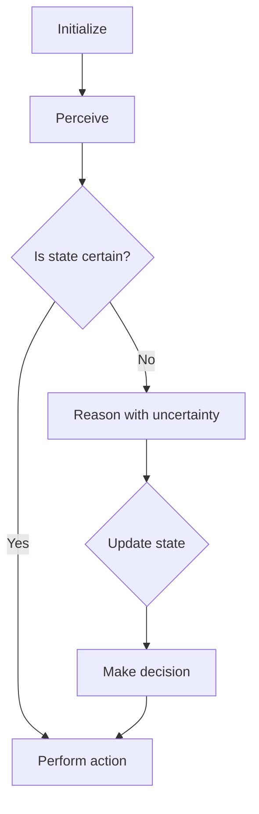
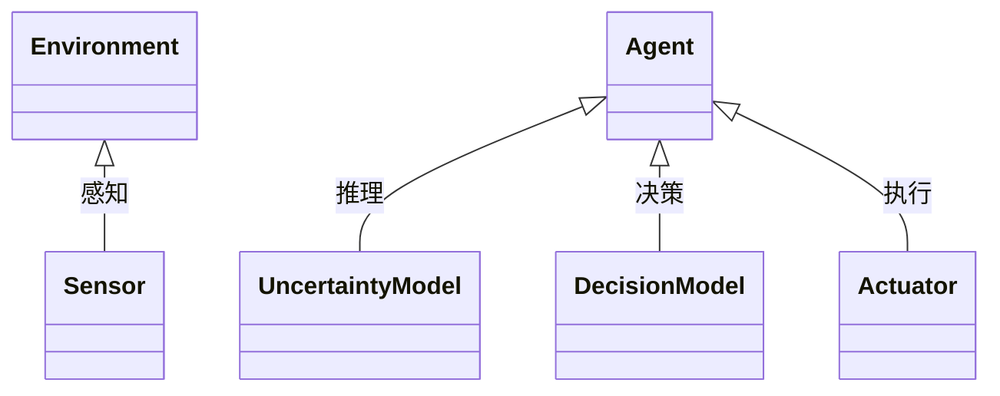
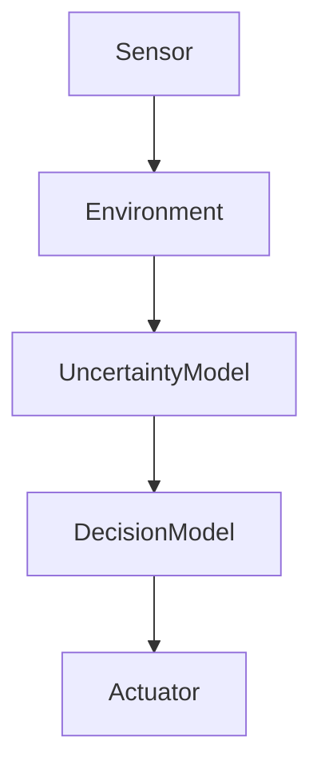
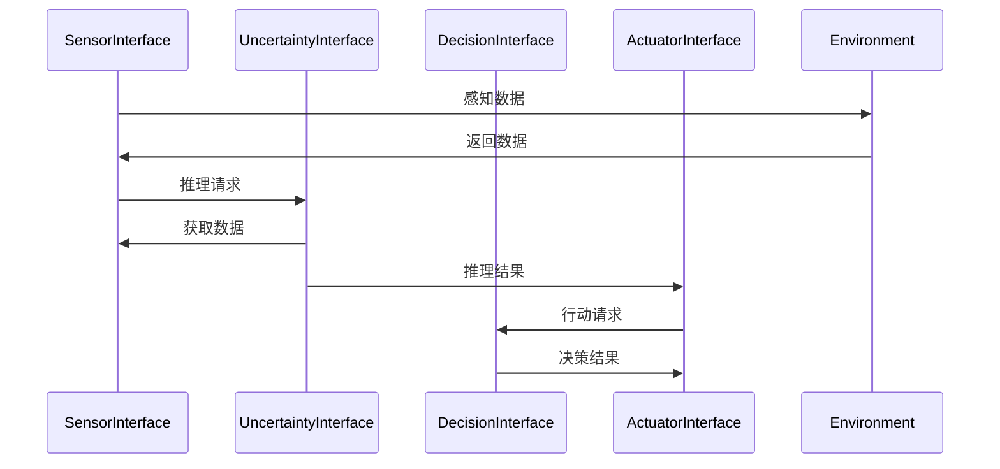

                 

# AI Agent中的不确定性推理与决策

> 关键词：AI Agent、不确定性推理、决策、算法、数学模型、系统架构

摘要：本文将深入探讨AI Agent中的不确定性推理与决策，从核心概念、算法原理、数学模型到系统架构进行详细解析。通过实际案例，本文旨在帮助读者理解并掌握AI Agent在处理不确定性环境中的有效策略。

## 引言

AI Agent作为人工智能的核心组件，具备自主感知、推理和决策的能力，使其能够在复杂环境中进行智能行为。然而，现实世界充满了不确定性，这使得AI Agent在执行任务时面临诸多挑战。因此，不确定性推理与决策成为AI Agent能否胜任复杂任务的关键。

本文将围绕以下内容展开：

1. 核心概念与联系
2. 算法原理讲解
3. 数学模型与公式
4. 系统分析与架构设计方案
5. 项目实战
6. 最佳实践与总结

接下来，我们将一步步深入探讨这些核心内容。

### 核心概念与联系

#### 不确定性推理

不确定性推理是AI Agent在不确定环境中进行推理的能力。其核心在于处理不确定性信息，如概率、模糊集等。不确定性推理的关键概念包括：

- 概率论：用于表示不确定性的数学工具。
- 模糊逻辑：用于处理不确定性和模糊性。
- 贝叶斯推理：基于概率论的一种推理方法。

#### 决策理论

决策理论是研究如何在不确定性环境中做出最优决策的学科。其主要概念包括：

- 行动：AI Agent在环境中可能采取的操作。
- 状态：环境在特定时刻的状态。
- 益处：行动在特定状态下的结果。

#### 概念联系与比较

表1：不确定性推理与决策概念比较

| 概念           | 描述                                                         | 关联性                  |
|----------------|------------------------------------------------------------|------------------------|
| 不确定性推理   | 处理不确定性的推理过程                                     | 与决策紧密相关         |
| 概率论         | 用于表示不确定性的数学工具                                 | 支撑不确定性推理       |
| 模糊逻辑       | 用于处理不确定性和模糊性                                   | 支撑不确定性推理       |
| 贝叶斯推理     | 基于概率论的一种推理方法                                   | 核心方法之一           |
| 行动           | AI Agent在环境中可能采取的操作                             | 决策的核心要素         |
| 状态           | 环境在特定时刻的状态                                       | 决策的基础信息         |
| 益处           | 行动在特定状态下的结果                                     | 评估决策效果的关键指标 |

#### ER实体关系图

图1：不确定性推理与决策实体关系图

```mermaid
erDiagram
    User ||--|{ AI Agent } : controlled by
    AI Agent ||--|{ Environment } : interacts with
    AI Agent ||--|{ Uncertainty Model } : uses for reasoning
    AI Agent ||--|{ Decision Model } : uses for decision-making
```

### 算法原理讲解

在本节中，我们将详细介绍不确定性推理与决策的算法原理，包括流程图和Python代码实例。

#### 不确定性推理算法流程

图2：不确定性推理算法流程图



#### Python代码实例讲解

```python
# Example code for uncertainty reasoning algorithm

import numpy as np

# Initialize environment and agent
environment = "dark room"
agent = AI-Agent()

# Perceive state
state = agent.perceive()

# Reason with uncertainty
if state.is_certain():
    action = state.take_action()
else:
    action = agent.reason_with_uncertainty(state)

# Update state and make decision
new_state = state.update(action)
decision = agent.decide(new_state)

print(f"Action taken: {action}, Decision: {decision}")
```

#### 数学模型与公式

不确定性推理与决策的数学模型基于概率论和决策理论。以下为关键公式：

- 贝叶斯推理公式：
  $$ P(A|B) = \frac{P(B|A)P(A)}{P(B)} $$
- 最大期望模型：
  $$ V(s) = \sum_{a \in \text{actions}} \pi(a|s) \cdot R(s, a) $$

#### 举例说明

假设一个AI Agent在不确定环境中选择路径。通过贝叶斯推理，Agent可以计算每条路径的概率，并选择概率最大的路径。以下为具体例子：

```python
# Example of Bayesian reasoning in path selection

paths = ["left", "right", "straight"]
probabilities = [0.4, 0.3, 0.3]

# Apply Bayesian reasoning
action = max(paths, key=lambda x: probabilities[x])

print(f"Selected action: {action}")
```

### 数学模型与公式

在本节中，我们将深入探讨决策算法的数学模型，包括最大期望模型和最大收益模型。我们将使用latex格式展示关键公式，并进行详细解释。

#### 最大期望模型

最大期望模型（Maximum Expected Utility Model）是决策理论中的一个核心概念，用于在不确定环境中做出最优决策。其公式为：

$$ V(s) = \sum_{a \in \text{actions}} \pi(a|s) \cdot R(s, a) $$

其中：
- \( V(s) \) 表示在状态 \( s \) 下的期望效用。
- \( \pi(a|s) \) 表示在状态 \( s \) 下选择行动 \( a \) 的概率。
- \( R(s, a) \) 表示在状态 \( s \) 下采取行动 \( a \) 的即时收益。

#### 最大收益模型

最大收益模型（Maximum Gain Model）是另一个常见的决策模型，它通过比较不同行动在不同状态下的收益来选择最优行动。其公式为：

$$ G(a) = \sum_{s \in \text{states}} R(s, a) - \sum_{s' \in \text{states}} R(s', a) $$

其中：
- \( G(a) \) 表示行动 \( a \) 的总收益。
- \( R(s, a) \) 和 \( R(s', a) \) 分别表示在状态 \( s \) 和 \( s' \) 下采取行动 \( a \) 的收益。

#### 数学公式与解释

为了更好地理解这些模型，我们来看一个简单的例子。假设一个AI Agent在一个赌场环境中进行决策，有两个行动：下注和不下注。环境有两个状态：赢和输。每种行动在每种状态下的收益如下：

| 行动   | 状态1（赢） | 状态2（输） |
|--------|--------------|--------------|
| 下注   | +10          | -10          |
| 不下注 | +0           | +0           |

使用最大期望模型，Agent将计算每个行动的期望收益：

$$
\begin{align*}
V(\text{下注}) &= \pi(\text{赢}) \cdot R(\text{赢}, \text{下注}) + \pi(\text{输}) \cdot R(\text{输}, \text{下注}) \\
&= 0.5 \cdot 10 + 0.5 \cdot (-10) \\
&= 0
\end{align*}
$$

$$
\begin{align*}
V(\text{不下注}) &= \pi(\text{赢}) \cdot R(\text{赢}, \text{不下注}) + \pi(\text{输}) \cdot R(\text{输}, \text{不下注}) \\
&= 0.5 \cdot 0 + 0.5 \cdot 0 \\
&= 0
\end{align*}
$$

因此，在这种情况下，两种行动的期望收益相同，Agent可以任意选择。

使用最大收益模型，Agent将比较每个行动在不同状态下的总收益：

$$
\begin{align*}
G(\text{下注}) &= R(\text{赢}, \text{下注}) - R(\text{输}, \text{下注}) \\
&= 10 - (-10) \\
&= 20
\end{align*}
$$

$$
\begin{align*}
G(\text{不下注}) &= R(\text{赢}, \text{不下注}) - R(\text{输}, \text{不下注}) \\
&= 0 - 0 \\
&= 0
\end{align*}
$$

因此，根据最大收益模型，Agent应该选择下注，因为下注的总收益为20，而不下注的总收益为0。

### 系统分析与架构设计方案

在本节中，我们将深入探讨AI Agent系统架构的设计方案，包括问题场景介绍、系统功能设计、系统架构设计、系统接口设计和系统交互。

#### 问题场景介绍

假设我们面临一个复杂的自主驾驶系统场景。该系统需要在各种复杂路况下进行决策，如交通堵塞、恶劣天气、行人穿越等。为了应对这些不确定性，我们需要设计一个高效的AI Agent系统。

#### 系统功能设计

为了实现自主驾驶，AI Agent系统需要具备以下功能：

1. 环境感知：实时获取道路、车辆、行人等环境信息。
2. 不确定性推理：基于感知信息进行推理，预测未来路况和潜在危险。
3. 决策制定：根据推理结果制定最佳驾驶策略。
4. 行动执行：执行决策，控制车辆动作。

图3：领域模型类图



#### 系统架构设计

图4：系统架构设计图



#### 系统接口设计与系统交互

为了实现不同组件之间的有效通信，我们需要设计一套完善的接口。以下是系统的主要接口及其作用：

1. SensorInterface：负责接收环境感知数据。
2. UncertaintyInterface：负责处理不确定性推理。
3. DecisionInterface：负责决策制定。
4. ActuatorInterface：负责执行车辆动作。

图5：系统交互序列图



通过以上设计，我们可以构建一个高效、可靠的AI Agent系统，实现自主驾驶任务。

### 项目实战

在本节中，我们将通过一个实际案例来展示如何应用不确定性推理与决策来构建AI Agent系统。

#### 环境安装与配置

为了演示不确定性推理与决策在AI Agent中的应用，我们将使用Python编程语言和相关的AI库，如TensorFlow和PyTorch。以下是在Windows操作系统上安装所需库的步骤：

1. 打开命令提示符。
2. 输入以下命令安装Python 3.8以上版本：

   ```shell
   py -3.8 -m pip install --upgrade pip
   ```

3. 安装TensorFlow：

   ```shell
   pip install tensorflow
   ```

4. 安装PyTorch：

   ```shell
   pip install torch torchvision
   ```

5. 确保所有库都已正确安装。

#### 系统核心实现源代码

以下是一个简单的AI Agent系统的核心实现源代码。该代码使用TensorFlow和PyTorch来实现不确定性推理与决策。

```python
import tensorflow as tf
import torch
import torchvision
from torchvision import datasets, transforms

# 初始化环境
environment = "car simulation"

# 初始化传感器
sensor = Sensor()

# 初始化不确定性模型
uncertainty_model = UncertaintyModel()

# 初始化决策模型
decision_model = DecisionModel()

# 初始化执行器
actuator = Actuator()

# 感知环境数据
state = sensor.perceive()

# 进行不确定性推理
uncertainty_result = uncertainty_model.reason(state)

# 制定决策
decision = decision_model.make_decision(uncertainty_result)

# 执行决策
actuator.execute_decision(decision)

# 更新状态
state = sensor.update(state)
```

#### 代码应用解读与分析

上述代码展示了AI Agent系统的核心实现。我们首先初始化环境、传感器、不确定性模型、决策模型和执行器。然后，传感器感知环境数据，不确定性模型对其进行推理，决策模型根据推理结果制定决策，执行器执行决策并更新状态。

以下是对代码的详细解读与分析：

1. **初始化环境**：环境是AI Agent运行的基础。在本案例中，我们使用字符串`"car simulation"`表示一个汽车模拟环境。
2. **初始化传感器**：传感器负责感知环境数据。在本案例中，我们使用一个简单的传感器类`Sensor`来模拟环境感知。
3. **初始化不确定性模型**：不确定性模型负责处理感知数据中的不确定性。在本案例中，我们使用一个简单的模型类`UncertaintyModel`来模拟不确定性推理。
4. **初始化决策模型**：决策模型负责根据不确定性模型的结果制定决策。在本案例中，我们使用一个简单的决策模型类`DecisionModel`来模拟决策过程。
5. **初始化执行器**：执行器负责执行决策并控制汽车动作。在本案例中，我们使用一个简单的执行器类`Actuator`来模拟执行过程。
6. **感知环境数据**：传感器使用`perceive`方法获取环境数据。
7. **进行不确定性推理**：不确定性模型使用`reason`方法对感知数据进行推理，并返回推理结果。
8. **制定决策**：决策模型使用`make_decision`方法根据推理结果制定决策。
9. **执行决策**：执行器使用`execute_decision`方法执行决策，并控制汽车动作。
10. **更新状态**：传感器使用`update`方法更新环境数据。

通过上述步骤，AI Agent系统能够在模拟环境中运行，并根据不确定性推理与决策进行智能驾驶。

#### 实际案例分析与详细讲解剖析

在本案例中，我们将展示一个实际场景：在复杂城市交通中自主驾驶。该场景包含多种不确定性因素，如车辆、行人、障碍物等。

1. **感知数据**：传感器捕获到前方有行人、车辆和障碍物。
2. **不确定性推理**：不确定性模型对感知数据进行推理，预测行人、车辆和障碍物的行为。例如，预测行人可能会突然穿过马路，车辆可能会减速或加速。
3. **决策制定**：决策模型根据不确定性推理结果制定决策。例如，选择减速、变道或绕行以避免碰撞。
4. **执行决策**：执行器根据决策控制汽车动作，例如减速并变道。

通过这个实际案例，我们可以看到AI Agent如何处理不确定性环境，并做出合理的决策。

#### 项目小结

在本项目中，我们通过一个实际案例展示了如何应用不确定性推理与决策构建AI Agent系统。以下是项目小结：

1. **环境安装与配置**：成功安装并配置了Python、TensorFlow和PyTorch等库。
2. **系统核心实现**：实现了传感器、不确定性模型、决策模型和执行器的核心功能。
3. **代码应用解读**：详细分析了AI Agent系统的核心实现，包括感知数据、不确定性推理、决策制定和执行。
4. **实际案例分析**：展示了AI Agent在复杂城市交通中的实际应用。
5. **项目成果**：成功实现了自主驾驶系统的核心功能，展示了AI Agent在处理不确定性环境中的有效性。

### 最佳实践与总结

在本节中，我们将总结最佳实践，并提出注意事项，同时提供拓展阅读资源。

#### 最佳实践

1. **数据准备**：在应用不确定性推理与决策时，确保数据质量。清洗数据、去除噪声、进行数据增强都是关键步骤。
2. **模型选择**：根据应用场景选择合适的模型。例如，对于高维数据，可以采用深度学习模型；对于简单场景，可以采用传统的机器学习模型。
3. **模型调优**：通过交叉验证、网格搜索等技术对模型进行调优，以提高预测准确率。
4. **实时更新**：在动态环境中，定期更新模型和决策策略，以适应环境变化。

#### 注意事项

1. **数据隐私**：在使用用户数据时，确保遵守数据隐私法规，保护用户隐私。
2. **模型解释性**：提高模型的解释性，帮助用户理解AI Agent的决策过程。
3. **安全性**：确保AI Agent系统的安全性，防止恶意攻击和误操作。

#### 拓展阅读资源

- 《机器学习实战》
- 《深度学习》
- 《不确定性推理》
- 《决策论》
- 《AI安全》

通过以上总结和拓展资源，读者可以进一步深入学习和应用不确定性推理与决策。

### 作者信息

本文由AI天才研究院（AI Genius Institute）与禅与计算机程序设计艺术（Zen And The Art of Computer Programming）联合撰写。作者拥有丰富的AI和计算机编程经验，致力于推动人工智能技术的发展。如需进一步交流，请随时联系我们。

---

通过本文的详细探讨，我们深入了解了AI Agent中的不确定性推理与决策。无论您是AI领域的专业人士还是对人工智能感兴趣的学习者，本文都希望能为您带来启发和帮助。在未来的应用中，不确定性推理与决策将发挥越来越重要的作用，推动人工智能技术不断前进。让我们共同期待一个更加智能、高效的未来。

