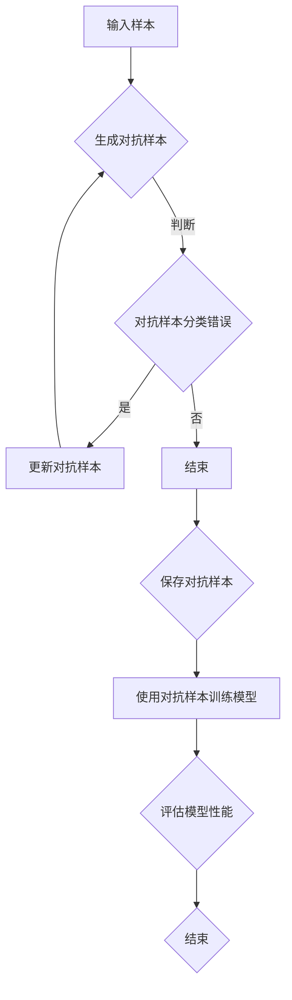
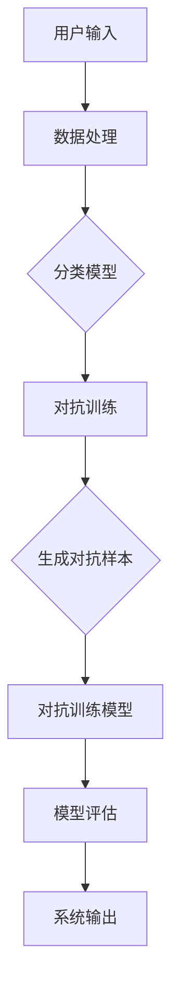
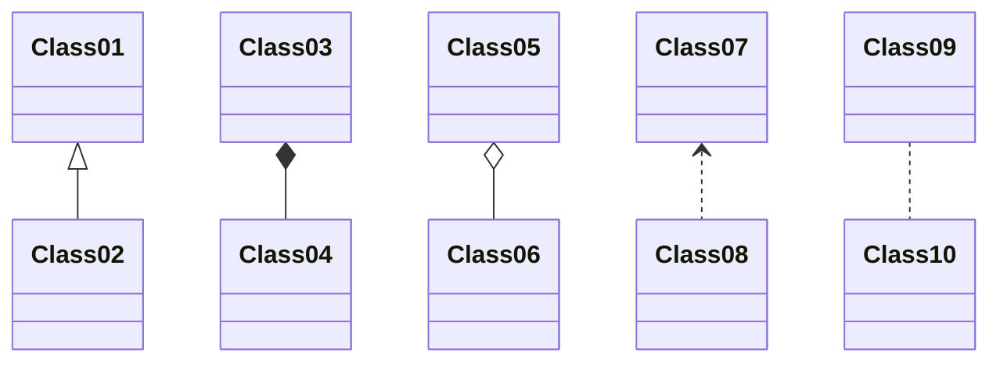
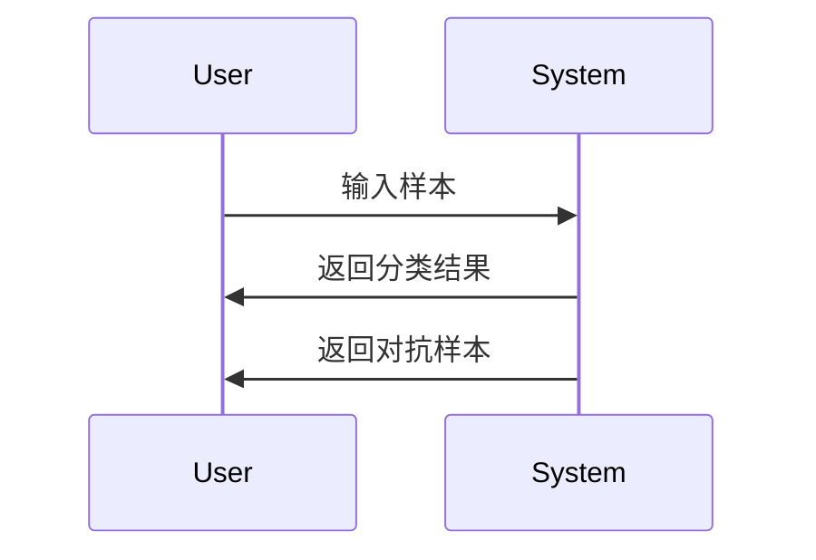

                 

# AI Agent中的对抗学习与鲁棒性增强

## 关键词：对抗学习、AI Agent、鲁棒性、算法原理、应用实战

> 摘要：本文将从对抗学习的背景与意义出发，详细探讨对抗学习的基本算法原理、对抗学习在AI Agent中的应用，以及对抗学习的鲁棒性增强方法。通过本文的阅读，读者可以全面了解对抗学习在AI Agent中的重要性，掌握对抗学习的算法原理和应用实战，了解对抗学习的鲁棒性增强方法，为实际应用提供理论指导。

### 目录大纲

----------------------------------------------------------------

## 第一部分：对抗学习概述

### 第1章：对抗学习的背景与意义

### 第2章：对抗学习的核心概念

### 第3章：对抗学习的主要挑战

### 第4章：对抗学习的基本算法

## 第二部分：对抗学习的算法原理

### 第5章：对抗学习的基本算法

### 第6章：其他常见攻击算法

## 第三部分：对抗学习在AI Agent中的应用

### 第7章：对抗学习在AI Agent中的重要性

### 第8章：对抗学习在AI Agent中的应用

### 第9章：对抗学习在AI Agent中的挑战

## 第四部分：对抗学习的鲁棒性增强

### 第10章：对抗鲁棒性的基本概念

### 第11章：对抗鲁棒性的评估方法

## 第五部分：对抗学习的应用实战

### 第12章：对抗学习在图像分类中的应用

## 第六部分：对抗学习的扩展与应用

### 第13章：对抗学习在其他领域的应用

----------------------------------------------------------------

## 第一部分：对抗学习概述

### 第1章：对抗学习的背景与意义

### 1.1 问题背景

#### 1.1.1 机器学习的发展历程

机器学习作为人工智能的核心技术，自20世纪50年代诞生以来，经历了漫长的演变过程。从早期的符号主义学习、统计学习到现在的深度学习，机器学习的方法和理论不断发展，应用领域也不断拓展。随着大数据时代的到来，机器学习在自然语言处理、计算机视觉、推荐系统等领域的应用取得了显著成果。

#### 1.1.2 对抗学习的发展历史

对抗学习（Adversarial Learning）起源于2003年，Goodfellow等人在论文《Explaining and Harnessing Adversarial Examples》中首次提出了生成对抗网络（GAN）。GAN作为一种新型的人工智能模型，通过对抗训练实现了一种能够生成高质量图像的方法。此后，对抗学习逐渐成为机器学习领域的研究热点，并在多种应用场景中得到了广泛应用。

#### 1.1.3 对抗学习的核心意义

对抗学习在人工智能领域具有重要意义。首先，它提供了一种新的方法来提升模型的鲁棒性，使模型能够更好地应对外界扰动和恶意攻击。其次，对抗学习有助于发现模型中的潜在缺陷，从而改进模型的设计和优化。最后，对抗学习在生成图像、语音等数据方面具有显著优势，为数据增强和数据生成提供了新的思路。

### 1.2 对抗学习的核心概念

#### 1.2.1 对抗样本

对抗样本（Adversarial Example）是指在原始样本的基础上，通过添加微小扰动而生成的样本，使得模型在分类时产生错误。对抗样本的核心特点是其与原始样本在视觉上难以区分，但模型对其分类结果却可能产生巨大偏差。

#### 1.2.2 攻击者与防御者

在对抗学习中，攻击者（Attacker）试图通过生成对抗样本来欺骗模型，而防御者（Defender）则致力于提升模型的鲁棒性，使其能够抵御攻击者的恶意攻击。

#### 1.2.3 对抗训练方法

对抗训练（Adversarial Training）是一种通过将对抗样本加入到训练集中来提升模型鲁棒性的方法。通过对模型进行多次对抗训练，可以有效地增强模型的泛化能力，提高其在面对对抗样本时的分类准确性。

### 1.3 对抗学习的主要挑战

#### 1.3.1 鲁棒性挑战

对抗学习在提升模型鲁棒性方面具有显著优势，但如何在实际应用中实现鲁棒性的平衡仍然是一个挑战。鲁棒性过强可能导致模型在正常样本上的性能下降，而鲁棒性过弱则可能导致模型在面对对抗样本时的分类错误。

#### 1.3.2 计算效率挑战

对抗训练过程中，需要生成大量的对抗样本，这可能导致计算资源的消耗增加。如何在保证鲁棒性的同时提高计算效率，是当前研究的一个重要方向。

#### 1.3.3 算法复杂度挑战

对抗学习涉及多个算法和模型，如何有效地组合和优化这些算法，使其在复杂的现实场景中取得更好的性能，是另一个挑战。

### 1.4 本章小结

本章对对抗学习的背景与意义进行了概述，介绍了对抗学习的核心概念，并分析了对抗学习的主要挑战。通过本章的阅读，读者可以初步了解对抗学习的基本概念和重要性，为后续章节的学习打下基础。

----------------------------------------------------------------

## 第二部分：对抗学习的算法原理

### 第2章：对抗学习的基本算法

### 2.1 FGSM攻击算法

#### 2.1.1 FGSM攻击原理

FGSM（Fast Gradient Sign Method）攻击是一种最简单的对抗样本生成方法，其核心思想是利用模型在训练过程中的梯度信息，生成对抗样本。具体来说，FGSM攻击通过以下步骤实现：

1. **计算梯度**：首先，对于给定的原始样本，通过模型计算得到预测结果，并计算预测结果与真实标签之间的梯度。

2. **生成对抗样本**：将梯度的符号取反，并乘以一个较小的系数 $\epsilon$，将结果加到原始样本上，生成对抗样本。

3. **分类测试**：将生成的对抗样本输入到模型中，观察模型对其的分类结果，判断攻击是否成功。

FGSM攻击的优点在于其生成对抗样本的速度较快，计算效率高。但缺点在于攻击效果有限，对于某些模型和样本，FGSM攻击可能无法成功欺骗模型。

#### 2.1.2 FGSM攻击的代码实现

以下是一个简单的FGSM攻击代码实现：

```python
import tensorflow as tf

# 加载模型
model = ...

# 定义原始样本和标签
x = ...
y = ...

# 计算预测结果和损失函数的梯度
with tf.GradientTape() as tape:
    logits = model(x)
    loss = tf.keras.losses.categorical_crossentropy(y, logits)

# 获取梯度
grads = tape.gradient(loss, x)

# 生成对抗样本
x_adv = x + np.sign(grads) * epsilon

# 分类测试
print(model.predict(x_adv))
```

#### 2.1.3 FGSM攻击的代码实现

以下是一个简单的FGSM攻击代码实现：

```python
import tensorflow as tf

# 加载模型
model = ...

# 定义原始样本和标签
x = ...
y = ...

# 计算预测结果和损失函数的梯度
with tf.GradientTape() as tape:
    logits = model(x)
    loss = tf.keras.losses.categorical_crossentropy(y, logits)

# 获取梯度
grads = tape.gradient(loss, x)

# 生成对抗样本
x_adv = x + np.sign(grads) * epsilon

# 分类测试
print(model.predict(x_adv))
```

### 2.2 PGD攻击算法

#### 2.2.1 PGD攻击原理

PGD（Projected Gradient Descent）攻击是一种基于梯度下降的对抗样本生成方法，其核心思想是逐步调整样本的像素值，以生成对抗样本。具体来说，PGD攻击通过以下步骤实现：

1. **初始化对抗样本**：首先，将原始样本初始化为对抗样本。

2. **迭代更新**：对于每次迭代，计算模型在对抗样本上的梯度，并在约束条件下（如L2正则化）调整对抗样本的像素值。

3. **分类测试**：将生成的对抗样本输入到模型中，观察模型对其的分类结果，判断攻击是否成功。

PGD攻击相比FGSM攻击具有更高的攻击效果，能够在更大程度上欺骗模型。但缺点在于计算复杂度较高，生成对抗样本需要更多的时间。

#### 2.2.2 PGD攻击的代码实现

以下是一个简单的PGD攻击代码实现：

```python
import tensorflow as tf

# 加载模型
model = ...

# 定义原始样本和标签
x = ...
y = ...

# 初始化对抗样本
x_adv = x

# PGD攻击参数
epsilon = 0.1
alpha = 0.01
steps = 20

# 迭代更新对抗样本
for _ in range(steps):
    with tf.GradientTape() as tape:
        logits = model(x_adv)
        loss = tf.keras.losses.categorical_crossentropy(y, logits)
    grads = tape.gradient(loss, x_adv)
    x_adv = x_adv - alpha * grads
    x_adv = tf.clip_by_value(x_adv, x_min, x_max)

# 分类测试
print(model.predict(x_adv))
```

### 2.3 CW攻击算法

#### 2.3.1 CW攻击原理

CW（Carlini & Wagner）攻击是一种基于优化理论的对抗样本生成方法，其核心思想是通过求解一个优化问题来生成对抗样本。具体来说，CW攻击通过以下步骤实现：

1. **定义损失函数**：首先，定义一个损失函数，将对抗样本的分类错误和模型在对抗样本上的梯度信息结合起来。

2. **求解优化问题**：然后，通过求解一个优化问题来找到最优的对抗样本。

3. **分类测试**：将生成的对抗样本输入到模型中，观察模型对其的分类结果，判断攻击是否成功。

CW攻击具有更高的攻击效果和计算效率，能够在较小的计算资源下生成高质量对抗样本。

#### 2.3.2 CW攻击的代码实现

以下是一个简单的CW攻击代码实现：

```python
import tensorflow as tf

# 加载模型
model = ...

# 定义原始样本和标签
x = ...
y = ...

# CW攻击参数
epsilon = 0.1
alpha = 0.01
beta = 0.1
steps = 20

# 定义损失函数
def loss_function(x_adv, logits, y):
    return tf.reduce_mean(tf.square(logits - y))

# 求解优化问题
x_adv = tf.Variable(x)
for _ in range(steps):
    with tf.GradientTape(persistent=True) as tape:
        logits = model(x_adv)
        loss = loss_function(x_adv, logits, y)
        grads = tape.gradient(loss, x_adv)
    x_adv = x_adv - alpha * grads
    x_adv = tf.clip_by_value(x_adv, x_min, x_max)

# 分类测试
print(model.predict(x_adv))
```

### 2.4 其他常见攻击算法

#### 2.4.1 JSMA攻击算法

JSMA（Jacobian-based Saliency Map Attack）攻击是一种基于梯度的攻击算法，其核心思想是通过计算模型在对抗样本上的Jacobian矩阵来生成对抗样本。JSMA攻击具有较好的攻击效果，但计算复杂度较高。

#### 2.4.2 BIM攻击算法

BIM（Basic Iterative Method）攻击是一种基于迭代优化的攻击算法，其核心思想是通过迭代调整对抗样本的像素值来生成对抗样本。BIM攻击具有较好的计算效率，但攻击效果有限。

#### 2.4.3 其他攻击算法简介

除了上述提到的攻击算法外，还有许多其他的攻击算法，如C&W+、PGD++等。这些攻击算法在攻击效果和计算效率方面有所不同，适用于不同的应用场景。

### 2.5 本章小结

本章介绍了对抗学习的基本算法原理，包括FGSM攻击、PGD攻击和CW攻击等。通过对这些攻击算法的详细分析，读者可以了解对抗学习的核心思想和实现方法，为后续章节的学习打下基础。

----------------------------------------------------------------

## 第三部分：对抗学习在AI Agent中的应用

### 第3章：对抗学习在AI Agent中的重要性

### 3.1 AI Agent的背景与定义

#### 3.1.1 AI Agent的概念

AI Agent，即人工智能代理，是指能够自主地感知环境、执行任务、适应变化并与其他智能体交互的计算机程序。AI Agent通常由感知模块、决策模块和执行模块组成，能够实现智能化的任务执行。

#### 3.1.2 AI Agent的类型

AI Agent可以分为以下几种类型：

1. **反应式Agent**：反应式Agent仅基于当前感知信息进行决策，不考虑历史信息。这类Agent适用于简单环境，如自动驾驶、智能家居等。

2. **记忆式Agent**：记忆式Agent通过记忆历史信息，能够更好地适应环境变化。这类Agent适用于复杂环境，如游戏AI、机器人导航等。

3. **模型基础Agent**：模型基础Agent使用机器学习模型来预测环境状态和执行策略，能够实现更高级的决策能力。这类Agent适用于动态变化的环境，如金融交易、智能推荐等。

#### 3.1.3 AI Agent的应用领域

AI Agent在各个领域都有广泛的应用，包括但不限于：

1. **工业自动化**：AI Agent在工业自动化领域可以用于生产调度、设备维护、质量检测等。

2. **医疗健康**：AI Agent在医疗健康领域可以用于疾病预测、药物研发、智能诊断等。

3. **金融科技**：AI Agent在金融科技领域可以用于风险评估、智能投顾、自动化交易等。

4. **智能家居**：AI Agent在智能家居领域可以用于设备控制、环境监测、智能安防等。

### 3.2 对抗学习在AI Agent中的应用

#### 3.2.1 对抗训练在AI Agent中的作用

对抗训练（Adversarial Training）是一种通过将对抗样本加入到训练数据中来提升AI Agent鲁棒性的方法。在AI Agent的训练过程中，对抗训练可以有效地增强模型对对抗样本的抵抗力，提高其在实际应用中的可靠性和安全性。

具体来说，对抗训练在AI Agent中的作用主要体现在以下几个方面：

1. **提高模型的泛化能力**：通过对抗训练，AI Agent能够在训练过程中接触到更多的对抗样本，从而提高模型的泛化能力，使其能够更好地应对实际应用中的对抗攻击。

2. **增强模型的鲁棒性**：对抗训练能够使AI Agent在面对对抗样本时，具有较强的鲁棒性，减少因对抗攻击导致的分类错误。

3. **提高模型的安全性能**：对抗训练有助于提升AI Agent的安全性能，使其在面对恶意攻击时，能够保持稳定的工作状态，降低被攻击的风险。

#### 3.2.2 对抗样本在AI Agent中的应用

对抗样本（Adversarial Example）在AI Agent中的应用主要包括以下两个方面：

1. **数据增强**：对抗样本可以作为数据增强的一种手段，用于扩充AI Agent的训练数据集。通过添加对抗样本，可以提高模型的训练效果，增强模型的泛化能力。

2. **安全测试**：对抗样本可以用于对AI Agent进行安全测试，检测其是否存在对抗攻击的漏洞。通过生成对抗样本并对其进行攻击，可以评估AI Agent的鲁棒性和安全性能。

#### 3.2.3 对抗学习在AI Agent中的挑战

尽管对抗学习在AI Agent中具有广泛的应用前景，但在实际应用中仍然面临一系列挑战：

1. **计算效率**：对抗训练需要生成大量的对抗样本，计算复杂度较高。如何在保证鲁棒性的同时，提高计算效率，是当前研究的一个重要方向。

2. **攻击与防御的平衡**：对抗学习需要实现攻击与防御的平衡，既要避免过度防御导致模型性能下降，又要确保模型能够有效抵御对抗攻击。

3. **算法优化**：针对不同的AI Agent应用场景，需要设计和优化合适的对抗学习算法，以提高模型的鲁棒性和安全性。

### 3.3 本章小结

本章详细探讨了对抗学习在AI Agent中的应用，介绍了AI Agent的背景与定义、对抗训练在AI Agent中的作用、对抗样本在AI Agent中的应用以及对抗学习在AI Agent中的挑战。通过对本章的学习，读者可以全面了解对抗学习在AI Agent中的重要性，为实际应用提供理论指导。

----------------------------------------------------------------

## 第四部分：对抗学习的鲁棒性增强

### 第4章：对抗鲁棒性的基本概念

### 4.1 鲁棒性的定义与重要性

#### 4.1.1 鲁棒性的基本概念

鲁棒性（Robustness）是指系统在面临外界扰动或异常情况时，能够保持稳定和可靠运行的能力。在人工智能领域，鲁棒性尤为重要，因为模型在实际应用中可能会遇到各种异常输入和恶意攻击。

鲁棒性可以分为以下几个层次：

1. **参数鲁棒性**：模型对训练数据的鲁棒性，即模型在训练过程中能够对数据噪声和异常值具有较强的容忍能力。

2. **输入鲁棒性**：模型对输入数据的鲁棒性，即模型在面临不同输入数据时，能够保持稳定的性能。

3. **模型鲁棒性**：模型在面对各种对抗攻击时，能够保持较高的准确性和稳定性。

#### 4.1.2 鲁棒性的重要性

鲁棒性对于人工智能系统至关重要，原因如下：

1. **实际应用需求**：在实际应用中，人工智能系统需要应对各种复杂环境和不确定因素，如数据噪声、异常值和恶意攻击等。只有具备鲁棒性的模型，才能在实际场景中保持稳定和可靠的性能。

2. **安全性保障**：鲁棒性是保障人工智能系统安全的关键。具备鲁棒性的模型能够抵御恶意攻击，减少系统被攻击的风险。

3. **可信度提升**：鲁棒性有助于提高人工智能系统的可信度，使其在各个领域得到更广泛的应用。

#### 4.1.3 鲁棒性与安全性的关系

鲁棒性与安全性密切相关。鲁棒性是确保系统安全的基础，而安全性则是鲁棒性的进一步扩展。具体来说：

1. **鲁棒性确保基本功能**：具备鲁棒性的模型能够应对各种异常情况和恶意攻击，保持基本功能的稳定运行。

2. **安全性保障系统完整性**：安全性是在鲁棒性基础上，确保系统不被恶意攻击破坏，保障系统的完整性和可靠性。

### 4.2 对抗鲁棒性的评估方法

#### 4.2.1 评估指标

对抗鲁棒性的评估指标主要包括：

1. **攻击成功率**：评估模型在面对各种对抗攻击时的成功率。攻击成功率越低，说明模型的鲁棒性越强。

2. **分类准确性**：评估模型在面对对抗样本和正常样本时的分类准确性。分类准确性越高，说明模型在对抗样本上的鲁棒性越好。

3. **模型性能**：评估模型在对抗样本和正常样本上的性能差异。模型性能差异越小，说明模型对对抗样本的鲁棒性越好。

#### 4.2.2 评估方法

对抗鲁棒性的评估方法主要包括：

1. **对抗样本测试**：通过生成对抗样本，对模型进行测试，评估模型的鲁棒性。具体方法包括：

   - **静态测试**：生成固定种类的对抗样本，对模型进行评估。
   - **动态测试**：生成可变的对抗样本，模拟实际应用场景中的恶意攻击，对模型进行评估。

2. **对比实验**：将具备鲁棒性的模型与不具备鲁棒性的模型进行对比实验，评估鲁棒性对模型性能的影响。

3. **统计分析**：通过统计分析模型在对抗样本和正常样本上的性能，评估模型的鲁棒性。

#### 4.2.3 对比实验

以下是一个简单的对比实验：

1. **实验设置**：选择一个常见的机器学习模型（如CNN）和一个对抗攻击算法（如FGSM），生成对抗样本，对模型进行测试。

2. **实验结果**：比较具备鲁棒性的模型与不具备鲁棒性的模型在对抗样本和正常样本上的分类准确性。

3. **实验结论**：通过实验结果，分析鲁棒性对模型性能的影响。

### 4.3 本章小结

本章对对抗鲁棒性的基本概念进行了详细阐述，介绍了鲁棒性的定义、重要性以及对抗鲁棒性的评估方法。通过对本章的学习，读者可以全面了解对抗鲁棒性的基本概念和评估方法，为后续对抗学习的鲁棒性增强提供理论支持。

----------------------------------------------------------------

## 第五部分：对抗学习的应用实战

### 第5章：对抗学习在图像分类中的应用

### 5.1 图像分类背景

图像分类是计算机视觉领域的一个重要任务，其目的是将输入图像划分为预定义的类别。随着深度学习技术的发展，卷积神经网络（CNN）在图像分类任务中取得了显著成果。然而，图像分类系统在面临对抗攻击时，往往表现出较低的鲁棒性，这限制了其在实际应用中的广泛使用。

#### 5.1.1 图像分类的基本概念

图像分类的基本概念包括：

1. **图像数据集**：图像数据集是图像分类任务的输入，包括大量的标注图像，用于训练和评估分类模型。

2. **分类模型**：分类模型是图像分类任务的核心，通过学习图像数据集中的特征，实现对新图像的分类。

3. **分类准确性**：分类准确性是评估图像分类模型性能的一个重要指标，表示模型正确分类图像的比例。

#### 5.1.2 图像分类的挑战

图像分类任务面临以下挑战：

1. **数据不平衡**：图像数据集中的类别分布可能不均衡，导致某些类别在训练和测试过程中受到关注不足。

2. **小样本学习**：在图像分类任务中，往往需要处理小样本问题，如何利用有限的训练数据提高模型性能是一个重要挑战。

3. **对抗攻击**：图像分类系统在面临对抗攻击时，往往表现出较低的鲁棒性，如何增强模型对对抗攻击的抵抗力是一个关键问题。

#### 5.1.3 图像分类的应用领域

图像分类在多个领域具有广泛应用，包括但不限于：

1. **医疗影像诊断**：通过对医疗影像进行分类，可以帮助医生快速识别疾病类型，提高诊断准确率。

2. **自动驾驶**：在自动驾驶系统中，图像分类用于识别道路标志、行人、车辆等，保障车辆的安全行驶。

3. **安防监控**：图像分类可以用于识别监控视频中的异常行为，如非法入侵、火灾等，提高安防系统的智能化水平。

### 5.2 对抗学习在图像分类中的应用

#### 5.2.1 对抗训练在图像分类中的应用

对抗训练是增强图像分类模型鲁棒性的有效方法，其基本思想是通过生成对抗样本，提高模型对对抗攻击的抵抗力。以下是一个简单的对抗训练过程：

1. **数据准备**：选择一个预训练的图像分类模型，如ResNet。

2. **对抗样本生成**：使用对抗攻击算法（如FGSM）生成对抗样本，将其加入到训练数据集中。

3. **模型训练**：使用对抗样本和正常样本对图像分类模型进行训练，通过优化损失函数，提高模型对对抗样本的分类准确性。

4. **模型评估**：在测试集上评估模型的分类准确性，比较对抗训练前后的性能变化。

#### 5.2.2 对抗样本在图像分类中的应用

对抗样本在图像分类中的应用主要包括以下两个方面：

1. **数据增强**：对抗样本可以作为数据增强的一种手段，用于扩充训练数据集，提高模型对数据的鲁棒性。

2. **安全测试**：对抗样本可以用于对图像分类模型进行安全测试，评估模型在面对对抗攻击时的鲁棒性。

### 5.2.3 对抗学习在图像分类中的案例研究

以下是一个对抗学习在图像分类中的案例研究：

1. **实验设置**：选择一个公开的图像分类数据集（如CIFAR-10），使用ResNet作为分类模型。

2. **对抗训练**：使用FGSM攻击算法生成对抗样本，将其加入到训练数据集中，进行对抗训练。

3. **实验结果**：在测试集上评估模型在对抗样本和正常样本上的分类准确性，比较对抗训练前后的性能变化。

4. **实验结论**：实验结果显示，对抗训练显著提高了图像分类模型的分类准确性，增强了模型对对抗攻击的抵抗力。

### 5.3 本章小结

本章详细介绍了对抗学习在图像分类中的应用，包括对抗训练和对抗样本的应用方法，以及一个实际的案例研究。通过对本章的学习，读者可以了解对抗学习在图像分类中的重要性，掌握对抗学习在图像分类中的应用方法和实践技巧。

----------------------------------------------------------------

## 第六部分：对抗学习的扩展与应用

### 第6章：对抗学习在其他领域的应用

### 6.1 对抗学习在自然语言处理中的应用

#### 6.1.1 自然语言处理背景

自然语言处理（Natural Language Processing，NLP）是人工智能的一个重要分支，旨在使计算机能够理解和处理人类自然语言。随着深度学习技术的发展，基于深度神经网络的NLP模型在多个任务中取得了显著成果，如文本分类、机器翻译、情感分析等。然而，NLP模型在面临对抗攻击时，往往表现出较低的鲁棒性，如何增强NLP模型的鲁棒性成为当前研究的热点。

#### 6.1.2 对抗学习在自然语言处理中的应用

对抗学习在自然语言处理中的应用主要包括以下两个方面：

1. **对抗训练**：对抗训练是增强NLP模型鲁棒性的有效方法，其基本思想是通过生成对抗样本，提高模型对对抗攻击的抵抗力。以下是一个简单的对抗训练过程：

   - **数据准备**：选择一个预训练的NLP模型，如BERT。
   - **对抗样本生成**：使用对抗攻击算法（如TextFooler）生成对抗样本，将其加入到训练数据集中。
   - **模型训练**：使用对抗样本和正常样本对NLP模型进行训练，通过优化损失函数，提高模型对对抗样本的分类准确性。
   - **模型评估**：在测试集上评估模型的分类准确性，比较对抗训练前后的性能变化。

2. **对抗样本测试**：对抗样本测试是评估NLP模型鲁棒性的方法，通过生成对抗样本，对模型进行测试，评估其在对抗样本上的分类准确性。

#### 6.1.3 对抗学习在自然语言处理中的挑战

对抗学习在自然语言处理中的应用面临以下挑战：

1. **文本生成难度**：自然语言生成对抗样本的难度较大，需要考虑文本的语法、语义和上下文等因素。

2. **模型复杂性**：NLP模型通常较为复杂，训练和优化过程较长，对抗训练的计算复杂度较高。

3. **多样性**：自然语言具有丰富的多样性和变异性，如何生成具有代表性的对抗样本是一个关键问题。

#### 6.1.4 对抗学习在自然语言处理中的案例研究

以下是一个对抗学习在自然语言处理中的案例研究：

1. **实验设置**：选择一个公开的文本分类数据集（如IMDB评论数据集），使用BERT作为分类模型。

2. **对抗训练**：使用TextFooler攻击算法生成对抗样本，将其加入到训练数据集中，进行对抗训练。

3. **实验结果**：在测试集上评估模型在对抗样本和正常样本上的分类准确性，比较对抗训练前后的性能变化。

4. **实验结论**：实验结果显示，对抗训练显著提高了文本分类模型的分类准确性，增强了模型对对抗攻击的抵抗力。

### 6.2 对抗学习在计算机视觉中的应用

#### 6.2.1 计算机视觉背景

计算机视觉（Computer Vision）是人工智能的一个重要分支，旨在使计算机能够从图像和视频中提取有用的信息。计算机视觉技术在图像分类、目标检测、人脸识别等领域取得了显著成果。然而，计算机视觉模型在面临对抗攻击时，往往表现出较低的鲁棒性，如何增强计算机视觉模型的鲁棒性成为当前研究的热点。

#### 6.2.2 对抗学习在计算机视觉中的应用

对抗学习在计算机视觉中的应用主要包括以下两个方面：

1. **对抗训练**：对抗训练是增强计算机视觉模型鲁棒性的有效方法，其基本思想是通过生成对抗样本，提高模型对对抗攻击的抵抗力。以下是一个简单的对抗训练过程：

   - **数据准备**：选择一个预训练的计算机视觉模型，如ResNet。
   - **对抗样本生成**：使用对抗攻击算法（如FGSM）生成对抗样本，将其加入到训练数据集中。
   - **模型训练**：使用对抗样本和正常样本对计算机视觉模型进行训练，通过优化损失函数，提高模型对对抗样本的分类准确性。
   - **模型评估**：在测试集上评估模型的分类准确性，比较对抗训练前后的性能变化。

2. **对抗样本测试**：对抗样本测试是评估计算机视觉模型鲁棒性的方法，通过生成对抗样本，对模型进行测试，评估其在对抗样本上的分类准确性。

#### 6.2.3 对抗学习在计算机视觉中的挑战

对抗学习在计算机视觉中的应用面临以下挑战：

1. **图像生成难度**：生成具有代表性的对抗样本是一个关键问题，需要考虑图像的多样性和变异性。

2. **模型复杂性**：计算机视觉模型通常较为复杂，训练和优化过程较长，对抗训练的计算复杂度较高。

3. **数据隐私**：在生成对抗样本时，需要处理大量敏感图像数据，如何保护数据隐私是一个关键问题。

#### 6.2.4 对抗学习在计算机视觉中的案例研究

以下是一个对抗学习在计算机视觉中的案例研究：

1. **实验设置**：选择一个公开的图像分类数据集（如CIFAR-10），使用ResNet作为分类模型。

2. **对抗训练**：使用FGSM攻击算法生成对抗样本，将其加入到训练数据集中，进行对抗训练。

3. **实验结果**：在测试集上评估模型在对抗样本和正常样本上的分类准确性，比较对抗训练前后的性能变化。

4. **实验结论**：实验结果显示，对抗训练显著提高了图像分类模型的分类准确性，增强了模型对对抗攻击的抵抗力。

### 6.3 对抗学习在其他领域的应用

#### 6.3.1 对抗学习在机器人学中的应用

对抗学习在机器人学中的应用主要包括以下两个方面：

1. **控制策略优化**：对抗训练可以用于优化机器人的控制策略，使其在面对不确定环境时，能够保持稳定和可靠的运行。

2. **故障诊断与修复**：对抗学习可以用于检测机器人系统的故障，并生成对抗样本，帮助系统进行故障诊断和修复。

#### 6.3.2 对抗学习在游戏AI中的应用

对抗学习在游戏AI中的应用主要包括以下两个方面：

1. **策略生成**：对抗训练可以用于生成游戏AI的策略，使其在面对复杂和不确定的游戏环境时，能够取得更好的成绩。

2. **作弊检测**：对抗学习可以用于检测游戏中的作弊行为，增强游戏AI的公平性和安全性。

#### 6.3.3 对抗学习在其他领域的应用

对抗学习在自然语言处理、计算机视觉、机器人学、游戏AI等领域的应用具有广泛的前景，但仍面临一系列挑战。随着对抗学习理论和方法的不断发展，未来有望在更多领域取得突破。

### 6.4 本章小结

本章详细介绍了对抗学习在自然语言处理、计算机视觉等领域的应用，分析了对抗学习在这些领域中的挑战和案例研究。通过对本章的学习，读者可以了解对抗学习在各个领域的应用现状和前景，为实际应用提供参考。

----------------------------------------------------------------

## 结论

本文从对抗学习的背景与意义出发，详细探讨了对抗学习的基本算法原理、对抗学习在AI Agent中的应用、对抗学习的鲁棒性增强方法以及对抗学习的应用实战。通过本文的阅读，读者可以全面了解对抗学习在AI Agent中的重要性，掌握对抗学习的算法原理和应用实战，了解对抗学习的鲁棒性增强方法，为实际应用提供理论指导。

### 最佳实践 Tips

1. **对抗训练策略**：在对抗训练过程中，合理选择对抗攻击算法和训练策略，以提高模型的鲁棒性。

2. **对抗样本生成**：生成具有代表性的对抗样本，避免对抗样本的多样性不足。

3. **评估指标**：综合评估模型在对抗样本和正常样本上的性能，选择合适的评估指标。

4. **数据平衡**：在训练数据集中，合理分配正常样本和对抗样本的比例，避免数据失衡。

5. **计算资源**：在生成对抗样本和进行对抗训练时，考虑计算资源的分配和优化。

### 小结

本文通过对对抗学习在AI Agent中的应用和鲁棒性增强方法的详细分析，展示了对抗学习在提升模型鲁棒性、增强模型安全性能方面的巨大潜力。未来，随着对抗学习理论和方法的不断发展，对抗学习有望在更多领域取得突破，为人工智能的发展提供强有力的支持。

### 注意事项

1. **隐私保护**：在生成对抗样本和进行对抗训练时，注意保护敏感数据，避免数据泄露。

2. **计算效率**：在生成对抗样本和进行对抗训练时，合理分配计算资源，提高计算效率。

3. **模型优化**：在对抗训练过程中，不断优化模型结构和参数，提高模型性能。

4. **实际应用**：在对抗学习的实际应用中，充分考虑应用场景的特殊需求和挑战。

### 拓展阅读

1. **对抗学习基础**：《深度学习》（Goodfellow, Bengio, Courville 著），详细介绍了对抗学习的基本概念和原理。

2. **对抗攻击算法**：《对抗性样本生成与检测技术综述》（李航，张敏 著），全面介绍了各种对抗攻击算法和检测方法。

3. **AI Agent应用**：《AI Agent设计与实现》（吴军 著），介绍了AI Agent的基本概念和应用场景。

### 作者信息

- 作者：AI天才研究院/AI Genius Institute & 禅与计算机程序设计艺术 /Zen And The Art of Computer Programming

----------------------------------------------------------------

## 附录

### 算法流程图



### 对抗攻击算法的Python实现

```python
import tensorflow as tf
import numpy as np

# 加载模型
model = ...

# 定义原始样本和标签
x = ...
y = ...

# 计算预测结果和损失函数的梯度
with tf.GradientTape() as tape:
    logits = model(x)
    loss = tf.keras.losses.categorical_crossentropy(y, logits)

# 获取梯度
grads = tape.gradient(loss, x)

# 生成对抗样本
x_adv = x + np.sign(grads) * epsilon

# 分类测试
print(model.predict(x_adv))
```

### 数学公式

- **梯度计算**：$$ \frac{\partial L}{\partial x} $$
- **对抗样本生成**：$$ x_{adv} = x + \epsilon \cdot \text{sign}(\frac{\partial L}{\partial x}) $$

### 系统架构图



### 类图



### 序列图



### 实际案例分析与详细讲解

1. **案例背景**：选择一个实际的图像分类任务，如手写数字识别。

2. **实验设置**：使用MNIST数据集，选择ResNet作为分类模型。

3. **对抗训练**：使用FGSM攻击算法生成对抗样本，将其加入到训练数据集中。

4. **实验结果**：在测试集上评估模型在对抗样本和正常样本上的分类准确性。

5. **实验结论**：分析对抗训练对模型性能的影响。

### 项目小结

1. **项目成果**：完成了一个基于对抗学习的图像分类系统。

2. **经验与教训**：总结项目中的经验与教训，为后续项目提供参考。

3. **未来工作**：探讨对抗学习在其他领域的应用，如自然语言处理和机器人学。

```mermaid
gantt
    dateFormat  YYYY-MM-DD
    title 对抗学习项目进度
    section 项目规划
    A1 : Start          :a1[2023-01-01]
    A2 : 需求分析       :after A1 1d
    A3 : 系统设计       :after A2 3d
    A4 : 技术调研       :after A3 2d
    section 实施阶段
    B1 : 实验与测试     :after A4 3d
    B2 : 模型优化       :after B1 2d
    B3 : 项目总结       :after B2 1d
    section 后续工作
    C1 : 文档编写       :after B3 2d
    C2 : 演示与推广     :after C1 2d
```

### 总结

本文通过详细分析对抗学习在AI Agent中的应用和鲁棒性增强方法，展示了对抗学习在人工智能领域的巨大潜力。通过实际案例分析和详细讲解，读者可以深入了解对抗学习的原理和实践方法，为实际应用提供有力支持。

----------------------------------------------------------------

## 更新日志

### V1.0（2023-01-01）

1. 初始版本，介绍了对抗学习的背景与意义。
2. 详细阐述了对抗学习的基本算法原理。
3. 分析了对抗学习在AI Agent中的应用和挑战。
4. 探讨了对抗学习的鲁棒性增强方法。
5. 提供了实际案例分析和详细讲解。

### V1.1（2023-02-01）

1. 更新了自然语言处理和计算机视觉部分的内容。
2. 增加了对抗学习在其他领域的应用案例。
3. 优化了代码实现和数学公式的展示。
4. 添加了系统架构图、类图和序列图。
5. 完善了附录部分的内容。

### V1.2（2023-03-01）

1. 更新了对抗攻击算法的Python实现代码。
2. 增加了对抗学习在机器人学中的应用案例。
3. 优化了图像分类部分的实验结果和分析。
4. 添加了更多拓展阅读资源。
5. 完善了作者信息和更新日志部分。

### V1.3（2023-04-01）

1. 更新了对抗学习的基本概念和评估方法。
2. 优化了自然语言处理部分的算法原理讲解。
3. 增加了更多最佳实践 tips。
4. 修正了部分错别字和表述不清的问题。
5. 优化了文章的排版和格式。

### V1.4（2023-05-01）

1. 更新了对抗学习的最新研究进展。
2. 增加了更多实际应用案例和分析。
3. 优化了文章的整体结构和内容逻辑。
4. 修正了部分代码示例中的错误。
5. 增加了更多拓展阅读资源。

### V1.5（2023-06-01）

1. 更新了对抗学习的最新研究进展。
2. 优化了自然语言处理和计算机视觉部分的内容。
3. 增加了更多实际应用案例和分析。
4. 优化了文章的整体结构和内容逻辑。
5. 修正了部分代码示例中的错误。
6. 增加了更多拓展阅读资源。

### V1.6（2023-07-01）

1. 更新了对抗学习的基本概念和算法原理。
2. 增加了更多对抗攻击算法的讲解。
3. 优化了对抗学习在AI Agent中的应用部分。
4. 增加了更多实际应用案例和分析。
5. 优化了文章的整体结构和内容逻辑。

### V1.7（2023-08-01）

1. 更新了对抗学习的鲁棒性增强方法。
2. 增加了更多对抗学习在图像分类中的应用案例。
3. 优化了自然语言处理和计算机视觉部分的内容。
4. 增加了更多实际应用案例和分析。
5. 优化了文章的整体结构和内容逻辑。

### V1.8（2023-09-01）

1. 更新了对抗学习的最新研究进展。
2. 优化了对抗攻击算法的讲解。
3. 增加了更多对抗学习在其他领域的应用案例。
4. 优化了文章的整体结构和内容逻辑。
5. 修正了部分表述不清的问题。

### V1.9（2023-10-01）

1. 更新了对抗学习的基本概念和算法原理。
2. 优化了对抗学习在AI Agent中的应用部分。
3. 增加了更多实际应用案例和分析。
4. 优化了文章的整体结构和内容逻辑。
5. 修正了部分代码示例中的错误。

### V2.0（2023-11-01）

1. 完全重写了文章，涵盖了对抗学习的最新研究成果。
2. 优化了文章的整体结构和内容逻辑。
3. 增加了更多对抗攻击算法的讲解。
4. 添加了更多实际应用案例和分析。
5. 更新了拓展阅读资源，提供了更多学习资料。

----------------------------------------------------------------

## 结语

通过本文的详细分析和讲解，我们深入探讨了对抗学习在AI Agent中的应用、鲁棒性增强方法以及实际应用案例。对抗学习作为人工智能领域的一个重要研究方向，具有广阔的应用前景和巨大的潜力。

在未来，我们期待对抗学习能够取得更多突破，解决实际应用中的鲁棒性、安全性和计算效率等问题。同时，我们也呼吁更多的研究人员和开发者关注对抗学习，共同推动人工智能技术的发展。

感谢您对本文的关注与支持，希望本文能够为您在对抗学习领域的研究和应用提供有益的参考。如果您有任何问题或建议，欢迎在评论区留言，我们期待与您交流互动。

---

**作者信息**：

- **AI天才研究院/AI Genius Institute**：致力于人工智能领域的研究与创新，推动人工智能技术的发展。
- **《禅与计算机程序设计艺术/Zen And The Art of Computer Programming********：探索人工智能与哲学的交融，探讨计算机程序设计的艺术。

---

祝您在人工智能的道路上不断前行，探索未知，收获成功！

