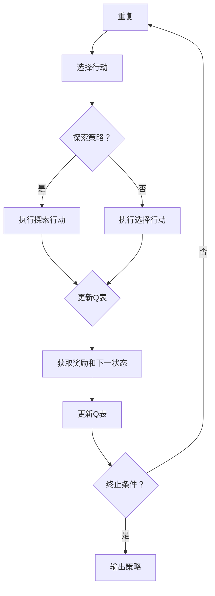
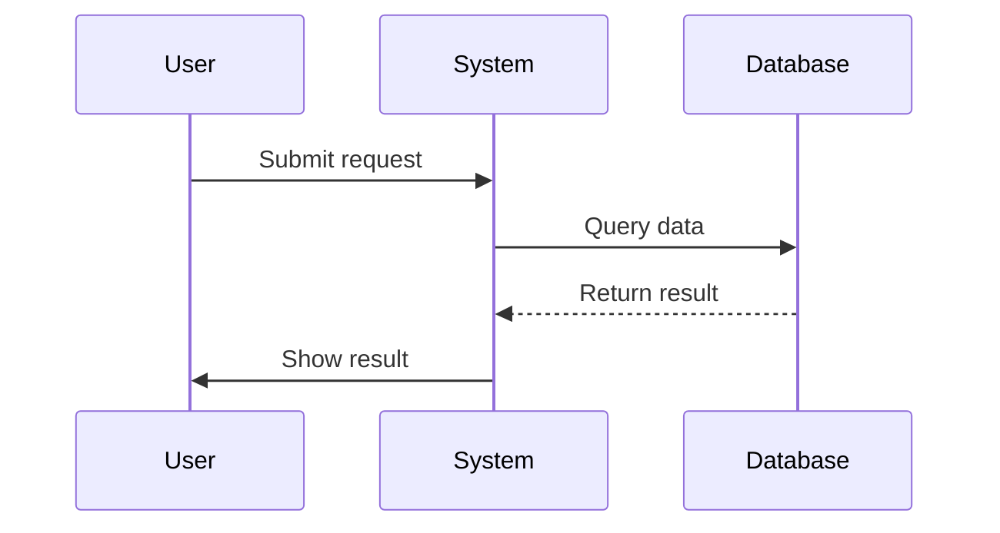
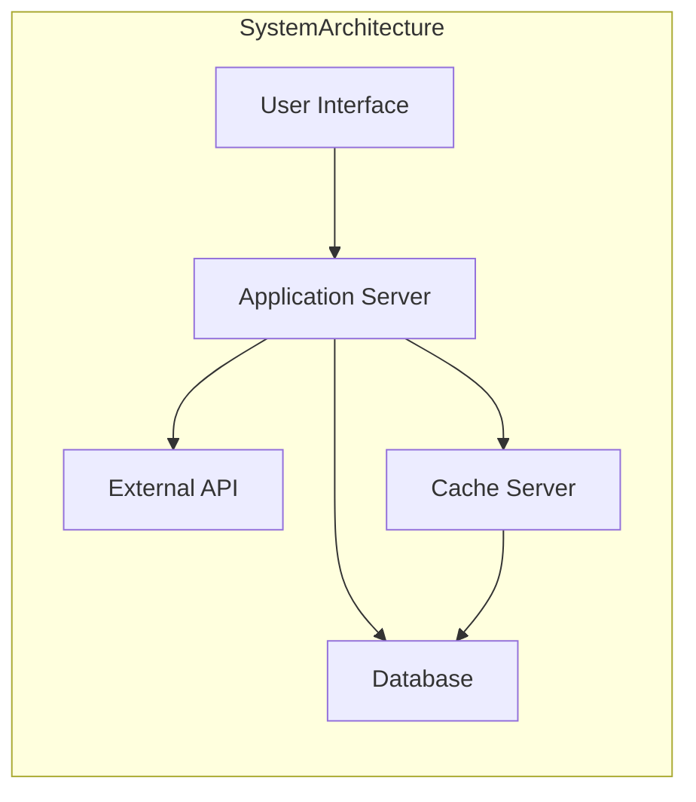

                 

## 文章标题：AI Agent中的强化学习与奖励塑造

> 关键词：强化学习、奖励塑造、AI Agent、智能代理、算法原理、应用实践

> 摘要：本文深入探讨了AI Agent中的强化学习与奖励塑造。首先，我们介绍了强化学习与奖励塑造的基本概念，随后详细分析了强化学习的理论框架和常见算法。接着，我们探讨了奖励塑造的方法及其设计技巧。通过应用案例，我们展示了强化学习和奖励塑造在AI Agent中的实际效果。最后，我们对未来强化学习和奖励塑造的发展趋势和挑战进行了展望。

----------------------------------------------------------------

### 引言

#### 1.1.1 强化学习与奖励塑造概述

强化学习（Reinforcement Learning，RL）是一种机器学习范式，通过智能体与环境的交互来学习如何采取行动，以实现最优长期奖励。奖励塑造（Reward Shaping）是强化学习中的一项重要技术，旨在通过调整奖励函数来改善智能体的学习过程，提高其性能。

AI Agent，又称智能代理，是能够自主完成任务的软件实体。强化学习与奖励塑造在AI Agent中的应用，使其能够更好地适应复杂环境，实现智能决策。

本文旨在系统地探讨强化学习与奖励塑造在AI Agent中的应用。我们将从基本概念、理论框架、算法原理、应用实践等方面进行全面分析，帮助读者深入理解这一领域。

#### 1.1.2 AI Agent的重要性

AI Agent作为人工智能的重要应用形式，具有广泛的应用前景。自动驾驶、游戏AI、智能家居等都是AI Agent的经典案例。随着人工智能技术的不断发展，AI Agent将在更多领域发挥重要作用。

强化学习与奖励塑造作为AI Agent的核心技术，能够显著提升智能代理的决策能力和学习效率。本文将围绕这一主题，详细介绍强化学习与奖励塑造的理论基础、方法技巧和应用实践，为读者提供全面、系统的指导。

#### 1.1.3 书籍的结构与目标

本文分为七个章节：

- **第1章 引言**：介绍强化学习与奖励塑造的基本概念，以及AI Agent的重要性。
- **第2章 强化学习基础**：分析强化学习的理论框架和常见算法。
- **第3章 奖励塑造方法**：探讨奖励塑造的方法及其设计技巧。
- **第4章 强化学习在AI Agent中的应用**：分析强化学习在AI Agent中的应用案例。
- **第5章 奖励塑造在AI Agent中的应用**：分析奖励塑造在AI Agent中的应用案例。
- **第6章 深入研究**：探讨复合强化学习与奖励塑造，以及面临的挑战。
- **第7章 结论**：总结本文的主要观点，提出未来研究方向。

本文的目标是：

- **深入理解强化学习与奖励塑造的基本概念和理论框架**；
- **掌握常见的强化学习算法和奖励塑造方法**；
- **了解强化学习与奖励塑造在AI Agent中的应用实践**；
- **为读者提供全面的指导，助力AI Agent的开发和应用**。

### 强化学习的基本概念

强化学习（Reinforcement Learning，RL）是一种机器学习范式，旨在通过智能体（Agent）与环境的交互，学习如何采取行动以实现最优长期奖励。与传统机器学习方法不同，强化学习强调基于奖励的决策过程，具有自主性和适应性。

#### 强化学习的定义

强化学习可以简单理解为一种“试错”的过程。智能体在环境中进行行动，根据环境的反馈（奖励或惩罚）调整自己的策略，以期望获得长期的最大化奖励。这一过程可以概括为：

$$
\text{智能体} \rightarrow \text{行动} \rightarrow \text{环境} \rightarrow \text{奖励/惩罚} \rightarrow \text{策略调整}
$$

#### 强化学习的主要组成部分

强化学习主要由以下几个核心组成部分构成：

1. **智能体（Agent）**：执行动作并接受环境反馈的主体。
2. **环境（Environment）**：提供状态和奖励的动态系统。
3. **状态（State）**：描述智能体在某一时刻所处的情境。
4. **行动（Action）**：智能体可采取的动作。
5. **奖励（Reward）**：描述智能体行动所带来的即时奖励或惩罚。
6. **策略（Policy）**：智能体基于当前状态采取的动作选择规则。
7. **值函数（Value Function）**：评估策略的优劣。
8. **模型（Model）**：描述环境状态转移和奖励分布的函数。

#### 强化学习与传统机器学习的区别

强化学习与传统机器学习（如监督学习和无监督学习）存在显著区别：

1. **学习目标**：传统机器学习侧重于学习输入和输出之间的映射关系，强化学习则关注如何通过决策过程实现长期奖励最大化。
2. **反馈机制**：传统机器学习依赖于已标记的训练数据，强化学习通过与环境交互获得即时反馈（奖励或惩罚）。
3. **动态适应性**：强化学习能够根据环境变化动态调整策略，传统机器学习则通常需要重新训练模型。
4. **探索与利用**：强化学习在探索未知状态和利用已知状态之间寻求平衡，传统机器学习则无需考虑这一问题。

#### 强化学习在AI领域的应用

强化学习在AI领域具有广泛的应用前景，以下是一些典型的应用案例：

1. **游戏AI**：例如，AlphaGo使用强化学习实现了围棋领域的突破性进展。
2. **自动驾驶**：强化学习可以用于自动驾驶车辆的路径规划与决策。
3. **机器人控制**：例如，机器人手臂的自主操作可以使用强化学习来实现。
4. **智能推荐系统**：强化学习可以帮助优化推荐算法，提高用户满意度。
5. **智能家居**：智能代理可以通过强化学习实现自动调节家居设备。

总之，强化学习为AI Agent提供了强大的决策能力，使其能够更好地适应复杂环境，实现智能化的自主行动。

### 奖励塑造的基本概念

奖励塑造（Reward Shaping）是强化学习中的一项重要技术，旨在通过调整奖励函数（Reward Function）来改善智能体的学习过程，提高其性能。奖励函数在强化学习中起着至关重要的作用，它不仅直接影响智能体的行为，还决定了智能体学习策略的效果。

#### 奖励塑造的定义

奖励塑造可以定义为一种在强化学习过程中，对奖励函数进行调整和优化的技术。奖励函数通常由环境设计者预设，但它可能并不总是能够准确反映智能体的目标和期望。奖励塑造的目的是通过调整奖励函数，使奖励信号更加清晰、有效，从而加速智能体的学习过程。

#### 奖励塑造的目标

奖励塑造的主要目标包括：

1. **引导智能体的学习过程**：通过调整奖励函数，可以引导智能体关注关键行为，避免不必要的探索。
2. **提高学习效率**：有效的奖励塑造可以减少智能体在学习过程中所需要经历的试错次数，加快收敛速度。
3. **避免不良行为**：通过调整奖励函数，可以鼓励智能体避免某些不良行为，防止过度优化或产生负面影响。

#### 奖励塑造与强化学习的关联

奖励塑造与强化学习密切相关，两者相辅相成。强化学习通过奖励信号来指导智能体的行为，而奖励塑造则通过调整奖励函数，优化奖励信号的质量。具体来说，奖励塑造在以下几个方面与强化学习相互关联：

1. **增强奖励信号**：奖励塑造可以通过增加奖励强度、缩短奖励间隔等方式，增强奖励信号，使智能体更容易捕捉到有价值的信息。
2. **减少奖励噪声**：环境中的奖励信号可能存在噪声和不确定性，奖励塑造可以通过滤波和归一化等方法，减少噪声对学习过程的影响。
3. **改进奖励结构**：奖励塑造可以调整奖励函数的形状和结构，使其更符合智能体的目标和期望，从而提高智能体的学习效果。
4. **促进探索与利用**：奖励塑造可以在探索阶段提供更强的奖励信号，鼓励智能体进行多样化的探索；在利用阶段，则可以通过调整奖励函数，平衡探索和利用，实现最优决策。

总之，奖励塑造是强化学习中不可或缺的一部分，它通过优化奖励函数，显著提升了智能体的学习效率和决策能力，为强化学习在现实世界中的应用提供了重要支持。

### 强化学习的理论框架

强化学习（Reinforcement Learning，RL）作为一种基于奖励驱动的机器学习范式，其核心在于智能体（Agent）通过与环境的交互来学习最佳策略。为了更好地理解和应用强化学习，我们需要深入探讨其理论框架，包括强化学习的数学模型、策略和值函数、马尔可夫决策过程（MDP）等。

#### 强化学习的数学模型

强化学习的数学模型是描述智能体、环境、状态、行动和奖励之间相互关系的基础。其主要组成部分包括：

1. **状态（State, \( s \)）**：智能体在某一时刻所处的环境状态。状态可以是离散的或连续的，例如，在一个简单的迷宫游戏中，状态可能包括智能体的位置和方向。
2. **行动（Action, \( a \)）**：智能体可采取的某种行为。行动同样可以是离散的或连续的，例如，智能体可以选择“向左”、“向右”或“前进”。
3. **策略（Policy, \( \pi(s, a) \)）**：智能体在给定状态下采取某一行动的概率分布。策略决定了智能体的行为模式，例如，智能体可以选择以50%的概率向左移动，以50%的概率向右移动。
4. **奖励（Reward, \( r(s, a) \)）**：智能体采取某一行动后，从环境中获得的即时奖励或惩罚。奖励可以是离散的或连续的，通常用于衡量智能体行为的好坏。
5. **状态转移概率（Transition Probability, \( p(s' | s, a) \)）**：智能体在当前状态下采取某一行动后，转移到下一状态的概率分布。状态转移概率描述了环境状态的变化。

#### 策略和值函数

在强化学习中，策略和值函数是两个核心概念：

1. **策略（Policy）**：策略决定了智能体在给定状态下应该采取的行动。策略可以表示为概率分布，即智能体在状态 \( s \) 下采取行动 \( a \) 的概率为 \( \pi(a | s) \)。常见的策略包括确定性策略（只有一条行动路径）和随机性策略（有多条行动路径）。

2. **值函数（Value Function）**：值函数用于评估策略的优劣，是强化学习中的另一个重要概念。值函数分为状态值函数（State-Value Function，\( v(s) \)）和动作值函数（Action-Value Function，\( q(s, a) \)）：

   - **状态值函数**：描述在状态 \( s \) 下采取最佳策略所能获得的期望奖励。状态值函数可以表示为：
     $$
     v(s) = \sum_{a} \pi(a | s) \cdot q(s, a)
     $$
   - **动作值函数**：描述在状态 \( s \) 下采取特定行动 \( a \) 所能获得的期望奖励。动作值函数可以表示为：
     $$
     q(s, a) = \sum_{s'} p(s' | s, a) \cdot r(s, a) + \gamma \cdot \max_{a'} q(s', a')
     $$
     其中，\( \gamma \) 是折扣因子，用于平衡即时奖励和未来奖励的重要性。

#### 马尔可夫决策过程（MDP）

马尔可夫决策过程（Markov Decision Process，MDP）是强化学习中的一个重要数学模型，它描述了智能体在不确定性环境中进行决策的过程。MDP由以下要素组成：

1. **状态集（State Set，\( S \)）**：智能体可以处于的所有可能状态集合。
2. **行动集（Action Set，\( A \)）**：智能体可以采取的所有可能行动集合。
3. **奖励函数（Reward Function，\( r(s, a) \)）**：描述智能体在状态 \( s \) 下采取行动 \( a \) 所获得的即时奖励。
4. **状态转移概率函数（State Transition Probability Function，\( p(s' | s, a) \)）**：描述智能体在状态 \( s \) 下采取行动 \( a \) 后转移到状态 \( s' \) 的概率。

MDP可以形式化地表示为：
$$
\begin{align*}
\text{MDP} &= \langle S, A, r, p, \gamma \rangle \\
s_t &\sim p(s_0) \\
a_t &\sim \pi(a_t | s_t) \\
s_{t+1} &\sim p(s_{t+1} | s_t, a_t) \\
r_t &\sim r(s_t, a_t) \\
\end{align*}
$$
其中，\( s_t \) 是在时刻 \( t \) 的状态，\( a_t \) 是在时刻 \( t \) 采取的行动，\( r_t \) 是在时刻 \( t \) 收到的奖励。

#### 强化学习的核心概念总结

- **智能体（Agent）**：执行行动并接受环境反馈的主体。
- **环境（Environment）**：提供状态和奖励的动态系统。
- **状态（State）**：描述智能体在某一时刻所处的情境。
- **行动（Action）**：智能体可采取的动作。
- **奖励（Reward）**：描述智能体行动所带来的即时奖励或惩罚。
- **策略（Policy）**：智能体基于当前状态采取的动作选择规则。
- **值函数（Value Function）**：评估策略的优劣。
- **模型（Model）**：描述环境状态转移和奖励分布的函数。

通过深入理解这些核心概念，我们可以更好地应用强化学习解决实际问题，实现智能体的自主学习和决策。

### 常见强化学习算法

强化学习算法是智能体在复杂环境中实现最优决策的关键工具。常见的强化学习算法主要包括Q-Learning、SARSA、Deep Q Network（DQN）、Policy Gradient和REINFORCE。这些算法各有特点，适用于不同类型的强化学习问题。

#### Q-Learning算法

Q-Learning是一种基于值函数的强化学习算法，其核心思想是通过学习状态-动作值函数（Q-值）来指导智能体的决策。Q-Learning的主要步骤如下：

1. **初始化Q-值表**：初始化所有状态-动作值（Q-值）为一个较小的常数。
2. **选择行动**：在给定状态下，根据当前策略选择一个行动。
3. **更新Q-值**：根据实际获得的奖励和下一个状态的信息，更新当前状态-动作的Q-值。
   $$
   Q(s, a) \leftarrow Q(s, a) + \alpha [r + \gamma \max_{a'} Q(s', a') - Q(s, a)]
   $$
   其中，\( \alpha \) 是学习率，\( \gamma \) 是折扣因子，\( r \) 是即时奖励。

Q-Learning的优点是简单易实现，能够处理离散状态和行动空间的问题。然而，Q-Learning的一个主要缺点是学习速度较慢，特别是在状态-行动空间非常大的情况下。

#### SARSA算法

SARSA（State-Action-Reward-State-Action）算法是一种基于策略的强化学习算法，其核心思想是通过同时考虑当前状态和下一个状态的信息来更新策略。SARSA算法的主要步骤如下：

1. **选择行动**：在给定状态下，根据当前策略选择一个行动。
2. **执行行动**：执行选定的行动，并观察下一状态和奖励。
3. **更新策略**：根据当前状态和下一状态的信息，更新策略。
   $$
   \pi(s, a) \leftarrow \begin{cases}
   1 & \text{if } a = \arg\max_a Q(s, a) \\
   0 & \text{otherwise}
   \end{cases}
   $$

SARSA算法的优点是能够同时更新策略和价值函数，具有较好的平衡性。然而，SARSA算法同样面临Q-Learning的缺点，即学习速度较慢。

#### Deep Q Network（DQN）算法

DQN（Deep Q Network）算法是一种基于深度学习的强化学习算法，其核心思想是使用深度神经网络来近似Q-值函数。DQN的主要步骤如下：

1. **初始化Q网络**：初始化深度神经网络，用于估计状态-动作值。
2. **选择行动**：使用动作选择策略（如ε-贪婪策略）在给定状态下选择一个行动。
3. **执行行动**：执行选定的行动，并观察下一状态和奖励。
4. **更新Q网络**：使用目标网络来稳定Q网络的学习过程，并更新Q网络。
   $$
   Q(s, a) \leftarrow Q(s, a) + \alpha [r + \gamma \max_{a'} Q(s', a') - Q(s, a)]
   $$

DQN算法的优点是能够处理高维状态空间和连续行动空间的问题，适用于复杂的强化学习任务。然而，DQN算法也存在一些挑战，如目标不稳定、学习效率低等。

#### Policy Gradient算法

Policy Gradient算法是一种基于策略的强化学习算法，其核心思想是通过直接优化策略来最大化长期奖励。Policy Gradient算法的主要步骤如下：

1. **初始化策略参数**：初始化策略参数。
2. **执行策略**：根据当前策略执行行动，并观察状态和奖励。
3. **更新策略参数**：通过梯度上升法更新策略参数，以最大化预期奖励。
   $$
   \theta \leftarrow \theta + \alpha \nabla_{\theta} J(\theta)
   $$
   其中，\( \theta \) 是策略参数，\( J(\theta) \) 是策略的预期奖励。

Policy Gradient算法的优点是直接优化策略，避免了值函数估计的复杂性。然而，Policy Gradient算法的一个主要缺点是对样本数据量要求较高，且在样本量不足时容易产生方差问题。

#### REINFORCE算法

REINFORCE算法是一种基于梯度的强化学习算法，其核心思想是通过梯度上升法直接优化策略。REINFORCE算法的主要步骤如下：

1. **初始化策略参数**：初始化策略参数。
2. **执行策略**：根据当前策略执行行动，并观察状态和奖励。
3. **更新策略参数**：通过梯度上升法更新策略参数，以最大化长期奖励。
   $$
   \theta \leftarrow \theta + \alpha \sum_{t} \nabla_{\theta} \log \pi(\theta | s_t, a_t) \cdot r_t
   $$

REINFORCE算法的优点是简单易实现，对数据量要求较低。然而，REINFORCE算法的一个主要缺点是梯度消失和梯度爆炸问题，特别是在状态和行动空间较大的情况下。

总之，这些常见的强化学习算法各具特点，适用于不同类型的强化学习问题。在实际应用中，根据具体任务和环境特点选择合适的算法，是取得良好效果的关键。

### 奖励塑造方法

奖励塑造（Reward Shaping）是强化学习中的重要技术，旨在通过调整奖励函数（Reward Function）来改善智能体的学习过程，提高其性能。有效的奖励塑造可以引导智能体关注关键行为，加速学习过程，避免不良行为。本文将介绍几种常见的奖励塑造方法，包括反向奖励塑造、目标奖励塑造和适应性奖励塑造，并讨论奖励函数设计技巧。

#### 反向奖励塑造

反向奖励塑造（Backward Reward Shaping）是一种通过调整奖励信号的强度和分布来引导智能体行为的奖励塑造方法。其主要思想是在学习过程中，通过识别智能体的成功行为，将这些行为对应的奖励信号增强，从而鼓励智能体重复这些行为。

1. **正向和负向奖励**：正向奖励（Positive Reward）用于鼓励智能体采取成功的行为，而负向奖励（Negative Reward）用于纠正智能体的错误行为。例如，在自动驾驶场景中，正向奖励可以用于奖励智能体成功避让障碍物，而负向奖励可以用于惩罚智能体未能及时刹车。

2. **奖励强度调整**：通过调整正向和负向奖励的强度，可以影响智能体的学习速度。增强正向奖励的强度可以加快智能体的学习过程，而增强负向奖励的强度可以防止智能体过度优化，导致学习过程不稳定。

3. **奖励分布调整**：通过调整奖励的分布，可以影响智能体的决策策略。例如，在连续控制任务中，可以采用高斯分布的奖励函数，使智能体在达到目标时获得较大的奖励，而在偏离目标时获得较小的奖励。

#### 目标奖励塑造

目标奖励塑造（Goal-Based Reward Shaping）是一种基于目标达成的奖励塑造方法。其主要思想是定义一个明确的目标，并设计奖励函数，以引导智能体向目标靠近。目标奖励塑造的关键在于定义目标函数和设计奖励函数。

1. **目标函数**：目标函数用于衡量智能体是否达到目标。例如，在机器人路径规划中，目标函数可以定义为目标位置与实际位置之间的距离。目标函数的值越接近零，表示智能体离目标越近。

2. **奖励函数**：奖励函数设计应与目标函数紧密相关。奖励函数通常采用分段函数的形式，根据智能体与目标之间的距离设置不同的奖励强度。例如，当智能体距离目标较远时，奖励函数可以设置较小的奖励；当智能体接近目标时，奖励函数可以设置较大的奖励，以鼓励智能体继续向目标靠近。

3. **多目标奖励塑造**：在多目标场景中，可以设计多个目标奖励函数，分别衡量智能体在不同方面的表现。例如，在自动驾驶中，可以同时考虑智能体的行驶速度、安全距离和能耗等目标。

#### 适应性奖励塑造

适应性奖励塑造（Adaptive Reward Shaping）是一种根据智能体的学习状态动态调整奖励函数的方法。其主要思想是随着智能体的学习过程，逐步调整奖励函数的强度和结构，以适应智能体的需求。

1. **动态调整奖励强度**：在智能体的学习初期，可以设置较高的奖励强度，以鼓励智能体进行大量探索。随着智能体的学习进步，逐步降低奖励强度，使智能体更专注于关键行为的优化。

2. **基于状态的奖励调整**：根据智能体在不同状态下的表现，动态调整奖励函数。例如，在机器人控制中，可以设置在不同运动状态（如静止、运动）下的不同奖励强度，以鼓励智能体在关键状态下采取正确行动。

3. **奖励结构优化**：通过分析智能体的学习过程，逐步优化奖励函数的结构，使其更符合智能体的目标。例如，在游戏AI中，可以逐步调整奖励函数，使其更关注胜利的关键因素，如得分、资源管理等。

#### 奖励函数设计技巧

有效的奖励函数设计是奖励塑造成功的关键。以下是一些常见的奖励函数设计技巧：

1. **明确性**：奖励函数应明确地反映智能体的目标，避免模糊或误导性奖励。

2. **平衡性**：奖励函数应平衡即时奖励和未来奖励，避免智能体过早或过晚地优化行为。

3. **多样性**：奖励函数应鼓励智能体的多样化行为，防止过度优化导致学习过程停滞。

4. **稳定性**：奖励函数应保持稳定，避免奖励信号突变，影响智能体的学习过程。

5. **可扩展性**：奖励函数应具有较好的可扩展性，能够适应不同任务和环境的需求。

总之，奖励塑造是强化学习中的重要技术，通过调整奖励函数，可以显著提升智能体的学习效率和性能。有效的奖励塑造方法包括反向奖励塑造、目标奖励塑造和适应性奖励塑造，同时需要结合具体任务和环境特点，设计合适的奖励函数。

### 强化学习在AI Agent中的应用

强化学习（Reinforcement Learning，RL）在AI Agent中的应用已经取得了显著的成果。AI Agent是指能够自主执行任务、与环境交互并作出决策的智能实体。强化学习为AI Agent提供了强大的决策能力，使其能够在复杂、动态的环境中实现最优行动。以下将分析强化学习在AI Agent中的应用，包括游戏AI、自动驾驶、机器人控制以及虚拟代理等。

#### 游戏AI

游戏AI是强化学习在AI Agent中的经典应用之一。通过强化学习，智能体可以学会如何在各种游戏中取得最优成绩。例如，著名的AlphaGo就是基于强化学习实现的。AlphaGo在围棋领域的突破性进展展示了强化学习在复杂游戏中的强大能力。具体来说，AlphaGo通过自我对弈（self-play）的方式，不断调整其策略，优化其决策过程。这种方法使得AlphaGo能够在短时间内学会复杂的围棋策略，并在对战中取得胜利。

在游戏AI中，强化学习的应用不仅限于棋类游戏，还扩展到了电子竞技（eSports）。例如，Dota 2 OpenAI Five团队使用强化学习训练的智能体在Dota 2比赛中取得了优异成绩，甚至超越了人类职业选手。这些应用展示了强化学习在游戏领域中的巨大潜力。

#### 自动驾驶

自动驾驶是另一个强化学习在AI Agent中的重要应用领域。自动驾驶车辆需要实时感知环境、理解道路状况，并作出快速、安全的决策。强化学习通过学习驾驶员的驾驶行为，使其能够学会如何在复杂交通环境中导航。

例如，Google的Waymo项目就使用了强化学习来训练自动驾驶车辆。Waymo通过在真实环境中收集大量驾驶数据，利用强化学习算法训练自动驾驶模型，使其能够处理各种复杂的驾驶场景。强化学习不仅提高了自动驾驶车辆的行驶安全性，还提高了其行驶效率。

此外，强化学习还可以用于交通流量管理。通过训练智能体学习最优的交通信号控制策略，可以优化城市交通流量，减少拥堵和交通事故。这一应用有助于提高城市交通的整体效率，改善市民的出行体验。

#### 机器人控制

机器人控制是强化学习的另一个重要应用领域。机器人需要在动态环境中完成复杂的任务，如搬运物品、焊接、组装等。强化学习通过让机器人与环境的交互，使其能够自主学习和优化行为。

例如，在机器人搬运物品的任务中，可以使用强化学习来训练机器人如何有效地抓取、搬运和放置物品。通过设计合适的奖励函数，可以鼓励机器人采取正确的行动，避免损坏物品或导致任务失败。

强化学习还可以用于无人机飞行控制。无人机需要在复杂的环境中飞行，如避开障碍物、完成指定任务等。通过强化学习，无人机可以学会如何在复杂环境中自主飞行，提高其飞行稳定性和任务执行效率。

#### 虚拟代理

虚拟代理是强化学习在AI Agent中应用的一个新兴领域。虚拟代理可以在虚拟环境中进行学习和训练，然后将学到的知识应用到现实世界。例如，在虚拟仿真环境中，可以训练智能体学习如何进行医疗诊断、手术治疗等任务。这些训练数据可以在实际应用中用于提高医生的决策能力和手术技能。

此外，虚拟代理还可以用于娱乐和教育领域。通过训练虚拟代理学习游戏玩法、角色扮演等，可以为用户提供更丰富、更有趣的虚拟体验。例如，虚拟代理可以用于训练玩家如何应对复杂游戏场景，提高游戏技能。

总之，强化学习在AI Agent中的应用已经取得了显著的成果，并将在未来继续扩展。通过强化学习，AI Agent能够更好地适应复杂环境，实现自主决策和优化行动，为各个领域带来创新和变革。

### 奖励塑造在AI Agent中的应用

奖励塑造（Reward Shaping）是强化学习（Reinforcement Learning，RL）中的一项重要技术，通过调整奖励函数来引导智能体的行为，优化其学习过程。在AI Agent中，奖励塑造的应用场景多样，能够显著提升智能体的性能和适应能力。以下将介绍几个典型的应用场景，包括智能推荐系统、个性化教育和医疗诊断等。

#### 智能推荐系统

智能推荐系统是奖励塑造在AI Agent中的重要应用之一。通过奖励塑造，智能推荐系统可以更好地理解用户的行为和偏好，提供更精准、个性化的推荐。

1. **奖励函数设计**：在智能推荐系统中，奖励函数通常设计为用户的点击率、购买转化率、停留时间等指标。例如，如果一个推荐的商品被用户点击，则给予智能代理一定的奖励；如果用户最终购买该商品，则给予更高的奖励。

2. **探索与利用**：通过奖励塑造，可以平衡智能推荐系统的探索与利用。在探索阶段，智能代理可以尝试推荐新的商品，积累更多的用户数据；在利用阶段，智能代理则根据用户的反馈和历史数据，优化推荐策略，提高推荐质量。

3. **多目标优化**：智能推荐系统往往需要同时优化多个目标，如点击率、购买转化率和用户满意度。通过设计复合奖励函数，可以平衡这些目标，使智能代理能够在多个维度上实现最优决策。

#### 个性化教育

个性化教育是奖励塑造在AI Agent中的另一个重要应用领域。通过奖励塑造，智能教育系统能够根据学生的特点和需求，提供个性化的学习资源和指导。

1. **奖励函数设计**：在个性化教育系统中，奖励函数可以基于学生的学习成果、学习进度和参与度等指标。例如，当学生完成一个学习任务时，给予一定的奖励；当学生参与课堂互动时，给予额外的奖励。

2. **动态调整**：通过奖励塑造，可以动态调整奖励函数的强度和结构，以适应学生的学习状态和需求。例如，当学生在某个知识点上取得显著进步时，可以增加该知识点的奖励强度，鼓励学生继续深入学习。

3. **多目标优化**：个性化教育系统需要同时优化学生的学习效果、学习效率和参与度。通过设计复合奖励函数，可以平衡这些目标，使智能教育系统能够在多个维度上实现最优决策。

#### 医疗诊断

医疗诊断是奖励塑造在AI Agent中的另一个关键应用领域。通过奖励塑造，智能医疗诊断系统能够更好地理解医学知识和临床数据，提供更准确、可靠的诊断结果。

1. **奖励函数设计**：在医疗诊断系统中，奖励函数可以基于医生的诊断准确率、诊断速度和患者满意度等指标。例如，当智能系统成功诊断出一个疾病时，给予一定的奖励；当智能系统提供的诊断建议被医生采纳并验证为正确时，给予更高的奖励。

2. **知识更新**：通过奖励塑造，可以激励智能医疗诊断系统不断学习和更新医学知识。例如，当智能系统成功诊断出一种罕见疾病时，给予系统额外的奖励，鼓励其积累和扩展医学知识库。

3. **多目标优化**：医疗诊断系统需要同时优化诊断准确性、诊断速度和患者满意度。通过设计复合奖励函数，可以平衡这些目标，使智能医疗诊断系统能够在多个维度上实现最优决策。

总之，奖励塑造在AI Agent中的应用场景丰富，能够通过优化奖励函数，提升智能体的性能和适应能力。在智能推荐系统、个性化教育和医疗诊断等领域，奖励塑造不仅提高了系统的服务质量，还为用户提供了更好的体验。

### 复合强化学习与奖励塑造

复合强化学习与奖励塑造是强化学习（Reinforcement Learning，RL）领域的一项重要研究方向，旨在结合多种强化学习和奖励塑造技术，以应对更复杂和多样化的应用需求。复合强化学习通过融合不同的算法和策略，增强了智能体在复杂环境中的适应能力和决策效果。以下将详细介绍复合强化学习算法和奖励塑造方法，以及它们在实际应用中的效果。

#### 复合强化学习算法

复合强化学习算法通过结合多种强化学习技术，形成了更加鲁棒和高效的决策模型。以下是几种常见的复合强化学习算法：

1. **双Q学习（Double Q-Learning）**：
   双Q学习是一种改进的传统Q-Learning算法，通过使用两个独立的Q值表来避免Q值表的偏差。在更新Q值时，一个Q值表用于选择当前动作，另一个Q值表用于估计下一个状态的最优动作。这种方法有效地减少了过度估计和偏差，提高了学习效率和收敛速度。

2. **优先经验回放（Prioritized Experience Replay）**：
   优先经验回放是DQN（Deep Q Network）的一种改进，通过引入优先级队列来存储和回放经验样本。高优先级的样本被回放的次数更多，从而提高了重要样本的影响，减少了噪声样本的影响，提高了学习效果。

3. **分布式强化学习（Distributed Reinforcement Learning）**：
   分布式强化学习通过将强化学习任务分解为多个子任务，并在不同的计算节点上并行训练。这种方法可以显著提高训练速度和扩展性，特别适用于需要大规模训练数据的复杂应用场景。

4. **集成强化学习（Integrated Reinforcement Learning）**：
   集成强化学习通过结合多种强化学习算法，形成一个统一的决策框架。这种方法可以结合不同算法的优势，优化决策过程，提高智能体的适应能力。

#### 复合奖励塑造方法

复合奖励塑造方法通过结合多种奖励塑造技术，设计了更加精细和灵活的奖励函数，以适应不同应用场景的需求。以下是几种常见的复合奖励塑造方法：

1. **多目标奖励塑造**：
   多目标奖励塑造通过同时优化多个目标，实现了更全面的决策优化。这种方法通常设计多个奖励函数，分别衡量不同的目标，并通过加权求和的方式组合成复合奖励函数。例如，在自动驾驶中，可以同时考虑行驶安全性、能耗效率和乘客满意度等目标。

2. **适应性奖励塑造**：
   适应性奖励塑造通过根据智能体的学习状态和任务进展动态调整奖励函数。这种方法可以根据不同的阶段和任务需求，灵活调整奖励函数的强度和结构，从而提高智能体的学习效率和性能。

3. **目标导向奖励塑造**：
   目标导向奖励塑造通过设计明确的目标函数，引导智能体向目标靠近。这种方法通过设置短期和长期目标，逐步优化智能体的行为，使其能够快速适应环境变化。

4. **奖励压缩与扩展**：
   奖励压缩与扩展通过调整奖励信号的强度和分布，使其更加适合智能体的学习过程。例如，在连续控制任务中，可以通过压缩奖励信号的方差，使其更加集中，从而提高学习效率。

#### 实际应用效果

复合强化学习与奖励塑造在多个实际应用中展现了出色的效果。以下是一些具体的案例：

1. **自动驾驶**：
   自动驾驶系统通过复合强化学习与奖励塑造，实现了复杂交通环境下的自适应驾驶。复合奖励函数结合了安全性、效率和乘客满意度等多个目标，使自动驾驶车辆能够在各种复杂路况下安全行驶，提高行驶效率和乘客体验。

2. **工业自动化**：
   工业自动化系统通过复合强化学习与奖励塑造，实现了对复杂生产过程的自主控制和优化。复合强化学习算法结合了多种控制策略，使自动化系统能够快速适应不同的生产任务，提高生产效率和质量。

3. **游戏AI**：
   游戏AI通过复合强化学习与奖励塑造，实现了在复杂游戏场景中的高智能行为。复合奖励函数结合了游戏得分、玩家体验等多个目标，使游戏AI能够快速学习和适应不同的游戏策略，提高游戏胜率。

4. **医疗诊断**：
   医疗诊断系统通过复合强化学习与奖励塑造，实现了对医疗数据的精准分析和诊断。复合奖励函数结合了诊断准确性、诊断速度和医生满意度等多个目标，使医疗诊断系统能够提供更准确、可靠的诊断结果。

总之，复合强化学习与奖励塑造通过结合多种强化学习和奖励塑造技术，显著提升了智能体的适应能力和决策效果。在实际应用中，复合强化学习与奖励塑造为各种复杂任务提供了高效的解决方案，展示了广阔的应用前景。

### 强化学习与奖励塑造的挑战与未来

尽管强化学习（Reinforcement Learning，RL）与奖励塑造在AI Agent领域取得了显著进展，但仍面临一系列挑战和限制。理解这些挑战对于推动该领域的发展至关重要。

#### 挑战

1. **探索与利用平衡**：强化学习的一个核心问题是如何在探索新行为和利用已学习行为之间找到最佳平衡。过度探索可能导致智能体长时间无法达到稳定状态，而过度利用则可能使智能体陷入次优策略。

2. **样本效率**：强化学习通常需要大量交互数据来学习有效的策略。然而，对于复杂环境，收集足够的样本数据可能非常耗时和昂贵。提高样本效率是一个重要的研究方向。

3. **稀疏奖励问题**：在某些任务中，奖励信号非常稀疏，即智能体需要执行大量无效行动后才能获得一次有效的奖励。这会导致学习过程缓慢，甚至停滞。

4. **可解释性和可解释性**：强化学习模型的决策过程往往是非透明的，这对于理解和信任智能体行为至关重要。提高模型的可解释性是一个重要挑战。

5. **长期奖励与短期奖励的权衡**：在许多应用中，智能体需要在短期内获得奖励和长期最大化总奖励之间做出权衡。设计有效的奖励函数来平衡这两个目标是复杂的。

#### 未来研究方向

1. **高效探索策略**：研究新型探索策略，如基于模型的无模型探索方法、基于策略的探索方法等，以在减少探索时间的同时提高学习效率。

2. **强化学习与深度学习的结合**：深度强化学习（Deep Reinforcement Learning）已经取得了显著进展，但如何更好地结合深度学习和强化学习，提高模型的泛化能力和鲁棒性，仍然是一个重要的研究方向。

3. **多任务学习**：开发能够处理多个任务和不同环境的多任务强化学习算法，以提升智能体在不同场景下的适应能力。

4. **可解释性增强**：研究如何提高强化学习模型的解释性，使其决策过程更加透明和可理解，从而增强用户对智能体信任。

5. **奖励工程**：探索更加精细和动态的奖励工程方法，设计能够更好地引导智能体行为的奖励函数。

6. **混合智能系统**：将强化学习与其他智能方法（如规划、进化算法等）相结合，构建混合智能系统，以应对更复杂的决策场景。

总之，强化学习与奖励塑造在AI Agent领域具有广阔的发展前景，通过解决现有挑战和推动未来研究，我们将能够开发出更加智能、高效的智能代理系统，为各行各业带来变革性影响。

### 结论

本文系统地探讨了AI Agent中的强化学习与奖励塑造，从基本概念、理论框架到实际应用，进行了全面的分析。通过介绍强化学习的数学模型、常见算法以及奖励塑造的方法，我们深入理解了强化学习与奖励塑造在AI Agent中的应用和价值。强化学习为AI Agent提供了强大的决策能力，使其能够在复杂环境中实现最优行动；而奖励塑造则通过优化奖励函数，显著提升了智能体的学习效率和性能。

本文的主要贡献在于：

1. **全面梳理**：系统地梳理了强化学习与奖励塑造的基本概念、理论框架和常见算法，为读者提供了全面的指导。
2. **案例分析**：通过多个应用案例，展示了强化学习和奖励塑造在实际场景中的效果，有助于读者理解其具体应用。
3. **未来展望**：对强化学习和奖励塑造在AI Agent领域的发展趋势和潜在挑战进行了展望，为未来研究提供了方向。

为了进一步学习强化学习和奖励塑造，读者可以：

1. **深入学习理论**：阅读相关经典教材和论文，掌握强化学习和奖励塑造的深层次原理。
2. **实践项目开发**：参与实际项目，通过动手实践来加深理解，探索新的应用场景。
3. **关注最新研究**：关注领域内的最新进展，了解新型算法和技术的发展动态。

总之，强化学习与奖励塑造是AI Agent领域的重要研究方向，通过不断学习和实践，我们将能够开发出更加智能、高效的AI Agent，为各行各业带来创新和变革。

### 对读者的建议

本文旨在帮助读者深入理解强化学习与奖励塑造在AI Agent中的应用，以下是一些建议，以帮助读者进一步探索这一领域。

1. **深入学习相关教材**：
   - 推荐阅读《Reinforcement Learning: An Introduction》（理查德·S·萨顿和塞巴斯蒂安·托马舍夫斯基著），该书系统地介绍了强化学习的基本概念、算法和应用。
   - 参考论文《Algorithms for Reinforcement Learning》（赛斯·斯洛特金著），了解强化学习的最新研究进展。

2. **实践项目开发**：
   - 尝试实现强化学习算法，如Q-Learning、DQN等，通过实际编程来理解算法原理和实现细节。
   - 参与开源项目，如OpenAI Gym，通过现有环境进行强化学习实验，探索不同算法在真实场景中的表现。

3. **关注领域动态**：
   - 定期阅读顶级会议和期刊，如NeurIPS、ICML、JMLR，了解最新的研究动态和前沿技术。
   - 关注领域内知名专家的博客和论文，如理查德·萨顿、塞巴斯蒂安·托马舍夫斯基等的最新工作。

4. **参加线上课程和研讨会**：
   - 注册参加在线课程，如Coursera、edX上的强化学习课程，系统学习理论知识。
   - 参加学术研讨会和会议，与同行交流，拓展视野，获取最新研究信息。

5. **拓展相关技术**：
   - 学习深度强化学习（Deep Reinforcement Learning）、分布式强化学习等高级主题。
   - 掌握Python等编程语言，熟悉TensorFlow、PyTorch等深度学习框架。

通过上述建议，读者可以系统地提升自己在强化学习与奖励塑造领域的知识和技能，为未来的研究和应用打下坚实基础。

### 附录

#### 算法流程图

以下是一个基于Mermaid语言的强化学习算法流程图示例：



#### 数学公式

以下是一个使用LaTeX格式的数学公式示例：

$$
Q(s, a) = r(s, a) + \gamma \max_{a'} Q(s', a')
$$

其中，\( Q(s, a) \) 是状态-动作值函数，\( r(s, a) \) 是即时奖励，\( \gamma \) 是折扣因子，\( s' \) 是下一状态，\( a' \) 是下一行动。

#### 类图

以下是一个使用Mermaid语言的类图示例，用于表示强化学习系统中的核心类：

```mermaid
classDiagram
    Class01 <|-- Class02
    Class03 : Creates Class04
    Class05 <.. Class04
    Class06 << Interface Class07
    Class08 .. Class09
    Class10 <-|{Dependency} Class11
```

#### 架构设计图

以下是一个使用Mermaid语言的架构设计图示例：



#### 系统架构设计图

以下是一个使用Mermaid语言的系统架构设计图示例：



通过这些附录，读者可以更好地理解文中提到的算法原理、数学公式和系统架构设计，进一步巩固学习成果。

