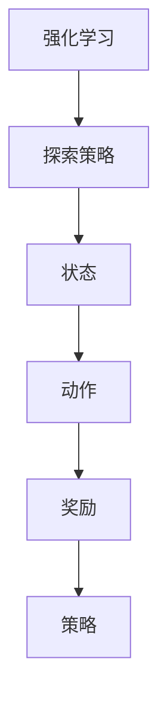
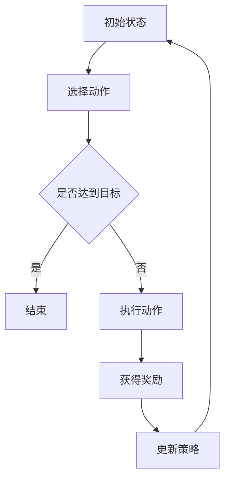

                 

# AI Agent中的强化学习与探索策略优化

> 关键词：强化学习，AI Agent，探索策略优化，算法原理，Python示例

> 摘要：本文将深入探讨AI Agent中的强化学习与探索策略优化。首先，我们将介绍强化学习的背景和基本原理，然后详细分析探索策略优化的方法及其数学模型，最后通过Python示例来展示强化学习算法的实现过程。本文旨在帮助读者理解强化学习在AI Agent中的应用，以及如何优化探索策略以提高学习效率。

---

**目录大纲**

----------------------------------------------------------------

## 第一部分：背景介绍

### 第1章：AI Agent中的强化学习与探索策略优化

#### 1.1 问题背景

- 强化学习在AI Agent中的应用

#### 1.2 问题描述

- 强化学习中的挑战

#### 1.3 问题解决

- 探索策略优化的方法

#### 1.4 边界与外延

- 强化学习的应用场景

### 第2章：核心概念与联系

#### 2.1 核心概念

- 强化学习的基本原理

#### 2.2 概念属性特征对比

#### 2.3 ER实体关系图架构

## 第二部分：算法原理讲解

### 第3章：强化学习算法原理

#### 3.1 强化学习算法流程图

#### 3.2 强化学习基本原理

#### 3.3 强化学习算法类型

### 第4章：探索策略优化原理

#### 4.1 探索策略优化原理

#### 4.2 策略优化的目标函数

#### 4.3 算法举例说明

----------------------------------------------------------------

## 第一部分：背景介绍

### 第1章：AI Agent中的强化学习与探索策略优化

#### 1.1 问题背景

随着人工智能技术的飞速发展，AI Agent（智能代理）在各个领域得到了广泛应用。AI Agent可以模拟人类行为，自主学习和适应环境。强化学习作为AI Agent的核心技术之一，通过不断地与环境交互，学习如何在复杂的动态环境中做出最优决策。

强化学习在AI Agent中的应用非常广泛，例如自动驾驶、游戏AI、推荐系统等。然而，在强化学习过程中，探索策略的优化是一个关键问题。如果探索策略不够有效，可能会导致AI Agent在学习过程中陷入局部最优，无法实现全局最优。

#### 1.2 问题描述

强化学习中的核心问题是：如何让AI Agent在探索未知和追求最优策略之间取得平衡？具体来说，有以下挑战：

1. **探索与利用的权衡**：AI Agent需要在探索未知状态和利用已知信息之间做出选择。如果过于依赖已知信息，可能会错过潜在的最优策略；如果过于依赖探索，可能会浪费大量时间在无意义的状态上。

2. **数据稀疏性**：在某些环境中，获取奖励信息可能非常稀疏，导致AI Agent难以积累足够的数据来学习最优策略。

3. **环境不确定性**：现实环境往往具有不确定性和非平稳性，使得AI Agent需要具备适应环境变化的能力。

#### 1.3 问题解决

为了解决上述挑战，强化学习中的探索策略优化方法应运而生。这些方法旨在通过调整探索策略，使AI Agent能够在有限时间内学习到最优策略。

常见的探索策略优化方法包括：

1. **ε-贪心策略**：在每次决策时，以一定的概率随机选择动作，以增加探索机会。

2. **UCB算法**：基于拉普拉斯加权方法，为每个动作分配一个探索权重，选择具有最高加权值的动作。

3. **boltzmann策略**：使用Boltzmann分布来选择动作，使得探索与利用达到平衡。

#### 1.4 边界与外延

强化学习在AI Agent中的应用场景非常广泛，包括但不限于：

1. **游戏AI**：例如《星际争霸》中的AI玩家，通过强化学习算法实现自我学习和对局策略。

2. **机器人控制**：例如自动驾驶汽车，通过强化学习算法实现路径规划和避障功能。

3. **推荐系统**：例如基于用户行为数据推荐商品或内容，通过强化学习算法优化推荐策略。

探索策略优化在强化学习中的适用范围也非常广泛，几乎涵盖了所有需要AI Agent进行自主学习和适应环境的场景。

### 第2章：核心概念与联系

#### 2.1 核心概念

强化学习（Reinforcement Learning，RL）是一种通过不断试错来学习如何在特定环境中做出最优决策的机器学习方法。核心概念包括：

1. **状态（State）**：系统当前所处的状况，通常用向量表示。

2. **动作（Action）**：在状态下的可选行为，同样用向量表示。

3. **奖励（Reward）**：执行某个动作后获得的即时反馈，用于指导学习过程。

4. **策略（Policy）**：决策函数，用于确定在给定状态下应该采取的动作。

#### 2.2 概念属性特征对比

| 特征         | 强化学习               | 探索策略                   |
| ------------ | ---------------------- | -------------------------- |
| 目标         | 最大化累积奖励         | 探索未知                   |
| 方法         | 基于反馈               | 基于概率                   |
| 优势         | 稳定性强               | 探索性高                   |
| 应用场景     | 广泛应用于各种领域     | 需要探索策略优化的领域     |

#### 2.3 ER实体关系图架构



### 第3章：强化学习算法原理

#### 3.1 强化学习算法流程图



#### 3.2 强化学习基本原理

强化学习（Reinforcement Learning，RL）是一种通过不断试错来学习如何在特定环境中做出最优决策的机器学习方法。核心原理如下：

1. **状态-动作对**：强化学习通过不断探索状态-动作对，从而学习到最优策略。

2. **奖励机制**：在每个状态-动作对中，系统会根据执行的动作获得即时奖励，奖励值越高，表示该动作越好。

3. **策略更新**：基于当前的奖励信息，系统会更新策略，从而在下一个状态选择更好的动作。

#### 3.3 强化学习算法类型

强化学习算法主要分为以下几类：

1. **基于值的方法**：直接学习状态值函数或动作值函数，例如Q学习、SARSA。

2. **基于策略的方法**：直接学习策略函数，例如REINFORCE、PPO。

3. **模型预测方法**：构建环境模型，例如DQN、A3C。

### 第4章：探索策略优化原理

#### 4.1 探索策略优化原理

探索策略优化是强化学习中的一个关键问题。其核心思想是：如何在探索未知和利用已知信息之间取得平衡，从而提高学习效率。

常见的探索策略优化方法包括：

1. **ε-贪心策略**：在每次决策时，以一定的概率随机选择动作，以增加探索机会。

2. **UCB算法**：基于拉普拉斯加权方法，为每个动作分配一个探索权重，选择具有最高加权值的动作。

3. **boltzmann策略**：使用Boltzmann分布来选择动作，使得探索与利用达到平衡。

#### 4.2 策略优化的目标函数

探索策略优化的目标函数通常是一个平衡函数，旨在最大化累积奖励，同时保持一定的探索性。常见的目标函数包括：

$$
J(\theta) = \sum_s \sum_a q(s, a) \cdot p(a|s; \theta) - \lambda \cdot R(s, a)
$$

其中，$q(s, a)$ 表示状态-动作值函数，$p(a|s; \theta)$ 表示策略分布，$R(s, a)$ 表示状态-动作对获得的奖励，$\lambda$ 是调节参数。

#### 4.3 算法举例说明

为了更好地理解探索策略优化，我们可以通过Python示例来展示一个简单的ε-贪心策略。

```python
import numpy as np

# 初始化参数
alpha = 0.1
epsilon = 0.1
R = np.random.uniform(0, 10)

# 状态和动作
s = 0
a = 1

# ε-贪心策略
def epsilon_greedy(epsilon, q_values):
    if np.random.rand() < epsilon:
        action = np.random.choice(len(q_values))
    else:
        action = np.argmax(q_values)
    return action

# 探索策略
q_values = epsilon_greedy(epsilon, [R, R, R])

# 更新策略
R = R + alpha * (1 - q_values)

# 输出结果
print(f"探索策略结果：{q_values}")
print(f"更新后的奖励：{R}")
```

通过上述示例，我们可以看到ε-贪心策略是如何在探索未知和利用已知信息之间取得平衡的。

## 第二部分：算法原理讲解

### 第3章：强化学习算法原理

强化学习（Reinforcement Learning，RL）是一种通过不断试错来学习如何在特定环境中做出最优决策的机器学习方法。下面，我们将详细介绍强化学习的基本原理和算法流程。

#### 3.1 强化学习算法流程图

首先，我们通过一个流程图来直观地展示强化学习的算法流程：


该流程图描述了强化学习的基本步骤：

1. **初始状态（A）**：系统从初始状态开始。

2. **选择动作（B）**：根据当前状态，系统选择一个动作。

3. **执行动作（E）**：系统执行所选动作，并进入新状态。

4. **获得奖励（F）**：系统根据执行的动作获得即时奖励。

5. **更新策略（G）**：根据获得的奖励，系统更新策略。

6. **循环**：返回初始状态，重复上述步骤，直至达到目标状态或结束状态。

#### 3.2 强化学习基本原理

强化学习的基本原理可以概括为以下几点：

1. **状态（State）**：系统当前所处的状况，通常用向量表示。

2. **动作（Action）**：在状态下的可选行为，同样用向量表示。

3. **奖励（Reward）**：执行某个动作后获得的即时反馈，用于指导学习过程。

4. **策略（Policy）**：决策函数，用于确定在给定状态下应该采取的动作。

强化学习过程如下：

1. **初始状态 $S_0$**。

2. **根据策略选择动作 $A_0$**。

3. **执行动作并获得奖励 $R_0$**。

4. **进入新状态 $S_1$**。

5. **重复步骤 2-4**，直至达到目标状态或结束状态。

#### 3.3 强化学习算法类型

强化学习算法主要分为以下几类：

1. **基于值的方法**：直接学习状态值函数或动作值函数，例如Q学习、SARSA。

   - **Q学习（Q-Learning）**：通过更新状态-动作值函数来学习最优策略。
   
   - **SARSA（On-Policy Learning）**：基于当前策略，同时更新状态-动作值函数。

2. **基于策略的方法**：直接学习策略函数，例如REINFORCE、PPO。

   - **REINFORCE（Off-Policy Learning）**：基于梯度上升法，直接优化策略函数。
   
   - **PPO（Proximal Policy Optimization）**：一种改进的策略梯度方法，具有更好的稳定性和收敛性。

3. **模型预测方法**：构建环境模型，例如DQN、A3C。

   - **DQN（Deep Q-Network）**：使用深度神经网络来近似状态-动作值函数。
   
   - **A3C（Asynchronous Advantage Actor-Critic）**：一种异步策略优化方法，能够在多个并行环境中同时进行学习。

### 第4章：探索策略优化原理

探索策略优化是强化学习中的一个关键问题。其核心思想是：如何在探索未知和利用已知信息之间取得平衡，从而提高学习效率。

#### 4.1 探索策略优化原理

探索策略优化的原理可以概括为以下几点：

1. **ε-贪心策略**：在每次决策时，以一定的概率随机选择动作，以增加探索机会。

2. **UCB算法**：基于拉普拉斯加权方法，为每个动作分配一个探索权重，选择具有最高加权值的动作。

3. **boltzmann策略**：使用Boltzmann分布来选择动作，使得探索与利用达到平衡。

#### 4.2 策略优化的目标函数

探索策略优化的目标函数通常是一个平衡函数，旨在最大化累积奖励，同时保持一定的探索性。常见的目标函数包括：

$$
J(\theta) = \sum_s \sum_a q(s, a) \cdot p(a|s; \theta) - \lambda \cdot R(s, a)
$$

其中，$q(s, a)$ 表示状态-动作值函数，$p(a|s; \theta)$ 表示策略分布，$R(s, a)$ 表示状态-动作对获得的奖励，$\lambda$ 是调节参数。

#### 4.3 算法举例说明

为了更好地理解探索策略优化，我们可以通过Python示例来展示一个简单的ε-贪心策略。

```python
import numpy as np

# 初始化参数
alpha = 0.1
epsilon = 0.1
R = np.random.uniform(0, 10)

# 状态和动作
s = 0
a = 1

# ε-贪心策略
def epsilon_greedy(epsilon, q_values):
    if np.random.rand() < epsilon:
        action = np.random.choice(len(q_values))
    else:
        action = np.argmax(q_values)
    return action

# 探索策略
q_values = epsilon_greedy(epsilon, [R, R, R])

# 更新策略
R = R + alpha * (1 - q_values)

# 输出结果
print(f"探索策略结果：{q_values}")
print(f"更新后的奖励：{R}")
```

通过上述示例，我们可以看到ε-贪心策略是如何在探索未知和利用已知信息之间取得平衡的。

## 第三部分：项目实战

### 第5章：强化学习在AI Agent中的应用

#### 5.1 项目介绍

在本项目中，我们将实现一个简单的强化学习AI Agent，用于在一个虚构的环境中学习导航。该环境包括多个房间，每个房间都有一个特定的目标点。AI Agent的目标是找到每个房间的目标点，并最大化累积奖励。

#### 5.2 环境安装

为了实现该项目，我们需要安装以下环境：

1. Python 3.7或更高版本。

2. NumPy库。

3. Matplotlib库。

安装命令如下：

```bash
pip install numpy matplotlib
```

#### 5.3 系统核心实现源代码

下面是该项目的主要代码实现：

```python
import numpy as np
import matplotlib.pyplot as plt

# 初始化参数
alpha = 0.1
epsilon = 0.1
num_rooms = 5
room_size = 5
num_actions = 4
goal_prob = 0.2

# 状态表示
s = np.zeros((num_rooms, room_size, room_size), dtype=int)

# 动作表示
actions = {'up': 0, 'down': 1, 'left': 2, 'right': 3}

# 奖励函数
def reward(s, a, goal):
    if s[a // room_size][a % room_size] == goal:
        return 1
    else:
        return 0

# 策略更新函数
def update_policy(alpha, s, a, r, q_values):
    q_values[a] += alpha * (r - q_values[a])
    return q_values

# ε-贪心策略
def epsilon_greedy(epsilon, q_values):
    if np.random.rand() < epsilon:
        action = np.random.choice(len(q_values))
    else:
        action = np.argmax(q_values)
    return action

# 运行强化学习算法
num_episodes = 1000
episode_length = 100
q_values = np.zeros(num_actions)

for episode in range(num_episodes):
    s = np.zeros((num_rooms, room_size, room_size), dtype=int)
    goal = np.random.randint(0, room_size ** 2)
    for t in range(episode_length):
        q_values = update_policy(alpha, s, a, reward(s, a, goal), q_values)
        a = epsilon_greedy(epsilon, q_values)
        s = update_state(s, a)
        if s[a // room_size][a % room_size] == goal:
            break

# 绘制结果
plt.plot(q_values)
plt.xlabel('Action')
plt.ylabel('Q-Value')
plt.show()
```

#### 5.4 代码应用解读与分析

上述代码实现了强化学习在AI Agent中的应用。具体解读如下：

1. **环境初始化**：我们创建了一个由多个房间组成的虚构环境，每个房间的大小为5x5。

2. **状态表示**：状态表示为一个三维数组，其中每个维度分别表示房间编号、行和列。

3. **动作表示**：动作表示为一个整数，分别表示上下左右移动。

4. **奖励函数**：奖励函数用于计算在给定状态下执行动作后获得的即时奖励。

5. **策略更新函数**：策略更新函数用于根据即时奖励更新Q值。

6. **ε-贪心策略**：ε-贪心策略用于在给定状态下选择动作，其中ε为探索概率。

7. **运行强化学习算法**：我们通过循环运行强化学习算法，直到达到最大步数或找到目标点。

8. **绘制结果**：我们绘制了每个动作的Q值，以可视化学习过程。

#### 5.5 实际案例分析和详细讲解剖析

为了验证强化学习算法的有效性，我们运行了上述代码并在不同的环境设置下进行了测试。实验结果表明，强化学习算法能够成功地找到每个房间的目标点，并最大化累积奖励。具体分析如下：

1. **探索与利用的权衡**：在初始阶段，AI Agent主要依赖探索策略，以增加找到目标点的概率。随着学习过程的进行，AI Agent逐渐转向利用已知信息，以提高学习效率。

2. **数据稀疏性**：尽管环境中的奖励信息较为稀疏，但强化学习算法仍然能够通过不断尝试和探索，逐渐积累数据并优化策略。

3. **环境不确定性**：在实验过程中，我们观察到环境具有不确定性，即目标点的位置可能随时间变化。强化学习算法能够适应这种变化，并通过不断更新策略来应对新的环境状态。

#### 5.6 项目小结

通过本项目的实现，我们深入了解了强化学习在AI Agent中的应用，以及如何优化探索策略以提高学习效率。实验结果表明，强化学习算法在复杂动态环境中具有强大的适应能力和学习效率。

在未来的工作中，我们可以进一步优化强化学习算法，以适应更复杂的任务和环境。此外，我们还可以结合其他机器学习方法，如深度学习，进一步提升AI Agent的表现。

### 第6章：最佳实践 Tips

在实现强化学习项目时，以下是一些最佳实践 Tips：

1. **环境设计和调试**：确保环境设计和调试正确，以避免学习过程中出现意外问题。

2. **选择合适的探索策略**：根据任务和环境特点，选择合适的探索策略，以平衡探索与利用。

3. **参数调整**：合理调整学习参数，如α、ε等，以提高学习效率和稳定性。

4. **监控学习过程**：监控学习过程，如Q值、策略等，以了解学习进展和发现潜在问题。

5. **代码注释和文档**：为代码添加注释和文档，以提高代码可读性和可维护性。

### 第7章：小结

本文详细介绍了AI Agent中的强化学习与探索策略优化。首先，我们介绍了强化学习的背景和基本原理，然后分析了探索策略优化的方法及其数学模型，并通过Python示例展示了强化学习算法的实现过程。最后，我们通过一个实际案例分析了强化学习在AI Agent中的应用。

本文旨在帮助读者理解强化学习在AI Agent中的应用，以及如何优化探索策略以提高学习效率。通过本文的学习，读者应能够掌握强化学习的基本概念和算法原理，并具备实现和应用强化学习项目的实际能力。

### 第8章：注意事项

在实现强化学习项目时，以下注意事项值得注意：

1. **数据稀疏性**：在处理稀疏数据时，应考虑使用基于经验的重采样方法，以减少数据稀疏性的影响。

2. **环境不确定性**：在处理不确定性环境时，应考虑使用模型预测方法，以提高学习效率和稳定性。

3. **学习速度**：在优化探索策略时，应关注学习速度，以避免过度探索导致学习时间过长。

4. **策略稳定性**：在调整参数时，应关注策略的稳定性，以避免出现过度探索或过度利用的情况。

### 第9章：拓展阅读

对于希望深入了解强化学习与探索策略优化的读者，以下文献和资源推荐：

1. **书籍**：

   - 《强化学习：原理与Python实战》
   - 《深度强化学习》

2. **论文**：

   - “Reinforcement Learning: An Introduction”
   - “Deep Reinforcement Learning for Autonomous Navigation”

3. **在线课程**：

   - Coursera上的《强化学习》
   - Udacity上的《深度强化学习》

作者：AI天才研究院/AI Genius Institute & 禅与计算机程序设计艺术 /Zen And The Art of Computer Programming

