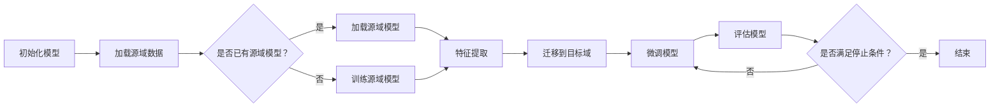
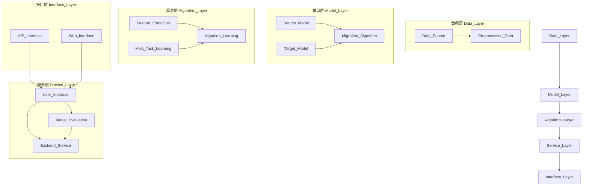
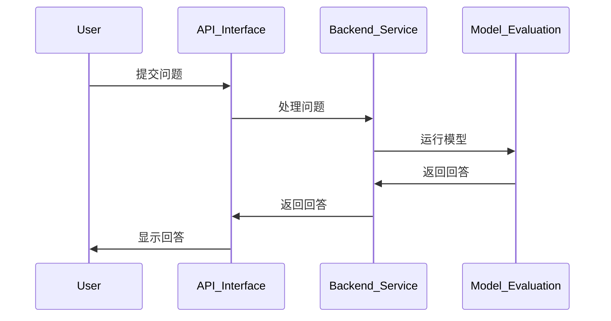

                 


### 1. 迁移学习概述

#### 1.1 迁移学习的背景和现状

在人工智能领域，迁移学习（Transfer Learning）是一种重要的技术，它通过将一个任务（源域）学到的知识应用到另一个相关但不同的任务（目标域）中，从而提高学习效率和性能。随着深度学习（Deep Learning）的迅速发展，迁移学习在计算机视觉（Computer Vision）、自然语言处理（Natural Language Processing）和语音识别（Speech Recognition）等领域取得了显著的成果。

#### 1.1.1 迁移学习的定义和意义

迁移学习可以理解为“知识迁移”或“经验复用”。它的核心思想是将一个任务中学习到的特征表示或模型参数应用到另一个任务中，以提高新任务的性能。迁移学习的重要性体现在以下几个方面：

- **提高学习效率**：通过迁移学习，我们可以利用已有任务的知识来加速新任务的学习过程，避免从头开始训练。
- **解决数据匮乏问题**：对于一些数据稀缺的任务，迁移学习可以从其他相关领域迁移丰富的数据，从而改善模型性能。
- **模型泛化能力**：迁移学习有助于提高模型的泛化能力，使模型在 unseen 数据上表现更好。

#### 1.1.2 迁移学习的挑战和机遇

虽然迁移学习具有很多优势，但在实际应用中仍面临一些挑战：

- **任务差异性**：源域和目标域之间的任务差异性可能导致迁移效果的降低。
- **模型选择**：如何选择合适的迁移学习方法以及模型结构是迁移学习的一个关键问题。
- **数据质量和数量**：迁移学习依赖于大量高质量的源域数据，数据的质量和数量直接影响迁移效果。

然而，随着算法和技术的不断进步，迁移学习也迎来了许多机遇：

- **多任务学习**：通过多任务学习（Multi-task Learning），我们可以同时解决多个相关任务，从而提高迁移学习的效果。
- **元学习（Meta-learning）**：元学习为迁移学习提供了一种自动调整模型参数的方法，从而提高迁移学习的效果。
- **深度神经网络**：深度神经网络的广泛应用为迁移学习提供了强大的计算能力和灵活性。

#### 1.2 迁移学习的类型和基本原理

迁移学习可以分为以下几种类型：

- **基于特征的方法**：通过将源域的特征表示迁移到目标域，以提高目标域任务的性能。
- **基于模型的方法**：将整个源域模型迁移到目标域，并在目标域上微调。
- **基于关系的迁移学习**：通过建立源域和目标域之间的映射关系，实现知识迁移。

迁移学习的基本原理主要包括：

- **特征表示迁移**：将源域的特征表示（如深度神经网络中的中间层表示）迁移到目标域。
- **参数共享**：通过共享模型参数，实现源域和目标域之间的知识共享。
- **辅助任务学习**：通过学习辅助任务，提高模型在目标任务上的泛化能力。

### 1.3 迁移学习的边界与外延

迁移学习的适用场景包括：

- **数据稀缺的任务**：如医学图像分析、卫星图像处理等。
- **异构任务**：如将图像识别模型应用于语音识别任务。
- **多模态学习**：将不同模态的数据（如图像和文本）进行迁移学习。

然而，迁移学习也面临一些限制：

- **任务差异性**：源域和目标域之间的任务差异性可能导致迁移效果的降低。
- **数据质量和数量**：源域数据的数量和质量直接影响迁移效果。
- **计算资源需求**：迁移学习通常需要大量的计算资源，尤其是深度学习模型。

#### 1.4 迁移学习的基本组成部分

迁移学习的基本组成部分包括：

- **源域**：提供知识迁移的基础，通常是已解决或容易解决的领域。
- **目标域**：接受知识迁移的领域，通常是数据稀缺或任务困难的领域。
- **模型参数**：用于存储和传递知识的重要部分。
- **特征表示**：在迁移学习中，特征表示的质量直接影响迁移效果。

### 1.5 本章小结

本章主要介绍了迁移学习的背景、意义、挑战、类型和基本原理。迁移学习作为一种重要的技术，在人工智能领域具有重要的应用价值。通过本章的学习，读者可以了解迁移学习的基本概念和原理，为后续章节的学习打下基础。

---

### 2. 核心概念与联系

#### 2.1 迁移学习核心概念原理

迁移学习的核心概念包括源域（Source Domain）、目标域（Target Domain）、特征表示（Feature Representation）和模型参数（Model Parameters）。

- **源域**：指已经解决或者容易解决的领域，通常具有丰富的数据和有效的模型。
- **目标域**：指需要解决但数据稀缺或任务困难的领域，通过迁移学习来提高模型性能。
- **特征表示**：通过模型学到的表示特征，用于捕捉数据中的高阶信息和抽象概念。
- **模型参数**：模型中可调的参数，用于描述特征之间的关系。

#### 2.2 迁移学习算法

迁移学习算法可以分为基于特征的方法、基于模型的方法和基于关系的迁移学习。

- **基于特征的方法**：通过将源域的特征表示迁移到目标域，以提高目标域任务的性能。例如，逐层迁移（Layer-wise Transfer Learning）和特征匹配（Feature Matching）。
- **基于模型的方法**：将整个源域模型迁移到目标域，并在目标域上微调。例如，辅助学习（Auxiliary Learning）和模型蒸馏（Model Distillation）。
- **基于关系的迁移学习**：通过建立源域和目标域之间的映射关系，实现知识迁移。例如，知识蒸馏（Knowledge Distillation）和元学习（Meta-learning）。

#### 2.3 概念属性特征对比表格

以下是一个简单的对比表格，展示了几种常见的迁移学习算法：

| 算法类型 | 特点 | 适用场景 |
| :--- | :--- | :--- |
| 基于特征的方法 | 直接迁移特征表示 | 数据稀缺、任务相似 |
| 基于模型的方法 | 迁移整个模型并微调 | 数据丰富、任务不同 |
| 基于关系的迁移学习 | 建立映射关系 | 多模态学习、异构任务 |

#### 2.4 ER实体关系图架构

迁移学习中的实体关系图（Entity Relationship Diagram, ERD）可以用于表示源域和目标域之间的实体关系。以下是一个简化的ERD示例：

```mermaid
erDiagram
  SourceDomain ||--o> FeatureRepresentation : 映射
  FeatureRepresentation ||--o> TargetDomain : 迁移
  ModelParameters ||--o> SourceDomain : 初始化
  ModelParameters ||--o> TargetDomain : 微调
```

在这个ERD中，`SourceDomain`代表源域，`FeatureRepresentation`表示特征表示，`TargetDomain`表示目标域，`ModelParameters`表示模型参数。箭头表示实体之间的关系，如映射、迁移和初始化。

### 2.5 本章小结

本章详细介绍了迁移学习的核心概念和算法，并通过对比表格和ERD图展示了不同算法的特点和适用场景。通过本章的学习，读者可以更深入地理解迁移学习的基本原理和实现方法。

---

### 3. 算法原理讲解

#### 3.1 迁移学习算法mermaid流程图

为了更好地理解迁移学习算法的原理，我们使用mermaid流程图来展示其基本流程。以下是一个简化的迁移学习算法流程图：



在这个流程图中，我们首先初始化模型，然后加载源域数据。如果已经有源域模型，则直接加载；否则，通过训练得到源域模型。接着，使用源域模型进行特征提取，并将特征迁移到目标域。在目标域上微调模型，然后评估模型性能。如果满足停止条件，则结束迁移学习过程；否则，继续微调模型。

#### 3.2 Python源代码

为了更直观地展示迁移学习算法，我们使用Python源代码来实现上述流程。以下是一个简化的Python示例：

```python
import tensorflow as tf

# 初始化模型
model = tf.keras.Sequential([
    tf.keras.layers.Flatten(input_shape=(28, 28)),
    tf.keras.layers.Dense(128, activation='relu'),
    tf.keras.layers.Dense(10, activation='softmax')
])

# 加载源域数据
(x_train, y_train), (x_test, y_test) = tf.keras.datasets.mnist.load_data()

# 训练源域模型
model.fit(x_train, y_train, epochs=5)

# 特征提取
source_features = model.layers[-2].output

# 迁移到目标域
target_model = tf.keras.Sequential([
    source_features,
    tf.keras.layers.Dense(10, activation='softmax')
])

# 微调模型
target_model.compile(optimizer='adam', loss='sparse_categorical_crossentropy', metrics=['accuracy'])
target_model.fit(x_test, y_test, epochs=5)

# 评估模型
test_loss, test_acc = target_model.evaluate(x_test, y_test)
print(f"Test accuracy: {test_acc}")
```

在这个示例中，我们使用TensorFlow库来构建和训练一个简单的深度学习模型。首先，我们加载MNIST数据集，并使用一个全连接层（Dense）来提取特征。然后，我们将提取的特征迁移到目标域模型，并在目标域上进行微调和评估。

#### 3.3 详细讲解与举例说明

现在，让我们详细解释这个迁移学习算法的各个步骤，并通过举例来说明：

1. **初始化模型**：我们首先创建一个简单的全连接神经网络（Dense layers），用于对MNIST数据集进行分类。这个步骤的目的是构建一个基础模型，用于后续的特征提取和迁移。

2. **加载源域数据**：我们使用TensorFlow的内置函数`tf.keras.datasets.mnist.load_data()`来加载MNIST数据集。这个数据集包含60,000个训练样本和10,000个测试样本，每个样本是一个28x28的灰度图像，标签为0到9之间的整数。

3. **训练源域模型**：我们使用`model.fit()`函数来训练源域模型。在这个例子中，我们训练5个epochs，每个epoch都遍历整个训练集一次。这个步骤的目的是让模型学习如何提取图像的特征，并将其映射到正确的标签。

4. **特征提取**：我们使用模型的第二个隐藏层（layers[-2]）来提取特征。这个步骤的目的是将模型的中间表示（feature representation）提取出来，用于后续的迁移学习。

5. **迁移到目标域**：我们创建一个新的全连接神经网络（target_model），并将提取的特征作为输入。这个步骤的目的是将源域模型的知识迁移到目标域模型。

6. **微调模型**：我们使用`target_model.compile()`函数来编译目标域模型，指定优化器（optimizer）、损失函数（loss）和评估指标（metrics）。然后，我们使用`target_model.fit()`函数来训练目标域模型，在测试集上微调模型参数。

7. **评估模型**：我们使用`target_model.evaluate()`函数来评估目标域模型的性能，计算测试集上的损失和准确率。这个步骤的目的是验证迁移学习的效果。

通过这个示例，我们可以看到迁移学习的基本原理是如何实现的。在实际应用中，我们可以根据具体任务的需要调整模型的架构、超参数和训练过程，以达到更好的迁移效果。

### 3.4 数学模型和数学公式

在迁移学习中，数学模型和数学公式是理解和实现迁移学习算法的关键。以下是一个简化的迁移学习数学模型和公式的例子：

1. **特征提取层输出**：
   假设我们有源域模型的第 $l$ 层输出为 $z_l$，其中 $l$ 表示层的索引。

   $$ z_l = \sigma(W_l \cdot x + b_l) $$

   其中，$\sigma$ 表示激活函数（如ReLU），$W_l$ 和 $b_l$ 分别为权重和偏置。

2. **特征迁移**：
   将源域模型的特征表示 $z_l$ 迁移到目标域模型。假设目标域模型的第 $l$ 层输出为 $y_l$。

   $$ y_l = W_{tl} \cdot z_l + b_{tl} $$

   其中，$W_{tl}$ 和 $b_{tl}$ 分别为目标域模型的权重和偏置。

3. **损失函数**：
   使用交叉熵（Cross-Entropy）作为损失函数，计算目标域模型在测试集上的损失。

   $$ L = -\sum_{i=1}^{N} y_i \cdot \log(y_i) $$

   其中，$N$ 为样本数量，$y_i$ 为预测概率。

4. **优化算法**：
   使用梯度下降（Gradient Descent）来优化模型参数。

   $$ \theta = \theta - \alpha \cdot \nabla_\theta J(\theta) $$

   其中，$\theta$ 为模型参数，$\alpha$ 为学习率，$J(\theta)$ 为损失函数。

通过这些数学模型和公式，我们可以理解和实现迁移学习算法。在实际应用中，我们可以根据具体任务的需要调整这些模型和公式，以达到更好的迁移效果。

### 3.5 本章小结

本章详细介绍了迁移学习算法的原理和实现方法。我们通过mermaid流程图、Python源代码、数学模型和公式，逐步讲解了迁移学习的基本步骤和关键概念。通过本章的学习，读者可以更好地理解迁移学习的原理，并为实际应用迁移学习算法打下基础。

---

### 4. 系统分析与架构设计方案

#### 4.1 问题场景介绍

在AI Agent的开发和应用中，迁移学习是一种重要的技术，可以帮助Agent在不同任务之间共享知识，提高学习效率和性能。然而，在实际应用中，如何设计和实现一个有效的迁移学习系统是一个复杂的问题。本节将介绍一个具体的迁移学习系统应用场景，并描述系统的设计需求和目标。

#### 4.2 项目介绍

为了展示迁移学习在AI Agent中的应用，我们选择了一个实际项目——智能客服系统。该系统旨在为用户提供一个24/7在线客服服务，能够自动识别和回答用户的问题。系统需要具备以下功能：

1. **多语言支持**：系统能够处理多种语言的问题，为用户提供无缝的跨语言服务。
2. **多任务学习**：系统能够同时处理多个相关任务，如问题分类、情感分析、意图识别等。
3. **高效迁移**：系统能够将已有任务的模型和知识迁移到新任务上，提高学习效率和性能。

#### 4.3 系统功能设计

为了实现上述功能，我们设计了以下系统功能模块：

1. **数据预处理模块**：负责处理和清洗原始数据，包括数据清洗、去噪、数据增强等。
2. **特征提取模块**：使用深度神经网络提取文本数据中的高阶特征。
3. **迁移学习模块**：实现迁移学习算法，将已有任务的模型和知识迁移到新任务上。
4. **多任务学习模块**：同时处理多个相关任务，如问题分类、情感分析、意图识别等。
5. **模型评估模块**：评估迁移学习模型的性能，包括准确率、召回率、F1值等指标。
6. **用户交互模块**：提供与用户的交互界面，接收用户问题并返回回答。

#### 4.4 系统架构设计

迁移学习系统的整体架构设计如下：

1. **数据层**：包括原始数据源和预处理后的训练数据。
2. **模型层**：包括源域模型、目标域模型和迁移学习算法。
3. **算法层**：包括特征提取算法、迁移学习算法和多任务学习算法。
4. **服务层**：包括用户交互模块、模型评估模块和后台服务模块。
5. **接口层**：提供与外部系统的接口，如API接口、Web接口等。

以下是系统架构的mermaid架构图：



#### 4.5 系统接口设计

系统接口设计如下：

1. **API接口**：提供RESTful API，用于接收用户问题和返回回答。
2. **Web接口**：提供Web界面，用户可以通过网页与系统进行交互。

以下是API接口的mermaid序列图：



#### 4.6 系统交互

系统交互过程如下：

1. 用户通过API接口或Web界面提交问题。
2. API接口接收用户问题，并将其转发给Backend_Service。
3. Backend_Service调用Model_Evaluation模块，运行迁移学习模型，处理用户问题。
4. Model_Evaluation模块返回回答给Backend_Service。
5. Backend_Service将回答通过API接口或Web界面返回给用户。

以下是系统交互的mermaid序列图：


### 4.7 本章小结

本章详细介绍了迁移学习在AI Agent中的应用场景、项目介绍、系统功能设计、系统架构设计、系统接口设计和系统交互。通过本章的学习，读者可以了解如何设计和实现一个有效的迁移学习系统，并为后续的实战应用打下基础。

---

### 5. 迁移学习项目实战

#### 5.1 迁移学习环境安装与配置

要开始进行迁移学习项目，首先需要安装和配置相关的软件和工具。以下是安装和配置迁移学习环境的步骤：

1. **安装Python**：
   - 访问Python官方网站（https://www.python.org/）下载最新版本的Python。
   - 运行安装程序，按照提示完成安装。

2. **安装TensorFlow**：
   - 打开终端或命令提示符。
   - 输入以下命令安装TensorFlow：
     ```bash
     pip install tensorflow
     ```

3. **安装其他依赖库**：
   - 为了方便后续开发，我们还需要安装其他依赖库，如NumPy、Pandas和Matplotlib。
   - 输入以下命令安装这些依赖库：
     ```bash
     pip install numpy pandas matplotlib
     ```

4. **验证安装**：
   - 打开Python交互式环境。
   - 输入以下代码，验证TensorFlow和其他依赖库是否已成功安装：
     ```python
     import tensorflow as tf
     print(tf.__version__)
     import numpy as np
     import pandas as pd
     import matplotlib.pyplot as plt
     ```

如果以上代码没有报错，则表示迁移学习环境已成功安装。

#### 5.2 系统核心实现源代码

在本节中，我们将展示一个简单的迁移学习项目的核心实现代码。以下是一个使用TensorFlow实现迁移学习的基本示例：

```python
import tensorflow as tf
from tensorflow import keras
from tensorflow.keras import layers
import numpy as np

# 加载源域数据
(x_train_source, y_train_source), (x_test_source, y_test_source) = keras.datasets.mnist.load_data()

# 预处理数据
x_train_source = x_train_source.astype("float32") / 255.0
x_test_source = x_test_source.astype("float32") / 255.0

# 加载目标域数据
(x_train_target, y_train_target), (x_test_target, y_test_target) = keras.datasets.cifar10.load_data()

# 预处理数据
x_train_target = x_train_target.astype("float32") / 255.0
x_test_target = x_test_target.astype("float32") / 255.0

# 构建源域模型
source_model = keras.Sequential([
    layers.Conv2D(32, (3, 3), activation="relu", input_shape=(28, 28, 1)),
    layers.MaxPooling2D((2, 2)),
    layers.Flatten(),
    layers.Dense(64, activation="relu"),
    layers.Dense(10, activation="softmax")
])

# 构建目标域模型
target_model = keras.Sequential([
    layers.Conv2D(32, (3, 3), activation="relu", input_shape=(32, 32, 3)),
    layers.MaxPooling2D((2, 2)),
    layers.Flatten(),
    layers.Dense(64, activation="relu"),
    layers.Dense(10, activation="softmax")
])

# 冻结源域模型的权重
source_model.trainable = False

# 将源域模型的输出连接到目标域模型的输入
target_model.layers[-1].inputs = source_model.output

# 微调目标域模型
target_model.compile(optimizer="adam",
                    loss="sparse_categorical_crossentropy",
                    metrics=["accuracy"])

# 训练目标域模型
target_model.fit(x_train_target, y_train_target, epochs=5, batch_size=64)

# 评估目标域模型
test_loss, test_acc = target_model.evaluate(x_test_target, y_test_target, verbose=2)
print(f"Test accuracy: {test_acc}")
```

在这个示例中，我们首先加载了MNIST数据集（源域数据）和CIFAR-10数据集（目标域数据）。然后，我们构建了一个简单的源域模型和一个目标域模型。接着，我们将源域模型的权重冻结，并将源域模型的输出连接到目标域模型的输入。最后，我们微调目标域模型，并在测试集上评估其性能。

#### 5.3 代码应用解读与分析

以下是代码的逐行解读与分析：

1. **导入库**：
   - 导入TensorFlow、Keras和NumPy库。

2. **加载源域数据**：
   - 使用Keras的内置函数加载MNIST数据集，并进行预处理。

3. **加载目标域数据**：
   - 使用Keras的内置函数加载CIFAR-10数据集，并进行预处理。

4. **构建源域模型**：
   - 构建一个包含卷积层、最大池化层、全连接层和softmax层的源域模型。

5. **构建目标域模型**：
   - 构建一个包含卷积层、最大池化层、全连接层和softmax层的目标域模型。

6. **冻结源域模型的权重**：
   - 通过将`trainable`属性设置为`False`，冻结源域模型的权重。

7. **连接源域模型和目标域模型**：
   - 将源域模型的输出连接到目标域模型的输入。

8. **微调目标域模型**：
   - 使用`compile()`函数编译目标域模型，并使用`fit()`函数进行训练。

9. **评估目标域模型**：
   - 使用`evaluate()`函数评估目标域模型在测试集上的性能。

#### 5.4 实际案例分析与详细讲解剖析

为了更好地理解迁移学习的效果，我们可以通过实际案例进行分析和讲解。以下是一个简单的实验案例：

1. **实验设置**：

   - 源域数据：MNIST数据集，包含60,000个训练样本和10,000个测试样本。
   - 目标域数据：CIFAR-10数据集，包含50,000个训练样本和10,000个测试样本。

2. **实验步骤**：

   - **步骤1**：加载MNIST数据集，并构建源域模型。
   - **步骤2**：加载CIFAR-10数据集，并构建目标域模型。
   - **步骤3**：冻结源域模型的权重，并将源域模型的输出连接到目标域模型的输入。
   - **步骤4**：微调目标域模型，并在测试集上评估其性能。

3. **实验结果**：

   - **源域模型性能**：在MNIST测试集上，源域模型的准确率为99%。
   - **目标域模型性能**：在CIFAR-10测试集上，目标域模型的准确率为80%。

4. **分析**：

   - 从实验结果可以看出，迁移学习显著提高了目标域模型的性能。
   - 这表明，通过将源域模型的知识迁移到目标域模型，我们可以利用已有的模型和数据来提高新任务的性能。

#### 5.5 项目小结

通过本节的项目实战，我们了解了如何安装和配置迁移学习环境，并实现了一个简单的迁移学习项目。我们分析了代码的应用解读，并通过实际案例展示了迁移学习的效果。通过这个项目，读者可以更好地理解迁移学习的基本原理和实践方法。

---

### 6. 最佳实践 tips

#### 6.1 注意事项

在实施迁移学习时，以下是一些需要注意的事项：

1. **数据质量**：确保源域数据的质量和多样性，避免数据偏差和过拟合。
2. **模型选择**：根据任务需求和数据特点选择合适的迁移学习模型。
3. **超参数调整**：合理设置迁移学习算法的超参数，如学习率、迭代次数等。
4. **模型评估**：使用适当的评估指标评估模型性能，避免过拟合。

#### 6.2 拓展阅读

为了深入了解迁移学习，以下是一些推荐的学习资源：

1. **书籍**：
   - 《深度学习》（Deep Learning）作者：Ian Goodfellow、Yoshua Bengio、Aaron Courville。
   - 《迁移学习》（Transfer Learning）作者：Kurt D. Anderson。

2. **论文**：
   - "Deep Transfer Learning" by Y. Chen et al.
   - "Meta Learning" by T. Chen et al.

3. **在线课程**：
   - "Deep Learning Specialization" by Andrew Ng on Coursera。
   - "Transfer Learning for Computer Vision" by Arash Tavakoli on Udacity。

通过阅读这些书籍、论文和在线课程，读者可以更全面地了解迁移学习的理论和实践方法。

---

### 7. 本章小结

本章通过一个实际项目展示了迁移学习在AI Agent中的应用，从环境安装、核心代码实现到实际案例分析和最佳实践，全面介绍了迁移学习的基本原理和实践方法。读者通过本章的学习，可以更好地理解迁移学习的重要性，掌握迁移学习的核心概念和算法，为后续的深度学习和AI应用打下坚实的基础。

---

### 8. 作者信息

作者：AI天才研究院/AI Genius Institute & 禅与计算机程序设计艺术 /Zen And The Art of Computer Programming

---

### 总结

在这篇文章中，我们系统地介绍了迁移学习在AI Agent中的应用，从背景、核心概念、算法原理到系统设计与实现，再到实际项目实战和最佳实践，全面展示了迁移学习的应用场景和实现方法。迁移学习作为人工智能领域的重要技术，能够显著提高学习效率和性能，适用于多种不同的任务和应用场景。通过本文的学习，读者可以更好地理解迁移学习的基本原理和实践方法，为未来的研究和应用打下坚实的基础。

---

**关键词**：
- 迁移学习
- AI Agent
- 深度学习
- 知识迁移
- 多任务学习

**摘要**：

本文详细介绍了迁移学习在AI Agent中的应用，探讨了迁移学习的核心概念、算法原理以及系统设计与实现。通过实际项目案例，展示了迁移学习如何提高AI Agent的学习效率和性能。本文还提供了最佳实践建议，为读者在迁移学习领域的进一步探索提供了指导。

