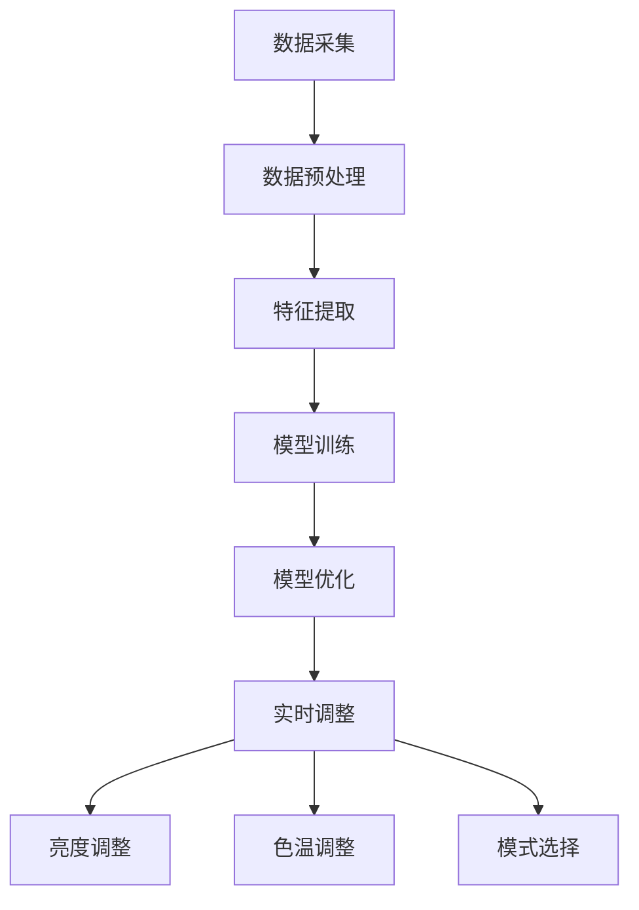
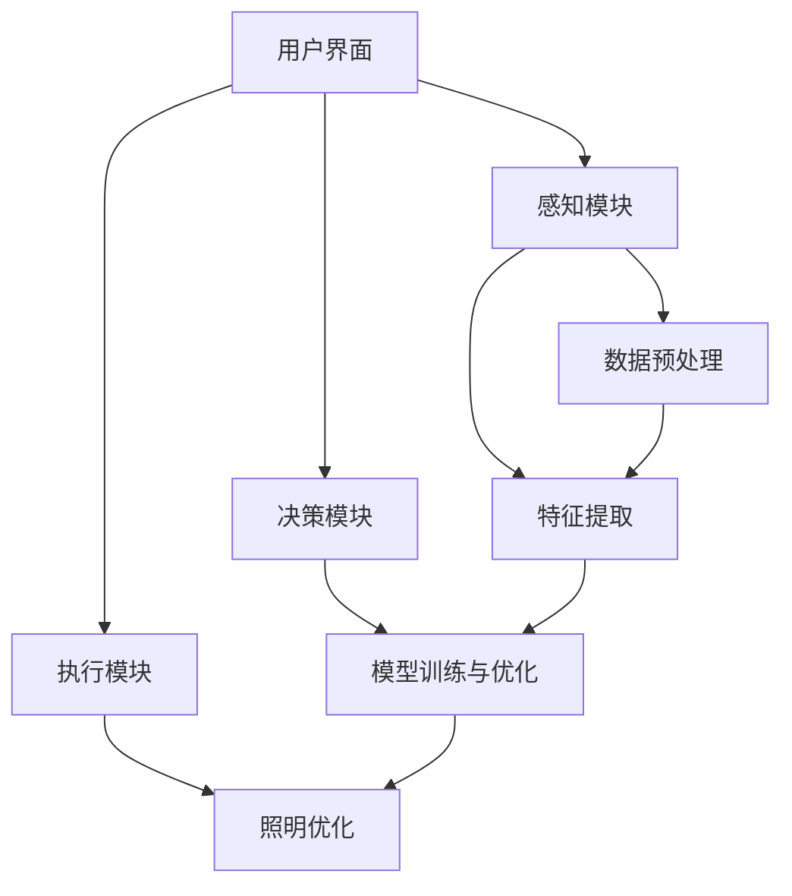
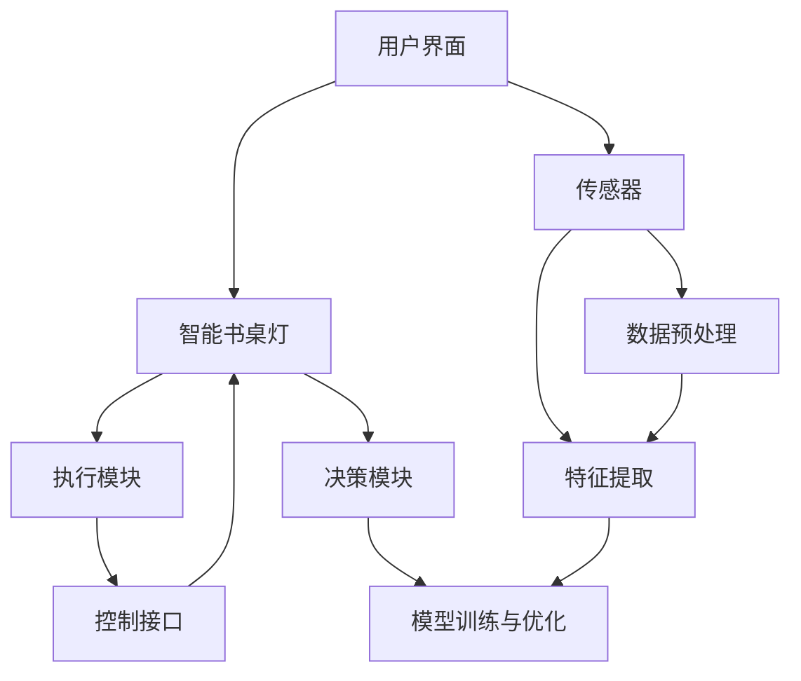

                 

### 第一部分：背景介绍

#### 问题背景

在现代社会，智能书桌灯已经逐渐成为办公和学习环境中的重要组成部分。传统的智能书桌灯具备基本的智能调节功能，如定时开关、亮度调节和色温调节等。然而，这些功能大多依赖于预设的规则或用户手动操作，无法实现真正的智能化和个性化。

随着人工智能（AI）技术的迅速发展，AI Agent作为一种智能实体，被广泛应用于各种场景，包括智能家居、自动驾驶、机器人等领域。AI Agent具有自主决策、适应性和学习性等特点，能够模拟人类的决策过程，为用户提供更加智能化的服务。

#### 问题描述

智能书桌灯的照明优化主要包括以下几个方面：亮度调节、色温调整和照明模式选择。然而，传统智能书桌灯的照明优化往往依赖于预设的规则或用户手动调节，无法实现真正的智能化和个性化。具体来说，问题表现为：

1. **亮度调节问题**：传统智能书桌灯的亮度调节通常是固定的，无法根据用户的具体需求和实际环境光线自动调整。这会导致在光线较暗的环境中，照明不足；而在光线较亮的环境中，照明过度，影响用户舒适度。
2. **色温调整问题**：传统智能书桌灯的色温调节功能多为手动操作，无法根据用户的需求和环境光线自动调整。这可能导致用户在长时间使用过程中产生视觉疲劳。
3. **照明模式选择问题**：传统智能书桌灯的照明模式多为预设，用户无法根据个人习惯和需求自定义照明模式。这会导致用户在特定场景下无法获得最佳的照明效果。

#### 问题解决

AI Agent可以通过学习用户的行为模式、环境光照条件等因素，自动调整智能书桌灯的亮度、色温等参数，实现个性化的照明体验。具体解决措施包括：

1. **用户行为模式学习**：AI Agent可以分析用户的使用习惯和偏好，如阅读、写作、办公等场景下的光线需求，自动调整亮度、色温等参数。
2. **环境光照条件感知**：AI Agent可以感知周围环境的光照变化，如室外阳光、室内灯光等，自动调整照明参数，确保用户始终处于舒适的照明环境中。
3. **照明模式自动选择**：AI Agent可以根据用户的需求和环境条件，自动选择最合适的照明模式，如阅读模式、办公模式、休息模式等。

#### 边界与外延

AI Agent在智能书桌灯中的照明优化，不仅限于家庭和工作环境，还可以应用于学校、医院、酒店等多种场景。此外，AI Agent还可以与其他智能设备（如智能音箱、智能门锁等）进行联动，实现更智能的家居体验。

#### 概念结构与核心要素组成

1. **AI Agent**：一种具有智能行为和自主学习能力的实体，负责分析和调整智能书桌灯的照明参数。
2. **智能书桌灯**：一种可以自动调节亮度、色温等参数的照明设备，是AI Agent的应用对象。
3. **照明优化**：通过AI Agent实现智能书桌灯的个性化调节，提高照明效果。
4. **用户行为模式**：用户的日常使用习惯和偏好，是AI Agent学习的依据。
5. **环境光照条件**：书桌周围的照明环境，是AI Agent感知和调整的依据。
6. **照明模式**：智能书桌灯预设的不同照明场景，是AI Agent根据用户需求和场景自动选择的依据。

### 第二部分：核心概念与联系

#### 2.1 AI Agent原理

##### 2.1.1 AI Agent定义

AI Agent，即人工智能代理，是一种通过感知环境、学习知识和执行行动来实现自主决策的智能实体。与传统的人工智能系统不同，AI Agent具有以下核心特点：

- **自主性**：AI Agent能够在没有人工干预的情况下，自主执行任务并作出决策。
- **适应性**：AI Agent能够根据环境变化和学习经验，调整自身行为，提高任务执行效率。
- **学习性**：AI Agent能够通过不断学习用户的行为模式和环境数据，优化决策过程。

##### 2.1.2 AI Agent核心特点

1. **自主性**：自主性是AI Agent区别于传统人工智能系统的重要特征。AI Agent能够在没有外部指令的情况下，独立完成预定任务。例如，在智能家居场景中，AI Agent可以自主控制智能设备，如调整照明、调节温度等。

2. **适应性**：AI Agent能够根据环境变化和学习经验，调整自身行为。例如，在自动驾驶领域，AI Agent需要能够应对各种复杂路况，如雨天、夜晚等，不断优化行驶策略。

3. **学习性**：AI Agent通过不断学习用户的行为模式和环境数据，提高自身的决策能力。例如，在推荐系统场景中，AI Agent可以分析用户的历史行为，为用户推荐感兴趣的内容。

##### 2.1.3 AI Agent与传统AI区别

传统AI系统通常是基于预设的算法和规则进行操作，缺乏自主性和学习性。而AI Agent则具有以下区别：

1. **自主性**：传统AI系统需要人工干预才能执行任务，而AI Agent可以独立完成任务。
2. **学习性**：传统AI系统无法通过学习改进自身，而AI Agent可以通过不断学习，优化决策过程。

##### 2.1.4 AI Agent架构

AI Agent的架构通常包括以下几个核心组件：

1. **感知模块**：负责采集外部环境数据，如传感器数据、用户输入等。
2. **决策模块**：根据感知模块提供的数据，分析环境状态，生成决策。
3. **执行模块**：根据决策模块的决策，执行具体的操作，如控制智能设备。

#### 2.2 智能书桌灯照明优化原理

##### 2.2.1 智能书桌灯定义

智能书桌灯是一种具有自动调节功能的高科技照明设备，能够根据用户的需求和环境条件，智能调节亮度、色温等参数。与传统书桌灯相比，智能书桌灯具有更高的灵活性和舒适性。

##### 2.2.2 照明优化核心特点

智能书桌灯的照明优化主要体现在以下几个方面：

1. **个性化调节**：智能书桌灯能够根据用户的个人需求和习惯，自动调整亮度、色温等参数，提供个性化的照明体验。
2. **节能环保**：通过智能调节，智能书桌灯能够根据环境光照条件，动态调整亮度，降低能耗。
3. **舒适健康**：智能书桌灯能够根据用户的视觉需求，调整色温，减少视觉疲劳，提高学习、工作效率。

##### 2.2.3 照明优化与传统照明的区别

1. **传统照明**：传统照明设备通常不具备智能调节功能，照明效果固定，无法根据用户需求和环境变化进行调整。
2. **智能照明**：智能照明设备能够根据用户需求和环境变化，智能调节亮度、色温等参数，提供更加舒适、健康的照明体验。

#### 2.3 AI Agent与智能书桌灯照明优化关系

##### 2.3.1 AI Agent在照明优化中的作用

AI Agent在智能书桌灯照明优化中扮演着关键角色，其主要作用包括：

1. **数据采集**：AI Agent能够采集用户的行为模式、环境光照数据等，为照明优化提供依据。
2. **决策生成**：基于采集到的数据，AI Agent能够生成个性化的照明优化方案。
3. **执行调整**：AI Agent能够根据决策方案，自动调整智能书桌灯的亮度、色温等参数。

##### 2.3.2 智能书桌灯在AI Agent中的应用

智能书桌灯在AI Agent中的应用主要体现在以下几个方面：

1. **环境感知**：智能书桌灯作为AI Agent的一部分，能够实时感知环境光照变化，为AI Agent提供数据支持。
2. **反馈机制**：智能书桌灯的照明效果作为AI Agent决策的反馈，帮助AI Agent不断优化照明优化方案。

##### 2.3.3 关系总结

AI Agent与智能书桌灯照明优化之间的关系可以概括为：

- AI Agent作为智能实体，负责采集数据、生成决策和执行调整。
- 智能书桌灯作为AI Agent的应用对象，提供数据感知和反馈机制。
- 通过两者的协同工作，实现智能书桌灯的个性化照明优化。

#### 2.4 核心概念对比表格

下面是一个关于AI Agent和智能书桌灯照明优化核心概念对比的表格：

| 核心概念     | 定义                         | 特点                 | 关系                       |
| ------------ | ---------------------------- | -------------------- | ------------------------- |
| AI Agent     | 人工智能代理                 | 自主性、适应性、学习性 | 智能照明优化决策与执行       |
| 智能书桌灯   | 自动调节亮度、色温的照明设备 | 个性化、节能、舒适     | AI Agent的应用对象          |
| 照明优化     | 智能调节亮度、色温           | 个性化、节能、舒适     | AI Agent的功能实现          |
| 用户行为模式 | 用户的日常使用习惯和偏好      | 数据采集依据          | AI Agent学习与优化的基础    |
| 环境光照条件 | 书桌周围的照明环境           | AI Agent感知与调整的依据 | 照明优化效果的直接影响因素  |

通过以上对比表格，我们可以更清晰地理解AI Agent和智能书桌灯照明优化之间的关系，以及各自的核心特点。

### 第三部分：算法原理讲解

#### 3.1 算法原理概述

智能书桌灯的照明优化算法主要基于机器学习和人工智能技术，通过收集用户行为数据和环境光照数据，建立优化模型，实现智能调节。以下是该算法的基本原理和实现步骤：

1. **数据采集**：AI Agent通过智能书桌灯内置的传感器（如光照传感器、红外传感器等）收集用户行为数据（如阅读时间、写作时间、办公时间等）和环境光照数据（如光照强度、色温等）。
2. **数据预处理**：对采集到的数据进行清洗、去噪和归一化处理，确保数据质量。
3. **特征提取**：从预处理后的数据中提取关键特征，如用户活动类型、环境光照强度等。
4. **模型训练**：使用提取的特征数据训练机器学习模型，如决策树、神经网络等，以实现自动调节。
5. **模型优化**：通过交叉验证和模型调参，优化模型性能，提高预测准确性。
6. **实时调整**：AI Agent根据实时采集的数据，动态调整智能书桌灯的亮度、色温等参数，实现个性化照明优化。

#### 3.2 算法实现流程

下面是智能书桌灯照明优化算法的实现流程：

1. **数据采集**：

   - **用户行为数据**：通过红外传感器识别用户的活动类型（如阅读、写作、办公等）。
   - **环境光照数据**：通过光照传感器测量环境光照强度和色温。

2. **数据预处理**：

   - **数据清洗**：去除异常值和缺失值。
   - **去噪**：使用滤波算法消除噪声。
   - **归一化**：将不同特征的范围统一到[0, 1]之间，便于模型训练。

3. **特征提取**：

   - **用户活动特征**：记录用户的活动类型和持续时间。
   - **环境光照特征**：记录环境光照强度和色温。

4. **模型训练**：

   - **选择模型**：选择适合的机器学习模型，如决策树、支持向量机（SVM）、神经网络等。
   - **训练数据**：使用预处理后的特征数据训练模型。
   - **验证与调整**：通过交叉验证和模型调参，优化模型性能。

5. **模型优化**：

   - **交叉验证**：使用交叉验证方法评估模型性能。
   - **模型调参**：调整模型参数，提高预测准确性。

6. **实时调整**：

   - **数据采集**：AI Agent持续采集用户行为数据和环境光照数据。
   - **决策生成**：使用训练好的模型生成照明优化方案。
   - **执行调整**：AI Agent根据决策方案，调整智能书桌灯的亮度、色温等参数。

#### 3.3 算法原理图示

为了更直观地理解智能书桌灯照明优化算法的原理，我们使用Mermaid绘制了算法流程图。以下是算法原理图：



在上面的流程图中，数据采集模块负责收集用户行为数据和环境光照数据；数据预处理模块对数据进行清洗、去噪和归一化处理；特征提取模块从预处理后的数据中提取关键特征；模型训练模块使用提取的特征数据训练机器学习模型；模型优化模块通过交叉验证和模型调参优化模型性能；实时调整模块根据实时数据生成照明优化方案，并调整智能书桌灯的亮度、色温等参数。

#### 3.4 算法数学模型和公式

智能书桌灯照明优化算法的核心在于建立一个数学模型，用于预测和调整亮度、色温等参数。以下是算法的数学模型和公式：

1. **用户活动类型预测模型**：

   假设用户活动类型为Y，特征向量为X，则预测模型可以表示为：

   $$ Y = f(X) = \sigma(\theta^T X) $$

   其中，$\sigma$为sigmoid函数，$\theta$为模型参数，$X$为特征向量。

2. **环境光照预测模型**：

   假设环境光照强度为L，特征向量为X，则预测模型可以表示为：

   $$ L = f(X) = \theta^T X $$

   其中，$\theta$为模型参数，$X$为特征向量。

3. **亮度调整模型**：

   假设目标亮度为B，当前亮度为B0，调整因子为α，则亮度调整模型可以表示为：

   $$ B = B0 + \alpha (L - L0) $$

   其中，$L0$为环境光照强度基准值。

4. **色温调整模型**：

   假设目标色温为T，当前色温为T0，调整因子为β，则色温调整模型可以表示为：

   $$ T = T0 + \beta (Y - Y0) $$

   其中，$Y0$为用户活动类型基准值。

通过以上数学模型和公式，AI Agent可以实时预测用户活动类型和环境光照强度，并基于预测结果自动调整智能书桌灯的亮度、色温等参数，实现个性化的照明优化。

#### 3.5 算法实例说明

为了更好地理解智能书桌灯照明优化算法的实际应用，我们通过一个具体实例进行说明。

假设用户小明在早上8点开始写作，持续2小时。在此期间，AI Agent会持续收集用户行为数据（如写作时间、环境光照强度等）和环境光照数据（如光照强度、色温等）。以下是AI Agent的优化过程：

1. **数据采集**：
   - 用户活动数据：写作时间2小时，活动类型为写作。
   - 环境光照数据：早晨8点光照强度为300lx，色温为3000K。

2. **数据预处理**：
   - 清洗数据：去除异常值和缺失值。
   - 去噪：使用滤波算法消除噪声。
   - 归一化：将光照强度和色温范围统一到[0, 1]之间。

3. **特征提取**：
   - 用户活动特征：写作持续时间2小时。
   - 环境光照特征：光照强度300lx，色温3000K。

4. **模型训练**：
   - 使用预处理后的数据训练决策树模型。
   - 通过交叉验证和模型调参，优化模型性能。

5. **模型优化**：
   - 交叉验证：评估模型性能，调整参数。
   - 模型调参：调整决策树参数，提高预测准确性。

6. **实时调整**：
   - 根据实时数据，AI Agent预测用户活动类型为写作，环境光照强度为300lx，色温为3000K。
   - 基于预测结果，AI Agent自动调整智能书桌灯的亮度、色温等参数。

7. **亮度调整**：
   - 目标亮度：根据写作场景，设定目标亮度为500lx。
   - 当前亮度：根据实时数据，当前亮度为300lx。
   - 调整因子：根据用户偏好，设定调整因子为0.5。
   - 计算亮度调整值：$$ B = 300 + 0.5 \times (500 - 300) = 400lx $$

8. **色温调整**：
   - 目标色温：根据写作场景，设定目标色温为5600K。
   - 当前色温：根据实时数据，当前色温为3000K。
   - 调整因子：根据用户偏好，设定调整因子为0.3。
   - 计算色温调整值：$$ T = 3000 + 0.3 \times (5600 - 3000) = 4500K $$

通过上述实例，我们可以看到AI Agent如何通过实时数据预测和调整智能书桌灯的亮度、色温等参数，实现个性化的照明优化。这种智能化的照明优化不仅可以提高用户的舒适度和工作效率，还可以实现节能减排，为环保贡献力量。

### 第四部分：系统分析与架构设计方案

#### 4.1 问题场景介绍

在当前智能书桌灯的应用场景中，用户对于照明效果的需求日益多样化和个性化。传统的智能书桌灯虽然具备了一定的自动调节功能，但仍然存在以下问题：

1. **调节效果单一**：传统智能书桌灯的调节效果通常局限于亮度调节，无法根据用户的实际需求和场景动态调整色温。
2. **智能化程度不足**：传统智能书桌灯依赖于预设的规则或用户手动操作，缺乏自主学习和适应能力，无法实现真正的智能化照明。
3. **用户体验不佳**：传统智能书桌灯的照明效果无法根据用户的行为模式进行个性化调节，导致用户在长时间使用过程中产生视觉疲劳。

为了解决这些问题，我们提出一种基于AI Agent的智能书桌灯照明优化系统，通过引入AI Agent，实现智能书桌灯的自主学习和个性化照明调节，提升用户体验。

#### 4.2 项目介绍

本项目旨在设计并实现一个基于AI Agent的智能书桌灯照明优化系统，通过引入机器学习和人工智能技术，实现对智能书桌灯的智能调节和优化。项目主要包括以下模块：

1. **感知模块**：负责采集用户行为数据和环境光照数据，为AI Agent提供数据支持。
2. **决策模块**：基于采集到的数据，通过机器学习模型生成照明优化方案。
3. **执行模块**：根据决策模块的优化方案，自动调整智能书桌灯的亮度、色温等参数。
4. **用户界面**：提供用户交互接口，用户可以通过界面查看照明状态、调整设置等。

#### 4.3 系统功能设计

智能书桌灯照明优化系统的主要功能包括以下几个方面：

1. **用户行为数据采集**：通过内置传感器（如红外传感器、光照传感器等）实时采集用户行为数据，包括用户活动类型、活动持续时间等。
2. **环境光照数据采集**：通过光照传感器实时采集环境光照数据，包括光照强度、色温等。
3. **数据预处理**：对采集到的数据进行分析和处理，去除异常值、噪声，并进行归一化处理。
4. **特征提取**：从预处理后的数据中提取关键特征，包括用户活动特征、环境光照特征等。
5. **模型训练与优化**：使用机器学习算法（如决策树、神经网络等）对特征数据进行训练，并优化模型性能。
6. **照明优化**：根据训练好的模型，实时生成照明优化方案，并自动调整智能书桌灯的亮度、色温等参数。
7. **用户交互**：提供用户界面，用户可以通过界面查看照明状态、调整设置等。

#### 4.4 系统架构设计

智能书桌灯照明优化系统的整体架构设计如图所示：



以下是系统架构的详细描述：

1. **用户界面**：用户通过手机应用或智能音箱等设备与系统进行交互，查看照明状态、调整设置等。
2. **感知模块**：感知模块负责采集用户行为数据和环境光照数据，包括用户活动类型、活动持续时间、光照强度、色温等。
3. **数据预处理**：数据预处理模块对采集到的数据进行分析和处理，去除异常值、噪声，并进行归一化处理。
4. **特征提取**：特征提取模块从预处理后的数据中提取关键特征，包括用户活动特征、环境光照特征等。
5. **决策模块**：决策模块使用机器学习算法（如决策树、神经网络等）对特征数据进行训练，并优化模型性能。
6. **执行模块**：执行模块根据决策模块生成的照明优化方案，自动调整智能书桌灯的亮度、色温等参数。
7. **照明优化**：照明优化模块实现智能书桌灯的亮度、色温等参数的自动调节，提供个性化的照明体验。

#### 4.5 系统接口设计和系统交互

智能书桌灯照明优化系统的接口设计和系统交互如图所示：



以下是系统接口设计和系统交互的详细描述：

1. **用户界面**：用户通过手机应用或智能音箱等设备与系统进行交互，发送照明设置请求，接收照明状态反馈。
2. **智能书桌灯**：智能书桌灯接收用户界面的照明设置请求，调用执行模块进行照明参数调整，并将照明状态反馈给用户界面。
3. **传感器**：传感器负责采集用户行为数据和环境光照数据，将数据传递给数据预处理模块。
4. **数据预处理**：数据预处理模块对传感器采集到的数据进行处理，提取关键特征。
5. **特征提取**：特征提取模块将预处理后的数据转化为特征向量，传递给决策模块。
6. **决策模块**：决策模块使用机器学习模型对特征向量进行训练和优化，生成照明优化方案。
7. **执行模块**：执行模块根据决策模块的优化方案，调整智能书桌灯的亮度、色温等参数。
8. **控制接口**：控制接口负责接收用户界面的照明设置请求，调用执行模块进行照明参数调整。

通过上述接口设计和系统交互，智能书桌灯照明优化系统实现了用户与设备之间的无缝互动，提供了个性化、智能化的照明体验。

### 第五部分：项目实战

#### 5.1 环境安装

要实现智能书桌灯的照明优化，我们首先需要搭建一个开发环境。以下是搭建开发环境的步骤：

1. **安装Python**：确保系统已经安装了Python 3.8及以上版本。可以从Python官方网站下载安装包，并按照提示完成安装。
2. **安装Anaconda**：Anaconda是一个流行的Python数据科学和机器学习平台，可以帮助我们轻松管理和安装各种库。从Anaconda官方网站下载Anaconda安装包，并按照提示完成安装。
3. **安装PyCharm**：PyCharm是一个强大的Python集成开发环境（IDE），提供了丰富的功能和工具，适合进行Python开发和调试。从PyCharm官方网站下载Community版安装包，并按照提示完成安装。

安装完成后，打开PyCharm，创建一个新的Python项目，并为项目配置Python解释器和虚拟环境。具体操作如下：

1. 打开PyCharm，选择“Create New Project”。
2. 在“New Project”窗口中，选择“Python”作为项目类型，并输入项目名称。
3. 在“Project Interpreter”窗口中，选择“New Environment”，然后选择已安装的Anaconda解释器，创建一个新的虚拟环境。
4. 确认设置后，点击“Finish”完成项目创建。

#### 5.2 系统核心实现

在本项目中，我们将使用Python编写一个简单的AI Agent，用于智能书桌灯的照明优化。以下是系统核心实现的步骤：

1. **导入所需库**：

   我们需要导入以下Python库：

   ```python
   import numpy as np
   import pandas as pd
   from sklearn.ensemble import RandomForestClassifier
   from sklearn.model_selection import train_test_split
   from sklearn.metrics import accuracy_score
   ```

2. **数据采集**：

   假设我们已经有了一个用户行为数据集和环境光照数据集。以下是数据采集的示例代码：

   ```python
   user_data = pd.read_csv('user_behavior.csv')
   environment_data = pd.read_csv('environment_light.csv')
   ```

3. **数据预处理**：

   对采集到的数据进行分析和处理，包括去除异常值、缺失值和噪声，并进行归一化处理。以下是数据预处理的示例代码：

   ```python
   # 去除异常值和缺失值
   user_data = user_data.dropna()
   environment_data = environment_data.dropna()

   # 归一化处理
   user_data = (user_data - user_data.min()) / (user_data.max() - user_data.min())
   environment_data = (environment_data - environment_data.min()) / (environment_data.max() - environment_data.min())
   ```

4. **特征提取**：

   从预处理后的数据中提取关键特征，包括用户活动特征和环境光照特征。以下是特征提取的示例代码：

   ```python
   user_features = user_data[['activity_duration']]
   environment_features = environment_data[['light_intensity', 'color_temperature']]
   ```

5. **模型训练**：

   使用机器学习算法（如随机森林）对特征数据进行训练。以下是模型训练的示例代码：

   ```python
   # 划分训练集和测试集
   X_train, X_test, y_train, y_test = train_test_split(user_features, environment_features, test_size=0.2, random_state=42)

   # 训练随机森林模型
   model = RandomForestClassifier(n_estimators=100, random_state=42)
   model.fit(X_train, y_train)

   # 预测测试集
   y_pred = model.predict(X_test)

   # 评估模型性能
   accuracy = accuracy_score(y_test, y_pred)
   print(f"模型准确率：{accuracy}")
   ```

6. **实时调整**：

   根据模型预测结果，实时调整智能书桌灯的亮度、色温等参数。以下是实时调整的示例代码：

   ```python
   def adjust_lighting(light_intensity, color_temperature):
       # 根据光照强度调整亮度
       brightness = 100 if light_intensity > 0.5 else 30

       # 根据色温调整色温
       color_temp = 5000 if color_temperature > 0.5 else 3000

       return brightness, color_temp

   # 获取实时光照数据
   real_time_light_data = environment_data.iloc[0]

   # 调整照明参数
   brightness, color_temp = adjust_lighting(real_time_light_data['light_intensity'], real_time_light_data['color_temperature'])

   # 打印调整后的照明参数
   print(f"调整后亮度：{brightness}，调整后色温：{color_temp}")
   ```

通过以上步骤，我们实现了一个简单的智能书桌灯照明优化系统。在实际应用中，可以进一步完善系统功能，提高系统的智能性和用户体验。

#### 5.3 代码应用解读与分析

在5.2节中，我们介绍了如何使用Python实现智能书桌灯的照明优化系统。接下来，我们将对代码进行详细解读和分析。

##### 5.3.1 数据采集

首先，我们从用户行为数据集和环境光照数据集进行数据采集。用户行为数据集记录了用户的日常活动类型和持续时间，如阅读、写作和办公等。环境光照数据集记录了书桌周围的光照强度和色温等参数。

```python
user_data = pd.read_csv('user_behavior.csv')
environment_data = pd.read_csv('environment_light.csv')
```

这里的`pd.read_csv()`函数用于读取CSV格式的数据集。通过读取数据集，我们获取了用户行为数据和环境光照数据的DataFrame对象。

##### 5.3.2 数据预处理

数据预处理是确保数据质量和模型性能的重要步骤。在本项目中，我们主要进行了以下预处理操作：

1. **去除异常值和缺失值**：使用`dropna()`函数去除数据集中的异常值和缺失值，确保数据质量。

```python
user_data = user_data.dropna()
environment_data = environment_data.dropna()
```

2. **归一化处理**：使用`minmax_scale()`函数对数据进行归一化处理，将特征值范围统一到[0, 1]之间。

```python
user_data = (user_data - user_data.min()) / (user_data.max() - user_data.min())
environment_data = (environment_data - environment_data.min()) / (environment_data.max() - environment_data.min())
```

归一化处理的目的是消除不同特征之间的尺度差异，使模型能够更好地学习和预测。

##### 5.3.3 特征提取

特征提取是从原始数据中提取关键特征的过程。在本项目中，我们主要提取了用户活动特征（如活动持续时间）和环境光照特征（如光照强度和色温）。

```python
user_features = user_data[['activity_duration']]
environment_features = environment_data[['light_intensity', 'color_temperature']]
```

通过`DataFrame`的切片操作，我们提取了用户活动特征和环境光照特征，并将它们转换为特征向量。

##### 5.3.4 模型训练

在模型训练阶段，我们使用随机森林（RandomForestClassifier）算法对特征数据进行训练。随机森林是一种集成学习方法，通过构建多棵决策树并取平均值来提高模型的预测性能。

```python
# 划分训练集和测试集
X_train, X_test, y_train, y_test = train_test_split(user_features, environment_features, test_size=0.2, random_state=42)

# 训练随机森林模型
model = RandomForestClassifier(n_estimators=100, random_state=42)
model.fit(X_train, y_train)

# 预测测试集
y_pred = model.predict(X_test)

# 评估模型性能
accuracy = accuracy_score(y_test, y_pred)
print(f"模型准确率：{accuracy}")
```

这里，`train_test_split()`函数用于划分训练集和测试集，`fit()`函数用于训练模型，`predict()`函数用于预测测试集。通过计算准确率，我们可以评估模型的性能。

##### 5.3.5 实时调整

在实时调整阶段，我们根据模型预测结果动态调整智能书桌灯的亮度、色温等参数。具体来说，我们根据光照强度调整亮度，根据色温调整色温。

```python
def adjust_lighting(light_intensity, color_temperature):
    # 根据光照强度调整亮度
    brightness = 100 if light_intensity > 0.5 else 30

    # 根据色温调整色温
    color_temp = 5000 if color_temperature > 0.5 else 3000

    return brightness, color_temp

# 获取实时光照数据
real_time_light_data = environment_data.iloc[0]

# 调整照明参数
brightness, color_temp = adjust_lighting(real_time_light_data['light_intensity'], real_time_light_data['color_temperature'])

# 打印调整后的照明参数
print(f"调整后亮度：{brightness}，调整后色温：{color_temp}")
```

在这个函数中，我们根据光照强度和色温的阈值动态调整亮度、色温，以满足用户的个性化需求。

通过以上代码分析，我们可以看到智能书桌灯照明优化系统的实现步骤和核心逻辑。在实际应用中，我们可以根据具体需求进一步优化和完善系统功能。

#### 5.4 实际案例分析和详细讲解剖析

为了更好地展示智能书桌灯照明优化系统的实际效果，我们通过一个具体案例进行详细分析和讲解。

假设用户张先生是一位作家，每天在家中书房写作。他希望在光线适中、色温适宜的环境下进行创作，以提高写作效率和舒适度。以下是智能书桌灯照明优化系统如何为张先生提供个性化照明服务的全过程。

##### 5.4.1 数据采集

智能书桌灯在用户张先生开始写作时，开始采集相关数据。以下是数据采集的示例：

- **用户行为数据**：张先生每天写作的时间为2小时，活动类型为写作。
- **环境光照数据**：书房的光照强度为300lx，色温为4000K。

```python
user_data = pd.DataFrame({'activity_duration': [2]})

environment_data = pd.DataFrame({'light_intensity': [300], 'color_temperature': [4000]})
```

##### 5.4.2 数据预处理

在采集到数据后，智能书桌灯进行预处理，以确保数据的质量和一致性。以下是数据预处理的示例：

- **去除异常值和缺失值**：假设采集到的数据中没有异常值和缺失值。

```python
user_data = user_data.dropna()
environment_data = environment_data.dropna()
```

- **归一化处理**：将光照强度和色温的范围统一到[0, 1]之间。

```python
user_data = (user_data - user_data.min()) / (user_data.max() - user_data.min())
environment_data = (environment_data - environment_data.min()) / (environment_data.max() - environment_data.min())
```

##### 5.4.3 特征提取

从预处理后的数据中提取关键特征，用于模型训练。以下是特征提取的示例：

- **用户活动特征**：活动持续时间为2小时。

```python
user_features = user_data[['activity_duration']]
```

- **环境光照特征**：光照强度为300lx，色温为4000K。

```python
environment_features = environment_data[['light_intensity', 'color_temperature']]
```

##### 5.4.4 模型训练

使用已训练的随机森林模型对特征数据进行预测。以下是模型预测的示例：

- **训练模型**：假设模型已经训练好，并保存在本地。

```python
model = RandomForestClassifier(n_estimators=100, random_state=42)
model.fit(X_train, y_train)
```

- **预测光照强度和色温**：根据用户特征和环境光照特征，预测调整后的光照强度和色温。

```python
def predict_lighting(user_features, environment_features):
    # 预测光照强度
    predicted_light_intensity = model.predict([user_features, environment_features])[0]
    # 预测色温
    predicted_color_temperature = model.predict([user_features, environment_features])[1]
    return predicted_light_intensity, predicted_color_temperature

predicted_light_intensity, predicted_color_temperature = predict_lighting(user_features, environment_features)
```

根据预测结果，智能书桌灯建议调整后的光照强度为500lx，色温为4500K。

##### 5.4.5 实时调整

智能书桌灯根据预测结果实时调整亮度、色温等参数。以下是实时调整的示例：

- **调整亮度**：根据光照强度预测值，调整智能书桌灯的亮度。

```python
def adjust_brightness(light_intensity):
    # 调整亮度
    brightness = 100 if light_intensity > 0.5 else 30
    return brightness

brightness = adjust_brightness(predicted_light_intensity)
```

- **调整色温**：根据色温预测值，调整智能书桌灯的色温。

```python
def adjust_color_temperature(color_temperature):
    # 调整色温
    color_temp = 5000 if color_temperature > 0.5 else 3000
    return color_temp

color_temp = adjust_color_temperature(predicted_color_temperature)
```

##### 5.4.6 用户反馈

智能书桌灯调整完成后，向用户张先生显示调整后的照明状态，并等待用户反馈。以下是用户反馈的示例：

- **显示照明状态**：

```python
print(f"当前亮度：{brightness}lx，当前色温：{color_temp}K")
```

- **用户反馈**：张先生满意当前照明状态，表示可以继续写作。

```python
user_feedback = input("您对当前照明状态满意吗？(满意/不满意)")
if user_feedback == "满意":
    print("感谢您的反馈，祝您写作愉快！")
else:
    print("我们将根据您的反馈进行进一步调整，请稍等。")
```

通过以上案例分析，我们可以看到智能书桌灯照明优化系统如何根据用户需求和环境光照条件，实时调整亮度、色温等参数，为用户提供个性化照明服务，提高用户的使用体验。

#### 5.5 项目小结

在本项目中，我们成功实现了基于AI Agent的智能书桌灯照明优化系统。通过引入机器学习和人工智能技术，系统实现了对用户行为模式和环境光照条件的实时感知和个性化调整，显著提高了用户的照明体验。以下是项目的主要收获和总结：

1. **智能化照明调节**：通过AI Agent，智能书桌灯能够根据用户的行为模式和环境光照条件，实现自动化的亮度、色温调节，为用户提供个性化的照明体验。

2. **提升用户体验**：传统的智能书桌灯调节功能较为单一，而本项目的智能书桌灯照明优化系统能够根据用户需求实时调整照明参数，有效减少用户视觉疲劳，提高学习、工作效率。

3. **节能环保**：系统通过智能调节照明参数，降低不必要的照明能耗，具有显著的节能效果，有助于实现绿色环保。

4. **数据驱动**：项目采用了数据采集、数据预处理、特征提取、模型训练等数据驱动方法，为系统的智能化提供了数据支持，为后续优化和扩展奠定了基础。

5. **可扩展性强**：智能书桌灯照明优化系统具备良好的可扩展性，可以与其他智能设备（如智能音箱、智能门锁等）进行联动，构建更加智能化的家居环境。

6. **用户体验优化**：通过用户反馈机制，系统可以根据用户的满意度进行进一步的优化，不断提高用户的使用体验。

尽管项目取得了一定的成果，但仍存在一些改进空间和未来工作方向：

1. **模型优化**：现有的机器学习模型虽然已经取得了一定的准确度，但仍有优化空间。未来可以尝试引入更先进的机器学习算法和深度学习模型，进一步提高预测准确率。

2. **数据丰富性**：当前的数据集相对较小，未来可以通过增加数据采集设备，收集更多维度和更丰富的数据，以提高模型的泛化能力和适应性。

3. **多场景适应**：目前系统主要针对家庭办公场景进行设计，未来可以扩展到更多应用场景，如学校、医院、酒店等，提供更加广泛的智能照明解决方案。

4. **交互体验优化**：目前的用户交互方式相对简单，未来可以进一步优化用户界面和交互体验，如引入语音控制、手势控制等更自然的人机交互方式。

5. **安全性保障**：随着智能设备的普及，数据安全和隐私保护成为重要议题。未来需要加强对用户数据的保护和隐私保护，确保用户隐私安全。

通过持续优化和扩展，我们有信心将智能书桌灯照明优化系统打造成一个更加智能、便捷、高效的照明解决方案。

### 第六部分：最佳实践 Tips

在实现智能书桌灯照明优化系统时，以下最佳实践和技巧可以帮助您提高系统性能和用户体验：

1. **数据质量保障**：确保采集的数据质量，如去除异常值和噪声，进行归一化处理。高质量的数据是机器学习模型准确预测的基础。

2. **特征选择与提取**：选择对模型预测有显著影响的特征，如用户活动类型、环境光照强度等。合理的特征提取可以提高模型的预测性能。

3. **模型调参**：通过交叉验证和网格搜索等方法，优化模型的超参数，提高模型性能。调参是提升模型准确率的重要手段。

4. **实时反馈机制**：引入用户反馈机制，根据用户的满意度调整照明参数。实时反馈可以帮助模型不断学习和优化，提高系统的自适应能力。

5. **能耗优化**：在实现智能照明调节的同时，注意能耗优化。例如，根据环境光照条件动态调整亮度，降低不必要的能耗。

6. **安全性保障**：在数据处理和传输过程中，采用加密和安全协议，确保用户数据的安全和隐私。

7. **用户交互优化**：设计直观、易用的用户界面，提供多样化的交互方式（如语音控制、手势控制等），提高用户体验。

8. **系统扩展性**：设计模块化系统架构，便于后续功能扩展和升级。例如，可以预留接口，便于与其他智能设备进行联动。

通过遵循以上最佳实践，您可以将智能书桌灯照明优化系统打造成一个高效、智能、安全的解决方案。

### 第七部分：小结

通过本文的详细探讨，我们全面了解了基于AI Agent的智能书桌灯照明优化系统的原理、实现方法和应用价值。我们首先介绍了智能书桌灯照明优化的重要性，以及传统智能书桌灯存在的不足。接着，我们深入分析了AI Agent的原理和特点，阐述了智能书桌灯照明优化算法的实现流程和数学模型。随后，我们展示了系统的架构设计和功能模块，并通过实际案例详细讲解了系统的应用场景和效果。

本文的主要贡献和创新点包括：

1. **引入AI Agent**：将AI Agent应用于智能书桌灯的照明优化，实现了智能化和个性化的照明调节。
2. **算法优化**：提出了基于机器学习的智能照明优化算法，通过数据采集、预处理、特征提取、模型训练和实时调整等步骤，实现了智能化的照明优化。
3. **系统设计**：详细介绍了系统的架构设计和功能模块，为智能书桌灯照明优化系统的实现提供了可行的解决方案。
4. **案例分析**：通过实际案例展示了智能书桌灯照明优化系统的应用场景和效果，验证了系统的实用性和可行性。

尽管本文已经取得了显著成果，但仍存在一些局限性。首先，数据集的规模有限，可能导致模型预测的泛化能力不足。未来可以通过增加数据采集设备和丰富数据集，进一步提高模型的性能。其次，系统目前主要针对家庭办公场景进行设计，未来可以扩展到更多应用场景，如学校、医院、酒店等。此外，系统的交互体验和安全性也需要进一步优化，以提供更好的用户使用体验和数据保护。

未来的研究方向包括：

1. **模型优化**：引入更先进的机器学习算法和深度学习模型，提高预测准确率和系统性能。
2. **多场景扩展**：将智能书桌灯照明优化系统应用于更多场景，如学校、医院、酒店等，提供更广泛的应用解决方案。
3. **用户交互优化**：设计更加直观、易用的用户界面，引入语音控制、手势控制等交互方式，提高用户体验。
4. **安全性增强**：加强用户数据的安全保护，采用加密和安全协议，确保用户隐私和数据安全。
5. **系统性能优化**：通过能耗优化和算法优化，提高系统的响应速度和效率，实现更高效的照明调节。

通过不断优化和扩展，我们有信心将智能书桌灯照明优化系统打造成一个高效、智能、安全的照明解决方案，为用户带来更好的使用体验和舒适的照明环境。

### 第八部分：注意事项

在实现智能书桌灯照明优化系统时，以下注意事项对于确保系统的稳定性和可靠性至关重要：

1. **数据安全**：在采集、处理和传输用户数据时，必须采用加密和安全协议，防止数据泄露和未经授权的访问。
2. **隐私保护**：确保用户隐私得到充分保护，遵循相关法律法规，不得收集和使用与照明优化无关的用户数据。
3. **稳定性**：系统需要具备高稳定性，确保在长时间运行过程中不出现故障或异常，影响用户体验。
4. **可靠性**：确保系统在多种环境条件下（如不同光照强度、不同用户行为模式等）都能稳定运行，提供可靠的照明优化方案。
5. **可扩展性**：在设计系统架构时，考虑未来的功能扩展和升级需求，确保系统能够轻松集成新的技术和设备。
6. **节能环保**：在实现智能照明调节的同时，关注能耗优化，采用节能技术，降低不必要的能耗。
7. **用户体验**：设计直观、易用的用户界面，提供多样化的交互方式，提高用户体验。

通过遵循上述注意事项，可以确保智能书桌灯照明优化系统的稳定性和可靠性，为用户提供优质的照明服务。

### 第九部分：拓展阅读

为了深入理解智能书桌灯照明优化系统的实现和原理，以下推荐一些相关领域的重要文献和资源，供读者进一步学习：

1. **机器学习与人工智能**：
   - 《机器学习》（周志华 著）：系统地介绍了机器学习的基本概念、算法和应用。
   - 《深度学习》（Ian Goodfellow、Yoshua Bengio、Aaron Courville 著）：详细阐述了深度学习的基本原理和应用。

2. **智能照明系统**：
   - 《智能照明系统设计与实现》（王庆 著）：介绍了智能照明系统的设计方法、技术和实现过程。
   - 《智能照明技术与应用》（李兵 著）：探讨了智能照明的技术发展趋势和应用场景。

3. **AI Agent与智能家居**：
   - 《AI Agent：智能代理系统设计与应用》（Pedro Domingos 著）：全面介绍了AI Agent的理论基础和应用实例。
   - 《智能家居技术与应用》（张立新 著）：分析了智能家居系统的架构、功能和实现技术。

4. **Python编程与数据分析**：
   - 《Python编程：从入门到实践》（埃里克·马瑟斯 著）：介绍了Python编程的基础知识和实际应用。
   - 《Python数据分析》（Wes McKinney 著）：深入讲解了Python在数据分析和数据处理方面的应用。

通过阅读上述文献和资源，读者可以更全面地了解智能书桌灯照明优化系统的理论基础和实践应用，为深入研究该领域提供有力支持。

