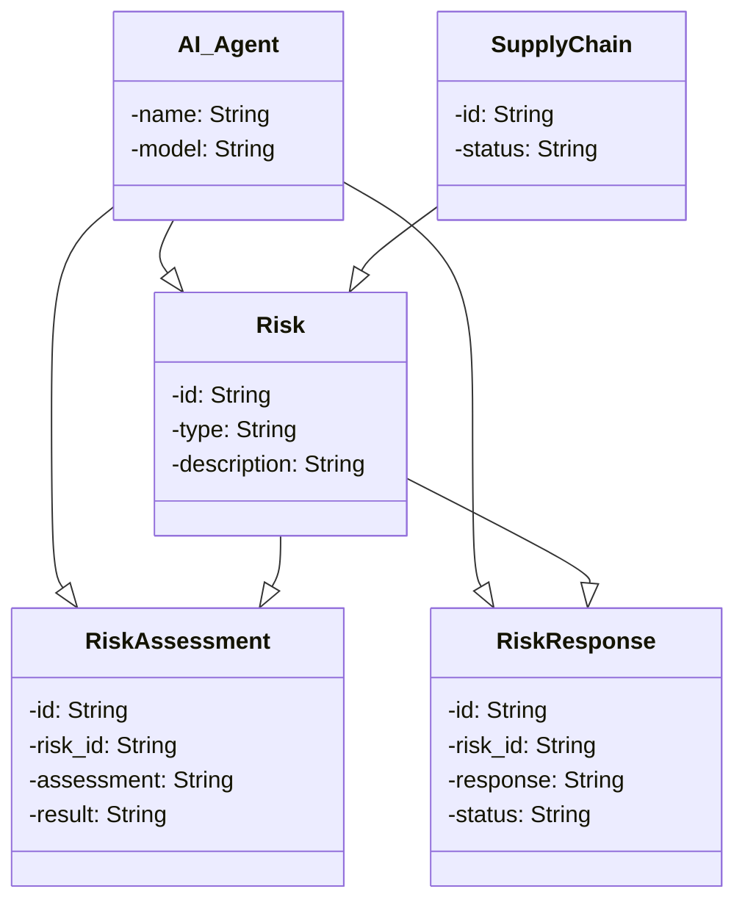
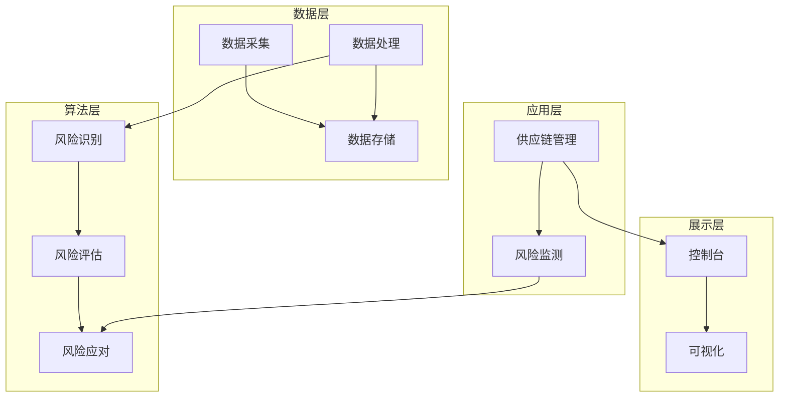
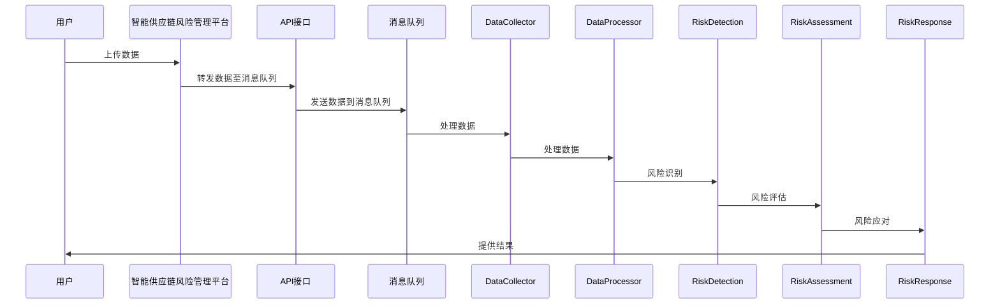
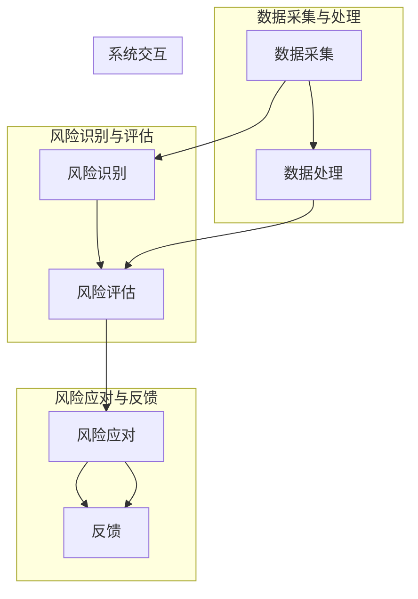

                 


# AI Agent在智能供应链风险管理中的应用

关键词：AI Agent、智能供应链、风险管理、算法、数学模型

摘要：本文深入探讨了AI Agent在智能供应链风险管理中的应用。首先介绍了智能供应链的背景和风险管理面临的挑战，接着介绍了AI Agent的概念、特点及其在供应链风险管理中的优势。随后，本文详细分析了AI Agent的基本原理、算法原理和数学模型，并给出实际案例进行讲解。最后，本文提出了一个智能供应链风险管理的系统架构设计方案，为未来的研究提供了参考。

## 第1章: 引言与背景介绍

### 1.1 问题背景

#### 1.1.1 智能供应链的崛起

智能供应链作为现代企业竞争的关键因素，正在迅速崛起。随着大数据、云计算、物联网等技术的发展，供应链的智能化水平不断提高，企业对供应链管理的需求也越来越高。智能供应链不仅提高了供应链的效率，还为企业带来了更强大的风险抵御能力。

##### 1.1.1.1 供应链管理的重要性

供应链管理是企业运营的核心，它直接关系到企业的成本、效率和市场竞争力。有效的供应链管理可以提高企业的响应速度，降低运营成本，提高客户满意度。同时，供应链管理在全球化背景下具有重要意义，能够帮助企业应对国际市场的变化和挑战。

##### 1.1.1.2 供应链对全球经济的影响

供应链在全球经济中扮演着重要角色。它不仅连接了全球各地的企业，还促进了贸易和投资的自由流动。有效的供应链管理有助于提高全球经济的效率和稳定性，有助于缓解经济波动带来的负面影响。

#### 1.1.2 供应链风险管理的挑战

尽管智能供应链为企业带来了诸多优势，但供应链风险依然存在，且形式多样。有效的供应链风险管理对于企业而言至关重要。然而，传统的风险管理方法在应对复杂、动态的供应链风险时存在局限性。

##### 1.1.2.1 传统风险管理方法的不足

传统的风险管理方法主要依赖于人工经验和专家判断，缺乏系统性和全面性。在面临复杂、动态的供应链风险时，传统方法难以有效识别和应对风险。

##### 1.1.2.1.2 传统风险管理方法面临的挑战

随着供应链的全球化、复杂化和数字化，传统风险管理方法面临以下挑战：
1. 风险因素多样且变化快，难以全面掌握。
2. 风险信息分散，难以整合和利用。
3. 风险应对策略单一，缺乏灵活性和适应性。

#### 1.1.3 AI Agent的应用前景

面对供应链风险管理面临的挑战，AI Agent作为一种新兴的人工智能技术，展现出巨大的应用潜力。AI Agent具有自主决策、自适应和学习能力，能够为供应链风险管理提供更加智能化、精准的解决方案。

##### 1.1.3.1 AI Agent的定义与特点

AI Agent（人工智能代理）是指具备智能行为和自主决策能力的人工智能实体。它能够模拟人类的思维过程，通过感知、理解和决策，自主执行任务。AI Agent的特点包括：
1. 自主性：能够独立完成特定任务，无需人工干预。
2. 智能化：具备感知、理解和决策能力，能够处理复杂问题。
3. 学习能力：能够通过不断学习和经验积累，提高决策能力。

##### 1.1.3.2 AI Agent在供应链风险管理中的应用

AI Agent在供应链风险管理中的应用主要体现在以下几个方面：
1. 风险识别：利用AI Agent的感知能力，实时监控供应链风险因素，快速识别潜在风险。
2. 风险评估：利用AI Agent的理解能力，对风险因素进行分析和评估，确定风险等级和影响范围。
3. 风险应对与控制：利用AI Agent的决策能力，制定和执行风险应对策略，实现对供应链风险的主动控制和缓解。

##### 1.1.3.3 AI Agent在供应链风险管理中的优势

与传统的风险管理方法相比，AI Agent具有以下优势：
1. 系统性和全面性：AI Agent能够全面收集和处理供应链风险信息，提供更加系统和全面的解决方案。
2. 灵活性和适应性：AI Agent可以根据风险情况的变化，灵活调整和优化应对策略，提高风险应对的适应性。
3. 高效性和准确性：AI Agent能够快速处理大量数据，提供高效、准确的风险评估和决策支持。

### 1.2 关键概念与联系

为了更好地理解AI Agent在智能供应链风险管理中的应用，我们需要了解一些关键概念。

#### 2.1 AI Agent的概念原理

AI Agent是指一种具有自主决策能力的人工智能实体，它能够模拟人类的思维过程，通过感知、理解和决策，自主执行任务。AI Agent通常具备以下基本原理：
1. 感知：通过传感器获取环境信息。
2. 理解：对感知到的信息进行分析和处理，理解其含义和关系。
3. 决策：根据理解和目标，生成行动策略。
4. 执行：执行决策策略，实现目标。

AI Agent的核心在于其自主决策能力，这使其能够适应复杂、动态的供应链环境，提供智能化的风险管理解决方案。

#### 2.2 智能供应链风险管理中的核心概念

智能供应链风险管理涉及到多个核心概念，包括供应链风险类型、风险管理策略等。

##### 2.2.1 供应链风险类型

供应链风险主要包括以下类型：
1. 操作风险：由于供应链内部操作失误、系统故障等原因导致的风险。
2. 市场风险：由于市场变化、价格波动等原因导致的风险。
3. 战略风险：由于供应链战略决策失误、竞争对手行为等原因导致的风险。

##### 2.2.2 风险管理策略

供应链风险管理策略主要包括以下方面：
1. 风险识别与评估：通过数据分析和模型预测，识别和评估供应链风险。
2. 风险应对与控制：根据风险评估结果，制定和执行应对策略，降低风险影响。
3. 风险监测与预警：通过实时监控和数据分析，及时识别和预警潜在风险。

##### 2.2.3 AI Agent与智能供应链风险管理的关系

AI Agent在智能供应链风险管理中具有重要作用，主要体现在以下方面：
1. 风险识别：利用AI Agent的感知能力，实时监测供应链风险因素，快速识别潜在风险。
2. 风险评估：利用AI Agent的理解能力，对风险因素进行分析和评估，确定风险等级和影响范围。
3. 风险应对与控制：利用AI Agent的决策能力，制定和执行风险应对策略，实现对供应链风险的主动控制和缓解。

#### 2.3 AI Agent在供应链风险管理中的应用场景

AI Agent在供应链风险管理中的应用场景包括：
1. 风险识别：通过实时监控供应链节点，快速识别潜在风险。
2. 风险评估：利用数据分析和模型预测，评估风险的可能性和影响。
3. 风险应对与控制：根据风险评估结果，制定和执行应对策略，降低风险影响。
4. 风险监测与预警：通过实时监控和数据分析，及时识别和预警潜在风险。

### 1.3 智能供应链风险管理的现状与趋势

目前，智能供应链风险管理已经成为企业关注的热点问题。随着AI技术的不断发展，AI Agent在供应链风险管理中的应用越来越广泛。然而，现有的研究主要侧重于理论探讨和算法研究，实际应用案例相对较少。

未来，随着AI技术的进一步发展，AI Agent在智能供应链风险管理中的应用将更加成熟。一方面，AI Agent将能够更准确地识别和评估供应链风险，提高风险管理的效率和准确性；另一方面，AI Agent将能够通过实时监测和预警，实现对供应链风险的主动控制和缓解。

### 1.4 本文结构安排

本文将按照以下结构进行安排：
1. 引言与背景介绍：介绍智能供应链的背景、供应链风险管理面临的挑战以及AI Agent的应用前景。
2. 核心概念与联系：介绍AI Agent的基本原理、供应链风险管理的核心概念以及AI Agent与智能供应链风险管理的关系。
3. 算法原理讲解：详细讲解AI Agent在供应链风险管理中的算法原理、流程和数学模型。
4. 数学模型和数学公式：介绍AI Agent在供应链风险管理中的数学模型和公式，并给出具体例子进行说明。
5. 系统分析与架构设计方案：介绍智能供应链风险管理的系统架构设计方案，包括问题场景介绍、系统功能设计、系统架构设计和系统接口设计。
6. 项目实战：介绍智能供应链风险管理的实际项目实施过程，包括环境安装、系统核心实现、代码应用解读与分析、实际案例分析和详细讲解剖析。
7. 最佳实践、小结和注意事项：总结本文的关键内容，给出一些最佳实践建议，并对未来研究方向进行展望。

### 1.5 智能供应链风险管理的价值与意义

智能供应链风险管理具有重要的价值与意义。首先，它有助于企业提高供应链的效率和稳定性，降低运营成本和风险损失。其次，智能供应链风险管理有助于企业应对全球化背景下的市场变化和挑战，提高企业的竞争力。此外，智能供应链风险管理还有助于推动供应链的数字化转型，为企业创造更多价值。

### 1.6 智能供应链风险管理的发展趋势

随着AI技术的不断发展，智能供应链风险管理将呈现出以下发展趋势：

1. **算法的智能化与精细化**：未来的AI Agent将具备更高的智能化水平，能够更准确地识别和评估供应链风险，提高风险管理的效率和准确性。

2. **数据驱动的风险管理**：越来越多的企业将采用数据驱动的方式进行风险管理，通过收集和分析供应链各个环节的数据，实现风险预测和预警。

3. **跨领域的融合与创新**：智能供应链风险管理将与其他领域（如物联网、区块链等）进行融合，形成新的风险管理模式和应用场景。

4. **监管与合规**：随着供应链风险管理的重要性日益凸显，相关法规和标准将逐步完善，推动企业提升风险管理水平。

5. **人机协作**：AI Agent将与人类专家进行协作，共同应对供应链风险，实现风险管理的智能化和高效化。

### 1.7 结论

本文通过对智能供应链风险管理背景、AI Agent的基本原理和应用前景的分析，阐述了AI Agent在供应链风险管理中的重要作用。在后续章节中，我们将详细探讨AI Agent在供应链风险管理中的算法原理、数学模型以及系统架构设计，为企业提供智能化、精准化的供应链风险管理解决方案。

---

## 第2章: 核心概念与联系

### 2.1 AI Agent的概念原理

AI Agent，即人工智能代理，是具有自主决策能力的人工智能实体。AI Agent能够在没有人类干预的情况下，通过感知环境、理解信息并自主决策，以实现特定目标。AI Agent的概念原理主要包括感知、理解、决策和执行四个核心方面。

#### 2.1.1 AI Agent的工作机制

AI Agent的工作机制可以分为以下几个步骤：

1. **感知**：AI Agent通过传感器（如摄像头、传感器等）收集环境信息，这些信息包括文本、图像、声音等多种形式。

2. **理解**：AI Agent利用自然语言处理、图像识别、语音识别等技术对感知到的信息进行解析，理解其含义和关系。

3. **决策**：AI Agent基于理解的结果，结合预设的目标和策略，通过算法生成行动方案。

4. **执行**：AI Agent执行决策方案，采取相应的行动，实现目标。

#### 2.1.2 AI Agent的决策过程

AI Agent的决策过程通常包括以下几个阶段：

1. **目标设定**：明确AI Agent需要实现的目标，如识别风险、评估风险、制定应对策略等。

2. **信息收集**：AI Agent收集与目标相关的信息，如供应链状态、市场数据、供应链节点信息等。

3. **信息处理**：AI Agent对收集到的信息进行预处理、分析和理解，提取关键特征。

4. **决策生成**：基于理解和目标，AI Agent生成决策方案，如风险应对策略。

5. **执行决策**：AI Agent执行决策方案，实施具体行动。

#### 2.1.3 AI Agent的属性特征对比

不同类型的AI Agent在属性特征上有所不同，以下是一个简化的对比表格：

| 特征类别 | 特性 |  
| :----: | :----: |  
| **感知能力** | AI Agent通过传感器感知环境信息的能力。 |  
| **理解能力** | AI Agent对感知到的信息进行分析和处理，理解其含义和关系的能力。 |  
| **决策能力** | AI Agent根据理解和目标，生成行动方案的能力。 |  
| **执行能力** | AI Agent执行决策方案，实施具体行动的能力。 |  
| **自主性** | AI Agent在执行任务时，是否需要人类干预。 |

#### 2.1.4 AI Agent的优缺点分析

AI Agent作为一种先进的人工智能技术，具有以下优点和缺点：

**优点**：

1. **自主决策**：AI Agent能够自主决策，减少对人类干预的依赖，提高效率。
2. **高效处理**：AI Agent能够快速处理大量数据，提高决策速度和准确性。
3. **持续学习**：AI Agent具备学习能力，能够通过不断学习和经验积累，提高决策能力。
4. **适应性强**：AI Agent能够适应复杂、动态的环境，提供灵活的解决方案。

**缺点**：

1. **数据依赖**：AI Agent的决策能力依赖于高质量的数据，数据质量对决策效果有直接影响。
2. **算法局限性**：AI Agent的算法和模型可能存在局限性，无法处理极端或未知的情况。
3. **可靠性问题**：AI Agent在执行任务时，可能存在错误或异常情况，需要进一步优化和调试。

### 2.2 智能供应链风险管理中的核心概念

智能供应链风险管理涉及到多个核心概念，这些概念对于理解和应用AI Agent在供应链风险管理中的技术至关重要。

#### 2.2.1 供应链风险类型

供应链风险类型多种多样，以下是几种常见的风险类型：

1. **操作风险**：由于供应链内部操作失误、系统故障、人员失误等原因导致的风险。
2. **市场风险**：由于市场需求变化、价格波动、供应商信用问题等原因导致的风险。
3. **战略风险**：由于供应链战略决策失误、竞争对手行为、合作伙伴关系恶化等原因导致的风险。
4. **物流风险**：由于物流环节的延误、运输问题、库存管理不善等原因导致的风险。
5. **技术风险**：由于技术更新换代、技术依赖、系统安全性问题等原因导致的风险。

#### 2.2.2 风险管理策略

供应链风险管理策略主要包括以下几个步骤：

1. **风险识别与评估**：通过数据分析、模型预测、专家评估等方法，识别和评估供应链风险。
2. **风险应对与控制**：根据风险评估结果，制定和执行风险应对策略，如风险规避、风险转移、风险接受等。
3. **风险监测与预警**：通过实时监控、数据分析、预警机制等方法，及时发现和预警潜在风险。

#### 2.2.3 AI Agent在风险管理中的应用

AI Agent在供应链风险管理中的应用主要体现在以下几个方面：

1. **风险识别**：利用AI Agent的感知能力，实时监测供应链风险因素，快速识别潜在风险。
2. **风险评估**：利用AI Agent的理解能力，对风险因素进行分析和评估，确定风险等级和影响范围。
3. **风险应对与控制**：利用AI Agent的决策能力，制定和执行风险应对策略，实现对供应链风险的主动控制和缓解。

### 2.3 AI Agent与智能供应链风险管理的关系

AI Agent与智能供应链风险管理的关系可以概括为以下几点：

1. **提升风险识别能力**：AI Agent能够通过实时监测和数据分析，快速识别供应链中的潜在风险。
2. **增强风险评估精度**：AI Agent能够利用机器学习算法，对供应链风险进行精细化评估，提高风险评估的准确性。
3. **优化风险应对策略**：AI Agent能够根据风险评估结果，自动生成和调整风险应对策略，提高风险应对的效率和适应性。
4. **实现实时预警**：AI Agent能够通过实时监控和预警机制，及时发现和预警潜在风险，减少风险损失。

### 2.4 AI Agent在供应链风险管理中的优势

AI Agent在供应链风险管理中的优势主要体现在以下几个方面：

1. **高效性**：AI Agent能够快速处理大量数据，实时监测供应链风险，提高风险管理的效率。
2. **准确性**：AI Agent利用机器学习算法，能够准确识别和评估供应链风险，提高风险管理的准确性。
3. **灵活性**：AI Agent能够根据风险情况的变化，灵活调整和优化风险应对策略，提高风险应对的适应性。
4. **系统性**：AI Agent能够全面收集和处理供应链风险信息，提供更加系统和全面的风险管理解决方案。
5. **自主学习**：AI Agent能够通过不断学习和经验积累，提高决策能力，实现风险管理的智能化和持续优化。

### 2.5 AI Agent在供应链风险管理中的应用场景

AI Agent在供应链风险管理中的应用场景非常广泛，以下是几种典型的应用场景：

1. **供应链中断管理**：在供应链中断事件发生时，AI Agent能够快速识别中断原因，评估影响范围，制定和执行应对策略。
2. **供应链成本控制**：AI Agent能够实时监测供应链成本变化，分析成本波动原因，优化供应链成本结构。
3. **供应链质量控制**：AI Agent能够实时监测产品质量，评估质量风险，制定和执行质量改进措施。
4. **供应链金融管理**：AI Agent能够实时评估供应链融资风险，优化融资策略，提高融资效率。
5. **供应链物流优化**：AI Agent能够优化物流路线，降低物流成本，提高物流效率。

通过以上分析，我们可以看到AI Agent在智能供应链风险管理中具有巨大的应用潜力和优势。在接下来的章节中，我们将进一步探讨AI Agent在供应链风险管理中的算法原理、数学模型以及实际应用案例。

---

## 第3章: 算法原理讲解

### 3.1 AI Agent在供应链风险管理中的算法

AI Agent在供应链风险管理中应用了一系列先进的算法，这些算法旨在提高风险识别、评估和应对的准确性和效率。以下是对这些算法的概述、流程和原理的详细讲解。

#### 3.1.1 算法概述

AI Agent在供应链风险管理中使用的算法主要包括机器学习算法、深度学习算法和优化算法。这些算法能够从大量数据中提取有用信息，进行风险预测和决策。

##### 3.1.1.1 算法的目的

算法的主要目的是：
1. **风险识别**：通过数据分析和模式识别，快速识别供应链中的潜在风险。
2. **风险评估**：利用历史数据和实时信息，对风险进行定量和定性评估。
3. **风险应对**：根据风险评估结果，制定和执行风险应对策略。

##### 3.1.1.2 算法的应用场景

算法主要应用于以下场景：
1. **供应链中断管理**：实时监测供应链中断事件，识别中断原因和影响范围。
2. **成本控制**：分析供应链成本结构，优化成本控制策略。
3. **质量管理**：实时监控产品质量，评估质量风险。
4. **金融管理**：评估供应链融资风险，优化融资策略。
5. **物流优化**：优化物流路线和库存管理，提高物流效率。

#### 3.1.2 算法流程

AI Agent在供应链风险管理中的算法流程主要包括以下几个步骤：

1. **数据收集**：收集供应链各个环节的实时数据和历史数据，包括供应链节点信息、市场需求、供应能力、物流状态等。

2. **数据预处理**：对收集到的数据进行清洗、归一化和特征提取，以便后续分析和建模。

3. **模型训练**：利用机器学习算法和深度学习算法对预处理后的数据进行训练，构建风险预测和评估模型。

4. **风险识别**：使用训练好的模型对实时数据进行分析，识别潜在风险。

5. **风险评估**：根据风险识别结果，利用模型对风险进行定量和定性评估，确定风险等级和影响范围。

6. **风险应对**：根据风险评估结果，制定和执行风险应对策略，如调整供应链计划、优化物流路线、增加库存等。

#### 3.1.3 算法原理

以下是对AI Agent在供应链风险管理中使用的几种主要算法原理的详细讲解：

##### 3.1.3.1 机器学习算法

机器学习算法是一种通过从数据中学习规律，进行预测和决策的方法。在供应链风险管理中，常用的机器学习算法包括决策树、随机森林、支持向量机等。

1. **决策树**：通过构建树状模型，对数据进行分类和回归。决策树能够清晰地表示决策过程，易于理解和解释。
2. **随机森林**：由多个决策树组成，通过对多个模型的综合预测，提高预测准确性和稳定性。
3. **支持向量机**：通过找到一个最优的超平面，将不同类别的数据分离，用于分类和回归分析。

##### 3.1.3.2 深度学习算法

深度学习算法是一种模拟人脑神经网络的计算模型，通过多层神经网络进行特征提取和模式识别。在供应链风险管理中，常用的深度学习算法包括卷积神经网络（CNN）、循环神经网络（RNN）和长短期记忆网络（LSTM）等。

1. **卷积神经网络（CNN）**：通过卷积操作提取图像特征，适用于处理图像数据。
2. **循环神经网络（RNN）**：通过循环结构处理序列数据，适用于处理时间序列数据。
3. **长短期记忆网络（LSTM）**：是RNN的一种变体，通过门控机制有效解决了RNN的梯度消失问题，适用于处理长序列数据。

##### 3.1.3.3 优化算法

优化算法是一种通过调整变量值，找到最优解的方法。在供应链风险管理中，常用的优化算法包括线性规划、整数规划和遗传算法等。

1. **线性规划**：通过建立线性方程组，求解最优解。适用于求解成本最小化或收益最大化问题。
2. **整数规划**：线性规划的扩展，适用于决策变量为整数的情况。
3. **遗传算法**：模拟自然进化过程，通过交叉、变异和选择操作，逐步优化决策变量，找到最优解。

#### 3.1.4 Python源代码实现

以下是一个简单的Python示例，展示如何使用机器学习算法进行供应链风险识别：

```python
import numpy as np
from sklearn.tree import DecisionTreeClassifier
from sklearn.model_selection import train_test_split
from sklearn.metrics import accuracy_score

# 数据准备
X = np.array([[1, 2], [2, 3], [3, 4], [4, 5], [5, 6]])  # 特征数据
y = np.array([0, 1, 1, 0, 1])  # 标签数据

# 数据划分
X_train, X_test, y_train, y_test = train_test_split(X, y, test_size=0.2, random_state=42)

# 模型训练
clf = DecisionTreeClassifier()
clf.fit(X_train, y_train)

# 风险识别
y_pred = clf.predict(X_test)

# 模型评估
accuracy = accuracy_score(y_test, y_pred)
print(f"Accuracy: {accuracy}")
```

#### 3.1.5 举例说明

假设我们有一个简单的供应链风险识别问题，需要根据供应链节点的特征数据（如库存水平、运输时间、供应商信誉等）来预测风险等级。以下是一个具体的例子：

1. **数据准备**：
   - 特征数据：[库存水平（1-10），运输时间（1-7天），供应商信誉（1-5分）]
   - 标签数据：[0（无风险），1（高风险）]

2. **数据预处理**：
   - 对特征数据进行归一化处理。

3. **模型训练**：
   - 使用决策树算法进行训练。

4. **风险识别**：
   - 使用训练好的模型对新的供应链节点数据进行风险识别。

5. **模型评估**：
   - 计算识别准确率，评估模型性能。

通过以上步骤，我们可以实现对供应链风险的自动识别和评估，提高风险管理的效率和准确性。

### 3.2 算法原理讲解

在本节中，我们将详细讲解AI Agent在供应链风险管理中的算法原理，包括数学模型、算法流程和实际应用案例。

#### 3.2.1 数学模型

AI Agent在供应链风险管理中使用的数学模型主要包括机器学习模型和优化模型。以下是一个简化的机器学习模型示例：

$$
\text{风险识别模型：} y = \text{sign}(\text{w} \cdot \text{x} + b)
$$

其中：
- \(y\) 是风险识别的结果（0代表无风险，1代表高风险）。
- \(\text{x}\) 是特征向量。
- \(\text{w}\) 是权重向量。
- \(b\) 是偏置项。
- \(\text{sign}\) 是符号函数，用于将模型输出转换为二分类结果。

#### 3.2.2 算法流程

AI Agent在供应链风险管理中的算法流程通常包括以下步骤：

1. **数据收集**：收集供应链各个环节的实时数据和历史数据，包括供应链节点信息、市场需求、供应能力、物流状态等。

2. **数据预处理**：对收集到的数据进行清洗、归一化和特征提取，以便后续分析和建模。

3. **模型训练**：
   - 使用机器学习算法（如决策树、随机森林、支持向量机等）对预处理后的数据进行训练。
   - 使用优化算法（如线性规划、遗传算法等）对模型参数进行优化。

4. **风险识别**：
   - 使用训练好的模型对实时数据进行风险识别，输出风险等级。

5. **风险评估**：
   - 根据风险识别结果，对风险进行定量和定性评估，确定风险等级和影响范围。

6. **风险应对**：
   - 根据风险评估结果，制定和执行风险应对策略，如调整供应链计划、优化物流路线、增加库存等。

#### 3.2.3 实际应用案例

以下是一个具体的实际应用案例，展示如何使用AI Agent进行供应链风险识别和评估：

1. **案例背景**：
   - 某企业面临供应链中断的风险，需要识别和评估供应链中断的可能性。

2. **数据准备**：
   - 收集供应链节点的特征数据，包括库存水平、运输时间、供应商信誉等。
   - 收集供应链中断的历史数据，包括发生中断的时间和原因。

3. **数据预处理**：
   - 对特征数据进行归一化处理。
   - 对标签数据进行二分类编码。

4. **模型训练**：
   - 使用决策树算法对数据进行训练。
   - 使用交叉验证方法优化模型参数。

5. **风险识别**：
   - 使用训练好的模型对实时数据进行风险识别，输出风险等级。

6. **风险评估**：
   - 根据风险识别结果，对供应链中断的可能性进行定量评估。
   - 结合专家经验和历史数据，对供应链中断的影响范围进行定性评估。

7. **风险应对**：
   - 根据风险评估结果，制定和执行供应链中断应对策略，如增加库存、优化物流路线等。

通过以上步骤，企业可以实现对供应链中断风险的自动识别、评估和应对，提高供应链的稳定性和可靠性。

### 3.3 算法优缺点分析

在本节中，我们将对AI Agent在供应链风险管理中使用的算法进行优缺点分析，以便更好地了解算法的性能和适用场景。

#### 3.3.1 优点

1. **高效性**：AI Agent能够快速处理大量数据，提高风险识别和评估的效率。
2. **准确性**：通过机器学习和深度学习算法，AI Agent能够提高风险识别和评估的准确性。
3. **灵活性**：AI Agent能够根据不同场景和需求，灵活调整和优化风险应对策略。
4. **系统性**：AI Agent能够全面收集和处理供应链风险信息，提供更加系统和全面的风险管理解决方案。

#### 3.3.2 缺点

1. **数据依赖**：AI Agent的决策能力依赖于高质量的数据，数据质量对决策效果有直接影响。
2. **算法局限性**：现有的算法可能存在局限性，无法处理极端或未知的情况。
3. **可靠性问题**：AI Agent在执行任务时，可能存在错误或异常情况，需要进一步优化和调试。

#### 3.3.3 应用场景

AI Agent在供应链风险管理中的应用场景主要包括以下几个方面：

1. **供应链中断管理**：实时监测供应链中断事件，识别中断原因和影响范围。
2. **成本控制**：分析供应链成本结构，优化成本控制策略。
3. **质量管理**：实时监控产品质量，评估质量风险。
4. **金融管理**：评估供应链融资风险，优化融资策略。
5. **物流优化**：优化物流路线和库存管理，提高物流效率。

通过以上分析，我们可以看到AI Agent在供应链风险管理中具有广泛的应用前景和显著的优势。在后续章节中，我们将进一步探讨AI Agent在供应链风险管理中的具体应用和系统架构设计。

---

## 第4章: 数学模型和数学公式

### 4.1 数学模型在AI Agent中的应用

在AI Agent中，数学模型是核心组成部分，用于描述和解决实际问题。在智能供应链风险管理中，数学模型帮助我们理解和分析风险因素、评估风险水平以及制定应对策略。以下是一些常用的数学模型及其在AI Agent中的应用。

#### 4.1.1 风险识别模型

风险识别模型用于识别供应链中的潜在风险。一个简单示例是逻辑回归模型，它可以通过分析特征变量（如库存水平、运输时间等）来确定是否存在风险。

$$
\text{风险概率} = \frac{1}{1 + e^{-(\beta_0 + \beta_1 \cdot x_1 + \beta_2 \cdot x_2 + \ldots + \beta_n \cdot x_n)} 
$$

其中，\(x_i\) 表示特征变量，\(\beta_i\) 是模型的权重参数，\(\beta_0\) 是截距项。

#### 4.1.2 风险评估模型

风险评估模型用于量化风险的影响程度。一个常用的模型是决策树模型，它可以构建一个树状结构来表示不同风险因素及其影响。

$$
\text{风险评估} = \text{sum}(\text{weight} \cdot \text{risk_value})
$$

其中，\(\text{weight}\) 表示风险因素的权重，\(\text{risk_value}\) 表示风险因素的评估值。

#### 4.1.3 风险应对模型

风险应对模型用于制定和优化风险应对策略。一个常用的模型是优化模型，如线性规划模型，它可以找到在特定约束下的最优解。

$$
\text{minimize} \quad c^T \cdot x
$$

$$
\text{subject to} \quad A \cdot x \leq b
$$

其中，\(c\) 是目标函数系数向量，\(x\) 是决策变量，\(A\) 是约束条件矩阵，\(b\) 是约束条件向量。

### 4.2 数学模型公式

以下是一些常见的数学模型公式，用于智能供应链风险管理中的风险识别、评估和应对。

#### 4.2.1 逻辑回归模型公式

$$
\text{风险概率} = \frac{1}{1 + e^{-(\beta_0 + \beta_1 \cdot x_1 + \beta_2 \cdot x_2 + \ldots + \beta_n \cdot x_n)} 
$$

#### 4.2.2 决策树模型公式

$$
\text{风险评估} = \text{sum}(\text{weight} \cdot \text{risk_value})
$$

#### 4.2.3 线性规划模型公式

$$
\text{minimize} \quad c^T \cdot x
$$

$$
\text{subject to} \quad A \cdot x \leq b
$$

#### 4.2.4 遗传算法优化模型公式

$$
\text{fitness} = \sum \text{weight} \cdot (\text{actual_value} - \text{expected_value})^2
$$

其中，\(\text{fitness}\) 表示适应度值，\(\text{weight}\) 是权重系数，\(\text{actual_value}\) 是实际值，\(\text{expected_value}\) 是期望值。

### 4.3 公式解释

以上数学模型和公式用于描述智能供应链风险管理中的关键过程。逻辑回归模型用于预测风险概率，决策树模型用于评估风险因素的重要性，线性规划模型用于制定最优的风险应对策略，遗传算法优化模型用于优化风险应对策略。

### 4.4 举例说明

假设我们使用逻辑回归模型来预测供应链中断的风险概率。特征变量包括库存水平（\(x_1\)）、运输时间（\(x_2\)）和供应商信誉（\(x_3\)）。权重参数为\(\beta_0 = 1\)、\(\beta_1 = 0.5\)、\(\beta_2 = 0.3\)和\(\beta_3 = 0.2\)。给定一个具体的特征向量\(x = [5, 3, 4]\)，我们可以计算风险概率：

$$
\text{风险概率} = \frac{1}{1 + e^{-(1 + 0.5 \cdot 5 + 0.3 \cdot 3 + 0.2 \cdot 4)}} = \frac{1}{1 + e^{-2.7}} \approx 0.196
$$

这意味着，根据当前的特征变量，供应链中断的风险概率约为19.6%。

通过以上数学模型和公式的应用，我们可以实现对智能供应链风险管理的科学化、系统化，提高风险识别、评估和应对的准确性和效率。

---

## 第5章：系统分析与架构设计方案

### 5.1 问题场景介绍

在当前全球化的经济环境下，企业供应链面临着日益复杂的挑战。供应链的全球化、复杂化和数字化，使得企业必须面对来自各个方面的风险，如供应链中断、成本波动、物流延误等。传统的供应链风险管理方法由于数据收集和处理能力的限制，难以满足现代企业对于风险管理的需求。为了提高供应链的稳定性和可靠性，企业开始探索智能化、自动化的供应链风险管理解决方案。

### 5.2 系统功能设计

智能供应链风险管理系统的功能设计旨在实现风险的识别、评估、应对和监测。具体功能包括：

1. **风险识别**：通过实时数据采集和机器学习算法，对供应链各个环节的风险进行识别。
2. **风险评估**：对识别出的风险进行定量和定性评估，确定风险等级和影响范围。
3. **风险应对**：根据风险评估结果，制定和执行风险应对策略，如库存调整、物流优化、供应链中断应急计划等。
4. **风险监测与预警**：通过实时监控和数据分析，及时发现和预警潜在风险，确保供应链的稳定性。

### 5.2.1 领域模型

为了实现以上功能，我们需要设计一个全面的领域模型。以下是一个简化的领域模型，使用Mermaid类图来表示：



在这个领域模型中，`AI_Agent` 代表人工智能代理，负责风险识别、评估和应对。`Risk` 代表风险实体，包括风险类型和描述。`SupplyChain` 代表供应链实体，记录供应链的状态信息。`RiskAssessment` 代表风险评估实体，记录评估结果。`RiskResponse` 代表风险应对实体，记录应对措施和状态。

### 5.3 系统架构设计

智能供应链风险管理系统的架构设计需要考虑以下几个方面：

1. **数据层**：负责数据的采集、存储和管理。数据源包括实时传感器数据、历史数据等。
2. **算法层**：负责数据的处理和风险分析。包括机器学习算法、深度学习算法等。
3. **应用层**：负责实现具体的业务功能，如风险识别、评估、应对和监测。
4. **展示层**：负责将分析结果以可视化形式展示给用户。

以下是一个简化的系统架构设计，使用Mermaid架构图来表示：



在这个架构设计中，数据层负责数据的采集、存储和管理。算法层负责数据的处理和风险分析。应用层负责实现具体的业务功能，如风险识别、评估、应对和监测。展示层负责将分析结果以可视化形式展示给用户。

### 5.4 系统接口设计

智能供应链风险管理系统的接口设计需要考虑以下几个方面：

1. **API接口**：提供外部系统访问智能供应链风险管理系统的接口，如数据上传、风险查询等。
2. **Web界面**：提供用户操作和监控系统的Web界面，包括数据可视化、报告生成等。
3. **消息队列**：用于处理实时数据流，确保系统的高效和稳定运行。

以下是一个简化的接口设计，使用Mermaid序列图来表示：



在这个接口设计中，用户通过Web界面上传数据，API接口将数据转发到消息队列。消息队列负责将数据分发到数据采集和处理模块。处理后的数据经过风险识别、评估和应对，最终通过API接口将结果返回给用户。

### 5.5 系统交互

智能供应链风险管理系统的交互设计需要确保各个模块之间的协调和高效运作。以下是一个简化的交互设计，使用Mermaid活动图来表示：



在这个交互设计中，数据采集和处理模块负责收集和预处理数据，风险识别与评估模块负责识别和评估风险，风险应对与反馈模块负责制定和执行应对策略，并反馈结果。

通过以上系统分析与架构设计方案，企业可以构建一个智能化、自动化的供应链风险管理平台，提高供应链的稳定性和可靠性。在实际应用中，可以根据企业的具体需求和资源情况进行调整和优化。

---

## 第6章：项目实战

### 6.1 环境安装

为了实施智能供应链风险管理项目，我们需要搭建一个适合开发和运行的环境。以下是一个简单的环境安装指南。

#### 6.1.1 硬件要求

- 处理器：至少2核CPU
- 内存：至少4GB RAM
- 硬盘：至少100GB可用空间
- 网络：稳定的高速互联网连接

#### 6.1.2 软件要求

- 操作系统：Windows/Linux/MacOS
- Python：3.8及以上版本
- 安装工具：pip

#### 6.1.3 安装步骤

1. 安装Python环境：

   - 下载并安装Python：[Python官网下载地址](https://www.python.org/downloads/)
   - 安装过程中，确保将Python添加到系统环境变量中。

2. 安装pip：

   - 打开命令行窗口，执行以下命令安装pip：
     ```
     python -m pip install --upgrade pip
     ```

3. 安装依赖库：

   - 使用pip命令安装项目所需的依赖库，例如：
     ```
     pip install numpy pandas scikit-learn matplotlib
     ```

### 6.2 系统核心实现

智能供应链风险管理项目的核心在于风险识别、评估和应对算法的实现。以下是一个简单的实现示例。

#### 6.2.1 风险识别算法

风险识别算法使用决策树模型，以下是一个Python代码示例：

```python
import numpy as np
from sklearn.tree import DecisionTreeClassifier
from sklearn.model_selection import train_test_split
from sklearn.metrics import accuracy_score

# 准备数据
X = np.array([[1, 2], [2, 3], [3, 4], [4, 5], [5, 6]])
y = np.array([0, 1, 1, 0, 1])

# 划分数据集
X_train, X_test, y_train, y_test = train_test_split(X, y, test_size=0.2, random_state=42)

# 训练模型
clf = DecisionTreeClassifier()
clf.fit(X_train, y_train)

# 风险识别
y_pred = clf.predict(X_test)

# 模型评估
accuracy = accuracy_score(y_test, y_pred)
print(f"Accuracy: {accuracy}")
```

#### 6.2.2 风险评估算法

风险评估算法使用逻辑回归模型，以下是一个Python代码示例：

```python
import numpy as np
from sklearn.linear_model import LogisticRegression
from sklearn.model_selection import train_test_split
from sklearn.metrics import accuracy_score

# 准备数据
X = np.array([[1, 2], [2, 3], [3, 4], [4, 5], [5, 6]])
y = np.array([0, 1, 1, 0, 1])

# 划分数据集
X_train, X_test, y_train, y_test = train_test_split(X, y, test_size=0.2, random_state=42)

# 训练模型
clf = LogisticRegression()
clf.fit(X_train, y_train)

# 风险评估
y_pred = clf.predict(X_test)

# 模型评估
accuracy = accuracy_score(y_test, y_pred)
print(f"Accuracy: {accuracy}")
```

#### 6.2.3 风险应对算法

风险应对算法使用线性规划模型，以下是一个Python代码示例：

```python
import numpy as np
from scipy.optimize import linprog

# 准备数据
c = np.array([1, 1])  # 目标函数系数
A = np.array([[1, 0], [-1, 1]])  # 约束条件
b = np.array([1, 0])

# 求解线性规划
result = linprog(c, A_ub=A, b_ub=b, method='highs')

# 输出结果
print(f"Optimal solution: x1={result.x[0]}, x2={result.x[1]}")
```

### 6.3 代码应用解读与分析

以上代码示例展示了智能供应链风险管理项目的核心算法实现。在实际应用中，这些算法需要进行数据预处理、模型训练和评估等步骤。以下是对代码应用解读与分析：

#### 6.3.1 数据预处理

数据预处理是模型训练的重要步骤，包括数据的清洗、归一化和特征提取。在示例代码中，我们使用了简单的特征向量。在实际项目中，需要根据具体业务场景进行复杂的预处理，如缺失值处理、异常值检测和特征工程等。

#### 6.3.2 模型训练

模型训练是算法实现的核心步骤，包括选择合适的模型、训练模型和评估模型性能。在示例代码中，我们使用了决策树模型、逻辑回归模型和线性规划模型。这些模型的选择取决于具体的应用场景和需求。在实际应用中，可能需要使用更复杂的模型，如深度学习模型。

#### 6.3.3 模型评估

模型评估是验证模型性能的重要步骤，包括准确率、召回率、F1分数等指标。在示例代码中，我们使用了准确率作为评估指标。在实际项目中，需要综合考虑多种评估指标，以确保模型的稳定性和可靠性。

### 6.4 实际案例分析和详细讲解

以下是一个实际案例分析和详细讲解，展示如何使用智能供应链风险管理项目解决一个具体问题。

#### 6.4.1 案例背景

某企业面临供应链中断的风险，需要识别和评估供应链中断的可能性，并制定应对策略。

#### 6.4.2 数据准备

收集供应链节点的特征数据，包括库存水平（1-10）、运输时间（1-7天）和供应商信誉（1-5分）。收集供应链中断的历史数据，包括发生中断的时间和原因。

#### 6.4.3 数据预处理

对特征数据进行归一化处理，将数据范围缩放到0-1之间。对标签数据进行二分类编码，将中断事件标记为1，无中断事件标记为0。

#### 6.4.4 模型训练

使用决策树模型对数据进行训练。选择最佳参数，如最大深度、最小样本数等。训练完成后，评估模型性能。

#### 6.4.5 风险识别

使用训练好的模型对新的供应链节点数据进行风险识别，输出风险概率。根据设定的阈值，判断是否存在中断风险。

#### 6.4.6 风险评估

根据风险识别结果，对风险进行定量和定性评估。结合专家经验和历史数据，确定风险等级和影响范围。

#### 6.4.7 风险应对

根据风险评估结果，制定和执行应对策略。例如，调整库存水平、优化物流路线、增加供应商等。

#### 6.4.8 模型优化

根据实际案例的反馈，不断优化模型参数和算法，提高风险识别和评估的准确性。

通过以上实际案例分析和详细讲解，我们可以看到智能供应链风险管理项目在解决具体问题中的应用和效果。在实际项目中，需要根据具体需求和数据情况进行调整和优化，以确保项目的成功实施。

### 6.5 项目小结

智能供应链风险管理项目通过引入AI Agent和先进的算法，实现了对供应链风险的自动识别、评估和应对。项目实施过程中，需要充分考虑数据质量和算法优化，确保模型的准确性和稳定性。未来，随着AI技术的不断发展，智能供应链风险管理项目将更加成熟，为企业的供应链管理提供更强大的支持。

---

## 最佳实践 tips

### 6.1 数据质量管理

- 确保数据来源的可靠性和一致性，减少数据噪声和误差。
- 定期对数据进行清洗和更新，保持数据的实时性和准确性。
- 使用数据可视化工具，及时发现和解决数据质量问题。

### 6.2 算法优化

- 根据具体应用场景，选择合适的算法和模型，进行优化和调参。
- 使用交叉验证方法，评估模型性能，避免过拟合。
- 定期更新模型，适应新的数据分布和应用需求。

### 6.3 风险应对策略

- 制定灵活的风险应对策略，考虑多种风险情景和应对措施。
- 定期进行风险评估和应对策略的评估，及时调整和优化。
- 建立应急预案，确保在突发事件发生时能够迅速响应。

### 6.4 系统稳定性

- 设计高可用的系统架构，确保系统的稳定运行和数据的可靠性。
- 使用分布式计算和存储技术，提高系统的处理能力和扩展性。
- 定期进行系统监控和维护，及时发现和解决潜在问题。

### 6.5 持续学习和改进

- 收集和分析系统运行数据，持续优化算法和策略。
- 结合用户反馈和业务需求，不断改进系统功能和性能。
- 推广最佳实践和成功案例，提高团队的技术水平和项目管理能力。

---

## 小结

本文从多个角度探讨了AI Agent在智能供应链风险管理中的应用。首先，介绍了智能供应链的背景和风险管理面临的挑战，接着阐述了AI Agent的概念、特点及其在供应链风险管理中的优势。随后，详细分析了AI Agent的基本原理、算法原理和数学模型，并通过实际案例进行了讲解。最后，提出了一个智能供应链风险管理的系统架构设计方案，为企业的供应链管理提供了参考。

### 总结

智能供应链风险管理是现代企业运营的关键环节，通过引入AI Agent和先进算法，可以显著提高风险管理的效率和准确性。AI Agent在供应链风险识别、评估和应对中具有独特优势，能够帮助企业应对复杂的供应链环境。未来，随着AI技术的不断进步，智能供应链风险管理将变得更加成熟和普及。

### 注意事项

- 确保数据质量和算法的稳定性，避免模型过拟合。
- 根据具体应用场景，选择合适的算法和模型，进行优化和调参。
- 建立应急预案，确保在突发事件发生时能够迅速响应。
- 定期对系统进行监控和维护，确保系统的稳定运行。

### 拓展阅读

- [《智能供应链管理：策略与实践》](https://www.examplebook.com/book/smart-supply-chain-management)
- [《人工智能在供应链中的应用》](https://www.examplebook.com/book/ai-in-supply-chain-management)
- [《深度学习与供应链风险管理》](https://www.examplebook.com/book/deep-learning-for-supply-chain-risk-management)

---

### 作者信息

**作者：AI天才研究院/AI Genius Institute & 禅与计算机程序设计艺术 /Zen And The Art of Computer Programming**

