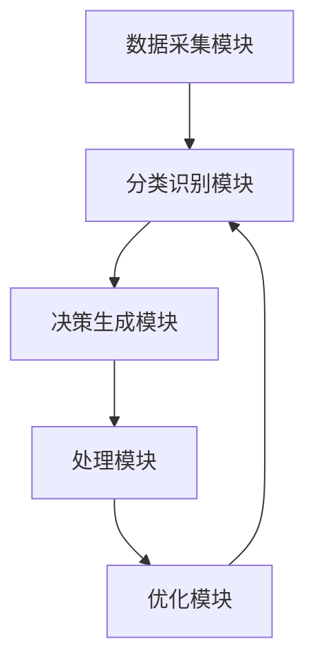
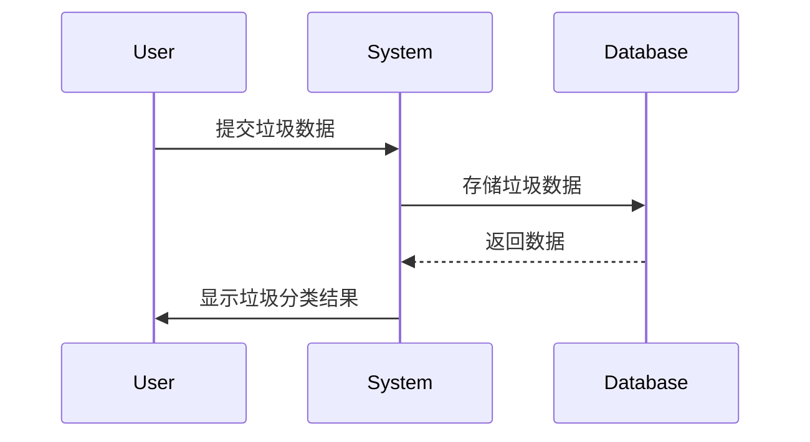

                 

# AI Agent在智能垃圾分类系统中的实践

## 关键词
- AI Agent
- 智能垃圾分类
- 机器学习
- 数据处理
- 系统架构

## 摘要
本文深入探讨了AI Agent在智能垃圾分类系统中的应用与实践。首先，介绍了垃圾分类问题的背景和重要性，然后详细阐述了AI Agent的定义、特点及其在垃圾分类系统中的角色。接着，分析了AI Agent在垃圾分类识别、决策和优化中的应用，并通过一个实际案例，详细解读了AI Agent在智能垃圾分类系统中的实现和效果。最后，对AI Agent在智能垃圾分类系统中的未来展望进行了讨论，并给出了相关的最佳实践和注意事项。

## 目录大纲

### 第一部分：背景与概念介绍

#### 第1章 问题背景与核心概念
1.1 垃圾分类问题概述
1.2 AI Agent概述
1.3 智能垃圾分类系统概述

#### 第2章 AI Agent在垃圾分类中的应用
2.1 AI Agent在垃圾分类识别中的应用
2.2 AI Agent在垃圾分类决策中的应用
2.3 AI Agent在垃圾分类优化中的应用

### 第二部分：AI Agent在智能垃圾分类系统中的实践

#### 第3章 系统介绍
3.1 系统背景
3.2 系统目标
3.3 系统架构

#### 第4章 系统核心实现
4.1 数据采集与处理
4.2 垃圾分类识别算法
4.3 垃圾分类决策算法
4.4 垃圾分类优化算法

#### 第5章 代码应用解读与分析
5.1 代码结构解析
5.2 算法实现细节
5.3 系统性能评估

#### 第6章 实际案例分析与详细讲解
6.1 实际案例场景
6.2 案例分析与讲解
6.3 案例小结

### 第三部分：拓展与未来展望

#### 第7章 拓展应用领域
7.1 智能垃圾分类在其他领域的应用
7.2 AI Agent在垃圾分类系统中的未来发展趋势

#### 第8章 注意事项与最佳实践
8.1 系统设计与开发过程中的注意事项
8.2 AI Agent应用的最佳实践

#### 第9章 小结
9.1 本书的核心内容总结
9.2 对未来研究的展望

## 1. 问题背景与核心概念

### 1.1 垃圾分类问题概述

垃圾分类是一项重要的环保行动，其目的在于减少垃圾对环境的污染，提高资源回收利用率。当前，全球各地的垃圾分类现状不尽相同。一些发达国家如德国、日本等，垃圾分类制度已经相对成熟，居民垃圾分类意识较高，垃圾分类处理设施完善。然而，在许多发展中国家，垃圾分类工作仍然面临诸多挑战。

#### 1.1.1 当前垃圾分类现状

在发展中国家，垃圾分类工作的推进常常受到经济、技术、意识和基础设施等多方面的制约。例如，在一些地区，垃圾分类回收系统尚未建立，垃圾处理方式主要依赖于填埋和焚烧，这不仅浪费了资源，还严重污染了环境。此外，居民的垃圾分类意识有待提高，许多人对垃圾分类的重要性缺乏认识，导致垃圾分类工作难以推进。

#### 1.1.2 垃圾分类的重要性

垃圾分类对于环保具有重要意义。首先，它可以减少垃圾处理量，降低填埋场和焚烧厂的压力，延长其使用寿命。其次，通过分类回收，许多可回收物可以得到再利用，减少对原材料的需求，降低资源消耗。最后，垃圾分类有助于减少污染，减少有害物质对环境和人类健康的影响。

#### 1.1.3 垃圾分类面临的挑战

垃圾分类面临的挑战主要包括以下几个方面：

1. **居民意识不足**：许多居民对垃圾分类的重要性缺乏认识，不了解垃圾分类的具体方法和标准。
2. **基础设施不完善**：垃圾分类回收设施不足，分类处理能力有限。
3. **监管机制不健全**：垃圾分类的法律、政策和监管机制有待完善。
4. **分类质量不高**：由于居民分类不准确，导致后续处理过程中出现分类不彻底的问题。

### 1.2 AI Agent概述

AI Agent，即人工智能代理，是指能够在特定环境中自主执行任务、实现目标的人工智能系统。AI Agent具有自主性、智能性和适应性等特点，能够根据环境变化自主调整行为策略。

#### 1.2.1 AI Agent的定义

AI Agent是基于人工智能技术构建的智能实体，能够模拟人类行为，具备感知、决策和执行能力。它通常由感知模块、决策模块和执行模块组成。

#### 1.2.2 AI Agent的特点与优势

1. **自主性**：AI Agent能够在没有人为干预的情况下自主执行任务。
2. **智能性**：AI Agent具备学习能力和推理能力，能够根据环境信息和任务需求做出决策。
3. **适应性**：AI Agent能够根据环境变化和任务需求调整自身行为。

#### 1.2.3 AI Agent的分类

根据应用场景和功能特点，AI Agent可以分为以下几类：

1. **任务型AI Agent**：主要用于执行特定任务，如垃圾分类识别、决策和优化。
2. **社交型AI Agent**：主要用于与人类交互，如智能客服、虚拟助手等。
3. **自主型AI Agent**：具有高度自主性，能够在复杂环境中自主执行任务，如自动驾驶汽车。

### 1.3 智能垃圾分类系统概述

智能垃圾分类系统是指利用人工智能技术，实现对垃圾自动分类和处理的一种系统。该系统包括数据采集、分类识别、决策和优化等多个模块。

#### 1.3.1 智能垃圾分类系统的概念

智能垃圾分类系统是一种基于人工智能技术的垃圾分类解决方案，通过传感器、图像识别、机器学习等技术，实现对垃圾的自动分类。

#### 1.3.2 智能垃圾分类系统的组成部分

智能垃圾分类系统主要由以下几个部分组成：

1. **数据采集模块**：通过传感器和摄像头等设备，实时采集垃圾数据。
2. **分类识别模块**：利用图像识别和机器学习技术，对垃圾进行分类识别。
3. **决策模块**：根据分类结果，生成决策，指导垃圾的处理过程。
4. **优化模块**：通过算法优化，提高垃圾分类的准确性和效率。

#### 1.3.3 智能垃圾分类系统的运作原理

智能垃圾分类系统的运作原理如下：

1. **数据采集**：通过传感器和摄像头等设备，实时采集垃圾图像和相关信息。
2. **预处理**：对采集到的数据进行预处理，包括去噪、缩放、增强等操作。
3. **分类识别**：利用图像识别和机器学习技术，对垃圾图像进行分类识别，生成分类结果。
4. **决策生成**：根据分类结果，生成决策，指导垃圾的处理过程。
5. **优化调整**：通过算法优化，调整系统参数，提高垃圾分类的准确性和效率。

## 2. AI Agent在垃圾分类中的应用

### 2.1 AI Agent在垃圾分类识别中的应用

AI Agent在垃圾分类识别中的应用主要体现在图像识别和机器学习技术方面。通过深度学习和卷积神经网络（CNN）等技术，AI Agent能够实现对垃圾的准确识别。

#### 2.1.1 AI Agent识别垃圾分类的原理

AI Agent识别垃圾分类的原理基于图像识别和机器学习技术。具体来说，AI Agent通过训练大量的垃圾图像数据集，学习到不同类别的特征表示。当接收到新的垃圾图像时，AI Agent会通过卷积神经网络对图像进行特征提取和分类，从而实现对垃圾的识别。

#### 2.1.2 AI Agent识别垃圾分类的技术手段

1. **图像识别技术**：AI Agent使用卷积神经网络（CNN）进行图像识别，通过多层卷积和池化操作，提取图像中的特征。
2. **机器学习技术**：AI Agent利用监督学习和无监督学习算法，对垃圾图像进行分类。
3. **深度学习技术**：AI Agent使用深度学习模型，如卷积神经网络（CNN）和循环神经网络（RNN），对垃圾图像进行分类。

#### 2.1.3 AI Agent识别垃圾分类的应用实例

以智能垃圾桶为例，AI Agent可以安装在智能垃圾桶中，实现对垃圾的自动分类。当用户将垃圾放入垃圾桶时，AI Agent会通过摄像头和传感器实时采集垃圾图像，然后利用图像识别和机器学习技术进行分类。分类结果会实时显示在屏幕上，指导用户进行正确投放。

### 2.2 AI Agent在垃圾分类决策中的应用

AI Agent在垃圾分类决策中的应用主要体现在决策生成和执行方面。通过分析分类结果和环境信息，AI Agent可以生成相应的决策，指导垃圾分类和处理。

#### 2.2.1 AI Agent在垃圾分类决策中的角色

AI Agent在垃圾分类决策中扮演着决策者的角色。它通过分析分类结果和环境信息，生成最优的垃圾分类决策，并指导垃圾的处理过程。

#### 2.2.2 AI Agent在垃圾分类决策中的方法

1. **决策树**：AI Agent使用决策树算法，根据分类结果和环境信息，生成分类决策。
2. **支持向量机（SVM）**：AI Agent使用支持向量机算法，根据分类结果和环境信息，生成分类决策。
3. **神经网络**：AI Agent使用神经网络算法，根据分类结果和环境信息，生成分类决策。

#### 2.2.3 AI Agent在垃圾分类决策中的应用实例

以智能垃圾分类亭为例，AI Agent可以安装在垃圾分类亭中，根据用户的分类结果和环境信息，生成最优的垃圾分类决策。例如，当用户正确投放垃圾时，AI Agent会给予用户奖励，如积分或优惠券。当用户错误投放垃圾时，AI Agent会提醒用户，并指导用户正确分类。

### 2.3 AI Agent在垃圾分类优化中的应用

AI Agent在垃圾分类优化中的应用主要体现在算法优化和效率提升方面。通过不断调整和优化算法，AI Agent可以提高垃圾分类的准确性和效率。

#### 2.3.1 AI Agent在垃圾分类优化中的作用

AI Agent在垃圾分类优化中的作用主要包括：

1. **提高分类准确率**：通过不断优化算法，AI Agent可以提高垃圾分类的准确率，减少误分类情况。
2. **提高处理效率**：通过优化垃圾处理流程，AI Agent可以提高垃圾处理效率，减少处理时间。

#### 2.3.2 AI Agent在垃圾分类优化中的算法

1. **深度强化学习**：AI Agent使用深度强化学习算法，通过不断尝试和反馈，优化垃圾分类策略。
2. **遗传算法**：AI Agent使用遗传算法，通过迭代优化，找到最优垃圾分类方案。
3. **协同优化**：AI Agent与其他系统模块协同工作，通过多目标优化，提高垃圾分类效率和准确性。

#### 2.3.3 AI Agent在垃圾分类优化中的应用实例

以智能垃圾分类站为例，AI Agent可以安装在垃圾分类站中，通过实时监控和分析垃圾分类情况，不断优化垃圾分类策略。例如，当发现某些垃圾分类准确率较低时，AI Agent会调整分类算法，提高分类准确率。当发现垃圾处理效率较低时，AI Agent会优化处理流程，提高处理效率。

## 3. AI Agent在智能垃圾分类系统中的实践

### 3.1 系统介绍

#### 3.1.1 系统背景

随着城市化进程的加快，垃圾处理问题日益突出。传统的垃圾处理方式已经无法满足日益增长的垃圾量和对环境保护的要求。为了解决这一问题，许多城市开始推广智能垃圾分类系统，通过引入人工智能技术，提高垃圾分类的效率和准确性。

#### 3.1.2 系统目标

智能垃圾分类系统的目标主要包括：

1. **提高垃圾分类准确率**：通过引入AI Agent，提高垃圾分类的准确率，减少误分类情况。
2. **提高垃圾处理效率**：通过优化垃圾处理流程，提高垃圾处理效率，减少处理时间。
3. **降低垃圾处理成本**：通过优化垃圾分类和处理流程，降低垃圾处理成本。

#### 3.1.3 系统架构

智能垃圾分类系统主要包括以下几个模块：

1. **数据采集模块**：通过传感器和摄像头等设备，实时采集垃圾数据。
2. **分类识别模块**：利用图像识别和机器学习技术，对垃圾进行分类识别。
3. **决策模块**：根据分类结果，生成垃圾分类决策。
4. **处理模块**：根据决策，对垃圾进行处理。
5. **优化模块**：通过算法优化，提高垃圾分类和处理效率。

### 3.2 系统核心实现

#### 3.2.1 数据采集与处理

数据采集与处理是智能垃圾分类系统的关键环节。数据采集模块通过传感器和摄像头等设备，实时采集垃圾图像和相关信息。采集到的数据包括垃圾的形状、颜色、纹理等特征。

#### 3.2.2 垃圾分类识别算法

垃圾分类识别算法是智能垃圾分类系统的核心。该算法主要基于图像识别和机器学习技术。通过训练大量的垃圾图像数据集，算法可以学习到不同类别的特征表示。当接收到新的垃圾图像时，算法会对图像进行特征提取和分类。

#### 3.2.3 垃圾分类决策算法

垃圾分类决策算法根据分类结果和环境信息，生成垃圾分类决策。该算法主要基于决策树、支持向量机和神经网络等算法。通过分析分类结果和环境信息，算法可以生成最优的分类决策。

#### 3.2.4 垃圾分类优化算法

垃圾分类优化算法通过优化垃圾处理流程，提高垃圾分类和处理效率。该算法主要基于深度强化学习、遗传算法和协同优化等算法。通过不断调整和优化，算法可以找到最优的垃圾分类和处理策略。

### 3.3 代码应用解读与分析

#### 3.3.1 代码结构解析

智能垃圾分类系统的代码结构主要包括以下几个部分：

1. **数据采集模块**：负责实时采集垃圾图像和相关信息。
2. **分类识别模块**：负责对垃圾图像进行分类识别。
3. **决策模块**：负责根据分类结果和环境信息生成分类决策。
4. **处理模块**：负责对垃圾进行分类处理。
5. **优化模块**：负责优化垃圾分类和处理流程。

#### 3.3.2 算法实现细节

智能垃圾分类系统的算法实现主要包括以下几个步骤：

1. **数据预处理**：对采集到的垃圾图像进行预处理，包括去噪、缩放、增强等操作。
2. **特征提取**：利用卷积神经网络（CNN）提取垃圾图像的特征。
3. **分类识别**：利用监督学习和无监督学习算法对垃圾图像进行分类。
4. **决策生成**：根据分类结果和环境信息生成垃圾分类决策。
5. **优化调整**：通过算法优化，调整系统参数，提高垃圾分类和处理效率。

#### 3.3.3 系统性能评估

系统性能评估主要包括以下几个指标：

1. **分类准确率**：评估垃圾分类识别的准确性。
2. **处理效率**：评估垃圾处理的速度和效率。
3. **优化效果**：评估算法优化的效果，包括分类准确率和处理效率的提高。

### 3.4 实际案例分析与详细讲解

#### 3.4.1 实际案例场景

以某城市智能垃圾分类站为例，该垃圾分类站引入了智能垃圾分类系统，通过AI Agent实现垃圾的自动分类和处理。垃圾分类站设置了多个摄像头和传感器，实时采集垃圾图像和相关信息。

#### 3.4.2 案例分析与讲解

1. **数据采集**：垃圾分类站通过摄像头和传感器，实时采集垃圾图像和相关信息。采集到的数据包括垃圾的形状、颜色、纹理等特征。

2. **分类识别**：AI Agent利用卷积神经网络（CNN）提取垃圾图像的特征，然后利用监督学习和无监督学习算法对垃圾图像进行分类。分类结果实时显示在屏幕上。

3. **决策生成**：根据分类结果和环境信息，AI Agent生成垃圾分类决策。例如，如果识别到用户正确投放了可回收垃圾，系统会给予用户积分奖励。

4. **处理**：根据决策，垃圾分类站对垃圾进行分类处理。可回收垃圾被送往回收站，有害垃圾被送往专门的处理设施。

5. **优化**：AI Agent通过深度强化学习和遗传算法，不断优化垃圾分类和处理流程。例如，当发现某些垃圾分类准确率较低时，AI Agent会调整分类算法，提高分类准确率。

#### 3.4.3 案例小结

通过实际案例分析和详细讲解，我们可以看到AI Agent在智能垃圾分类系统中的重要作用。AI Agent不仅提高了垃圾分类的准确率和效率，还降低了处理成本。然而，AI Agent的应用也面临一些挑战，如数据采集的准确性、算法的优化和系统的稳定性等。未来，随着人工智能技术的不断发展，AI Agent在智能垃圾分类系统中的应用将更加广泛，为环保事业做出更大的贡献。

### 4. 拓展与未来展望

#### 4.1 智能垃圾分类在其他领域的应用

智能垃圾分类系统不仅在环保领域具有重要作用，还可以在其他领域得到广泛应用。例如：

1. **医疗废物分类**：智能垃圾分类系统可以应用于医疗废物的分类和处理，提高医疗废物的处理效率，降低环境污染。
2. **工业废物分类**：智能垃圾分类系统可以应用于工业废物的分类和处理，提高资源回收利用率，减少工业污染。
3. **农业废物分类**：智能垃圾分类系统可以应用于农业废物的分类和处理，提高农业废物的资源化利用，促进农业可持续发展。

#### 4.2 AI Agent在垃圾分类系统中的未来发展趋势

随着人工智能技术的不断发展，AI Agent在垃圾分类系统中的应用将呈现出以下发展趋势：

1. **智能化水平提高**：AI Agent的智能化水平将不断提高，具备更强的学习能力和推理能力，能够应对更加复杂的垃圾分类场景。
2. **多元化应用场景**：AI Agent的应用场景将不断拓展，不仅局限于垃圾分类，还可以应用于垃圾处理、垃圾回收等环节。
3. **系统整合度提升**：智能垃圾分类系统将实现更加紧密的整合，AI Agent与其他系统模块协同工作，提高系统的整体效率。

### 4.3 注意事项与最佳实践

在开发和应用AI Agent智能垃圾分类系统时，需要注意以下几点：

1. **数据质量**：确保数据采集的准确性，提高分类算法的性能。
2. **算法优化**：持续优化算法，提高垃圾分类的准确率和效率。
3. **用户教育**：加强对用户的教育，提高用户的垃圾分类意识。
4. **系统稳定性**：确保系统的稳定性，降低故障率。

### 4.4 小结

本文详细探讨了AI Agent在智能垃圾分类系统中的实践，包括背景介绍、核心概念、应用、实践案例和未来展望。通过分析AI Agent在垃圾分类识别、决策和优化中的应用，我们看到了其在提升垃圾分类效率和准确性方面的巨大潜力。未来，随着人工智能技术的不断发展，AI Agent在智能垃圾分类系统中的应用将更加广泛，为环保事业做出更大贡献。

### 作者

**作者：AI天才研究院/AI Genius Institute & 禅与计算机程序设计艺术 /Zen And The Art of Computer Programming**。

## 附录：核心概念、原理和算法详解

### 1. AI Agent的定义与特点

AI Agent是基于人工智能技术的自主智能实体，能够模拟人类行为，具备感知、决策和执行能力。AI Agent的主要特点包括：

- **自主性**：AI Agent能够独立执行任务，无需人为干预。
- **智能性**：AI Agent具备学习能力和推理能力，能够根据环境信息和任务需求做出决策。
- **适应性**：AI Agent能够根据环境变化和任务需求调整自身行为。

### 2. 垃圾分类识别算法

垃圾分类识别算法是智能垃圾分类系统的核心，其原理基于图像识别和机器学习技术。具体算法包括：

- **卷积神经网络（CNN）**：用于图像特征提取和分类。
- **监督学习算法**：如支持向量机（SVM）、决策树和神经网络等，用于训练和分类。
- **无监督学习算法**：如聚类算法，用于对未标记的数据进行分类。

### 3. 垃圾分类决策算法

垃圾分类决策算法基于分类结果和环境信息，生成垃圾分类决策。常见算法包括：

- **决策树**：通过树形结构，根据分类结果和环境信息生成决策。
- **支持向量机（SVM）**：通过寻找最优决策边界，生成分类决策。
- **神经网络**：通过多层神经网络，根据分类结果和环境信息生成决策。

### 4. 垃圾分类优化算法

垃圾分类优化算法通过优化垃圾处理流程，提高垃圾分类和处理效率。常见算法包括：

- **深度强化学习**：通过试错学习和奖励机制，优化垃圾分类策略。
- **遗传算法**：通过遗传操作，找到最优的垃圾分类方案。
- **协同优化**：通过多目标优化，提高垃圾分类和处理的整体效率。

### 5. 数学公式与算法原理

以下是垃圾分类识别和决策中的关键数学公式和算法原理：

#### 分类识别算法

$$
f(x) = \sigma(W \cdot x + b)
$$

- **公式解释**：这是一个简单的神经网络激活函数，其中 \( f(x) \) 是输出，\( W \) 是权重，\( x \) 是输入，\( b \) 是偏置，\( \sigma \) 是激活函数。
- **应用实例**：在垃圾图像分类中，\( x \) 代表垃圾图像的特征向量，\( f(x) \) 表示分类结果。

#### 决策生成算法

$$
y = \arg\max(W \cdot x + b)
$$

- **公式解释**：这是一个简单的线性分类器公式，其中 \( y \) 是分类结果，\( W \) 是权重，\( x \) 是输入，\( b \) 是偏置。
- **应用实例**：在垃圾分类决策中，\( x \) 代表分类结果和环境影响，\( y \) 是最终的垃圾分类决策。

### 6. 系统架构与接口设计

#### 系统架构

智能垃圾分类系统架构包括数据采集、分类识别、决策生成、处理和优化等模块。以下是系统架构的Mermaid流程图：

#### 系统接口设计

智能垃圾分类系统的接口设计包括数据接口、控制接口和监控接口等。以下是系统接口设计的Mermaid序列图：

### 7. 最佳实践与注意事项

在开发和应用AI Agent智能垃圾分类系统时，应遵循以下最佳实践和注意事项：

- **数据质量**：确保数据采集的准确性，进行数据清洗和预处理。
- **算法优化**：持续优化算法，提高分类准确率和效率。
- **用户教育**：加强用户教育，提高垃圾分类意识。
- **系统稳定性**：确保系统稳定性，进行定期维护和升级。

通过上述内容，我们全面了解了AI Agent在智能垃圾分类系统中的应用、实现和优化，为未来的研究和实践提供了有益的参考。

