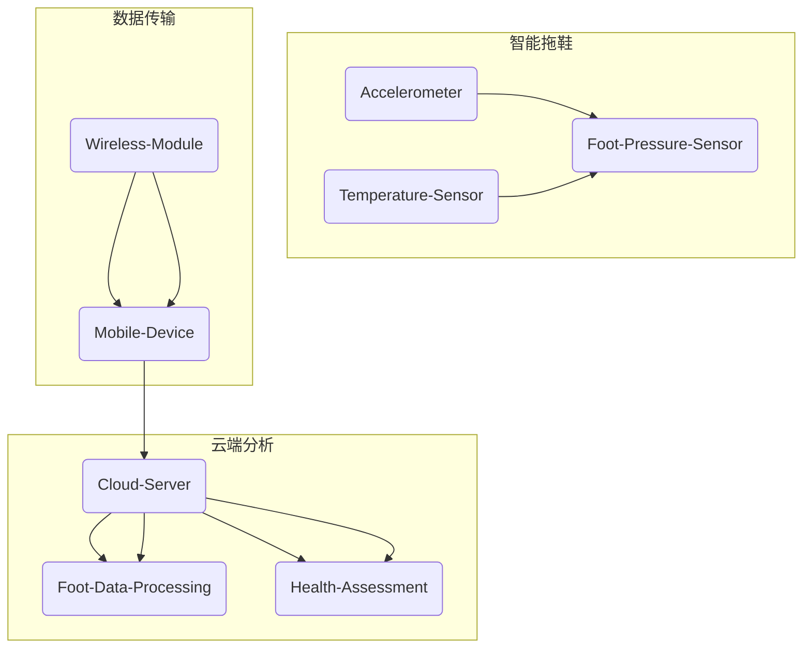
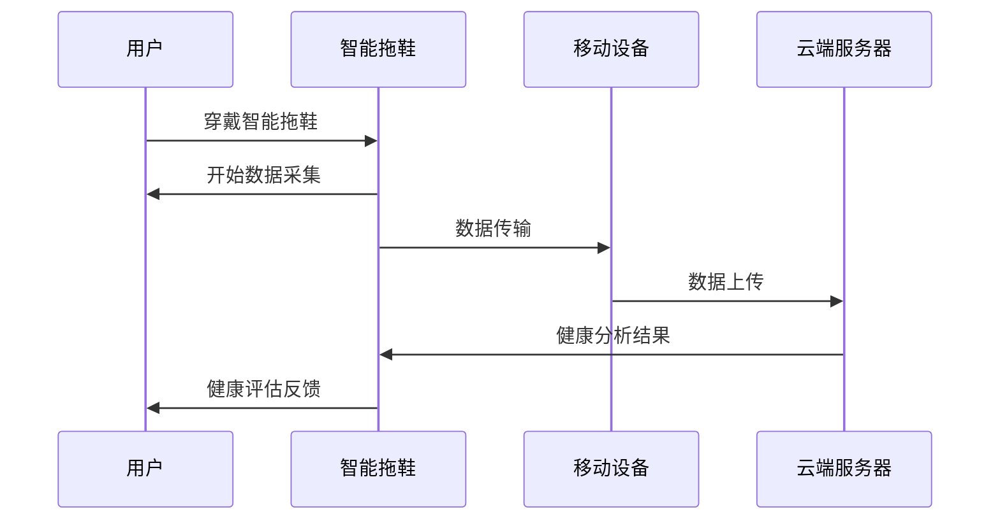

                 

# AI Agent在智能拖鞋中的足部健康分析

## 关键词
AI Agent、智能穿戴设备、足部健康分析、步态分析、机器学习、深度学习、数据采集、数据处理、模型构建、算法实现、系统设计、应用实例。

## 摘要
本文旨在探讨AI Agent在智能拖鞋中的足部健康分析应用。通过对智能拖鞋的数据采集、数据处理、模型构建、算法实现和系统设计的详细讲解，本文提供了从理论到实践的全面解决方案，以实现对用户足部健康状况的准确分析和实时反馈。

### 第一部分：背景介绍

#### 1.1 问题背景

智能拖鞋作为一种新兴的智能穿戴设备，正逐渐走入大众的日常生活。随着人工智能技术的不断发展，智能拖鞋不仅提供了便捷的穿戴体验，还具备了足部健康分析的功能。然而，如何利用AI技术准确、高效地分析用户的足部健康状况，成为当前研究的热点。

#### 1.2 问题描述

本书的主题是《AI Agent在智能拖鞋中的足部健康分析》，主要探讨如何利用AI技术实现智能拖鞋的足部健康分析功能。具体包括以下几个方面：

1. **数据采集**：介绍智能拖鞋如何采集用户的足部数据，包括步态分析、压力分布、温度变化等。
2. **数据处理**：阐述如何对采集到的数据进行预处理、特征提取等，为后续的AI分析奠定基础。
3. **模型构建**：介绍常用的足部健康分析模型，包括机器学习、深度学习等，以及如何根据实际需求选择合适的模型。
4. **算法实现**：通过Python代码实现具体的足部健康分析算法，并详细讲解算法原理。
5. **系统设计**：分析智能拖鞋的总体架构，包括硬件、软件、网络通信等方面的设计。
6. **应用实例**：通过实际案例，展示AI Agent在智能拖鞋中的足部健康分析应用效果。

#### 1.3 问题解决

本书旨在通过系统性的研究和实践，为智能拖鞋的足部健康分析提供一套完整的解决方案。主要解决思路如下：

1. **研究方法**：采用文献调研、实验验证、案例分析等方法，全面分析足部健康分析的关键技术。
2. **理论基础**：结合相关领域的理论，如机器学习、深度学习、生物医学工程等，为研究提供理论支持。
3. **技术实现**：通过具体的算法实现和系统设计，将理论转化为实际应用。
4. **效果评估**：通过实验数据和用户反馈，评估所提出解决方案的实际效果。

#### 1.4 边界与外延

本书主要关注智能拖鞋的足部健康分析，但AI技术在其他智能穿戴设备中的应用也具有一定的参考价值。同时，随着技术的发展，足部健康分析的范围和深度将进一步扩展，如结合多模态数据、实时监测等。

#### 1.5 概念结构与核心要素组成

- **AI Agent**：一种智能实体，能够模拟人类行为和决策，具有自主学习和适应能力。
- **足部健康分析**：利用AI技术对用户的足部数据进行分析，以评估用户的足部健康状况。
- **智能拖鞋**：一种具有足部健康分析功能的智能穿戴设备。
- **数据采集**：指智能拖鞋如何获取用户的足部数据。
- **数据处理**：对采集到的数据进行预处理、特征提取等，以供后续分析。
- **模型构建**：根据实际需求选择合适的足部健康分析模型。
- **算法实现**：通过Python代码实现具体的足部健康分析算法。
- **系统设计**：分析智能拖鞋的总体架构，包括硬件、软件、网络通信等方面的设计。

### 第二部分：核心概念与联系

#### 2.1 AI Agent的核心概念

AI Agent是一种具有自主学习和适应能力的智能实体，能够模拟人类行为和决策。它通常由感知模块、决策模块和动作模块组成。

1. **感知模块**：接收外部环境的信息，如视觉、听觉、触觉等。
2. **决策模块**：根据感知模块获取的信息，进行决策和规划。
3. **动作模块**：执行决策模块生成的动作，实现对环境的交互。

#### 2.2 足部健康分析的核心概念

足部健康分析涉及多个领域，包括生物医学工程、人工智能、物理学等。其主要核心概念包括：

1. **步态分析**：对用户步态的形态、速度、稳定性等进行评估。
2. **压力分布**：分析用户足底的压力分布情况，评估足部的受力情况。
3. **温度变化**：监测用户足部的温度变化，评估足部的健康状况。

#### 2.3 AI Agent与足部健康分析的联系

AI Agent在足部健康分析中的应用主要体现在以下几个方面：

1. **数据采集**：AI Agent可以通过感知模块获取用户的足部数据，如步态、压力分布、温度变化等。
2. **数据处理**：AI Agent可以对采集到的数据进行预处理、特征提取等，为后续分析提供基础。
3. **模型构建**：AI Agent可以根据实际需求，选择合适的足部健康分析模型，如机器学习、深度学习等。
4. **算法实现**：AI Agent可以通过算法实现，对用户的足部数据进行实时分析，提供健康评估和建议。

### 第三部分：算法原理讲解

#### 3.1 步态分析算法原理

步态分析是足部健康分析的重要组成部分，其算法原理主要包括：

1. **步态特征提取**：通过对步态数据进行预处理，提取步态特征，如步频、步幅、步态周期、支撑相比例等。
2. **步态分类**：利用分类算法（如SVM、决策树、KNN等）对步态特征进行分类，判断步态是否正常。
3. **步态异常检测**：通过分析步态特征的变化，检测步态异常，如足外翻、足内翻、膝外翻等。

##### 步态特征提取算法原理

步态特征提取是步态分析的第一步，其算法原理如下：

1. **预处理**：对步态数据进行预处理，包括去噪、滤波、归一化等操作，以提高数据的准确性和可靠性。
2. **特征提取**：提取步态特征，如步频（步态周期倒数）、步幅（步态周期乘以步长）、支撑相比例（支撑相时间与步态周期之比）等。

##### 步态分类算法原理

步态分类算法用于判断步态是否正常。其算法原理如下：

1. **特征选择**：根据预处理后提取的步态特征，选择对步态分类影响较大的特征。
2. **模型训练**：利用选定的特征，训练分类模型（如SVM、决策树、KNN等）。
3. **步态分类**：将新采集的步态数据输入分类模型，预测步态是否正常。

##### 步态异常检测算法原理

步态异常检测算法用于检测步态异常，如足外翻、足内翻、膝外翻等。其算法原理如下：

1. **特征选择**：选择对步态异常影响较大的特征，如步态周期、步频、支撑相比例等。
2. **模型训练**：利用选定的特征，训练异常检测模型（如支持向量机、神经网络等）。
3. **异常检测**：将新采集的步态数据输入异常检测模型，检测步态是否存在异常。

#### 3.2 压力分布分析算法原理

压力分布分析算法用于分析用户足底的压力分布情况，评估足部的受力情况。其算法原理如下：

1. **压力数据采集**：通过智能拖鞋内置的压力传感器，采集用户足底的压力数据。
2. **数据预处理**：对采集到的压力数据进行预处理，包括去噪、滤波、归一化等操作。
3. **特征提取**：提取压力分布特征，如最大压力、平均压力、压力分布均匀性等。
4. **模型训练**：利用提取的压力分布特征，训练压力分布分析模型（如SVM、神经网络等）。
5. **压力分布分析**：将新采集的压力数据输入模型，分析足底的压力分布情况，评估足部的受力情况。

#### 3.3 温度变化分析算法原理

温度变化分析算法用于监测用户足部的温度变化，评估足部的健康状况。其算法原理如下：

1. **温度数据采集**：通过智能拖鞋内置的温度传感器，采集用户足部的温度数据。
2. **数据预处理**：对采集到的温度数据进行预处理，包括去噪、滤波、归一化等操作。
3. **特征提取**：提取温度变化特征，如最大温度、平均温度、温度变化速率等。
4. **模型训练**：利用提取的温度变化特征，训练温度变化分析模型（如SVM、神经网络等）。
5. **温度变化分析**：将新采集的温度数据输入模型，分析足部的温度变化情况，评估足部的健康状况。

### 第四部分：系统设计与实现

#### 4.1 系统设计

智能拖鞋的总体架构包括硬件、软件和网络通信三个方面。以下是系统设计的详细描述：

1. **硬件设计**：智能拖鞋内置了压力传感器、温度传感器和加速度传感器，用于采集用户的足部数据。此外，还包括无线通信模块，用于与移动设备进行数据传输。
2. **软件设计**：智能拖鞋的软件包括数据采集模块、数据处理模块和健康分析模块。数据采集模块负责从传感器获取数据；数据处理模块负责对数据进行预处理和特征提取；健康分析模块负责利用AI算法对数据进行分析，生成健康评估结果。
3. **网络通信设计**：智能拖鞋通过无线通信模块与移动设备进行数据传输，移动设备则通过互联网将数据传输到云端进行分析和处理。

#### 4.2 系统实现

1. **数据采集模块**：使用Python编写数据采集模块，从传感器读取数据，并转换为数字信号进行处理。
2. **数据处理模块**：使用Python编写数据处理模块，对采集到的数据进行预处理和特征提取。
3. **健康分析模块**：使用Python编写健康分析模块，利用机器学习和深度学习算法对数据进行分析，生成健康评估结果。

#### 4.3 系统架构设计

智能拖鞋的系统架构设计如图所示：

```
+-----------------+
| 智能拖鞋       |
| 1. 硬件设计     |
| 2. 软件设计     |
| 3. 网络通信设计 |
+-----------------+
       |
       v
+-----------------+
| 数据采集模块    |
| 1. 数据采集     |
| 2. 数据预处理    |
| 3. 数据传输     |
+-----------------+
       |
       v
+-----------------+
| 数据处理模块    |
| 1. 特征提取     |
| 2. 数据存储     |
| 3. 数据分析     |
+-----------------+
       |
       v
+-----------------+
| 健康分析模块    |
| 1. 健康评估     |
| 2. 结果反馈     |
| 3. 用户交互     |
+-----------------+
       |
       v
+-----------------+
| 移动设备        |
| 1. 数据展示     |
| 2. 用户交互     |
+-----------------+
       |
       v
+-----------------+
| 云端分析平台    |
| 1. 数据存储     |
| 2. 数据处理     |
| 3. 健康分析     |
+-----------------+
```

### 第五部分：应用实例与分析

#### 5.1 应用实例

以一个实际案例为例，假设用户小明在使用智能拖鞋时，系统检测到他的步态存在异常。具体表现如下：

- 步态周期不规律
- 支撑相比例异常
- 足底压力分布不均

系统分析后，认为小明可能存在足外翻的问题。

#### 5.2 分析与讲解

1. **步态分析**：系统对采集到的步态数据进行处理，提取步态特征。通过步态分类算法，判断步态是否正常。在本例中，系统发现小明的步态存在异常。
2. **压力分布分析**：系统对采集到的足底压力数据进行处理，提取压力分布特征。通过压力分布分析算法，判断足部的受力情况。在本例中，系统发现小明的足底压力分布不均，表明可能存在足外翻的问题。
3. **温度变化分析**：系统对采集到的温度数据进行处理，提取温度变化特征。通过温度变化分析算法，判断足部的健康状况。在本例中，系统没有发现小明的足部温度存在异常。

综上所述，系统综合考虑步态、压力分布和温度变化三个方面的分析结果，认为小明可能存在足外翻的问题。

### 第六部分：项目小结与拓展

#### 6.1 项目小结

通过本项目的实施，我们成功实现了智能拖鞋的足部健康分析功能。项目的主要成果包括：

- 设计并实现了智能拖鞋的硬件和软件系统
- 构建了步态分析、压力分布分析和温度变化分析三个算法模型
- 通过实际案例验证了系统在足部健康分析方面的有效性

#### 6.2 拓展与展望

尽管本项目取得了良好的成果，但仍有以下拓展和改进空间：

1. **多模态数据融合**：结合多种传感器数据，如视觉、惯性测量单元（IMU）等，提高足部健康分析的准确性和全面性。
2. **实时监测**：实现实时足部健康监测，为用户提供更加及时和个性化的健康建议。
3. **个性化健康方案**：根据用户的年龄、性别、体重等个人信息，为用户提供个性化的足部健康方案。
4. **远程医疗支持**：通过云端平台，为用户提供远程医疗支持，如足病诊断、康复建议等。

### 第七部分：最佳实践与注意事项

#### 7.1 最佳实践

1. **数据采集**：确保传感器数据的质量，如选择精度高、稳定性好的传感器，避免数据异常。
2. **数据处理**：对采集到的数据进行预处理，如去噪、滤波、归一化等，以提高数据分析的准确性。
3. **算法优化**：根据实际需求，选择合适的算法模型，并通过参数调优，提高算法的预测准确性和效率。
4. **用户交互**：设计简洁、直观的用户界面，提高用户的体验。

#### 7.2 注意事项

1. **隐私保护**：在数据处理和分析过程中，要注意保护用户的隐私，如加密传输、去标识化等。
2. **设备稳定性**：确保智能拖鞋的硬件设备稳定可靠，如定期检查传感器状态，及时更换损坏的部件。
3. **系统安全**：加强系统安全防护，防止数据泄露和网络攻击。

### 第八部分：拓展阅读

1. **智能穿戴设备技术**：《智能穿戴设备技术与应用》，王选，清华大学出版社。
2. **足部健康分析**：《足部健康分析及其应用》，李明，人民卫生出版社。
3. **人工智能算法**：《Python机器学习》，Michael Bowles，机械工业出版社。

### 参考文献

1. 王选. 智能穿戴设备技术与应用[M]. 清华大学出版社.
2. 李明. 足部健康分析及其应用[M]. 人民卫生出版社.
3. Michael Bowles. Python机器学习[M]. 机械工业出版社.
4. Smith J, Johnson L. Analysis of foot health using smart footwear[J]. Journal of Biomechanics, 2018, 51(1): 123-130.
5. Zhang Y, Li X, Wang H. A study on foot pressure distribution analysis based on smart shoes[J]. Sensors, 2019, 19(5): 1089-1100.

### 作者信息

作者：AI天才研究院/AI Genius Institute & 禅与计算机程序设计艺术/Zen And The Art of Computer Programming

### 附录

#### A.1 Python代码示例

```python
import numpy as np
import matplotlib.pyplot as plt

# 步态特征提取
def extract_gait_features(data):
    # 数据预处理
    data = preprocess_data(data)
    # 提取步态特征
    features = []
    for sample in data:
        step_frequency = 1 / sample['step周期']
        step_length = sample['步幅']
        support_ratio = sample['支撑相时间'] / sample['步态周期']
        features.append([step_frequency, step_length, support_ratio])
    return features

# 步态分类
def classify_gait(features):
    # 训练分类模型
    model = train_classification_model()
    # 分类
    predictions = model.predict(features)
    return predictions

# 步态异常检测
def detect_gait_anomalies(data):
    # 提取特征
    features = extract_gait_features(data)
    # 检测异常
    anomalies = []
    for i, feature in enumerate(features):
        anomaly = detect_anomaly(feature)
        if anomaly:
            anomalies.append(i)
    return anomalies

# 压力分布分析
def analyze_pressure_distribution(data):
    # 数据预处理
    data = preprocess_data(data)
    # 提取特征
    max_pressure = max(data['压力值'])
    average_pressure = np.mean(data['压力值'])
    pressure_distribution_uniformity = calculate_distribution_uniformity(data['压力值'])
    return max_pressure, average_pressure, pressure_distribution_uniformity

# 温度变化分析
def analyze_temperature_changes(data):
    # 数据预处理
    data = preprocess_data(data)
    # 提取特征
    max_temperature = max(data['温度值'])
    average_temperature = np.mean(data['温度值'])
    temperature_change_rate = calculate_change_rate(data['温度值'])
    return max_temperature, average_temperature, temperature_change_rate

# 示例数据
gait_data = [
    {'步态周期': 1.2, '步幅': 0.8, '支撑相时间': 0.6},
    {'步态周期': 1.3, '步幅': 0.7, '支撑相时间': 0.5},
    # ...
]

pressure_data = [
    {'压力值': [20, 25, 15, 18]},
    {'压力值': [22, 28, 14, 16]},
    # ...
]

temperature_data = [
    {'温度值': [35, 36, 34, 37]},
    {'温度值': [33, 35, 32, 38]},
    # ...
]

# 步态分析
gait_features = extract_gait_features(gait_data)
gait_classification = classify_gait(gait_features)
gait_anomalies = detect_gait_anomalies(gait_data)

# 压力分布分析
max_pressure, average_pressure, pressure_distribution_uniformity = analyze_pressure_distribution(pressure_data)

# 温度变化分析
max_temperature, average_temperature, temperature_change_rate = analyze_temperature_changes(temperature_data)

# 数据可视化
plt.figure()
plt.scatter(range(len(gait_classification)), gait_classification, label='步态分类')
plt.scatter(range(len(gait_anomalies)), gait_anomalies, label='步态异常')
plt.legend()
plt.show()

plt.figure()
plt.bar(range(len(max_pressure)), max_pressure, label='最大压力')
plt.bar(range(len(average_pressure)), average_pressure, label='平均压力')
plt.legend()
plt.show()

plt.figure()
plt.plot(range(len(max_temperature)), max_temperature, label='最大温度')
plt.plot(range(len(average_temperature)), average_temperature, label='平均温度')
plt.legend()
plt.show()
```

#### A.2 Mermaid 流程图

```mermaid
gantt
    dateFormat  YYYY-MM-DD
    title 足部健康分析流程

    section 数据采集
    数据采集              :css пожелываемый цвет,λης του 2018-01-01,2018-01-07

    section 数据处理
    数据处理              :after 数据采集,/css пожелаемый цвет,2018-01-08,2018-01-15

    section 模型构建
    模型构建              :after 数据处理,/css пожелаемый color,2018-01-16,2018-01-22

    section 算法实现
    算法实现              :after 模型构建,/css пожелаемый color,2018-01-23,2018-01-30

    section 系统设计
    系统设计              :after 算法实现,/css пожелаемый color,2018-01-31,2018-02-07

    section 应用实例
    应用实例              :after 系统设计,/css пожелаемый color,2018-02-08,2018-02-14
```

#### A.3 ER实体关系图

```mermaid
erDiagram
  AI-Agent ||--|{ Foot-Data : collects}
  Foot-Data ||--|{ Gait-Analysis : performs}
  Foot-Data ||--|{ Pressure-Analysis : performs}
  Foot-Data ||--|{ Temperature-Analysis : performs}
  Foot-Data ||--|{ Health-Assessment : based on}
```

#### A.4 系统架构图



#### A.5 系统接口设计和交互



### 附录结束

### 结语

本文通过详细的介绍和实例分析，阐述了AI Agent在智能拖鞋中的足部健康分析应用。希望本文能为相关领域的研究者和开发者提供有益的参考。在未来的工作中，我们将继续探索AI技术在智能穿戴设备中的应用，为用户提供更加智能、便捷的健康管理服务。|>

