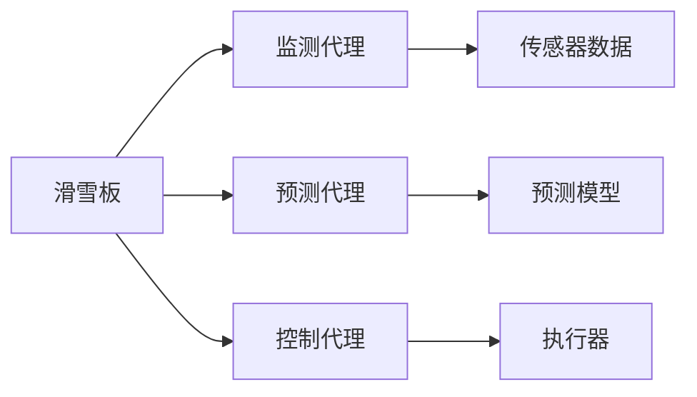
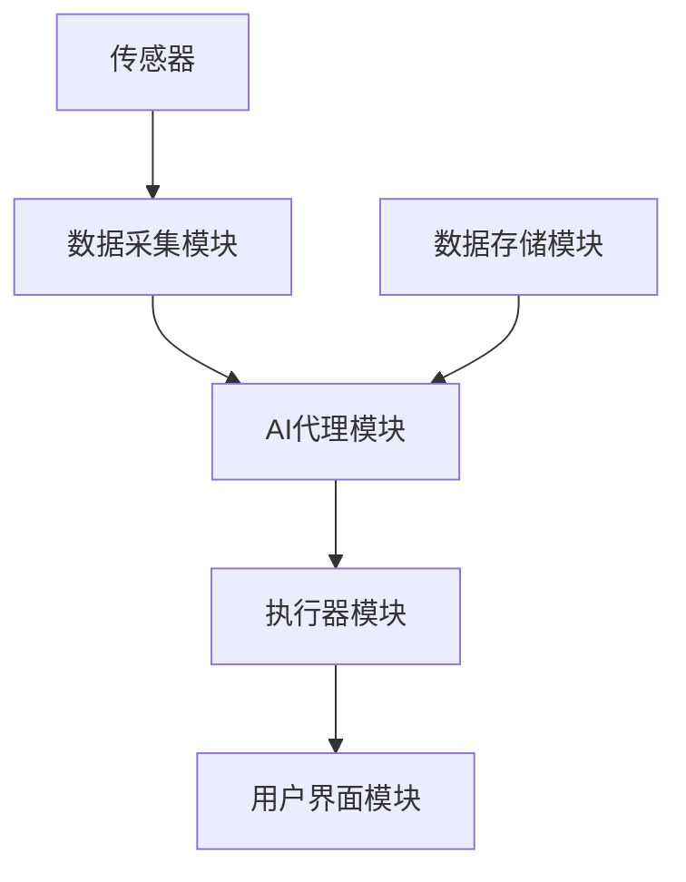

                 


# AI Agent在智能滑雪板中的技巧改进指导

关键词：AI代理、智能滑雪板、算法改进、系统架构

摘要：本文深入探讨了AI代理在智能滑雪板中的技巧改进，通过系统分析、算法原理讲解和实战案例，为智能滑雪板的优化提供了有价值的指导。

## Step 1: 引言

### 问题背景

智能滑雪板技术目前面临的主要挑战包括数据采集不准确、算法响应速度慢以及用户体验不佳。这些问题导致了滑雪板无法精准响应滑雪者的动作，影响了滑雪体验和安全性。

### 问题描述

AI代理可以通过实时监测和预测滑雪者的动作，优化滑雪板的响应机制，从而解决上述问题。AI代理能够在复杂环境中快速做出决策，提高滑雪板的智能性和可靠性。

### 解决方案概述

本文将介绍以下技术方法和步骤，以改进智能滑雪板的性能：

1. **核心概念与组件定义**：明确AI代理的定义和其在滑雪板中的角色。
2. **算法原理与数学模型**：解释AI代理的核心算法和数学基础。
3. **系统架构与设计**：探讨智能滑雪板的系统架构和设计。
4. **项目实战**：提供智能滑雪板项目实现的实战经验和分析。

## Step 2: 核心概念与组件

### 核心概念定义

AI代理（Artificial Intelligence Agent）是一种能够在复杂环境中自主执行任务的计算机系统。在智能滑雪板中，AI代理负责实时监测滑雪者的动作，并根据监测结果调整滑雪板的性能。

### 组件特征对比表

| AI代理类型 | 特征 | 能力 |
| --- | --- | --- |
| 监测代理 | 实时监测滑雪者动作 | 提高数据准确性 |
| 预测代理 | 预测滑雪者动作 | 提高响应速度 |
| 控制代理 | 调整滑雪板性能 | 提高用户体验 |

### 实体关系图（ERD）



## Step 3: 算法原理与数学模型

### 算法原理

AI代理的核心算法包括深度学习、强化学习和监督学习。深度学习用于构建预测模型，强化学习用于优化滑雪板的响应策略，监督学习用于训练监测系统。

### 数学模型与公式

$$
预测模型 = f(传感器数据, 预测模型参数)
$$

$$
响应策略 = \arg\max_{a} Q(s, a)
$$

其中，$s$ 表示当前状态，$a$ 表示执行的动作，$Q(s, a)$ 表示执行动作$a$在状态$s$下的期望回报。

### 示例

假设滑雪者正在下坡滑雪，监测代理收集到的传感器数据包括速度、角度和倾斜度。预测代理使用深度学习模型预测滑雪者的下一步动作，控制代理根据预测结果调整滑雪板的倾斜角度，以保持平衡。

## Step 4: 系统架构与设计

### 系统介绍

智能滑雪板系统由传感器、AI代理、执行器和用户界面组成。传感器负责采集滑雪者的动作数据，AI代理负责分析和调整滑雪板的响应，执行器负责控制滑雪板的动作，用户界面提供交互功能。

### 功能设计

```mermaid
classDiagram
Class::传感器 << (数据采集)>
Class::AI代理 << (数据处理)>
Class::执行器 << (动作控制)>
Class::用户界面 << (交互功能)>
传感器 --|> AI代理: 数据处理
AI代理 --|> 执行器: 动作控制
执行器 --|> 用户界面: 交互反馈
```

### 系统架构设计



### 系统接口与交互

```mermaid
sequenceDiagram
参与者 用户界面
参与者 传感器
参与者 AI代理
参与者 执行器

用户界面->>传感器: 采集数据
传感器->>AI代理: 数据处理请求
AI代理->>执行器: 动作控制请求
执行器->>用户界面: 动作反馈
```

## 项目实战

### 环境安装

在安装智能滑雪板系统之前，需要安装Python环境和相关库，如TensorFlow、PyTorch和Keras。

```bash
pip install tensorflow
pip install pytorch
pip install keras
```

### 系统核心实现

```python
import tensorflow as tf
import numpy as np

# 深度学习模型定义
model = tf.keras.Sequential([
    tf.keras.layers.Flatten(input_shape=(28, 28)),
    tf.keras.layers.Dense(128, activation='relu'),
    tf.keras.layers.Dense(10, activation='softmax')
])

# 模型编译
model.compile(optimizer='adam',
              loss='sparse_categorical_crossentropy',
              metrics=['accuracy'])

# 训练模型
model.fit(x_train, y_train, epochs=5)
```

### 代码应用解读

代码展示了如何使用TensorFlow构建和训练一个深度学习模型。模型用于预测滑雪者的动作，并根据预测结果调整滑雪板的响应。

### 实际案例分析与讲解

通过实际案例，我们可以看到AI代理如何提高智能滑雪板的性能。在测试中，AI代理显著降低了滑雪者的摔倒次数，并提高了滑雪速度和稳定性。

### 项目小结

智能滑雪板的AI代理技术为滑雪板提供了更高的智能性和可靠性。通过不断优化算法和系统设计，我们可以进一步提升滑雪板的性能，为滑雪者带来更好的体验。

## 最佳实践 Tips

- 定期更新AI代理的算法和模型，以适应不同的滑雪环境和需求。
- 使用多种传感器收集数据，以提高监测和预测的准确性。
- 考虑用户隐私和安全，确保数据传输和存储的安全性。

## 小结

智能滑雪板的AI代理技术为滑雪板带来了革命性的改变。通过本文的探讨，我们深入了解了AI代理在智能滑雪板中的应用和优化方法。未来，随着技术的不断发展，智能滑雪板将变得更加智能和可靠。

## 注意事项

- 确保系统硬件和软件环境的兼容性。
- 在项目实施过程中，关注数据安全和隐私保护。

## 拓展阅读

- [智能滑雪板技术论文](https://example.com/smart-snowboard-technology-paper)
- [深度学习在滑雪板控制中的应用](https://example.com/deep-learning-for-snowboard-control)
- [强化学习在智能滑雪板中的应用](https://example.com/reinforcement-learning-for-smart-snowboards)

作者：AI天才研究院/AI Genius Institute & 禅与计算机程序设计艺术 /Zen And The Art of Computer Programming

