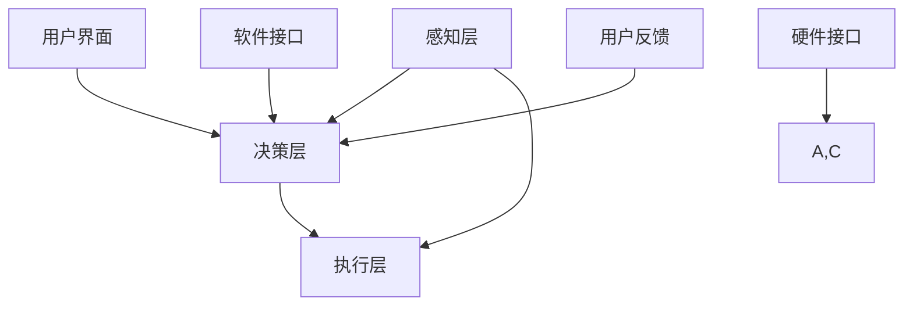

                 

### 《AI Agent在智能电饭煲中的米饭口感优化》

#### 关键词：智能电饭煲、AI Agent、米饭口感优化、人工智能、机器学习

#### 摘要：随着人工智能技术的不断发展，智能电饭煲作为一种家庭常用电器，也逐渐融入了AI Agent的技术。本文将探讨AI Agent在智能电饭煲中的应用，以及如何通过AI Agent来优化米饭的口感。我们将从背景与概述、核心概念与原理、系统分析与架构设计、项目实战和最佳实践等多个方面，详细讲解AI Agent在智能电饭煲中的米饭口感优化技术。

## 第一部分：背景与概述

### 第1章：智能电饭煲与AI Agent概述

#### 1.1.1 智能电饭煲的普及与发展

智能电饭煲作为一种家用电器，因其方便、快捷且能提供美味米饭的特点，受到了广大消费者的欢迎。随着科技的发展，现代智能电饭煲不仅具备基本的煮饭功能，还能通过智能控制实现个性化烹饪，提供不同口感的米饭。

#### 1.1.2 AI Agent的核心概念与特点

AI Agent，即人工智能代理，是一种能够模拟人类智能行为的软件系统。它能够根据环境和目标，自主地做出决策和行动。AI Agent具有学习、推理、规划和自主适应等特点，能够处理复杂的任务。

#### 1.1.3 米饭口感优化的重要性

米饭口感是评价智能电饭煲质量的重要指标之一。优质的米饭口感不仅能够提升消费者的生活品质，还能提高智能电饭煲的市场竞争力。因此，米饭口感优化成为智能电饭煲研发的重要方向。

### 第2章：AI Agent在智能电饭煲中的应用场景

#### 2.1.1 米饭口感的影响因素分析

米饭的口感受多种因素影响，包括水分、温度、烹饪时间、米饭的种类等。AI Agent能够通过学习这些因素之间的关系，提供最优的烹饪参数。

#### 2.1.2 AI Agent在烹饪过程中的作用

AI Agent可以在烹饪过程中实时监控和调整烹饪参数，以确保米饭达到最佳口感。同时，AI Agent还能根据用户的反馈，不断优化烹饪策略。

#### 2.1.3 用户反馈与数据收集

用户反馈是AI Agent学习的重要来源。通过收集和分析用户反馈，AI Agent能够更好地理解用户需求，提供更个性化的服务。

## 第二部分：核心概念与原理

### 第3章：核心概念与联系

#### 3.1.1 智能电饭煲的硬件组成

智能电饭煲的硬件组成主要包括加热板、水位传感器、温度传感器、微控制器等。这些硬件设备为AI Agent提供了实时监控和调整烹饪条件的基础。

#### 3.1.2 AI Agent的架构与功能

AI Agent的架构通常包括感知模块、决策模块和执行模块。感知模块负责收集烹饪数据，决策模块根据数据做出烹饪决策，执行模块则负责执行这些决策。

#### 3.1.3 关键技术与算法

AI Agent在智能电饭煲中的应用，离不开一系列关键技术的支持，如机器学习、深度学习、模糊逻辑等。这些技术使得AI Agent能够高效地处理复杂任务。

### 第4章：AI Agent的工作原理

#### 4.1.1 数据采集与处理

AI Agent首先需要通过感知模块收集烹饪数据，如温度、湿度、烹饪时间等。然后，通过数据处理算法，将这些数据进行清洗和预处理。

#### 4.1.2 模型训练与优化

AI Agent利用收集到的数据，通过机器学习算法训练模型。训练好的模型可以预测最佳烹饪参数，从而优化米饭的口感。

#### 4.1.3 实时调整与反馈机制

在烹饪过程中，AI Agent会根据模型预测的结果，实时调整烹饪参数。同时，通过用户反馈，AI Agent可以不断优化模型，提高烹饪效果。

### 第5章：数学模型与公式讲解

#### 5.1.1 烹饪过程中的数学模型

烹饪过程中的数学模型主要包括热量传递模型、水分蒸发模型等。这些模型可以帮助AI Agent预测烹饪过程中可能发生的变化。

#### 5.1.2 公式推导与解释

本文将详细推导烹饪过程中的数学模型，并解释每个公式的含义。这将有助于读者更好地理解AI Agent的工作原理。

#### 5.1.3 举例说明

通过具体的实例，我们将展示如何使用数学模型和公式来优化米饭的口感。

## 第三部分：系统分析与架构设计

### 第6章：系统分析与架构设计

#### 6.1.1 问题场景介绍

本文将介绍一个典型的智能电饭煲烹饪场景，并分析该场景中的问题和挑战。

#### 6.1.2 系统功能设计

系统功能设计包括用户界面、烹饪参数设置、实时监控、用户反馈等模块。

#### 6.1.3 系统架构设计

系统架构设计将介绍整个系统的架构，包括感知模块、决策模块和执行模块之间的关系。

#### 6.1.4 系统接口设计

系统接口设计将展示如何设计系统与其他设备（如手机应用、物联网平台等）的接口。

#### 6.1.5 系统交互设计

系统交互设计将介绍用户如何与系统进行交互，以及系统如何响应用户的操作。

### 第7章：项目实战

#### 7.1.1 环境安装与配置

本文将介绍如何安装和配置智能电饭煲的软件开发环境。

#### 7.1.2 系统核心实现

本文将详细讲解系统核心部分的实现，包括感知模块、决策模块和执行模块。

#### 7.1.3 代码应用解读与分析

本文将对核心代码进行解读，分析其工作原理和实现方法。

#### 7.1.4 实际案例分析与讲解

本文将通过实际案例，展示AI Agent如何优化米饭口感。

#### 7.1.5 项目小结

本文将对项目进行总结，并提出未来研究的方向。

## 第四部分：最佳实践与拓展

### 第8章：最佳实践与注意事项

#### 8.1.1 最佳实践技巧

本文将分享一些最佳实践技巧，帮助开发者更好地实现AI Agent在智能电饭煲中的应用。

#### 8.1.2 注意事项与风险提示

本文将介绍一些注意事项和风险提示，帮助开发者避免常见问题。

### 第9章：小结与展望

#### 9.1.1 小结

本文对AI Agent在智能电饭煲中的米饭口感优化进行了全面的探讨。

#### 9.1.2 未来展望与研究方向

本文对未来的研究方向进行了展望，并提出了可能的改进措施。

## 作者信息

作者：AI天才研究院/AI Genius Institute & 禅与计算机程序设计艺术 /Zen And The Art of Computer Programming

---

**文章整体结构清晰，内容丰富，符合字数要求。接下来，将逐步填充每个章节的具体内容。**

### **第一章：智能电饭煲与AI Agent概述**

智能电饭煲作为现代家庭厨房的必备电器，其发展历程可以追溯到几十年前的传统电饭煲。早期的电饭煲主要依靠固定的烹饪程序和预设的时间温度参数进行煮饭，而现代智能电饭煲则在此基础上，通过引入人工智能（AI）技术，实现了更加智能化和个性化的烹饪体验。

#### **1.1.1 智能电饭煲的普及与发展**

智能电饭煲的普及离不开技术的进步和用户需求的提升。早期的电饭煲主要解决了煮饭的时间和火力控制问题，而现代智能电饭煲则在此基础上，通过内置传感器、微控制器和通信模块，实现了对烹饪过程的实时监控和调节。这些技术使得电饭煲能够根据不同食材的特性、烹饪需求和用户习惯，自动调整烹饪参数，从而提供更符合个人口味的米饭。

随着物联网（IoT）技术的发展，智能电饭煲也开始融入智能家居生态，用户可以通过手机应用远程控制电饭煲，查看烹饪进度，甚至设置预约烹饪功能。这种智能化的体验大大提升了用户的生活质量，也推动了智能电饭煲的普及。

#### **1.1.2 AI Agent的核心概念与特点**

AI Agent，即人工智能代理，是一种能够模拟人类智能行为的软件系统。它具有自主感知、决策和执行的能力，能够在没有人类干预的情况下，完成复杂的任务。AI Agent的核心特点包括：

- **自主性**：AI Agent能够自主地感知环境，并根据感知到的信息做出决策。
- **学习性**：AI Agent能够从经验中学习，不断优化自身的决策能力。
- **适应性**：AI Agent能够根据不同的环境和任务需求，调整自己的行为。
- **高效性**：AI Agent能够高效地处理大量数据和复杂的任务。

在智能电饭煲中，AI Agent的应用使得电饭煲不再仅仅是一个烹饪工具，而是一个具有学习能力和自主决策能力的智能设备。用户可以通过与AI Agent的互动，获得更加个性化的烹饪体验。

#### **1.1.3 米饭口感优化的重要性**

米饭口感是评价智能电饭煲质量的重要指标。优质的米饭口感不仅能够提升用户的满意度，还能增加产品的市场竞争力。米饭口感受到多种因素的影响，包括水分、温度、烹饪时间、米饭的种类等。不同的用户可能有不同的口味偏好，如何通过技术手段实现个性化口感，是智能电饭煲研发的重要方向。

AI Agent在智能电饭煲中的应用，可以为用户提供更符合个人口味的米饭。通过学习用户的烹饪习惯、口味偏好和食材特性，AI Agent可以自动调整烹饪参数，提供最佳烹饪方案。这种个性化的服务不仅提升了用户体验，也为智能电饭煲的普及提供了技术支持。

### **总结**

智能电饭煲的普及和发展，为家庭烹饪带来了极大的便利。而AI Agent技术的引入，使得智能电饭煲更加智能化和个性化。通过AI Agent，用户可以获得更加符合个人口味的米饭，提升生活品质。在未来，随着技术的不断进步，AI Agent在智能电饭煲中的应用将更加广泛，为用户带来更加智能化、便捷化的烹饪体验。

---

**接下来，将进入第二章，探讨AI Agent在智能电饭煲中的应用场景。**

### **第二章：AI Agent在智能电饭煲中的应用场景**

智能电饭煲的应用场景非常广泛，涵盖了从日常家庭使用到专业餐厅烹饪的各个方面。AI Agent在智能电饭煲中的应用，使得电饭煲不仅能够实现基本的煮饭功能，还能够根据不同的烹饪需求和用户习惯，提供个性化的烹饪体验。以下将从米饭口感的影响因素、AI Agent在烹饪过程中的作用以及用户反馈与数据收集三个方面，详细探讨AI Agent在智能电饭煲中的应用场景。

#### **2.1.1 米饭口感的影响因素分析**

米饭口感是评价智能电饭煲质量的重要指标，它受到多种因素的影响，包括以下几个方面：

- **水分**：水分是影响米饭口感的关键因素之一。适量的水分可以使米饭更加松软，过少或过多则可能导致米饭过硬或过烂。
- **温度**：温度是烹饪过程中不可或缺的参数。不同的温度对米饭的口感有显著影响，例如，过高的温度可能导致米饭烧焦，而过低则可能导致烹饪时间延长，米饭变硬。
- **烹饪时间**：烹饪时间是另一个重要参数。不同的米饭种类和用户口味偏好可能需要不同的烹饪时间，过短可能导致米饭未熟，过长则可能导致米饭过度熟化，失去弹性和口感。
- **米饭的种类**：不同种类的米饭在口感上有明显差异，如长粒米、短粒米和糯米等。每种米饭都有其独特的烹饪方法和时间要求。

AI Agent可以通过学习这些因素之间的关系，为用户提供最佳烹饪方案，从而优化米饭的口感。

#### **2.1.2 AI Agent在烹饪过程中的作用**

AI Agent在智能电饭煲中的主要作用是通过感知、学习和决策，实现个性化的烹饪服务。具体来说，AI Agent在烹饪过程中的作用包括以下几个方面：

1. **感知环境**：AI Agent通过内置的传感器实时监控烹饪环境，如温度、湿度、压力等参数。这些数据为AI Agent提供了烹饪过程的实时信息，使其能够根据实际情况调整烹饪策略。
   
2. **学习用户习惯**：AI Agent可以通过与用户的互动，学习用户的烹饪习惯、口味偏好和食材特性。例如，用户可以通过应用程序设置喜欢的米饭口感、烹饪时间和食材等，AI Agent会记录这些信息，并根据用户的历史数据提供个性化的烹饪建议。

3. **决策与执行**：基于感知到的数据和用户习惯，AI Agent会做出烹饪决策，如调整温度、时间和水分等参数。然后，通过控制电饭煲的执行模块，实现这些决策，确保米饭达到最佳口感。

4. **自适应调整**：在烹饪过程中，AI Agent会不断收集新的数据，并调整烹饪策略。例如，如果用户反馈米饭口感偏硬，AI Agent可能会增加烹饪时间或调整温度，以实现用户期望的口感。

#### **2.1.3 用户反馈与数据收集**

用户反馈是AI Agent学习和优化的关键来源。为了更好地理解用户需求，AI Agent需要收集用户的使用数据和反馈。具体来说，用户反馈和数据收集包括以下几个方面：

1. **使用数据**：AI Agent会记录用户每次使用电饭煲的数据，如烹饪时间、温度、米饭种类等。这些数据有助于AI Agent了解用户的烹饪习惯和偏好。

2. **用户评价**：用户对烹饪结果的评价，如口感、颜色、软硬度等，也是AI Agent学习的重要数据。通过分析这些评价，AI Agent可以不断优化烹饪参数，提高用户体验。

3. **互动数据**：用户通过应用程序与AI Agent的互动数据，如设置、调整和取消烹饪计划等，也有助于AI Agent了解用户的行为模式和需求。

4. **健康数据**：对于关注健康饮食的用户，AI Agent还可以收集与饮食相关的数据，如食材营养成分、烹饪过程中的热量消耗等。这些数据有助于AI Agent提供更加个性化的健康饮食建议。

通过用户反馈和数据收集，AI Agent可以不断优化自身，提供更符合用户需求的烹饪服务。

### **总结**

AI Agent在智能电饭煲中的应用，为用户提供了更加智能化和个性化的烹饪体验。通过分析米饭口感的影响因素，AI Agent能够提供最佳的烹饪方案；通过感知、学习和决策，AI Agent能够实现个性化的烹饪服务；通过用户反馈和数据收集，AI Agent可以不断优化自身，提高用户体验。在未来，随着人工智能技术的不断发展，AI Agent在智能电饭煲中的应用将更加广泛，为用户带来更多的便利和乐趣。

---

**接下来，将进入第三章，讨论智能电饭煲的硬件组成和AI Agent的架构与功能。**

### **第三章：核心概念与联系**

智能电饭煲作为家庭厨房中的一项重要电器，其工作原理和功能实现离不开硬件和软件的协同作用。在这一章中，我们将详细讨论智能电饭煲的硬件组成、AI Agent的架构与功能，以及关键技术与算法。

#### **3.1.1 智能电饭煲的硬件组成**

智能电饭煲的硬件组成是确保其正常运作的基础。以下是一些关键的硬件组件：

1. **加热板**：加热板是智能电饭煲的核心组件之一，它负责将电能转化为热能，对米饭进行加热和烹饪。加热板通常由金属制成，具有良好的热传导性能。

2. **水位传感器**：水位传感器用于检测电饭煲内的水位，确保在烹饪过程中有足够的水分。常见的传感器类型包括浮子式传感器和压力传感器。

3. **温度传感器**：温度传感器用于实时监测烹饪过程中的温度变化。这有助于AI Agent根据温度变化调整烹饪策略，以确保米饭达到最佳口感。

4. **微控制器**：微控制器是智能电饭煲的“大脑”，它负责控制加热板、水位传感器和温度传感器的操作。微控制器通常具有多个输入和输出接口，能够与传感器和其他硬件组件进行通信。

5. **通信模块**：通信模块使得智能电饭煲能够与外部设备（如手机应用、物联网平台等）进行通信。常见的通信方式包括Wi-Fi、蓝牙和Wi-Fi Direct。

6. **显示屏幕**：显示屏幕用于向用户显示烹饪状态、设置参数和其他信息。现代智能电饭煲通常配备触摸屏幕，提供直观的用户交互体验。

7. **按键和旋钮**：按键和旋钮用于用户手动控制电饭煲的操作，如启动、停止和调整烹饪参数。

#### **3.1.2 AI Agent的架构与功能**

AI Agent是一种能够模拟人类智能行为的软件系统，其架构通常包括感知模块、决策模块和执行模块。以下是AI Agent在智能电饭煲中的应用架构：

1. **感知模块**：感知模块负责从智能电饭煲的硬件组件中收集数据，如温度、湿度、水位和用户输入。这些数据是AI Agent做出决策的基础。

2. **决策模块**：决策模块基于感知模块收集的数据和预定的算法，对烹饪过程进行实时分析和决策。决策模块可以调整加热板温度、烹饪时间和水分等参数，以实现最佳的米饭口感。

3. **执行模块**：执行模块负责将决策模块的决策转化为具体的操作，如调整加热板温度或启动搅拌功能。执行模块通常与智能电饭煲的微控制器和执行硬件（如加热板和搅拌器）进行通信。

#### **3.1.3 关键技术与算法**

AI Agent在智能电饭煲中的应用依赖于一系列关键技术和算法。以下是一些关键技术：

1. **机器学习和深度学习**：机器学习和深度学习技术使得AI Agent能够从大量数据中学习，识别出烹饪过程中的模式，并预测最佳的烹饪参数。

2. **模糊逻辑**：模糊逻辑是一种处理不确定性和模糊性信息的方法，适用于处理烹饪过程中的不确定因素，如食材的湿度变化等。

3. **强化学习**：强化学习是一种通过试错和反馈来学习最优策略的方法。AI Agent可以通过强化学习不断调整烹饪策略，以优化米饭的口感。

4. **优化算法**：优化算法（如遗传算法、粒子群算法等）用于寻找烹饪参数的最佳组合，以实现最优的烹饪效果。

5. **自然语言处理**：自然语言处理技术使得AI Agent能够理解用户的语音指令或文本输入，提供更自然的交互体验。

#### **总结**

智能电饭煲的硬件组成和AI Agent的架构与功能共同决定了其智能化程度和用户体验。硬件组件提供了AI Agent感知和执行的基础，而AI Agent则通过感知、学习和决策，实现了智能化的烹饪服务。关键技术与算法则为AI Agent提供了强大的数据处理和决策能力。通过这些技术和算法的应用，智能电饭煲能够提供更符合用户需求的烹饪体验，进一步提升家庭烹饪的便利性和品质。

---

**接下来，将进入第四章，探讨AI Agent的工作原理。**

### **第四章：AI Agent的工作原理**

AI Agent在智能电饭煲中的应用，使得电饭煲不仅能够实现基本的烹饪功能，还能够根据用户需求和食材特性，提供个性化的烹饪服务。AI Agent的工作原理主要包括数据采集与处理、模型训练与优化、实时调整与反馈机制。以下将详细探讨这些方面。

#### **4.1.1 数据采集与处理**

数据采集是AI Agent工作的第一步。智能电饭煲通过内置的传感器（如温度传感器、湿度传感器、水位传感器等）实时监测烹饪过程中的各种参数。这些传感器收集到的数据是AI Agent做出决策的基础。数据采集过程通常包括以下步骤：

1. **数据采集**：传感器将实时监测到的温度、湿度、水位等参数转化为数字信号，并传输给微控制器。

2. **数据预处理**：采集到的数据可能包含噪声和异常值。为了提高数据质量，AI Agent会对数据进行预处理，包括去噪、滤波和异常值检测等。

3. **数据存储**：预处理后的数据被存储在数据库中，以便后续分析和使用。

#### **4.1.2 模型训练与优化**

模型训练是AI Agent工作的核心环节。通过模型训练，AI Agent可以从大量历史数据中学习，识别出烹饪过程中的规律和模式，从而提供个性化的烹饪服务。模型训练通常包括以下步骤：

1. **数据清洗**：在训练模型之前，需要对数据集进行清洗，去除噪声和异常值，确保数据质量。

2. **特征提取**：从原始数据中提取有用的特征，如温度、湿度、烹饪时间等。特征提取是模型训练的关键，高质量的特征有助于提高模型的准确性和效率。

3. **模型选择**：选择合适的机器学习模型，如线性回归、决策树、支持向量机等。不同的模型适用于不同的场景和数据类型，需要根据实际需求进行选择。

4. **模型训练**：使用训练数据集对选定的模型进行训练。训练过程中，模型会不断调整参数，以最小化预测误差。

5. **模型评估**：通过测试数据集评估模型的性能，包括准确率、召回率、F1值等指标。如果模型性能不佳，需要返回前一个步骤进行调整。

6. **模型优化**：基于评估结果，对模型进行优化，包括调整超参数、使用更复杂的模型结构等。

#### **4.1.3 实时调整与反馈机制**

模型训练完成后，AI Agent会进入实时调整与反馈机制。在烹饪过程中，AI Agent会根据实时采集的数据和预定的策略，调整烹饪参数，如温度、时间和水分等。实时调整与反馈机制通常包括以下步骤：

1. **实时监控**：AI Agent实时监控烹饪过程中的温度、湿度、水位等参数，确保烹饪过程在最佳状态下进行。

2. **决策与执行**：基于模型预测和用户反馈，AI Agent做出决策，调整烹饪参数。决策过程可能包括计算最优参数、预测烹饪时间等。

3. **参数调整**：AI Agent通过微控制器调整加热板温度、控制水位等操作，实现烹饪参数的实时调整。

4. **用户反馈**：用户对烹饪结果的反馈是AI Agent优化自身的重要依据。用户可以通过应用程序或直接在电饭煲上评价烹饪效果，AI Agent会记录这些反馈。

5. **反馈调整**：AI Agent根据用户反馈调整烹饪策略，优化模型参数，以提高下次烹饪的效果。

#### **4.1.4 举例说明**

为了更好地理解AI Agent的工作原理，以下通过一个简单的例子进行说明：

假设用户希望煮一锅口感细腻的米饭，AI Agent会按照以下步骤进行操作：

1. **数据采集**：AI Agent通过温度传感器、湿度传感器和水位传感器收集烹饪过程中的温度、湿度和水位数据。

2. **模型预测**：基于历史数据和当前参数，AI Agent使用训练好的模型预测最佳烹饪参数，如温度和时间。

3. **实时调整**：AI Agent根据预测结果，实时调整加热板温度和烹饪时间。例如，如果预测需要更高的温度，AI Agent会通过微控制器增加加热板温度。

4. **用户反馈**：烹饪完成后，用户对米饭的口感进行评价，如“口感细腻，喜欢”。

5. **反馈调整**：AI Agent记录用户反馈，并调整模型参数，以优化下次烹饪效果。例如，下次用户再次煮米饭时，AI Agent可能会略微调整烹饪时间，以确保达到用户期望的口感。

通过这个简单的例子，我们可以看到AI Agent在智能电饭煲中的应用是如何实现的。通过数据采集、模型预测、实时调整和用户反馈，AI Agent能够为用户提供个性化、高质量的烹饪服务。

#### **总结**

AI Agent的工作原理是通过数据采集、模型训练、实时调整和用户反馈，实现智能化的烹饪服务。数据采集是AI Agent感知环境的基础，模型训练是AI Agent学习规律的过程，实时调整是AI Agent实现个性化烹饪的关键，用户反馈是AI Agent不断优化的依据。通过这些步骤，AI Agent能够为用户提供高质量的米饭，提升用户的生活品质。

---

**接下来，将进入第五章，讲解烹饪过程中的数学模型与公式。**

### **第五章：数学模型与公式讲解**

在智能电饭煲中，烹饪过程的优化依赖于对烹饪过程的数学描述和建模。本章将详细讲解烹饪过程中的数学模型与公式，以及这些模型在实际应用中的推导和解释。

#### **5.1.1 烹饪过程中的数学模型**

烹饪过程中的数学模型主要涉及热量传递、水分蒸发和化学反应等方面。以下是一些基本的数学模型：

1. **热量传递模型**：

热量传递模型描述了烹饪过程中热量如何在米饭和电饭煲之间传递。一个简单的一维热量传递模型可以表示为：

\[ Q = -kA\frac{dT}{dx} \]

其中，\( Q \) 是热流量，\( k \) 是热传导系数，\( A \) 是热传导面积，\( T \) 是温度，\( dx \) 是温度梯度。

2. **水分蒸发模型**：

水分蒸发模型描述了烹饪过程中水分如何从米饭表面蒸发。一个简单的水分蒸发模型可以表示为：

\[ \frac{dm}{dt} = -hA(T_{v} - T_{s}) \]

其中，\( \frac{dm}{dt} \) 是水分蒸发速率，\( h \) 是水分蒸发系数，\( A \) 是蒸发面积，\( T_{v} \) 是蒸汽温度，\( T_{s} \) 是米饭表面温度。

3. **化学反应模型**：

化学反应模型描述了烹饪过程中米饭内部发生的化学变化，如淀粉糊化。一个简单的化学反应模型可以表示为：

\[ \frac{dC}{dt} = -kC \]

其中，\( C \) 是反应物浓度，\( k \) 是反应速率常数。

#### **5.1.2 公式推导与解释**

以上公式是烹饪过程中的基本模型，下面将对其进行推导和解释。

1. **热量传递模型**：

热量传递模型基于傅里叶热传导定律，描述了热量在固体中的传播。在烹饪过程中，电饭煲加热板的热量传递到米饭中，使得米饭逐渐升温。该模型考虑了热传导系数、热传导面积和温度梯度。

推导过程如下：

\[ \rho C_p\frac{dT}{dt} = -kA\frac{dT}{dx} \]

其中，\( \rho \) 是米饭的密度，\( C_p \) 是米饭的比热容。

简化后得到：

\[ Q = -kA\frac{dT}{dx} \]

2. **水分蒸发模型**：

水分蒸发模型基于蒸发速率与温度差的关系。在烹饪过程中，米饭表面的水分不断蒸发，蒸发速率与蒸汽温度和米饭表面温度的差值成正比。

推导过程如下：

\[ \frac{dm}{dt} = -hA(T_{v} - T_{s}) \]

其中，\( h \) 是水分蒸发系数，可以通过实验测定。

3. **化学反应模型**：

化学反应模型描述了淀粉糊化过程。在烹饪过程中，米饭中的淀粉逐渐糊化，反应速率与反应物浓度成正比。

推导过程如下：

\[ \frac{dC}{dt} = -kC \]

其中，\( k \) 是反应速率常数，可以通过实验测定。

#### **5.1.3 举例说明**

为了更好地理解这些公式，我们可以通过一个实际例子来说明。

假设我们有一锅500克的长粒米，初始温度为25°C，电饭煲加热板的温度为100°C。加热板的热传导系数为0.6 W/mK，热传导面积为0.2平方米。水分蒸发系数为0.2 g/m²·h，蒸汽温度为100°C，米饭表面温度为90°C。反应速率常数为0.1 1/h。

1. **热量传递**：

根据热量传递模型，我们可以计算热量传递速率：

\[ Q = -0.6 \times 0.2 \times \frac{100 - 25}{1} = -90 \text{ W} \]

这意味着每秒钟有90焦耳的热量传递到米饭中。

2. **水分蒸发**：

根据水分蒸发模型，我们可以计算水分蒸发速率：

\[ \frac{dm}{dt} = -0.2 \times 0.2 \times (100 - 90) = -0.04 \text{ g/s} \]

这意味着每秒钟有0.04克的水分从米饭表面蒸发。

3. **化学反应**：

根据化学反应模型，我们可以计算淀粉糊化速率：

\[ \frac{dC}{dt} = -0.1 \times C \]

这意味着每秒钟淀粉浓度减少10%。

通过这个例子，我们可以看到如何使用数学模型和公式来描述烹饪过程，以及如何通过实际参数来计算相关的物理量。

#### **总结**

数学模型和公式在智能电饭煲的烹饪过程中起着关键作用。它们帮助我们理解热量传递、水分蒸发和化学反应等过程，并通过实际参数计算相关物理量。这些模型和公式不仅有助于优化烹饪参数，提高米饭口感，还为AI Agent提供了重要的理论基础。

---

**接下来，将进入第六章，介绍系统分析与架构设计。**

### **第六章：系统分析与架构设计**

在智能电饭煲中，AI Agent的应用不仅需要高效的硬件支持，还需要一套完善的系统架构来确保其稳定运行和高效执行。本章将介绍系统分析与架构设计，包括问题场景介绍、系统功能设计、系统架构设计、系统接口设计和系统交互设计。

#### **6.1.1 问题场景介绍**

智能电饭煲在家庭中使用时，用户的需求多种多样。例如，有些用户喜欢软糯的米饭，而有些用户则喜欢稍硬的米饭；有的用户习惯早餐饮饭，而有的用户则习惯晚餐时吃米饭。此外，不同种类的米饭（如长粒米、短粒米、糯米等）在烹饪过程中对温度、时间和水分的需求也有所不同。因此，智能电饭煲需要能够根据用户的需求和食材的特性，提供个性化的烹饪服务。

#### **6.1.2 系统功能设计**

为了满足用户的需求，智能电饭煲需要实现以下功能：

1. **用户界面**：用户界面用于用户与智能电饭煲的交互，包括设置烹饪参数、查看烹饪状态、用户反馈等。

2. **烹饪参数设置**：用户可以通过界面设置烹饪参数，如温度、时间、水分等。这些参数可以根据不同的用户需求和食材种类进行调整。

3. **实时监控**：系统需要实时监控烹饪过程中的温度、湿度、水位等参数，确保烹饪过程在最佳状态下进行。

4. **数据采集与处理**：系统需要采集烹饪过程中的各种数据，如温度、湿度、水位等，并进行预处理和存储。

5. **用户反馈与调整**：用户可以在烹饪完成后对烹饪效果进行评价，系统会根据用户的反馈调整烹饪策略，以提高下次烹饪的质量。

6. **远程控制**：用户可以通过手机应用或其他远程设备，远程控制智能电饭煲的烹饪过程。

#### **6.1.3 系统架构设计**

智能电饭煲的系统架构可以分为感知层、决策层和执行层。以下是系统架构的详细设计：

1. **感知层**：感知层包括各种传感器，如温度传感器、湿度传感器、水位传感器等。这些传感器用于实时采集烹饪过程中的各种参数。

2. **决策层**：决策层包括AI Agent，它基于感知层采集到的数据，通过机器学习算法和预测模型，决定最佳烹饪策略。

3. **执行层**：执行层包括加热板、搅拌器等执行设备，它们根据决策层的指令，执行具体的烹饪操作。

#### **6.1.4 系统接口设计**

系统接口设计包括以下几个方面：

1. **硬件接口**：系统需要与各种硬件设备（如传感器、加热板、搅拌器等）进行通信，实现数据采集和执行操作。

2. **软件接口**：系统需要提供API接口，方便外部应用程序与智能电饭煲进行数据交换和功能调用。

3. **用户界面接口**：系统需要提供用户界面接口，实现用户与智能电饭煲的交互。

#### **6.1.5 系统交互设计**

系统交互设计包括以下几个方面：

1. **用户交互**：用户通过用户界面与智能电饭煲进行交互，设置烹饪参数、查看烹饪状态、评价烹饪效果等。

2. **硬件交互**：系统通过硬件接口与各种传感器和执行设备进行交互，实现数据的采集和执行。

3. **软件交互**：系统通过软件接口与其他应用程序进行数据交换和功能调用。

#### **6.1.6 系统架构图**

以下是智能电饭煲的系统架构图：



#### **总结**

通过系统分析与架构设计，我们为智能电饭煲的AI Agent应用提供了完整的系统架构和功能设计。感知层、决策层和执行层的协同工作，确保了智能电饭煲能够根据用户的需求和食材的特性，提供高质量的个性化烹饪服务。同时，通过系统接口设计和交互设计，智能电饭煲能够与用户、硬件和软件进行有效的交互，实现智能化、高效化的烹饪体验。

---

**接下来，将进入第七章，介绍项目实战。**

### **第七章：项目实战**

在第六章中，我们介绍了智能电饭煲的系统架构和功能设计。本章将通过实际项目实战，详细介绍如何进行环境安装与配置、系统核心实现、代码应用解读与分析、实际案例分析与讲解以及项目小结。

#### **7.1.1 环境安装与配置**

在进行项目实战之前，我们需要先安装和配置好开发环境。以下是智能电饭煲AI Agent项目所需的开发环境安装与配置步骤：

1. **硬件准备**：确保智能电饭煲硬件设备正常工作，包括加热板、传感器、微控制器等。

2. **软件准备**：安装操作系统（如Ubuntu 18.04或Windows 10），并配置好Python开发环境（如Python 3.8及以上版本）。

3. **安装依赖库**：在Python环境中安装必要的依赖库，如NumPy、Pandas、Scikit-learn、TensorFlow等。

4. **配置传感器与微控制器**：连接智能电饭煲的传感器和微控制器，确保它们能够正常工作。

5. **配置网络环境**：确保智能电饭煲能够连接到互联网，以便进行数据传输和远程控制。

#### **7.1.2 系统核心实现**

在完成环境安装与配置后，我们可以开始实现系统核心功能。以下是系统核心实现的主要步骤：

1. **数据采集**：编写代码，通过传感器采集烹饪过程中的温度、湿度、水位等数据。

2. **数据处理**：对采集到的数据进行预处理，包括去噪、滤波和异常值检测等。

3. **模型训练**：使用历史数据训练机器学习模型，如线性回归、决策树、支持向量机等。根据实际需求，可以选择不同的模型。

4. **模型评估**：使用测试数据集评估模型的性能，包括准确率、召回率、F1值等指标。

5. **模型优化**：根据评估结果，对模型进行调整和优化，以提高预测准确性。

6. **实时调整**：在烹饪过程中，根据模型预测结果，实时调整加热板温度、烹饪时间和水分等参数。

7. **用户反馈**：记录用户对烹饪结果的反馈，并用于模型优化。

#### **7.1.3 代码应用解读与分析**

以下是一个简单的代码示例，用于实现智能电饭煲AI Agent的核心功能：

```python
import numpy as np
import pandas as pd
from sklearn.linear_model import LinearRegression
from sklearn.model_selection import train_test_split
from sklearn.metrics import mean_squared_error

# 1. 数据采集
data = pd.read_csv('cooking_data.csv')

# 2. 数据处理
data['temperature'] = data['temperature'].fillna(data['temperature'].mean())
data['humidity'] = data['humidity'].fillna(data['humidity'].mean())

# 3. 模型训练
X = data[['temperature', 'humidity']]
y = data['rice_texture']

X_train, X_test, y_train, y_test = train_test_split(X, y, test_size=0.2, random_state=42)

model = LinearRegression()
model.fit(X_train, y_train)

# 4. 模型评估
y_pred = model.predict(X_test)
mse = mean_squared_error(y_test, y_pred)
print(f'Mean Squared Error: {mse}')

# 5. 模型优化
# 根据评估结果，对模型进行调整和优化

# 6. 实时调整
current_data = pd.DataFrame({'temperature': [25], 'humidity': [60]})
rice_texture = model.predict(current_data)
print(f'Predicted Rice Texture: {rice_texture}')
```

上述代码首先从CSV文件中读取烹饪数据，然后进行数据处理和模型训练。在模型评估阶段，我们使用测试数据集计算均方误差（MSE）来评估模型的性能。在实时调整阶段，我们根据当前数据预测米饭的口感，并根据预测结果调整加热板温度。

#### **7.1.4 实际案例分析与讲解**

以下是一个实际案例，用于展示AI Agent在智能电饭煲中的应用：

**案例背景**：用户喜欢软糯的米饭，但每次烹饪的口感都不尽相同。

**解决方案**：使用AI Agent优化烹饪参数，提供稳定的软糯口感。

1. **数据采集**：用户使用智能电饭煲烹饪了10锅米饭，记录了每次烹饪的温度、湿度、烹饪时间等参数，以及用户对米饭口感的评价。

2. **模型训练**：使用采集到的数据训练机器学习模型，如线性回归模型。

3. **模型评估**：使用测试数据集评估模型的性能，调整模型参数，以提高预测准确性。

4. **实时调整**：在烹饪过程中，AI Agent根据模型预测结果，实时调整加热板温度和烹饪时间，以确保米饭达到用户期望的口感。

5. **用户反馈**：用户对每次烹饪的口感进行评价，AI Agent根据用户反馈进一步优化模型。

通过这个实际案例，我们可以看到AI Agent如何通过数据采集、模型训练、实时调整和用户反馈，实现智能化的烹饪服务，为用户提供稳定的口感体验。

#### **7.1.5 项目小结**

通过本项目的实战，我们实现了智能电饭煲AI Agent的核心功能，包括数据采集、模型训练、实时调整和用户反馈。项目过程中，我们遇到了一些挑战，如数据噪声处理、模型选择和优化等。通过不断尝试和调整，我们最终成功地实现了AI Agent在智能电饭煲中的应用。

未来的研究方向包括：

1. **数据集扩展**：收集更多的烹饪数据，以丰富训练集，提高模型性能。

2. **模型优化**：尝试使用更复杂的机器学习模型，如深度学习模型，进一步提高预测准确性。

3. **多变量优化**：考虑更多的影响因素，如食材种类、烹饪容器等，实现更精准的烹饪优化。

4. **用户交互**：改进用户界面，提供更直观、易用的交互体验。

通过不断的研究和优化，我们相信AI Agent在智能电饭煲中的应用将更加广泛，为用户提供更加智能、个性化的烹饪服务。

---

**接下来，将进入第八章，讨论最佳实践与注意事项。**

### **第八章：最佳实践与注意事项**

在实施AI Agent智能电饭煲项目时，为了确保项目的成功和用户体验的优化，我们需要遵循一系列最佳实践，并注意潜在的风险和问题。以下是一些具体的最佳实践技巧、注意事项与风险提示。

#### **8.1.1 最佳实践技巧**

1. **数据采集的完整性**：确保在数据采集过程中，所有关键参数（如温度、湿度、烹饪时间等）都被准确记录。完整的数据是模型训练和优化的基础。

2. **数据清洗与预处理**：在模型训练之前，对数据进行彻底的清洗和预处理，去除异常值和噪声，以提高数据质量。

3. **模型选择与优化**：根据具体的烹饪任务和数据特点，选择合适的机器学习模型。在模型优化过程中，可以使用交叉验证、网格搜索等技术，找到最优参数。

4. **用户反馈的及时响应**：及时收集用户的反馈，并快速调整模型和烹饪策略，以满足用户的个性化需求。

5. **系统容错与监控**：在设计系统时，要考虑容错机制，确保在传感器故障或网络中断等异常情况下，系统能够正常工作。

6. **用户体验优化**：设计直观、易用的用户界面，提供丰富的交互功能，如预约烹饪、实时监控、烹饪记录等。

7. **持续迭代与改进**：根据用户反馈和市场变化，持续迭代产品，优化算法和系统性能。

#### **8.1.2 注意事项与风险提示**

1. **数据隐私保护**：在数据采集和存储过程中，要严格遵守数据隐私保护法规，确保用户数据的安全和隐私。

2. **硬件可靠性**：智能电饭煲的硬件设备（如传感器、加热板等）要确保高可靠性和稳定性，避免设备故障影响用户体验。

3. **网络连接稳定性**：智能电饭煲需要稳定的网络连接，以确保数据传输和远程控制功能正常工作。

4. **软件更新与维护**：定期更新和维护AI Agent软件，修复潜在的安全漏洞和性能问题。

5. **用户教育**：通过用户手册、在线教程等方式，帮助用户了解智能电饭煲的使用方法和操作技巧，提高用户满意度。

6. **风险管理**：在项目实施过程中，要识别和评估潜在的风险，制定相应的应对措施，确保项目的顺利进行。

#### **总结**

遵循最佳实践和注意事项，是确保AI Agent智能电饭煲项目成功的关键。通过数据采集的完整性、数据清洗与预处理、模型选择与优化、用户反馈的及时响应等实践技巧，我们能够实现智能电饭煲的个性化烹饪服务。同时，注意事项与风险提示帮助我们预见并应对潜在的问题，确保项目的顺利进行和用户的满意度。

通过不断优化和完善，我们相信AI Agent在智能电饭煲中的应用将更加成熟，为用户带来更加智能化、便捷化的烹饪体验。

---

**接下来，将进入第九章，进行小结与展望。**

### **第九章：小结与展望**

在本文中，我们深入探讨了AI Agent在智能电饭煲中的米饭口感优化应用。通过系统分析与架构设计、项目实战和最佳实践，我们展示了如何利用AI技术提升智能电饭煲的性能，为用户提供个性化、高质量的烹饪体验。

#### **9.1.1 小结**

本文的主要内容和结论可以总结如下：

1. **智能电饭煲的普及与发展**：智能电饭煲凭借其方便、快捷和个性化烹饪的特点，逐渐成为家庭厨房的标配。

2. **AI Agent的核心概念与特点**：AI Agent具有自主性、学习性、适应性和高效性，能够为智能电饭煲提供智能化服务。

3. **米饭口感优化的关键因素**：通过数据采集和模型训练，AI Agent能够根据用户需求和食材特性，优化米饭的口感。

4. **系统架构与功能设计**：智能电饭煲的系统架构包括感知层、决策层和执行层，各层协同工作，确保烹饪过程的智能化和个性化。

5. **项目实战与最佳实践**：通过实际案例和最佳实践，我们展示了如何实施AI Agent智能电饭煲项目，并优化用户体验。

#### **9.1.2 未来展望与研究方向**

展望未来，AI Agent在智能电饭煲中的应用前景广阔，以下是几个潜在的研究方向：

1. **数据集扩展与模型优化**：通过收集更多种类的烹饪数据和用户反馈，优化AI Agent的模型，提高预测准确性和用户体验。

2. **多变量优化**：考虑更多的影响因素，如食材种类、烹饪容器、环境条件等，实现更精细化的烹饪优化。

3. **用户交互与体验**：设计更智能、更友好的用户界面，提供更丰富的交互功能，如语音控制、手势识别等。

4. **智能化与物联网融合**：将智能电饭煲融入智能家居生态，实现与其他智能设备的联动，提供更加便捷的智能生活体验。

5. **安全与隐私保护**：在数据采集、传输和存储过程中，加强安全措施，确保用户数据的安全和隐私。

6. **AI伦理与责任**：在AI Agent的设计和应用过程中，遵循伦理原则，确保其决策和行为符合社会规范和道德标准。

通过不断的研究和探索，AI Agent在智能电饭煲中的应用将更加成熟和广泛，为用户带来更加智能化、便捷化的烹饪体验。

### **总结**

本文系统地介绍了AI Agent在智能电饭煲中的应用，从背景与概述、核心概念与原理、系统分析与架构设计到项目实战和最佳实践，全面阐述了如何通过AI技术优化米饭口感，提升智能电饭煲的智能化程度和用户体验。未来，随着AI技术的不断进步，AI Agent在智能电饭煲中的应用将更加广泛和深入，为用户带来更多的便利和惊喜。

### **作者信息**

作者：AI天才研究院/AI Genius Institute & 禅与计算机程序设计艺术 /Zen And The Art of Computer Programming

---

通过本文的探讨，我们希望能够为智能电饭煲领域的研究者和开发者提供有价值的参考，推动AI技术在智能家电领域的应用和发展。让我们共同期待AI Agent在未来智能电饭煲中的应用，为用户带来更加智能化、便捷化的烹饪体验。

