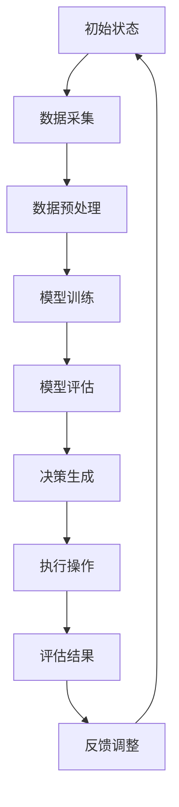
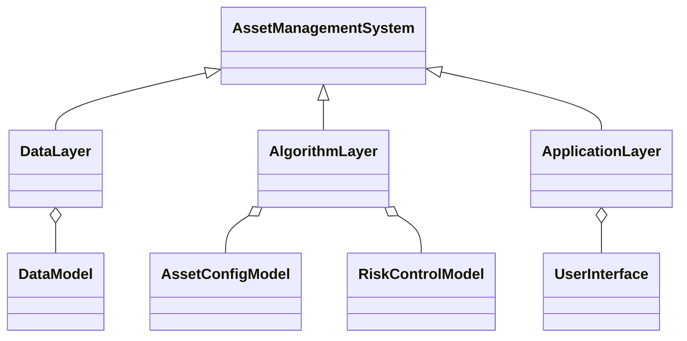
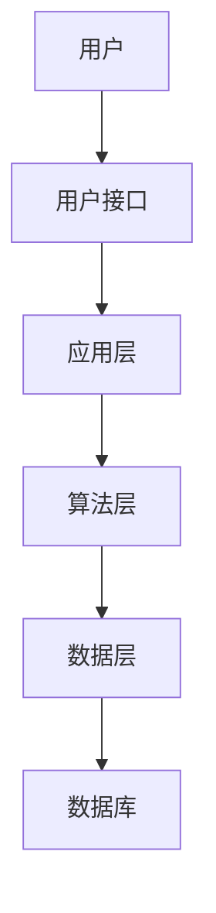
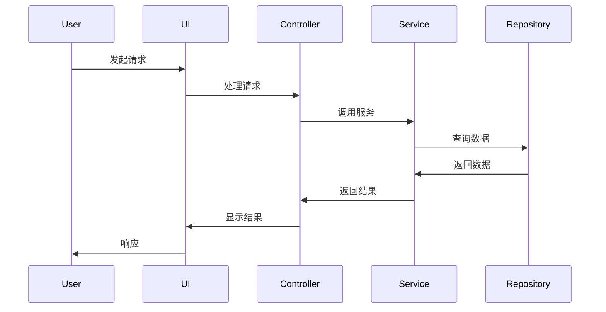

                 

# AI Agent在智能资产管理中的实践

关键词：智能资产管理、AI Agent、股票市场、风险控制、资产配置

摘要：随着大数据和人工智能技术的发展，智能资产管理成为金融领域的重要研究方向。本文将从智能资产管理的背景、AI Agent的基础理论以及其在智能资产管理中的应用等方面进行深入探讨，旨在为读者提供关于AI Agent在智能资产管理中的实践指南。

## 第一部分：智能资产管理概述

### 第1章：智能资产管理的背景和挑战

#### 1.1.1 智能资产管理的基本概念

智能资产管理是指利用大数据分析、人工智能和机器学习等技术，对资产进行管理和优化的一种新型资产管理模式。它通过智能算法和模型对海量数据进行处理，实现对资产的精准分析和高效管理，从而提高投资收益和降低风险。

#### 1.1.2 智能资产管理的发展趋势

随着大数据和人工智能技术的不断发展，智能资产管理在金融领域得到了广泛关注。目前，智能资产管理正朝着以下几个方向发展：

1. **技术变革**：云计算、区块链、物联网等新技术的应用，使得智能资产管理的能力和效率得到了极大提升。
2. **市场需求**：投资者对资产管理的需求日益增长，对个性化、智能化的资产配置和管理提出了更高要求。
3. **未来发展方向**：智能资产管理将更加注重数据驱动，以实现精准的投资决策和风险控制。

#### 1.1.3 智能资产管理的挑战和机遇

智能资产管理在金融领域带来了诸多挑战和机遇：

- **挑战**：
  - 数据质量：智能资产管理依赖于高质量的数据，数据质量对资产管理效果有直接影响。
  - 风险管理：智能资产管理在提高投资收益的同时，也可能增加风险，需要建立有效的风险控制机制。
  - 技术门槛：智能资产管理需要专业的技术团队和丰富的实践经验，对于金融机构来说是一个挑战。

- **机遇**：
  - 投资收益：智能资产管理通过精准的数据分析和智能算法，有望提高投资收益。
  - 降低成本：自动化和智能化的资产管理可以降低人力成本和管理费用。
  - 个性化服务：智能资产管理可以提供个性化的资产配置和管理方案，满足不同投资者的需求。

## 第二部分：AI Agent的基础理论

### 第2章：AI Agent的定义和分类

#### 2.1.1 AI Agent的定义

AI Agent是指一种能够感知环境、制定计划并执行任务的智能体，它能够根据环境和目标进行自主决策和行动。AI Agent的核心目标是实现自主智能，以适应不断变化的环境和任务需求。

#### 2.1.2 AI Agent的分类

AI Agent可以根据不同的分类标准进行分类，常见的分类方法包括：

1. **基于功能**：感知型Agent、决策型Agent、执行型Agent。
2. **基于环境**：静态环境Agent、动态环境Agent。
3. **基于任务**：任务导向Agent、目标导向Agent。

#### 2.1.3 AI Agent的核心特点

AI Agent具有以下几个核心特点：

1. **自主性**：能够自主感知环境、制定计划和执行任务。
2. **适应性**：能够根据环境和任务需求进行动态调整和优化。
3. **智能性**：利用人工智能技术进行决策和行动，实现自主智能。

### 第2章.2 AI Agent的工作原理

#### 2.2.1 AI Agent的结构和功能

AI Agent通常由以下几个部分组成：

1. **感知模块**：用于感知环境信息，如股票市场数据、风险指标等。
2. **决策模块**：基于感知模块收集的信息，利用机器学习算法进行决策。
3. **执行模块**：根据决策模块的决策结果，执行具体的操作，如买卖股票。

#### 2.2.2 AI Agent的感知和决策机制

AI Agent的感知和决策机制主要包括：

1. **感知机制**：通过传感器和数据采集设备获取环境信息。
2. **决策机制**：利用机器学习算法，如决策树、神经网络等，对感知到的信息进行分析和决策。
3. **执行机制**：根据决策结果，执行具体的操作。

#### 2.2.3 AI Agent的执行和评估机制

AI Agent的执行和评估机制主要包括：

1. **执行机制**：根据决策模块的决策结果，执行具体的操作。
2. **评估机制**：通过设定指标，对执行结果进行评估和反馈。

### 第2章.3 AI Agent的技术框架

#### 2.3.1 强化学习在AI Agent中的应用

强化学习是AI Agent的一种核心技术，主要用于解决序列决策问题。在智能资产管理中，强化学习可以用于以下方面：

1. **投资策略学习**：通过不断尝试和调整，找到最优的投资策略。
2. **风险控制**：根据环境变化，调整风险控制策略，以降低投资风险。

#### 2.3.2 深度学习在AI Agent中的应用

深度学习是AI Agent的另一个核心技术，主要用于解决复杂的数据分析问题。在智能资产管理中，深度学习可以用于以下方面：

1. **市场预测**：通过分析历史数据，预测市场走势。
2. **风险识别**：通过分析市场数据，识别潜在风险。

#### 2.3.3 自然语言处理在AI Agent中的应用

自然语言处理（NLP）是AI Agent的又一个重要技术，主要用于处理自然语言文本数据。在智能资产管理中，NLP可以用于以下方面：

1. **市场新闻分析**：通过分析市场新闻，了解市场情绪。
2. **投资者情绪分析**：通过分析投资者评论，了解投资者情绪。

## 第三部分：智能资产管理中的AI Agent应用

### 第3章：AI Agent在股票市场中的实战

#### 3.1.1 股票市场分析模型

在股票市场中，AI Agent可以通过构建分析模型，对市场进行深度分析。常见的分析模型包括：

1. **技术分析模型**：通过分析股票的历史价格和交易量，预测市场走势。
2. **基本面分析模型**：通过分析公司的财务状况、行业前景等，评估股票的投资价值。
3. **宏观经济分析模型**：通过分析宏观经济指标，预测市场走势。

#### 3.1.2 AI Agent的构建和训练

AI Agent的构建和训练过程可以分为以下几个步骤：

1. **数据采集**：收集股票市场相关的数据，如历史价格、交易量、财务指标等。
2. **数据预处理**：对采集到的数据进行清洗、去噪、归一化等处理。
3. **模型训练**：利用机器学习算法，如神经网络、决策树等，对预处理后的数据进行训练。
4. **模型评估**：通过设定指标，对训练好的模型进行评估和优化。

#### 3.1.3 AI Agent在股票市场中的策略应用

AI Agent在股票市场中的策略应用主要包括以下几个方面：

1. **选股策略**：通过分析市场数据和公司基本面，选择具有投资价值的股票。
2. **买卖时机**：通过分析市场走势和风险指标，确定买卖时机。
3. **风险控制**：通过设定止损、止盈等策略，降低投资风险。

### 第3章.1 股票市场AI Agent案例分析

#### 3.1.1 案例背景

某金融公司利用AI Agent构建了股票市场分析模型，以实现智能化的股票投资。该公司收集了大量的股票市场数据，包括历史价格、交易量、财务指标等。

#### 3.1.2 案例描述

1. **数据采集**：公司通过数据接口，实时获取股票市场数据。
2. **数据预处理**：对采集到的数据进行分析，去除异常值，进行归一化处理。
3. **模型训练**：使用神经网络算法，对预处理后的数据进行训练，构建股票市场分析模型。
4. **模型评估**：通过回测，评估模型的效果，并进行优化。

#### 3.1.3 案例结果分析

1. **选股效果**：模型成功选出了多只具有投资价值的股票。
2. **买卖时机**：模型在买卖时机的判断上表现出较高的准确性。
3. **风险控制**：模型通过设定止损、止盈策略，降低了投资风险。

### 第3章.2 股票市场AI Agent的优化策略

#### 3.2.1 优化目标

优化股票市场AI Agent的目标是提高选股准确性和买卖时机判断的准确性，同时降低投资风险。

#### 3.2.2 优化方法

优化方法主要包括：

1. **模型优化**：通过调整神经网络的结构和参数，提高模型的性能。
2. **特征工程**：通过选择和构造合适的特征，提高模型的预测能力。
3. **集成学习**：通过集成多个模型，提高整体模型的预测能力。

#### 3.2.3 优化效果评估

优化效果评估主要包括：

1. **回测结果**：通过回测，评估模型优化后的效果。
2. **实际应用**：在实际投资中，评估模型优化后的效果。

## 第4章：AI Agent在风险控制中的应用

#### 4.1.1 AI Agent在风险控制中的角色

AI Agent在风险控制中扮演着重要的角色，主要包括以下几个方面：

1. **风险评估**：通过分析市场数据和公司基本面，评估投资风险。
2. **风险预警**：通过设定风险阈值，及时发现潜在风险。
3. **风险应对**：根据风险预警结果，制定和执行风险应对策略。

#### 4.1.2 风险评估模型

风险评估模型是AI Agent在风险控制中的核心工具，主要包括以下几个部分：

1. **风险指标体系**：根据投资目标和市场特点，设定一系列风险指标。
2. **风险预测模型**：利用机器学习算法，对风险指标进行分析和预测。
3. **风险评级模型**：根据风险预测结果，对风险进行评级和分类。

#### 4.1.3 风险预警机制

风险预警机制是AI Agent在风险控制中的关键环节，主要包括以下几个部分：

1. **预警指标**：根据风险评估模型，设定预警指标。
2. **预警规则**：根据预警指标，设定预警规则。
3. **预警通知**：当风险指标触发预警规则时，系统会自动发出预警通知。

#### 4.1.4 风险应对策略

风险应对策略是AI Agent在风险控制中的最后一个环节，主要包括以下几个部分：

1. **止损策略**：当投资风险达到一定程度时，及时止损，以减少损失。
2. **调整策略**：根据风险预警结果，调整投资策略，降低风险。
3. **风险管理策略**：通过风险分散、对冲等手段，降低投资组合的整体风险。

## 第5章：AI Agent在资产配置中的实践

#### 5.1.1 资产配置策略

资产配置策略是指根据投资目标和风险偏好，确定不同资产的配置比例。AI Agent在资产配置中的主要策略包括：

1. **风险平价策略**：通过优化资产配置，使投资组合的整体风险与预期收益相匹配。
2. **均值方差策略**：通过优化资产配置，使投资组合的预期收益最大，风险最小。
3. **目标优化策略**：通过设定目标函数，优化资产配置，实现投资目标。

#### 5.1.2 AI Agent的决策流程

AI Agent在资产配置中的决策流程主要包括以下几个步骤：

1. **数据采集**：收集各类资产的历史价格、收益率等数据。
2. **特征提取**：从数据中提取对资产配置决策有重要影响的特征。
3. **模型训练**：利用机器学习算法，如神经网络、决策树等，训练资产配置模型。
4. **决策生成**：根据模型输出，生成资产配置决策。

#### 5.1.3 AI Agent在资产配置中的优势

AI Agent在资产配置中的优势主要体现在以下几个方面：

1. **快速响应**：AI Agent能够快速处理大量数据，实时生成资产配置决策。
2. **个性定制**：AI Agent可以根据投资者的风险偏好和投资目标，生成个性化的资产配置方案。
3. **降低风险**：AI Agent通过优化资产配置，降低投资组合的整体风险。

## 第6章：AI Agent在资产管理系统中的集成与优化

#### 6.1.1 AI Agent在资产管理系统中的集成

AI Agent在资产管理系统中的集成主要包括以下几个方面：

1. **系统架构设计**：设计适合AI Agent集成的系统架构，包括数据层、算法层、应用层等。
2. **接口设计**：设计AI Agent与其他系统模块的接口，实现数据交互和功能调用。
3. **系统集成**：将AI Agent集成到资产管理系统，实现资产配置、风险控制、投资决策等功能。

#### 6.1.2 AI Agent在资产管理系统中的优化策略

AI Agent在资产管理系统中的优化策略主要包括以下几个方面：

1. **模型优化**：通过调整算法参数、优化模型结构，提高AI Agent的预测准确性和决策效率。
2. **数据优化**：通过数据清洗、特征工程等手段，提高数据质量，增强AI Agent的预测能力。
3. **算法优化**：采用先进的机器学习算法和深度学习技术，提高AI Agent的性能和可靠性。

#### 6.1.3 优化效果评估

优化效果评估主要包括以下几个方面：

1. **模型性能评估**：通过设定指标，评估AI Agent的预测准确性和决策效率。
2. **投资收益评估**：通过回测和实际投资，评估AI Agent在资产配置和风险控制中的收益情况。
3. **用户体验评估**：通过用户反馈，评估AI Agent在资产管理系统中的用户体验和满意度。

## 第7章：AI Agent在智能资产管理中的未来展望

#### 7.1.1 AI Agent在智能资产管理中的发展趋势

随着大数据、云计算、人工智能等技术的发展，AI Agent在智能资产管理中的应用将呈现出以下几个发展趋势：

1. **技术融合**：AI Agent将与其他技术如区块链、物联网等实现深度融合，提高资产管理系统的智能化水平。
2. **应用拓展**：AI Agent将在更多领域如债券市场、外汇市场等得到应用，推动智能资产管理的普及。
3. **个性化服务**：AI Agent将更加注重个性化服务，根据投资者的风险偏好和投资目标，提供定制化的资产配置和管理方案。

#### 7.1.2 AI Agent在智能资产管理中的未来应用前景

AI Agent在智能资产管理中的未来应用前景十分广阔，主要包括以下几个方面：

1. **智能投顾**：AI Agent将成为智能投顾的核心技术，为投资者提供个性化的投资建议和管理服务。
2. **自动化交易**：AI Agent将实现自动化交易，提高交易效率，降低交易成本。
3. **风险智能管理**：AI Agent将实现风险智能管理，通过实时监控和预警，降低投资风险。

#### 7.1.3 未来挑战与对策

AI Agent在智能资产管理中面临的未来挑战主要包括：

1. **数据隐私**：随着数据量的增加，数据隐私保护将成为一个重要问题，需要采取有效的数据加密和保护措施。
2. **技术风险**：AI Agent的技术风险如算法错误、模型崩溃等，需要建立完善的风险监控和应对机制。
3. **法规政策**：随着AI Agent在金融领域的应用，法规政策也将逐步完善，需要密切关注相关法规政策的动态。

## 结束语

AI Agent在智能资产管理中的应用为金融领域带来了巨大的变革。本文从智能资产管理的背景、AI Agent的基础理论以及其在智能资产管理中的应用等方面进行了深入探讨，旨在为读者提供关于AI Agent在智能资产管理中的实践指南。未来，随着技术的不断发展，AI Agent在智能资产管理中的应用将更加广泛和深入，为投资者带来更高的收益和更好的体验。作者：AI天才研究院/AI Genius Institute & 禅与计算机程序设计艺术 /Zen And The Art of Computer Programming

---

# 附录

## 算法流程图

## 资产配置类图

## 系统架构图

## 系统交互序列图

## 数学公式

$$
E(X) = \mu
$$

$$
Var(X) = \sigma^2
$$

$$
f(x) = \frac{1}{\sqrt{2\pi\sigma^2}} e^{-\frac{(x-\mu)^2}{2\sigma^2}}
$$

## 最佳实践 tips

1. **数据质量**：确保数据质量是智能资产管理的基础，数据清洗和预处理工作至关重要。
2. **模型优化**：定期对模型进行评估和优化，以保持模型的有效性和准确性。
3. **风险控制**：合理设定风险阈值，并根据市场变化进行调整。
4. **用户体验**：优化用户界面，提高用户体验，增加用户粘性。

## 小结

本文系统地介绍了AI Agent在智能资产管理中的应用，从理论到实践，详细阐述了AI Agent在股票市场、风险控制和资产配置等方面的应用。随着技术的不断发展，AI Agent在智能资产管理中的应用前景将更加广阔，为投资者带来更高的收益和更好的体验。

## 注意事项

1. **数据隐私**：在数据采集和处理过程中，需严格遵守相关法律法规，确保数据安全和隐私。
2. **技术风险**：对AI Agent进行严格的风险评估和管理，确保系统的稳定性和可靠性。
3. **持续学习**：AI Agent需要不断学习和更新，以适应市场的变化和需求。

## 拓展阅读

1. **《智能资产管理与AI Agent》**：详细介绍了智能资产管理的基本概念、方法和应用。
2. **《深度学习在金融中的应用》**：探讨了深度学习在金融领域的应用，包括股票市场预测、风险管理等。
3. **《智能投顾：技术与实践》**：介绍了智能投顾的基本概念、技术和实际应用案例。

