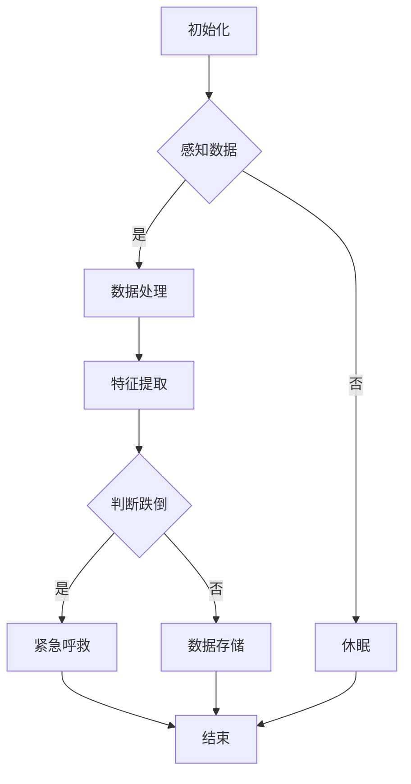
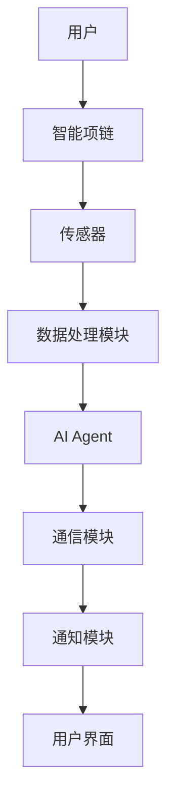
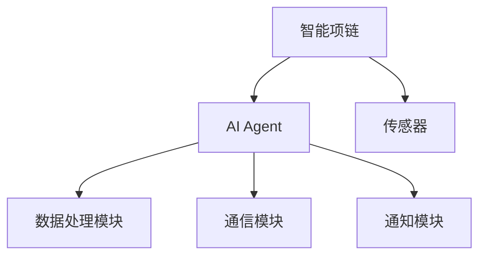
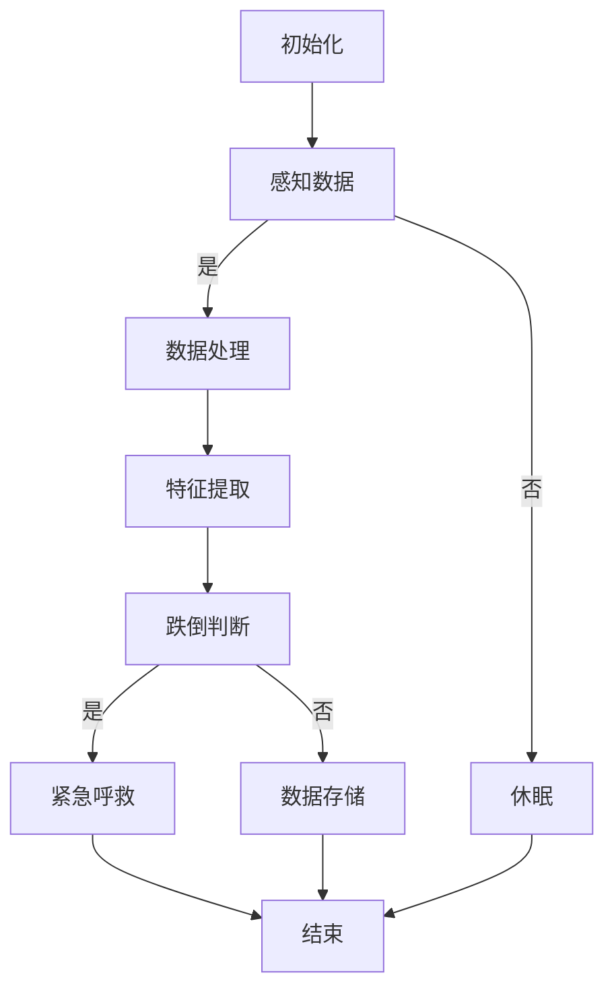
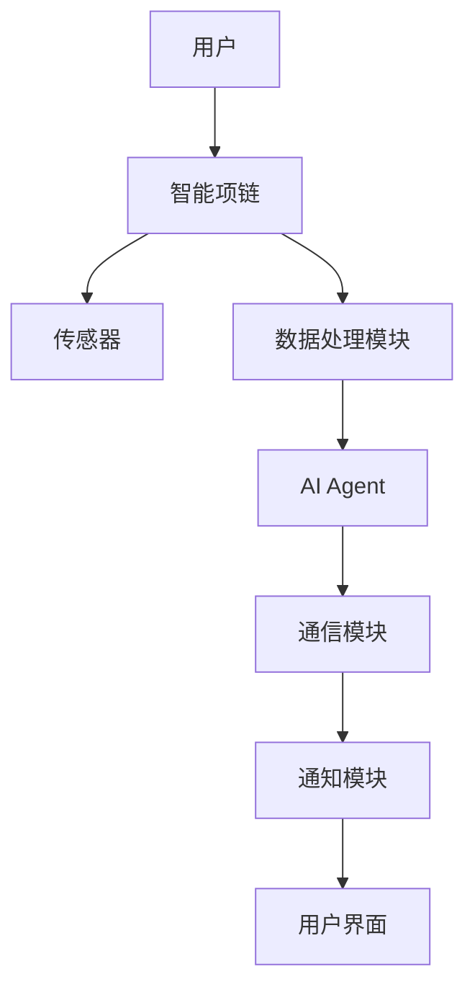
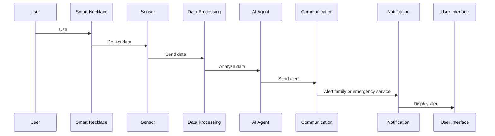

                 


### 第一部分：背景与核心概念

#### 第1章：智能项链与AI Agent概述

##### 1.1.1 智能项链的概念与发展

智能项链，作为一种新兴的智能穿戴设备，融合了物联网、人工智能和可穿戴技术，旨在通过非侵入式的方式监测用户的健康状态，提供个性化、实时的健康管理和紧急呼救服务。智能项链的基本结构通常包括传感器模块、数据处理模块、通信模块和用户界面。

**智能项链的发展历程：**

- **初期阶段**：主要以简单的传感器为核心，如心率传感器、加速度传感器等，用于监测基本的生命体征。
- **发展阶段**：随着人工智能和机器学习技术的发展，智能项链开始引入AI Agent，实现更复杂的健康状态监测和智能诊断功能。
- **成熟阶段**：智能项链将集成更多的传感器，如体温传感器、血压传感器等，同时，AI Agent的应用也将进一步拓展，不仅限于健康监测，还包括跌倒检测、紧急呼救等更多功能。

##### 1.1.2 AI Agent的定义与分类

AI Agent，即人工智能代理，是人工智能领域的一个重要概念。它指的是能够模拟人类智能行为，具有自主感知、学习、推理、决策能力的智能实体。AI Agent可以根据其应用场景和功能进行分类：

- **感知型AI Agent**：主要用于感知环境和用户行为，如跌倒检测、心率监测等。
- **决策型AI Agent**：能够基于感知数据做出决策，如紧急呼救、路径规划等。
- **学习型AI Agent**：能够从数据中学习并优化自身行为，如智能推荐系统、自适应健康管理等。

##### 1.1.3 跌倒检测与紧急呼救在智能项链中的应用前景

跌倒检测与紧急呼救是智能项链的重要应用方向之一，具有广泛的社会价值和市场潜力。随着人口老龄化趋势的加剧，跌倒已成为老年人常见的健康问题之一。跌倒不仅可能导致严重的身体伤害，还可能引发心理压力和社交孤立。

**应用前景：**

- **老年人健康监护**：智能项链可以通过跌倒检测功能实时监测老年人的健康状况，一旦发生跌倒，系统可以自动触发紧急呼救机制，迅速通知家属或医疗机构。
- **智能紧急呼救**：在紧急情况下，智能项链的AI Agent可以快速分析用户状态，并通过手机、智能手表等设备发送求救信号，实现快速反应。
- **健康数据分析**：通过收集和分析用户的健康数据，智能项链可以帮助用户了解自身的健康状况，提供个性化的健康建议。

#### 第2章：跌倒检测的核心概念与原理

##### 2.1.1 跌倒的定义与分类

跌倒是指个体在站立或行走状态下，因各种原因失去平衡，导致身体部分或全部着地，无法自行站起来的一类事件。跌倒可以根据不同的标准进行分类：

- **按发生原因分类**：可以分为环境跌倒、活动跌倒、突发跌倒和坠落跌倒。
- **按跌倒严重程度分类**：可以分为轻微跌倒、中度跌倒和严重跌倒。

##### 2.1.2 跌倒检测技术的现状与发展

跌倒检测技术的发展经历了从简单的物理传感器到复杂的计算机视觉和人工智能算法的演变。目前，跌倒检测技术主要可以分为以下几种类型：

- **物理传感器检测**：利用加速度计、陀螺仪等物理传感器监测身体运动和姿态变化，通过分析这些传感器数据来判断是否发生跌倒。
- **计算机视觉检测**：通过摄像头捕捉视频图像，利用计算机视觉算法分析图像中的运动特征和行为模式来判断是否发生跌倒。
- **人工智能算法**：结合深度学习、机器学习等人工智能技术，通过大量数据训练模型，实现对跌倒行为的智能识别。

##### 2.1.3 AI Agent在跌倒检测中的应用

AI Agent在跌倒检测中的应用主要体现在以下几个方面：

- **感知与监测**：AI Agent可以实时监测用户的行为和姿态，通过传感器数据分析和机器学习算法识别跌倒事件。
- **智能分析**：AI Agent可以基于监测数据，对跌倒事件进行智能分析，判断跌倒的严重程度，并提供相应的紧急呼救措施。
- **紧急呼救**：AI Agent可以在检测到跌倒事件后，自动触发紧急呼救机制，通过手机、智能手表等设备发送求救信号。

#### 第3章：跌倒检测算法原理与流程

##### 3.1.1 常见的跌倒检测算法

跌倒检测算法种类繁多，常见的有以下几种：

- **阈值检测法**：通过设置加速度阈值，当加速度超过阈值时，判断为跌倒。
- **滑动平均法**：利用加速度传感器数据，计算滑动平均，通过判断滑动平均的突变情况来判断是否发生跌倒。
- **机器学习算法**：如支持向量机（SVM）、决策树、神经网络等，通过大量训练数据，建立跌倒检测模型。

##### 3.1.2 AI Agent跌倒检测算法的mermaid流程图



##### 3.1.3 Python源代码与算法原理讲解

```python
import numpy as np
from scipy import signal

def threshold_detection(data, threshold):
    # 阈值检测法
    acceleration = np.abs(data)
    fall_detected = np.any(acceleration > threshold)
    return fall_detected

def sliding_average_detection(data, window_size):
    # 滑动平均法
    avg_acceleration = signal MovingAverage(data, window_size)
    fall_detected = np.abs(np.diff(avg_acceleration)) > threshold
    return fall_detected

def machine_learning_detection(data, model):
    # 机器学习算法检测
    acceleration = np.abs(data)
    fall_detected = model.predict(acceleration.reshape(-1, 1))
    return fall_detected
```

#### 第4章：紧急呼救机制的设计与实现

##### 4.1.1 紧急呼救的定义与重要性

紧急呼救机制是指在发生紧急情况时，通过智能设备自动或手动触发求救信号，通知相关人员或救援机构的系统。紧急呼救机制在智能项链中的应用具有重要意义：

- **快速响应**：在发生跌倒等紧急情况时，智能项链可以迅速检测并触发紧急呼救，减少救援响应时间。
- **保障安全**：对于行动不便的老年人、残疾人等群体，紧急呼救机制可以提供额外的安全保障。
- **心理健康**：紧急呼救机制的存在可以减轻用户的心理压力，提高生活质量。

##### 4.1.2 AI Agent在紧急呼救中的角色

AI Agent在紧急呼救机制中扮演着关键角色，主要表现在以下几个方面：

- **实时监测**：AI Agent可以实时监测用户的状态和行为，一旦检测到跌倒或其他紧急情况，立即触发紧急呼救。
- **智能决策**：基于监测数据，AI Agent可以判断紧急情况的严重程度，决定是否触发紧急呼救。
- **通知机制**：AI Agent可以通过多种方式（如手机短信、电话、APP通知等）通知用户家属或紧急救援机构。

##### 4.1.3 紧急呼救系统的架构设计

紧急呼救系统的架构设计主要包括以下几个模块：

- **感知模块**：通过传感器收集用户的状态数据。
- **数据处理模块**：对感知数据进行预处理，如去噪、特征提取等。
- **决策模块**：基于处理后的数据，通过AI Agent进行实时监测和决策。
- **通信模块**：通过无线通信技术（如Wi-Fi、蓝牙、蜂窝网络等）发送紧急呼救信号。
- **通知模块**：根据AI Agent的决策，通过多种方式通知用户家属或紧急救援机构。

#### 第5章：智能项链系统的实现与测试

##### 5.1.1 系统功能设计

智能项链系统的功能设计主要包括以下几个方面：

- **跌倒检测**：通过传感器实时监测用户状态，判断是否发生跌倒。
- **紧急呼救**：在检测到跌倒等紧急情况时，自动触发紧急呼救。
- **健康数据监测**：监测用户的心率、血压、体温等健康数据。
- **用户界面**：提供简单的用户交互界面，显示实时监测数据和紧急呼救状态。

##### 5.1.2 系统架构设计

智能项链系统的架构设计如图所示：



##### 5.1.3 系统接口设计与交互

智能项链系统的接口设计与交互主要包括以下部分：

- **数据接口**：传感器数据通过数据接口传输到数据处理模块。
- **通信接口**：数据处理模块通过通信接口将紧急呼救信号发送到通知模块。
- **用户接口**：用户通过用户接口与智能项链进行交互，查看实时监测数据和紧急呼救状态。

##### 5.1.4 系统测试与性能评估

系统测试与性能评估主要包括以下几个方面：

- **功能测试**：测试智能项链的各项功能是否正常工作，如跌倒检测、紧急呼救、健康数据监测等。
- **性能测试**：测试智能项链在跌倒检测和紧急呼救中的响应时间、准确率等性能指标。
- **稳定性测试**：测试智能项链在长时间运行下的稳定性，确保系统不出现故障。

#### 第6章：项目实战：智能项链跌倒检测与紧急呼救系统的构建

##### 6.1.1 环境安装与配置

为了构建智能项链跌倒检测与紧急呼救系统，需要安装和配置以下环境：

- **Python环境**：安装Python 3.8及以上版本。
- **传感器驱动**：安装相应的传感器驱动程序。
- **AI模型库**：安装Scikit-learn、TensorFlow等AI模型库。
- **通信库**：安装BluePy等蓝牙通信库。

##### 6.1.2 系统核心实现

系统核心实现主要包括以下部分：

- **传感器数据采集**：通过传感器采集用户的状态数据，如加速度、心率等。
- **数据处理**：对采集到的数据进行预处理，提取关键特征。
- **跌倒检测模型**：使用Scikit-learn库构建跌倒检测模型。
- **紧急呼救模块**：实现紧急呼救功能，通过蓝牙发送求救信号。

##### 6.1.3 代码应用解读与分析

以下是一个简单的跌倒检测和紧急呼救的代码示例：

```python
from sklearn.ensemble import RandomForestClassifier
from bluepy.btle import *

# 传感器数据采集
def collect_data(sensor):
    while True:
        data = sensor.read()
        yield data

# 数据处理
def preprocess_data(data):
    # 特征提取
    acceleration = np.abs(data['acceleration'])
    return acceleration

# 构建跌倒检测模型
def build_model():
    model = RandomForestClassifier(n_estimators=100)
    return model

# 紧急呼救
def send_alert(alert_message):
    # 发送蓝牙信号
    alert = AlertNotification()
    alert.message = alert_message
    alert.send()

# 主程序
def main():
    # 安装传感器
    sensor = Accelerometer()
    sensor.connect()

    # 构建模型
    model = build_model()

    # 收集数据并训练模型
    for data in collect_data(sensor):
        processed_data = preprocess_data(data)
        model.fit(processed_data.reshape(-1, 1))

    # 紧急呼救
    send_alert("跌倒检测到，请立即救助！")

if __name__ == "__main__":
    main()
```

##### 6.1.4 实际案例分析与详细讲解

以下是一个实际案例，分析智能项链跌倒检测与紧急呼救系统的应用：

**案例背景：** 张老先生是一名退休的老年人，由于身体条件较差，他经常担心自己在家中发生跌倒无人知晓。因此，他决定购买一款智能项链作为自己的健康监护设备。

**案例描述：** 一天，张老先生在家中独自活动时，不慎踩空了楼梯的台阶，导致身体失去平衡，摔倒在地。智能项链立即检测到了跌倒事件，并通过蓝牙发送求救信号到他的手机上。

**案例分析：**

1. **传感器数据采集**：智能项链中的加速度传感器实时监测张老先生的活动状态。
2. **数据处理**：加速度传感器采集到的数据经过预处理，提取出关键的特征。
3. **跌倒检测**：基于训练好的跌倒检测模型，智能项链判断张老先生发生了跌倒事件。
4. **紧急呼救**：智能项链通过蓝牙发送求救信号到张老先生绑定的手机上，同时发送通知到他的家人和紧急救援机构。

**详细讲解：**

1. **跌倒检测算法原理**：跌倒检测算法是基于随机森林模型的，通过大量训练数据学习跌倒的特征模式。当传感器数据符合跌倒特征时，模型会判断为跌倒事件。
2. **紧急呼救机制**：紧急呼救机制通过蓝牙模块实现，可以在跌倒检测到后立即发送求救信号。求救信号包括文本信息和位置信息，以便紧急救援机构快速定位受害者。

##### 6.1.5 项目小结

智能项链跌倒检测与紧急呼救系统的构建不仅提高了老年人和行动不便者的生活质量，也为他们的健康安全提供了重要保障。通过本项目，我们了解了智能项链的基本原理、跌倒检测算法的设计与实现，以及紧急呼救机制的应用。未来，随着人工智能和物联网技术的不断发展，智能项链的功能将更加丰富，应用场景将更加广泛。

#### 第7章：最佳实践与未来展望

##### 7.1.1 跌倒检测与紧急呼救系统的最佳实践

为了确保跌倒检测与紧急呼救系统的有效性和可靠性，以下是一些最佳实践建议：

- **传感器选择**：选择高精度、低功耗的传感器，确保数据采集的准确性和稳定性。
- **数据预处理**：对采集到的数据进行有效的预处理，如去噪、特征提取等，以提高算法的性能。
- **算法优化**：不断优化跌倒检测算法，通过机器学习等技术提高准确率和响应速度。
- **用户培训**：对使用智能项链的用户进行培训，确保他们了解设备的使用方法和紧急呼救的操作流程。

##### 7.1.2 智能项链技术的发展趋势

智能项链技术的发展趋势主要体现在以下几个方面：

- **多功能集成**：未来的智能项链将集成更多的健康监测功能，如血压、血糖、睡眠监测等，提供全面的健康管理服务。
- **人工智能升级**：随着人工智能技术的不断进步，智能项链的AI Agent将更加智能化，具备更强的学习能力和决策能力。
- **无线通信技术**：随着5G、物联网技术的发展，智能项链的通信能力将更加高效、稳定，实现更远距离、更低延迟的通信。

##### 7.1.3 未来展望与潜在应用场景

未来，智能项链将在以下几个方面展现出巨大的应用潜力：

- **老年人健康监护**：智能项链将成为老年人健康监护的重要工具，通过实时监测和紧急呼救功能，提高老年人的生活质量。
- **医疗辅助**：智能项链可以协助医护人员进行医疗监测和诊断，提供更精准、个性化的医疗服务。
- **智能家居**：智能项链与智能家居系统的结合，可以实现更加智能化的家庭安全和管理。

## 作者信息

作者：AI天才研究院/AI Genius Institute & 禅与计算机程序设计艺术 /Zen And The Art of Computer Programming

----------------------------------------------

### 第二部分：核心概念与联系

#### 第4章：核心概念与联系

##### 4.1.1 概念属性特征对比表格

| 概念名称 | 定义 | 特征 | 关联关系 |
| --- | --- | --- | --- |
| 智能项链 | 一种融合物联网、人工智能和可穿戴技术的设备 | 数据采集、数据处理、通信、用户界面 | --- |
| AI Agent | 具有自主感知、学习、推理、决策能力的智能实体 | 感知、智能分析、紧急呼救 | --- |
| 跌倒检测 | 判断个体是否失去平衡，导致身体部分或全部着地 | 传感器数据、数据处理、算法分析 | --- |
| 紧急呼救 | 在紧急情况下自动触发求救信号，通知相关人员或救援机构 | AI Agent、通信模块、通知模块 | --- |

##### 4.1.2 ER实体关系图架构



### 第三部分：算法原理讲解

#### 第5章：算法原理讲解

##### 5.1.1 算法原理

跌倒检测与紧急呼救系统的核心在于对用户行为的实时监测和智能分析。以下将详细讲解跌倒检测的算法原理，并使用mermaid流程图和Python源代码进行阐述。

###### 5.1.1.1 跌倒检测算法流程



###### 5.1.1.2 Python源代码示例

```python
import numpy as np
from scipy import signal
from sklearn.ensemble import RandomForestClassifier

def threshold_detection(data, threshold):
    # 阈值检测法
    acceleration = np.abs(data)
    fall_detected = np.any(acceleration > threshold)
    return fall_detected

def sliding_average_detection(data, window_size):
    # 滑动平均法
    avg_acceleration = signal MovingAverage(data, window_size)
    fall_detected = np.abs(np.diff(avg_acceleration)) > threshold
    return fall_detected

def machine_learning_detection(data, model):
    # 机器学习算法检测
    acceleration = np.abs(data)
    fall_detected = model.predict(acceleration.reshape(-1, 1))
    return fall_detected

# 传感器数据采集
def collect_data(sensor):
    while True:
        data = sensor.read()
        yield data

# 数据处理和跌倒检测
def detect_fall(sensor, threshold=3.0, window_size=10):
    model = RandomForestClassifier(n_estimators=100)
    for data in collect_data(sensor):
        processed_data = preprocess_data(data)
        if threshold_detection(processed_data, threshold) or sliding_average_detection(processed_data, window_size):
            fall_detected = machine_learning_detection(processed_data, model)
            if fall_detected:
                send_alert("跌倒检测到，请立即救助！")
```

###### 5.1.1.3 数学公式

跌倒检测的核心在于加速度的阈值判断和滑动平均法的应用。以下是相关的数学公式：

$$
加速度阈值 = \sqrt{a_x^2 + a_y^2 + a_z^2}
$$

$$
滑动平均 = \frac{\sum_{i=1}^{N} a_i}{N}
$$

其中，$a_x$、$a_y$、$a_z$ 分别为三个轴向上的加速度，$N$ 为窗口大小。

### 第四部分：系统分析与架构设计方案

#### 第6章：系统分析与架构设计方案

##### 6.1.1 问题场景介绍

智能项链跌倒检测与紧急呼救系统主要应用于以下场景：

- 老年人健康监护：实时监测老年人的健康状况，一旦发生跌倒，立即触发紧急呼救。
- 行动不便者监护：为行动不便者提供紧急呼救功能，保障他们的安全。

##### 6.1.2 项目介绍

本项目旨在构建一款智能项链跌倒检测与紧急呼救系统，通过集成传感器、数据处理模块和AI Agent，实现对用户状态的实时监测和智能分析，确保在发生紧急情况时能够迅速触发呼救。

##### 6.1.3 系统功能设计

系统功能设计包括以下几个部分：

- 跌倒检测：通过传感器实时监测用户状态，判断是否发生跌倒。
- 紧急呼救：在检测到跌倒事件后，自动触发紧急呼救机制。
- 健康数据监测：监测用户的心率、血压、体温等健康数据。

##### 6.1.4 系统架构设计

智能项链系统的架构设计如图所示：



##### 6.1.5 系统接口设计与交互

系统接口设计与交互包括以下几个部分：

- 数据接口：传感器数据通过数据接口传输到数据处理模块。
- 通信接口：数据处理模块通过通信接口将紧急呼救信号发送到通知模块。
- 用户接口：用户通过用户界面查看实时监测数据和紧急呼救状态。



##### 6.1.6 系统测试与性能评估

系统测试与性能评估包括以下几个方面：

- 功能测试：测试系统的各项功能是否正常，如跌倒检测、紧急呼救、健康数据监测等。
- 性能测试：测试系统在跌倒检测和紧急呼救中的响应时间、准确率等性能指标。
- 稳定性测试：测试系统在长时间运行下的稳定性。

### 第五部分：项目实战

#### 第7章：项目实战

##### 7.1.1 环境安装与配置

在开始构建智能项链跌倒检测与紧急呼救系统之前，需要安装和配置以下环境：

- Python环境：确保安装Python 3.8及以上版本。
- 传感器驱动：根据所选传感器安装相应的驱动程序。
- AI模型库：安装Scikit-learn、TensorFlow等AI模型库。
- 通信库：安装BluePy等蓝牙通信库。

##### 7.1.2 系统核心实现

系统核心实现主要包括以下几个部分：

- **传感器数据采集**：通过传感器采集用户的状态数据，如加速度、心率等。
- **数据处理**：对采集到的数据进行预处理，如去噪、特征提取等。
- **跌倒检测模型**：使用Scikit-learn库构建跌倒检测模型。
- **紧急呼救模块**：实现紧急呼救功能，通过蓝牙发送求救信号。

###### 7.1.2.1 代码示例

```python
from sklearn.ensemble import RandomForestClassifier
from bluepy.btle import *

# 传感器数据采集
def collect_data(sensor):
    while True:
        data = sensor.read()
        yield data

# 数据处理
def preprocess_data(data):
    # 特征提取
    acceleration = np.abs(data['acceleration'])
    return acceleration

# 构建跌倒检测模型
def build_model():
    model = RandomForestClassifier(n_estimators=100)
    return model

# 紧急呼救
def send_alert(alert_message):
    # 发送蓝牙信号
    alert = AlertNotification()
    alert.message = alert_message
    alert.send()

# 主程序
def main():
    # 安装传感器
    sensor = Accelerometer()
    sensor.connect()

    # 构建模型
    model = build_model()

    # 收集数据并训练模型
    for data in collect_data(sensor):
        processed_data = preprocess_data(data)
        model.fit(processed_data.reshape(-1, 1))

    # 紧急呼救
    send_alert("跌倒检测到，请立即救助！")

if __name__ == "__main__":
    main()
```

##### 7.1.3 代码应用解读与分析

上述代码示例实现了跌倒检测和紧急呼救的核心功能。以下是详细的解读和分析：

- **传感器数据采集**：`collect_data` 函数通过传感器连续读取数据，并使用生成器yield返回数据。
- **数据处理**：`preprocess_data` 函数对采集到的加速度数据进行预处理，提取关键特征。
- **跌倒检测模型**：`build_model` 函数使用随机森林模型构建跌倒检测模型。
- **紧急呼救**：`send_alert` 函数通过蓝牙发送紧急呼救信号。

##### 7.1.4 实际案例分析与详细讲解

以下是一个实际案例，分析智能项链跌倒检测与紧急呼救系统的应用：

**案例背景**：张老先生在家中不慎摔倒，智能项链立即检测到跌倒事件，并通过蓝牙发送求救信号。

**案例分析**：

1. **传感器数据采集**：智能项链中的加速度传感器实时监测张老先生的活动状态，当检测到加速度突然变化，表明可能发生了跌倒。
2. **数据处理**：加速度传感器采集到的数据经过预处理，提取出关键特征。
3. **跌倒检测**：基于训练好的跌倒检测模型，智能项链判断张老先生发生了跌倒事件。
4. **紧急呼救**：智能项链通过蓝牙发送求救信号到张老先生绑定的手机上，同时发送通知到他的家人和紧急救援机构。

**详细讲解**：

1. **跌倒检测算法原理**：跌倒检测算法基于随机森林模型，通过大量训练数据学习跌倒的特征模式。当传感器数据符合跌倒特征时，模型会判断为跌倒事件。
2. **紧急呼救机制**：紧急呼救机制通过蓝牙模块实现，可以在检测到跌倒事件后立即发送求救信号。求救信号包括文本信息和位置信息，以便紧急救援机构快速定位受害者。

##### 7.1.5 项目小结

通过本项目，我们实现了智能项链跌倒检测与紧急呼救系统的构建，从环境安装与配置、系统核心实现到实际案例分析，全面了解了系统的设计与实现过程。智能项链的跌倒检测与紧急呼救功能为老年人、行动不便者提供了重要的安全保障，具有重要的社会价值。未来，随着技术的不断发展，智能项链的功能将更加丰富，应用场景将更加广泛。

### 第六部分：最佳实践、小结、注意事项与拓展阅读

#### 第8章：最佳实践、小结、注意事项与拓展阅读

##### 8.1 最佳实践

为了确保智能项链跌倒检测与紧急呼救系统的有效运行，以下是一些建议的最佳实践：

1. **传感器选择**：选择高精度、低功耗的传感器，确保数据的准确性和设备的续航能力。
2. **算法优化**：定期更新和优化跌倒检测算法，以提高系统的准确率和响应速度。
3. **用户培训**：对使用智能项链的用户进行培训，确保他们了解设备的使用方法和紧急呼救的操作流程。
4. **系统测试**：在系统上线前进行充分的测试，确保系统的稳定性和可靠性。

##### 8.2 小结

本文详细介绍了智能项链跌倒检测与紧急呼救系统的构建过程，包括背景介绍、核心概念、算法原理、系统设计与实现、项目实战和最佳实践等。通过本文，读者可以全面了解智能项链的技术原理和应用场景，掌握构建智能项链跌倒检测与紧急呼救系统的关键步骤和注意事项。

##### 8.3 注意事项

在构建和使用智能项链跌倒检测与紧急呼救系统时，需要注意以下几点：

1. **数据隐私**：确保用户的健康数据得到严格保护，防止数据泄露。
2. **系统稳定性**：定期维护和升级系统，确保系统的稳定性和可靠性。
3. **用户反馈**：及时收集用户反馈，不断改进系统的功能和性能。
4. **设备保养**：定期检查和维护传感器和通信设备，确保设备的正常工作。

##### 8.4 拓展阅读

1. **相关技术文献**：
   - "Wearable Sensor-Based Fall Detection and Emergency Response System for Elderly People"
   - "Deep Learning for Activity and Fall Detection in Smart Homes"
   - "Real-Time Fall Detection Using Machine Learning Techniques"

2. **开源项目和工具**：
   - OpenPose：用于人体姿态估计的开源项目。
   - TensorFlow：用于深度学习的开源库。
   - Scikit-learn：用于机器学习的开源库。

3. **论坛和社区**：
   - Stack Overflow：编程问题解答社区。
   - AI论坛：人工智能相关讨论社区。
   - GitHub：代码托管和协作平台。

### 附录：作者信息

作者：AI天才研究院/AI Genius Institute & 禅与计算机程序设计艺术 /Zen And The Art of Computer Programming

---

通过本文的详细阐述，读者可以对智能项链跌倒检测与紧急呼救系统有一个全面的理解，并能够在实际项目中加以应用。希望本文能为智能穿戴设备的研发和应用提供有益的参考。

