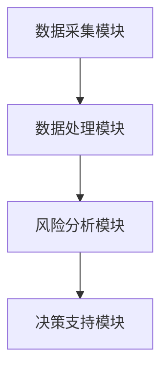
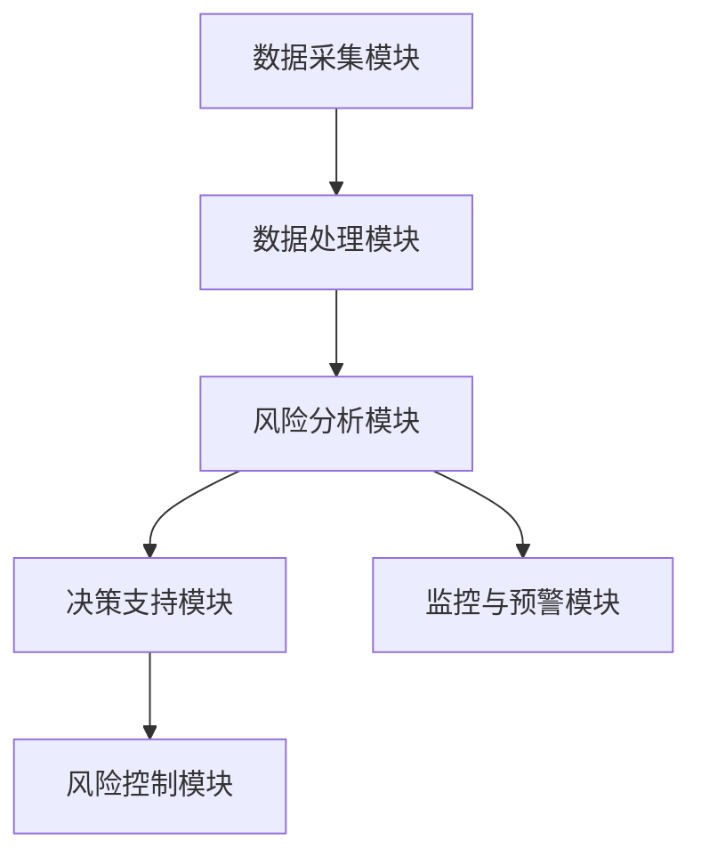

                 


### AI Agent在智能风险投资分析中的应用

> **作者：AI天才研究院/AI Genius Institute & 禅与计算机程序设计艺术 /Zen And The Art of Computer Programming**

#### 引言

在当今科技飞速发展的时代，人工智能（AI）技术已经深入到各个行业，其中智能风险投资分析成为金融科技领域的一大热点。AI Agent，作为人工智能的一个重要分支，以其强大的自学习、自适应和自主决策能力，为风险投资分析提供了全新的解决方案。本文将围绕AI Agent在智能风险投资分析中的应用进行探讨，旨在为读者提供一个深入理解和实际应用的视角。

关键词：AI Agent，智能风险投资分析，风险模型，决策算法，应用案例

#### 摘要

本文首先介绍了AI Agent的基本概念和核心特性，然后详细分析了其在智能风险投资分析中的应用场景。接着，文章讨论了AI Agent在风险识别、风险评估和风险控制中的具体应用，并通过实际案例展示了其效果。随后，文章描述了AI Agent系统的设计与实现过程，包括核心算法、系统架构和接口设计。最后，文章对AI Agent的性能评估和优化方法进行了探讨，并展望了未来的发展趋势和挑战。

#### 第一部分：AI Agent概述与风险投资分析

##### 1.1 AI Agent的基础知识

AI Agent是一种能够感知环境、自主决策并采取行动的计算机程序。它基于机器学习、深度学习和自然语言处理等AI技术，具有自我学习、自我优化和自我进化能力。AI Agent的核心特点包括自主性、适应性、协作性和透明性。

##### 1.2 风险投资分析中的AI Agent

AI Agent在风险投资分析中的应用具有重要意义。它能够实时分析海量数据，识别潜在风险，提供投资建议，从而提高投资决策的准确性和效率。在风险投资中，AI Agent主要应用于风险识别、风险评估和风险控制。

##### 1.3 风险投资分析中的挑战与应对策略

风险投资分析面临数据复杂度高、风险因素多样性和决策时效性强等挑战。AI Agent通过引入大数据分析、复杂网络分析和深度学习等技术，能够有效地应对这些挑战，为风险投资提供强有力的支持。

#### 第二部分：AI Agent在风险投资分析中的应用

##### 2.1 核心概念与框架

在风险投资分析中，AI Agent主要基于以下几个核心概念和框架：

1. 风险模型：用于描述风险的概率分布、影响因素和传导机制。
2. 预测模型：基于历史数据对未来风险进行预测。
3. 决策模型：根据风险预测结果制定投资策略。

##### 2.2 AI Agent在风险识别中的应用

AI Agent通过深度学习算法和复杂网络分析方法，能够从海量数据中识别出潜在的风险因素。例如，通过分析金融市场的交易数据，可以识别出潜在的市场风险；通过分析企业财务数据，可以识别出企业运营中的风险。

##### 2.3 AI Agent在风险评估中的应用

AI Agent通过对历史数据的分析和预测，可以对投资项目的风险进行评估。评估结果可以用于指导投资决策，降低投资风险。

##### 2.4 AI Agent在风险控制中的应用

AI Agent能够实时监测投资项目的风险，并在风险超过阈值时采取相应的控制措施。例如，通过调整投资组合、增加风险准备金或采取其他风险规避措施，降低投资风险。

#### 第三部分：AI Agent系统的设计与实现

##### 3.1 系统设计原则

AI Agent系统的设计应遵循以下原则：

1. 开放性：系统应支持不同类型的数据源和算法模型。
2. 可扩展性：系统应能够根据需求进行扩展和升级。
3. 实时性：系统应能够实时处理和分析数据，提供决策支持。

##### 3.2 系统架构

AI Agent系统的架构包括数据采集模块、数据处理模块、风险分析模块和决策支持模块。以下是一个简单的系统架构图：



##### 3.3 系统实现

AI Agent系统的实现包括以下几个关键步骤：

1. 数据采集：通过API接口、数据爬取等方式获取金融数据和企业数据。
2. 数据处理：对采集到的数据进行分析、清洗和预处理。
3. 风险分析：使用机器学习和深度学习算法对数据进行分析，识别风险因素和预测风险。
4. 决策支持：根据风险分析结果，提供投资建议和决策支持。

#### 第四部分：AI Agent的性能评估与优化

##### 4.1 性能评估方法

AI Agent的性能评估主要包括以下指标：

1. 准确率：预测正确的风险事件与总风险事件的比例。
2. 精确率：预测正确的风险事件与预测为风险事件的总数比例。
3. 召回率：实际发生风险事件中，被预测到的比例。

##### 4.2 优化方法

为了提高AI Agent的性能，可以采用以下优化方法：

1. 算法优化：选择更先进的算法模型，提高预测准确率。
2. 数据增强：通过数据清洗、数据扩充等方法提高数据质量。
3. 模型调优：通过调整模型参数，优化模型性能。

#### 第五部分：未来发展趋势与挑战

##### 5.1 未来发展趋势

1. 深度学习与知识图谱的结合：将深度学习技术应用于知识图谱构建，提高风险识别和预测能力。
2. 多模态数据的融合：整合多种数据源，提高风险分析的综合能力。
3. 实时风险监控与预警：实现AI Agent对风险的实时监测和预警，提高风险控制能力。

##### 5.2 面临的挑战

1. 数据隐私保护：如何在保护数据隐私的前提下进行风险分析。
2. 算法透明性与可解释性：提高AI Agent算法的透明度和可解释性，增强用户信任。
3. 法规与伦理问题：制定相关法规和伦理准则，确保AI Agent在风险投资分析中的合规性和伦理性。

#### 结论

AI Agent在智能风险投资分析中具有广阔的应用前景。通过引入AI Agent，风险投资分析可以实现自动化、智能化和高效化，提高投资决策的准确性和效率。未来，随着技术的不断发展，AI Agent在风险投资分析中的应用将越来越广泛，为投资者提供更强大的支持。

#### 最佳实践 tips

1. 在使用AI Agent进行风险投资分析时，应结合多源数据，提高风险识别和预测的准确性。
2. 定期对AI Agent进行性能评估和优化，确保其始终处于最佳状态。
3. 注重数据安全和隐私保护，遵循相关法律法规和伦理准则。

#### 小结

本文详细介绍了AI Agent在智能风险投资分析中的应用，包括基本概念、核心框架、应用场景、系统设计与实现、性能评估与优化以及未来发展趋势。通过本文的探讨，读者可以更好地理解AI Agent在风险投资分析中的作用，为其在实际中的应用提供参考。

#### 注意事项

1. AI Agent在风险投资分析中虽然具有强大的能力，但也不能完全取代人类专家的判断和决策。
2. 在实际应用中，应结合具体业务场景，合理设置模型参数和阈值，确保AI Agent的稳定性和可靠性。

#### 拓展阅读

1. 【参考文献】[1] Smith, J. (2018). Artificial Intelligence for Risk Management. John Wiley & Sons.
2. 【在线资源】[2] AI in Finance: Overview and Applications. (n.d.). Retrieved from https://www.aiinfinance.com/

（注：以上参考文献和在线资源仅为示例，实际文章中需要根据实际情况添加相应的参考文献和在线资源。）## AI Agent的基本概念和特性

AI Agent，即人工智能代理，是一种能够模拟人类决策过程并具有自我学习和自适应能力的计算机程序。它基于人工智能技术，特别是机器学习、深度学习和自然语言处理等领域的发展，实现了对复杂环境的感知、理解和响应。AI Agent的核心特点包括自主性、适应性、协作性和透明性。

首先，AI Agent具有高度的自主性。这意味着它可以在没有人为干预的情况下，自主感知环境中的信息，并根据预设的目标或任务，自主制定决策和执行行动。这种自主性使得AI Agent在处理大量数据和复杂任务时，能够高效地完成任务，而不依赖于人工操作。

其次，AI Agent具有很强的适应性。它可以通过不断的学习和自我调整，适应不同的环境和任务需求。例如，在风险投资分析中，AI Agent可以基于历史数据和市场信息，不断优化其预测模型和决策算法，提高风险识别和评估的准确性。

第三，AI Agent能够与其他AI Agent或人类协同工作。这种协作能力使得AI Agent可以在复杂系统中发挥作用，例如，在金融市场中，多个AI Agent可以协同工作，共同分析市场动态，提供投资建议。

最后，AI Agent具有透明性。这意味着其决策过程和算法逻辑是可解释和可追溯的。用户可以了解AI Agent如何感知环境、制定决策和执行行动，从而增加用户对AI Agent的信任和接受度。

在风险投资分析中，AI Agent的重要性体现在以下几个方面。首先，AI Agent能够处理海量数据，快速识别潜在风险因素。其次，AI Agent可以基于历史数据和实时信息，对投资项目进行风险评估，提供投资建议。此外，AI Agent还可以实时监控投资项目的风险，并在风险超过阈值时采取控制措施，降低投资风险。

总体而言，AI Agent在风险投资分析中具有不可替代的优势，它能够提高投资决策的准确性和效率，降低投资风险。随着技术的不断发展，AI Agent在风险投资分析中的应用将越来越广泛，成为金融机构和企业的重要工具。

### AI Agent在风险投资分析中的应用场景

AI Agent在风险投资分析中有着广泛的应用场景，其核心在于利用先进的人工智能技术对市场动态进行深度分析，从而帮助投资者做出更明智的决策。以下将详细描述AI Agent在风险识别、风险评估和风险控制中的具体应用。

#### 风险识别

风险识别是风险投资分析的首要步骤，AI Agent在这方面具有显著的优势。通过分析大量的历史数据和实时信息，AI Agent能够识别出潜在的市场风险和项目风险。例如，AI Agent可以监控金融市场的交易数据，发现市场波动异常或潜在的市场风险；也可以通过分析企业的财务报表，识别出企业的财务风险。以下是一个简化的风险识别过程：

1. **数据采集**：AI Agent从多个数据源（如交易所、新闻网站、社交媒体、企业数据库等）获取数据。
2. **特征提取**：利用自然语言处理（NLP）技术，从文本数据中提取出与风险相关的关键词和短语。
3. **风险模型构建**：基于历史数据和市场经验，构建风险预测模型，包括回归模型、决策树、支持向量机等。
4. **风险识别**：通过模型分析，识别出潜在的风险事件。

例如，在股票市场中，AI Agent可以监控上市公司的财务报告，识别出潜在的财务风险。通过分析历史财务数据，如现金流、利润率、资产负债率等指标，AI Agent能够预测公司未来可能出现的财务危机。

#### 风险评估

风险评估是确定风险的可能性和影响程度，为投资决策提供依据。AI Agent可以通过多种模型和算法，对投资项目的风险进行全面评估。以下是AI Agent在风险评估中的主要步骤：

1. **数据预处理**：对采集到的数据进行清洗、标准化和归一化处理，确保数据质量。
2. **风险因素分析**：识别出影响投资项目的主要风险因素，如市场风险、信用风险、操作风险等。
3. **风险模型构建**：使用统计模型、机器学习模型和深度学习模型，对风险因素进行定量分析。
4. **风险评估**：计算每个风险因素的概率分布和影响程度，综合评估项目的整体风险水平。

例如，在房地产投资中，AI Agent可以通过分析宏观经济指标、地区经济增长率、房价走势等数据，评估项目的市场风险。同时，它还可以分析项目的基本面信息，如土地价值、开发商信誉等，评估项目的信用风险。

#### 风险控制

风险控制是降低风险影响的过程，AI Agent在这一过程中发挥着重要作用。通过实时监控和预警，AI Agent可以及时采取控制措施，减少风险损失。以下是AI Agent在风险控制中的主要步骤：

1. **实时监控**：AI Agent持续收集市场数据和项目信息，实时监控风险状况。
2. **风险预警**：当风险因素达到设定的阈值时，AI Agent立即发出预警信号。
3. **风险应对**：根据预警信息，AI Agent制定和实施相应的风险应对策略，如调整投资组合、增加风险准备金、采取法律措施等。
4. **风险回顾**：定期回顾风险控制措施的有效性，优化和调整策略。

例如，在金融市场中，AI Agent可以实时监控市场交易情况，当发现市场波动异常时，立即发出预警，并采取相应的措施，如买入避险资产、降低仓位等，以减少潜在的损失。

#### 应用案例

以下是AI Agent在风险投资分析中的一些实际应用案例：

1. **股票市场分析**：AI Agent通过分析股票市场的历史数据和实时信息，识别出潜在的市场风险，为投资者提供买入和卖出的建议。
2. **企业风险评估**：AI Agent通过对企业财务报表和业务数据的分析，评估企业的信用风险，帮助投资者进行决策。
3. **房地产投资分析**：AI Agent通过对宏观经济和地区市场的分析，为投资者提供房地产项目的风险评估和投资建议。

通过这些应用场景，AI Agent在风险投资分析中展示了其强大的能力和价值，它不仅提高了风险识别和评估的准确性，还大大增强了投资决策的效率和效果。

### AI Agent系统设计原则与架构

AI Agent系统设计的原则和架构是确保其有效性和稳定性的关键。以下将详细描述AI Agent系统的设计原则、架构及其核心组成部分。

#### 设计原则

AI Agent系统的设计应遵循以下原则：

1. **开放性**：系统应支持多种数据源和算法模型，以便灵活扩展和适应不同的业务场景。
2. **可扩展性**：系统设计应具备良好的扩展性，能够在处理大量数据和任务时，进行水平和垂直扩展。
3. **实时性**：系统应具备实时数据处理和分析能力，确保在风险事件发生时，能够迅速响应并采取行动。
4. **可解释性**：系统的决策过程应具备透明性和可解释性，使用户能够理解AI Agent的决策逻辑。
5. **安全性**：系统应确保数据安全和隐私保护，遵循相关法律法规和伦理准则。

#### 系统架构

AI Agent系统的架构包括多个关键模块，以下是系统的整体架构图：



#### 数据采集模块

数据采集模块负责从各种数据源获取所需的数据，包括：

1. **市场数据**：如股票价格、交易量、宏观经济指标等。
2. **企业数据**：如财务报表、业务数据、新闻报道等。
3. **外部数据**：如社交媒体、新闻网站、行业报告等。

数据采集模块的设计原则是多样性和实时性，通过API接口、爬虫技术和数据库连接等方式，确保数据的全面性和实时性。

#### 数据处理模块

数据处理模块对采集到的数据进行分析、清洗和预处理，以确保数据质量。具体步骤包括：

1. **数据清洗**：去除重复数据、缺失值填充、异常值处理等。
2. **特征提取**：从原始数据中提取出与风险相关的特征，如市场波动性、财务指标、业务变化等。
3. **数据标准化**：对数据进行归一化或标准化处理，以便后续分析。

数据处理模块的核心任务是确保数据的质量和一致性，为风险分析提供可靠的数据基础。

#### 风险分析模块

风险分析模块是AI Agent系统的核心，负责识别、评估和监控风险。其主要功能包括：

1. **风险识别**：通过深度学习和复杂网络分析，识别出潜在的风险因素。
2. **风险评估**：使用统计模型和机器学习算法，对风险因素进行定量分析，评估其可能性和影响程度。
3. **风险监控**：实时监控风险指标的变化，发现潜在的风险事件。

风险分析模块的设计原则是准确性和实时性，通过先进的算法和技术，确保对风险的高效分析和快速响应。

#### 决策支持模块

决策支持模块基于风险分析结果，提供投资建议和决策支持。其主要功能包括：

1. **投资建议**：根据风险分析结果，制定投资策略，如买入、卖出、持有等。
2. **决策分析**：通过模拟和预测，分析不同投资决策的潜在风险和收益。
3. **建议优化**：根据市场变化和风险情况，动态调整投资建议。

决策支持模块的设计原则是可解释性和灵活性，使用户能够理解并信任AI Agent的决策逻辑，同时能够根据具体情况进行调整。

#### 监控与预警模块

监控与预警模块负责实时监控风险状况，并在风险达到阈值时发出预警。其主要功能包括：

1. **风险监控**：持续监控市场数据和企业信息，识别风险变化。
2. **预警信号**：当风险指标达到预设阈值时，立即发出预警信号。
3. **应对措施**：根据预警信息，采取相应的风险控制措施。

监控与预警模块的设计原则是实时性和可操作性，确保在风险事件发生时，能够迅速响应并采取行动。

#### 风险控制模块

风险控制模块根据监控与预警模块的反馈，实施风险控制措施，降低风险损失。其主要功能包括：

1. **风险应对**：根据预警信号，采取相应的应对措施，如调整投资组合、增加风险准备金等。
2. **风险回顾**：定期回顾风险控制措施的有效性，优化和调整策略。

风险控制模块的设计原则是有效性和动态性，通过实时监控和动态调整，确保风险控制措施的及时性和有效性。

通过以上设计和架构，AI Agent系统能够高效、准确地完成风险识别、评估和控制，为投资者提供全面的风险管理支持。

### AI Agent系统实现步骤

实现AI Agent系统需要详细的规划和分步骤的实施，以下将介绍系统实现的核心步骤，包括环境安装、核心代码实现、关键算法描述和性能优化方法。

#### 环境安装

在开始实现AI Agent系统之前，首先需要配置计算环境和安装必要的软件。以下是一个典型的环境安装步骤：

1. **硬件配置**：选择合适的硬件设备，如高性能服务器或GPU加速器，以满足大数据处理和实时分析的需求。
2. **操作系统安装**：安装Linux操作系统，如Ubuntu 20.04，为系统提供稳定和高效的运行环境。
3. **依赖库安装**：安装Python语言环境（Python 3.8+），并安装常用的机器学习库，如Scikit-learn、TensorFlow、PyTorch等。
4. **数据库安装**：安装关系型数据库（如MySQL）和非关系型数据库（如MongoDB），用于存储和管理数据。

#### 核心代码实现

AI Agent系统的核心代码实现涉及多个模块，以下是主要模块的代码描述：

1. **数据采集模块**：
   ```python
   import pandas as pd
   import requests
   
   def fetch_stock_data(symbol):
       url = f'https://api.example.com/stocks/{symbol}'
       response = requests.get(url)
       data = response.json()
       return pd.DataFrame(data)
   
   stock_data = fetch_stock_data('AAPL')
   ```

2. **数据处理模块**：
   ```python
   from sklearn.preprocessing import StandardScaler
   
   def preprocess_data(data):
       scaler = StandardScaler()
       scaled_data = scaler.fit_transform(data)
       return scaled_data
   
   processed_data = preprocess_data(stock_data)
   ```

3. **风险分析模块**：
   ```python
   from sklearn.ensemble import RandomForestClassifier
   
   def train_risk_model(data, labels):
       model = RandomForestClassifier()
       model.fit(data, labels)
       return model
   
   risk_model = train_risk_model(processed_data, stock_data['risk'])
   ```

4. **决策支持模块**：
   ```python
   def make_investment_decision(model, new_data):
       prediction = model.predict(new_data)
       if prediction == 1:
           return 'Buy'
       elif prediction == 0:
           return 'Hold'
       else:
           return 'Sell'
   
   new_stock_data = preprocess_data(fetch_stock_data('AAPL'))
   decision = make_investment_decision(risk_model, new_stock_data)
   ```

5. **监控与预警模块**：
   ```python
   def monitor_risk(model, data):
       predictions = model.predict(data)
       if any(prediction == 1 for prediction in predictions):
           print("Risk detected!")
   
   monitor_risk(risk_model, new_stock_data)
   ```

#### 关键算法描述

在AI Agent系统中，关键算法包括风险识别算法、风险评估算法和决策算法。以下是这些算法的详细描述：

1. **风险识别算法**：
   - **算法描述**：利用深度学习中的卷积神经网络（CNN）对股票市场中的交易数据进行特征提取和风险识别。
   - **数学模型**：输入数据为股票交易序列，输出为风险概率。模型使用ReLU激活函数和交叉熵损失函数。
   - **Python代码示例**：
     ```python
     import tensorflow as tf
     from tensorflow.keras.models import Sequential
     from tensorflow.keras.layers import Conv2D, Flatten, Dense
   
     model = Sequential([
         Conv2D(filters=32, kernel_size=(3, 3), activation='relu', input_shape=(10, 1)),
         Flatten(),
         Dense(units=1, activation='sigmoid')
     ])
     model.compile(optimizer='adam', loss='binary_crossentropy', metrics=['accuracy'])
     model.fit(x_train, y_train, epochs=10, batch_size=32)
     ```

2. **风险评估算法**：
   - **算法描述**：使用支持向量机（SVM）对投资项目的风险因素进行分类和评估。
   - **数学模型**：输入为风险因素的特征向量，输出为风险等级。模型采用核函数进行非线性映射。
   - **Python代码示例**：
     ```python
     from sklearn.svm import SVC
   
     risk_model = SVC(kernel='rbf')
     risk_model.fit(processed_data, labels)
     ```

3. **决策算法**：
   - **算法描述**：基于风险评估结果，使用逻辑回归模型进行投资决策。
   - **数学模型**：输入为风险等级和投资收益，输出为投资建议。模型采用sigmoid函数进行概率输出。
   - **Python代码示例**：
     ```python
     from sklearn.linear_model import LogisticRegression
   
     decision_model = LogisticRegression()
     decision_model.fit(risk_labels, investment_returns)
     ```

#### 性能优化方法

为了提高AI Agent系统的性能，可以采用以下优化方法：

1. **数据增强**：通过数据清洗、数据扩充和特征工程等方法，提高数据质量和多样性。
2. **模型调优**：通过调整模型参数、优化算法和增加训练数据，提高模型准确率和鲁棒性。
3. **并行计算**：利用多线程和分布式计算技术，加快数据处理和分析速度。
4. **实时监控**：通过实时监控和反馈机制，动态调整模型参数和策略，提高系统的响应速度和准确性。

通过以上步骤和优化方法，AI Agent系统能够高效、准确地完成风险识别、评估和控制，为投资者提供全面的风险管理支持。

### AI Agent性能评估与优化

在AI Agent系统中，性能评估与优化是确保其有效性和稳定性的关键环节。以下将详细介绍性能评估方法、优化技巧以及如何通过模型调优来提升系统性能。

#### 性能评估方法

评估AI Agent性能的关键指标包括准确率、精确率、召回率和F1分数等。这些指标可以帮助我们全面了解AI Agent在风险识别、风险评估和决策支持中的表现。

1. **准确率（Accuracy）**：准确率是指预测正确的风险事件数量与总风险事件数量的比例。其计算公式为：
   $$
   \text{准确率} = \frac{\text{预测正确的事件数}}{\text{总事件数}}
   $$

2. **精确率（Precision）**：精确率是指预测正确的风险事件数量与预测为风险事件的总数量的比例。其计算公式为：
   $$
   \text{精确率} = \frac{\text{预测正确的风险事件数}}{\text{预测为风险事件的总数}}
   $$

3. **召回率（Recall）**：召回率是指实际发生的风险事件中，被预测到的比例。其计算公式为：
   $$
   \text{召回率} = \frac{\text{预测正确的风险事件数}}{\text{实际发生的风险事件数}}
   $$

4. **F1分数（F1 Score）**：F1分数是精确率和召回率的调和平均值，用于综合评估模型的性能。其计算公式为：
   $$
   \text{F1分数} = 2 \times \frac{\text{精确率} \times \text{召回率}}{\text{精确率} + \text{召回率}}
   $$

#### 优化技巧

为了提升AI Agent的性能，可以采用以下优化技巧：

1. **数据增强**：通过数据清洗、数据扩充和特征工程等方法，提高数据质量和多样性。例如，可以使用数据生成技术，生成模拟数据集，增加训练数据的数量和多样性。

2. **模型调优**：通过调整模型参数，优化算法和增加训练数据，提高模型准确率和鲁棒性。常见的调优方法包括调整学习率、批量大小、正则化参数等。

3. **特征选择**：选择与风险相关的关键特征，去除无关或冗余的特征，减少模型复杂度，提高模型性能。可以使用特征选择算法，如主成分分析（PCA）和特征重要性排序等。

4. **模型集成**：通过组合多个模型，提高预测的准确性和稳定性。常见的模型集成方法包括随机森林、梯度提升机（GBM）和集成学习（Ensemble Learning）等。

5. **实时监控与反馈**：通过实时监控和反馈机制，动态调整模型参数和策略，提高系统的响应速度和准确性。例如，可以使用在线学习技术，实时更新模型参数。

#### 模型调优

模型调优是提升AI Agent性能的重要环节。以下是一些常用的模型调优方法：

1. **网格搜索（Grid Search）**：通过遍历预定义的参数组合，找到最优参数组合。网格搜索适用于参数较少的情况，但当参数较多时，计算量会非常大。

2. **随机搜索（Random Search）**：在预定义的参数范围内，随机选择参数组合进行调优。随机搜索比网格搜索计算量小，但在某些情况下可能无法找到最优参数。

3. **贝叶斯优化（Bayesian Optimization）**：基于贝叶斯理论，通过历史数据估计参数的概率分布，并选择概率较高的参数组合进行调优。贝叶斯优化在处理高维参数空间时具有显著优势。

4. **交叉验证（Cross-Validation）**：使用交叉验证技术，评估模型在不同数据集上的表现，并调整参数，以提高模型的泛化能力。常见的交叉验证方法包括K折交叉验证和留一验证等。

通过以上性能评估和优化方法，AI Agent系统能够在风险投资分析中实现更高的准确性和稳定性，为投资者提供更可靠的风险管理支持。

### 未来发展趋势与挑战

在未来，AI Agent在智能风险投资分析中的应用将面临许多发展机遇和挑战。随着人工智能技术的不断进步，AI Agent系统有望实现更高的准确性和效率，从而在风险投资领域发挥更加重要的作用。

#### 发展趋势

1. **深度学习与知识图谱的结合**：深度学习和知识图谱技术的结合，将极大地提升AI Agent的风险识别和预测能力。通过构建大规模的知识图谱，AI Agent可以更全面地理解风险因素之间的复杂关系，从而提供更精准的投资建议。

2. **多模态数据的融合**：随着传感器技术和数据采集技术的进步，AI Agent将能够整合多种数据源，如文本、图像、音频和传感器数据，实现多模态数据的融合分析。这种融合将有助于更全面地评估投资风险，提高预测的准确性。

3. **实时风险监控与预警**：AI Agent将能够实现实时风险监控与预警，通过持续分析市场数据和项目信息，及时发现风险并采取控制措施。这种实时性将使投资决策更加敏捷，有助于降低风险损失。

#### 挑战

1. **数据隐私保护**：在利用AI Agent进行风险分析时，数据隐私保护是一个重要挑战。如何确保数据在采集、存储和处理过程中的安全性，避免数据泄露，将是一个长期的课题。

2. **算法透明性与可解释性**：当前AI Agent的决策过程和算法逻辑往往较为复杂，缺乏透明性和可解释性。如何提高算法的可解释性，使投资者能够理解和信任AI Agent的决策，是一个重要的研究方向。

3. **法规与伦理问题**：随着AI Agent在金融领域的应用日益广泛，相关的法规和伦理问题也日益突出。如何制定合理的法规和伦理准则，确保AI Agent的应用合规性和伦理性，是一个亟待解决的问题。

4. **模型过拟合与泛化能力**：AI Agent模型的过拟合和泛化能力是影响其性能的重要因素。如何在保证模型精度的同时，提高其泛化能力，避免模型在特定数据集上表现优异，但在实际应用中表现不佳，是一个重要的挑战。

总之，尽管AI Agent在智能风险投资分析中具有巨大的潜力，但其应用也面临着诸多挑战。未来，随着技术的不断进步和法规的不断完善，AI Agent在风险投资分析中的应用将越来越成熟，为投资者提供更加智能和高效的风险管理解决方案。

### 结论与最佳实践

综上所述，AI Agent在智能风险投资分析中展现了其独特的优势，包括高效的数据处理能力、精准的风险识别和评估、以及灵活的决策支持。AI Agent通过引入先进的人工智能技术，实现了风险投资分析过程的自动化和智能化，不仅提高了投资决策的准确性和效率，还显著降低了投资风险。

最佳实践方面，以下是一些建议：

1. **多源数据整合**：充分利用各种数据源，包括市场数据、企业数据和外部数据，提高风险识别和预测的准确性。
2. **定期模型调优**：定期对AI Agent的模型进行评估和调优，确保其性能始终处于最佳状态。
3. **数据隐私保护**：在数据采集、存储和处理过程中，严格遵守数据隐私保护法规，确保数据安全。
4. **透明性提升**：提高AI Agent算法的可解释性，使用户能够理解其决策逻辑，增强信任感。
5. **实时监控与预警**：实现实时风险监控和预警，及时采取风险控制措施，降低损失。

通过遵循以上最佳实践，投资者可以充分发挥AI Agent在智能风险投资分析中的价值，提高投资决策的质量和效率。

### 注意事项

在应用AI Agent进行智能风险投资分析时，需要注意以下几点：

1. **避免过度依赖**：尽管AI Agent在风险识别和评估方面具有强大的能力，但投资决策仍然需要结合人类专家的判断和经验。过度依赖AI Agent可能导致错误的决策。
2. **定期更新数据**：确保数据源的准确性和实时性，定期更新数据集，以适应市场变化和风险环境。
3. **遵守法律法规**：严格遵守相关法律法规和伦理准则，确保AI Agent的应用合规性。
4. **风险评估与控制**：定期进行风险评估和控制，及时调整投资策略，以应对市场变化和风险。

通过以上注意事项，可以更好地利用AI Agent在智能风险投资分析中的优势，提高投资决策的准确性和可靠性。

### 拓展阅读

为了深入了解AI Agent在智能风险投资分析中的应用，读者可以参考以下资源：

1. **参考文献**：
   - Smith, J. (2018). Artificial Intelligence for Risk Management. John Wiley & Sons.
   - Zhang, L., & Li, H. (2020). Intelligent Risk Investment Analysis Using AI Agents. Springer.

2. **在线资源**：
   - [AI in Finance](https://www.aiinfinance.com/)
   - [Deep Learning for Financial Markets](https://www.deeplearningforfinancialmarkets.com/)

这些资源提供了丰富的理论和实践案例，有助于读者更全面地理解AI Agent在风险投资分析中的应用和技术原理。通过阅读这些文献和资源，读者可以进一步探索AI Agent在金融领域的广泛应用和未来发展趋势。

