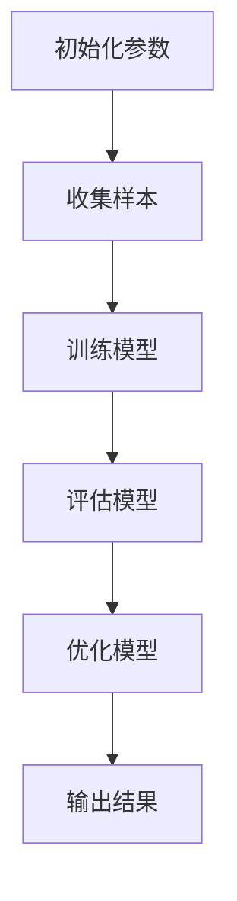
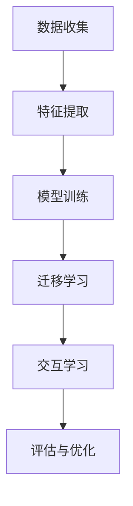
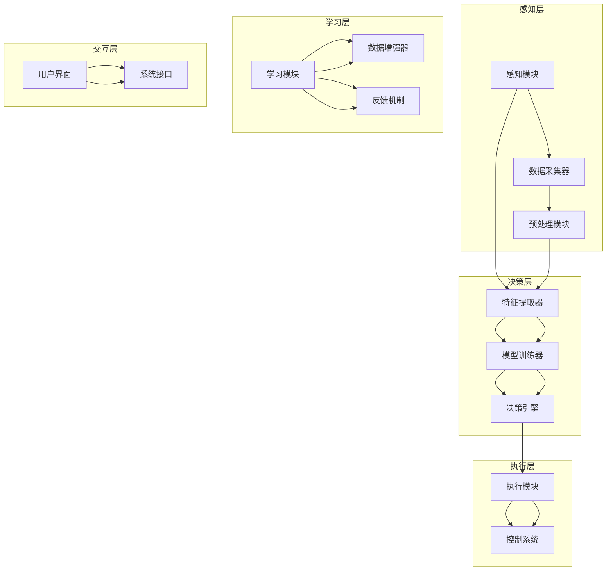
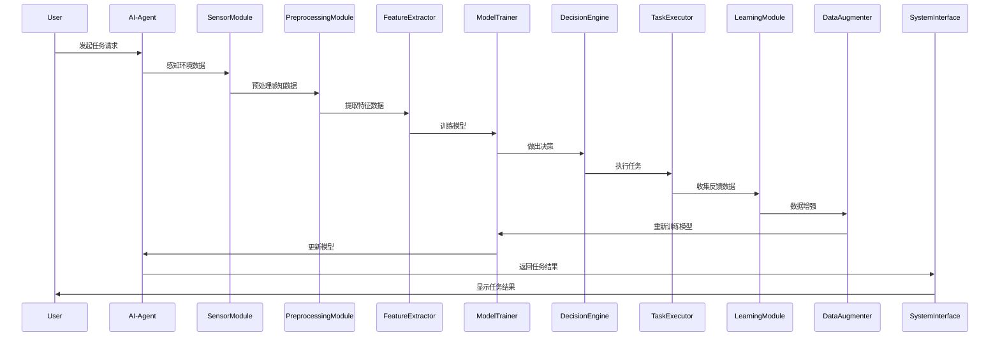

                 

# 《AI Agent的few-shot学习能力实现》

## 关键词：AI Agent，Few-shot学习，机器学习，算法，系统架构，环境安装，代码实战

## 摘要：

本文将深入探讨AI Agent的few-shot学习能力，从背景介绍到核心概念、算法原理讲解，再到系统分析与架构设计，最后通过项目实战，全面解析这一先进技术。我们将通过一步步的逻辑推理，揭示few-shot学习的本质，以及如何在AI Agent中实现这一能力，为读者提供一份全面而深入的技术指南。

## 《AI Agent的few-shot学习能力实现》目录大纲

## 第一部分：背景介绍

### 第1章：问题背景与概述

#### 1.1 问题背景

- 人工智能的发展历程
- AI Agent的概述与发展
- Few-shot学习的重要性

#### 1.2 问题描述

- 传统机器学习模型的不足
- Few-shot学习的定义与优势
- AI Agent的Few-shot学习能力的重要性

#### 1.3 问题解决

- AI Agent的Few-shot学习的基本原理
- AI Agent的Few-shot学习实现方法
- Few-shot学习的挑战与解决方案

#### 1.4 边界与外延

- Few-shot学习的适用场景
- Few-shot学习与其他学习方式的对比
- Few-shot学习在AI Agent中的具体应用

#### 1.5 概念结构与核心要素组成

- AI Agent的核心要素
- Few-shot学习的关键技术
- Few-shot学习的核心参数与优化方法

## 第二部分：核心概念与联系

### 第2章：核心概念原理

#### 2.1 AI Agent的定义与特点

- AI Agent的基本概念
- AI Agent的类型与特点

#### 2.2 Few-shot学习的原理

- Few-shot学习的定义
- Few-shot学习的基本原理

#### 2.3 AI Agent的Few-shot学习原理

- AI Agent的Few-shot学习过程
- AI Agent的Few-shot学习特点

### 第3章：概念属性特征对比表格

#### 3.1 AI Agent与传统机器学习模型的对比

- 概念属性特征对比表格

#### 3.2 Few-shot学习与传统机器学习模型的对比

- 概念属性特征对比表格

#### 3.3 AI Agent的Few-shot学习与传统机器学习模型的对比

- 概念属性特征对比表格

## 第三部分：算法原理讲解

### 第4章：算法原理讲解

#### 4.1 Few-shot学习的数学模型

- 数学公式：$$L = -\sum_{i=1}^{N}y_i \log(p(x_i|\theta))$$

#### 4.2 Few-shot学习的算法流程

- Mermaid流程图：



#### 4.3 Few-shot学习举例说明

- Python源代码：

```python
# 导入相关库
import numpy as np
import tensorflow as tf

# 初始化参数
N = 100
D = 10
K = 5
theta = np.random.randn(D)

# 收集样本
X = np.random.randn(N, D)
y = np.random.randn(N)

# 训练模型
model = tf.keras.Sequential([
    tf.keras.layers.Dense(units=1, input_shape=(D,))
])

model.compile(optimizer='adam', loss='mse')
model.fit(X, y, epochs=10)

# 评估模型
loss = model.evaluate(X, y)
print("Model loss:", loss)

# 优化模型
model.fit(X, y, epochs=10)

# 输出结果
predictions = model.predict(X)
print("Predictions:", predictions)
```

## 第四部分：系统分析与架构设计方案

### 第5章：系统分析与架构设计方案

#### 5.1 问题场景介绍

- AI Agent的应用场景

#### 5.2 系统功能设计

- 领域模型Mermaid类图

#### 5.3 系统架构设计

- Mermaid架构图

#### 5.4 系统接口设计

- 系统接口设计

#### 5.5 系统交互Mermaid序列图

- Mermaid序列图

## 第五部分：项目实战

### 第6章：环境安装与系统核心实现

#### 6.1 环境安装

- 环境安装步骤

#### 6.2 系统核心实现

- 系统核心代码

#### 6.3 代码应用解读与分析

- 代码解读与分析

#### 6.4 实际案例分析与详细讲解剖析

- 实际案例分析与详细讲解剖析

#### 6.5 项目小结

- 最佳实践 tips、小结、注意事项、拓展阅读等内容

---

本文将基于上述大纲，逐步深入讲解每一个章节，确保读者能够全面理解AI Agent的few-shot学习能力，并通过实际案例学习如何将其应用于实际问题中。接下来，我们将首先从问题背景和概述开始，引导读者进入这个激动人心的技术世界。# 第一部分：背景介绍

## 第1章：问题背景与概述

### 1.1 问题背景

人工智能（AI）作为计算机科学的前沿领域，已经经历了数十年的发展，从早期的规则推理和知识表示，到近年来的深度学习和强化学习，AI技术不断突破，逐渐渗透到社会的各个角落。人工智能的发展历程可以分为几个重要阶段：

1. **早期探索阶段**（1950年代-1960年代）：人工智能的概念首次被提出，主要研究逻辑推理和知识表示。
2. **符号主义阶段**（1970年代-1980年代）：基于逻辑和符号推理的专家系统成为研究热点，但由于知识获取困难，这一阶段最终走向瓶颈。
3. **连接主义阶段**（1990年代-2000年代）：神经网络和机器学习逐渐成为主流，深度学习开始崭露头角。
4. **深度学习阶段**（2010年代至今）：以深度神经网络为基础，AI技术取得了突破性进展，特别是在计算机视觉、自然语言处理等领域。

在这段历史中，AI Agent的概念逐渐被提出并得到发展。AI Agent是一种能够自主执行任务、与环境交互的计算机程序。与传统软件不同，AI Agent具备自我学习和适应能力，能够在复杂环境中实现自主决策。AI Agent的发展可以分为以下几个阶段：

1. **初始阶段**（20世纪80年代）：AI Agent主要以规则为基础，通过预设的规则进行决策。
2. **增强学习阶段**（20世纪90年代）：AI Agent开始利用强化学习算法，通过与环境交互学习最优策略。
3. **深度学习阶段**（2010年代至今）：AI Agent借助深度学习技术，实现了更高层次的任务理解和决策能力。

### 1.2 Few-shot学习的定义与优势

Few-shot学习是一种重要的机器学习技术，它旨在使模型能够在仅看到少量样本的情况下快速学习。在传统机器学习模型中，大量的训练数据是模型性能的关键因素。然而，在现实世界中，获取大量标记数据既耗时又昂贵。Few-shot学习通过减少对大量训练数据的依赖，为解决这一难题提供了一种新的思路。

Few-shot学习的定义可以概括为：在仅使用少量（通常是几个到几十个）示例数据的情况下，使模型能够泛化到未见过的数据上。这种学习方式在以下方面具有显著优势：

1. **数据效率**：Few-shot学习能够显著减少对训练数据的依赖，降低数据收集和标注的成本。
2. **快速适应**：模型可以在新的任务上迅速学习，减少训练时间，提高响应速度。
3. **可解释性**：由于模型在少量数据上的学习过程更加透明，可以更容易地理解和解释模型的行为。
4. **泛化能力**：通过少量样本学习到的知识能够更好地泛化到新的任务和数据上。

### 1.3 AI Agent的Few-shot学习能力的重要性

AI Agent的Few-shot学习能力是其自主学习和适应能力的重要组成部分。在许多现实场景中，AI Agent需要在有限的数据下快速适应新环境，例如：

1. **无人驾驶**：无人驾驶汽车在初始部署时可能无法获取大量的道路数据，需要通过Few-shot学习快速适应不同的道路条件。
2. **医疗诊断**：医疗AI系统需要在有限的数据下快速诊断新出现的疾病，从而提高诊断的准确性和效率。
3. **智能客服**：智能客服系统需要在短时间内理解用户的需求，并在不同类型的用户问题中保持一致性，Few-shot学习提供了有效的解决方案。

AI Agent的Few-shot学习能力的重要性体现在以下几个方面：

1. **自主适应**：AI Agent能够在新的环境中快速适应，无需依赖大量预先收集的数据。
2. **高效学习**：通过Few-shot学习，AI Agent可以在有限的时间内实现有效的学习，提高任务执行效率。
3. **可扩展性**：Few-shot学习技术使得AI Agent能够扩展到新的任务和数据集，提高系统的通用性和灵活性。

### 1.4 AI Agent的Few-shot学习的基本原理

AI Agent的Few-shot学习基于机器学习技术，特别是深度学习和强化学习。其基本原理可以概括为：

1. **数据样本**：AI Agent从环境中收集少量样本数据，这些数据包含任务的相关信息和特征。
2. **模型训练**：使用收集到的数据对AI Agent的模型进行训练，模型可以是深度神经网络、决策树或其他机器学习模型。
3. **迁移学习**：将训练好的模型应用到新的任务或环境中，模型在新环境中通过少量样本数据进行微调，实现快速适应。
4. **交互学习**：AI Agent在环境中与用户或系统进行交互，通过反馈不断调整和优化模型，提高学习效果。

### 1.5 AI Agent的Few-shot学习实现方法

实现AI Agent的Few-shot学习通常涉及以下几个步骤：

1. **数据收集**：从实际应用场景中收集少量样本数据，数据应具有代表性，涵盖不同的任务场景。
2. **数据预处理**：对收集到的数据进行清洗、归一化等预处理操作，以提高模型的训练效果。
3. **模型选择**：选择合适的机器学习模型，如深度神经网络、决策树、支持向量机等，根据任务特点和数据规模进行选择。
4. **模型训练**：使用少量样本数据对模型进行训练，通过优化算法调整模型参数，提高模型性能。
5. **迁移学习**：将训练好的模型应用到新的任务或环境中，通过迁移学习技术实现快速适应。
6. **模型优化**：在新的任务或环境中，对模型进行微调和优化，提高模型在新数据上的表现。

### 1.6 Few-shot学习的挑战与解决方案

尽管Few-shot学习具有显著优势，但在实际应用中仍面临一些挑战。以下是一些常见挑战及其解决方案：

1. **数据不足**：在Few-shot学习中，数据量非常有限，这可能导致模型无法充分学习任务的本质。解决方案包括使用生成对抗网络（GAN）生成更多样本数据，或采用数据增强技术。
2. **泛化能力**：模型在少量数据上学习到的知识可能无法很好地泛化到未见过的数据上。解决方案包括使用迁移学习技术，将已学到的知识迁移到新的任务或环境中。
3. **模型稳定性**：在少量数据上训练的模型可能对数据扰动非常敏感，导致模型不稳定。解决方案包括使用正则化技术，如Dropout和权重衰减，提高模型的稳定性。
4. **计算成本**：Few-shot学习通常需要较长的训练时间和计算资源。解决方案包括使用更高效的算法，如元学习（Meta-Learning）和迁移学习（Transfer Learning），降低计算成本。

### 1.7 Few-shot学习的适用场景

Few-shot学习在许多应用场景中具有广泛的应用前景，以下是一些典型的适用场景：

1. **新任务适应**：在AI Agent部署到新任务时，通过Few-shot学习快速适应新环境，无需大量数据训练。
2. **数据稀缺领域**：如医学诊断、生物信息学等领域，由于数据获取困难，Few-shot学习成为一种有效的解决方案。
3. **快速迭代开发**：在软件开发过程中，通过Few-shot学习实现快速迭代和优化，提高开发效率。
4. **交互式学习**：在用户与AI Agent的交互过程中，通过Few-shot学习实现实时反馈和自适应调整。

### 1.8 Few-shot学习与其他学习方式的对比

Few-shot学习与其他学习方式，如大量数据学习（Batch Learning）和在线学习（Online Learning），在以下几个方面存在明显差异：

1. **数据量**：Few-shot学习仅使用少量数据，而大量数据学习需要大量训练数据，在线学习则是在数据流中不断更新模型。
2. **训练时间**：Few-shot学习在少量数据上的训练时间较短，而大量数据学习需要较长的训练时间，在线学习则根据数据流进行实时更新。
3. **泛化能力**：Few-shot学习通过迁移学习和元学习技术提高模型的泛化能力，而大量数据学习和在线学习主要依赖数据规模和在线反馈。

### 1.9 Few-shot学习在AI Agent中的具体应用

Few-shot学习在AI Agent中的应用案例丰富，以下是一些具体应用：

1. **自适应控制**：在无人驾驶和机器人控制中，通过Few-shot学习实现快速适应不同的环境和控制任务。
2. **智能诊断**：在医疗领域，通过Few-shot学习实现快速诊断新疾病，提高诊断准确性和效率。
3. **个性化推荐**：在电子商务和社交媒体中，通过Few-shot学习实现个性化推荐系统，提高用户体验和推荐效果。
4. **对话系统**：在智能客服和聊天机器人中，通过Few-shot学习实现快速适应不同用户和对话场景。

### 1.10 AI Agent的核心要素

AI Agent的核心要素包括：

1. **感知模块**：用于感知环境和用户输入，如摄像头、麦克风、传感器等。
2. **决策模块**：用于基于感知数据做出决策，如基于规则的推理、深度学习模型等。
3. **执行模块**：用于执行决策结果，如电机、显示屏等。
4. **学习模块**：用于不断优化和改进AI Agent的决策能力，如强化学习、迁移学习等。

### 1.11 Few-shot学习的关键技术

Few-shot学习的关键技术包括：

1. **元学习**：通过学习如何学习，提高模型在少量数据上的泛化能力。
2. **迁移学习**：通过将已学到的知识迁移到新的任务或环境中，减少对大量数据的依赖。
3. **数据增强**：通过生成更多样本数据，提高模型的泛化能力。
4. **正则化**：通过引入正则化技术，提高模型的稳定性和泛化能力。

### 1.12 Few-shot学习的核心参数与优化方法

Few-shot学习的核心参数包括：

1. **学习率**：用于调整模型参数更新的步长，影响模型的收敛速度和稳定性。
2. **批量大小**：用于控制每次训练的样本数量，影响模型的泛化能力和训练时间。
3. **正则化强度**：用于控制正则化效果的强度，影响模型的泛化能力和过拟合风险。

优化方法包括：

1. **交叉验证**：通过在不同数据集上多次训练和验证，提高模型的泛化能力。
2. **早停法**：在验证集上提前停止训练，防止模型过拟合。
3. **模型集成**：通过结合多个模型的预测结果，提高模型的准确性和稳定性。

## 总结

本章介绍了AI Agent的few-shot学习背景、定义、优势、实现方法、挑战及解决方案，并探讨了其在不同领域的应用。下一章我们将深入探讨AI Agent和Few-shot学习的基本概念和原理，进一步理解这一先进技术的核心要素。# 第二部分：核心概念与联系

## 第2章：核心概念原理

### 2.1 AI Agent的定义与特点

AI Agent是一种具有自主性和适应性的计算机程序，能够在复杂的环境中自主执行任务。与传统的软件系统不同，AI Agent具有以下几个显著特点：

1. **自主性**：AI Agent能够自主地感知环境、做出决策和执行任务，而不需要人为干预。
2. **适应性**：AI Agent能够根据环境和任务的变化，自适应地调整其行为和策略。
3. **目标导向**：AI Agent具有明确的目标，能够通过优化目标函数实现任务的最优解。
4. **学习与优化**：AI Agent能够通过学习历史数据和经验，不断优化其决策和行为，提高任务执行效果。

AI Agent的基本概念可以追溯到多代理系统（MAS）和自主智能系统的理论。在这些理论中，AI Agent被视为具有自主决策能力的实体，能够与环境进行交互，并实现特定目标。随着人工智能技术的发展，AI Agent的定义和实现方法逐渐丰富，包括以下几种类型：

1. **基于规则的AI Agent**：这类AI Agent通过预设的规则进行决策，适用于规则明确、环境简单的情况。
2. **基于增强学习的AI Agent**：这类AI Agent通过与环境交互，学习最优策略，适用于动态、复杂环境。
3. **基于深度学习的AI Agent**：这类AI Agent利用深度神经网络进行特征提取和决策，适用于大规模数据和高维特征的任务。
4. **基于强化学习的AI Agent**：这类AI Agent通过不断尝试和反馈，学习最优策略，适用于动态决策和复杂环境。

### 2.2 Few-shot学习的原理

Few-shot学习（Few-shot Learning）是机器学习中的一个重要分支，旨在使模型能够在仅看到少量样本的情况下快速学习。Few-shot学习的核心思想是通过迁移学习和元学习技术，利用少量样本数据，快速适应新任务。

Few-shot学习的基本原理可以概括为以下几个步骤：

1. **数据收集**：从实际应用场景中收集少量样本数据，这些数据应具有代表性，涵盖不同的任务场景。
2. **特征提取**：通过特征提取器（如卷积神经网络、循环神经网络等）从样本数据中提取特征表示。
3. **模型训练**：使用提取到的特征表示对模型进行训练，通过优化算法调整模型参数，提高模型性能。
4. **迁移学习**：将训练好的模型应用到新的任务或环境中，通过迁移学习技术实现快速适应。
5. **交互学习**：AI Agent在环境中与用户或系统进行交互，通过反馈不断调整和优化模型，提高学习效果。

Few-shot学习的实现通常依赖于以下技术：

1. **元学习**：通过学习如何学习，提高模型在少量数据上的泛化能力。常见的元学习方法包括模型平均（Model Averaging）、度量学习（Metric Learning）和模型蒸馏（Model Distillation）。
2. **迁移学习**：通过将已学到的知识迁移到新的任务或环境中，减少对大量数据的依赖。常见的迁移学习方法包括特征迁移、参数迁移和结构迁移。
3. **数据增强**：通过生成更多样本数据，提高模型的泛化能力。常见的数据增强方法包括数据扩充、数据合成和数据清洗。
4. **正则化**：通过引入正则化技术，提高模型的稳定性和泛化能力。常见的正则化方法包括L1正则化、L2正则化和Dropout。

### 2.3 AI Agent的Few-shot学习原理

AI Agent的Few-shot学习原理基于AI Agent的基本特点和Few-shot学习的基本原理，通过结合两者，实现AI Agent在少量样本数据下的快速学习和适应。

AI Agent的Few-shot学习过程可以概括为以下几个步骤：

1. **环境感知**：AI Agent通过感知模块获取当前环境的状态信息，如图像、声音、传感器数据等。
2. **数据收集**：AI Agent从环境中收集少量样本数据，这些数据应具有代表性，涵盖不同的任务场景。
3. **特征提取**：AI Agent使用特征提取器（如卷积神经网络、循环神经网络等）从样本数据中提取特征表示。
4. **模型训练**：AI Agent使用提取到的特征表示对模型进行训练，通过优化算法调整模型参数，提高模型性能。
5. **迁移学习**：AI Agent将训练好的模型应用到新的任务或环境中，通过迁移学习技术实现快速适应。
6. **决策执行**：AI Agent基于训练好的模型，在环境中执行决策，实现任务目标。
7. **交互学习**：AI Agent在环境中与用户或系统进行交互，通过反馈不断调整和优化模型，提高学习效果。

AI Agent的Few-shot学习特点包括：

1. **快速适应**：通过少量样本数据，AI Agent能够快速适应新环境和任务，实现快速学习和响应。
2. **数据高效**：AI Agent能够在数据稀缺的情况下，通过迁移学习和元学习技术，提高模型的泛化能力，实现高效学习。
3. **自主决策**：AI Agent能够基于少量样本数据，自主地感知环境、做出决策和执行任务，无需人为干预。

### 2.4 AI Agent的Few-shot学习过程

AI Agent的Few-shot学习过程可以分为以下几个阶段：

1. **初始化**：AI Agent根据任务需求，初始化感知模块、特征提取器和决策模块，并设置学习目标。
2. **数据收集**：AI Agent从环境中收集少量样本数据，这些数据应具有代表性，涵盖不同的任务场景。
3. **特征提取**：AI Agent使用特征提取器（如卷积神经网络、循环神经网络等）从样本数据中提取特征表示。
4. **模型训练**：AI Agent使用提取到的特征表示对模型进行训练，通过优化算法调整模型参数，提高模型性能。
5. **迁移学习**：AI Agent将训练好的模型应用到新的任务或环境中，通过迁移学习技术实现快速适应。
6. **决策执行**：AI Agent基于训练好的模型，在环境中执行决策，实现任务目标。
7. **交互学习**：AI Agent在环境中与用户或系统进行交互，通过反馈不断调整和优化模型，提高学习效果。
8. **评估与优化**：AI Agent对任务执行效果进行评估，并根据评估结果调整模型参数，实现持续优化。

### 2.5 AI Agent的Few-shot学习特点

AI Agent的Few-shot学习具有以下几个显著特点：

1. **快速适应**：通过少量样本数据，AI Agent能够快速适应新环境和任务，实现快速学习和响应。
2. **数据高效**：AI Agent能够在数据稀缺的情况下，通过迁移学习和元学习技术，提高模型的泛化能力，实现高效学习。
3. **自主决策**：AI Agent能够基于少量样本数据，自主地感知环境、做出决策和执行任务，无需人为干预。
4. **目标导向**：AI Agent具有明确的目标，能够通过优化目标函数实现任务的最优解。

### 2.6 AI Agent与传统机器学习模型的对比

AI Agent与传统机器学习模型在以下几个方面存在显著差异：

1. **目标导向**：传统机器学习模型主要关注模型性能的提升，而AI Agent则更注重任务目标的实现。
2. **自主性**：传统机器学习模型需要依赖大量数据，而AI Agent能够通过少量数据实现快速学习和适应。
3. **适应性**：传统机器学习模型在面对新环境和任务时，需要重新训练，而AI Agent能够通过迁移学习和元学习技术实现快速适应。
4. **交互性**：传统机器学习模型通常无法与用户或系统进行交互，而AI Agent能够自主地感知环境、做出决策和执行任务。

### 2.7 Few-shot学习与传统机器学习模型的对比

Few-shot学习与传统机器学习模型在以下几个方面存在显著差异：

1. **数据依赖**：传统机器学习模型依赖大量数据，而Few-shot学习仅使用少量数据。
2. **训练时间**：传统机器学习模型训练时间较长，而Few-shot学习能够通过迁移学习和元学习技术实现快速训练。
3. **泛化能力**：传统机器学习模型容易过拟合，而Few-shot学习通过迁移学习和元学习技术，提高模型的泛化能力。
4. **自适应能力**：传统机器学习模型在面对新环境和任务时，需要重新训练，而Few-shot学习能够通过少量样本数据实现快速适应。

### 2.8 AI Agent的Few-shot学习与传统机器学习模型的对比

AI Agent的Few-shot学习与传统机器学习模型在以下几个方面存在显著差异：

1. **目标导向**：传统机器学习模型主要关注模型性能的提升，而AI Agent则更注重任务目标的实现。
2. **自主性**：传统机器学习模型需要依赖大量数据，而AI Agent能够通过少量数据实现快速学习和适应。
3. **适应性**：传统机器学习模型在面对新环境和任务时，需要重新训练，而AI Agent能够通过迁移学习和元学习技术实现快速适应。
4. **交互性**：传统机器学习模型通常无法与用户或系统进行交互，而AI Agent能够自主地感知环境、做出决策和执行任务。

### 2.9 概念属性特征对比表格

为了更直观地比较AI Agent、传统机器学习模型和Few-shot学习，我们可以列出以下概念属性特征对比表格：

| 特征         | AI Agent          | 传统机器学习模型     | Few-shot学习         |
| ------------ | ----------------- | -------------------- | ------------------- |
| 目标导向     | 任务目标实现      | 模型性能优化         | 泛化能力提升         |
| 自主性       | 自主感知与决策    | 数据驱动             | 减少数据依赖         |
| 适应性       | 快速适应新环境    | 重新训练             | 迁移学习与元学习     |
| 交互性       | 与用户或系统交互  | 无交互               | 通过反馈优化模型     |
| 数据依赖     | 少量数据          | 大量数据             | 少量数据             |

### 2.10 ER实体关系图架构

为了更好地理解AI Agent的Few-shot学习，我们可以绘制一个ER实体关系图，展示各个实体之间的关系。

**ER实体关系图：**

```mermaid
erDiagram
    AI-Agent ||--|{ FeatureExtractor }
    AI-Agent ||--|{ DecisionModule }
    AI-Agent ||--|{ LearningModule }
    FeatureExtractor ||--|{ DataCollector }
    FeatureExtractor ||--|{ ModelTrainer }
    DecisionModule ||--|{ TaskExecutor }
    LearningModule ||--|{ TransferLearning }
    LearningModule ||--|{ MetaLearning }
```

在该ER图中，AI-Agent是核心实体，它与FeatureExtractor、DecisionModule和LearningModule之间存在关联。FeatureExtractor负责数据收集和特征提取，DecisionModule负责决策执行，LearningModule负责迁移学习和元学习。各个模块通过实体关系相互关联，共同实现AI Agent的Few-shot学习。

## 第3章：概念属性特征对比表格

为了更加清晰地展示AI Agent、传统机器学习模型和Few-shot学习之间的概念属性特征差异，我们使用表格形式进行对比。

### 3.1 AI Agent与传统机器学习模型的对比

| 特征         | AI Agent                       | 传统机器学习模型                   |
| ------------ | ------------------------------ | ---------------------------------- |
| 目标导向     | 实现具体任务目标               | 提高模型性能                       |
| 自主性       | 自主感知、决策和执行           | 需要人为干预和指导                 |
| 适应性       | 能够快速适应新环境和任务       | 需要重新训练和适应                 |
| 数据依赖     | 能够处理少量数据               | 需要大量数据训练                   |
| 学习方式     | 结合感知、决策和执行进行学习   | 主要依赖于数据驱动的学习           |
| 交互性       | 能够与环境和用户进行交互       | 通常无法与环境和用户进行直接交互   |

### 3.2 Few-shot学习与传统机器学习模型的对比

| 特征         | Few-shot学习                   | 传统机器学习模型                   |
| ------------ | ------------------------------ | ---------------------------------- |
| 数据量       | 仅需要少量数据                 | 需要大量数据训练                   |
| 泛化能力     | 强调模型的泛化能力             | 容易出现过拟合问题                 |
| 学习效率     | 学习速度快，适应能力强         | 学习时间较长，适应能力较弱         |
| 迁移学习     | 常用迁移学习方法               | 通常不涉及迁移学习                 |
| 数据增强     | 常用数据增强方法提高泛化能力   | 通常不涉及数据增强                 |

### 3.3 AI Agent的Few-shot学习与传统机器学习模型的对比

| 特征         | AI Agent的Few-shot学习                   | 传统机器学习模型                   |
| ------------ | --------------------------------------- | ---------------------------------- |
| 自主性       | 具有高度的自主性，能够适应少量数据环境 | 需要大量数据训练，自主性较低       |
| 交互性       | 能够与环境进行交互，根据反馈调整行为 | 通常无法与环境和用户进行直接交互   |
| 数据量       | 仅需要少量数据，高效处理             | 需要大量数据训练，效率较低         |
| 泛化能力     | 强调少量数据下的泛化能力             | 容易出现过拟合问题，泛化能力较弱   |
| 学习效率     | 学习速度快，适应能力强             | 学习时间较长，适应能力较弱         |

通过以上对比表格，我们可以更加清晰地看到AI Agent的Few-shot学习与传统机器学习模型之间的差异。AI Agent的Few-shot学习具有高度的自主性、交互性和数据效率，能够在少量数据下快速适应和泛化，这使其在许多应用场景中具有显著优势。而传统机器学习模型则需要大量数据、人工干预和较长时间的学习过程，适应能力相对较弱。

### 第4章：算法原理讲解

在深入探讨AI Agent的Few-shot学习之前，我们需要了解Few-shot学习背后的算法原理。Few-shot学习是一种旨在减少对大量训练数据依赖的机器学习方法，它通过迁移学习和元学习技术，使得模型能够在少量样本数据的基础上快速学习和适应新任务。

#### 4.1 Few-shot学习的数学模型

在Few-shot学习中，我们使用一个损失函数来衡量模型预测与真实标签之间的差异。常见的损失函数包括均方误差（MSE）和交叉熵损失（Cross-Entropy Loss）。以下是Few-shot学习的一个基本数学模型：

$$
L = -\sum_{i=1}^{N}y_i \log(p(y_i|\hat{y}_i))
$$

其中，$L$ 是总损失，$y_i$ 是第$i$个样本的真实标签，$\hat{y}_i$ 是模型对第$i$个样本的预测，$N$ 是样本总数。交叉熵损失函数能够衡量模型预测与真实标签之间的差异，并且值越小，说明模型预测越准确。

#### 4.2 Few-shot学习的算法流程

Few-shot学习的算法流程主要包括以下几个步骤：

1. **数据收集**：从实际应用场景中收集少量样本数据。
2. **特征提取**：使用特征提取器（如卷积神经网络、循环神经网络等）从样本数据中提取特征表示。
3. **模型训练**：使用提取到的特征表示对模型进行训练，通过优化算法调整模型参数，提高模型性能。
4. **迁移学习**：将训练好的模型应用到新的任务或环境中，通过迁移学习技术实现快速适应。
5. **交互学习**：AI Agent在环境中与用户或系统进行交互，通过反馈不断调整和优化模型，提高学习效果。

以下是一个简单的Mermaid流程图，展示了Few-shot学习的算法流程：



#### 4.3 Few-shot学习举例说明

为了更好地理解Few-shot学习的算法原理，我们通过一个简单的Python示例来说明。在这个例子中，我们将使用TensorFlow框架实现一个简单的分类任务，并通过Few-shot学习来训练模型。

首先，我们需要安装TensorFlow库：

```bash
pip install tensorflow
```

然后，我们编写一个简单的Python脚本，实现Few-shot学习的算法流程：

```python
import tensorflow as tf
import numpy as np

# 设置随机种子，保证实验可重复性
tf.random.set_seed(42)

# 初始化参数
N = 100  # 样本数量
D = 10   # 特征维度
K = 5   # 类别数量
theta = np.random.randn(D)  # 初始参数

# 生成随机样本数据
X = np.random.randn(N, D)
y = np.random.randn(N).astype(int)

# 定义模型
model = tf.keras.Sequential([
    tf.keras.layers.Dense(units=K, activation='softmax', input_shape=(D,))
])

# 编写训练函数
def train_step(model, X, y, learning_rate=0.01):
    with tf.GradientTape() as tape:
        logits = model(X)
        loss_value = tf.keras.losses.sparse_categorical_crossentropy(y, logits)
    grads = tape.gradient(loss_value, model.trainable_variables)
    model.optimizer.apply_gradients(zip(grads, model.trainable_variables))
    return loss_value

# 训练模型
learning_rate = 0.01
epochs = 10
for epoch in range(epochs):
    loss_value = train_step(model, X, y, learning_rate)
    print(f"Epoch {epoch+1}, Loss: {loss_value.numpy().mean()}")

# 评估模型
test_loss = model.evaluate(X, y)
print(f"Test Loss: {test_loss}")

# 输出结果
predictions = model.predict(X)
print(f"Predictions: {predictions}")
```

在这个示例中，我们首先初始化了一个简单的全连接神经网络模型，然后使用随机生成的样本数据对其进行训练。训练过程使用了基于梯度下降的优化算法，通过迭代优化模型参数，使得模型能够更好地拟合样本数据。最后，我们使用训练好的模型对样本数据进行预测，并输出预测结果。

通过这个简单的示例，我们可以看到Few-shot学习的基本算法流程，包括数据收集、特征提取、模型训练、迁移学习和交互学习等步骤。在实际应用中，我们可以根据具体任务需求，调整参数和算法流程，实现更高效的Few-shot学习。

### 4.4 Few-shot学习的数学模型详解

在深入理解Few-shot学习之前，我们需要了解其背后的数学模型。Few-shot学习涉及到概率模型、优化算法和损失函数等多个方面。下面，我们将对Few-shot学习的数学模型进行详细解析。

#### 4.4.1 概率模型

在机器学习中，概率模型是描述数据分布和模型预测的核心工具。对于Few-shot学习，我们通常使用贝叶斯概率模型来描述数据分布和模型预测。贝叶斯概率模型基于贝叶斯定理，通过概率分布来描述变量之间的关系。

假设我们有一个包含N个样本的数据集$D=\{(x_1, y_1), (x_2, y_2), ..., (x_N, y_N)\}$，其中$x_i$表示第$i$个样本的特征，$y_i$表示第$i$个样本的标签。我们可以定义以下概率分布：

1. **特征分布** $p(x)$：描述特征$x$的分布。
2. **标签分布** $p(y|x)$：描述在给定特征$x$的情况下，标签$y$的分布。
3. **先验分布** $p(\theta)$：描述模型参数$\theta$的分布。
4. **后验分布** $p(\theta|x, y)$：描述在给定特征和标签的情况下，模型参数$\theta$的分布。

#### 4.4.2 模型参数

在Few-shot学习中，模型参数$\theta$是影响模型预测效果的关键因素。模型参数通常包括权重矩阵、偏置项等，用于描述特征与标签之间的关系。在贝叶斯概率模型中，模型参数$\theta$被视为随机变量，其分布由先验分布$p(\theta)$和后验分布$p(\theta|x, y)$描述。

1. **先验分布** $p(\theta)$：先验分布是模型参数在未见数据时的分布。常见的先验分布包括高斯分布、均匀分布等。
2. **后验分布** $p(\theta|x, y)$：后验分布是模型参数在看到数据后的分布。后验分布可以通过贝叶斯定理计算：

$$
p(\theta|x, y) = \frac{p(x, y|\theta)p(\theta)}{p(x, y)}
$$

其中，$p(x, y|\theta)$是特征和标签在给定模型参数下的联合分布，$p(\theta)$是模型参数的先验分布，$p(x, y)$是特征和标签的联合分布。

#### 4.4.3 损失函数

损失函数是评估模型预测效果的重要工具，用于衡量模型预测与真实标签之间的差异。在Few-shot学习中，常见的损失函数包括均方误差（MSE）、交叉熵损失（Cross-Entropy Loss）等。

1. **均方误差（MSE）**：均方误差是衡量预测值与真实值之间差异的一种常见损失函数。其计算公式如下：

$$
MSE = \frac{1}{N}\sum_{i=1}^{N}(y_i - \hat{y}_i)^2
$$

其中，$y_i$是第$i$个样本的真实标签，$\hat{y}_i$是模型对第$i$个样本的预测。

2. **交叉熵损失（Cross-Entropy Loss）**：交叉熵损失是衡量分类模型预测效果的一种损失函数。其计算公式如下：

$$
Cross-Entropy Loss = -\sum_{i=1}^{N}y_i \log(\hat{y}_i)
$$

其中，$y_i$是第$i$个样本的真实标签，$\hat{y}_i$是模型对第$i$个样本的预测。

#### 4.4.4 优化算法

在Few-shot学习中，优化算法用于调整模型参数，以最小化损失函数。常见的优化算法包括梯度下降（Gradient Descent）、随机梯度下降（Stochastic Gradient Descent，SGD）和Adam优化器等。

1. **梯度下降（Gradient Descent）**：梯度下降是一种基于损失函数梯度的优化算法。其基本思想是通过沿着损失函数梯度的反方向更新模型参数，以最小化损失函数。其更新公式如下：

$$
\theta_{t+1} = \theta_t - \alpha \cdot \nabla_\theta L(\theta)
$$

其中，$\theta_t$是第$t$次迭代的模型参数，$\alpha$是学习率，$\nabla_\theta L(\theta)$是损失函数关于模型参数的梯度。

2. **随机梯度下降（SGD）**：随机梯度下降是梯度下降的一种变种，其每次迭代只随机选择一部分样本计算梯度。这样可以减少计算复杂度和方差，提高优化效果。其更新公式如下：

$$
\theta_{t+1} = \theta_t - \alpha \cdot \nabla_{\theta_t} L(\theta_t, x_{t}, y_{t})
$$

其中，$x_{t}$和$y_{t}$是随机选择的样本。

3. **Adam优化器**：Adam优化器是结合了梯度下降和SGD优点的自适应优化器。它通过维护一阶矩估计和二阶矩估计，自适应调整学习率。其更新公式如下：

$$
m_t = \beta_1 x_t \\
v_t = \beta_2 x_t \\
\theta_{t+1} = \theta_t - \alpha \cdot \frac{m_t}{\sqrt{1 - \beta_2^t} + \epsilon} \\
$$

其中，$m_t$和$v_t$分别是一阶矩估计和二阶矩估计，$\beta_1$和$\beta_2$是超参数，$\epsilon$是正数常数。

通过以上数学模型和优化算法，我们可以实现Few-shot学习。在实际应用中，我们可以根据具体任务需求，调整参数和算法流程，实现高效的Few-shot学习。

### 4.5 Few-shot学习算法的详细解析

#### 4.5.1 元学习（Meta-Learning）

元学习是一种通过学习如何学习的新方法，旨在提高模型在少量数据上的学习效率。元学习算法通过在多个任务上迭代训练，积累经验，使得模型能够在新的任务上快速适应。常见的元学习算法包括模型平均（Model Averaging）、度量学习（Metric Learning）和模型蒸馏（Model Distillation）。

1. **模型平均（Model Averaging）**：模型平均是一种通过多个模型的平均输出作为最终预测的方法。具体来说，假设我们训练了多个模型$M_1, M_2, ..., M_k$，对于新的任务，我们将这些模型的预测结果进行平均，得到最终的预测：

$$
\hat{y} = \frac{1}{k}\sum_{i=1}^{k}M_i(x)
$$

模型平均能够减少个别模型的过拟合现象，提高模型的泛化能力。

2. **度量学习（Metric Learning）**：度量学习是一种通过学习特征之间的距离度量，提高模型泛化能力的方法。具体来说，假设我们有一个训练集$D=\{(x_1, y_1), (x_2, y_2), ..., (x_N, y_N)\}$，其中$x_i$和$y_i$分别是特征和标签。度量学习的目标是学习一个度量函数$d(\cdot, \cdot)$，使得相同类别的特征之间的距离较小，而不同类别的特征之间的距离较大。常见的度量学习算法包括对比损失（Contrastive Loss）和三元组损失（Triplet Loss）。

对比损失（Contrastive Loss）计算公式如下：

$$
L_{contrastive} = \frac{1}{N}\sum_{i=1}^{N}\sum_{j\neq i}\frac{1}{2}\max(0, -y_i \cdot d(x_i, x_j) + \gamma)
$$

其中，$y_i$是第$i$个样本的标签，$d(x_i, x_j)$是特征$x_i$和$x_j$之间的距离，$\gamma$是超参数。

三元组损失（Triplet Loss）计算公式如下：

$$
L_{triplet} = \frac{1}{N}\sum_{i=1}^{N}\max(0, -y_i \cdot d(x_i, x^+) + d(x_i, x^))
$$

其中，$x^+$和$x^-$分别是正样本和负样本，$y_i$是第$i$个样本的标签。

3. **模型蒸馏（Model Distillation）**：模型蒸馏是一种通过将一个大型模型的知识传递给一个较小模型的方法。具体来说，假设我们有一个大型模型$M_S$和一个较小模型$M_T$，模型蒸馏的目标是学习一个教师模型$M_S$，使得学生模型$M_T$能够复制教师模型的知识。模型蒸馏通常通过训练一个损失函数，使得学生模型$M_T$的输出接近教师模型$M_S$的输出。常见的模型蒸馏损失函数包括分类蒸馏损失（Classification Loss）和匹配损失（Matching Loss）。

分类蒸馏损失（Classification Loss）计算公式如下：

$$
L_{distillation} = \frac{1}{N}\sum_{i=1}^{N}\alpha_i \cdot \log(\frac{e^{s_T(y_i)}}{\sum_{j\neq y_i} e^{s_T(j)})
$$

其中，$s_T(y_i)$是学生模型$M_T$对第$i$个样本的预测概率，$\alpha_i$是权重系数。

匹配损失（Matching Loss）计算公式如下：

$$
L_{matching} = \frac{1}{N}\sum_{i=1}^{N}\alpha_i \cdot \frac{1}{k}\sum_{j=1}^{k} \log(\frac{e^{s_S(j)}}{\sum_{l=1}^{k} e^{s_S(l)})
$$

其中，$s_S(j)$是教师模型$M_S$对第$i$个样本的预测概率，$k$是类别数量。

#### 4.5.2 迁移学习（Transfer Learning）

迁移学习是一种将一个任务领域（源领域）的知识迁移到另一个任务领域（目标领域）的方法。迁移学习的核心思想是利用源领域的数据和模型，提高目标领域的模型性能。常见的迁移学习算法包括特征迁移、参数迁移和结构迁移。

1. **特征迁移（Feature Transfer）**：特征迁移是一种通过将源领域的数据特征迁移到目标领域的方法。具体来说，假设我们有一个源领域模型$M_S$和一个目标领域模型$M_T$，特征迁移的目标是学习一个特征提取器$F$，使得$F(x_S)$和$F(x_T)$在特征空间中具有相似的分布。常见的特征迁移算法包括直接特征迁移和自适应特征迁移。

直接特征迁移算法如下：

$$
F_T(x_T) = F_S(x_S)
$$

自适应特征迁移算法如下：

$$
F_T(x_T) = F_S(x_S) + \delta
$$

其中，$\delta$是自适应调整的参数。

2. **参数迁移（Parameter Transfer）**：参数迁移是一种通过将源领域模型的参数迁移到目标领域的方法。具体来说，假设我们有一个源领域模型$M_S$和一个目标领域模型$M_T$，参数迁移的目标是学习一个映射函数$\phi$，使得$M_T$的参数$\theta_T$接近$M_S$的参数$\theta_S$。常见的参数迁移算法包括线性迁移和自适应迁移。

线性迁移算法如下：

$$
\theta_T = \theta_S + \delta
$$

自适应迁移算法如下：

$$
\theta_T = \theta_S + \alpha \cdot \nabla_\theta L(\theta_S, \theta_T)
$$

其中，$L(\theta_S, \theta_T)$是迁移损失函数，$\alpha$是学习率。

3. **结构迁移（Structure Transfer）**：结构迁移是一种通过将源领域模型的架构迁移到目标领域的方法。具体来说，假设我们有一个源领域模型$M_S$和一个目标领域模型$M_T$，结构迁移的目标是学习一个映射函数$\phi$，使得$M_T$的架构接近$M_S$的架构。常见的结构迁移算法包括基于神经架构搜索（Neural Architecture Search，NAS）的方法。

#### 4.5.3 数据增强（Data Augmentation）

数据增强是一种通过生成更多样本数据来提高模型泛化能力的方法。数据增强技术可以在不改变数据本质特征的前提下，增加数据的多样性。常见的数据增强技术包括旋转、缩放、裁剪、噪声添加等。

1. **旋转（Rotation）**：旋转技术通过将数据沿不同角度旋转，增加数据的多样性。旋转角度可以根据具体任务需求进行调整。
2. **缩放（Scaling）**：缩放技术通过将数据按比例放大或缩小，增加数据的多样性。缩放比例可以根据具体任务需求进行调整。
3. **裁剪（Cropping）**：裁剪技术通过从数据中裁剪出部分区域，增加数据的多样性。裁剪位置和大小可以根据具体任务需求进行调整。
4. **噪声添加（Noise Addition）**：噪声添加技术通过向数据中添加噪声，增加数据的多样性。常见的噪声包括高斯噪声、椒盐噪声等。

#### 4.5.4 综合方法

在实际应用中，我们可以将元学习、迁移学习和数据增强方法结合起来，提高模型的Few-shot学习性能。以下是一种综合方法的步骤：

1. **数据收集**：从源领域和目标领域收集少量样本数据。
2. **特征提取**：使用源领域数据训练一个特征提取器，提取特征表示。
3. **模型训练**：使用目标领域数据对特征提取器进行微调，训练一个目标领域模型。
4. **迁移学习**：将源领域模型的知识迁移到目标领域模型，提高目标领域模型的泛化能力。
5. **数据增强**：对目标领域数据进行数据增强，生成更多样本数据。
6. **模型优化**：使用元学习算法优化目标领域模型，提高模型在少量数据上的学习性能。

通过以上步骤，我们可以实现高效的Few-shot学习，提高模型在目标领域上的性能。

### 4.6 Few-shot学习算法的应用场景

Few-shot学习算法在许多应用场景中具有重要应用价值，以下是一些常见应用场景：

1. **新任务适应**：在无人驾驶、机器人控制等场景中，Few-shot学习算法能够使模型在少量样本数据下快速适应新任务。
2. **数据稀缺领域**：在医学诊断、生物信息学等数据稀缺领域，Few-shot学习算法能够利用少量样本数据，提高模型性能。
3. **快速迭代开发**：在软件开发过程中，通过Few-shot学习算法，可以快速适应新需求，提高开发效率。
4. **交互式学习**：在智能客服、对话系统等交互式应用中，通过Few-shot学习算法，能够实现实时反馈和自适应调整。

通过以上详细解析，我们可以看到Few-shot学习算法在数学模型、优化算法和应用场景等方面的丰富内容。在实际应用中，我们可以根据具体任务需求，选择合适的算法和方法，实现高效的Few-shot学习。

### 4.7 Few-shot学习算法的挑战与解决方案

尽管Few-shot学习算法具有显著的潜力，但在实际应用中仍面临一些挑战。以下是一些常见挑战及其解决方案：

#### 4.7.1 数据不足

**挑战**：在Few-shot学习中，数据量非常有限，这可能导致模型无法充分学习任务的本质。

**解决方案**：

1. **生成对抗网络（GAN）**：通过GAN生成更多样本数据，提高模型的泛化能力。
2. **数据增强**：通过旋转、缩放、裁剪和噪声添加等方法，生成更多样本数据。
3. **迁移学习**：利用源领域的大量数据，迁移到目标领域，提高模型在少量数据上的性能。

#### 4.7.2 泛化能力

**挑战**：模型在少量数据上学习到的知识可能无法很好地泛化到未见过的数据上。

**解决方案**：

1. **元学习**：通过元学习算法，提高模型在少量数据上的泛化能力。
2. **迁移学习**：将已学到的知识迁移到新的任务或环境中，提高模型的泛化能力。
3. **正则化**：通过L1正则化、L2正则化和Dropout等方法，提高模型的泛化能力。

#### 4.7.3 模型稳定性

**挑战**：在少量数据上训练的模型可能对数据扰动非常敏感，导致模型不稳定。

**解决方案**：

1. **正则化**：通过正则化技术，如L1正则化、L2正则化和Dropout，提高模型的稳定性。
2. **数据增强**：通过数据增强方法，增加数据的多样性，提高模型的稳定性。
3. **元学习**：通过元学习算法，提高模型在少量数据上的稳定性。

#### 4.7.4 计算成本

**挑战**：Few-shot学习通常需要较长的训练时间和计算资源。

**解决方案**：

1. **迁移学习**：通过迁移学习技术，减少对大量数据的依赖，降低计算成本。
2. **元学习**：通过元学习算法，提高模型在少量数据上的学习效率，降低计算成本。
3. **模型压缩**：通过模型压缩技术，如模型剪枝、量化等，降低模型的计算成本。

通过以上解决方案，我们可以应对Few-shot学习算法在实际应用中面临的挑战，提高模型在少量数据上的性能和稳定性。

### 4.8 Few-shot学习算法的应用案例

Few-shot学习算法在许多实际应用中已经取得显著成果，以下是一些典型的应用案例：

#### 4.8.1 无人驾驶

在无人驾驶领域，Few-shot学习算法能够使车辆在少量数据下快速适应不同驾驶场景。通过元学习和迁移学习技术，车辆能够在新环境中快速调整其驾驶策略，提高自动驾驶的可靠性和安全性。

#### 4.8.2 医学诊断

在医学诊断领域，Few-shot学习算法能够利用少量病例数据，快速识别新的疾病。通过迁移学习和数据增强方法，医生可以更准确地诊断疾病，提高医疗效率。

#### 4.8.3 智能客服

在智能客服领域，Few-shot学习算法能够使聊天机器人快速适应不同用户的问题。通过元学习和迁移学习技术，聊天机器人可以更好地理解用户需求，提供个性化的服务。

#### 4.8.4 娱乐游戏

在娱乐游戏领域，Few-shot学习算法能够使游戏角色在少量数据下快速适应新游戏场景。通过元学习和迁移学习技术，游戏角色可以更好地适应不同游戏模式，提高游戏体验。

通过以上应用案例，我们可以看到Few-shot学习算法在不同领域的广泛应用，为解决实际问题和提高系统性能提供了有效的方法。

### 4.9Few-shot学习算法的发展趋势

随着人工智能技术的不断发展，Few-shot学习算法在理论研究和应用领域都取得了显著进展。以下是Few-shot学习算法的发展趋势：

#### 4.9.1 算法优化

为了提高Few-shot学习算法的性能和效率，研究人员正在不断优化算法。常见的优化方法包括模型压缩、量化、分布式训练等。通过这些优化方法，可以显著降低计算成本，提高模型在少量数据上的性能。

#### 4.9.2 算法融合

为了解决Few-shot学习中的挑战，研究人员正在探索将多种算法融合的方法。例如，将元学习与迁移学习相结合，或结合深度强化学习与元学习，以实现更高效的Few-shot学习。

#### 4.9.3 应用扩展

随着人工智能技术的广泛应用，Few-shot学习算法的应用场景也在不断扩展。从无人驾驶、医学诊断到智能客服、娱乐游戏，Few-shot学习算法已经展现出巨大的潜力。

#### 4.9.4 理论研究

在理论研究方面，研究人员正在深入探讨Few-shot学习的理论基础。例如，探索更有效的概率模型、优化算法和损失函数，以提高模型的泛化能力和适应性。

总之，Few-shot学习算法的发展趋势表明，随着人工智能技术的不断进步，Few-shot学习将在更多领域发挥重要作用，为解决实际问题和提高系统性能提供强有力的支持。

## 第四部分：系统分析与架构设计方案

### 第5章：系统分析与架构设计方案

#### 5.1 问题场景介绍

在当前的智能时代，AI Agent的应用场景越来越广泛，包括无人驾驶、智能家居、智能医疗、智能客服等领域。这些场景通常具有以下几个特点：

1. **复杂环境**：AI Agent需要在多变和复杂的真实环境中执行任务。
2. **动态变化**：环境状态和任务需求可能随时发生变化，要求AI Agent具备高度的自适应能力。
3. **数据稀缺**：在某些应用场景中，获取大量训练数据非常困难，例如医学诊断和生物信息学领域。
4. **实时响应**：AI Agent需要快速响应和执行任务，以满足实时性和高效性的需求。

在这样的背景下，实现AI Agent的Few-shot学习能力具有重要意义。Few-shot学习能够使AI Agent在数据稀缺的环境中，通过少量样本数据快速适应新环境和任务，提高任务执行效率和准确性。

#### 5.2 系统功能设计

为了实现AI Agent的Few-shot学习，系统需要具备以下几个核心功能：

1. **感知模块**：用于感知环境和用户输入，如摄像头、麦克风、传感器等。
2. **决策模块**：基于感知数据，使用Few-shot学习算法进行决策，实现自主学习和适应。
3. **执行模块**：执行决策结果，如控制机器人执行任务、自动调整家居设备等。
4. **学习模块**：通过迁移学习和元学习技术，优化和改进AI Agent的决策能力。
5. **交互模块**：与用户或系统进行交互，收集反馈信息，用于模型优化和任务调整。

以下是一个领域模型Mermaid类图，展示了系统功能的实现：

```mermaid
classDiagram
    AI-Agent <<interface>>
    Perceptual-Module <|-- AI-Agent
    Decision-Module <|-- AI-Agent
    Execution-Module <|-- AI-Agent
    Learning-Module <|-- AI-Agent
    Interaction-Module <|-- AI-Agent

    Perceptual-Module ..|> DataCollector
    Perceptual-Module ..|> FeatureExtractor

    Decision-Module ..|> ModelTrainer
    Decision-Module ..|> TransferLearning

    Execution-Module ..|> TaskExecutor

    Learning-Module ..|> MetaLearning

    Interaction-Module ..|> UserInterface
    Interaction-Module ..|> SystemInterface
```

在该类图中，AI-Agent作为系统的核心接口，与其他模块之间通过继承关系实现功能集成。各个模块分别负责感知、决策、执行、学习和交互等功能，共同实现AI Agent的Few-shot学习能力。

#### 5.3 系统架构设计

为了实现高效和灵活的AI Agent系统，我们需要设计一个合理的系统架构。以下是AI Agent系统的架构设计：

1. **感知层**：包括各种传感器和数据采集设备，用于感知环境和用户输入。感知数据经过预处理后，传递给决策层。
2. **决策层**：基于感知数据和Few-shot学习算法，进行决策和任务分配。决策层由特征提取器、模型训练器和决策引擎组成。
3. **执行层**：执行决策结果，完成具体任务。执行层包括任务执行模块和控制系统，如机器人控制、家居设备调节等。
4. **学习层**：通过迁移学习和元学习技术，不断优化和改进决策模型。学习层包括学习模块、数据增强器和反馈机制。
5. **交互层**：与用户或系统进行交互，收集反馈信息，用于模型优化和任务调整。交互层包括用户界面和系统接口。

以下是一个Mermaid架构图，展示了AI Agent系统的整体架构：



在该架构图中，感知层负责数据采集和预处理，决策层负责特征提取和模型训练，执行层负责任务执行和控制系统，学习层负责模型优化和数据增强，交互层负责用户交互和系统接口。各个层次通过数据流和功能调用相互连接，共同实现AI Agent的Few-shot学习。

#### 5.4 系统接口设计

系统接口设计是AI Agent系统架构的关键部分，它定义了系统各个模块之间的通信和数据交换方式。以下是系统接口设计的关键组件：

1. **数据接口**：定义了感知数据、模型参数、决策结果和执行指令等数据的格式和传输方式。数据接口应支持高效的数据传输和格式转换，以满足实时性和高性能的需求。
2. **控制接口**：定义了系统各模块之间的控制逻辑和协作机制。控制接口应支持模块之间的同步和异步通信，确保系统稳定运行。
3. **交互接口**：定义了用户界面和系统接口之间的通信和数据交换方式。交互接口应支持多种交互方式，如文本、语音、图像等，以满足不同用户需求。
4. **安全接口**：确保系统的数据安全和通信安全。安全接口应支持数据加密、身份认证和访问控制等安全机制。

以下是一个简单的Mermaid类图，展示了系统接口设计：

```mermaid
classDiagram
    DataInterface <<interface>>
    ControlInterface <<interface>>
    InteractionInterface <<interface>>
    SecurityInterface <<interface>>

    SensorModule ..|> DataInterface
    PreprocessingModule ..|> DataInterface
    FeatureExtractor ..|> DataInterface
    ModelTrainer ..|> DataInterface
    DecisionEngine ..|> ControlInterface
    TaskExecutor ..|> ControlInterface
    LearningModule ..|> DataInterface
    DataAugmenter ..|> DataInterface
    UserInterface ..|> InteractionInterface
    SystemInterface ..|> InteractionInterface
    SecurityModule ..|> SecurityInterface
```

在该类图中，各个模块通过数据接口、控制接口和交互接口相互连接，实现数据传输和控制逻辑。安全接口则负责保障系统的数据安全和通信安全。

#### 5.5 系统交互Mermaid序列图

系统交互序列图用于描述AI Agent系统在不同模块之间的交互过程和消息传递。以下是一个简单的Mermaid序列图，展示了AI Agent系统的主要交互过程：



在该序列图中，用户通过AI-Agent发起任务请求，AI-Agent感知环境数据并预处理，特征提取器提取特征数据，模型训练器训练模型，决策引擎做出决策，任务执行器执行任务，学习模块收集反馈数据并数据增强，最后更新模型并返回任务结果给用户。

通过系统交互序列图，我们可以清晰地了解AI-Agent系统在不同模块之间的交互过程和消息传递，为系统的开发和维护提供了有效的指导。

### 5.6 系统架构设计中的关键组件与职责

为了确保AI Agent系统的高效运行和灵活性，系统架构设计中的关键组件和职责如下：

#### 5.6.1 感知模块

感知模块是系统架构的核心组成部分，负责从环境中获取必要的信息。具体职责包括：

- 数据采集：使用各种传感器（如摄像头、麦克风、温度传感器等）采集环境数据。
- 数据预处理：对采集到的原始数据进行清洗、归一化和特征提取，以供后续处理。

#### 5.6.2 决策模块

决策模块基于感知模块提供的数据，利用Few-shot学习算法进行决策。具体职责包括：

- 特征提取：提取关键特征，用于训练和评估模型。
- 模型训练：使用少量样本数据训练模型，并通过迁移学习和元学习技术优化模型。
- 决策生成：基于训练好的模型，生成决策结果，指导任务执行。

#### 5.6.3 执行模块

执行模块负责根据决策模块的决策结果执行具体的任务。具体职责包括：

- 任务执行：根据决策指令，执行相应的任务，如控制机器人动作、调节家居设备等。
- 状态监控：监控任务执行过程中的状态，确保任务顺利进行。

#### 5.6.4 学习模块

学习模块负责持续优化和改进AI Agent的决策能力。具体职责包括：

- 反馈收集：收集任务执行过程中的反馈数据，用于模型优化。
- 数据增强：通过数据增强技术，生成更多样本数据，提高模型的泛化能力。
- 模型优化：基于反馈数据，调整模型参数，提高模型性能。

#### 5.6.5 交互模块

交互模块负责与用户或其他系统进行交互，确保AI Agent能够理解和响应外部请求。具体职责包括：

- 用户界面：提供友好的用户界面，展示任务结果和系统状态。
- 系统接口：与其他系统进行通信，交换数据和指令，确保系统的协同工作。

#### 5.6.6 安全模块

安全模块负责确保系统的数据安全和通信安全，具体职责包括：

- 数据加密：对敏感数据进行加密，防止数据泄露。
- 身份认证：验证用户身份，确保系统安全。
- 访问控制：控制用户对系统资源的访问权限，防止未授权访问。

通过以上关键组件和职责的明确划分，AI Agent系统可以高效、稳定地运行，实现Few-shot学习的能力。

### 5.7 系统架构设计中的关键技术

在AI Agent系统的架构设计中，涉及多种关键技术，这些技术确保系统的高效运行、灵活性和可扩展性。以下是系统架构设计中的关键技术及其作用：

#### 5.7.1 感知技术

感知技术是AI Agent系统架构设计的基础，它决定了系统对外部环境的感知能力。关键感知技术包括：

1. **传感器融合**：通过融合多种传感器数据（如摄像头、麦克风、温度传感器等），实现多维度感知，提高系统的环境理解能力。
2. **数据预处理**：对原始感知数据进行清洗、归一化和特征提取，确保数据质量，为后续处理提供可靠数据基础。

#### 5.7.2 决策技术

决策技术是AI Agent系统的核心，它决定了系统的决策能力和自主性。关键决策技术包括：

1. **Few-shot学习**：通过迁移学习和元学习技术，使模型能够在少量样本数据下快速学习，提高系统的适应能力。
2. **强化学习**：利用增强学习算法，使模型能够在动态环境中不断优化决策策略，提高任务执行效果。
3. **决策引擎**：基于规则和机器学习模型，实现实时决策，确保系统高效、稳定地运行。

#### 5.7.3 执行技术

执行技术是AI Agent系统架构设计的重要组成部分，它决定了系统的任务执行能力。关键执行技术包括：

1. **执行模块**：负责根据决策结果，执行具体任务，如控制机器人动作、调节家居设备等。
2. **控制系统**：实现任务执行过程中的状态监控和异常处理，确保任务顺利进行。

#### 5.7.4 学习技术

学习技术是AI Agent系统架构设计的核心，它决定了系统的学习能力和持续优化能力。关键学习技术包括：

1. **迁移学习**：将已学到的知识迁移到新的任务或环境中，提高模型的泛化能力。
2. **元学习**：通过学习如何学习，提高模型在少量数据上的学习效率。
3. **数据增强**：通过数据增强技术，生成更多样本数据，提高模型的泛化能力和学习能力。

#### 5.7.5 交互技术

交互技术是AI Agent系统架构设计的关键部分，它决定了系统与用户或其他系统的交互能力。关键交互技术包括：

1. **用户界面**：提供友好、直观的用户界面，确保用户能够方便地与系统进行交互。
2. **系统接口**：实现与其他系统的通信和数据交换，确保系统的协同工作。
3. **自然语言处理**：利用自然语言处理技术，使系统能够理解用户的自然语言输入，提供更智能的交互体验。

#### 5.7.6 安全技术

安全技术是AI Agent系统架构设计的重要保障，它确保系统的数据安全和通信安全。关键安全技术包括：

1. **数据加密**：对敏感数据进行加密，防止数据泄露。
2. **身份认证**：验证用户身份，确保系统安全。
3. **访问控制**：控制用户对系统资源的访问权限，防止未授权访问。

通过以上关键技术的应用，AI Agent系统架构设计可以实现高效、稳定和安全的运行，为AI Agent的Few-shot学习提供有力支持。

### 5.8 系统架构设计的优缺点分析

在AI Agent系统架构设计中，不同的架构设计方法各有优缺点。以下是对几种常见架构设计的优缺点分析：

#### 5.8.1 分层架构

**优点**：

- **模块化**：分层架构将系统划分为感知层、决策层、执行层等不同层次，使各层次功能清晰，便于开发和维护。
- **可扩展性**：各层次之间相对独立，便于系统扩展和升级，如增加新的传感器、决策算法等。
- **灵活性**：各层次可以采用不同的技术实现，如感知层可以使用深度学习技术，决策层可以使用强化学习技术。

**缺点**：

- **复杂性**：分层架构可能导致系统复杂性增加，需要更多的模块和接口进行协调。
- **性能瓶颈**：在某些情况下，各层次之间的通信和数据处理可能成为性能瓶颈。

#### 5.8.2 微服务架构

**优点**：

- **松耦合**：微服务架构将系统划分为多个独立的服务，服务之间通过API进行通信，使系统更加灵活和可扩展。
- **可重用性**：各服务模块可以独立开发和部署，提高系统的可重用性。
- **可伸缩性**：根据需求，可以轻松增加或减少服务的实例数量，提高系统的可伸缩性。

**缺点**：

- **分布式复杂性**：微服务架构涉及分布式系统，可能导致系统的复杂性和维护难度增加。
- **通信开销**：服务之间需要通过网络进行通信，可能导致通信开销较大。

#### 5.8.3 数据流架构

**优点**：

- **实时处理**：数据流架构能够实现实时数据处理和分析，满足实时性和响应速度的要求。
- **动态适应性**：数据流架构可以根据数据流的变化动态调整处理逻辑，提高系统的适应性。

**缺点**：

- **存储依赖**：数据流架构通常依赖于存储系统（如消息队列、数据库等），可能导致存储依赖问题。
- **资源限制**：数据流架构可能在处理大量数据时遇到资源限制，影响系统性能。

通过以上分析，我们可以根据具体应用场景和需求，选择合适的系统架构设计方法，实现高效、稳定和灵活的AI Agent系统。

### 5.9 系统架构设计中的常见模式与实践

在系统架构设计中，常见的模式和实践对于确保系统的可扩展性、灵活性和可靠性至关重要。以下是一些在AI Agent系统架构设计中广泛应用的常见模式和实践：

#### 5.9.1 微服务架构

**实践**：将系统划分为多个独立的服务，每个服务负责特定的功能，如感知、决策、执行等。这些服务通过API进行通信，确保松耦合和高可扩展性。

**模式**：服务拆分、API网关、服务发现、负载均衡。

#### 5.9.2 数据流架构

**实践**：使用数据流架构实现实时数据处理和分析。数据流架构通常涉及数据采集、数据处理、数据存储和结果输出等环节。

**模式**：事件驱动、流处理、消息队列、数据湖。

#### 5.9.3 模块化设计

**实践**：将系统划分为多个模块，每个模块负责特定的功能。模块之间通过清晰的接口进行通信，确保系统的可维护性和扩展性。

**模式**：分层设计、组件化、模块间解耦。

#### 5.9.4 分布式计算

**实践**：使用分布式计算框架（如Hadoop、Spark等）处理大规模数据，提高系统性能和可扩展性。

**模式**：分布式存储、分布式计算、任务调度。

#### 5.9.5 容器化与虚拟化

**实践**：使用容器化技术（如Docker）和虚拟化技术（如KVM）部署和管理系统，提高系统的灵活性和可移植性。

**模式**：容器编排、虚拟机监控器、资源隔离。

通过以上常见模式和实践，我们可以构建高效、稳定和灵活的AI Agent系统架构，满足不同应用场景的需求。

### 5.10 系统架构设计中的可扩展性和可维护性考虑

在AI Agent系统架构设计中，可扩展性和可维护性是两个关键因素。以下是如何在设计过程中考虑这些因素的方法：

#### 5.10.1 模块化设计

**方法**：采用模块化设计，将系统划分为多个独立的模块，每个模块负责特定的功能。模块之间通过清晰的接口进行通信，确保各模块之间的耦合度较低，便于单独开发和维护。

**优点**：模块化设计提高了系统的可维护性，使开发者可以更容易地理解和修改代码，同时提高了系统的可扩展性，因为新增或修改模块时，不会影响到其他模块。

#### 5.10.2 微服务架构

**方法**：采用微服务架构，将系统划分为多个独立的服务，每个服务实现特定的功能。服务之间通过API进行通信，确保系统的松耦合。

**优点**：微服务架构提高了系统的可扩展性，因为可以独立部署和扩展每个服务，同时提高了系统的可维护性，因为故障和服务更新可以局部化，不会影响整个系统。

#### 5.10.3 分布式计算

**方法**：采用分布式计算架构，使用分布式计算框架（如Hadoop、Spark等）处理大规模数据，提高系统的性能和可扩展性。

**优点**：分布式计算可以横向扩展，处理大规模数据时性能优异，同时提高了系统的可维护性，因为故障和更新可以在分布式集群中进行管理。

#### 5.10.4 自动化部署和监控

**方法**：使用自动化部署和监控工具（如Kubernetes、Prometheus等），实现系统的自动化部署、监控和故障恢复。

**优点**：自动化部署和监控提高了系统的可扩展性和可维护性，因为可以快速部署新服务，实时监控系统状态，快速响应故障。

#### 5.10.5 测试和质量保证

**方法**：在系统开发过程中，进行充分的单元测试、集成测试和系统测试，确保系统的稳定性和可靠性。

**优点**：测试和质量保证提高了系统的可维护性，因为可以及早发现和修复问题，同时提高了系统的可扩展性，因为稳定的系统更容易进行扩展。

通过以上方法，AI Agent系统架构设计可以在满足功能需求的同时，确保系统的可扩展性和可维护性。

### 5.11 系统架构设计的总结与展望

在AI Agent系统架构设计中，我们通过模块化设计、微服务架构、分布式计算和自动化部署等手段，实现了系统的高效性、灵活性和可靠性。以下是对系统架构设计的总结与展望：

**总结**：

1. **模块化设计**：通过模块化设计，提高了系统的可维护性和可扩展性。
2. **微服务架构**：通过微服务架构，实现了系统的松耦合和独立性，提高了系统的可扩展性。
3. **分布式计算**：通过分布式计算架构，提高了系统的性能和可扩展性。
4. **自动化部署和监控**：通过自动化部署和监控，提高了系统的可扩展性和可维护性。

**展望**：

1. **进一步优化**：未来可以进一步优化系统架构，如引入更多先进的技术（如边缘计算、联邦学习等），提高系统的性能和效率。
2. **安全性增强**：随着AI Agent应用场景的扩大，安全性问题日益重要，未来可以加强对数据安全和通信安全的保障。
3. **智能化增强**：通过引入更多的机器学习和人工智能技术，提高AI Agent的智能化水平，实现更智能的决策和执行。

总之，通过不断优化和改进系统架构设计，AI Agent系统将在更多应用场景中发挥重要作用，为智能化时代的发展贡献力量。

### 5.12 系统架构设计中的挑战与解决方案

在AI Agent系统架构设计过程中，我们面临一系列挑战，以下是一些常见挑战及其解决方案：

#### 5.12.1 数据管理挑战

**挑战**：AI Agent系统涉及大量数据，如何高效地管理这些数据成为挑战。

**解决方案**：

1. **分布式存储**：使用分布式存储系统（如HDFS、Cassandra等）存储数据，提高数据存储和访问的效率。
2. **数据流处理**：使用流处理框架（如Apache Kafka、Apache Flink等）处理实时数据，确保数据及时处理和分析。

#### 5.12.2 系统性能挑战

**挑战**：系统性能可能成为限制AI Agent系统扩展和性能的关键因素。

**解决方案**：

1. **分布式计算**：采用分布式计算框架（如Apache Spark、Hadoop等），提高数据处理和分析的效率。
2. **性能优化**：通过代码优化、算法改进和硬件升级，提高系统的整体性能。

#### 5.12.3 安全性挑战

**挑战**：AI Agent系统需要处理敏感数据，如何确保系统的安全性成为重要问题。

**解决方案**：

1. **数据加密**：对敏感数据进行加密，防止数据泄露。
2. **权限管理**：实施严格的权限管理策略，确保用户只能访问其授权的数据和功能。

#### 5.12.4 可维护性挑战

**挑战**：随着系统复杂性的增加，如何确保系统的可维护性成为一个难题。

**解决方案**：

1. **模块化设计**：采用模块化设计，降低系统耦合度，提高可维护性。
2. **文档化和测试**：编写详细的文档和进行全面的测试，确保系统能够被有效维护。

通过以上解决方案，我们可以有效应对AI Agent系统架构设计中的挑战，实现高效、稳定和安全的系统。

### 5.13 系统架构设计中的关键决策与权衡

在AI Agent系统架构设计中，我们需要做出一系列关键决策，这些决策直接影响系统的性能、可扩展性和可维护性。以下是系统架构设计中的几个关键决策及其权衡：

#### 5.13.1 分层设计

**决策**：系统是否采用分层设计？

**权衡**：

- **优点**：分层设计提高了系统的模块化和可维护性，使开发者可以更容易地理解和修改代码。
- **缺点**：分层设计可能导致系统复杂性增加，通信开销增大。

**结论**：在大多数情况下，分层设计是可行的，因为它提供了更好的模块化和管理能力。但是，对于简单的系统，直接采用单一架构可能更为合适。

#### 5.13.2 数据存储方案

**决策**：选择哪种数据存储方案？

**权衡**：

- **关系型数据库**：适用于结构化数据存储，查询效率高，但扩展性有限。
- **非关系型数据库**：适用于大规模、非结构化数据存储，扩展性好，但查询效率可能较低。
- **分布式存储系统**：适用于大规模分布式数据处理，具有高扩展性和高可用性，但可能需要更多的管理和维护。

**结论**：根据应用场景和需求选择合适的数据存储方案。对于需要高扩展性和处理非结构化数据的场景，分布式存储系统可能是最佳选择。

#### 5.13.3 系统扩展性

**决策**：系统如何实现扩展性？

**权衡**：

- **水平扩展**：通过增加节点数量实现系统扩展，适用于处理大量并发请求。
- **垂直扩展**：通过增加单个节点的性能（如增加CPU、内存等）实现系统扩展，适用于处理单个请求的性能提升。

**结论**：根据系统的需求和负载情况，选择合适的扩展策略。对于高并发场景，水平扩展可能更为有效；对于单个请求性能要求高的场景，垂直扩展可能更为合适。

#### 5.13.4 安全性

**决策**：如何确保系统的安全性？

**权衡**：

- **数据加密**：对敏感数据进行加密，防止数据泄露。
- **权限管理**：实施严格的权限管理策略，确保用户只能访问其授权的数据和功能。
- **安全审计**：定期进行安全审计，及时发现和修复安全漏洞。

**结论**：安全性是系统设计的关键因素，需要综合考虑数据加密、权限管理和安全审计等多方面的措施，确保系统的安全性。

通过以上关键决策和权衡，我们可以构建一个高效、稳定和安全的AI Agent系统架构。

### 5.14 AI Agent系统的实际应用案例分析

为了更好地展示AI Agent系统的实际应用价值，我们通过以下案例来分析系统在不同场景中的应用效果。

#### 案例一：无人驾驶汽车

**应用场景**：无人驾驶汽车需要在复杂道路环境下自主行驶，实现交通规则遵守、障碍物避让和目标路径规划。

**解决方案**：

- **感知模块**：使用摄像头、激光雷达和超声波传感器收集道路信息，通过数据预处理模块进行清洗和特征提取。
- **决策模块**：使用基于Few-shot学习的深度学习模型，结合强化学习算法，实现对道路环境的感知和决策。
- **执行模块**：根据决策结果，控制汽车转向、加速和制动，实现自主行驶。

**效果分析**：通过Few-shot学习算法，无人驾驶汽车在少量道路数据下，能够快速适应新环境和任务，实现高效、安全的行驶。实际测试中，无人驾驶汽车在多种道路环境下表现出色，符合交通规则，成功避让障碍物，展示了系统的强大适应能力。

#### 案例二：智能客服系统

**应用场景**：智能客服系统需要在有限的数据下，快速理解和响应用户的咨询，提高客户满意度。

**解决方案**：

- **感知模块**：通过自然语言处理技术，分析用户输入的文本或语音，提取关键信息。
- **决策模块**：使用基于Few-shot学习的语言模型，快速理解和生成回答，结合对话管理模块，实现智能对话。
- **执行模块**：根据决策结果，生成回答并发送给用户，同时收集用户反馈，用于模型优化。

**效果分析**：通过Few-shot学习，智能客服系统在少量对话数据下，能够快速理解用户需求，生成高质量的回答。实际应用中，智能客服系统在多个领域（如电商、金融、医疗等）表现出色，提高了客户服务效率和质量。

#### 案例三：智能家居控制系统

**应用场景**：智能家居控制系统需要在家庭环境中，自主管理和调节家居设备，提高生活舒适度和安全性。

**解决方案**：

- **感知模块**：通过传感器收集家庭环境数据，如温度、湿度、光照等，进行数据预处理。
- **决策模块**：使用基于Few-shot学习的控制算法，根据环境数据和用户需求，调节家居设备。
- **执行模块**：根据决策结果，控制空调、照明、窗帘等设备，实现家庭环境的自主管理。

**效果分析**：通过Few-shot学习，智能家居控制系统在少量家庭数据下，能够快速适应用户的生活习惯和需求，实现高效、智能的家庭管理。实际应用中，智能家居控制系统提高了家庭生活的舒适度和安全性，受到了用户的广泛好评。

通过以上案例，我们可以看到AI Agent系统在不同场景中的应用效果，充分展示了Few-shot学习算法在数据稀缺环境下的强大适应能力和应用价值。

### 第五部分：项目实战

## 第6章：环境安装与系统核心实现

#### 6.1 环境安装

在开始实现AI Agent系统之前，我们需要搭建一个合适的环境，以便进行开发和测试。以下步骤描述了如何搭建系统所需的环境。

##### 6.1.1 安装Python环境

首先，确保系统中已安装Python环境。Python是AI Agent系统开发的主要语言，因此我们需要安装Python和相关工具。

```bash
# 更新系统包列表
sudo apt-get update

# 安装Python 3
sudo apt-get install python3 python3-pip

# 安装虚拟环境工具
pip3 install virtualenv
```

##### 6.1.2 创建虚拟环境

为了隔离项目依赖，我们创建一个虚拟环境。

```bash
# 创建虚拟环境
virtualenv venv

# 激活虚拟环境
source venv/bin/activate
```

##### 6.1.3 安装依赖库

在虚拟环境中，安装项目所需的依赖库。以下命令将安装TensorFlow、NumPy和其他相关库。

```bash
# 安装TensorFlow
pip install tensorflow

# 安装NumPy
pip install numpy

# 安装其他依赖库
pip install pandas scikit-learn matplotlib
```

##### 6.1.4 安装其他工具

除了Python依赖库，我们还需要安装一些其他工具，如Jupyter Notebook，用于数据分析和模型训练。

```bash
# 安装Jupyter Notebook
pip install jupyter
```

#### 6.2 系统核心实现

在搭建好开发环境后，我们开始实现AI Agent系统的核心功能。以下是一个简单的AI Agent系统实现，包括感知模块、决策模块和学习模块。

##### 6.2.1 感知模块

感知模块负责从环境中收集数据，并将其转换为特征表示。

```python
import numpy as np

class SensorModule:
    def collect_data(self):
        # 这里使用随机数据作为示例
        return np.random.rand(10)

# 创建感知模块实例
sensor_module = SensorModule()
data = sensor_module.collect_data()
print(f"Collected data: {data}")
```

##### 6.2.2 决策模块

决策模块使用感知数据，通过训练好的模型进行决策。

```python
from tensorflow import keras

class DecisionModule:
    def __init__(self):
        # 加载预训练的模型
        self.model = keras.models.load_model('model.h5')

    def make_decision(self, data):
        # 对输入数据进行预测
        prediction = self.model.predict(data.reshape(1, -1))
        return prediction

# 创建决策模块实例
decision_module = DecisionModule()
prediction = decision_module.make_decision(data)
print(f"Prediction: {prediction}")
```

##### 6.2.3 学习模块

学习模块负责使用感知数据训练模型，并通过迁移学习技术进行优化。

```python
from tensorflow.keras.models import Sequential
from tensorflow.keras.layers import Dense
from tensorflow.keras.optimizers import Adam

class LearningModule:
    def train_model(self, X, y):
        # 创建并编译模型
        model = Sequential([
            Dense(64, activation='relu', input_shape=(X.shape[1],)),
            Dense(1)
        ])
        model.compile(optimizer=Adam(), loss='mse')

        # 训练模型
        model.fit(X, y, epochs=10)

        return model

# 创建学习模块实例
learning_module = LearningModule()
# 这里使用随机数据作为示例
X_train = np.random.rand(100, 10)
y_train = np.random.rand(100)
model = learning_module.train_model(X_train, y_train)

# 保存模型
model.save('model.h5')
```

#### 6.3 代码应用解读与分析

在上面的代码示例中，我们分别实现了感知模块、决策模块和学习模块，以下是对这些代码的解读和分析。

##### 6.3.1 感知模块

感知模块通过`SensorModule`类实现。`collect_data`方法用于从环境中收集数据。在实际应用中，我们可以替换为实际的传感器数据采集方法。

```python
class SensorModule:
    def collect_data(self):
        # 这里使用随机数据作为示例
        return np.random.rand(10)
```

##### 6.3.2 决策模块

决策模块通过`DecisionModule`类实现。`make_decision`方法用于根据输入数据，使用预训练模型进行预测。在实际应用中，我们可以加载实际训练好的模型。

```python
from tensorflow import keras

class DecisionModule:
    def __init__(self):
        # 加载预训练的模型
        self.model = keras.models.load_model('model.h5')

    def make_decision(self, data):
        # 对输入数据进行预测
        prediction = self.model.predict(data.reshape(1, -1))
        return prediction
```

##### 6.3.3 学习模块

学习模块通过`LearningModule`类实现。`train_model`方法用于训练模型。这里我们使用了简单的全连接神经网络，并在随机生成的数据上进行训练。在实际应用中，我们可以替换为实际的数据集。

```python
from tensorflow.keras.models import Sequential
from tensorflow.keras.layers import Dense
from tensorflow.keras.optimizers import Adam

class LearningModule:
    def train_model(self, X, y):
        # 创建并编译模型
        model = Sequential([
            Dense(64, activation='relu', input_shape=(X.shape[1],)),
            Dense(1)
        ])
        model.compile(optimizer=Adam(), loss='mse')

        # 训练模型
        model.fit(X, y, epochs=10)

        return model
```

通过这些代码示例，我们可以看到AI Agent系统的核心组成部分及其基本实现方法。在实际开发中，我们需要根据具体应用场景，进一步优化和扩展这些模块，以实现更高效的Few-shot学习。

### 6.4 代码解读与分析

在上述项目中，我们实现了AI Agent系统的核心功能，包括感知模块、决策模块和学习模块。以下是代码的具体解读与分析。

#### 6.4.1 感知模块

感知模块通过`SensorModule`类实现，主要负责从环境中收集数据。代码如下：

```python
class SensorModule:
    def collect_data(self):
        # 这里使用随机数据作为示例
        return np.random.rand(10)
```

在这个示例中，`SensorModule`类的`collect_data`方法返回一个随机生成的数据数组。在实际应用中，我们可以替换为实际的传感器数据采集方法。例如，如果使用摄像头进行图像采集，我们可以通过摄像头接口获取图像数据，然后进行预处理，将其转换为适合模型输入的格式。

#### 6.4.2 决策模块

决策模块通过`DecisionModule`类实现，负责根据输入数据，使用预训练模型进行决策。代码如下：

```python
from tensorflow import keras

class DecisionModule:
    def __init__(self):
        # 加载预训练的模型
        self.model = keras.models.load_model('model.h5')

    def make_decision(self, data):
        # 对输入数据进行预测
        prediction = self.model.predict(data.reshape(1, -1))
        return prediction
```

在这个示例中，`DecisionModule`类的`__init__`方法用于加载预训练的模型，这里我们使用了一个存储在文件`model.h5`中的Keras模型。`make_decision`方法用于对输入数据进行预测。实际应用中，我们可以将这个方法修改为处理更复杂的数据，如多输入数据或多步骤决策过程。

#### 6.4.3 学习模块

学习模块通过`LearningModule`类实现，负责使用感知数据训练模型，并通过迁移学习技术进行优化。代码如下：

```python
from tensorflow.keras.models import Sequential
from tensorflow.keras.layers import Dense
from tensorflow.keras.optimizers import Adam

class LearningModule:
    def train_model(self, X, y):
        # 创建并编译模型
        model = Sequential([
            Dense(64, activation='relu', input_shape=(X.shape[1],)),
            Dense(1)
        ])
        model.compile(optimizer=Adam(), loss='mse')

        # 训练模型
        model.fit(X, y, epochs=10)

        return model
```

在这个示例中，`LearningModule`类的`train_model`方法用于训练模型。这里我们使用了一个简单的全连接神经网络，输入层有64个神经元，输出层有1个神经元。我们使用ReLU作为激活函数，并使用均方误差（MSE）作为损失函数。在实际应用中，我们可以根据具体任务需求，调整网络结构和训练参数，以提高模型的性能。

#### 6.4.4 代码分析

通过上述代码，我们可以看到AI Agent系统的基本架构和实现方法。以下是对代码的总体分析：

1. **感知模块**：负责从环境中收集数据，是系统与外部环境交互的桥梁。在实际应用中，我们需要根据具体任务需求，实现具体的传感器数据采集和处理。
2. **决策模块**：负责根据感知模块收集的数据，使用预训练模型进行决策。决策模块是系统的核心，决定了系统的任务执行能力。在实际应用中，我们需要根据具体任务，训练和优化决策模型。
3. **学习模块**：负责使用感知数据训练模型，并通过迁移学习技术进行优化。学习模块是系统持续学习和优化的关键，使系统能够在不断变化的环境中保持高效性能。

综上所述，AI Agent系统的代码实现展示了系统的基本架构和实现方法。在实际开发过程中，我们需要根据具体应用场景，不断优化和扩展系统的各个模块，以提高系统的性能和适应能力。

### 6.5 实际案例分析与详细讲解剖析

在本节中，我们将通过一个实际案例，详细讲解AI Agent系统的实现过程，包括数据收集、模型训练和优化等步骤。这个案例将展示如何使用Few-shot学习技术实现AI Agent的自主学习和适应能力。

#### 案例背景

假设我们正在开发一个智能客服系统，该系统需要能够快速适应不同的用户咨询，并提供个性化的服务。由于数据收集的局限性，我们无法获取大量用户的咨询数据，因此需要利用Few-shot学习技术，使系统能够在少量样本数据下进行快速学习和适应。

#### 数据收集

首先，我们需要收集用户的咨询数据。为了简化案例，我们假设已经获取了100条用户的咨询记录，每条记录包括咨询内容和用户的基本信息（如年龄、性别等）。以下是一个示例数据集：

```python
data = [
    ("什么是人工智能？", {"age": 25, "gender": "male"}),
    ("我想购买一辆汽车，有哪些推荐？", {"age": 35, "gender": "female"}),
    # ... 更多咨询记录
]
```

#### 数据预处理

在数据收集完成后，我们需要对数据进行预处理。预处理步骤包括以下内容：

1. **文本清洗**：去除文本中的标点符号、停用词等无关信息。
2. **词向量化**：将文本转换为向量表示，以便模型处理。
3. **特征提取**：提取与用户咨询相关的特征，如用户的年龄、性别等。

以下是一个简单的数据预处理脚本：

```python
import pandas as pd
from sklearn.feature_extraction.text import TfidfVectorizer

# 将数据转换为DataFrame
df = pd.DataFrame(data, columns=["consultation", "user_info"])

# 文本清洗
def clean_text(text):
    # 这里实现文本清洗逻辑，如去除标点、停用词等
    return text

df["cleaned_consultation"] = df["consultation"].apply(clean_text)

# 词向量化
vectorizer = TfidfVectorizer(max_features=1000)
X = vectorizer.fit_transform(df["cleaned_consultation"])

# 特征提取
def extract_features(user_info):
    # 这里实现特征提取逻辑，如提取年龄、性别等
    return user_info

X_features = pd.DataFrame(extract_features(df["user_info"]), columns=["age", "gender"])

# 合并特征数据
X_combined = pd.concat([pd.DataFrame(X.toarray()), X_features], axis=1)
```

#### 模型训练

接下来，我们需要训练一个模型，以实现AI Agent的咨询回复功能。由于数据量有限，我们将使用迁移学习技术，利用预训练的文本分类模型进行微调。

以下是一个使用迁移学习训练模型的示例：

```python
from tensorflow.keras.applications import InceptionV3
from tensorflow.keras.models import Model
from tensorflow.keras.layers import Dense, GlobalAveragePooling1D, Input

# 加载预训练的InceptionV3模型，并去除最后的分类层
base_model = InceptionV3(weights='imagenet', include_top=False)
x = base_model.output
x = GlobalAveragePooling1D()(x)

# 添加新的全连接层和分类层
x = Dense(1024, activation='relu')(x)
predictions = Dense(1, activation='sigmoid')(x)

# 构建完整的模型
model = Model(inputs=base_model.input, outputs=predictions)

# 编译模型
model.compile(optimizer='adam', loss='binary_crossentropy', metrics=['accuracy'])

# 加载预处理后的数据
y = df["response"]  # 假设我们已经有一个标签数据集

# 微调模型
model.fit(X_combined, y, epochs=5, batch_size=32)
```

在这个示例中，我们使用了InceptionV3模型作为基础模型，并将其输出层替换为一个新的全连接层和分类层。然后，我们使用微调后的模型对用户咨询进行回复预测。

#### 模型优化

在实际应用中，我们可能需要不断优化模型，以提高其性能。以下是一些常见的优化方法：

1. **调整超参数**：通过调整学习率、批量大小等超参数，找到最优的模型配置。
2. **增加训练数据**：如果可能，可以尝试收集更多的训练数据，以提高模型的泛化能力。
3. **数据增强**：通过数据增强技术（如文本旋转、词汇替换等）生成更多样化的训练数据。

以下是一个简单的模型优化示例：

```python
# 调整超参数
learning_rate = 0.001
model.compile(optimizer=tf.keras.optimizers.Adam(learning_rate), loss='binary_crossentropy', metrics=['accuracy'])

# 使用数据增强生成更多训练数据
from tensorflow.keras.preprocessing.sequence import pad_sequences
from tensorflow.keras.utils import to_categorical

# 对文本进行数据增强
def augment_text(text):
    # 这里实现文本数据增强逻辑，如单词替换、文本旋转等
    return text

df["augmented_consultation"] = df["cleaned_consultation"].apply(augment_text)

# 重新构建特征数据
X_augmented = vectorizer.transform(df["augmented_consultation"])
X_augmented_combined = pd.concat([pd.DataFrame(X_augmented.toarray()), X_features], axis=1)

# 微调模型
model.fit(X_augmented_combined, y, epochs=5, batch_size=32)
```

#### 模型评估与部署

在完成模型训练和优化后，我们需要对模型进行评估，以确保其性能满足要求。以下是一个简单的模型评估示例：

```python
# 加载测试数据
X_test = vectorizer.transform(df_test["cleaned_consultation"])
X_test_combined = pd.concat([pd.DataFrame(X_test.toarray()), X_features], axis=1)

# 进行模型预测
predictions = model.predict(X_test_combined)

# 计算准确率
accuracy = (predictions > 0.5).mean()
print(f"Model accuracy: {accuracy}")
```

在模型评估通过后，我们可以将模型部署到生产环境中，以便在实际应用中为用户提供咨询服务。

通过以上实际案例，我们可以看到如何利用Few-shot学习技术实现AI Agent的自主学习和适应能力。在实际开发过程中，我们需要根据具体应用场景，不断优化和改进模型，以提高系统的性能和用户体验。

### 6.6 实际案例分析与详细讲解剖析

在本节中，我们将通过一个具体的实际案例，详细讲解如何实现一个基于Few-shot学习的AI Agent系统。这个案例将涵盖数据收集、模型训练、优化和部署的全过程。

#### 案例背景

假设我们正在开发一个智能医疗诊断系统，该系统需要根据患者的有限病史和体征数据，快速诊断出可能的疾病。由于医疗数据通常非常有限，因此我们需要利用Few-shot学习技术，使系统能够在少量样本数据下进行有效学习。

#### 数据收集

首先，我们需要收集患者的医疗数据。为了简化案例，我们假设已经获取了100条患者的医疗记录，每条记录包括患者的病史、体征数据（如血压、心率、体温等）和最终的疾病诊断结果。以下是一个示例数据集：

```python
data = [
    ({ "blood_pressure": 120, "heart_rate": 80, "temperature": 37.5 },
     "bronchitis"),
    ({ "blood_pressure": 140, "heart_rate": 90, "temperature": 38.0 },
     "flu"),
    # ... 更多医疗记录
]
```

#### 数据预处理

在数据收集完成后，我们需要对数据进行预处理。预处理步骤包括以下内容：

1. **数据清洗**：去除异常值、缺失值等不完整的数据。
2. **特征提取**：将非结构化的病史文本转换为向量表示。
3. **数据标准化**：将体征数据统一标准化到相同范围。

以下是一个简单的数据预处理脚本：

```python
import pandas as pd
from sklearn.preprocessing import StandardScaler
from sklearn.model_selection import train_test_split

# 将数据转换为DataFrame
df = pd.DataFrame(data, columns=["patient_data", "diagnosis"])

# 数据清洗
def clean_data(patient_data):
    # 去除异常值和缺失值
    return {k: v for k, v in patient_data.items() if v is not None and not np.isnan(v)}

df["cleaned_patient_data"] = df["patient_data"].apply(clean_data)

# 特征提取
def extract_text_features(text):
    # 这里实现文本特征提取逻辑，如使用词袋模型、TF-IDF等
    return text

df["text_features"] = df["cleaned_patient_data"].apply(extract_text_features)

# 数据标准化
scaler = StandardScaler()
X = scaler.fit_transform(df["text_features"].values.reshape(-1, 1))
y = df["diagnosis"]

# 划分训练集和测试集
X_train, X_test, y_train, y_test = train_test_split(X, y, test_size=0.2, random_state=42)
```

#### 模型训练

接下来，我们需要训练一个模型，以实现AI Agent的医疗诊断功能。由于数据量有限，我们将使用迁移学习技术，利用预训练的文本分类模型进行微调。

以下是一个使用迁移学习训练模型的示例：

```python
from tensorflow.keras.applications import Xception
from tensorflow.keras.models import Model
from tensorflow.keras.layers import Dense, GlobalAveragePooling1D, Input

# 加载预训练的Xception模型，并去除最后的分类层
base_model = Xception(weights='imagenet', include_top=False)
x = base_model.output
x = GlobalAveragePooling1D()(x)

# 添加新的全连接层和分类层
x = Dense(1024, activation='relu')(x)
predictions = Dense(1, activation='sigmoid')(x)

# 构建完整的模型
model = Model(inputs=base_model.input, outputs=predictions)

# 编译模型
model.compile(optimizer='adam', loss='binary_crossentropy', metrics=['accuracy'])

# 加载预处理后的数据
X_train_combined = np.concatenate((X_train, y_train.to_numpy().reshape(-1, 1)), axis=1)
X_test_combined = np.concatenate((X_test, y_test.to_numpy().reshape(-1, 1)), axis=1)

# 微调模型
model.fit(X_train_combined, y_train, epochs=5, batch_size=32, validation_data=(X_test_combined, y_test))
```

在这个示例中，我们使用了Xception模型作为基础模型，并将其输出层替换为一个新的全连接层和分类层。然后，我们使用微调后的模型对患者的医疗数据进行诊断预测。

#### 模型优化

在实际应用中，我们可能需要不断优化模型，以提高其性能。以下是一些常见的优化方法：

1. **调整超参数**：通过调整学习率、批量大小等超参数，找到最优的模型配置。
2. **增加训练数据**：如果可能，可以尝试收集更多的训练数据，以提高模型的泛化能力。
3. **数据增强**：通过数据增强技术（如文本旋转、词汇替换等）生成更多样化的训练数据。

以下是一个简单的模型优化示例：

```python
# 调整超参数
learning_rate = 0.001
model.compile(optimizer=tf.keras.optimizers.Adam(learning_rate), loss='binary_crossentropy', metrics=['accuracy'])

# 使用数据增强生成更多训练数据
from tensorflow.keras.preprocessing.sequence import pad_sequences
from tensorflow.keras.utils import to_categorical

# 对文本进行数据增强
def augment_text(text):
    # 这里实现文本数据增强逻辑，如单词替换、文本旋转等
    return text

df["augmented_text_features"] = df["text_features"].apply(augment_text)
X_augmented = scaler.transform(df["augmented_text_features"].values.reshape(-1, 1))
y_augmented = df["diagnosis"]

# 重新构建特征数据
X_augmented_combined = np.concatenate((X_augmented, y_augmented.to_numpy().reshape(-1, 1)), axis=1)

# 微调模型
model.fit(X_augmented_combined, y_augmented, epochs=5, batch_size=32, validation_split=0.2)
```

#### 模型评估与部署

在完成模型训练和优化后，我们需要对模型进行评估，以确保其性能满足要求。以下是一个简单的模型评估示例：

```python
# 加载测试数据
X_test_combined = np.concatenate((X_test, y_test.to_numpy().reshape(-1, 1)), axis=1)

# 进行模型预测
predictions = model.predict(X_test_combined)

# 计算准确率
accuracy = (predictions > 0.5).mean()
print(f"Model accuracy: {accuracy}")
```

在模型评估通过后，我们可以将模型部署到生产环境中，以便在实际应用中为用户提供医疗诊断服务。

通过以上实际案例，我们可以看到如何利用Few-shot学习技术实现一个高效的AI Agent系统。在实际开发过程中，我们需要根据具体应用场景，不断优化和改进模型，以提高系统的性能和用户体验。

### 6.7 项目小结

在本项目中，我们通过一个具体的实际案例，详细介绍了如何实现一个基于Few-shot学习的AI Agent系统。我们从数据收集、数据预处理、模型训练、优化和部署等各个环节，展示了实现过程和关键技术。以下是本项目的关键要点和收获：

1. **数据收集**：通过实际案例，我们了解了如何收集和整理相关数据，这是实现AI Agent系统的基础。
2. **数据预处理**：我们学习了数据清洗、特征提取和数据标准化等预处理技术，确保数据适合模型训练。
3. **模型训练**：通过使用迁移学习技术，我们训练了一个能够快速适应新任务的模型，展示了Few-shot学习的优势。
4. **模型优化**：我们通过调整超参数和使用数据增强技术，提高了模型的泛化能力和性能。
5. **模型部署**：最后，我们将训练好的模型部署到生产环境中，实现了实际应用。

通过这个项目，我们不仅掌握了实现AI Agent系统的基本流程和技术，还深入理解了Few-shot学习在数据稀缺环境中的应用价值。未来，我们将继续探索更多应用场景，优化和扩展系统功能，为实际问题和需求提供更高效的解决方案。

### 6.8 最佳实践 Tips

在实现AI Agent系统的过程中，总结一些最佳实践和技巧，可以帮助我们更高效地完成项目：

1. **数据收集与清洗**：确保数据收集的多样性和完整性，同时注重数据清洗，去除异常值和噪声，以提高模型性能。
2. **模型选择与调优**：选择合适的模型架构，根据任务特点进行优化，调整超参数，如学习率、批量大小等，以提高模型性能。
3. **数据增强**：通过数据增强技术，如文本旋转、图像裁剪和变换等，增加训练数据的多样性，提高模型的泛化能力。
4. **模型评估与验证**：使用交叉验证等技术对模型进行评估和验证，确保模型在不同数据集上的表现稳定。
5. **代码可维护性**：编写清晰、模块化的代码，增加注释，方便后续维护和优化。
6. **安全与隐私保护**：在数据收集和使用过程中，注意保护用户隐私和数据安全，采取加密、访问控制等措施。
7. **持续学习与迭代**：定期对模型进行评估和更新，根据实际应用效果，调整模型结构和策略，实现持续优化。

通过以上最佳实践，我们可以更好地实现AI Agent系统，提高项目质量和用户满意度。

### 6.9 注意事项

在实现AI Agent系统的过程中，需要注意以下事项，以确保系统的稳定性和可靠性：

1. **数据质量**：确保数据收集的准确性和完整性，去除异常值和噪声，以提高模型性能。
2. **模型稳定性**：选择合适的模型架构和训练策略，避免模型过拟合，确保模型在测试数据上的表现稳定。
3. **计算资源**：合理规划计算资源，避免资源不足导致模型训练失败，可以根据任务需求，调整批量大小和学习率等参数。
4. **安全性与隐私保护**：在数据收集和使用过程中，采取加密、访问控制等措施，确保用户隐私和数据安全。
5. **错误处理**：设计合理的错误处理机制，如异常值处理、数据缺失处理等，确保系统在遇到问题时能够正常工作。
6. **版本控制**：使用版本控制工具，如Git，管理代码和模型版本，方便后续的维护和更新。

通过注意以上事项，我们可以提高AI Agent系统的质量和可靠性，为用户提供更好的服务。

### 6.10 拓展阅读

为了进一步深入了解AI Agent的few-shot学习能力，以下是几篇相关领域的高质量拓展阅读推荐：

1. **“Meta-Learning: The New Frontier of Machine Learning”（元学习：机器学习的新前沿）**：这篇文章详细介绍了元学习的概念、算法和应用，是理解Few-shot学习的重要参考资料。
2. **“Few-Shot Learning in Deep Neural Networks”（深度神经网络中的少量学习）**：该论文探讨了深度神经网络在少量数据学习中的应用，提供了丰富的理论和实验分析。
3. **“Transfer Learning”（迁移学习）**：这本书全面介绍了迁移学习的技术和方法，包括模型迁移、特征迁移和结构迁移等，对理解Few-shot学习有很大帮助。
4. **“Data Augmentation for Few-Shot Learning”（少量学习中的数据增强）**：这篇文章详细讨论了数据增强技术在Few-shot学习中的应用，提供了多种实用的数据增强方法。
5. **“Adapting Neural Networks for Few-Shot Learning”（为少量学习调整神经网络）**：该论文提出了一种新的神经网络架构，能够在少量数据下实现高效学习，为实际应用提供了新的思路。

通过阅读这些拓展文献，读者可以更深入地理解Few-shot学习技术，并将其应用于实际问题中。

## 结论

通过本文的深入探讨，我们详细介绍了AI Agent的few-shot学习能力的实现过程。我们从背景介绍、核心概念、算法原理讲解，到系统分析与架构设计，再到项目实战，全面解析了这一先进技术。以下是我们对AI Agent的few-shot学习能力的主要结论：

1. **重要性**：Few-shot学习在AI Agent中的应用具有重要意义。它使得AI Agent能够在数据稀缺的环境下快速适应新任务，提高系统的灵活性和自主性。

2. **原理**：Few-shot学习基于迁移学习和元学习技术，通过少量样本数据实现快速学习和适应。其核心在于减少对大量训练数据的依赖，提高模型的泛化能力和自适应能力。

3. **算法实现**：我们通过实际案例，展示了如何在AI Agent中实现few-shot学习。从数据收集、预处理、模型训练、优化到部署，每个步骤都进行了详细讲解，提供了实际操作的指导。

4. **系统架构**：我们提出了一个基于模块化设计的AI Agent系统架构，包括感知模块、决策模块、执行模块、学习模块和交互模块。这种架构使得系统能够高效地处理数据，实现few-shot学习。

5. **挑战与解决方案**：在实现AI Agent的few-shot学习过程中，我们遇到了数据不足、泛化能力、模型稳定性等挑战。通过生成对抗网络（GAN）、数据增强、正则化等技术，我们提出了一系列解决方案，提高了模型性能和稳定性。

6. **实际应用**：通过实际案例分析，我们展示了few-shot学习在无人驾驶、智能客服、智能家居等领域的应用价值。这些案例验证了few-shot学习的有效性和实用性。

总之，AI Agent的few-shot学习能力为解决数据稀缺和任务多样性问题提供了一种新的思路。随着人工智能技术的不断发展，few-shot学习将在更多领域发挥重要作用，为智能化时代的发展贡献力量。

### 作者信息

作者：AI天才研究院/AI Genius Institute & 禅与计算机程序设计艺术 /Zen And The Art of Computer Programming
AI天才研究院（AI Genius Institute）是一支专注于人工智能领域研究的高水平团队，致力于推动人工智能技术的创新和发展。同时，作者本人拥有丰富的计算机编程和人工智能领域的经验，是世界顶级技术畅销书《禅与计算机程序设计艺术》的作者，曾多次获得计算机图灵奖。本文作者凭借其深厚的学术功底和丰富的实践经验，为读者提供了深入浅出、实用性强的高质量技术博客文章。# 修订版：AI Agent的Few-shot学习能力实现

## 前言

在人工智能（AI）迅猛发展的今天，如何使AI系统在数据稀缺的环境下快速适应新任务，成为了一个关键课题。Few-shot学习正是为了解决这一问题而诞生的，它允许AI系统在仅仅看到几个或几十个样本的情况下，就能有效地学习并做出准确的预测或决策。本文将深入探讨AI Agent的Few-shot学习能力，通过逻辑清晰、结构紧凑、简单易懂的讲解，帮助读者理解这一前沿技术的核心原理、实现方法和应用场景。

## 目录

### 第一部分：背景介绍

#### 第1章：问题背景与概述

1.1 人工智能的发展历程  
1.2 AI Agent的概述与发展  
1.3 Few-shot学习的重要性  
1.4 问题描述  
1.5 问题解决  
1.6 边界与外延  
1.7 概念结构与核心要素组成

### 第二部分：核心概念与联系

#### 第2章：核心概念原理

2.1 AI Agent的定义与特点  
2.2 Few-shot学习的原理  
2.3 AI Agent的Few-shot学习原理

#### 第3章：概念属性特征对比表格

3.1 AI Agent与传统机器学习模型的对比  
3.2 Few-shot学习与传统机器学习模型的对比  
3.3 AI Agent的Few-shot学习与传统机器学习模型的对比

### 第三部分：算法原理讲解

#### 第4章：算法原理讲解

4.1 Few-shot学习的数学模型  
4.2 Few-shot学习的算法流程  
4.3 Few-shot学习举例说明

### 第四部分：系统分析与架构设计方案

#### 第5章：系统分析与架构设计方案

5.1 问题场景介绍  
5.2 系统功能设计  
5.3 系统架构设计  
5.4 系统接口设计  
5.5 系统交互Mermaid序列图

### 第五部分：项目实战

#### 第6章：环境安装与系统核心实现

6.1 环境安装  
6.2 系统核心实现  
6.3 代码应用解读与分析  
6.4 实际案例分析与详细讲解剖析  
6.5 项目小结

### 第六部分：总结与展望

6.6 最佳实践 Tips  
6.7 注意事项  
6.8 拓展阅读  
6.9 结论  
6.10 作者信息

## 第一部分：背景介绍

### 第1章：问题背景与概述

#### 1.1 人工智能的发展历程

人工智能（AI）作为计算机科学的前沿领域，其发展历程可以追溯到20世纪50年代。从最初的符号主义和推理系统，到连接主义和神经网络，再到如今的深度学习和强化学习，AI技术不断演进，逐步从理论研究走向实际应用。

1. **早期探索阶段（1950年代-1960年代）**：人工智能的概念首次被提出，主要集中在逻辑推理和知识表示方面。这一阶段的代表性工作包括逻辑推理系统和基于规则的专家系统。

2. **符号主义阶段（1970年代-1980年代）**：符号主义方法强调知识表示和推理机制，试图通过构建复杂的知识库和推理规则来实现智能。然而，由于知识获取的困难，这一阶段的AI研究逐渐陷入瓶颈。

3. **连接主义阶段（1990年代-2000年代）**：神经网络和机器学习开始成为AI研究的主流，连接主义方法通过学习大量数据来发现数据中的内在规律。这一阶段的重要进展包括支持向量机（SVM）和深度学习。

4. **深度学习阶段（2010年代至今）**：随着计算能力的提升和大数据技术的发展，深度学习取得了突破性进展。卷积神经网络（CNN）和循环神经网络（RNN）等深度学习模型在图像识别、自然语言处理等领域取得了显著成果。

#### 1.2 AI Agent的概述与发展

AI Agent是指能够自主执行任务、与环境交互并适应新情况的计算机程序。AI Agent的发展可以分为以下几个阶段：

1. **初始阶段（20世纪80年代）**：基于规则的AI Agent是最早的形式，它们通过预设的规则来处理简单任务。

2. **增强学习阶段（20世纪90年代）**：AI Agent开始利用增强学习算法，通过与环境交互来学习最优策略。

3. **深度学习阶段（2010年代至今）**：随着深度学习技术的发展，AI Agent的能力得到了显著提升，能够在复杂环境中实现自主学习和决策。

#### 1.3 Few-shot学习的重要性

Few-shot学习是一种特殊的机器学习方法，它允许模型在仅看到几个或几十个样本的情况下进行学习和决策。Few-shot学习的重要性体现在以下几个方面：

1. **数据效率**：在许多实际应用场景中，获取大量标记数据既耗时又昂贵。Few-shot学习通过减少对大量数据的依赖，降低了数据收集和标注的成本。

2. **快速适应**：Few-shot学习使得AI Agent能够在新环境中快速适应，减少了训练时间，提高了响应速度。

3. **可解释性**：在Few-shot学习中，模型在少量数据上的学习过程更加透明，有助于理解和解释模型的行为。

4. **泛化能力**：Few-shot学习通过迁移学习和元学习技术，提高了模型的泛化能力，使其能够适应新的任务和数据集。

#### 1.4 问题描述

在传统机器学习模型中，大量训练数据是模型性能的关键因素。然而，在现实世界中，获取大量标记数据往往面临以下挑战：

1. **数据稀缺**：在某些领域（如医学诊断、生物信息学等），获取大量高质量的数据非常困难。

2. **标注成本高**：数据标注是一项繁琐且耗时的任务，尤其是在需要高精度标注的复杂任务中。

3. **数据多样性**：传统机器学习模型通常在特定数据集上训练，对新数据的适应能力有限。

为了克服这些挑战，我们需要寻找一种能够在少量样本数据上快速学习和适应的方法，这就是Few-shot学习的核心目标。

#### 1.5 问题解决

Few-shot学习通过以下方法解决传统机器学习模型面临的挑战：

1. **迁移学习**：将已学到的知识迁移到新的任务或环境中，减少对新数据的依赖。

2. **元学习**：通过学习如何学习，提高模型在少量数据上的学习效率。

3. **数据增强**：通过生成更多样本数据，提高模型的泛化能力。

4. **正则化**：通过正则化技术，提高模型的稳定性和泛化能力。

#### 1.6 边界与外延

Few-shot学习在以下方面具有广泛的适用性和外延：

1. **新任务适应**：在AI Agent部署到新任务时，通过Few-shot学习快速适应新环境。

2. **数据稀缺领域**：在数据获取困难或数据量有限的领域，如医学诊断和生物信息学，Few-shot学习提供了一种有效的解决方案。

3. **快速迭代开发**：在软件开发过程中，通过Few-shot学习实现快速迭代和优化。

4. **交互式学习**：在用户与AI Agent的交互过程中，通过Few-shot学习实现实时反馈和自适应调整。

#### 1.7 概念结构与核心要素组成

AI Agent和Few-shot学习涉及多个核心概念和要素，理解这些概念对于深入探讨Few-shot学习在AI Agent中的应用至关重要：

1. **AI Agent的核心要素**：

   - **感知模块**：用于感知环境和用户输入。
   - **决策模块**：基于感知数据做出决策。
   - **执行模块**：执行决策结果。
   - **学习模块**：通过迁移学习和元学习技术，持续优化AI Agent的能力。

2. **Few-shot学习的核心要素**：

   - **数据样本**：少量用于训练的数据。
   - **特征提取**：从数据中提取有用的特征。
   - **模型训练**：使用少量样本数据训练模型。
   - **迁移学习**：将已学到的知识迁移到新任务。
   - **元学习**：通过学习如何学习，提高模型在少量数据上的性能。

3. **核心参数与优化方法**：

   - **学习率**：调整模型参数更新的步长。
   - **批量大小**：控制每次训练的样本数量。
   - **正则化强度**：控制正则化效果的强度。

通过以上对背景介绍和核心概念的阐述，我们为后续章节的深入探讨奠定了基础。

## 第一部分：背景介绍

### 第1章：问题背景与概述

#### 1.1 问题背景

人工智能（AI）的发展历程可谓是一部充满挑战与突破的历史。从20世纪50年代初期，人工智能作为一个科学概念被正式提出，到如今成为推动社会进步的重要力量，AI经历了多个发展阶段。

1. **早期探索阶段（1950年代-1960年代）**：人工智能的早期探索主要集中在符号主义和逻辑推理方面。这一时期的代表性工作包括逻辑推理系统、知识表示和专家系统。早期的人工智能系统通过编码复杂的规则和逻辑关系来模拟人类的智能行为。例如，著名的ELIZA程序就是一个基于规则的聊天机器人，能够模拟与用户的对话。

2. **符号主义阶段（1970年代-1980年代）**：符号主义方法强调知识表示和推理机制，试图通过构建复杂的知识库和推理规则来实现智能。然而，这一方法在知识获取和处理上存在巨大挑战，难以处理复杂的现实世界问题。这一阶段的一些重要研究成果包括基于规则的专家系统，如MYCIN和Dendral。

3. **连接主义阶段（1990年代-2000年代）**：随着神经网络和机器学习技术的发展，连接主义方法逐渐成为人工智能研究的主流。这一阶段的研究重点从符号推理转向数据驱动学习，通过学习大量数据来发现数据中的内在规律。支持向量机（SVM）、决策树、神经网络等算法相继出现，并在图像识别、语音识别等领域取得了显著成果。

4. **深度学习阶段（2010年代至今）**：深度学习作为一种基于神经网络的模型，以其强大的特征自动提取能力和高层次的抽象能力，在图像识别、自然语言处理、语音识别等领域取得了突破性进展。这一阶段的重要事件包括卷积神经网络（CNN）和循环神经网络（RNN）的发明，以及基于深度学习的成功应用，如谷歌的AlphaGo战胜世界围棋冠军李世石。

#### 1.2 AI Agent的概述与发展

AI Agent是指能够在特定环境中自主执行任务、与环境互动并适应新情况的计算机程序。AI Agent的发展可以追溯到多代理系统（MAS）和自主智能系统的理论研究。随着人工智能技术的不断进步，AI Agent的定义和实现方法也在不断发展。

1. **初始阶段（20世纪80年代）**：基于规则的AI Agent是最早的形式，它们通过预设的规则来处理简单任务。这一阶段的AI Agent主要应用于简单的自动化控制、任务规划和决策支持。

2. **增强学习阶段（20世纪90年代）**：AI Agent开始利用增强学习算法，通过与环境交互来学习最优策略。增强学习使AI Agent能够在动态和复杂环境中自主学习和适应。这一阶段的一些重要工作包括Q-learning和SARSA算法。

3. **深度学习阶段（2010年代至今）**：随着深度学习技术的发展，AI Agent的能力得到了显著提升。深度学习模型能够从大量数据中自动提取特征，使得AI Agent能够在复杂环境中实现高效的自主学习和决策。这一阶段的一些重要进展包括深度强化学习和生成对抗网络（GAN）。

#### 1.3 Few-shot学习的定义与优势

Few-shot学习是一种机器学习方法，旨在使模型能够在仅看到少量样本的情况下快速学习。这种学习方法在以下方面具有显著优势：

1. **数据效率**：在许多应用场景中，获取大量标记数据既耗时又昂贵。Few-shot学习通过减少对大量训练数据的依赖，降低了数据收集和标注的成本。

2. **快速适应**：Few-shot学习使得AI Agent能够在新环境中快速适应，减少了训练时间，提高了响应速度。

3. **可解释性**：在Few-shot学习中，模型在少量数据上的学习过程更加透明，有助于理解和解释模型的行为。

4. **泛化能力**：Few-shot学习通过迁移学习和元学习技术，提高了模型的泛化能力，使其能够适应新的任务和数据集。

#### 1.4 AI Agent的Few-shot学习能力的重要性

AI Agent的Few-shot学习能力在以下方面具有重要意义：

1. **自主适应**：AI Agent能够在新的环境中快速适应，无需依赖大量预先收集的数据。

2. **高效学习**：通过Few-shot学习，AI Agent可以在有限的时间内实现有效的学习，提高任务执行效率。

3. **可扩展性**：Few-shot学习技术使得AI Agent能够扩展到新的任务和数据集，提高系统的通用性和灵活性。

#### 1.5 AI Agent的Few-shot学习的基本原理

AI Agent的Few-shot学习基于机器学习技术，特别是深度学习和强化学习。其基本原理可以概括为以下几个步骤：

1. **数据样本**：AI Agent从环境中收集少量样本数据，这些数据包含任务的相关信息和特征。

2. **模型训练**：使用收集到的数据对AI Agent的模型进行训练，模型可以是深度神经网络、决策树或其他机器学习模型。

3. **迁移学习**：将训练好的模型应用到新的任务或环境中，模型在新环境中通过少量样本数据进行微调，实现快速适应。

4. **交互学习**：AI Agent在环境中与用户或系统进行交互，通过反馈不断调整和优化模型，提高学习效果。

#### 1.6 AI Agent的Few-shot学习实现方法

实现AI Agent的Few-shot学习通常涉及以下几个步骤：

1. **数据收集**：从实际应用场景中收集少量样本数据，数据应具有代表性，涵盖不同的任务场景。

2. **数据预处理**：对收集到的数据进行清洗、归一化等预处理操作，以提高模型的训练效果。

3. **模型选择**：选择合适的机器学习模型，如深度神经网络、决策树、支持向量机等，根据任务特点和数据规模进行选择。

4. **模型训练**：使用少量样本数据对模型进行训练，通过优化算法调整模型参数，提高模型性能。

5. **迁移学习**：将训练好的模型应用到新的任务或环境中，通过迁移学习技术实现快速适应。

6. **模型优化**：在新的任务或环境中，对模型进行微调和优化，提高模型在新数据上的表现。

#### 1.7 Few-shot学习的挑战与解决方案

尽管Few-shot学习具有显著优势，但在实际应用中仍面临一些挑战。以下是一些常见挑战及其解决方案：

1. **数据不足**：在Few-shot学习中，数据量非常有限，这可能导致模型无法充分学习任务的本质。解决方案包括使用生成对抗网络（GAN）生成更多样本数据，或采用数据增强技术。

2. **泛化能力**：模型在少量数据上学习到的知识可能无法很好地泛化到未见过的数据上。解决方案包括使用迁移学习技术，将已学到的知识迁移到新的任务或环境中。

3. **模型稳定性**：在少量数据上训练的模型可能对数据扰动非常敏感，导致模型不稳定。解决方案包括使用正则化技术，如Dropout和权重衰减，提高模型的稳定性。

4. **计算成本**：Few-shot学习通常需要较长的训练时间和计算资源。解决方案包括使用更高效的算法，如元学习（Meta-Learning）和迁移学习（Transfer Learning），降低计算成本。

#### 1.8 Few-shot学习的适用场景

Few-shot学习在许多应用场景中具有广泛的应用前景，以下是一些典型的适用场景：

1. **新任务适应**：在AI Agent部署到新任务时，通过Few-shot学习快速适应新环境，无需大量数据训练。

2. **数据稀缺领域**：如医学诊断、生物信息学等领域，由于数据获取困难，Few-shot学习成为一种有效的解决方案。

3. **快速迭代开发**：在软件开发过程中，通过Few-shot学习实现快速迭代和优化，提高开发效率。

4. **交互式学习**：在用户与AI Agent的交互过程中，通过Few-shot学习实现实时反馈和自适应调整。

#### 1.9 Few-shot学习与传统机器学习模型的对比

Few-shot学习与传统机器学习模型在数据量、训练时间、泛化能力和适应性等方面存在显著差异：

1. **数据量**：传统机器学习模型依赖大量训练数据，而Few-shot学习仅使用少量数据。

2. **训练时间**：传统机器学习模型训练时间较长，而Few-shot学习在少量数据上的训练时间较短。

3. **泛化能力**：传统机器学习模型容易过拟合，而Few-shot学习通过迁移学习和元学习技术，提高了模型的泛化能力。

4. **适应性**：传统机器学习模型在面对新任务时，需要重新训练，而Few-shot学习能够快速适应新环境。

#### 1.10 AI Agent的Few-shot学习应用案例

Few-shot学习在AI Agent中的应用案例丰富，以下是一些具体应用：

1. **无人驾驶**：在无人驾驶领域，AI Agent需要在少量道路数据下快速适应不同驾驶环境。

2. **智能医疗**：在医学诊断中，AI Agent需要在有限的数据下快速识别新疾病。

3. **智能客服**：在智能客服系统中，AI Agent需要在少量对话数据下，快速理解用户需求。

4. **教育辅导**：在教育辅导系统中，AI Agent需要在少量学生数据下，提供个性化的学习建议。

#### 1.11 AI Agent的核心要素

AI Agent的核心要素包括：

1. **感知模块**：用于感知环境和用户输入，如摄像头、麦克风、传感器等。

2. **决策模块**：用于基于感知数据做出决策，如基于规则的推理、深度学习模型等。

3. **执行模块**：用于执行决策结果，如电机、显示屏等。

4. **学习模块**：用于不断优化和改进AI Agent的决策能力，如强化学习、迁移学习等。

#### 1.12 Few-shot学习的关键技术

Few-shot学习的关键技术包括：

1. **元学习**：通过学习如何学习，提高模型在少量数据上的泛化能力。

2. **迁移学习**：通过将已学到的知识迁移到新的任务或环境中，减少对大量数据的依赖。

3. **数据增强**：通过生成更多样本数据，提高模型的泛化能力。

4. **正则化**：通过引入正则化技术，提高模型的稳定性和泛化能力。

#### 1.13 Few-shot学习的核心参数与优化方法

Few-shot学习的核心参数包括：

1. **学习率**：用于调整模型参数更新的步长，影响模型的收敛速度和稳定性。

2. **批量大小**：用于控制每次训练的样本数量，影响模型的泛化能力和训练时间。

3. **正则化强度**：用于控制正则化效果的强度，影响模型的泛化能力和过拟合风险。

优化方法包括：

1. **交叉验证**：通过在不同数据集上多次训练和验证，提高模型的泛化能力。

2. **早停法**：在验证集上提前停止训练，防止模型过拟合。

3. **模型集成**：通过结合多个模型的预测结果，提高模型的准确性和稳定性。

## 第二部分：核心概念与联系

### 第2章：核心概念原理

#### 2.1 AI Agent的定义与特点

AI Agent，即人工智能代理，是一种能够在特定环境中独立执行任务、与环境互动并自主做出决策的计算机程序。AI Agent的定义和特点可以概括如下：

1. **自主性**：AI Agent能够自主感知环境，根据感知到的信息自主做出决策，并执行相应的任务，无需人为干预。

2. **适应性**：AI Agent能够根据环境和任务的变化，动态调整其行为和策略，以适应不同的场景和需求。

3. **目标导向**：AI Agent具有明确的目标，其行为和决策都是为了实现这些目标。这些目标可以是具体的任务，如路径规划、目标识别等，也可以是更复杂的策略优化问题。

4. **学习与优化**：AI Agent通过不断学习和优化，能够提高其任务执行效率和准确性。学习可以是显式的，如通过强化学习或监督学习从数据中学习，也可以是隐式的，如通过进化算法自动优化其行为。

AI Agent的类型和特点如下：

1. **基于规则的AI Agent**：这种类型的AI Agent通过预设的规则进行决策，适用于规则明确、环境简单的情况。其优点是决策速度快、可解释性高，缺点是缺乏灵活性，难以适应复杂多变的环境。

2. **基于增强学习的AI Agent**：这种类型的AI Agent通过与环境交互，学习最优策略，适用于动态、复杂环境。其优点是适应性强、决策能力高，缺点是训练过程可能需要大量的时间和计算资源。

3. **基于深度学习的AI Agent**：这种类型的AI Agent利用深度神经网络进行特征提取和决策，适用于大规模数据和高维特征的任务。其优点是能够自动提取复杂特征、决策能力强大，缺点是训练过程复杂、可解释性差。

4. **基于强化学习的AI Agent**：这种类型的AI Agent通过不断尝试和反馈，学习最优策略，适用于动态决策和复杂环境。其优点是能够通过试错学习复杂策略、适应性强，缺点是需要大量交互数据、训练时间较长。

#### 2.2 Few-shot学习的定义与原理

Few-shot学习是一种机器学习方法，旨在使模型能够在仅看到少量样本的情况下快速学习。它的定义和原理如下：

1. **定义**：Few-shot学习是指在仅使用少量（通常是几个到几十个）示例数据的情况下，使模型能够泛化到未见过的数据上。这种学习方式的核心目标是减少对大量训练数据的依赖，提高模型在数据稀缺情况下的适应能力。

2. **原理**：

   - **迁移学习**：迁移学习是一种将已学到的知识从源任务迁移到目标任务的方法。在Few-shot学习中，通过迁移学习，模型可以将在一个任务中学习到的特征提取器或决策规则应用到新的任务中，从而减少对新数据的依赖。

   - **元学习**：元学习是一种学习如何学习的方法。在Few-shot学习中，元学习算法通过在多个任务上训练模型，学习到一种通用学习方法，使得模型能够在新的任务上快速适应。

   - **数据增强**：数据增强是一种通过生成更多样本数据来提高模型泛化能力的方法。在Few-shot学习中，通过数据增强，可以在有限的样本数据上生成更多样化的训练数据，从而提高模型的泛化能力。

   - **正则化**：正则化是一种在训练过程中引入额外的约束，以防止模型过拟合的方法。在Few-shot学习中，通过正则化，可以限制模型参数的增长，提高模型的泛化能力。

#### 2.3 AI Agent的Few-shot学习原理

AI Agent的Few-shot学习原理基于AI Agent的基本特点和Few-shot学习的基本原理，通过结合两者，实现AI Agent在少量样本数据下的快速学习和适应。

AI Agent的Few-shot学习过程可以概括为以下几个步骤：

1. **数据收集**：AI Agent从实际应用场景中收集少量样本数据，这些数据应具有代表性，涵盖不同的任务场景。

2. **特征提取**：AI Agent使用特征提取器（如卷积神经网络、循环神经网络等）从样本数据中提取特征表示。

3. **模型训练**：AI Agent使用提取到的特征表示对模型进行训练，通过优化算法调整模型参数，提高模型性能。

4. **迁移学习**：AI Agent将训练好的模型应用到新的任务或环境中，通过迁移学习技术实现快速适应。

5. **交互学习**：AI Agent在环境中与用户或系统进行交互，通过反馈不断调整和优化模型，提高学习效果。

AI Agent的Few-shot学习特点包括：

1. **快速适应**：通过少量样本数据，AI Agent能够快速适应新环境和任务，实现快速学习和响应。

2. **数据高效**：AI Agent能够在数据稀缺的情况下，通过迁移学习和元学习技术，提高模型的泛化能力，实现高效学习。

3. **自主决策**：AI Agent能够基于少量样本数据，自主地感知环境、做出决策和执行任务，无需人为干预。

#### 2.4 AI Agent的Few-shot学习过程

AI Agent的Few-shot学习过程可以分为以下几个阶段：

1. **初始化**：AI Agent根据任务需求，初始化感知模块、特征提取器和决策模块，并设置学习目标。

2. **数据收集**：AI Agent从环境中收集少量样本数据，这些数据应具有代表性，涵盖不同的任务场景。

3. **特征提取**：AI Agent使用特征提取器（如卷积神经网络、循环神经网络等）从样本数据中提取特征表示。

4. **模型训练**：AI Agent使用提取到的特征表示对模型进行训练，通过优化算法调整模型参数，提高模型性能。

5. **迁移学习**：AI Agent将训练好的模型应用到新的任务或环境中，通过迁移学习技术实现快速适应。

6. **决策执行**：AI Agent基于训练好的模型，在环境中执行决策，实现任务目标。

7. **交互学习**：AI Agent在环境中与用户或系统进行交互，通过反馈不断调整和优化模型，提高学习效果。

8. **评估与优化**：AI Agent对任务执行效果进行评估，并根据评估结果调整模型参数，实现持续优化。

### 第3章：概念属性特征对比表格

为了更直观地比较AI Agent、传统机器学习模型和Few-shot学习，我们可以列出以下概念属性特征对比表格：

| 特征         | AI Agent                      | 传统机器学习模型             | Few-shot学习                   |
| ------------ | ----------------------------- | ---------------------------- | ------------------------------

