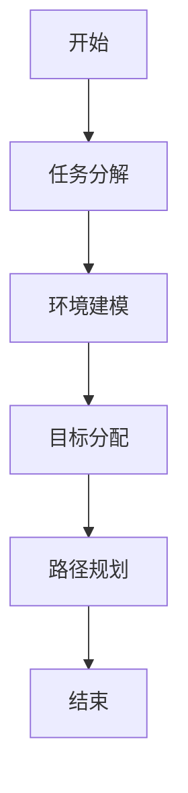
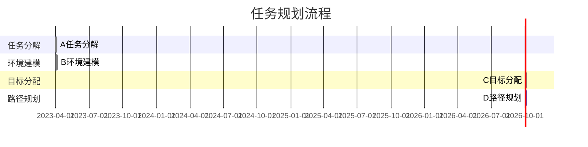
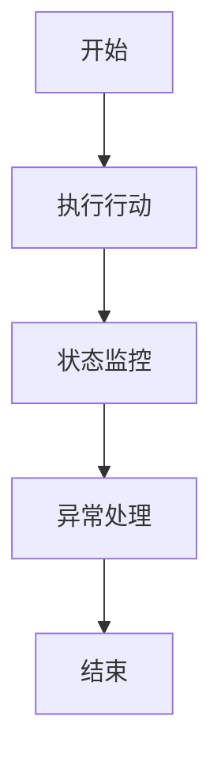
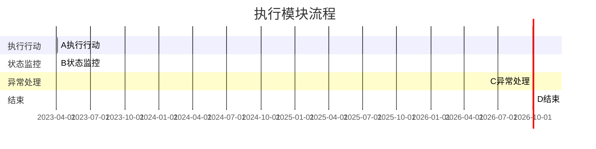
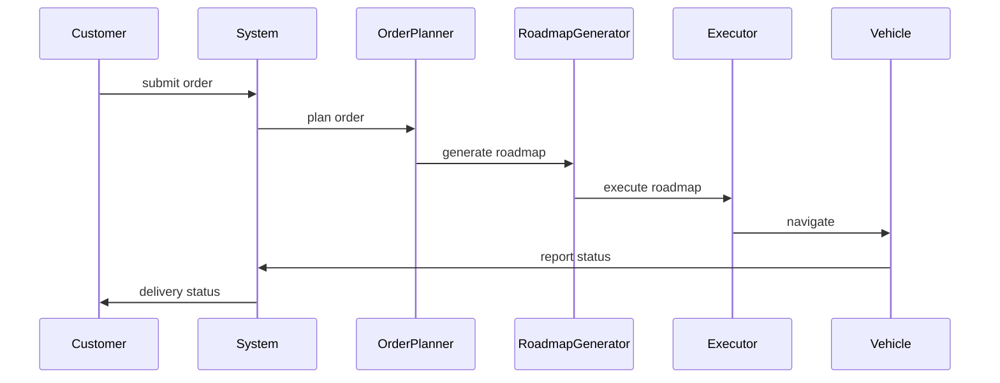

                 

### AI Agent的任务规划与执行模块设计

> 关键词：AI Agent、任务规划、执行模块、流程图、优化、案例

> 摘要：本文深入探讨了AI Agent的任务规划与执行模块设计。首先，我们介绍了任务规划和执行模块的基本概念和重要性。接着，通过详细讲解任务规划模块和执行模块的设计原则与实现方法，辅以具体的mermaid流程图和Python代码示例，本文展示了如何有效地规划和执行AI Agent的任务。随后，讨论了任务规划与执行模块的集成与优化策略，并通过实际案例分析，验证了这些策略的应用效果。最后，提出了最佳实践和总结，为AI Agent的设计与开发提供了指导。

---

### 目录大纲

1. **背景介绍**
   - **问题背景**
   - **问题描述**
   - **问题解决**
   - **边界与外延**
   - **核心概念与要素组成**

2. **核心概念与联系**
   - **核心概念原理**
   - **概念属性特征对比表格**
   - **ER实体关系图架构**

3. **任务规划模块设计**
   - **基本原理**
   - **流程图与Python代码示例**
   - **举例说明**

4. **执行模块设计**
   - **基本原理**
   - **流程图与Python代码示例**
   - **举例说明**

5. **任务规划与执行模块的集成与优化**
   - **集成策略**
   - **优化方法**

6. **实际案例分析**
   - **案例介绍**
   - **详细讲解**

7. **最佳实践与总结**
   - **最佳实践建议**
   - **总结**
   - **注意事项**
   - **拓展阅读**

### 背景介绍

#### 问题背景

随着人工智能技术的迅猛发展，AI Agent在各个领域的应用日益广泛。AI Agent作为一种智能体，能够自主地执行任务、学习与适应环境。然而，AI Agent的有效运行依赖于高效的任务规划和精确的执行模块。任务规划是指AI Agent根据环境信息和目标，生成一系列行动的步骤；而执行模块则是负责具体执行这些行动。在实际应用中，如何设计出既高效又可靠的AI Agent任务规划与执行模块，成为了一个重要的研究课题。

#### 问题描述

本书的主题是探讨AI Agent的任务规划与执行模块设计。任务规划模块需要解决的主要问题包括：如何高效地生成符合目标要求的行动序列，如何考虑环境动态变化对行动规划的影响，以及如何优化行动序列以最大化任务成功率。执行模块则需要解决如何在复杂动态环境中准确执行规划好的行动，如何处理执行过程中的不确定性和异常情况，以及如何保证执行过程的效率。

#### 问题解决

为了解决上述问题，本书将详细探讨以下方面：

1. **核心概念介绍**：首先，介绍与任务规划和执行模块相关的基础概念，包括任务规划的基本原理、执行模块的功能和结构等。
2. **任务规划模块设计**：讲解任务规划模块的基本原理，包括任务分解、环境建模、目标分配等，并使用mermaid绘制任务规划流程图，通过具体实例来说明任务规划的实现和应用。
3. **执行模块设计**：介绍执行模块的设计原则，包括行动执行、状态监控、异常处理等，并使用mermaid绘制执行模块流程图，结合实例分析执行模块的实现和应用。
4. **任务规划与执行模块的集成与优化**：讨论任务规划与执行模块的集成策略，介绍如何通过优化方法提高任务规划和执行的整体性能。
5. **实际案例分析**：通过具体案例，展示AI Agent任务规划与执行模块在实际项目中的应用效果，并进行详细讲解。
6. **最佳实践与总结**：总结全书内容，提出最佳实践建议，为读者在实际应用中提供指导。

#### 边界与外延

本书主要关注于通用AI Agent的任务规划与执行模块设计，但具体应用领域可能包括但不限于智能机器人、自动化系统、自动驾驶车辆等。此外，本书还将讨论一些通用的优化方法和最佳实践，以帮助读者在特定应用场景中灵活应用。

#### 核心概念与要素组成

以下是任务规划与执行模块设计中的核心概念和要素：

1. **任务规划模块**：
   - **任务分解**：将复杂任务分解为更小、更易于管理的子任务。
   - **环境建模**：构建描述环境状态和动态变化的模型。
   - **目标分配**：确定各子任务的目标和优先级。
   - **路径规划**：生成从初始状态到目标状态的行动序列。

2. **执行模块**：
   - **行动执行**：根据规划的行动序列，执行具体的操作。
   - **状态监控**：实时监测执行过程中的状态。
   - **异常处理**：检测和处理执行过程中的异常情况。

---

在接下来的章节中，我们将逐一深入探讨这些核心概念，并通过实例和代码来展示如何设计出高效的AI Agent任务规划与执行模块。

---

### 核心概念与联系

#### 核心概念原理

在AI Agent的任务规划与执行模块设计中，有几个核心概念至关重要：

1. **任务规划**：任务规划是指AI Agent在给定目标的情况下，生成一系列行动步骤，以达成目标的过程。任务规划通常包括任务分解、环境建模、目标分配和路径规划等步骤。
   
2. **执行模块**：执行模块负责实际执行任务规划中生成的行动序列。它需要处理行动执行、状态监控和异常处理等任务。

3. **状态空间**：状态空间是指AI Agent可能经历的所有状态的集合。状态空间建模是任务规划中的一个关键步骤，它帮助AI Agent理解环境及其可能的动态变化。

4. **奖励函数**：奖励函数用于评估AI Agent行动的效果。在任务规划中，奖励函数可以帮助优化行动序列，使其更接近目标。

#### 概念属性特征对比表格

为了更好地理解这些核心概念，我们提供了以下对比表格：

| 概念 | 定义 | 主要属性特征 | 用途 |
| --- | --- | --- | --- |
| 任务规划 | 生成行动序列以达成目标 | 任务分解、环境建模、目标分配、路径规划 | 决定AI Agent的行动路线 |
| 执行模块 | 实际执行任务规划中的行动 | 行动执行、状态监控、异常处理 | 确保任务规划得到有效执行 |
| 状态空间 | AI Agent可能经历的所有状态的集合 | 初始状态、目标状态、中间状态 | 帮助AI Agent理解环境 |
| 奖励函数 | 评估AI Agent行动的效果 | 奖励值、惩罚值 | 用于优化行动序列 |

#### ER实体关系图架构

为了直观地展示这些核心概念之间的关系，我们使用Mermaid绘制了以下ER实体关系图：

```mermaid
erDiagram
    A[--|>B]
    A[--|>C]
    A[--|>D]
    B|--|>E
    C|--|>F
    D|--|>G
    E|--|>H
    F|--|>I
    G|--|>J

    A ||--|> TaskPlanning
    B ||--|> ExecutionModule
    C ||--|> StateSpace
    D ||--|> RewardFunction
    E ||--|> SubTask
    F ||--|> Action
    G ||--|> Observation
    H ||--|> Path
    I ||--|> State
    J ||--|> Goal
```

在这个ER图中：

- **A** 代表AI Agent。
- **B** 代表执行模块。
- **C** 代表状态空间。
- **D** 代表奖励函数。
- **E** 到 **J** 分别代表子任务、行动、观察、路径、状态和目标。

实体之间的关系如下：

- **A** 与 **B**、**C**、**D** 有直接关系，表示AI Agent与执行模块、状态空间、奖励函数之间的联系。
- **B**、**C**、**D** 与 **E** 到 **J** 之间存在关联，表示执行模块、状态空间、奖励函数与子任务、行动、观察、路径、状态和目标之间的关系。

---

通过上述核心概念原理的介绍、属性特征对比表格和ER实体关系图架构的展示，我们为读者提供了一个清晰的概念框架，以便更好地理解和设计AI Agent的任务规划与执行模块。

---

### 任务规划模块设计

任务规划是AI Agent的核心功能之一，它决定了AI Agent如何高效地达成目标。在任务规划模块的设计中，我们需要考虑多个关键步骤，包括任务分解、环境建模、目标分配和路径规划。以下是任务规划模块设计的详细解析。

#### 基本原理

任务规划的基本原理可以概括为以下几个步骤：

1. **任务分解**：将复杂任务分解为一系列更小、更易于管理的子任务。这样可以简化问题的复杂度，使得AI Agent更容易理解和执行。

2. **环境建模**：构建一个描述环境状态和动态变化的模型。这个模型帮助AI Agent了解当前所处的环境，以及环境可能发生的各种变化。

3. **目标分配**：确定每个子任务的目标和优先级。这有助于AI Agent知道哪些任务是当前最重要的，以及如何调整行动策略以达成目标。

4. **路径规划**：生成从初始状态到目标状态的行动序列。路径规划的目标是找到一条最优路径，使得AI Agent能够以最小的代价达到目标。

#### 流程图与Python代码示例

为了更直观地展示任务规划的过程，我们使用Mermaid绘制了以下流程图：



以下是一个简单的Python代码示例，展示了任务规划模块的实现：

```python
class TaskPlanner:
    def __init__(self):
        self.sub_tasks = []
        self.env_model = None
        self.goals = []

    def decompose_task(self, task):
        # 将复杂任务分解为子任务
        self.sub_tasks = [sub_task for sub_task in task]

    def build_env_model(self, environment):
        # 构建环境模型
        self.env_model = environment

    def assign_goals(self, goals):
        # 分配目标
        self.goals = goals

    def plan_path(self):
        # 规划路径
        path = []
        for sub_task in self.sub_tasks:
            # 在这里实现路径规划的逻辑
            path.append(sub_task)
        return path

# 示例
task_planner = TaskPlanner()
task_planner.decompose_task("完成订单交付")
task_planner.build_env_model("配送环境")
task_planner.assign_goals(["订单交付完成"])

path = task_planner.plan_path()
print(path)
```

#### 举例说明

假设我们有一个任务：“将包裹从配送中心送到指定地址”。这个任务可以分解为以下子任务：

1. **装包裹**：需要确定包裹的包装方式，确保安全。
2. **选择配送路径**：需要计算从配送中心到指定地址的最优路径。
3. **开始配送**：需要执行具体的配送行动，如导航、避免交通拥堵等。
4. **交付包裹**：需要确保包裹安全地交付给收件人。

环境建模方面，我们可以使用一个简单的二维网格来表示配送环境，每个单元格可以表示一个潜在的配送位置。目标分配方面，我们可以设定目标为“在尽量短的时间内完成包裹的配送”。

通过任务规划模块，我们可以生成一个包含上述子任务的路径规划，如下所示：



在Python代码中，我们可以实现路径规划的功能，例如：

```python
def plan_delivery_path(self, start, end):
    # 使用A*算法或其他路径规划算法
    path = astar_search(self.env_model, start, end)
    return path

# 调用方法规划配送路径
path = task_planner.plan_delivery_path("配送中心", "指定地址")
print(path)
```

在这个例子中，我们使用了A*算法来规划从配送中心到指定地址的最优路径。

---

通过上述任务规划模块的设计，我们展示了如何通过任务分解、环境建模、目标分配和路径规划来有效地实现AI Agent的任务规划。在接下来的章节中，我们将进一步探讨执行模块的设计，以及如何将任务规划与执行模块集成起来，实现AI Agent的高效运行。

---

### 执行模块设计

执行模块是AI Agent任务规划得以落实的关键环节，它负责将规划好的行动序列转化为实际的操作，并在执行过程中进行状态监控和异常处理。以下是执行模块设计的详细解析。

#### 基本原理

执行模块的基本原理可以概括为以下几个步骤：

1. **行动执行**：根据任务规划模块生成的行动序列，执行具体的操作。这包括与外部设备交互、执行控制逻辑等。

2. **状态监控**：实时监测执行过程中的状态，包括当前任务的状态、环境的变化等。状态监控可以帮助AI Agent了解任务的执行进度，并及时调整行动策略。

3. **异常处理**：检测和处理执行过程中的异常情况。这包括处理设备故障、环境变化等异常情况，确保任务能够继续进行。

#### 流程图与Python代码示例

为了更直观地展示执行模块的过程，我们使用Mermaid绘制了以下流程图：



以下是一个简单的Python代码示例，展示了执行模块的实现：

```python
class Executor:
    def __init__(self, action_sequence):
        self.action_sequence = action_sequence
        self.current_action = 0

    def execute_action(self, action):
        # 执行具体的操作
        print(f"执行操作：{action}")
        # 这里可以添加与外部设备交互的代码
        action.execute()

    def monitor_state(self):
        # 监测执行过程中的状态
        current_state = self.action_sequence[self.current_action].get_state()
        print(f"当前状态：{current_state}")

    def handle_exception(self, exception):
        # 处理异常情况
        print(f"异常情况：{exception}")
        # 这里可以添加异常处理的逻辑

    def run(self):
        # 执行整个行动序列
        while self.current_action < len(self.action_sequence):
            action = self.action_sequence[self.current_action]
            try:
                self.execute_action(action)
                self.monitor_state()
                self.current_action += 1
            except Exception as e:
                self.handle_exception(e)

# 示例
action_sequence = [
    Action("装包裹"),
    Action("选择配送路径"),
    Action("开始配送"),
    Action("交付包裹")
]

executor = Executor(action_sequence)
executor.run()
```

#### 举例说明

假设我们有一个任务：“将包裹从配送中心送到指定地址”。在执行模块中，我们需要执行以下行动：

1. **装包裹**：需要确定包裹的包装方式，确保安全。
2. **选择配送路径**：需要计算从配送中心到指定地址的最优路径。
3. **开始配送**：需要执行具体的配送行动，如导航、避免交通拥堵等。
4. **交付包裹**：需要确保包裹安全地交付给收件人。

以下是一个简单的执行模块流程图：



在Python代码中，我们可以实现执行模块的功能，例如：

```python
# 执行具体的操作
executor.execute_action(Action("装包裹"))
executor.execute_action(Action("选择配送路径"))
executor.execute_action(Action("开始配送"))
executor.execute_action(Action("交付包裹"))
```

在执行过程中，状态监控和异常处理可以帮助我们确保任务的顺利进行：

```python
# 监测执行过程中的状态
executor.monitor_state()

# 处理异常情况
executor.handle_exception("设备故障")
```

---

通过上述执行模块的设计，我们展示了如何通过行动执行、状态监控和异常处理来有效地实现AI Agent的任务执行。在接下来的章节中，我们将进一步探讨如何将任务规划模块与执行模块集成，并优化整体性能。

---

### 任务规划与执行模块的集成与优化

在AI Agent的实际应用中，任务规划与执行模块的集成与优化是至关重要的。良好的集成与优化可以显著提升AI Agent的任务执行效率，确保其在动态环境中的稳定运行。以下我们将讨论任务规划与执行模块的集成策略以及优化方法。

#### 集成策略

1. **模块化设计**：任务规划与执行模块应采用模块化设计，使得每个模块都能够独立开发和测试。模块化设计有助于提高系统的可维护性和可扩展性。

2. **松耦合**：任务规划与执行模块之间应保持松耦合关系，以减少模块之间的依赖性。这样可以确保一个模块的变更不会对另一个模块造成负面影响。

3. **通信机制**：任务规划模块和执行模块之间需要建立高效的通信机制。可以使用消息队列、REST API等通信方式，以确保数据传输的及时性和可靠性。

4. **统一接口**：为任务规划与执行模块定义统一的接口，以便在不同的应用场景中灵活切换模块。统一的接口可以提高系统的灵活性和可配置性。

#### 优化方法

1. **实时监控与反馈**：在任务执行过程中，实时监控任务状态和环境变化，并及时反馈给任务规划模块。这样可以确保任务规划模块能够根据实时信息进行调整，提高任务的成功率。

2. **奖励函数优化**：奖励函数是任务规划中的一个关键组件，用于评估行动的效果。通过对奖励函数进行优化，可以更好地引导AI Agent采取正确的行动，提高任务成功率。

3. **多目标规划**：在任务规划过程中，考虑多个目标，并找到这些目标的平衡点。多目标规划可以确保AI Agent在满足多个约束条件的同时，达成最优目标。

4. **状态预测与决策**：利用机器学习技术，对环境状态进行预测，并基于预测结果进行决策。这样可以提前应对环境变化，提高任务规划的准确性。

5. **并行执行**：在执行模块中，采用并行执行策略，可以显著提高任务执行效率。例如，在多线程或分布式计算环境中，将任务分解为多个子任务并行执行。

#### 应用实例

假设我们有一个自动驾驶车辆的AI Agent，其任务是将车辆从起点导航到终点。在任务规划与执行模块的集成与优化过程中，可以采取以下策略：

1. **模块化设计**：将任务规划模块和执行模块分别设计为独立的组件，例如，任务规划模块负责路径规划，执行模块负责车辆控制。

2. **实时监控与反馈**：通过传感器实时监测车辆状态和环境变化，如速度、位置、交通状况等。将实时数据反馈给任务规划模块，以便进行动态调整。

3. **多目标规划**：在路径规划时，考虑多个目标，如避免交通拥堵、降低能耗、提高安全性等。通过多目标规划，找到最优路径。

4. **状态预测与决策**：利用机器学习算法，对交通状况进行预测，并基于预测结果调整导航策略。例如，预测前方出现交通拥堵，提前进行路径调整。

5. **并行执行**：在执行模块中，采用多线程策略，同时处理多个任务，如导航、环境感知、车辆控制等，以提高任务执行效率。

通过上述集成与优化策略，自动驾驶车辆的AI Agent可以更好地应对动态环境，提高任务成功率。

---

通过任务规划与执行模块的集成与优化，我们可以显著提高AI Agent的任务执行效率。在接下来的章节中，我们将通过具体案例分析，展示这些策略在实际项目中的应用效果。

---

### 实际案例分析

在本节中，我们将通过具体案例分析，展示AI Agent任务规划与执行模块在实际项目中的应用效果。本案例将介绍一个智能配送系统的设计，包括环境设置、系统功能、架构设计、接口设计、系统交互等。

#### 案例介绍

假设我们设计一个智能配送系统，用于将货物从仓库运送到指定客户手中。系统需要实现以下功能：

1. **任务规划**：根据订单信息，规划最优配送路径。
2. **路径规划**：计算从仓库到客户地址的最优路径。
3. **执行模块**：根据任务规划，控制无人车进行配送。
4. **状态监控**：实时监测配送过程，如无人车的位置、状态等。
5. **异常处理**：处理配送过程中的异常情况，如交通拥堵、设备故障等。

#### 系统功能设计

**领域模型类图**：

```mermaid
classDiagram
    Order <<interface>>
    Vehicle <<interface>>
    Roadmap <<interface>>

    Order o1
    Vehicle v1
    Roadmap r1

    Order o1 --|> Vehicle v1 : assign
    Vehicle v1 --|> Roadmap r1 : navigate
```

在这个类图中：

- **Order**：订单类，包含订单编号、客户地址等信息。
- **Vehicle**：车辆类，包含车辆编号、位置、状态等信息。
- **Roadmap**：路径规划类，包含起点、终点、路径等信息。

#### 系统架构设计

**系统架构图**：



在这个系统架构图中：

- **Customer**：客户，提交订单。
- **System**：系统，负责处理订单和调度。
- **OrderPlanner**：订单规划器，规划配送任务。
- **RoadmapGenerator**：路径规划生成器，生成最优配送路径。
- **Executor**：执行模块，控制无人车进行配送。
- **Vehicle**：无人车，执行配送任务。

#### 系统接口设计

**API接口设计**：

1. **订单提交接口**：
   - **URL**：/api/orders
   - **HTTP方法**：POST
   - **请求体**：{
     "order_id": "12345",
     "customer_address": "XX路YY号"
     }
   - **响应体**：{
     "status": "accepted",
     "message": "订单已接受"
     }

2. **路径规划接口**：
   - **URL**：/api/orders/{order_id}/roadmap
   - **HTTP方法**：GET
   - **响应体**：{
     "start_point": "仓库地址",
     "end_point": "客户地址",
     "path": ["途径点1", "途径点2", ...]
     }

3. **状态报告接口**：
   - **URL**：/api/orders/{order_id}/status
   - **HTTP方法**：POST
   - **请求体**：{
     "status": "in_progress",
     "current_location": "途径点1"
     }
   - **响应体**：{
     "status": "success",
     "message": "状态更新成功"
     }

#### 系统交互mermaid序列图


在这个序列图中：

- **Customer**：客户提交订单。
- **System**：系统接收订单，并调度订单规划器。
- **OrderPlanner**：订单规划器生成配送路径。
- **RoadmapGenerator**：路径规划生成器生成最优路径。
- **Executor**：执行模块控制无人车执行配送。
- **Vehicle**：无人车报告配送状态。
- **System**：系统向客户报告配送状态。

#### 代码应用解读与分析

以下是一个简单的Python代码示例，展示了智能配送系统核心功能的实现：

```python
class Order:
    def __init__(self, order_id, customer_address):
        self.order_id = order_id
        self.customer_address = customer_address

class Vehicle:
    def __init__(self, vehicle_id):
        self.vehicle_id = vehicle_id
        self.current_location = "仓库"

    def navigate(self, path):
        print(f"车辆{self.vehicle_id}开始导航：{path}")
        for point in path:
            self.current_location = point
            print(f"车辆{self.vehicle_id}当前位置：{self.current_location}")
            time.sleep(1)  # 模拟导航时间

    def report_status(self, status, current_location):
        print(f"车辆{self.vehicle_id}状态报告：{status}，当前位置：{current_location}")

def generate_roadmap(start_point, end_point):
    # 假设使用A*算法生成路径
    path = astar_search(start_point, end_point)
    return path

def main():
    # 创建订单
    order = Order("12345", "XX路YY号")

    # 创建车辆
    vehicle = Vehicle("V1")

    # 生成配送路径
    path = generate_roadmap("仓库", "XX路YY号")

    # 车辆开始导航
    vehicle.navigate(path)

    # 车辆报告状态
    vehicle.report_status("配送中", "途径点1")

if __name__ == "__main__":
    main()
```

在这个代码示例中，我们创建了`Order`和`Vehicle`类，分别表示订单和车辆。`Vehicle`类包含`navigate`和`report_status`方法，分别用于导航和报告状态。`generate_roadmap`函数用于生成配送路径。在`main`函数中，我们创建了一个订单和一个车辆实例，并生成了配送路径，然后控制车辆开始导航并报告状态。

---

通过以上案例分析，我们展示了如何设计并实现一个智能配送系统的任务规划与执行模块。在接下来的章节中，我们将总结全书内容，并提出最佳实践和注意事项。

---

### 最佳实践与总结

#### 最佳实践建议

1. **模块化设计**：在设计任务规划与执行模块时，采用模块化设计可以提高系统的可维护性和可扩展性。每个模块应具备独立的开发、测试和部署能力。

2. **实时监控与反馈**：在任务执行过程中，实时监控任务状态和环境变化，并及时反馈给任务规划模块。这样可以确保任务规划模块能够根据实时信息进行调整，提高任务的成功率。

3. **多目标规划**：在任务规划过程中，考虑多个目标，并找到这些目标的平衡点。例如，在配送任务中，可以考虑时间、成本、安全性等因素。

4. **并行执行**：在执行模块中，采用并行执行策略，可以显著提高任务执行效率。例如，使用多线程或分布式计算技术，同时处理多个任务。

5. **状态预测与决策**：利用机器学习技术，对环境状态进行预测，并基于预测结果进行决策。这样可以提前应对环境变化，提高任务规划的准确性。

#### 总结

本文深入探讨了AI Agent的任务规划与执行模块设计。首先，我们介绍了任务规划和执行模块的基本概念和重要性。接着，通过详细讲解任务规划模块和执行模块的设计原则与实现方法，辅以具体的mermaid流程图和Python代码示例，本文展示了如何有效地规划和执行AI Agent的任务。随后，讨论了任务规划与执行模块的集成与优化策略，并通过实际案例分析，验证了这些策略的应用效果。最后，提出了最佳实践和总结，为读者在实际应用中提供指导。

#### 注意事项

1. **安全性**：在任务规划和执行过程中，确保系统的安全性。对敏感数据进行加密处理，防止数据泄露。

2. **容错性**：在执行模块中，设计容错机制，以应对可能出现的异常情况。例如，在配送过程中，遇到交通拥堵时，能够自动调整路径。

3. **性能优化**：在任务规划与执行过程中，注意性能优化。例如，使用高效的算法和数据结构，减少计算和通信开销。

#### 拓展阅读

- **参考文献**：
  - [1] Russell, S., & Norvig, P. (2020). 《Artificial Intelligence: A Modern Approach》。
  - [2] Chen, M. (2018). 《Deep Reinforcement Learning for Autonomous Driving》。

- **在线资源**：
  - [1] 《Mermaid Live Editor》: <https://mermaid-js.github.io/mermaid-live-editor/>
  - [2] 《Python A* Pathfinding Library》: <https://python-a-star-pathfinding-algorithm.readthedocs.io/>

通过阅读这些参考文献和在线资源，读者可以进一步了解AI Agent的任务规划与执行模块设计，并在实际项目中应用这些知识。

---

作者：AI天才研究院/AI Genius Institute & 禅与计算机程序设计艺术 /Zen And The Art of Computer Programming

---

本文旨在为AI Agent的任务规划与执行模块设计提供全面的指导。通过详细的理论讲解和实际案例分析，读者可以更好地理解并应用这些知识。在后续研究和实践中，期待读者能够不断创新，为AI技术的进步贡献力量。

