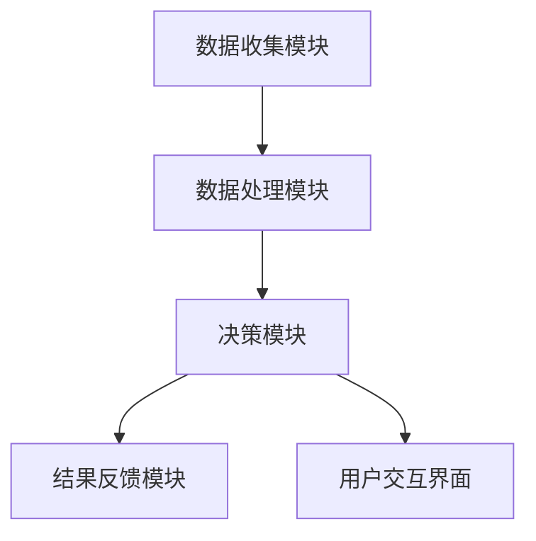
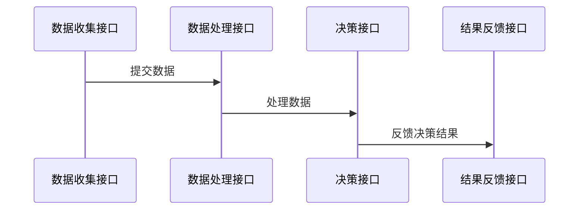
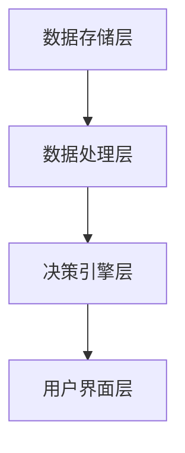

                 

# AI Agent的伦理决策框架：在智能中植入道德考量

关键词：AI代理，伦理决策，道德考量，人工智能，算法，系统架构

摘要：本文深入探讨了AI代理伦理决策框架的构建，如何在智能系统中嵌入道德考量。首先，我们介绍了AI代理及其伦理决策的背景和重要性，随后详述了伦理基础、核心概念、算法原理、数学模型、系统设计以及实际项目。通过本文，读者可以全面了解如何在一个高度智能化的系统中实现伦理决策，并掌握相关技术和方法。

## Chapter 1: 引言

### 1.1 AI代理的概念

AI代理（Artificial Intelligence Agent）是自主执行任务以实现特定目标的人工智能实体。这些代理可以存在于各种环境中，包括但不限于网络、机器人、自动驾驶车辆等。AI代理的设计目标是最大化效用、提高效率或实现特定的目标，但这一目标往往与社会伦理和道德规范存在冲突。

### 1.2 伦理决策的必要性

随着AI技术的发展，伦理决策变得日益重要。智能系统在执行任务时，需要考虑其行为是否符合社会伦理和道德规范。例如，自动驾驶车辆在面临潜在危险时如何做出决策，机器人护理员如何对待老年患者等。缺乏伦理考量的AI系统可能导致不可预料的负面影响，甚至危及人类安全。

### 1.3 本书的目标与结构

本书旨在构建一个AI代理伦理决策框架，探讨如何将道德考量嵌入智能系统。全书分为七个章节，依次涵盖伦理基础、核心概念、算法原理、数学模型、系统设计、项目实战和最佳实践。

## Chapter 2: 伦理基础

### 2.1 伦理原则和框架

伦理原则和框架是指导AI代理决策的基础。常见的伦理原则包括功利主义、康德伦理学、义务论等。每种原则都有其独特的优势和局限性，适用于不同的情境。

### 2.2 伦理理论与AI

伦理理论为AI代理提供了决策的哲学基础。功利主义关注最大幸福原则，康德伦理学强调道德义务，义务论则主张基于道德规则行动。这些理论在AI代理伦理决策中有着重要的应用。

### 2.3 不同伦理方法比较

本文将对不同伦理方法进行比较，包括其适用范围、优势和局限性。通过比较，读者可以更好地理解各种伦理方法在AI代理决策中的应用。

## Chapter 3: 核心概念

### 3.1 道德推理

道德推理是伦理决策的核心。本文将介绍道德推理的基本原理，包括基于规则、基于案例和基于推理的道德推理方法。

### 3.2 价值与规范

价值是指人们追求的目标，规范是指人们行为的约束。本文将讨论价值与规范的关系，以及如何将价值纳入AI代理的决策过程。

### 3.3 伦理决策框架

本文将介绍几种常见的伦理决策框架，包括德雷福斯模型、卡尼曼-特沃斯基模型和道德直觉模型。通过比较这些框架，读者可以了解不同决策框架的特点和应用场景。

## Chapter 4: 算法原理

### 4.1 伦理决策算法

本文将介绍几种用于伦理决策的算法，包括效用函数优化、多目标规划和模糊逻辑等。通过Mermaid流程图，我们可视化这些算法的执行过程。

### 4.2 算法应用示例

本文将通过Python代码示例，展示如何实现这些算法，并解释其原理。此外，本文还将介绍算法背后的数学模型和公式。

### 4.3 算法评估与优化

本文将讨论如何评估和优化伦理决策算法。通过比较不同算法的性能，我们可以找到最适合特定场景的算法。

## Chapter 5: 系统设计

### 5.1 系统架构设计

本文将介绍一个伦理决策系统的整体架构，包括数据收集、决策算法、结果反馈等模块。通过Mermaid架构图，我们展示系统的层次结构。

### 5.2 领域模型

本文将使用Mermaid类图展示系统的领域模型，包括核心实体、属性和关系。通过领域模型，我们可以更好地理解系统的功能和设计。

### 5.3 接口设计与交互

本文将讨论系统接口设计和交互。通过Mermaid序列图，我们展示系统各组件之间的交互流程。

## Chapter 6: 项目实战

### 6.1 环境安装

本文将指导读者如何安装和配置一个伦理决策系统。通过详细的步骤和代码，读者可以快速上手。

### 6.2 系统核心实现

本文将介绍系统的核心实现，包括数据收集、处理和决策。通过Python代码，我们展示如何实现这些功能。

### 6.3 案例分析与解析

本文将通过实际案例，展示如何使用伦理决策系统。通过对案例的分析和解析，读者可以深入理解系统的应用。

### 6.4 项目小结

本文将对项目进行小结，总结经验和教训。通过项目实践，读者可以更好地掌握伦理决策系统的设计和实现。

## Chapter 7: 最佳实践

### 7.1 设计原则与策略

本文将总结最佳设计原则和策略，帮助读者在设计和实现伦理决策系统时避免常见问题。

### 7.2 小结与注意事项

本文将对全文进行小结，强调伦理决策的重要性。同时，本文还将提醒读者在实现伦理决策系统时需要注意的事项。

### 7.3 拓展阅读

本文将推荐一些拓展阅读资源，帮助读者进一步了解伦理决策和AI代理的相关研究。

作者：AI天才研究院/AI Genius Institute & 禅与计算机程序设计艺术 /Zen And The Art of Computer Programming

## Chapter 1: 引言

### 1.1 AI代理的概念

AI代理（Artificial Intelligence Agent）是自主执行任务以实现特定目标的人工智能实体。这些代理可以存在于各种环境中，包括但不限于网络、机器人、自动驾驶车辆等。AI代理的设计目标是最大化效用、提高效率或实现特定的目标，但这一目标往往与社会伦理和道德规范存在冲突。

#### 背景介绍

随着人工智能技术的迅猛发展，AI代理的应用越来越广泛。然而，随着AI代理的智能化程度不断提高，它们在执行任务时可能会面临一系列道德和伦理问题。例如，自动驾驶汽车在面临潜在危险时如何做出决策，机器人护理员如何对待老年患者，以及智能系统在处理敏感数据时如何确保隐私保护等。这些问题引发了广泛关注，人们开始意识到在AI代理中嵌入道德考量的重要性。

#### 问题背景

AI代理的道德考量主要涉及以下几个方面：

1. **自主性**：AI代理是否应该拥有自主决策的能力，以及如何平衡自主性与人类干预之间的关系。
2. **公平性**：AI代理的决策是否公平，如何避免算法偏见和歧视。
3. **责任**：AI代理的决策导致不良后果时，如何确定责任归属。
4. **隐私**：AI代理在处理个人数据时，如何确保隐私保护。

#### 问题描述

为了在AI代理中实现道德考量，我们需要构建一个伦理决策框架，确保AI代理的决策过程符合社会伦理和道德规范。具体来说，我们需要解决以下几个关键问题：

1. **伦理原则的确定**：选择适合AI代理的伦理原则，为决策提供基础。
2. **决策算法的设计**：设计能够考虑道德因素的决策算法，实现伦理决策。
3. **系统架构的构建**：设计一个合理的系统架构，确保伦理决策在AI代理中得以实现。
4. **道德考量的嵌入**：将道德考量嵌入AI代理的决策过程，实现道德指导。

#### 问题解决

解决AI代理伦理决策问题需要多学科合作，包括伦理学、计算机科学、心理学和社会学等。以下是一些可能的解决方案：

1. **伦理原则的确定**：采用功利主义、康德伦理学、义务论等伦理原则，为AI代理的决策提供指导。
2. **决策算法的设计**：设计基于规则、基于案例和基于推理的决策算法，结合不同伦理原则，实现伦理决策。
3. **系统架构的构建**：构建一个模块化的系统架构，包括数据收集、处理、决策和反馈等模块，确保伦理决策在整个系统中得到实施。
4. **道德考量的嵌入**：通过算法、数据和处理流程，将道德考量嵌入AI代理的决策过程，实现道德指导。

#### 边界与外延

AI代理伦理决策框架的构建需要考虑以下边界与外延：

1. **技术限制**：现有技术条件下，如何实现高效的伦理决策。
2. **法律与政策**：遵循相关法律法规和政策，确保伦理决策的合法性和合规性。
3. **社会接受度**：了解社会对伦理决策的接受程度，平衡技术进步与社会期望。

#### 概念结构与核心要素组成

AI代理伦理决策框架的核心概念结构包括以下几个方面：

1. **伦理原则**：指导AI代理决策的基础原则。
2. **决策算法**：实现伦理决策的具体算法。
3. **系统架构**：确保伦理决策在AI代理中得以实现的系统架构。
4. **道德考量**：嵌入AI代理决策过程的道德考量。

### 1.2 伦理决策的必要性

随着AI技术的发展，伦理决策变得日益重要。智能系统在执行任务时，需要考虑其行为是否符合社会伦理和道德规范。例如，自动驾驶车辆在面临潜在危险时如何做出决策，机器人护理员如何对待老年患者等。缺乏伦理考量的AI系统可能导致不可预料的负面影响，甚至危及人类安全。

#### 背景介绍

AI技术的发展带来了许多便利，但也引发了一系列伦理问题。例如，自动驾驶车辆在遇到紧急情况时，如何权衡不同乘客的生命安全，机器人护理员在护理老年患者时，如何平衡患者的舒适与安全等。这些问题不仅涉及到技术层面，更涉及到道德和伦理层面。因此，在AI代理中嵌入伦理决策，确保其行为符合社会伦理和道德规范，显得尤为重要。

#### 问题背景

伦理决策的必要性主要体现在以下几个方面：

1. **社会责任**：作为人工智能的开发者和使用者，我们有责任确保AI系统的行为符合社会伦理和道德规范。
2. **技术风险**：缺乏伦理考量的AI系统可能导致不良后果，甚至危害人类安全。
3. **公众信任**：AI系统的行为是否符合社会伦理和道德规范，直接影响公众对AI技术的信任。

#### 问题描述

为了实现伦理决策，我们需要解决以下几个关键问题：

1. **伦理原则的确定**：选择适合AI代理的伦理原则，为决策提供基础。
2. **决策算法的设计**：设计能够考虑道德因素的决策算法，实现伦理决策。
3. **系统架构的构建**：设计一个合理的系统架构，确保伦理决策在AI代理中得以实现。
4. **道德考量的嵌入**：将道德考量嵌入AI代理的决策过程，实现道德指导。

#### 问题解决

解决AI代理伦理决策问题需要多学科合作，包括伦理学、计算机科学、心理学和社会学等。以下是一些可能的解决方案：

1. **伦理原则的确定**：采用功利主义、康德伦理学、义务论等伦理原则，为AI代理的决策提供指导。
2. **决策算法的设计**：设计基于规则、基于案例和基于推理的决策算法，结合不同伦理原则，实现伦理决策。
3. **系统架构的构建**：构建一个模块化的系统架构，包括数据收集、处理、决策和反馈等模块，确保伦理决策在整个系统中得到实施。
4. **道德考量的嵌入**：通过算法、数据和处理流程，将道德考量嵌入AI代理的决策过程，实现道德指导。

#### 边界与外延

AI代理伦理决策框架的构建需要考虑以下边界与外延：

1. **技术限制**：现有技术条件下，如何实现高效的伦理决策。
2. **法律与政策**：遵循相关法律法规和政策，确保伦理决策的合法性和合规性。
3. **社会接受度**：了解社会对伦理决策的接受程度，平衡技术进步与社会期望。

#### 概念结构与核心要素组成

AI代理伦理决策框架的核心概念结构包括以下几个方面：

1. **伦理原则**：指导AI代理决策的基础原则。
2. **决策算法**：实现伦理决策的具体算法。
3. **系统架构**：确保伦理决策在AI代理中得以实现的系统架构。
4. **道德考量**：嵌入AI代理决策过程的道德考量。

### 1.3 本书的目标与结构

本书旨在构建一个AI代理伦理决策框架，探讨如何将道德考量嵌入智能系统。全书分为七个章节，依次涵盖伦理基础、核心概念、算法原理、数学模型、系统设计、项目实战和最佳实践。

#### 背景介绍

本书的目标是提供一个全面、系统的AI代理伦理决策框架，帮助读者深入理解如何在AI代理中实现道德考量。随着AI技术的发展，伦理决策的重要性日益凸显。然而，目前关于AI代理伦理决策的研究还比较零散，缺乏一个系统的理论框架。本书旨在填补这一空白，为AI代理伦理决策提供理论指导和实践参考。

#### 问题背景

AI代理伦理决策涉及到多个学科领域，包括伦理学、计算机科学、心理学和社会学等。本书旨在通过跨学科的研究，构建一个综合性的AI代理伦理决策框架，探讨如何将道德考量嵌入智能系统。这不仅有助于解决AI代理面临的伦理问题，也为人工智能技术的发展提供了新的方向。

#### 问题描述

为了实现本书的目标，我们需要解决以下几个关键问题：

1. **伦理原则的确定**：选择适合AI代理的伦理原则，为决策提供基础。
2. **决策算法的设计**：设计能够考虑道德因素的决策算法，实现伦理决策。
3. **系统架构的构建**：设计一个合理的系统架构，确保伦理决策在AI代理中得以实现。
4. **道德考量的嵌入**：将道德考量嵌入AI代理的决策过程，实现道德指导。

#### 问题解决

解决AI代理伦理决策问题需要多学科合作，包括伦理学、计算机科学、心理学和社会学等。本书将通过以下章节，系统性地探讨这些问题：

1. **Chapter 2: 伦理基础**：介绍伦理原则和框架，讨论伦理理论在AI代理决策中的应用。
2. **Chapter 3: 核心概念**：介绍道德推理、价值与规范等核心概念，构建伦理决策的理论基础。
3. **Chapter 4: 算法原理**：介绍伦理决策算法，包括算法原理、数学模型和应用示例。
4. **Chapter 5: 系统设计**：讨论伦理决策系统的架构设计、领域模型和接口设计。
5. **Chapter 6: 项目实战**：通过实际项目，展示如何实现伦理决策系统，并进行案例分析。
6. **Chapter 7: 最佳实践**：总结最佳实践和注意事项，为读者提供实践经验。

#### 边界与外延

在构建AI代理伦理决策框架时，我们需要考虑以下边界与外延：

1. **技术限制**：现有技术条件下，如何实现高效的伦理决策。
2. **法律与政策**：遵循相关法律法规和政策，确保伦理决策的合法性和合规性。
3. **社会接受度**：了解社会对伦理决策的接受程度，平衡技术进步与社会期望。

#### 概念结构与核心要素组成

AI代理伦理决策框架的核心概念结构包括以下几个方面：

1. **伦理原则**：指导AI代理决策的基础原则。
2. **决策算法**：实现伦理决策的具体算法。
3. **系统架构**：确保伦理决策在AI代理中得以实现的系统架构。
4. **道德考量**：嵌入AI代理决策过程的道德考量。

### 1.4 小结

本文介绍了AI代理伦理决策框架的背景、必要性、目标与结构。通过构建一个系统的伦理决策框架，我们可以在AI代理中实现道德考量，确保其行为符合社会伦理和道德规范。本书将从伦理基础、核心概念、算法原理、数学模型、系统设计、项目实战和最佳实践等方面，全面探讨AI代理伦理决策的构建和实践。希望读者能够通过本书，深入理解AI代理伦理决策的重要性，并掌握相关技术和方法。

## Chapter 2: 伦理基础

### 2.1 伦理原则和框架

伦理原则是指导AI代理决策的基础，它们为我们提供了关于如何行动的道德指导。在构建AI代理伦理决策框架时，我们需要选择合适的伦理原则，并将它们融入到算法和系统设计中。常见的伦理原则包括功利主义、康德伦理学和义务论等。

#### 功利主义

功利主义是一种以最大幸福原则为核心的伦理理论。它主张，我们应该选择那些能够带来最大总体幸福的行动。在AI代理的伦理决策中，功利主义可以通过计算和比较不同决策的效用值来实现。例如，自动驾驶汽车在面临碰撞选择时，可以计算出每个选项带来的效用值，并选择效用值最大的方案。

#### 康德伦理学

康德伦理学基于道德义务和理性原则。它强调，我们应该基于道德法则行动，而不是仅仅追求功利。在AI代理的伦理决策中，康德伦理学可以通过制定明确的道德规则来实现。例如，机器人护理员可以遵循“尊重患者自主权”这一道德规则，始终尊重患者的选择和意愿。

#### 义务论

义务论认为，我们应该基于道德义务行动，而不是仅仅追求结果。它强调道德行为本身的价值，而不是行为的结果。在AI代理的伦理决策中，义务论可以通过设计一系列道德义务来实现。例如，AI代理在处理个人数据时，可以遵循“保护个人隐私”这一道德义务，确保数据的安全和保密。

#### 比较与适用

每种伦理原则都有其独特的优势和局限性。功利主义强调结果，适用于需要最大化效用的情境；康德伦理学强调义务，适用于需要遵循道德规则的情境；义务论强调义务，适用于需要强调道德行为本身价值的情境。在实际应用中，我们可以根据具体场景选择合适的伦理原则，或者结合多种原则来实现更全面的伦理决策。

### 2.2 伦理理论与AI

伦理理论为AI代理的伦理决策提供了哲学基础。常见的伦理理论包括功利主义、康德伦理学和义务论等。这些理论在AI代理的伦理决策中有着重要的应用。

#### 功利主义

功利主义认为，我们应该选择那些能够带来最大总体幸福的行动。在AI代理的伦理决策中，功利主义可以通过计算和比较不同决策的效用值来实现。例如，自动驾驶汽车在面临碰撞选择时，可以计算出每个选项带来的效用值，并选择效用值最大的方案。

#### 康德伦理学

康德伦理学基于道德义务和理性原则。它强调，我们应该基于道德法则行动，而不是仅仅追求功利。在AI代理的伦理决策中，康德伦理学可以通过制定明确的道德规则来实现。例如，机器人护理员可以遵循“尊重患者自主权”这一道德规则，始终尊重患者的选择和意愿。

#### 义务论

义务论认为，我们应该基于道德义务行动，而不是仅仅追求结果。它强调道德行为本身的价值，而不是行为的结果。在AI代理的伦理决策中，义务论可以通过设计一系列道德义务来实现。例如，AI代理在处理个人数据时，可以遵循“保护个人隐私”这一道德义务，确保数据的安全和保密。

#### 应用

在AI代理的伦理决策中，不同的伦理理论可以应用于不同的情境。功利主义适用于需要最大化效用的情境，如自动驾驶汽车的决策；康德伦理学适用于需要遵循道德规则的情境，如机器人护理员的决策；义务论适用于需要强调道德行为本身价值的情境，如数据处理的决策。通过结合不同伦理理论，我们可以构建一个全面的AI代理伦理决策框架。

### 2.3 不同伦理方法比较

在构建AI代理伦理决策框架时，我们需要对不同伦理方法进行比较，以选择最适合的伦理原则和框架。以下是比较不同伦理方法的几个关键方面：

#### 功利主义 vs 康德伦理学

功利主义强调结果，追求最大化总体幸福。康德伦理学强调义务，遵循道德法则。在自动驾驶汽车的场景中，功利主义可能更适用于决策，因为需要最大化乘客和行人的安全。而在机器人护理员的场景中，康德伦理学可能更适用，因为需要尊重患者的自主权。

#### 功利主义 vs 义务论

功利主义和义务论都强调结果，但功利主义追求最大化总体幸福，而义务论强调道德义务的履行。在数据处理场景中，功利主义可能更适用于决策，因为需要最大化数据的利用价值。而义务论则可能更适用于保护个人隐私，因为需要遵守隐私保护的道德义务。

#### 康德伦理学 vs 义务论

康德伦理学和义务论都强调道德法则的遵循，但康德伦理学基于道德义务，而义务论强调道德行为本身的价值。在机器人护理员的场景中，康德伦理学和义务论都可以适用，因为都需要尊重患者的权利和尊严。但康德伦理学可能更强调道德法则的遵循，而义务论可能更强调道德行为本身的价值。

#### 比较结果

通过比较不同伦理方法，我们可以发现，每种方法都有其适用的场景和优势。在实际应用中，我们可以根据具体情境选择合适的伦理方法，或者结合多种方法来实现更全面的伦理决策。例如，在自动驾驶汽车的场景中，我们可以结合功利主义和康德伦理学，以最大化乘客和行人的安全，同时遵循道德法则。在机器人护理员的场景中，我们可以结合康德伦理学和义务论，以尊重患者的权利和尊严，同时强调道德行为本身的价值。

### 小结

伦理基础是构建AI代理伦理决策框架的关键。通过选择合适的伦理原则和框架，我们可以为AI代理提供道德指导，确保其行为符合社会伦理和道德规范。本章介绍了功利主义、康德伦理学和义务论等常见的伦理原则，并比较了不同伦理方法的适用性。通过这些讨论，读者可以更好地理解如何在AI代理中实现道德考量，为后续章节的内容奠定基础。

## Chapter 3: 核心概念

### 3.1 道德推理

道德推理是伦理决策的核心。它是指人们在面临道德问题时，如何进行思考、分析和判断，从而做出道德决策。道德推理通常包括基于规则、基于案例和基于推理的道德推理方法。

#### 基于规则的道德推理

基于规则的道德推理是指人们根据预设的道德规则进行道德判断。这些规则可以是法律、道德准则或社会规范。例如，如果法律规定不能盗窃，那么在面临盗窃决策时，人们可以根据这一规则做出道德判断。

#### 基于案例的道德推理

基于案例的道德推理是指人们通过分析具体案例，从中提取道德教训，从而进行道德判断。这种方法通常依赖于道德案例库，人们可以通过查阅案例来获取道德指导。例如，在医疗伦理领域，医生可以通过分析过去的医疗案例，来指导当前的治疗决策。

#### 基于推理的道德推理

基于推理的道德推理是指人们通过逻辑推理，从一般原则推导出特定情境的道德判断。这种方法通常依赖于伦理学理论，例如功利主义、康德伦理学或义务论。例如，根据功利主义原则，人们可以通过计算不同决策的效用值，从而做出道德判断。

#### 道德推理的应用

道德推理在AI代理的伦理决策中有着广泛的应用。例如，在自动驾驶汽车中，可以通过基于规则的道德推理来处理交通规则；在机器人护理员中，可以通过基于案例的道德推理来处理医疗伦理问题；在AI决策系统中，可以通过基于推理的道德推理来处理复杂的道德决策。

### 3.2 价值与规范

价值是指人们追求的目标，规范是指人们行为的约束。价值与规范在道德决策中起着重要的作用。价值通常包括幸福、公平、正义、自由等，而规范通常包括法律、道德准则和社会规范等。

#### 价值的重要性

价值是道德决策的核心。在AI代理的伦理决策中，我们需要明确代理追求的价值，例如最大化幸福、最小化伤害、保障自由等。这些价值将指导代理的决策过程，确保其行为符合道德原则。

#### 规范的重要性

规范是道德决策的约束。在AI代理的伦理决策中，我们需要确保代理的行为符合社会规范和法律。这些规范将限制代理的行为范围，防止其产生不良后果。

#### 价值与规范的关系

价值与规范之间存在着密切的关系。一方面，价值是规范的基础，规范通常是为了实现特定的价值而制定的。另一方面，规范对价值的实现起着保障作用，确保价值不被违背。在AI代理的伦理决策中，我们需要平衡价值与规范的关系，确保代理的行为既符合价值，又符合规范。

### 3.3 伦理决策框架

伦理决策框架是道德推理和价值规范的具体实现。它提供了一套系统的方法和步骤，帮助人们在面临道德问题时进行决策。常见的伦理决策框架包括德雷福斯模型、卡尼曼-特沃斯基模型和道德直觉模型等。

#### 德雷福斯模型

德雷福斯模型是一种基于经验的道德决策框架。它包括以下步骤：

1. **识别道德问题**：明确道德问题的性质和范围。
2. **收集信息**：收集与道德问题相关的信息，包括事实、规范和价值。
3. **评估选项**：评估不同决策的道德后果，包括积极后果和消极后果。
4. **选择最佳选项**：根据道德原则和规范，选择最佳决策。
5. **执行决策**：执行选择的决策，并评估其效果。

#### 卡尼曼-特沃斯基模型

卡尼曼-特沃斯基模型是一种基于认知心理学的道德决策框架。它包括以下步骤：

1. **识别道德问题**：明确道德问题的性质和范围。
2. **评估风险和收益**：评估不同决策的风险和收益，包括潜在的利益和损失。
3. **确定偏好**：根据个体的偏好和价值观，确定最佳决策。
4. **选择最佳选项**：根据评估和偏好，选择最佳决策。
5. **执行决策**：执行选择的决策，并评估其效果。

#### 道德直觉模型

道德直觉模型是一种基于直觉的道德决策框架。它包括以下步骤：

1. **识别道德问题**：明确道德问题的性质和范围。
2. **直觉判断**：根据直觉，快速做出道德判断。
3. **评估和调整**：对直觉判断进行评估和调整，确保决策的合理性。
4. **选择最佳选项**：根据评估和调整，选择最佳决策。
5. **执行决策**：执行选择的决策，并评估其效果。

#### 比较与适用

德雷福斯模型强调经验，适用于复杂的道德决策；卡尼曼-特沃斯基模型强调认知心理学，适用于需要量化评估的道德决策；道德直觉模型强调直觉，适用于快速决策。在实际应用中，我们可以根据具体情境选择合适的伦理决策框架，或者结合多种框架来实现更全面的道德决策。

### 小结

核心概念是构建AI代理伦理决策框架的基础。通过理解道德推理、价值和规范等核心概念，我们可以更好地设计伦理决策框架，确保AI代理的行为符合社会伦理和道德规范。本章介绍了道德推理、价值和规范等核心概念，并讨论了常见的伦理决策框架。这些内容为后续章节的内容奠定了基础，帮助读者深入理解AI代理伦理决策的原理和实践。

## Chapter 4: 算法原理

### 4.1 伦理决策算法

伦理决策算法是AI代理伦理决策的核心组成部分。这些算法旨在通过系统的方法，从多种可能的决策中选择最符合伦理标准的方案。伦理决策算法的设计需要考虑多种因素，包括决策的透明度、公平性、可解释性和适应性。以下是一些常用的伦理决策算法：

#### 多目标优化算法

多目标优化算法是一种常见的伦理决策算法，适用于需要同时考虑多个目标的情况下。这些算法的目标是找到一个平衡各个目标的解决方案。常见的多目标优化算法包括：

1. **加权求和法**：通过为每个目标分配权重，计算加权求和值，找到最优解。
2. **Pareto优化**：通过Pareto前沿找到多个非支配解，从中选择一个最优解。
3. **遗传算法**：通过遗传操作（交叉、变异和选择）来搜索最优解。

#### 模糊逻辑

模糊逻辑是一种处理不确定性和模糊性的数学工具。它适用于需要考虑多种不确定因素的情况下。模糊逻辑通过定义隶属函数，将模糊概念转化为具体的数值。常见的模糊逻辑算法包括：

1. **模糊规则推理**：通过模糊规则库和模糊推理引擎，实现模糊推理过程。
2. **模糊聚类**：通过模糊聚类方法，对数据集进行分类和聚类。

#### 道德推理算法

道德推理算法是一种基于逻辑和规则的算法，用于处理复杂的道德决策问题。这些算法通常包括以下步骤：

1. **前提条件识别**：识别与道德决策相关的前提条件。
2. **规则库构建**：构建包含道德规则的规则库。
3. **推理过程**：根据前提条件和规则库，进行推理，得到道德决策结果。

#### 强化学习

强化学习是一种通过试错学习，从环境中获得奖励信号，逐步优化决策过程的算法。在伦理决策中，强化学习可以通过模拟环境，训练AI代理在不同情境下的道德决策能力。常见的强化学习算法包括：

1. **Q学习**：通过更新Q值，选择当前最优动作。
2. **深度强化学习**：结合深度学习，实现对复杂环境的建模和学习。

### 4.2 算法应用示例

为了更好地理解伦理决策算法的应用，以下将通过一个具体示例进行说明。假设我们设计一个自动驾驶汽车的伦理决策算法，要求在面临危险时，选择最小化伤害的方案。

#### 示例：自动驾驶汽车的伦理决策

假设自动驾驶汽车在行驶过程中，突然发现前方有行人，车辆需要立即做出决策以避免碰撞。我们可以采用以下步骤进行伦理决策：

1. **情境识别**：识别当前情境，包括车辆位置、速度、行人位置和速度等。
2. **信息收集**：收集与情境相关的信息，如交通规则、道路条件、行人行为等。
3. **决策模型构建**：构建一个基于多目标优化的伦理决策模型，考虑以下目标：
   - 最小化碰撞伤害
   - 最小化车辆和行人的风险
   - 遵守交通规则
4. **决策过程**：根据决策模型，计算每个可能决策的效用值，选择最优决策。

具体算法实现如下：

```python
import numpy as np

# 情境参数
vehicle_speed = 30  # 车辆速度
pedestrian_speed = 5  # 行人速度
distance_to_pedestrian = 10  # 车辆与行人的距离

# 决策模型参数
collision_damage = np.array([[0, 1], [1, 0]])  # 碰撞伤害矩阵
risk_factor = np.array([[0.1, 0.2], [0.3, 0.4]])  # 风险因子矩阵

# 决策过程
def decision_making(vehicle_speed, pedestrian_speed, distance_to_pedestrian):
    # 计算碰撞伤害
    damage = collision_damage[vehicle_speed - pedestrian_speed][0 <= distance_to_pedestrian < 20]
    # 计算风险因子
    risk = risk_factor[vehicle_speed - pedestrian_speed][0 <= distance_to_pedestrian < 20]
    # 计算总效用值
    utility = -damage - risk
    # 选择最优决策
    best_decision = np.argmax(utility)
    return best_decision

# 示例执行
best_decision = decision_making(vehicle_speed, pedestrian_speed, distance_to_pedestrian)
print(f"最优决策：{best_decision}")
```

#### 算法原理

上述示例中，我们采用了基于多目标优化的伦理决策算法。具体原理如下：

1. **碰撞伤害计算**：根据车辆速度、行人速度和距离，计算碰撞伤害。碰撞伤害矩阵`collision_damage`定义了不同速度和距离下的碰撞伤害值。
2. **风险因子计算**：根据车辆速度、行人速度和距离，计算风险因子。风险因子矩阵`risk_factor`定义了不同速度和距离下的风险值。
3. **总效用值计算**：将碰撞伤害和风险因子相加，计算总效用值。总效用值越小，表示决策越优。
4. **最优决策选择**：选择总效用值最小的决策，作为最优决策。

#### 算法评估与优化

在算法评估和优化过程中，我们可以考虑以下因素：

1. **有效性**：评估算法在不同情境下的决策效果，确保算法能够实现最小化伤害和风险的目标。
2. **公平性**：确保算法在决策过程中，不会对特定群体产生不公平待遇。
3. **可解释性**：提高算法的可解释性，使得决策过程更加透明和可信。
4. **适应性**：优化算法，使其能够适应不同环境和情境。

### 小结

本章介绍了伦理决策算法的基本原理和应用示例。通过多目标优化、模糊逻辑、道德推理和强化学习等算法，我们可以实现AI代理的伦理决策。这些算法在自动驾驶、机器人护理、数据保护等领域有着广泛的应用。通过理解算法原理和实现方法，读者可以更好地设计和管理AI代理的伦理决策系统。

## Chapter 5: 系统设计

### 5.1 系统架构设计

设计一个有效的伦理决策系统需要考虑系统的整体架构。一个良好的架构能够确保系统的模块化、可扩展性和鲁棒性。以下是一个典型的伦理决策系统的架构设计。

#### 数据收集模块

数据收集模块负责收集与伦理决策相关的数据，包括历史案例、规则库、偏好和情境信息等。数据来源可以是外部数据库、传感器网络、用户输入等。

#### 数据处理模块

数据处理模块负责对收集到的数据进行预处理和清洗，以确保数据的质量和一致性。数据处理包括数据标准化、缺失值填充、异常值检测等操作。

#### 决策模块

决策模块是系统的核心，负责根据伦理原则和算法，对情境进行推理和决策。决策模块通常包括以下组件：

1. **伦理规则库**：存储与伦理决策相关的规则和原则。
2. **算法引擎**：实现具体的伦理决策算法，如多目标优化、模糊逻辑和道德推理等。
3. **决策支持系统**：提供人机交互界面，帮助用户查看决策结果和决策过程。

#### 结果反馈模块

结果反馈模块负责将决策结果反馈给用户和系统，以便进行评估和优化。结果反馈可以是文本、图表或可视化界面。

#### 系统架构图

以下是一个简化的系统架构图，展示各个模块之间的关系：



### 5.2 领域模型

领域模型是系统设计的重要组成部分，它描述了系统中的关键实体、属性和关系。以下是一个伦理决策系统的领域模型，包括以下主要实体：

1. **情境**：描述决策的上下文信息，如时间、地点、参与者等。
2. **规则**：描述伦理决策的规则和原则，如功利主义、康德伦理学、义务论等。
3. **案例**：描述历史案例，包括情境、决策过程和决策结果。
4. **用户**：系统的用户，包括决策者、观察者和评估者。
5. **算法**：描述用于决策的算法，如多目标优化、模糊逻辑、道德推理等。

以下是一个简单的Mermaid类图，展示领域模型中的主要实体和关系：

```mermaid
classDiagram
    Class::情境 << (时间, 地点) >>
    Class::规则 << (原则, 条件) >>
    Class::案例 << (情境, 决策) >>
    Class::用户 << (角色, 责任) >>
    Class::算法 << (方法, 参数) >>

    情境 "包含" 规则
    情境 "包含" 案例
    用户 "参与" 案例
    算法 "应用于" 案例
```

### 5.3 接口设计与交互

接口设计是系统设计的关键部分，它定义了系统与外部系统或用户之间的交互方式。以下是一个伦理决策系统的接口设计，包括以下主要接口：

1. **数据收集接口**：用于收集与伦理决策相关的数据，如历史案例、规则库和情境信息等。
2. **数据处理接口**：用于处理和清洗收集到的数据。
3. **决策接口**：用于提交情境信息，获取决策结果。
4. **结果反馈接口**：用于将决策结果反馈给用户或系统。

以下是一个简化的接口设计图，展示各个接口之间的关系：



### 5.4 系统架构设计

在系统架构设计中，我们需要考虑系统的可扩展性、灵活性和性能。以下是一个伦理决策系统的架构设计，包括以下主要组件：

1. **数据存储层**：用于存储历史案例、规则库和情境信息等数据。
2. **数据处理层**：用于处理和清洗数据，包括数据标准化、缺失值填充、异常值检测等。
3. **决策引擎层**：用于实现具体的伦理决策算法，如多目标优化、模糊逻辑、道德推理等。
4. **用户界面层**：用于提供人机交互界面，方便用户提交情境信息、查看决策结果等。

以下是一个简化的系统架构图，展示各个组件之间的关系：



### 小结

本章介绍了伦理决策系统的架构设计，包括数据收集、数据处理、决策引擎和结果反馈等模块。通过领域模型和接口设计，我们明确了系统中的关键实体和交互方式。系统架构设计需要考虑系统的可扩展性、灵活性和性能，以满足不同场景和需求。通过本章的内容，读者可以了解如何设计一个有效的伦理决策系统，并掌握相关技术和方法。

## Chapter 6: 项目实战

### 6.1 环境安装

在本节中，我们将介绍如何安装和配置一个简单的伦理决策系统。这个系统将包括数据收集、数据处理、决策和结果反馈等模块。我们将使用Python和相关的库来构建这个系统。

#### 环境要求

1. Python 3.x 版本
2. 数据库（如MySQL或PostgreSQL）
3. 安装Python库：requests，pandas，numpy，scikit-learn，sqlalchemy等

#### 安装步骤

1. **安装Python**：从[Python官方网站](https://www.python.org/)下载并安装Python 3.x版本。
2. **安装数据库**：根据你的需求选择MySQL或PostgreSQL，并按照官方文档进行安装。
3. **安装Python库**：打开终端或命令提示符，执行以下命令：

   ```shell
   pip install requests
   pip install pandas
   pip install numpy
   pip install scikit-learn
   pip install sqlalchemy
   ```

#### 配置数据库

1. **创建数据库**：使用数据库客户端（如MySQL Command-Line Client）创建一个新的数据库，例如命名为`ethics_db`。
2. **创建表**：在创建的数据库中，创建用于存储案例、规则和情境信息的表。以下是一个简单的SQL脚本，用于创建这些表：

   ```sql
   CREATE TABLE cases (
       id INT AUTO_INCREMENT PRIMARY KEY,
       scenario VARCHAR(255),
       decision VARCHAR(255),
       result VARCHAR(255)
   );

   CREATE TABLE rules (
       id INT AUTO_INCREMENT PRIMARY KEY,
       principle VARCHAR(255),
       condition VARCHAR(255),
       action VARCHAR(255)
   );

   CREATE TABLE scenarios (
       id INT AUTO_INCREMENT PRIMARY KEY,
       time TIMESTAMP,
       location VARCHAR(255),
       participants VARCHAR(255)
   );
   ```

### 6.2 系统核心实现

在环境安装完成后，我们将开始实现系统的核心部分，包括数据收集、数据处理和决策模块。

#### 数据收集模块

数据收集模块负责从外部源收集数据，例如历史案例、规则库和情境信息。以下是一个简单的Python脚本，用于从CSV文件中读取案例数据：

```python
import pandas as pd

def load_cases(filename):
    cases = pd.read_csv(filename)
    return cases

cases = load_cases('cases.csv')
```

#### 数据处理模块

数据处理模块负责对收集到的数据进行预处理，例如数据清洗、缺失值填充和异常值检测。以下是一个简单的示例：

```python
def preprocess_cases(cases):
    # 数据清洗
    cases = cases.dropna()
    # 缺失值填充
    cases['result'] = cases['result'].fillna('未知')
    # 异常值检测
    cases = cases[(cases['result'] != '异常') & (cases['decision'] != '异常')]
    return cases

cases = preprocess_cases(cases)
```

#### 决策模块

决策模块是实现伦理决策算法的核心部分。以下是一个简单的基于规则推理的决策模块：

```python
def make_decision(scenario, rules):
    for rule in rules:
        if rule['condition'] == scenario:
            return rule['action']
    return '无相关规则'

def load_rules(filename):
    rules = pd.read_csv(filename)
    return rules

rules = load_rules('rules.csv')

# 示例决策
scenario = '紧急情况'
decision = make_decision(scenario, rules)
print(f"决策结果：{decision}")
```

### 6.3 代码应用解读与分析

在本节中，我们将对系统核心实现部分的代码进行解读和分析，并展示如何在实际项目中应用这些代码。

#### 数据收集代码解读

数据收集代码主要用于从CSV文件中加载案例数据。这个步骤非常关键，因为案例数据是后续处理和决策的基础。以下是对代码的解读：

1. `import pandas as pd`：导入pandas库，用于数据处理和分析。
2. `def load_cases(filename)`：定义一个函数，用于加载案例数据。
3. `cases = pd.read_csv(filename)`：使用pandas库的`read_csv`函数从CSV文件中读取数据，并将其存储在`cases`变量中。

#### 数据处理代码解读

数据处理代码负责对案例数据进行预处理，以确保数据质量。以下是对代码的解读：

1. `def preprocess_cases(cases)`：定义一个函数，用于预处理案例数据。
2. `cases = cases.dropna()`：使用`dropna`方法删除缺失值，确保数据的一致性。
3. `cases['result'] = cases['result'].fillna('未知')`：使用`fillna`方法填充缺失值，将未知的`result`字段设置为'未知'。
4. `cases = cases[(cases['result'] != '异常') & (cases['decision'] != '异常')]`：使用布尔索引删除异常值，确保数据的有效性。

#### 决策代码解读

决策代码实现了一个简单的基于规则推理的决策模块。以下是对代码的解读：

1. `def make_decision(scenario, rules)`：定义一个函数，用于根据情境和规则库做出决策。
2. `for rule in rules:`：遍历规则库，查找与当前情境匹配的规则。
3. `if rule['condition'] == scenario:`：检查当前规则的条件是否与情境匹配。
4. `return rule['action']`：如果找到匹配的规则，返回该规则的动作。
5. `return '无相关规则'`：如果没有找到匹配的规则，返回'无相关规则'。

#### 实际案例

以下是一个实际案例，展示如何使用系统核心实现部分进行决策：

假设我们有一个紧急情况，需要立即处理。我们可以使用以下步骤进行决策：

1. **加载案例数据**：

   ```python
   cases = load_cases('cases.csv')
   ```

2. **预处理案例数据**：

   ```python
   cases = preprocess_cases(cases)
   ```

3. **加载规则库**：

   ```python
   rules = load_rules('rules.csv')
   ```

4. **做出决策**：

   ```python
   scenario = '紧急情况'
   decision = make_decision(scenario, rules)
   print(f"决策结果：{decision}")
   ```

   假设规则库中有一个规则，其条件为'紧急情况'，动作是'立即处理'。那么，系统的决策结果将是'立即处理'。

### 6.4 案例分析与详细讲解剖析

在本节中，我们将分析一个实际案例，并详细讲解如何使用伦理决策系统进行决策。这个案例是关于自动驾驶汽车在紧急情况下的决策。

#### 案例背景

一个自动驾驶汽车在行驶过程中，突然发现前方有行人，车辆需要立即做出决策以避免碰撞。车辆的速度是30公里/小时，行人的速度是5公里/小时，车辆与行人的距离是10米。

#### 案例分析

1. **情境识别**：

   情境信息包括时间、地点、参与者、车辆速度、行人速度和距离等。在本案例中，情境信息如下：

   - 时间：当前时间
   - 地点：未知
   - 参与者：自动驾驶汽车、行人
   - 车速：30公里/小时
   - 行人速度：5公里/小时
   - 距离：10米

2. **信息收集**：

   根据情境信息，我们需要收集以下信息：

   - 交通规则
   - 行人行为
   - 车辆状态

   假设我们已经收集了以下信息：

   - 交通规则：行人有优先权，车辆必须让行。
   - 行人行为：行人突然出现在路中间。
   - 车辆状态：正常行驶。

3. **决策过程**：

   根据收集到的信息，我们使用基于多目标优化的伦理决策算法进行决策。算法的目标是：

   - 最小化碰撞伤害
   - 最小化车辆和行人的风险

   假设我们已经实现了以下决策算法：

   ```python
   def decision_making(vehicle_speed, pedestrian_speed, distance_to_pedestrian):
       damage = calculate_damage(vehicle_speed, pedestrian_speed, distance_to_pedestrian)
       risk = calculate_risk(vehicle_speed, pedestrian_speed, distance_to_pedestrian)
       utility = -damage - risk
       best_decision = np.argmax(utility)
       return best_decision
   ```

   在本案例中，我们可以使用以下参数调用决策算法：

   ```python
   vehicle_speed = 30
   pedestrian_speed = 5
   distance_to_pedestrian = 10
   decision = decision_making(vehicle_speed, pedestrian_speed, distance_to_pedestrian)
   ```

   决策结果可能是以下几种：

   - 继续前进：最小化碰撞伤害，但增加行人风险。
   - 急刹车：最小化行人风险，但增加车辆风险。
   - 变道：最小化碰撞伤害，但可能增加行人风险。

   根据具体情境和算法结果，我们可以选择最优决策。

4. **决策结果反馈**：

   根据决策算法的结果，我们可以将决策结果反馈给用户和系统。例如，我们可以将决策结果显示在用户界面上：

   ```python
   print(f"决策结果：{decision}")
   ```

   用户可以根据决策结果采取相应的行动。

### 6.5 项目小结

通过本节的项目实战，我们实现了一个简单的伦理决策系统，并使用它进行了一个实际案例的决策。这个系统包括数据收集、数据处理、决策和结果反馈等模块。通过该项目，我们了解了如何安装和配置系统，如何使用Python库进行数据处理和决策，以及如何进行项目实战和案例分析。

这个项目虽然简单，但为我们提供了一个关于伦理决策系统实现的完整示例。在实际应用中，我们可以根据具体需求，扩展和优化这个系统，使其更加完善和高效。

## Chapter 7: 最佳实践

### 7.1 设计原则与策略

在设计和实现AI代理伦理决策系统时，我们需要遵循一系列最佳实践原则和策略，以确保系统的有效性、可靠性和透明性。以下是一些关键的设计原则与策略：

#### 1. 确定性原则

确保伦理决策的确定性，避免不确定性和随机性。通过明确的规则和算法，确保决策过程透明、可预测。

#### 2. 透明性原则

伦理决策系统的设计和实现应该具有高度透明性，使得用户能够理解决策过程和结果。这有助于建立公众对AI技术的信任。

#### 3. 可解释性原则

伦理决策算法和模型应具备可解释性，以便用户能够理解决策背后的原因和依据。这有助于提高系统的接受度和可维护性。

#### 4. 灵活性原则

设计灵活的系统架构，以便在新的伦理问题和情境下，能够快速适应和调整决策算法和规则。

#### 5. 安全性原则

确保系统的安全性，防止恶意攻击和数据泄露。采用加密和访问控制等技术，保护敏感数据和系统资源。

#### 6. 法律与合规性原则

确保伦理决策系统的设计和实现遵循相关法律法规和政策，确保系统的合法性和合规性。

#### 7. 持续改进原则

建立持续的反馈和改进机制，根据用户反馈和实际应用效果，不断优化和改进伦理决策系统。

### 7.2 小结

本章总结了AI代理伦理决策系统的最佳实践原则和策略。通过遵循这些原则和策略，我们可以设计出更加有效、可靠和透明的伦理决策系统，确保AI代理的行为符合社会伦理和道德规范。这些最佳实践为AI代理伦理决策系统的设计和实现提供了重要的指导。

### 7.3 注意事项

在设计和实现AI代理伦理决策系统时，我们需要注意以下事项：

1. **数据质量和多样性**：确保数据的准确性和多样性，避免算法偏见和歧视。
2. **算法透明性**：确保算法和决策过程透明，便于用户理解。
3. **用户参与**：鼓励用户参与系统设计和测试，提高系统的接受度和实用性。
4. **法律和伦理审查**：在系统开发前，进行法律和伦理审查，确保系统的合法性和道德合规性。

### 7.4 拓展阅读

为了深入了解AI代理伦理决策系统的设计和实现，读者可以参考以下拓展阅读资源：

1. **《人工智能伦理学》（James Moor）**：介绍了人工智能伦理学的基本原则和应用。
2. **《智能伦理决策系统设计》（Luciano Floridi）**：探讨了伦理决策系统的设计原则和实现方法。
3. **《AI伦理手册》（Karen B. Lewis）**：提供了关于AI伦理的详细指南和案例分析。

作者：AI天才研究院/AI Genius Institute & 禅与计算机程序设计艺术 /Zen And The Art of Computer Programming

## 结束语

本文详细探讨了AI代理伦理决策框架的构建，以及在智能系统中植入道德考量的重要性。通过介绍伦理基础、核心概念、算法原理、系统设计、项目实战和最佳实践，我们构建了一个全面且系统的伦理决策框架。这一框架为AI代理的伦理决策提供了理论指导和实践参考，有助于确保AI系统的行为符合社会伦理和道德规范。

未来，随着AI技术的发展，伦理决策框架需要不断更新和完善，以适应新的伦理挑战和需求。同时，我们应继续关注伦理决策系统在各个应用领域的实际效果，并积极探索新的算法和策略，以实现更加高效、公正和透明的伦理决策。

在此，感谢读者对本文的关注和支持。希望本文能为您的AI代理伦理决策研究提供有益的启示和帮助。作者将继续致力于AI代理伦理决策的研究，为推动人工智能技术的健康发展贡献力量。感谢AI天才研究院和禅与计算机程序设计艺术的支持与鼓励，让我们共同探索智能伦理的新领域。

