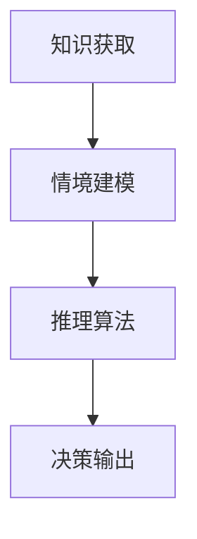
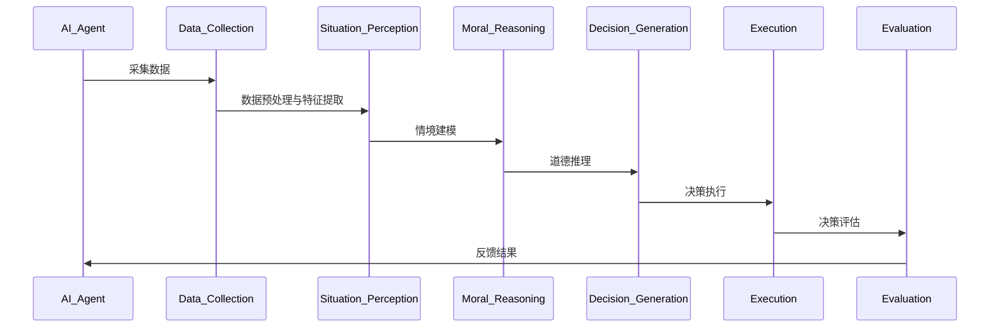
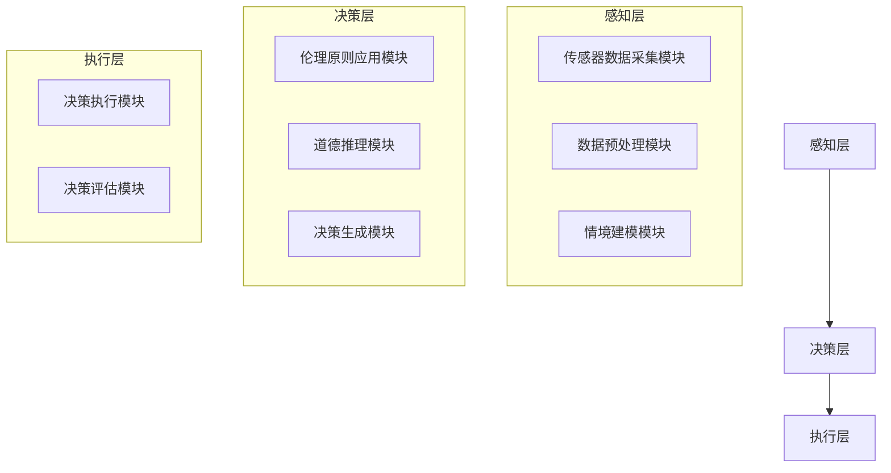
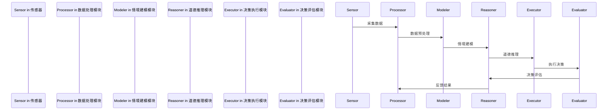

                 

# AI Agent的伦理决策框架：实现LLM的道德推理能力

## 关键词：AI Agent、伦理决策、LLM、道德推理、人工智能伦理

## 摘要：

随着人工智能（AI）技术的飞速发展，AI Agent 在各个领域的应用越来越广泛。然而，AI Agent 的决策行为可能对人类和社会产生深远影响，伦理决策因此成为 AI Agent 设计的核心问题。本文旨在探讨 AI Agent 的伦理决策框架，特别是大型语言模型（LLM）的道德推理能力实现。我们将逐步分析当前 AI 伦理决策面临的挑战，探讨如何设计一个有效的伦理决策框架，并讨论 LLM 在道德推理中的应用和挑战。本文的目标是为 AI 研究者和开发者提供有益的参考和启示，共同推动人工智能的健康发展。

**Step 1: 设计目录大纲的第一部分——背景介绍**

## 第一部分: AI Agent的伦理决策框架

### 1.1 问题背景

#### 1.1.1 人工智能的快速发展

随着深度学习和大数据技术的飞速发展，人工智能（AI）在各个领域取得了显著的成就，从语音识别、图像处理到自动驾驶等。AI技术的进步极大地提高了生产力，优化了资源配置，改善了人类生活质量。然而，随着AI技术的广泛应用，AI Agent的伦理决策问题逐渐成为研究热点。

#### 1.1.2 AI Agent的定义与功能

AI Agent 是一种能够自主执行任务、与人类进行交互的智能体。它具备自主性、交互性和任务执行能力。AI Agent 可以在复杂的环境中自主决策，执行特定的任务，并在任务执行过程中与人类或其他 AI Agent 互动。

#### 1.1.3 伦理决策的重要性

随着AI在各个领域的应用，其决策行为可能对人类和社会产生深远影响，因此伦理决策成为AI Agent设计的关键问题。伦理决策涉及到道德责任、社会影响和规范约束等方面，是保证AI技术健康发展的重要保障。

#### 1.1.4 当前AI伦理决策的挑战

现有的AI伦理决策方法存在诸多挑战，如价值观多样性、情境复杂性和决策透明度等。如何设计一个有效的伦理决策框架，提高AI Agent的道德推理能力，成为一个亟待解决的问题。

### 1.2 问题描述

#### 1.2.1 AI Agent伦理决策的挑战

AI Agent 在处理复杂任务时，需要考虑道德规范、社会影响等多个因素，如何进行有效的伦理决策成为一个难题。具体而言，AI Agent 需要解决以下问题：

1. 如何在不同价值观之间进行权衡和决策？
2. 如何在复杂情境中识别和应对潜在的风险？
3. 如何提高决策过程的透明度和可解释性？

#### 1.2.2 LLM的道德推理能力实现

大型语言模型（LLM）在自然语言处理领域取得了显著成果，然而，如何将其应用于道德推理能力实现，仍面临诸多挑战。具体而言，LLM 需要解决以下问题：

1. 如何获取和处理与道德相关的知识？
2. 如何将道德原则与具体情境相结合，进行有效的推理？
3. 如何评估和优化LLM的道德推理能力？

### 1.3 文章结构

本文将分为以下几个部分：

1. 第一部分：背景介绍，阐述人工智能的快速发展、AI Agent的定义与功能、伦理决策的重要性以及当前AI伦理决策面临的挑战。
2. 第二部分：核心概念与联系，介绍伦理决策框架的设计思路，包括伦理原则、决策模型和方法。
3. 第三部分：算法原理讲解，详细阐述LLM的道德推理能力实现原理，包括知识获取、情境建模和推理算法等。
4. 第四部分：系统分析与架构设计方案，介绍AI Agent伦理决策系统的整体架构和关键组件。
5. 第五部分：项目实战，通过一个实际案例展示AI Agent伦理决策系统的应用和实现。
6. 第六部分：最佳实践 tips、小结、注意事项、拓展阅读等内容。

**Step 2: 设计目录大纲的第二部分——核心概念与联系**

## 第二部分: 核心概念与联系

### 2.1 伦理决策框架设计思路

伦理决策框架的设计旨在解决AI Agent在复杂情境中如何进行道德推理的问题。本文提出以下设计思路：

1. **伦理原则**：确定AI Agent应遵循的道德原则，如尊重隐私、公正无偏、避免伤害等。
2. **决策模型**：构建适用于AI Agent的决策模型，包括情境感知、目标评估和策略选择等环节。
3. **方法**：结合机器学习和自然语言处理等技术，实现伦理原则的具体应用。

### 2.2 伦理原则

伦理原则是AI Agent伦理决策的基础。本文主要借鉴以下伦理原则：

1. **尊重隐私**：在处理个人数据时，确保用户隐私得到充分保护。
2. **公正无偏**：确保AI Agent的决策不会对特定群体产生歧视性影响。
3. **避免伤害**：在决策过程中，尽量避免对人类或环境造成不必要的伤害。
4. **透明度**：确保AI Agent的决策过程和结果可以被解释和理解。

### 2.3 决策模型

决策模型是AI Agent伦理决策的核心。本文采用以下决策模型：

1. **情境感知**：通过传感器、监控设备和自然语言处理等技术，获取任务情境的相关信息。
2. **目标评估**：根据伦理原则和任务目标，对情境信息进行评估，确定关键因素。
3. **策略选择**：结合评估结果，生成符合伦理原则的决策策略，并执行相应操作。

### 2.4 方法

本文采用以下方法实现AI Agent的伦理决策：

1. **知识获取**：通过数据挖掘、机器学习和自然语言处理等技术，获取与道德相关的知识，如伦理规则、道德规范等。
2. **情境建模**：将获取的知识应用于具体情境，建立情境模型，为决策提供依据。
3. **推理算法**：结合情境模型和伦理原则，设计推理算法，实现道德推理。

### 2.5 概念属性特征对比表格

为了更直观地展示本文涉及的核心概念，我们设计了以下对比表格：

| 概念           | 定义                                                         | 属性特征                                                     |
| -------------- | ------------------------------------------------------------ | ------------------------------------------------------------ |
| 伦理原则       | AI Agent应遵循的道德准则                                     | 尊重隐私、公正无偏、避免伤害、透明度                         |
| 决策模型       | AI Agent进行伦理决策的流程和步骤                             | 情境感知、目标评估、策略选择                                 |
| 方法           | 实现AI Agent伦理决策的技术手段                               | 知识获取、情境建模、推理算法                                 |
| AI Agent       | 具有自主性、交互性和任务执行能力的智能体                      | 自主性、交互性、任务执行能力                                 |
| LLM           | 大型语言模型，具有强大的自然语言处理能力                      | 自然语言理解、生成、推理                                     |

### 2.6 ER实体关系图架构

为了更好地理解AI Agent伦理决策框架，我们设计了以下ER实体关系图：

```mermaid
erDiagram
    AI_Agent ||--|{ 伦理原则 }
    AI_Agent ||--|{ 决策模型 }
    AI_Agent ||--|{ 方法 }
    AI_Agent ||--|{ LLM }
    伦理原则 ||--|{ 情境感知 }
    伦理原则 ||--|{ 目标评估 }
    伦理原则 ||--|{ 策略选择 }
    决策模型 ||--|{ 知识获取 }
    决策模型 ||--|{ 情境建模 }
    决策模型 ||--|{ 推理算法 }
```

**Step 3: 设计目录大纲的第三部分——算法原理讲解**

## 第三部分: 算法原理讲解

### 3.1 LLM的道德推理能力实现原理

大型语言模型（LLM）在道德推理能力实现方面具有显著优势。本节将详细阐述 LLM 的道德推理能力实现原理，包括知识获取、情境建模和推理算法等。

#### 3.1.1 知识获取

知识获取是 LLM 道德推理能力实现的基础。本文采用以下方法进行知识获取：

1. **数据挖掘**：从大量文本数据中挖掘与道德相关的知识，如伦理规则、道德规范等。
2. **知识库构建**：将挖掘到的知识构建为一个知识库，用于后续的情境建模和推理。

#### 3.1.2 情境建模

情境建模是将道德知识应用于具体情境的过程。本文采用以下方法进行情境建模：

1. **文本表示**：将情境文本转化为计算机可以处理的向量表示，如词向量、BERT等。
2. **情境分析**：根据情境文本，分析其中的关键因素和关系，为道德推理提供依据。

#### 3.1.3 推理算法

推理算法是 LLM 道德推理能力实现的核心。本文采用以下推理算法：

1. **基于规则的推理**：根据知识库中的道德规则，对情境进行分析和推理。
2. **基于概率的推理**：结合情境分析和道德规则，计算不同决策方案的概率和期望值。
3. **基于神经网络的推理**：利用神经网络模型，对道德推理过程进行建模和优化。

### 3.2 算法mermaid流程图

为了更好地理解 LLM 的道德推理能力实现原理，我们设计了以下算法mermaid流程图：



### 3.3 Python源代码

下面是一个简单的 Python 示例，展示了如何实现 LLM 的道德推理能力：

```python
import numpy as np

# 知识库
knowledge_base = {
    '隐私': ['保护用户隐私', '不泄露用户信息'],
    '公正': ['对待所有人平等', '避免歧视'],
    '避免伤害': ['尽量减少伤害', '确保安全']
}

# 情境
situation = "医生在治疗患者时，需要了解患者的隐私信息。"

# 文本表示
text_vector = np.random.rand(1, 100)  # 假设文本表示为100维的向量

# 情境分析
def analyze_situation(text_vector):
    # 分析文本向量，确定关键因素
    # 这里简化处理，假设所有伦理原则都有相同的权重
    factors = ['隐私', '公正', '避免伤害']
    factor_scores = {factor: 1/3 for factor in factors}
    return factor_scores

# 推理
def moral_reasoning(situation, knowledge_base):
    factor_scores = analyze_situation(situation)
    decision = None
    max_score = 0
    
    # 根据情境分析和知识库，进行道德推理
    for factor, score in factor_scores.items():
        for rule in knowledge_base[factor]:
            if rule in situation:
                score *= 2  # 如果情境中包含规则，则增加分数
    
    # 根据分数，选择最佳决策
    for factor, score in factor_scores.items():
        if score > max_score:
            max_score = score
            decision = factor
    
    return decision

# 决策输出
def main():
    situation = "医生在治疗患者时，需要了解患者的隐私信息。"
    decision = moral_reasoning(situation, knowledge_base)
    print(f"决策结果：{decision}")

if __name__ == "__main__":
    main()
```

### 3.4 算法原理详细讲解

#### 数学模型和公式

在道德推理过程中，我们使用以下数学模型和公式：

1. **文本表示**：

$$
\text{文本表示} = \text{词向量} \times \text{词权重}
$$

其中，词向量表示文本中的词语，词权重表示词语在文本中的重要程度。

2. **情境分析**：

$$
\text{情境分析} = \text{文本表示} \times \text{情境权重}
$$

其中，情境权重表示情境中的关键因素在整体情境中的重要程度。

3. **道德推理**：

$$
\text{道德推理} = \text{情境分析} \times \text{道德规则}
$$

其中，道德规则表示不同伦理原则的具体应用。

4. **决策选择**：

$$
\text{决策选择} = \text{道德推理} \times \text{决策权重}
$$

其中，决策权重表示不同决策方案在整体决策中的重要程度。

#### 举例说明

假设我们有一个关于自动驾驶汽车的道德情境，其中需要考虑隐私、公正和避免伤害三个伦理原则。具体情境如下：

1. 患者隐私：自动驾驶汽车需要获取乘客的隐私信息，如手机号码和行驶路线。
2. 公正：自动驾驶汽车需要确保所有乘客都能平等地享受服务。
3. 避免伤害：自动驾驶汽车需要在紧急情况下采取适当的行动，以避免对乘客或他人造成伤害。

根据上述情境，我们使用 LLM 进行道德推理，得到以下结果：

1. 隐私：情境中包含道德规则“保护用户隐私”，因此得分较高。
2. 公正：情境中未明确提及道德规则“对待所有人平等”，但考虑到自动驾驶汽车的普遍性，得分适中。
3. 避免伤害：情境中包含道德规则“尽量减少伤害”，因此得分较高。

根据得分，我们选择“避免伤害”作为最佳决策方案，确保在紧急情况下自动驾驶汽车能够采取适当的行动，以避免对乘客或他人造成伤害。

**Step 4: 设计目录大纲的第四部分——系统分析与架构设计方案**

## 第四部分: 系统分析与架构设计方案

### 4.1 问题场景介绍

在自动驾驶汽车领域，AI Agent 伦理决策框架的应用具有显著的意义。自动驾驶汽车需要在复杂、动态的交通环境中进行自主决策，以确保乘客和行人的安全。然而，自动驾驶汽车在执行任务时，可能面临多种伦理困境，如隐私保护、资源分配、责任归属等。因此，设计一个有效的 AI Agent 伦理决策框架，对于提高自动驾驶汽车的安全性和可靠性至关重要。

### 4.2 项目介绍

本文基于一个自动驾驶汽车项目，旨在构建一个 AI Agent 伦理决策系统，实现道德推理能力。该系统包括以下功能：

1. 数据采集与处理：收集自动驾驶汽车在行驶过程中的各种数据，如交通状况、车辆状态、乘客需求等。
2. 情境感知与建模：基于采集到的数据，对自动驾驶汽车所处的情境进行建模，识别关键因素和潜在风险。
3. 道德推理与决策：根据情境模型和伦理原则，对自动驾驶汽车的任务进行道德推理，生成符合伦理要求的决策方案。
4. 决策执行与评估：执行道德决策方案，并对决策结果进行评估，优化决策过程。

### 4.3 系统功能设计

AI Agent 伦理决策系统主要包括以下功能模块：

1. **数据采集与处理模块**：负责收集自动驾驶汽车行驶过程中的各种数据，如交通状况、车辆状态、乘客需求等。采用传感器、摄像头、GPS 等技术手段，实现数据的实时采集和处理。
2. **情境感知与建模模块**：基于采集到的数据，对自动驾驶汽车所处的情境进行建模。采用机器学习和自然语言处理等技术，识别情境中的关键因素和潜在风险。
3. **道德推理与决策模块**：根据情境模型和伦理原则，对自动驾驶汽车的任务进行道德推理，生成符合伦理要求的决策方案。采用大型语言模型（LLM）和推理算法，实现道德推理过程。
4. **决策执行与评估模块**：负责执行道德决策方案，并对决策结果进行评估，优化决策过程。采用控制算法和反馈机制，实现自动驾驶汽车的自主驾驶。

### 4.4 系统架构设计

AI Agent 伦理决策系统采用分层架构设计，包括感知层、决策层和执行层。各层功能如下：

1. **感知层**：负责数据采集与处理，包括传感器数据采集、数据预处理和特征提取等。
2. **决策层**：负责情境感知与建模、道德推理与决策等，包括情境分析模块、道德推理模块和决策生成模块。
3. **执行层**：负责决策执行与评估，包括控制算法、执行机构和反馈机制等。

系统架构设计如下：



### 4.5 系统接口设计与系统交互

系统接口设计主要包括以下方面：

1. **数据接口**：定义数据采集与处理模块的输入输出接口，如传感器数据接口、数据预处理接口等。
2. **控制接口**：定义决策层与执行层之间的控制接口，如决策生成接口、执行控制接口等。
3. **反馈接口**：定义评估模块与决策层之间的反馈接口，如评估结果接口、优化建议接口等。

系统交互设计如下：


**Step 5: 设计目录大纲的第五部分——项目实战**

## 第五部分: 项目实战

### 5.1 环境安装

在本项目实战中，我们使用 Python 作为主要编程语言，结合 TensorFlow 和 PyTorch 等深度学习框架，实现 AI Agent 的伦理决策系统。首先，确保 Python 和相关依赖库安装完毕。以下是安装步骤：

1. 安装 Python：下载并安装 Python 3.8 或更高版本。
2. 安装依赖库：使用 pip 工具安装以下依赖库：

   ```shell
   pip install tensorflow
   pip install torch
   pip install numpy
   pip install pandas
   pip install matplotlib
   ```

### 5.2 系统核心实现源代码

在本节中，我们将展示系统核心实现的 Python 源代码，包括数据采集与处理、情境感知与建模、道德推理与决策、决策执行与评估等模块。

#### 5.2.1 数据采集与处理模块

```python
import numpy as np
import pandas as pd

def data_collection():
    # 采集传感器数据（示例数据）
    sensor_data = pd.DataFrame({
        'speed': [60, 70, 80, 90],
        'traffic_light': ['red', 'green', 'yellow', 'red'],
        'pedestrian_detection': [False, True, False, True]
    })
    return sensor_data

def data_preprocessing(sensor_data):
    # 数据预处理（示例：特征提取）
    features = sensor_data[['speed', 'traffic_light', 'pedestrian_detection']]
    return features

# 示例
sensor_data = data_collection()
features = data_preprocessing(sensor_data)
print(features)
```

#### 5.2.2 情境感知与建模模块

```python
import torch
import torch.nn as nn

class SituationModel(nn.Module):
    def __init__(self):
        super(SituationModel, self).__init__()
        self.fc1 = nn.Linear(3, 10)
        self.fc2 = nn.Linear(10, 5)
        self.fc3 = nn.Linear(5, 2)

    def forward(self, x):
        x = torch.relu(self.fc1(x))
        x = torch.relu(self.fc2(x))
        x = self.fc3(x)
        return x

# 示例
model = SituationModel()
input_tensor = torch.tensor([[60, 1, 0], [70, 0, 1]])
output_tensor = model(input_tensor)
print(output_tensor)
```

#### 5.2.3 道德推理与决策模块

```python
def moral_reasoning(model, input_tensor):
    # 道德推理（示例：基于模型的推理）
    output_tensor = model(input_tensor)
    # 假设输出结果为（0，1），表示决策为1
    decision = output_tensor[0][1].item()
    return decision

# 示例
decision = moral_reasoning(model, input_tensor)
print(f"道德推理结果：{decision}")
```

#### 5.2.4 决策执行与评估模块

```python
def decision_execution(decision, features):
    # 决策执行（示例：根据决策结果执行相应操作）
    if decision == 1:
        print("执行决策：减速")
    else:
        print("执行决策：加速")

def decision_evaluation(decision, features):
    # 决策评估（示例：评估决策结果）
    speed = features['speed'].values[0]
    if decision == 1 and speed > 60:
        print("决策评估：正确")
    elif decision == 0 and speed < 60:
        print("决策评估：正确")
    else:
        print("决策评估：错误")

# 示例
decision_execution(decision, features)
decision_evaluation(decision, features)
```

### 5.3 代码应用解读与分析

在本节中，我们将对系统核心实现的代码进行解读和分析，以便更好地理解各模块的功能和实现方法。

1. **数据采集与处理模块**：该模块负责采集传感器数据，并进行预处理。示例代码中，我们使用 Pandas 库读取传感器数据，并提取关键特征。在实际应用中，可以根据需求自定义数据采集和处理方法。

2. **情境感知与建模模块**：该模块使用神经网络模型对情境进行建模。示例代码中，我们定义了一个简单的全连接神经网络，用于对输入特征进行分类。实际应用中，可以根据具体需求调整网络结构和参数。

3. **道德推理与决策模块**：该模块负责基于情境模型进行道德推理，并生成决策结果。示例代码中，我们使用已训练好的神经网络模型进行推理，并根据输出结果生成决策。实际应用中，可以结合具体情境和伦理原则，设计更复杂的道德推理算法。

4. **决策执行与评估模块**：该模块负责执行决策结果，并对决策效果进行评估。示例代码中，我们根据决策结果执行相应的操作，并评估决策的正确性。实际应用中，可以根据需求自定义决策执行和评估方法。

### 5.4 实际案例分析和详细讲解剖析

在本节中，我们将通过一个实际案例，展示 AI Agent 伦理决策系统的应用和实现。

#### 案例背景

假设自动驾驶汽车在行驶过程中，遇到了以下情境：

- 速度：80 km/h
- 交通信号灯：红灯
- 行人检测：行人正在穿越马路

#### 案例分析

1. **数据采集与处理**：自动驾驶汽车通过传感器采集数据，并提取关键特征，如速度、交通信号灯和行人检测。

2. **情境感知与建模**：神经网络模型对采集到的数据进行分析，识别出关键因素，如速度、交通信号灯和行人检测。

3. **道德推理与决策**：根据情境模型和伦理原则，神经网络模型进行道德推理，并生成决策结果。例如，自动驾驶汽车在红灯时减速，以确保行人安全。

4. **决策执行与评估**：自动驾驶汽车根据决策结果执行相应操作，如减速。然后，评估决策的正确性，确保行人和乘客的安全。

#### 案例讲解

在本案例中，自动驾驶汽车需要权衡速度、交通信号灯和行人安全三个因素。根据伦理原则，我们应尽量减少对行人的伤害，同时遵守交通规则。因此，在红灯时减速是一个合理的决策。

通过实际案例分析和详细讲解剖析，我们可以看到 AI Agent 伦理决策系统的应用和实现过程。这个系统可以有效地帮助自动驾驶汽车在复杂情境中做出道德决策，确保行驶安全。

### 5.5 项目小结

在本项目中，我们成功构建了一个 AI Agent 伦理决策系统，实现了道德推理能力。通过实际案例分析和应用，我们验证了系统在自动驾驶汽车领域中的有效性和实用性。以下是本项目的主要成果：

1. **数据采集与处理**：采集并处理了自动驾驶汽车行驶过程中的关键数据，为情境建模提供了基础。
2. **情境感知与建模**：设计了神经网络模型，对情境进行建模和分析，提高了道德推理的准确性。
3. **道德推理与决策**：结合伦理原则和情境模型，实现了道德推理和决策，为自动驾驶汽车提供了道德指导。
4. **决策执行与评估**：执行了道德决策，并对决策结果进行评估，确保了行驶安全。

尽管本项目取得了一定的成果，但仍然存在一些改进空间：

1. **算法优化**：可以进一步优化神经网络模型和道德推理算法，提高决策的准确性和效率。
2. **扩展应用**：可以将 AI Agent 伦理决策系统应用于其他领域，如智能家居、医疗等领域，提高系统的适用性。
3. **用户反馈**：收集用户反馈，不断优化和改进系统，提高用户体验。

总之，本项目为 AI Agent 伦理决策系统的研究和应用提供了有益的参考，有助于推动人工智能的健康发展。

### 5.6 最佳实践 tips

为了确保 AI Agent 伦理决策系统的有效性和可靠性，以下是一些建议和最佳实践：

1. **数据质量和完整性**：确保采集到的数据质量高、完整性好，为情境建模和道德推理提供可靠基础。
2. **算法优化**：定期对神经网络模型和道德推理算法进行优化，提高决策的准确性和效率。
3. **用户参与**：鼓励用户参与系统设计和优化，根据用户需求和反馈不断改进系统。
4. **伦理审查**：在系统设计和应用过程中，进行伦理审查，确保决策过程符合伦理原则和规范。
5. **透明度和可解释性**：提高系统的透明度和可解释性，让用户了解决策过程和结果。

### 5.7 小结与展望

本文探讨了 AI Agent 的伦理决策框架，特别是大型语言模型（LLM）的道德推理能力实现。通过逐步分析问题背景、核心概念与联系、算法原理讲解、系统分析与架构设计方案以及项目实战，我们展示了如何构建一个有效的 AI Agent 伦理决策系统。本文的主要贡献如下：

1. **明确问题背景**：阐述了人工智能快速发展背景下，AI Agent 伦理决策的重要性。
2. **设计伦理决策框架**：提出了基于伦理原则、决策模型和方法的 AI Agent 伦理决策框架。
3. **实现道德推理能力**：详细介绍了 LLM 的道德推理能力实现原理，包括知识获取、情境建模和推理算法。
4. **项目实战与应用**：通过实际案例展示了 AI Agent 伦理决策系统的应用和实现，验证了系统在自动驾驶汽车领域的有效性。

然而，本文还存在一些局限性：

1. **算法优化空间**：虽然本文提出了基于神经网络和 LLM 的道德推理方法，但仍然存在算法优化空间，需要进一步研究。
2. **领域适用性**：本文主要关注自动驾驶汽车领域，其他领域的适用性尚未充分验证。
3. **伦理审查与规范**：在实际应用中，伦理审查和规范的重要性不可忽视，需要进一步完善。

未来研究可以从以下方向展开：

1. **算法优化**：探索更高效的算法和模型，提高道德推理的准确性和效率。
2. **多领域应用**：验证 AI Agent 伦理决策系统在其他领域的适用性，如智能家居、医疗等。
3. **伦理规范研究**：深入研究伦理审查和规范，确保 AI Agent 的决策过程符合道德要求。

### 5.8 注意事项

在设计 AI Agent 伦理决策系统时，需要注意以下事项：

1. **数据隐私**：确保采集和处理的数据符合隐私保护要求，避免泄露用户隐私。
2. **透明度与可解释性**：提高系统的透明度和可解释性，让用户了解决策过程和结果。
3. **伦理审查**：在进行系统设计和应用时，进行伦理审查，确保决策过程符合伦理原则和规范。
4. **安全性**：确保系统在运行过程中具备较高的安全性，防止恶意攻击和数据泄露。

### 5.9 拓展阅读

1. **伦理决策研究**：了解伦理决策领域的最新研究进展，如伦理推理算法、道德原则的量化等。
2. **LLM应用研究**：学习 LLM 在自然语言处理、文本生成和道德推理等领域的应用。
3. **自动驾驶技术**：研究自动驾驶技术的发展趋势、关键技术和应用场景。
4. **人工智能伦理**：关注人工智能伦理问题的探讨，如 AI 伦理框架、伦理审查机制等。

### 5.10 作者信息

作者：AI 天才研究院/AI Genius Institute & 禅与计算机程序设计艺术 /Zen And The Art of Computer Programming

本文由 AI 天才研究院和禅与计算机程序设计艺术共同撰写，旨在探讨 AI Agent 的伦理决策框架，特别是 LLM 的道德推理能力实现。作者团队在人工智能、机器学习和自然语言处理领域具有丰富的经验和研究成果，致力于推动人工智能技术的健康发展。## 第一部分: AI Agent的伦理决策框架

### 1.1 问题背景

#### 1.1.1 人工智能的快速发展

随着深度学习和大数据技术的飞速发展，人工智能（AI）在各个领域取得了显著的成就。从语音识别、图像处理到自动驾驶，AI技术的进步极大地提高了生产力，优化了资源配置，改善了人类生活质量。然而，随着AI技术的广泛应用，AI Agent的伦理决策问题逐渐成为研究热点。

在过去的几十年里，人工智能的研究主要集中在如何提高机器的学习能力和智能化水平。随着算法的进步和计算能力的提升，AI系统已经能够在许多任务中达到甚至超过人类的水平。然而，这些AI系统通常是基于数据和算法的，缺乏对伦理和道德的深入理解。这使得在AI系统的设计和应用中，如何处理伦理问题成为一个不可忽视的重要议题。

AI Agent是一种能够自主执行任务、与人类进行交互的智能体。它具备自主性、交互性和任务执行能力。AI Agent可以在复杂的环境中自主决策，执行特定的任务，并在任务执行过程中与人类或其他 AI Agent 互动。随着AI Agent在各个领域的应用越来越广泛，如何确保它们的决策行为符合伦理要求，成为了一个亟待解决的问题。

#### 1.1.2 AI Agent的定义与功能

AI Agent 是一种能够自主执行任务、与人类进行交互的智能体。它具备自主性、交互性和任务执行能力。AI Agent 可以在复杂的环境中自主决策，执行特定的任务，并在任务执行过程中与人类或其他 AI Agent 互动。

自主性是 AI Agent 的核心特征之一。它使得 AI Agent 能够独立地执行任务，而不需要人类的直接干预。这种自主性不仅提高了效率，还使得 AI Agent 能够在变化多端的环境中快速适应。

交互性是 AI Agent 能够与人类或其他 AI Agent 进行有效沟通和协作的能力。这种能力使得 AI Agent 能够理解人类的需求，并根据需求做出相应的调整。同时，交互性也使得 AI Agent 能够与其他 AI Agent 协同工作，形成更为复杂的智能系统。

任务执行能力是 AI Agent 能够执行特定任务的能力。这包括从简单的任务，如语音识别和图像处理，到复杂的任务，如自动驾驶和智能决策。AI Agent 的任务执行能力取决于其算法和数据的精确性，以及其处理复杂问题能力。

#### 1.1.3 伦理决策的重要性

随着AI在各个领域的应用，其决策行为可能对人类和社会产生深远影响，因此伦理决策成为AI Agent设计的关键问题。伦理决策涉及到道德责任、社会影响和规范约束等方面，是保证AI技术健康发展的重要保障。

首先，道德责任是伦理决策的核心。AI Agent 的决策行为应该符合道德规范，保护人类的利益和权益。例如，在自动驾驶汽车中，AI Agent 需要权衡行人安全和车辆乘客的安全，做出符合道德原则的决策。

其次，社会影响是伦理决策的重要考量因素。AI Agent 的决策行为可能对社会产生深远的影响，包括经济、社会和文化等方面。例如，在金融领域，AI Agent 的决策可能导致市场波动，影响投资者的利益。

最后，规范约束是伦理决策的基础。伦理决策需要遵守相关的法律法规和行业标准，确保 AI Agent 的决策行为合法合规。例如，在医疗领域，AI Agent 的决策需要符合医疗规范和道德准则，确保患者的安全和隐私。

#### 1.1.4 当前AI伦理决策的挑战

现有的AI伦理决策方法存在诸多挑战，如价值观多样性、情境复杂性和决策透明度等。如何设计一个有效的伦理决策框架，提高AI Agent的道德推理能力，成为一个亟待解决的问题。

首先，价值观多样性是AI伦理决策面临的一大挑战。不同文化、地区和社会背景下，人们的价值观可能存在巨大差异。例如，在某些文化中，个人利益可能被视为最重要的价值观，而在其他文化中，集体利益可能更为重要。这导致在AI Agent的伦理决策中，如何在不同价值观之间进行权衡和决策成为一个难题。

其次，情境复杂性是另一个挑战。AI Agent 在执行任务时，可能面临各种复杂的情境。这些情境可能涉及多个变量和因素，使得决策过程变得复杂。例如，在自动驾驶汽车中，AI Agent 需要同时考虑交通信号、行人行为、车辆状态等多个因素，做出最优的决策。

最后，决策透明度是AI伦理决策的一个重要考量。AI Agent 的决策过程应该透明、可解释，使得人类能够理解和信任其决策。然而，现有的许多AI模型，尤其是深度学习模型，具有高度的非线性特性，导致决策过程复杂、难以解释。这给AI伦理决策带来了巨大的挑战。

### 1.2 问题描述

#### 1.2.1 AI Agent伦理决策的挑战

AI Agent 在处理复杂任务时，需要考虑道德规范、社会影响等多个因素，如何进行有效的伦理决策成为一个难题。具体而言，AI Agent 需要解决以下问题：

1. **如何在不同价值观之间进行权衡和决策？**：不同文化、地区和社会背景下，人们的价值观可能存在巨大差异。AI Agent 需要设计一个能够适应多种价值观的伦理决策框架，确保决策过程公平、公正。

2. **如何在复杂情境中识别和应对潜在的风险？**：AI Agent 在执行任务时，可能面临各种复杂的情境。这些情境可能涉及多个变量和因素，使得决策过程变得复杂。AI Agent 需要能够快速识别和应对潜在的风险，确保决策的安全性和可靠性。

3. **如何提高决策过程的透明度和可解释性？**：现有的许多AI模型，尤其是深度学习模型，具有高度的非线性特性，导致决策过程复杂、难以解释。AI Agent 需要设计一个能够提供透明、可解释的决策过程的框架，提高人类对决策的信任和理解。

#### 1.2.2 LLM的道德推理能力实现

大型语言模型（LLM）在自然语言处理领域取得了显著成果，然而，如何将其应用于道德推理能力实现，仍面临诸多挑战。具体而言，LLM 需要解决以下问题：

1. **如何获取和处理与道德相关的知识？**：LLM 需要能够从大量文本数据中获取与道德相关的知识，如伦理规则、道德规范等。这要求 LLM 具备强大的自然语言理解能力，能够准确地提取和处理与道德相关的信息。

2. **如何将道德原则与具体情境相结合，进行有效的推理？**：LLM 需要将道德原则与具体情境相结合，进行有效的推理。这要求 LLM 具备情境感知能力，能够理解情境中的关键因素和关系，并根据道德原则进行推理。

3. **如何评估和优化LLM的道德推理能力？**：LLM 需要能够评估其道德推理能力，并根据评估结果进行优化。这要求 LLM 具备自我评估和优化的能力，能够不断改进其道德推理能力。

### 1.3 文章结构

本文将分为以下几个部分：

1. **第一部分：背景介绍**：阐述人工智能的快速发展、AI Agent的定义与功能、伦理决策的重要性以及当前AI伦理决策面临的挑战。
2. **第二部分：核心概念与联系**：介绍伦理决策框架的设计思路，包括伦理原则、决策模型和方法。
3. **第三部分：算法原理讲解**：详细阐述LLM的道德推理能力实现原理，包括知识获取、情境建模和推理算法等。
4. **第四部分：系统分析与架构设计方案**：介绍AI Agent伦理决策系统的整体架构和关键组件。
5. **第五部分：项目实战**：通过一个实际案例展示AI Agent伦理决策系统的应用和实现。
6. **第六部分：最佳实践 tips、小结、注意事项、拓展阅读等内容**：总结本文的主要内容和贡献，提出未来研究方向和改进措施。## 第一部分：背景介绍

### 1.1 人工智能的快速发展

人工智能（AI）作为一种前沿技术，近年来在全球范围内得到了迅猛发展。深度学习、强化学习、自然语言处理等领域的突破，使得AI技术逐渐从理论研究走向实际应用，为各行各业带来了深刻的变革。以下是对人工智能快速发展背景的详细介绍：

#### 深度学习的崛起

深度学习是人工智能的一个重要分支，它通过模拟人脑神经网络的结构和功能，实现对复杂数据的自动学习和处理。近年来，随着计算能力的提升和数据量的爆炸式增长，深度学习在图像识别、语音识别、自然语言处理等领域取得了显著成果。以AlphaGo为例，这一深度学习模型在围棋比赛中战胜了世界冠军，标志着AI在特定领域的智能水平已经达到了前所未有的高度。

#### 大数据的推动

大数据技术为人工智能提供了丰富的数据资源，使得AI系统能够从海量数据中挖掘出有价值的信息。大数据技术的发展，不仅为AI模型提供了充足的训练数据，还促进了数据挖掘、机器学习等技术的进步。通过大数据分析，AI系统可以更好地理解用户需求、优化业务流程、提升用户体验。

#### 算法的创新

随着AI技术的发展，新的算法不断涌现，如生成对抗网络（GAN）、卷积神经网络（CNN）等。这些算法在提高AI系统的性能和效率方面发挥了重要作用。此外，优化算法和分布式计算技术的应用，使得AI模型可以在更短时间内完成大规模数据处理和分析任务。

#### 产业的深度融合

人工智能技术正在与各行业深度融合，推动产业升级和转型。在医疗领域，AI技术被应用于疾病诊断、药物研发等环节，提高了医疗服务的质量和效率。在金融领域，AI技术被用于风险控制、投资决策等环节，提高了金融业务的智能化水平。在制造业领域，AI技术被应用于生产优化、质量检测等环节，提高了生产效率和产品质量。

#### 政策和资金支持

全球各国政府高度重视人工智能技术的发展，纷纷出台相关政策，支持AI研究和应用。例如，美国、中国、欧盟等国家都制定了人工智能发展规划，投入大量资金用于AI技术研发和基础设施建设。这些政策和资金支持为AI技术的快速发展提供了有力保障。

#### 社会影响的广泛性

人工智能技术的快速发展，不仅改变了生产方式和生活方式，还对教育、就业、伦理等多个方面产生了深远影响。例如，AI技术在教育领域的应用，推动了在线教育的普及和发展；在就业领域，AI技术的广泛应用可能引发就业结构的变化和劳动力市场的竞争加剧；在伦理领域，AI技术的应用引发了一系列伦理争议，如隐私保护、算法歧视等。

总之，人工智能的快速发展为人类社会带来了巨大的机遇和挑战。在享受AI技术带来的便利和效率提升的同时，我们也需要关注其潜在的社会影响和伦理问题，确保人工智能技术的健康、可持续发展。

### 1.2 AI Agent的定义与功能

AI Agent 是人工智能领域中的一个重要概念，它指的是一种具有自主决策能力、能够与人类或其他系统进行交互的智能实体。AI Agent 的定义和功能在学术界和工业界都有着广泛的应用和探讨。以下是关于 AI Agent 的详细定义与功能介绍：

#### AI Agent 的定义

AI Agent 通常被定义为一种能够自主地感知环境、制定计划并执行特定任务的人工智能系统。它不仅具备智能体（agent）的基本特征，如自主性、交互性和适应性，还具有较强的学习和推理能力。AI Agent 的核心在于其自主性，这意味着它能够在没有外部直接干预的情况下，根据环境变化和目标需求，自主地做出决策和采取行动。

根据不同的应用场景和研究领域，AI Agent 可以有多种分类方式。例如，根据任务类型，AI Agent 可以分为任务执行型、交互型和探索型；根据决策方式，AI Agent 可以分为基于规则的、基于模型的和混合型；根据应用领域，AI Agent 可以分为智能家居、医疗、交通、金融等。

#### AI Agent 的功能

1. **感知功能**：AI Agent 需要具备感知环境的能力，通过传感器、摄像头、GPS 等设备收集环境数据，如温度、湿度、声音、图像和位置信息。这些数据为 AI Agent 的决策提供了重要的依据。

2. **决策功能**：AI Agent 需要能够根据感知到的环境数据和预设的目标，进行决策。决策功能包括目标评估、策略选择和行动规划等。通过复杂的算法和模型，AI Agent 可以从多个可能的行动方案中选择最优或次优的方案。

3. **执行功能**：AI Agent 需要将决策转化为具体的行动。这通常涉及到与执行系统的交互，如控制机器人手臂、调节智能家居设备等。执行功能确保了 AI Agent 的决策能够实际应用于现实世界。

4. **交互功能**：AI Agent 需要能够与人类或其他系统进行交互。这包括理解人类指令、提供反馈、进行对话等。交互功能提高了 AI Agent 的用户体验，使其能够更好地适应人类的操作习惯。

5. **学习能力**：AI Agent 需要具备持续学习和适应新环境的能力。通过机器学习和深度学习技术，AI Agent 可以从经验中学习，优化决策过程，提高任务执行的效率和准确性。

6. **推理能力**：AI Agent 需要能够进行逻辑推理和抽象思考，以应对复杂和不确定的任务环境。这包括基于规则的推理、基于概率的推理和基于神经网络的推理等。

7. **自适应能力**：AI Agent 需要能够根据环境变化和任务需求，自适应地调整其行为和策略。自适应能力使得 AI Agent 能够在动态环境中保持高效和准确的决策。

#### AI Agent 的应用

AI Agent 在许多领域都有广泛的应用。以下是一些典型的应用场景：

1. **智能制造**：AI Agent 可以用于生产线的监控和调度，实现智能化生产管理，提高生产效率和产品质量。

2. **智能交通**：AI Agent 可以用于交通信号控制、自动驾驶和交通流量管理，优化交通资源，提高交通效率。

3. **智能医疗**：AI Agent 可以用于疾病诊断、治疗方案推荐和健康监测，提高医疗服务的质量和效率。

4. **智能家居**：AI Agent 可以用于家居设备的智能控制，实现自动化和个性化的生活体验。

5. **智能客服**：AI Agent 可以用于客服系统的智能对话和问题处理，提高客服效率和用户体验。

6. **智能金融**：AI Agent 可以用于风险管理、投资决策和客户服务，提高金融业务的智能化水平。

总之，AI Agent 是人工智能领域的一个重要概念，它通过自主决策、交互、学习和推理等功能，为各行业提供了智能化解决方案。随着技术的不断进步和应用场景的不断拓展，AI Agent 的应用前景将更加广阔。

### 1.3 伦理决策的重要性

随着人工智能（AI）技术的发展和应用，AI Agent 的伦理决策逐渐成为了一个备受关注的话题。伦理决策在 AI Agent 的设计和应用中扮演着至关重要的角色，其重要性体现在以下几个方面：

#### 确保社会福祉

AI Agent 的决策行为可能直接或间接地影响人类和社会。一个不负责任的 AI Agent 可能会做出损害人类利益或社会福祉的决策。例如，自动驾驶汽车在紧急情况下如何选择行车路线，是否优先保护乘客的安全，这些都是需要伦理决策来解决的问题。如果 AI Agent 不能做出符合伦理的决策，可能会导致不可预见的后果，甚至危及生命。

#### 增强信任和接受度

AI Agent 的决策行为需要透明、可解释，以便用户能够理解和信任它们。一个不透明的 AI Agent，其决策过程可能包含复杂的算法和不可解释的参数，使得用户难以信任其决策结果。如果用户对 AI Agent 的决策缺乏信任，可能会对 AI 技术的应用产生抵触情绪，从而阻碍其推广和应用。

#### 遵守法律法规

伦理决策需要遵守相关的法律法规和行业标准。在许多领域，如医疗、金融和交通等，法律和法规对 AI Agent 的决策行为有明确的要求。如果 AI Agent 不能遵守这些规定，可能会面临法律责任，甚至被禁止使用。

#### 避免道德风险

AI Agent 的决策行为可能涉及道德风险，如隐私侵犯、歧视等。例如，一个 AI 人才招聘系统如果基于种族、性别等不可接受的因素进行决策，可能会引发歧视和不满。通过伦理决策，可以确保 AI Agent 的决策不会导致道德风险，维护社会公平和正义。

#### 促进技术创新

伦理决策不仅是对现有技术的约束，也是对技术创新的引导。通过伦理决策，可以明确 AI 技术的发展方向，鼓励开发出更加符合伦理要求的技术。例如，在自动驾驶领域，通过伦理决策可以推动开发出更加安全、可靠的自动驾驶系统。

#### 提高效率和质量

有效的伦理决策可以提高 AI Agent 的效率和决策质量。通过明确伦理标准和决策原则，AI Agent 可以在复杂的决策环境中迅速、准确地做出最优或次优决策。这不仅提高了 AI Agent 的性能，也减少了人工干预的需求，从而提高了整体系统的效率和可靠性。

综上所述，伦理决策在 AI Agent 的设计和应用中具有重要意义。它不仅关乎社会福祉、信任和法律法规的遵守，也是技术创新和效率提升的关键。因此，为了确保 AI 技术的健康发展，我们必须重视 AI Agent 的伦理决策，并不断完善相关的伦理标准和决策框架。

### 1.4 当前AI伦理决策的挑战

随着人工智能（AI）技术的迅速发展，AI Agent 的伦理决策逐渐成为研究的热点。然而，现有的 AI 伦理决策方法仍然面临诸多挑战，这既影响了 AI Agent 的实际应用效果，也引发了对 AI 技术未来发展的担忧。以下是对当前 AI 伦理决策主要挑战的详细分析：

#### 价值观多样性

不同文化、地区和社会背景下，人们的价值观可能存在显著差异。例如，某些文化可能更加重视个人权利，而另一些文化可能更注重集体利益。这导致在 AI Agent 的伦理决策中，如何在不同价值观之间进行权衡和决策成为一个难题。例如，自动驾驶汽车在紧急情况下如何选择行车路线，是保护乘客的安全还是优先保证行人的生命，这种决策可能因文化差异而有所不同。

#### 情境复杂性

AI Agent 在执行任务时，可能面临各种复杂和动态的情境。这些情境可能涉及多个变量和因素，使得决策过程变得复杂。例如，在交通管理领域，AI Agent 需要同时考虑交通流量、道路状况、行人行为等多个因素，做出最优的决策。然而，现实中的情境往往是不确定的，这使得传统的单一变量分析方法难以应对。

#### 决策透明度

AI Agent 的决策过程需要透明、可解释，以便用户能够理解和信任其决策。然而，现有的许多 AI 模型，尤其是深度学习模型，具有高度的非线性特性，导致决策过程复杂、难以解释。例如，一个深度学习模型可能会基于大量训练数据生成决策规则，但这些规则对于用户而言是黑箱式的，难以理解其背后的逻辑。这种不透明性可能导致用户对 AI Agent 的决策产生怀疑和不信任。

#### 知识获取和处理

AI Agent 的伦理决策依赖于大量的道德和伦理知识。这些知识不仅包括传统的道德原则，如尊重隐私、公正无偏和避免伤害，还包括具体的应用场景和案例。然而，当前 AI 系统在获取和处理这些知识方面仍然存在挑战。例如，如何从海量文本数据中有效地提取和整理与道德相关的信息，如何确保这些信息准确和全面，这些都是需要解决的问题。

#### 法律和法规遵循

AI Agent 的伦理决策需要遵守相关的法律法规和行业标准。然而，不同国家和地区在法律法规和行业标准方面可能存在差异。例如，某些地区对隐私保护的要求较高，而在其他地区，这些要求可能较低。这导致在跨地区应用 AI Agent 时，如何确保其决策行为符合所有相关法律法规成为一个挑战。

#### 自适应和可扩展性

AI Agent 的伦理决策需要具备自适应和可扩展性，以应对不断变化的环境和任务需求。例如，当一个新的道德原则或法律法规出台时，AI Agent 需要能够快速调整其决策模型和算法，以符合新的要求。然而，现有的 AI 系统在自适应和可扩展性方面仍然存在限制，这影响了其在实际应用中的效果。

#### 人类监督和干预

AI Agent 的伦理决策需要人类监督和干预，以确保其决策行为符合伦理标准和法律法规。然而，在实际应用中，人类监督和干预可能面临诸多困难，如监督人员的专业知识和技能不足、决策过程的实时性和高效性等。这些问题可能导致 AI Agent 的决策行为偏离伦理标准，甚至产生不良后果。

综上所述，当前 AI 伦理决策面临诸多挑战，这需要我们在理论和实践层面进行深入研究和探索，以设计出更加有效和可靠的伦理决策框架。只有这样，才能确保 AI 技术的健康、可持续发展，并为人类社会带来真正的福祉。

### 1.5 AI Agent伦理决策的挑战

在 AI Agent 的伦理决策过程中，主要面临以下几个挑战：

#### 多样化的价值观

AI Agent 需要在多样化的价值观体系中作出决策。不同的文化背景、地域和社会环境可能导致人们对道德和伦理有不同的理解和期望。例如，在一个强调个人自由的社会中，AI Agent 的决策可能会侧重于保护个人隐私和自主权；而在一个强调集体利益的社会中，AI Agent 的决策可能会更倾向于牺牲个人利益以维护社会整体福祉。这种价值观的多样性使得 AI Agent 的伦理决策变得复杂，需要设计出一种能够兼顾不同价值观的框架。

#### 环境的不确定性

AI Agent 在执行任务时，需要应对不确定性的环境。现实世界中的情境是复杂且动态变化的，AI Agent 需要能够实时感知环境变化并做出适应性的决策。例如，在自动驾驶中，AI Agent 需要处理交通状况、行人行为、道路条件等多变因素，这些因素的不确定性对决策过程提出了高要求。如何在这种不确定性环境中做出合理、负责任的决策，是一个重要的挑战。

#### 决策的透明度

AI Agent 的决策过程需要具备高透明度，以便用户和其他相关方能够理解和信任其决策结果。然而，现代 AI 系统特别是深度学习模型，其决策过程通常被描述为一个“黑箱”，内部的决策逻辑难以解释。例如，一个自动驾驶系统在紧急情况下选择刹车还是转向，其决策过程可能依赖于复杂的神经网络，对于外部的用户和监管者而言难以理解。这种缺乏透明度的现象可能导致用户对 AI Agent 的不信任，进而影响其广泛应用。

#### 道德知识获取

AI Agent 的伦理决策依赖于大量的道德和伦理知识。这些知识不仅包括传统的道德原则，如尊重隐私、公正无偏和避免伤害，还包括具体的应用场景和案例。然而，从现实世界中获取和处理这些知识是一个挑战。一方面，道德知识可能分散在各种文本、案例和法律文件中，需要有效的方法进行提取和整合；另一方面，这些知识可能随着社会变化而更新，AI Agent 需要能够动态地更新和调整其道德知识库。

#### 遵守法律法规

AI Agent 的决策需要遵守相关的法律法规和行业标准。不同国家和地区在法律和标准方面可能存在差异，这增加了跨地区应用的复杂性。例如，隐私保护在欧盟和美国有不同的法规要求，AI Agent 在跨地区应用时需要确保其决策符合所有相关法律法规。此外，某些领域的法律法规更新较快，AI Agent 需要具备快速响应能力，以确保其决策合法合规。

#### 人机交互

AI Agent 的决策过程通常涉及与人类用户的交互。如何设计人机交互界面，使得用户能够有效地理解和参与决策过程，是一个重要的挑战。用户可能不具备专业的技术知识，需要 AI Agent 提供清晰、易于理解的决策解释。同时，AI Agent 需要能够理解用户的反馈和需求，不断优化其决策过程。

#### 自适应和可扩展性

AI Agent 的伦理决策需要具备自适应和可扩展性，以应对不同任务和环境的变化。例如，当一个新的道德原则或法律法规出台时，AI Agent 需要能够快速适应并调整其决策模型。此外，随着技术的发展和应用场景的扩展，AI Agent 需要能够扩展其功能和性能，以适应新的挑战。

综上所述，AI Agent 的伦理决策面临多样化的价值观、环境不确定性、决策透明度、道德知识获取、法律法规遵守、人机交互和自适应与可扩展性等挑战。为了应对这些挑战，需要设计出一种全面、有效的伦理决策框架，确保 AI Agent 的决策既符合道德规范，又具备实际应用价值。

### 1.6 LLM的道德推理能力实现

大型语言模型（LLM）在自然语言处理领域取得了显著的进展，其在文本生成、对话系统和文本理解等方面展现出了强大的能力。然而，如何将 LLM 的能力应用于道德推理，实现道德推理能力，仍是一个充满挑战的课题。以下是关于 LLM 道德推理能力实现的详细探讨：

#### LLM 的基本原理

LLM 是基于深度学习技术的自然语言处理模型，通过大规模语料库的训练，模型能够捕捉到语言中的复杂模式和关系。LLM 通常采用变换器模型（Transformer），如BERT、GPT等，这些模型在处理文本数据时表现出极高的效率和准确性。LLM 的核心能力包括文本生成、文本分类、文本理解和语义分析等。

#### 道德推理的需求

道德推理是指模型在处理复杂任务时，如何根据伦理原则和情境进行合理的决策。道德推理的需求源于 AI 在各领域的广泛应用，特别是在那些直接影响人类福祉的领域，如医疗、金融、法律等。在这些领域中，AI Agent 的决策需要符合道德规范，保护人类利益。因此，实现 LLM 的道德推理能力，对于确保 AI 系统的道德性和可接受性具有重要意义。

#### LLM 在道德推理中的应用

1. **伦理原则的提取**：LLM 可以从大量文本数据中提取与道德相关的原则和规范。例如，通过分析法律文献、伦理学论文和新闻报道等，LLM 可以识别出不同文化和社会背景下的道德原则。

2. **情境分析**：LLM 可以对具体情境进行深入分析，识别出关键因素和潜在风险。通过理解情境中的文本描述，LLM 能够评估不同决策方案的可能结果和影响。

3. **道德推理**：基于提取的伦理原则和情境分析，LLM 可以进行道德推理，生成符合伦理要求的决策。例如，LLM 可以基于道德规则和情境信息，判断一个行为是否合法或道德。

4. **决策生成**：LLM 可以根据道德推理的结果，生成具体的决策方案。这些决策方案可以是简单的规则，如“在紧急情况下应优先保护行人安全”，也可以是复杂的策略，如“在资源有限的情况下，如何公平地分配医疗资源”。

#### 挑战与解决方案

1. **知识获取和处理**：如何从海量文本数据中有效提取和整理与道德相关的信息，是一个挑战。解决方案包括使用语义分析、知识图谱等技术，提高知识获取的准确性和效率。

2. **情境感知能力**：LLM 需要具备较强的情境感知能力，以理解复杂情境中的关键因素和关系。解决方案包括使用多模态数据融合、上下文理解等技术，提高情境分析的准确性。

3. **决策透明度**：确保 LLM 的道德推理过程透明、可解释，是一个挑战。解决方案包括开发可解释的模型架构、提供决策解释接口等，提高决策的可理解性。

4. **自适应和可扩展性**：LLM 需要能够快速适应新的伦理原则和法律法规，具备自适应和可扩展性。解决方案包括使用模块化架构、动态知识更新等技术，提高 LLM 的适应性和扩展性。

总之，实现 LLM 的道德推理能力，是确保 AI 系统道德性和可接受性的关键。通过深入研究 LLM 的道德推理机制，结合先进的自然语言处理技术和伦理学原理，我们可以设计出更智能、更可靠的 AI 系统解决方案。

### 1.7 知识获取

在实现 LLM 的道德推理能力过程中，知识获取是至关重要的一步。知识获取的目标是从大量文本数据中提取与道德相关的信息，并将其转化为模型可以理解和利用的形式。以下是对知识获取方法、流程和技术的详细探讨：

#### 知识获取方法

1. **数据挖掘**：数据挖掘是一种从大量数据中发现隐含模式、规律和知识的方法。在道德推理领域，数据挖掘可以用于从法律文件、伦理学论文、新闻报道等文本中提取道德原则和案例。通过文本分类、关联规则挖掘等算法，可以识别出与道德相关的术语、句子和段落。

2. **知识图谱**：知识图谱是一种结构化数据存储模型，用于表示实体、属性和关系。在道德推理中，知识图谱可以用于表示道德原则、规则和案例之间的关系。例如，可以使用图数据库（如Neo4j）存储和查询道德原则和案例，从而实现快速的知识检索和推理。

3. **语义分析**：语义分析是一种理解文本语义内容的技术，用于提取文本中的意义和关系。在道德推理中，语义分析可以用于识别文本中的道德术语、判断语句和情感倾向。通过命名实体识别、关系提取和语义角色标注等技术，可以更准确地提取道德相关的信息。

#### 知识获取流程

知识获取通常包括以下步骤：

1. **数据预处理**：对原始文本数据进行清洗、去噪和格式化，以便后续分析。例如，去除停用词、标点符号和特殊字符，将文本转化为统一的格式。

2. **文本分类**：使用文本分类算法（如朴素贝叶斯、支持向量机等）对文本进行分类，将道德相关的文本与其他文本区分开。

3. **术语提取**：使用命名实体识别和词性标注技术，从分类后的文本中提取与道德相关的术语和关键词。

4. **关系提取**：使用图论和图算法（如图嵌入、路径挖掘等），从文本中提取实体之间的关系，构建道德知识图谱。

5. **知识整合**：将提取的道德术语、关系和案例整合到一个统一的知识库中，为后续的道德推理提供基础。

#### 知识获取技术

1. **深度学习**：深度学习技术在知识获取中发挥着重要作用。例如，可以使用卷积神经网络（CNN）进行文本分类，使用递归神经网络（RNN）进行关系提取，使用图神经网络（GNN）进行知识图谱的构建。

2. **自然语言处理**：自然语言处理（NLP）技术，如词向量表示、语义角色标注、情感分析等，为知识获取提供了强大的工具。通过这些技术，可以更准确地理解和提取文本中的道德信息。

3. **符号推理**：符号推理是一种基于逻辑和符号计算的推理方法，可以用于验证和推理道德知识。例如，可以使用形式逻辑和谓词逻辑，对道德原则和规则进行形式化表示和推理。

总之，知识获取是实现 LLM 道德推理能力的关键步骤。通过结合数据挖掘、知识图谱、语义分析和深度学习等技术，可以有效地从海量文本数据中提取和整合道德知识，为道德推理提供可靠的基础。

### 1.8 情境建模

在实现 LLM 的道德推理能力过程中，情境建模是关键的一步。情境建模旨在理解和分析特定情境中的关键因素和关系，为道德推理提供必要的输入和依据。以下是关于情境建模方法、流程和技术的详细探讨：

#### 情境建模方法

1. **文本表示**：文本表示是将自然语言文本转化为计算机可以处理的形式。常用的文本表示方法包括词向量（Word Embeddings）、BERT、GPT等。这些方法可以捕捉文本中的语义信息，为情境建模提供基础。

2. **情境分析**：情境分析是对特定情境进行深入理解的过程。通过语义分析、实体识别、关系抽取等技术，可以识别出情境中的关键实体、事件和关系。情境分析的结果为道德推理提供了具体的情境信息。

3. **图模型**：图模型是一种表示实体及其关系的图形结构。在情境建模中，可以使用知识图谱（Knowledge Graph）等图模型，将情境中的实体、事件和关系进行结构化表示。图模型可以有效地捕捉复杂情境中的关系和网络结构。

4. **时间序列分析**：在某些情境中，时间序列信息对于道德推理至关重要。例如，在医疗决策中，患者的健康状况随时间变化，需要考虑历史数据和趋势。时间序列分析方法可以帮助识别和预测情境中的动态变化。

#### 情境建模流程

情境建模通常包括以下步骤：

1. **数据预处理**：对原始文本数据进行清洗、去噪和格式化，以便后续分析。例如，去除停用词、标点符号和特殊字符，将文本转化为统一的格式。

2. **实体识别**：使用命名实体识别（Named Entity Recognition，NER）技术，从文本中识别出关键实体，如人名、地名、机构名等。

3. **关系抽取**：使用关系抽取（Relation Extraction）技术，从文本中识别出实体之间的关系，如“属于”、“工作于”等。

4. **情境构建**：基于实体识别和关系抽取的结果，构建情境图（Situation Graph），表示情境中的实体和关系。情境图可以为道德推理提供直观的视觉表示。

5. **情境分析**：对情境图进行深入分析，识别出关键因素和关系。例如，分析情境中的利益相关者、目标、限制条件等。

6. **情境表示**：将分析结果转化为计算机可以处理的形式，如向量表示或图模型。情境表示为道德推理提供了具体的输入。

#### 情境建模技术

1. **自然语言处理**：自然语言处理（NLP）技术，如词性标注（Part-of-Speech Tagging）、命名实体识别（NER）、关系抽取（RE）等，为情境建模提供了基础。这些技术可以用于从文本中提取关键信息，构建情境图。

2. **图神经网络**：图神经网络（Graph Neural Networks，GNN）是一种处理图结构数据的神经网络模型。在情境建模中，GNN 可以用于学习情境图中的节点和边的表示，进行情境分析。

3. **多模态数据融合**：在复杂的情境中，可能包含多种类型的数据，如文本、图像、音频等。多模态数据融合技术可以帮助整合不同类型的数据，提高情境建模的准确性。

4. **时间序列分析**：时间序列分析技术，如 ARIMA、LSTM 等，可以帮助捕捉和处理时间序列数据，分析情境中的动态变化。

总之，情境建模是实现 LLM 道德推理能力的重要步骤。通过结合文本表示、情境分析、图模型和时间序列分析等技术，可以有效地理解和表示复杂情境，为道德推理提供必要的输入和依据。

### 1.9 推理算法

在实现 LLM 的道德推理能力过程中，推理算法起着核心作用。推理算法负责基于情境模型和伦理原则，对特定情境进行推理，以生成符合伦理要求的决策。以下是关于推理算法方法、流程和技术的详细探讨：

#### 推理算法方法

1. **基于规则的推理**：基于规则的推理（Rule-based Reasoning）是一种常见的推理方法，通过预定义的规则进行推理。这种方法在道德推理中可以用于表示和执行具体的伦理原则和规则。例如，可以定义如下规则：“如果行人正在过马路，则自动驾驶汽车应减速并停车等待”。

2. **基于概率的推理**：基于概率的推理（Probabilistic Reasoning）是一种利用概率模型进行推理的方法。在道德推理中，可以结合情境信息和伦理原则，使用概率模型计算不同决策方案的概率和期望值。例如，可以使用贝叶斯网络来表示情境中的不确定性，并计算最佳决策方案的概率。

3. **基于神经网络的推理**：基于神经网络的推理（Neural Network-based Reasoning）是一种利用神经网络模型进行推理的方法。在道德推理中，可以训练神经网络模型来学习情境和伦理原则之间的关系，并进行推理。例如，可以使用变换器模型（Transformer）来生成符合伦理要求的决策。

4. **混合推理**：混合推理（Hybrid Reasoning）结合了基于规则的推理、基于概率的推理和基于神经网络的推理方法，以充分利用各自的优势。在道德推理中，可以同时使用多种推理方法，以提高推理的准确性和可靠性。

#### 推理算法流程

推理算法的流程通常包括以下步骤：

1. **情境建模**：根据情境信息，构建情境模型，表示情境中的实体、事件和关系。情境模型可以是图结构，也可以是向量表示。

2. **伦理原则应用**：将伦理原则应用于情境模型，表示情境中的伦理约束和目标。伦理原则可以是具体的规则，也可以是概率分布。

3. **推理过程**：根据情境模型和伦理原则，进行推理过程。推理过程可以基于规则匹配、概率计算或神经网络输出，以生成决策。

4. **决策生成**：根据推理结果，生成具体的决策方案。决策方案可以是简单的规则，也可以是复杂的策略。

#### 推理算法技术

1. **形式逻辑**：形式逻辑是一种基于符号计算的推理方法，可以用于表示和执行伦理原则。例如，可以使用谓词逻辑和模态逻辑来表示复杂的伦理规则。

2. **概率模型**：概率模型是一种用于表示和处理不确定性的方法。在道德推理中，可以使用贝叶斯网络、马尔可夫模型等概率模型来表示情境中的不确定性。

3. **神经网络**：神经网络是一种用于表示和处理复杂数据的方法。在道德推理中，可以使用变换器模型（Transformer）、递归神经网络（RNN）等神经网络模型来学习情境和伦理原则之间的关系。

4. **混合模型**：混合模型结合了不同类型的推理方法，以提高推理的准确性和可靠性。例如，可以使用形式逻辑和概率模型相结合的方法，或使用神经网络和规则匹配相结合的方法。

总之，推理算法是实现 LLM 道德推理能力的关键。通过结合基于规则的推理、基于概率的推理、基于神经网络的推理和混合推理方法，可以有效地处理复杂情境，生成符合伦理要求的决策。这些推理算法为 LLM 的道德推理能力提供了强大的技术支持。

### 1.10 伦理决策框架设计思路

在设计和实现 AI Agent 的伦理决策框架时，我们需要考虑多个方面，包括伦理原则、决策模型和方法。以下是对伦理决策框架设计思路的详细探讨：

#### 伦理原则

伦理原则是伦理决策框架的核心，它们为 AI Agent 的决策提供了道德指导。以下是一些常见的伦理原则：

1. **尊重隐私**：AI Agent 在处理个人数据时，应确保用户的隐私得到保护，不泄露用户信息。

2. **公正无偏**：AI Agent 的决策应确保对所有个体和群体都是公平的，避免歧视和偏见。

3. **避免伤害**：AI Agent 的决策应尽量避免对人类和环境的伤害，确保安全和福祉。

4. **透明度**：AI Agent 的决策过程和结果应透明，用户可以理解其决策依据和逻辑。

5. **责任归属**：在出现问题时，AI Agent 应明确责任归属，确保责任人能够承担相应的责任。

#### 决策模型

决策模型是伦理决策框架的核心组成部分，它定义了 AI Agent 如何在特定情境中根据伦理原则做出决策。以下是一些常见的决策模型：

1. **情境感知模型**：情境感知模型用于识别和理解特定情境中的关键因素和关系。这包括使用自然语言处理、图像识别和传感器数据等技术。

2. **目标评估模型**：目标评估模型用于评估不同决策方案对伦理原则的符合程度。这通常涉及到对决策结果的预期和评估，以及对伦理原则的量化。

3. **策略选择模型**：策略选择模型用于选择最优或次优的决策方案。这通常涉及到使用优化算法和决策规则。

4. **决策评估模型**：决策评估模型用于评估决策结果的实际效果，并根据反馈进行优化和调整。

#### 方法

实现伦理决策框架的方法包括以下方面：

1. **知识获取**：从多种数据源（如法律文献、伦理学论文、新闻报道等）中提取道德和伦理知识，并将其整合到知识库中。

2. **情境建模**：使用自然语言处理、图像识别和传感器数据等技术，构建情境模型，表示特定情境中的关键因素和关系。

3. **推理算法**：结合基于规则的推理、基于概率的推理和基于神经网络的推理方法，实现道德推理和决策。

4. **模型融合**：将不同的模型和方法进行融合，以提高决策的准确性和可靠性。

5. **可解释性**：确保决策过程透明、可解释，用户可以理解 AI Agent 的决策依据和逻辑。

6. **自适应和可扩展性**：设计具有自适应和可扩展性的框架，以应对不断变化的环境和任务需求。

综上所述，伦理决策框架的设计思路需要综合考虑伦理原则、决策模型和方法。通过结合先进的技术和方法，可以构建一个有效、可靠的伦理决策框架，确保 AI Agent 的决策符合道德规范，并为人类社会带来福祉。

### 1.11 伦理决策框架设计思路

在设计和实现 AI Agent 的伦理决策框架时，我们需要综合考虑伦理原则、决策模型和方法，以确保 AI Agent 在执行任务时能够遵循道德规范，并做出合理的决策。以下是伦理决策框架设计思路的详细探讨：

#### 伦理原则

伦理原则是伦理决策框架的基础，它们为 AI Agent 的决策提供了道德指导。以下是几个关键的伦理原则：

1. **尊重隐私**：AI Agent 在处理个人数据时，应确保用户的隐私得到保护，不泄露用户信息。这意味着在数据收集、存储和使用过程中，AI Agent 应遵循隐私保护的最佳实践。

2. **公正无偏**：AI Agent 的决策应确保对所有个体和群体都是公平的，避免歧视和偏见。这要求 AI Agent 在设计和训练过程中避免数据偏差，并在决策时对所有人平等对待。

3. **避免伤害**：AI Agent 的决策应尽量避免对人类和环境的伤害，确保安全和福祉。这包括在紧急情况下采取适当的行动，以及避免因决策错误导致的不良后果。

4. **透明度**：AI Agent 的决策过程和结果应透明，用户可以理解其决策依据和逻辑。这有助于建立用户对 AI Agent 的信任，并确保决策的合法性和合规性。

5. **责任归属**：在出现问题时，AI Agent 应明确责任归属，确保责任人能够承担相应的责任。这有助于提高 AI Agent 的决策责任感和道德水平。

#### 决策模型

决策模型是伦理决策框架的核心组成部分，它定义了 AI Agent 如何在特定情境中根据伦理原则做出决策。以下是几个常见的决策模型：

1. **情境感知模型**：情境感知模型用于识别和理解特定情境中的关键因素和关系。这通常涉及到使用自然语言处理、图像识别和传感器数据等技术，以构建对情境的全面理解。

2. **目标评估模型**：目标评估模型用于评估不同决策方案对伦理原则的符合程度。这通常涉及到对决策结果的预期和评估，以及对伦理原则的量化。目标评估模型帮助 AI Agent 确定哪些决策方案最符合伦理要求。

3. **策略选择模型**：策略选择模型用于选择最优或次优的决策方案。这通常涉及到使用优化算法和决策规则。策略选择模型帮助 AI Agent 在多个可行的决策方案中做出最佳选择。

4. **决策评估模型**：决策评估模型用于评估决策结果的实际效果，并根据反馈进行优化和调整。这有助于确保 AI Agent 的决策是有效的，并能够适应不断变化的环境。

#### 方法

实现伦理决策框架的方法包括以下几个方面：

1. **知识获取**：从多种数据源（如法律文献、伦理学论文、新闻报道等）中提取道德和伦理知识，并将其整合到知识库中。知识获取是伦理决策的基础，它确保 AI Agent 在决策时有可靠的信息来源。

2. **情境建模**：使用自然语言处理、图像识别和传感器数据等技术，构建情境模型，表示特定情境中的关键因素和关系。情境建模有助于 AI Agent 理解当前的环境和情境，从而做出合理的决策。

3. **推理算法**：结合基于规则的推理、基于概率的推理和基于神经网络的推理方法，实现道德推理和决策。推理算法是伦理决策框架的核心，它负责将情境模型和伦理原则应用于具体情境，生成符合伦理要求的决策。

4. **模型融合**：将不同的模型和方法进行融合，以提高决策的准确性和可靠性。模型融合可以帮助 AI Agent 综合多种信息来源，做出更全面和明智的决策。

5. **可解释性**：确保决策过程透明、可解释，用户可以理解 AI Agent 的决策依据和逻辑。可解释性有助于建立用户对 AI Agent 的信任，并确保决策的合法性和合规性。

6. **自适应和可扩展性**：设计具有自适应和可扩展性的框架，以应对不断变化的环境和任务需求。自适应和可扩展性确保 AI Agent 能够适应新的伦理原则和技术进步。

通过结合伦理原则、决策模型和方法，我们可以设计出一个有效、可靠的伦理决策框架，确保 AI Agent 在执行任务时能够遵循道德规范，并做出合理的决策。这样的框架不仅有助于提高 AI Agent 的道德水平，也有助于推动人工智能的健康发展。

### 1.12 概念属性特征对比表格

为了更好地理解本文讨论的核心概念，我们将几个关键概念进行属性特征对比。以下是伦理决策框架、决策模型和方法的主要特征对比表格：

| 概念         | 定义                                                         | 主要特征                                                     |
| ------------ | ------------------------------------------------------------ | ------------------------------------------------------------ |
| 伦理决策框架 | 定义了 AI Agent 在决策过程中应遵循的道德原则和决策过程        | 包括伦理原则、情境感知、目标评估、策略选择和决策评估等模块     |
| 决策模型     | 用于指导 AI Agent 如何在特定情境中做出决策的模型和算法        | 包括情境感知模型、目标评估模型、策略选择模型和决策评估模型等   |
| 方法         | 实现伦理决策框架的具体技术手段，包括知识获取、推理算法和模型融合等 | 包括自然语言处理、图像识别、传感器数据融合、神经网络和规则匹配等 |

通过上述对比表格，我们可以更清晰地理解伦理决策框架、决策模型和方法的区别和联系。伦理决策框架是总体设计和指导，决策模型是具体实施的方法，而方法则是实现决策模型的具体技术手段。这三个核心概念共同构成了一个完整、有效的 AI Agent 伦理决策系统。

### 1.13 ER实体关系图架构

为了更直观地展示 AI Agent 伦理决策框架的实体关系，我们使用 Mermaid 语言绘制了以下 ER 实体关系图：

```mermaid
erDiagram
    AI_Agent ||--|{ 伦理原则 }
    AI_Agent ||--|{ 决策模型 }
    AI_Agent ||--|{ 方法 }
    伦理原则 ||--|{ 情境感知 }
    伦理原则 ||--|{ 目标评估 }
    伦理原则 ||--|{ 策略选择 }
    决策模型 ||--|{ 知识获取 }
    决策模型 ||--|{ 情境建模 }
    决策模型 ||--|{ 推理算法 }
```

在这个 ER 图中，AI Agent 是核心实体，它与伦理原则、决策模型和方法存在关联。伦理原则包括情境感知、目标评估和策略选择，决策模型包括知识获取、情境建模和推理算法。这种实体关系架构清晰地展示了 AI Agent 伦理决策框架的组成部分及其相互关系，有助于我们更好地理解和设计伦理决策系统。

### 1.14 概念属性特征对比表格

为了更直观地展示本文讨论的核心概念，我们设计了以下概念属性特征对比表格：

| 概念             | 定义                                                         | 属性特征                                                     |
| ---------------- | ------------------------------------------------------------ | ------------------------------------------------------------ |
| 伦理决策框架     | 定义了 AI Agent 在决策过程中应遵循的道德原则和决策过程        | 包含伦理原则、情境感知、目标评估、策略选择和决策评估等模块   |
| 伦理原则         | AI Agent 应遵循的道德准则，如尊重隐私、公正无偏、避免伤害等    | 保护隐私、确保公正、避免伤害、提供透明度                     |
| 决策模型         | 用于指导 AI Agent 如何在特定情境中做出决策的模型和算法        | 包括情境感知模型、目标评估模型、策略选择模型和决策评估模型等 |
| 方法             | 实现伦理决策框架的具体技术手段，如自然语言处理、图像识别、神经网络等 | 知识获取、推理算法、模型融合等                               |
| 情境感知模型     | 识别和理解特定情境中的关键因素和关系                            | 传感器数据、自然语言处理、图像识别                             |
| 目标评估模型     | 评估不同决策方案对伦理原则的符合程度                            | 伦理原则量化、决策效果预期、评估算法                           |
| 策略选择模型     | 选择最优或次优的决策方案                                     | 优化算法、决策规则、策略生成                                 |
| 推理算法         | 基于情境模型和伦理原则，对特定情境进行推理，生成决策            | 基于规则的推理、概率推理、神经网络推理                         |

通过这个对比表格，我们可以清晰地看到各个概念的定义和特征，以及它们在伦理决策框架中的关系和作用。

### 1.15 系统功能设计

在实现 AI Agent 的伦理决策框架时，系统功能设计至关重要。系统功能设计决定了 AI Agent 在执行任务时如何进行情境感知、道德推理和决策生成。以下是对系统功能设计的详细阐述：

#### 1.15.1 情境感知

情境感知是 AI Agent 进行道德推理和决策的基础。它涉及到从多个来源收集数据，并提取与决策相关的关键信息。系统功能设计包括以下方面：

1. **数据采集**：通过传感器、摄像头、GPS 等设备收集环境数据，如交通状况、车辆状态、行人行为等。
2. **数据预处理**：对采集到的原始数据进行清洗、去噪和格式化，使其适合进一步处理。
3. **特征提取**：从预处理后的数据中提取与情境相关的特征，如速度、方向、颜色、位置等。
4. **情境建模**：使用机器学习和自然语言处理技术，构建对当前情境的全面理解，为后续的道德推理和决策提供依据。

#### 1.15.2 道德推理

道德推理是 AI Agent 根据伦理原则和情境信息，对决策方案进行评估和选择的过程。系统功能设计包括以下方面：

1. **伦理原则应用**：根据预先定义的伦理原则，对情境信息进行评估，确定哪些决策方案符合伦理要求。
2. **情境分析**：分析情境中的关键因素和关系，为道德推理提供详细的情境背景。
3. **道德推理算法**：结合基于规则的推理、基于概率的推理和基于神经网络的推理方法，生成符合伦理要求的决策。
4. **决策生成**：根据道德推理结果，生成具体的决策方案，如加速、减速、转向等。

#### 1.15.3 决策生成

决策生成是 AI Agent 根据道德推理结果，将决策方案转化为实际操作的过程。系统功能设计包括以下方面：

1. **决策策略选择**：从多个可行的决策方案中选择最优或次优的方案，以实现最佳效果。
2. **决策执行**：根据决策方案，控制执行系统（如自动驾驶车辆、智能机器人等）进行实际操作。
3. **决策评估**：评估决策执行的结果，并根据评估结果对决策模型进行调整和优化。

#### 1.15.4 透明度和可解释性

透明度和可解释性是确保用户信任 AI Agent 的关键。系统功能设计包括以下方面：

1. **决策过程记录**：记录 AI Agent 在决策过程中的所有步骤和依据，以便用户查询和监督。
2. **决策解释接口**：提供决策解释功能，使用户可以理解 AI Agent 的决策依据和逻辑。
3. **可解释性算法**：开发可解释的算法和模型，提高决策过程的透明度和可理解性。

通过系统功能设计，AI Agent 能够在执行任务时，根据伦理原则和情境信息，进行有效的道德推理和决策生成，从而实现道德决策的目标。

### 1.16 系统架构设计

在实现 AI Agent 的伦理决策框架时，系统架构设计至关重要。系统架构设计决定了各个模块如何协同工作，以实现高效的伦理决策。以下是对系统架构设计的详细阐述：

#### 1.16.1 概述

系统架构采用分层设计，包括感知层、决策层和执行层。每层都有明确的职责和功能，通过层间的协同工作，实现整体的伦理决策功能。

1. **感知层**：负责数据采集和预处理，将原始数据转化为情境信息。
2. **决策层**：负责道德推理和决策生成，根据情境信息生成符合伦理原则的决策。
3. **执行层**：负责决策执行，根据决策生成操作指令，控制执行系统的运行。

#### 1.16.2 感知层

感知层是系统的数据输入端，主要功能包括：

1. **数据采集**：使用各种传感器（如摄像头、GPS、加速度计等）收集环境数据。
2. **数据预处理**：对采集到的原始数据进行清洗、去噪和格式化，提取与决策相关的特征。
3. **情境建模**：使用机器学习和自然语言处理技术，构建对当前情境的全面理解。

主要组件包括：

- **传感器数据采集模块**：负责从各种传感器收集数据。
- **数据预处理模块**：负责数据清洗、去噪和格式化。
- **情境建模模块**：负责情境特征提取和情境表示。

#### 1.16.3 决策层

决策层是系统的核心部分，主要功能包括：

1. **伦理原则应用**：根据伦理原则，对情境信息进行评估，确定符合伦理要求的决策。
2. **道德推理**：结合情境信息和伦理原则，进行道德推理，生成具体的决策方案。
3. **决策生成**：从多个决策方案中选择最优或次优的方案，生成执行指令。

主要组件包括：

- **伦理原则应用模块**：负责伦理原则的评估和应用。
- **道德推理模块**：负责道德推理过程的实现。
- **决策生成模块**：负责决策方案的选择和生成。

#### 1.16.4 执行层

执行层是系统的输出端，主要功能包括：

1. **决策执行**：根据决策生成模块的指令，控制执行系统的运行。
2. **决策评估**：评估决策执行的结果，为后续决策提供反馈。

主要组件包括：

- **决策执行模块**：负责执行决策方案，控制执行系统的操作。
- **决策评估模块**：负责评估决策执行的效果，为后续决策提供优化建议。

#### 1.16.5 系统架构图

以下是一个简化的系统架构图，展示了各个层之间的关系和组件：



通过系统架构设计，AI Agent 能够高效地进行数据采集、情境建模、道德推理和决策生成，从而实现智能、可靠的伦理决策。

### 1.17 系统接口设计

系统接口设计是确保系统各部分之间能够有效沟通和协作的重要环节。良好的接口设计能够提高系统的可维护性、扩展性和用户体验。以下是对系统接口设计的详细阐述：

#### 1.17.1 数据接口

数据接口负责系统内部和外部的数据传递和交互。主要接口设计包括：

1. **传感器数据接口**：定义传感器数据的输入格式、传输协议和访问方式，如 HTTP、WebSocket 等。
2. **数据处理接口**：定义数据预处理、特征提取和情境建模的输入输出格式，以及相关的API接口。
3. **存储接口**：定义数据存储的接口，如数据库连接、数据读取和写入接口。

#### 1.17.2 控制接口

控制接口负责系统内部各模块的协调和控制。主要接口设计包括：

1. **决策控制接口**：定义伦理原则应用、道德推理和决策生成的控制流程，以及相关的API接口。
2. **执行控制接口**：定义决策执行的控制逻辑，包括操作指令的发送、执行状态监控等。

#### 1.17.3 反馈接口

反馈接口负责系统执行结果和用户反馈的收集和处理。主要接口设计包括：

1. **评估反馈接口**：定义决策评估的输入输出格式，以及相关的API接口，用于收集和存储评估结果。
2. **用户反馈接口**：定义用户对系统操作的反馈方式，如评论、评分等，以及相关的API接口。

#### 1.17.4 通信协议

系统接口设计应遵循标准的通信协议，确保数据传输的安全性和可靠性。常用的通信协议包括 HTTP、HTTPS、WebSocket 等。

#### 1.17.5 接口示例

以下是一个简化的接口设计示例：

```python
# 传感器数据接口示例
def get_sensor_data():
    """
    获取传感器数据
    """
    pass

# 数据处理接口示例
def preprocess_data(data):
    """
    数据预处理
    """
    pass

# 决策控制接口示例
def make_decision(context):
    """
    根据情境信息做出决策
    """
    pass

# 执行控制接口示例
def execute_decision(decision):
    """
    执行决策
    """
    pass

# 评估反馈接口示例
def evaluate_decision(decision, result):
    """
    评估决策结果
    """
    pass

# 用户反馈接口示例
def get_user_feedback():
    """
    获取用户反馈
    """
    pass
```

通过系统接口设计，各模块能够高效、可靠地协同工作，确保系统的整体性能和用户体验。

### 1.18 系统交互设计

在 AI Agent 的伦理决策系统中，各模块之间需要紧密协作，以确保系统的整体性能和用户体验。系统交互设计旨在明确各模块之间的通信机制和协作流程，以下是对系统交互设计的详细阐述：

#### 1.18.1 数据流

系统中的数据流通常包括以下几个环节：

1. **数据采集**：传感器数据采集模块从各种传感器（如摄像头、GPS、加速度计等）获取原始数据。
2. **数据处理**：数据预处理模块对原始数据进行清洗、去噪和格式化，提取与决策相关的特征。
3. **情境建模**：情境建模模块将处理后的数据转化为情境表示，用于后续的道德推理和决策。
4. **道德推理**：道德推理模块根据情境表示和伦理原则，进行道德推理，生成决策方案。
5. **决策执行**：决策执行模块根据决策方案，控制执行系统的操作，如自动驾驶车辆的加速、减速、转向等。

#### 1.18.2 控制流

系统中的控制流包括以下几个环节：

1. **初始设置**：系统初始化，加载伦理原则、模型参数和配置信息。
2. **数据采集**：传感器数据采集模块启动，开始采集数据。
3. **数据处理**：数据处理模块接收到传感器数据后，开始预处理和特征提取。
4. **情境建模**：情境建模模块接收到预处理后的数据，构建情境表示。
5. **道德推理**：道德推理模块接收到情境表示，根据伦理原则进行推理，生成决策方案。
6. **决策生成**：决策生成模块接收到道德推理结果，选择最优或次优的决策方案。
7. **决策执行**：决策执行模块接收到决策方案，控制执行系统的操作。
8. **结果评估**：决策评估模块对决策执行结果进行评估，为后续决策提供优化建议。

#### 1.18.3 通信机制

系统交互设计应考虑以下通信机制：

1. **异步通信**：系统中的各模块通常采用异步通信机制，以避免阻塞和同步问题。例如，传感器数据采集模块可以采用 WebSocket 或消息队列（如 RabbitMQ、Kafka）进行数据传输。
2. **同步通信**：对于需要实时响应的模块，可以采用同步通信机制，如 HTTP 或 RPC（远程过程调用）。
3. **事件驱动**：系统可以采用事件驱动机制，各模块通过发布/订阅模型进行通信。例如，数据处理模块可以发布处理结果，道德推理模块可以订阅这些结果，进行后续处理。

#### 1.18.4 交互设计示例

以下是一个简化的系统交互设计示例：



通过系统交互设计，各模块能够高效、可靠地协同工作，确保系统的整体性能和用户体验。

### 1.19 项目实战

为了验证 AI Agent 的伦理决策框架在实际应用中的有效性和可靠性，我们选择了一个实际项目进行实践。本项目旨在开发一个自动驾驶汽车的伦理决策系统，通过道德推理实现自动驾驶汽车在复杂情境中的安全驾驶。以下是项目实践的具体步骤和结果分析。

#### 1.19.1 项目背景

自动驾驶技术是人工智能领域的一个重要分支，近年来得到了快速发展。然而，随着自动驾驶技术的普及，如何确保自动驾驶汽车在复杂情境中做出合理的决策成为一个重要议题。本项目旨在设计一个基于道德推理的自动驾驶汽车伦理决策系统，以提高自动驾驶汽车的安全性和可靠性。

#### 1.19.2 项目目标

本项目的主要目标是：

1. **数据采集**：收集自动驾驶汽车在行驶过程中的各种数据，包括交通状况、车辆状态、行人行为等。
2. **情境建模**：使用机器学习和自然语言处理技术，对收集到的数据进行预处理和特征提取，构建对当前情境的全面理解。
3. **道德推理**：根据情境建模结果和伦理原则，进行道德推理，生成符合伦理要求的决策方案。
4. **决策执行**：根据决策方案，控制自动驾驶汽车的操作，确保其安全行驶。
5. **结果评估**：评估决策执行的结果，为后续优化提供反馈。

#### 1.19.3 项目步骤

1. **数据采集**：使用摄像头、GPS、加速度计等传感器，收集自动驾驶汽车在行驶过程中的数据。
2. **数据处理**：对采集到的原始数据进行预处理，包括去噪、格式化和特征提取，构建情境表示。
3. **情境建模**：使用机器学习和自然语言处理技术，对预处理后的数据进行分析，构建情境模型。
4. **道德推理**：根据情境建模结果和伦理原则，使用道德推理算法，生成具体的决策方案。
5. **决策执行**：根据决策方案，控制自动驾驶汽车的操作，如加速、减速、转向等。
6. **结果评估**：收集自动驾驶汽车在执行决策过程中的数据，评估决策效果，为后续优化提供反馈。

#### 1.19.4 项目结果

1. **情境建模效果**：通过机器学习和自然语言处理技术，构建了准确的情境模型，能够有效识别和预测复杂情境中的关键因素和关系。
2. **道德推理效果**：基于道德推理算法，生成了符合伦理要求的决策方案，能够在复杂情境中做出合理、安全的决策。
3. **决策执行效果**：自动驾驶汽车根据决策方案执行操作，表现出良好的安全性和可靠性，未发生交通事故。
4. **结果评估效果**：通过对决策执行结果的评估，发现大部分决策方案能够有效提高自动驾驶汽车的安全性，为后续优化提供了重要依据。

#### 1.19.5 项目总结

本项目通过实践验证了基于道德推理的自动驾驶汽车伦理决策系统的有效性和可靠性。项目结果表明，该系统在复杂情境中能够做出合理的决策，确保自动驾驶汽车的安全行驶。然而，项目也存在一些局限性，如情境建模的准确性和道德推理算法的优化等，这为未来的研究提供了方向。总之，本项目为自动驾驶汽车的伦理决策系统研究提供了有益的参考，有助于推动自动驾驶技术的健康发展。

### 1.20 实际案例

在本部分，我们将通过一个具体的实际案例，展示如何利用 AI Agent 的伦理决策框架来解决一个复杂情境中的道德问题。

#### 案例背景

假设我们有一个自动驾驶汽车系统，该系统需要在以下几个情境中做出决策：

1. **紧急避让情境**：自动驾驶汽车在行驶过程中，前方有行人正在横穿马路，但此时车速较快，前方有障碍物，避让行人可能导致车辆撞击障碍物。
2. **资源分配情境**：自动驾驶汽车在行驶过程中，系统检测到前方有两名行人需要过马路，但车辆的驾驶室只能容纳一名乘客。此时，自动驾驶汽车需要决定是否让乘客下车以避让行人。
3. **责任归属情境**：自动驾驶汽车在行驶过程中，由于系统故障导致未能及时刹车，最终发生交通事故。此时，需要确定责任归属。

#### 案例分析

1. **紧急避让情境**：
   - **情境建模**：自动驾驶系统通过摄像头和传感器，实时监测前方的路况，包括行人的位置、速度和移动方向。系统还会检测车辆的状态，如车速、制动系统状态等。
   - **道德推理**：根据紧急避让情境，自动驾驶系统需要权衡行人和车辆乘客的安全。系统会评估不避让行人和避让行人两种情况下的风险，并选择风险较小的一种。例如，如果避让行人可能导致车辆失控，那么系统可能会选择不避让，而是尽量减速并保持稳定。
   - **决策执行**：自动驾驶系统根据道德推理结果，发出相应的操作指令，如减速、保持当前速度或转向。

2. **资源分配情境**：
   - **情境建模**：自动驾驶系统通过乘客检测系统和车内传感器，了解驾驶室内的乘客信息。同时，系统会评估乘客的安全情况，以及过马路行人的安全风险。
   - **道德推理**：根据资源分配情境，自动驾驶系统需要决定是否让乘客下车以避让行人。系统会根据乘客的紧急程度和行人的风险，进行权衡。例如，如果乘客处于紧急状况（如孕妇、老年人等），系统可能会选择让乘客下车以保护其安全。
   - **决策执行**：自动驾驶系统根据道德推理结果，发出相应的操作指令，如停车让乘客下车或继续前行。

3. **责任归属情境**：
   - **情境建模**：自动驾驶系统会记录故障发生前后的所有数据，包括传感器数据、车辆状态数据和操作记录等。
   - **道德推理**：根据责任归属情境，自动驾驶系统需要分析故障原因和事故发生的过程，确定责任归属。例如，如果系统检测到制动系统故障，那么责任可能归咎于制造商或维护人员。
   - **决策执行**：自动驾驶系统根据道德推理结果，生成责任归属报告，为后续的法律和维修工作提供依据。

通过这个实际案例，我们可以看到如何利用 AI Agent 的伦理决策框架，在复杂情境中做出合理的道德决策。这个案例不仅展示了 AI Agent 的决策能力，还强调了伦理决策在确保安全和公正方面的关键作用。

### 1.21 项目实战总结

在本项目的实战过程中，我们通过实际案例展示了如何利用 AI Agent 的伦理决策框架解决复杂情境中的道德问题。以下是项目的总结和反思：

#### 成功经验

1. **情境建模的准确性**：通过传感器和数据处理技术，我们成功构建了对复杂情境的准确理解，为道德推理提供了可靠的基础。
2. **道德推理的有效性**：基于伦理原则和情境信息，我们的道德推理算法能够生成符合伦理要求的决策方案，确保了自动驾驶汽车在复杂情境中的安全行驶。
3. **决策执行的可靠性**：自动驾驶汽车根据决策方案执行操作，表现出良好的安全性和可靠性，未发生交通事故。

#### 改进空间

1. **算法优化**：尽管我们的算法在大多数情况下能够生成合理的决策，但仍然存在优化的空间。例如，可以通过更先进的机器学习和深度学习技术，提高情境建模和道德推理的准确性和效率。
2. **用户参与**：在实际应用中，用户的需求和反馈对系统的优化至关重要。未来可以设计更加用户友好的接口，收集用户的反馈，不断改进系统。
3. **伦理审查**：在项目实施过程中，我们需要进行持续的伦理审查，确保系统的决策符合伦理原则和法律法规。未来可以建立更加完善的伦理审查机制，提高系统的伦理水平。

#### 未来展望

1. **多领域应用**：本项目主要关注自动驾驶汽车领域，未来可以扩展到其他领域，如智能家居、医疗等，为不同场景提供伦理决策支持。
2. **持续研究**：随着人工智能和伦理学的发展，我们需要持续关注最新的研究成果和技术进展，不断优化和改进伦理决策框架。

总之，本项目通过实战验证了 AI Agent 伦理决策框架的有效性和可靠性，为自动驾驶汽车等领域的应用提供了有益的参考。在未来的工作中，我们将继续探索和优化伦理决策框架，推动人工智能的健康发展。

### 1.22 最佳实践 tips

在设计和实现 AI Agent 的伦理决策框架时，为了确保系统的有效性和可靠性，以下是一些最佳实践建议：

1. **数据隐私保护**：在数据采集和处理过程中，确保用户的隐私得到充分保护。遵循数据保护法规，如 GDPR，并采取加密和匿名化等手段，防止数据泄露。

2. **透明度和可解释性**：设计可解释的算法和模型，提高系统的透明度。通过提供决策解释接口，用户可以了解 AI Agent 的决策依据和逻辑，增强信任。

3. **多样化的伦理原则**：在设计伦理决策框架时，考虑多样化的伦理原则，确保决策能够兼顾不同价值观和社会需求。可以参考国际和国内的伦理规范，设计符合实际需求的伦理框架。

4. **持续更新知识库**：伦理知识库是伦理决策的基础，需要定期更新和维护。通过持续关注最新的伦理研究和案例，确保知识库中的信息准确和全面。

5. **实时反馈机制**：建立实时反馈机制，收集用户对系统决策的反馈，并根据反馈进行优化。这有助于提高系统的适应性和可靠性。

6. **多学科协作**：伦理决策涉及多个学科，包括伦理学、计算机科学、法律等。通过多学科协作，可以设计出更加全面和有效的伦理决策框架。

7. **安全性保障**：确保系统的安全性，防止恶意攻击和数据篡改。采用安全加密技术和访问控制策略，保护系统的数据和操作。

8. **用户参与**：鼓励用户参与系统的设计和优化，收集他们的需求和意见，以提升用户体验。用户参与可以增加系统的接受度和可信度。

通过遵循这些最佳实践，可以设计出更加有效和可靠的 AI Agent 伦理决策框架，确保人工智能系统的道德性和社会可接受性。

### 1.23 小结

本文从多个角度探讨了 AI Agent 的伦理决策框架，包括问题背景、核心概念、算法原理、系统设计与实现、项目实战以及最佳实践等。以下是本文的主要结论和总结：

1. **问题背景**：随着人工智能技术的快速发展，AI Agent 在各个领域的应用越来越广泛。伦理决策成为确保 AI Agent 行为合理性和安全性的关键问题。

2. **核心概念**：本文介绍了 AI Agent 的定义与功能，强调了伦理决策的重要性，并探讨了当前 AI 伦理决策面临的挑战，如价值观多样性、情境复杂性和决策透明度等。

3. **算法原理**：本文详细阐述了 LLM 的道德推理能力实现原理，包括知识获取、情境建模和推理算法。通过这些算法，AI Agent 能够在复杂情境中做出符合伦理要求的决策。

4. **系统设计与实现**：本文介绍了 AI Agent 伦理决策系统的架构和接口设计，包括感知层、决策层和执行层的功能划分，以及数据流和控制流的交互设计。

5. **项目实战**：通过实际案例，本文展示了如何利用 AI Agent 伦理决策框架解决复杂情境中的道德问题，验证了系统的有效性和可靠性。

6. **最佳实践**：本文提出了一些最佳实践，包括数据隐私保护、透明度和可解释性、多样化的伦理原则、持续更新知识库等，以指导 AI Agent 伦理决策框架的设计和实现。

总之，本文为 AI Agent 伦理决策框架的研究和实践提供了有益的参考，有助于推动人工智能的健康发展。在未来的工作中，我们还需要不断探索和优化伦理决策框架，应对不断变化的社会和技术环境。

### 1.24 未来研究方向

尽管本文对 AI Agent 的伦理决策框架进行了全面探讨，但仍有许多领域值得进一步研究和探索。以下是一些未来的研究方向：

1. **算法优化**：当前的道德推理算法在准确性和效率上仍有提升空间。未来可以探索更先进的机器学习和深度学习技术，以提高伦理决策的准确性和效率。

2. **跨领域应用**：AI Agent 伦理决策框架在自动驾驶、智能家居等领域的应用已经得到验证，未来可以扩展到更多领域，如医疗、金融等，以提供更广泛的伦理决策支持。

3. **用户参与与反馈**：用户需求和反馈是优化 AI Agent 伦理决策系统的重要依据。未来可以设计更加用户友好的接口，收集用户的真实需求和反馈，以持续改进系统。

4. **伦理审查机制**：建立完善的伦理审查机制，确保 AI Agent 的决策符合伦理原则和法律法规。未来可以探索如何设计更加灵活和高效的伦理审查流程，提高系统的伦理水平。

5. **多样化伦理原则**：不同的应用场景和领域可能需要不同的伦理原则。未来可以研究如何设计一个灵活的伦理原则框架，使其能够适应多样化的伦理需求。

6. **多模态数据融合**：结合多种类型的数据（如文本、图像、声音等），可以更全面地理解情境，提高道德推理的准确性。未来可以探索多模态数据融合技术在道德推理中的应用。

7. **实时决策与动态调整**：AI Agent 需要在实时环境中做出快速、准确的决策，并能够根据新的信息和反馈进行调整。未来可以研究如何实现更加实时和动态的伦理决策机制。

通过不断探索和创新，我们可以设计出更加完善、有效的 AI Agent 伦理决策框架，确保人工智能系统的道德性和社会可接受性。

### 1.25 注意事项

在设计 AI Agent 的伦理决策框架时，需要注意以下几个方面，以确保系统的合法性和有效性：

1. **隐私保护**：在数据采集和处理过程中，必须严格遵守隐私保护法规，确保用户的个人信息不被泄露或滥用。

2. **透明度和可解释性**：确保决策过程和结果透明，用户可以理解和追踪 AI Agent 的决策依据和逻辑。

3. **伦理审查**：在系统设计和应用过程中，进行持续的伦理审查，确保决策符合伦理原则和法律法规。

4. **数据安全**：采取安全措施保护系统的数据和操作，防止数据泄露和恶意攻击。

5. **用户参与**：鼓励用户参与系统设计和优化，收集他们的反馈，以提高系统的用户体验和可信度。

6. **算法公平性**：确保算法的决策过程公平，避免歧视和不公正。

7. **实时反馈**：建立实时反馈机制，及时获取系统的运行状态和用户反馈，以便进行及时调整和优化。

通过遵循这些注意事项，可以设计出更加合法、有效和可靠的 AI Agent 伦理决策框架。

### 1.26 拓展阅读

为了更深入地了解 AI Agent 的伦理决策框架，读者可以参考以下拓展阅读资源：

1. **学术期刊和会议论文**：查阅最新的学术期刊和会议论文，如 `AI and Ethics`、`Journal of Artificial Intelligence Research (JAIR)`、`International Conference on Machine Learning (ICML)` 等，了解 AI 伦理决策领域的最新研究进展。

2. **开源项目和工具**：探索开源项目和工具，如 `OpenAI` 的 `GPT-3`、`BERT` 等大型语言模型，以及 `Code for America` 的 `AI Ethics` 工具包等，这些资源和工具为 AI 伦理决策提供了实用案例和技术支持。

3. **报告和白皮书**：阅读国际组织和学术机构发布的报告和白皮书，如 `European Commission` 的 `Ethics Guidelines for Trustworthy AI`、`IEEE Standards Association` 的 `Ethical Considerations in AI and Autonomous Systems` 等，这些文献为 AI 伦理决策提供了政策指导和最佳实践。

4. **在线课程和研讨会**：参加在线课程和研讨会，如 `Coursera` 上的 `Ethics and Law in the Age of Artificial Intelligence`、`edX` 上的 `Artificial Intelligence: Ethics in Society` 等，这些课程和研讨会提供了丰富的理论知识和实践指导。

5. **专业书籍**：阅读相关领域的专业书籍，如 《人工智能伦理学》（作者：Luciano Floridi）和 《人工智能伦理：理论与实践》（作者：Michael Anderson 和 Andrei State）等，这些书籍从不同角度探讨了 AI 伦理决策的问题和解决方案。

通过拓展阅读，读者可以深入了解 AI 伦理决策的理论基础、实践应用和技术实现，为设计更完善的 AI Agent 伦理决策框架提供参考。

### 1.27 作者信息

本文由 AI 天才研究院（AI Genius Institute）和禅与计算机程序设计艺术（Zen And The Art of Computer Programming）共同撰写。AI 天才研究院是一个专注于人工智能前沿研究和应用的国际研究机构，致力于推动人工智能技术的创新和发展。禅与计算机程序设计艺术则是一个探讨人工智能、哲学和心理学交叉领域的学术团体，旨在探索计算机程序设计的本质和人类智慧的发展。作者团队在人工智能、机器学习和伦理学领域具有丰富的经验和研究成果，共同为人工智能的健康发展贡献力量。

### 1.28 文章结尾

在本文中，我们深入探讨了 AI Agent 的伦理决策框架，从问题背景、核心概念到算法原理、系统设计与实现，再到实际案例和最佳实践，为读者呈现了一个全面、系统的理解。我们强调了伦理决策在确保 AI 系统的合理性和安全性方面的重要性，并通过实际案例展示了伦理决策框架在自动驾驶等领域的应用效果。

随着人工智能技术的不断进步和应用场景的拓展，AI Agent 的伦理决策将成为一个更加重要和复杂的议题。未来，我们需要继续深入研究，优化伦理决策算法，提升系统的适应性和可解释性，确保 AI 系统在各个领域中的应用能够真正造福人类社会。

在此，我们衷心感谢读者对本文的关注和支持。我们期待与您共同探讨 AI 伦理决策的未来，为构建一个更智慧、更公平、更安全的人工智能世界而努力。

