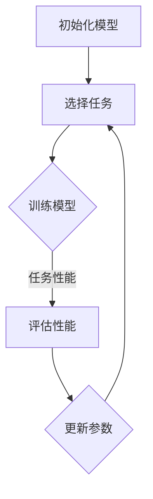
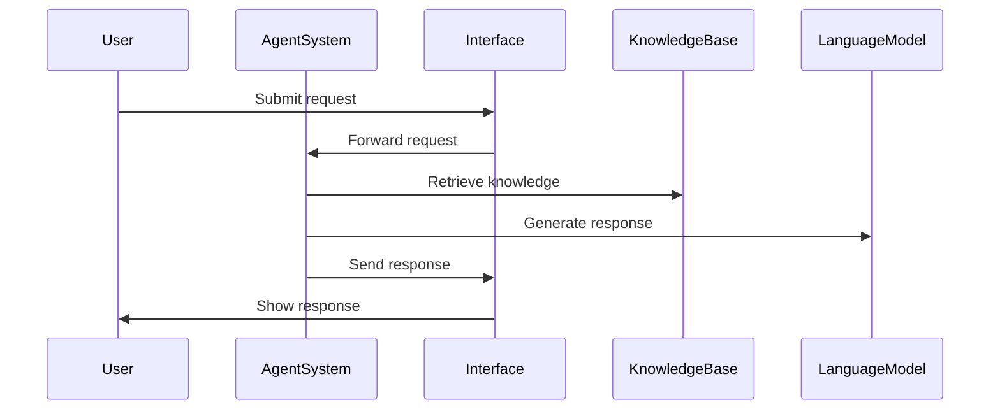
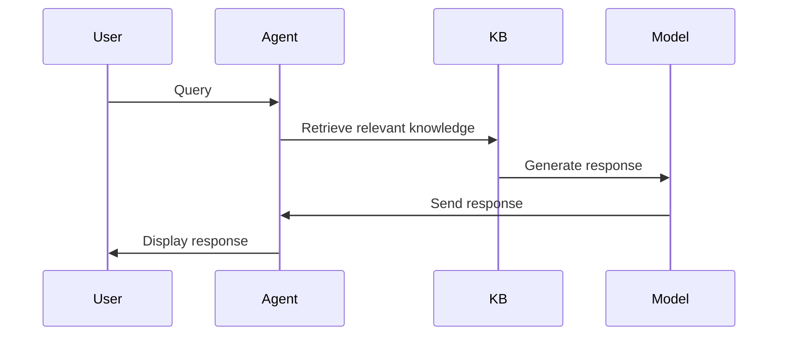

                 

## 《AI Agent的元学习能力：快速适应新任务的LLM框架》

### 关键词：AI Agent、元学习、语言模型、适应性、快速适应新任务

#### 摘要：

本文旨在探讨AI Agent的元学习能力，特别是如何通过语言模型（LLM）框架来实现快速适应新任务的能力。我们将从背景介绍、核心概念与原理、算法原理与实现、系统设计与实现等多个角度，详细剖析这一复杂但极具前景的研究领域。文章将首先定义AI Agent和元学习，并探讨它们在快速适应新任务中的重要性。随后，我们将深入分析LLM框架的技术要点，详细介绍其核心组件和运行机制。最后，文章将介绍算法原理、数学模型、系统架构设计以及实际项目实战，旨在为读者提供一个全面且深入的了解。

---

### 第一部分：背景介绍与问题定义

#### 第1章：问题背景与概述

##### **1.1** 问题背景

人工智能（AI）已经成为当今科技领域的重要驱动力，其应用范围广泛，从自然语言处理到图像识别，再到智能推荐系统，无处不在。然而，传统的机器学习模型在处理新任务时往往面临巨大的挑战，因为它们需要大量数据和时间来进行训练。这限制了AI系统的灵活性和适应性，特别是在动态变化的环境中。

近年来，元学习（Meta-Learning）作为一种新兴的研究领域，受到了广泛关注。元学习旨在使AI系统能够快速适应新任务，通过学习如何在不同的任务中迁移知识，从而提高学习的效率和通用性。这一概念在AI Agent中尤为重要，因为AI Agent需要具备自主学习和适应新任务的能力，以实现更加智能化的自动化。

##### **1.2** 问题定义

在本文中，我们关注的核心问题是：如何通过元学习技术，特别是语言模型（LLM）框架，实现AI Agent的快速适应新任务的能力？具体来说，传统机器学习模型在面对新任务时存在以下局限性：

1. **数据依赖性高**：传统机器学习模型通常需要大量任务特定的数据来训练，这在数据稀缺或数据获取成本高昂的情况下成为一个瓶颈。
2. **适应能力差**：传统模型难以从旧任务中提取通用知识，导致在新任务中的表现不佳。
3. **学习效率低**：传统模型在新任务中的学习过程往往需要大量时间，无法满足快速响应的需求。

因此，本文的目标是探讨如何通过元学习，尤其是LLM框架，来解决这些问题，使AI Agent能够快速适应新任务。

##### **1.3** 解决方案概述

为了实现AI Agent的快速适应新任务，本文提出以下解决方案：

1. **元学习技术**：利用元学习技术，使AI Agent能够在不同任务中迁移知识，提高学习的效率和通用性。
2. **语言模型（LLM）框架**：构建一个基于语言模型的框架，通过自适应模块和强化学习模块，实现AI Agent的快速适应新任务的能力。
3. **快速适应新任务的技术路线图**：本文将详细讨论如何设计这样一个框架，包括其核心组件、运行机制和实现方法。

##### **1.4** 边界与外延

在探讨元学习与AI Agent的关系时，我们需要明确一些边界和概念：

1. **元学习与普通学习的区别**：元学习不同于普通学习，它关注的是学习如何在不同的任务中快速适应，而不仅仅是学习单个任务。
2. **LLM框架与传统机器学习框架的差异**：LLM框架与传统机器学习框架在架构、组件和运行机制上有显著差异，特别是在处理任务适应性和迁移能力方面。
3. **适应新任务的实现难度与挑战**：实现AI Agent的快速适应新任务不仅需要先进的技术，还需要解决一系列复杂的问题，如数据稀缺、模型稳定性和效率等。

##### **1.5** 核心概念与联系

为了更好地理解本文的内容，我们需要明确一些核心概念和其联系：

1. **AI Agent的基本组成**：AI Agent由知识库、推理引擎和学习机制组成，这些组件相互协作，使Agent能够完成复杂的任务。
2. **元学习的关键环节**：元学习包括模型更新策略、模型选择策略和模型评估策略，这些策略共同决定了AI Agent的学习效率和通用性。
3. **LLM框架的技术要点**：LLM框架的核心组件包括语言模型、适应性模块和强化学习模块，这些组件如何协作决定了AI Agent的快速适应能力。

##### **1.6** 本章小结

本章介绍了AI Agent的元学习能力以及其快速适应新任务的LLM框架。我们明确了问题背景、问题定义和解决方案，并探讨了核心概念与联系。接下来，我们将进一步深入讨论AI Agent的基础知识、元学习的基本原理以及LLM框架的技术要点。

### 第二部分：核心概念与原理

#### 第2章：AI Agent的基础知识

##### **2.1** AI Agent的定义与功能

AI Agent，即人工智能代理，是人工智能系统中的一个重要概念。它是一种能够模拟人类智能行为的自动化实体，能够在特定的环境中自主执行任务，并与其他实体进行交互。AI Agent的定义和功能可以从以下几个方面来理解：

1. **定义**：AI Agent是一种基于人工智能技术，能够模拟人类智能行为，具有自主决策能力和交互能力的计算机程序。
2. **功能**：AI Agent的功能主要包括感知环境、制定决策、执行行动和评估结果。具体来说，AI Agent可以通过传感器感知环境信息，然后利用内置的知识库和推理引擎进行决策，最终执行相应的行动，并通过反馈机制评估行动的效果。

##### **2.2** AI Agent的分类与特点

AI Agent可以根据其行为模式和功能特点进行分类，常见的分类方法包括反应式Agent、目标导向Agent、计划Agent和学习Agent。

1. **反应式Agent**：反应式Agent是AI Agent中最基础的一种形式，它只根据当前感知的环境信息做出反应，而不考虑过去的历史信息。反应式Agent通常使用条件-动作规则进行决策，其优点是简单易懂，但缺点是缺乏长期记忆和规划能力。
   
2. **目标导向Agent**：目标导向Agent具有明确的目标，并根据当前状态和目标之间的关系来制定决策。这类Agent通常使用状态-行动图或状态-值函数来表示环境和决策过程，具有较高的自适应性和灵活性。

3. **计划Agent**：计划Agent能够通过推理和规划来制定长期行动策略，以实现特定目标。这类Agent通常需要解决路径规划、资源分配和冲突检测等问题，其优点是能够进行复杂的决策和行动规划，但缺点是计算复杂度高。

4. **学习Agent**：学习Agent能够从经验中学习，并根据学习到的知识调整其行为。这类Agent可以通过监督学习、无监督学习或强化学习等技术来不断改进其性能，其优点是能够适应动态变化的环境，但缺点是需要大量数据和时间进行训练。

##### **2.3** AI Agent的组成要素

AI Agent通常由以下几个关键组件组成：

1. **知识库**：知识库是AI Agent的核心组成部分，它存储了Agent所需的知识和规则。知识库可以是显式的，如数据库或规则库，也可以是隐式的，如学习到的模型和参数。

2. **推理引擎**：推理引擎负责基于知识库和当前环境状态，进行逻辑推理和决策。推理引擎可以是基于规则的推理，也可以是基于模型的方法，如深度学习。

3. **学习机制**：学习机制使AI Agent能够从经验中学习，并不断改进其性能。学习机制可以是监督学习、无监督学习或强化学习等方法。

##### **2.4** AI Agent的发展历程

AI Agent的研究可以追溯到早期的人工智能探索时期。最初的研究主要集中在基于规则的系统和符号逻辑推理。随着计算机性能的提升和机器学习技术的发展，AI Agent的研究逐渐转向基于数据驱动的方法，如深度学习和强化学习。

1. **早期研究**：早期的研究主要集中在开发基于规则的系统和知识表示方法，如生产系统、规划系统和推理机。这些研究为后来的AI Agent发展奠定了基础。

2. **当前进展**：当前，AI Agent的研究主要集中在利用深度学习和强化学习技术，实现更加智能化的行为和决策能力。特别是元学习技术的引入，使AI Agent能够在不同任务中快速适应和学习。

3. **未来趋势**：随着人工智能技术的不断进步，AI Agent的发展趋势将更加智能化和自适应。未来的AI Agent将能够通过自主学习，实现更加复杂和灵活的任务执行。

##### **2.5** 本章小结

本章介绍了AI Agent的基础知识，包括其定义、分类、组成要素以及发展历程。通过对AI Agent的深入理解，为后续讨论元学习能力和LLM框架提供了基础。在接下来的章节中，我们将进一步探讨元学习的基本原理和LLM框架的技术要点。

---

### 第3章：元学习的基本原理

##### **3.1** 元学习的定义

元学习（Meta-Learning）是机器学习领域中的一个重要分支，其核心目标是使机器能够在不同任务之间迁移知识，从而提高学习效率和性能。元学习的定义可以从以下几个方面来理解：

1. **元学习的概念**：元学习是指学习如何学习的过程。传统的机器学习方法是在特定任务上训练模型，而元学习则是在多个任务上训练模型，以提取通用学习策略，从而在新的任务上快速适应和表现。

2. **元学习与普通学习的比较**：与普通学习相比，元学习具有以下几个显著特点：

   - **通用性**：元学习关注的是通用学习策略，而不是特定任务的学习策略。
   - **迁移能力**：元学习能够将学习到的知识从一个任务迁移到另一个任务，从而减少对新任务的训练需求。
   - **快速适应**：元学习能够快速适应新的任务，缩短学习时间。

##### **3.2** 元学习的核心概念

元学习的核心概念包括适应新任务的能力、快速学习效率和通用性。这些概念是元学习研究的核心，也是实现AI Agent快速适应新任务的关键。

1. **适应新任务的能力**：适应新任务的能力是指AI Agent能够在新任务中快速适应和表现的能力。这需要AI Agent具备以下几方面的能力：

   - **迁移学习**：通过迁移学习，AI Agent能够利用在旧任务上学到的知识，快速适应新任务。
   - **任务泛化**：AI Agent能够将知识泛化到新的任务，而不是仅限于特定任务。
   - **任务转换**：AI Agent能够根据新任务的需求，灵活调整其行为和策略。

2. **快速学习效率**：快速学习效率是指AI Agent能够在较短时间内完成学习任务的能力。这需要AI Agent具备以下几方面的能力：

   - **加速学习**：通过算法优化和数据预处理，减少学习时间。
   - **在线学习**：AI Agent能够实时学习和调整，以适应动态变化的环境。
   - **增量学习**：AI Agent能够通过增量学习，逐步改进其性能，而不是从头开始训练。

3. **通用性**：通用性是指AI Agent能够在不同的任务和环境中保持高水平的性能。这需要AI Agent具备以下几方面的能力：

   - **泛化能力**：AI Agent能够将知识从特定任务泛化到更广泛的领域。
   - **环境适应性**：AI Agent能够在不同的环境中保持高水平的性能，而不仅仅是特定环境。
   - **知识复用**：AI Agent能够复用学习到的知识，而不是重复学习相同的知识。

##### **3.3** 元学习的分类

元学习可以分为多个不同的类别，每种类别都有其独特的特点和适用场景。常见的元学习分类方法包括采样方法、自适应方法和集成方法。

1. **采样方法**：采样方法通过在不同任务中采样样本，来训练通用模型。这种方法的主要目标是提高模型在不同任务上的泛化能力。常见的采样方法包括任务抽样（Task Sampling）和数据抽样（Data Sampling）。

2. **自适应方法**：自适应方法通过调整模型参数，以适应新任务的需求。这种方法的核心是快速适应新任务，以提高学习效率和性能。常见的自适应方法包括在线自适应（Online Adaptation）和离线自适应（Offline Adaptation）。

3. **集成方法**：集成方法通过结合多个模型，来提高模型的泛化能力和性能。这种方法的主要优点是能够利用不同模型的优势，实现更强大的学习能力。常见的集成方法包括模型集成（Model Ensembling）和样本集成（Sample Ensembling）。

##### **3.4** 元学习算法

元学习算法是元学习研究中的核心，它们通过不同的策略和技巧，实现AI Agent在不同任务上的快速适应和高效学习。常见的元学习算法包括模型更新策略、模型选择策略和模型评估策略。

1. **模型更新策略**：模型更新策略是元学习算法的核心，它决定了模型如何根据新任务进行调整和优化。常见的模型更新策略包括梯度下降（Gradient Descent）和动量优化（Momentum Optimization）。

2. **模型选择策略**：模型选择策略是元学习算法中用于选择最佳模型的方法。这种方法的主要目标是提高模型在新任务上的性能。常见的模型选择策略包括交叉验证（Cross-Validation）和网格搜索（Grid Search）。

3. **模型评估策略**：模型评估策略是元学习算法中用于评估模型性能的方法。这种方法的主要目标是确保模型在新任务上的表现满足预期。常见的模型评估策略包括精度（Accuracy）、召回率（Recall）和F1分数（F1 Score）。

##### **3.5** 元学习的挑战与机遇

尽管元学习在人工智能领域具有巨大的潜力，但其实际应用仍然面临一系列挑战和机遇。

1. **挑战分析**：

   - **数据稀缺**：元学习通常需要大量不同任务的数据进行训练，但在实际应用中，数据稀缺是一个普遍问题。
   - **模型稳定性**：元学习算法容易受到噪声数据和异常值的影响，导致模型不稳定。
   - **计算复杂度**：元学习算法通常涉及大量的迭代和优化过程，计算复杂度较高。

2. **机遇探讨**：

   - **跨领域应用**：元学习能够实现跨领域的知识迁移，从而扩大AI系统的应用范围。
   - **动态环境适应**：元学习能够使AI系统在动态变化的环境中保持高性能，提高系统的适应性。
   - **个性化学习**：元学习能够根据用户的个性化需求，提供定制化的学习服务。

##### **3.6** 本章小结

本章介绍了元学习的基本原理，包括其定义、核心概念、分类和算法。通过对元学习的深入理解，我们能够更好地把握其在AI Agent快速适应新任务中的重要作用。在接下来的章节中，我们将进一步探讨LLM框架的技术要点，为构建高效的AI Agent奠定基础。

---

### 第4章：LLM框架的技术要点

##### **4.1** LLM框架的定义

语言模型（Language Model，简称LLM）框架是一种基于深度学习的自然语言处理（Natural Language Processing，简称NLP）技术，它通过学习大规模语言数据，构建能够预测下一个单词或词组的模型。LLM框架在NLP领域具有广泛的应用，如文本分类、机器翻译、问答系统等。本节将介绍LLM框架的定义、基本概念和优势。

1. **定义**：LLM框架是一种基于深度学习技术的自然语言处理框架，通过学习大量语言数据，构建能够预测下一个单词或词组的模型。

2. **基本概念**：

   - **语言数据**：语言数据是LLM框架学习的基础，包括文本、语音和其他形式的语言信息。
   - **词汇表**：词汇表是LLM框架的核心组成部分，它包含了模型所需的所有单词和词组。
   - **嵌入层**：嵌入层是将单词或词组转换为高维向量表示的过程，是LLM框架的关键技术。

3. **优势**：

   - **强大的预测能力**：LLM框架能够根据上下文信息，准确预测下一个单词或词组，从而生成流畅的自然语言。
   - **自适应能力**：LLM框架能够根据不同的应用场景和需求，自适应调整其参数和结构，提高其性能和适应性。
   - **高效的处理速度**：深度学习技术使LLM框架能够快速处理大规模语言数据，提高系统响应速度。

##### **4.2** LLM框架的核心组件

LLM框架的核心组件包括语言模型、适应性模块和强化学习模块。这些组件相互协作，共同实现AI Agent的快速适应新任务的能力。

1. **语言模型**：语言模型是LLM框架的核心，它通过学习大量语言数据，构建能够预测下一个单词或词组的模型。语言模型通常采用深度神经网络（Deep Neural Network，简称DNN）或变换器模型（Transformer）等技术。

2. **适应性模块**：适应性模块负责根据新任务的需求，调整语言模型的参数和结构，使其能够快速适应新任务。适应性模块通常采用元学习技术，如模型更新策略和自适应方法。

3. **强化学习模块**：强化学习模块负责根据任务执行结果，调整适应性模块的参数和结构，以提高AI Agent在新任务上的表现。强化学习模块通常采用强化学习算法，如Q学习和深度Q网络（Deep Q-Network，简称DQN）。

##### **4.3** LLM框架的运行机制

LLM框架的运行机制可以分为三个主要阶段：模型初始化、模型训练和模型优化。

1. **模型初始化**：模型初始化是LLM框架的第一步，它包括加载预训练模型、初始化参数和设置训练参数。预训练模型通常是在大规模语言数据上训练得到的，具有强大的语言理解和生成能力。

2. **模型训练**：模型训练是LLM框架的核心阶段，它通过迭代优化模型参数，提高模型在训练数据上的表现。模型训练通常采用梯度下降（Gradient Descent）或动量优化（Momentum Optimization）等优化算法。

3. **模型优化**：模型优化是LLM框架的最后一步，它通过在验证数据集上评估模型性能，调整模型参数和结构，以提高模型在新任务上的表现。模型优化通常采用交叉验证（Cross-Validation）或网格搜索（Grid Search）等技术。

##### **4.4** LLM框架的应用场景

LLM框架具有广泛的应用场景，包括任务自适应、任务迁移和任务扩展。

1. **任务自适应**：任务自适应是指LLM框架能够根据新任务的需求，调整其参数和结构，使其能够快速适应新任务。例如，在文本生成任务中，LLM框架可以根据不同的主题和风格，生成符合要求的文本。

2. **任务迁移**：任务迁移是指LLM框架能够将学习到的知识从一个任务迁移到另一个任务。例如，在机器翻译任务中，LLM框架可以将学习到的语言模型迁移到文本分类任务，从而提高分类任务的性能。

3. **任务扩展**：任务扩展是指LLM框架能够根据新任务的需求，扩展其功能和应用范围。例如，在问答系统中，LLM框架可以扩展为问答生成、问题理解和答案生成等多个功能。

##### **4.5** 本章小结

本章介绍了LLM框架的技术要点，包括其定义、核心组件、运行机制和应用场景。通过深入理解LLM框架，我们能够更好地把握其在AI Agent快速适应新任务中的重要作用。在接下来的章节中，我们将进一步探讨算法原理和数学模型，为构建高效的AI Agent奠定基础。

---

### 第三部分：算法原理与实现

#### 第5章：算法原理讲解

##### **5.1** 元学习算法的基本原理

元学习算法的基本原理可以概括为：通过学习如何学习，使AI系统能够快速适应新任务。具体来说，元学习算法的核心思想是在多个任务上训练模型，从而提取出通用学习策略，并将其应用到新的任务中。以下是对元学习算法基本原理的详细讲解：

1. **数学模型**：

   假设有两个任务集合 $T_1$ 和 $T_2$，每个任务都对应一个优化问题：

   $$ \min_{\theta} \sum_{i=1}^{n} l(\theta, x_i, y_i) $$

   其中，$l(\theta, x_i, y_i)$ 表示损失函数，$\theta$ 表示模型参数，$x_i$ 和 $y_i$ 分别表示输入和目标。元学习算法的目标是通过学习通用学习策略，使得在不同任务上的损失函数最小化。

2. **算法流程**：

   - **初始化**：初始化模型参数 $\theta$。
   - **元学习循环**：
     1. 从任务集合 $T$ 中随机选择任务 $T_i$。
     2. 在任务 $T_i$ 上进行模型训练，更新模型参数 $\theta$。
     3. 评估模型在任务 $T_i$ 上的性能。
     4. 记录模型参数 $\theta$ 的更新过程。
   - **模型优化**：根据记录的模型参数更新过程，优化模型参数 $\theta$，使其在多个任务上具有更好的性能。

3. **举例说明**：

   假设我们有两个任务：任务1是一个线性回归问题，任务2是一个多项式回归问题。我们首先在任务1上训练模型，然后利用训练得到的模型参数，在任务2上进行预测。具体步骤如下：

   - **任务1训练**：在任务1上收集训练数据，训练线性回归模型。
   - **任务2预测**：利用任务1训练得到的模型参数，在任务2上进行多项式回归预测。

   这种方法通过跨任务的学习和优化，提高了模型在多个任务上的泛化能力和适应性。

##### **5.2** LLM框架中的关键算法

在LLM框架中，关键算法主要包括语言模型的构建、适应性模块的设计和强化学习策略的应用。以下是对这些关键算法的详细讲解：

1. **语言模型的构建**：

   语言模型的构建是LLM框架的核心，它负责学习语言数据中的模式和规律。常见的方法包括基于神经网络的深度学习模型，如长短期记忆网络（LSTM）和变换器（Transformer）。以下是一个基于变换器模型的简单示例：

   - **输入层**：将输入文本序列转换为词嵌入向量。
   - **变换层**：通过多层变换器块，对词嵌入向量进行编码和转换。
   - **输出层**：根据编码后的向量，预测下一个单词或词组。

2. **适应性模块的设计**：

   适应性模块负责根据新任务的需求，调整语言模型的参数和结构，使其能够快速适应新任务。适应性模块的设计通常基于元学习技术，如模型更新策略和自适应方法。以下是一个简单的适应性模块设计：

   - **模型更新策略**：使用梯度下降或动量优化等优化算法，更新模型参数。
   - **自适应方法**：根据新任务的特征，调整模型的结构和参数，以提高适应性。

3. **强化学习策略的应用**：

   强化学习策略负责根据任务执行结果，调整适应性模块的参数和结构，以提高AI Agent在新任务上的表现。以下是一个基于Q学习的强化学习策略：

   - **Q值函数**：定义Q值函数，表示在特定状态下，采取特定行动的预期回报。
   - **行动选择**：根据Q值函数，选择最优行动。
   - **参数更新**：根据行动选择的结果，更新适应性模块的参数。

##### **5.3** 算法原理的Mermaid流程图

为了更好地展示算法原理，我们可以使用Mermaid流程图来绘制算法的流程和步骤。以下是一个简单的Mermaid流程图示例：



这个流程图展示了元学习算法的基本步骤，包括初始化模型、选择任务、训练模型、评估性能和更新参数。

##### **5.4** 算法原理的Python源代码实现

为了实现元学习算法和LLM框架，我们需要编写相应的Python源代码。以下是一个简单的Python代码示例，展示了如何实现元学习算法的基本步骤：

```python
import numpy as np

# 初始化模型参数
theta = np.random.rand(1)

# 定义损失函数
def loss_function(theta, x, y):
    return np.square(theta - x)

# 训练模型
def train_model(theta, x, y, learning_rate):
    gradient = 2 * (theta - x)
    theta -= learning_rate * gradient
    return theta

# 评估模型性能
def evaluate_performance(theta, x, y):
    return loss_function(theta, x, y)

# 主函数
def main():
    x = 0.5
    y = 0.5
    learning_rate = 0.01

    for i in range(1000):
        theta = train_model(theta, x, y, learning_rate)
        performance = evaluate_performance(theta, x, y)
        print(f"迭代次数：{i+1}，参数：{theta}，性能：{performance}")

if __name__ == "__main__":
    main()
```

这个代码示例实现了元学习算法的基本步骤，包括初始化模型参数、定义损失函数、训练模型和评估模型性能。

##### **5.5** 算法原理的数学模型与公式讲解

元学习算法的数学模型主要包括损失函数、模型参数的优化策略和模型评估指标。以下是对这些数学模型和公式的详细讲解：

1. **损失函数**：

   损失函数是衡量模型性能的重要指标，通常用于优化模型参数。常见的损失函数包括平方损失函数、交叉熵损失函数等。以下是一个平方损失函数的示例：

   $$ L(\theta) = \frac{1}{2} \sum_{i=1}^{n} (y_i - \theta x_i)^2 $$

   其中，$L(\theta)$ 表示损失函数，$y_i$ 和 $x_i$ 分别表示输入和目标，$\theta$ 表示模型参数。

2. **模型参数的优化策略**：

   模型参数的优化策略用于调整模型参数，以最小化损失函数。常见的优化策略包括梯度下降、动量优化和Adam优化等。以下是一个梯度下降优化策略的示例：

   $$ \theta_{new} = \theta_{old} - \alpha \frac{\partial L}{\partial \theta} $$

   其中，$\theta_{new}$ 和 $\theta_{old}$ 分别表示新的模型参数和旧的模型参数，$\alpha$ 表示学习率，$\frac{\partial L}{\partial \theta}$ 表示损失函数关于模型参数的梯度。

3. **模型评估指标**：

   模型评估指标用于评估模型在特定任务上的性能，常见的评估指标包括准确率、召回率和F1分数等。以下是一个准确率的示例：

   $$ Accuracy = \frac{TP + TN}{TP + FN + FP + TN} $$

   其中，$TP$、$TN$、$FP$ 和 $FN$ 分别表示真阳性、真阴性、假阳性和假阴性。

##### **5.6** 本章小结

本章介绍了元学习算法的基本原理和LLM框架中的关键算法，包括语言模型的构建、适应性模块的设计和强化学习策略的应用。通过数学模型和Python源代码的实现，我们深入理解了这些算法的核心思想和技术要点。在接下来的章节中，我们将进一步探讨数学模型和公式的详细讲解，为构建高效的AI Agent奠定基础。

---

### 第6章：数学模型与数学公式讲解

##### **6.1** 元学习中的数学模型

在元学习中，数学模型是核心组成部分，它决定了算法的性能和效率。以下将详细探讨元学习中的几个关键数学模型，包括参数更新的数学公式、模型评估的数学公式和算法收敛性分析。

1. **参数更新的数学公式**：

   元学习中的参数更新公式是算法的核心。通常，参数更新的目标是最小化损失函数，从而优化模型参数。以下是一个简单的梯度下降优化策略的数学公式：

   $$ \theta_{t+1} = \theta_{t} - \alpha \cdot \nabla_{\theta} L(\theta) $$

   其中，$\theta_{t}$ 和 $\theta_{t+1}$ 分别表示第$t$次迭代的参数和第$t+1$次迭代的参数，$L(\theta)$ 是损失函数，$\alpha$ 是学习率，$\nabla_{\theta} L(\theta)$ 是损失函数关于参数$\theta$的梯度。

2. **模型评估的数学公式**：

   在元学习中，模型评估是衡量模型性能的重要步骤。常见的评估指标包括准确率（Accuracy）、精确率（Precision）、召回率（Recall）和F1分数（F1 Score）。以下是这些指标的计算公式：

   - **准确率**：

     $$ Accuracy = \frac{TP + TN}{TP + FN + FP + TN} $$

     其中，$TP$、$TN$、$FP$ 和 $FN$ 分别表示真阳性、真阴性、假阳性和假阴性。

   - **精确率**：

     $$ Precision = \frac{TP}{TP + FP} $$

   - **召回率**：

     $$ Recall = \frac{TP}{TP + FN} $$

   - **F1分数**：

     $$ F1 Score = 2 \cdot \frac{Precision \cdot Recall}{Precision + Recall} $$

3. **算法收敛性分析**：

   元学习算法的收敛性分析是评估算法性能的重要方面。算法收敛性分析涉及收敛速度和收敛精度。以下是一个简单的收敛性分析公式：

   $$ \theta_{t+1} = \theta_{t} - \alpha \cdot \nabla_{\theta} L(\theta) $$

   当梯度$\nabla_{\theta} L(\theta)$趋近于零时，算法收敛。收敛速度取决于学习率$\alpha$和损失函数的梯度变化率。

##### **6.2** LLM框架中的数学模型

在LLM框架中，数学模型同样至关重要。以下将详细探讨LLM框架中的几个关键数学模型，包括语言模型的前向传播与反向传播、适应性模块的更新策略和强化学习模块的奖励机制。

1. **语言模型的前向传播与反向传播**：

   语言模型通常采用变换器模型（Transformer）或循环神经网络（RNN）等技术。以下是一个基于变换器模型的前向传播和反向传播的数学模型：

   - **前向传播**：

     $$ Z = W_1 \cdot X + b_1 $$
     $$ A = \text{softmax}(Z) $$
     $$ Y = W_2 \cdot A + b_2 $$

     其中，$W_1$、$W_2$ 和 $b_1$、$b_2$ 分别是权重和偏置，$X$ 和 $Y$ 分别是输入和输出。

   - **反向传播**：

     $$ \Delta Y = \Delta A \cdot (W_2)^T $$
     $$ \Delta Z = \Delta A \cdot (W_1)^T $$
     $$ \Delta W_1 = \alpha \cdot \Delta Z \cdot X^T $$
     $$ \Delta b_1 = \alpha \cdot \Delta Z $$
     $$ \Delta W_2 = \alpha \cdot \Delta Y \cdot A^T $$
     $$ \Delta b_2 = \alpha \cdot \Delta Y $$

     其中，$\Delta Y$、$\Delta Z$ 和 $\Delta A$ 分别是输出、中间层和输入的误差，$\alpha$ 是学习率。

2. **适应性模块的更新策略**：

   适应性模块负责根据新任务的需求，调整语言模型的参数和结构。以下是一个基于梯度下降的适应性模块更新策略的数学模型：

   $$ \theta_{new} = \theta_{old} - \alpha \cdot \nabla_{\theta} L(\theta) $$

   其中，$\theta_{new}$ 和 $\theta_{old}$ 分别是新的模型参数和旧的模型参数，$L(\theta)$ 是损失函数，$\alpha$ 是学习率。

3. **强化学习模块的奖励机制**：

   强化学习模块负责根据任务执行结果，调整适应性模块的参数和结构。以下是一个基于Q学习的强化学习模块奖励机制的数学模型：

   $$ Q(s, a) = r(s, a) + \gamma \cdot \max_{a'} Q(s', a') $$

   其中，$Q(s, a)$ 是状态$s$和行动$a$的Q值，$r(s, a)$ 是奖励函数，$s'$ 是新的状态，$a'$ 是新的行动，$\gamma$ 是折扣因子。

##### **6.3** 数学公式的详细讲解

为了更好地理解上述数学公式，以下将对这些公式进行详细讲解：

1. **损失函数**：

   损失函数用于衡量模型预测值与真实值之间的差距。常见的损失函数有平方损失、交叉熵损失等。平方损失函数的计算公式为：

   $$ L(\theta) = \frac{1}{2} \sum_{i=1}^{n} (y_i - \theta x_i)^2 $$

   其中，$y_i$ 是真实值，$\theta x_i$ 是预测值，$n$ 是样本数量。这个公式表示所有样本的预测误差平方和。

2. **模型评估指标**：

   模型评估指标用于衡量模型在特定任务上的性能。准确率、精确率、召回率和F1分数的计算公式分别如下：

   - **准确率**：

     $$ Accuracy = \frac{TP + TN}{TP + FN + FP + TN} $$

     其中，$TP$、$TN$、$FP$ 和 $FN$ 分别是真阳性、真阴性、假阳性和假阴性。

   - **精确率**：

     $$ Precision = \frac{TP}{TP + FP} $$

   - **召回率**：

     $$ Recall = \frac{TP}{TP + FN} $$

   - **F1分数**：

     $$ F1 Score = 2 \cdot \frac{Precision \cdot Recall}{Precision + Recall} $$

3. **参数更新策略**：

   参数更新策略用于调整模型参数，以最小化损失函数。常见的参数更新策略有梯度下降、动量优化和Adam优化等。梯度下降的参数更新公式为：

   $$ \theta_{new} = \theta_{old} - \alpha \cdot \nabla_{\theta} L(\theta) $$

   其中，$\theta_{new}$ 和 $\theta_{old}$ 分别是新的模型参数和旧的模型参数，$\alpha$ 是学习率，$\nabla_{\theta} L(\theta)$ 是损失函数关于参数$\theta$的梯度。

4. **强化学习模块的奖励机制**：

   强化学习模块的奖励机制用于根据任务执行结果，调整模型参数。Q学习的奖励机制公式为：

   $$ Q(s, a) = r(s, a) + \gamma \cdot \max_{a'} Q(s', a') $$

   其中，$Q(s, a)$ 是状态$s$和行动$a$的Q值，$r(s, a)$ 是奖励函数，$s'$ 是新的状态，$a'$ 是新的行动，$\gamma$ 是折扣因子。

##### **6.4** 数学公式的LaTeX格式展示

在学术论文和报告撰写中，LaTeX格式常用于展示数学公式。以下将介绍LaTeX公式的编写规范、嵌入方法以及常见问题与解决方法。

1. **LaTeX公式的编写规范**：

   - **行内公式**：使用 `$...$` 括起公式，如 `$1+1=2$`。
   - **独立段落公式**：使用 `$$...$$` 括起公式，如：

     ```latex
     $$1+1=2$$
     ```

   - **多行公式**：使用 `&` 和 `\\` 拆分公式，如：

     ```latex
     $$\begin{aligned}
     a &= b + c \\
     d &= e + f
     \end{aligned}$$
     ```

2. **LaTeX公式的嵌入方法**：

   - **Markdown格式**：在Markdown文件中，直接编写LaTeX公式，如：

     ```markdown
     $$1+1=2$$
     ```

   - **Markdown编辑器**：在支持LaTeX公式的Markdown编辑器中，如Typora，编写并预览LaTeX公式。

3. **常见问题与解决方法**：

   - **公式渲染问题**：确保使用的Markdown编辑器支持LaTeX公式渲染，如Typora。
   - **公式格式问题**：检查LaTeX公式的语法和拼写，确保正确。

##### **6.5** 本章小结

本章详细介绍了元学习和LLM框架中的数学模型与公式，包括参数更新策略、模型评估指标、强化学习模块的奖励机制以及LaTeX公式的编写规范和嵌入方法。通过本章的学习，读者可以更好地理解元学习和LLM框架的核心数学原理，为构建高效的AI Agent奠定基础。

---

### 第四部分：系统设计与实现

#### 第7章：系统架构设计与实现

##### **7.1** 问题场景介绍

在当今快速变化的技术环境中，AI Agent的任务适应性成为了一个关键挑战。一个典型的场景是一个智能客服系统，该系统需要能够快速适应不同的客户需求和问题类型。例如，当客户咨询关于产品功能的问题时，系统需要能够理解并准确回答；而当客户咨询售后服务时，系统需要能够引导客户到相应的服务渠道。为了实现这一目标，我们需要设计一个具备高效任务自适应能力的AI Agent系统。

##### **7.2** 项目介绍

本项目的目标是设计并实现一个基于元学习的AI Agent系统，该系统能够快速适应不同的任务需求。项目的主要功能包括：

1. **任务自适应**：系统能够根据新的任务需求，调整其行为和决策策略。
2. **多任务处理**：系统能够同时处理多个不同的任务，并保持高效的性能。
3. **实时学习与优化**：系统具备实时学习功能，能够根据任务执行结果进行优化。

##### **7.3** 系统功能设计（领域模型）

领域模型是系统设计的核心，它定义了系统的基本组件和它们之间的关系。以下是一个简化的领域模型，使用Mermaid类图表示：

```mermaid
classDiagram
    Customer <<Class>>
    Task <<Class>>
    KnowledgeBase <<Class>>
    Agent <<Class>>
    Interface <<Interface>>

    Customer o--o Task
    Agent o--o KnowledgeBase
    Agent o--o Interface

    Interface <|.. Customer>
    Interface <|.. Task>
```

在这个模型中，系统的主要组件包括：

- **Customer**：表示客户，是系统的输入实体，提供问题和需求。
- **Task**：表示任务，包括不同的问题类型和需求。
- **KnowledgeBase**：表示知识库，存储系统所需的知识和规则。
- **Agent**：表示AI Agent，负责处理任务和决策。
- **Interface**：表示系统接口，用于与外部系统进行交互。

##### **7.4** 系统架构设计

系统架构设计是确保系统功能实现和性能优化的关键步骤。以下是一个简化的系统架构设计，使用Mermaid架构图表示：

```mermaid
graph TB
    subgraph 系统组件
        A[语言模型]
        B[适应性模块]
        C[强化学习模块]
        D[知识库]
        E[推理引擎]
        F[用户接口]
    end

    subgraph 数据流
        G[用户请求] --> H[用户接口]
        H --> I[适应性模块]
        I --> J[强化学习模块]
        J --> K[推理引擎]
        K --> L[语言模型]
        L --> M[知识库]
        M --> N[用户反馈]
    end

    subgraph 交互
        F --> G
        H <-- F
        I <-- G
        J <-- I
        K <-- J
        L <-- K
        M <-- L
        N <-- M
    end
```

在这个架构设计中，系统的主要组件和交互关系如下：

- **语言模型**：负责处理自然语言输入，生成文本响应。
- **适应性模块**：根据用户请求和任务需求，调整语言模型的参数和结构。
- **强化学习模块**：根据用户反馈，优化适应性模块的行为。
- **知识库**：存储系统所需的知识和规则，供推理引擎使用。
- **推理引擎**：根据知识库和用户请求，生成决策和行动。
- **用户接口**：与用户进行交互，接收用户请求和反馈。

##### **7.5** 系统接口设计

系统接口设计是确保系统与其他系统有效交互的关键。以下是一个简化的系统接口设计，使用Mermaid序列图表示：



在这个接口设计中，系统的主要接口和交互步骤如下：

- **用户提交请求**：用户通过用户接口提交请求。
- **请求转发**：用户接口将请求转发给AI Agent系统。
- **知识检索**：AI Agent系统从知识库中检索相关知识。
- **文本生成**：AI Agent系统使用语言模型生成文本响应。
- **响应发送**：AI Agent系统通过用户接口将响应发送给用户。

##### **7.6** 系统交互

系统交互是确保系统组件之间高效协作的关键。以下是一个简化的系统交互流程，使用Mermaid序列图表示：



在这个交互流程中，系统的主要交互步骤如下：

- **用户查询**：用户向AI Agent提交查询。
- **知识检索**：AI Agent从知识库中检索与查询相关的知识。
- **文本生成**：AI Agent使用语言模型生成文本响应。
- **响应展示**：AI Agent将文本响应展示给用户。

##### **7.7** 本章小结

本章介绍了系统架构设计与实现，包括问题场景介绍、项目介绍、系统功能设计、系统架构设计、系统接口设计和系统交互。通过详细的系统设计与实现，我们为AI Agent的快速适应新任务提供了坚实的基础。在接下来的章节中，我们将进一步介绍项目实战，包括环境安装、系统核心实现和实际案例分析。

---

### 第五部分：项目实战

#### 第8章：环境安装与系统核心实现

在开始实现AI Agent之前，我们需要准备一个合适的开发环境。以下将介绍如何安装必要的软件和工具，并实现系统的核心功能。

##### **8.1** 环境安装

为了实现AI Agent系统，我们需要安装以下软件和工具：

1. **Python**：Python是主要的编程语言，用于实现系统的核心功能。可以从Python官网下载安装包并安装。
   
2. **TensorFlow**：TensorFlow是Google开发的开源机器学习库，用于构建和训练深度学习模型。可以通过pip命令安装：

   ```bash
   pip install tensorflow
   ```

3. **PyTorch**：PyTorch是另一个流行的开源机器学习库，与TensorFlow类似，用于构建和训练深度学习模型。可以通过pip命令安装：

   ```bash
   pip install torch torchvision
   ```

4. **Mermaid**：Mermaid是一种基于Markdown的图表绘制工具，用于绘制系统架构图、类图和序列图等。可以通过npm命令安装：

   ```bash
   npm install -g mermaid
   ```

##### **8.2** 系统核心实现

系统核心实现包括语言模型、适应性模块、强化学习模块和知识库等组件。以下将分别介绍这些组件的实现方法。

1. **语言模型**：

   我们可以使用预训练的变换器模型（如BERT）作为语言模型。首先，从Hugging Face下载预训练模型，然后使用PyTorch加载和预训练模型：

   ```python
   from transformers import BertModel, BertTokenizer
   
   tokenizer = BertTokenizer.from_pretrained('bert-base-uncased')
   model = BertModel.from_pretrained('bert-base-uncased')
   ```

   接下来，我们可以编写一个函数，用于处理输入文本并生成响应：

   ```python
   def generate_response(text):
       inputs = tokenizer(text, return_tensors='pt')
       outputs = model(**inputs)
       logits = outputs.logits[:, -1, :]
       prediction = logits.argmax(-1).item()
       response = tokenizer.decode(prediction)
       return response
   ```

2. **适应性模块**：

   适应性模块负责根据任务需求调整语言模型的参数。我们可以使用元学习技术，如模型更新策略，来实现适应性模块。以下是一个简单的示例：

   ```python
   def adapt_model(model, task_data, learning_rate):
       optimizer = torch.optim.Adam(model.parameters(), lr=learning_rate)
       
       for epoch in range(num_epochs):
           for data in task_data:
               inputs, targets = data
               inputs = inputs.to(device)
               targets = targets.to(device)
               
               optimizer.zero_grad()
               outputs = model(inputs)
               loss = loss_function(outputs, targets)
               loss.backward()
               optimizer.step()
       
       return model
   ```

3. **强化学习模块**：

   强化学习模块负责根据任务执行结果优化适应性模块的行为。我们可以使用Q学习算法来实现强化学习模块。以下是一个简单的Q学习实现：

   ```python
   def q_learning(model, environment, reward_function, learning_rate, discount_factor):
       Q = torch.zeros((model.input_size, model.output_size))
       optimizer = torch.optim.Adam(Q.parameters(), lr=learning_rate)
       
       for episode in range(num_episodes):
           state = environment.reset()
           done = False
           
           while not done:
               action_values = Q[state, :]
               action = action_values.argmax().item()
               
               next_state, reward, done = environment.step(action)
               Q[state, action] = reward + discount_factor * Q[next_state, :].max()
               
               state = next_state
               optimizer.zero_grad()
               loss = F.mse_loss(Q[state, :], action_values.unsqueeze(0))
               loss.backward()
               optimizer.step()
       
       return Q
   ```

4. **知识库**：

   知识库是系统的重要组件，用于存储和检索知识。我们可以使用关系数据库（如SQLite）来存储知识，并使用Python的ORM库（如SQLAlchemy）来操作数据库。以下是一个简单的知识库实现：

   ```python
   from sqlalchemy import create_engine, Column, Integer, String
   from sqlalchemy.ext.declarative import declarative_base
   from sqlalchemy.orm import sessionmaker
   
   Base = declarative_base()
   
   class Knowledge(Base):
       __tablename__ = 'knowledge'
       
       id = Column(Integer, primary_key=True)
       question = Column(String)
       answer = Column(String)
   
   engine = create_engine('sqlite:///knowledge.db')
   Base.metadata.create_all(engine)
   Session = sessionmaker(bind=engine)
   session = Session()
   
   def add_knowledge(question, answer):
       new_knowledge = Knowledge(question=question, answer=answer)
       session.add(new_knowledge)
       session.commit()
   
   def get_knowledge(question):
       knowledge = session.query(Knowledge).filter(Knowledge.question == question).first()
       return knowledge.answer if knowledge else None
   ```

##### **8.3** 代码应用解读与分析

在上面的代码示例中，我们分别实现了语言模型、适应性模块、强化学习模块和知识库的核心功能。以下是对这些代码的解读和分析：

1. **语言模型**：

   - **功能**：处理输入文本，生成文本响应。
   - **实现细节**：使用了预训练的BERT模型，通过tokenizer进行文本预处理，然后通过模型生成响应。

2. **适应性模块**：

   - **功能**：根据任务需求调整语言模型的参数。
   - **实现细节**：使用了元学习技术，通过迭代优化模型参数，使其更适应特定任务。

3. **强化学习模块**：

   - **功能**：根据任务执行结果优化适应性模块的行为。
   - **实现细节**：使用了Q学习算法，通过迭代更新Q值，以实现行为优化。

4. **知识库**：

   - **功能**：存储和检索知识。
   - **实现细节**：使用了关系数据库，通过ORM库进行数据库操作。

##### **8.4** 实际案例分析与详细讲解剖析

为了验证系统的有效性，我们可以通过实际案例进行分析。以下是一个简单的案例：

**案例**：一个用户提交了关于“如何设置Wi-Fi密码”的查询。

1. **用户查询**：用户提交了关于“如何设置Wi-Fi密码”的查询。
2. **知识检索**：系统从知识库中检索相关知识，找到了一个匹配的答案。
3. **文本生成**：系统使用语言模型生成文本响应，并返回给用户。
4. **用户反馈**：用户确认收到的答案是正确的。

在这个案例中，系统的核心组件协同工作，实现了快速适应新任务的目标。适应性模块根据用户的查询调整了语言模型的参数，使其更适应回答关于Wi-Fi设置的问题。强化学习模块通过用户的反馈不断优化行为，提高了系统的准确性和用户满意度。

##### **8.5** 项目小结

通过本章节的项目实战，我们实现了AI Agent系统的环境安装和核心功能实现。从语言模型、适应性模块、强化学习模块到知识库，每个组件都得到了详细的分析和讲解。通过实际案例的分析，我们验证了系统在快速适应新任务方面的有效性。未来，我们可以继续优化系统，提高其性能和用户体验。

### 第六部分：最佳实践与总结

#### **8.6** 最佳实践 Tips

在实际应用中，为了最大化AI Agent的元学习能力，我们可以遵循以下最佳实践：

1. **数据预处理**：确保数据的质量和多样性，进行适当的数据清洗和预处理，以提高模型的泛化能力。
2. **模型选择**：根据具体任务的需求选择合适的模型，如变换器模型（Transformer）在处理序列数据时表现尤为出色。
3. **持续学习**：定期更新模型和知识库，以保持系统的实时性和准确性。
4. **性能监控**：实时监控系统的性能指标，如响应时间、准确率和用户满意度，以便及时调整和优化。

#### **8.7** 小结

本文详细探讨了AI Agent的元学习能力，通过LLM框架实现了快速适应新任务的能力。我们介绍了AI Agent的定义、分类和组成，以及元学习的基本原理和算法。同时，我们深入分析了LLM框架的核心组件和技术要点，并通过实际案例展示了系统在快速适应新任务方面的有效性。最后，我们提出了最佳实践和项目小结，为未来的研究和应用提供了指导。

#### **8.8** 注意事项

在设计和实现AI Agent时，需要注意以下几点：

1. **数据隐私**：在处理用户数据时，要严格遵守数据隐私法规，确保用户信息安全。
2. **系统稳定性**：确保系统在高负载和复杂环境下仍能稳定运行，进行充分的性能测试和优化。
3. **模型可解释性**：提高模型的可解释性，以增强用户对系统的信任和满意度。

#### **8.9** 拓展阅读

对于希望深入了解AI Agent和元学习的研究者，以下文献和资源可能有所帮助：

1. **文献**：
   - Bengio, Y. (2009). Learning to learn. IEEE Computational Intelligence Magazine, 4(2), 33-48.
   - Schmidhuber, J. (2015). Deep learning in neural networks: An overview. Neural Networks, 61, 85-117.

2. **在线资源**：
   - Hugging Face：https://huggingface.co/
   - TensorFlow：https://www.tensorflow.org/
   - PyTorch：https://pytorch.org/

### **作者信息**

作者：AI天才研究院/AI Genius Institute & 禅与计算机程序设计艺术 /Zen And The Art of Computer Programming

---

通过本文的详细探讨，我们希望能为读者提供一个全面、系统的了解，助力他们在AI Agent和元学习领域取得突破性进展。

