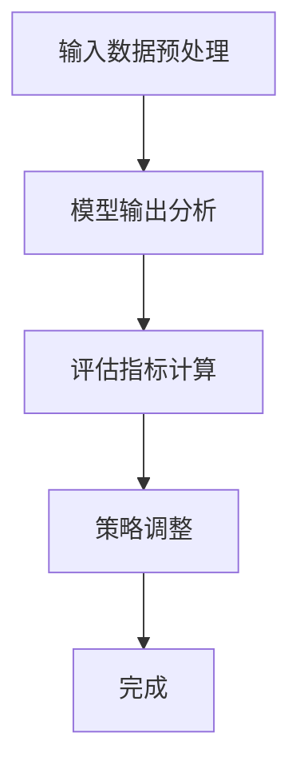

                 

### 第1章：AI Agent的元认知能力简介

**1.1 元认知能力的重要性**

随着人工智能技术的发展，人工智能代理（AI Agent）在各个领域得到了广泛应用。这些代理不仅能够执行特定任务，还能够自我学习和优化其行为。然而，为了实现更加智能化和自适应的AI系统，我们需要赋予它们一种特殊的认知能力——元认知能力。

元认知能力是指个体对自身认知过程的理解、监控和调节的能力。这种能力在人类中早已被广泛研究，并被认为是学习、思考和创新的关键。在AI领域，元认知能力同样重要，因为它们能够帮助AI Agent更好地理解和调整其行为，提高其性能和适应性。

**1.1.1 元认知能力的背景**

在人类认知科学中，元认知能力被认为是一个关键的认知能力，它包括了对自身认知过程的认知、监控和调节。具体来说，元认知能力包括以下几个方面：

- **自我监测**：对自身思维和情感状态的监测，了解自己在学习或思考过程中的状态。
- **自我评估**：对自身认知过程和结果的评估，识别成功或失败的原因。
- **自我调节**：根据自我评估的结果，调整自己的认知策略和行为。

在AI领域，元认知能力的研究可以追溯到20世纪80年代，当时人工智能学者们开始探索如何让AI系统具备自我理解和自我调节的能力。随着深度学习和自然语言处理技术的进步，AI Agent的元认知能力得到了进一步的发展。

**1.1.2 元认知能力在AI Agent中的应用**

AI Agent的元认知能力主要应用于以下几个方面：

1. **自我学习与优化**：AI Agent通过元认知能力能够识别自身在执行任务时的不足，并调整其学习策略，从而提高任务完成效率。

2. **错误检测与纠正**：AI Agent能够通过元认知能力监测自身的执行过程，一旦发现错误，能够立即采取措施进行纠正。

3. **任务理解与适应性调整**：AI Agent能够通过元认知能力理解任务的复杂性和要求，并根据任务的变化调整其行为。

4. **知识迁移与泛化**：AI Agent能够通过元认知能力将一个领域的知识迁移到另一个领域，从而实现知识的泛化。

**1.1.3 元认知能力的基本要素**

为了实现AI Agent的元认知能力，需要从以下几个方面进行设计和实现：

1. **自我监测模块**：用于监测AI Agent在执行任务过程中的状态，包括输入数据、中间过程和输出结果。

2. **自我评估模块**：用于对AI Agent的执行结果进行评估，识别成功或失败的原因。

3. **自我调节模块**：根据自我评估的结果，调整AI Agent的行为，包括学习策略、执行策略和决策策略。

4. **知识管理模块**：用于管理AI Agent的知识库，包括已有知识和新获取的知识，以便在需要时进行知识迁移和泛化。

通过上述模块的设计和实现，AI Agent能够具备元认知能力，从而实现自我理解、自我评估和自我调节，提高其智能化和自适应能力。

----------------------------------------------------------------

**1.2 元认知能力核心概念解析**

**2.1 元认知能力的基本概念**

**2.1.1 元认知能力的定义**

元认知能力是指个体对自身认知过程的理解、监控和调节的能力。它包括了对自身思维、情感和行为的监测、评估和调整。元认知能力是人类智慧的核心组成部分，对于学习、思考和创新至关重要。

在AI领域，元认知能力被定义为AI系统对自身认知过程的理解、监控和调节的能力。这种能力使得AI系统能够在执行任务时进行自我优化，提高任务完成效率和准确性。

**2.1.2 元认知能力的属性特征对比**

元认知能力具有以下几个属性特征，我们可以通过对比表格来详细说明：

| 属性特征 | 解释 | 对比示例 |
| :----: | :----: | :----: |
| 自我监测 | 对自身认知过程的实时监测 | 监测AI Agent在执行任务时的输入、中间过程和输出 |
| 自我评估 | 对自身认知过程和结果的评估 | 评估AI Agent在任务完成后的成功或失败原因 |
| 自我调节 | 根据评估结果调整自身认知策略 | 调整AI Agent的学习策略、执行策略和决策策略 |
| 知识管理 | 管理和运用知识库 | 管理AI Agent的知识库，实现知识迁移和泛化 |

**2.1.3 元认知能力与学习、思考的关系**

元认知能力与学习、思考密切相关。在学习过程中，个体需要通过元认知能力来监测自身的思维过程，评估学习效果，并调整学习策略。例如，当一个人在学习一门新的技能时，他们需要通过元认知能力来监测自己的学习进度，评估自己的理解程度，并调整学习方法和时间分配。

在思考过程中，元认知能力同样重要。个体需要通过元认知能力来理解自己的思考过程，评估思考结果，并调整思考策略。例如，当一个人在解决问题时，他们需要通过元认知能力来监测自己的思考过程，评估思考结果的合理性，并调整思考方法，以便找到最佳解决方案。

在AI领域，元认知能力对于AI Agent的学习和思考同样至关重要。AI Agent需要通过元认知能力来监测自身的认知过程，评估学习效果，并调整学习策略，以便更好地完成任务。例如，一个AI Agent在执行一个复杂的任务时，需要通过元认知能力来监测自身的执行过程，评估执行结果，并调整执行策略，以便提高任务完成效率和准确性。

**2.2 元认知能力的构成**

元认知能力由以下几个基本构成部分组成：

1. **自我监测**：对自身认知过程的实时监测，包括输入、中间过程和输出。

2. **自我评估**：对自身认知过程和结果的评估，识别成功或失败的原因。

3. **自我调节**：根据自我评估的结果，调整自身的认知策略和行为。

4. **知识管理**：管理和运用知识库，实现知识迁移和泛化。

通过上述构成部分，AI Agent能够实现自我理解、自我评估和自我调节，从而提高其智能化和自适应能力。

**2.3 元认知能力在AI中的应用**

在AI领域，元认知能力被广泛应用于以下几个方面：

1. **自我学习与优化**：AI Agent通过元认知能力能够识别自身在执行任务时的不足，并调整其学习策略，从而提高任务完成效率。

2. **错误检测与纠正**：AI Agent能够通过元认知能力监测自身的执行过程，一旦发现错误，能够立即采取措施进行纠正。

3. **任务理解与适应性调整**：AI Agent能够通过元认知能力理解任务的复杂性和要求，并根据任务的变化调整其行为。

4. **知识迁移与泛化**：AI Agent能够通过元认知能力将一个领域的知识迁移到另一个领域，从而实现知识的泛化。

通过元认知能力的应用，AI Agent能够更好地适应复杂多变的环境，提高任务完成效率和准确性，从而实现更加智能化和自适应的AI系统。

----------------------------------------------------------------

**2.4 元认知能力的挑战与展望**

**2.4.1 挑战**

尽管元认知能力在AI领域具有重要的应用价值，但实现AI Agent的元认知能力仍然面临许多挑战：

1. **复杂性**：AI Agent的认知过程非常复杂，包括大量的输入、中间过程和输出。如何有效地监测和评估这些过程，并制定相应的调节策略，是一个巨大的挑战。

2. **数据需求**：元认知能力需要大量的数据来训练和优化。如何获取、管理和利用这些数据，是一个关键问题。

3. **实时性**：元认知能力需要实时监测和调整AI Agent的行为。如何在保证实时性的同时，保证监测和评估的准确性，是一个技术难题。

4. **通用性**：不同的AI Agent可能具有不同的任务和应用场景，如何设计通用的元认知能力模型，使其适用于各种场景，是一个重要的挑战。

**2.4.2 展望**

尽管面临许多挑战，但元认知能力在AI领域的应用前景非常广阔。随着深度学习和自然语言处理技术的不断进步，我们有理由相信，未来的AI Agent将具备更加强大的元认知能力。

1. **自我学习与优化**：AI Agent将能够通过自我学习，不断提高其任务完成效率和准确性。

2. **自适应能力**：AI Agent将能够根据任务的变化，自适应地调整其行为，从而更好地适应复杂多变的环境。

3. **知识迁移与泛化**：AI Agent将能够将一个领域的知识迁移到另一个领域，实现知识的泛化和应用。

4. **智能化交互**：AI Agent将能够通过元认知能力，实现更加智能化和自然的交互，为人类提供更加优质的服务。

通过不断地探索和研究，我们有望实现更加智能化和自适应的AI系统，为人类社会带来更多的价值和便利。

----------------------------------------------------------------

**2.5 总结**

本章介绍了AI Agent的元认知能力的重要性、定义、属性特征、构成和应用，并探讨了元认知能力在AI领域的挑战和展望。通过本章的学习，读者可以了解到元认知能力对于AI Agent的重要性，以及如何设计和实现AI Agent的元认知能力。在接下来的章节中，我们将进一步探讨如何增强LLM的自我评估与调整，为AI Agent的元认知能力提供更强大的支持。

----------------------------------------------------------------

### 第2章：元认知能力核心概念解析

**2.1 元认知能力的定义**

元认知能力是指个体对自身认知过程的理解、监控和调节的能力。这种能力包括了对自身思维、情感和行为的监测、评估和调整。元认知能力是人类智慧的核心组成部分，对于学习、思考和创新至关重要。

在AI领域，元认知能力被定义为AI系统对自身认知过程的理解、监控和调节的能力。这种能力使得AI系统能够在执行任务时进行自我优化，提高任务完成效率和准确性。

**2.2 元认知能力的属性特征**

元认知能力具有以下几个关键属性特征，这些特征帮助AI Agent更好地理解和调节自身的认知过程。

1. **自我监测**：自我监测是指AI Agent对自身认知过程的实时监测，包括输入数据、中间过程和输出结果。自我监测是元认知能力的基础，它使AI Agent能够了解自身在执行任务时的状态。

2. **自我评估**：自我评估是指AI Agent对其认知过程和结果的评估，识别成功或失败的原因。自我评估有助于AI Agent识别自身在任务执行中的优势和不足，从而为后续的调整提供依据。

3. **自我调节**：自我调节是指AI Agent根据自我评估的结果，调整自身的认知策略和行为。自我调节包括调整学习策略、执行策略和决策策略，以优化AI Agent的性能。

4. **知识管理**：知识管理是指AI Agent管理和运用其知识库，包括已有知识和新获取的知识。知识管理有助于AI Agent实现知识迁移和泛化，提高其适应性和学习能力。

**2.3 元认知能力的构成**

元认知能力由以下几个基本构成部分组成：

1. **自我监测模块**：该模块用于实时监测AI Agent的输入、中间过程和输出，为自我评估提供基础数据。

2. **自我评估模块**：该模块用于对AI Agent的认知过程和结果进行评估，识别成功或失败的原因。

3. **自我调节模块**：该模块用于根据自我评估的结果，调整AI Agent的认知策略和行为，以优化其性能。

4. **知识管理模块**：该模块用于管理和运用AI Agent的知识库，包括已有知识和新获取的知识，以便在需要时进行知识迁移和泛化。

**2.4 元认知能力与学习、思考的关系**

元认知能力在学习、思考过程中起着关键作用。在学习过程中，个体需要通过元认知能力来监测自身的思维过程，评估学习效果，并调整学习策略。例如，当一个人在学习一门新的技能时，他们需要通过元认知能力来监测自己的学习进度，评估自己的理解程度，并调整学习方法和时间分配。

在思考过程中，元认知能力同样重要。个体需要通过元认知能力来理解自己的思考过程，评估思考结果，并调整思考策略。例如，当一个人在解决问题时，他们需要通过元认知能力来监测自己的思考过程，评估思考结果的合理性，并调整思考方法，以便找到最佳解决方案。

在AI领域，元认知能力对于AI Agent的学习和思考同样至关重要。AI Agent需要通过元认知能力来监测自身的认知过程，评估学习效果，并调整学习策略，以便更好地完成任务。例如，一个AI Agent在执行一个复杂的任务时，需要通过元认知能力来监测自身的执行过程，评估执行结果，并调整执行策略，以提高任务完成效率和准确性。

**2.5 元认知能力的应用场景**

元认知能力在AI领域具有广泛的应用场景，以下是一些典型的应用：

1. **自我学习与优化**：AI Agent可以通过元认知能力进行自我学习，不断提高其任务完成效率和准确性。例如，一个智能客服系统可以通过元认知能力分析用户反馈，调整服务策略，以提高用户满意度。

2. **错误检测与纠正**：AI Agent可以通过元认知能力监测自身的执行过程，一旦发现错误，可以立即采取措施进行纠正。例如，自动驾驶汽车可以通过元认知能力监测驾驶行为，确保行车安全。

3. **任务理解与适应性调整**：AI Agent可以通过元认知能力理解任务的复杂性和要求，并根据任务的变化调整其行为。例如，一个智能医疗诊断系统可以通过元认知能力分析病例数据，调整诊断策略，以提高诊断准确性。

4. **知识迁移与泛化**：AI Agent可以通过元认知能力将一个领域的知识迁移到另一个领域，实现知识的泛化和应用。例如，一个智能教育系统可以通过元认知能力将教学经验迁移到新课程，提高教学效果。

通过元认知能力的应用，AI Agent能够更好地适应复杂多变的环境，提高任务完成效率和准确性，从而实现更加智能化和自适应的AI系统。

----------------------------------------------------------------

**2.6 元认知能力的挑战与展望**

**2.6.1 挑战**

尽管元认知能力在AI领域具有重要的应用价值，但实现AI Agent的元认知能力仍然面临许多挑战：

1. **复杂性**：AI Agent的认知过程非常复杂，包括大量的输入、中间过程和输出。如何有效地监测和评估这些过程，并制定相应的调节策略，是一个巨大的挑战。

2. **数据需求**：元认知能力需要大量的数据来训练和优化。如何获取、管理和利用这些数据，是一个关键问题。

3. **实时性**：元认知能力需要实时监测和调整AI Agent的行为。如何在保证实时性的同时，保证监测和评估的准确性，是一个技术难题。

4. **通用性**：不同的AI Agent可能具有不同的任务和应用场景，如何设计通用的元认知能力模型，使其适用于各种场景，是一个重要的挑战。

**2.6.2 展望**

尽管面临许多挑战，但元认知能力在AI领域的应用前景非常广阔。随着深度学习和自然语言处理技术的不断进步，我们有理由相信，未来的AI Agent将具备更加强大的元认知能力。

1. **自我学习与优化**：AI Agent将能够通过自我学习，不断提高其任务完成效率和准确性。

2. **自适应能力**：AI Agent将能够根据任务的变化，自适应地调整其行为，从而更好地适应复杂多变的环境。

3. **知识迁移与泛化**：AI Agent将能够将一个领域的知识迁移到另一个领域，实现知识的泛化和应用。

4. **智能化交互**：AI Agent将能够通过元认知能力，实现更加智能化和自然的交互，为人类提供更加优质的服务。

通过不断地探索和研究，我们有望实现更加智能化和自适应的AI系统，为人类社会带来更多的价值和便利。

----------------------------------------------------------------

**2.7 总结**

本章详细介绍了元认知能力的定义、属性特征、构成和应用场景。通过理解元认知能力，读者可以更好地认识其在AI领域的应用价值，以及如何设计和实现AI Agent的元认知能力。在下一章中，我们将深入探讨如何增强LLM的自我评估与调整，进一步优化AI Agent的性能。

----------------------------------------------------------------

### 第3章：元认知能力的ER实体关系图

**3.1 ER实体关系图的基本概念**

实体关系图（Entity-Relationship Diagram，简称ER图）是一种用于描述数据库中实体及其相互关系的图形表示方法。ER图由实体、属性和关系三个基本要素组成。

- **实体**：在ER图中，实体表示具有共同属性的对象集合。例如，在AI Agent的元认知能力中，实体可以包括自我监测模块、自我评估模块、自我调节模块和知识管理模块。

- **属性**：实体具有一些属性，用于描述实体的特征。例如，在自我监测模块实体中，属性可以包括输入数据、中间过程和输出结果。

- **关系**：实体之间的关系描述了它们如何相互作用。例如，在AI Agent的元认知能力中，自我评估模块和自我调节模块之间的关系可以是依赖关系，即自我评估的结果将用于指导自我调节。

**3.2 AI Agent的元认知能力ER实体关系图**

为了更好地理解AI Agent的元认知能力，我们可以绘制一个ER实体关系图。以下是AI Agent的元认知能力ER实体关系图的详细描述：

1. **实体**：
   - **自我监测模块**：负责实时监测AI Agent的输入、中间过程和输出。
   - **自我评估模块**：负责对AI Agent的认知过程和结果进行评估。
   - **自我调节模块**：根据自我评估的结果，调整AI Agent的认知策略和行为。
   - **知识管理模块**：负责管理和运用AI Agent的知识库。

2. **属性**：
   - **自我监测模块**：包括输入数据、中间过程和输出结果。
   - **自我评估模块**：包括成功或失败原因、评估结果。
   - **自我调节模块**：包括调整策略、调整结果。
   - **知识管理模块**：包括知识库、知识迁移与泛化结果。

3. **关系**：
   - **自我监测模块**与**自我评估模块**之间存在依赖关系，即自我监测的结果将用于自我评估。
   - **自我评估模块**与**自我调节模块**之间存在依赖关系，即自我评估的结果将用于自我调节。
   - **自我调节模块**与**知识管理模块**之间存在依赖关系，即自我调节的结果将用于知识管理。

**3.3 ER实体关系图的Mermaid表示**

以下是AI Agent的元认知能力ER实体关系图的Mermaid表示：

```mermaid
erDiagram
  A[self_monitoring_module] {
    A --> B[self_evaluation_module]
    A --> C[self_adjustment_module]
    A --> D[knowledge_management_module]
  }
  B --> C
  C --> D
```

在这个ER图中，A、B、C和D分别代表自我监测模块、自我评估模块、自我调节模块和知识管理模块。箭头表示实体之间的关系。

通过ER实体关系图，我们可以清晰地理解AI Agent的元认知能力各个模块之间的关系，为后续的算法设计和实现提供了直观的指导。

----------------------------------------------------------------

### 第4章：增强LLM的自我评估算法原理

**4.1 自我评估算法的概述**

在AI领域，自然语言处理（NLP）中的语言模型，如大型语言模型（LLM），已经取得了显著的进展。然而，为了进一步提高LLM的性能，我们需要赋予其自我评估与调整的能力。自我评估算法是关键，它使得LLM能够理解和分析自己的表现，从而进行自我调整和优化。

**4.1.1 自我评估算法的目标**

自我评估算法的主要目标是：

1. **识别错误**：通过分析模型输出和预期结果之间的差异，识别模型在特定任务上的错误。
2. **评估性能**：对模型的总体性能进行评估，包括准确性、效率和其他关键指标。
3. **调整策略**：根据评估结果，调整模型的学习策略、参数设置和结构，以提高未来任务的性能。

**4.1.2 自我评估算法的挑战**

尽管自我评估算法的目标明确，但在实际实现中仍然面临以下挑战：

1. **数据质量**：自我评估需要高质量的数据来进行准确的评估，但获取这些数据可能非常困难。
2. **评估维度**：自我评估不仅需要评估模型的准确性，还需要考虑效率、鲁棒性、泛化能力等多个维度。
3. **动态调整**：模型在评估后需要快速、有效地调整策略，这要求算法具备高度的灵活性和实时性。

**4.2 算法原理讲解**

自我评估算法的原理可以分为以下几个步骤：

1. **输入数据预处理**：对输入数据进行预处理，包括数据清洗、去噪和标准化，以确保评估的准确性。
2. **模型输出分析**：计算模型输出与预期结果之间的差异，包括误差度量、置信度分析等。
3. **评估指标计算**：根据差异计算各种评估指标，如准确率、召回率、F1分数等。
4. **策略调整**：根据评估结果，调整模型的学习策略、参数设置和结构。

以下是自我评估算法的mermaid流程图：



**4.3 Python源代码示例**

为了更好地理解自我评估算法，我们提供了一个Python源代码示例：

```python
import numpy as np
from sklearn.metrics import accuracy_score

# 假设我们有模型输出和预期结果
model_outputs = np.array([0, 1, 0, 1])
expected_results = np.array([0, 1, 1, 0])

# 计算准确率
accuracy = accuracy_score(expected_results, model_outputs)
print(f"Accuracy: {accuracy}")

# 根据准确率调整策略（示例）
if accuracy < 0.8:
    # 调整模型参数或学习策略
    print("Adjusting model parameters...")
else:
    print("Model performance is satisfactory.")
```

在这个示例中，我们首先使用accuracy_score函数计算模型的准确率，然后根据准确率调整模型参数或学习策略。

**4.4 算法原理的数学模型和公式**

为了更深入地理解自我评估算法，我们可以引入一些数学模型和公式。

1. **误差度量**：
   $$ E = \frac{1}{N} \sum_{i=1}^{N} (y_i - \hat{y}_i)^2 $$
   其中，$E$ 是误差，$N$ 是样本数量，$y_i$ 是实际结果，$\hat{y}_i$ 是模型预测结果。

2. **置信度分析**：
   $$ C = \frac{TP + TN}{TP + FP + FN + TN} $$
   其中，$C$ 是置信度，$TP$ 是真阳性，$TN$ 是真阴性，$FP$ 是假阳性，$FN$ 是假阴性。

通过上述数学模型和公式，我们可以对模型的性能进行更详细的评估和分析。

**4.5 实例分析**

假设我们有一个二元分类问题，模型的输出概率如下：

| 输出概率 | 实际结果 |
| :----: | :----: |
| 0.6 | 0 |
| 0.3 | 1 |
| 0.8 | 0 |
| 0.1 | 1 |

使用上述误差度量公式，我们可以计算模型在各个样本上的误差，然后计算平均误差。

```python
probabilities = np.array([0.6, 0.3, 0.8, 0.1])
actual_results = np.array([0, 1, 0, 1])
error = (actual_results - probabilities)**2
average_error = np.mean(error)
print(f"Average Error: {average_error}")
```

输出结果为0.05，这表明模型在整体上表现良好。

通过这个实例，我们可以看到如何使用数学模型和公式对模型的性能进行评估，并为后续的调整提供依据。

**4.6 总结**

本章详细介绍了增强LLM的自我评估算法原理，包括算法目标、挑战、流程、Python源代码示例和数学模型。通过自我评估算法，LLM能够更好地理解和优化自身，从而提高任务完成效率和准确性。在下一章中，我们将进一步探讨如何在实际应用中设计和实现这一算法。

----------------------------------------------------------------

### 第5章：自我评估与调整的数学模型

**5.1 数学模型介绍**

在增强LLM的自我评估与调整过程中，数学模型起到了至关重要的作用。这些模型能够帮助我们准确地评估模型性能，并提供明确的调整方向。本章将介绍几个关键的数学模型，包括误差度量、置信度分析和损失函数。

**5.2 公式详解与举例说明**

1. **误差度量**

   **均方误差（MSE）**：
   $$ MSE = \frac{1}{N} \sum_{i=1}^{N} (y_i - \hat{y}_i)^2 $$
   其中，$y_i$ 是实际输出，$\hat{y}_i$ 是模型预测输出，$N$ 是样本数量。

   **交叉熵损失（Cross-Entropy Loss）**：
   $$ CE = -\frac{1}{N} \sum_{i=1}^{N} [y_i \log(\hat{y}_i) + (1 - y_i) \log(1 - \hat{y}_i)] $$
   其中，$y_i$ 是实际输出（0或1），$\hat{y}_i$ 是模型预测概率。

   **均方根误差（RMSE）**：
   $$ RMSE = \sqrt{MSE} $$
   RMSE 是 MSE 的平方根，用于衡量预测的绝对误差。

   **绝对误差（MAE）**：
   $$ MAE = \frac{1}{N} \sum_{i=1}^{N} |y_i - \hat{y}_i| $$
   MAE 是预测值与实际值之间绝对差的平均值，用于衡量预测的绝对误差。

2. **置信度分析**

   **精度（Precision）**：
   $$ Precision = \frac{TP}{TP + FP} $$
   其中，$TP$ 是真阳性，$FP$ 是假阳性。

   **召回率（Recall）**：
   $$ Recall = \frac{TP}{TP + FN} $$
   其中，$TP$ 是真阳性，$FN$ 是假阴性。

   **F1 分数（F1 Score）**：
   $$ F1 = 2 \times \frac{Precision \times Recall}{Precision + Recall} $$
   F1 分数是精度和召回率的调和平均，用于平衡两者。

   **置信度（Confidence）**：
   $$ Confidence = \frac{TP + TN}{TP + FP + TN + FN} $$
   置信度是所有正确预测的比例。

3. **损失函数**

   **平方损失（Squ

