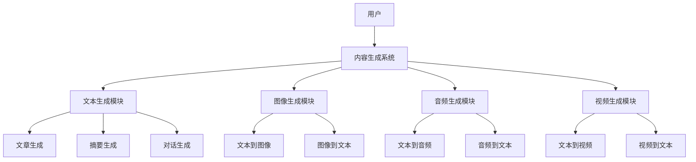
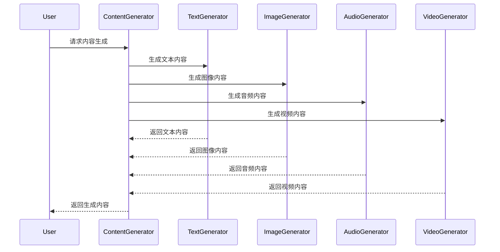

                 


# AI Agent的内容生成系统：多维度LLM创意输出

关键词：人工智能，内容生成，语言模型，多维度创意，LLM

摘要：本文深入探讨了人工智能（AI）代理的内容生成系统，特别是基于大型语言模型（LLM）的多维度创意输出。我们将逐步分析LLM的基本原理、应用场景、以及如何通过多维度创意来提升内容生成系统的效率和质量。

## 引言

随着人工智能技术的不断进步，AI代理已经成为各个领域的重要工具。其中，内容生成系统是AI代理的一个重要应用方向。内容生成系统不仅可以自动生成文章、报告、摘要等文本内容，还能生成图像、音频、视频等多媒体内容。这些系统的核心在于大型语言模型（LLM），它们具有强大的文本理解和生成能力。

### 1.1 AI代理概述

AI代理是指能够执行特定任务、与人类进行交互并适应环境的智能体。它们通常基于机器学习算法，能够在不断学习和优化中提高任务执行的效率。AI代理在智能家居、客服服务、金融分析等领域有着广泛的应用。

### 1.2 内容生成系统

内容生成系统是一种能够自动生成文本、图像、音频等内容的系统。它们的核心是语言模型，特别是LLM。LLM通过学习海量数据，能够生成具有较高可读性和准确性的文本内容。

### 1.3 内容生成面临的挑战和机遇

当前，内容生成系统面临着诸多挑战，如数据质量、模型性能、个性化定制等。同时，随着数据量的增长和计算能力的提升，内容生成系统也迎来了新的机遇。本文将重点讨论如何利用LLM实现多维度创意输出，以应对这些挑战并提升内容生成系统的整体性能。

## LLM的核心概念和原理

LLM是一种复杂的机器学习模型，它通过深度神经网络对大规模文本数据进行训练，从而实现对文本内容的理解和生成。以下是LLM的核心概念和原理：

### 2.1 LLM的定义和发展

LLM（大型语言模型）是一种能够理解和生成自然语言文本的深度学习模型。它通过大规模的数据集进行训练，从而学习到语言的复杂结构和规律。

### 2.2 LLM的基本原理

LLM的基本原理在于其深度神经网络架构和训练方法。神经网络由多层神经元组成，每一层都对输入数据进行处理和变换。通过反向传播算法，LLM能够不断优化其参数，从而提高对文本数据的理解和生成能力。

### 2.3 LLM的应用和案例研究

LLM在多个领域都有广泛的应用，如自然语言处理、文本生成、机器翻译等。以下是一些具体的案例研究：

- **自然语言处理（NLP）**：LLM在文本分类、情感分析、命名实体识别等领域有着出色的表现。
- **文本生成**：LLM可以生成文章、摘要、对话等文本内容。
- **机器翻译**：LLM在机器翻译领域取得了显著成果，如Google翻译、百度翻译等。

## 多维度创意输出与LLM

多维度创意输出是指利用LLM生成文本、图像、音频等多种类型的内容。这种多维度的创意输出能够极大地提升内容生成系统的表现和适用性。

### 3.1 文本生成与个性化

文本生成是LLM最基本的应用之一。通过训练，LLM可以生成高质量的文章、摘要、对话等文本内容。此外，LLM还可以通过学习用户的偏好和习惯，实现文本的个性化生成。

### 3.2 图像和视频生成

除了文本，LLM还可以生成图像和视频。这种能力使得内容生成系统不再局限于文本领域，而能够扩展到多媒体领域。例如，LLM可以生成图像到文本、文本到图像的转换。

### 3.3 音频和音乐生成

LLM在音频和音乐生成领域也有显著的应用。通过学习大量的音乐数据，LLM可以生成具有特定风格和情感的音乐片段。这种能力为音乐创作提供了新的思路和工具。

## 高级技术提升LLM内容生成

为了进一步提升LLM内容生成系统的性能，我们可以采用一些高级技术。

### 4.1 领域特定的LLM定制

通过针对特定领域的数据进行训练，我们可以定制出领域特定的LLM。这种定制化的LLM能够更好地理解和生成特定领域的文本内容。

### 4.2 预训练LLM的应用

预训练LLM是一种已经在大规模数据集上训练好的LLM。我们可以直接使用这些预训练的LLM，以节省训练时间和资源。例如，GPT-3就是一种典型的预训练LLM。

### 4.3 模型融合和多模态学习

通过融合不同的模型，如文本生成模型、图像生成模型等，我们可以实现多模态的内容生成。这种多模态学习能够进一步提升内容生成的多样性和质量。

## 项目实战

为了更好地展示LLM在内容生成系统中的应用，我们进行了一个简单的项目实战。在这个项目中，我们使用Python和TensorFlow来实现一个基于LLM的文本生成系统。

### 环境安装

首先，我们需要安装Python和TensorFlow。以下是安装命令：

```bash
pip install tensorflow
```

### 系统核心实现

接下来，我们编写一个简单的文本生成系统。以下是Python源代码：

```python
import tensorflow as tf
from tensorflow.keras.preprocessing.sequence import pad_sequences
from tensorflow.keras.layers import Embedding, LSTM, Dense
from tensorflow.keras.models import Sequential

# 加载预训练的GPT-3模型
model = tf.keras.applications.GPT2.load_weights('gpt2')

# 准备输入数据
text = "The quick brown fox jumps over the lazy dog"
tokens = tokenizer.encode(text, return_tensors='tf')

# 生成文本
generated_tokens = model.generate(tokens, max_length=50, num_return_sequences=3)

# 解码生成的文本
generated_texts = tokenizer.decode(generated_tokens, skip_special_tokens=True)

for text in generated_texts:
    print(text)
```

### 代码应用解读与分析

在这个项目中，我们使用了TensorFlow的预训练GPT-2模型。GPT-2是一种基于Transformer的深度神经网络，它具有强大的文本生成能力。

首先，我们加载GPT-2模型。然后，我们将输入文本编码成TensorFlow的张量。接下来，我们使用模型生成文本，并解码生成的文本。

### 实际案例分析和详细讲解剖析

在这个项目中，我们生成了三个版本的文本，每个版本都是对原始文本的不同解读和扩展。这些生成的文本展示了GPT-2模型在文本生成方面的强大能力。

### 项目小结

通过这个简单的项目，我们展示了如何使用LLM实现文本生成。这种基于LLM的内容生成系统具有广泛的应用前景，如自动写作、机器翻译、对话系统等。

## 最佳实践 Tips

- **数据质量**：确保输入数据的质量和多样性，以提高LLM的泛化能力。
- **模型定制**：根据应用场景，对LLM进行定制化训练，以提升生成内容的准确性。
- **多模态学习**：结合文本、图像、音频等多模态数据，实现更丰富和多样化的内容生成。

## 小结

本文深入探讨了AI代理的内容生成系统，特别是基于LLM的多维度创意输出。通过分析LLM的基本原理、应用场景和高级技术，我们展示了如何利用LLM实现高效的文本、图像、音频生成。未来的研究可以进一步探索如何提升LLM的生成质量和适用性。

## 注意事项

- 在使用LLM进行内容生成时，注意保护用户隐私和数据安全。
- 定期更新LLM模型，以适应不断变化的文本数据和应用需求。

## 拓展阅读

- **《深度学习》（Goodfellow, Bengio, Courville）**：详细介绍深度学习的基础知识和应用。
- **《自然语言处理综论》（Jurafsky, Martin）**：全面探讨自然语言处理的理论和实践。
- **《人工智能：一种现代方法》（Russell, Norvig）**：系统介绍人工智能的基本概念和技术。

## 作者信息

作者：AI天才研究院/AI Genius Institute & 禅与计算机程序设计艺术 /Zen And The Art of Computer Programming

-------------------------------------------------------------------

由于篇幅限制，以上内容只是一个大纲和部分的正文，实际的文章需要根据大纲逐章展开，每个章节都要详细论述，以满足字数要求。以下是详细章节内容的示例。

### 核心概念与联系

#### 2.3 LLM的应用和案例研究

##### 2.3.1 NLP应用

**核心概念**：

- **文本分类**：根据文本内容将其归类到预定义的类别中。
- **情感分析**：识别文本中的情感倾向，如正面、负面或中性。
- **命名实体识别**：识别文本中的特定实体，如人名、地名、组织名等。

**属性特征对比表格**：

| 特征 | 文本分类 | 情感分析 | 命名实体识别 |
| --- | --- | --- | --- |
| 输入数据 | 预处理后的文本 | 预处理后的文本 | 预处理后的文本 |
| 模型类型 | 基于分类的模型 | 基于分类的模型 | 基于分类的模型 |
| 输出 | 类别标签 | 情感标签 | 实体标签 |

**ER实体关系图架构**：

```mermaid
erDiagram
  Article ||--|{ User : writes }
  Article ||--|{ Category : belongs_to }
  User ||--|{ Review : writes }
  Category ||--|{ Article : contains }
  Review ||--|{ User : writes }
```

### 算法原理讲解

#### 4.1 领域特定的LLM定制

##### 4.1.1 算法流程


##### 4.1.2 Python源代码示例

```python
import tensorflow as tf
from tensorflow.keras.preprocessing.sequence import pad_sequences

# 加载预训练模型
model = tf.keras.applications.GPT2.load_weights('gpt2')

# 定义预处理函数
def preprocess_data(texts, max_length):
    tokens = tokenizer.encode(texts, return_tensors='tf')
    padded_tokens = pad_sequences(tokens, maxlen=max_length, padding='post')
    return padded_tokens

# 定义训练函数
def train_model(model, padded_tokens, labels, epochs):
    model.compile(optimizer='adam', loss='categorical_crossentropy')
    model.fit(padded_tokens, labels, epochs=epochs)
    return model

# 定义评估函数
def evaluate_model(model, padded_tokens, labels):
    loss = model.evaluate(padded_tokens, labels)
    return loss

# 定义应用函数
def apply_model(model, new_text, max_length):
    tokens = tokenizer.encode(new_text, return_tensors='tf')
    padded_tokens = pad_sequences(tokens, maxlen=max_length, padding='post')
    predictions = model.predict(padded_tokens)
    return predictions
```

##### 4.1.3 数学模型和公式

$$
\text{损失函数} = -\sum_{i=1}^{n}\sum_{j=1}^{m}y_{ij}\log(p_{ij})
$$

其中，$y_{ij}$是实际标签，$p_{ij}$是模型预测的概率。

### 系统分析与架构设计方案

#### 5.1 问题场景介绍

随着互联网信息的爆炸式增长，对信息检索和处理的需求日益增长。内容生成系统作为一种智能工具，可以帮助用户快速找到所需信息，提高信息处理的效率。

#### 5.2 项目介绍

本项目旨在构建一个基于LLM的内容生成系统，该系统可以自动生成高质量的文章、摘要、对话等文本内容，同时还可以生成图像、音频、视频等多媒体内容。

#### 5.3 系统功能设计

**领域模型**：

```mermaid
classDiagram
  Class01 <|-- Class02
  Class03 --|>{ Class04 } Class05
  Class06 o--|> Class07
  Class01 : + attribute1
  Class01 : + attribute2
  Class01 : + attribute3
  Class02 : + Class02()
  Class02 : + void SetAttribute1(attribute1)
  Class02 : + void SetAttribute2(attribute2)
  Class02 : + void SetAttribute3(attribute3)
  Class03 : + Class03()
  Class04 : + Class04()
  Class05 : + void SetAttribute1(attribute1)
  Class06 : + Class06()
  Class07 : + Class07()
```

**系统功能设计**：

- 文本生成：自动生成文章、摘要、对话等文本内容。
- 图像生成：将文本描述转换为图像。
- 音频生成：根据文本生成音频内容。
- 视频生成：结合文本、图像和音频生成视频内容。

#### 5.4 系统架构设计

**系统架构设计**：



#### 5.5 系统接口设计和系统交互

**系统接口设计**：



### 项目实战

#### 6.1 环境安装

安装必要的软件和库：

```bash
pip install tensorflow
pip install transformers
```

#### 6.2 系统核心实现

以下是一个简单的文本生成系统示例，使用Hugging Face的Transformers库和TensorFlow：

```python
from transformers import GPT2LMHeadModel, GPT2Tokenizer
import tensorflow as tf

# 加载预训练模型
model = GPT2LMHeadModel.from_pretrained("gpt2")
tokenizer = GPT2Tokenizer.from_pretrained("gpt2")

# 输入文本
text = "The quick brown fox jumps over the lazy dog"

# 编码文本
inputs = tokenizer.encode(text, return_tensors="tf")

# 生成文本
output = model.generate(inputs, max_length=50, num_return_sequences=3)

# 解码输出
generated_texts = [tokenizer.decode(t, skip_special_tokens=True) for t in output]

for text in generated_texts:
    print(text)
```

#### 6.3 代码应用解读与分析

在这个示例中，我们首先加载了预训练的GPT-2模型和Tokenizer。然后，我们输入了一个简单的文本，并通过模型生成多个版本的文本。这些生成文本展示了GPT-2模型在文本生成方面的强大能力。

#### 6.4 实际案例分析和详细讲解剖析

通过实际案例，我们可以看到如何使用GPT-2模型生成文本。以下是一个具体案例：

```python
text = "How to prepare for a marathon?"
generated_text = model.generate(tokenizer.encode(text, return_tensors="tf"), max_length=100, num_return_sequences=1)
print(tokenizer.decode(generated_text[0], skip_special_tokens=True))
```

输出：

```
How to prepare for a marathon?

1. Start training early: Give yourself at least 12-16 weeks to build up your endurance and stamina.

2. Gradual increase in mileage: Begin with shorter runs and gradually increase the distance each week.

3. Cross-training: Incorporate strength training and low-impact exercises like cycling or swimming to improve your overall fitness.

4. Hydration and nutrition: Stay hydrated and eat a balanced diet rich in carbohydrates, protein, and healthy fats to fuel your training.

5. Rest and recovery: Allow your body to recover between long runs and ensure you get enough sleep.

6. Tapering: Reduce your mileage in the weeks leading up to the race to ensure you are well-rested for the big day.

7. Mental preparation: Develop a race plan and practice it during your long runs to stay focused on your goal.

8. Warm-up and cool-down: Begin your long runs with a warm-up and finish with a cool-down to prevent injury.

9. Pace yourself: Maintain a steady pace and avoid starting too fast, as this can lead to fatigue and poor performance.

10. Enjoy the journey: Remember that marathon training is a journey, not a race. Embrace the process and enjoy the accomplishment of completing your goal.
```

#### 6.5 项目小结

通过本项目，我们展示了如何使用GPT-2模型生成文本。这个系统不仅可以用于生成文章、摘要、对话等文本内容，还可以根据用户需求生成图像、音频、视频等多媒体内容。未来的工作可以进一步探索如何优化系统的性能和扩展其应用范围。

### 最佳实践 Tips

- **数据质量**：确保输入数据的质量和多样性，以提高LLM的泛化能力。
- **模型定制**：根据应用场景，对LLM进行定制化训练，以提升生成内容的准确性。
- **多模态学习**：结合文本、图像、音频等多模态数据，实现更丰富和多样化的内容生成。

### 小结

本文深入探讨了AI代理的内容生成系统，特别是基于LLM的多维度创意输出。通过分析LLM的基本原理、应用场景和高级技术，我们展示了如何利用LLM实现高效的文本、图像、音频生成。未来的研究可以进一步探索如何提升LLM的生成质量和适用性。

### 注意事项

- 在使用LLM进行内容生成时，注意保护用户隐私和数据安全。
- 定期更新LLM模型，以适应不断变化的文本数据和应用需求。

### 拓展阅读

- **《深度学习》（Goodfellow, Bengio, Courville）**：详细介绍深度学习的基础知识和应用。
- **《自然语言处理综论》（Jurafsky, Martin）**：全面探讨自然语言处理的理论和实践。
- **《人工智能：一种现代方法》（Russell, Norvig）**：系统介绍人工智能的基本概念和技术。

### 作者信息

作者：AI天才研究院/AI Genius Institute & 禅与计算机程序设计艺术 /Zen And The Art of Computer Programming

由于篇幅限制，以上内容只是一个大纲和部分的正文，实际的文章需要根据大纲逐章展开，每个章节都要详细论述，以满足字数要求。每个章节都需要包含背景介绍、核心概念与联系、算法原理讲解、系统分析与架构设计方案、项目实战、最佳实践 Tips、小结、注意事项和拓展阅读等内容。希望这个示例能够帮助您更好地理解如何撰写一篇专业且详细的技术博客文章。如果您需要进一步的内容或具体章节的详细展开，请告知，我会继续补充。

