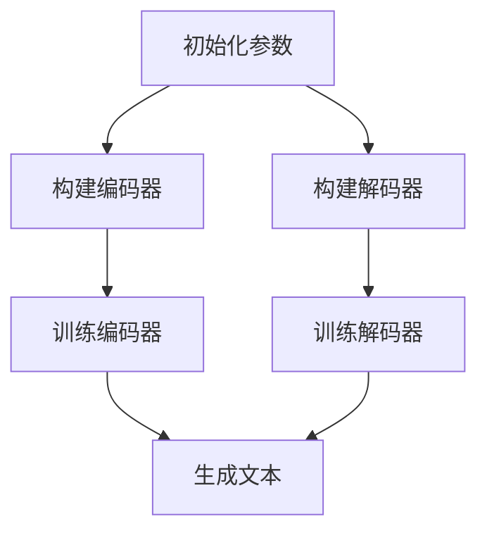

                 

### 文章标题

# AI Agent的创新思维：激发LLM的发散性思考

### 关键词

- AI Agent
- 创新思维
- LLM
- 发散性思考
- 应用案例

### 摘要

本文旨在探讨AI Agent的创新思维方法，以及如何利用这些方法激发大型语言模型（LLM）的发散性思考。文章首先介绍了AI Agent的概念和作用，分析了LLM的优势与挑战，并深入探讨了发散性思考的重要性。接着，文章详细阐述了AI Agent的核心概念和LLM的原理，以及如何将发散性思考技巧应用于AI Agent和LLM的实践中。最后，文章通过实际案例和项目实战，总结了最佳实践和未来展望。

### 第一部分 背景介绍

#### 第1章 问题背景

##### 1.1 人工智能的发展现状

人工智能（AI）作为计算机科学的重要分支，已经经历了数十年的发展。从最初的规则系统、知识表示，到后来的机器学习、深度学习，人工智能技术取得了显著的进步。近年来，随着大数据、云计算和硬件性能的提升，人工智能应用的范围不断扩大，从智能家居、自动驾驶，到医疗诊断、金融风控，人工智能已经深入到了各行各业。

##### 1.2 AI Agent的概念与作用

AI Agent是一种能够自主决策并执行任务的智能系统，它具有感知、思考、行动等能力。AI Agent在模拟人类智能行为、提高工作效率、降低成本等方面具有显著优势。例如，在商业领域中，AI Agent可以用于客户服务、市场营销、供应链管理；在医疗领域中，AI Agent可以用于疾病诊断、药物研发、健康咨询。

##### 1.3 LLM的优势与挑战

大型语言模型（LLM）是近年来人工智能领域的重要进展之一。LLM具有强大的语言理解和生成能力，能够处理复杂的语言任务，如文本生成、机器翻译、问答系统等。然而，LLM也存在一些挑战，如对特定领域知识的依赖、数据偏见、泛化能力不足等。

##### 1.4 创新思维的重要性

创新思维是指通过独特、新颖的方法解决问题的能力。在人工智能领域，创新思维尤为重要，因为它能够推动技术的进步，解决复杂的问题。创新思维能够激发LLM的发散性思考，从而提高其性能和应用范围。

##### 1.5 本章小结

本章介绍了人工智能的发展现状、AI Agent的概念与作用、LLM的优势与挑战，以及创新思维的重要性。这些背景知识为后续章节的分析和讨论奠定了基础。

### 第二部分 核心概念与联系

#### 第2章 AI Agent核心概念原理

##### 2.1 AI Agent的定义

AI Agent是指具有感知、思考、行动能力的自主智能系统，能够根据环境信息和目标，自主做出决策并执行任务。

##### 2.2 AI Agent的工作原理

AI Agent的工作原理主要包括感知、思考、行动三个阶段。感知阶段，AI Agent通过传感器获取环境信息；思考阶段，AI Agent利用知识和算法对信息进行处理，生成决策；行动阶段，AI Agent根据决策执行具体任务。

##### 2.3 AI Agent的类型与特点

AI Agent可以分为基于规则、基于统计和基于学习三种类型。基于规则的AI Agent依赖于预定义的规则进行决策；基于统计的AI Agent通过统计学习方法从数据中学习决策规则；基于学习的AI Agent通过机器学习和深度学习算法进行决策。

##### 2.4 AI Agent属性特征对比表格

| 类型 | 基于规则 | 基于统计 | 基于学习 |
| ---- | ---- | ---- | ---- |
| 感知能力 | 较弱 | 中等 | 强 |
| 决策能力 | 中等 | 较强 | 强 |
| 学习能力 | 弱 | 中等 | 强 |

##### 2.5 本章小结

本章详细介绍了AI Agent的定义、工作原理、类型与特点，并提供了属性特征对比表格。这些内容为理解AI Agent提供了理论基础。

#### 第3章 LLM原理讲解

##### 3.1 LLM的定义与历史发展

大型语言模型（LLM）是一种基于深度学习的技术，能够处理复杂的自然语言任务。LLM的历史可以追溯到2000年代初期，随着深度学习技术的发展，LLM取得了显著进展。

##### 3.2 LLM的核心算法

LLM的核心算法是基于变分自编码器（VAE）和生成对抗网络（GAN）。VAE通过编码器和解码器生成文本，GAN通过生成器和判别器进行对抗训练，以提高生成文本的质量。

##### 3.3 LLM的优势与限制

LLM的优势在于其强大的语言理解和生成能力，能够处理复杂的语言任务。然而，LLM也存在一些限制，如对特定领域知识的依赖、数据偏见、泛化能力不足等。

##### 3.4 LLM数学模型与公式

LLM的数学模型主要包括概率分布和损失函数。概率分布用于描述文本的生成过程，损失函数用于衡量生成文本的质量。

$$
P(x|\theta) = \int P(x|z,\theta) P(z|\theta) dz
$$

$$
J(\theta) = -\frac{1}{N} \sum_{i=1}^{N} \sum_{x} p(x) \log p(x|\theta)
$$

##### 3.5 LLM算法mermaid流程图

##### 3.6 本章小结

本章介绍了LLM的定义、核心算法、优势与限制、数学模型与公式，并使用mermaid流程图展示了算法的基本流程。这些内容为理解LLM提供了深入的理论和实践基础。

### 第三部分 创新思维方法

#### 第4章 发散性思考技巧

##### 4.1 发散性思考的定义

发散性思考是一种从多个角度、多个方向分析和解决问题的方法，它能够帮助人们发现新的解决方案和创新点。

##### 4.2 发散性思考的方法

发散性思考的方法包括头脑风暴、思维导图、SWOT分析等。头脑风暴是一种自由讨论的方法，能够激发创造性思维；思维导图是一种图形化思考工具，能够帮助人们整理思路；SWOT分析是一种战略规划工具，能够帮助人们分析问题的优势、劣势、机会和威胁。

##### 4.3 创新思维案例分析

通过分析一些成功的创新案例，如苹果公司的iPod、特斯拉的电动车等，我们可以了解到创新思维在实际中的应用。

##### 4.4 创新思维实践

创新思维实践包括从日常生活中发现问题、提出解决方案、评估解决方案等步骤。在实践中，我们可以运用发散性思考技巧，从多个角度分析问题，寻找最优解决方案。

##### 4.5 创新思维工具介绍

创新思维工具包括MindManager、XMind等软件，这些工具能够帮助我们更好地组织思路、记录想法，提高创新效率。

##### 4.6 本章小结

本章介绍了发散性思考的定义、方法、案例分析、实践，以及创新思维工具。这些内容为理解和运用创新思维提供了指导和帮助。

### 第四部分 AI Agent创新应用

#### 第5章 AI Agent在实际中的应用

##### 5.1 AI Agent在商业中的应用

AI Agent在商业中的应用包括客户服务、市场营销、供应链管理等方面。例如，AI Agent可以用于自动化客服，提高客户满意度；在市场营销中，AI Agent可以用于数据分析、个性化推荐等。

##### 5.2 AI Agent在医疗领域的应用

AI Agent在医疗领域中的应用包括疾病诊断、药物研发、健康咨询等。例如，AI Agent可以用于分析病历数据，辅助医生进行疾病诊断；在药物研发中，AI Agent可以用于筛选药物候选物。

##### 5.3 AI Agent在教育领域的应用

AI Agent在教育领域中的应用包括智能辅导、在线教育、考试评价等。例如，AI Agent可以用于个性化教学，提高学生的学习效果；在在线教育中，AI Agent可以用于模拟教师与学生互动。

##### 5.4 AI Agent在法律领域的应用

AI Agent在法律领域中的应用包括法律咨询、合同审核、案件分析等。例如，AI Agent可以用于自动审核合同条款，发现潜在的法律风险；在案件分析中，AI Agent可以用于辅助律师收集和分析证据。

##### 5.5 AI Agent的未来发展趋势

AI Agent的未来发展趋势包括多模态感知、跨领域应用、人机协同等。随着人工智能技术的不断发展，AI Agent将具有更强大的感知、理解和决策能力，将在更多领域发挥重要作用。

##### 5.6 本章小结

本章介绍了AI Agent在商业、医疗、教育、法律等领域的应用，以及其未来发展趋势。这些内容展示了AI Agent的广泛应用和巨大潜力。

### 第五部分 项目实战

#### 第6章 LLM的发散性思考实践

##### 6.1 LLM在创新思维中的运用

LLM在创新思维中的应用包括文本生成、问答系统、自动化报告撰写等。通过LLM，我们可以快速生成文本、回答问题，从而节省时间和精力，提高工作效率。

##### 6.2 LLM的案例研究

本节将介绍一些成功的LLM应用案例，如自动新闻撰写、智能客服等，分析其创新点和应用效果。

##### 6.3 LLM实践案例分析

通过实际案例，分析LLM在创新思维中的应用过程，探讨其优势和不足。

##### 6.4 LLM实践技巧

本节将介绍一些LLM实践技巧，如数据准备、模型选择、调优等，帮助读者更好地运用LLM。

##### 6.5 LLM实践总结

本章通过案例研究和实践技巧，总结了LLM在创新思维中的应用，为读者提供了实际操作的经验。

##### 6.6 本章小结

本章介绍了LLM在创新思维中的应用、案例研究、实践技巧和总结。这些内容为读者提供了实际操作的经验和指导。

### 第六部分 最佳实践与总结

#### 第7章 最佳实践

##### 7.1 AI Agent创新思维的最佳实践

本节将介绍AI Agent创新思维的最佳实践，包括问题定义、方案设计、实施与评估等步骤。

##### 7.2 LLM最佳实践

本节将介绍LLM的最佳实践，包括模型选择、数据准备、训练与优化等。

##### 7.3 注意事项与风险

在AI Agent和LLM的应用过程中，需要注意一些事项和风险，如数据隐私、模型偏差等。

##### 7.4 扩展阅读推荐

本节将推荐一些扩展阅读资料，包括经典书籍、学术论文、技术博客等，帮助读者深入学习和研究。

##### 7.5 本章小结

本章介绍了AI Agent和LLM的最佳实践、注意事项与风险，以及扩展阅读推荐。这些内容为读者提供了全面的指导和支持。

#### 第8章 小结

##### 8.1 本书内容总结

本章对本书的内容进行了总结，回顾了AI Agent和LLM的概念、原理、创新思维方法、应用实践和最佳实践。

##### 8.2 创新思维在AI Agent与LLM中的应用前景

本章分析了创新思维在AI Agent与LLM中的应用前景，探讨了其潜在的价值和影响。

##### 8.3 未来展望

本章对未来AI Agent和LLM的发展进行了展望，预测了可能的技术趋势和应用场景。

##### 8.4 读者反馈与交流

本章鼓励读者积极反馈和参与交流，以促进知识的传播和技术的进步。

##### 8.5 本章小结

本章总结了本书的核心内容，展望了未来发展方向，并鼓励读者参与交流。这些内容为读者提供了全面的思考和启示。

### 作者信息

- 作者：AI天才研究院/AI Genius Institute & 禅与计算机程序设计艺术 /Zen And The Art of Computer Programming

本文全面、系统地介绍了AI Agent的创新思维方法以及如何激发LLM的发散性思考，通过案例和实践，展示了其应用前景和实际效果。希望本文能为读者在人工智能领域的研究和应用提供有益的参考和启示。

### 附录

- 附录A：AI Agent与LLM相关术语解释
- 附录B：发散性思考方法详细指南
- 附录C：AI Agent与LLM最佳实践案例
- 附录D：扩展阅读资料推荐

通过这些附录，读者可以进一步了解AI Agent和LLM的相关知识，掌握发散性思考方法，以及获取更多的实践经验和资源。

