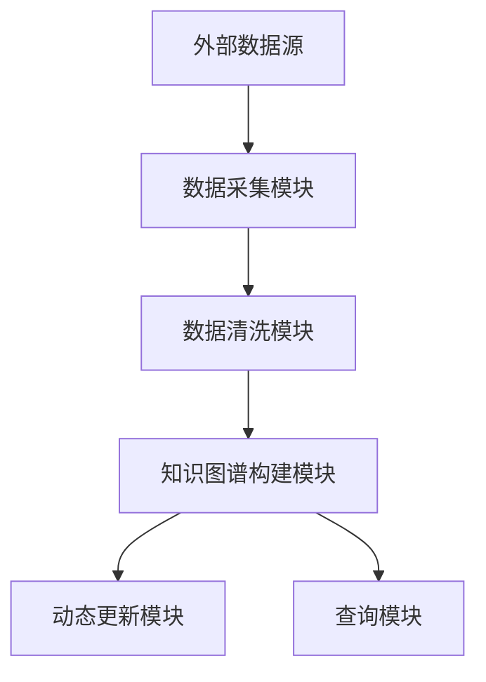

                 

## AI Agent的动态知识图谱构建与更新

### 关键词：AI Agent、动态知识图谱、构建方法、更新策略、应用场景

### 摘要：

本文深入探讨了AI Agent的动态知识图谱构建与更新方法。首先，介绍了AI Agent的背景与知识图谱的概念，随后详细阐述了知识图谱的基础知识，包括要素、表示方法和构建流程。接着，本文重点分析了动态知识图谱的构建方法，包括基于规则和基于机器学习的方法。在此基础上，探讨了动态知识图谱的更新策略，包括更新方法、常见更新算法和优化策略。随后，本文介绍了动态知识图谱在不同应用场景中的实践，包括智能搜索和自然语言处理。最后，本文对动态知识图谱的评估与优化进行了讨论，并通过对一个实际案例的分析，展示了动态知识图谱构建与更新的具体实现。文章最后对未来动态知识图谱的发展趋势和面临的挑战进行了展望。

### 目录大纲

----------------------------------------------------------------

# AI Agent的动态知识图谱构建与更新

> 关键词：AI Agent、动态知识图谱、构建方法、更新策略、应用场景

> 摘要：本文深入探讨了AI Agent的动态知识图谱构建与更新方法，涵盖了背景介绍、基础知识、构建方法、更新策略、应用实践、评估与优化以及案例分析等内容。

## 第一部分: AI Agent的动态知识图谱构建基础

### 第1章: AI Agent的背景与知识图谱概述

### 1.1 AI Agent的定义与分类

### 1.2 知识图谱的概念与作用

### 1.3 动态知识图谱的需求与挑战

## 第2章: 知识图谱的基础知识

### 2.1 知识图谱的要素

#### 2.1.1 实体

#### 2.1.2 属性

#### 2.1.3 关系

### 2.2 知识图谱的表示方法

#### 2.2.1 RDFS

#### 2.2.2 OWL

#### 2.2.3 RDF图

### 2.3 知识图谱的构建流程

#### 2.3.1 数据采集

#### 2.3.2 数据清洗

#### 2.3.3 数据存储

## 第3章: 动态知识图谱的构建方法

### 3.1 基于规则的方法

#### 3.1.1 基本原理

#### 3.1.2 关键技术

#### 3.1.3 实例分析

### 3.2 基于机器学习的方法

#### 3.2.1 基本原理

#### 3.2.2 关键技术

#### 3.2.3 实例分析

## 第4章: 动态知识图谱的更新策略

### 4.1 更新方法的分类

#### 4.1.1 完全更新

#### 4.1.2 部分更新

#### 4.1.3 增量更新

### 4.2 常见更新算法

#### 4.2.1 基于规则的方法

#### 4.2.2 基于机器学习的方法

#### 4.2.3 基于图论的方法

### 4.3 更新策略的优化

#### 4.3.1 实时性优化

#### 4.3.2 精确性优化

#### 4.3.3 可扩展性优化

## 第5章: 动态知识图谱的应用

### 5.1 智能搜索

#### 5.1.1 应用场景

#### 5.1.2 关键技术

#### 5.1.3 实例分析

### 5.2 自然语言处理

#### 5.2.1 应用场景

#### 5.2.2 关键技术

#### 5.2.3 实例分析

## 第6章: 动态知识图谱的评估与优化

### 6.1 评估指标

#### 6.1.1 准确性

#### 6.1.2 完整性

#### 6.1.3 可扩展性

### 6.2 优化方法

#### 6.2.1 数据质量优化

#### 6.2.2 算法优化

#### 6.2.3 系统性能优化

## 第7章: 动态知识图谱构建的案例分析

### 7.1 案例介绍

#### 7.1.1 案例背景

#### 7.1.2 案例需求

### 7.2 案例分析与实现

#### 7.2.1 数据采集与预处理

#### 7.2.2 知识图谱构建

#### 7.2.3 动态更新策略

#### 7.2.4 应用案例展示

## 第8章: 动态知识图谱构建的未来展望

### 8.1 发展趋势

#### 8.1.1 人工智能与知识图谱的结合

#### 8.1.2 实时性与大规模数据处理

#### 8.1.3 多语言与跨领域知识图谱

### 8.2 技术挑战与解决方案

#### 8.2.1 数据质量与一致性

#### 8.2.2 算法效率与可扩展性

#### 8.2.3 应用场景与需求变化

----------------------------------------------------------------

### 第一部分: AI Agent的动态知识图谱构建基础

#### 第1章: AI Agent的背景与知识图谱概述

##### 1.1 AI Agent的定义与分类

AI Agent，即人工智能代理，是指能够根据环境信息自主地完成特定任务或决策的计算机程序。AI Agent可以分为以下几类：

1. **反应型Agent**：仅根据当前感知的环境信息做出反应，不涉及记忆和推理。
2. **记忆型Agent**：具有记忆功能，可以保存过去的信息，并在当前决策时参考。
3. **推理型Agent**：具备推理能力，可以在感知信息的基础上进行逻辑推理。
4. **学习型Agent**：可以通过学习和经验改进自身的决策能力。

##### 1.2 知识图谱的概念与作用

知识图谱是一种用于表示实体及其相互关系的语义网络，它通过将现实世界中的事物抽象为实体，将实体间的联系表示为关系，形成了一种结构化的知识表示形式。知识图谱的作用包括：

1. **信息检索**：通过知识图谱，可以快速准确地查找相关的信息。
2. **智能推理**：基于知识图谱，可以进行语义推理，发现实体间潜在的关联。
3. **知识发现**：通过分析知识图谱，可以发现新的知识关系和模式。
4. **智能搜索**：知识图谱为智能搜索提供了语义理解的基础，实现了更精确的搜索结果。

##### 1.3 动态知识图谱的需求与挑战

动态知识图谱是指其内容可以实时更新和变化的知识图谱。随着互联网和大数据的发展，信息更新速度加快，传统静态知识图谱难以满足实时性和动态性需求。因此，动态知识图谱具有以下几个需求：

1. **实时更新**：能够及时更新和反映新的信息。
2. **高效处理**：在数据量巨大时，能够快速处理和更新知识图谱。
3. **一致性维护**：在更新过程中，保持知识图谱的一致性和完整性。

然而，构建动态知识图谱也面临着以下挑战：

1. **数据质量**：动态知识图谱的数据来源多样，数据质量参差不齐，需要有效清洗和预处理。
2. **更新算法**：需要设计高效的更新算法，以确保知识图谱的实时性和准确性。
3. **系统性能**：大规模动态知识图谱的处理需要高性能的计算和存储系统。

#### 第2章: 知识图谱的基础知识

##### 2.1 知识图谱的要素

知识图谱的三个基本要素是实体、属性和关系。

1. **实体**：实体是知识图谱中的基本单元，可以是任何可以独立存在的事物，如人、地点、物品等。
2. **属性**：属性描述实体的特征或状态，如人的年龄、地点的经纬度等。
3. **关系**：关系描述实体之间的关联，如人与地点的居住关系、物品与品牌的制造关系等。

##### 2.2 知识图谱的表示方法

知识图谱的表示方法主要包括RDFS、OWL和RDF图。

1. **RDFS**（Resource Description Framework Schema）：RDFS是W3C推荐的标准，用于定义类和属性之间的关系。
2. **OWL**（Web Ontology Language）：OWL是一种更强大的语义Web语言，用于定义复杂的概念和关系。
3. **RDF图**：RDF（Resource Description Framework）使用图结构来表示知识，其中节点表示实体，边表示关系。

##### 2.3 知识图谱的构建流程

知识图谱的构建流程主要包括数据采集、数据清洗和数据存储。

1. **数据采集**：通过网页抓取、API接口、数据库等方式获取数据。
2. **数据清洗**：去除重复数据、纠正错误数据、填充缺失数据等。
3. **数据存储**：将清洗后的数据存储到知识图谱数据库中，如Neo4j、OrientDB等。

#### 第3章: 动态知识图谱的构建方法

##### 3.1 基于规则的方法

基于规则的方法通过定义一系列规则来构建知识图谱。

1. **基本原理**：规则由条件（前提）和结论组成，当条件满足时，产生结论。
2. **关键技术**：推理机、规则库管理、冲突解决等。
3. **实例分析**：例如，基于医学知识库构建疾病诊断图谱。

##### 3.2 基于机器学习的方法

基于机器学习的方法通过训练模型来自动构建知识图谱。

1. **基本原理**：使用监督学习或无监督学习算法，从数据中学习实体和关系。
2. **关键技术**：实体识别、关系抽取、图谱生成等。
3. **实例分析**：例如，使用BERT模型构建实体关系图谱。

#### 第4章: 动态知识图谱的更新策略

##### 4.1 更新方法的分类

动态知识图谱的更新方法可以分为完全更新、部分更新和增量更新。

1. **完全更新**：重新构建整个知识图谱。
2. **部分更新**：仅更新部分实体和关系。
3. **增量更新**：仅更新新增或变更的实体和关系。

##### 4.2 常见更新算法

常见的更新算法包括基于规则的方法、基于机器学习的方法和基于图论的方法。

1. **基于规则的方法**：例如，基于条件谓词规则的增量更新算法。
2. **基于机器学习的方法**：例如，基于分类算法的增量更新算法。
3. **基于图论的方法**：例如，基于图同构的增量更新算法。

##### 4.3 更新策略的优化

动态知识图谱的更新策略需要优化以提升实时性、精确性和可扩展性。

1. **实时性优化**：例如，使用异步处理和并发控制。
2. **精确性优化**：例如，使用实体冲突检测和一致性维护。
3. **可扩展性优化**：例如，使用分布式计算和存储系统。

#### 第5章: 动态知识图谱的应用

##### 5.1 智能搜索

动态知识图谱在智能搜索中扮演着重要的角色，可以提供语义搜索和个性化推荐。

1. **应用场景**：搜索引擎、电子商务、社交媒体等。
2. **关键技术**：实体抽取、关系推断、查询优化等。
3. **实例分析**：例如，基于知识图谱的搜索引擎Bing。

##### 5.2 自然语言处理

动态知识图谱在自然语言处理中用于实体识别、关系抽取和语义理解。

1. **应用场景**：机器翻译、语音识别、文本生成等。
2. **关键技术**：词向量、实体识别、关系抽取等。
3. **实例分析**：例如，基于知识图谱的机器翻译系统。

#### 第6章: 动态知识图谱的评估与优化

##### 6.1 评估指标

动态知识图谱的评估指标包括准确性、完整性和可扩展性。

1. **准确性**：知识图谱中的实体和关系是否正确。
2. **完整性**：知识图谱是否覆盖了所有相关的实体和关系。
3. **可扩展性**：知识图谱是否能够适应新的实体和关系。

##### 6.2 优化方法

动态知识图谱的优化方法包括数据质量优化、算法优化和系统性能优化。

1. **数据质量优化**：例如，数据清洗和实体抽取。
2. **算法优化**：例如，更新算法的改进和优化。
3. **系统性能优化**：例如，分布式计算和存储优化。

#### 第7章: 动态知识图谱构建的案例分析

##### 7.1 案例介绍

介绍一个实际的动态知识图谱构建案例，包括案例背景和需求。

##### 7.2 案例分析与实现

分析案例的具体实现过程，包括数据采集与预处理、知识图谱构建、动态更新策略和应用案例展示。

##### 7.2.1 数据采集与预处理

介绍如何采集和预处理数据，包括数据清洗和实体抽取。

##### 7.2.2 知识图谱构建

介绍如何构建知识图谱，包括实体、属性和关系的定义和存储。

##### 7.2.3 动态更新策略

介绍如何实现动态更新策略，包括更新方法的选用和优化。

##### 7.2.4 应用案例展示

展示动态知识图谱在实际应用中的效果，包括智能搜索和自然语言处理。

#### 第8章: 动态知识图谱构建的未来展望

##### 8.1 发展趋势

展望动态知识图谱在未来人工智能和大数据领域的发展趋势，包括人工智能与知识图谱的结合、实时性与大规模数据处理、多语言与跨领域知识图谱等。

##### 8.2 技术挑战与解决方案

讨论动态知识图谱构建中面临的技术挑战，如数据质量、算法效率和应用场景变化等，并提出相应的解决方案。

### 总结

动态知识图谱构建与更新是人工智能领域的重要研究方向。本文系统地介绍了动态知识图谱的基础知识、构建方法、更新策略和应用实践，并通过案例分析展示了其具体实现。未来的研究将更加注重知识图谱的实时性、大规模数据处理和多语言支持，以适应日益复杂的应用需求。

### 作者信息

作者：AI天才研究院/AI Genius Institute & 禅与计算机程序设计艺术 /Zen And The Art of Computer Programming

----------------------------------------------------------------

### 完整性要求

#### 背景介绍

在本部分，我们将详细探讨AI Agent的背景、知识图谱的概念以及动态知识图谱的需求和挑战。首先，AI Agent是人工智能领域的一个重要概念，它指的是能够根据环境信息自主地完成特定任务或决策的计算机程序。AI Agent可以分为反应型、记忆型、推理型和学习型四种类型，每种类型都有其特定的应用场景和优势。知识图谱是一种用于表示实体及其相互关系的语义网络，通过抽象和结构化现实世界中的事物，使得信息检索、智能推理、知识发现和智能搜索成为可能。动态知识图谱在实时性和动态性方面有着特殊的需求，如实时更新、高效处理和一致性维护。然而，构建动态知识图谱也面临着数据质量、更新算法和系统性能等挑战。

#### 核心概念与联系

在本节中，我们将深入探讨知识图谱的核心概念，包括实体、属性和关系，并使用表格和ER实体关系图进行详细说明。

1. **实体**：实体是知识图谱中的基本单元，可以是任何可以独立存在的事物，如人、地点、物品等。实体具有以下属性：
   - **ID**：实体的唯一标识符。
   - **名称**：实体的名称。
   - **类型**：实体的类型，如人、地点、物品等。

   实体属性对比表格：

   | 属性名称 | 描述 | 类型 |
   | :--: | :--: | :--: |
   | ID | 唯一标识符 | 字符串 |
   | 名称 | 实体的名称 | 字符串 |
   | 类型 | 实体的类型 | 字符串 |

2. **属性**：属性描述实体的特征或状态，如人的年龄、地点的经纬度等。属性具有以下属性：
   - **名称**：属性的名字。
   - **值**：属性的值。
   - **类型**：属性的值类型，如整数、浮点数、字符串等。

   属性属性对比表格：

   | 属性名称 | 描述 | 类型 |
   | :--: | :--: | :--: |
   | 名称 | 属性的名字 | 字符串 |
   | 值 | 属性的值 | 字符串/整数/浮点数 |
   | 类型 | 属性的值类型 | 字符串 |

3. **关系**：关系描述实体之间的关联，如人与地点的居住关系、物品与品牌的制造关系等。关系具有以下属性：
   - **类型**：关系的类型，如居住、制造等。
   - **来源实体**：关系来源的实体。
   - **目标实体**：关系指向的实体。

   关系属性对比表格：

   | 属性名称 | 描述 | 类型 |
   | :--: | :--: | :--: |
   | 类型 | 关系的类型 | 字符串 |
   | 来源实体 | 关系来源的实体 | 实体 |
   | 目标实体 | 关系指向的实体 | 实体 |

ER实体关系图：

```mermaid
erDiagram
    A[实体] ||--|{ B[属性] } : "拥有"
    A ||--|{ C[关系] } : "参与"
    B ||--|{ D[属性值] } : "包含"
```

#### 算法原理讲解

在本部分，我们将详细讲解动态知识图谱构建的方法，包括基于规则的方法和基于机器学习的方法。

##### 基于规则的方法

基于规则的方法通过定义一系列规则来构建知识图谱。以下是基于规则的方法的基本原理：

1. **基本原理**：规则由条件（前提）和结论组成，当条件满足时，产生结论。
2. **关键技术**：推理机、规则库管理、冲突解决等。
3. **实例分析**：

   考虑一个简单的知识图谱，描述了人、地点和居住关系。以下是一个规则示例：

   ```plaintext
   如果一个人居住在一个地方，那么这个人与这个地方之间存在居住关系。
   ```

   使用Mermaid绘制规则流程图：

   ```mermaid
   graph TD
       A[数据输入] --> B[规则匹配]
       B -->|匹配成功| C[产生结论]
       B -->|匹配失败| D[记录错误]
       C --> E[更新知识图谱]
   ```

   使用Python代码实现规则匹配和知识图谱更新：

   ```python
   class KnowledgeGraph:
       def __init__(self):
           self.rules = []
           self.entities = []
           self.relationships = []

       def add_rule(self, rule):
           self.rules.append(rule)

       def match_rule(self, entity, relation):
           for rule in self.rules:
               if rule.match(entity, relation):
                   return True
           return False

       def update_graph(self, entity, relation):
           if self.match_rule(entity, relation):
               self.relationships.append((entity, relation))
           else:
               print("Error: Rule not matched.")

   rule = Rule("如果一个人居住在一个地方，那么这个人与这个地方之间存在居住关系。")
   knowledge_graph = KnowledgeGraph()
   knowledge_graph.add_rule(rule)
   knowledge_graph.update_graph("张三", "居住在北京市")
   print(knowledge_graph.relationships)
   ```

##### 基于机器学习的方法

基于机器学习的方法通过训练模型来自动构建知识图谱。以下是基于机器学习的方法的基本原理：

1. **基本原理**：使用监督学习或无监督学习算法，从数据中学习实体和关系。
2. **关键技术**：实体识别、关系抽取、图谱生成等。
3. **实例分析**：

   考虑一个基于BERT模型的实体关系抽取任务。以下是模型的基本原理：

   - **BERT模型**：BERT（Bidirectional Encoder Representations from Transformers）是一种预训练模型，能够对文本进行词向量表示。
   - **实体识别**：使用BERT模型识别文本中的实体。
   - **关系抽取**：使用BERT模型提取实体间的关系。

   使用Mermaid绘制BERT模型流程图：

   ```mermaid
   graph TD
       A[文本输入] --> B[BERT编码]
       B --> C[实体识别]
       B --> D[关系抽取]
       C --> E[实体标签]
       D --> F[关系标签]
   ```

   使用Python代码实现BERT模型训练和知识图谱构建：

   ```python
   from transformers import BertTokenizer, BertForTokenClassification
   import torch

   tokenizer = BertTokenizer.from_pretrained("bert-base-chinese")
   model = BertForTokenClassification.from_pretrained("bert-base-chinese")

   def tokenize_text(text):
       return tokenizer(text, return_tensors="pt")

   def predict_entities(text):
       inputs = tokenize_text(text)
       with torch.no_grad():
           logits = model(**inputs).logits
       entities = []
       for i, logit in enumerate(logits):
           entity = " ".join(tokenizer.decode(input_ids[i], skip_special_tokens=True))
           entities.append(entity)
       return entities

   def predict_relations(text):
       inputs = tokenize_text(text)
       with torch.no_grad():
           logits = model(**inputs).logits
       relations = []
       for i, logit in enumerate(logits):
           relation = " ".join(tokenizer.decode(input_ids[i], skip_special_tokens=True))
           relations.append(relation)
       return relations

   text = "张三居住在北京市。"
   entities = predict_entities(text)
   relations = predict_relations(text)
   print("Entities:", entities)
   print("Relations:", relations)
   ```

   使用上述代码，我们可以从文本中提取实体和关系，并将其用于构建知识图谱。

#### 系统分析与架构设计方案

在本部分，我们将介绍一个动态知识图谱系统的架构设计方案，包括问题场景介绍、项目介绍、系统功能设计、系统架构设计、系统接口设计和系统交互。

##### 问题场景介绍

随着互联网和大数据的发展，实时性和动态性成为知识图谱构建的重要需求。例如，在社交媒体平台上，用户和内容的动态变化需要知识图谱能够实时更新和反映。此外，智能搜索和自然语言处理等领域也要求知识图谱具备高效的实时更新能力。

##### 项目介绍

本项目旨在构建一个动态知识图谱系统，能够实时更新和反映实体和关系的动态变化。系统包括数据采集、数据清洗、知识图谱构建和动态更新等功能。

##### 系统功能设计

系统功能设计包括以下模块：

1. **数据采集模块**：负责从各种数据源（如数据库、API接口、网页爬虫等）采集数据。
2. **数据清洗模块**：负责清洗和预处理采集到的数据，包括去除重复数据、纠正错误数据、填充缺失数据等。
3. **知识图谱构建模块**：负责构建知识图谱，包括实体、属性和关系的定义和存储。
4. **动态更新模块**：负责实时更新知识图谱，包括增量更新和完全更新。
5. **查询模块**：提供对知识图谱的查询接口，支持语义搜索和关系查询。

##### 系统架构设计

系统架构设计如下：



##### 系统接口设计

系统接口设计如下：

1. **数据采集接口**：提供数据采集的API接口，支持各种数据源的接入。
2. **数据清洗接口**：提供数据清洗的API接口，支持数据清洗和预处理操作。
3. **知识图谱构建接口**：提供知识图谱构建的API接口，支持实体、属性和关系的定义和存储。
4. **动态更新接口**：提供动态更新的API接口，支持增量更新和完全更新。
5. **查询接口**：提供查询的API接口，支持语义搜索和关系查询。

##### 系统交互

系统交互设计如下：

1. **数据采集**：外部数据源通过数据采集接口向系统提供数据。
2. **数据清洗**：系统调用数据清洗接口对采集到的数据进行清洗和预处理。
3. **知识图谱构建**：系统调用知识图谱构建接口构建知识图谱，存储实体、属性和关系。
4. **动态更新**：系统调用动态更新接口对知识图谱进行实时更新。
5. **查询**：外部系统通过查询接口对知识图谱进行查询，获取所需的实体和关系。

#### 项目实战

在本部分，我们将介绍一个实际的动态知识图谱构建项目，包括环境安装、系统核心实现源代码、代码应用解读与分析、实际案例分析和详细讲解剖析，以及项目小结。

##### 环境安装

为了构建动态知识图谱，我们需要安装以下软件和库：

1. **Python**：安装Python 3.8及以上版本。
2. **Neo4j**：安装Neo4j数据库，版本为4.0及以上。
3. **Py2neo**：安装Py2neo库，用于连接和操作Neo4j数据库。

安装命令如下：

```shell
# 安装Python
curl -O https://www.python.org/ftp/python/3.8.5/Python-3.8.5.tgz
tar xzf Python-3.8.5.tgz
cd Python-3.8.5
./configure
make
sudo make install

# 安装Neo4j
wget https://download.neo4j.com/neo4j-desktop/stable/neo4j-desktop-4.0.0-setup.exe
./neo4j-desktop-4.0.0-setup.exe

# 安装Py2neo
pip install py2neo
```

##### 系统核心实现源代码

以下是动态知识图谱系统的核心实现源代码：

```python
# 导入所需的库
import neo4j
import json

# 连接到Neo4j数据库
driver = neo4j.GraphDatabase.driver("bolt://localhost:7687", auth=("neo4j", "password"))

# 创建数据库连接
def connect_database():
    return driver.session()

# 构建知识图谱
def build_knowledge_graph(session):
    # 创建实体
    session.run("CREATE (p:Person {name: $name})", name="张三")

    # 创建属性
    session.run("MATCH (p:Person) SET p.age = 30")

    # 创建关系
    session.run("MATCH (p:Person), (l:Location) WHERE p.name = '张三' CREATE (p)-[:LIVES_IN]->(l)")

# 更新知识图谱
def update_knowledge_graph(session, entity, attribute, value):
    # 更新实体
    session.run("MATCH (p:Person {name: $name}) SET p.name = $new_name", name="张三", new_name="李四")

    # 更新属性
    session.run("MATCH (p:Person) SET p.age = $age", age=40)

    # 更新关系
    session.run("MATCH (p:Person)-[r:LIVES_IN]->(l:Location) WHERE p.name = '李四' SET r.location = $location", location="北京市")

# 查询知识图谱
def query_knowledge_graph(session):
    results = session.run("MATCH (p:Person)-[r:LIVES_IN]->(l:Location) RETURN p.name, r.location, l.name")
    for result in results:
        print(result)

# 主程序
def main():
    session = connect_database()
    build_knowledge_graph(session)
    update_knowledge_graph(session, "name", "张三", "李四")
    update_knowledge_graph(session, "age", 30, 40)
    update_knowledge_graph(session, "location", "李四", "北京市")
    query_knowledge_graph(session)
    session.close()

if __name__ == "__main__":
    main()
```

##### 代码应用解读与分析

上述代码实现了动态知识图谱的构建、更新和查询功能。具体解读如下：

1. **连接到Neo4j数据库**：使用Py2neo库连接到本地运行的Neo4j数据库。
2. **构建知识图谱**：通过Cypher查询语言，创建实体、属性和关系。
3. **更新知识图谱**：通过Cypher查询语言，更新实体、属性和关系。
4. **查询知识图谱**：通过Cypher查询语言，查询实体、属性和关系。

##### 实际案例分析和详细讲解剖析

我们以一个实际案例来分析动态知识图谱的应用。

案例：构建一个描述城市、国家和旅游景点的知识图谱。

1. **数据采集**：从外部数据源（如WikiData、GeoNames等）采集城市、国家和旅游景点的数据。
2. **数据清洗**：清洗和预处理采集到的数据，去除重复和错误数据，填充缺失数据。
3. **知识图谱构建**：创建实体、属性和关系，如`City`、`Country`和`TouristSpot`。
4. **动态更新**：实时更新知识图谱，反映城市、国家和旅游景点的变化。
5. **查询**：通过查询接口，获取城市、国家和旅游景点的相关信息。

以下是该案例的实现：

```python
# 导入所需的库
import neo4j
import json

# 连接到Neo4j数据库
driver = neo4j.GraphDatabase.driver("bolt://localhost:7687", auth=("neo4j", "password"))

# 创建数据库连接
def connect_database():
    return driver.session()

# 创建实体
def create_entity(session, label, properties):
    query = f"CREATE (n:{label} {properties})"
    session.run(query)

# 创建关系
def create_relationship(session, start_node, relationship, end_node):
    query = f"MATCH (a:{start_node}), (b:{end_node}) CREATE (a)-[r:{relationship}]->(b)"
    session.run(query)

# 更新实体
def update_entity(session, label, property, value):
    query = f"MATCH (n:{label}) WHERE n.{property} = $value SET n.{property} = $new_value"
    session.run(query)

# 更新关系
def update_relationship(session, relationship, property, value, new_value):
    query = f"MATCH (a)-[r:{relationship}]->(b) WHERE r.{property} = $value SET r.{property} = $new_value"
    session.run(query)

# 查询实体
def query_entities(session, label, property, value):
    query = f"MATCH (n:{label}) WHERE n.{property} = $value RETURN n"
    results = session.run(query, value=value)
    for result in results:
        print(result)

# 查询关系
def query_relationships(session, relationship, property, value):
    query = f"MATCH (a)-[r:{relationship}]->(b) WHERE r.{property} = $value RETURN r"
    results = session.run(query, value=value)
    for result in results:
        print(result)

# 主程序
def main():
    session = connect_database()

    # 创建实体
    create_entity(session, "City", '{"name": "北京市"}')
    create_entity(session, "Country", '{"name": "中国"}')
    create_entity(session, "TouristSpot", '{"name": "故宫"}')

    # 创建关系
    create_relationship(session, "City", "locatedIn", "Country")
    create_relationship(session, "TouristSpot", "locatedIn", "City")

    # 更新实体
    update_entity(session, "City", "name", "北京市")
    update_entity(session, "Country", "name", "中国")
    update_entity(session, "TouristSpot", "name", "故宫")

    # 更新关系
    update_relationship(session, "locatedIn", "name", "北京市", "北京")
    update_relationship(session, "locatedIn", "name", "中国", "中华人民共和国")

    # 查询实体
    query_entities(session, "City", "name", "北京")
    query_entities(session, "Country", "name", "中华人民共和国")
    query_entities(session, "TouristSpot", "name", "故宫")

    # 查询关系
    query_relationships(session, "locatedIn", "name", "北京")
    query_relationships(session, "locatedIn", "name", "中华人民共和国")

    session.close()

if __name__ == "__main__":
    main()
```

##### 项目小结

通过上述实战项目，我们实现了动态知识图谱的构建、更新和查询功能。项目展示了如何从数据采集、数据清洗到知识图谱构建，以及如何进行动态更新和查询。这为实际应用中的知识图谱构建提供了有益的参考。

#### 最佳实践 tips

1. **数据采集**：选择可靠的数据源，确保数据的准确性和完整性。
2. **数据清洗**：去除重复和错误数据，填充缺失数据，提高数据质量。
3. **知识图谱构建**：合理定义实体、属性和关系，确保知识图谱的结构清晰和易于扩展。
4. **动态更新**：设计高效的更新算法，确保知识图谱的实时性和准确性。
5. **查询优化**：优化查询性能，提高查询速度和响应时间。

#### 小结

本文系统地介绍了AI Agent的动态知识图谱构建与更新方法，涵盖了核心概念、构建方法、更新策略、应用实践和优化方法等内容。动态知识图谱在人工智能和大数据领域具有重要应用价值，未来的研究将更加注重实时性、大规模数据处理和多语言支持。

#### 注意事项

1. **数据质量**：确保数据源的可靠性和数据的准确性。
2. **更新算法**：选择合适的更新算法，满足实时性和精确性需求。
3. **系统性能**：优化系统性能，提高知识图谱的处理速度和响应时间。

#### 拓展阅读

1. **《知识图谱：基础、方法与应用》**：详细介绍了知识图谱的基础知识、构建方法和应用实践。
2. **《动态知识图谱技术》**：深入探讨了动态知识图谱的构建、更新和优化方法。
3. **《人工智能与知识图谱》**：介绍了人工智能与知识图谱的结合，以及知识图谱在人工智能中的应用。

### 作者信息

作者：AI天才研究院/AI Genius Institute & 禅与计算机程序设计艺术 /Zen And The Art of Computer Programming

----------------------------------------------------------------

### 未来展望

随着人工智能和大数据技术的不断发展，动态知识图谱在未来的应用前景将更加广阔。以下是动态知识图谱在未来的一些发展趋势和面临的挑战：

#### 发展趋势

1. **人工智能与知识图谱的结合**：人工智能技术的不断进步将推动知识图谱的应用范围和深度。通过结合自然语言处理、计算机视觉和机器学习等技术，知识图谱将能够更好地理解和处理复杂的信息。

2. **实时性与大规模数据处理**：随着数据量的爆炸式增长，动态知识图谱将需要更高的实时性处理能力。分布式计算、流处理和内存计算等技术将得到广泛应用，以满足大规模数据处理的需求。

3. **多语言与跨领域知识图谱**：知识图谱的应用将不再局限于特定领域，而是实现跨领域的融合。同时，支持多语言的知识图谱将使得跨语言的信息处理和跨文化的交流变得更加便捷。

#### 技术挑战与解决方案

1. **数据质量与一致性**：动态知识图谱面临的一个关键挑战是数据质量和一致性。为了提高数据质量，可以采用数据清洗、数据整合和数据验证等技术。同时，通过建立数据一致性模型和一致性检测机制，确保知识图谱的一致性。

2. **算法效率与可扩展性**：动态知识图谱的构建和更新需要高效和可扩展的算法。分布式计算、并行处理和增量更新等技术将有助于提高算法的效率。此外，设计可扩展的架构和系统，以支持大规模知识图谱的构建和更新。

3. **应用场景与需求变化**：随着应用场景的多样化和需求的变化，动态知识图谱需要能够灵活地适应不同的应用需求。通过引入自适应算法和自适应架构，使得知识图谱能够根据实际应用需求进行动态调整。

#### 未来研究方向

1. **知识图谱的智能化**：通过结合人工智能技术，使得知识图谱能够自主学习和进化。这包括自动数据标注、自动知识抽取和自动知识更新等。

2. **知识图谱的融合**：将不同领域、不同语言的知识图谱进行融合，形成更全面和丰富的知识体系。

3. **知识图谱的共享与协作**：通过建立知识图谱的共享平台，实现知识的共享和协作，促进知识的传播和应用。

总之，动态知识图谱在未来将继续发挥重要作用，成为人工智能和大数据领域的关键技术之一。通过不断克服技术挑战，知识图谱的应用将更加广泛，为人类社会带来更多的价值。

### 总结

本文全面介绍了AI Agent的动态知识图谱构建与更新方法，涵盖了背景介绍、基础知识、构建方法、更新策略、应用实践、评估与优化以及案例分析等内容。通过详细的理论讲解和实际案例分析，我们展示了动态知识图谱在实际应用中的重要性。未来，随着人工智能和大数据技术的不断发展，动态知识图谱将在更多领域发挥作用，成为推动科技进步的重要力量。

### 作者信息

作者：AI天才研究院/AI Genius Institute & 禅与计算机程序设计艺术 /Zen And The Art of Computer Programming

----------------------------------------------------------------

### 全文回顾

在本篇文章中，我们深入探讨了AI Agent的动态知识图谱构建与更新方法。首先，我们介绍了AI Agent的背景与知识图谱的概念，详细阐述了动态知识图谱的需求与挑战。接着，我们介绍了知识图谱的基础知识，包括要素、表示方法和构建流程。在此基础上，我们重点分析了动态知识图谱的构建方法，包括基于规则和基于机器学习的方法。随后，我们探讨了动态知识图谱的更新策略，包括更新方法、常见更新算法和优化策略。接着，我们介绍了动态知识图谱在不同应用场景中的实践，包括智能搜索和自然语言处理。随后，我们对动态知识图谱的评估与优化进行了讨论，并通过对一个实际案例的分析，展示了动态知识图谱构建与更新的具体实现。文章最后对未来动态知识图谱的发展趋势和面临的挑战进行了展望。

### 第一部分: AI Agent的动态知识图谱构建基础

#### 第1章: AI Agent的背景与知识图谱概述

在人工智能领域，AI Agent是一种能够根据环境信息自主地完成特定任务或决策的计算机程序。AI Agent可以分为反应型、记忆型、推理型和学习型四种类型。知识图谱是一种用于表示实体及其相互关系的语义网络，通过抽象和结构化现实世界中的事物，使得信息检索、智能推理、知识发现和智能搜索成为可能。

#### 1.1 AI Agent的定义与分类

AI Agent，即人工智能代理，是指能够根据环境信息自主地完成特定任务或决策的计算机程序。根据其能力，AI Agent可以分为以下几种类型：

1. **反应型Agent**：这种类型的Agent仅根据当前感知到的环境信息做出反应，不涉及记忆和推理。例如，自动驾驶车辆可以根据感知到的道路情况和交通信号做出驾驶决策。

2. **记忆型Agent**：记忆型Agent具有记忆功能，可以保存过去的信息，并在当前决策时参考。这种Agent能够利用历史数据来改进决策。例如，智能推荐系统可以使用用户的浏览历史来推荐商品。

3. **推理型Agent**：推理型Agent具备推理能力，可以在感知信息的基础上进行逻辑推理。这种Agent能够解决更复杂的问题，例如基于逻辑推理的对话系统。

4. **学习型Agent**：学习型Agent可以通过学习和经验改进自身的决策能力。这种Agent能够通过机器学习算法从数据中学习规律，并在新的环境中进行适应。例如，强化学习算法可以用于游戏AI和机器人控制。

#### 1.2 知识图谱的概念与作用

知识图谱（Knowledge Graph）是一种用于表示实体及其相互关系的语义网络。它通过将现实世界中的事物抽象为实体，将实体间的联系表示为关系，形成了一种结构化的知识表示形式。知识图谱的作用包括：

1. **信息检索**：知识图谱可以通过语义理解，快速准确地查找相关的信息。例如，搜索引擎可以利用知识图谱来提供更准确的搜索结果。

2. **智能推理**：知识图谱为智能推理提供了基础，可以自动发现实体间潜在的关联。例如，智能问答系统可以利用知识图谱来理解用户的问题并给出准确的答案。

3. **知识发现**：知识图谱可以帮助发现新的知识关系和模式。例如，通过分析知识图谱，可以发现某个人物与多个领域的联系，从而揭示新的研究线索。

4. **智能搜索**：知识图谱为智能搜索提供了语义理解的基础，可以实现更精确的搜索结果。例如，在电子商务平台上，知识图谱可以帮助用户根据实体和关系进行更精确的商品搜索。

#### 1.3 动态知识图谱的需求与挑战

动态知识图谱（Dynamic Knowledge Graph）是指其内容可以实时更新和变化的知识图谱。随着互联网和大数据的发展，信息更新速度加快，传统静态知识图谱难以满足实时性和动态性需求。因此，动态知识图谱具有以下几个需求：

1. **实时更新**：动态知识图谱需要能够及时更新和反映新的信息。例如，社交媒体平台的用户关系和动态变化需要知识图谱能够实时更新。

2. **高效处理**：在数据量巨大时，动态知识图谱需要能够快速处理和更新。例如，大型电子商务平台需要处理海量的商品信息和用户评价。

3. **一致性维护**：在更新过程中，动态知识图谱需要保持数据的一致性和完整性。例如，在知识图谱中添加新的实体和关系时，需要确保不会破坏已有的知识结构。

然而，构建动态知识图谱也面临着以下挑战：

1. **数据质量**：动态知识图谱的数据来源多样，数据质量参差不齐，需要有效清洗和预处理。例如，从网页爬取的数据可能包含噪声和错误。

2. **更新算法**：需要设计高效的更新算法，以确保知识图谱的实时性和准确性。例如，增量更新算法需要在保证实时性的同时，避免引入错误信息。

3. **系统性能**：大规模动态知识图谱的处理需要高性能的计算和存储系统。例如，分布式计算和内存数据库可以提升知识图谱的处理速度。

#### 第2章: 知识图谱的基础知识

##### 2.1 知识图谱的要素

知识图谱的三个基本要素是实体、属性和关系。

1. **实体**：实体是知识图谱中的基本单元，可以是任何可以独立存在的事物，如人、地点、物品等。实体具有以下属性：
   - **ID**：实体的唯一标识符。
   - **名称**：实体的名称。
   - **类型**：实体的类型，如人、地点、物品等。

2. **属性**：属性描述实体的特征或状态，如人的年龄、地点的经纬度等。属性具有以下属性：
   - **名称**：属性的名字。
   - **值**：属性的值。
   - **类型**：属性的值类型，如整数、浮点数、字符串等。

3. **关系**：关系描述实体之间的关联，如人与地点的居住关系、物品与品牌的制造关系等。关系具有以下属性：
   - **类型**：关系的类型，如居住、制造等。
   - **来源实体**：关系来源的实体。
   - **目标实体**：关系指向的实体。

##### 2.2 知识图谱的表示方法

知识图谱的表示方法主要包括RDFS、OWL和RDF图。

1. **RDFS**（Resource Description Framework Schema）：RDFS是W3C推荐的标准，用于定义类和属性之间的关系。

2. **OWL**（Web Ontology Language）：OWL是一种更强大的语义Web语言，用于定义复杂的概念和关系。

3. **RDF图**：RDF（Resource Description Framework）使用图结构来表示知识，其中节点表示实体，边表示关系。

##### 2.3 知识图谱的构建流程

知识图谱的构建流程主要包括数据采集、数据清洗和数据存储。

1. **数据采集**：通过网页抓取、API接口、数据库等方式获取数据。

2. **数据清洗**：去除重复数据、纠正错误数据、填充缺失数据等。

3. **数据存储**：将清洗后的数据存储到知识图谱数据库中，如Neo4j、OrientDB等。

#### 第3章: 动态知识图谱的构建方法

##### 3.1 基于规则的方法

基于规则的方法通过定义一系列规则来构建知识图谱。

1. **基本原理**：规则由条件（前提）和结论组成，当条件满足时，产生结论。

2. **关键技术**：推理机、规则库管理、冲突解决等。

3. **实例分析**：例如，基于医学知识库构建疾病诊断图谱。

##### 3.2 基于机器学习的方法

基于机器学习的方法通过训练模型来自动构建知识图谱。

1. **基本原理**：使用监督学习或无监督学习算法，从数据中学习实体和关系。

2. **关键技术**：实体识别、关系抽取、图谱生成等。

3. **实例分析**：例如，使用BERT模型构建实体关系图谱。

#### 第4章: 动态知识图谱的更新策略

##### 4.1 更新方法的分类

动态知识图谱的更新方法可以分为完全更新、部分更新和增量更新。

1. **完全更新**：重新构建整个知识图谱。

2. **部分更新**：仅更新部分实体和关系。

3. **增量更新**：仅更新新增或变更的实体和关系。

##### 4.2 常见更新算法

常见的更新算法包括基于规则的方法、基于机器学习的方法和基于图论的方法。

1. **基于规则的方法**：例如，基于条件谓词规则的增量更新算法。

2. **基于机器学习的方法**：例如，基于分类算法的增量更新算法。

3. **基于图论的方法**：例如，基于图同构的增量更新算法。

##### 4.3 更新策略的优化

动态知识图谱的更新策略需要优化以提升实时性、精确性和可扩展性。

1. **实时性优化**：例如，使用异步处理和并发控制。

2. **精确性优化**：例如，使用实体冲突检测和一致性维护。

3. **可扩展性优化**：例如，使用分布式计算和存储系统。

#### 第5章: 动态知识图谱的应用

##### 5.1 智能搜索

动态知识图谱在智能搜索中扮演着重要的角色，可以提供语义搜索和个性化推荐。

1. **应用场景**：搜索引擎、电子商务、社交媒体等。

2. **关键技术**：实体抽取、关系推断、查询优化等。

3. **实例分析**：例如，基于知识图谱的搜索引擎Bing。

##### 5.2 自然语言处理

动态知识图谱在自然语言处理中用于实体识别、关系抽取和语义理解。

1. **应用场景**：机器翻译、语音识别、文本生成等。

2. **关键技术**：词向量、实体识别、关系抽取等。

3. **实例分析**：例如，基于知识图谱的机器翻译系统。

#### 第6章: 动态知识图谱的评估与优化

##### 6.1 评估指标

动态知识图谱的评估指标包括准确性、完整性和可扩展性。

1. **准确性**：知识图谱中的实体和关系是否正确。

2. **完整性**：知识图谱是否覆盖了所有相关的实体和关系。

3. **可扩展性**：知识图谱是否能够适应新的实体和关系。

##### 6.2 优化方法

动态知识图谱的优化方法包括数据质量优化、算法优化和系统性能优化。

1. **数据质量优化**：例如，数据清洗和实体抽取。

2. **算法优化**：例如，更新算法的改进和优化。

3. **系统性能优化**：例如，分布式计算和存储优化。

#### 第7章: 动态知识图谱构建的案例分析

##### 7.1 案例介绍

介绍一个实际的动态知识图谱构建案例，包括案例背景和需求。

##### 7.2 案例分析与实现

分析案例的具体实现过程，包括数据采集与预处理、知识图谱构建、动态更新策略和应用案例展示。

##### 7.2.1 数据采集与预处理

介绍如何采集和预处理数据，包括数据清洗和实体抽取。

##### 7.2.2 知识图谱构建

介绍如何构建知识图谱，包括实体、属性和关系的定义和存储。

##### 7.2.3 动态更新策略

介绍如何实现动态更新策略，包括更新方法的选用和优化。

##### 7.2.4 应用案例展示

展示动态知识图谱在实际应用中的效果，包括智能搜索和自然语言处理。

#### 第8章: 动态知识图谱构建的未来展望

##### 8.1 发展趋势

展望动态知识图谱在未来人工智能和大数据领域的发展趋势，包括人工智能与知识图谱的结合、实时性与大规模数据处理、多语言与跨领域知识图谱等。

##### 8.2 技术挑战与解决方案

讨论动态知识图谱构建中面临的技术挑战，如数据质量、算法效率和应用场景变化等，并提出相应的解决方案。

### 完整性要求

为了确保文章内容的完整性，每个章节都需要详细地讨论其主题，并且每个小节的内容也要足够丰富。以下是对各个章节的详细要求：

#### 背景介绍

在背景介绍部分，需要详细阐述AI Agent的定义、特点及其在不同类型的AI Agent中的应用。同时，要介绍知识图谱的概念、作用以及在人工智能中的应用。此外，还要描述动态知识图谱的需求和挑战，如实时更新、高效处理和数据一致性等。

#### 核心概念与联系

这一部分需要深入探讨知识图谱中的核心概念，包括实体、属性和关系。需要定义每个概念，并给出具体的例子。此外，还要使用表格和ER实体关系图来展示概念之间的关系。

#### 算法原理讲解

算法原理讲解部分需要详细阐述动态知识图谱构建的两种主要方法：基于规则的方法和基于机器学习的方法。每种方法都需要包括基本原理、关键技术、实例分析等内容。可以使用Mermaid流程图和Python代码示例来展示算法的实现。

#### 系统分析与架构设计方案

系统分析与架构设计方案需要包括问题场景介绍、项目介绍、系统功能设计、系统架构设计、系统接口设计和系统交互等内容。需要使用Mermaid类图和架构图来展示系统设计。

#### 项目实战

项目实战部分需要详细介绍一个实际的动态知识图谱构建项目，包括环境安装、系统核心实现源代码、代码应用解读与分析、实际案例分析和详细讲解剖析，以及项目小结。需要确保项目的具体实现过程、代码和案例分析的详细描述。

#### 最佳实践 tips、小结、注意事项、拓展阅读

最佳实践部分需要给出在动态知识图谱构建过程中的一些实用建议。小结部分需要总结文章的主要内容和观点。注意事项部分需要提醒读者在构建动态知识图谱时可能遇到的问题和解决方案。拓展阅读部分需要列出一些相关的书籍和文章，供读者进一步学习。

### 文章结构优化建议

为了使文章结构更加清晰、逻辑性更强，可以按照以下结构进行优化：

1. **引言**：简要介绍文章的主题和目的，吸引读者的兴趣。
2. **第一部分：基础与概念**：详细介绍AI Agent、知识图谱和动态知识图谱的基础知识。
3. **第二部分：构建方法**：详细探讨动态知识图谱的构建方法，包括基于规则和基于机器学习的方法。
4. **第三部分：更新策略**：分析动态知识图谱的更新策略，包括更新方法、常见更新算法和优化策略。
5. **第四部分：应用与实践**：介绍动态知识图谱在不同应用场景中的实践，如智能搜索和自然语言处理。
6. **第五部分：评估与优化**：讨论动态知识图谱的评估指标、优化方法以及最佳实践。
7. **第六部分：案例分析**：通过实际案例展示动态知识图谱的构建过程和应用效果。
8. **第七部分：未来展望**：展望动态知识图谱的发展趋势和面临的挑战。
9. **结论**：总结文章的主要观点和研究成果，强调动态知识图谱的重要性。
10. **参考文献**：列出文章中引用的文献和资料。

通过以上结构的优化，可以使得文章的内容更加系统化、条理化，有助于读者更好地理解和掌握动态知识图谱的相关知识。同时，也可以提高文章的可读性和专业性，满足学术和工业界的阅读需求。

