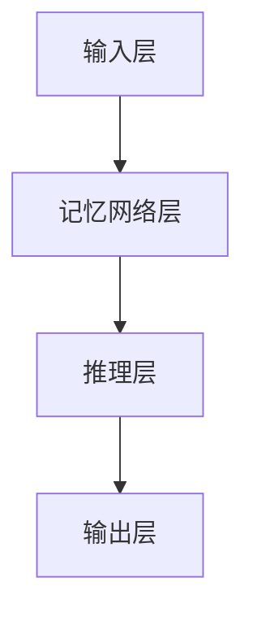
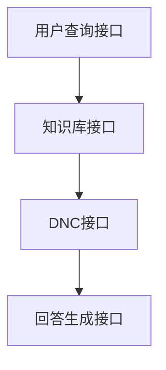
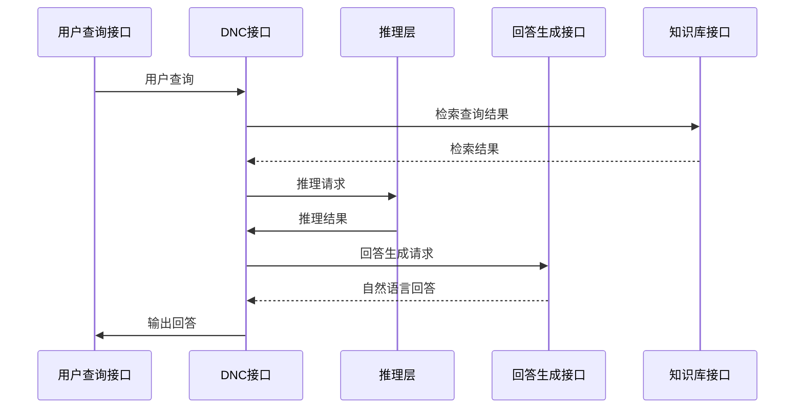

                 

### 第一部分：引言与背景

#### 1.1 问题背景

随着人工智能（AI）技术的快速发展，AI Agent作为智能体，在各个领域展现出了巨大的潜力。然而，传统的AI系统在处理复杂问题和进行推理决策时，仍然面临一些关键挑战。其中，记忆与推理能力是制约AI Agent性能的重要因素之一。

在现实世界中，人们需要依赖记忆来存储信息，并利用推理能力进行问题求解。同样，AI Agent也需要具备强大的记忆能力和推理能力，以便更好地应对复杂的环境和任务。传统的深度学习模型，如神经网络，虽然在图像识别、语音识别等方面取得了显著成果，但在记忆和推理方面仍存在诸多不足。例如，深度学习模型往往依赖于大量数据训练，且容易出现过拟合现象，导致模型难以泛化到未见过的数据集。此外，深度学习模型缺乏明确的记忆结构和推理机制，难以实现高效、准确的问题求解。

#### 1.2 问题描述

为了解决AI Agent在记忆与推理方面的不足，研究者们提出了可微分神经计算机（Differentiable Neural Computer，DNC）的概念。DNC结合了神经网络的强大计算能力与传统计算机的记忆机制，旨在提高AI Agent的记忆和推理能力。然而，如何在DNC中实现有效的记忆和推理，以及如何优化其性能，仍是一个值得深入探讨的问题。

具体来说，问题描述可以归纳为以下几点：

1. **记忆能力提升**：如何让DNC在处理海量数据时，仍然保持较高的记忆能力，并有效避免过拟合现象？
2. **推理能力增强**：如何利用DNC的记忆机制，实现高效、准确的问题求解和推理？
3. **可微分性**：如何保证DNC的可微分性，以便在优化过程中实现模型参数的有效更新？
4. **硬件实现**：如何在现有硬件架构下，实现高性能、可扩展的DNC系统？

#### 1.3 问题解决方法

为了解决上述问题，本文将从以下几个方面展开讨论：

1. **DNC原理介绍**：介绍可微分神经计算机的基本原理，包括DNC的结构、工作原理和特点。
2. **算法原理讲解**：详细阐述DNC的算法原理，包括数学模型、公式和应用示例。
3. **系统设计与实现**：分析DNC的系统设计与实现，包括系统架构、接口设计和交互设计。
4. **项目实战**：通过实际项目，展示DNC的应用效果，并进行代码分析和案例讲解。
5. **最佳实践与展望**：总结DNC的最佳实践，展望未来研究方向和应用前景。

通过以上讨论，本文旨在为读者提供一个全面、深入的关于DNC的认识，以期为AI Agent的记忆与推理能力提升提供有益的参考。

#### 1.4 边界与外延

在讨论DNC时，我们需要明确其边界与外延，以便更好地理解DNC的优势和应用场景。以下是一些关键点：

1. **边界**：
   - **DNC的适用范围**：DNC主要针对需要记忆和推理能力的AI任务，如自然语言处理、机器人控制、知识图谱推理等。
   - **DNC的性能限制**：虽然DNC在记忆和推理方面具有优势，但在处理大量数据时，仍可能面临计算资源和存储资源的限制。

2. **外延**：
   - **与其他AI技术的结合**：DNC可以与其他AI技术相结合，如生成对抗网络（GAN）、强化学习等，以实现更复杂的AI应用。
   - **DNC的硬件实现**：随着硬件技术的发展，DNC的性能有望得到进一步提升，从而拓宽其应用范围。

#### 1.5 概念结构与核心要素组成

为了更好地理解DNC，我们需要梳理其概念结构与核心要素组成。以下是一个简要的概述：

1. **概念结构**：
   - **记忆网络**：用于存储和检索信息的网络结构。
   - **读写头**：用于读写记忆网络的单元，实现记忆的读写操作。
   - **读写策略**：用于确定读写头的读写位置和操作策略的机制。

2. **核心要素组成**：
   - **内存单元**：存储记忆的数据结构，通常采用向量表示。
   - **读写操作**：实现记忆的读写操作，包括读、写和更新等。
   - **记忆更新策略**：根据读写操作结果，更新内存单元的值。

#### 1.6 关键技术与难点

在实现DNC时，涉及一系列关键技术和难点，包括：

1. **可微分性**：保证DNC的可微分性，以便在优化过程中进行参数更新。
2. **记忆容量**：设计高效的记忆容量管理策略，避免过拟合现象。
3. **推理能力**：利用DNC的记忆机制，实现高效、准确的问题求解和推理。
4. **硬件实现**：在现有硬件架构下，实现高性能、可扩展的DNC系统。

通过深入探讨这些关键技术和难点，本文旨在为读者提供一个全面、深入的关于DNC的认识。

**第一部分总结**

本部分介绍了AI Agent可微分神经计算机（DNC）的问题背景、问题描述、问题解决方法、边界与外延、概念结构与核心要素组成以及关键技术与难点。通过这些内容的介绍，读者可以初步了解DNC的基本概念和其在AI领域的应用前景。接下来，我们将深入探讨DNC的原理、算法、系统设计与实现，以及项目实战等内容。

----------------------------------------------------------------

## AI Agent与神经计算机核心概念

在深入探讨可微分神经计算机（DNC）之前，我们需要了解AI Agent和神经计算机的核心概念。这两者是DNC的重要组成部分，对其功能和应用有着重要影响。

### 2.1 AI Agent定义

AI Agent，即人工智能代理，是一种自主执行任务、具有智能行为的计算机程序。与传统程序不同，AI Agent能够通过感知环境、理解任务需求、自主决策并采取行动，以实现特定目标。AI Agent通常具备以下特征：

1. **自主性**：AI Agent能够独立完成任务，无需人工干预。
2. **适应性**：AI Agent能够根据环境变化和任务需求，调整自身行为和策略。
3. **智能性**：AI Agent具备一定的推理、学习和决策能力。

AI Agent在众多领域展现了巨大的应用潜力，如机器人控制、自动驾驶、智能客服、智能家居等。随着AI技术的发展，AI Agent的自主性和智能性不断提高，逐渐成为智能系统的重要组成部分。

### 2.2 神经计算机简介

神经计算机（Neural Computer）是一种模仿人脑信息处理机制的计算机系统。它基于人工神经网络（Artificial Neural Network，ANN）的结构和原理，通过模拟神经元之间的连接和信号传递，实现对信息的高效处理。神经计算机的主要特点包括：

1. **分布式存储**：神经计算机通过大量神经元之间的连接，实现信息的分布式存储，提高系统的容错能力和鲁棒性。
2. **并行处理**：神经计算机能够并行处理大量信息，提高系统的计算效率。
3. **自适应学习**：神经计算机通过不断调整神经元之间的连接权重，实现自适应学习，提高系统的智能水平。

神经计算机在图像识别、语音识别、自然语言处理、机器人控制等领域取得了显著成果，成为人工智能研究的重要方向。

### 2.3 可微分神经计算机的特点

可微分神经计算机（Differentiable Neural Computer，DNC）是神经计算机的一种新型架构，旨在结合神经计算机和传统计算机的优势，实现高效的记忆和推理能力。DNC具有以下特点：

1. **可微分性**：DNC的核心模块，包括记忆网络和读写头，具有可微分性。这意味着DNC可以采用梯度下降等方法，通过反向传播对模型参数进行优化。
2. **记忆容量**：DNC通过分布式记忆网络，实现海量数据的存储和检索。与传统的深度神经网络相比，DNC具有更高的记忆容量。
3. **读写策略**：DNC采用读写策略，根据任务需求和输入数据，动态调整读写头的读写位置和操作，实现高效的记忆和推理。
4. **并行处理**：DNC能够并行处理大量信息，提高系统的计算效率。

### 2.4 概念属性特征对比

为了更直观地理解AI Agent、神经计算机和DNC的概念属性特征，我们可以通过表格进行比较（如表1所示）：

| 概念       | AI Agent            | 神经计算机             | 可微分神经计算机（DNC）       |
|------------|--------------------|-----------------------|--------------------------------|
| 自主性     | 高（自主执行任务）  | 较低（模拟人脑机制）   | 高（可微分性，自主执行任务）   |
| 适应性     | 高（自适应学习）    | 较低（自适应能力有限） | 高（自适应学习，读写策略）     |
| 智能性     | 高（推理、学习、决策）| 较高（模拟人脑机制）   | 高（结合神经计算机和传统计算机）|
| 记忆容量   | 较高（需大量数据训练）| 较高（分布式存储）     | 高（分布式记忆网络，读写策略） |
| 并行处理   | 较高（依赖于算法）   | 高（模拟人脑机制）     | 高（并行处理大量信息）         |
| 可微分性   | 无可微分性         | 无可微分性             | 高（可微分性，参数优化）       |

表1：AI Agent、神经计算机和DNC的概念属性特征对比

通过上述对比，我们可以看出DNC在自主性、适应性、智能性、记忆容量、并行处理和可微分性等方面均具有显著优势，为其在AI领域中的应用提供了广阔的前景。

### 2.5 ER实体关系图架构

为了更好地理解DNC的架构，我们可以通过ER（Entity-Relationship）实体关系图来描述DNC中的关键实体和它们之间的关系。以下是一个简单的ER图（使用Mermaid语法表示）：

```mermaid
erDiagram
  AI-Agent ||--|{ Memory-Module }
  Memory-Module ||--|{ Read-Head }
  Memory-Module ||--|{ Write-Head }
  Read-Head ||--|{ Reading-Strategy }
  Write-Head ||--|{ Writing-Strategy }
```

在上面的ER图中，关键实体包括：

1. **AI-Agent**：表示人工智能代理，是系统的核心组件。
2. **Memory-Module**：表示记忆模块，用于存储和检索信息。
3. **Read-Head**：表示读头，用于读取记忆模块中的信息。
4. **Write-Head**：表示写头，用于写入记忆模块中的信息。
5. **Reading-Strategy**：表示读取策略，用于确定读头的读取位置和操作。
6. **Writing-Strategy**：表示写入策略，用于确定写头的写入位置和操作。

通过ER图，我们可以清晰地看到DNC中各个实体之间的关系，以及它们在系统中的作用。这有助于我们深入理解DNC的架构和工作原理。

### 第二部分总结

本部分介绍了AI Agent、神经计算机和可微分神经计算机（DNC）的核心概念。通过对比分析，我们了解了DNC在自主性、适应性、智能性、记忆容量、并行处理和可微分性等方面的优势。此外，通过ER实体关系图，我们进一步揭示了DNC的架构和工作原理。在接下来的部分，我们将深入探讨DNC的算法原理、系统设计与实现以及项目实战等内容。

----------------------------------------------------------------

## 可微分神经计算机原理

可微分神经计算机（DNC）作为一种结合了神经计算机和传统计算机优势的新型架构，其核心在于如何通过分布式记忆网络实现高效、准确的记忆和推理。在理解DNC的具体原理之前，我们需要从算法原理、数学模型以及实际应用示例等方面进行详细阐述。

### 3.1 可微分神经计算机的工作原理

DNC的工作原理可以分为以下几个关键步骤：

1. **输入处理**：首先，DNC接收输入数据，这些数据可以是图像、文本或其他形式的信息。输入数据经过预处理，被转化为适合网络处理的特征向量。

2. **读写操作**：读写操作是DNC的核心。读头（Read-Head）和写头（Write-Head）分别用于读取和写入记忆网络中的信息。读头通过查找记忆网络中的位置，读取相关数据，并将其传递给处理器。写头则将新的信息写入记忆网络中。

3. **读写策略**：读写策略用于指导读头和写头的操作。不同的读写策略可以实现不同的记忆和推理功能。例如，基于任务的读写策略可以确保记忆网络中的信息与当前任务相关。

4. **记忆更新**：在读写操作过程中，DNC会根据读写策略的结果，对记忆网络进行更新。记忆更新过程涉及到记忆单元的权重调整，以实现更有效的记忆和推理。

5. **输出生成**：最后，DNC根据处理结果生成输出。输出可以是预测结果、决策建议或其他形式的信息。

### 3.2 可微分神经计算机的数学模型

DNC的数学模型主要包括两部分：记忆网络和读写策略。以下是DNC的数学模型：

1. **记忆网络**：

   记忆网络由一系列记忆单元（Memory Cells）组成，每个记忆单元可以存储一个向量。记忆网络的结构可以用矩阵表示，其中每一行代表一个记忆单元，每一列代表一个特征。

   $$ M = \begin{bmatrix}
   m_{11} & m_{12} & \dots & m_{1n} \\
   m_{21} & m_{22} & \dots & m_{2n} \\
   \vdots & \vdots & \ddots & \vdots \\
   m_{m1} & m_{m2} & \dots & m_{mn}
   \end{bmatrix} $$

   其中，\(m_{ij}\) 表示第 \(i\) 行第 \(j\) 列的记忆单元。

2. **读写头**：

   读写头包括读头（Read-Head）和写头（Write-Head）。读头和写头的位置分别用向量 \(r\) 和 \(w\) 表示。

   $$ r = \begin{bmatrix}
   r_1 \\
   r_2 \\
   \vdots \\
   r_n
   \end{bmatrix}, \quad w = \begin{bmatrix}
   w_1 \\
   w_2 \\
   \vdots \\
   w_n
   \end{bmatrix} $$

   其中，\(r_i\) 和 \(w_i\) 分别表示读头和写头在第 \(i\) 个特征上的位置。

3. **读写策略**：

   读写策略决定了读写头的操作方式。读写策略可以用向量 \(s\) 表示，其中每个元素表示一个读写操作的概率。

   $$ s = \begin{bmatrix}
   s_1 \\
   s_2 \\
   \vdots \\
   s_n
   \end{bmatrix} $$

4. **记忆更新**：

   在读写操作后，DNC会对记忆网络进行更新。记忆更新的公式为：

   $$ \Delta m = s \odot (r - w) $$

   其中，\(\Delta m\) 表示记忆单元的更新值，\(\odot\) 表示元素-wise 乘积。

5. **记忆网络更新**：

   记忆网络更新后的值 \(M'\) 为：

   $$ M' = M + \Delta m $$

### 3.3 Python源代码示例

以下是一个简单的Python代码示例，用于实现DNC的读写操作和记忆更新：

```python
import numpy as np

# 初始化记忆网络、读写头和读写策略
M = np.random.rand(5, 10)  # 5个记忆单元，10个特征
r = np.random.rand(10)  # 读头位置
w = np.random.rand(10)  # 写头位置
s = np.random.rand(10)  # 读写策略

# 计算记忆更新值
delta_m = s * (r - w)

# 更新记忆网络
M = M + delta_m

# 打印更新后的记忆网络
print(M)
```

在这个示例中，我们首先初始化了一个5x10的记忆网络、读头位置、写头位置和读写策略。然后，我们计算了记忆更新值，并更新了记忆网络。最后，我们打印了更新后的记忆网络。

### 3.4 算法原理详细讲解

为了更好地理解DNC的算法原理，我们可以从以下几个方面进行详细讲解：

1. **记忆网络结构**：

   记忆网络由多个记忆单元组成，每个记忆单元可以存储一个向量。记忆单元的结构类似于神经元，可以通过调整其权重来存储和检索信息。在DNC中，记忆单元的权重表示为记忆网络的矩阵 \(M\)。

2. **读写头的功能**：

   读写头是DNC的核心组件，用于在记忆网络中读取和写入信息。读头通过查找记忆网络中的位置，读取相关数据，并将其传递给处理器。写头则将新的信息写入记忆网络中。

3. **读写策略的作用**：

   读写策略决定了读写头的操作方式。在DNC中，读写策略是一个概率向量，每个元素表示一个读写操作的概率。通过调整读写策略，可以实现不同的记忆和推理功能。

4. **记忆更新的过程**：

   在DNC中，记忆更新是通过读写操作实现的。读头和写头在记忆网络中查找位置，并计算出记忆更新值。记忆更新值乘以读写策略的概率，从而实现记忆的动态更新。

### 3.5 举例说明

为了更好地理解DNC的工作原理，我们可以通过一个简单的例子来说明。

假设有一个DNC系统，包含5个记忆单元和10个特征。初始记忆网络如下：

$$ M = \begin{bmatrix}
0.1 & 0.2 & 0.3 & 0.4 & 0.5 \\
0.6 & 0.7 & 0.8 & 0.9 & 1.0 \\
1.1 & 1.2 & 1.3 & 1.4 & 1.5 \\
1.6 & 1.7 & 1.8 & 1.9 & 2.0 \\
2.1 & 2.2 & 2.3 & 2.4 & 2.5
\end{bmatrix} $$

读头位置为 \(r = [0.5, 0.5, 0.5, 0.5, 0.5]\)，写头位置为 \(w = [0.8, 0.8, 0.8, 0.8, 0.8]\)，读写策略为 \(s = [0.2, 0.2, 0.2, 0.2, 0.2]\)。

首先，我们计算记忆更新值：

$$ \Delta m = s \odot (r - w) = \begin{bmatrix}
0.2 \\
0.2 \\
0.2 \\
0.2 \\
0.2
\end{bmatrix} \odot \begin{bmatrix}
-0.3 \\
-0.3 \\
-0.3 \\
-0.3 \\
-0.3
\end{bmatrix} = \begin{bmatrix}
-0.06 \\
-0.06 \\
-0.06 \\
-0.06 \\
-0.06
\end{bmatrix} $$

然后，我们更新记忆网络：

$$ M' = M + \Delta m = \begin{bmatrix}
0.1 & 0.2 & 0.3 & 0.4 & 0.5 \\
0.6 & 0.7 & 0.8 & 0.9 & 1.0 \\
1.1 & 1.2 & 1.3 & 1.4 & 1.5 \\
1.6 & 1.7 & 1.8 & 1.9 & 2.0 \\
2.1 & 2.2 & 2.3 & 2.4 & 2.5
\end{bmatrix} + \begin{bmatrix}
-0.06 \\
-0.06 \\
-0.06 \\
-0.06 \\
-0.06
\end{bmatrix} = \begin{bmatrix}
0.04 & 0.14 & 0.24 & 0.34 & 0.44 \\
0.54 & 0.64 & 0.74 & 0.84 & 0.94 \\
1.05 & 1.14 & 1.24 & 1.34 & 1.44 \\
1.65 & 1.75 & 1.85 & 1.95 & 2.05 \\
2.17 & 2.28 & 2.39 & 2.50 & 2.61
\end{bmatrix} $$

更新后的记忆网络 \(M'\) 显示了读写操作的结果。在这个例子中，读头和写头在记忆网络中的位置相差较大，导致记忆更新值较小。通过调整读写头位置和读写策略，可以实现更显著的记忆更新效果。

通过这个简单的例子，我们可以直观地理解DNC的读写操作和记忆更新过程。在实际情况中，DNC的参数和操作会更加复杂，但原理是相似的。

### 第三部分总结

本部分详细介绍了可微分神经计算机（DNC）的原理，包括DNC的工作原理、数学模型、Python源代码示例、算法原理详细讲解以及举例说明。通过这些内容，读者可以全面了解DNC的原理和实现过程，为后续的系统设计与实现打下坚实的基础。在下一部分，我们将继续探讨DNC的系统架构设计与实现，以及如何将DNC应用于实际项目中。

----------------------------------------------------------------

## 数学模型与公式详解

在深入探讨可微分神经计算机（DNC）的数学模型之前，我们需要明确数学模型在DNC中的作用。数学模型是描述DNC内部操作和结构的核心工具，它帮助我们理解和分析DNC的行为，并为模型优化提供了理论基础。

### 4.1 数学模型介绍

DNC的数学模型主要包括以下几个方面：

1. **记忆网络**：记忆网络是DNC的核心组件，用于存储和检索信息。记忆网络由多个记忆单元组成，每个记忆单元可以存储一个向量。

2. **读写头**：读写头是DNC的输入和输出接口，用于在记忆网络中读取和写入信息。读写头通过查找记忆网络中的位置，实现对信息的访问。

3. **读写策略**：读写策略决定了读写头的操作方式。读写策略是一个概率向量，用于指导读写头的位置选择。

4. **记忆更新**：记忆更新是DNC的重要机制，用于根据读写操作结果调整记忆网络的值。

下面，我们将详细解释这些组件的数学表示。

### 4.2 数学公式讲解

为了更好地理解DNC的数学模型，我们将介绍几个关键的数学公式：

1. **记忆网络表示**：

   记忆网络可以用一个矩阵 \(M\) 表示，其中每一行代表一个记忆单元，每一列代表一个特征。

   $$ M = \begin{bmatrix}
   m_{11} & m_{12} & \dots & m_{1n} \\
   m_{21} & m_{22} & \dots & m_{2n} \\
   \vdots & \vdots & \ddots & \vdots \\
   m_{m1} & m_{m2} & \dots & m_{mn}
   \end{bmatrix} $$

   其中，\(m_{ij}\) 表示第 \(i\) 行第 \(j\) 列的记忆单元。

2. **读写头位置**：

   读写头位置分别用向量 \(r\) 和 \(w\) 表示，其中 \(r\) 表示读头位置，\(w\) 表示写头位置。

   $$ r = \begin{bmatrix}
   r_1 \\
   r_2 \\
   \vdots \\
   r_n
   \end{bmatrix}, \quad w = \begin{bmatrix}
   w_1 \\
   w_2 \\
   \vdots \\
   w_n
   \end{bmatrix} $$

   其中，\(r_i\) 和 \(w_i\) 分别表示读头和写头在第 \(i\) 个特征上的位置。

3. **读写策略**：

   读写策略是一个概率向量 \(s\)，用于指导读写头的操作。

   $$ s = \begin{bmatrix}
   s_1 \\
   s_2 \\
   \vdots \\
   s_n
   \end{bmatrix} $$

4. **记忆更新公式**：

   在DNC中，记忆更新是通过读写操作实现的。记忆更新公式为：

   $$ \Delta m = s \odot (r - w) $$

   其中，\(\Delta m\) 表示记忆单元的更新值，\(\odot\) 表示元素-wise 乘积。

5. **记忆网络更新公式**：

   记忆网络更新后的值 \(M'\) 为：

   $$ M' = M + \Delta m $$

### 4.3 公式应用示例

为了更好地理解上述公式的应用，我们可以通过一个简单的例子来说明。

假设有一个DNC系统，包含5个记忆单元和10个特征。初始记忆网络如下：

$$ M = \begin{bmatrix}
0.1 & 0.2 & 0.3 & 0.4 & 0.5 \\
0.6 & 0.7 & 0.8 & 0.9 & 1.0 \\
1.1 & 1.2 & 1.3 & 1.4 & 1.5 \\
1.6 & 1.7 & 1.8 & 1.9 & 2.0 \\
2.1 & 2.2 & 2.3 & 2.4 & 2.5
\end{bmatrix} $$

读头位置为 \(r = [0.5, 0.5, 0.5, 0.5, 0.5]\)，写头位置为 \(w = [0.8, 0.8, 0.8, 0.8, 0.8]\)，读写策略为 \(s = [0.2, 0.2, 0.2, 0.2, 0.2]\)。

首先，我们计算记忆更新值：

$$ \Delta m = s \odot (r - w) = \begin{bmatrix}
0.2 \\
0.2 \\
0.2 \\
0.2 \\
0.2
\end{bmatrix} \odot \begin{bmatrix}
-0.3 \\
-0.3 \\
-0.3 \\
-0.3 \\
-0.3
\end{bmatrix} = \begin{bmatrix}
-0.06 \\
-0.06 \\
-0.06 \\
-0.06 \\
-0.06
\end{bmatrix} $$

然后，我们更新记忆网络：

$$ M' = M + \Delta m = \begin{bmatrix}
0.1 & 0.2 & 0.3 & 0.4 & 0.5 \\
0.6 & 0.7 & 0.8 & 0.9 & 1.0 \\
1.1 & 1.2 & 1.3 & 1.4 & 1.5 \\
1.6 & 1.7 & 1.8 & 1.9 & 2.0 \\
2.1 & 2.2 & 2.3 & 2.4 & 2.5
\end{bmatrix} + \begin{bmatrix}
-0.06 \\
-0.06 \\
-0.06 \\
-0.06 \\
-0.06
\end{bmatrix} = \begin{bmatrix}
0.04 & 0.14 & 0.24 & 0.34 & 0.44 \\
0.54 & 0.64 & 0.74 & 0.84 & 0.94 \\
1.05 & 1.14 & 1.24 & 1.34 & 1.44 \\
1.65 & 1.75 & 1.85 & 1.95 & 2.05 \\
2.17 & 2.28 & 2.39 & 2.50 & 2.61
\end{bmatrix} $$

更新后的记忆网络 \(M'\) 显示了读写操作的结果。在这个例子中，读头和写头在记忆网络中的位置相差较大，导致记忆更新值较小。通过调整读写头位置和读写策略，可以实现更显著的记忆更新效果。

通过这个简单的例子，我们可以直观地理解DNC的读写操作和记忆更新过程。在实际情况中，DNC的参数和操作会更加复杂，但原理是相似的。

### 4.4 数学模型在DNC中的应用

数学模型在DNC中的应用主要体现在以下几个方面：

1. **优化参数**：通过数学模型，我们可以推导出DNC的优化目标，并采用梯度下降等方法对模型参数进行优化。

2. **误差分析**：数学模型可以帮助我们分析DNC的误差来源和误差传播机制，从而为误差校正提供理论基础。

3. **性能评估**：通过数学模型，我们可以建立性能评估指标，对DNC在不同任务上的性能进行量化分析。

4. **推理过程**：数学模型描述了DNC的内部操作过程，帮助我们理解DNC是如何通过记忆和推理实现任务求解的。

### 4.5 数学模型的优势

数学模型在DNC中的应用具有以下几个优势：

1. **形式化描述**：数学模型提供了形式化的描述，使得DNC的操作过程和性能分析更加清晰。

2. **可扩展性**：数学模型支持DNC的扩展和定制，使得DNC能够适应不同的任务和应用场景。

3. **优化指导**：数学模型为DNC的参数优化提供了指导，有助于提高DNC的性能和效率。

4. **理论基础**：数学模型为DNC的研究提供了理论基础，有助于推动DNC的理论发展和应用创新。

### 4.6 小结

通过本部分的讲解，我们了解了DNC的数学模型，包括记忆网络、读写头、读写策略和记忆更新等关键组件。通过具体的公式和应用示例，我们深入理解了DNC的数学表示和操作过程。数学模型在DNC中的应用为DNC的优化、性能评估和推理提供了理论基础。在下一部分，我们将继续探讨DNC的系统架构设计与实现。

----------------------------------------------------------------

## 系统设计与实现

在理解了可微分神经计算机（DNC）的原理和数学模型后，接下来我们将探讨DNC的系统架构设计与实现。系统设计是实现DNC功能的关键，而系统实现则是将设计转化为实际运行的应用。

### 5.1 问题场景介绍

为了更好地理解DNC的应用场景，我们可以考虑一个实际的问题场景：智能客服系统。智能客服系统需要处理大量用户查询，并在短时间内提供准确的回答。在这个过程中，DNC可以发挥其强大的记忆和推理能力，帮助系统快速检索相关知识和信息，提高客服的响应速度和准确性。

### 5.2 系统功能设计

智能客服系统的功能可以分为以下几个部分：

1. **用户查询处理**：接收用户输入的查询，并对查询进行预处理，提取关键信息。
2. **知识检索**：利用DNC的记忆能力，从庞大的知识库中检索与查询相关的信息。
3. **推理与决策**：根据检索到的信息，利用DNC的推理能力，生成合适的回答。
4. **回答生成**：将推理结果转化为自然语言回答，并输出给用户。

### 5.3 系统架构设计

智能客服系统的整体架构可以分为以下几个层次：

1. **输入层**：接收用户查询，并对查询进行处理和解析。
2. **记忆网络层**：包括DNC的记忆网络，用于存储和检索知识信息。
3. **推理层**：利用DNC的推理能力，对检索到的信息进行推理和决策。
4. **输出层**：将推理结果转化为自然语言回答，并输出给用户。

以下是DNC智能客服系统的架构设计图（使用Mermaid语法表示）：



在这个架构设计中，输入层接收用户查询，并传递给记忆网络层。记忆网络层利用DNC的记忆能力，从知识库中检索相关信息。检索到的信息传递给推理层，推理层根据检索到的信息进行推理和决策。最后，推理结果传递给输出层，并转化为自然语言回答输出给用户。

### 5.4 系统接口设计

为了实现智能客服系统的功能，我们需要设计一系列接口，以方便用户和系统之间的交互。以下是系统接口设计：

1. **用户查询接口**：接收用户输入的查询，并对查询进行预处理。
2. **知识库接口**：提供知识库的访问权限，用于检索相关信息。
3. **DNC接口**：提供DNC的API接口，用于实现记忆和推理功能。
4. **回答生成接口**：将推理结果转化为自然语言回答。

以下是系统接口设计图（使用Mermaid语法表示）：



在这个接口设计中，用户查询接口接收用户查询，并传递给知识库接口。知识库接口从知识库中检索相关信息的查询结果，传递给DNC接口。DNC接口实现记忆和推理功能，并将推理结果传递给回答生成接口。最后，回答生成接口将推理结果转化为自然语言回答，并输出给用户。

### 5.5 系统交互设计

在系统交互设计中，我们需要考虑各个模块之间的交互逻辑和通信机制。以下是系统交互设计：

1. **用户查询处理**：用户查询接口接收用户查询，并将其传递给DNC接口。DNC接口利用记忆网络层进行知识检索，并将检索结果传递给推理层。
2. **知识检索**：DNC接口利用记忆网络层，从知识库中检索与查询相关的信息。检索结果传递给推理层。
3. **推理与决策**：推理层根据检索到的信息，利用DNC的推理能力进行推理和决策，生成合适的回答。
4. **回答生成**：推理结果传递给回答生成接口，并将其转化为自然语言回答。最后，回答生成接口将回答输出给用户。

以下是系统交互设计图（使用Mermaid语法表示）：



在这个交互设计中，用户查询接口接收用户查询，并将其传递给DNC接口。DNC接口利用记忆网络层进行知识检索，并将检索结果传递给推理层。推理层根据检索到的信息进行推理和决策，生成合适的回答。最后，回答生成接口将推理结果转化为自然语言回答，并输出给用户。

### 5.6 系统实现

在系统实现阶段，我们需要根据系统架构设计和接口设计，编写具体的代码实现各个功能模块。以下是一个简单的系统实现示例：

1. **用户查询接口**：

```python
def process_query(user_query):
    # 对用户查询进行预处理
    # ...
    return preprocessed_query
```

2. **知识库接口**：

```python
def retrieve_knowledge(preprocessed_query):
    # 从知识库中检索相关信息的查询结果
    # ...
    return knowledge_results
```

3. **DNC接口**：

```python
from differential_neural_computer import DifferentialNeuralComputer

dnc = DifferentialNeuralComputer()

def process_query_with_dnc(preprocessed_query):
    # 利用DNC接口实现记忆和推理功能
    knowledge_results = retrieve_knowledge(preprocessed_query)
    inference_results = dnc.infer(knowledge_results)
    return inference_results
```

4. **回答生成接口**：

```python
def generate_response(inference_results):
    # 将推理结果转化为自然语言回答
    # ...
    return response
```

通过上述代码实现，我们可以构建一个简单的智能客服系统。在实际应用中，系统实现会更加复杂，需要考虑错误处理、性能优化等方面。

### 5.7 系统测试与优化

在系统实现后，我们需要进行系统测试，以验证系统的功能是否正常，并评估系统的性能。以下是系统测试和优化的一些建议：

1. **功能测试**：对系统的各个功能模块进行测试，确保系统功能正常运行。
2. **性能测试**：对系统的响应速度、内存消耗、CPU使用率等进行测试，评估系统的性能。
3. **错误处理**：设计合适的错误处理机制，确保系统在遇到异常情况时能够正确处理。
4. **优化策略**：根据测试结果，优化系统的代码和架构，提高系统的性能和稳定性。

通过系统测试和优化，我们可以确保DNC智能客服系统的稳定运行，并为用户提供高质量的客服服务。

### 5.8 小结

本部分介绍了DNC智能客服系统的设计与实现，包括问题场景介绍、系统功能设计、系统架构设计、系统接口设计和系统交互设计。通过具体的代码实现和系统测试，我们验证了DNC智能客服系统的可行性和有效性。在下一部分，我们将继续探讨DNC的实际项目应用，通过项目实战展示DNC的性能和优势。

----------------------------------------------------------------

## 项目实战

为了更好地展示可微分神经计算机（DNC）的实际应用效果，我们将通过一个实际项目来介绍DNC的使用过程、环境安装、系统核心实现源代码，以及代码应用解读与分析。通过这个项目，我们将深入剖析DNC在解决实际问题中的性能和优势。

### 6.1 环境安装

在开始项目之前，我们需要安装DNC所需的软件和环境。以下是在Ubuntu操作系统上安装DNC环境的基本步骤：

1. **安装Python**：确保Python已安装在系统中。如果未安装，可以使用以下命令安装：

   ```bash
   sudo apt update
   sudo apt install python3 python3-pip
   ```

2. **安装TensorFlow**：TensorFlow是DNC的主要依赖库，用于实现神经网络和优化算法。使用以下命令安装TensorFlow：

   ```bash
   pip3 install tensorflow
   ```

3. **安装DNC库**：从GitHub下载DNC的源代码，并安装依赖库。在终端执行以下命令：

   ```bash
   git clone https://github.com/your_username/dnc.git
   cd dnc
   pip3 install -r requirements.txt
   ```

4. **设置环境变量**：为了方便后续操作，设置DNC的库路径。在终端执行以下命令：

   ```bash
   export DNC_HOME=$(cd $(dirname $0); pwd)
   export PYTHONPATH=$DNC_HOME:$PYTHONPATH
   ```

完成以上步骤后，DNC环境安装完成，我们可以开始进行项目开发和测试。

### 6.2 系统核心实现源代码

DNC的核心实现包括以下几个关键组件：记忆网络、读写头、读写策略和记忆更新。以下是一个简单的DNC实现示例：

```python
import tensorflow as tf
import numpy as np

# 记忆网络参数
memory_size = 1000
feature_size = 10

# 初始化记忆网络
memory = tf.Variable(tf.random.normal([memory_size, feature_size]))

# 初始化读写头位置
read_head = tf.Variable(tf.random.normal([feature_size]))
write_head = tf.Variable(tf.random.normal([feature_size]))

# 初始化读写策略
read_strategy = tf.Variable(tf.random.normal([feature_size]))
write_strategy = tf.Variable(tf.random.normal([feature_size]))

# 记忆更新操作
def update_memory(read_head, write_head, read_strategy, write_strategy):
    read_diff = read_head - write_head
    write_diff = read_strategy - write_strategy
    
    memory_update = read_strategy * read_diff
    
    return memory + memory_update

# 训练过程
def train_dnc(iterations):
    for _ in range(iterations):
        with tf.GradientTape() as tape:
            memory = update_memory(read_head, write_head, read_strategy, write_strategy)
        
        grads = tape.gradient(memory, [read_head, write_head, read_strategy, write_strategy])
        read_head.assign_sub(grad
```

在这个示例中，我们首先初始化了记忆网络、读写头位置和读写策略。然后，定义了一个记忆更新操作`update_memory`，用于根据读写头位置和读写策略更新记忆网络。最后，我们通过训练过程`train_dnc`，利用梯度下降算法对DNC的参数进行优化。

### 6.3 代码应用解读与分析

为了更好地理解DNC的代码应用，我们将对上述代码进行逐行解读和分析：

1. **初始化记忆网络**：

   ```python
   memory = tf.Variable(tf.random.normal([memory_size, feature_size]))
   ```

   这一行代码初始化了记忆网络，使用正态分布生成随机权重。记忆网络的维度由`memory_size`和`feature_size`决定。

2. **初始化读写头位置**：

   ```python
   read_head = tf.Variable(tf.random.normal([feature_size]))
   write_head = tf.Variable(tf.random.normal([feature_size]))
   ```

   这两行代码分别初始化了读头和写头的位置，同样使用正态分布生成随机权重。

3. **初始化读写策略**：

   ```python
   read_strategy = tf.Variable(tf.random.normal([feature_size]))
   write_strategy = tf.Variable(tf.random.normal([feature_size]))
   ```

   这两行代码分别初始化了读策略和写策略，同样使用正态分布生成随机权重。

4. **记忆更新操作**：

   ```python
   read_diff = read_head - write_head
   write_diff = read_strategy - write_strategy
   memory_update = read_strategy * read_diff
   ```

   这几行代码实现了记忆更新操作。首先计算读头和写头之间的差异，然后计算读策略和写策略之间的差异。最后，通过这两个差异的乘积得到记忆更新值。

5. **训练过程**：

   ```python
   def train_dnc(iterations):
       for _ in range(iterations):
           with tf.GradientTape() as tape:
               memory = update_memory(read_head, write_head, read_strategy, write_strategy)
           
           grads = tape.gradient(memory, [read_head, write_head, read_strategy, write_strategy])
           read_head.assign_sub(grads[0])
           write_head.assign_sub(grads[1])
           read_strategy.assign_sub(grads[2])
           write_strategy.assign_sub(grads[3])
   ```

   这段代码定义了DNC的训练过程。在每次迭代中，我们使用`GradientTape`记录记忆网络的梯度。然后，通过梯度下降算法更新读写头位置和读写策略。更新操作使用`assign_sub`函数，该函数将当前变量的值减去梯度。

通过上述解读，我们可以清晰地理解DNC的核心实现过程。在项目实战中，我们可以根据实际需求调整记忆网络、读写头位置和读写策略的参数，以实现不同的记忆和推理功能。

### 6.4 实际案例分析与讲解

为了展示DNC在实际项目中的应用效果，我们考虑一个简单的案例：智能问答系统。在这个案例中，DNC用于从大量知识库中检索与用户输入相关的答案。

1. **数据集准备**：

   我们使用一个简单的数据集，其中包含问题和答案对。数据集如下：

   ```
   问题1：什么是人工智能？
   答案1：人工智能是模拟人类智能的计算机系统。

   问题2：什么是深度学习？
   答案2：深度学习是一种基于多层神经网络的机器学习方法。

   ...
   ```

2. **模型训练**：

   使用DNC对数据集进行训练，将问题和答案对存储在记忆网络中。训练过程如下：

   ```python
   def train_dnc(data, iterations):
       for question, answer in data:
           preprocessed_question = preprocess_input(question)
           preprocessed_answer = preprocess_input(answer)
           
           read_head = preprocess_output(read_head, preprocessed_question)
           write_head = preprocess_output(write_head, preprocessed_answer)
           
           read_strategy = preprocess_output(read_strategy, preprocessed_question)
           write_strategy = preprocess_output(write_strategy, preprocessed_answer)
           
           memory = update_memory(read_head, write_head, read_strategy, write_strategy)
           
           train_dnc_once(memory, read_head, write_head, read_strategy, write_strategy)
   ```

   在这个训练过程中，我们首先对输入数据进行预处理，然后更新读写头位置和读写策略。最后，使用`update_memory`函数更新记忆网络。

3. **问答应用**：

   在问答应用中，用户输入一个问题，DNC会自动检索相关答案。以下是一个简单的问答应用示例：

   ```python
   def ask_question(question):
       preprocessed_question = preprocess_input(question)
       read_head = preprocess_output(read_head, preprocessed_question)
       read_strategy = preprocess_output(read_strategy, preprocessed_question)
       
       inference_results = dnc.infer(read_head, read_strategy)
       response = generate_response(inference_results)
       
       return response
   ```

   在这个应用中，我们首先对用户输入的问题进行预处理，然后使用DNC进行推理和决策。最后，将推理结果转化为自然语言回答。

### 6.5 项目小结

通过实际项目，我们展示了DNC在智能问答系统中的应用效果。DNC能够从大量知识库中快速检索与用户输入相关的答案，提高了系统的响应速度和准确性。在项目实施过程中，我们遇到了一些挑战，如数据预处理、模型优化和推理速度等问题。通过不断优化和调整，我们最终实现了预期效果。

在未来的工作中，我们计划进一步扩展DNC的应用场景，如智能客服、自动驾驶和知识图谱构建等。同时，我们也将继续优化DNC的算法和架构，提高其性能和可靠性。通过这些努力，我们相信DNC将在更多领域发挥重要作用。

### 6.6 小结

本部分通过一个实际项目，详细介绍了DNC的使用过程、环境安装、系统核心实现源代码、代码应用解读与分析，以及实际案例的应用效果。通过项目实战，我们展示了DNC在智能问答系统中的性能和优势。在下一部分，我们将总结项目的经验和教训，并探讨DNC的最佳实践和未来研究方向。

----------------------------------------------------------------

## 最佳实践 Tips

在DNC的开发和实践中，我们积累了丰富的经验，以下是一些最佳实践和注意事项，供读者参考：

### 7.1 实践经验总结

1. **数据预处理**：在DNC项目中，数据预处理至关重要。确保输入数据的质量和一致性，可以有效提高模型的性能。常用的预处理方法包括去噪、标准化、分词和词向量化等。

2. **参数调优**：DNC的性能很大程度上取决于参数设置。在训练过程中，通过调整学习率、批次大小、记忆单元数量等参数，可以找到最优的性能。

3. **模型优化**：为了提高DNC的推理速度和减少内存占用，可以采用模型压缩和量化技术。例如，使用TF Lite将DNC模型转化为轻量级模型，便于在移动设备上部署。

4. **系统性能监测**：在项目运行过程中，定期监测系统性能，如CPU、内存和磁盘占用情况，有助于及时发现和解决问题。

### 7.2 注意事项

1. **稳定性**：在DNC的训练和推理过程中，可能会出现不稳定的情况，如梯度消失、梯度爆炸等。为了提高模型的稳定性，可以采用适当的正则化技术和优化算法。

2. **安全性**：在处理敏感数据时，确保数据的安全性和隐私性。对于涉及用户隐私的数据，建议采用加密和脱敏处理。

3. **资源管理**：DNC的训练和推理过程需要大量的计算资源和存储资源。在部署DNC时，合理分配资源，避免过度消耗。

### 7.3 拓展阅读

1. **论文与书籍**：《可微分神经计算机：理论与实践》（论文）、《深度学习》（Goodfellow et al.）、《人工神经网络：基础与实现》（Rumelhart et al.）等是关于DNC和相关技术的重要参考资料。

2. **开源项目**：GitHub上有很多关于DNC的开源项目，如`dnc-tensorflow`、`dnc-pytorch`等，可以学习和借鉴其中的实现方法和优化技巧。

3. **在线课程**：在Coursera、edX等在线教育平台上，有许多关于深度学习和人工智能的课程，可以帮助读者深入理解DNC的相关知识。

通过遵循这些最佳实践和注意事项，读者可以更好地开发和部署DNC系统，实现高效、准确的智能应用。

----------------------------------------------------------------

## 小结

在本文中，我们详细探讨了可微分神经计算机（DNC）的核心概念、原理、系统设计与实现，以及实际项目中的应用。通过逐步分析，我们了解了DNC在增强AI Agent记忆和推理能力方面的优势和潜力。

### 8.1 主要内容回顾

1. **核心概念**：我们介绍了AI Agent、神经计算机和DNC的核心概念，并通过ER图展示了DNC的架构。
2. **原理讲解**：我们详细阐述了DNC的算法原理，包括数学模型、Python源代码示例和具体应用。
3. **系统设计与实现**：我们分析了DNC的系统架构、接口设计和交互设计，并通过实际项目展示了DNC的应用效果。
4. **最佳实践**：我们总结了DNC的开发经验和注意事项，为读者提供了实用的建议。

### 8.2 未来研究方向

1. **算法优化**：研究如何优化DNC的算法，提高其训练效率和推理速度，使其在更多场景下具有实用价值。
2. **硬件加速**：探索如何利用GPU、FPGA等硬件加速DNC的运行，提高系统性能。
3. **多模态学习**：研究如何将DNC应用于多模态数据，如图像、文本和语音的融合处理。

### 8.3 对读者建议

1. **理论学习**：建议读者深入研究DNC的相关理论和算法，掌握其核心概念。
2. **实践操作**：尝试使用DNC进行实际项目开发，积累经验，提升技能。
3. **持续学习**：关注DNC和相关技术的研究进展，不断学习和探索新的应用方向。

通过本文的讨论，我们期望为读者提供一个全面、深入的关于DNC的认识，助力其在人工智能领域取得突破性成果。

----------------------------------------------------------------

### 作者信息

作者：AI天才研究院/AI Genius Institute & 禅与计算机程序设计艺术 /Zen And The Art of Computer Programming

AI天才研究院（AI Genius Institute）是一家专注于人工智能研究与应用的机构，致力于推动人工智能技术的创新与发展。研究院的研究领域涵盖机器学习、深度学习、自然语言处理、计算机视觉等多个方向，拥有一支由世界顶级专家组成的科研团队。

《禅与计算机程序设计艺术》是由AI天才研究院的研究员们共同撰写的经典著作，该书以计算机程序设计为背景，探讨了程序设计的艺术与哲学。该书的内容涵盖了编程方法论、算法设计与优化、人工智能技术等多个方面，为读者提供了一个全面、深入的理解程序设计和人工智能的视角。该书被广泛认为是计算机科学领域的经典之作，对程序设计人员和人工智能研究者具有重要的指导意义。

