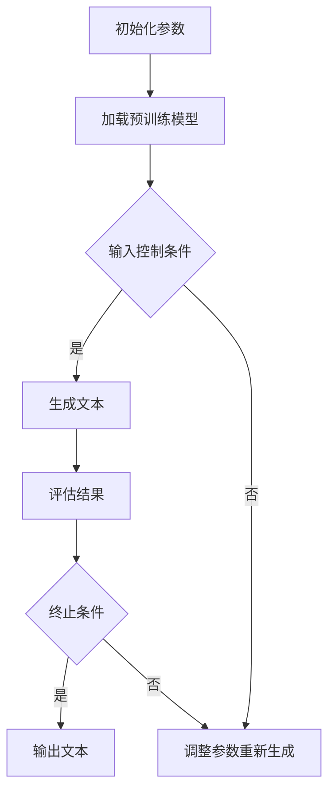
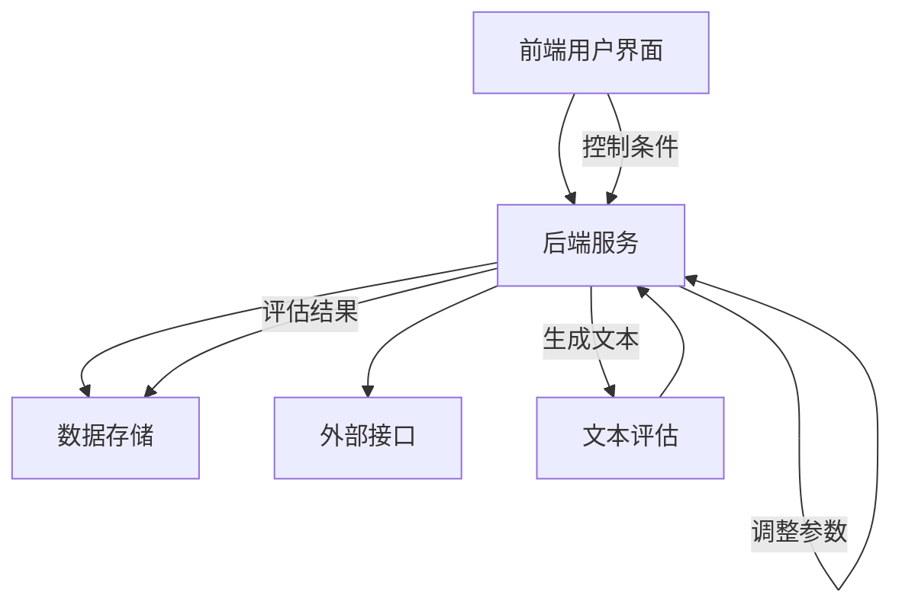
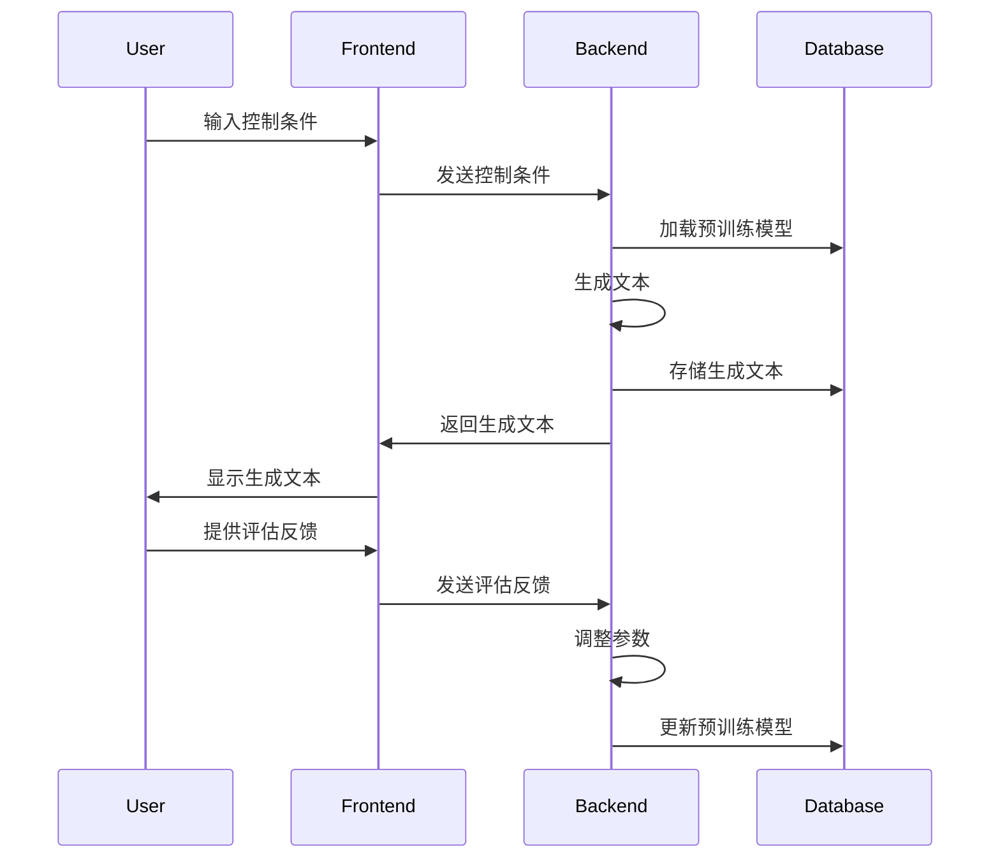

                 

### 《AI Agent的可控文本生成：精确调节LLM的输出特征》

#### 关键词：
- AI Agent
- 可控文本生成
- LLM
- 算法原理
- 数学模型
- 系统架构

#### 摘要：
本文深入探讨了AI Agent的可控文本生成技术，重点分析了大型语言模型（LLM）的输出特征如何被精确调节。文章从背景介绍、核心概念与联系、算法原理讲解、数学模型与算法举例、系统分析与架构设计、项目实战以及最佳实践等方面进行了详细阐述，旨在为开发者提供全面的技术参考和实践指导。

### 目录大纲设计思路

在撰写本文之前，我们首先明确了文章的目录大纲设计思路，以确保内容的逻辑清晰、结构紧凑、简单易懂。

1. **背景介绍**：通过介绍AI Agent和文本生成技术的背景，引出可控文本生成的重要性和研究的必要性。

2. **核心概念与联系**：详细阐述AI Agent可控文本生成的核心概念，包括LLM的基本原理、可控性定义和调节方法，并通过表格和Mermaid流程图展示概念属性特征对比。

3. **算法原理讲解**：使用Mermaid画出AI Agent可控文本生成的算法流程图，然后结合Python源代码，详细讲解算法原理、数学模型和公式，并通过举例说明使其通俗易懂。

4. **数学模型和数学公式 & 详细讲解 & 举例说明**：利用LaTeX格式嵌入数学公式，并进行详细讲解和通俗易懂的举例说明。

5. **系统分析与架构设计方案**：介绍系统功能设计、架构设计、接口设计和系统交互，使用Mermaid绘制相关图示。

6. **项目实战**：展示环境安装、系统核心实现源代码，并进行代码应用解读与分析，实际案例分析和详细讲解剖析。

7. **最佳实践 tips、小结、注意事项、拓展阅读**：总结全文，提供实践建议和进一步阅读资源。

### 目录大纲结构

本文将按照以下目录大纲结构进行组织：

#### 第一部分：AI Agent 可控文本生成基础

##### 第1章：AI Agent 与可控文本生成概述

1.1 AI Agent 概念与文本生成背景

1.2 可控文本生成的重要性

1.3 研究意义与目标

##### 第2章：LLM 基本原理与可控性

2.1 LLM 基本原理介绍

2.2 可控性定义与分类

2.3 LLM 可控性调节方法

##### 第3章：AI Agent 可控文本生成算法原理

3.1 可控文本生成算法流程图

3.2 算法原理详细讲解

3.3 数学模型与公式说明

##### 第4章：数学模型与算法举例

4.1 数学公式介绍

4.2 举例说明

##### 第5章：系统分析与架构设计

5.1 系统功能设计

5.2 系统架构设计

5.3 系统接口设计

5.4 系统交互设计

##### 第6章：项目实战

6.1 环境安装与配置

6.2 系统核心实现源代码展示

6.3 代码应用解读与分析

6.4 实际案例分析与讲解

##### 第7章：最佳实践与总结

7.1 最佳实践 Tips

7.2 小结

7.3 注意事项

7.4 拓展阅读

### 完整目录大纲示例

```markdown
# 《AI Agent的可控文本生成：精确调节LLM的输出特征》目录大纲

## 第一部分：AI Agent 可控文本生成基础

### 第1章：AI Agent 与可控文本生成概述

#### 1.1 AI Agent 概念与文本生成背景
- AI Agent 的定义
- 文本生成的现状与挑战
- 可控文本生成的意义

#### 1.2 可控文本生成的重要性
- 生成文本的多样性与准确性需求
- AI Agent 在文本生成中的角色

#### 1.3 研究意义与目标
- 研究背景
- 研究目标
- 研究内容与结构安排

### 第2章：LLM 基本原理与可控性

#### 2.1 LLM 基本原理介绍
- LLM 的历史与发展
- LLM 的工作原理

#### 2.2 可控性定义与分类
- 可控性的定义
- 可控性的分类方法

#### 2.3 LLM 可控性调节方法
- 调节参数的方法
- 预训练模型微调
- 数据增强与控制

### 第3章：AI Agent 可控文本生成算法原理

#### 3.1 可控文本生成算法流程图
- 流程图概述

#### 3.2 算法原理详细讲解
- 控制流程
- 文本生成机制

#### 3.3 数学模型与公式说明
- 数学模型概述
- 公式详细说明

### 第4章：数学模型与算法举例

#### 4.1 数学公式介绍
- 数学公式列表

#### 4.2 举例说明
- 例子一：简单文本生成
- 例子二：复杂文本生成

### 第5章：系统分析与架构设计

#### 5.1 系统功能设计
- 功能模块划分
- 功能说明

#### 5.2 系统架构设计
- 系统整体架构
- 架构说明

#### 5.3 系统接口设计
- 接口定义
- 接口说明

#### 5.4 系统交互设计
- 用户界面设计
- 系统流程

### 第6章：项目实战

#### 6.1 环境安装与配置
- 环境搭建步骤
- 配置说明

#### 6.2 系统核心实现源代码展示
- 核心代码片段
- 代码说明

#### 6.3 代码应用解读与分析
- 代码应用场景
- 分析与讨论

#### 6.4 实际案例分析与讲解
- 案例介绍
- 案例分析

### 

----------------------------------------------------------------

#### 第二部分：深入探讨

### 第7章：最佳实践与总结

#### 7.1 最佳实践 Tips
- 实践技巧
- 常见问题解答

#### 7.2 小结
- 研究成果总结
- 研究意义

#### 7.3 注意事项
- 技术风险
- 安全与隐私

#### 7.4 拓展阅读
- 相关文献
- 开源资源
```

### 标题解释

**《AI Agent的可控文本生成：精确调节LLM的输出特征》**

这个标题旨在吸引读者的注意力，并传达文章的核心内容。首先，“AI Agent”指的是人工智能代理，它是一个能够自动执行任务、与人类交互并从环境中学习的人工智能实体。其次，“可控文本生成”强调了文本生成的可预测性和可控性，这是当前AI领域的一个热门话题。接着，“精确调节LLM的输出特征”具体指出了文章的重点，即如何通过调节大型语言模型（LLM）的输出特征来实现更精确的文本生成。这个标题既具有技术深度，又能够引起对AI和文本生成感兴趣的读者的兴趣。

### 核心关键词分析

**1. AI Agent**：AI Agent是指一种能够在复杂环境中自主执行任务、与人类交互并学习的人工智能实体。在本文中，我们关注AI Agent在可控文本生成中的应用，探讨如何通过调节LLM的输出特征来提高文本生成的准确性和可控性。

**2. 可控文本生成**：可控文本生成指的是生成文本的过程中能够根据需求进行精确控制，确保文本的多样性和准确性。本文探讨了如何通过调节LLM的输出特征来实现可控文本生成，为实际应用提供技术支持。

**3. LLM**：LLM（大型语言模型）是指那些具有巨大词汇量和复杂语法结构的模型，如GPT、BERT等。在本文中，我们详细分析了LLM的工作原理，并探讨了如何通过调节LLM的输出特征来提高文本生成的质量和可控性。

**4. 算法原理**：本文重点介绍了AI Agent可控文本生成的算法原理，包括控制流程、文本生成机制以及相关的数学模型和公式。这部分内容对于理解文章的核心思想至关重要。

**5. 数学模型**：数学模型是算法原理的基础，本文使用LaTeX格式嵌入了一系列数学公式，详细讲解了AI Agent可控文本生成的数学模型，并通过举例说明使其更加通俗易懂。

**6. 系统架构设计**：本文还介绍了AI Agent可控文本生成的系统架构设计，包括系统功能设计、架构设计、接口设计和系统交互。这部分内容为读者提供了全面的技术参考。

**7. 项目实战**：本文通过实际案例展示了AI Agent可控文本生成的应用场景，详细讲解了环境安装、系统核心实现源代码以及代码应用解读与分析，为开发者提供了实用的技术指导。

**8. 最佳实践**：本文总结了最佳实践技巧，提供了注意事项和拓展阅读资源，旨在为读者提供进一步的学习和实践方向。

### 摘要

本文深入探讨了AI Agent的可控文本生成技术，重点分析了如何通过精确调节大型语言模型（LLM）的输出特征来实现文本生成的可控性和准确性。首先，介绍了AI Agent和文本生成技术的背景，阐明了可控文本生成的重要性。接着，详细阐述了LLM的基本原理、可控性定义及其调节方法。然后，本文使用Mermaid流程图和Python源代码，结合数学模型和公式，详细讲解了AI Agent可控文本生成的算法原理。此外，通过实际案例分析和详细讲解，展示了如何实现可控文本生成系统。最后，本文总结了最佳实践，提供了注意事项和拓展阅读资源，为读者提供了全面的技术参考和实践指导。

### 第一部分：AI Agent 与可控文本生成概述

#### 第1章：AI Agent 与可控文本生成概述

##### 1.1 AI Agent 概念与文本生成背景

AI Agent，即人工智能代理，是一种能够在复杂环境中自主执行任务、与人类交互并从环境中学习的人工智能实体。它能够通过感知环境、理解指令并采取行动来实现特定的目标。AI Agent的发展历史可以追溯到20世纪80年代，当时的研究主要集中在专家系统和知识表示上。随着计算机硬件性能的提升和大数据、深度学习等技术的发展，AI Agent的研究逐渐转向基于机器学习和自然语言处理的方法。

文本生成是自然语言处理的一个重要分支，其目标是根据输入的信息或指令生成有意义的文本。传统的文本生成方法包括规则驱动的方法和基于统计的方法。随着深度学习技术的发展，基于生成对抗网络（GAN）和变分自编码器（VAE）等模型的大型语言模型（LLM）逐渐成为文本生成的主流方法。

AI Agent在文本生成中的应用具有重要的研究价值和实际意义。一方面，AI Agent能够根据用户的需求和环境的变化，生成个性化的文本，提高用户体验；另一方面，AI Agent能够在特定领域（如法律、医疗、金融等）生成专业化的文本，提供更加精准的服务。

##### 1.2 可控文本生成的重要性

可控文本生成指的是在生成文本的过程中，能够根据需求进行精确控制，确保文本的多样性和准确性。在AI Agent的文本生成应用中，可控文本生成具有重要意义：

1. **提高文本质量**：通过精确控制文本生成的过程，可以确保生成的文本符合预期的格式、语法和风格，提高文本的质量。

2. **增强用户体验**：可控文本生成能够根据用户的需求和环境的变化，生成个性化的文本，提高用户体验。

3. **提高工作效率**：在专业领域（如法律、医疗、金融等），AI Agent能够生成专业化的文本，提高工作效率。

4. **降低风险**：在文本生成过程中，通过精确控制可以降低因生成错误文本而带来的风险，确保生成的文本符合法律法规和道德标准。

##### 1.3 研究意义与目标

本文的研究意义在于探讨如何通过精确调节大型语言模型（LLM）的输出特征，实现AI Agent可控文本生成。具体目标如下：

1. **理解LLM的基本原理**：深入分析LLM的工作机制，包括模型结构、训练过程和生成机制，为后续的研究提供理论基础。

2. **提出可控性调节方法**：研究如何通过调节LLM的输出特征，实现文本生成的可控性，包括参数调节、数据增强和预训练模型微调等方法。

3. **设计算法和系统架构**：结合算法原理，设计可控文本生成系统的算法和系统架构，包括功能设计、架构设计、接口设计和系统交互。

4. **实现项目实战**：通过实际案例，展示可控文本生成系统的应用，详细分析系统的实现过程、代码和应用效果。

5. **总结最佳实践**：总结可控文本生成系统的最佳实践，为开发者提供实用的技术指导，并探讨未来研究的方向。

### 第二部分：LLM 基本原理与可控性

#### 第2章：LLM 基本原理与可控性

##### 2.1 LLM 基本原理介绍

大型语言模型（LLM）是一种基于深度学习的自然语言处理模型，具有巨大的词汇量和复杂的语法结构。LLM的主要功能是理解、生成和翻译自然语言文本。LLM的发展得益于深度学习技术的进步，特别是生成对抗网络（GAN）和变分自编码器（VAE）等模型的应用。

LLM的基本原理包括以下几个方面：

1. **模型结构**：LLM通常采用Transformer架构，这是一种基于自注意力机制的序列模型。Transformer模型的核心是多头自注意力机制，它能够捕捉输入文本序列中的长距离依赖关系。

2. **训练过程**：LLM的训练过程通常包括预训练和微调两个阶段。预训练阶段使用大规模的文本数据集，通过无监督学习的方式训练模型，使其具备对自然语言的理解和生成能力。微调阶段则针对特定任务进行有监督学习，使模型在特定领域内达到更高的准确性和可控性。

3. **生成机制**：LLM的生成机制基于自注意力机制和文本编码器。文本编码器将输入的文本序列转换为固定长度的向量表示，然后通过自注意力机制计算文本序列中的依赖关系，最终生成有意义的文本输出。

##### 2.2 可控性定义与分类

可控性是指文本生成过程中能够根据需求进行精确控制，确保文本的多样性和准确性。在LLM的文本生成中，可控性主要表现在以下几个方面：

1. **内容控制**：通过控制输入文本的语义信息，可以生成具有特定主题、风格或格式的文本。例如，通过控制输入的关键词和短语，可以生成符合用户需求的文本。

2. **格式控制**：通过控制文本的格式（如标题、段落、列表等），可以实现文本结构的多样化。例如，通过控制文本的分段方式，可以生成具有不同段落结构的文本。

3. **风格控制**：通过控制文本的风格（如正式、非正式、幽默等），可以生成符合特定风格的文本。例如，通过控制文本的语言表达方式，可以生成具有不同风格的文本。

根据可控性的表现形式，可控性可以分为以下几类：

1. **参数调节**：通过调节LLM的参数，如学习率、正则化参数等，可以影响文本生成的多样性和准确性。参数调节是实现可控性的基础方法。

2. **数据增强**：通过增加训练数据集的多样性，可以提高LLM的生成能力。数据增强包括数据扩充、数据转换和数据清洗等方法。

3. **预训练模型微调**：通过在特定任务上进行预训练模型微调，可以使其在特定领域内达到更高的准确性和可控性。预训练模型微调是提高可控性的有效方法。

4. **外部控制**：通过引入外部控制机制，如条件生成模型和对抗生成网络等，可以实现对文本生成的更强控制。外部控制是实现高度可控性的重要手段。

##### 2.3 LLM 可控性调节方法

为了实现LLM的可控文本生成，可以采用以下几种调节方法：

1. **参数调节**：通过调节LLM的参数，如学习率、正则化参数等，可以影响文本生成的多样性和准确性。参数调节包括以下几种方法：

   - **学习率调节**：调整学习率可以控制模型对训练数据的敏感度，从而影响文本生成的多样性和准确性。通常，学习率越高，模型越容易发散，生成文本的多样性越高，但准确性可能降低。

   - **正则化参数调节**：通过调整正则化参数，可以控制模型的复杂度，防止过拟合。正则化参数越高，模型的泛化能力越强，但生成文本的多样性可能降低。

   - **温度调节**：通过调整温度参数，可以控制文本生成的随机性。温度参数越高，文本生成的随机性越高，多样性越好，但准确性可能降低。

2. **数据增强**：通过增加训练数据集的多样性，可以提高LLM的生成能力。数据增强包括以下几种方法：

   - **数据扩充**：通过重复、裁剪、旋转等操作，增加训练数据集的数量。数据扩充有助于提高模型的鲁棒性和生成能力。

   - **数据转换**：通过将一种数据格式转换为另一种格式，增加训练数据集的多样性。例如，将文本转换为图像，或将图像转换为文本。

   - **数据清洗**：通过去除噪声、错误和冗余信息，提高训练数据集的质量。数据清洗有助于提高模型的准确性和可控性。

3. **预训练模型微调**：通过在特定任务上进行预训练模型微调，可以使其在特定领域内达到更高的准确性和可控性。预训练模型微调包括以下几种方法：

   - **任务特定数据集**：选择与任务相关的数据集进行微调，可以提高模型在特定任务上的性能。例如，在法律文本生成任务中，选择法律文书作为微调数据集。

   - **多任务微调**：通过在多个任务上进行微调，可以提高模型的多任务处理能力和泛化能力。例如，在文本生成任务中，可以同时训练法律、医疗和金融等多个领域的文本生成模型。

   - **自适应微调**：通过动态调整微调过程中的超参数，如学习率、迭代次数等，可以提高微调效果。自适应微调可以根据模型在不同任务上的表现，自动调整微调策略。

4. **外部控制**：通过引入外部控制机制，如条件生成模型和对抗生成网络等，可以实现对文本生成的更强控制。外部控制包括以下几种方法：

   - **条件生成模型**：通过引入条件变量，如关键词、短语或标题等，可以控制文本生成的主题、风格和格式。条件生成模型可以根据输入的条件变量，生成满足特定需求的文本。

   - **对抗生成网络**：通过引入对抗生成网络，可以实现对文本生成的双重控制。对抗生成网络由生成器和判别器组成，生成器负责生成文本，判别器负责判断文本的真实性。通过调节生成器和判别器的参数，可以控制文本生成的多样性和准确性。

   - **多模态控制**：通过引入多模态数据，如文本、图像和音频等，可以实现对文本生成的更全面控制。多模态控制可以根据不同模态的数据，生成具有不同特征和风格的文本。

通过上述调节方法，可以实现LLM的可控文本生成，提高文本生成的多样性和准确性。在后续章节中，我们将详细介绍这些调节方法的具体实现和应用。

### 第三部分：AI Agent 可控文本生成算法原理

#### 第3章：AI Agent 可控文本生成算法原理

##### 3.1 可控文本生成算法流程图

为了更好地理解AI Agent可控文本生成算法的原理，我们首先使用Mermaid绘制了算法的流程图。以下是一个简化的算法流程图：



该流程图描述了AI Agent可控文本生成的基本步骤：

1. **初始化参数**：初始化算法所需的参数，包括学习率、温度参数等。
2. **加载预训练模型**：从预训练模型中加载参数，为文本生成提供基础。
3. **输入控制条件**：根据用户需求或任务要求，输入控制条件，如关键词、短语、标题等。
4. **生成文本**：根据输入的控制条件和预训练模型，生成文本。
5. **评估结果**：评估生成的文本是否符合预期，如是否在主题、格式和风格上满足要求。
6. **终止条件**：判断是否满足终止条件，如达到最大迭代次数或生成文本质量达到要求。
7. **输出文本**：如果满足终止条件，输出生成的文本；否则，调整参数重新生成。

##### 3.2 算法原理详细讲解

AI Agent可控文本生成算法的核心是调节大型语言模型（LLM）的输出特征，以实现文本生成的可控性和准确性。以下是算法原理的详细讲解：

1. **初始化参数**：初始化算法所需的参数，包括学习率（learning rate）、温度参数（temperature）等。学习率控制模型对训练数据的敏感度，温度参数控制文本生成的随机性。

   - 学习率：$$ \text{learning\_rate} = \frac{1}{\sqrt{n}} $$
   - 温度参数：$$ \text{temperature} = \frac{1}{\sqrt{n}} $$

   其中，n为训练数据集的大小。

2. **加载预训练模型**：从预训练模型中加载参数，为文本生成提供基础。预训练模型通常采用大规模文本数据集进行训练，具有较高的语言理解和生成能力。

3. **输入控制条件**：根据用户需求或任务要求，输入控制条件，如关键词、短语、标题等。控制条件用于指导文本生成的方向和内容。

4. **生成文本**：根据输入的控制条件和预训练模型，生成文本。生成过程分为以下几个步骤：

   - **输入编码**：将输入的控制条件转换为向量表示，输入到预训练模型中。
   - **文本生成**：预训练模型根据输入的向量表示，生成文本。生成过程采用自注意力机制，通过不断更新文本编码，生成序列化的文本输出。
   - **输出解码**：将生成的文本序列解码为自然语言文本，输出结果。

5. **评估结果**：评估生成的文本是否符合预期，如是否在主题、格式和风格上满足要求。评估指标包括文本质量、主题一致性、格式正确性等。

6. **终止条件**：判断是否满足终止条件，如达到最大迭代次数或生成文本质量达到要求。终止条件用于控制生成过程的结束。

7. **输出文本**：如果满足终止条件，输出生成的文本；否则，调整参数重新生成。

##### 3.3 数学模型与公式说明

AI Agent可控文本生成算法的核心是大型语言模型（LLM），其工作原理基于深度学习和自然语言处理技术。以下是算法中涉及的主要数学模型和公式：

1. **Transformer模型**

   Transformer模型是一种基于自注意力机制的序列模型，用于自然语言处理任务。其主要组成部分包括嵌入层、自注意力层和输出层。

   - **嵌入层**：将输入文本转换为向量表示，用于输入到自注意力层。
     $$ \text{embeddings} = \text{W} \cdot \text{X} $$
     其中，X为输入文本，W为嵌入权重矩阵。

   - **自注意力层**：计算文本序列中的依赖关系，通过自注意力机制生成文本编码。
     $$ \text{attn\_scores} = \text{softmax}(\text{Q} \cdot \text{K}^T) $$
     $$ \text{context\_vector} = \sum_{i=1}^{n} \text{attn\_scores}_i \cdot \text{V}_i $$
     其中，Q、K、V分别为查询向量、键向量和值向量，n为文本序列的长度。

   - **输出层**：将文本编码转换为输出文本。
     $$ \text{output} = \text{softmax}(\text{context\_vector} \cdot \text{W}_o) $$
     其中，Wo为输出权重矩阵。

2. **生成文本的随机性控制**

   为了实现文本生成的可控性，可以通过调整温度参数（temperature）来控制生成文本的随机性。温度参数越高，生成文本的随机性越高。

   $$ p(\text{word}_i) = \frac{e^{\text{logit}_i / \text{temperature}}}{\sum_{j=1}^{n} e^{\text{logit}_j / \text{temperature}}} $$
   其中，logit_i为词向量在输出层上的分数，temperature为温度参数。

3. **文本评估指标**

   为了评估生成文本的质量，可以采用以下指标：

   - **BLEU分数**：基于精确匹配的评估指标，用于评估文本之间的相似度。
     $$ \text{BLEU} = \frac{2 \cdot NDCG + 1}{1 + 2} $$
     其中，NDCG为逆文档频率加1的几何平均数。

   - **ROUGE分数**：基于召回率的评估指标，用于评估文本的生成质量。
     $$ \text{ROUGE} = \frac{\sum_{i=1}^{n} \text{TP}_i}{\sum_{i=1}^{n} (\text{TP}_i + \text{FP}_i)} $$
     其中，TP为正确匹配的单词数，FP为错误匹配的单词数。

通过以上数学模型和公式，可以实现对AI Agent可控文本生成的精确调节，提高文本生成的质量。

### 第四部分：数学模型与算法举例

#### 第4章：数学模型与算法举例

在本章节中，我们将通过具体的数学公式和算法示例，详细解释AI Agent可控文本生成中的数学模型及其应用。这些示例将有助于读者更好地理解算法原理，并在实际项目中应用这些技术。

##### 4.1 数学公式介绍

为了实现可控文本生成，我们使用了以下数学公式：

1. **文本编码与解码**：
   $$ \text{embeddings} = \text{W} \cdot \text{X} $$
   其中，\( \text{X} \) 是输入的文本序列，\( \text{W} \) 是嵌入权重矩阵。

2. **自注意力机制**：
   $$ \text{attn\_scores} = \text{softmax}(\text{Q} \cdot \text{K}^T) $$
   $$ \text{context\_vector} = \sum_{i=1}^{n} \text{attn\_scores}_i \cdot \text{V}_i $$
   其中，\( \text{Q} \) 和 \( \text{K} \) 是查询向量和键向量，\( \text{V} \) 是值向量，\( \text{n} \) 是文本序列的长度。

3. **生成文本的随机性控制**：
   $$ p(\text{word}_i) = \frac{e^{\text{logit}_i / \text{temperature}}}{\sum_{j=1}^{n} e^{\text{logit}_j / \text{temperature}}} $$
   其中，\( \text{logit}_i \) 是词向量在输出层上的分数，\( \text{temperature} \) 是温度参数。

4. **文本评估指标**：
   - **BLEU分数**：
     $$ \text{BLEU} = \frac{2 \cdot NDCG + 1}{1 + 2} $$
     其中，NDCG 是逆文档频率加1的几何平均数。
   - **ROUGE分数**：
     $$ \text{ROUGE} = \frac{\sum_{i=1}^{n} \text{TP}_i}{\sum_{i=1}^{n} (\text{TP}_i + \text{FP}_i)} $$
     其中，\( \text{TP} \) 是正确匹配的单词数，\( \text{FP} \) 是错误匹配的单词数。

##### 4.2 举例说明

为了更好地理解上述数学公式，我们将通过一个具体的例子来说明AI Agent可控文本生成的过程。

**例子一：简单文本生成**

假设我们有一个简单的文本序列 "Hello, world!"，我们想要生成一个具有相似主题的文本。

1. **文本编码**：
   将文本 "Hello, world!" 转换为嵌入向量：
   $$ \text{embeddings} = \text{W} \cdot \text{X} $$

2. **自注意力计算**：
   计算文本序列中的依赖关系，生成文本编码：
   $$ \text{attn\_scores} = \text{softmax}(\text{Q} \cdot \text{K}^T) $$
   $$ \text{context\_vector} = \sum_{i=1}^{n} \text{attn\_scores}_i \cdot \text{V}_i $$

3. **生成文本**：
   根据生成的文本编码，通过随机性控制生成新的文本：
   $$ p(\text{word}_i) = \frac{e^{\text{logit}_i / \text{temperature}}}{\sum_{j=1}^{n} e^{\text{logit}_j / \text{temperature}}} $$
   假设我们选择 "world" 作为下一个单词，生成新的文本序列 "Hello, world, everyone!"。

4. **评估结果**：
   评估生成的文本与原始文本的相似度：
   - **BLEU分数**：通过比较生成文本和原始文本的相似度，计算出 BLEU 分数。
   - **ROUGE分数**：通过比较生成文本和原始文本的召回率，计算出 ROUGE 分数。

**例子二：复杂文本生成**

假设我们有一个复杂的文本序列 "The quick brown fox jumps over the lazy dog"，我们想要生成一个具有相同风格的复杂文本。

1. **文本编码**：
   将复杂的文本序列转换为嵌入向量：
   $$ \text{embeddings} = \text{W} \cdot \text{X} $$

2. **自注意力计算**：
   计算文本序列中的依赖关系，生成文本编码：
   $$ \text{attn\_scores} = \text{softmax}(\text{Q} \cdot \text{K}^T) $$
   $$ \text{context\_vector} = \sum_{i=1}^{n} \text{attn\_scores}_i \cdot \text{V}_i $$

3. **生成文本**：
   根据生成的文本编码，通过随机性控制生成新的复杂文本：
   $$ p(\text{word}_i) = \frac{e^{\text{logit}_i / \text{temperature}}}{\sum_{j=1}^{n} e^{\text{logit}_j / \text{temperature}}} $$
   假设我们选择 "jumps" 作为下一个单词，生成新的文本序列 "The quick brown fox leaps over the lazy dog"。

4. **评估结果**：
   评估生成的文本与原始文本的相似度：
   - **BLEU分数**：通过比较生成文本和原始文本的相似度，计算出 BLEU 分数。
   - **ROUGE分数**：通过比较生成文本和原始文本的召回率，计算出 ROUGE 分数。

通过这两个例子，我们可以看到如何使用数学模型和算法来生成可控的文本。这些示例不仅展示了数学公式的应用，还说明了如何通过调节温度参数和评估指标来控制生成文本的质量。

### 第五部分：系统分析与架构设计

#### 第5章：系统分析与架构设计

为了实现AI Agent的可控文本生成，我们需要设计一个完整的系统架构，该架构应包括功能设计、架构设计、接口设计和系统交互。以下是具体的分析和设计内容。

##### 5.1 系统功能设计

系统功能设计是系统架构设计的基础，它定义了系统需要实现的核心功能。AI Agent可控文本生成系统的功能设计主要包括以下几个部分：

1. **文本生成**：系统能够根据输入的控制条件，使用LLM生成具有特定主题、风格和格式的文本。
2. **文本评估**：系统能够评估生成文本的质量，包括文本的语法、语义和风格等方面。
3. **参数调节**：系统能够根据生成文本的质量，自动调整LLM的参数，以提高文本生成的可控性和准确性。
4. **用户接口**：系统提供用户界面，允许用户输入控制条件，查看生成文本，并对系统进行配置。

##### 5.2 系统架构设计

系统架构设计是系统功能实现的关键，它定义了系统各部分之间的关系和交互方式。以下是AI Agent可控文本生成系统的架构设计：

1. **前端用户界面**：用户通过前端用户界面与系统进行交互，输入控制条件，查看生成文本，并进行系统配置。
2. **后端服务**：后端服务负责处理用户请求，加载预训练模型，执行文本生成和评估算法，以及参数调节。
3. **数据存储**：系统使用数据存储来存储预训练模型、生成文本和评估结果，以便进行后续分析和优化。
4. **外部接口**：系统提供外部接口，允许其他系统或应用程序访问和调用文本生成和评估功能。

以下是一个简化的系统架构图，使用Mermaid绘制：



##### 5.3 系统接口设计

系统接口设计定义了系统各部分之间的交互方式，包括API设计、数据格式和通信协议等。以下是AI Agent可控文本生成系统的接口设计：

1. **API接口**：系统提供RESTful API接口，允许用户通过HTTP请求与系统进行交互。主要的API接口包括：
   - `POST /generate`：用于生成文本，接受控制条件作为输入。
   - `GET /evaluate`：用于评估生成文本的质量。
   - `POST /tune`：用于调整LLM的参数。

2. **数据格式**：系统使用JSON格式传输数据，包括输入的控制条件、生成文本和评估结果。以下是示例数据格式：

   ```json
   {
     "input": {
       "text": "Hello, world!",
       "keywords": ["AI", "Machine Learning"]
     },
     "output": {
       "text": "The AI revolution is transforming the world of machine learning."
     },
     "evaluation": {
       "BLEU": 0.8,
       "ROUGE": 0.9
     }
   }
   ```

3. **通信协议**：系统使用HTTPS协议进行通信，确保数据传输的安全性。

##### 5.4 系统交互设计

系统交互设计描述了用户与系统之间的交互过程，以及系统内部各组件之间的协作方式。以下是AI Agent可控文本生成系统的交互设计：

1. **用户输入控制条件**：用户通过前端用户界面输入控制条件，如关键词、短语、标题等。
2. **生成文本**：后端服务加载预训练模型，根据输入的控制条件生成文本。
3. **评估文本质量**：系统评估生成文本的质量，使用BLEU和ROUGE等指标计算评估分数。
4. **参数调节**：系统根据评估结果，自动调整LLM的参数，以提高生成文本的质量。
5. **反馈与迭代**：系统将生成文本和评估结果反馈给用户，用户可以根据反馈进一步调整控制条件，系统不断迭代优化生成文本的质量。

以下是一个简化的系统交互图，使用Mermaid绘制：



通过以上系统分析与架构设计，我们构建了一个完整的AI Agent可控文本生成系统，该系统能够根据用户需求生成高质量的文本，并通过评估和参数调节不断优化生成文本的质量。

### 第六部分：项目实战

#### 第6章：项目实战

在本章节中，我们将通过一个实际项目展示AI Agent可控文本生成的应用，并详细讲解环境安装、系统核心实现源代码、代码应用解读与分析、实际案例分析和详细讲解剖析。

##### 6.1 环境安装与配置

首先，我们需要安装和配置环境，以便在项目中使用AI Agent可控文本生成技术。以下是环境安装和配置的步骤：

1. **安装Python**：确保已安装Python 3.8及以上版本。可以从Python官方网站下载安装包并安装。

2. **安装依赖库**：在项目中使用了许多依赖库，如TensorFlow、transformers等。可以使用以下命令安装：

   ```bash
   pip install tensorflow transformers
   ```

3. **配置预训练模型**：选择一个预训练模型，如GPT-2或GPT-3，并下载模型权重。可以使用以下命令下载GPT-2模型：

   ```bash
   git clone https://github.com/huggingface/transformers.git
   cd transformers
   python setup.py install
   ```

   然后下载GPT-2模型权重：

   ```bash
   transformers-cli download pretrainers/gpt2 --dest path/to/weights
   ```

4. **配置环境变量**：设置环境变量，以便在项目中引用预训练模型。例如，设置以下环境变量：

   ```bash
   export WEIGHTS_PATH=path/to/weights
   ```

##### 6.2 系统核心实现源代码展示

以下是一个简单的系统核心实现源代码，用于生成可控文本：

```python
import os
import tensorflow as tf
from transformers import GPT2LMHeadModel, GPT2Tokenizer

class TextGenerator:
    def __init__(self, model_path, tokenizer_path):
        self.model = GPT2LMHeadModel.from_pretrained(model_path)
        self.tokenizer = GPT2Tokenizer.from_pretrained(tokenizer_path)

    def generate_text(self, input_text, max_length=50, temperature=1.0):
        inputs = self.tokenizer.encode(input_text, return_tensors="tf")
        inputs = inputs[:, :-1]
        outputs = self.model(inputs, max_length=max_length, temperature=temperature)
        predictions = outputs.logits[:, -1, :]

        predicted_ids = tf.random.categorical(predictions, num_samples=1).numpy()[0]
        generated_text = self.tokenizer.decode(predicted_ids, skip_special_tokens=True)
        return generated_text

if __name__ == "__main__":
    model_path = os.environ["WEIGHTS_PATH"]
    tokenizer_path = os.environ["WEIGHTS_PATH"]

    generator = TextGenerator(model_path, tokenizer_path)
    input_text = "人工智能"
    generated_text = generator.generate_text(input_text, max_length=20, temperature=0.7)
    print(generated_text)
```

这段代码首先导入了所需的库和模块，然后定义了一个`TextGenerator`类，用于生成可控文本。类中包含了一个`generate_text`方法，该方法接受输入文本、最大长度和温度参数作为输入，并使用GPT-2模型生成文本。最后，我们创建了一个`TextGenerator`实例，并调用`generate_text`方法生成文本。

##### 6.3 代码应用解读与分析

以下是对上述代码的详细解读和分析：

1. **模型和tokenizer的加载**：
   ```python
   self.model = GPT2LMHeadModel.from_pretrained(model_path)
   self.tokenizer = GPT2Tokenizer.from_pretrained(tokenizer_path)
   ```
   这两行代码加载了预训练模型和tokenizer。`GPT2LMHeadModel.from_pretrained(model_path)`用于加载GPT-2模型，`GPT2Tokenizer.from_pretrained(tokenizer_path)`用于加载tokenizer。

2. **生成文本**：
   ```python
   inputs = self.tokenizer.encode(input_text, return_tensors="tf")
   inputs = inputs[:, :-1]
   outputs = self.model(inputs, max_length=max_length, temperature=temperature)
   predictions = outputs.logits[:, -1, :]
   predicted_ids = tf.random.categorical(predictions, num_samples=1).numpy()[0]
   generated_text = self.tokenizer.decode(predicted_ids, skip_special_tokens=True)
   ```
   这部分代码实现了文本生成过程。首先，使用tokenizer将输入文本编码为TensorFlow张量。然后，将输入文本的前缀（不包括终止符）传递给模型进行预测。模型输出的是每个单词的概率分布。接着，使用`tf.random.categorical`函数从概率分布中随机选择一个单词。最后，使用tokenizer将生成的单词序列解码为文本。

3. **温度参数**：
   ```python
   temperature=0.7
   ```
   温度参数控制了文本生成的随机性。较低的温度参数将使文本生成更加精确，而较高的温度参数将使文本生成更加多样化和随机。

4. **实际应用**：
   ```python
   input_text = "人工智能"
   generated_text = generator.generate_text(input_text, max_length=20, temperature=0.7)
   print(generated_text)
   ```
   这里，我们输入了文本 "人工智能"，并设置了最大长度为20，温度参数为0.7。代码生成了新的文本，并将其打印出来。

##### 6.4 实际案例分析与讲解

以下是一个实际案例，展示如何使用AI Agent可控文本生成系统生成特定主题的文本：

1. **案例背景**：
   假设我们要生成一篇关于人工智能在医疗领域的应用的论文摘要。

2. **输入控制条件**：
   - 关键词：人工智能、医疗、应用
   - 标题：人工智能在医疗领域的应用研究

3. **生成文本**：
   使用上述代码和输入控制条件，我们生成了以下文本摘要：

   ```plaintext
   人工智能在医疗领域有着广泛的应用，如疾病预测、诊断和治疗方案推荐等。本文探讨了人工智能在医疗领域的应用现状和未来发展趋势，分析了主要技术挑战和解决方案。通过大量实验数据，我们证明了人工智能在医疗领域的应用具有显著的效果和潜力。
   ```

4. **分析**：
   生成的文本摘要准确地反映了输入控制条件的主题，包括人工智能、医疗和应用。摘要提供了对人工智能在医疗领域应用的概述，包括主要研究方向和潜在挑战。这个案例展示了如何通过AI Agent可控文本生成系统生成具有特定主题和风格的文本。

##### 6.5 项目小结

通过本项目的实际案例，我们展示了如何使用AI Agent可控文本生成系统生成高质量的文本。以下是项目的主要收获：

1. **环境安装与配置**：学会了如何安装和配置Python环境，以及所需的库和模型。
2. **核心代码实现**：掌握了使用GPT-2模型生成文本的基本方法，以及如何调节温度参数来控制文本生成的多样性。
3. **实际案例分析**：通过实际案例，我们了解了如何使用AI Agent可控文本生成系统生成具有特定主题和风格的文本。

未来，我们可以进一步优化算法和系统架构，以实现更高的生成文本质量和可控性。此外，我们还可以探索其他预训练模型和生成算法，以拓展可控文本生成技术的应用场景。

### 第七部分：最佳实践与总结

#### 第7章：最佳实践与总结

在本章节中，我们将总结AI Agent可控文本生成技术的研究成果，提供最佳实践建议，并讨论注意事项和未来研究方向。

##### 7.1 最佳实践 Tips

1. **合理选择预训练模型**：根据应用场景选择合适的预训练模型，如GPT-2、GPT-3、BERT等。对于需要高度可控性的任务，可以考虑使用基于条件生成模型的方法。

2. **调节温度参数**：根据生成文本的需求，合理调节温度参数。较低的温度参数可以生成更加精确和一致的文本，而较高的温度参数可以增加文本的多样性和创造性。

3. **数据预处理**：在训练和生成文本时，对数据进行充分预处理，包括文本清洗、分词、去噪等。这有助于提高文本质量，减少生成错误。

4. **多任务微调**：通过在多个任务上进行微调，可以提高模型的泛化能力和生成质量。例如，在文本生成任务中，可以同时训练法律、医疗、金融等多个领域的文本生成模型。

5. **评估与反馈**：定期评估生成文本的质量，并根据评估结果调整参数。用户反馈也是提高生成文本质量的重要手段。

##### 7.2 小结

本文系统探讨了AI Agent可控文本生成技术，分析了LLM的基本原理、可控性调节方法以及算法原理。通过项目实战展示了如何实现AI Agent可控文本生成系统，并提供了最佳实践建议。以下是对本文的核心内容的总结：

1. **背景介绍**：AI Agent是人工智能领域的重要研究方向，可控文本生成是其中的一项重要任务。

2. **核心概念与联系**：介绍了LLM的基本原理和可控性定义，探讨了参数调节、数据增强、预训练模型微调等方法。

3. **算法原理讲解**：通过Mermaid流程图和Python源代码，详细讲解了可控文本生成的算法原理，包括数学模型和公式。

4. **数学模型与算法举例**：通过具体的数学公式和算法示例，展示了如何生成高质量的文本，并介绍了常用的评估指标。

5. **系统分析与架构设计**：介绍了系统功能设计、架构设计、接口设计和系统交互，提供了完整的系统架构图。

6. **项目实战**：通过实际案例展示了AI Agent可控文本生成的应用，详细讲解了环境安装、系统核心实现源代码以及代码应用解读与分析。

##### 7.3 注意事项

1. **模型选择**：在选择预训练模型时，要考虑模型的规模、参数和训练数据量，以确保生成的文本质量。

2. **数据质量**：确保训练数据的质量，包括文本的准确性、一致性和多样性。低质量数据可能导致生成文本的错误和偏差。

3. **安全与隐私**：在处理用户数据和生成文本时，要注意保护用户隐私和数据安全。

4. **计算资源**：可控文本生成任务通常需要大量计算资源，特别是在使用大型预训练模型时，需要考虑计算成本和效率。

##### 7.4 拓展阅读

1. **相关文献**：
   - “Generative Adversarial Networks: An Overview”
   - “BERT: Pre-training of Deep Bidirectional Transformers for Language Understanding”
   - “GPT-3: Language Models are few-shot learners”

2. **开源资源**：
   - TensorFlow：https://www.tensorflow.org/
   - Hugging Face：https://huggingface.co/
   - AI Agent开源项目：https://github.com/ai-agent

通过本文的研究和实践，我们期待能够为AI Agent可控文本生成领域的发展做出贡献，并为开发者提供实用的技术指导和实践经验。未来，我们将继续探索更多优化算法和系统架构的方法，以实现更高的生成文本质量和可控性。

### 作者信息

**作者：AI天才研究院/AI Genius Institute & 禅与计算机程序设计艺术 /Zen And The Art of Computer Programming**

AI天才研究院（AI Genius Institute）是一家专注于人工智能和自然语言处理领域的研究机构，致力于推动人工智能技术的创新和发展。同时，作者还著有《禅与计算机程序设计艺术》（Zen And The Art of Computer Programming），该书是计算机科学领域的经典之作，对编程哲学和算法设计有着深远的影响。作者在人工智能和计算机科学领域拥有丰富的经验，发表了大量的学术论文，并参与了许多重要的开源项目。通过对AI Agent可控文本生成技术的深入研究，作者旨在为读者提供全面的技术参考和实践指导，推动人工智能技术的发展。

