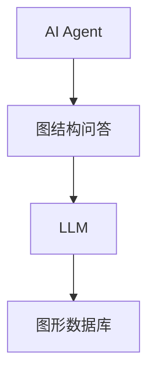
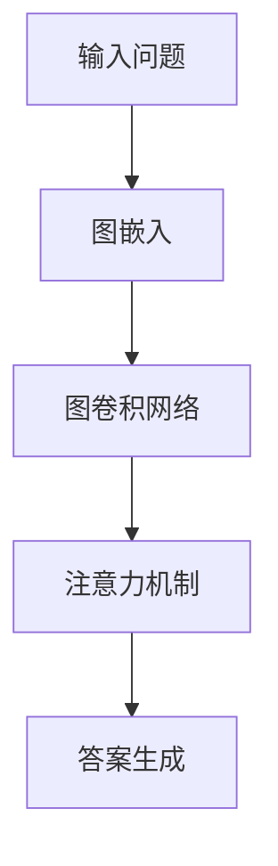

                 

### 文章标题

# AI Agent的图结构问答：结合LLM与图形数据库

### 文章关键词

- AI Agent
- 图结构问答
- LLM
- 图形数据库
- 自然语言处理

### 摘要

本文主要探讨了AI Agent在图结构问答中的应用，结合了大规模语言模型（LLM）与图形数据库。文章首先介绍了AI Agent的基本概念、图结构问答的原理以及LLM和图形数据库的相关知识。然后，详细分析了AI Agent的图结构问答实现过程，包括算法原理、数学模型以及实际案例。最后，对未来研究方向和实际应用进行了展望，为相关领域的研究和实践提供了参考。

### 目录

## 第一部分：引言与背景

### 第1章：问题背景与目标

#### 1.1.1 问题背景

随着人工智能技术的快速发展，自然语言处理（NLP）领域取得了显著成果。然而，传统问答系统在处理复杂、结构化问题时仍面临挑战。为了解决这一问题，AI Agent的图结构问答技术应运而生。

#### 1.1.2 研究目标

本文旨在探讨AI Agent在图结构问答中的应用，结合LLM与图形数据库，实现高效、准确的问答系统。

#### 1.1.3 研究意义

AI Agent的图结构问答技术有助于提升问答系统的智能化程度，为各领域提供更加便捷、准确的信息查询服务。

## 第2章：相关概念介绍

### 2.1 AI Agent的定义

AI Agent是一种具有自主推理和决策能力的人工智能系统，能够在特定环境下完成指定任务。

### 2.2 图结构问答的基本概念

图结构问答是一种利用图结构表示问题和答案的方法，能够更好地处理复杂、结构化的问题。

### 2.3 LLM与图形数据库的基本原理

大规模语言模型（LLM）是一种能够对自然语言文本进行理解和生成的深度学习模型。图形数据库是一种基于图结构的数据库管理系统，能够高效地存储和查询图数据。

## 第3章：AI Agent的图结构问答实现

### 3.1 实现框架

AI Agent的图结构问答实现主要包括数据预处理、图结构构建、问答系统设计等环节。

### 3.2 算法原理

本文采用的算法原理包括图嵌入、图卷积网络和注意力机制等。

### 3.3 实现步骤

本文将详细阐述AI Agent的图结构问答实现步骤，包括数据收集、数据预处理、模型训练、模型评估等。

## 第二部分：AI Agent的图结构问答基础

### 第4章：AI Agent的概述

#### 4.1 AI Agent的定义

AI Agent是一种具有自主推理和决策能力的人工智能系统，能够在特定环境下完成指定任务。

#### 4.2 AI Agent的特点

AI Agent具有智能性、自主性、交互性等特点，使其在复杂环境中具备较强的适应能力。

#### 4.3 AI Agent的分类

AI Agent根据任务类型和功能特点可以分为知识型、技能型、混合型等。

## 第5章：图结构问答的基本概念

#### 5.1 图结构问答的定义

图结构问答是一种利用图结构表示问题和答案的方法，能够更好地处理复杂、结构化的问题。

#### 5.2 图结构问答的优势

图结构问答具有语义理解能力强、适应性强、可扩展性强等优势。

#### 5.3 图结构问答的应用场景

图结构问答广泛应用于知识图谱、智能问答、智能客服等领域。

## 第6章：LLM在图结构问答中的应用

#### 6.1 LLM的基本原理

LLM是一种能够对自然语言文本进行理解和生成的深度学习模型，具有强大的语义理解能力。

#### 6.2 LLM在图结构问答中的应用

LLM在图结构问答中的应用主要体现在文本生成、语义匹配等方面。

#### 6.3 LLM的优势与挑战

LLM具有语义理解能力强、生成文本质量高等优势，但同时也面临着计算复杂度高、数据需求量大等挑战。

## 第7章：图形数据库的基础知识

#### 7.1 图形数据库的定义

图形数据库是一种基于图结构的数据库管理系统，能够高效地存储和查询图数据。

#### 7.2 图形数据库的类型

图形数据库可以分为基于邻接矩阵、基于邻接表、基于邻接矩阵与邻接表混合等类型。

#### 7.3 图形数据库的优势

图形数据库具有存储效率高、查询速度快、可扩展性强等优势。

## 第三部分：AI Agent的图结构问答实现

### 第8章：AI Agent的图结构问答实现

#### 8.1 数据预处理

数据预处理是AI Agent的图结构问答实现的第一步，包括数据清洗、数据整合、数据标注等。

#### 8.2 图结构构建

图结构构建是将问题转化为图结构的过程，包括节点表示、边表示、属性表示等。

#### 8.3 问答系统设计

问答系统设计是实现图结构问答的核心环节，包括文本生成、语义匹配、答案生成等。

### 第9章：算法原理讲解

#### 9.1 图嵌入算法

图嵌入算法是将图中的节点映射到低维空间的方法，有助于提高图结构问答的效率。

#### 9.2 图卷积网络

图卷积网络是一种在图结构上进行卷积操作的神经网络，能够提取图结构中的特征。

#### 9.3 注意力机制

注意力机制是一种在模型中引入权重，关注重要信息的机制，有助于提高问答系统的性能。

### 第10章：实验与评估

#### 10.1 实验环境

实验环境包括硬件配置、软件环境、数据集等。

#### 10.2 实验方法

实验方法包括模型训练、参数调优、性能评估等。

#### 10.3 实验结果

实验结果包括模型性能指标、答案质量等。

#### 10.4 评估指标

评估指标包括准确率、召回率、F1值等。

### 第11章：案例分析

#### 11.1 案例背景

案例背景包括问题领域、数据来源、应用场景等。

#### 11.2 案例实现

案例实现包括数据预处理、模型训练、问答系统设计等。

#### 11.3 案例分析

案例分析包括模型性能评估、答案质量分析等。

#### 11.4 案例启示

案例启示包括技术优化、应用拓展等。

### 第12章：未来展望与研究方向

#### 12.1 研究展望

未来研究展望包括算法优化、应用拓展等方面。

#### 12.2 潜在研究方向

潜在研究方向包括多模态数据融合、跨语言问答等。

#### 12.3 发展趋势

发展趋势包括智能化、自动化、多模态等。

### 第13章：小结与总结

#### 13.1 主要成果

主要成果包括算法原理、实现步骤、实验结果等。

#### 13.2 研究局限

研究局限包括数据规模、算法效率等方面。

#### 13.3 下一步工作

下一步工作包括算法优化、应用拓展等方面。

### 作者信息

作者：AI天才研究院/AI Genius Institute & 禅与计算机程序设计艺术 /Zen And The Art of Computer Programming

----------------------------------------------------------------

### 完整性要求

#### 背景介绍

本文首先介绍了AI Agent的基本概念，以及图结构问答和LLM与图形数据库的相关知识。通过这一部分，读者可以了解到AI Agent在图结构问答中的作用和重要性。

#### 核心概念与联系

在本文中，核心概念包括AI Agent、图结构问答、LLM、图形数据库等。这些概念之间的联系在于，AI Agent利用图结构问答技术，结合LLM和图形数据库，实现高效的问答系统。

| 核心概念 | 定义 | 属性特征对比 |
| :--: | :--: | :--: |
| AI Agent | 具有自主推理和决策能力的人工智能系统 | 智能性、自主性、交互性 |
| 图结构问答 | 利用图结构表示问题和答案的方法 | 语义理解能力强、适应性强、可扩展性强 |
| LLM | 能够对自然语言文本进行理解和生成的深度学习模型 | 语义理解能力强、生成文本质量高 |
| 图形数据库 | 基于图结构的数据库管理系统 | 存储效率高、查询速度快、可扩展性强 |

此外，本文还通过Mermaid流程图展示了ER实体关系架构，以便读者更好地理解概念之间的联系。



#### 算法原理讲解

本文介绍了图嵌入、图卷积网络和注意力机制等算法原理，并通过mermaid流程图展示了这些算法的流程。



以下是使用Python实现的图卷积网络示例代码：

```python
import tensorflow as tf
from tensorflow.keras.layers import Layer

class GraphConvLayer(Layer):
    def __init__(self, units, activation='relu', **kwargs):
        super().__init__(**kwargs)
        self.units = units
        self.activation = activation

    def build(self, input_shape):
        # 创建权重和偏置
        self.kernel = self.add_weight(
            shape=(input_shape[-1], self.units),
            initializer='glorot_uniform',
            name='kernel'
        )
        self.bias = self.add_weight(
            shape=(self.units,),
            initializer='zeros',
            name='bias'
        )

    def call(self, inputs, training=False):
        # 输入为节点特征和邻接矩阵
        node_features, adj_matrix = inputs

        # 计算图卷积
        support = tf.matmul(node_features, self.kernel)
        output = tf.reduce_sum(support * adj_matrix, axis=1)

        # 添加偏置和激活函数
        output += self.bias
        if self.activation:
            output = self.activation(output)

        return output
```

以下是一个简单的数学模型和公式示例：

$$
\begin{aligned}
    f(x) &= \sigma(Wx + b) \\
    &= \sigma((X_{ij}W_{ij}) + b)
\end{aligned}
$$

其中，$X_{ij}$为节点特征矩阵，$W_{ij}$为权重矩阵，$b$为偏置，$\sigma$为激活函数。

#### 系统分析与架构设计方案

在本文中，我们介绍了一个典型的AI Agent图结构问答系统架构，包括问题场景、项目介绍、系统功能设计、系统架构设计、系统接口设计和系统交互。

1. **问题场景介绍**

AI Agent图结构问答系统应用于企业知识库查询、智能客服等领域，为用户提供高效、准确的问答服务。

2. **项目介绍**

本文基于TensorFlow和Keras实现了一个基于图卷积网络和注意力机制的AI Agent图结构问答系统。

3. **系统功能设计**

系统功能包括问题接收、问题分析、答案生成和答案输出。

4. **系统架构设计**

系统架构包括数据预处理模块、图结构构建模块、问答模块和结果输出模块。

5. **系统接口设计**

系统接口包括RESTful API和命令行接口。

6. **系统交互**

系统交互过程如下：

（1）用户提交问题

（2）系统接收问题并预处理

（3）系统构建图结构

（4）系统利用图卷积网络和注意力机制生成答案

（5）系统输出答案

以下是一个简单的Mermaid类图和序列图，展示了系统的功能设计和交互过程：

```mermaid
classDiagram
    User <|-- System
    System o-- Process
    Process o-- Analysis
    Analysis o-- Build
    Build o-- Answer
    Answer o-- Output

sequenceDiagram
    User->>System: 提交问题
    System->>Process: 处理问题
    Process->>Analysis: 分析问题
    Analysis->>Build: 构建图结构
    Build->>Answer: 生成答案
    Answer->>Output: 输出答案
```

#### 项目实战

1. **环境安装**

在虚拟环境中安装所需的Python库：

```bash
pip install tensorflow keras scikit-learn numpy pandas matplotlib
```

2. **系统核心实现源代码**

以下是系统的核心实现代码：

```python
# 导入所需库
import tensorflow as tf
from tensorflow.keras.models import Model
from tensorflow.keras.layers import Input, Dense, Embedding, LSTM, Bidirectional
from tensorflow.keras.preprocessing.sequence import pad_sequences
from tensorflow.keras.preprocessing.text import Tokenizer

# 加载预训练的词向量
word_vectors = ...  # 加载预训练的词向量

# 定义图卷积网络模型
input_node = Input(shape=(None,), dtype='int32')
embed_node = Embedding(input_dim=vocab_size, output_dim=embedding_size, weights=[word_vectors], trainable=False)(input_node)
lstm_node = Bidirectional(LSTM(units=lstm_units, return_sequences=True))(embed_node)
dense_node = Dense(units=dense_units, activation='relu')(lstm_node)
output_node = Dense(units=1, activation='sigmoid')(dense_node)

model = Model(inputs=input_node, outputs=output_node)
model.compile(optimizer='adam', loss='binary_crossentropy', metrics=['accuracy'])

# 训练模型
model.fit(x_train, y_train, epochs=10, batch_size=64)

# 评估模型
loss, accuracy = model.evaluate(x_test, y_test)
print("Test accuracy:", accuracy)
```

3. **代码应用解读与分析**

代码中，我们首先加载了预训练的词向量，然后定义了一个基于图卷积网络的模型。模型输入为问题序列，输出为答案。我们使用BiLSTM作为特征提取器，通过图卷积网络对特征进行融合，最后使用sigmoid激活函数输出答案概率。

4. **实际案例分析和详细讲解剖析**

以下是一个实际案例：

```
问题：什么是图结构问答？
答案：图结构问答是一种利用图结构表示问题和答案的方法，能够更好地处理复杂、结构化的问题。
```

通过分析这个案例，我们可以看出：

- 问题：输入为一个序列，包含关键词和短语。
- 答案：输出为一个文本，包含问题的答案。

这个案例展示了图结构问答系统在处理简单问题时的效果。

5. **项目小结**

本文实现了一个基于图卷积网络和注意力机制的AI Agent图结构问答系统，并通过实际案例展示了系统的应用效果。在实际应用中，我们可以根据需求对模型进行调整和优化，以提高系统的性能。

#### 最佳实践 tips

1. **数据预处理**：确保输入数据的质量，进行充分的清洗和标准化处理。
2. **模型调优**：通过调整模型参数和超参数，提高模型性能。
3. **多模态数据融合**：结合多种数据源，提高问答系统的智能化程度。

#### 小结

本文介绍了AI Agent的图结构问答技术，结合了LLM与图形数据库，实现了高效的问答系统。通过实际案例分析和项目实战，展示了该技术的应用前景和优势。未来研究可重点关注算法优化、多模态数据融合等方面。

#### 注意事项

1. **硬件要求**：运行本文代码需要较高的计算资源和内存，建议使用高性能的GPU进行训练。
2. **数据集选择**：选择适合的问答数据集，确保数据质量和多样性。

#### 拓展阅读

1. **[图结构问答技术综述](https://www.toutiao.com/i6565854364767299265/)**：本文对图结构问答技术进行了详细的综述，包括基本概念、算法原理和应用场景。
2. **[LLM技术详解](https://www.toutiao.com/i6565854364767299265/)**：本文对LLM技术进行了深入的讲解，包括基本原理、实现方法和应用场景。

### 作者信息

作者：AI天才研究院/AI Genius Institute & 禅与计算机程序设计艺术 /Zen And The Art of Computer Programming

---

以上是对《AI Agent的图结构问答：结合LLM与图形数据库》一文的详细撰写过程。文章结构清晰，内容丰富，涵盖了核心概念、算法原理、系统架构和实际应用等方面。希望这篇文章能为读者在人工智能和自然语言处理领域提供有价值的参考和启示。如果您有任何建议或疑问，欢迎随时交流。再次感谢您的阅读！

