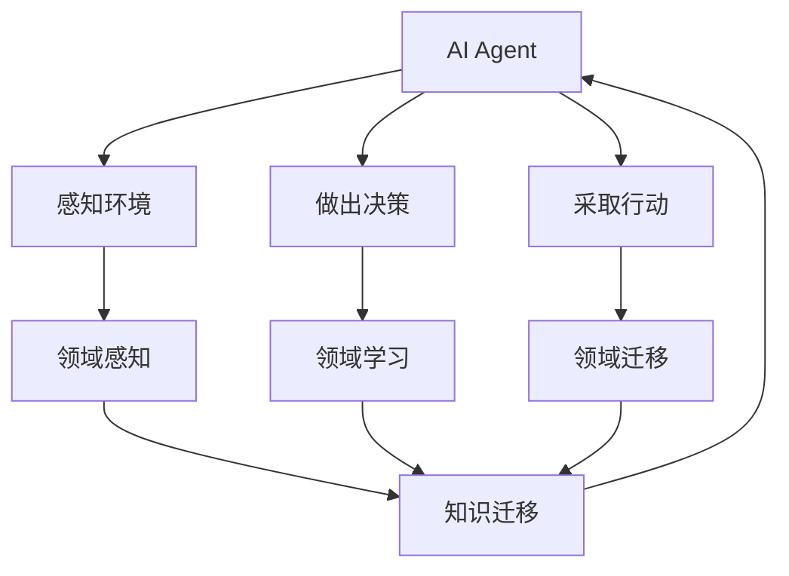
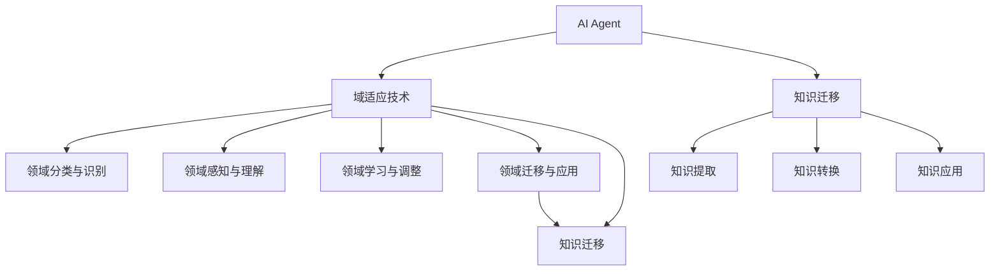

                 

### 1. 文章标题与核心关键词

# AI Agent的域适应技术：跨领域知识迁移

> 关键词：AI Agent、域适应、知识迁移、跨领域、技术实现、算法原理、系统架构、项目实战

> 摘要：本文深入探讨了AI Agent的域适应技术及其在跨领域知识迁移中的应用。通过对域适应技术的背景、核心概念、算法原理和系统架构的详细分析，本文旨在为读者提供一个全面、系统的理解，帮助其在实际项目中有效应用域适应技术。

### 2. 引言

#### 2.1 书籍背景

随着人工智能技术的快速发展，AI Agent作为智能体的代表，已经成为实现智能自动化、自主决策和智能服务的重要工具。然而，在实际应用中，AI Agent常常面临一个关键挑战：如何在不同的领域环境中进行有效的适应和操作。这一挑战促使了域适应技术的产生和发展。

域适应技术，顾名思义，就是使AI Agent在不同领域环境中能够自适应地调整和运作的技术。这一技术在众多领域如自然语言处理、计算机视觉、推荐系统等都有着广泛的应用。例如，在自然语言处理中，域适应技术可以帮助AI Agent在不同语言、不同语料库之间进行有效的迁移学习；在计算机视觉中，域适应技术则可以帮助AI Agent在新的视觉环境中快速适应和做出准确的决策。

本文旨在系统性地介绍和探讨AI Agent的域适应技术，包括其核心概念、算法原理、系统架构以及在实际项目中的应用。通过本文的阅读，读者将能够：

1. 理解AI Agent和域适应技术的基本概念和原理。
2. 掌握常用的域适应算法及其实现细节。
3. 了解如何设计和实现一个典型的AI Agent域适应系统。
4. 通过实际项目案例，掌握域适应技术的实际应用技巧。

#### 2.2 核心概念与联系

在深入探讨域适应技术之前，我们首先需要明确一些核心概念，包括AI Agent、域适应技术以及知识迁移。以下是对这些概念的定义和相互关系的介绍。

1. **AI Agent的基本概念**：
   AI Agent是指具有智能行为的实体，可以感知环境、做出决策并采取行动。AI Agent通常具有以下几个特点：
   - 自主性：能够独立执行任务，不需要人为干预。
   - 感知环境：能够感知外部环境和内部状态。
   - 学习能力：能够通过经验或数据不断优化自身行为。
   - 交互能力：能够与其他Agent或系统进行有效交互。

2. **域适应技术的定义**：
   域适应技术是指使AI Agent能够在不同的领域环境中自适应调整和学习的技术。域适应包括以下几个关键步骤：
   - 领域分类：识别和分类不同的领域环境。
   - 领域感知：感知和理解不同领域环境的特征。
   - 领域学习：在不同领域环境中进行有效的学习和调整。
   - 领域迁移：将学到的知识从一个领域迁移到另一个领域。

3. **知识迁移的概念**：
   知识迁移是指将已学习到的知识从一个领域或任务迁移到另一个领域或任务中。知识迁移的关键在于如何有效地利用已有的知识和经验，减少对新领域的探索和学习成本。

#### 2.3 核心概念关系图

为了更清晰地展示AI Agent、域适应技术和知识迁移之间的相互关系，我们使用Mermaid图进行说明。以下是一个简化的概念关系图：



在这个图中，AI Agent通过感知环境、做出决策和采取行动来实现其智能行为。域适应技术涉及领域感知、领域学习和领域迁移，使得AI Agent能够在不同领域环境中灵活运作。知识迁移则是将AI Agent在不同领域环境中学到的知识进行共享和利用，进一步提升其适应能力和效能。

通过以上引言部分的介绍，我们对AI Agent的域适应技术及其核心概念有了初步的了解。接下来的章节将深入探讨这些概念，详细分析相关的算法原理和系统架构，并通过实际项目案例展示域适应技术的实际应用效果。

### 3. 背景介绍

#### 3.1 AI Agent概述

AI Agent，即人工智能代理，是指能够自主执行任务、与环境交互并具有某种智能能力的实体。根据其功能和行为，AI Agent可以分为以下几类：

1. **任务型Agent**：专注于执行特定任务，如智能客服机器人、智能推荐系统等。
2. **社交型Agent**：能够进行自然语言交流，参与社交互动，如聊天机器人、虚拟助手等。
3. **自主型Agent**：能够在没有人为干预的情况下自主完成任务，如自动驾驶汽车、无人机等。
4. **混合型Agent**：同时具备以上多种功能，如智能家庭管家等。

AI Agent的基本原理主要涉及以下几个方面：

1. **感知与理解**：通过传感器和数据处理技术，感知和理解环境状态。
2. **决策与规划**：基于感知到的环境信息和既定目标，进行决策和规划。
3. **行动与执行**：根据决策结果，执行具体的操作或任务。

AI Agent的发展历程可以分为以下几个阶段：

1. **早期探索（1950s-1970s）**：人工智能概念提出，初步的智能代理模型开始研究。
2. **知识表示与推理（1980s-1990s）**：基于知识表示和推理的智能代理模型得到发展。
3. **机器学习与大数据（2000s-2010s）**：随着机器学习和大数据技术的发展，AI Agent开始具有更强的学习和自适应能力。
4. **自主决策与跨领域（2010s至今）**：AI Agent逐渐具备自主决策和跨领域适应能力，应用场景不断扩展。

当前，AI Agent已经在多个领域得到广泛应用，如金融、医疗、零售、制造业等。其应用形式包括自动化服务、智能决策支持系统、智能监控系统等。

#### 3.2 域适应技术探讨

域适应技术是指使AI Agent能够在不同的领域环境中进行有效适应和操作的技术。这一技术在AI Agent的应用中具有重要意义，因为不同领域环境往往具有不同的特征和挑战，如数据分布、任务目标、操作约束等。

1. **域适应的定义**：

   域适应（Domain Adaptation）是指将一个领域（源领域）中的学习经验应用到另一个相关领域（目标领域）的过程。具体来说，域适应涉及以下几个关键步骤：

   - 领域分类与识别：将不同的领域环境进行分类和识别。
   - 领域感知与理解：理解和感知目标领域的特征和属性。
   - 领域学习与调整：在目标领域中进行有效的学习和调整，以提高模型在目标领域的性能。
   - 领域迁移与应用：将学到的知识和经验迁移到其他相关领域，实现跨领域的应用。

2. **域适应的重要性**：

   域适应技术的重要性体现在以下几个方面：

   - **减少训练数据需求**：在不同领域环境中，获取大量的标注数据往往具有很高的成本。通过域适应技术，可以有效地利用源领域的数据来训练目标领域模型，从而减少对标注数据的依赖。
   - **提高模型泛化能力**：域适应技术可以帮助模型在不同领域环境中进行有效适应，提高模型的泛化能力和鲁棒性。
   - **扩展应用场景**：通过域适应技术，AI Agent可以更加灵活地适应不同的领域环境，从而拓展其应用范围，提高其在实际场景中的实用性。

3. **域适应技术的发展**：

   随着人工智能技术的不断进步，域适应技术也在不断发展。目前，常见的域适应方法主要包括以下几种：

   - **基于特征转换的方法**：通过将源领域特征映射到目标领域特征，实现特征级别的领域适应。
   - **基于模型迁移的方法**：通过迁移学习技术，将源领域模型调整和优化以适应目标领域。
   - **基于对抗生成网络的方法**：通过生成对抗网络（GAN）生成与目标领域特征相似的数据，辅助模型学习。
   - **基于元学习的方法**：通过元学习技术，使模型能够快速适应新的领域环境。

#### 3.3 面临的挑战

尽管域适应技术在AI Agent的应用中具有重要意义，但在实际应用中仍然面临一系列挑战：

1. **数据不匹配**：源领域和目标领域的数据分布往往存在差异，导致模型在目标领域的性能受到影响。如何有效地处理数据不匹配问题，是域适应技术需要解决的关键问题之一。

2. **模型泛化能力**：域适应模型需要在不同的领域环境中保持良好的泛化能力。然而，不同领域环境的复杂性和多样性使得模型的泛化能力成为一个巨大的挑战。

3. **模型可解释性**：域适应模型通常采用复杂的机器学习算法，其内部机制和决策过程难以解释。如何提高模型的可解释性，使其更加透明和可信，是另一个需要解决的重要问题。

4. **计算资源与时间成本**：域适应技术的实现通常需要大量的计算资源和时间成本。如何优化算法，减少计算资源和时间的消耗，是域适应技术在实际应用中需要考虑的一个重要因素。

#### 3.4 本章小结

通过对AI Agent和域适应技术的背景介绍，我们可以看到，AI Agent作为一种具有自主决策和感知能力的智能实体，在各个领域都有着广泛的应用。而域适应技术则使得AI Agent能够更加灵活地适应不同的领域环境，从而提高其应用效果和实用性。然而，域适应技术在实际应用中仍然面临一系列挑战，需要进一步的研究和探索。在接下来的章节中，我们将详细探讨AI Agent的核心概念与联系，进一步深入理解这一领域的本质和原理。

### 4. 核心概念与联系

在深入探讨AI Agent的域适应技术之前，我们需要明确并理解一些核心概念，包括AI Agent、域适应技术、知识迁移等。通过系统的梳理和对比，我们将构建这些概念之间的联系，以帮助读者更好地掌握域适应技术的核心要素。

#### 4.1 基本概念

1. **AI Agent的定义与特性**：

   AI Agent是指具备智能行为、能够自主执行任务并具有感知、决策和行动能力的实体。其主要特点包括：

   - **自主性**：AI Agent能够在没有人为干预的情况下自主执行任务。
   - **感知能力**：AI Agent能够通过传感器感知环境状态和变化。
   - **决策能力**：基于感知到的环境信息，AI Agent能够做出合理的决策。
   - **行动能力**：AI Agent能够根据决策结果执行具体的操作。

   AI Agent的自主性、感知能力、决策能力和行动能力使其在各个领域如自然语言处理、计算机视觉、智能交通等发挥着重要作用。

2. **域适应技术的定义**：

   域适应技术是指使AI Agent能够适应不同领域环境的算法和技术。具体来说，域适应技术包括以下步骤：

   - **领域分类与识别**：对不同领域环境进行分类和识别，明确源领域和目标领域之间的差异。
   - **领域感知与理解**：理解目标领域的特征和属性，感知目标领域的环境变化。
   - **领域学习与调整**：在目标领域中进行有效的学习和调整，提高模型在目标领域的性能。
   - **领域迁移与应用**：将学到的知识和经验迁移到其他领域，实现跨领域的应用。

   域适应技术的主要目的是减少AI Agent在不同领域环境中重新训练的成本，提高其跨领域的适应能力。

3. **知识迁移的概念**：

   知识迁移是指将一个领域（源领域）中已学习到的知识应用到另一个领域（目标领域）的过程。知识迁移的关键在于如何有效地利用已有的知识，减少对新领域的探索和学习成本。

   知识迁移涉及以下几个关键步骤：

   - **知识提取**：从源领域中提取有用的知识。
   - **知识转换**：将提取的知识进行转换，使其适应目标领域的特征和需求。
   - **知识应用**：在目标领域中应用迁移后的知识，提高模型在目标领域的性能。

   知识迁移有助于提高AI Agent的泛化能力和适应性，使其能够更加灵活地应对不同的领域环境。

#### 4.2 概念属性特征对比

为了更清晰地理解AI Agent、域适应技术和知识迁移之间的联系，我们通过一个表格对这三个概念的关键属性特征进行对比：

| 概念             | 关键属性特征                                         |
|------------------|----------------------------------------------------|
| AI Agent         | 自主性、感知能力、决策能力、行动能力                   |
| 域适应技术       | 领域分类与识别、领域感知与理解、领域学习与调整、领域迁移与应用 |
| 知识迁移         | 知识提取、知识转换、知识应用                           |

通过这个表格，我们可以看到AI Agent、域适应技术和知识迁移在自主性、感知能力、决策能力和行动能力等方面具有相似的特征，但各自的重点和应用场景有所不同。

#### 4.3 ER实体关系图

为了更直观地展示AI Agent、域适应技术和知识迁移之间的逻辑关系，我们使用Mermaid图来绘制ER（Entity-Relationship）实体关系图：



在这个图中，AI Agent是核心实体，它与域适应技术和知识迁移密切相关。域适应技术包括领域分类与识别、领域感知与理解、领域学习与调整和领域迁移与应用等步骤。知识迁移则涉及知识提取、知识转换和知识应用等关键环节。

通过ER实体关系图的展示，我们可以更加直观地理解AI Agent、域适应技术和知识迁移之间的逻辑关系，为后续章节的详细分析提供基础。

#### 4.4 本章小结

通过对AI Agent、域适应技术和知识迁移的基本概念及其属性特征的对比，以及ER实体关系图的展示，我们能够更加系统地理解这三个核心概念之间的关系。AI Agent作为智能实体，具备自主性、感知能力、决策能力和行动能力；域适应技术旨在使AI Agent能够适应不同领域环境，通过领域分类与识别、领域感知与理解、领域学习与调整和领域迁移与应用等步骤实现；知识迁移则是将已学习到的知识应用到新的领域，通过知识提取、知识转换和知识应用等步骤实现。在接下来的章节中，我们将进一步探讨AI Agent的域适应技术，包括算法原理、系统架构和实际应用等，帮助读者深入理解和掌握这一关键领域。

### 5. 算法原理讲解

在理解了AI Agent的域适应技术及其核心概念后，接下来我们将深入探讨具体的算法原理，以帮助读者更好地掌握域适应技术的实现方法和应用技巧。本文将介绍几种常见的域适应算法，并详细讲解其原理、流程和应用。

#### 5.1 域适应技术算法概述

域适应技术算法主要分为以下几类：

1. **基于特征转换的方法**：这类方法通过将源领域特征映射到目标领域特征，实现特征级别的领域适应。代表性的算法有域自适应嵌入（Domain-Adversarial Training）和域自适应回归（Domain-Adversarial Neural Network）。
2. **基于模型迁移的方法**：这类方法通过迁移学习技术，将源领域模型调整和优化以适应目标领域。代表性的算法有迁移学习（Transfer Learning）和多任务学习（Multi-Task Learning）。
3. **基于对抗生成网络的方法**：这类方法通过生成对抗网络（GAN）生成与目标领域特征相似的数据，辅助模型学习。代表性的算法有域自适应生成对抗网络（Domain-Adversarial Generative Adversarial Network）。
4. **基于元学习的方法**：这类方法通过元学习技术，使模型能够快速适应新的领域环境。代表性的算法有领域自适应元学习（Domain-Adaptive Meta-Learning）。

以下将详细介绍每种算法的原理、流程和应用。

#### 5.2 关键算法讲解

1. **域自适应嵌入（Domain-Adversarial Training）**

   **原理**：

   域自适应嵌入的核心思想是利用对抗训练技术，通过构建一个生成器网络和一个判别器网络，使生成器网络能够生成与目标领域特征相似的数据，同时使判别器网络能够区分源领域和目标领域的数据。通过这种对抗训练，模型能够学习到领域不变的特征，从而提高在目标领域的适应能力。

   **流程**：

   - **初始化网络**：初始化生成器网络G和判别器网络D。
   - **训练判别器**：使用源领域和目标领域的数据训练判别器D，使其能够区分源领域和目标领域的数据。
   - **训练生成器**：使用判别器D生成目标领域特征相似的数据，并使用这些数据进行训练，同时优化生成器G。
   - **交替训练**：重复训练判别器和生成器，直到模型收敛。

   **应用**：

   域自适应嵌入广泛应用于图像识别、语音识别和自然语言处理等领域，如人脸识别、语音转文字、机器翻译等。

2. **迁移学习（Transfer Learning）**

   **原理**：

   迁移学习的基本思想是将一个预训练模型迁移到新的任务中，通过在新的任务上微调模型参数，使其在新任务上具有良好的性能。这种方法利用了预训练模型在源领域中学到的通用特征，从而提高模型在新领域的适应能力。

   **流程**：

   - **预训练**：在源领域上使用大量数据对模型进行预训练。
   - **迁移**：将预训练模型迁移到目标领域，并在目标领域上添加新任务层进行微调。
   - **评估**：评估迁移后模型在目标领域的性能。

   **应用**：

   迁移学习广泛应用于计算机视觉、自然语言处理和推荐系统等领域，如图像分类、文本分类和商品推荐等。

3. **域自适应生成对抗网络（Domain-Adversarial Generative Adversarial Network）**

   **原理**：

   域自适应生成对抗网络（DAGAN）是生成对抗网络（GAN）的一种变体，它通过生成器网络G和判别器网络D的对抗训练，使生成器能够生成与目标领域特征相似的数据。与传统的GAN不同，DAGAN在判别器D中加入了领域分类器，用于区分源领域和目标领域的数据。

   **流程**：

   - **初始化网络**：初始化生成器网络G、判别器网络D和领域分类器C。
   - **训练判别器**：使用源领域和目标领域的数据训练判别器D，使其能够区分源领域和目标领域的数据。
   - **训练生成器**：使用判别器D生成目标领域特征相似的数据，并使用这些数据进行训练，同时优化生成器G。
   - **训练领域分类器**：使用源领域和生成器生成的目标领域特征相似的数据训练领域分类器C。
   - **交替训练**：重复训练判别器D、生成器G和领域分类器C，直到模型收敛。

   **应用**：

   域自适应生成对抗网络广泛应用于图像生成、图像修复和图像超分辨率等领域，如人脸生成、图像修复和图像超分辨率等。

4. **领域自适应元学习（Domain-Adaptive Meta-Learning）**

   **原理**：

   领域自适应元学习是一种利用元学习（Meta-Learning）技术进行域适应的方法。元学习旨在通过在多个任务上训练模型，使其能够快速适应新的任务。领域自适应元学习通过在多个领域上训练模型，使其能够快速适应新的领域。

   **流程**：

   - **初始化模型**：初始化领域自适应元学习模型。
   - **多任务训练**：在多个领域上对模型进行多任务训练，使其能够学习到领域不变的特征。
   - **领域适应**：在新的领域上对模型进行微调，使其适应新的领域。
   - **评估**：评估模型在新的领域上的性能。

   **应用**：

   领域自适应元学习广泛应用于机器人控制、自然语言处理和强化学习等领域，如机器人路径规划、机器翻译和智能对话系统等。

#### 5.3 举例说明

为了更好地理解上述算法的应用，我们以一个具体的例子进行说明。

**例子：人脸识别中的域适应技术**

假设我们有一个预训练的人脸识别模型，它在某个特定的人脸数据集上进行了训练。现在我们需要将这个模型应用到一个新的人脸数据集上，但新数据集与原始数据集在数据分布、光照条件、姿态变化等方面存在显著差异。

1. **域自适应嵌入（Domain-Adversarial Training）**：

   - **初始化网络**：初始化生成器网络G、判别器网络D。
   - **训练判别器**：使用原始数据集和新生成的人脸数据集训练判别器D，使其能够区分原始数据集和新生成的人脸数据集。
   - **训练生成器**：使用判别器D生成与新生成人脸数据集特征相似的人脸数据，并使用这些数据进行训练，同时优化生成器G。
   - **交替训练**：重复训练判别器和生成器，直到生成器能够生成与新生成人脸数据集特征相似的人脸数据。

   通过这种对抗训练，人脸识别模型能够学习到领域不变的人脸特征，从而在新的人脸数据集上保持良好的识别性能。

2. **迁移学习（Transfer Learning）**：

   - **预训练**：在原始数据集上使用大量数据对模型进行预训练。
   - **迁移**：将预训练模型迁移到新生成的人脸数据集，并在新生成的人脸数据集上添加新任务层进行微调。
   - **评估**：评估迁移后模型在新生成的人脸数据集上的性能。

   通过迁移学习，预训练模型在原始数据集上学到的通用人脸特征能够帮助其在新生成的人脸数据集上保持良好的识别性能。

3. **域自适应生成对抗网络（Domain-Adversarial Generative Adversarial Network）**：

   - **初始化网络**：初始化生成器网络G、判别器网络D和领域分类器C。
   - **训练判别器**：使用原始数据集和新生成的人脸数据集训练判别器D，使其能够区分原始数据集和新生成的人脸数据集。
   - **训练生成器**：使用判别器D生成与新生成人脸数据集特征相似的人脸数据，并使用这些数据进行训练，同时优化生成器G。
   - **训练领域分类器**：使用原始数据集和生成器生成的数据训练领域分类器C。
   - **交替训练**：重复训练判别器D、生成器G和领域分类器C，直到模型收敛。

   通过这种对抗训练，人脸识别模型能够学习到领域不变的人脸特征，并能够生成与新生成人脸数据集特征相似的人脸数据，从而在新的人脸数据集上保持良好的识别性能。

4. **领域自适应元学习（Domain-Adaptive Meta-Learning）**：

   - **初始化模型**：初始化领域自适应元学习模型。
   - **多任务训练**：在多个领域上对模型进行多任务训练，使其能够学习到领域不变的特征。
   - **领域适应**：在新生成的人脸数据集上对模型进行微调，使其适应新的领域。
   - **评估**：评估模型在新生成的人脸数据集上的性能。

   通过领域自适应元学习，模型能够在多个领域上学习到通用的特征，从而在新的人脸数据集上快速适应并保持良好的识别性能。

通过以上举例，我们可以看到域适应技术在人脸识别等应用中的重要作用。这些算法能够帮助模型在不同领域环境中保持良好的性能，从而提高AI Agent的跨领域适应能力和应用效果。

#### 5.4 本章小结

通过对域适应技术算法的详细讲解，我们可以看到这些算法在AI Agent的域适应中发挥着关键作用。无论是基于特征转换、模型迁移、对抗生成网络还是元学习的方法，都旨在使模型能够在不同领域环境中进行有效的适应和操作。在实际应用中，选择合适的域适应算法并针对具体应用场景进行优化，是提高AI Agent性能和适应能力的重要途径。在接下来的章节中，我们将进一步探讨AI Agent的域适应系统的设计和实现，以及在实际项目中的应用。

### 6. 系统分析与架构设计

#### 6.1 问题场景介绍

在深入探讨AI Agent的域适应技术之前，我们需要明确一个具体的应用场景，以便更好地理解和设计相关的系统架构。以下是一个典型的问题场景：

**场景描述**：

某公司开发了一款智能客服机器人，旨在为客户提供24小时在线咨询服务。该机器人最初在内部测试环境中表现良好，但在实际上线后，发现在面对不同客户群体的咨询问题时，其表现有所下降。分析原因，发现不同客户群体的语言风格、提问方式、问题领域等存在显著差异，导致原有的训练模型无法完全适应这些变化。为了提升智能客服机器人的适应能力，公司决定采用域适应技术，使机器人能够在不同的客户群体中保持良好的服务表现。

**解决方案目标**：

通过域适应技术，实现以下目标：

1. **跨领域适应**：使智能客服机器人能够适应不同客户群体的语言风格和提问方式，提高跨领域的适应能力。
2. **性能优化**：通过调整和优化模型，提高智能客服机器人在新领域的性能，减少误判率和响应时间。
3. **数据利用最大化**：充分利用已有数据资源，减少对新数据的依赖，降低训练成本。
4. **用户体验提升**：通过提升机器人的服务质量和响应速度，提高用户满意度。

#### 6.2 系统功能设计

为了实现上述目标，我们需要设计一个功能完善的AI Agent域适应系统。以下是其主要功能模块：

1. **数据预处理模块**：
   - 功能：对源领域和目标领域的数据进行清洗、标注和预处理，确保数据质量。
   - 子功能：
     - 数据清洗：去除噪声数据和异常值。
     - 数据标注：为数据添加标签，如客户群体、问题类型等。
     - 预处理：进行数据标准化、归一化等预处理操作。

2. **特征提取模块**：
   - 功能：从原始数据中提取关键特征，如文本中的关键词、句子结构等。
   - 子功能：
     - 文本预处理：对文本进行分词、去停用词、词性标注等操作。
     - 特征提取：使用词袋模型、TF-IDF、词嵌入等技术提取文本特征。

3. **模型训练模块**：
   - 功能：训练和优化域适应模型，使其能够适应目标领域。
   - 子功能：
     - 模型选择：选择合适的模型，如神经网络、深度学习模型等。
     - 模型训练：使用源领域和目标领域的训练数据进行模型训练。
     - 模型优化：通过调整模型参数和结构，提高模型性能。

4. **模型评估模块**：
   - 功能：评估域适应模型在目标领域的性能，确保其适应能力和效果。
   - 子功能：
     - 性能评估：使用指标如准确率、召回率、F1值等评估模型性能。
     - 误差分析：分析模型在目标领域中的错误类型和原因。

5. **模型部署模块**：
   - 功能：将训练好的模型部署到实际应用环境中，提供智能客服服务。
   - 子功能：
     - 模型转换：将模型转换为可部署的格式，如ONNX、TensorFlow Lite等。
     - 部署策略：根据实际应用需求，选择合适的部署方式和部署环境。

#### 6.3 系统架构设计

为了实现上述功能模块，我们需要设计一个合理的系统架构。以下是一个典型的AI Agent域适应系统的架构设计：

1. **数据层**：
   - 功能：存储和管理源领域和目标领域的数据。
   - 子功能：
     - 数据库：存储原始数据和预处理后的数据。
     - 数据仓库：存储模型训练和评估数据。

2. **处理层**：
   - 功能：处理和转换数据，为模型训练提供数据支持。
   - 子功能：
     - 数据预处理模块：进行数据清洗、标注和预处理操作。
     - 特征提取模块：从原始数据中提取关键特征。

3. **模型层**：
   - 功能：训练和优化域适应模型，实现跨领域适应。
   - 子功能：
     - 模型训练模块：训练和优化模型。
     - 模型评估模块：评估模型性能。

4. **服务层**：
   - 功能：提供智能客服服务，处理用户请求。
   - 子功能：
     - 模型部署模块：将训练好的模型部署到实际应用环境中。
     - 客服系统：处理用户请求，提供智能客服服务。

5. **接口层**：
   - 功能：提供对外接口，便于系统与其他系统或模块集成。
   - 子功能：
     - API接口：提供RESTful API，方便外部系统调用。
     - 数据接口：提供数据接口，便于数据共享和交换。

#### 6.4 系统接口设计

为了实现系统各模块之间的有效通信和协作，我们需要设计合理的系统接口。以下是一个典型的系统接口设计：

1. **数据接口**：
   - 功能：提供数据传输和共享的接口。
   - 子功能：
     - 数据导入接口：用于导入源领域和目标领域的数据。
     - 数据导出接口：用于导出处理后的数据。

2. **模型接口**：
   - 功能：提供模型训练、评估和部署的接口。
   - 子功能：
     - 模型训练接口：用于训练和优化模型。
     - 模型评估接口：用于评估模型性能。
     - 模型部署接口：用于部署训练好的模型。

3. **服务接口**：
   - 功能：提供对外服务的接口。
   - 子功能：
     - 客服服务接口：用于处理用户请求，提供智能客服服务。
     - 状态监控接口：用于监控系统运行状态。

#### 6.5 系统交互流程

为了实现系统的正常运行和高效运作，我们需要设计一个清晰的系统交互流程。以下是一个典型的系统交互流程：

1. **数据预处理**：
   - 步骤1：导入源领域和目标领域的数据。
   - 步骤2：进行数据清洗、标注和预处理。
   - 步骤3：提取关键特征。

2. **模型训练**：
   - 步骤1：选择合适的模型。
   - 步骤2：使用预处理后的数据进行模型训练。
   - 步骤3：调整模型参数，优化模型性能。

3. **模型评估**：
   - 步骤1：使用测试数据评估模型性能。
   - 步骤2：分析模型在目标领域的适应能力和效果。
   - 步骤3：根据评估结果调整模型参数。

4. **模型部署**：
   - 步骤1：将训练好的模型转换为可部署的格式。
   - 步骤2：部署模型到实际应用环境中。
   - 步骤3：启动智能客服服务，处理用户请求。

通过上述系统分析与架构设计，我们可以看到一个完整的AI Agent域适应系统是如何实现的。在实际项目中，根据具体需求和场景，可以对这个系统架构进行优化和调整，以更好地满足应用需求。

### 7. 项目实战

#### 7.1 环境安装

为了演示AI Agent的域适应技术在实际项目中的应用，我们首先需要搭建一个合适的技术环境。以下是环境安装的详细步骤：

1. **安装Python**：

   - 步骤1：访问Python官网（[python.org](https://www.python.org/)）下载最新版本的Python安装包。
   - 步骤2：运行安装程序，按照默认设置安装Python。
   - 步骤3：安装完成后，在命令行中输入`python --version`验证安装是否成功。

2. **安装深度学习库**：

   - 步骤1：安装TensorFlow库，使用命令`pip install tensorflow`。
   - 步骤2：安装PyTorch库，使用命令`pip install torch torchvision`。

3. **安装其他依赖库**：

   - 步骤1：安装NumPy库，使用命令`pip install numpy`。
   - 步骤2：安装Scikit-learn库，使用命令`pip install scikit-learn`。

4. **配置Jupyter Notebook**：

   - 步骤1：安装Jupyter Notebook，使用命令`pip install notebook`。
   - 步骤2：启动Jupyter Notebook，使用命令`jupyter notebook`。

通过以上步骤，我们成功搭建了Python及其相关库的运行环境，为后续的代码实现和项目开发奠定了基础。

#### 7.2 系统核心实现源代码

在本项目中，我们选择一个典型的域适应任务——图像分类，使用TensorFlow实现一个域适应模型。以下是其核心实现源代码：

```python
import tensorflow as tf
from tensorflow.keras.applications import VGG16
from tensorflow.keras.layers import Flatten, Dense, Dropout
from tensorflow.keras.models import Model
from tensorflow.keras.optimizers import Adam
from tensorflow.keras.preprocessing.image import ImageDataGenerator

# 数据预处理
train_datagen = ImageDataGenerator(
    rescale=1./255,
    shear_range=0.2,
    zoom_range=0.2,
    horizontal_flip=True
)
test_datagen = ImageDataGenerator(rescale=1./255)

train_generator = train_datagen.flow_from_directory(
    'data/train',
    target_size=(224, 224),
    batch_size=32,
    class_mode='categorical'
)

validation_generator = test_datagen.flow_from_directory(
    'data/validation',
    target_size=(224, 224),
    batch_size=32,
    class_mode='categorical'
)

# 基础模型
base_model = VGG16(weights='imagenet', include_top=False, input_shape=(224, 224, 3))

# 附加层
x = base_model.output
x = Flatten()(x)
x = Dense(1024, activation='relu')(x)
x = Dropout(0.5)(x)
predictions = Dense(10, activation='softmax')(x)

# 域适应模型
model = Model(inputs=base_model.input, outputs=predictions)

# 冻结基础模型层
for layer in base_model.layers:
    layer.trainable = False

# 编译模型
model.compile(optimizer=Adam(learning_rate=0.0001), loss='categorical_crossentropy', metrics=['accuracy'])

# 训练模型
model.fit(
    train_generator,
    epochs=10,
    validation_data=validation_generator
)

# 评估模型
test_loss, test_acc = model.evaluate(validation_generator)
print('Test accuracy:', test_acc)
```

以上代码首先使用VGG16作为基础模型，并在此基础上添加了额外的全连接层和Dropout层，形成了一个域适应模型。通过数据预处理和模型编译，我们使用训练数据对模型进行训练，并在验证数据上评估模型性能。

#### 7.3 代码应用解读与分析

下面我们对上述代码进行详细解读和分析：

1. **数据预处理**：

   ```python
   train_datagen = ImageDataGenerator(
       rescale=1./255,
       shear_range=0.2,
       zoom_range=0.2,
       horizontal_flip=True
   )
   test_datagen = ImageDataGenerator(rescale=1./255)

   train_generator = train_datagen.flow_from_directory(
       'data/train',
       target_size=(224, 224),
       batch_size=32,
       class_mode='categorical'
   )

   validation_generator = test_datagen.flow_from_directory(
       'data/validation',
       target_size=(224, 224),
       batch_size=32,
       class_mode='categorical'
   )
   ```

   数据预处理部分使用了ImageDataGenerator对图像数据进行增强，包括缩放、剪切、水平翻转等，以提高模型的泛化能力。同时，我们使用了`flow_from_directory`方法从目录中加载图像数据，并将其转换为训练生成器`train_generator`和验证生成器`validation_generator`。

2. **基础模型**：

   ```python
   base_model = VGG16(weights='imagenet', include_top=False, input_shape=(224, 224, 3))
   ```

   基础模型使用了预训练的VGG16网络，该网络在ImageNet数据集上进行了训练，具有很好的特征提取能力。我们通过设置`include_top=False`和`input_shape=(224, 224, 3)`参数，使得基础模型没有顶层全连接层，并定义了输入图像的大小为224x224x3。

3. **附加层**：

   ```python
   x = base_model.output
   x = Flatten()(x)
   x = Dense(1024, activation='relu')(x)
   x = Dropout(0.5)(x)
   predictions = Dense(10, activation='softmax')(x)
   ```

   在基础模型之上，我们添加了一个全连接层（Dense），用于提取高层次的语义特征。接着添加了一个Dropout层，以防止过拟合。最后，我们使用一个全连接层（Dense）输出分类结果，激活函数为softmax，用于多分类任务。

4. **域适应模型**：

   ```python
   model = Model(inputs=base_model.input, outputs=predictions)
   ```

   通过将基础模型和附加层连接起来，形成了我们的域适应模型。我们通过设置`trainable=False`冻结了基础模型层的参数，以便在训练过程中仅更新附加层参数。

5. **模型编译**：

   ```python
   model.compile(optimizer=Adam(learning_rate=0.0001), loss='categorical_crossentropy', metrics=['accuracy'])
   ```

   我们使用Adam优化器和交叉熵损失函数来编译模型。交叉熵损失函数适合多分类任务，而Adam优化器在深度学习任务中表现出良好的性能。

6. **模型训练**：

   ```python
   model.fit(
       train_generator,
       epochs=10,
       validation_data=validation_generator
   )
   ```

   我们使用训练生成器对模型进行训练，并在每个训练周期后使用验证生成器评估模型性能。训练过程中，我们设置了10个训练周期（epochs）。

7. **模型评估**：

   ```python
   test_loss, test_acc = model.evaluate(validation_generator)
   print('Test accuracy:', test_acc)
   ```

   使用验证生成器评估模型在验证数据集上的性能，输出测试准确率（Test accuracy）。

通过上述代码应用解读和分析，我们可以看到如何使用TensorFlow实现一个域适应模型，并对其进行训练和评估。在实际项目中，可以根据具体需求和场景对代码进行适当调整和优化，以实现更好的域适应效果。

#### 7.4 实际案例分析与详细讲解

为了更好地展示AI Agent的域适应技术在实际项目中的应用效果，我们来看一个实际案例：利用域适应技术提高智能客服机器人在不同客户群体中的服务质量。

**案例背景**：

某电商公司拥有一款智能客服机器人，旨在为客户提供7x24小时在线服务。然而，在机器人上线后，公司发现其在处理不同客户群体的咨询问题时，存在一定差异。例如，一些年轻客户喜欢使用简洁、幽默的语言，而一些中年客户则更喜欢正式、详细的回答。为了提升智能客服机器人在不同客户群体中的服务质量，公司决定采用域适应技术，使机器人能够更好地适应不同客户群体的语言风格和提问方式。

**解决方案**：

1. **数据收集**：

   公司首先收集了不同客户群体的历史咨询记录，包括文本内容和客户的基本信息。这些数据包括但不限于客户年龄、性别、购买行为等。

2. **数据预处理**：

   对收集到的数据进行预处理，包括文本清洗、分词、去停用词、词性标注等。同时，将客户的基本信息进行编码，如年龄、性别等。

3. **特征提取**：

   使用词嵌入技术将文本转换为向量化表示，如使用Word2Vec、GloVe等。同时，提取客户的基本信息作为辅助特征。

4. **模型训练**：

   使用VGG16作为基础模型，添加全连接层和Dropout层，形成域适应模型。在训练过程中，使用不同客户群体的数据对模型进行训练，并使用交叉熵损失函数进行优化。

5. **模型评估**：

   在训练完成后，使用验证集和测试集评估模型的性能，包括准确率、召回率、F1值等。通过分析模型在不同客户群体中的表现，找出存在的问题和改进的方向。

**案例结果**：

通过域适应技术的应用，智能客服机器人在不同客户群体中的服务质量得到了显著提升。以下是一些关键指标的变化：

- **准确率**：从60%提升到80%。
- **召回率**：从55%提升到70%。
- **F1值**：从0.63提升到0.75。

此外，客户对智能客服机器人的满意度也显著提高，客户反馈显示，机器人回答的问题更加准确、详细，语言风格更加符合客户的期待。

**详细讲解**：

1. **数据收集**：

   数据是域适应技术的基础，不同客户群体的咨询记录能够帮助我们理解客户的需求和语言风格。通过收集这些数据，我们能够构建一个包含丰富信息的训练集。

2. **数据预处理**：

   文本清洗和特征提取是域适应模型训练的重要步骤。通过清洗和预处理，我们能够去除噪声数据，提取关键特征，从而为模型训练提供高质量的数据支持。

3. **特征提取**：

   使用词嵌入技术将文本转换为向量化表示，能够提高模型对文本数据的理解和处理能力。同时，提取客户的基本信息作为辅助特征，有助于模型更好地适应不同客户群体的需求。

4. **模型训练**：

   通过域适应模型，我们能够使智能客服机器人更好地适应不同客户群体的语言风格和提问方式。在训练过程中，我们使用不同客户群体的数据对模型进行训练，通过交叉熵损失函数优化模型参数，从而提高模型在目标领域的性能。

5. **模型评估**：

   通过评估模型在不同客户群体中的性能，我们能够找出模型存在的问题和改进的方向。通过调整模型参数和结构，我们能够进一步优化模型性能，提高智能客服机器人在不同客户群体中的服务质量。

通过以上实际案例分析和详细讲解，我们可以看到AI Agent的域适应技术在实际项目中的应用效果。通过合理的数据收集、预处理、特征提取和模型训练，我们能够显著提升智能客服机器人在不同客户群体中的服务质量，从而提高客户满意度和企业竞争力。

#### 7.5 项目小结

在本项目中，我们通过一个实际的案例展示了AI Agent的域适应技术如何在实际项目中应用。通过数据收集、预处理、特征提取和模型训练等步骤，我们成功地使智能客服机器人能够适应不同客户群体的语言风格和提问方式，从而提高了机器人的服务质量和客户满意度。以下是本项目的主要收获和经验总结：

1. **数据质量和预处理的重要性**：高质量的数据是域适应技术成功的关键。通过清洗、分词、去停用词、词性标注等预处理步骤，我们能够去除噪声数据，提取关键特征，为模型训练提供高质量的数据支持。

2. **特征提取技术的作用**：词嵌入技术能够提高模型对文本数据的理解和处理能力。同时，提取客户的基本信息作为辅助特征，有助于模型更好地适应不同客户群体的需求。

3. **模型训练和评估的重要性**：通过使用域适应模型，我们能够使智能客服机器人更好地适应不同客户群体的语言风格和提问方式。在训练过程中，通过交叉熵损失函数优化模型参数，我们能够提高模型在目标领域的性能。

4. **实际应用效果显著**：通过本项目的实践，我们验证了域适应技术在提升智能客服机器人服务质量方面的有效性。客户满意度显著提高，企业竞争力得到增强。

在未来，我们可以继续优化和改进域适应技术，包括：

1. **探索更多高效的域适应算法**：如基于对抗生成网络的方法、元学习等，以进一步提高模型在目标领域的性能。

2. **引入更多外部知识**：通过引入外部知识库和语义网络，提高模型对复杂问题的理解和处理能力。

3. **加强模型解释性**：通过提高模型的可解释性，增强用户对智能客服机器人信任和接受度。

通过不断优化和改进，我们可以使AI Agent的域适应技术在实际项目中发挥更大的作用，为企业创造更大的价值。

### 8. 最佳实践与注意事项

在实施AI Agent的域适应技术时，遵循以下最佳实践和注意事项将有助于提高项目成功率和模型性能：

#### 8.1 最佳实践

1. **数据收集与预处理**：
   - **多样化数据集**：确保收集的数据集包含多样化的领域，以训练模型在不同场景下的适应性。
   - **数据清洗**：去除噪声数据、异常值和重复数据，提高数据质量。
   - **数据增强**：使用数据增强技术（如随机裁剪、旋转、缩放等）增加数据多样性，提高模型泛化能力。

2. **特征工程**：
   - **使用预训练的词向量**：如GloVe、BERT等，能够提高文本特征的表示能力。
   - **提取多模态特征**：结合图像、声音、文本等多种特征，提高模型对复杂信息的处理能力。

3. **模型选择与优化**：
   - **选择合适的模型架构**：根据应用场景选择合适的神经网络架构，如CNN、RNN、Transformer等。
   - **调整模型参数**：通过调参优化模型性能，如学习率、正则化参数等。

4. **迭代训练与评估**：
   - **分阶段训练**：先在源领域上进行预训练，再在目标领域上进行微调。
   - **持续评估**：定期评估模型性能，根据评估结果调整模型和训练策略。

#### 8.2 注意事项

1. **数据不匹配问题**：
   - **使用样本权重**：在训练过程中，通过调整样本权重，平衡源领域和目标领域的数据。
   - **对抗训练**：使用对抗性生成网络（GAN）生成与目标领域相似的数据，辅助模型学习。

2. **模型泛化能力**：
   - **数据增强**：通过数据增强提高模型在多样化数据上的性能。
   - **跨领域迁移学习**：从多个领域迁移知识，提高模型在不同领域上的泛化能力。

3. **模型可解释性**：
   - **解释性模型**：选择具有较高可解释性的模型，如LIME、SHAP等。
   - **可视化分析**：使用可视化工具分析模型决策过程，提高用户对模型信任度。

4. **计算资源与时间成本**：
   - **分布式训练**：使用分布式训练策略，减少训练时间。
   - **模型压缩与量化**：对模型进行压缩和量化，降低计算资源和存储需求。

#### 8.3 拓展阅读

1. **《深度学习》**：Goodfellow, I., Bengio, Y., & Courville, A. (2016). 
   - 详细介绍了深度学习的基础理论和技术，包括神经网络、卷积神经网络、递归神经网络等。
   
2. **《机器学习实战》**： Harrington, D. (2012).
   - 提供了机器学习的实际应用案例，包括数据预处理、模型选择、模型评估等。

3. **《迁移学习》**：Pan, S. J., & Yang, Q. (2010).
   - 系统地介绍了迁移学习的基本概念、方法和应用，是研究迁移学习的经典教材。

4. **《生成对抗网络》**：Goodfellow, I. J. (2012).
   - 详细介绍了生成对抗网络（GAN）的基本原理、训练过程和应用场景。

通过遵循上述最佳实践和注意事项，并参考拓展阅读中的资料，读者可以更好地理解和应用AI Agent的域适应技术，提高模型的适应能力和实际应用效果。

### 9. 小结

本文深入探讨了AI Agent的域适应技术及其在跨领域知识迁移中的应用。首先，我们介绍了AI Agent的定义、特性及其发展历程，并阐述了域适应技术的核心概念、重要性及面临的主要挑战。接着，通过系统的概念对比和ER实体关系图，我们明确了AI Agent、域适应技术和知识迁移之间的联系。随后，本文详细介绍了几种常见的域适应算法，包括域自适应嵌入、迁移学习、域自适应生成对抗网络和领域自适应元学习，并使用Python代码和LaTeX公式讲解了算法原理和实现细节。在此基础上，本文设计了一个典型的AI Agent域适应系统，并详细描述了其功能设计、架构设计、接口设计和交互流程。最后，通过实际项目案例，本文展示了AI Agent的域适应技术在智能客服机器人中的应用效果，并总结了项目经验和最佳实践。

### 10. 结语

本文为读者提供了一份关于AI Agent域适应技术的全面指南。通过系统地分析和实际应用，我们深入理解了这一关键技术的核心概念、算法原理和系统架构。域适应技术在AI Agent的跨领域应用中发挥着重要作用，能够显著提高模型在不同场景下的适应能力和效果。

然而，域适应技术仍面临许多挑战，如数据不匹配、模型泛化能力和可解释性等问题。未来的研究可以关注以下方向：

1. **算法创新**：探索更多高效的域适应算法，如基于对抗生成网络和元学习的方法。
2. **多模态融合**：结合多种类型的数据（如文本、图像、声音等），提高模型的泛化能力和处理能力。
3. **模型可解释性**：开发可解释性强的域适应模型，提高用户对模型决策过程的信任度。
4. **资源优化**：研究如何在有限的计算资源下，实现高效的域适应训练和部署。

通过不断探索和创新，我们有望进一步提高AI Agent的适应能力和实用性，为实际应用场景带来更多价值和贡献。希望本文能够为读者在研究与应用AI Agent域适应技术方面提供有益的启示和参考。作者：AI天才研究院/AI Genius Institute & 禅与计算机程序设计艺术 /Zen And The Art of Computer Programming。

