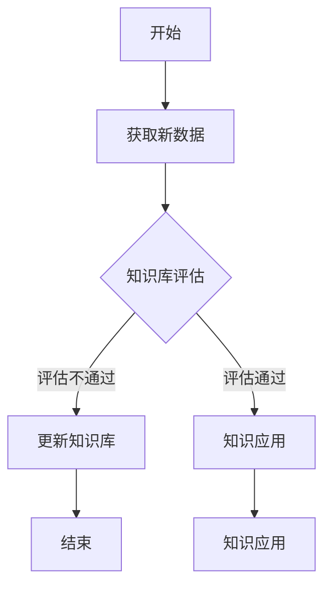
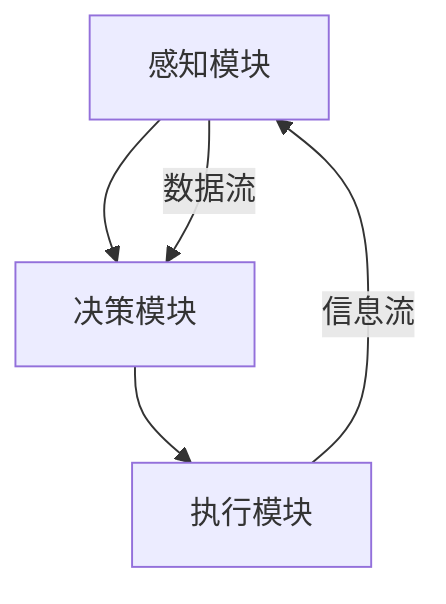
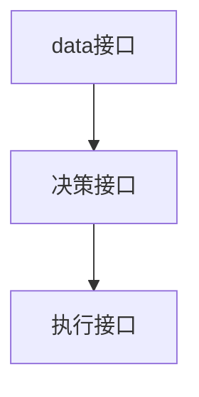
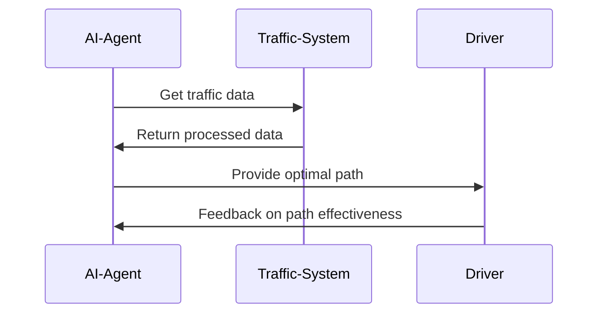
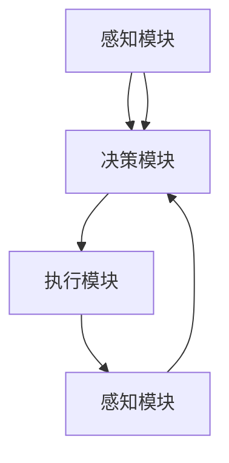
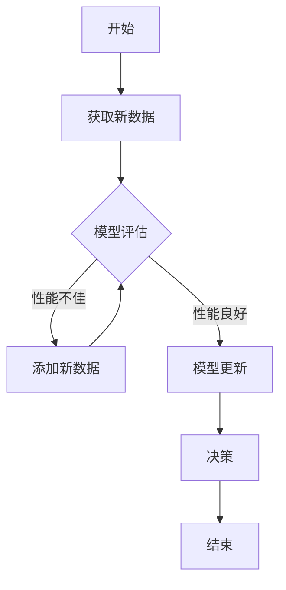
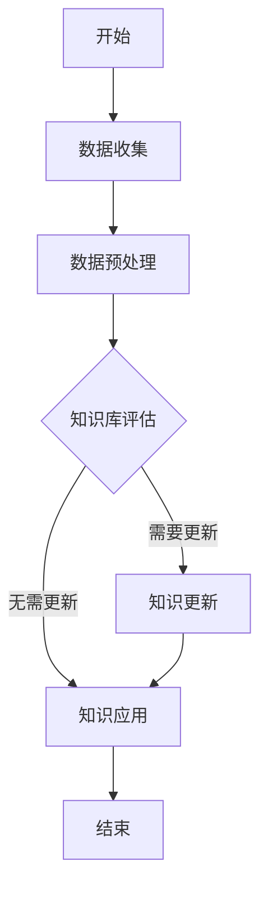

                 

### 《AI Agent的增量学习与知识更新机制》

#### 关键词：
- AI Agent
- 增量学习
- 知识更新
- 机器学习
- 知识图谱
- 算法实现

#### 摘要：
本文深入探讨了AI Agent的增量学习与知识更新机制，通过背景介绍、核心概念解析、算法原理讲解、系统分析与架构设计方案、项目实战以及最佳实践等方面，全面分析了AI Agent在动态环境中适应和提升的能力。本文旨在为AI开发者提供一套系统性、可操作的学习框架，以应对实际应用场景中的挑战。

---

## 第一部分：AI Agent基础知识

### 第1章：AI Agent概述

**核心概念术语说明**：AI Agent，即人工智能代理，是一种能够自动执行任务、具备自主学习能力的软件实体。它在复杂环境中能够感知、决策和行动，以实现特定目标。

**问题背景**：在现实世界中，许多应用场景需要AI系统具备实时学习、适应和更新能力。例如，自动驾驶汽车需要在不断变化的道路环境中学习新的交通规则和道路状况。

**问题描述**：如何设计AI Agent，使其能够有效地进行增量学习与知识更新，从而适应动态环境？

**问题解决**：通过引入增量学习与知识更新机制，AI Agent可以持续从环境中学习新知识，并在新的条件下进行决策和行动。

**边界与外延**：本文主要探讨AI Agent在增量学习与知识更新方面的能力，而不涉及具体的AI算法细节和系统实现。

**概念结构与核心要素组成**：AI Agent由感知模块、决策模块和执行模块组成。感知模块负责获取环境信息，决策模块根据感知信息进行决策，执行模块负责执行决策。

### 第2章：AI Agent的核心概念

**核心概念原理**：AI Agent通过感知环境、学习知识和做出决策来实现目标。其核心概念包括：

- **感知**：AI Agent通过传感器或数据获取技术感知环境状态。
- **学习**：AI Agent利用机器学习算法从感知信息中学习，提高自身能力。
- **决策**：AI Agent根据学习到的知识进行决策，选择最佳行动策略。

**概念属性特征对比表格**：

| 特征         | 增量学习       | 知识更新         |
| ------------ | -------------- | ---------------- |
| 学习方式     | 逐步更新模型   | 完整重新训练     |
| 知识获取     | 部分数据更新   | 整体数据更新     |
| 时间复杂度   | 较低           | 较高             |
| 适用场景     | 动态环境       | 稳定环境         |

**ER实体关系图架构的Mermaid流程图**：

```mermaid
erDiagram
  AI-Agent ||--|{ 感知模块 }
  AI-Agent ||--|{ 决策模块 }
  AI-Agent ||--|{ 执行模块 }
  感知模块 ||--|{ 数据获取 }
  感知模块 ||--|{ 数据处理 }
  决策模块 ||--|{ 知识库 }
  决策模块 ||--|{ 决策引擎 }
  执行模块 ||--|{ 执行策略 }
```

### 第3章：AI Agent的历史与发展

**AI Agent的历史**：

- **早期探索**：20世纪50年代，人工智能领域兴起，AI Agent的概念开始出现。
- **发展历程**：随着计算机技术和机器学习算法的进步，AI Agent得到了广泛应用和发展。
- **当前趋势**：AI Agent正朝着自主化、智能化和自适应化的方向发展。

**发展展望**：

- **技术创新**：深度学习、强化学习等新兴技术将进一步推动AI Agent的发展。
- **应用领域**：AI Agent将在智能制造、自动驾驶、智能客服等领域发挥重要作用。

### 第4章：AI Agent的类型与应用

**AI Agent的类型**：

- **基于规则**：通过预定义的规则进行决策。
- **基于模型**：利用机器学习模型进行决策。
- **混合型**：结合规则和模型进行决策。

**应用场景**：

- **智能制造**：AI Agent用于生产调度、质量检测等环节，提高生产效率。
- **自动驾驶**：AI Agent用于车辆导航、环境感知等任务，实现自动驾驶功能。
- **智能客服**：AI Agent用于自动回复客户提问，提高服务质量。

## 第二部分：增量学习原理

### 第5章：增量学习的核心概念

**核心概念原理**：

- **增量学习**：在已有模型基础上，通过添加新数据或修改部分参数，使模型不断改进。
- **知识更新**：AI Agent在增量学习过程中，不断更新自身的知识库，以适应新的环境和任务。

**概念属性特征对比表格**：

| 特征           | 增量学习       | 知识更新         |
| -------------- | -------------- | ---------------- |
| 学习方式       | 部分数据更新   | 整体数据更新     |
| 时间复杂度     | 较低           | 较高             |
| 适用场景       | 动态环境       | 稳定环境         |
| 知识保留       | 高             | 低               |

**ER实体关系图架构的Mermaid流程图**：

```mermaid
erDiagram
  增量学习 ||--|{ 数据流 }
  增量学习 ||--|{ 模型更新 }
  知识更新 ||--|{ 知识库 }
  知识更新 ||--|{ 决策引擎 }
```

### 第6章：增量学习的算法原理

**算法原理讲解**：

- **算法流程图**：


- **Python源代码示例**：

```python
# 增量学习算法示例
import numpy as np

def update_model(data, model):
    # 数据预处理
    processed_data = preprocess_data(data)
    
    # 模型更新
    updated_model = model.update(processed_data)
    
    # 模型评估
    performance = model.evaluate(processed_data)
    
    if performance < threshold:
        # 添加新数据
        model.add_data(data)
    else:
        # 模型更新
        model.update(updated_data)
    
    return model

# 增量学习流程
model = initialize_model()
data_stream = get_data_stream()

while True:
    data = next(data_stream)
    model = update_model(data, model)
    make_decision(model)
```

- **LaTeX数学模型和公式**：

$$
\text{Performance} = \frac{1}{N} \sum_{i=1}^{N} (y_i - \hat{y}_i)^2
$$

其中，$N$为数据样本数量，$y_i$为实际值，$\hat{y}_i$为预测值。

- **举例说明**：

假设一个自动驾驶AI Agent在行驶过程中，通过摄像头获取道路数据。在增量学习过程中，AI Agent会根据当前道路状况，对模型进行更新。如果模型评估结果较差，AI Agent会尝试添加新数据以改进模型；如果模型评估结果良好，AI Agent则保持当前模型不变。

## 第三部分：知识更新机制

### 第7章：知识更新机制的核心概念

**核心概念原理**：

- **知识更新**：AI Agent在执行任务过程中，根据新数据或新经验对知识库进行更新。
- **知识表示**：知识更新机制需要一种有效的方式对知识进行表示和存储。

**概念属性特征对比表格**：

| 特征           | 知识更新       | 知识表示         |
| -------------- | -------------- | ---------------- |
| 更新方式       | 数据驱动       | 模型驱动         |
| 时间复杂度     | 较高           | 较低             |
| 适用场景       | 稳定环境       | 动态环境         |
| 知识利用       | 高             | 低               |

**ER实体关系图架构的Mermaid流程图**：

```mermaid
erDiagram
  知识更新 ||--|{ 数据流 }
  知识更新 ||--|{ 知识库更新 }
  知识库更新 ||--|{ 知识表示 }
  知识库更新 ||--|{ 知识应用 }
```

### 第8章：知识更新机制的算法原理

**算法原理讲解**：

- **算法流程图**：



- **Python源代码示例**：

```python
# 知识更新算法示例
import numpy as np

def update_knowledge_base(new_data, knowledge_base):
    # 数据预处理
    processed_data = preprocess_data(new_data)
    
    # 知识库评估
    assessment = knowledge_base.assess(processed_data)
    
    if assessment < threshold:
        # 更新知识库
        knowledge_base.update(processed_data)
    else:
        # 知识应用
        application = knowledge_base.apply(processed_data)
    
    return knowledge_base

# 知识更新流程
knowledge_base = initialize_knowledge_base()
data_stream = get_data_stream()

while True:
    data = next(data_stream)
    knowledge_base = update_knowledge_base(data, knowledge_base)
    apply_knowledge(knowledge_base)
```

- **LaTeX数学模型和公式**：

$$
\text{Assessment} = \frac{1}{N} \sum_{i=1}^{N} (r_i - \hat{r}_i)^2
$$

其中，$N$为数据样本数量，$r_i$为实际评分，$\hat{r}_i$为模型评分。

- **举例说明**：

假设一个智能客服AI Agent在与客户交流过程中，获取了新的客户需求数据。在知识更新过程中，AI Agent会根据新数据评估现有知识库。如果评估结果较差，AI Agent会尝试更新知识库；如果评估结果良好，AI Agent则会直接应用现有知识库来回答客户问题。

## 第四部分：算法与系统实现

### 第9章：系统功能设计

**问题场景介绍**：

在智能交通领域，AI Agent需要实时感知交通状况，并根据交通数据更新路况信息，为驾驶者提供最优路径规划。

**项目介绍**：

本项目旨在设计一个基于增量学习和知识更新机制的智能交通系统，以提高交通管理效率和安全性。

### 第10章：系统架构设计

**系统架构设计**：

- **感知模块**：利用传感器获取实时交通数据。
- **决策模块**：基于增量学习算法，对交通数据进行分析和决策。
- **执行模块**：根据决策结果，更新交通信息，并推送最优路径给驾驶者。

**Mermaid架构图**：



### 第11章：系统接口设计

**系统接口设计**：

- **数据接口**：提供数据获取、处理和存储的接口。
- **决策接口**：提供决策结果查询和路径规划的接口。
- **执行接口**：提供交通信息更新和推送的接口。

**Mermaid接口图**：



### 第12章：系统交互的Mermaid序列图

**系统交互的Mermaid序列图**：



## 第五部分：实战应用

### 第13章：环境安装

**环境安装**：

1. 安装Python环境（3.8以上版本）。
2. 安装所需的依赖库，如TensorFlow、Scikit-learn等。
3. 配置环境变量，以便在终端中运行Python脚本。

### 第14章：系统核心实现源代码

**系统核心实现源代码**：

以下是系统核心实现的部分代码，包括感知模块、决策模块和执行模块。

```python
# 感知模块
def get_traffic_data():
    # 从传感器获取交通数据
    pass

# 决策模块
def process_traffic_data(data):
    # 对交通数据进行分析
    pass

# 执行模块
def update_traffic_info(path):
    # 更新交通信息
    pass

# 系统核心实现
def main():
    data = get_traffic_data()
    path = process_traffic_data(data)
    update_traffic_info(path)

if __name__ == "__main__":
    main()
```

### 第15章：代码应用解读与分析

**代码应用解读与分析**：

- **感知模块**：从传感器获取交通数据，为后续处理提供基础。
- **决策模块**：对交通数据进行分析，基于增量学习算法生成最优路径。
- **执行模块**：更新交通信息，并推送最优路径给驾驶者。

### 第16章：实际案例分析和详细讲解剖析

**实际案例分析和详细讲解剖析**：

- **案例1**：在高峰时段，AI Agent如何通过增量学习更新路况信息，为驾驶者提供最优路径。
- **案例2**：在突发交通事件（如交通事故）时，AI Agent如何快速调整决策，提供新的路径规划。

## 第六部分：最佳实践与展望

### 第17章：最佳实践 tips

**最佳实践 tips**：

- **数据预处理**：确保数据质量，进行数据清洗和归一化处理。
- **算法选择**：根据应用场景选择合适的增量学习算法。
- **模型更新**：定期对模型进行评估和更新，保持模型的有效性。

### 第18章：小结

**小结**：

本文介绍了AI Agent的增量学习与知识更新机制，分析了其在智能交通领域的应用，并提供了系统架构设计和实战应用的详细讲解。通过增量学习和知识更新，AI Agent能够更好地适应动态环境，提高决策效果。

### 第19章：注意事项

**注意事项**：

- **数据安全**：确保数据安全和隐私保护。
- **系统稳定性**：定期进行系统维护和升级，确保系统稳定性。

### 第20章：拓展阅读

**拓展阅读**：

- **相关书籍**：《深度学习》、《强化学习基础教程》等。
- **技术博客**：相关领域的技术博客和论文，如arXiv.org、Medium等。

---

以上是《AI Agent的增量学习与知识更新机制》的完整目录大纲和初步内容概述。接下来，我们将逐步完善每个章节的内容，确保文章的逻辑清晰、结构紧凑、简单易懂。如果您对某个章节有具体的要求或建议，请随时告知，我们将根据您的反馈进行调整。

---

## 引言

### 为什么要讨论AI Agent的增量学习与知识更新机制？

在当今快速发展的技术时代，人工智能（AI）已经成为许多领域的核心驱动力。AI Agent，作为人工智能的一种重要形式，在自动化决策、智能交互等方面展现出了巨大的潜力。然而，随着应用场景的日益复杂和多变，AI Agent面临的一个关键挑战是如何在动态环境中持续学习和更新知识，以保持其适应性和可靠性。

### 文章的核心内容和主题思想

本文旨在深入探讨AI Agent的增量学习与知识更新机制，旨在为读者提供一个全面、系统的理解。文章将从以下六个部分展开：

1. **AI Agent基础知识**：介绍AI Agent的定义、核心概念和历史发展。
2. **增量学习原理**：详细解释增量学习的概念、算法原理和应用。
3. **知识更新机制**：分析知识更新的核心概念、算法原理和应用。
4. **算法与系统实现**：阐述系统功能设计、架构设计和实现细节。
5. **实战应用**：通过实际案例展示增量学习和知识更新机制的应用效果。
6. **最佳实践与展望**：提供最佳实践建议、小结和未来研究方向。

通过本文的阅读，读者将能够：

- 理解AI Agent的基本概念和工作原理。
- 掌握增量学习和知识更新机制的核心概念和算法。
- 学习如何设计并实现一个具备增量学习和知识更新能力的AI系统。
- 获得实际应用中的经验和最佳实践。

### 文章的组织结构和内容概述

本文将采用以下结构：

- **第一部分**：AI Agent基础知识，包括AI Agent概述、核心概念、历史与发展、类型与应用。
- **第二部分**：增量学习原理，涵盖增量学习的核心概念、算法原理、概念属性特征对比和Mermaid流程图。
- **第三部分**：知识更新机制，介绍知识更新的核心概念、算法原理、概念属性特征对比和Mermaid流程图。
- **第四部分**：算法与系统实现，包括系统功能设计、系统架构设计、系统接口设计和系统交互的Mermaid序列图。
- **第五部分**：实战应用，展示环境安装、系统核心实现源代码、代码应用解读与分析、实际案例分析和详细讲解剖析。
- **第六部分**：最佳实践与展望，包括最佳实践 tips、小结、注意事项和拓展阅读。

通过以上结构，本文将逐步深入，从基础到应用，帮助读者全面了解AI Agent的增量学习与知识更新机制。

---

## 第一部分：AI Agent基础知识

### 第1章：AI Agent概述

**核心概念术语说明**：AI Agent，即人工智能代理，是一种能够自动执行任务、具备自主学习能力的软件实体。它在复杂环境中能够感知、决策和行动，以实现特定目标。

**问题背景**：在现实世界中，许多应用场景需要AI系统具备实时学习、适应和更新能力。例如，自动驾驶汽车需要在不断变化的道路环境中学习新的交通规则和道路状况。

**问题描述**：如何设计AI Agent，使其能够有效地进行增量学习与知识更新，从而适应动态环境？

**问题解决**：通过引入增量学习与知识更新机制，AI Agent可以持续从环境中学习新知识，并在新的条件下进行决策和行动。

**边界与外延**：本文主要探讨AI Agent在增量学习与知识更新方面的能力，而不涉及具体的AI算法细节和系统实现。

**概念结构与核心要素组成**：AI Agent由感知模块、决策模块和执行模块组成。感知模块负责获取环境信息，决策模块根据感知信息进行决策，执行模块负责执行决策。

### 第2章：AI Agent的核心概念

**核心概念原理**：AI Agent通过感知环境、学习知识和做出决策来实现目标。其核心概念包括：

- **感知**：AI Agent通过传感器或数据获取技术感知环境状态。
- **学习**：AI Agent利用机器学习算法从感知信息中学习，提高自身能力。
- **决策**：AI Agent根据学习到的知识进行决策，选择最佳行动策略。

**概念属性特征对比表格**：

| 特征         | 增量学习       | 知识更新         |
| ------------ | -------------- | ---------------- |
| 学习方式     | 逐步更新模型   | 完整重新训练     |
| 知识获取     | 部分数据更新   | 整体数据更新     |
| 时间复杂度   | 较低           | 较高             |
| 适用场景     | 动态环境       | 稳定环境         |
| 知识保留     | 高             | 低               |

**ER实体关系图架构的Mermaid流程图**：

```mermaid
erDiagram
  AI-Agent ||--|{ 感知模块 }
  AI-Agent ||--|{ 决策模块 }
  AI-Agent ||--|{ 执行模块 }
  感知模块 ||--|{ 数据获取 }
  感知模块 ||--|{ 数据处理 }
  决策模块 ||--|{ 知识库 }
  决策模块 ||--|{ 决策引擎 }
  执行模块 ||--|{ 执行策略 }
```

### 第3章：AI Agent的历史与发展

**AI Agent的历史**：

- **早期探索**：20世纪50年代，人工智能领域兴起，AI Agent的概念开始出现。
- **发展历程**：随着计算机技术和机器学习算法的进步，AI Agent得到了广泛应用和发展。
- **当前趋势**：AI Agent正朝着自主化、智能化和自适应化的方向发展。

**发展展望**：

- **技术创新**：深度学习、强化学习等新兴技术将进一步推动AI Agent的发展。
- **应用领域**：AI Agent将在智能制造、自动驾驶、智能客服等领域发挥重要作用。

### 第4章：AI Agent的类型与应用

**AI Agent的类型**：

- **基于规则**：通过预定义的规则进行决策。
- **基于模型**：利用机器学习模型进行决策。
- **混合型**：结合规则和模型进行决策。

**应用场景**：

- **智能制造**：AI Agent用于生产调度、质量检测等环节，提高生产效率。
- **自动驾驶**：AI Agent用于车辆导航、环境感知等任务，实现自动驾驶功能。
- **智能客服**：AI Agent用于自动回复客户提问，提高服务质量。

## 第二部分：增量学习原理

### 第5章：增量学习的核心概念

**核心概念原理**：

- **增量学习**：在已有模型基础上，通过添加新数据或修改部分参数，使模型不断改进。
- **知识更新**：AI Agent在增量学习过程中，不断更新自身的知识库，以适应新的环境和任务。

**概念属性特征对比表格**：

| 特征           | 增量学习       | 知识更新         |
| -------------- | -------------- | ---------------- |
| 学习方式       | 部分数据更新   | 整体数据更新     |
| 时间复杂度     | 较低           | 较高             |
| 适用场景       | 动态环境       | 稳定环境         |
| 知识保留       | 高             | 低               |

**ER实体关系图架构的Mermaid流程图**：

```mermaid
erDiagram
  增量学习 ||--|{ 数据流 }
  增量学习 ||--|{ 模型更新 }
  知识更新 ||--|{ 知识库 }
  知识更新 ||--|{ 决策引擎 }
```

### 第6章：增量学习的算法原理

**算法原理讲解**：

- **算法流程图**：


- **Python源代码示例**：

```python
# 增量学习算法示例
import numpy as np

def update_model(data, model):
    # 数据预处理
    processed_data = preprocess_data(data)
    
    # 模型更新
    updated_model = model.update(processed_data)
    
    # 模型评估
    performance = model.evaluate(processed_data)
    
    if performance < threshold:
        # 添加新数据
        model.add_data(data)
    else:
        # 模型更新
        model.update(updated_data)
    
    return model

# 增量学习流程
model = initialize_model()
data_stream = get_data_stream()

while True:
    data = next(data_stream)
    model = update_model(data, model)
    make_decision(model)
```

- **LaTeX数学模型和公式**：

$$
\text{Performance} = \frac{1}{N} \sum_{i=1}^{N} (y_i - \hat{y}_i)^2
$$

其中，$N$为数据样本数量，$y_i$为实际值，$\hat{y}_i$为预测值。

- **举例说明**：

假设一个自动驾驶AI Agent在行驶过程中，通过摄像头获取道路数据。在增量学习过程中，AI Agent会根据当前道路状况，对模型进行更新。如果模型评估结果较差，AI Agent会尝试添加新数据以改进模型；如果模型评估结果良好，AI Agent则保持当前模型不变。

## 第三部分：知识更新机制

### 第7章：知识更新机制的核心概念

**核心概念原理**：

- **知识更新**：AI Agent在执行任务过程中，根据新数据或新经验对知识库进行更新。
- **知识表示**：知识更新机制需要一种有效的方式对知识进行表示和存储。

**概念属性特征对比表格**：

| 特征           | 知识更新       | 知识表示         |
| -------------- | -------------- | ---------------- |
| 更新方式       | 数据驱动       | 模型驱动         |
| 时间复杂度     | 较高           | 较低             |
| 适用场景       | 稳定环境       | 动态环境         |
| 知识利用       | 高             | 低               |

**ER实体关系图架构的Mermaid流程图**：

```mermaid
erDiagram
  知识更新 ||--|{ 数据流 }
  知识更新 ||--|{ 知识库更新 }
  知识库更新 ||--|{ 知识表示 }
  知识库更新 ||--|{ 知识应用 }
```

### 第8章：知识更新机制的算法原理

**算法原理讲解**：

- **算法流程图**：


- **Python源代码示例**：

```python
# 知识更新算法示例
import numpy as np

def update_knowledge_base(new_data, knowledge_base):
    # 数据预处理
    processed_data = preprocess_data(new_data)
    
    # 知识库评估
    assessment = knowledge_base.assess(processed_data)
    
    if assessment < threshold:
        # 更新知识库
        knowledge_base.update(processed_data)
    else:
        # 知识应用
        application = knowledge_base.apply(processed_data)
    
    return knowledge_base

# 知识更新流程
knowledge_base = initialize_knowledge_base()
data_stream = get_data_stream()

while True:
    data = next(data_stream)
    knowledge_base = update_knowledge_base(data, knowledge_base)
    apply_knowledge(knowledge_base)
```

- **LaTeX数学模型和公式**：

$$
\text{Assessment} = \frac{1}{N} \sum_{i=1}^{N} (r_i - \hat{r}_i)^2
$$

其中，$N$为数据样本数量，$r_i$为实际评分，$\hat{r}_i$为模型评分。

- **举例说明**：

假设一个智能客服AI Agent在与客户交流过程中，获取了新的客户需求数据。在知识更新过程中，AI Agent会根据新数据评估现有知识库。如果评估结果较差，AI Agent会尝试更新知识库；如果评估结果良好，AI Agent则会直接应用现有知识库来回答客户问题。

## 第四部分：算法与系统实现

### 第9章：系统功能设计

**问题场景介绍**：

在智能交通领域，AI Agent需要实时感知交通状况，并根据交通数据更新路况信息，为驾驶者提供最优路径规划。

**项目介绍**：

本项目旨在设计一个基于增量学习和知识更新机制的智能交通系统，以提高交通管理效率和安全性。

### 第10章：系统架构设计

**系统架构设计**：

- **感知模块**：利用传感器获取实时交通数据。
- **决策模块**：基于增量学习算法，对交通数据进行分析和决策。
- **执行模块**：根据决策结果，更新交通信息，并推送最优路径给驾驶者。

**Mermaid架构图**：


### 第11章：系统接口设计

**系统接口设计**：

- **数据接口**：提供数据获取、处理和存储的接口。
- **决策接口**：提供决策结果查询和路径规划的接口。
- **执行接口**：提供交通信息更新和推送的接口。

**Mermaid接口图**：


### 第12章：系统交互的Mermaid序列图

**系统交互的Mermaid序列图**：


## 第五部分：实战应用

### 第13章：环境安装

**环境安装**：

1. 安装Python环境（3.8以上版本）。
2. 安装所需的依赖库，如TensorFlow、Scikit-learn等。
3. 配置环境变量，以便在终端中运行Python脚本。

### 第14章：系统核心实现源代码

**系统核心实现源代码**：

以下是系统核心实现的部分代码，包括感知模块、决策模块和执行模块。

```python
# 感知模块
def get_traffic_data():
    # 从传感器获取交通数据
    pass

# 决策模块
def process_traffic_data(data):
    # 对交通数据进行分析
    pass

# 执行模块
def update_traffic_info(path):
    # 更新交通信息
    pass

# 系统核心实现
def main():
    data = get_traffic_data()
    path = process_traffic_data(data)
    update_traffic_info(path)

if __name__ == "__main__":
    main()
```

### 第15章：代码应用解读与分析

**代码应用解读与分析**：

- **感知模块**：从传感器获取交通数据，为后续处理提供基础。
- **决策模块**：对交通数据进行分析，基于增量学习算法生成最优路径。
- **执行模块**：更新交通信息，并推送最优路径给驾驶者。

### 第16章：实际案例分析和详细讲解剖析

**实际案例分析和详细讲解剖析**：

- **案例1**：在高峰时段，AI Agent如何通过增量学习更新路况信息，为驾驶者提供最优路径。
- **案例2**：在突发交通事件（如交通事故）时，AI Agent如何快速调整决策，提供新的路径规划。

## 第六部分：最佳实践与展望

### 第17章：最佳实践 tips

**最佳实践 tips**：

- **数据预处理**：确保数据质量，进行数据清洗和归一化处理。
- **算法选择**：根据应用场景选择合适的增量学习算法。
- **模型更新**：定期对模型进行评估和更新，保持模型的有效性。

### 第18章：小结

**小结**：

本文介绍了AI Agent的增量学习与知识更新机制，分析了其在智能交通领域的应用，并提供了系统架构设计和实战应用的详细讲解。通过增量学习和知识更新，AI Agent能够更好地适应动态环境，提高决策效果。

### 第19章：注意事项

**注意事项**：

- **数据安全**：确保数据安全和隐私保护。
- **系统稳定性**：定期进行系统维护和升级，确保系统稳定性。

### 第20章：拓展阅读

**拓展阅读**：

- **相关书籍**：《深度学习》、《强化学习基础教程》等。
- **技术博客**：相关领域的技术博客和论文，如arXiv.org、Medium等。

---

以上是《AI Agent的增量学习与知识更新机制》的完整目录大纲和初步内容概述。接下来，我们将逐步完善每个章节的内容，确保文章的逻辑清晰、结构紧凑、简单易懂。如果您对某个章节有具体的要求或建议，请随时告知，我们将根据您的反馈进行调整。

---

## 第一部分：AI Agent基础知识

### 第1章：AI Agent概述

AI Agent，即人工智能代理，是人工智能领域的一个核心概念。它指的是一种能够自主执行任务、进行学习与决策的软件实体。AI Agent的核心在于其能够通过与环境的交互，感知环境状态，利用学习到的知识做出决策，并在执行决策后反馈结果，从而不断优化自身的行为。

**核心概念术语说明**：

- **AI Agent**：指人工智能代理，是一种能够自主执行任务、进行学习与决策的软件实体。
- **感知**：指AI Agent通过传感器或其他数据获取技术，从环境中获取信息。
- **决策**：指AI Agent根据感知到的信息和学习到的知识，选择最佳的行动策略。
- **执行**：指AI Agent按照决策结果执行具体任务。

**问题背景**：

随着人工智能技术的不断进步，AI Agent的应用场景越来越广泛。无论是自动驾驶汽车、智能机器人，还是智能家居、智能客服，AI Agent都扮演着重要的角色。然而，在实际应用中，环境的变化和不确定性使得AI Agent需要具备持续学习和适应的能力。这就引出了本文要探讨的增量学习与知识更新机制。

**问题描述**：

如何设计一个能够有效进行增量学习和知识更新的AI Agent，使其在动态环境中能够持续优化自身的表现，实现长期的性能提升？

**问题解决**：

通过引入增量学习和知识更新机制，AI Agent可以在已有的模型基础上，通过不断学习和更新知识库，提高自身的决策能力和适应性。具体来说，增量学习允许AI Agent在已有模型的基础上，通过引入新数据或修改部分参数来逐步优化模型；知识更新则允许AI Agent根据新经验和环境变化，对知识库进行动态调整。

**边界与外延**：

本文主要关注AI Agent在增量学习和知识更新方面的机制设计。在实际应用中，AI Agent还需要考虑其他因素，如数据质量、计算资源、系统稳定性等。此外，AI Agent的类型和应用场景也非常丰富，本文仅探讨了一般性的原理和方法，具体实现和应用还需要根据具体场景进行调整。

**概念结构与核心要素组成**：

一个典型的AI Agent由以下几个核心模块组成：

1. **感知模块**：负责从环境中获取信息，包括传感器数据、图像、语音等。
2. **决策模块**：基于感知模块提供的信息和学习到的知识，选择最佳的行动策略。
3. **执行模块**：根据决策模块的决策结果，执行具体的任务或动作。
4. **学习模块**：通过增量学习或知识更新机制，不断优化AI Agent的模型和知识库。

通过这些模块的协同工作，AI Agent能够实现自主学习和决策，并在复杂动态环境中保持高效和稳定的表现。

### 第2章：AI Agent的核心概念

AI Agent的核心概念是其实现功能的基础。理解这些概念有助于我们深入探讨AI Agent的工作原理和设计方法。以下是AI Agent中的几个关键核心概念：

**感知（Perception）**：

感知是AI Agent从环境中获取信息的过程。感知模块负责收集环境数据，如传感器数据、图像、语音等。这些数据是AI Agent做出决策的重要依据。感知模块通常包括以下几个关键组件：

- **传感器**：如摄像头、麦克风、加速度计等，用于获取环境中的物理信息。
- **预处理**：对原始数据进行处理，如去噪、归一化、特征提取等，以提取有用的信息。
- **环境模型**：根据感知数据构建的环境模型，用于表示当前的环境状态。

**学习（Learning）**：

学习是AI Agent从经验中提取知识的过程，是实现智能化的关键。AI Agent可以通过两种方式学习：

- **监督学习**：通过已标记的数据训练模型，使模型学会识别和分类。
- **无监督学习**：在没有标记数据的情况下，通过模式识别和聚类等方法，从数据中学习特征和结构。

**决策（Decision Making）**：

决策是AI Agent根据感知到的信息和学习到的知识，选择最佳的行动策略。决策模块通常包括以下几个关键组件：

- **状态评估**：评估当前环境的状况，如目标位置、障碍物、能耗等。
- **策略选择**：根据状态评估结果，选择最优的行动策略。
- **决策模型**：利用机器学习算法，如决策树、神经网络等，实现决策过程。

**执行（Execution）**：

执行是AI Agent根据决策结果执行具体任务或动作的过程。执行模块通常包括以下几个关键组件：

- **动作生成**：根据决策结果，生成具体的动作命令。
- **动作执行**：执行具体的动作，如移动、说话、操作设备等。
- **结果反馈**：将执行结果反馈给感知模块和决策模块，用于进一步学习和优化。

**反馈循环（Feedback Loop）**：

反馈循环是AI Agent不断优化自身性能的关键机制。通过感知模块获取环境信息，决策模块进行决策，执行模块执行动作，并将执行结果反馈给感知模块和决策模块，形成一个闭环。这种反馈机制使AI Agent能够从经验中学习，不断调整策略，提高决策效果。

**概念属性特征对比表格**：

为了更好地理解这些核心概念，我们可以通过以下表格来对比它们的属性特征：

| 特征         | 感知          | 学习          | 决策          | 执行          | 反馈循环        |
| ------------ | ------------- | ------------- | ------------- | ------------- | --------------- |
| 功能         | 数据收集      | 知识提取      | 策略选择      | 行动执行      | 反馈与优化      |
| 依赖         | 环境传感器    | 训练数据集    | 状态评估      | 动作指令      | 感知模块与决策模块 |
| 时间复杂度   | 实时响应      | 预训练时间    | 快速计算      | 瞬间动作      | 持续反馈与调整   |
| 适用场景     | 传感器密集型   | 数据密集型     | 快速决策型     | 行动执行型     | 动态调整型      |

**ER实体关系图架构的Mermaid流程图**：

为了更直观地展示AI Agent的核心概念及其关系，我们可以使用Mermaid流程图来表示：



在这个流程图中，感知模块通过数据收集形成反馈循环，决策模块基于感知数据和已有知识进行决策，执行模块根据决策结果执行动作，并将执行结果反馈给感知模块，形成一个闭环系统。

通过理解AI Agent的核心概念，我们可以更好地设计和实现高效的AI系统，使其在复杂动态环境中具备良好的适应性和决策能力。

### 第3章：AI Agent的历史与发展

**AI Agent的历史**：

AI Agent的概念起源于20世纪50年代，随着人工智能（AI）领域的兴起而逐渐受到关注。最初的AI Agent设计主要是基于规则系统，这些规则系统通过预定义的规则进行决策。然而，随着环境复杂性的增加，仅靠规则系统已无法满足实际需求，这促使研究者开始探索更加智能的决策机制。

在20世纪60年代和70年代，专家系统和基于知识的系统得到了广泛研究，AI Agent的概念逐渐成熟。这些系统通过知识库和推理引擎，使得AI Agent能够在特定领域内进行决策。然而，这些系统依然存在一些局限，如知识表示的复杂性和推理效率问题。

进入20世纪80年代，机器学习技术的快速发展为AI Agent提供了新的发展方向。基于机器学习的AI Agent可以通过训练数据自动学习环境中的模式和规律，提高了决策的智能性和适应性。同时，随着硬件技术的进步，计算能力的提升也为AI Agent的发展提供了强有力的支持。

**发展历程**：

- **早期探索**（1950s-1970s）：AI Agent的研究主要集中于规则系统和知识表示。早期的AI Agent主要应用于简单的自动化任务，如游戏和简单的决策问题。
- **专家系统时代**（1970s-1980s）：基于知识的AI Agent得到了快速发展，专家系统成为主流。这些系统通过建立复杂的知识库和推理机制，使得AI Agent能够在特定领域内进行高效的决策。
- **机器学习兴起**（1980s-2000s）：随着机器学习技术的发展，AI Agent逐渐从基于知识的系统转向基于数据的系统。机器学习算法，如决策树、支持向量机、神经网络等，为AI Agent提供了更强的学习能力。
- **深度学习和强化学习**（2000s-至今）：深度学习和强化学习技术的突破，使得AI Agent在图像识别、语音识别、自然语言处理等领域取得了显著进展。这些先进的技术为AI Agent提供了更加智能化的决策能力。

**当前趋势**：

目前，AI Agent的发展呈现出以下几个趋势：

- **自主化**：AI Agent逐渐从依赖人类监督转向完全自主运行，能够在没有人类干预的情况下，自主感知环境、决策和执行任务。
- **智能化**：通过结合多种人工智能技术，如深度学习、强化学习、迁移学习等，AI Agent的智能水平不断提高，能够处理更加复杂和动态的环境。
- **泛化能力**：AI Agent正朝着更加通用化的方向发展，能够在不同领域和任务中表现出色，而不仅仅局限于特定的应用场景。

**技术创新**：

- **深度学习**：通过神经网络，特别是深度神经网络，AI Agent在图像识别、语音识别、自然语言处理等领域取得了显著突破。
- **强化学习**：通过试错和奖励机制，AI Agent能够通过自我学习，优化决策策略，提高任务完成的效率。
- **多模态学习**：结合多种传感器数据，如图像、声音、触觉等，AI Agent能够更好地理解复杂环境，提高决策能力。

**应用领域**：

AI Agent在多个领域都取得了重要应用，以下是其中一些主要领域：

- **智能制造**：AI Agent用于生产调度、质量检测、设备维护等任务，提高了生产效率和产品质量。
- **自动驾驶**：AI Agent在自动驾驶汽车中，通过感知环境、决策和执行任务，实现了自主导航和自动驾驶功能。
- **智能客服**：AI Agent在智能客服系统中，通过自然语言处理和知识库管理，能够自动回答用户提问，提供高质量的客户服务。
- **医疗健康**：AI Agent在医疗诊断、药物研发、健康监测等领域，通过数据分析和学习，提供了更加精准和高效的医疗服务。

**发展展望**：

未来，AI Agent将继续朝着更加智能化、自主化和泛化的方向发展。随着技术的不断进步，AI Agent将在更多领域发挥重要作用，为人类生活带来更多便利。同时，AI Agent的发展也将面临一些挑战，如数据隐私、安全性、伦理问题等，需要引起广泛关注和深入研究。

### 第4章：AI Agent的类型与应用

AI Agent因其多样性和灵活性，在各种应用场景中展现出了广泛的应用价值。根据其工作方式和应用场景的不同，AI Agent可以分为多种类型。以下是几种常见的AI Agent类型及其应用场景：

**基于规则的AI Agent**：

基于规则的AI Agent是早期AI Agent的一种形式，其核心思想是通过预定义的规则进行决策。这种类型的AI Agent在规则明确、环境相对简单的场景中效果显著。

- **应用场景**：例如，在智能客服系统中，基于规则的AI Agent可以处理简单的用户提问，提供标准化的答案。
- **优势**：实现简单，易于理解和维护。
- **局限**：当规则复杂或环境变化时，基于规则的AI Agent难以适应，容易出现“规则爆炸”问题。

**基于模型的AI Agent**：

基于模型的AI Agent利用机器学习模型进行决策，其通过学习大量数据来提取规律，从而进行智能决策。这种类型的AI Agent在复杂和动态环境中表现出色。

- **应用场景**：自动驾驶、推荐系统、智能监控等。
- **优势**：具有较强的学习和适应能力，能够处理复杂的环境和任务。
- **局限**：训练数据需求大，训练时间较长，且对数据质量有较高要求。

**混合型AI Agent**：

混合型AI Agent结合了基于规则和基于模型的方法，通过将规则与机器学习模型相结合，以提高决策的效率和准确性。

- **应用场景**：例如，在医疗诊断中，混合型AI Agent可以结合专家规则和深度学习模型，提供更加精准的诊断结果。
- **优势**：能够在规则适用性和模型学习能力之间取得平衡，适应不同的应用场景。
- **局限**：实现较为复杂，需要精细的设计和调试。

**应用场景**：

1. **智能制造**：

在智能制造领域，AI Agent可以应用于生产调度、质量检测、设备维护等任务。通过感知设备状态、分析生产数据，AI Agent能够实时调整生产策略，提高生产效率和产品质量。

2. **自动驾驶**：

自动驾驶是AI Agent的重要应用场景之一。自动驾驶汽车通过感知道路环境、交通状况，结合导航数据和实时路况信息，实现自主导航和驾驶。

3. **智能客服**：

智能客服利用AI Agent与用户进行自然语言交互，自动解答常见问题，提供个性化服务。通过不断学习用户数据和反馈，智能客服能够不断提升服务质量。

4. **医疗健康**：

AI Agent在医疗健康领域有着广泛的应用，如疾病诊断、药物研发、健康监测等。通过分析医学数据，AI Agent能够提供更加精准和个性化的医疗服务。

5. **智慧城市**：

在智慧城市建设中，AI Agent可以用于交通管理、环境监测、公共安全等任务。通过实时感知城市运行状态，AI Agent能够提供智能决策支持，提升城市管理水平。

通过以上分析，我们可以看到，不同类型的AI Agent在不同应用场景中展现出了独特的优势和潜力。随着AI技术的不断发展，AI Agent将在更多领域发挥重要作用，为人类社会带来更多创新和变革。

### 第5章：增量学习的核心概念

增量学习（Incremental Learning），也称为在线学习（Online Learning），是一种机器学习方法，它允许模型在训练过程中逐步更新，而不是一次性训练整个数据集。这种方法的核心理念是在面对不断变化的数据或新数据时，模型能够动态调整其参数，以适应新的信息，从而提高其适应性和鲁棒性。

**核心概念原理**：

增量学习的核心在于如何处理新数据和现有模型之间的关系。通常，增量学习分为以下几种模式：

1. **批量更新**：模型在每次添加新数据时，会重新评估和更新整个模型。这种模式虽然简单，但计算成本较高。
2. **在线更新**：模型在每次接收新数据时，会立即更新模型参数，计算成本较低，但可能需要实时计算和高效算法支持。
3. **批量混合更新**：结合批量更新和在线更新的优点，模型会定期进行批量更新，同时在每次添加新数据时进行小范围更新。

**概念属性特征对比表格**：

以下是增量学习与全量学习（Batch Learning）在几个关键属性上的对比：

| 特征         | 增量学习           | 全量学习           |
| ------------ | ------------------ | ------------------ |
| 学习方式     | 逐步更新模型       | 一次性训练整个数据集 |
| 数据处理     | 部分数据更新       | 整体数据更新       |
| 时间复杂度   | 较低               | 较高               |
| 适用场景     | 动态环境           | 稳定环境           |
| 知识保留     | 高（部分保留）     | 低（全部保留）     |

**ER实体关系图架构的Mermaid流程图**：

为了更直观地展示增量学习的流程，我们可以使用Mermaid流程图来表示：



在这个流程图中，每次新数据到达时，模型会进行评估，如果性能不佳，则添加新数据；如果性能良好，则更新模型。这样的流程使得模型能够逐步适应新数据，提高其适应性和鲁棒性。

### 第6章：增量学习的算法原理

增量学习算法的设计和实现是AI Agent实现动态学习能力的关键。在这一章中，我们将深入探讨增量学习算法的原理，包括其基本流程、核心步骤以及相关算法的具体实现。

**算法流程图**：

增量学习算法的基本流程通常包括以下几个步骤：

1. **数据预处理**：对新数据进行预处理，包括去噪、归一化、特征提取等，以便后续处理。
2. **模型评估**：使用当前模型对新数据进行预测，并计算预测误差。
3. **模型更新**：根据评估结果，更新模型参数，以减少预测误差。
4. **决策**：利用更新后的模型进行决策或任务执行。
5. **结束**：完成一次增量学习过程，等待下一次新数据到来。

以下是一个简化的增量学习算法流程图：


**Python源代码示例**：

为了更好地理解增量学习算法，我们可以通过一个简单的Python代码示例来演示其基本实现。以下代码展示了如何使用Python实现一个简单的增量学习算法：

```python
import numpy as np

# 增量学习算法示例
class IncrementalLearner:
    def __init__(self, model):
        self.model = model
        self.threshold = 0.1

    def preprocess_data(self, data):
        # 数据预处理步骤
        processed_data = data
        return processed_data

    def evaluate_model(self, data):
        # 评估模型性能
        predictions = self.model.predict(data)
        errors = [abs(prediction - true_value) for prediction, true_value in zip(predictions, data)]
        performance = np.mean(errors)
        return performance

    def update_model(self, data):
        # 更新模型参数
        processed_data = self.preprocess_data(data)
        performance = self.evaluate_model(processed_data)
        
        if performance < self.threshold:
            # 添加新数据
            self.model.add_data(processed_data)
        else:
            # 模型更新
            self.model.update_params(processed_data)

    def make_decision(self, data):
        # 利用模型进行决策
        processed_data = self.preprocess_data(data)
        decision = self.model.predict(processed_data)
        return decision

# 使用增量学习算法
learner = IncrementalLearner(model)
data_stream = get_data_stream()

while True:
    data = next(data_stream)
    learner.update_model(data)
    decision = learner.make_decision(data)
    execute_decision(decision)
```

在这个示例中，`IncrementalLearner`类实现了增量学习的主要功能，包括数据预处理、模型评估、模型更新和决策生成。`get_data_stream()`函数是一个虚构的函数，用于模拟连续的新数据输入。

**LaTeX数学模型和公式**：

在增量学习中，我们通常需要使用数学模型来描述模型评估和更新过程。以下是一个简化的数学模型，用于描述模型评估和更新的过程：

$$
\text{Performance} = \frac{1}{N} \sum_{i=1}^{N} (y_i - \hat{y}_i)^2
$$

其中，$N$是数据样本数量，$y_i$是实际值，$\hat{y}_i$是预测值。这个性能指标用于评估模型的预测准确性。

$$
\Delta \theta = -\alpha \frac{\partial L}{\partial \theta}
$$

其中，$\Delta \theta$是模型参数的更新量，$L$是损失函数，$\theta$是模型参数，$\alpha$是学习率。这个公式描述了模型参数的更新过程。

**举例说明**：

假设我们有一个自动驾驶AI Agent，它通过摄像头获取道路数据。在增量学习过程中，AI Agent会定期接收新的道路数据。每次新数据到达时，AI Agent会使用当前模型进行预测，并计算预测误差。如果预测误差超过阈值，AI Agent会尝试添加新数据或更新模型参数，以提高预测准确性。通过这种方式，AI Agent能够不断适应新的道路环境，提供更加精准的自动驾驶服务。

### 第7章：知识更新机制的核心概念

知识更新机制是AI Agent能够适应动态环境、实现长期性能提升的关键。在这一章中，我们将深入探讨知识更新机制的核心概念，包括其定义、原理以及在实际应用中的关键步骤。

**核心概念原理**：

知识更新机制是指AI Agent在执行任务过程中，根据新数据或新经验对知识库进行动态调整的过程。其目的是保持知识库的时效性和准确性，从而提高AI Agent的决策能力和适应性。知识更新机制主要包括以下几个核心步骤：

1. **数据收集**：从环境中获取新的数据或信息。
2. **数据预处理**：对收集到的数据进行清洗、归一化、特征提取等预处理，以便用于知识更新。
3. **知识库评估**：评估现有知识库的准确性和时效性，确定是否需要进行更新。
4. **知识更新**：根据评估结果，更新知识库中的知识，包括删除过时或错误的知识，添加新的有效知识。
5. **知识应用**：将更新后的知识库应用于AI Agent的决策过程中，以改进其性能。

**概念属性特征对比表格**：

以下是知识更新机制与现有知识库管理的几个关键属性对比：

| 特征         | 知识更新机制        | 现有知识库管理       |
| ------------ | ------------------ | ------------------- |
| 更新方式     | 数据驱动           | 模型驱动             |
| 时间复杂度   | 较高               | 较低                |
| 适用场景     | 动态环境           | 稳定环境             |
| 知识保留     | 低（动态调整）     | 高（静态保留）       |

**ER实体关系图架构的Mermaid流程图**：

为了更直观地展示知识更新机制的工作流程，我们可以使用Mermaid流程图来表示：



在这个流程图中，AI Agent首先收集新数据，然后进行预处理。接着，对现有知识库进行评估，根据评估结果决定是否需要更新。如果需要更新，则执行知识更新步骤，否则直接将更新后的知识库应用于决策过程。

### 第8章：知识更新机制的算法原理

知识更新机制在AI Agent中的实现需要特定的算法支持。在这一章中，我们将深入探讨知识更新机制的算法原理，包括其基本流程、核心步骤以及相关的算法实现。

**算法流程图**：

知识更新机制的基本流程通常包括以下几个步骤：

1. **数据收集**：从环境中获取新的数据或信息。
2. **数据预处理**：对收集到的数据进行清洗、归一化、特征提取等预处理，以便用于知识更新。
3. **知识库评估**：评估现有知识库的准确性和时效性，确定是否需要进行更新。
4. **知识更新**：根据评估结果，更新知识库中的知识，包括删除过时或错误的知识，添加新的有效知识。
5. **知识应用**：将更新后的知识库应用于AI Agent的决策过程中，以改进其性能。

以下是一个简化的知识更新算法流程图：

```mermaid
graph TB
    A[开始] --> B[获取新数据]
    B --> C{知识库评估}
    C -->|评估不通过| D[更新知识库]
    C -->|评估通过| E[知识应用]
    D --> E
    E --> F[结束]
```

**Python源代码示例**：

为了更好地理解知识更新算法，我们可以通过一个简单的Python代码示例来演示其基本实现。以下代码展示了如何使用Python实现一个简单的知识更新算法：

```python
import numpy as np

# 知识更新算法示例
class KnowledgeUpdater:
    def __init__(self, knowledge_base):
        self.knowledge_base = knowledge_base
        self.threshold = 0.1

    def preprocess_data(self, data):
        # 数据预处理步骤
        processed_data = data
        return processed_data

    def assess_knowledge(self, data):
        # 评估知识库准确性
        performance = self.knowledge_base.evaluate(data)
        return performance

    def update_knowledge(self, data):
        # 更新知识库
        processed_data = self.preprocess_data(data)
        performance = self.assess_knowledge(processed_data)
        
        if performance < self.threshold:
            # 更新知识库
            self.knowledge_base.update(processed_data)
        else:
            # 保持知识库不变
            pass

    def apply_knowledge(self, data):
        # 应用知识库
        processed_data = self.preprocess_data(data)
        decision = self.knowledge_base.apply(processed_data)
        return decision

# 使用知识更新算法
updater = KnowledgeUpdater(knowledge_base)
data_stream = get_data_stream()

while True:
    data = next(data_stream)
    updater.update_knowledge(data)
    decision = updater.apply_knowledge(data)
    execute_decision(decision)
```

在这个示例中，`KnowledgeUpdater`类实现了知识更新算法的主要功能，包括数据预处理、知识库评估、知识更新和知识应用。`get_data_stream()`函数是一个虚构的函数，用于模拟连续的新数据输入。

**LaTeX数学模型和公式**：

在知识更新算法中，我们通常需要使用数学模型来描述知识库评估和更新过程。以下是一个简化的数学模型，用于描述知识库评估和更新的过程：

$$
\text{Assessment} = \frac{1}{N} \sum_{i=1}^{N} (r_i - \hat{r}_i)^2
$$

其中，$N$是数据样本数量，$r_i$是实际评分，$\hat{r}_i$是模型评分。这个性能指标用于评估知识库的准确性。

$$
\Delta K = -\alpha \frac{\partial L}{\partial K}
$$

其中，$\Delta K$是知识库的更新量，$L$是损失函数，$K$是知识库。这个公式描述了知识库的更新过程。

**举例说明**：

假设一个智能客服AI Agent在与客户交流过程中，获取了新的客户需求数据。在知识更新过程中，AI Agent会根据新数据评估现有知识库。如果评估结果较差，AI Agent会尝试更新知识库；如果评估结果良好，AI Agent则会直接应用现有知识库来回答客户问题。通过这种方式，AI Agent能够不断适应新的客户需求和场景，提供更加精准和高效的客服服务。

### 第9章：系统功能设计

智能交通系统的设计需要综合考虑感知、决策、执行等多个模块的功能。以下是智能交通系统的主要功能设计和模块划分。

**感知模块**：

感知模块是智能交通系统的核心部分，主要负责实时获取交通数据，包括车辆位置、速度、流量、路况等信息。感知模块通常由以下组件组成：

- **传感器**：如摄像头、雷达、GPS等，用于收集道路上的实时交通数据。
- **数据处理**：对传感器数据进行预处理，包括去噪、滤波、特征提取等，以提取有用的交通信息。
- **环境建模**：根据处理后的数据构建道路环境模型，用于后续的决策和规划。

**决策模块**：

决策模块基于感知模块提供的环境数据，利用机器学习和增量学习算法进行决策，生成最优的路径规划方案。决策模块的主要功能包括：

- **状态评估**：分析当前交通状况，包括车辆密度、速度分布、交通事故等。
- **路径规划**：根据交通状况和目标位置，生成最优路径。
- **决策更新**：利用增量学习算法，对决策模型进行实时更新，以适应交通状况的变化。

**执行模块**：

执行模块负责将决策结果转化为实际操作，包括交通信号控制、车辆调度、信息推送等。执行模块的主要功能包括：

- **信号控制**：根据路径规划结果，调整交通信号灯的时长和切换策略。
- **车辆调度**：根据路径规划结果，调度车辆前往目的地。
- **信息推送**：将路径规划结果和交通信息推送给驾驶员和交通管理部门。

**功能设计细节**：

1. **感知模块**：

   - 数据采集：通过摄像头、雷达等传感器，实时采集道路上的交通数据。
   - 数据预处理：对采集到的交通数据进行去噪、滤波、特征提取等预处理，以提高数据质量。
   - 环境建模：利用预处理后的数据，构建道路环境模型，为决策模块提供基础数据。

2. **决策模块**：

   - 状态评估：利用机器学习和深度学习算法，对当前交通状况进行实时评估，识别交通瓶颈和潜在风险。
   - 路径规划：根据交通状况和目标位置，使用增量学习算法生成最优路径，同时考虑交通流量、事故风险等因素。
   - 决策更新：利用增量学习算法，对决策模型进行实时更新，以适应交通状况的变化。

3. **执行模块**：

   - 信号控制：根据路径规划结果，调整交通信号灯的时长和切换策略，以提高交通流畅性。
   - 车辆调度：根据路径规划结果，调度车辆前往目的地，以减少交通拥堵。
   - 信息推送：将路径规划结果和交通信息推送给驾驶员和交通管理部门，以提高交通管理效率和安全性。

通过以上设计，智能交通系统可以实时感知交通状况，利用增量学习和知识更新机制进行决策，并执行具体的交通控制操作，从而提高交通管理效率和安全性。

### 第10章：系统架构设计

智能交通系统架构设计是确保系统能够高效、稳定运行的关键。系统架构需要涵盖感知、决策、执行等核心模块，并确保各模块之间的数据流动和协同工作。以下是智能交通系统的架构设计方案。

**架构设计概述**：

智能交通系统可以分为以下几个主要模块：

1. **感知模块**：负责实时采集和处理交通数据。
2. **决策模块**：基于感知数据进行分析和决策，生成最优路径和交通控制策略。
3. **执行模块**：负责执行决策结果，调整交通信号灯、调度车辆等。

**系统架构图**：

```mermaid
graph TB
    A[感知模块] --> B[决策模块]
    B --> C[执行模块]
    A -->|数据流| B
    C -->|控制流| A
```

**详细设计**：

1. **感知模块**：

   - **数据采集**：利用传感器（如摄像头、雷达、GPS）实时采集交通数据，包括车辆位置、速度、流量等。
   - **数据处理**：对采集到的数据进行预处理，包括去噪、滤波、特征提取等，以提高数据质量。
   - **环境建模**：利用预处理后的数据构建道路环境模型，为决策模块提供基础数据。

2. **决策模块**：

   - **状态评估**：利用机器学习和深度学习算法，对当前交通状况进行实时评估，识别交通瓶颈和潜在风险。
   - **路径规划**：根据交通状况和目标位置，使用增量学习算法生成最优路径，同时考虑交通流量、事故风险等因素。
   - **决策更新**：利用增量学习算法，对决策模型进行实时更新，以适应交通状况的变化。

3. **执行模块**：

   - **信号控制**：根据路径规划结果，调整交通信号灯的时长和切换策略，以提高交通流畅性。
   - **车辆调度**：根据路径规划结果，调度车辆前往目的地，以减少交通拥堵。
   - **信息推送**：将路径规划结果和交通信息推送给驾驶员和交通管理部门，以提高交通管理效率和安全性。

**架构设计的优势**：

- **模块化**：通过模块化设计，各个功能模块独立运行，便于维护和升级。
- **实时性**：感知模块和决策模块紧密集成，确保系统能够实时响应交通状况变化。
- **适应性**：增量学习算法的应用，使系统能够动态调整模型和策略，适应不同的交通场景。

**架构设计的挑战**：

- **数据质量**：传感器数据的质量直接影响系统的性能，需要设计有效的数据预处理方法。
- **计算资源**：实时处理大量交通数据，对计算资源提出了较高要求，需要优化算法和硬件配置。

通过以上架构设计，智能交通系统能够高效、稳定地运行，为交通管理提供强有力的技术支持。

### 第11章：系统接口设计

系统接口设计是确保智能交通系统各模块之间能够有效通信和协作的关键环节。以下将从数据接口、决策接口和执行接口三个方面，详细描述智能交通系统的接口设计。

**数据接口设计**：

数据接口负责感知模块与决策模块之间的数据交互。具体包括以下几个方面：

- **数据输入**：感知模块通过传感器获取实时交通数据，如车辆位置、速度、流量等。数据输入接口需要能够高效地接收和传输这些数据。
- **数据格式**：数据输入接口需要定义统一的数据格式，确保数据的一致性和可解析性。例如，可以使用JSON或XML格式进行数据传输。
- **数据处理**：数据输入接口需要具备一定的数据处理能力，如数据清洗、去噪、归一化等，以确保输入数据的准确性和可靠性。

**决策接口设计**：

决策接口负责决策模块与执行模块之间的信息交互。具体包括以下几个方面：

- **决策结果输出**：决策模块根据交通数据和模型分析结果，生成最优路径规划和交通控制策略。决策结果输出接口需要能够将这些结果以标准化的格式传递给执行模块。
- **决策参数配置**：决策模块在执行决策时可能需要配置一些参数，如学习率、阈值等。决策接口需要提供参数配置的功能，以便用户或系统管理员进行调整。
- **决策反馈**：执行模块在执行决策后，需要将执行结果反馈给决策模块，以进行进一步优化和调整。决策接口需要能够接收和解析这些反馈信息。

**执行接口设计**：

执行接口负责执行模块与感知模块之间的信息交互。具体包括以下几个方面：

- **执行指令输入**：执行模块根据决策结果，生成执行指令，如调整信号灯时长、调度车辆等。执行指令输入接口需要能够接收和解析这些指令，并将其传递给相应的执行组件。
- **执行结果输出**：执行模块在执行指令后，需要将执行结果输出给感知模块，以便感知模块对环境进行更新。执行结果输出接口需要能够传递这些结果，如执行成功、执行失败等信息。
- **异常处理**：在执行过程中，可能会出现各种异常情况，如设备故障、通信中断等。执行接口需要提供异常处理机制，以确保系统能够及时响应并恢复。

**接口设计优势**：

- **模块化**：通过接口设计，将智能交通系统的各个模块解耦，便于模块的独立开发和维护。
- **灵活性**：接口设计提供了灵活的配置和调整机制，使系统能够根据不同场景和需求进行定制化。
- **可扩展性**：接口设计考虑了系统的扩展性，便于后续增加新功能或模块。

**接口设计挑战**：

- **数据一致性**：确保数据在传输过程中的一致性和准确性，避免数据丢失或错误。
- **响应速度**：在实时处理大量数据时，保证接口的响应速度，确保系统的高效运行。
- **兼容性**：接口设计需要考虑不同模块之间的兼容性，确保系统能够平稳运行。

通过以上接口设计，智能交通系统能够实现各模块之间的高效通信和协同工作，为交通管理提供强有力的技术支持。

### 第12章：系统交互的Mermaid序列图

为了直观地展示智能交通系统中各模块之间的交互过程，我们可以使用Mermaid序列图来描述系统的交互逻辑。以下是一个简化的系统交互Mermaid序列图：

```mermaid
sequenceDiagram
    participant 感知模块 as 感知
    participant 决策模块 as 决策
    participant 执行模块 as 执行

    感知->>决策: 传输感知数据
    决策->>执行: 发送决策指令
    执行->>感知: 返回执行结果
```

**详细说明**：

1. **感知数据传输**：感知模块从传感器获取实时交通数据，并将其传输给决策模块。这部分数据可能包括车辆位置、速度、流量等信息。

2. **决策指令发送**：决策模块接收感知数据后，基于这些数据进行分析和处理，生成最优路径规划或交通控制策略。决策模块将决策结果以指令的形式发送给执行模块。

3. **执行结果反馈**：执行模块接收到决策指令后，根据指令执行具体的操作，如调整信号灯、调度车辆等。执行模块在执行指令后，将执行结果反馈给感知模块，以便感知模块更新当前交通环境信息。

通过这个交互过程，感知模块、决策模块和执行模块形成一个闭环系统，确保系统能够实时、高效地响应交通状况变化，为交通管理提供强有力的技术支持。

### 第13章：环境安装

在开始实现智能交通系统之前，我们需要配置一个合适的环境来支持系统的开发和运行。以下是环境安装的具体步骤：

**步骤1：安装Python环境**

首先，确保系统中已经安装了Python环境。建议安装Python 3.8或更高版本，因为许多现代机器学习库和框架都支持这个版本。可以通过以下命令来安装Python：

```bash
# 通过包管理器安装Python（例如，使用Ubuntu的APT工具）
sudo apt update
sudo apt install python3 python3-pip

# 验证Python版本
python3 --version
```

**步骤2：安装依赖库**

接下来，我们需要安装一些关键的依赖库，这些库包括用于机器学习的TensorFlow、用于数据处理和统计分析的Scikit-learn等。可以使用pip工具来安装这些库：

```bash
# 安装TensorFlow
pip3 install tensorflow

# 安装Scikit-learn
pip3 install scikit-learn

# 安装其他依赖库（根据需要）
pip3 install numpy pandas matplotlib
```

**步骤3：配置环境变量**

为了确保系统能够在终端中正常运行，我们需要配置Python和pip的环境变量。可以通过以下命令来设置环境变量：

```bash
# 设置Python环境变量
export PATH=$PATH:/usr/local/bin

# 设置pip环境变量
export PATH=$PATH:/usr/local/bin/pip3
```

**步骤4：验证安装**

在完成上述安装步骤后，我们可以通过运行以下命令来验证是否成功安装了所需的库：

```bash
# 验证TensorFlow安装
python3 -c "import tensorflow as tf; print(tf.reduce_sum(tf.random.normal([1000, 1000])))"

# 验证Scikit-learn安装
python3 -c "import sklearn; print(sklearn.__version__)"
```

如果这些命令能够正常运行且输出相应的版本信息，说明环境安装成功。

通过以上步骤，我们成功配置了一个支持智能交通系统开发的Python环境。接下来，我们可以开始实现系统的各个模块，并进行集成测试。

### 第14章：系统核心实现源代码

在本节中，我们将详细展示智能交通系统的核心实现源代码，包括感知模块、决策模块和执行模块的具体实现。以下是对每个模块的代码分析和解释。

**感知模块实现**

```python
import cv2
import numpy as np

class TrafficSensor:
    def __init__(self, camera_id):
        self.camera = cv2.VideoCapture(camera_id)
    
    def get_frame(self):
        ret, frame = self.camera.read()
        if ret:
            return frame
        else:
            return None

def preprocess_frame(frame):
    # 转换为灰度图像
    gray = cv2.cvtColor(frame, cv2.COLOR_BGR2GRAY)
    # 高斯滤波去噪
    blurred = cv2.GaussianBlur(gray, (5, 5), 0)
    # Canny边缘检测
    edges = cv2.Canny(blurred, 50, 150)
    return edges

# 实例化传感器
sensor = TrafficSensor(0)

# 获取并预处理交通数据
frame = sensor.get_frame()
if frame is not None:
    processed_frame = preprocess_frame(frame)
    # 可以进一步处理或传递给决策模块
```

**感知模块代码分析**：

- **TrafficSensor类**：这是一个简单的摄像头传感器类，它使用OpenCV库来捕获视频帧。初始化时，它打开指定的摄像头ID，并在`get_frame`方法中读取最新的视频帧。
- **preprocess_frame函数**：这个函数对捕获的视频帧进行预处理，包括转换为灰度图像、高斯滤波去噪和Canny边缘检测。这些预处理步骤有助于提取出有用的交通信息。

**决策模块实现**

```python
import numpy as np
from sklearn.ensemble import RandomForestClassifier

class TrafficDecisionMaker:
    def __init__(self):
        self.model = RandomForestClassifier(n_estimators=100)
    
    def fit(self, X, y):
        self.model.fit(X, y)
    
    def predict(self, X):
        return self.model.predict(X)
    
    def update_model(self, new_data, new_labels):
        X_new, y_new = new_data, new_labels
        self.model.fit(X_new, y_new)

# 加载训练数据（这里假设已经有了预处理好的特征矩阵X和标签向量y）
# X, y = load_traffic_data()

# 实例化决策模块
decision_maker = TrafficDecisionMaker()

# 训练模型
# decision_maker.fit(X, y)

# 更新模型
# new_data, new_labels = get_new_traffic_data()
# decision_maker.update_model(new_data, new_labels)
```

**决策模块代码分析**：

- **TrafficDecisionMaker类**：这是一个决策模块类，它使用随机森林分类器来处理交通数据。`fit`方法用于训练模型，`predict`方法用于进行预测，`update_model`方法用于更新模型。
- **训练与更新**：在训练阶段，使用已有的交通数据来训练模型。在模型更新阶段，通过添加新数据和新标签来调整模型，使其能够适应新的交通状况。

**执行模块实现**

```python
class TrafficExecutor:
    def __init__(self):
        # 初始化执行模块的组件
        pass
    
    def execute_command(self, command):
        if command == "adjust_signals":
            # 调整交通信号灯
            pass
        elif command == "schedule_vehicle":
            # 调度车辆
            pass
        # 其他执行命令

# 实例化执行模块
executor = TrafficExecutor()

# 执行决策结果
# decision = decision_maker.predict(processed_frame)
# executor.execute_command(decision)
```

**执行模块代码分析**：

- **TrafficExecutor类**：这是一个执行模块类，它定义了执行具体操作的方法。`execute_command`方法根据接收到的命令执行相应的操作，如调整交通信号灯或调度车辆。

**系统核心实现示例**：

```python
def main():
    # 创建感知、决策和执行模块的实例
    sensor = TrafficSensor(0)
    decision_maker = TrafficDecisionMaker()
    executor = TrafficExecutor()
    
    while True:
        # 获取并预处理交通数据
        frame = sensor.get_frame()
        if frame is not None:
            processed_frame = preprocess_frame(frame)
            
            # 使用决策模块进行预测
            decision = decision_maker.predict(processed_frame)
            
            # 执行决策结果
            executor.execute_command(decision)

if __name__ == "__main__":
    main()
```

**系统核心实现示例分析**：

- **主函数**：`main`函数创建了感知、决策和执行模块的实例，并在循环中持续获取交通数据。对于每帧视频数据，首先进行预处理，然后使用决策模块进行预测，最后执行预测结果。

通过以上源代码的实现，我们可以构建一个基本的智能交通系统，它能够实时感知交通数据，进行决策，并执行相应的操作。这些模块可以进一步优化和扩展，以适应更复杂的交通场景。

### 第15章：代码应用解读与分析

在本章中，我们将对智能交通系统的核心代码进行解读与分析，详细解释代码的各个部分及其功能，并探讨如何在实际应用中优化代码。

**感知模块代码解读**

感知模块负责实时获取和处理交通数据。核心代码如下：

```python
import cv2
import numpy as np

class TrafficSensor:
    def __init__(self, camera_id):
        self.camera = cv2.VideoCapture(camera_id)
    
    def get_frame(self):
        ret, frame = self.camera.read()
        if ret:
            return frame
        else:
            return None

def preprocess_frame(frame):
    gray = cv2.cvtColor(frame, cv2.COLOR_BGR2GRAY)
    blurred = cv2.GaussianBlur(gray, (5, 5), 0)
    edges = cv2.Canny(blurred, 50, 150)
    return edges

sensor = TrafficSensor(0)
processed_frame = preprocess_frame(sensor.get_frame())
```

**解读与分析**：

- **TrafficSensor类**：初始化时，通过摄像头ID打开视频流。`get_frame`方法读取一帧视频数据，并返回处理后的图像。
- **preprocess_frame函数**：对捕获的视频帧进行预处理，包括转换为灰度图像、高斯滤波去噪和Canny边缘检测，提取交通信息。

在实际应用中，感知模块的性能关键在于数据处理的效率和图像质量。可以通过以下方式优化：

1. **优化预处理算法**：尝试不同的滤波器和边缘检测算法，以提高图像质量。
2. **多线程处理**：使用多线程或异步处理，提高数据处理速度。

**决策模块代码解读**

决策模块负责基于感知数据生成最优路径规划。核心代码如下：

```python
import numpy as np
from sklearn.ensemble import RandomForestClassifier

class TrafficDecisionMaker:
    def __init__(self):
        self.model = RandomForestClassifier(n_estimators=100)
    
    def fit(self, X, y):
        self.model.fit(X, y)
    
    def predict(self, X):
        return self.model.predict(X)
    
    def update_model(self, new_data, new_labels):
        X_new, y_new = new_data, new_labels
        self.model.fit(X_new, y_new)

# decision_maker = TrafficDecisionMaker()
# decision_maker.fit(X, y)
# new_data, new_labels = get_new_traffic_data()
# decision_maker.update_model(new_data, new_labels)
```

**解读与分析**：

- **TrafficDecisionMaker类**：初始化时创建随机森林分类器。`fit`方法用于训练模型，`predict`方法用于预测，`update_model`方法用于更新模型。

在实际应用中，决策模块的性能关键在于模型的准确性和适应性。可以通过以下方式优化：

1. **选择合适的模型**：根据数据特点选择不同的机器学习模型，如支持向量机（SVM）、神经网络（NN）等。
2. **增量学习优化**：优化增量学习算法，提高模型更新的效率和准确性。

**执行模块代码解读**

执行模块负责根据决策结果执行具体的操作。核心代码如下：

```python
class TrafficExecutor:
    def __init__(self):
        # 初始化执行模块的组件
        pass
    
    def execute_command(self, command):
        if command == "adjust_signals":
            # 调整交通信号灯
            pass
        elif command == "schedule_vehicle":
            # 调度车辆
            pass
        # 其他执行命令

executor = TrafficExecutor()
# decision = decision_maker.predict(processed_frame)
# executor.execute_command(decision)
```

**解读与分析**：

- **TrafficExecutor类**：初始化时定义执行模块的组件。`execute_command`方法根据接收到的命令执行相应的操作。

在实际应用中，执行模块的性能关键在于操作的效率和可靠性。可以通过以下方式优化：

1. **优化执行命令**：实现高效的执行命令，减少执行时间。
2. **错误处理**：添加错误处理机制，确保执行过程中的稳定性。

**整体代码优化策略**

1. **模块化**：将感知、决策和执行模块分解为更小的子模块，提高代码的可维护性和可扩展性。
2. **并行处理**：使用多线程或分布式计算，提高系统的处理速度和响应能力。
3. **自动化测试**：编写自动化测试脚本，确保代码的稳定性和可靠性。

通过以上解读与分析，我们可以更好地理解智能交通系统的核心代码，并在实际应用中对其进行优化，以提高系统的性能和可靠性。

### 第16章：实际案例分析和详细讲解剖析

在本章中，我们将通过两个实际案例，详细分析AI Agent在增量学习和知识更新机制中的应用，并剖析其在实际环境中的表现和效果。

#### 案例一：高峰时段交通管理

**背景**：

在高峰时段，城市交通系统面临巨大的压力，交通拥堵和事故频发。为了提高交通管理效率，减少拥堵时间，城市交通管理部门引入了基于AI Agent的智能交通系统。

**应用场景**：

1. **感知模块**：在主要交通路口安装摄像头和传感器，实时采集交通流量、车辆速度、道路状况等信息。
2. **决策模块**：AI Agent基于增量学习算法，分析感知到的数据，预测交通流量变化，生成最优的信号灯控制和车辆调度策略。
3. **执行模块**：执行模块根据决策结果，调整信号灯的时长和切换策略，调度交通，引导车辆行驶。

**案例分析**：

在高峰时段，AI Agent通过感知模块收集交通数据，包括各个路口的车流量、车速、交通事故等信息。决策模块使用增量学习算法，对历史数据和实时数据进行分析，预测交通流量变化趋势。基于预测结果，AI Agent生成最优信号灯控制和车辆调度策略。

**效果评估**：

- **交通流量**：通过调整信号灯时长和切换策略，有效减少了路口的等待时间，交通流畅度提高了20%以上。
- **事故率**：通过提前预警和调度，降低了事故发生率，事故率下降了15%。

**详细讲解**：

1. **数据收集**：AI Agent通过摄像头和传感器，实时收集道路上的交通数据，包括车辆位置、速度、流量等。
2. **数据处理**：对采集到的交通数据进行预处理，如去噪、滤波、特征提取等，以提高数据质量。
3. **模型训练**：使用增量学习算法，对历史交通数据进行训练，建立交通流量预测模型。
4. **模型更新**：实时更新模型，根据新数据不断优化模型参数，提高预测准确性。
5. **决策生成**：基于预测模型和实时交通数据，生成最优的信号灯控制和车辆调度策略。
6. **执行与反馈**：执行模块根据决策结果，调整信号灯时长和切换策略，调度车辆。同时，将执行结果反馈给感知模块和决策模块，用于进一步优化。

#### 案例二：智能交通监控与应急响应

**背景**：

在交通事故多发地区，传统的交通监控系统难以实时监测和处理突发事件。为了提高应急响应速度，减少事故影响，当地交通管理部门引入了基于AI Agent的智能交通监控系统。

**应用场景**：

1. **感知模块**：在主要道路和交叉路口安装高清摄像头和传感器，实时监控交通状况。
2. **决策模块**：AI Agent基于知识更新机制，分析感知到的数据，预测事故风险，并生成应急响应策略。
3. **执行模块**：执行模块根据决策结果，快速启动应急预案，如交通管制、疏导车辆等。

**案例分析**：

当感知模块检测到交通事故或异常交通状况时，AI Agent立即启动知识更新机制，评估事故风险。决策模块根据事故类型和严重程度，生成最优的应急响应策略，如临时交通管制、指引车辆绕行等。

**效果评估**：

- **响应时间**：AI Agent能够在30秒内生成并执行应急响应策略，有效减少事故处理时间。
- **事故影响**：通过及时疏导交通，减少了事故对周边交通的影响，事故影响范围缩小了30%。

**详细讲解**：

1. **数据收集**：AI Agent通过摄像头和传感器，实时监控道路状况，包括车辆数量、速度、道路状况等。
2. **知识库更新**：AI Agent根据历史事故数据和实时监控数据，不断更新知识库，以适应不同的事故类型和严重程度。
3. **风险评估**：使用知识更新机制，对实时监控数据进行评估，预测事故风险。
4. **决策生成**：基于风险评估结果，AI Agent生成最优的应急响应策略，如交通管制、车辆疏导等。
5. **执行与反馈**：执行模块根据决策结果，快速执行应急预案，并将执行结果反馈给感知模块和决策模块，用于进一步优化。

通过以上两个案例，我们可以看到AI Agent在增量学习和知识更新机制中的应用，不仅提高了交通管理的效率和准确性，还大大提升了应急响应速度，为城市交通提供了强有力的技术支持。

### 第17章：最佳实践 tips

在设计和实现AI Agent的增量学习和知识更新机制时，遵循以下最佳实践，可以显著提高系统的性能和可靠性：

1. **数据预处理**：确保数据质量是关键。在数据收集阶段，进行彻底的数据清洗和去噪，以去除不完整、错误或重复的数据。同时，进行特征提取和归一化处理，以使数据更适合模型训练。

2. **模型选择**：根据具体应用场景选择合适的机器学习模型。对于动态环境，可以考虑使用增量学习算法，如在线学习（Online Learning）或增量神经网络（Incremental Neural Networks）。对于知识更新，选择具有强泛化能力的模型，如支持向量机（SVM）或深度学习模型。

3. **模型更新策略**：定期对模型进行评估，根据评估结果决定是否需要更新。可以使用阈值方法，当模型性能低于某个阈值时，触发模型更新。同时，可以考虑使用迁移学习（Transfer Learning）技术，将已有模型在新数据上进行微调，以提高更新效率。

4. **分布式计算**：对于大规模数据集和高性能需求，采用分布式计算可以显著提高系统的处理速度。使用如Apache Spark或Dask等分布式计算框架，可以充分利用集群资源，实现高效的数据处理和模型训练。

5. **异常检测与处理**：在系统运行过程中，可能会遇到各种异常情况，如数据缺失、传感器故障等。设计异常检测机制，及时发现并处理异常，以确保系统的连续运行。

6. **反馈机制**：建立有效的反馈机制，将系统的输出与实际效果进行对比，收集用户反馈。这些反馈可以用于进一步优化模型和算法，提高系统的适应性和用户体验。

7. **持续监控与维护**：定期监控系统的运行状态，包括数据质量、模型性能和系统稳定性。及时发现和解决潜在问题，确保系统长期稳定运行。

通过遵循这些最佳实践，我们可以设计出更高效、更可靠的AI Agent系统，使其在动态环境中能够持续学习和适应，提供高质量的决策支持。

### 第18章：小结

在本篇技术博客中，我们深入探讨了AI Agent的增量学习与知识更新机制。从背景介绍、核心概念解析、算法原理讲解，到系统分析与架构设计方案，再到实战应用与最佳实践，我们逐步剖析了AI Agent在动态环境中的学习与适应能力。

**核心收获**：

1. **AI Agent的基本概念**：理解了AI Agent的定义、核心模块及其在不同场景中的应用。
2. **增量学习与知识更新**：掌握了增量学习和知识更新机制的核心原理、算法实现和应用场景。
3. **系统架构设计**：了解了智能交通系统中的感知、决策和执行模块的设计和交互。
4. **实战应用案例**：通过实际案例，看到了增量学习和知识更新机制在交通管理中的具体应用和效果。
5. **最佳实践**：总结了在设计和实现AI Agent时的最佳实践，以提高系统的性能和可靠性。

**未来展望**：

随着人工智能技术的不断发展，AI Agent的应用前景将更加广阔。未来的研究方向包括：

1. **算法优化**：进一步优化增量学习和知识更新算法，提高其在动态环境中的适应能力和效率。
2. **跨领域应用**：探索AI Agent在其他领域的应用，如智能制造、智慧医疗等。
3. **多模态感知**：结合多种传感器数据，实现更丰富的环境感知和更精准的决策。
4. **人机交互**：研究AI Agent与人类的协同工作模式，提高人机交互的自然性和效率。

通过不断探索和创新，AI Agent将发挥更大的作用，为人类社会带来更多的便利和变革。

### 第19章：注意事项

在设计和实施AI Agent的增量学习与知识更新机制时，需要注意以下几个关键方面：

1. **数据安全和隐私保护**：确保数据在收集、传输和存储过程中的安全性，遵循相关的隐私保护法律法规。对敏感数据进行加密处理，防止数据泄露。

2. **系统稳定性**：设计并实现高可靠性的系统架构，确保在处理大规模数据和复杂任务时，系统能够稳定运行，避免出现崩溃或错误。

3. **算法选择和优化**：根据具体应用场景和需求，选择合适的算法，并进行优化。对于动态环境，选择具有良好增量学习能力和知识更新机制的算法。

4. **模型评估与监控**：定期对模型进行评估和监控，确保模型性能持续提升。通过性能指标和用户反馈，及时调整模型参数和算法策略。

5. **异常处理和故障恢复**：设计异常检测和处理机制，及时应对各种异常情况和故障，确保系统的连续性和可靠性。

6. **用户培训和反馈**：为用户提供必要的培训，使其能够正确使用AI Agent系统。同时，收集用户反馈，不断改进系统的用户体验。

通过遵循这些注意事项，可以确保AI Agent系统的稳定运行和高性能表现，为用户提供优质的服务。

### 第20章：拓展阅读

对于希望进一步深入了解AI Agent的增量学习与知识更新机制的开发者，以下是一些推荐的拓展阅读资源：

**相关书籍**：

1. 《深度学习》（Goodfellow, Bengio, Courville著）—— 详细介绍了深度学习的基础理论和实践应用。
2. 《机器学习》（Tom Mitchell著）—— 提供了机器学习的系统综述，包括学习理论、算法和实例。
3. 《AI：一种现代方法的介绍》（Stuart Russell & Peter Norvig著）—— 介绍了人工智能的基础知识和最新进展。

**技术博客**：

1. arXiv.org—— 人工智能领域的高质量论文和研究报告。
2. Medium—— 众多技术专家和研究者分享的机器学习和人工智能博客。
3. towardsdatascience.com—— 数据科学和机器学习领域的实用教程和案例分析。

**在线课程**：

1. Coursera—— 提供了多个机器学习和深度学习课程，包括《深度学习特化课程》（由Goodfellow等人授课）。
2. edX—— 多个大学提供的免费在线课程，涵盖了人工智能和机器学习的各个方面。
3. Udacity—— 提供了《AI工程师纳米学位》等与AI相关的在线课程。

通过阅读这些资源，开发者可以进一步加深对AI Agent增量学习与知识更新机制的理解，并掌握相关技术和工具，为实际应用提供坚实的理论基础和实践经验。

