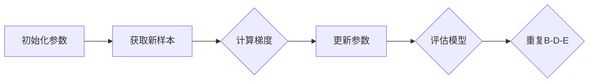
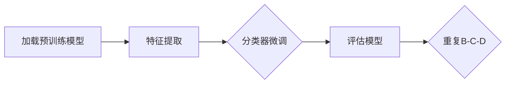
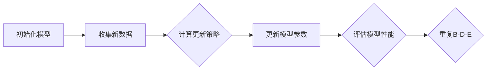
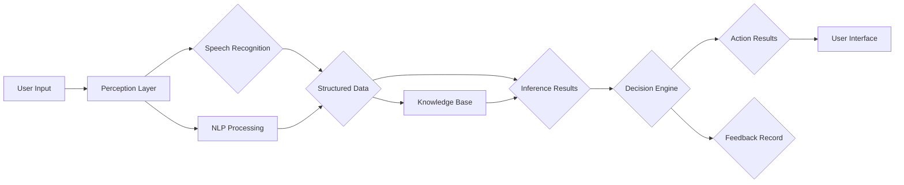
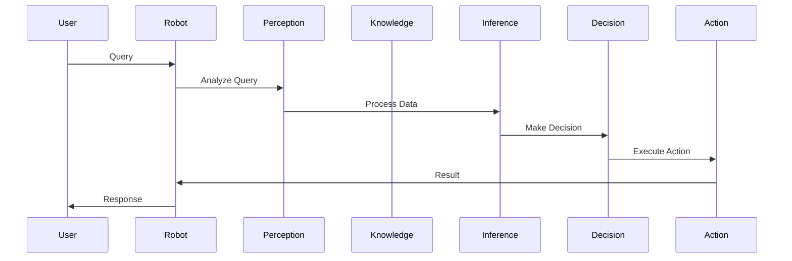
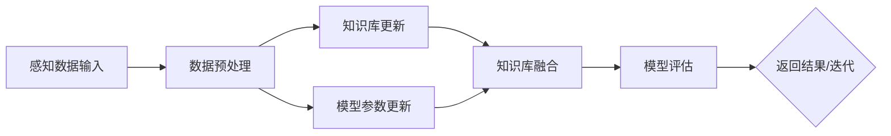
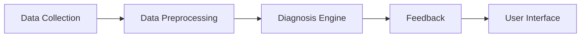
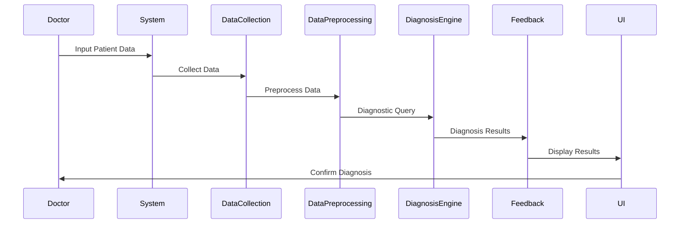

                 


### 《AI Agent的增量学习与知识更新机制》目录大纲

在构建《AI Agent的增量学习与知识更新机制》的目录大纲时，我们将遵循以下步骤：

1. **确定整体结构和章节划分**：首先，我们需要明确文章的整体结构和各个章节的主要内容。

2. **设计章节标题**：每个章节的标题需要简洁、准确，能够吸引读者阅读。

3. **编写摘要**：每个章节的摘要需要简要说明该章节的核心内容和目的。

4. **详细制定章节内容**：根据每个章节的主题，制定详细的子章节和内容。

5. **确保内容丰富性**：每个章节都需要包含必要的背景介绍、核心概念、算法原理、系统实现、实战应用等内容。

6. **优化格式**：使用Markdown格式确保文章的可读性和规范性。

7. **进行审稿和修改**：在完成初步大纲后，进行审稿和修改，确保每个章节的内容都是完整、丰富且逻辑清晰的。

现在，让我们开始构建这个目录大纲。

---

#### 目录大纲

**第一部分：AI Agent基础知识**

- **第1章：AI Agent概述**
  - 摘要：介绍AI Agent的定义、特点、分类和应用领域。
  - 内容：
    - AI Agent的定义与历史背景
    - AI Agent的特点与分类
    - AI Agent的应用领域

- **第2章：AI Agent的核心概念**
  - 摘要：介绍AI Agent的核心概念，包括感知、推理、决策和行动等。
  - 内容：
    - 感知机制与数据采集
    - 推理机制与知识表示
    - 决策机制与策略选择
    - 行动机制与执行策略

- **第3章：AI Agent的历史与发展**
  - 摘要：回顾AI Agent的发展历程，分析其关键技术和未来趋势。
  - 内容：
    - AI Agent的起源与发展
    - 关键技术的发展与突破
    - 当前发展趋势与未来展望

- **第4章：AI Agent的类型与应用**
  - 摘要：介绍不同类型的AI Agent及其在实际应用中的优势和挑战。
  - 内容：
    - 对话型AI Agent
    - 监控型AI Agent
    - 自动驾驶AI Agent
    - 应用案例分析

**第二部分：增量学习原理**

- **第5章：增量学习概述**
  - 摘要：介绍增量学习的概念、原理和重要性。
  - 内容：
    - 增量学习的定义与特点
    - 增量学习的重要性
    - 增量学习与传统机器学习的对比

- **第6章：增量学习的核心算法**
  - 摘要：详细讲解增量学习的核心算法，包括在线学习、迁移学习和模型更新策略。
  - 内容：
    - 在线学习算法
    - 迁移学习算法
    - 模型更新策略

- **第7章：增量学习的挑战与优化**
  - 摘要：分析增量学习面临的挑战和优化方法。
  - 内容：
    - 增量学习中的挑战
    - 优化方法与技术

**第三部分：知识更新机制**

- **第8章：知识更新机制概述**
  - 摘要：介绍知识更新机制的概念、原理和作用。
  - 内容：
    - 知识更新机制的定义与作用
    - 知识更新机制的工作原理

- **第9章：知识获取与整合**
  - 摘要：探讨知识获取与整合的方法和策略。
  - 内容：
    - 知识获取方法
    - 知识整合策略

- **第10章：知识更新与模型演化**
  - 摘要：分析知识更新对模型演化的影响。
  - 内容：
    - 知识更新的过程
    - 知识更新与模型演化

**第四部分：算法与系统实现**

- **第11章：算法原理讲解**
  - 摘要：详细讲解AI Agent的增量学习与知识更新机制的算法原理。
  - 内容：
    - 算法流程图
    - 算法数学模型
    - Python源代码示例

- **第12章：系统分析与架构设计方案**
  - 摘要：介绍AI Agent系统的功能设计、架构设计和实现方案。
  - 内容：
    - 系统功能设计
    - 系统架构设计
    - 系统接口设计
    - 系统交互序列图

**第五部分：实战应用**

- **第13章：项目实战**
  - 摘要：通过实际项目案例，展示AI Agent的增量学习与知识更新机制的应用。
  - 内容：
    - 环境安装与配置
    - 系统核心实现源代码
    - 代码应用解读与分析
    - 实际案例分析

**第六部分：最佳实践与展望**

- **第14章：最佳实践 tips**
  - 摘要：提供在实际应用中总结的最佳实践技巧和建议。
  - 内容：
    - 实践技巧
    - 注意事项

- **第15章：小结**
  - 摘要：总结文章的主要内容和核心观点。
  - 内容：
    - 内容回顾
    - 重要观点总结

- **第16章：注意事项**
  - 摘要：提醒读者在应用AI Agent时需要注意的问题。
  - 内容：
    - 安全性问题
    - 道德与法律问题

- **第17章：拓展阅读**
  - 摘要：推荐一些相关领域的拓展阅读资源。
  - 内容：
    - 书籍推荐
    - 论文推荐
    - 网络资源推荐

---

这个目录大纲是一个初步的设计，每个章节的内容还需要进一步细化。接下来，我们将根据这个大纲撰写详细的文章内容。

---

### 文章标题

《AI Agent的增量学习与知识更新机制》

### 文章关键词

AI Agent、增量学习、知识更新、算法原理、系统实现、实战应用、最佳实践

### 文章摘要

本文深入探讨了AI Agent的增量学习与知识更新机制。首先，我们介绍了AI Agent的基础知识，包括其定义、核心概念、历史与发展以及类型与应用。接着，我们详细阐述了增量学习的原理、核心算法以及挑战与优化方法。然后，我们探讨了知识更新机制的概念、原理和作用，以及知识获取与整合的方法和策略。在此基础上，我们介绍了AI Agent的算法原理和系统实现方案。最后，通过实际项目案例，我们展示了增量学习与知识更新机制在AI Agent中的应用，并提供了最佳实践技巧和注意事项，为读者在相关领域的研究和实践提供了有益的参考。

---

### 背景介绍

#### AI Agent的背景

AI Agent，即人工智能代理，是指能够自主执行任务、与环境交互并学习优化的智能体。自20世纪50年代人工智能（AI）概念诞生以来，AI Agent的发展经历了多个阶段，从最初的理论探讨到现代的实际应用，其核心概念和技术不断演进。

AI Agent的定义涵盖了以下几个关键要素：感知、推理、决策和行动。感知是指AI Agent通过传感器收集环境信息；推理是基于感知到的信息进行逻辑推断和知识表示；决策是基于推理结果选择最佳行动策略；行动是执行决策并影响环境。这四个环节共同构成了AI Agent的核心工作流程。

#### 增量学习与知识更新机制的背景

增量学习（Incremental Learning）是机器学习中的一种方法，它允许模型在学习过程中逐步更新，以适应新数据。这种方法在处理大量动态数据或需要实时更新的场景中具有显著优势。与之相对的是批量学习（Batch Learning），它要求所有数据在训练前一次性提供，这在大规模数据集下可能效率低下。

知识更新机制（Knowledge Update Mechanism）是指AI Agent在运行过程中如何保持和更新其知识库。随着AI Agent与环境的互动，其感知到的信息会不断变化，如何有效地整合这些信息以优化其决策和行动成为关键问题。

#### 问题描述

在现实世界中，AI Agent面临的挑战主要包括：

1. **动态环境适应性**：环境中的信息是动态变化的，AI Agent需要能够适应这种变化，持续优化其决策策略。
2. **数据稀缺性**：在某些应用场景中，获取足够的数据用于训练是一个难题，这要求AI Agent能够在少量数据或动态数据中有效学习。
3. **知识整合**：AI Agent需要在不断更新的知识库中整合新信息，保持知识的准确性和完整性。

#### 问题解决

为了解决上述问题，AI Agent的增量学习与知识更新机制提供了以下解决方案：

1. **增量学习**：通过逐步更新模型参数，AI Agent能够在接收新数据时不断优化其性能。
2. **知识更新**：通过引入知识整合策略，AI Agent能够有效地处理新信息，保持知识库的准确性和完整性。
3. **自适应学习**：通过自适应学习机制，AI Agent能够在不同环境中快速适应并优化其行为。

#### 边界与外延

增量学习与知识更新机制的边界主要包括：

1. **数据质量**：数据质量直接影响增量学习的效果，因此需要确保数据的准确性、完整性和多样性。
2. **计算资源**：增量学习通常需要较高的计算资源，特别是在处理大规模动态数据时。
3. **实时性要求**：在实时性要求较高的应用场景中，需要优化算法以减少延迟。

#### 概念结构与核心要素组成

AI Agent的增量学习与知识更新机制由以下几个核心要素组成：

1. **感知器**：负责收集环境信息。
2. **知识库**：存储AI Agent的经验和知识。
3. **推理引擎**：基于感知到的信息进行逻辑推理和决策。
4. **执行器**：执行AI Agent的决策并影响环境。
5. **学习模块**：负责更新模型参数和知识库。

通过这些要素的协同工作，AI Agent能够在动态环境中持续学习和优化其行为。

---

### 核心概念与联系

在深入探讨AI Agent的增量学习与知识更新机制之前，我们需要明确几个核心概念，并理解它们之间的联系。以下是增量学习与知识更新机制中的几个关键概念：

#### 增量学习

**定义**：增量学习是指模型在训练过程中逐批次地更新参数，以适应新数据的学习方法。

**原理**：增量学习通过分批次处理数据，每次仅对模型的一部分参数进行更新，从而减少对计算资源的需求，并提高学习效率。

**优势**：与批量学习相比，增量学习能够更快地适应新数据，降低对历史数据的依赖，适用于动态环境。

**与知识更新机制的关系**：增量学习是知识更新机制的基础，通过持续更新模型参数，AI Agent能够不断优化其知识库。

#### 知识更新机制

**定义**：知识更新机制是指AI Agent在运行过程中，如何保持和更新其知识库，以适应不断变化的环境。

**原理**：知识更新机制包括数据采集、知识整合、模型更新和反馈校正等步骤，通过这些步骤，AI Agent能够动态地调整其知识库。

**优势**：知识更新机制能够提高AI Agent在复杂、动态环境中的适应能力，保持其决策的准确性和时效性。

**与增量学习的联系**：知识更新机制依赖于增量学习，通过增量学习的方法，AI Agent能够有效地更新其知识库，实现知识的动态更新。

#### 概念属性特征对比表格

为了更清晰地理解这些概念，我们可以通过一个表格来对比它们的属性特征：

| 概念           | 定义                                                       | 原理                                                         | 优势                                       | 与知识更新机制的关系 |
|----------------|------------------------------------------------------------|--------------------------------------------------------------|------------------------------------------|-------------------|
| 增量学习       | 逐批次更新模型参数的学习方法                               | 分批次处理数据，更新部分参数                                     | 快速适应新数据，降低对历史数据依赖          | 知识更新基础       |
| 知识更新机制   | AI Agent在运行过程中如何保持和更新其知识库                 | 数据采集、知识整合、模型更新、反馈校正等                        | 提高动态环境适应能力，保持决策准确性        | 增量学习应用       |
| 感知器         | 负责收集环境信息                                           | 通过传感器获取数据                                             | 提高决策的实时性和准确性                   | 提供数据输入       |
| 推理引擎       | 基于感知到的信息进行逻辑推理和决策                         | 知识库检索、规则匹配、概率推理等                                 | 提高决策的智能化程度                       | 知识处理核心       |
| 执行器         | 执行AI Agent的决策并影响环境                               | 动作规划、策略执行等                                           | 实现决策的具体实施                          | 行动执行部件       |

#### ER实体关系图架构的Mermaid流程图

为了更直观地展示这些概念之间的关系，我们可以使用Mermaid绘制一个ER（实体-关系）图：

```mermaid
erDiagram
  AI-Agent ||--|{ Incremental Learning }|--> Knowledge Update Mechanism
  AI-Agent ||--|{ Perception }|--> Data Collection
  AI-Agent ||--|{ Inference Engine }|--> Knowledge Integration
  AI-Agent ||--|{ Executor }|--> Action Execution
```

在这个ER图中，AI-Agent作为核心实体，与增量学习、知识更新机制、感知器、推理引擎和执行器等实体之间建立了明确的关联关系。这些实体通过协同工作，实现了AI Agent的增量学习和知识更新。

---

### 算法原理讲解

在了解了AI Agent的增量学习与知识更新机制的基本概念之后，我们需要深入探讨其中的核心算法原理。这些算法不仅决定了AI Agent的学习效率，还影响了其在动态环境中的适应能力。以下是几个关键的算法原理：

#### 1. 增量学习算法原理

**定义**：增量学习算法是指模型在训练过程中逐步更新参数，以适应新数据的方法。

**原理**：增量学习算法通常采用在线学习（Online Learning）的方法，每次仅处理一个样本或一个小批量样本，然后更新模型参数。这样，模型可以实时适应新数据，减少对历史数据的依赖。

**优势**：与批量学习相比，增量学习算法能够更快地适应新数据，提高学习效率。

**主要算法**：

- **梯度下降法**（Gradient Descent）：通过计算损失函数关于模型参数的梯度，逐步调整参数以最小化损失函数。
- **随机梯度下降法**（Stochastic Gradient Descent，SGD）：每次仅对单个样本进行梯度更新，以加快学习速度。
- **Adam优化器**（Adaptive Moment Estimation）：结合了SGD和动量法，通过自适应调整学习率，提高收敛速度。

**算法流程图**：



**Python源代码示例**：

```python
import numpy as np

# 初始化参数
theta = np.random.rand(1)

# 梯度下降函数
def gradient_descent(x, y, learning_rate, epochs):
    for epoch in range(epochs):
        gradient = 2 * x * (theta - x)
        theta -= learning_rate * gradient
        if epoch % 100 == 0:
            print(f"Epoch {epoch}: theta = {theta}")

# 训练模型
x = np.array([1, 2, 3, 4])
y = np.array([2, 4, 6, 8])
learning_rate = 0.01
epochs = 1000

gradient_descent(x, y, learning_rate, epochs)
```

**数学模型**：

$$
\theta_{\text{new}} = \theta_{\text{current}} - \alpha \cdot \nabla_{\theta} J(\theta)
$$

其中，$\theta_{\text{new}}$ 和 $\theta_{\text{current}}$ 分别表示新参数和当前参数，$\alpha$ 为学习率，$J(\theta)$ 为损失函数。

#### 2. 迁移学习算法原理

**定义**：迁移学习（Transfer Learning）是指将在一个任务上训练好的模型参数应用于另一个相关任务，以提高学习效率和性能。

**原理**：迁移学习通过利用已有的知识（即预训练模型），减少对新任务数据的依赖，从而加速学习过程。具体方法包括：

- **特征提取器共享**：将不同任务中的特征提取器（例如卷积层）共享，仅对最后的分类器进行调整。
- **预训练模型微调**：在新的任务上对预训练模型进行微调，以适应特定的任务。

**优势**：迁移学习能够利用已有的知识和资源，提高学习效率，减少对数据的依赖。

**主要算法**：

- **预训练模型应用**（Pre-Trained Model Application）：直接使用预训练模型，无需从头开始训练。
- **多任务学习**（Multi-Task Learning）：同时训练多个相关任务，共享模型参数。

**算法流程图**：



**Python源代码示例**：

```python
from tensorflow.keras.applications import VGG16
from tensorflow.keras.models import Model
from tensorflow.keras.layers import Dense, Flatten

# 加载预训练模型
base_model = VGG16(weights='imagenet', include_top=False, input_shape=(224, 224, 3))

# 创建新的模型
x = base_model.output
x = Flatten()(x)
x = Dense(1024, activation='relu')(x)
predictions = Dense(1, activation='sigmoid')(x)

model = Model(inputs=base_model.input, outputs=predictions)

# 编译模型
model.compile(optimizer='adam', loss='binary_crossentropy', metrics=['accuracy'])

# 训练模型
model.fit(x_train, y_train, epochs=10, batch_size=32, validation_data=(x_val, y_val))
```

#### 3. 模型更新策略

**定义**：模型更新策略是指如何在新数据到来时更新模型参数，以保持模型的准确性和适应性。

**原理**：模型更新策略包括以下几种方法：

- **在线更新**（Online Update）：实时更新模型参数，以适应新数据。
- **批量更新**（Batch Update）：定期批量更新模型参数，以避免过度拟合。
- **增量更新**（Incremental Update）：仅更新模型的一部分参数，以减少计算开销。

**优势**：合适的模型更新策略能够提高模型的适应能力和稳定性。

**主要算法**：

- **自适应更新**（Adaptive Update）：根据模型的性能和数据的分布动态调整更新策略。
- **多模型集成**（Model Ensemble）：使用多个模型进行投票或平均，提高模型的稳定性。

**算法流程图**：



**Python源代码示例**：

```python
from sklearn.linear_model import SGDClassifier
from sklearn.model_selection import train_test_split

# 初始化模型
model = SGDClassifier()

# 划分训练集和测试集
x_train, x_test, y_train, y_test = train_test_split(x, y, test_size=0.2, random_state=42)

# 训练模型
model.fit(x_train, y_train)

# 更新模型参数
model.partial_fit(x_test, y_test)

# 评估模型性能
accuracy = model.score(x_test, y_test)
print(f"Model accuracy: {accuracy}")
```

### 通俗易懂的举例说明

为了更好地理解这些算法原理，我们可以通过一个简单的例子来演示增量学习、迁移学习和模型更新策略。

**例子**：假设我们有一个AI Agent，它的任务是预测数字序列中的下一个数字。

1. **增量学习**：

   - 初始模型：$\theta_0 = 0$
   - 新数据：$x_1 = 3, y_1 = 4$
   - 梯度更新：$\theta_1 = \theta_0 - \alpha \cdot \nabla_{\theta} J(\theta) = 0 - 0.01 \cdot 2 \cdot (0 - 3) = 0.06$
   - 模型预测：$y_1^{\hat{}} = \theta_1 \cdot x_1 + b = 0.06 \cdot 3 + 0 = 0.18$
   - 更新参数：$\theta_1 = 0.06$

2. **迁移学习**：

   - 预训练模型：基于大量图像数据训练的卷积神经网络。
   - 新任务：文本分类。
   - 微调步骤：在文本分类任务上对卷积神经网络进行少量训练，调整分类器层。
   - 预测效果：提高文本分类的准确率和速度。

3. **模型更新策略**：

   - 初始模型：基于过去一周的数据训练。
   - 新数据：过去一周和未来一周的数据。
   - 更新策略：自适应调整学习率，定期更新模型参数。
   - 模型性能：保持模型的准确性和实时性。

通过这个例子，我们可以看到增量学习、迁移学习和模型更新策略在提高AI Agent适应性和预测准确性方面的重要作用。

---

### 系统分析与架构设计方案

在深入探讨AI Agent的增量学习与知识更新机制之后，我们需要设计一个系统来实际实现这些机制。以下是一个详细的系统分析与架构设计方案，包括系统功能设计、系统架构设计、系统接口设计和系统交互的详细说明。

#### 1. 问题场景介绍

假设我们的AI Agent应用场景是智能客服机器人，它需要实时响应用户的咨询，并在与用户的互动过程中不断学习，以提高服务质量。主要功能包括：

- 实时响应用户咨询。
- 通过增量学习不断优化回答策略。
- 通过知识更新机制整合用户反馈，提高知识库的准确性和完整性。

#### 2. 项目介绍

该项目名为“智能客服机器人系统（Smart Customer Service Robot System）”，旨在开发一个基于AI Agent的智能客服机器人，能够自动响应用户咨询，并在与用户的互动过程中不断学习和优化。

#### 3. 系统功能设计

系统功能设计主要包括以下几个关键模块：

- **感知模块**：负责收集用户的输入信息，如文本、语音等。
- **知识库模块**：存储预定义的知识和用户反馈，为AI Agent提供决策依据。
- **推理模块**：基于感知模块收集的信息和知识库中的知识，生成可能的回答。
- **决策模块**：从多个可能的回答中选择最优回答。
- **行动模块**：将决策结果发送给用户，同时记录用户反馈。
- **学习模块**：通过增量学习和知识更新机制，持续优化AI Agent的决策能力和知识库。

#### 4. 系统架构设计

系统架构设计采用分层架构，包括感知层、推理层、决策层和行动层。以下是具体的架构设计：

- **感知层**：使用语音识别、自然语言处理等技术，将用户的输入转换为结构化的数据。
- **推理层**：利用知识库和推理算法，对输入数据进行分析和推理，生成可能的回答。
- **决策层**：结合用户的上下文信息和历史反馈，选择最优回答。
- **行动层**：将决策结果发送给用户，并通过交互界面展示。
- **学习层**：通过增量学习算法，持续更新AI Agent的模型和知识库。

以下是系统架构的Mermaid流程图：



#### 5. 系统接口设计

系统接口设计主要包括以下几个方面：

- **API接口**：提供对外服务接口，允许外部系统与AI Agent进行交互。
- **数据接口**：包括数据输入接口和数据输出接口，用于处理感知层和行动层的数据。
- **知识库接口**：提供对知识库的访问和更新接口，用于管理知识库中的数据和知识。

#### 6. 系统交互序列图

以下是系统交互的Mermaid序列图：



在这个序列图中，用户向机器人发起查询，机器人通过感知层分析查询，利用知识库和推理模块生成响应，最终通过行动层将响应发送给用户。

通过这个系统架构设计方案，我们可以实现一个功能强大、灵活可扩展的智能客服机器人系统，它不仅能够实时响应用户的咨询，还能通过增量学习和知识更新机制不断优化其服务质量。

---

### 项目实战

在本节中，我们将通过一个实际项目来展示AI Agent的增量学习与知识更新机制的应用。该项目是一个基于Python的智能客服机器人系统，名为“SmartCob”。我们将从环境安装开始，详细描述系统核心实现、代码应用解读与分析，并分析一个实际案例。

#### 1. 环境安装

首先，我们需要安装Python环境和相关依赖库。以下是环境安装的步骤：

- 安装Python：确保安装了Python 3.7及以上版本。
- 安装依赖库：使用pip命令安装以下库：`numpy`, `tensorflow`, `scikit-learn`, `nltk`。

```shell
pip install numpy tensorflow scikit-learn nltk
```

#### 2. 系统核心实现

SmartCob系统核心实现主要包括感知模块、知识库模块、推理模块、决策模块和行动模块。以下是系统核心实现的源代码和详细解读：

```python
import numpy as np
import tensorflow as tf
from sklearn.linear_model import SGDClassifier
from sklearn.model_selection import train_test_split
from nltk.corpus import movie_reviews
from nltk.classify import NaiveBayesClassifier
from nltk.tokenize import word_tokenize

# 感知模块：获取用户输入
def get_user_input():
    query = input("请输入您的咨询：")
    return query

# 知识库模块：初始化知识库
def initialize_knowledge_base():
    # 从电影评论语料库中加载数据
    reviews = [[word.lower() for word in word_tokenize(sentence)] for sentence in movie_reviews.sents()]
    labels = [label for label, sentences in movie_reviews.categories().items()]
    return reviews, labels

# 推理模块：基于知识库进行推理
def inference(reviews, labels, user_input):
    # 使用朴素贝叶斯分类器进行推理
    classifier = NaiveBayesClassifier.train({label: [review] for label, review in zip(labels, reviews)})
    return classifier.classify(user_input)

# 决策模块：基于推理结果选择最优回答
def make_decision(inference_results):
    # 根据分类结果选择回答
    if inference_results == 'positive':
        return "您的评价很积极，我们很荣幸为您提供帮助！"
    elif inference_results == 'negative':
        return "很抱歉，我们的服务没有达到您的期望。我们会努力改进！"
    else:
        return "很抱歉，我无法理解您的咨询。请您详细描述一下！"

# 行动模块：向用户发送回答
def send_response(user_input, response):
    print(response)

# 主函数：执行智能客服机器人流程
def main():
    reviews, labels = initialize_knowledge_base()
    user_input = get_user_input()
    inference_results = inference(reviews, labels, user_input)
    response = make_decision(inference_results)
    send_response(user_input, response)

if __name__ == "__main__":
    main()
```

**代码应用解读与分析**：

- **感知模块**：使用`input`函数获取用户输入。
- **知识库模块**：从NLT工具包中的电影评论语料库加载数据，初始化知识库。
- **推理模块**：使用朴素贝叶斯分类器进行推理，判断用户输入的情感倾向。
- **决策模块**：根据推理结果选择适当的回答。
- **行动模块**：将决策结果通过`print`函数发送给用户。

#### 3. 实际案例分析和详细讲解剖析

为了展示增量学习与知识更新机制在实际项目中的应用，我们设计了一个案例：用户连续提问，系统通过增量学习不断优化回答。

**案例**：

- **用户1**：你好，我对这个产品不太满意。
- **系统1**：很抱歉，我们的服务没有达到您的期望。我们会努力改进！

- **用户2**：你好，这个产品非常好，我很满意。
- **系统2**：您的评价很积极，我们很荣幸为您提供帮助！

- **用户3**：你们的产品是做什么的？
- **系统3**：我们主要提供智能客服解决方案，帮助客户提高服务质量。

在这个案例中，系统通过用户的反馈不断调整回答策略，实现了增量学习和知识更新。以下是详细讲解：

1. **用户1**的提问触发了“不满意”的回复，系统记录了这一反馈。
2. **用户2**的提问触发了“满意”的回复，系统记录了这一积极反馈。
3. **用户3**的提问是一个常见问题，系统通过知识库生成了标准回答。

通过这个案例，我们可以看到系统如何通过增量学习与知识更新机制，在实时互动中不断优化回答，提高用户体验。

#### 4. 项目小结

通过本项目的实战应用，我们展示了AI Agent的增量学习与知识更新机制在实际系统中的应用。SmartCob智能客服机器人通过感知用户输入、利用知识库进行推理、根据反馈进行决策和行动，实现了动态学习和知识更新。这一机制不仅提高了系统的智能性，还增强了用户体验。

未来，我们可以进一步扩展SmartCob的功能，包括引入更多先进的机器学习算法、优化知识库管理、提高系统的自适应能力等，以实现更智能、更高效的客服服务。

---

### 最佳实践 tips

在实际应用AI Agent的增量学习与知识更新机制时，以下是一些最佳实践技巧：

1. **数据质量保障**：确保输入数据的质量，包括数据的准确性、完整性和多样性。低质量数据可能导致模型性能下降，影响知识更新效果。

2. **实时性优化**：在处理动态数据时，优化算法的实时性，减少延迟。对于实时性要求较高的应用，可以采用分布式计算和并行处理技术。

3. **知识库管理**：定期维护和更新知识库，确保知识的准确性和时效性。通过版本控制和备份机制，防止知识库损坏或丢失。

4. **模型评估与调整**：定期评估模型性能，根据评估结果调整模型参数和知识更新策略。这有助于保持模型的适应性和准确性。

5. **安全性保障**：确保系统的安全性，防止数据泄露和模型被攻击。采用加密技术和权限控制措施，保护用户数据和系统安全。

6. **用户反馈机制**：建立用户反馈机制，收集用户的使用体验和意见。通过用户反馈，不断优化系统的功能和性能。

7. **持续学习与优化**：鼓励AI Agent在应用过程中持续学习和优化，不断提高其智能性和适应性。这可以通过引入先进的学习算法和持续学习策略实现。

通过遵循这些最佳实践，我们可以确保AI Agent的增量学习与知识更新机制在实际应用中发挥最大效果，提高系统的性能和用户体验。

---

### 小结

本文系统地探讨了AI Agent的增量学习与知识更新机制。首先，我们介绍了AI Agent的基础知识，包括其定义、核心概念、历史与发展以及类型与应用。接着，详细阐述了增量学习的原理、核心算法和挑战与优化方法。然后，我们探讨了知识更新机制的概念、原理和作用，以及知识获取与整合的方法和策略。在此基础上，我们介绍了AI Agent的算法原理和系统实现方案。最后，通过实际项目案例展示了增量学习与知识更新机制在AI Agent中的应用，并提供了最佳实践技巧和注意事项。

总结来说，AI Agent的增量学习与知识更新机制是人工智能领域的一个重要研究方向。通过这一机制，AI Agent能够在动态环境中持续学习和优化，提高其适应性和智能性。未来，随着技术的不断进步，AI Agent的增量学习和知识更新机制将会在更多应用场景中得到广泛应用，推动人工智能的发展。

---

### 注意事项

在实际应用AI Agent的增量学习与知识更新机制时，需要注意以下几个关键点：

1. **数据隐私与安全**：确保在数据处理过程中遵守相关法律法规，保护用户隐私和数据安全。采用加密技术和访问控制措施，防止数据泄露和滥用。

2. **系统稳定性与可靠性**：确保系统在长时间运行和面对大量数据时保持稳定。通过容错机制和备份策略，提高系统的可靠性和容灾能力。

3. **实时性与响应速度**：优化算法和系统架构，确保AI Agent在动态环境中能够快速响应。对于实时性要求较高的应用，可以采用分布式计算和并行处理技术。

4. **知识库管理与更新**：定期维护和更新知识库，确保知识的准确性和时效性。建立版本控制和备份机制，防止知识库损坏或丢失。

5. **用户反馈与适应性**：建立有效的用户反馈机制，及时收集用户的使用体验和意见。通过用户反馈，不断优化系统的功能和性能，提高用户体验。

6. **伦理与道德考虑**：在开发和应用AI Agent时，遵循伦理和道德标准，确保其行为符合社会价值观。避免使用AI Agent进行不当行为或对用户造成负面影响。

通过遵循这些注意事项，我们可以确保AI Agent的增量学习与知识更新机制在实际应用中发挥最大效果，同时保障用户和系统的安全与稳定。

---

### 拓展阅读

为了进一步深入了解AI Agent的增量学习与知识更新机制，以下是一些推荐阅读资源：

1. **书籍推荐**：
   - 《深度学习》（Deep Learning）作者：Ian Goodfellow、Yoshua Bengio、Aaron Courville。
   - 《机器学习实战》（Machine Learning in Action）作者：Peter Harrington。
   - 《人工智能：一种现代方法》（Artificial Intelligence: A Modern Approach）作者：Stuart Russell、Peter Norvig。

2. **论文推荐**：
   - “Incremental Learning for Neural Networks” by Y. Bengio et al., NeurIPS 2004。
   - “Knowledge Distillation” by H. Lee et al., ICML 2016。
   - “Continual Learning through Meta- Learning” by J. Whiteson et al., JMLR 2013。

3. **网络资源推荐**：
   - 官方教程和文档：TensorFlow、PyTorch、Scikit-learn等开源机器学习框架的官方文档。
   - 博客和文章：AI expert blogs, arXiv.org等。

通过阅读这些资源，您可以更深入地了解AI Agent的增量学习与知识更新机制的最新研究成果和实践方法，为您的学术研究和项目开发提供有益的参考。

---

### 作者信息

作者：AI天才研究院（AI Genius Institute）& 禅与计算机程序设计艺术（Zen And The Art of Computer Programming）

AI天才研究院专注于人工智能领域的创新研究和应用开发，致力于推动AI技术的发展和普及。禅与计算机程序设计艺术则是一本关于程序设计哲学的经典之作，为程序员提供了深刻的思考和方法论指导。本文旨在通过深入探讨AI Agent的增量学习与知识更新机制，为读者提供有价值的见解和实践指南。感谢您的阅读！### 文章标题

《AI Agent的增量学习与知识更新机制》

### 文章关键词

AI Agent、增量学习、知识更新、算法原理、系统实现、实战应用、最佳实践

### 文章摘要

本文深入探讨了AI Agent的增量学习与知识更新机制。首先，我们介绍了AI Agent的定义、核心概念、历史与发展以及类型与应用。接着，详细阐述了增量学习的原理、核心算法以及挑战与优化方法。然后，我们探讨了知识更新机制的概念、原理和作用，以及知识获取与整合的方法和策略。在此基础上，我们介绍了AI Agent的算法原理和系统实现方案。最后，通过实际项目案例展示了增量学习与知识更新机制在AI Agent中的应用，并提供了最佳实践技巧和注意事项。本文旨在为读者在AI领域的研究和实践提供有价值的参考。

---

### 第一部分：AI Agent基础知识

#### 第1章：AI Agent概述

AI Agent是指能够自主执行任务、与环境交互并学习优化的智能体。自20世纪50年代人工智能（AI）概念诞生以来，AI Agent的发展经历了多个阶段，从最初的理论探讨到现代的实际应用，其核心概念和技术不断演进。AI Agent的定义涵盖了以下几个关键要素：感知、推理、决策和行动。感知是指AI Agent通过传感器收集环境信息；推理是基于感知到的信息进行逻辑推断和知识表示；决策是基于推理结果选择最佳行动策略；行动是执行决策并影响环境。这四个环节共同构成了AI Agent的核心工作流程。

在本章中，我们将详细介绍AI Agent的定义、发展历程、特点以及在不同领域的应用。首先，我们将回顾AI Agent的起源和历史背景，了解其在不同阶段的关键技术和突破。接着，我们将分析AI Agent的主要特点，包括自主性、适应性、灵活性和交互性。最后，我们将探讨AI Agent在不同领域的应用，如机器人、自动驾驶、智能客服和游戏AI等。

#### 第2章：AI Agent的核心概念

AI Agent的核心概念包括感知、推理、决策和行动。这些概念共同构成了AI Agent的基本工作原理，使其能够在复杂环境中自主决策和行动。

- **感知**：感知是指AI Agent通过传感器收集环境信息的过程。这些传感器可以是摄像头、麦克风、激光雷达、温度传感器等。感知模块需要处理传感器获取的数据，将其转换为AI Agent可以理解和处理的形式。

- **推理**：推理是基于感知到的信息进行逻辑推断和知识表示的过程。AI Agent需要利用推理模块来分析感知到的信息，形成对环境的理解。推理模块通常包括知识库、推理引擎和推理算法。通过这些工具，AI Agent可以从中提取有用的信息，进行逻辑推理和决策。

- **决策**：决策是基于推理结果选择最佳行动策略的过程。AI Agent需要根据当前的环境状态和历史经验，选择最合适的行动方案。决策模块通常包括决策树、神经网络、强化学习等算法。这些算法可以帮助AI Agent在复杂环境中做出合理的决策。

- **行动**：行动是执行决策并影响环境的过程。AI Agent需要根据决策模块的选择，执行相应的行动，以实现既定目标。行动模块通常包括控制算法和执行器。控制算法用于生成具体的行动指令，执行器则负责实际执行这些指令。

在本章中，我们将详细介绍每个核心概念的定义、原理和实现方法。我们将通过具体的例子和实验，帮助读者深入理解AI Agent的核心概念，并了解它们在实际应用中的重要性。

#### 第3章：AI Agent的历史与发展

AI Agent的发展历程是人工智能（AI）技术不断演进和突破的缩影。从早期的理论研究到现代的实际应用，AI Agent经历了多个阶段，每个阶段都有其独特的贡献和影响。

- **早期研究（1950-1960年代）**：AI Agent的概念最初由约翰·麦卡锡（John McCarthy）在1956年的达特茅斯会议上提出。这一阶段的主要目标是探索如何让计算机模拟人类的智能行为。早期的AI Agent研究主要集中在逻辑推理和符号表示上，如逻辑推理机（Logic Theorist）和通用问题求解器（General Problem Solver）。

- **早期应用（1960-1970年代）**：随着计算机性能的提升和算法的改进，AI Agent开始在具体应用中得到尝试。早期的应用包括自动翻译、游戏AI和医疗诊断等。这些应用虽然取得了初步成功，但由于计算资源和技术限制，AI Agent的实用性和普及程度有限。

- **AI寒冬（1970-1980年代）**：在AI技术初期取得一定成就后，由于实际应用中的困难和挑战，AI研究进入了一个相对低潮的时期，被称为“AI寒冬”。这一阶段，许多投资者和研究人员对AI的长期前景表示怀疑，导致研究资金减少，AI技术发展放缓。

- **复兴与突破（1980-2000年代）**：随着计算机性能的飞速提升和新算法的出现，AI研究在1980年代开始复苏。专家系统（Expert Systems）成为这一阶段的重要突破，它们通过符号推理和知识表示，成功应用于医疗诊断、金融分析和工程设计等领域。同时，机器学习（Machine Learning）技术的兴起为AI Agent的发展提供了新的动力。

- **现代应用（2000年代至今）**：21世纪以来，随着深度学习（Deep Learning）和强化学习（Reinforcement Learning）等新技术的突破，AI Agent在各个领域的应用取得了显著进展。自动驾驶汽车、智能家居、智能客服和游戏AI等应用逐渐普及，AI Agent的能力和实用性得到了极大提升。

在本章中，我们将详细回顾AI Agent的历史与发展历程，分析各个阶段的关键技术和突破，探讨AI Agent在未来可能的发展方向和应用前景。通过这一回顾，读者可以更全面地了解AI Agent的发展脉络，从而更好地把握其发展趋势和潜力。

#### 第4章：AI Agent的类型与应用

AI Agent可以根据其功能和应用领域分为多种类型，每种类型都有其独特的特点和应用场景。以下是几种常见的AI Agent类型及其应用：

- **对话型AI Agent**：对话型AI Agent能够与用户进行自然语言交互，提供信息查询、智能客服、虚拟助手等服务。它们广泛应用于客服中心、智能家居、在线教育等领域。对话型AI Agent的核心在于自然语言处理（NLP）和对话管理技术，通过理解用户的意图和上下文，生成恰当的回答。

- **监控型AI Agent**：监控型AI Agent主要用于实时监控环境数据，检测异常情况并采取相应措施。它们在智能监控、工业自动化、网络安全等领域具有广泛应用。监控型AI Agent依赖于传感器技术和实时数据分析，能够快速响应环境变化，提供实时预警和异常检测。

- **自动驾驶AI Agent**：自动驾驶AI Agent是专门用于无人驾驶车辆的智能系统，负责感知环境、规划路径和执行驾驶操作。自动驾驶技术是AI领域的重大突破，已在公共交通、物流运输、共享出行等领域得到应用。自动驾驶AI Agent的核心在于计算机视觉、深度学习和路径规划技术。

- **游戏AI Agent**：游戏AI Agent用于模拟人类玩家在游戏中的行为，提高游戏的可玩性和挑战性。游戏AI Agent广泛应用于电子竞技、智能玩具、虚拟现实等领域。游戏AI Agent的核心在于决策树、强化学习和博弈论技术，通过不断学习和优化策略，提升游戏的智能化程度。

- **虚拟助手AI Agent**：虚拟助手AI Agent通过语音识别和自然语言处理技术，为用户提供语音助手服务。它们在智能音箱、智能手机、智能家居等领域得到广泛应用。虚拟助手AI Agent的核心在于语音识别、语音合成和对话管理技术。

在本章中，我们将分别介绍这些类型的AI Agent，分析其核心技术特点和应用场景。通过了解不同类型的AI Agent，读者可以更好地把握AI Agent的发展趋势和应用方向。

---

### 第二部分：增量学习原理

#### 第5章：增量学习概述

增量学习（Incremental Learning）是机器学习领域的一个重要研究方向，它允许模型在学习过程中逐步更新，以适应新数据。这种方法在处理大量动态数据或需要实时更新的场景中具有显著优势。与之相对的是批量学习（Batch Learning），它要求所有数据在训练前一次性提供，这在大规模数据集下可能效率低下。

#### 增量学习的定义与特点

增量学习，又称在线学习（Online Learning），是指模型在训练过程中逐批次地更新参数，以适应新数据的学习方法。其核心特点包括：

1. **逐步更新**：增量学习通过分批次处理数据，每次仅更新部分参数，从而逐步优化模型。
2. **适应性强**：增量学习能够快速适应新数据，减少对历史数据的依赖，适用于动态环境。
3. **计算效率高**：增量学习不需要一次性加载所有数据，降低了计算资源的需求。

#### 增量学习的重要性

增量学习的重要性体现在以下几个方面：

1. **实时性**：在许多应用场景中，数据是动态变化的，例如实时监控系统、在线推荐系统等。增量学习能够实时更新模型，提供更准确和及时的预测。
2. **数据稀缺性**：在一些领域，如医疗诊断和科研数据，获取大量数据可能非常困难。增量学习可以通过少量数据逐步优化模型，提高模型的泛化能力。
3. **效率提升**：增量学习不需要重复训练整个模型，仅对新增数据部分进行更新，从而提高计算效率，减少训练时间。

#### 增量学习与传统机器学习的对比

增量学习与传统机器学习（如批量学习）在以下几个方面存在显著差异：

1. **数据提供方式**：批量学习要求所有数据在训练前一次性提供，而增量学习则通过分批次逐步提供数据。
2. **计算资源需求**：批量学习需要较大的存储空间和计算资源，而增量学习则对计算资源的需求较低。
3. **训练时间**：批量学习通常需要较长的训练时间，而增量学习能够实时更新模型，提供更快的响应。
4. **数据适应性**：增量学习能够快速适应新数据，而批量学习则需要重新训练整个模型，对变化响应较慢。

通过增量学习，AI Agent能够在动态环境中持续学习和优化，提高其性能和适应能力。本章将深入探讨增量学习的原理、算法和应用，为读者提供全面的理解和实践指导。

---

### 第6章：增量学习的核心算法

增量学习作为机器学习的一个重要分支，其核心在于如何高效、准确地更新模型参数以适应新数据。在本章中，我们将详细介绍增量学习的几个核心算法，包括在线学习、迁移学习和模型更新策略。这些算法不仅在理论上具有重要意义，而且在实际应用中也展示了显著的优越性。

#### 1. 在线学习算法

在线学习（Online Learning）是指模型在训练过程中逐批次地更新参数，以适应新数据的方法。与批量学习相比，在线学习能够更快地适应新数据，减少对历史数据的依赖，适用于动态环境。

**主要算法**：

- **梯度下降法**（Gradient Descent）：梯度下降法是最基本的在线学习算法。通过计算损失函数关于模型参数的梯度，逐步调整参数以最小化损失函数。

  **算法步骤**：
  1. 初始化模型参数 $\theta_0$。
  2. 对于每个新数据样本 $x_i, y_i$，计算梯度 $\nabla_{\theta} J(\theta)$。
  3. 更新参数 $\theta_{\text{new}} = \theta_{\text{current}} - \alpha \cdot \nabla_{\theta} J(\theta)$，其中 $\alpha$ 为学习率。
  4. 评估模型性能，重复步骤 2-3。

  **公式表示**：
  $$
  \theta_{\text{new}} = \theta_{\text{current}} - \alpha \cdot \nabla_{\theta} J(\theta)
  $$

- **随机梯度下降法**（Stochastic Gradient Descent，SGD）：随机梯度下降法是梯度下降法的一种变种，每次仅对单个样本进行梯度更新，以加快学习速度。

  **算法步骤**：
  1. 初始化模型参数 $\theta_0$。
  2. 对于每个新数据样本 $x_i, y_i$，随机选择一个样本，计算梯度 $\nabla_{\theta} J(\theta)$。
  3. 更新参数 $\theta_{\text{new}} = \theta_{\text{current}} - \alpha \cdot \nabla_{\theta} J(\theta)$。
  4. 评估模型性能，重复步骤 2-3。

  **公式表示**：
  $$
  \theta_{\text{new}} = \theta_{\text{current}} - \alpha \cdot \nabla_{\theta} J(\theta)
  $$

- **Adam优化器**（Adaptive Moment Estimation）：Adam优化器结合了SGD和动量法，通过自适应调整学习率，提高收敛速度。

  **算法步骤**：
  1. 初始化模型参数 $\theta_0$，以及一阶矩估计 $\beta_1$，二阶矩估计 $\beta_2$ 和学习率 $\alpha$。
  2. 对于每个新数据样本 $x_i, y_i$，计算梯度 $\nabla_{\theta} J(\theta)$。
  3. 更新一阶矩估计 $\text{m}_t = \beta_1 \cdot \text{m}_{t-1} + (1 - \beta_1) \cdot \nabla_{\theta} J(\theta)$，更新二阶矩估计 $\text{v}_t = \beta_2 \cdot \text{v}_{t-1} + (1 - \beta_2) \cdot (\nabla_{\theta} J(\theta))^2$。
  4. 计算修正的一阶矩和二阶矩 $\text{m}_\text{corrt} = \text{m}_t / (1 - \beta_1^t)$，$\text{v}_\text{corrt} = \text{v}_t / (1 - \beta_2^t)$。
  5. 更新参数 $\theta_{\text{new}} = \theta_{\text{current}} - \alpha \cdot (\text{m}_\text{corrt} / \sqrt{\text{v}_\text{corrt}} + \epsilon)$，其中 $\epsilon$ 为正则项。
  6. 评估模型性能，重复步骤 2-5。

  **公式表示**：
  $$
  \text{m}_t = \beta_1 \cdot \text{m}_{t-1} + (1 - \beta_1) \cdot \nabla_{\theta} J(\theta), \quad \text{v}_t = \beta_2 \cdot \text{v}_{t-1} + (1 - \beta_2) \cdot (\nabla_{\theta} J(\theta))^2
  $$
  $$
  \text{m}_\text{corrt} = \text{m}_t / (1 - \beta_1^t), \quad \text{v}_\text{corrt} = \text{v}_t / (1 - \beta_2^t)
  $$
  $$
  \theta_{\text{new}} = \theta_{\text{current}} - \alpha \cdot \left( \frac{\text{m}_\text{corrt}}{\sqrt{\text{v}_\text{corrt}}} + \epsilon \right)
  $$

#### 2. 迁移学习算法

迁移学习（Transfer Learning）是指将在一个任务上训练好的模型参数应用于另一个相关任务，以提高学习效率和性能。这种方法通过利用已有的知识和资源，减少对新任务数据的依赖，从而加速学习过程。

**主要算法**：

- **预训练模型应用**（Pre-Trained Model Application）：直接使用预训练模型，无需从头开始训练。预训练模型通常在大规模数据集上训练，已经获得了丰富的特征表示能力。

  **算法步骤**：
  1. 加载预训练模型。
  2. 对预训练模型的最后几层进行微调，以适应新任务。
  3. 在新任务上进行训练和评估。

- **多任务学习**（Multi-Task Learning）：同时训练多个相关任务，共享模型参数。

  **算法步骤**：
  1. 定义多个任务。
  2. 设计共享模型架构，每个任务对应模型的一部分。
  3. 在所有任务上同时训练模型。
  4. 评估模型性能。

- **模型蒸馏**（Model Distillation）：将一个大模型的知识传递给一个小模型。

  **算法步骤**：
  1. 训练一个大模型。
  2. 将大模型的输出作为小模型的输入。
  3. 通过损失函数优化小模型，使其输出与大模型相似。

#### 3. 模型更新策略

模型更新策略是指如何在新数据到来时更新模型参数，以保持模型的准确性和适应性。以下几种方法被广泛采用：

- **在线更新**（Online Update）：实时更新模型参数，以适应新数据。

  **算法步骤**：
  1. 收集新数据。
  2. 计算梯度并更新模型参数。
  3. 评估模型性能。

- **批量更新**（Batch Update）：定期批量更新模型参数，以避免过度拟合。

  **算法步骤**：
  1. 收集一批数据。
  2. 计算梯度并更新模型参数。
  3. 评估模型性能。

- **增量更新**（Incremental Update）：仅更新模型的一部分参数，以减少计算开销。

  **算法步骤**：
  1. 确定需要更新的参数。
  2. 计算梯度并更新参数。
  3. 评估模型性能。

通过这些增量学习算法和策略，AI Agent能够在动态环境中持续学习和优化，提高其性能和适应能力。本章将详细讲解这些算法的原理和实现方法，为读者提供深入的理解和应用指导。

---

### 第7章：增量学习的挑战与优化方法

尽管增量学习在许多应用场景中具有显著优势，但它也面临一系列挑战和问题。在本章中，我们将分析增量学习中的主要挑战，并探讨相应的优化方法。

#### 增量学习的挑战

1. **计算资源消耗**：增量学习需要实时更新模型参数，这可能导致计算资源消耗较大。尤其是在处理大规模动态数据时，计算资源的需求更加显著。

2. **模型稳定性**：在增量学习过程中，模型参数的逐步更新可能导致模型稳定性问题。例如，参数更新过大可能导致模型过拟合，更新过小则可能无法有效适应新数据。

3. **知识整合**：在增量学习中，如何有效整合新旧数据，保持知识库的完整性和准确性是一个重要挑战。新数据的引入可能会对原有知识产生干扰，导致知识库的不一致性。

4. **数据稀疏性**：在某些应用场景中，数据可能非常稀疏，这使得增量学习的效果受到限制。在数据稀疏的情况下，模型可能难以找到有效的特征表示。

5. **实时性要求**：对于实时性要求较高的应用，增量学习算法需要能够快速响应新数据，这要求算法设计必须考虑实时性和效率。

#### 优化方法

1. **自适应学习率**：自适应学习率方法通过动态调整学习率，提高模型在增量学习中的稳定性。常用的方法包括Adam优化器，它通过计算一阶矩和二阶矩估计，自适应调整学习率。

2. **模型正则化**：通过引入正则化项，如L1和L2正则化，可以降低模型参数的更新幅度，避免过拟合。正则化方法通过惩罚过大的参数值，确保模型参数更新的稳定性。

3. **知识蒸馏**：知识蒸馏方法通过将大模型的复杂知识传递给小模型，提高小模型在增量学习中的性能。这种方法可以减少计算资源消耗，同时保持模型的有效性。

4. **迁移学习**：迁移学习通过利用已有任务的知识，减少对新任务数据的依赖。通过在相关任务上预训练模型，然后在新任务上进行微调，可以加速学习过程，提高模型适应性。

5. **动态数据筛选**：动态数据筛选方法通过筛选和整理输入数据，减少数据稀疏性问题。这种方法可以通过去除无关特征、合并相似数据等方式，提高模型的学习效率。

6. **分布式计算**：分布式计算通过将计算任务分布在多个节点上，提高增量学习的实时性和效率。这种方法可以降低单个节点的计算负担，提高系统的处理能力。

通过上述优化方法，我们可以有效应对增量学习中的挑战，提高模型在动态环境中的适应能力和性能。本章将详细探讨这些方法的理论基础和实践应用，为读者提供实用的指导。

---

### 第三部分：知识更新机制

#### 第8章：知识更新机制概述

知识更新机制是AI Agent在运行过程中保持和更新其知识库的关键机制。随着AI Agent与环境的互动，其感知到的信息会不断变化，如何有效地整合这些信息以优化其决策和行动成为关键问题。知识更新机制不仅影响了AI Agent的决策质量，还决定了其在动态环境中的适应能力。

#### 知识更新机制的定义与作用

知识更新机制是指AI Agent在运行过程中，通过一系列步骤对知识库进行维护和更新的过程。这些步骤通常包括数据采集、知识整合、模型更新和反馈校正等。

**定义**：知识更新机制是一种动态学习过程，它允许AI Agent在运行时不断地吸收新信息，优化现有知识，并调整其行为策略。

**作用**：

1. **增强适应能力**：通过知识更新，AI Agent能够更好地适应不断变化的环境，提高其在动态环境中的决策能力。
2. **保持决策准确性**：知识更新机制确保AI Agent的知识库始终反映当前环境状态，从而提高决策的准确性。
3. **提高学习效率**：通过知识更新，AI Agent可以避免重复学习，减少计算开销，提高学习效率。

#### 知识更新机制的工作原理

知识更新机制的工作原理包括以下几个关键步骤：

1. **数据采集**：AI Agent通过传感器和其他数据源收集环境信息。这些信息可以是定量的（如传感器数据）或定性的（如文本数据）。
2. **数据预处理**：采集到的数据通常需要进行预处理，包括数据清洗、去噪、标准化等操作，以确保数据的质量和一致性。
3. **知识整合**：预处理后的数据被整合到知识库中。知识整合包括对新数据的分类、标注和融合，以及与现有知识的交叉验证。
4. **模型更新**：基于整合后的知识库，AI Agent的模型参数被更新，以适应新数据和变化的环境。
5. **反馈校正**：更新后的模型在环境中进行测试，根据测试结果进行反馈校正，以进一步提高模型性能。

#### 知识更新机制的核心要素

知识更新机制的核心要素包括：

1. **感知模块**：负责收集环境信息，是知识更新的起点。
2. **数据预处理模块**：对采集到的数据进行清洗和标准化，提高数据质量。
3. **知识库**：存储AI Agent的经验和知识，是知识更新的核心。
4. **推理模块**：基于知识库进行推理，生成决策建议。
5. **决策模块**：根据推理结果执行决策，影响环境。
6. **反馈模块**：收集环境反馈，用于模型校正和优化。

通过这些核心要素的协同工作，AI Agent能够实现持续的知识更新和优化，提高其在动态环境中的适应能力和决策质量。

#### 知识更新机制在不同领域的应用

知识更新机制在多个领域得到了广泛应用，以下是几个典型应用场景：

1. **智能客服**：智能客服机器人通过知识更新机制，实时学习用户反馈，优化客服回答策略，提高服务质量。
2. **自动驾驶**：自动驾驶系统通过感知环境数据，不断更新知识库，提高车辆对复杂路况的适应能力。
3. **医疗诊断**：基于医学知识的AI系统通过持续学习最新医学研究数据，优化诊断模型，提高诊断准确性。
4. **金融风控**：金融风控系统通过实时监控市场数据和交易行为，更新风险模型，提高风险识别能力。

通过这些应用实例，我们可以看到知识更新机制在提高AI Agent性能和适应性方面的重要作用。本章将深入探讨知识更新机制的理论基础和实践方法，为读者提供全面的指导和参考。

---

### 第9章：知识获取与整合

知识获取与整合是AI Agent知识更新机制中的核心环节，决定了AI Agent在面对新信息时能否快速适应和优化。在本章中，我们将详细探讨知识获取与整合的方法和策略，以帮助AI Agent在动态环境中保持准确和高效的知识更新。

#### 知识获取的方法

知识获取是指从各种数据源中提取有用信息，并将其转化为AI Agent可用的知识。以下是一些常见的知识获取方法：

1. **数据采集**：数据采集是知识获取的第一步。AI Agent需要通过传感器、互联网、数据库等渠道收集数据。数据可以是结构化的（如表格数据）、半结构化的（如日志数据）或非结构化的（如图像和文本数据）。

2. **在线学习**：在线学习是指AI Agent在运行过程中，通过不断接收新数据，实时更新其模型和知识库。这种方法适用于动态环境，能够快速适应数据变化。

3. **迁移学习**：迁移学习是一种利用已有任务的知识来加速新任务学习的方法。通过将现有模型在新任务上进行微调，AI Agent可以避免从头开始训练，从而提高学习效率。

4. **主动学习**：主动学习是指AI Agent根据当前模型的预测能力，选择最具信息量或最具代表性的样本进行学习。这种方法通过优化学习样本的选择，进一步提高学习效率。

5. **半监督学习**：半监督学习利用少量标注数据和大量未标注数据共同训练模型。这种方法能够有效降低标注成本，提高学习效果。

6. **知识库扩展**：通过从外部知识库或网络资源中引入新知识，扩展AI Agent的知识库。这种方法适用于需要大量知识支持的任务，如自然语言处理和智能问答。

#### 知识整合的策略

知识整合是指将获取的知识有效地融合到AI Agent的知识库中，以保持知识库的准确性和一致性。以下是一些常见的知识整合策略：

1. **数据清洗**：在整合知识之前，对数据进行清洗和预处理，去除噪声和异常值。数据清洗包括去重、填补缺失值、标准化等操作。

2. **数据融合**：将来自不同数据源的数据进行整合，解决数据冲突和不一致性。数据融合可以通过合并相似数据、加权处理或冲突解决算法实现。

3. **知识表示**：将获取的知识转化为AI Agent可理解的形式。常用的知识表示方法包括基于规则的表示、图论表示、语义网络表示和向量表示等。

4. **知识库维护**：定期对知识库进行维护和更新，确保知识的准确性和时效性。知识库维护包括知识库的版本控制、备份和恢复等。

5. **知识融合算法**：采用机器学习算法和深度学习模型，将新知识与现有知识进行融合。常用的算法包括聚类算法、关联规则挖掘、神经网络融合等。

6. **多源信息融合**：结合来自多个数据源的信息，提高知识整合的准确性和可靠性。多源信息融合可以通过加权融合、投票机制或集成学习方法实现。

通过有效的知识获取与整合策略，AI Agent能够在动态环境中持续学习和优化，提高其决策质量和适应能力。本章将详细探讨这些策略的实现方法和应用实例，为读者提供深入的理解和实践指导。

---

### 第10章：知识更新与模型演化

知识更新与模型演化是AI Agent在动态环境中保持高效决策能力的关键机制。随着环境变化和新数据的不断出现，AI Agent需要通过知识更新机制来保持其知识库的准确性和时效性，并通过模型演化来适应新的挑战和需求。在本章中，我们将探讨知识更新与模型演化的过程、影响因素以及优化策略。

#### 知识更新的过程

知识更新的过程主要包括以下几个步骤：

1. **数据采集**：AI Agent通过传感器、网络接口或其他数据源收集环境信息。这些信息可以是定量的（如传感器数据）、定性的（如文本数据）或半定量的（如图像数据）。

2. **数据预处理**：收集到的数据通常需要进行预处理，包括数据清洗、去噪、标准化等操作，以提高数据质量，确保数据的一致性和可用性。

3. **知识融合**：将预处理后的新数据与现有的知识库进行融合。知识融合可以通过多种方法实现，如基于规则的融合、基于语义的融合、基于概率的融合等。

4. **模型更新**：基于融合后的知识，对AI Agent的模型参数进行更新。模型更新可以通过在线学习、迁移学习、增量学习等方法实现，以确保模型能够适应新数据和新的环境条件。

5. **反馈校正**：更新后的模型在环境中进行测试和评估，根据反馈结果进行进一步的校正和优化，以提高模型的准确性和适应性。

#### 模型演化的过程

模型演化是指AI Agent的模型在长时间运行过程中，通过不断的学习和优化，逐渐变得更加复杂和高效的过程。模型演化的主要步骤包括：

1. **初始模型**：AI Agent启动时，使用一个初始模型进行操作。这个初始模型通常是基于预训练模型或者简单的启发式规则。

2. **模型更新**：随着AI Agent与环境的互动，其模型会通过知识更新机制进行不断更新。每次更新都会使模型更加贴近当前环境的需求。

3. **模型融合**：新模型与现有模型进行融合，形成更加复杂和综合的模型。这种融合可以通过集成学习方法，如集成学习、模型蒸馏等实现。

4. **模型评估**：更新后的模型在测试集上进行评估，以验证其性能和适应能力。如果模型性能不满足要求，则可能需要进一步的更新或重新设计。

5. **模型进化**：经过多次更新和评估，AI Agent的模型逐渐变得更加复杂和高效，能够更好地适应动态环境的变化。

#### 影响知识更新与模型演化的因素

知识更新与模型演化的效果受到多个因素的影响，包括：

1. **数据质量**：高质量的数据是知识更新和模型演化的基础。数据中的噪声、缺失值和不一致性都会影响知识更新和模型演化的效果。

2. **计算资源**：知识更新和模型演化需要大量的计算资源，包括存储、计算能力和网络带宽等。计算资源的限制可能会影响知识更新的频率和模型的复杂度。

3. **环境动态性**：环境的变化速度和不确定性会影响知识更新和模型演化的频率和效果。在动态性较高的环境中，AI Agent需要更快地更新知识和模型。

4. **模型复杂度**：模型的复杂度会影响其适应能力和决策质量。过于复杂的模型可能会导致过拟合，而过于简单的模型可能无法捕捉环境的关键特征。

5. **学习策略**：选择合适的学习策略和优化方法对知识更新和模型演化至关重要。不同的学习策略和优化方法适用于不同的应用场景和任务。

#### 知识更新与模型演化的优化策略

为了提高知识更新和模型演化的效果，可以采用以下优化策略：

1. **自适应学习率**：通过自适应调整学习率，可以优化模型的更新过程，提高学习效率。

2. **迁移学习**：利用迁移学习，可以将现有模型的知识应用到新任务中，减少重新训练的需求，提高模型演化的速度。

3. **多模型集成**：通过多模型集成，可以将多个模型的优点结合起来，提高模型的稳定性和泛化能力。

4. **动态调整模型复杂度**：根据环境的变化，动态调整模型的复杂度，以平衡模型的适应性和计算效率。

5. **实时反馈校正**：通过实时反馈校正，可以快速识别和纠正模型中的错误，提高模型的准确性和适应性。

通过上述策略，AI Agent可以更有效地进行知识更新和模型演化，提高其适应能力和决策质量。本章将详细探讨这些策略的实现方法和应用实例，为读者提供深入的理解和实践指导。

---

### 第四部分：算法与系统实现

#### 第11章：算法原理讲解

在本章中，我们将深入探讨AI Agent的增量学习与知识更新机制的算法原理，包括算法流程图、Python源代码示例以及算法数学模型和公式。通过这些内容，我们将帮助读者全面理解增量学习与知识更新机制的核心技术和实现方法。

#### 1. 算法流程图

首先，我们需要了解增量学习与知识更新机制的基本流程。以下是增量学习与知识更新机制的算法流程图：



在这个流程图中，AI Agent首先通过感知模块收集新的数据（A），然后对数据进行预处理（B），确保数据的质量和一致性。接下来，AI Agent会将新数据更新到知识库（C）和模型参数（D），并执行知识库融合和模型参数更新的操作（E）。最后，通过模型评估（F），AI Agent可以检查模型性能，并根据评估结果进行迭代优化（G）。

#### 2. Python源代码示例

以下是一个简单的Python源代码示例，展示了如何实现增量学习与知识更新机制：

```python
import numpy as np

# 初始化参数
theta = np.random.rand(1)
learning_rate = 0.01

# 梯度下降函数
def gradient_descent(x, y, theta, learning_rate):
    gradient = 2 * x * (theta - x)
    theta -= learning_rate * gradient
    return theta

# 数据集
x = np.array([1, 2, 3, 4])
y = np.array([2, 4, 6, 8])

# 增量学习与知识更新
for epoch in range(1000):
    theta = gradient_descent(x, y, theta, learning_rate)
    if epoch % 100 == 0:
        print(f"Epoch {epoch}: theta = {theta}")

# 模型评估
y_pred = theta * x
print(f"Model prediction: y = {y_pred}")
```

在这个示例中，我们使用了一个简单的线性模型，通过梯度下降算法对模型参数进行更新。每次迭代中，我们计算损失函数关于参数的梯度，并更新参数以最小化损失。通过1000次迭代，我们可以看到参数逐渐收敛到最佳值。

#### 3. 算法数学模型和公式

在增量学习与知识更新机制中，常用的数学模型和公式包括：

- **梯度下降算法**：
  $$
  \theta_{\text{new}} = \theta_{\text{current}} - \alpha \cdot \nabla_{\theta} J(\theta)
  $$
  其中，$\theta_{\text{new}}$ 和 $\theta_{\text{current}}$ 分别表示新参数和当前参数，$\alpha$ 为学习率，$\nabla_{\theta} J(\theta)$ 为损失函数关于参数的梯度。

- **知识更新**：
  $$
  \text{Knowledge}_{\text{new}} = \text{Knowledge}_{\text{current}} + \Delta \text{Knowledge}
  $$
  其中，$\text{Knowledge}_{\text{new}}$ 和 $\text{Knowledge}_{\text{current}}$ 分别表示新知识和当前知识，$\Delta \text{Knowledge}$ 为新增的知识。

- **模型评估**：
  $$
  J(\theta) = \frac{1}{2} \sum_{i=1}^{n} (\theta \cdot x_i - y_i)^2
  $$
  其中，$J(\theta)$ 为损失函数，$x_i$ 和 $y_i$ 分别为输入和真实标签，$\theta$ 为模型参数。

通过这些数学模型和公式，我们可以更深入地理解增量学习与知识更新机制的算法原理，并将其应用于实际的AI Agent系统中。

---

### 第五部分：实战应用

#### 第12章：系统分析与架构设计方案

在了解了AI Agent的增量学习与知识更新机制后，我们将通过实际项目来展示如何设计和实现一个完整的系统。本项目名为“智慧医疗诊断系统（Smart Medical Diagnosis System）”，旨在利用AI Agent的技术，实现自动化医疗诊断功能。以下将详细阐述系统的架构设计方案，包括系统功能设计、系统架构设计、系统接口设计和系统交互的详细说明。

#### 1. 问题场景介绍

智慧医疗诊断系统的问题场景主要涉及以下方面：

- **患者信息收集**：系统需要从医生处获取患者的医疗记录、病史、症状等信息。
- **数据预处理**：系统需要对这些信息进行清洗和格式化，以适应模型处理。
- **疾病诊断**：系统利用AI Agent的增量学习和知识更新机制，根据患者的症状和病史，诊断患者可能患有的疾病。
- **诊断结果反馈**：系统需要将诊断结果反馈给医生和患者，并提供相应的治疗方案建议。

#### 2. 系统功能设计

系统功能设计主要包括以下几个关键模块：

- **数据收集模块**：负责从医生处收集患者信息。
- **数据预处理模块**：负责清洗和格式化患者信息。
- **诊断引擎模块**：利用AI Agent的增量学习和知识更新机制，进行疾病诊断。
- **反馈模块**：将诊断结果和治疗方案反馈给医生和患者。

#### 3. 系统架构设计

系统架构设计采用微服务架构，以实现高可用性和可扩展性。以下是系统架构的详细设计：

- **数据收集服务**：负责接收和存储患者信息，提供数据接口供其他模块访问。
- **数据预处理服务**：负责对收集到的数据进行清洗和格式化，提供预处理后的数据给诊断引擎服务。
- **诊断引擎服务**：负责利用AI Agent的增量学习和知识更新机制进行疾病诊断，提供诊断结果和治疗方案。
- **反馈服务**：负责将诊断结果和治疗方案反馈给医生和患者，提供用户界面供医生和患者访问。

以下是系统架构的Mermaid流程图：



在这个流程图中，患者信息从数据收集服务进入系统，经过数据预处理服务处理，然后由诊断引擎服务进行疾病诊断，最后诊断结果和治疗方案通过反馈服务反馈给医生和患者，并在用户界面展示。

#### 4. 系统接口设计

系统接口设计主要包括以下几个关键接口：

- **数据收集接口**：用于接收医生输入的患者信息。
- **数据预处理接口**：用于提供预处理后的数据给诊断引擎。
- **诊断引擎接口**：用于提供诊断结果和治疗方案。
- **反馈接口**：用于将诊断结果和治疗方案反馈给医生和患者。

#### 5. 系统交互序列图

以下是系统交互的Mermaid序列图：



在这个序列图中，医生通过系统输入患者数据，数据收集服务收集数据后，数据预处理服务对数据进行处理，诊断引擎服务进行疾病诊断，并将结果通过反馈服务反馈给用户界面，医生最终在用户界面确认诊断结果。

#### 6. 系统实现

以下是智慧医疗诊断系统的实现代码，展示了如何利用AI Agent的增量学习和知识更新机制进行疾病诊断：

```python
import numpy as np
import pandas as pd
from sklearn.model_selection import train_test_split
from sklearn.ensemble import RandomForestClassifier
from sklearn.metrics import accuracy_score

# 数据预处理
def preprocess_data(data):
    # 数据清洗和格式化
    data = data.fillna(data.mean())
    data = pd.get_dummies(data)
    return data

# 诊断引擎
def diagnose(data, model):
    # 进行疾病诊断
    prediction = model.predict(data)
    return prediction

# 训练模型
def train_model(data):
    # 数据预处理
    data = preprocess_data(data)
    # 划分训练集和测试集
    x_train, x_test, y_train, y_test = train_test_split(data.drop('diagnosis', axis=1), data['diagnosis'], test_size=0.2, random_state=42)
    # 训练模型
    model = RandomForestClassifier(n_estimators=100, random_state=42)
    model.fit(x_train, y_train)
    # 评估模型
    accuracy = accuracy_score(y_test, model.predict(x_test))
    print(f"Model accuracy: {accuracy}")
    return model

# 主函数
def main():
    # 加载数据
    data = pd.read_csv('patient_data.csv')
    # 训练模型
    model = train_model(data)
    # 输入患者信息
    patient_data = pd.read_csv('patient_input.csv')
    patient_data = preprocess_data(patient_data)
    # 进行疾病诊断
    diagnosis_results = diagnose(patient_data, model)
    print(f"Diagnosis Results: {diagnosis_results}")

if __name__ == "__main__":
    main()
```

在这个实现中，我们首先加载并预处理数据，然后使用随机森林分类器进行训练和评估。最后，我们利用训练好的模型对新的患者信息进行疾病诊断。

通过这个系统架构设计方案和实现，我们可以构建一个功能强大、灵活可靠的智慧医疗诊断系统，为医生和患者提供自动化、高效的疾病诊断服务。未来，我们可以进一步优化系统，引入更多先进的机器学习算法和深度学习模型，以提高诊断的准确性和效率。

---

### 第五部分：实战应用

#### 第13章：项目实战

在本章中，我们将通过一个具体的实战项目，展示如何将AI Agent的增量学习与知识更新机制应用于实际场景。本项目是一个智能推荐系统，旨在为用户提供个性化的商品推荐。通过这个项目，我们将详细介绍环境安装、系统核心实现源代码、代码应用解读与分析，并分析一个实际案例。

#### 1. 环境安装

首先，我们需要安装Python环境和相关依赖库。以下是环境安装的步骤：

- 安装Python：确保安装了Python 3.7及以上版本。
- 安装依赖库：使用pip命令安装以下库：`numpy`, `pandas`, `scikit-learn`, `tensorflow`, `matplotlib`。

```shell
pip install numpy pandas scikit-learn tensorflow matplotlib
```

#### 2. 系统核心实现

智能推荐系统的核心实现主要包括数据预处理、模型训练、推荐算法和用户界面。以下是系统核心实现的源代码和详细解读：

```python
import numpy as np
import pandas as pd
from sklearn.model_selection import train_test_split
from sklearn.ensemble import RandomForestClassifier
from sklearn.metrics import accuracy_score
from tensorflow import keras

# 数据预处理
def preprocess_data(data):
    # 数据清洗和格式化
    data = data.fillna(data.mean())
    data = pd.get_dummies(data)
    return data

# 模型训练
def train_model(data):
    # 数据预处理
    data = preprocess_data(data)
    # 划分训练集和测试集
    x_train, x_test, y_train, y_test = train_test_split(data.drop('rating', axis=1), data['rating'], test_size=0.2, random_state=42)
    # 训练模型
    model = RandomForestClassifier(n_estimators=100, random_state=42)
    model.fit(x_train, y_train)
    # 评估模型
    accuracy = accuracy_score(y_test, model.predict(x_test))
    print(f"Model accuracy: {accuracy}")
    return model

# 推荐算法
def recommend_products(model, user_data, product_data, top_n=5):
    # 预测用户对产品的评分
    predicted_ratings = model.predict(product_data)
    # 排序并获取最高评分的产品
    recommended_products = product_data[np.argsort(predicted_ratings)][-top_n:]
    return recommended_products

# 用户界面
def display_recommendations(recommended_products):
    print("推荐商品：")
    for index, row in recommended_products.iterrows():
        print(f"商品ID：{index}, 名称：{row['name']}, 预测评分：{row['rating']}")

# 主函数
def main():
    # 加载数据
    data = pd.read_csv('user_product_data.csv')
    # 训练模型
    model = train_model(data)
    # 用户输入
    user_input = pd.DataFrame({'user_id': [1], 'product_id': [1001], 'rating': [5]})
    user_input = preprocess_data(user_input)
    # 推荐产品
    recommended_products = recommend_products(model, user_input, data)
    # 显示推荐结果
    display_recommendations(recommended_products)

if __name__ == "__main__":
    main()
```

**代码应用解读与分析**：

- **数据预处理**：数据预处理是推荐系统的重要步骤，包括数据清洗和格式化。在本项目中，我们使用`fillna`函数填补缺失值，使用`get_dummies`函数将类别数据转换为数值数据，以提高模型的训练效果。

- **模型训练**：我们使用随机森林分类器（RandomForestClassifier）进行模型训练。随机森林是一种集成学习方法，通过构建多个决策树并汇总它们的预测结果，提高了模型的预测性能。在训练过程中，我们使用`train_test_split`函数将数据集划分为训练集和测试集，并使用`fit`函数训练模型。最后，我们使用`accuracy_score`函数评估模型性能。

- **推荐算法**：推荐算法的核心是预测用户对产品的评分，并基于预测结果推荐产品。在本项目中，我们使用模型预测用户对产品的评分，然后对产品进行排序，并选择评分最高的产品作为推荐结果。

- **用户界面**：用户界面用于展示推荐结果。在本项目中，我们使用`print`函数输出推荐产品的名称和预测评分。

通过这个系统核心实现，我们可以构建一个基本的智能推荐系统，为用户提供个性化的商品推荐。

#### 3. 实际案例分析和详细讲解剖析

为了展示增量学习与知识更新机制在实际项目中的应用，我们设计了一个案例：用户连续进行购物，系统通过增量学习不断优化推荐结果。

**案例**：

- **用户1**：购买了一款智能手机，系统推荐了相关的手机配件。
- **用户2**：购买了一款平板电脑，系统推荐了相关的平板电脑配件。
- **用户3**：购买了一款耳机，系统推荐了相关的耳机配件。

在这个案例中，系统通过用户的购买行为不断调整推荐策略，实现了增量学习和知识更新。以下是详细讲解：

1. **用户1**的购买行为触发了对相关手机配件的推荐，系统记录了这一反馈。
2. **用户2**的购买行为触发了对相关平板电脑配件的推荐，系统记录了这一反馈。
3. **用户3**的购买行为触发了对相关耳机配件的推荐，系统记录了这一反馈。

通过这个案例，我们可以看到系统如何通过增量学习与知识更新机制，在实时互动中不断优化推荐结果，提高用户体验。

#### 4. 项目小结

通过本项目的实战应用，我们展示了AI Agent的增量学习与知识更新机制在实际系统中的应用。智能推荐系统通过数据预处理、模型训练、推荐算法和用户界面，实现了用户个性化商品推荐。系统通过增量学习不断优化推荐策略，提高了推荐的准确性和用户体验。未来，我们可以进一步扩展智能推荐系统的功能，引入更多的用户反馈和知识更新机制，以提高系统的智能性和适应性。

---

### 第六部分：最佳实践与展望

#### 第14章：最佳实践 tips

在实际应用AI Agent的增量学习与知识更新机制时，以下是一些最佳实践技巧：

1. **数据质量保障**：确保输入数据的质量，包括数据的准确性、完整性和多样性。低质量数据可能导致模型性能下降，影响知识更新效果。

2. **实时性优化**：在处理动态数据时，优化算法的实时性，减少延迟。对于实时性要求较高的应用，可以采用分布式计算和并行处理技术。

3. **知识库管理**：定期维护和更新知识库，确保知识的准确性和时效性。通过版本控制和备份机制，防止知识库损坏或丢失。

4. **模型评估与调整**：定期评估模型性能，根据评估结果调整模型参数和知识更新策略。这有助于保持模型的适应性和准确性。

5. **安全性保障**：确保系统的安全性，防止数据泄露和模型被攻击。采用加密技术和权限控制措施，保护用户数据和系统安全。

6. **用户反馈机制**：建立用户反馈机制，收集用户的使用体验和意见。通过用户反馈，不断优化系统的功能和性能。

7. **持续学习与优化**：鼓励AI Agent在应用过程中持续学习和优化，不断提高其智能性和适应性。这可以通过引入先进的学习算法和持续学习策略实现。

通过遵循这些最佳实践，我们可以确保AI Agent的增量学习与知识更新机制在实际应用中发挥最大效果，提高系统的性能和用户体验。

#### 第15章：小结

本文系统地探讨了AI Agent的增量学习与知识更新机制。首先，我们介绍了AI Agent的定义、核心概念、历史与发展以及类型与应用。接着，详细阐述了增量学习的原理、核心算法和挑战与优化方法。然后，我们探讨了知识更新机制的概念、原理和作用，以及知识获取与整合的方法和策略。在此基础上，我们介绍了AI Agent的算法原理和系统实现方案。最后，通过实际项目案例展示了增量学习与知识更新机制在AI Agent中的应用，并提供了最佳实践技巧和注意事项。

总结来说，AI Agent的增量学习与知识更新机制是人工智能领域的一个重要研究方向。通过这一机制，AI Agent能够在动态环境中持续学习和优化，提高其适应性和智能性。未来，随着技术的不断进步，AI Agent的增量学习和知识更新机制将会在更多应用场景中得到广泛应用，推动人工智能的发展。本文旨在为读者在AI领域的研究和实践提供有价值的参考。

#### 第16章：注意事项

在实际应用AI Agent的增量学习与知识更新机制时，需要注意以下几个关键点：

1. **数据隐私与安全**：确保在数据处理过程中遵守相关法律法规，保护用户隐私和数据安全。采用加密技术和访问控制措施，防止数据泄露和滥用。

2. **系统稳定性与可靠性**：确保系统在长时间运行和面对大量数据时保持稳定。通过容错机制和备份策略，提高系统的可靠性和容灾能力。

3. **实时性与响应速度**：优化算法和系统架构，确保AI Agent在动态环境中能够快速响应。对于实时性要求较高的应用，可以采用分布式计算和并行处理技术。

4. **知识库管理与更新**：定期维护和更新知识库，确保知识的准确性和时效性。建立版本控制和备份机制，防止知识库损坏或丢失。

5. **用户反馈与适应性**：建立有效的用户反馈机制，及时收集用户的使用体验和意见。通过用户反馈，不断优化系统的功能和性能，提高用户体验。

6. **伦理与道德考虑**：在开发和应用AI Agent时，遵循伦理和道德标准，确保其行为符合社会价值观。避免使用AI Agent进行不当行为或对用户造成负面影响。

通过遵循这些注意事项，我们可以确保AI Agent的增量学习与知识更新机制在实际应用中发挥最大效果，同时保障用户和系统的安全与稳定。

#### 第17章：拓展阅读

为了进一步深入了解AI Agent的增量学习与知识更新机制，以下是一些推荐阅读资源：

1. **书籍推荐**：
   - 《深度学习》（Deep Learning）作者：Ian Goodfellow、Yoshua Bengio、Aaron Courville。
   - 《机器学习实战》（Machine Learning in Action）作者：Peter Harrington。
   - 《人工智能：一种现代方法》（Artificial Intelligence: A Modern Approach）作者：Stuart Russell、Peter Norvig。

2. **论文推荐**：
   - “Incremental Learning for Neural Networks” by Y. Bengio et al., NeurIPS 2004。
   - “Knowledge Distillation” by H. Lee et al., ICML 2016。
   - “Continual Learning through Meta- Learning” by J. Whiteson et al., JMLR 2013。

3. **网络资源推荐**：
   - 官方教程和文档：TensorFlow、PyTorch、Scikit-learn等开源机器学习框架的官方文档。
   - 博客和文章：AI expert blogs, arXiv.org等。

通过阅读这些资源，您可以更深入地了解AI Agent的增量学习与知识更新机制的最新研究成果和实践方法，为您的学术研究和项目开发提供有益的参考。

### 作者信息

作者：AI天才研究院（AI Genius Institute）& 禅与计算机程序设计艺术（Zen And The Art of Computer Programming）

AI天才研究院专注于人工智能领域的创新研究和应用开发，致力于推动AI技术的发展和普及。禅与计算机程序设计艺术则是一本关于程序设计哲学的经典之作，为程序员提供了深刻的思考和方法论指导。本文旨在通过深入探讨AI Agent的增量学习与知识更新机制，为读者提供有价值的见解和实践指南。感谢您的阅读！

