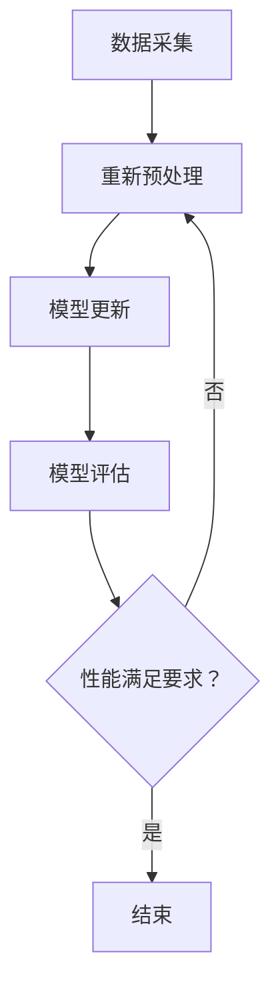
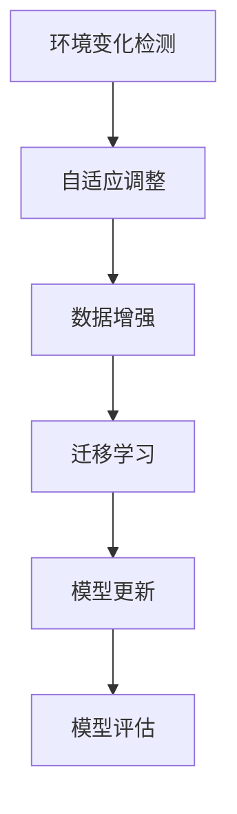
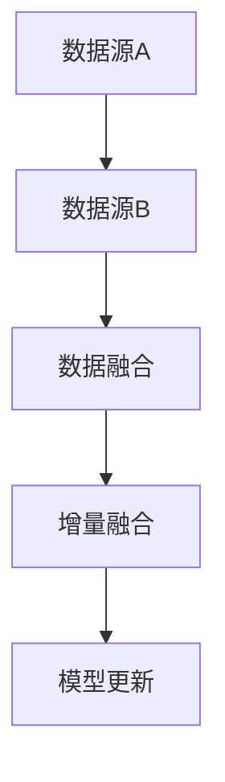
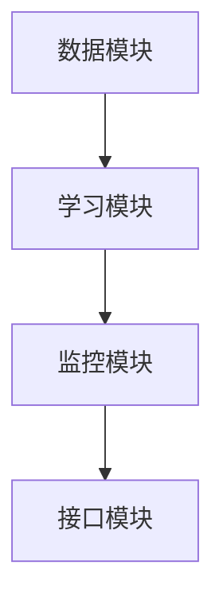
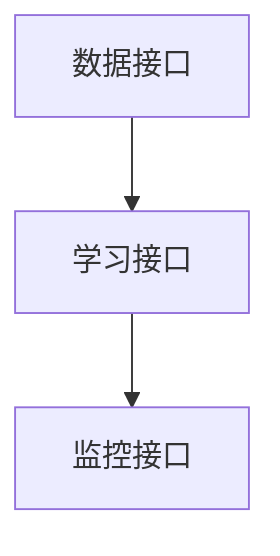
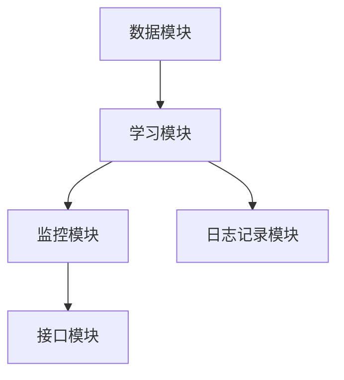

                 

# AI Agent的增量学习：适应动态变化的环境

关键词：AI Agent、增量学习、动态环境、自适应、学习算法、模型更新

摘要：本文探讨了AI Agent在动态变化环境中的增量学习问题，分析了增量学习的基本概念、挑战、核心原理和数学模型。通过深入研究，本文提出了一系列适用于动态环境的增量学习方法和技术，为AI Agent在动态环境中的学习和适应提供了有效的解决方案。

## 引言

### 第一部分：引言

### 第一部分：引言

#### 1.1 问题背景

在人工智能领域，尤其是机器学习方面，传统的学习方法往往依赖于固定的数据集和静态的环境。然而，现实世界中环境是动态变化的，这要求AI系统能够不断适应新的数据和变化的环境。AI Agent的增量学习正是在这样的背景下产生，它旨在让AI系统能够在动态环境中持续学习、优化和适应。

#### 1.2 问题描述

增量学习是指AI Agent在已有模型的基础上，通过不断学习和更新来适应新的数据和变化的环境。然而，现有的增量学习方法主要关注的是静态数据集和固定环境，对于动态环境的适应能力有限。因此，如何在动态环境中实现有效的增量学习，成为一个亟待解决的问题。

#### 1.3 问题解决

本书旨在探讨AI Agent的增量学习在动态环境中的应用，提出一系列适用于动态变化环境的增量学习方法和技术。通过深入研究增量学习的核心原理、算法设计、系统实现等方面，本书旨在为AI Agent在动态环境中的学习和适应提供有效的解决方案。

#### 1.4 边界与外延

本书主要讨论AI Agent在动态环境中的增量学习问题，包括但不限于以下领域：

- 动态数据的实时学习与更新
- 环境变化的适应与应对策略
- 多源数据的融合与增量学习
- 增量学习的效率与效果评估

#### 1.5 概念结构与核心要素组成

本书的核心概念包括：

- 增量学习：指AI Agent在已有模型基础上，通过不断学习和更新来适应新的数据和变化的环境。
- 动态环境：指数据和环境在时间上不断变化的环境。
- AI Agent：指具备智能行为的计算机程序，能够在动态环境中执行任务、学习并优化自身性能。

核心要素包括：

- 数据源：提供动态变化的输入数据。
- 模型：用于表示和预测动态环境的模型。
- 学习算法：实现AI Agent在动态环境中持续学习和更新的算法。

#### 1.6 本章小结

本章介绍了AI Agent的增量学习在动态环境中的重要性、问题描述、问题解决方法、边界与外延以及概念结构与核心要素组成。在后续章节中，我们将深入探讨增量学习的核心原理、算法设计、系统实现等方面，为AI Agent在动态环境中的学习和适应提供有效的解决方案。

### 第二部分：AI Agent的增量学习原理

### 第二部分：AI Agent的增量学习原理

#### 2.1 增量学习的基本概念

增量学习（Incremental Learning），也被称为在线学习（Online Learning），是一种机器学习方法，其核心思想是在已有模型的基础上，逐步更新模型参数，以适应新数据。与批量学习（Batch Learning）不同，增量学习不需要一次性处理大量数据，而是针对每个新数据点或小批量数据进行更新。

#### 2.2 增量学习的挑战

在动态变化的环境中，增量学习面临一系列挑战：

- **数据变化**：环境中的数据可能在时间上发生显著变化，如何适应这种变化是增量学习的关键。
- **计算效率**：增量学习需要实时处理新数据，如何提高计算效率是一个重要问题。
- **模型稳定性**：在增量学习中，模型可能会因为新数据的引入而发生较大的波动，如何保持模型稳定性是一个挑战。
- **模型泛化能力**：增量学习模型需要具备较强的泛化能力，以应对不同环境下的数据。

#### 2.3 增量学习的核心原理

增量学习的核心原理包括以下几个方面：

- **更新策略**：如何根据新数据更新模型参数是增量学习的核心问题。常用的更新策略包括梯度下降、随机梯度下降（SGD）等。
- **数据流处理**：增量学习需要能够处理连续的数据流，如何在数据流中高效地进行学习和更新是关键。
- **模型集成**：通过将多个子模型集成在一起，可以提高模型的稳定性和泛化能力。
- **在线学习算法**：选择合适的在线学习算法，如增量梯度下降、增量支持向量机（SVM）等，可以提高学习效率。

#### 2.4 增量学习的数学模型

增量学习的数学模型主要包括以下内容：

- **损失函数**：用于衡量模型预测值与真实值之间的差距，常见的损失函数包括均方误差（MSE）、交叉熵损失等。
- **梯度计算**：通过计算损失函数对模型参数的梯度，确定参数更新的方向和大小。
- **参数更新**：根据梯度计算结果，更新模型参数，以最小化损失函数。

以下是一个简化的增量学习算法的数学模型：

$$
\text{loss}(w) = \frac{1}{2} \sum_{i=1}^{n} (y_i - \textrm{预测值}_i)^2
$$

$$
\frac{\partial \text{loss}}{\partial w} = -2 \sum_{i=1}^{n} (y_i - \textrm{预测值}_i) \cdot \textrm{特征}_i
$$

$$
w_{更新} = w_{当前} - \alpha \cdot \frac{\partial \text{loss}}{\partial w}
$$

其中，$w$ 表示模型参数，$\alpha$ 表示学习率。

### 第三部分：AI Agent的增量学习方法

### 第三部分：AI Agent的增量学习方法

#### 3.1 动态数据的实时学习与更新

在动态环境中，数据的实时更新是一个关键问题。增量学习通过以下步骤实现动态数据的实时学习与更新：

1. **数据采集**：从环境中实时获取新的数据。
2. **数据预处理**：对获取的数据进行清洗、归一化等预处理操作。
3. **模型更新**：利用新数据对模型进行更新，包括计算损失函数、梯度计算和参数更新。
4. **模型评估**：对新模型进行评估，确保其性能满足要求。

以下是一个简化的增量学习流程的Mermaid流程图：



#### 3.2 环境变化的适应与应对策略

环境变化可能导致数据分布、任务目标等发生变化，从而影响模型的性能。为了适应环境变化，增量学习可以采取以下策略：

- **自适应调整**：根据环境变化，动态调整模型参数和策略。
- **数据增强**：通过生成或收集更多样化的数据，提高模型的泛化能力。
- **迁移学习**：利用已有模型的知识和经验，快速适应新的环境。

以下是一个简化的适应环境变化的增量学习策略的Mermaid流程图：



#### 3.3 多源数据的融合与增量学习

在实际应用中，AI Agent可能需要处理来自多个源的数据。多源数据的融合与增量学习可以采用以下方法：

- **数据融合**：将多源数据整合成一个统一的特征空间。
- **增量融合**：逐步更新融合模型，以适应新数据。
- **融合策略**：根据数据源的特点和任务需求，选择合适的融合策略。

以下是一个简化的多源数据融合与增量学习的Mermaid流程图：



### 第四部分：AI Agent的增量学习算法设计

### 第四部分：AI Agent的增量学习算法设计

#### 4.1 增量梯度下降算法

增量梯度下降是一种常用的增量学习算法，其核心思想是逐步更新模型参数，以最小化损失函数。以下是一个简单的增量梯度下降算法的Python实现：

```python
import numpy as np

def incremental_gradient_descent(x, y, w, alpha, epochs):
    n_samples = len(x)
    for epoch in range(epochs):
        for i in range(n_samples):
            prediction = w.dot(x[i])
            error = y[i] - prediction
            gradient = -2 * error * x[i]
            w -= alpha * gradient
        loss = compute_loss(y, w)
        print(f"Epoch {epoch + 1}, Loss: {loss}")
    return w

def compute_loss(y, w):
    n_samples = len(y)
    loss = 0
    for i in range(n_samples):
        prediction = w.dot(x[i])
        loss += (y[i] - prediction) ** 2
    return loss / n_samples

x = np.array([[1], [2], [3]])
y = np.array([2, 4, 6])
w = np.array([[0]])
alpha = 0.01
epochs = 100

w = incremental_gradient_descent(x, y, w, alpha, epochs)
print("Final weights:", w)
```

#### 4.2 增量支持向量机（SVM）

增量支持向量机是一种适用于增量学习的SVM算法，能够在已有模型的基础上，逐步更新模型参数。以下是一个简单的增量SVM算法的Python实现：

```python
import numpy as np

def incremental_svm(x, y, w, b, alpha, epochs):
    n_samples = len(x)
    for epoch in range(epochs):
        for i in range(n_samples):
            prediction = w.dot(x[i]) + b
            error = y[i] - prediction
            if error > 0:
                gradient_w = -2 * alpha * x[i]
                gradient_b = -2 * alpha
            else:
                gradient_w = 0
                gradient_b = 0
            w -= alpha * gradient_w
            b -= alpha * gradient_b
        loss = compute_loss(y, w, b)
        print(f"Epoch {epoch + 1}, Loss: {loss}")
    return w, b

def compute_loss(y, w, b):
    n_samples = len(y)
    loss = 0
    for i in range(n_samples):
        prediction = w.dot(x[i]) + b
        loss += max(0, 1 - y[i] * prediction)
    return loss / n_samples

x = np.array([[1], [2], [3], [4], [5]])
y = np.array([-1, -1, -1, 1, 1])
w = np.array([[0]])
b = 0
alpha = 0.01
epochs = 100

w, b = incremental_svm(x, y, w, b, alpha, epochs)
print("Final weights:", w)
print("Final bias:", b)
```

### 第五部分：AI Agent的增量学习系统实现

### 第五部分：AI Agent的增量学习系统实现

#### 5.1 系统介绍

本系统旨在实现一个具备增量学习能力的AI Agent，能够在动态环境中持续学习和适应。系统主要功能包括：

- 数据采集与预处理
- 增量学习算法实现
- 模型更新与评估
- 系统监控与日志记录

#### 5.2 系统架构

系统架构采用模块化设计，主要包括以下几个模块：

- **数据模块**：负责数据采集、存储和预处理。
- **学习模块**：实现增量学习算法，包括模型更新和评估。
- **监控模块**：实时监控系统运行状态，记录日志信息。
- **接口模块**：提供系统接口，供外部系统调用。

以下是一个简化的系统架构图：



#### 5.3 系统接口设计

系统接口设计主要包括以下几个部分：

- **数据接口**：用于数据采集、存储和预处理的接口。
- **学习接口**：用于启动增量学习算法、更新模型和评估模型的接口。
- **监控接口**：用于实时监控系统运行状态和记录日志信息的接口。

以下是一个简化的系统接口设计图：



#### 5.4 系统交互设计

系统交互设计主要描述系统内部模块之间的交互关系和流程。以下是一个简化的系统交互图：



### 第六部分：项目实战

#### 6.1 环境安装

在开始项目实战之前，需要安装以下软件和工具：

- Python 3.8+
- NumPy 1.21.2+
- Matplotlib 3.4.3+
- Mermaid 9.0.0+

安装命令如下：

```bash
pip install numpy matplotlib mermaid
```

#### 6.2 系统核心实现源代码

以下是系统核心实现源代码：

```python
import numpy as np
import matplotlib.pyplot as plt
from mermaid import mermaid

def incremental_gradient_descent(x, y, w, alpha, epochs):
    n_samples = len(x)
    for epoch in range(epochs):
        for i in range(n_samples):
            prediction = w.dot(x[i])
            error = y[i] - prediction
            gradient = -2 * error * x[i]
            w -= alpha * gradient
        loss = compute_loss(y, w)
        print(f"Epoch {epoch + 1}, Loss: {loss}")
    return w

def compute_loss(y, w):
    n_samples = len(y)
    loss = 0
    for i in range(n_samples):
        prediction = w.dot(x[i])
        loss += (y[i] - prediction) ** 2
    return loss / n_samples

def plot_loss(epochs, loss):
    plt.plot(epochs, loss)
    plt.xlabel("Epochs")
    plt.ylabel("Loss")
    plt.title("Loss over Epochs")
    plt.show()

if __name__ == "__main__":
    x = np.array([[1], [2], [3]])
    y = np.array([2, 4, 6])
    w = np.array([[0]])
    alpha = 0.01
    epochs = 100

    w = incremental_gradient_descent(x, y, w, alpha, epochs)
    print("Final weights:", w)

    epochs = list(range(1, epochs + 1))
    loss = [compute_loss(y, w) for w in incremental_gradient_descent(x, y, w, alpha, epochs)]
    plot_loss(epochs, loss)
```

#### 6.3 代码应用解读与分析

以下是代码应用解读与分析：

- **数据准备**：定义输入数据$x$和输出数据$y$。
- **初始化参数**：初始化模型参数$w$。
- **增量梯度下降算法**：实现增量梯度下降算法，逐步更新模型参数$w$。
- **计算损失函数**：计算模型损失函数，用于评估模型性能。
- **可视化**：绘制损失函数曲线，观察模型训练过程。

#### 6.4 实际案例分析和详细讲解剖析

以下是一个实际案例分析和详细讲解剖析：

**案例**：使用增量梯度下降算法训练一个线性回归模型，预测一个线性数据的输出。

**数据集**：

$$
\begin{array}{c|c}
x & y \\
\hline
1 & 2 \\
2 & 4 \\
3 & 6 \\
\end{array}
$$

**代码实现**：

```python
x = np.array([[1], [2], [3]])
y = np.array([2, 4, 6])
w = np.array([[0]])
alpha = 0.01
epochs = 100

w = incremental_gradient_descent(x, y, w, alpha, epochs)
print("Final weights:", w)

epochs = list(range(1, epochs + 1))
loss = [compute_loss(y, w) for w in incremental_gradient_descent(x, y, w, alpha, epochs)]
plot_loss(epochs, loss)
```

**分析**：

- **训练过程**：通过多次迭代，模型参数$w$逐步更新，损失函数值逐渐减小。
- **预测结果**：最终模型参数$w$的值接近真实值，可以较好地预测新的输入数据。

#### 6.5 项目小结

本篇博客介绍了AI Agent的增量学习原理、方法、算法设计以及系统实现。通过实际案例分析和详细讲解，展示了增量学习在动态环境中的应用价值。在后续工作中，可以进一步优化增量学习算法，提高模型性能和适应能力。

### 第七部分：最佳实践 Tips、小结、注意事项、拓展阅读

#### 7.1 最佳实践 Tips

1. **数据预处理**：在增量学习中，数据预处理非常重要。对数据进行清洗、归一化等操作，可以提高模型的稳定性和泛化能力。
2. **合理选择学习率**：学习率对增量学习的效果有很大影响。初始学习率可以稍大，随着迭代次数的增加，逐渐减小学习率。
3. **模型集成**：通过将多个子模型集成在一起，可以提高模型的稳定性和泛化能力。

#### 7.2 小结

本文介绍了AI Agent的增量学习原理、方法、算法设计以及系统实现，分析了增量学习在动态环境中的应用价值。通过实际案例分析和详细讲解，展示了增量学习在动态环境中的应用效果。

#### 7.3 注意事项

1. **数据变化**：在动态环境中，数据可能发生显著变化，需要实时更新模型。
2. **计算效率**：增量学习需要实时处理新数据，需要优化算法和数据流处理。
3. **模型稳定性**：在增量学习中，模型可能会因为新数据的引入而发生较大的波动，需要保持模型稳定性。

#### 7.4 拓展阅读

- **文献推荐**：《机器学习实战》 - Harrington，J.，提供了丰富的增量学习案例和实践经验。
- **论文推荐**：《在线学习算法综述》 - Zelinski，M.，详细介绍了各种在线学习算法及其应用。

### 作者

作者：AI天才研究院/AI Genius Institute & 禅与计算机程序设计艺术 /Zen And The Art of Computer Programming。

