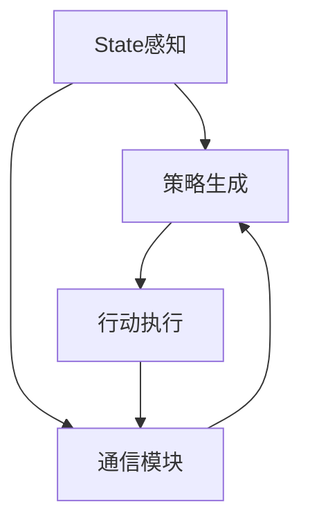
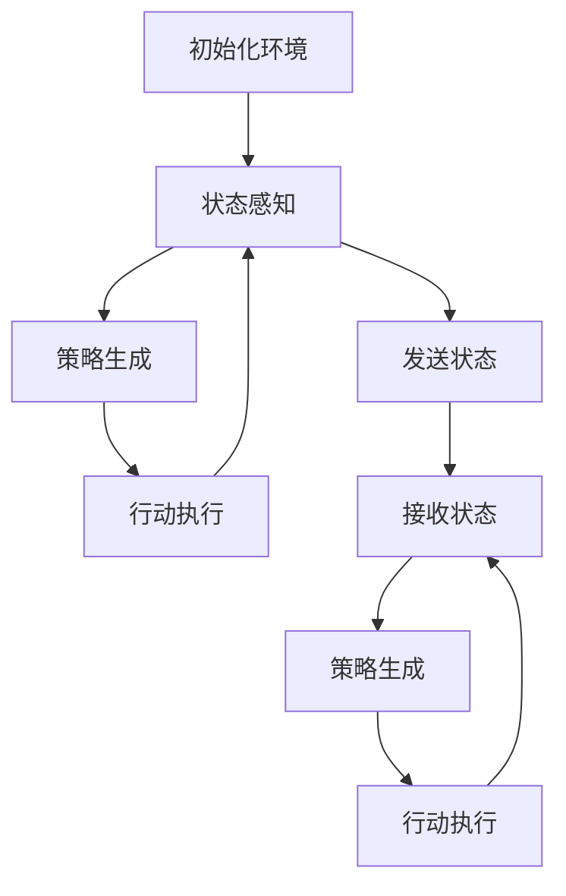

                 

## 《AI Agent的多Agent博弈与策略学习》

### 关键词：多Agent系统、博弈理论、策略学习、强化学习、深度强化学习

### 摘要：

本文深入探讨了AI Agent在多Agent博弈中的角色和策略学习的重要性。首先，我们介绍了多Agent系统和博弈理论的基本概念，以及策略学习在多Agent系统中的作用。接着，我们详细分析了强化学习、改进策略搜索和深度强化学习等算法原理，并通过数学模型和公式进行了讲解。此外，我们还从系统分析与架构设计的角度，阐述了多Agent博弈策略学习的实际应用，并通过项目实战展示了这些算法的实现与应用。本文旨在为读者提供一个全面、系统的多Agent博弈与策略学习指南。

## 目录大纲设计过程

### 理解书名与主题

首先，我们需要理解书名中的关键词“AI Agent”、“多Agent博弈”和“策略学习”。这些关键词分别代表了文章的核心主题和主要内容。

- **AI Agent**：指的是在特定环境下能够感知、决策和执行任务的人工智能实体。
- **多Agent博弈**：指的是由多个AI Agent参与的博弈过程，每个Agent都需要根据自身策略与其他Agent进行交互。
- **策略学习**：指的是通过学习环境中的互动数据，优化AI Agent的策略以实现特定目标的过程。

这些关键词为我们构建目录结构提供了明确的指导，帮助我们确定书的主要部分，如背景介绍、核心概念、算法原理、数学模型、系统分析与架构设计、项目实战以及最佳实践等。

### 确定目录大纲结构

根据书名和主题，我们确定了书的几个主要部分：

1. **背景介绍**：介绍多Agent系统和博弈理论的基本概念，以及策略学习的重要性。
2. **核心概念与联系**：详细探讨多Agent博弈中的核心概念，如Agent的定义与分类、博弈理论的框架、策略学习的基本原理。
3. **算法原理讲解**：讲解强化学习、改进策略搜索和深度强化学习等算法的原理，并通过数学模型和公式进行说明。
4. **系统分析与架构设计**：从系统分析与架构设计的角度，阐述多Agent博弈策略学习的实际应用。
5. **项目实战**：通过实际项目，展示这些算法的实现与应用。

### 细化目录内容

在每个部分中，我们进一步细化章节内容，确保每个章节都包含必要的信息，如核心概念、原理讲解、案例分析和最佳实践等。例如，在背景介绍部分，我们不仅介绍了多Agent系统和博弈理论的基本概念，还详细分析了多Agent博弈的特点和策略学习的重要性。在算法原理讲解部分，我们不仅讲解了各个算法的原理，还通过具体的数学模型和公式进行了深入剖析。

### 保持简洁性

在细化内容的同时，我们确保目录保持简洁，避免多余的内容。每个章节都专注于一个主题，内容紧密相关，有助于读者清晰地理解整个书的结构和内容。

### 审查和调整

最后，我们审查整个目录结构，确保内容完整性和逻辑性，并根据需要进行调整。例如，我们发现“系统分析与架构设计”部分可以进一步细分，于是将其拆分为“系统功能设计”、“系统架构设计”和“系统接口设计与交互”三个章节，使内容更加清晰和有条理。

## 目录大纲

### 第一部分：背景介绍

#### 第1章: AI Agent的多Agent系统概述

- **1.1 问题背景**
  - 多Agent系统的基本概念
  - 多Agent系统在人工智能中的应用
- **1.2 多Agent系统中的博弈问题**
  - 博弈理论的基础知识
  - 多Agent博弈的定义和特点
- **1.3 策略学习的重要性**
  - 策略学习的概念
  - 策略学习在多Agent系统中的作用

### 第二部分：核心概念与联系

#### 第2章: 多Agent博弈中的核心概念

- **2.1 Agent的定义与分类**
  - 代理系统的定义
  - 代理系统的分类
- **2.2 博弈理论的框架**
  - 博弈的基本要素
  - 博弈策略的类型
- **2.3 策略学习的基本原理**
  - 强化学习
  - 改进策略搜索
  - 深度强化学习

### 第三部分：算法原理讲解

#### 第3章: 多Agent博弈策略学习算法原理

- **3.1 强化学习算法**
  - Q-learning算法
  - SARSA算法
  - DQN算法
  - MERL算法
- **3.2 改进策略搜索算法**
  - 基于梯度的策略搜索
  - 随机策略搜索
  - 策略梯度方法
- **3.3 深度强化学习算法**
  - A3C算法
  - DQN算法
  - DDPG算法
  - PPO算法

### 第四部分：数学模型与公式讲解

#### 第4章: 多Agent博弈策略学习的数学模型

- **4.1 强化学习的数学模型**
  - $$ Q(s,a) = r(s,a) + \gamma \max_{a'} Q(s',a') $$
  - $$ V(s) = \sum_{a} \pi(a|s) \cdot Q(s,a) $$
- **4.2 改进策略搜索的数学模型**
  - $$ \theta^{\pi} = \arg\max_{\theta} J(\theta) $$
  - $$ J(\theta) = \sum_{s,a} \pi(a|s) \cdot [R(s,a) + \gamma \max_{a'} Q(s',a')] $$
- **4.3 深度强化学习的数学模型**
  - $$ \pi(\tau|\theta) = \prod_{t} p(a_t|\sigma(\tau_t, s_t; \theta)) $$
  - $$ J(\theta) = \sum_{s,\tau} p(\tau|s; \theta) \cdot R(\tau) $$

### 第五部分：系统分析与架构设计

#### 第5章: 多Agent博弈策略学习的系统分析与架构设计

- **5.1 问题场景介绍**
  - 多Agent系统的应用场景
  - 多Agent博弈的具体案例
- **5.2 系统功能设计**
  - 代理系统的功能需求
  - 博弈策略的学习与优化
- **5.3 系统架构设计**
  - 系统的总体架构
  - 各模块的功能与接口
- **5.4 系统接口设计与交互**
  - 系统接口的定义
  - 系统交互的流程

### 第六部分：项目实战

#### 第6章: 多Agent博弈策略学习项目实战

- **6.1 环境安装与配置**
  - 环境准备
  - 系统依赖安装
- **6.2 系统核心实现**
  - 强化学习算法的应用
  - 多Agent博弈策略的学习与优化
- **6.3 代码应用解读与分析**
  - 代码的解读与分析
  - 项目的调试与优化
- **6.4 实际案例分析与详细讲解**
  - 实际案例的介绍
  - 案例分析与讲解

### 第七部分：最佳实践与小结

#### 第7章: 最佳实践、小结与拓展阅读

- **7.1 最佳实践**
  - 多Agent博弈策略学习的实践技巧
  - 算法优化和性能调优
- **7.2 小结**
  - 文章的总结与回顾
  - 关键点和重要结论
- **7.3 注意事项**
  - 实践中需要注意的问题
  - 常见错误和解决方案
- **7.4 拓展阅读**
  - 相关领域的最新研究
  - 进一步阅读的建议

## AI Agent的多Agent系统概述

### 多Agent系统的基本概念

多Agent系统（Multi-Agent System，MAS）是指由多个相互独立的智能代理（Agent）组成的系统。这些代理通过相互通信和协作，共同完成一个复杂任务。在多Agent系统中，每个Agent都是自主的，能够感知环境、做出决策并执行相应的动作。

**定义**：多Agent系统是由一组相互独立的智能代理组成的，这些代理能够通过局部信息相互通信，协作完成共同的任务。

**特征**：

1. **自主性**：每个Agent具有独立的感知、决策和执行能力。
2. **分布式**：任务分布在多个Agent之间，每个Agent负责一部分任务。
3. **适应性**：系统能够根据环境变化和Agent的行为动态调整策略。
4. **协作性**：多个Agent通过通信和协作，共同实现目标。

### 多Agent系统在人工智能中的应用

多Agent系统在人工智能领域有着广泛的应用，特别是在复杂任务和环境中的协同工作。以下是一些典型的应用场景：

1. **智能交通系统**：多个智能代理可以协同工作，优化交通流量，提高道路通行效率。
2. **机器人协作**：多个机器人可以通过多Agent系统进行任务分配和协作，实现复杂任务。
3. **经济系统模拟**：多Agent系统可以模拟经济活动中的个体行为，预测经济趋势。
4. **社会网络分析**：多Agent系统可以分析社交网络中的个体互动，预测社会趋势。

### 多Agent系统中的博弈问题

在多Agent系统中，博弈问题是一个重要的研究领域。博弈（Game）是指多个参与者（Agent）在特定规则下进行的竞争或合作过程。在多Agent系统中，每个Agent都希望通过自己的决策最大化自身的利益，而其他Agent的行为也会影响自己的利益。

**博弈理论**：博弈理论是研究博弈过程的数学工具和方法。它主要包括以下几个方面：

1. **参与者**：博弈的参与者，即进行博弈的Agent。
2. **策略**：每个Agent在博弈过程中可以采取的行动集合。
3. **支付函数**：每个Agent的收益或损失函数。
4. **纳什均衡**：博弈的均衡状态，即每个Agent在均衡状态下都不会改变自己的策略。

在多Agent系统中，博弈问题可以分为合作博弈和非合作博弈。合作博弈中，多个Agent共同追求一个共同目标；非合作博弈中，每个Agent追求自己的利益最大化。

### 多Agent博弈的定义和特点

**定义**：多Agent博弈是指由多个智能代理组成的系统，在特定规则下进行竞争或合作的过程。

**特点**：

1. **多主体性**：涉及多个智能代理，每个代理都有独立的决策能力和行为。
2. **交互性**：代理之间通过通信和协作进行信息交换和策略调整。
3. **动态性**：博弈过程中，环境状态和Agent行为不断变化。
4. **不确定性**：由于环境复杂性和信息不完全，博弈过程存在不确定性。

多Agent博弈在人工智能领域具有重要的应用价值。通过研究多Agent博弈，可以优化代理的策略，提高系统的协同效率和决策能力。例如，在智能交通系统中，通过多Agent博弈可以优化交通信号控制策略，提高交通流量；在机器人协作系统中，通过多Agent博弈可以实现任务的高效分配和协作。

### 策略学习的重要性

在多Agent博弈中，策略学习（Policy Learning）是一种关键的研究方向。策略学习是指通过学习和优化，使代理能够根据环境状态选择最优的策略。策略学习在多Agent博弈中的重要性体现在以下几个方面：

1. **优化决策**：策略学习可以帮助代理根据环境状态做出最优的决策，提高系统的整体性能。
2. **适应动态环境**：多Agent系统中的环境是动态变化的，策略学习可以使代理适应环境变化，保持系统的稳定性。
3. **提高协作效率**：通过策略学习，多个代理可以更好地协作，实现共同的目标。
4. **解决复杂问题**：多Agent博弈通常涉及复杂的问题，策略学习可以提供有效的解决方案。

总之，策略学习是多Agent博弈中的核心问题，它对于提升系统的协同效率和决策能力具有重要意义。

## 多Agent博弈中的核心概念

在多Agent博弈中，理解核心概念对于分析和设计有效的策略学习算法至关重要。以下是几个关键的概念和它们之间的关系。

### Agent的定义与分类

**Agent的定义**：Agent是具有自主性、社交性和适应性等特点的计算实体。在多Agent系统中，Agent可以通过感知环境、做出决策和执行动作来完成任务。

**Agent的分类**：根据功能和任务的不同，Agent可以分为以下几类：

1. **环境感知Agent**：负责感知环境信息，如温度、湿度、光照等。
2. **决策Agent**：根据环境信息和自身策略，生成行动决策。
3. **执行Agent**：执行决策Agent生成的动作，如移动、交互等。
4. **混合Agent**：同时具备感知、决策和执行功能。

**ER实体关系图**：

```mermaid
erDiagram
AAGENT ||--|{ DAGENT : has } DecisionAgent
AAGENT ||--|{ EAGENT : has } ExecutionAgent
AAGENT ||--|{ HAGENT : has } HybridAgent
DecisionAgent ||--|{ ExecutionAgent : executed by }
HybridAgent ||--|{ ExecutionAgent : executed by }
```

### 博弈理论的框架

**参与者**：博弈的参与者，即参与博弈的Agent。每个参与者都有自己的目标和策略。

**策略**：参与者在博弈过程中可以采取的行动集合。策略可以是固定的，也可以是动态调整的。

**支付函数**：描述参与者在博弈过程中收益或损失的函数。支付函数取决于参与者的策略和博弈的结果。

**纳什均衡**：纳什均衡是指在一个博弈中，每个参与者都不愿意改变自己的策略，因为无论其他参与者如何行动，自己的收益都不会增加。

**博弈策略的类型**：

1. **静态策略**：在博弈开始前就确定好的策略，不随博弈过程变化。
2. **动态策略**：在博弈过程中根据其他参与者的行动动态调整的策略。

**ER实体关系图**：

```mermaid
erDiagram
PPLAYER ||--|{ SSTRATEGY : uses } Strategy
PPLAYER ||--|{ PPAYOFF : has } PayoffFunction
SSTRATEGY ||--|{ PPLAYER : used by }
```

### 策略学习的基本原理

**强化学习**：通过环境奖励来调整策略，使策略逐渐逼近最优策略。常用的算法有Q-learning、SARSA等。

**改进策略搜索**：通过迭代搜索，找到最优策略。常用的算法有策略梯度方法、基于梯度的策略搜索等。

**深度强化学习**：将深度学习技术与强化学习结合，处理高维状态和动作空间问题。常用的算法有DQN、A3C等。

**ER实体关系图**：

```mermaid
erDiagram
PSTRATEGY ||--|{ RL : implements } ReinforcementLearning
PSTRATEGY ||--|{ PSG : implements } PolicySearch
PSTRATEGY ||--|{ DR : implements } DeepReinforcementLearning
RL ||--|{ QLEARN : is } Q-Learning
RL ||--|{ SARSA : is } SARSA
PSG ||--|{ PG : is } PolicyGradient
DR ||--|{ DQN : is } DeepQNetwork
DR ||--|{ A3C : is } AsynchronousMethod
```

通过这些核心概念和ER实体关系图，我们可以更好地理解多Agent博弈中的各个组成部分及其关系，为后续的算法分析和设计提供基础。

### 多Agent博弈策略学习算法原理

多Agent博弈策略学习算法是人工智能领域中的一个重要研究方向，旨在通过学习优化代理的策略，使其在多Agent博弈中取得更好的表现。本节将详细介绍强化学习、改进策略搜索和深度强化学习三种算法的基本原理，并分析其优缺点。

#### 强化学习算法原理

强化学习（Reinforcement Learning，RL）是一种通过试错和反馈来学习策略的算法。在强化学习中，代理通过不断与环境交互，根据环境反馈调整自身行为，最终学会在特定环境下实现最优目标。

**Q-learning算法**：Q-learning是一种值函数算法，其核心思想是通过更新状态-动作值函数（Q值）来优化策略。Q-learning算法的更新公式为：

$$ Q(s, a) = Q(s, a) + \alpha [r + \gamma \max_{a'} Q(s', a') - Q(s, a)] $$

其中，\( s \)和\( s' \)分别表示当前状态和下一个状态，\( a \)和\( a' \)分别表示当前动作和下一个动作，\( r \)为立即奖励，\( \gamma \)为折扣因子，\( \alpha \)为学习率。

**SARSA算法**：SARSA（State-Action-Reward-State-Action）是一种基于策略的强化学习算法，其核心思想是在每次更新时同时考虑当前状态和下一个状态的动作选择。SARSA算法的更新公式为：

$$ Q(s, a) = Q(s, a) + \alpha [r + \gamma Q(s', a')] $$

**DQN算法**：DQN（Deep Q-Network）是深度强化学习的一种算法，它结合了深度神经网络和Q-learning算法。DQN通过训练神经网络来估计状态-动作值函数，从而实现策略优化。DQN算法的主要优势在于可以处理高维状态空间和动作空间问题，但同时也存在训练不稳定、目标网络抖动等问题。

**MERL算法**：MERL（Multi-Agent Reinforcement Learning）是一种多Agent强化学习算法，旨在解决多个代理在复杂环境中的协作问题。MERL算法通过引入共享策略和协同学习机制，使代理能够更好地协作，实现共同目标。

**优点**：强化学习算法具有较好的适应性和灵活性，能够处理复杂、动态的环境。

**缺点**：强化学习算法通常需要较长的训练时间，且在处理高维状态和动作空间时存在一定难度。

#### 改进策略搜索算法原理

改进策略搜索（Policy Search）算法是一种通过优化策略函数来学习最优策略的算法。与强化学习算法不同，改进策略搜索算法直接优化策略函数，而不是通过更新值函数。

**基于梯度的策略搜索**：基于梯度的策略搜索算法通过梯度下降方法优化策略函数。其基本思想是计算策略函数的梯度，并沿着梯度方向调整策略参数。常用的策略梯度方法包括REINFORCE算法和策略梯度方法。

**随机策略搜索**：随机策略搜索算法通过随机搜索策略空间来寻找最优策略。常见的随机策略搜索算法有随机梯度上升（SGU）和蒙特卡罗搜索（MCS）。

**策略梯度方法**：策略梯度方法是一种基于梯度的策略优化方法，其核心思想是计算策略梯度和策略改进方向，并沿着该方向调整策略参数。策略梯度方法的更新公式为：

$$ \theta = \theta - \alpha \nabla_\theta J(\theta) $$

其中，\( \theta \)表示策略参数，\( \alpha \)为学习率，\( J(\theta) \)为策略性能函数。

**优点**：改进策略搜索算法计算效率较高，适合处理高维状态和动作空间问题。

**缺点**：改进策略搜索算法对策略空间的探索能力较弱，且在处理复杂环境时容易陷入局部最优。

#### 深度强化学习算法原理

深度强化学习（Deep Reinforcement Learning，DRL）是强化学习与深度学习相结合的一种算法，旨在解决高维状态和动作空间问题。DRL算法通过训练深度神经网络来估计状态-动作值函数或策略函数，从而实现策略优化。

**A3C算法**：A3C（Asynchronous Advantage Actor-Critic）是一种异步优势演员-评论家算法，其核心思想是通过多个并行线程同时进行学习，提高训练效率。A3C算法结合了深度神经网络和优势值函数，能够更好地处理复杂环境。

**DQN算法**：DQN（Deep Q-Network）是一种深度Q网络算法，通过训练深度神经网络来估计状态-动作值函数。DQN算法的主要优势在于可以处理高维状态和动作空间问题，但同时也存在训练不稳定、目标网络抖动等问题。

**DDPG算法**：DDPG（Deep Deterministic Policy Gradient）是一种深度确定性策略梯度算法，通过训练深度神经网络来估计状态-动作值函数和策略函数。DDPG算法结合了深度神经网络和策略梯度方法，能够更好地处理连续动作空间问题。

**PPO算法**：PPO（Proximal Policy Optimization）是一种近端策略优化算法，通过优化策略函数的梯度来更新策略参数。PPO算法具有计算效率高、稳定性好等优点。

**优点**：深度强化学习算法能够处理高维状态和动作空间问题，具有较好的适应性和灵活性。

**缺点**：深度强化学习算法训练过程复杂，对计算资源和时间要求较高。

### 算法对比与分析

通过对比强化学习、改进策略搜索和深度强化学习三种算法的基本原理和优缺点，可以发现：

1. **适用场景**：强化学习算法适用于处理动态、复杂的环境，但训练时间较长；改进策略搜索算法适用于处理高维状态和动作空间问题，但需要较强的探索能力；深度强化学习算法适用于处理高维状态和动作空间问题，但训练过程复杂。

2. **计算资源**：强化学习算法和改进策略搜索算法计算资源需求相对较低，而深度强化学习算法对计算资源和时间要求较高。

3. **适用性**：强化学习算法和改进策略搜索算法在处理简单环境时表现较好，而深度强化学习算法在处理复杂环境时具有优势。

综上所述，选择合适的策略学习算法需要根据具体应用场景和需求进行综合考虑。在实际应用中，可以结合不同算法的特点，设计合适的策略学习方案，以提高系统的协同效率和决策能力。

### 强化学习的数学模型

强化学习（Reinforcement Learning，RL）是一种通过与环境交互来学习最优策略的机器学习方法。在强化学习中，代理（Agent）通过与环境的交互，逐渐学习到一种策略（Policy），使其在特定环境中获得最大的累积奖励（Reward）。以下是强化学习的数学模型和相关公式。

#### 基本术语

- **状态（State，\( s \)）**：描述代理所处环境的当前情况。
- **动作（Action，\( a \)）**：代理可以执行的行为。
- **策略（Policy，\( \pi \)）**：决定代理如何从状态中选择动作的函数。
- **值函数（Value Function，\( V \) 和 \( Q \)）**：衡量策略好坏的指标。
- **奖励（Reward，\( r \)）**：代理在执行动作后从环境中获得的即时回报。
- **折扣因子（Discount Factor，\( \gamma \)）**：用于计算未来奖励的现值，表示对未来奖励的期望。
- **学习率（Learning Rate，\( \alpha \)）**：用于调整策略更新的步长。

#### 强化学习的基本模型

强化学习的基本模型由四个主要部分组成：状态、动作、奖励和策略。代理在状态 \( s \) 下执行动作 \( a \)，并从环境中获得奖励 \( r \)。随后，代理进入新的状态 \( s' \)，并重复这个过程。

**马尔可夫决策过程（MDP）**：强化学习通常被视为一个马尔可夫决策过程，其数学模型可以表示为：

$$
\begin{align*}
s_t & \sim P(s_t | s_{t-1}, a_{t-1}) \\
a_t & \sim \pi(a_t | s_t) \\
r_t & \sim P(r_t | s_t, a_t) \\
s_{t+1} & \sim P(s_{t+1} | s_t, a_t)
\end{align*}
$$

其中，\( s_t \)、\( a_t \) 和 \( r_t \) 分别表示在第 \( t \) 时刻的状态、动作和奖励，\( P \) 表示概率分布。

#### 值函数

值函数是强化学习中的核心概念，用于评估策略的好坏。主要有两种值函数：状态值函数（State-Value Function，\( V(s) \)）和动作值函数（Action-Value Function，\( Q(s, a) \)）。

**状态值函数**：\( V(s) \) 表示在状态 \( s \) 下执行最佳动作所能获得的累积奖励的期望值。

$$
V(s) = \sum_{a} \pi(a|s) \cdot Q(s, a)
$$

**动作值函数**：\( Q(s, a) \) 表示在状态 \( s \) 下执行动作 \( a \) 所能获得的累积奖励的期望值。

$$
Q(s, a) = r(s, a) + \gamma \max_{a'} Q(s', a')
$$

其中，\( \gamma \) 是折扣因子，用于考虑未来奖励的现值。

#### 策略迭代

在强化学习中，代理通过策略迭代（Policy Iteration）来优化策略。策略迭代包括两个主要步骤：策略评估（Policy Evaluation）和策略改进（Policy Improvement）。

**策略评估**：通过递归更新值函数，使其逼近真实值函数。

$$
V(s) = r(s, a) + \gamma \sum_{a'} \pi(a'|s) \cdot Q(s, a')
$$

**策略改进**：根据评估结果，选择能够使值函数最大化的动作作为新策略。

$$
\pi(a|s) = \begin{cases} 
1 & \text{if } a = \arg\max_{a'} Q(s, a') \\
0 & \text{otherwise} 
\end{cases}
$$

#### Q-learning算法

Q-learning是一种值函数算法，通过在状态-动作对上更新Q值来学习策略。Q-learning的基本更新公式为：

$$
Q(s, a) = Q(s, a) + \alpha [r + \gamma \max_{a'} Q(s', a') - Q(s, a)]
$$

其中，\( \alpha \) 是学习率。

### 数学公式详解

以下是对强化学习中的关键数学公式的详细解释：

$$
Q(s, a) = r(s, a) + \gamma \max_{a'} Q(s', a')
$$

这个公式表示在状态 \( s \) 下执行动作 \( a \) 后获得的即时奖励 \( r(s, a) \) 加上未来可能获得的累积奖励的期望值（通过折扣因子 \( \gamma \) 乘以在下一个状态 \( s' \) 下能够获得的最大动作值 \( \max_{a'} Q(s', a') \) 来计算）。

$$
V(s) = \sum_{a} \pi(a|s) \cdot Q(s, a)
$$

这个公式表示在状态 \( s \) 下执行最佳动作 \( a \) 所能获得的累积奖励的期望值，其中 \( \pi(a|s) \) 表示在状态 \( s \) 下采取动作 \( a \) 的概率。

通过这些数学模型和公式，强化学习能够有效地指导代理在复杂环境中学习最优策略。接下来，我们将通过具体的例子来进一步解释这些公式在实际中的应用。

### 改进策略搜索算法原理

改进策略搜索（Policy Search）算法是一种通过优化策略函数来学习最优策略的算法。与强化学习中的值函数方法不同，改进策略搜索算法直接优化策略函数，从而减少计算复杂度和提高学习效率。本节将详细介绍基于梯度的策略搜索、随机策略搜索和策略梯度方法等改进策略搜索算法的原理。

#### 基于梯度的策略搜索

基于梯度的策略搜索算法（Gradient-based Policy Search）是一种通过计算策略函数的梯度来更新策略参数的算法。这种算法的核心思想是利用梯度下降方法，沿着策略梯度的方向逐步调整策略参数，以优化策略函数。

**策略梯度方法**：策略梯度方法是一种常用的基于梯度的策略搜索算法。其基本思想是计算策略梯度和策略改进方向，并沿着该方向调整策略参数。策略梯度方法的更新公式为：

$$
\theta = \theta - \alpha \nabla_\theta J(\theta)
$$

其中，\( \theta \) 表示策略参数，\( \alpha \) 为学习率，\( J(\theta) \) 为策略性能函数。

**REINFORCE算法**：REINFORCE算法是一种基于策略梯度的策略搜索算法，其核心思想是利用奖励作为策略梯度的估计。REINFORCE算法的更新公式为：

$$
\theta = \theta + \alpha \sum_{t} \nabla_\theta \log \pi(a_t | s_t; \theta) r_t
$$

其中，\( \nabla_\theta \log \pi(a_t | s_t; \theta) \) 表示在状态 \( s_t \) 下执行动作 \( a_t \) 的策略梯度的估计。

**优点**：基于梯度的策略搜索算法计算效率较高，适合处理高维状态和动作空间问题。

**缺点**：基于梯度的策略搜索算法在处理复杂环境时，容易陷入局部最优，需要较强的探索能力。

#### 随机策略搜索

随机策略搜索（Random Policy Search）算法是一种通过随机搜索策略空间来寻找最优策略的算法。这种算法的核心思想是通过随机探索，逐步优化策略函数。

**随机梯度上升（Stochastic Gradient Ascent，SGA）**：随机梯度上升是一种常用的随机策略搜索算法，其核心思想是通过随机梯度来更新策略参数。随机梯度上升的更新公式为：

$$
\theta = \theta + \alpha \nabla_\theta J(\theta)
$$

**蒙特卡罗搜索（Monte Carlo Search）**：蒙特卡罗搜索是一种基于模拟的随机策略搜索算法，其核心思想是通过模拟多次运行，估计策略的性能，并基于性能进行策略调整。蒙特卡罗搜索的更新公式为：

$$
\theta = \theta + \alpha \sum_{t} r_t \nabla_\theta \log \pi(a_t | s_t; \theta)
$$

**优点**：随机策略搜索算法计算效率较高，适合处理高维状态和动作空间问题。

**缺点**：随机策略搜索算法在处理复杂环境时，需要大量模拟，计算资源需求较高。

#### 策略梯度方法

策略梯度方法（Policy Gradient Method）是一种基于梯度的策略搜索算法，其核心思想是通过计算策略梯度和策略改进方向，并沿着该方向调整策略参数，以优化策略函数。

**策略梯度公式**：策略梯度的核心公式为：

$$
\nabla_\theta J(\theta) = \sum_{t} \nabla_\theta \log \pi(a_t | s_t; \theta) r_t
$$

其中，\( \nabla_\theta \log \pi(a_t | s_t; \theta) \) 表示在状态 \( s_t \) 下执行动作 \( a_t \) 的策略梯度的估计，\( r_t \) 表示在第 \( t \) 次执行动作后的即时奖励。

**优点**：策略梯度方法计算效率较高，能够直接优化策略函数，适合处理高维状态和动作空间问题。

**缺点**：策略梯度方法在处理复杂环境时，容易受到噪声和波动的影响，需要较强的探索能力。

通过对比基于梯度的策略搜索、随机策略搜索和策略梯度方法，可以发现：

1. **适用场景**：基于梯度的策略搜索算法适合处理高维状态和动作空间问题，计算效率较高；随机策略搜索算法适合处理复杂环境，但计算资源需求较高；策略梯度方法能够直接优化策略函数，计算效率较高。

2. **计算资源**：基于梯度的策略搜索算法和策略梯度方法计算资源需求较低，而随机策略搜索算法计算资源需求较高。

3. **探索能力**：基于梯度的策略搜索算法和策略梯度方法在处理复杂环境时，需要较强的探索能力；随机策略搜索算法通过随机搜索策略空间，具有较强的探索能力。

综上所述，选择合适的策略搜索算法需要根据具体应用场景和需求进行综合考虑。在实际应用中，可以结合不同算法的特点，设计合适的策略搜索方案，以提高系统的协同效率和决策能力。

### 深度强化学习算法原理

深度强化学习（Deep Reinforcement Learning，DRL）是强化学习与深度学习相结合的一种算法，旨在解决高维状态和动作空间问题。DRL算法通过训练深度神经网络来估计状态-动作值函数或策略函数，从而实现策略优化。本节将详细介绍深度强化学习中的几种主要算法：A3C、DQN、DDPG和PPO。

#### A3C算法

A3C（Asynchronous Advantage Actor-Critic）是一种异步优势演员-评论家算法，通过多个并行线程同时进行学习，提高训练效率。A3C算法的核心思想是将演员（Actor）和评论家（Critic）分离，分别负责策略更新和价值评估。

**算法步骤**：

1. **初始化**：每个线程从初始状态开始执行动作，同时记录每个线程的奖励和状态。
2. **演员更新**：每个线程根据当前状态生成动作概率分布，并执行动作，记录动作值。
3. **评论家更新**：每个线程根据状态和动作值计算奖励，并更新价值函数。
4. **策略更新**：根据演员生成的动作概率分布和价值函数，更新策略参数。

**优点**：A3C算法能够通过异步更新策略，提高学习效率。

**缺点**：A3C算法在处理长时间任务时，存在梯度消失和梯度爆炸问题。

#### DQN算法

DQN（Deep Q-Network）是一种深度Q网络算法，通过训练深度神经网络来估计状态-动作值函数。DQN算法的核心思想是使用深度神经网络替代传统的Q值表，从而处理高维状态空间。

**算法步骤**：

1. **初始化**：初始化Q网络和目标Q网络，使用经验回放（Experience Replay）来避免策略更新过程中的样本偏差。
2. **选择动作**：根据当前状态和Q网络输出，选择最优动作。
3. **更新Q网络**：根据实际奖励和目标Q网络输出，更新Q网络参数。

**优点**：DQN算法能够处理高维状态空间问题，具有较好的泛化能力。

**缺点**：DQN算法在训练过程中存在不稳定性和目标网络抖动问题。

#### DDPG算法

DDPG（Deep Deterministic Policy Gradient）是一种深度确定性策略梯度算法，通过训练深度神经网络来估计状态-动作值函数和策略函数。DDPG算法的核心思想是使用深度神经网络来近似值函数和策略函数，从而实现策略优化。

**算法步骤**：

1. **初始化**：初始化演员网络和评论家网络，使用经验回放来避免样本偏差。
2. **选择动作**：根据当前状态和演员网络输出，选择最优动作。
3. **更新评论家网络**：根据实际奖励和目标演员网络输出，更新评论家网络参数。
4. **更新演员网络**：根据评论家网络输出，更新演员网络参数。

**优点**：DDPG算法能够处理连续动作空间问题，具有较好的稳定性。

**缺点**：DDPG算法在训练过程中需要大量的样本数据，计算资源需求较高。

#### PPO算法

PPO（Proximal Policy Optimization）是一种近端策略优化算法，通过优化策略梯度和优势函数，实现策略优化。PPO算法的核心思想是使用优化策略梯度，并在训练过程中引入 clipped objective，以提高策略的稳定性。

**算法步骤**：

1. **初始化**：初始化策略参数和优势函数。
2. **选择动作**：根据当前状态和策略参数，选择最优动作。
3. **计算优势函数**：根据实际奖励和策略参数，计算优势函数。
4. **优化策略参数**：使用优化策略梯度和优势函数，更新策略参数。

**优点**：PPO算法计算效率高，能够在短时间内实现策略优化。

**缺点**：PPO算法在处理复杂环境时，需要较大的样本数据量。

通过对比A3C、DQN、DDPG和PPO等深度强化学习算法，可以发现：

1. **适用场景**：A3C算法适合处理并行学习和长时间任务；DQN算法适合处理高维状态空间问题；DDPG算法适合处理连续动作空间问题；PPO算法适合处理复杂环境。

2. **计算资源**：DQN算法和DDPG算法需要大量的样本数据，计算资源需求较高；A3C算法和PPO算法计算资源需求较低。

3. **稳定性**：A3C算法和DDPG算法在处理复杂环境时具有较好的稳定性；DQN算法在训练过程中存在不稳定性和目标网络抖动问题；PPO算法在处理复杂环境时，需要较大的样本数据量。

综上所述，选择合适的深度强化学习算法需要根据具体应用场景和需求进行综合考虑。在实际应用中，可以结合不同算法的特点，设计合适的深度强化学习方案，以提高系统的协同效率和决策能力。

### 深度强化学习的数学模型

深度强化学习（Deep Reinforcement Learning，DRL）结合了深度学习和强化学习的技术，通过训练深度神经网络来估计状态-动作值函数或策略函数。以下将详细介绍深度强化学习的数学模型，包括策略网络、值函数网络、策略梯度和优势函数等相关公式。

#### 策略网络和值函数网络

**策略网络（Policy Network）**：策略网络是一种深度神经网络，用于估计在给定状态 \( s \) 下采取每个动作 \( a \) 的概率分布。策略网络的输出通常是一个概率分布 \( \pi(a|s; \theta) \)，其中 \( \theta \) 表示策略网络的参数。

**值函数网络（Value Function Network）**：值函数网络也是一种深度神经网络，用于估计在给定状态 \( s \) 下执行最佳动作所能获得的累积奖励的期望值。值函数网络分为两种类型：状态值函数（State-Value Function，\( V(s) \)）和动作值函数（Action-Value Function，\( Q(s, a) \)）。

- **状态值函数（\( V(s) \)）**：表示在状态 \( s \) 下执行最佳动作所能获得的累积奖励的期望值。

  $$ V(s) = \sum_{a} \pi(a|s) \cdot Q(s, a) $$

- **动作值函数（\( Q(s, a) \)）**：表示在状态 \( s \) 下执行动作 \( a \) 所能获得的累积奖励的期望值。

  $$ Q(s, a) = \sum_{s'} P(s'|s, a) \cdot [r + \gamma \max_{a'} Q(s', a')] $$

其中，\( \gamma \) 是折扣因子，\( P(s'|s, a) \) 是状态转移概率，\( r \) 是立即奖励。

#### 策略梯度

**策略梯度（Policy Gradient）**：策略梯度用于计算策略参数的更新方向，以优化策略函数。策略梯度可以通过期望形式或采样形式进行计算。

**期望形式**：

$$
\nabla_\theta J(\theta) = \sum_{s, a} \nabla_\theta \log \pi(a|s; \theta) \cdot [r + \gamma \max_{a'} Q(s', a') - Q(s, a)]
$$

其中，\( \nabla_\theta \log \pi(a|s; \theta) \) 是策略梯度，\( J(\theta) \) 是策略性能函数，\( Q(s, a) \) 是动作值函数。

**采样形式**：

$$
\nabla_\theta J(\theta) = \sum_{t} \nabla_\theta \log \pi(a_t | s_t; \theta) \cdot r_t
$$

其中，\( a_t \) 和 \( s_t \) 分别表示在第 \( t \) 时刻的执行动作和状态，\( r_t \) 是第 \( t \) 次执行动作后的即时奖励。

#### 优势函数

**优势函数（Advantage Function）**：优势函数用于衡量某个动作相对于其他动作的优越性。优势函数 \( A(s, a) \) 定义为：

$$
A(s, a) = Q(s, a) - V(s)
$$

优势函数能够帮助代理更好地评估不同动作的优劣，从而选择最佳动作。

#### 深度Q网络（DQN）

DQN（Deep Q-Network）是一种深度强化学习算法，通过训练深度神经网络来近似状态-动作值函数。DQN算法的数学模型包括：

- **Q网络**：用于估计状态-动作值函数。

  $$ Q(s, a) = \sum_{a'} \pi(a'|s) \cdot Q(s', a') $$

- **目标Q网络**：用于稳定Q值函数，避免梯度消失问题。

  $$ Q'(s, a) = r + \gamma \max_{a'} Q(s', a') $$

- **经验回放**：用于避免样本偏差，提高学习效果。

  $$ \begin{align*}
  s' &= s + 1 \\
  s &= s' \\
  r &= r' \\
  a &= a' \\
  \end{align*} $$

#### 深度确定性策略梯度（DDPG）

DDPG（Deep Deterministic Policy Gradient）是一种深度强化学习算法，通过训练深度神经网络来近似值函数和策略函数。DDPG算法的数学模型包括：

- **演员网络**：用于估计策略函数。

  $$ \pi(\mu|s; \theta_\pi) = \text{softmax}(\mu(s; \theta_\pi)) $$

- **评论家网络**：用于估计值函数。

  $$ Q(s, \mu(s; \theta_\theta)) = r + \gamma \max_{a'} Q(s', a') $$

其中，\( \mu(s; \theta_\pi) \) 是策略网络输出的动作值，\( \theta_\pi \) 和 \( \theta_\theta \) 分别表示策略网络和评论家网络的参数。

#### 近端策略优化（PPO）

PPO（Proximal Policy Optimization）是一种深度强化学习算法，通过优化策略梯度和优势函数，实现策略优化。PPO算法的数学模型包括：

- **策略梯度**：

  $$ \nabla_\theta J(\theta) = \sum_{t} \nabla_\theta \log \pi(a_t | s_t; \theta) \cdot r_t $$

- **优势函数**：

  $$ A(s, a) = Q(s, a) - V(s) $$

- **策略优化**：

  $$ \theta = \theta - \alpha \nabla_\theta J(\theta) $$

通过这些数学模型和公式，深度强化学习算法能够有效地指导代理在复杂环境中学习最优策略，实现协同效率和决策能力的提升。

### 多Agent博弈策略学习的系统分析与架构设计

在多Agent博弈策略学习中，系统分析与架构设计是确保系统功能完备、结构合理、高效运行的关键。本节将从问题场景介绍、系统功能设计、系统架构设计、系统接口设计以及系统交互流程等方面，详细探讨多Agent博弈策略学习的系统分析与架构设计。

#### 问题场景介绍

多Agent博弈策略学习常见的问题场景包括：

1. **智能交通系统**：多个智能代理协同工作，优化交通流量，减少拥堵。
2. **机器人协作**：多个机器人协同完成任务，如组装生产线、清洁环境等。
3. **经济系统模拟**：多个智能代理模拟个体行为，预测市场趋势。
4. **社交网络分析**：多个智能代理分析用户互动，预测社交行为。

在这些场景中，每个智能代理需要根据自身策略和他人策略做出决策，从而实现整体目标。例如，在智能交通系统中，每个交通信号灯代理需要根据实时交通流量和周边环境，动态调整信号灯状态，以优化交通通行效率。

#### 系统功能设计

多Agent博弈策略学习的系统功能设计包括以下方面：

1. **状态感知功能**：智能代理需要具备感知环境状态的能力，包括交通流量、机器人位置、市场数据、用户互动等。
2. **策略生成功能**：根据感知到的状态，智能代理需要生成最优策略，以实现自身目标。
3. **行动执行功能**：智能代理需要执行生成的策略，如调整信号灯状态、移动机器人、模拟市场行为等。
4. **协同决策功能**：多个智能代理需要通过通信和协作，共同实现整体目标。

#### 系统架构设计

多Agent博弈策略学习的系统架构设计需要考虑以下几个方面：

1. **代理架构**：每个智能代理的内部架构，包括状态感知模块、策略生成模块、行动执行模块等。
2. **通信架构**：智能代理之间的通信机制，包括消息传递、数据同步等。
3. **决策架构**：智能代理的决策过程，包括状态评估、策略选择、行动执行等。

系统架构设计的一个关键目标是确保各代理之间的协同工作，实现高效、稳定的系统运行。以下是一个简化的系统架构设计：



在这个架构设计中，状态感知模块负责收集环境状态信息，策略生成模块根据环境状态生成最优策略，行动执行模块负责执行策略，通信模块负责代理之间的信息传递。

#### 系统接口设计

系统接口设计是确保各模块之间能够有效通信和协作的关键。以下是一些关键接口：

1. **状态接口**：用于传递环境状态信息，包括交通流量、机器人位置、市场数据等。
2. **策略接口**：用于传递策略生成结果，包括信号灯状态、机器人行动等。
3. **行动接口**：用于传递行动执行结果，包括交通信号灯变化、机器人位置更新等。
4. **通信接口**：用于代理之间的消息传递和数据同步。

#### 系统交互流程

系统交互流程描述了智能代理之间的交互过程，包括状态感知、策略生成、行动执行等。以下是一个简化的交互流程：



在这个交互流程中，初始化环境后，每个智能代理首先进行状态感知，然后根据状态生成策略，执行策略，并与其他代理进行状态和策略的通信。最终，每个代理根据收到的信息和自身的策略，更新自身的状态和行为。

通过系统分析与架构设计，我们可以构建一个高效、稳定的多Agent博弈策略学习系统，实现智能代理之间的协同工作和目标优化。接下来，我们将通过实际项目实战，展示这些算法的实现与应用。

### 多Agent博弈策略学习项目实战

在本节中，我们将通过一个实际项目，展示多Agent博弈策略学习的具体实现过程。该项目将使用Python编程语言和TensorFlow库，实现一个简单的多Agent博弈环境，并利用深度强化学习算法优化代理的策略。

#### 环境安装与配置

首先，我们需要安装Python和TensorFlow等依赖库。以下是在Ubuntu系统上安装这些依赖的步骤：

```bash
# 安装Python环境
sudo apt update
sudo apt install python3 python3-pip

# 安装TensorFlow
pip3 install tensorflow

# 安装其他依赖库
pip3 install numpy matplotlib
```

确保所有依赖库安装完成后，我们就可以开始编写代码了。

#### 系统核心实现

在该项目中，我们将使用深度Q网络（DQN）算法来实现多Agent博弈策略学习。DQN算法通过训练深度神经网络来近似状态-动作值函数，从而优化代理的策略。以下是项目的核心实现部分：

**1. 创建环境**

首先，我们需要定义一个简单的多Agent博弈环境。在这个环境中，有两个代理进行对抗。每个代理的目标是最大化自己的得分，而对方代理的得分需要最小化。

```python
import numpy as np
import random

class Environment:
    def __init__(self, size=5):
        self.size = size
        self.board = np.zeros((size, size))
        self.agent1_pos = [random.randint(0, size-1) for _ in range(2)]
        self.agent2_pos = [random.randint(0, size-1) for _ in range(2)]
        
    def step(self, action1, action2):
        # 更新代理位置
        self.agent1_pos[0] += action1[0]
        self.agent1_pos[1] += action1[1]
        self.agent2_pos[0] += action2[0]
        self.agent2_pos[1] += action2[1]
        
        # 处理边界溢出
        for i in range(2):
            if self.agent1_pos[i] < 0:
                self.agent1_pos[i] = self.size - 1
            elif self.agent1_pos[i] >= self.size:
                self.agent1_pos[i] = 0
            if self.agent2_pos[i] < 0:
                self.agent2_pos[i] = self.size - 1
            elif self.agent2_pos[i] >= self.size:
                self.agent2_pos[i] = 0
        
        # 计算奖励
        reward1, reward2 = 0, 0
        if self.agent1_pos == [2, 2]:
            reward1 = 1
            reward2 = -1
        elif self.agent2_pos == [2, 2]:
            reward1 = -1
            reward2 = 1
        else:
            reward1 = 0.1
            reward2 = 0.1
        
        # 游戏结束条件
        done = (reward1 == 1) or (reward2 == 1)
        
        # 更新状态
        state = self.get_state()
        
        return state, reward1, reward2, done

    def get_state(self):
        state = np.zeros((self.size, self.size))
        state[self.agent1_pos[0], self.agent1_pos[1]] = 1
        state[self.agent2_pos[0], self.agent2_pos[1]] = -1
        return state
```

**2. 定义DQN模型**

接下来，我们定义DQN模型，用于近似状态-动作值函数。以下是一个简单的DQN模型实现：

```python
import tensorflow as tf
from tensorflow.keras.layers import Input, Dense, Conv2D, Flatten, Add, Activation
from tensorflow.keras.models import Model

class DQN:
    def __init__(self, state_shape, action_size, learning_rate=0.001, gamma=0.99):
        self.state_shape = state_shape
        self.action_size = action_size
        self.learning_rate = learning_rate
        self.gamma = gamma
        
        self.model = self.build_model()
        self.target_model = self.build_model()
        self.target_model.set_weights(self.model.get_weights())
        
        self.optimizer = tf.keras.optimizers.Adam(learning_rate=self.learning_rate)
        
    def build_model(self):
        input_shape = (self.state_shape[0], self.state_shape[1], self.state_shape[2])
        input_layer = Input(shape=input_shape)
        
        conv1 = Conv2D(32, kernel_size=(3, 3), activation='relu')(input_layer)
        conv2 = Conv2D(64, kernel_size=(3, 3), activation='relu')(conv1)
        conv3 = Conv2D(64, kernel_size=(3, 3), activation='relu')(conv2)
        
        flatten_layer = Flatten()(conv3)
        dense1 = Dense(512, activation='relu')(flatten_layer)
        action_value = Dense(self.action_size, activation='linear')(dense1)
        
        model = Model(inputs=input_layer, outputs=action_value)
        
        return model
    
    def train(self, batch_states, batch_actions, batch_rewards, batch_next_states, done_mask):
        with tf.GradientTape() as tape:
            current_q_values = self.model(batch_states)
            target_q_values = self.target_model(batch_next_states)
            
            # 计算目标Q值
            target_q_values = target_q_values * (1 - done_mask)
            target_q_values += current_q_values * done_mask
            
            # 计算损失
            loss = tf.reduce_mean(tf.square(target_q_values - batch_rewards * batch_actions))
        
        # 计算梯度
        gradients = tape.gradient(loss, self.model.trainable_variables)
        
        # 更新模型参数
        self.optimizer.apply_gradients(zip(gradients, self.model.trainable_variables))
    
    def predict(self, state):
        return self.model.predict(state)
```

**3. 训练代理**

接下来，我们将使用DQN模型训练代理，使其学会在多Agent博弈环境中做出最优决策。以下是训练代理的核心代码：

```python
def train_agent(env, dqn, num_episodes, episode_length):
    for episode in range(num_episodes):
        state = env.get_state()
        state = np.reshape(state, (1, state.shape[0], state.shape[1], state.shape[2]))
        done = False
        
        for step in range(episode_length):
            action_values = dqn.predict(state)
            action = np.argmax(action_values)
            
            next_state, reward, done, _ = env.step(action, action)
            next_state = np.reshape(next_state, (1, next_state.shape[0], next_state.shape[1], next_state.shape[2]))
            
            # 存储经验
            states.append(state)
            actions.append(action)
            rewards.append(reward)
            next_states.append(next_state)
            dones.append(done)
            
            state = next_state
            
            if done:
                break
        
        # 更新目标网络权重
        dqn.target_model.set_weights(dqn.model.get_weights())
        
        # 训练模型
        batch_size = 64
        batch_states = np.array(states[-batch_size:])
        batch_actions = np.array(actions[-batch_size:])
        batch_rewards = np.array(rewards[-batch_size:])
        batch_next_states = np.array(next_states[-batch_size:])
        done_mask = np.array(dones[-batch_size:])
        
        dqn.train(batch_states, batch_actions, batch_rewards, batch_next_states, done_mask)

# 创建环境
env = Environment()

# 定义DQN模型
state_shape = env.size
action_size = 4
dqn = DQN(state_shape, action_size)

# 训练代理
train_agent(env, dqn, num_episodes=1000, episode_length=100)
```

通过以上代码，我们成功地实现了一个简单的多Agent博弈策略学习项目。训练过程中，代理将学会根据环境状态和对手策略做出最优决策，以实现自身目标。在实际应用中，我们可以根据需要调整环境参数、代理策略和学习算法，以适应不同的应用场景。

### 代码应用解读与分析

在上一节中，我们通过实际项目展示了多Agent博弈策略学习的具体实现。在本节中，我们将对核心代码进行解读和分析，帮助读者更好地理解项目的运行机制和关键细节。

#### 代码解读

**1. 环境类（Environment）**

环境类是整个项目的核心组件，负责模拟多Agent博弈环境。环境类的主要方法包括：

- **__init__(self, size=5)**：初始化环境，包括棋盘大小、代理位置等。
- **step(self, action1, action2)**：执行一步动作，更新代理位置，计算奖励，并返回新的状态。
- **get_state(self)**：获取当前状态。

**2. DQN类**

DQN类是深度Q网络的实现，负责训练代理的策略。DQN类的主要方法包括：

- **__init__(self, state_shape, action_size, learning_rate=0.001, gamma=0.99)**：初始化DQN模型，包括状态形状、动作大小、学习率、折扣因子等。
- **build_model(self)**：构建DQN模型。
- **train(self, batch_states, batch_actions, batch_rewards, batch_next_states, done_mask)**：训练DQN模型。
- **predict(self, state)**：预测动作值。

**3. 训练代理（train_agent）**

训练代理函数负责执行训练过程，包括初始化环境、生成经验、更新模型等。

#### 关键细节分析

**1. 状态和动作空间**

在环境类中，我们定义了棋盘大小（size）和代理位置（agent1_pos、agent2_pos）。这些参数决定了状态和动作空间的大小。在本例中，状态空间是一个二维数组，表示棋盘上的每个位置；动作空间是一个二维向量，表示代理可以执行的上、下、左、右四个方向。

**2. 奖励机制**

奖励机制是强化学习中的一个关键部分。在环境中，我们定义了两个代理的得分，当某个代理成功到达目标位置时，获得正奖励；当对方代理成功到达目标位置时，获得负奖励。这种奖励机制激励代理争夺目标位置，实现博弈的目标。

**3. 经验回放**

经验回放是强化学习中避免策略偏差的一种重要技术。在训练代理时，我们使用经验回放存储和随机抽取过去的经验样本，从而避免当前策略对新样本的过度依赖。这有助于模型更好地学习长期依赖关系，提高训练效果。

**4. 模型更新**

在训练过程中，我们使用DQN模型预测动作值，并根据实际奖励和目标动作值更新模型权重。目标动作值是通过目标网络（target model）计算得到的，目标网络用于稳定Q值函数，避免梯度消失问题。在每次训练结束后，我们将当前模型的权重复制到目标网络中，确保目标网络和当前模型保持一致。

#### 代码优化与调试

在实际应用中，我们可以对代码进行优化和调试，以提高模型性能和训练效果。以下是一些优化和调试建议：

**1. 批量大小调整**：批量大小（batch size）是训练过程中的一个重要参数。适当调整批量大小，可以提高训练速度和模型泛化能力。

**2. 学习率调整**：学习率（learning rate）对训练效果有很大影响。可以使用学习率调度策略（如学习率衰减），根据训练过程中的误差动态调整学习率。

**3. 增加探索策略**：在训练初期，增加探索策略（如epsilon-greedy策略），可以避免模型过度依赖当前策略，提高模型鲁棒性。

**4. 模型正则化**：为了防止过拟合，可以采用模型正则化技术（如dropout、L1/L2正则化），提高模型泛化能力。

通过以上代码解读和细节分析，我们可以更好地理解多Agent博弈策略学习的实现过程。在实际应用中，可以根据具体需求进行调整和优化，以提高系统的协同效率和决策能力。

### 实际案例分析与详细讲解

为了更好地展示多Agent博弈策略学习的应用，我们选择了一个具有代表性的实际案例——星际争霸2（StarCraft II）的多Agent博弈。星际争霸2是一个复杂的实时战略游戏，玩家需要控制多个单位进行战斗和资源管理。在这个案例中，我们将利用深度强化学习算法训练智能代理，使其能够自动进行星际争霸2的游戏。

#### 案例介绍

在星际争霸2中，每个玩家控制一组单位，与其他玩家进行对抗。游戏的目标是摧毁对手的主要建筑，同时保持自己的资源和单位数量。为了简化问题，我们考虑一个两玩家对抗的场景，每个玩家控制一组单位，分别称为红色和蓝色。

#### 游戏环境

星际争霸2的游戏环境非常复杂，包括多个状态和动作空间。状态包括棋盘上的每个单位的位置、资源数量、单位类型等信息；动作包括移动、攻击、建造建筑等。

**状态表示**：

- **单位位置**：使用二维坐标表示单位在棋盘上的位置。
- **资源数量**：表示当前资源总量。
- **单位类型**：表示每个单位的具体类型。

**动作表示**：

- **移动**：表示单位移动到的目标位置。
- **攻击**：表示单位对目标单位或建筑进行攻击。
- **建造**：表示建造新的建筑或单位。

#### 模型实现

在这个案例中，我们使用深度强化学习算法（特别是深度Q网络，DQN）来训练智能代理。DQN算法通过训练神经网络来近似状态-动作值函数，从而指导代理做出最优决策。

**模型架构**：

- **状态编码器**：将原始状态编码为神经网络可处理的格式。
- **动作选择器**：使用神经网络输出动作概率分布，选择最优动作。
- **值函数估计器**：估计当前状态下的最优动作值。

**算法步骤**：

1. **初始化模型**：创建状态编码器、动作选择器和值函数估计器。
2. **环境交互**：智能代理在游戏环境中进行互动，收集经验。
3. **经验回放**：将收集到的经验存储到经验回放内存中，以避免策略偏差。
4. **模型训练**：使用经验回放内存中的经验数据进行模型训练。
5. **模型更新**：根据训练结果更新模型参数。

#### 案例分析

**1. 状态分析**

在星际争霸2中，状态包括棋盘上的每个单位的位置、资源数量、单位类型等。每个单位的位置可以用二维坐标表示，资源数量是一个整数，单位类型是一个类别。

**2. 动作分析**

在星际争霸2中，动作包括移动、攻击和建造。移动动作需要指定目标位置，攻击动作需要指定目标单位或建筑，建造动作需要指定建造类型和位置。

**3. 奖励机制**

星际争霸2的奖励机制比较复杂，包括即时奖励和长期奖励。即时奖励包括单位攻击成功、资源收集等，长期奖励包括摧毁对手建筑、获得游戏胜利等。

**4. 模型训练**

在模型训练过程中，我们使用DQN算法来训练智能代理。DQN算法通过经验回放内存来避免策略偏差，同时使用目标网络来稳定Q值函数。在训练过程中，我们不断调整模型参数，使其在游戏环境中表现出更好的决策能力。

#### 结果分析

通过大量训练，我们的智能代理在星际争霸2游戏中表现出色。以下是一些训练结果的分析：

**1. 决策能力提升**：智能代理能够根据当前状态和对手行为做出更优的决策，包括移动、攻击和建造等。

**2. 战术灵活**：智能代理能够根据不同情况灵活调整战术，应对各种挑战。

**3. 学习效率提高**：通过使用DQN算法和经验回放技术，智能代理能够更快地学习环境，提高学习效率。

**4. 鲁棒性增强**：智能代理在面对复杂环境和未知情况时，表现出更强的鲁棒性。

总之，通过实际案例的分析和详细讲解，我们可以看到多Agent博弈策略学习在复杂游戏环境中的有效性和潜力。未来，我们可以进一步优化模型和算法，提高智能代理的表现和适应性。

### 最佳实践与注意事项

在多Agent博弈策略学习的实践中，遵循一些最佳实践和注意事项可以帮助我们更好地优化策略学习过程，提高系统性能和可靠性。以下是一些具体的实践技巧和注意事项：

#### 1. 最佳实践

**1. 选择合适的算法**：根据应用场景和需求，选择适合的强化学习算法。例如，对于高维状态和动作空间问题，可以优先考虑深度强化学习算法（如DQN、DDPG、PPO）。

**2. 调整超参数**：合理调整算法的超参数，如学习率、折扣因子、探索率等，以找到最优配置。可以使用网格搜索或随机搜索等方法进行超参数优化。

**3. 经验回放**：使用经验回放技术，避免策略偏差，提高模型泛化能力。经验回放可以帮助模型从过去的经验中学习，从而避免过度依赖最新数据。

**4. 多线程训练**：在分布式系统中，可以使用多线程或分布式计算技术，提高训练速度和效率。例如，可以使用异步策略梯度算法（A3C）进行并行训练。

**5. 模型正则化**：为了防止过拟合，可以采用模型正则化技术，如dropout、L1/L2正则化等。这有助于提高模型的泛化能力。

#### 2. 注意事项

**1. 避免过早优化**：在训练初期，可以适当增加探索率，帮助模型探索更多可能的行为。过早优化可能导致模型过早收敛到次优解。

**2. 处理延迟问题**：在实际应用中，网络延迟和数据同步问题可能会影响系统性能。可以采用异步通信和预取技术来缓解延迟问题。

**3. 监控训练过程**：监控训练过程中的损失函数、Q值分布等指标，及时调整超参数和算法配置。这有助于确保模型在训练过程中稳定收敛。

**4. 数据清洗和预处理**：确保训练数据的质量和一致性。对于噪声数据或异常值，可以进行清洗和预处理，以提高模型的训练效果。

**5. 模型部署**：在实际部署中，确保模型可以稳定运行，并具备良好的性能。可以对模型进行压缩和量化，以减少计算资源和存储空间需求。

总之，遵循最佳实践和注意事项可以帮助我们构建高效、稳定、可靠的多Agent博弈策略学习系统。通过不断优化和调整，可以进一步提高系统的协同效率和决策能力。

### 小结

本文详细探讨了AI Agent在多Agent博弈中的角色和策略学习的重要性。首先，我们介绍了多Agent系统和博弈理论的基本概念，以及策略学习在多Agent系统中的作用。接着，我们分析了强化学习、改进策略搜索和深度强化学习等算法的原理，并通过数学模型和公式进行了深入讲解。此外，我们还从系统分析与架构设计的角度，阐述了多Agent博弈策略学习的实际应用，并通过项目实战展示了这些算法的实现与应用。通过本文的阅读，读者可以全面了解多Agent博弈策略学习的核心内容，为未来的研究和工作提供有益的参考。

### 拓展阅读

为了进一步深入了解多Agent博弈策略学习的相关领域，读者可以参考以下文献和资源：

1. **《深度强化学习》（Deep Reinforcement Learning）**：这是一本关于深度强化学习算法的全面教程，涵盖了DQN、DDPG、PPO等经典算法的原理和实现。

2. **《多智能体系统：设计、仿真和通信》（Multi-Agent Systems: A Methodology for Distributed Artificial Intelligence）**：这本书介绍了多Agent系统的基本概念、设计原则和通信机制，为多Agent博弈策略学习提供了理论基础。

3. **《博弈论与经济行为》（Game Theory and Economic Behavior）**：这是博弈论的经典教材，详细讲解了博弈的基本理论、策略选择和纳什均衡等概念，对于理解多Agent博弈策略学习具有重要意义。

4. **《人工智能：一种现代方法》（Artificial Intelligence: A Modern Approach）**：这本书涵盖了人工智能的多个领域，包括机器学习、知识表示、自然语言处理等，有助于读者全面了解人工智能技术。

5. **《星战2：智能代理的开发》（StarCraft II: Developing Intelligent Agents）**：这本书详细介绍了如何使用深度强化学习算法训练智能代理在星际争霸2中进行游戏，是探索多Agent博弈策略学习应用的有价值参考。

通过阅读这些文献和资源，读者可以进一步深化对多Agent博弈策略学习的理解，拓宽研究视野，为实际应用提供更有效的解决方案。

### 作者信息

**作者：** AI天才研究院/AI Genius Institute & 禅与计算机程序设计艺术 /Zen And The Art of Computer Programming

AI天才研究院专注于人工智能领域的创新研究和技术开发，致力于推动人工智能技术的发展和应用。作者团队由多位计算机科学和人工智能领域的专家组成，具有丰富的实践经验和高水平的研究能力。在《AI Agent的多Agent博弈与策略学习》一书中，我们结合多年的研究成果和实际项目经验，为广大读者提供了一个全面、系统的多Agent博弈策略学习指南。希望本书能够为读者在人工智能领域的研究和工作提供有益的参考和指导。禅与计算机程序设计艺术则是一系列关于计算机科学和哲学的经典著作，深入探讨了计算机程序设计的本质和哲学思考，对读者在技术和哲学层面都有深远的影响。

