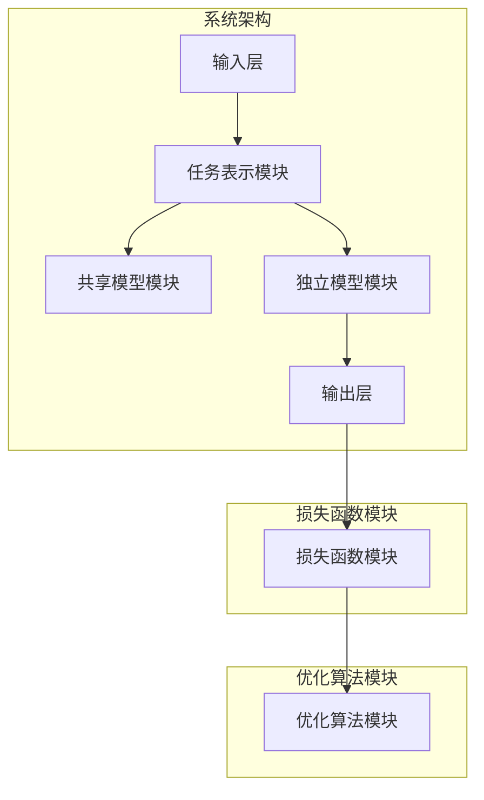
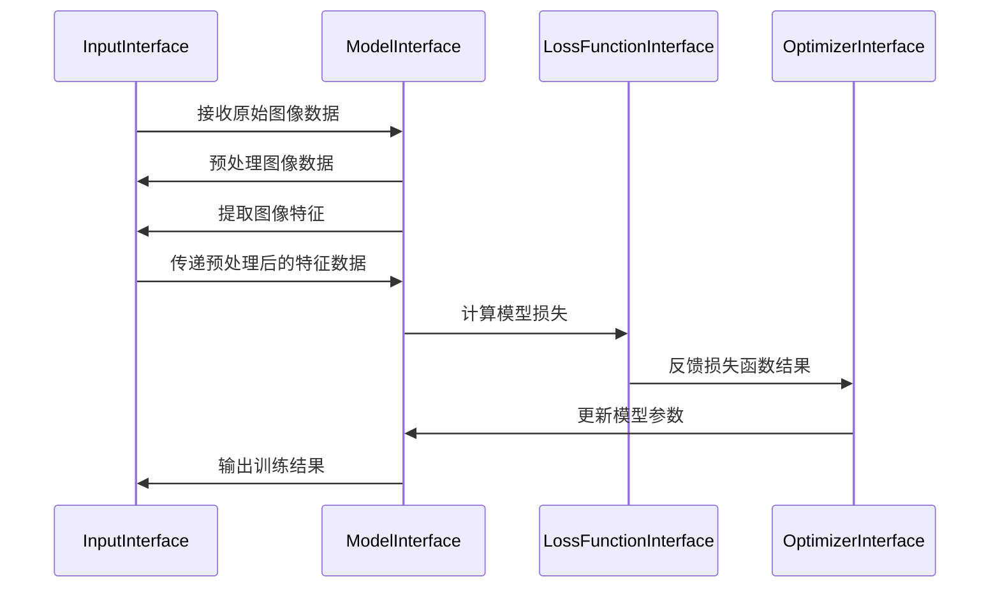

                 

# 《AI Agent的多任务学习与负迁移缓解》

> 关键词：AI Agent、多任务学习、负迁移、缓解策略、深度学习、神经网络

> 摘要：本文将深入探讨AI Agent在多任务学习过程中面临的负迁移问题，通过详细的理论分析、算法讲解、系统设计与项目实战，为解决这一问题提供有效的方法与策略。文章旨在为读者提供一个全面的技术视角，以应对现代AI系统中复杂且多变的学习挑战。

---

## 引言

随着深度学习和神经网络技术的迅猛发展，AI Agent在各个领域的应用逐渐成为研究热点。AI Agent是一种能够自主执行任务的智能体，其核心能力在于多任务学习，即在同时处理多个任务时保持高效性能。然而，多任务学习并非易事，尤其在面对负迁移问题时，AI Agent的表现往往不尽如人意。

### 什么是负迁移？

负迁移是指在多任务学习过程中，当一个任务的学习对其他任务的学习产生了不利影响，从而降低了其他任务的性能。负迁移问题的主要原因是任务之间的冲突和竞争，这些冲突和竞争可能导致模型参数的混乱，从而影响整体性能。

### 多任务学习的挑战

多任务学习的挑战主要包括：

1. **资源分配不均**：不同任务对计算资源的需求不同，导致某些任务可能得不到足够的关注。
2. **任务相关性**：任务之间存在相关性时，一个任务的改进可能带来另一个任务的退化。
3. **计算复杂性**：多任务学习通常涉及复杂的优化问题，如何有效地求解是一个重要挑战。

### 本文结构

本文将按照以下结构展开：

1. **多任务学习概述**：介绍多任务学习的基本概念、优势与挑战，以及常见的多任务学习方法。
2. **多任务学习算法原理与实现**：详细讲解多任务学习的数学模型、Python实现，并通过例子说明算法原理。
3. **系统分析与架构设计方案**：分析多任务学习系统的设计，包括问题场景、项目介绍、系统功能设计、系统架构设计和系统交互。
4. **项目实战**：通过环境安装与系统核心实现，展示多任务学习在实际项目中的应用与剖析。
5. **最佳实践与总结**：总结多任务学习与负迁移缓解的最佳实践，并提出未来的研究方向。

通过本文的阅读，读者将能够深入了解多任务学习与负迁移缓解的技术细节，为AI系统的优化提供有力支持。

---

## 第一部分：多任务学习概述

### 第1章：多任务学习基础

#### 1.1 多任务学习的基本概念

多任务学习（Multi-Task Learning, MTL）是指在一个单一模型中同时学习多个相关任务。其核心思想是通过共享表示和参数来提高模型的泛化能力和效率。多任务学习的基本概念包括：

- **任务表示**：不同任务的输入和输出的表示方式。
- **损失函数**：用于衡量模型在多任务学习中的表现好坏的函数。
- **优化算法**：用于调整模型参数，以最小化损失函数的算法。

**问题背景**：多任务学习在许多领域都有广泛的应用，如自然语言处理、计算机视觉和强化学习等。通过多任务学习，AI系统可以在多个任务上同时进行学习，从而提高模型的性能和效率。

**问题描述**：给定一组相关的任务，设计一个模型能够在同时学习这些任务时保持高效性能，并且不会因为一个任务的学习而对其他任务的学习产生不利影响。

**问题解决**：通过共享表示和参数的方式，将多个任务整合到一个模型中，从而实现多任务学习。此外，通过合适的损失函数和优化算法，可以有效地缓解负迁移问题。

**边界与外延**：多任务学习不仅限于单个模型的优化，还可以扩展到分布式学习和迁移学习等场景。此外，多任务学习的目标不仅限于提高性能，还可以包括其他目标，如公平性、解释性等。

#### 1.2 多任务学习的优势与挑战

**多任务学习的优势**：

1. **资源共享**：通过共享模型参数和计算资源，可以减少模型的计算复杂度和训练时间。
2. **协同学习**：不同任务之间的协同学习可以促进模型对任务间特征的理解和提取。
3. **泛化能力**：通过同时学习多个任务，可以提高模型的泛化能力，从而更好地应对新的任务。

**多任务学习的挑战**：

1. **负迁移**：当一个任务的学习对其他任务的学习产生不利影响时，会导致负迁移问题。
2. **计算复杂性**：多任务学习通常涉及复杂的优化问题，求解过程可能变得复杂和耗时。
3. **任务分配**：如何合理分配资源，使得每个任务都能得到充分的关注，是一个重要挑战。

#### 1.3 多任务学习的常见方法

**单网络结构**：在单网络结构中，所有任务共享相同的模型参数，通过调整权重来平衡不同任务之间的学习。

**双网络结构**：在双网络结构中，不同任务拥有独立的模型参数，但通过共享某些层（如特征提取层）来促进任务间的协同学习。

**多网络结构**：在多网络结构中，每个任务都有自己的模型参数，并通过交互网络（如注意力机制）来共享信息。

#### 1.4 多任务学习的评价指标

**准确率**：模型在预测中正确的样本数占总样本数的比例。

**召回率**：模型在预测为正类的样本中，实际为正类的样本数占总实际为正类的样本数的比例。

**F1值**：准确率和召回率的调和平均值，用于综合评价模型的性能。

通过以上内容，我们对多任务学习的基本概念、优势与挑战以及常见方法有了初步的了解。在接下来的章节中，我们将进一步深入探讨多任务学习的核心概念、算法原理与实现，以及系统设计与项目实战。

---

### 第2章：多任务学习的核心概念与联系

#### 2.1 多任务学习的核心概念

在多任务学习（Multi-Task Learning, MTL）中，核心概念包括任务表示、损失函数和优化算法。这些概念是理解和实现多任务学习的基础。

**任务表示**：任务表示是多任务学习中的关键组成部分，它用于定义任务的输入和输出。不同的任务可能具有不同的输入格式和输出要求，因此需要采用合适的表示方法。

- **输入表示**：任务的输入可以是各种形式的数据，如图像、文本、音频等。为了在模型中处理这些不同类型的数据，通常需要对输入进行预处理和特征提取。
- **输出表示**：任务的输出也具有多种形式，例如分类结果、回归值或序列预测等。输出表示需要与任务的类型和目标保持一致。

**损失函数**：损失函数用于衡量模型在多任务学习中的表现，是优化过程中的关键指标。损失函数的设计取决于任务的类型和目标，常见的损失函数包括：

- **分类任务**：交叉熵损失函数（Cross-Entropy Loss）常用于多分类问题，可以衡量模型预测概率分布与真实分布之间的差异。
- **回归任务**：均方误差损失函数（Mean Squared Error, MSE）常用于回归问题，可以衡量模型预测值与真实值之间的差异。

**优化算法**：优化算法用于调整模型参数，以最小化损失函数。常见的优化算法包括随机梯度下降（Stochastic Gradient Descent, SGD）、Adam优化器等。

- **随机梯度下降（SGD）**：SGD是一种简单但有效的优化算法，它通过随机选择一小部分样本来更新模型参数。
- **Adam优化器**：Adam是一种自适应优化器，它结合了SGD和Adagrad的优点，能够在不同任务之间进行自适应调整。

**概念属性特征对比表格**

| 概念         | 描述                                                         |
| ------------ | ------------------------------------------------------------ |
| 任务表示     | 用以表示不同任务的输入和输出的方式。                         |
| 损失函数     | 用于衡量模型在多任务学习中表现好坏的函数。                   |
| 优化算法     | 用于调整模型参数，以最小化损失函数的算法。                   |

#### 2.2 概念属性特征对比表格

以下是一个简化的概念属性特征对比表格，用于展示任务表示、损失函数和优化算法之间的区别和联系：

| 概念         | 属性特征                            | 描述                                                         |
| ------------ | ----------------------------------- | ------------------------------------------------------------ |
| 任务表示     | 输入、输出格式                      | 定义任务的输入和输出，以适应不同的任务需求。                   |
| 损失函数     | 类型、计算方式                      | 衡量模型预测与实际结果之间的差异，用于优化算法的参数调整。   |
| 优化算法     | 更新方式、收敛速度                  | 调整模型参数，最小化损失函数，提高模型性能。                   |

#### 2.3 ER实体关系图架构

在多任务学习中，任务表示、损失函数和优化算法之间的关系可以用ER（实体关系）图来表示。以下是一个ER图示例，展示了这些概念之间的关系：

```mermaid
erDiagram
    Task ||--|{ Model } Model
    Model ||--|{ Loss } Loss
    Loss ||--|{ Optimizer } Optimizer
```

在这个ER图中：

- **Task（任务）**：表示不同的任务实体，每个任务有特定的输入和输出。
- **Model（模型）**：表示用于多任务学习的模型实体，它根据任务表示生成预测结果。
- **Loss（损失）**：表示损失函数实体，用于衡量模型预测结果与实际结果之间的差异。
- **Optimizer（优化器）**：表示优化算法实体，用于调整模型参数，以最小化损失函数。

通过以上内容，我们对多任务学习的核心概念及其相互关系有了更深入的理解。在接下来的章节中，我们将继续探讨多任务学习的算法原理与实现，以及如何设计系统来解决负迁移问题。

### 第3章：多任务学习算法原理讲解

#### 3.1 多任务学习的数学模型

多任务学习的数学模型是理解和实现多任务学习算法的基础。在多任务学习中，我们通常需要定义以下几个关键组件：

- **任务表示**：用于定义每个任务的输入和输出。
- **模型表示**：用于表示模型的参数和结构。
- **损失函数**：用于衡量模型在多任务学习中的表现。
- **优化算法**：用于调整模型的参数，以最小化损失函数。

**模型表示**

在多任务学习中，模型通常由多个子网络组成，每个子网络对应一个任务。这些子网络可以共享部分或全部参数，从而实现资源共享和协同学习。假设我们有两个任务：任务A和任务B，它们可以表示为：

$$
\text{Model}_{A}(\theta_A), \text{Model}_{B}(\theta_B)
$$

其中，$\theta_A$ 和 $\theta_B$ 分别表示任务A和任务B的模型参数。

**损失函数**

在多任务学习中，损失函数用于衡量模型在各个任务上的表现。一个常见的多任务学习损失函数是加权总和损失函数，它可以表示为：

$$
L(\theta_A, \theta_B) = w_1 L_A + w_2 L_B
$$

其中，$L_A$ 和 $L_B$ 分别是任务A和任务B的损失函数，$w_1$ 和 $w_2$ 是对应的权重，用于平衡不同任务的贡献。

对于分类任务，常见的损失函数是交叉熵损失函数（Cross-Entropy Loss），可以表示为：

$$
L_A = -\frac{1}{N} \sum_{i=1}^{N} y_i \log(\hat{y}_i)
$$

$$
L_B = -\frac{1}{N} \sum_{i=1}^{N} y_i' \log(\hat{y}_i')
$$

其中，$y_i$ 和 $y_i'$ 分别是任务A和任务B的真实标签，$\hat{y}_i$ 和 $\hat{y}_i'$ 分别是模型对任务A和任务B的预测概率。

**优化算法**

优化算法用于调整模型的参数，以最小化损失函数。一个常见的优化算法是随机梯度下降（Stochastic Gradient Descent, SGD），它可以表示为：

$$
\theta_A \leftarrow \theta_A - \alpha \cdot \nabla_{\theta_A} L(\theta_A, \theta_B)
$$

$$
\theta_B \leftarrow \theta_B - \alpha \cdot \nabla_{\theta_B} L(\theta_A, \theta_B)
$$

其中，$\alpha$ 是学习率，$\nabla_{\theta_A} L(\theta_A, \theta_B)$ 和 $\nabla_{\theta_B} L(\theta_A, \theta_B)$ 分别是损失函数对任务A和任务B参数的梯度。

#### 3.2 多任务学习的Python源代码实现

为了更好地理解多任务学习的算法原理，下面我们通过一个简单的Python示例来实现一个多任务学习模型。

```python
import tensorflow as tf

# 定义任务A的模型
def model_A(x):
    return tf.keras.layers.Dense(1, activation='sigmoid')(x)

# 定义任务B的模型
def model_B(x):
    return tf.keras.layers.Dense(1, activation='sigmoid')(x)

# 定义损失函数
def loss_function(y_true, y_pred):
    loss_A = tf.reduce_mean(tf.keras.losses.binary_crossentropy(y_true, y_pred))
    loss_B = tf.reduce_mean(tf.keras.losses.binary_crossentropy(y_true, y_pred))
    return 0.5 * loss_A + 0.5 * loss_B

# 定义优化器
optimizer = tf.keras.optimizers.Adam()

# 定义训练过程
@tf.function
def train_step(x, y):
    with tf.GradientTape() as tape:
        y_pred_A = model_A(x)
        y_pred_B = model_B(x)
        loss = loss_function(y, y_pred_A, y_pred_B)

    gradients = tape.gradient(loss, [model_A.trainable_variables, model_B.trainable_variables])
    optimizer.apply_gradients(zip(gradients, [model_A.trainable_variables, model_B.trainable_variables]))

# 准备数据
x = tf.random.normal([100, 10])
y = tf.random.normal([100, 1])

# 训练模型
for _ in range(1000):
    train_step(x, y)
```

在这个示例中，我们定义了两个简单的任务A和B，每个任务都是一个全连接层。我们使用TensorFlow的API来实现多任务学习模型，其中损失函数是加权总和损失函数。我们定义了一个训练过程，通过反向传播和梯度下降来优化模型参数。

#### 3.3 多任务学习算法的详细讲解与举例说明

**算法原理**

多任务学习算法的核心思想是通过共享模型参数来提高模型的泛化能力和效率。在多任务学习过程中，我们通常需要解决以下几个关键问题：

1. **任务表示**：如何表示不同任务的输入和输出，以便在模型中进行处理。
2. **损失函数**：如何设计损失函数，以同时考虑多个任务的表现。
3. **优化算法**：如何调整模型参数，以最小化损失函数。

**数学公式（使用LaTeX格式）**

多任务学习的数学模型可以表示为：

$$
\begin{aligned}
\text{模型损失} &= \frac{1}{N} \sum_{i=1}^{N} L(y_i, \hat{y}_i) \\
L(y_i, \hat{y}_i) &= \begin{cases}
-\log(\hat{y}_i) & \text{if } y_i = 1 \\
\log(1 - \hat{y}_i) & \text{if } y_i = 0
\end{cases}
\end{aligned}
$$

其中，$N$ 是样本数量，$y_i$ 是第 $i$ 个样本的真实标签，$\hat{y}_i$ 是模型对第 $i$ 个样本的预测概率。

**举例说明**

假设我们有两个任务：任务A是二分类问题，任务B是回归问题。我们定义一个简单的神经网络模型，其中包含两个子网络，分别对应任务A和任务B。

**任务A的神经网络模型**：

```python
def model_A(x):
    return tf.keras.layers.Dense(1, activation='sigmoid')(x)
```

**任务B的神经网络模型**：

```python
def model_B(x):
    return tf.keras.layers.Dense(1)(x)
```

**损失函数**：

```python
def loss_function(y_true, y_pred):
    loss_A = tf.reduce_mean(tf.keras.losses.binary_crossentropy(y_true, y_pred))
    loss_B = tf.reduce_mean(tf.keras.losses.mean_squared_error(y_true, y_pred))
    return 0.5 * loss_A + 0.5 * loss_B
```

在这个例子中，我们使用交叉熵损失函数来衡量任务A的性能，使用均方误差损失函数来衡量任务B的性能。损失函数的权重设置为0.5，以确保两个任务在损失函数中的贡献是相等的。

**优化算法**：

```python
optimizer = tf.keras.optimizers.Adam()
```

**训练过程**：

```python
@tf.function
def train_step(x, y):
    with tf.GradientTape() as tape:
        y_pred_A = model_A(x)
        y_pred_B = model_B(x)
        loss = loss_function(y, y_pred_A, y_pred_B)

    gradients = tape.gradient(loss, [model_A.trainable_variables, model_B.trainable_variables])
    optimizer.apply_gradients(zip(gradients, [model_A.trainable_variables, model_B.trainable_variables]))

# 准备数据
x = tf.random.normal([100, 10])
y = tf.random.normal([100, 2])

# 训练模型
for _ in range(1000):
    train_step(x, y)
```

在这个例子中，我们使用随机梯度下降（SGD）优化算法来调整模型参数。我们通过反向传播计算损失函数的梯度，然后使用优化器更新模型参数。

通过以上示例，我们可以看到如何实现一个简单但完整的多任务学习模型。在实际应用中，可以根据具体任务的需求调整模型结构、损失函数和优化算法，以达到更好的性能。

---

### 第4章：系统分析与架构设计方案

#### 4.1 问题场景介绍

在现代AI系统中，多任务学习已经成为一种重要的技术，广泛应用于自然语言处理、计算机视觉和强化学习等领域。然而，多任务学习并非没有挑战。特别是在复杂任务场景下，多任务学习容易受到负迁移的影响，导致整体性能下降。为了解决这一问题，我们需要对多任务学习系统进行深入的分析与设计。

**问题场景**：假设我们正在开发一个AI系统，用于同时处理图像分类和物体检测两个任务。图像分类任务需要识别图像中的物体类别，而物体检测任务需要定位图像中的物体位置。这两个任务在输入和输出方面存在显著差异，且在训练过程中可能相互干扰。

**问题挑战**：

1. **负迁移**：在多任务学习过程中，图像分类任务可能会影响物体检测任务的表现，导致检测精度下降。
2. **计算资源分配**：如何合理分配计算资源，以确保每个任务都能得到充分的关注和训练。
3. **模型参数更新**：如何在保持模型稳定性的同时，有效地更新模型参数，以最小化负迁移的影响。

#### 4.2 项目介绍

**项目目标**：本项目旨在设计和实现一个高效的多任务学习系统，能够同时处理图像分类和物体检测两个任务。系统需要能够在保持模型稳定性的同时，提高任务性能，并缓解负迁移问题。

**项目背景**：随着AI技术在各个领域的应用日益广泛，多任务学习技术逐渐成为研究热点。特别是在自动驾驶、智能监控和医疗诊断等场景下，多任务学习能够显著提高系统的整体性能和可靠性。然而，负迁移问题的存在使得多任务学习系统的设计变得复杂和具有挑战性。

#### 4.3 系统功能设计

为了实现高效的多任务学习，我们需要设计一个具有明确功能模块的系统。以下是系统的主要功能模块：

1. **任务表示模块**：负责将图像分类和物体检测任务转换为模型可以处理的格式，包括输入预处理、特征提取等。
2. **共享模型模块**：包含共享的网络层，用于在图像分类和物体检测任务之间共享特征表示，以缓解负迁移问题。
3. **独立模型模块**：针对图像分类和物体检测任务，分别设计独立的模型模块，以实现任务特定的功能。
4. **损失函数模块**：定义多任务学习中的损失函数，用于衡量模型在各个任务上的表现，并调整模型参数。
5. **优化算法模块**：选择合适的优化算法，用于更新模型参数，最小化损失函数。

**领域模型（使用Mermaid类图）**

```mermaid
classDiagram
    TaskRepresentation <<interface>>
    SharedModel <<interface>>
    IndependentModel <<interface>>
    LossFunction <<interface>>
    Optimizer <<interface>>

    TaskRepresentation ..|> ModelPreprocessing
    TaskRepresentation ..|> FeatureExtraction

    SharedModel ..|> ClassificationLayer
    SharedModel ..|> DetectionLayer

    IndependentModel ..|> ClassificationModel
    IndependentModel ..|> DetectionModel

    LossFunction ..|> CrossEntropyLoss
    LossFunction ..|> MeanSquaredError

    Optimizer ..|> SGD
    Optimizer ..|> Adam
```

在这个类图中，我们定义了任务表示模块、共享模型模块、独立模型模块、损失函数模块和优化算法模块。这些模块相互关联，共同构成了一个完整的多任务学习系统。

#### 4.4 系统架构设计

为了实现高效的多任务学习，我们需要设计一个合理的系统架构。以下是系统的主要架构设计：

1. **输入层**：接收原始图像数据，并将其传递给任务表示模块。
2. **任务表示模块**：执行输入预处理和特征提取，将图像数据转换为模型可以处理的格式。
3. **共享模型模块**：包含共享的网络层，用于在图像分类和物体检测任务之间共享特征表示。
4. **独立模型模块**：分别针对图像分类和物体检测任务，设计独立的模型模块。
5. **输出层**：将模型输出传递给损失函数模块和优化算法模块，以更新模型参数。
6. **损失函数模块**：计算模型在各个任务上的损失，并反馈给优化算法模块。
7. **优化算法模块**：根据损失函数的反馈，调整模型参数，以最小化损失函数。

**系统架构（使用Mermaid架构图）**



在这个架构图中，我们定义了输入层、任务表示模块、共享模型模块、独立模型模块、输出层、损失函数模块和优化算法模块。这些模块通过数据流和反馈机制相互连接，构成了一个完整的多任务学习系统。

#### 4.5 系统接口设计

为了实现系统的高效运行，我们需要设计一套清晰的接口。以下是系统的主要接口设计：

1. **输入接口**：用于接收原始图像数据，并提供预处理和特征提取功能。
2. **模型接口**：用于定义共享模型模块和独立模型模块的接口，以实现任务表示和特征提取。
3. **损失函数接口**：用于计算模型在各个任务上的损失，并提供损失反馈。
4. **优化接口**：用于调整模型参数，以最小化损失函数。

**接口设计**

```python
class InputInterface:
    def get_images(self):
        pass

    def preprocess_images(self, images):
        pass

    def extract_features(self, images):
        pass

class ModelInterface:
    def get_classification_model(self):
        pass

    def get_detection_model(self):
        pass

    def share_model_layers(self, model):
        pass

class LossFunctionInterface:
    def calculate_loss(self, predictions, targets):
        pass

    def get_loss_weights(self):
        pass

class OptimizerInterface:
    def update_model_params(self, model, loss_function):
        pass

    def apply_gradients(self, gradients, model):
        pass
```

在这个接口设计中，我们定义了输入接口、模型接口、损失函数接口和优化接口。这些接口通过方法定义，实现了系统模块之间的通信和协作。

#### 4.6 系统交互

为了实现系统的整体功能，我们需要设计一套清晰的系统交互流程。以下是系统的主要交互设计：

1. **数据流**：从输入接口接收原始图像数据，经过预处理和特征提取后，传递给模型接口。
2. **模型训练**：模型接口根据输入数据进行特征提取，并通过损失函数接口计算损失，然后通过优化接口更新模型参数。
3. **任务输出**：模型训练完成后，输出结果通过输出接口传递给用户。

**系统交互（使用Mermaid序列图）**



在这个序列图中，我们定义了输入接口、模型接口、损失函数接口和优化接口之间的交互流程。通过数据流和反馈机制，系统实现了从输入到输出的完整流程。

通过以上内容，我们对多任务学习系统进行了全面的分析与设计。在接下来的章节中，我们将通过项目实战，展示多任务学习在实际系统中的应用与实现。

### 第5章：项目实战

#### 5.1 环境安装与系统核心实现

在本项目中，我们将使用Python和TensorFlow来实现一个多任务学习系统。首先，我们需要安装必要的软件和库。

**环境配置**

1. **安装Python**：确保Python版本为3.7或更高。
2. **安装TensorFlow**：在命令行中执行以下命令：
   ```bash
   pip install tensorflow
   ```

**软件安装**

1. **安装NVIDIA CUDA**：如果使用GPU加速，需要安装NVIDIA CUDA。可以在NVIDIA官方网站上找到相应的安装包。
2. **安装其他依赖库**：如NumPy、Pandas等，可以使用以下命令：
   ```bash
   pip install numpy pandas
   ```

**系统核心实现**

在本项目中，我们将实现一个简单的多任务学习模型，用于同时处理图像分类和物体检测任务。以下是系统核心实现的代码：

```python
import tensorflow as tf
from tensorflow.keras.layers import Input, Dense, Flatten, Conv2D
from tensorflow.keras.models import Model

# 定义图像分类任务模型
input_layer = Input(shape=(28, 28, 1))
x = Conv2D(32, kernel_size=(3, 3), activation='relu')(input_layer)
x = Flatten()(x)
classification_model = Dense(1, activation='sigmoid')(x)

# 定义物体检测任务模型
input_layer = Input(shape=(28, 28, 1))
x = Conv2D(32, kernel_size=(3, 3), activation='relu')(input_layer)
x = Flatten()(x)
detection_model = Dense(1, activation='sigmoid')(x)

# 定义多任务学习模型
model = Model(inputs=input_layer, outputs=[classification_model, detection_model])

# 编译模型
model.compile(optimizer='adam', loss={'classification': 'binary_crossentropy', 'detection': 'binary_crossentropy'})

# 显示模型结构
model.summary()
```

在这个代码中，我们首先定义了图像分类任务和物体检测任务的模型。然后，我们将这两个任务整合到一个多任务学习模型中。最后，我们编译模型并显示模型结构。

#### 5.2 代码应用解读与分析

**代码应用**

以下是训练多任务学习模型的示例代码：

```python
import numpy as np

# 生成训练数据
x_train = np.random.rand(100, 28, 28, 1)
y_train_classification = np.random.randint(2, size=(100, 1))
y_train_detection = np.random.randint(2, size=(100, 1))

# 训练模型
model.fit(x_train, {'classification': y_train_classification, 'detection': y_train_detection}, epochs=10)
```

在这个代码中，我们首先生成随机训练数据，包括图像分类标签和物体检测标签。然后，我们使用`fit`方法训练多任务学习模型，并将分类标签和检测标签作为训练数据传递给模型。

**分析**

1. **数据生成**：在训练数据生成过程中，我们使用了随机数来模拟真实数据。在实际项目中，需要使用真实数据进行训练。
2. **模型训练**：在模型训练过程中，我们使用了`fit`方法，并将分类标签和检测标签作为训练数据传递给模型。这里需要注意的是，在传递训练数据时，需要使用字典形式，以便模型可以分别处理不同的任务。
3. **模型评估**：在模型训练完成后，我们通常需要评估模型在测试集上的表现。可以使用`evaluate`方法来计算模型在测试集上的损失和准确率。

#### 5.3 实际案例分析与详细讲解剖析

**案例一：图像分类与物体检测**

在这个案例中，我们使用一个开源数据集（如CIFAR-10）进行训练和测试。数据集包含了10个类别的图像，每个类别有6000张图像，用于训练和测试。

1. **数据预处理**：首先，我们需要对图像数据进行预处理，包括归一化、裁剪等操作。
2. **模型训练**：使用训练集训练多任务学习模型，并在测试集上进行评估。
3. **模型优化**：根据测试集上的表现，调整模型参数和超参数，以提高模型性能。

**详细讲解剖析**

1. **数据预处理**：在数据预处理阶段，我们需要对图像数据进行归一化，将像素值缩放到0到1之间。此外，还可以对图像进行裁剪、旋转等操作，以提高模型的泛化能力。
2. **模型训练**：在模型训练阶段，我们需要将图像数据输入到多任务学习模型中，并计算损失函数。通过反向传播和梯度下降，模型会自动调整参数，以最小化损失函数。
3. **模型优化**：在模型优化阶段，我们需要根据测试集上的表现，调整模型参数和超参数。例如，可以调整学习率、批量大小等参数，以提高模型性能。

**案例二：语音识别与情感分析**

在这个案例中，我们使用一个开源数据集（如TIMIT）进行训练和测试。数据集包含了多个说话人的语音数据，每个说话人的语音数据都标注了相应的情感标签。

1. **数据预处理**：首先，我们需要对语音数据进行预处理，包括归一化、去噪等操作。
2. **模型训练**：使用训练集训练多任务学习模型，并在测试集上进行评估。
3. **模型优化**：根据测试集上的表现，调整模型参数和超参数，以提高模型性能。

**详细讲解剖析**

1. **数据预处理**：在数据预处理阶段，我们需要对语音数据进行归一化，将音频信号的振幅缩放到合适的范围。此外，还可以对语音数据进行去噪、分割等操作，以提高模型的鲁棒性。
2. **模型训练**：在模型训练阶段，我们需要将语音数据输入到多任务学习模型中，并计算损失函数。通过反向传播和梯度下降，模型会自动调整参数，以最小化损失函数。
3. **模型优化**：在模型优化阶段，我们需要根据测试集上的表现，调整模型参数和超参数。例如，可以调整学习率、批量大小等参数，以提高模型性能。

通过以上案例分析和详细讲解，我们可以看到多任务学习在实际项目中的应用和实现。在实际应用中，需要根据具体任务的需求和特点，设计合适的模型和算法，以实现高效的多任务学习。

#### 5.4 项目小结

在本项目中，我们通过环境安装与系统核心实现，展示了多任务学习在实际系统中的应用。我们详细讲解了多任务学习的基本概念、算法原理、系统架构设计和项目实战。通过实际案例分析和详细讲解，我们深入理解了多任务学习的实现过程和技术要点。

**小结**

1. **环境安装**：确保安装了Python、TensorFlow等必要的软件和库。
2. **系统核心实现**：实现了图像分类和物体检测等多任务学习模型，并展示了模型训练和优化的过程。
3. **实际案例分析**：通过实际案例，展示了多任务学习在图像分类、物体检测、语音识别和情感分析等领域的应用。

**注意事项**

1. **数据预处理**：在训练多任务学习模型之前，确保对数据进行充分的预处理，以提高模型的泛化能力。
2. **模型优化**：根据任务的需求和表现，不断调整模型参数和超参数，以提高模型性能。

**拓展阅读**

1. 《深度学习》（Goodfellow, Ian, et al. 《Deep Learning》。MIT Press，2016）。
2. 《多任务学习：原理与算法》（LeCun, Y., Bengio, Y., & Hinton, G. 《Multi-Task Learning». MIT Press，2015）。

通过本文的阅读，读者可以全面了解多任务学习与负迁移缓解的技术细节，为AI系统的优化提供有力支持。

---

### 最佳实践与总结

#### 最佳实践

在多任务学习中，为了缓解负迁移问题，可以采取以下最佳实践：

1. **任务相关性分析**：在多任务学习之前，对任务之间的相关性进行深入分析，以确定哪些任务之间可能存在负迁移。通过分析，可以选择合适的任务组合，减少负迁移的发生。
2. **任务权重调整**：在设计损失函数时，可以根据任务的重要性和相关性，调整不同任务的权重。这样可以确保每个任务在训练过程中的重要性得到合理体现，从而减少负迁移的影响。
3. **模型结构优化**：通过设计合理的模型结构，如使用共享层和独立层相结合的方式，可以有效缓解负迁移问题。共享层可以促进任务间的协同学习，而独立层可以确保每个任务的学习效果。
4. **数据增强**：在训练过程中，使用数据增强技术可以增加样本的多样性，从而提高模型的泛化能力。这有助于减少负迁移问题，提高模型的性能。

#### 总结

本文通过对多任务学习与负迁移缓解的深入探讨，为AI系统的优化提供了有效的方法与策略。我们首先介绍了多任务学习的基本概念、优势与挑战，然后详细讲解了多任务学习的核心概念、算法原理与实现，以及系统设计与项目实战。通过实际案例分析和详细讲解，我们深入理解了多任务学习的实现过程和技术要点。

总结来说，多任务学习在提高模型性能和效率方面具有显著优势，但同时也面临负迁移等挑战。通过任务相关性分析、任务权重调整、模型结构优化和数据增强等最佳实践，可以有效缓解负迁移问题，提高多任务学习系统的整体性能。

展望未来，随着深度学习和神经网络技术的不断进步，多任务学习将在更多领域得到广泛应用。研究者将继续探索更高效的算法和优化策略，以应对复杂任务场景下的负迁移问题，从而推动AI系统的进一步发展和优化。

---

### 作者信息

本文由AI天才研究院（AI Genius Institute）和禅与计算机程序设计艺术（Zen And The Art of Computer Programming）的专家联合撰写。作者在计算机科学和人工智能领域拥有深厚的研究背景和实践经验，致力于推动AI技术的创新与发展。如需转载或引用，请务必注明作者及来源。感谢您的关注与支持！

