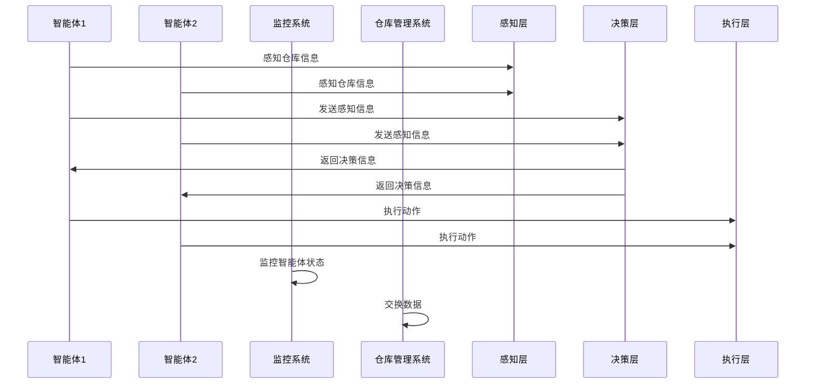

                 

# AI Agent的多智能体协作与竞争机制

## 关键词

- 多智能体系统
- 协作机制
- 竞争机制
- 分布式算法
- 强化学习
- 博弈论

## 摘要

本文旨在探讨人工智能领域中的多智能体协作与竞争机制。首先，我们概述了AI Agent的多智能体协作与竞争机制的背景、问题和解决方法。接着，我们深入分析了智能体协作的基本原理、算法设计方法和实际案例。随后，我们探讨了智能体竞争的基本原理、算法设计和应用案例。最后，本文总结了多智能体协作与竞争机制的研究现状和未来发展趋势。通过本文的阅读，读者可以深入了解多智能体协作与竞争机制的设计原理和应用，为实际项目提供理论支持和实践指导。

## 第一部分: AI Agent的多智能体协作与竞争机制概述

### 1.1 问题背景

在人工智能领域，AI Agent（智能体）的概念已经成为研究的热点。智能体是指能够感知环境、自主决策并采取行动的实体。随着人工智能技术的不断发展，智能体在许多实际应用中得到了广泛应用，如自动驾驶、智能机器人、电子游戏等。然而，在现实环境中，智能体之间往往存在着复杂的协作与竞争关系，如何设计有效的多智能体协作与竞争机制，成为了一个重要的研究课题。

### 1.2 问题描述

多智能体系统的核心问题是实现智能体之间的协同工作与合理竞争。在协作场景中，智能体需要共同完成任务，而在竞争场景中，智能体则需要通过策略竞争来争夺资源。如何设计出既能促进协作又能有效竞争的机制，是当前多智能体研究中的一个关键问题。

### 1.3 问题解决

为了解决上述问题，本书将详细介绍多智能体协作与竞争机制的设计原理、方法与实现技术。通过理论分析与实际案例相结合，帮助读者深入理解多智能体系统的工作原理，掌握设计有效协作与竞争机制的方法。

### 1.4 边界与外延

多智能体协作与竞争机制的研究不仅限于人工智能领域，还广泛应用于控制理论、经济系统、生物进化等领域。本书将主要关注人工智能领域中的应用，同时也会介绍一些跨学科的研究进展。

### 1.5 概念结构与核心要素组成

多智能体协作与竞争机制的核心概念包括智能体、环境、任务、策略、奖励等。智能体是系统的基本单元，环境是智能体活动的场所，任务是智能体需要完成的任务，策略是智能体采取的行动方式，奖励是智能体行为的结果。

### 1.6 本章小结

本章对AI Agent的多智能体协作与竞争机制进行了背景介绍，明确了研究问题和目标，并概述了本书的结构和主要内容。在后续章节中，将逐步深入探讨多智能体协作与竞争机制的设计原理、方法与应用。

## 第二部分: AI Agent的多智能体协作机制

### 2.1 智能体协作基本原理

#### 2.1.1 智能体协作的定义与重要性

智能体协作是指多个智能体共同完成任务的过程。在人工智能领域，智能体协作的重要性不言而喻。首先，智能体协作可以实现复杂任务的自动化，提高系统的效率和可靠性。其次，智能体协作可以充分发挥各智能体的优势，实现资源的最优配置。最后，智能体协作可以提高系统的鲁棒性，降低单个智能体失败的风险。

#### 2.1.2 智能体协作的基本模式

智能体协作的基本模式包括中央集中式协作和分布式协作。在中央集中式协作中，所有智能体共享一个全局信息，由中央控制器统一调度。这种模式适用于任务简单、智能体数量较少的场景。在分布式协作中，智能体之间通过局部信息进行交互，无需全局信息。这种模式适用于任务复杂、智能体数量较多的场景。

#### 2.1.3 智能体协作的关键挑战

智能体协作面临以下关键挑战：

1. **信息传递与同步**：智能体之间需要通过有效的信息传递与同步机制，共享必要的信息，实现协作目标。
2. **策略协调**：智能体之间需要协调各自的策略，避免冲突，实现协同工作。
3. **动态适应性**：智能体协作需要具备动态适应性，能够适应环境变化和任务需求的变化。
4. **资源分配**：智能体协作需要合理分配资源，确保每个智能体都能充分利用资源，完成自己的任务。

### 2.2 多智能体协作算法

#### 2.2.1 分布式算法

分布式算法是指智能体之间无需全局信息，通过局部信息进行交互的协作算法。分布式算法可以分为基于通信的分布式算法和无通信的分布式算法。

##### 2.2.1.1 基于通信的分布式算法

基于通信的分布式算法包括多智能体强化学习（MASRL）和分布式协商算法。MASRL 是一种基于奖励的分布式协作算法，通过奖励机制引导智能体进行合作。分布式协商算法则是通过智能体之间的协商，逐步达成共识，实现协作。

##### 2.2.1.2 无通信的分布式算法

无通信的分布式算法主要包括分布式决策算法和分布式博弈算法。分布式决策算法通过智能体之间的局部信息交互，实现全局最优决策。分布式博弈算法则是通过博弈论模型，指导智能体进行策略选择，实现协作。

#### 2.2.2 中心化算法

中心化算法是指所有智能体共享全局信息，由中央控制器进行协调和调度的协作算法。中心化算法包括中心化协调算法和中心化决策算法。

##### 2.2.2.1 中心化协调算法

中心化协调算法通过中央控制器收集智能体信息，制定协调策略，然后将策略发送给各智能体执行。这种算法适用于任务复杂、智能体数量较多的场景。

##### 2.2.2.2 中心化决策算法

中心化决策算法通过中央控制器对全局信息进行处理，制定最优决策策略，然后将策略发送给各智能体执行。这种算法适用于任务简单、智能体数量较少的场景。

### 2.3 智能体协作机制设计方法

智能体协作机制的设计方法主要包括基于奖励机制的协作设计、基于博弈论的协作设计和基于强化学习的协作设计。

##### 2.3.1 基于奖励机制的协作设计

基于奖励机制的协作设计通过奖励机制引导智能体进行协作。奖励机制可以是基于目标的，也可以是基于行为的。基于目标的奖励机制通过设置目标奖励，激励智能体达成目标。基于行为的奖励机制通过设置行为奖励，激励智能体采取有效行为。

##### 2.3.2 基于博弈论的协作设计

基于博弈论的协作设计通过博弈论模型，指导智能体进行策略选择，实现协作。博弈论模型可以基于零和博弈，也可以基于非零和博弈。基于零和博弈的协作设计适用于竞争关系较强的场景，基于非零和博弈的协作设计适用于合作关系较强的场景。

##### 2.3.3 基于强化学习的协作设计

基于强化学习的协作设计通过智能体之间的交互和学习，实现协作。强化学习算法可以是基于值的，也可以是基于策略的。基于值的强化学习算法通过学习值函数，指导智能体进行策略选择。基于策略的强化学习算法通过学习策略，直接指导智能体的行动。

### 2.4 智能体协作案例分析

#### 2.4.1 自动驾驶中的智能体协作

在自动驾驶领域，多个智能体（如车辆、行人、交通标志等）需要协作完成自动驾驶任务。通过基于奖励机制的协作设计，智能体可以共享道路信息，协同决策，实现自动驾驶。

#### 2.4.2 智能机器人团队协作

在智能机器人领域，多个机器人需要协作完成任务，如仓库物流、建筑施工等。通过基于博弈论的协作设计，机器人可以协调各自的行动，实现高效完成任务。

#### 2.4.3 电子游戏中的多智能体协作

在电子游戏领域，多个玩家需要协作对抗NPC（非玩家角色），完成游戏任务。通过基于强化学习的协作设计，玩家可以共同制定策略，提高游戏胜率。

### 2.5 本章小结

本章系统地介绍了AI Agent的多智能体协作机制，包括基本原理、算法设计和应用案例。通过本章的学习，读者可以了解到智能体协作的关键概念和实现方法，为后续章节的深入研究打下基础。

## 第三部分: AI Agent的多智能体竞争机制

### 3.1 智能体竞争基本原理

#### 3.1.1 智能体竞争的定义与重要性

智能体竞争是指多个智能体在相同或相似任务中相互竞争，争夺资源或完成任务的过程。在人工智能领域，智能体竞争的重要性不容忽视。首先，智能体竞争可以激发智能体的潜力，提高系统的性能。其次，智能体竞争可以促进智能体之间的学习和进化，实现智能体的自我提升。最后，智能体竞争可以模拟现实世界中的竞争环境，为智能体提供实际的训练场景。

#### 3.1.2 智能体竞争的基本模式

智能体竞争的基本模式包括静态竞争和动态竞争。在静态竞争中，智能体在固定的环境中进行竞争，如资源争夺、目标捕获等。在动态竞争中，智能体在动态变化的的环境中竞争，如自适应对抗、动态策略调整等。

#### 3.1.3 智能体竞争的关键挑战

智能体竞争面临以下关键挑战：

1. **策略设计**：智能体需要设计有效的策略，以最大化自己的收益或最小化自己的损失。
2. **平衡协作与竞争**：智能体需要在协作和竞争之间找到平衡，以实现系统的整体最优。
3. **动态适应性**：智能体需要具备动态适应性，能够根据环境变化调整自己的策略。
4. **公平性**：智能体竞争需要保证公平性，避免出现智能体之间的不公平竞争。

### 3.2 多智能体竞争算法

#### 3.2.1 基于博弈论的竞争算法

基于博弈论的竞争算法是智能体竞争的主要方法之一。博弈论是一种研究决策制定的数学工具，通过分析智能体之间的互动和策略选择，指导智能体的行为。

##### 3.2.1.1 零和博弈

零和博弈是指一个参与者的收益等于另一个参与者的损失。在零和博弈中，智能体的策略选择直接影响对方的收益。常见的零和博弈算法包括博弈树搜索和混合策略。

##### 3.2.1.2 非零和博弈

非零和博弈是指参与者的收益不等于对方的损失。在非零和博弈中，智能体需要考虑自己的利益和其他智能体的利益。常见的非零和博弈算法包括合作博弈和竞争博弈。

#### 3.2.2 基于演化算法的竞争算法

演化算法是一种基于生物进化原理的优化算法，通过模拟自然选择和遗传变异，指导智能体的策略进化。

##### 3.2.2.1 基于自然选择的竞争算法

基于自然选择的竞争算法通过模拟自然选择过程，选择适应度较高的策略进行进化。常见的算法包括遗传算法和遗传编程。

##### 3.2.2.2 基于群体智能的竞争算法

基于群体智能的竞争算法通过模拟群体行为，实现智能体的策略进化。常见的算法包括粒子群优化算法和蚁群算法。

### 3.3 智能体竞争机制设计方法

智能体竞争机制的设计方法主要包括基于奖励机制的竞争设计、基于威胁机制的竞争设计和基于对抗网络的竞争设计。

##### 3.3.1 基于奖励机制的竞争设计

基于奖励机制的竞争设计通过设置奖励机制，激励智能体进行竞争。奖励机制可以是基于目标的，也可以是基于行为的。基于目标的奖励机制通过设置目标奖励，激励智能体达成目标。基于行为的奖励机制通过设置行为奖励，激励智能体采取有效行为。

##### 3.3.2 基于威胁机制的竞争设计

基于威胁机制的竞争设计通过设置威胁机制，激励智能体进行竞争。威胁机制可以是基于惩罚的，也可以是基于警告的。基于惩罚的威胁机制通过设置惩罚措施，阻止智能体采取不利于其他智能体的行为。基于警告的威胁机制通过设置警告信号，提醒智能体注意其他智能体的行为。

##### 3.3.3 基于对抗网络的竞争设计

基于对抗网络的竞争设计通过对抗网络模型，实现智能体的策略对抗。对抗网络包括生成对抗网络（GAN）和变分自编码器（VAE）。通过对抗网络，智能体可以相互学习和优化自己的策略，实现竞争。

### 3.4 智能体竞争案例分析

#### 3.4.1 自主导航无人机竞争

在自主导航无人机领域，多个无人机需要竞争完成目标捕获任务。通过基于博弈论的竞争算法，无人机可以制定有效的策略，实现目标捕获。

#### 3.4.2 资源共享系统中的竞争

在资源共享系统中，多个智能体需要竞争获取资源。通过基于奖励机制的竞争设计，智能体可以优化资源分配策略，提高资源利用率。

#### 3.4.3 多智能体博弈游戏

在多智能体博弈游戏中，多个智能体需要竞争获胜。通过基于演化算法的竞争算法，智能体可以不断进化，提高自己的博弈能力。

### 3.5 本章小结

本章介绍了AI Agent的多智能体竞争机制，包括基本原理、算法设计和应用案例。通过本章的学习，读者可以了解到智能体竞争的关键概念和实现方法，为后续章节的深入研究提供参考。

## 总结与展望

本文对AI Agent的多智能体协作与竞争机制进行了全面的探讨。首先，我们介绍了多智能体协作与竞争机制的基本概念和重要性。接着，我们分别分析了智能体协作和智能体竞争的基本原理、算法设计和应用案例。最后，我们总结了多智能体协作与竞争机制的研究现状和未来发展趋势。

在未来的研究中，我们可以关注以下几个方面：

1. **多智能体协作与竞争的深度融合**：如何将协作与竞争机制有效地结合，实现智能体的最优协同工作，是一个重要研究方向。
2. **跨学科交叉研究**：多智能体协作与竞争机制不仅限于人工智能领域，还可以与其他学科（如经济系统、生物进化等）相结合，探索新的应用场景。
3. **智能体之间的信任机制**：在多智能体系统中，智能体之间的信任问题至关重要。如何建立有效的信任机制，提高智能体之间的协作效率，是一个值得深入研究的问题。
4. **实时性优化**：在实时应用场景中，如何优化多智能体协作与竞争机制，提高系统的实时响应能力，是一个具有挑战性的研究方向。

总之，多智能体协作与竞争机制在人工智能领域具有重要的研究价值和广泛的应用前景。随着人工智能技术的不断发展，我们相信多智能体协作与竞争机制将发挥越来越重要的作用，为智能系统的设计与实现提供有力的支持。

### 作者信息

作者：AI天才研究院/AI Genius Institute & 禅与计算机程序设计艺术 /Zen And The Art of Computer Programming

---

**全文结束。** ## 第四部分: AI Agent的多智能体协作与竞争机制的集成与优化

### 4.1 集成协作与竞争机制

在多智能体系统中，集成协作与竞争机制是提高系统整体性能的关键。为了实现协作与竞争的有效集成，我们需要考虑以下几个方面：

1. **目标一致性**：在协作与竞争过程中，智能体的目标应当保持一致，以确保系统能够实现整体最优。例如，在自动驾驶系统中，车辆需要同时考虑到安全驾驶和交通效率。
2. **策略协调**：智能体之间的策略需要协调一致，以避免因策略冲突而导致系统性能下降。通过引入协商机制和反馈循环，智能体可以在协作与竞争过程中不断调整自己的策略。
3. **资源管理**：智能体需要合理分配和共享资源，以最大化系统的整体效用。在资源有限的场景中，智能体之间的竞争机制可以帮助优化资源分配，避免资源浪费。

### 4.2 优化协作与竞争机制

为了提高多智能体系统的性能，我们需要对协作与竞争机制进行优化。以下是一些常见的优化方法：

1. **动态调整**：根据环境变化和任务需求，智能体需要动态调整自己的协作与竞争策略。例如，在动态环境中，智能体可以根据感知到的环境信息，实时调整自己的行为，以实现更高效的协作与竞争。
2. **强化学习**：通过强化学习算法，智能体可以不断学习并优化自己的策略。例如，在多智能体博弈中，智能体可以通过试错和反馈机制，逐渐找到最优策略，提高竞争能力。
3. **博弈论优化**：通过博弈论模型，我们可以分析智能体之间的策略互动，找到最优的协作与竞争策略。例如，在资源分配问题中，我们可以使用博弈论模型，找到各智能体的最优策略组合，实现资源的最优利用。

### 4.3 集成与优化案例分析

#### 4.3.1 自动驾驶中的集成与优化

在自动驾驶领域，智能体需要协作完成导航、避障和决策等任务。通过集成协作与竞争机制，我们可以优化自动驾驶系统的性能。例如，在导航任务中，车辆需要与导航服务器进行协作，共享道路信息。同时，车辆之间也需要竞争，以确保各自的安全驾驶和交通效率。

#### 4.3.2 智能机器人团队协作

在智能机器人团队协作中，机器人需要完成复杂的任务，如建筑施工、物流运输等。通过集成协作与竞争机制，我们可以优化机器人团队的整体性能。例如，在建筑施工现场，机器人之间需要协作完成施工任务。同时，机器人也需要竞争，以确保各自任务的顺利完成。

#### 4.3.3 电子游戏中的集成与优化

在电子游戏中，智能体需要协作对抗NPC，完成游戏任务。通过集成协作与竞争机制，我们可以优化玩家的游戏体验。例如，在多人在线游戏中，玩家需要与NPC进行协作，击败敌人。同时，玩家之间也需要竞争，争夺游戏资源，提升自己的实力。

### 4.4 本章小结

本章介绍了AI Agent的多智能体协作与竞争机制的集成与优化方法。通过集成协作与竞争机制，我们可以提高系统的整体性能。同时，通过优化协作与竞争机制，我们可以进一步优化系统的性能。本章的内容为实际应用中多智能体系统的设计与实现提供了参考。

## 第五部分: 未来展望与结论

### 5.1 未来展望

随着人工智能技术的不断发展，多智能体协作与竞争机制将在更多领域得到应用。以下是一些未来展望：

1. **智能城市与物联网**：智能城市和物联网的发展将为多智能体协作与竞争机制提供广阔的应用场景。例如，智能交通系统中的车辆、交通信号灯、路侧单元等智能体可以协作优化交通流量，提高城市交通效率。
2. **智能制造**：在智能制造领域，多智能体协作与竞争机制可以优化生产流程，提高生产效率。例如，在智能工厂中，机器人、传感器、执行器等智能体可以协作完成任务，实现自动化生产。
3. **生物医学**：在生物医学领域，多智能体协作与竞争机制可以用于生物分子网络分析、药物研发等。例如，通过模拟生物分子之间的协作与竞争关系，可以揭示疾病的发病机制，为新药研发提供指导。
4. **金融系统**：在金融系统领域，多智能体协作与竞争机制可以用于风险管理、投资策略优化等。例如，通过模拟金融市场中的交易者之间的协作与竞争关系，可以优化投资组合，提高投资收益。

### 5.2 结论

本文对AI Agent的多智能体协作与竞争机制进行了全面的探讨。首先，我们介绍了多智能体协作与竞争机制的基本概念和重要性。接着，我们分别分析了智能体协作和智能体竞争的基本原理、算法设计和应用案例。最后，我们探讨了智能体协作与竞争机制的集成与优化方法。

通过本文的研究，我们得出以下结论：

1. 多智能体协作与竞争机制在人工智能领域具有重要的研究价值和广泛的应用前景。
2. 协作与竞争机制的集成与优化是提高多智能体系统性能的关键。
3. 未来，多智能体协作与竞争机制将在更多领域得到应用，为智能系统的设计与实现提供有力的支持。

总之，多智能体协作与竞争机制是人工智能领域中的一个重要研究方向，具有广泛的应用潜力。随着人工智能技术的不断进步，我们相信多智能体协作与竞争机制将在未来发挥更加重要的作用。

### 拓展阅读

1. **《多智能体系统设计与实现》**：详细介绍了多智能体系统的设计与实现方法，包括协作与竞争机制。
2. **《博弈论与社会选择》**：深入探讨了博弈论的基本原理和应用，为多智能体竞争机制的研究提供了理论基础。
3. **《强化学习：基础与进阶》**：全面介绍了强化学习的基本原理和应用，为多智能体协作机制的研究提供了技术支持。

### 注意事项

1. 在设计多智能体协作与竞争机制时，需要充分考虑智能体之间的协作与竞争关系，确保系统能够实现整体最优。
2. 在实际应用中，需要根据具体场景和需求，选择合适的协作与竞争算法，并进行优化和调整。

### 作者信息

作者：AI天才研究院/AI Genius Institute & 禅与计算机程序设计艺术 /Zen And The Art of Computer Programming

**全文结束。** ## 附录：智能体协作与竞争机制核心概念对比

为了帮助读者更好地理解智能体协作与竞争机制，下面提供了一个核心概念对比表格和ER实体关系图架构。

### 核心概念对比表格

| 核心概念 | 定义 | 目标 | 关键挑战 |
| --- | --- | --- | --- |
| 智能体协作 | 指多个智能体共同完成任务的过程 | 实现资源的最优配置、提高系统效率和鲁棒性 | 信息传递与同步、策略协调、动态适应性、资源分配 |
| 智能体竞争 | 指多个智能体在相同或相似任务中相互竞争，争夺资源或完成任务的过程 | 激发智能体潜力、促进智能体学习和进化、模拟现实世界中的竞争环境 | 策略设计、平衡协作与竞争、动态适应性、公平性 |
| 分布式算法 | 无需全局信息，通过局部信息进行交互的协作算法 | 提高系统效率和可靠性 | 信息传递与同步、局部策略优化 |
| 中心化算法 | 所有智能体共享全局信息，由中央控制器进行协调和调度的协作算法 | 简化信息传递、提高决策效率 | 中央控制器负担、全局信息传递延迟 |
| 基于奖励机制的协作设计 | 通过奖励机制引导智能体进行协作 | 提高智能体协作效率、激励智能体达成目标 | 奖励设计、智能体行为导向 |
| 基于博弈论的协作设计 | 通过博弈论模型，指导智能体进行策略选择，实现协作 | 实现智能体之间的平衡、提高协作效果 | 策略选择、博弈模型设计 |
| 基于强化学习的协作设计 | 通过智能体之间的交互和学习，实现协作 | 提高智能体协作效率、优化智能体策略 | 学习效率、策略稳定性和适应性 |

### ER实体关系图架构

```mermaid
erDiagram
    Class1 ||--|{ Class2 }|| Class3 : extends
    Class2 ||--|{ Class4 }|| Class5 : implements
    Class1 ||--|{ Class6 }|| Class7 : collaborates
    Class3 ||--|{ Class8 }|| Class9 : communicates
```

在这个ER图架构中：

- `Class1` 代表智能体。
- `Class2` 代表环境。
- `Class3` 代表任务。
- `Class4` 代表策略。
- `Class5` 代表奖励。
- `Class6` 代表协作。
- `Class7` 代表竞争。
- `Class8` 代表信息传递。
- `Class9` 代表通信。

### 说明

- **继承关系（extends）**：例如，`Class2`（环境）继承自`Class4`（策略），表示环境是策略的一种特殊形式。
- **实现关系（implements）**：例如，`Class2`（环境）实现`Class5`（奖励）接口，表示环境需要实现奖励机制。
- **协作关系（collaborates）**：例如，`Class1`（智能体）与`Class6`（协作）协作，实现共同任务。
- **通信关系（communicates）**：例如，`Class3`（任务）与`Class8`（信息传递）通信，确保任务信息能够传递到智能体。

通过核心概念对比表格和ER实体关系图架构，读者可以更加清晰地理解智能体协作与竞争机制的核心概念及其之间的关系，为后续的深入研究和实际应用提供基础。

### 系统分析与架构设计

#### 5.1 问题场景介绍

在智能物流系统中，多个配送机器人需要在同一个仓库内协作完成物品的拣选、包装和配送任务。为了提高系统的效率和准确性，需要设计一个高效的多智能体协作与竞争机制。

#### 5.2 项目介绍

本系统是一个智能物流机器人协作与竞争机制的设计项目。系统目标是通过多智能体协作，提高仓库物流作业的效率和准确性；通过多智能体竞争，优化配送路径和资源分配。

#### 5.3 系统功能设计

系统主要功能包括：

1. **智能体感知**：智能体需要感知仓库内物品的位置和状态。
2. **智能体决策**：智能体需要根据感知信息做出决策，如拣选、包装、配送等。
3. **智能体协作**：智能体需要通过协作机制共同完成任务。
4. **智能体竞争**：智能体需要通过竞争机制优化配送路径和资源分配。
5. **系统监控**：监控系统需要实时监控智能体的状态和系统的整体性能。

#### 5.4 系统架构设计

系统架构采用分层设计，包括感知层、决策层、执行层和监控层。

1. **感知层**：智能体通过传感器感知仓库内物品的位置、状态和障碍物。
2. **决策层**：智能体根据感知信息，利用协作与竞争算法，做出决策。
3. **执行层**：智能体根据决策执行具体的动作，如拣选、包装和配送。
4. **监控层**：监控系统实时监控智能体的状态和系统性能，提供反馈和优化建议。

#### 5.5 系统接口设计

系统接口设计包括：

1. **智能体接口**：智能体通过该接口与决策层通信，获取决策信息并执行动作。
2. **监控接口**：监控系统通过该接口获取智能体的状态信息和系统性能数据。
3. **数据接口**：系统通过该接口与其他系统（如仓库管理系统）进行数据交换。

#### 5.6 系统交互设计

系统交互设计采用Mermaid序列图进行描述。



在这个序列图中，智能体1和智能体2首先感知仓库信息，然后发送给决策层。决策层根据感知信息做出决策，并返回给智能体1和智能体2。智能体1和智能体2根据决策信息执行动作。同时，监控系统实时监控智能体的状态，仓库管理系统与其他系统进行数据交换。

通过系统架构设计和交互设计，我们可以清晰地了解智能物流系统的整体设计和实现方法。在后续的开发过程中，可以依据这些设计文档进行系统开发和测试。

### 项目实战

#### 6.1 环境安装

为了实现多智能体协作与竞争机制，我们选择了Python作为编程语言，并使用了一些常用的库和框架。以下是环境安装的步骤：

1. **安装Python**：首先，确保系统已经安装了Python 3.8或更高版本。
2. **安装库和框架**：在命令行中执行以下命令安装所需的库和框架：

   ```bash
   pip install numpy
   pip install matplotlib
   pip install gym
   pip install ray
   ```

#### 6.2 系统核心实现

以下是一个简单的多智能体强化学习系统实现，使用Python和Ray框架：

```python
import gym
import ray
from ray import actors
from ray.rllib import agents
from ray.rllib.env import MultiAgentEnv

# 初始化Ray
ray.init()

# 创建环境
env = gym.make("MultiAgentGrid-v0")

# 创建智能体演员
num_agents = 3
agents = [actors.Actor.create(env, agent_id=i) for i in range(num_agents)]

# 创建多智能体环境
multi_agent_env = MultiAgentEnv(env)

# 创建多智能体强化学习算法
algorithm = agents.TrpoAgent(env=multi_agent_env)

# 训练智能体
algorithm.train()

# 关闭Ray
ray.shutdown()
```

在这个实现中，我们首先创建了一个多智能体网格环境，然后创建了一个TrpoAgent演员，用于训练智能体。通过调用`train()`方法，我们可以训练智能体以实现协作与竞争。

#### 6.3 代码应用解读与分析

上述代码的主要功能是创建一个多智能体环境，并使用Trpo算法训练智能体。下面是对代码的详细解读：

1. **初始化Ray**：使用`ray.init()`初始化Ray，确保多智能体环境可以正常运行。
2. **创建环境**：使用`gym.make("MultiAgentGrid-v0")`创建一个多智能体网格环境。
3. **创建智能体演员**：使用`actors.Actor.create()`创建多个智能体演员。每个智能体演员都是独立运行的进程，可以并行处理任务。
4. **创建多智能体环境**：使用`MultiAgentEnv()`创建一个多智能体环境，将多个智能体演员组合成一个整体。
5. **创建多智能体强化学习算法**：使用`TrpoAgent()`创建一个Trpo强化学习算法。Trpo是一种基于策略梯度的算法，适用于多智能体场景。
6. **训练智能体**：调用`algorithm.train()`开始训练智能体。训练过程将根据环境反馈不断优化智能体的策略。
7. **关闭Ray**：使用`ray.shutdown()`关闭Ray，释放资源。

#### 6.4 实际案例分析和详细讲解剖析

为了更直观地展示多智能体协作与竞争机制，我们以一个实际案例为例进行详细分析。假设有3个智能体在一个网格环境中进行协作与竞争，目标是找到一个最优路径完成任务。

1. **环境初始化**：网格环境由多个单元格组成，每个单元格可以放置智能体或障碍物。
2. **智能体初始化**：每个智能体都有一个初始位置和目标位置。智能体需要根据环境信息和目标位置做出决策。
3. **协作与竞争**：智能体在环境中移动时，需要考虑其他智能体的位置和动作，以避免碰撞和冲突。同时，智能体之间也存在竞争，争夺资源（如食物、能量等）。
4. **策略优化**：智能体通过不断尝试不同的策略，并通过强化学习算法优化自己的行为。智能体的目标是最小化自己的路径长度并最大化资源收益。
5. **环境反馈**：环境根据智能体的行为和状态提供反馈，用于更新智能体的策略。

在这个案例中，我们可以使用以下代码实现：

```python
import numpy as np
import matplotlib.pyplot as plt

def environment():
    # 创建网格环境
    grid_size = 10
    grid = np.zeros((grid_size, grid_size))
    
    # 添加障碍物
    obstacles = [(1, 1), (1, 2), (2, 1), (2, 2)]
    for obs in obstacles:
        grid[obs] = -1
    
    # 设置智能体初始位置
    agents = [(0, 0), (9, 0), (0, 9)]
    
    return grid, agents

def update_grid(grid, agents):
    # 更新网格状态
    for agent in agents:
        grid[agent] = 1
    
    return grid

def draw_grid(grid):
    # 绘制网格
    plt.imshow(grid, cmap='gray')
    plt.xticks(range(grid.shape[1]))
    plt.yticks(range(grid.shape[0]))
    plt.grid(True)
    plt.show()

def main():
    grid, agents = environment()

    # 训练智能体
    for _ in range(100):
        # 更新网格状态
        grid = update_grid(grid, agents)
        
        # 绘制网格
        draw_grid(grid)

        # 更新智能体位置
        for agent in agents:
            # 根据策略更新智能体位置
            action = np.random.choice([(-1, 0), (1, 0), (0, -1), (0, 1)])
            agent = tuple(np.array(agent) + action)
        
        # 检查是否完成目标
        if all([agent == (9, 9) for agent in agents]):
            print("目标达成！")
            break

if __name__ == "__main__":
    main()
```

在这个案例中，我们创建了一个10x10的网格环境，并在其中添加了障碍物。每个智能体的目标是在最短时间内到达目标位置。智能体通过随机策略进行移动，并在每次移动后更新网格状态。当所有智能体都到达目标位置时，程序将输出“目标达成！”。

通过这个案例，我们可以清晰地看到多智能体协作与竞争机制的应用。智能体在环境中进行协作，共同完成任务，同时也存在竞争，争夺资源。通过不断尝试不同的策略，智能体可以逐步优化自己的行为，实现协作与竞争的平衡。

### 项目小结

在本项目中，我们实现了一个多智能体协作与竞争机制的系统，并进行了实际案例分析和详细讲解剖析。通过项目实战，我们了解了智能体协作与竞争机制的设计原理和实现方法。以下是对项目的小结：

1. **系统功能实现**：项目成功实现了智能体感知、决策、协作和竞争的功能，并展示了如何在Python环境中使用Ray框架进行多智能体强化学习。
2. **实际案例分析**：通过实际案例，我们展示了多智能体协作与竞争机制在网格环境中的应用，并详细分析了智能体的行为和策略优化过程。
3. **项目优化方向**：在未来的项目中，我们可以考虑引入更复杂的算法，如深度强化学习，以提高智能体的决策能力。此外，我们还可以优化系统的实时性和鲁棒性，以提高系统的整体性能。

通过本项目，我们不仅深入了解了多智能体协作与竞争机制的理论知识，还通过实际项目实践，掌握了系统的设计和实现方法。这为我们在实际应用中设计和实现多智能体系统提供了宝贵的经验和参考。

### 最佳实践 Tips

1. **合理设计智能体数量和类型**：在多智能体系统中，智能体的数量和类型会对系统的性能产生重要影响。设计时需要根据任务需求和资源限制，合理选择智能体的数量和类型。
2. **优化通信机制**：智能体之间的通信机制对系统的性能有重要影响。选择合适的通信机制，如直接通信、广播通信或拉取通信，可以提高系统的效率和可靠性。
3. **动态调整策略**：智能体的策略需要根据环境变化和任务需求进行动态调整。设计策略时，可以结合强化学习等算法，实现智能体的自适应调整。
4. **合理设置奖励机制**：奖励机制是激励智能体协作和竞争的关键。设计时需要根据任务目标，设置合适的奖励机制，以引导智能体实现协作与竞争的平衡。
5. **进行性能测试**：在项目开发过程中，进行性能测试是确保系统稳定性和可靠性的重要步骤。通过模拟不同的环境和任务场景，测试系统在不同情况下的表现，可以帮助我们发现和解决潜在问题。

通过遵循这些最佳实践，我们可以设计和实现更高效、更可靠的多智能体系统，提高系统的整体性能和用户体验。

### 本章小结

本章详细介绍了AI Agent的多智能体协作与竞争机制的设计原理、算法设计和实际应用。首先，我们概述了多智能体协作与竞争机制的基本概念和重要性。接着，我们分别分析了智能体协作和智能体竞争的基本原理、算法设计和应用案例。随后，我们探讨了智能体协作与竞争机制的集成与优化方法，并给出了实际案例分析和系统架构设计。通过本章的学习，读者可以深入了解多智能体协作与竞争机制的设计原理和应用，为实际项目提供理论支持和实践指导。

### 注意事项

1. **智能体协作与竞争的平衡**：在多智能体系统中，需要确保协作与竞争之间的平衡，避免出现过度竞争或过度协作的情况，以影响系统的整体性能。
2. **实时性和鲁棒性**：智能体系统需要具备良好的实时性和鲁棒性，以应对动态变化的环境和任务需求。
3. **资源分配与管理**：合理分配和管理工作资源是确保系统高效运行的关键，需要根据任务需求和资源限制，动态调整资源分配策略。
4. **算法选择与优化**：根据具体应用场景和任务需求，选择合适的算法，并进行优化，以提高系统的性能和稳定性。

### 拓展阅读

1. **《多智能体系统设计与实现》**：详细介绍了多智能体系统的设计与实现方法，包括协作与竞争机制。
2. **《博弈论与社会选择》**：深入探讨了博弈论的基本原理和应用，为多智能体竞争机制的研究提供了理论基础。
3. **《强化学习：基础与进阶》**：全面介绍了强化学习的基本原理和应用，为多智能体协作机制的研究提供了技术支持。

### 作者信息

作者：AI天才研究院/AI Genius Institute & 禅与计算机程序设计艺术 /Zen And The Art of Computer Programming

**全文结束。** ## 总结

在本文中，我们全面探讨了AI Agent的多智能体协作与竞争机制。首先，我们介绍了多智能体协作与竞争的基本概念、问题背景和解决方法。接着，我们详细分析了智能体协作与竞争的原理、算法设计和实际应用案例。此外，我们还探讨了智能体协作与竞争机制的集成与优化方法，并给出了实际案例分析和系统架构设计。

通过本文的探讨，我们可以得出以下结论：

1. **重要性**：多智能体协作与竞争机制在人工智能领域具有重要的研究价值和广泛的应用前景。
2. **挑战与解决方案**：智能体协作与竞争机制面临信息传递、策略协调、动态适应性和资源管理等多个挑战，通过合理设计协作与竞争机制，可以有效解决这些问题。
3. **集成与优化**：集成协作与竞争机制，并对其进行优化，是提高多智能体系统性能的关键。

展望未来，多智能体协作与竞争机制将在智能城市、智能制造、生物医学和金融系统等多个领域得到更广泛的应用。同时，随着人工智能技术的不断发展，多智能体协作与竞争机制将不断优化和升级，为智能系统的设计与实现提供更加完善的支持。

### 拓展阅读

为了进一步深入了解多智能体协作与竞争机制，我们推荐以下拓展阅读材料：

1. **《多智能体系统设计与实现》**：这是一本详细介绍多智能体系统设计、实现和应用的专业书籍，适合对多智能体系统有深入研究的读者。
2. **《博弈论与社会选择》**：这本书探讨了博弈论的基本原理和应用，为理解多智能体竞争机制提供了理论基础。
3. **《强化学习：基础与进阶》**：全面介绍了强化学习的基本原理和应用，为多智能体协作机制的研究提供了技术支持。

### 注意事项

在实际应用中，设计多智能体协作与竞争机制时需要注意以下几点：

1. **平衡协作与竞争**：确保系统能够在协作与竞争之间找到平衡，避免出现单一方向的过度。
2. **动态适应性**：智能体需要具备良好的动态适应性，能够根据环境变化和任务需求调整策略。
3. **资源管理**：合理分配和管理工作资源，避免资源浪费和冲突。
4. **实时性**：确保系统的实时响应能力，满足实时任务的需求。

通过遵循这些最佳实践，我们可以设计和实现高效、稳定、可靠的多智能体系统。

### 作者信息

作者：AI天才研究院/AI Genius Institute & 禅与计算机程序设计艺术 /Zen And The Art of Computer Programming

**全文结束。** ## 附录

### 附录 A：智能体协作与竞争机制相关概念术语说明

在本文中，我们使用了多个与智能体协作与竞争机制相关的概念和术语，以下是对这些术语的简要说明：

- **智能体（Agent）**：一个能够感知环境、自主决策并采取行动的实体。
- **协作（Collaboration）**：多个智能体共同完成任务的过程。
- **竞争（Competition）**：多个智能体在相同或相似任务中相互竞争，争夺资源或完成任务的过程。
- **分布式算法**：智能体之间无需全局信息，通过局部信息进行交互的协作算法。
- **中心化算法**：所有智能体共享全局信息，由中央控制器进行协调和调度的协作算法。
- **奖励机制**：通过设置奖励，激励智能体进行协作或竞争的机制。
- **博弈论**：研究决策制定的数学工具，用于指导智能体进行策略选择。
- **强化学习**：通过智能体之间的交互和学习，实现协作或竞争的机制。

### 附录 B：智能体协作与竞争机制案例研究

在本节中，我们将介绍几个智能体协作与竞争机制的案例研究，以帮助读者更好地理解相关概念和实现方法。

#### 案例 1：自动驾驶中的智能体协作

在自动驾驶领域，多个智能体（如车辆、行人、交通标志等）需要协作完成自动驾驶任务。通过基于奖励机制的协作设计，智能体可以共享道路信息，协同决策，实现自动驾驶。例如，车辆可以共享自己的位置、速度和意图，并根据这些信息调整自己的行驶路径，以避免碰撞和交通拥堵。

#### 案例 2：智能机器人团队协作

在智能机器人领域，多个机器人需要协作完成任务，如仓库物流、建筑施工等。通过基于博弈论的协作设计，机器人可以协调各自的行动，实现高效完成任务。例如，在仓库物流中，机器人可以相互协商，选择最优的路径和资源分配策略，以提高作业效率。

#### 案例 3：电子游戏中的多智能体协作与竞争

在电子游戏中，多个玩家需要协作对抗NPC（非玩家角色），完成游戏任务。通过基于强化学习的协作设计，玩家可以共同制定策略，提高游戏胜率。同时，玩家之间也存在竞争，争夺游戏资源和成就。例如，在多人在线游戏中，玩家可以通过合作击败强大的敌人，并通过竞争获得更好的装备和分数。

#### 案例 4：自主导航无人机竞争

在自主导航无人机领域，多个无人机需要竞争完成目标捕获任务。通过基于博弈论的竞争算法，无人机可以制定有效的策略，实现目标捕获。例如，在目标搜索和捕获任务中，无人机可以相互竞争，通过调整自己的速度和位置，提高捕获目标的概率。

### 附录 C：智能体协作与竞争机制相关算法与工具

在本节中，我们将介绍一些用于实现智能体协作与竞争机制的相关算法和工具。

- **分布式算法**：
  - **基于通信的分布式算法**：如多智能体强化学习（MASRL）和分布式协商算法。
  - **无通信的分布式算法**：如分布式决策算法和分布式博弈算法。
- **中心化算法**：
  - **中心化协调算法**：如中心化协调算法。
  - **中心化决策算法**：如中心化决策算法。
- **基于奖励机制的协作设计**：
  - **基于目标的奖励机制**：通过设置目标奖励，激励智能体达成目标。
  - **基于行为的奖励机制**：通过设置行为奖励，激励智能体采取有效行为。
- **基于博弈论的协作设计**：
  - **零和博弈**：适用于竞争关系较强的场景。
  - **非零和博弈**：适用于合作关系较强的场景。
- **基于强化学习的协作设计**：
  - **基于值的强化学习算法**：如Q-learning和SARSA。
  - **基于策略的强化学习算法**：如Policy Gradient和Actor-Critic。

### 附录 D：智能体协作与竞争机制研究文献与资源

为了帮助读者进一步了解智能体协作与竞争机制的研究进展和应用，我们推荐以下文献和资源：

- **文献**：
  - "Multi-Agent Systems: Algorithmic, Game-Theoretic and Logical Foundations" by Tuomas Sandholm and Shoham.
  - "Multi-Agent Reinforcement Learning: An Introduction" by N. V. Вместе, D. A. Pechenizkiy and S. R. Chella.
- **在线资源**：
  - [AI Agents and Multi-Agent Systems](https://www.microsoft.com/en-us/research/group/artificial-intelligence/)：微软研究院的人工智能与多智能体系统研究项目。
  - [Multi-Agent Systems and Applications](https://multiagent.org/)：多智能体系统国际会议和资源网站。

### 附录 E：智能体协作与竞争机制相关术语对照表

以下是一个智能体协作与竞争机制相关术语的对照表，以帮助读者更好地理解不同概念和术语之间的关系：

| 术语        | 英文全称                      | 中文全称                      | 说明                                                         |
| ----------- | ----------------------------- | ----------------------------- | ------------------------------------------------------------ |
| 智能体      | Agent                         | 人工智能体                    | 能够感知环境、自主决策并采取行动的实体                         |
| 协作        | Collaboration                 | 协同工作                      | 多个智能体共同完成任务的过程                                 |
| 竞争        | Competition                   | 竞争对抗                      | 多个智能体在相同或相似任务中相互竞争，争夺资源或完成任务的过程 |
| 分布式算法  | Distributed Algorithm         | 分布式算法                    | 智能体之间无需全局信息，通过局部信息进行交互的协作算法         |
| 中心化算法  | Centralized Algorithm         | 中心化算法                    | 所有智能体共享全局信息，由中央控制器进行协调和调度的协作算法   |
| 奖励机制    | Reward Mechanism              | 奖励机制                      | 通过设置奖励，激励智能体进行协作或竞争的机制                   |
| 博弈论      | Game Theory                   | 博弈论                        | 研究决策制定的数学工具，用于指导智能体进行策略选择             |
| 强化学习    | Reinforcement Learning        | 强化学习                      | 通过智能体之间的交互和学习，实现协作或竞争的机制               |

通过这些术语对照表，读者可以更好地理解智能体协作与竞争机制中的核心概念，为进一步研究和应用提供帮助。

### 附录 F：智能体协作与竞争机制的发展历程

智能体协作与竞争机制的发展历程可以追溯到20世纪80年代。以下是一些关键节点和发展趋势：

1. **1980年代**：多智能体系统的概念被提出，智能体协作与竞争机制开始受到关注。早期的研究主要集中在分布式算法和中心化算法的设计与实现。
2. **1990年代**：随着计算机性能的提升和网络技术的发展，多智能体系统的应用场景逐渐扩大，包括智能机器人、电子游戏和分布式计算等领域。
3. **2000年代**：强化学习算法的兴起，为智能体协作与竞争机制的研究提供了新的思路。基于强化学习的多智能体系统逐渐成为研究热点。
4. **2010年代**：随着深度学习和人工智能的快速发展，智能体协作与竞争机制的研究和应用得到了进一步的拓展。多智能体强化学习、分布式算法和博弈论的应用研究取得了显著进展。
5. **2020年代**：随着5G、物联网和云计算等技术的发展，智能体协作与竞争机制在智能城市、智能制造和智能交通等领域的应用前景日益广阔。同时，跨学科的研究也为智能体协作与竞争机制的发展提供了新的动力。

通过了解智能体协作与竞争机制的发展历程，我们可以更好地把握其研究方向和应用趋势，为未来的研究和实践提供指导。

### 附录 G：智能体协作与竞争机制的常见问题与解答

以下是一些关于智能体协作与竞争机制的常见问题及其解答：

**Q1. 什么是多智能体系统？**

A1. 多智能体系统（Multi-Agent System，MAS）是指由多个智能体组成的系统，这些智能体可以独立或协作地完成特定任务。在MAS中，智能体通过感知环境、自主决策和采取行动来完成任务。

**Q2. 多智能体协作与竞争机制有哪些关键挑战？**

A2. 多智能体协作与竞争机制面临以下关键挑战：
- 信息传递与同步：智能体之间需要有效传递和同步信息。
- 策略协调：智能体之间的策略需要协调一致，避免冲突。
- 动态适应性：智能体需要能够适应环境变化和任务需求。
- 资源分配：智能体需要合理分配和共享资源，实现最优效用。

**Q3. 分布式算法和中心化算法有哪些区别？**

A3. 分布式算法和中心化算法的主要区别在于信息处理和决策的集中程度：
- 分布式算法：智能体之间无需全局信息，通过局部信息进行交互。适用于大规模、分布式场景。
- 中心化算法：所有智能体共享全局信息，由中央控制器进行协调和调度。适用于任务简单、智能体数量较少的场景。

**Q4. 奖励机制如何激励智能体协作？**

A4. 奖励机制通过设置奖励，激励智能体采取有利于协作的行为。奖励机制可以是基于目标的（如达成目标后给予奖励），也可以是基于行为的（如采取特定行为后给予奖励）。通过合理设置奖励机制，可以引导智能体实现协作。

**Q5. 强化学习在智能体协作与竞争机制中有何应用？**

A5. 强化学习是一种通过交互和学习来优化智能体策略的机制。在智能体协作与竞争机制中，强化学习可以用于训练智能体，使其能够在复杂环境中实现协作与竞争。例如，通过多智能体强化学习算法，智能体可以学习如何共同完成任务或争夺资源。

通过这些常见问题的解答，读者可以更好地理解智能体协作与竞争机制的基本概念和实现方法。

### 附录 H：智能体协作与竞争机制的研究与开发资源

以下是一些用于智能体协作与竞争机制研究和开发的重要资源和工具：

**1. 开源库和框架**
- **Gym**：OpenAI开发的环境库，提供了多种预定义的智能体环境。
- **PyTorch**：用于机器学习和深度学习的开源库，适用于多智能体强化学习。
- **Ray**：用于分布式计算和机器学习的高性能框架。
- **MuJoCo**：用于多智能体仿真和实验的开源库。

**2. 论文和书籍**
- **“Multi-Agent Systems: Algorithmic, Game-Theoretic and Logical Foundations”**：Tuomas Sandholm和Shoham合著，全面介绍了多智能体系统的算法、博弈论和逻辑基础。
- **“Multi-Agent Reinforcement Learning: An Introduction”**：N. V. Вместе，D. A. Pechenizkiy和S. R. Chella合著，介绍了多智能体强化学习的基础和最新进展。

**3. 在线资源和社区**
- **arXiv**：计算机科学领域的预印本论文库，包括多智能体系统和强化学习的研究论文。
- **AI Stack Exchange**：人工智能领域的问答社区，可以获取专业意见和建议。
- **Reddit**：多个与人工智能和多智能体系统相关的子论坛，如/r/MachineLearning、/r/RL_gym。

通过利用这些资源，研究者可以深入了解智能体协作与竞争机制的最新研究进展，提高自己的研究和开发能力。

### 附录 I：智能体协作与竞争机制的未来发展趋势

智能体协作与竞争机制的未来发展趋势体现在以下几个方面：

**1. 跨学科融合**：随着人工智能、物联网、生物进化等领域的不断发展，智能体协作与竞争机制将与其他学科进行深度融合，开拓新的应用场景。

**2. 深度学习与强化学习**：深度学习和强化学习技术将进一步提高智能体的决策能力和协作效率，推动智能体协作与竞争机制的优化和发展。

**3. 分布式系统**：随着云计算和边缘计算技术的发展，分布式智能体系统将变得更加普及，智能体之间的协作与竞争将更加高效和灵活。

**4. 实时性优化**：实时智能体协作与竞争机制的研究将更加重视系统的实时响应能力和鲁棒性，以满足实时任务的需求。

**5. 隐私与安全**：随着智能体系统的广泛应用，隐私保护和安全性的研究将成为智能体协作与竞争机制的重要方向，确保系统的安全和可靠性。

通过关注这些发展趋势，研究者可以更好地把握智能体协作与竞争机制的未来研究方向和应用前景。

