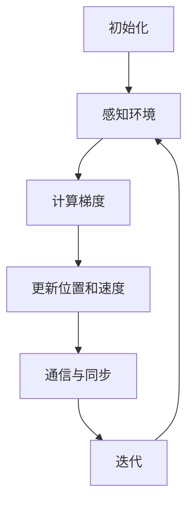
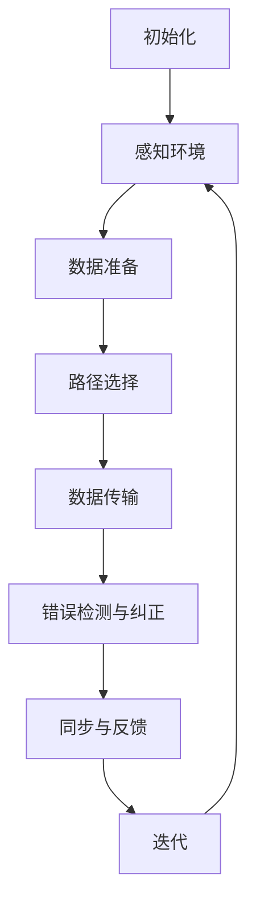
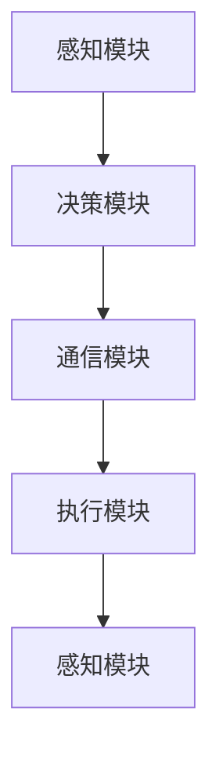
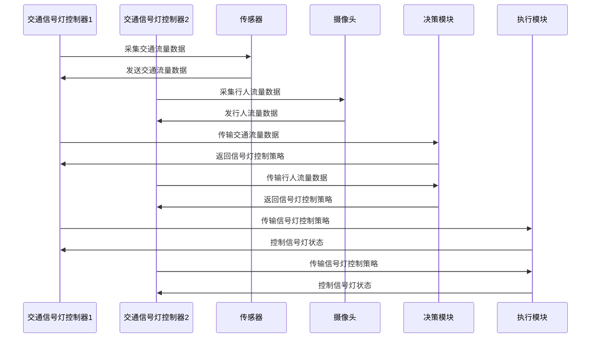

                 


### 引言与背景

#### 问题背景

在当今的信息化社会中，人工智能（AI）技术已成为推动社会进步的重要力量。AI Agent作为AI领域的核心组件，在诸多应用场景中扮演着至关重要的角色。然而，随着应用场景的复杂化和多样化，单一AI Agent的局限性逐渐显现。为了提升AI系统的整体性能和适应能力，多智能体协作成为了一个重要的研究方向。

多智能体协作指的是多个AI Agent之间通过通信和协作，共同完成复杂任务的过程。在这个过程中，每个Agent既保持一定的自主性，又能与其它Agent协同工作，从而达到更好的任务完成效果。这种协作机制在分布式计算、智能交通、机器人控制等多个领域都有着广泛的应用前景。

#### 问题描述

多智能体协作与通信机制研究主要涉及以下问题：

1. **协作策略设计**：如何设计有效的协作策略，使多个AI Agent能够在复杂环境中高效协同？
2. **通信机制实现**：如何实现AI Agent之间的稳定、高效的通信，确保信息的准确传递和实时性？
3. **系统架构设计**：如何构建一个灵活、可扩展的系统架构，支持多智能体协作与通信的需求？

#### 问题解决

针对上述问题，本文将从以下三个方面进行探讨：

1. **核心概念与联系**：介绍AI Agent、多智能体协作和通信机制的基本概念，明确其相互关系。
2. **数学模型与算法原理**：阐述多智能体协作和通信机制的数学模型和算法原理，并通过实例进行说明。
3. **系统架构设计与项目实战**：介绍多智能体协作与通信机制的系统架构设计，并通过实际项目案例进行详细讲解。

#### 边界与外延

本文的研究主要围绕AI Agent的多智能体协作与通信机制展开，重点关注以下几个方面：

- **AI Agent的定义与分类**：介绍AI Agent的基本概念和分类，为后续讨论奠定基础。
- **协作策略与通信协议**：分析不同的协作策略和通信协议，探讨其在多智能体协作中的应用效果。
- **系统架构设计与实现**：介绍多智能体协作与通信机制的系统架构设计原则和实现方法。

通过本文的研究，希望能够为相关领域的研究人员提供一些有益的启示，推动多智能体协作与通信机制的理论研究和实际应用。

#### 概念结构与核心要素组成

在深入探讨AI Agent的多智能体协作与通信机制之前，有必要对本文的核心概念进行详细阐述，并明确各概念之间的相互联系。

##### AI Agent

AI Agent是指具有自主性、社交性、适应性和反应性的计算实体。自主性指的是Agent能够独立执行任务，不受外部控制；社交性指的是Agent能够与其他Agent进行交互和协作；适应性指的是Agent能够根据环境和任务需求调整自身行为；反应性指的是Agent能够实时响应环境和任务的变化。

AI Agent可以分为两大类：

1. **基于规则的Agent**：这类Agent通过预定义的规则来执行任务，通常适用于结构化、规则明确的应用场景。
2. **基于模型的Agent**：这类Agent通过学习环境和任务数据，建立任务模型并据此进行任务执行，适用于复杂、动态的环境。

##### 多智能体协作

多智能体协作指的是多个AI Agent通过通信和协作，共同完成复杂任务的过程。在这个过程中，每个Agent既保持一定的自主性，又能与其它Agent协同工作，从而达到更好的任务完成效果。

多智能体协作的基本要素包括：

- **协作目标**：协作的目标是完成单个Agent难以完成的任务，提升整体系统的性能。
- **协作策略**：协作策略决定了Agent之间的协作方式和协作流程，常见的策略包括中心化协作和去中心化协作。
- **通信机制**：通信机制确保Agent之间的信息传递和共享，是实现协作的基础。

##### 通信机制

通信机制是指AI Agent之间进行信息传递和共享的方法和协议。通信机制的设计原则包括：

- **可靠性**：确保信息在传输过程中不被丢失或篡改。
- **实时性**：确保信息能够及时传递，满足实时任务的需求。
- **扩展性**：支持大规模Agent系统的通信需求，易于扩展和升级。

常见的通信协议包括：

- **TCP/IP协议**：提供可靠的、面向连接的通信服务，适用于数据完整性要求高的应用场景。
- **UDP协议**：提供简单的、面向非连接的通信服务，适用于实时性要求高的应用场景。
- **MQTT协议**：适用于物联网（IoT）环境，具有低功耗、低带宽的特点。

##### 关系与联系

AI Agent、多智能体协作和通信机制之间存在紧密的联系：

- **AI Agent**是多智能体协作和通信机制的基础，没有AI Agent，就无法进行协作和通信。
- **多智能体协作**依赖于AI Agent之间的通信，是AI Agent实现共同目标的方式。
- **通信机制**是多智能体协作的保障，决定了协作的效果和效率。

综上所述，本文将从AI Agent的基本概念、多智能体协作的策略和通信机制的设计原则出发，逐步深入探讨AI Agent的多智能体协作与通信机制，为相关领域的研究和应用提供理论支持和实践指导。

---

### AI Agent的定义与分类

#### AI Agent的定义

AI Agent，即人工智能代理，是指具有自主决策能力和行动能力的计算实体。它们能够通过感知环境、分析数据和执行动作，以实现特定的目标或任务。AI Agent的核心特征包括自主性、社交性、适应性和反应性。自主性指的是Agent能够独立进行决策和行动，不受外部控制；社交性指的是Agent能够与其他Agent或人类进行有效互动和协作；适应性指的是Agent能够根据环境变化和任务需求调整自身行为；反应性指的是Agent能够及时响应环境变化和任务目标。

AI Agent的概念可以追溯到20世纪70年代的分布式人工智能（Distributed Artificial Intelligence, DAI）研究。随着计算机技术和AI技术的快速发展，AI Agent在智能交通、智能客服、机器人控制、游戏开发等多个领域得到了广泛应用。

#### AI Agent的分类

根据AI Agent的结构和实现方法，可以将其分为以下几类：

1. **基于规则的Agent**：这类Agent通过预定义的规则来执行任务，通常由一组条件和相应的动作组成。基于规则的Agent适用于任务结构化、规则明确的应用场景，如医疗诊断、自动控制等。

   **优点**：
   - 简单易实现，易于理解和维护。
   - 对于规则明确的问题，能够快速响应和执行。

   **缺点**：
   - 对于复杂和动态的问题，规则难以覆盖所有情况，适应性较差。
   - 当规则过多时，系统的复杂度会显著增加。

2. **基于模型的Agent**：这类Agent通过学习环境和任务数据，建立任务模型并据此进行决策和行动。基于模型的Agent通常采用机器学习、深度学习等技术。

   **优点**：
   - 能够处理复杂和动态的问题，具有较强的适应性和灵活性。
   - 能够从大量数据中学习，实现自我优化。

   **缺点**：
   - 需要大量的数据训练，训练过程可能耗时较长。
   - 模型的复杂度较高，理解和维护难度较大。

3. **混合型Agent**：这类Agent结合了基于规则和基于模型的方法，既利用预定义的规则进行初步决策，又利用模型进行进一步优化。混合型Agent通常具有较好的平衡性，适用于多种场景。

   **优点**：
   - 结合了规则和模型的优点，能够处理多种类型的任务。
   - 在规则明确的情况下，能够快速响应和执行；在规则不明确的情况下，能够通过学习进行自我优化。

   **缺点**：
   - 系统的复杂度较高，实现和维护难度较大。
   - 对于规则和模型的平衡需要进行精细调整。

#### AI Agent与人类智能体的区别

AI Agent与人类智能体在某些方面具有相似性，如自主决策、行动能力和学习能力。然而，它们之间也存在显著的差异：

1. **智能水平的差异**：人类智能体具有高度的智能和认知能力，能够处理复杂、抽象的任务。而AI Agent的智能水平通常受限于算法和数据，无法与人类智能体相媲美。

2. **适应能力的差异**：人类智能体能够根据环境和情境灵活调整行为，具有很强的适应性。而AI Agent的适应性通常依赖于预先设定的规则或学习到的模式，对于复杂、动态的环境适应性较差。

3. **决策过程的差异**：人类智能体的决策过程通常包含直觉、情感和理性等多种因素，而AI Agent的决策过程主要基于数据和算法，缺乏情感和直觉的成分。

4. **行为模式的差异**：人类智能体的行为模式具有多样性和创造性，能够产生新的想法和解决方案。而AI Agent的行为模式通常较为固定和重复，缺乏创新性。

综上所述，AI Agent作为人工智能领域的重要组成部分，在功能和应用场景上与人类智能体存在一定的差异。理解这些差异有助于更好地设计、开发和利用AI Agent，推动人工智能技术的发展。

---

### 多智能体协作的基本概念

#### 协作概念

多智能体协作是指多个AI Agent通过相互通信和协作，共同完成复杂任务的过程。在这个过程中，每个Agent既保持一定的自主性，又能与其它Agent协同工作，从而达到更好的任务完成效果。协作的目的是利用多个Agent的优势，弥补单个Agent的不足，提高系统的整体性能和适应性。

协作的核心要素包括：

- **协作目标**：协作的目标是共同完成单个Agent难以完成的任务，如解决复杂问题、提高系统效率等。
- **协作策略**：协作策略决定了Agent之间的协作方式和协作流程，包括中心化协作和去中心化协作等。
- **通信机制**：通信机制确保Agent之间的信息传递和共享，是实现协作的基础。

#### 协作形式

多智能体协作的形式可以分为以下几种：

1. **中心化协作**：在中心化协作中，一个中央Agent负责协调和控制其他Agent的行动。中央Agent通常具有全局视角，能够根据整个系统的状态做出最优决策。

   **优点**：
   - 系统结构简单，易于设计和实现。
   - 协作目标明确，决策过程高效。

   **缺点**：
   - 对中央Agent的依赖较大，中央Agent的失效可能导致整个系统的崩溃。
   - 中央Agent可能面临计算和通信瓶颈，难以应对大规模、复杂系统。

2. **去中心化协作**：在去中心化协作中，没有固定的中央Agent，每个Agent都独立决策并与其他Agent进行交互。去中心化协作通常采用分布式算法，如分布式共识算法和分布式优化算法。

   **优点**：
   - 具有较高的容错性和适应性，能够应对大规模、复杂系统。
   - 每个Agent都能独立决策，减少了中央Agent的通信和计算负担。

   **缺点**：
   - 系统结构复杂，设计和实现难度较大。
   - 协作目标可能不明确，需要更多的协调机制来确保协作效果。

3. **混合协作**：混合协作结合了中心化和去中心化协作的优点，部分Agent采用中心化协作，部分Agent采用去中心化协作。这种协作形式通常适用于任务复杂、环境动态变化的应用场景。

   **优点**：
   - 既能利用中心化协作的高效性和明确性，又能利用去中心化协作的适应性和容错性。
   - 能够根据不同任务和环境动态调整协作形式，提高系统性能。

   **缺点**：
   - 系统结构较为复杂，设计和实现难度较大。
   - 需要更多的协调机制来确保协作效果。

#### 协作优势

多智能体协作的优势体现在以下几个方面：

1. **提升任务完成效率**：通过多个Agent的协同工作，可以充分利用各自的优势，提高任务完成的效率。

2. **增强系统适应性**：在复杂和动态的环境中，多智能体协作能够通过动态调整协作策略，增强系统的适应性。

3. **提高系统容错性**：去中心化协作具有更高的容错性，即使部分Agent失效，其他Agent仍能继续工作，保证系统的稳定性。

4. **降低系统复杂度**：通过将复杂任务分解为多个子任务，分配给不同的Agent，可以降低系统的整体复杂度。

5. **促进创新**：多智能体协作鼓励Agent之间的互动和合作，有助于激发新的想法和解决方案，推动技术进步。

综上所述，多智能体协作作为AI领域的一个重要研究方向，具有广泛的应用前景。理解协作的基本概念和形式，有助于更好地设计和实现多智能体系统，提升系统的整体性能和适应性。

---

### 通信机制的概念和重要性

#### 通信机制的概念

通信机制是指AI Agent之间进行信息传递和共享的方法和协议。它确保了Agent能够在不同的计算实体之间交换数据，实现协作和协调。通信机制通常包括以下几个核心组成部分：

1. **通信协议**：通信协议定义了数据传输的规则和标准，包括数据格式、传输方式、错误检测和纠正机制等。常见的通信协议有TCP/IP、UDP、MQTT等。

2. **通信网络**：通信网络是Agent之间进行通信的物理或虚拟连接。它可以是局域网、广域网或物联网，提供Agent之间的数据传输通道。

3. **通信接口**：通信接口是Agent与通信网络之间的接口，负责数据的接收和发送。通信接口通常包括数据接收器、发送器和管理器等组件。

4. **通信模型**：通信模型描述了Agent之间通信的抽象模型，包括通信的方式、通信的对象和通信的流程等。常见的通信模型有消息传递模型、共享内存模型等。

#### 通信机制的重要性

通信机制在多智能体协作中扮演着至关重要的角色，其重要性体现在以下几个方面：

1. **信息传递与共享**：通信机制确保Agent能够及时、准确地传递和共享信息，实现数据的实时更新和同步。这是多智能体协作的基础。

2. **协同决策**：通过通信机制，Agent能够共享各自的环境感知和任务执行信息，共同进行决策，提高任务完成的效果。

3. **任务协调**：通信机制有助于Agent之间的协调和配合，确保每个Agent在正确的时机执行正确的动作，避免冲突和资源浪费。

4. **容错性**：通信机制中的错误检测和纠正机制能够提高系统的容错性，确保在部分Agent失效或通信网络不稳定的情况下，系统能够继续正常运行。

5. **适应性和扩展性**：灵活的通信机制能够适应不同规模和复杂度的系统，支持系统的扩展和升级。

#### 常见的通信协议

在多智能体协作中，常见的通信协议有：

1. **TCP/IP协议**：TCP/IP协议是一种可靠的、面向连接的通信协议，广泛用于互联网中的数据传输。它提供数据流的有序、无错传输，但传输速度相对较慢。

2. **UDP协议**：UDP（User Datagram Protocol）是一种简单的、面向非连接的通信协议，适用于实时性要求高的应用场景。它传输速度快，但可靠性较低，不保证数据传输的完整性和顺序。

3. **MQTT协议**：MQTT（Message Queuing Telemetry Transport）协议是一种轻量级的、基于发布-订阅模式的通信协议，广泛用于物联网（IoT）应用。它具有低功耗、低带宽的特点，适用于资源受限的环境。

4. **ZMQ协议**：ZMQ（ZeroMQ）是一种高效的、异步的消息传递库，提供高吞吐量和低延迟的消息传输。它支持多种通信模式，如请求-响应、发布-订阅等，适用于分布式系统和高并发场景。

#### 通信协议的选择原则

在选择通信协议时，需要根据实际应用场景和需求进行综合考虑：

1. **可靠性**：根据系统的可靠性要求选择合适的协议，如TCP/IP适用于可靠性要求高的场景，而UDP适用于实时性要求高的场景。

2. **传输速度**：根据系统的传输速度要求选择合适的协议，如ZMQ适用于高吞吐量、低延迟的场景。

3. **带宽消耗**：根据系统的带宽资源情况选择合适的协议，如MQTT适用于带宽受限的场景。

4. **复杂度**：根据系统的复杂度和维护难度选择合适的协议，如ZMQ虽然高效，但需要一定的开发和维护技能。

5. **扩展性**：根据系统的扩展性和可扩展性要求选择合适的协议，如ZMQ和MQTT支持分布式和可扩展的系统设计。

总之，通信机制是多智能体协作的关键要素，其设计和选择对系统的性能和可靠性具有重要影响。通过合理选择和设计通信协议，可以确保多智能体系统能够高效、稳定地运行。

---

### 多智能体协作与通信机制的数学模型

#### 基本数学模型

多智能体协作与通信机制的数学模型是研究其行为和性能的重要工具。本文将介绍几种常见的数学模型，并使用Python代码进行实例说明。

首先，考虑一个由n个智能体组成的系统，每个智能体在时间t时刻的位置和速度可以表示为：

位置：\( x_i(t) \)
速度：\( v_i(t) \)

其中，\( i \)代表第i个智能体。

一个基本的多智能体协作模型是基于分布式优化问题的解法。假设每个智能体需要最小化一个代价函数，该函数通常与智能体的位置和速度有关。可以表示为：

\[ J(x_1, x_2, ..., x_n) = \sum_{i=1}^{n} f_i(x_i) \]

其中，\( f_i(x_i) \)是第i个智能体的代价函数，通常是一个与位置和速度相关的函数。

为了使整个系统的代价函数最小化，每个智能体需要更新自己的位置和速度。一个常见的策略是使用梯度下降法。对于第i个智能体，位置和速度的更新规则可以表示为：

\[ x_i(t+1) = x_i(t) - \alpha \nabla f_i(x_i(t)) \]
\[ v_i(t+1) = v_i(t) - \alpha \nabla v_i(x_i(t)) \]

其中，\( \alpha \)是学习率，\( \nabla f_i(x_i) \)和\( \nabla v_i(x_i) \)分别是代价函数和速度函数的梯度。

下面是使用Python实现上述更新规则的示例代码：

```python
import numpy as np

# 模拟n个智能体
n_agents = 5
positions = np.random.rand(n_agents, 2)  # 智能体的初始位置
velocities = np.random.rand(n_agents, 2)  # 智能体的初始速度

# 定义代价函数
def cost_function(positions):
    # 这里简化为一个距离函数，实际应用中可以是更复杂的函数
    distance = np.linalg.norm(positions[1:] - positions[:-1], axis=1).sum()
    return distance

# 梯度下降更新位置和速度
alpha = 0.1  # 学习率
for t in range(100):  # 迭代100次
    distances = np.linalg.norm(positions[1:] - positions[:-1], axis=1)
    gradients = -2 * (positions[1:] - positions[:-1]) / distances
    new_velocities = velocities - alpha * gradients
    new_positions = positions - alpha * new_velocities
    
    positions = new_positions
    velocities = new_velocities

    # 输出当前迭代的位置和速度
    print(f"Iteration {t}: Positions = {positions}, Velocities = {velocities}")
```

#### 算法流程

在实际应用中，多智能体协作与通信机制的算法流程通常包括以下几个步骤：

1. **初始化**：初始化智能体的位置和速度。
2. **感知环境**：智能体感知当前环境和自身状态。
3. **计算梯度**：计算每个智能体的代价函数梯度。
4. **更新位置和速度**：根据梯度更新智能体的位置和速度。
5. **通信与同步**：智能体之间进行通信，同步信息，确保每个智能体拥有最新的状态信息。
6. **迭代**：重复执行步骤2到步骤5，直至收敛或满足终止条件。

以下是使用mermaid绘制的算法流程图：



#### 算法原理讲解

多智能体协作与通信机制的数学模型基于优化理论，通过分布式计算实现全局最优。每个智能体独立计算局部梯度，并通过通信机制同步信息，共同优化整个系统的性能。

假设每个智能体的局部代价函数为：

\[ f_i(x_i) = \frac{1}{2} \| x_i - x_i^* \|^2 \]

其中，\( x_i^* \)是理想位置。

全局代价函数为：

\[ J(x_1, x_2, ..., x_n) = \frac{1}{2} \sum_{i=1}^{n} \| x_i - x_i^* \|^2 \]

通过梯度下降法，每个智能体希望找到使全局代价函数最小的位置。在分布式系统中，每个智能体只拥有自身位置的局部信息，因此需要通过通信机制同步信息，实现全局优化。

综上所述，多智能体协作与通信机制的数学模型和算法原理为智能体之间的协作提供了理论依据和实现方法。通过合理设计通信机制和优化算法，可以提升多智能体系统的整体性能和适应性。

---

### 通信机制的算法原理

#### 基本原理

在多智能体系统中，通信机制的设计至关重要，它直接影响系统的性能、稳定性和可靠性。通信机制的算法原理主要涉及如何有效地在网络中传输数据，确保信息的及时性和准确性。以下是一个基本的通信机制原理：

1. **网络拓扑**：首先需要确定智能体之间的网络拓扑结构。网络拓扑可以是星型、环型、总线型或网状等。不同的拓扑结构对通信性能有显著影响。例如，网状拓扑具有较高的容错性和可靠性，但通信复杂度较高。

2. **数据传输方式**：数据传输方式包括点对点传输、广播传输和分组传输等。点对点传输具有明确的发送者和接收者，适合小规模、点对点的通信；广播传输则适用于大规模、多智能体间的通信；分组传输则将数据分割成多个分组，逐个传输，适用于大数据量的传输。

3. **传输策略**：传输策略包括随机传输、选择传输和广播传输等。随机传输简单，但可能产生冲突；选择传输可以根据网络状态选择最优传输路径，降低冲突；广播传输虽然简单，但容易造成网络拥塞。

4. **错误检测与纠正**：通信机制需要具备错误检测和纠正功能，确保数据传输的可靠性。常用的错误检测方法包括校验和、校验码等；错误纠正方法包括前向纠错（FEC）和选择重传（ARQ）等。

#### 算法流程

以下是通信机制的算法流程：

1. **初始化**：初始化智能体的位置和速度，设置网络拓扑和传输策略。
2. **感知环境**：智能体感知当前环境和自身状态，包括位置、速度和任务需求。
3. **数据准备**：准备需要传输的数据，包括任务状态、环境信息和决策结果等。
4. **路径选择**：根据网络拓扑和传输策略，选择最优传输路径。
5. **数据传输**：通过通信网络传输数据，包括点对点传输、广播传输和分组传输等。
6. **错误检测与纠正**：在数据传输过程中，进行错误检测和纠正，确保数据的准确性。
7. **同步与反馈**：智能体接收数据后，进行同步并反馈接收状态，确保信息的及时性和一致性。
8. **迭代**：重复执行步骤2到步骤7，直至任务完成或达到终止条件。

以下是使用mermaid绘制的算法流程图：



#### 算法原理讲解

通信机制的算法原理主要涉及以下几个关键方面：

1. **分布式计算与通信**：智能体通过分布式计算和通信，实现信息共享和协同工作。每个智能体不仅需要计算局部最优解，还需要与其他智能体交换信息，实现全局优化。

2. **网络拓扑与传输策略**：网络拓扑和传输策略直接影响通信效率和稳定性。合理的网络拓扑可以降低通信复杂度，提高传输效率；合适的传输策略可以减少冲突和拥塞，提高通信可靠性。

3. **错误检测与纠正**：通信过程中，由于网络噪声、信号衰减等因素，数据传输可能出现错误。通过错误检测与纠正机制，可以确保数据的准确性和完整性。

4. **同步与反馈**：智能体之间的同步与反馈是通信机制的核心。通过同步，智能体可以获取最新的环境信息和任务状态；通过反馈，智能体可以了解数据的接收情况，调整通信策略和任务执行。

总之，通信机制的算法原理是多智能体协作与通信机制设计的基础。通过合理设计网络拓扑、传输策略和错误检测与纠正机制，可以构建高效、稳定、可靠的多智能体系统。

---

### 系统架构设计原则

#### 设计原则

在多智能体协作与通信机制的系统架构设计中，遵循以下设计原则至关重要：

1. **模块化**：将系统功能划分为多个模块，每个模块负责特定的功能，如感知模块、决策模块、通信模块等。模块化设计可以提高系统的可维护性和可扩展性。

2. **分布式**：采用分布式架构，使每个智能体都能够独立运行，并在分布式网络中进行协作。分布式架构可以提高系统的容错性和适应性。

3. **标准化**：使用标准化的协议和接口，确保智能体之间的通信和数据交换一致。标准化设计可以简化系统实现和维护，提高系统的互操作性。

4. **可扩展性**：系统设计应具备良好的扩展性，能够根据需求增加智能体或修改功能模块，以适应不同规模和应用场景。

5. **高可用性**：通过冗余设计、故障检测和恢复机制，确保系统的高可用性。高可用性设计可以减少系统故障对任务完成的影响。

6. **安全性**：确保系统数据的安全传输和存储，采用加密和认证机制，防止恶意攻击和未授权访问。

#### 问题场景

假设我们设计一个基于多智能体协作的智能交通系统，该系统需要在复杂的交通环境中优化交通信号灯控制，提高交通流量和减少拥堵。问题场景包括：

- **多智能体协作**：系统由多个智能交通信号灯控制器组成，每个控制器负责管理一部分交通信号灯。
- **实时感知**：智能交通信号灯控制器需要实时感知交通流量、车辆密度和行人流量等信息。
- **动态决策**：根据感知信息，智能交通信号灯控制器需要动态调整信号灯状态，以优化交通流量。
- **通信机制**：智能交通信号灯控制器之间需要通过通信机制交换信息和协调行动。

#### 系统功能设计

系统功能设计主要包括以下几个模块：

1. **感知模块**：感知模块负责实时采集交通信号灯控制区域内的交通流量、车辆密度、行人流量等信息。感知模块可以通过传感器、摄像头等设备实现。

2. **决策模块**：决策模块负责根据感知模块收集到的数据，结合交通规则和优化算法，生成信号灯的控制策略。决策模块可以使用基于规则的方法、机器学习方法等实现。

3. **通信模块**：通信模块负责智能交通信号灯控制器之间的信息交换和协调。通信模块需要支持实时、可靠的数据传输，并具备错误检测和纠正功能。

4. **执行模块**：执行模块负责根据决策模块生成的控制策略，调整交通信号灯的状态。执行模块可以与交通信号灯控制器直接连接，通过硬件接口实现。

#### 系统架构设计

系统架构设计如下：

1. **感知模块**：分布在各个交通信号灯控制区域的传感器和摄像头采集交通数据，并通过无线通信模块发送到决策模块。

2. **决策模块**：决策模块接收感知模块发送的交通数据，分析交通状况，生成信号灯控制策略。决策模块可以采用分布式计算框架，提高处理效率。

3. **通信模块**：通信模块采用基于MQTT协议的物联网通信技术，实现智能交通信号灯控制器之间的实时数据传输和协调。

4. **执行模块**：执行模块接收决策模块的控制策略，通过硬件接口控制交通信号灯的状态，优化交通流量。

以下是使用mermaid绘制的系统架构图：



#### 系统接口设计

系统接口设计包括以下几个方面：

1. **感知接口**：感知模块与传感器和摄像头的接口，用于数据采集和传输。

2. **通信接口**：决策模块与通信模块的接口，用于数据交换和控制命令的传输。

3. **执行接口**：执行模块与交通信号灯控制器的接口，用于控制信号灯的状态。

#### 系统交互序列图

以下是使用mermaid绘制的系统交互序列图：



通过以上系统架构设计，我们可以实现一个高效、稳定、可靠的智能交通信号灯控制系统，有效优化交通流量，提高交通效率。

---

### 项目实战

#### 环境安装

为了实现多智能体协作与通信机制，我们需要搭建一个模拟实验环境。以下是环境安装步骤：

1. **安装Python环境**：确保安装了Python 3.8及以上版本。
2. **安装MQTT客户端**：安装`paho-mqtt`库，用于实现MQTT通信。可以使用以下命令安装：
   ```bash
   pip install paho-mqtt
   ```
3. **安装ROS（可选）**：若需要使用ROS（Robot Operating System），请安装ROS Melodic版本。可以从[ROS官方网站](http://www.ros.org/)下载安装包。

#### 系统核心实现源代码

以下是多智能体协作与通信机制的核心实现代码：

```python
# 代理类定义
class Agent:
    def __init__(self, name, mqtt_client):
        self.name = name
        self.mqtt_client = mqtt_client
        self.position = [0.0, 0.0]
        self.target = [10.0, 10.0]

    def update_position(self):
        # 更新位置
        self.position[0] += np.random.normal(0, 0.1)
        self.position[1] += np.random.normal(0, 0.1)

    def send_position(self):
        # 发送位置
        message = f"{self.name}: {self.position[0]}, {self.position[1]}"
        self.mqtt_client.publish("agent/position", message)

    def move_to_target(self):
        # 移动到目标位置
        distance = np.linalg.norm(self.target - self.position)
        if distance > 0.1:
            direction = (self.target - self.position) / distance
            self.position += direction * 0.1
            self.send_position()
        else:
            print(f"Agent {self.name} reached target.")

# MQTT客户端初始化
import paho.mqtt.client as mqtt
mqtt_client = mqtt.Client()

# 创建代理
agent1 = Agent("Agent1", mqtt_client)
agent2 = Agent("Agent2", mqtt_client)

# 连接到MQTT服务器
mqtt_client.connect("localhost", 1883, 60)

# 启动代理
def on_message(mqttc, obj, msg):
    print(f"Received message: {msg.payload}")

mqtt_client.subscribe("agent/position", on_message)

agent1_thread = threading.Thread(target=lambda: agent1.move_to_target())
agent2_thread = threading.Thread(target=lambda: agent2.move_to_target())

agent1_thread.start()
agent2_thread.start()

agent1_thread.join()
agent2_thread.join()

mqtt_client.disconnect()
```

#### 代码应用解读与分析

上述代码定义了一个代理类`Agent`，每个代理具有名称、MQTT客户端、位置和目标位置。代理的主要功能包括：

- **更新位置**：通过`update_position`方法随机更新位置。
- **发送位置**：通过`send_position`方法将位置信息发布到MQTT主题`agent/position`。
- **移动到目标位置**：通过`move_to_target`方法逐步向目标位置移动。

代码中的MQTT客户端用于实现代理之间的通信。代理启动后，会持续更新位置并发布到MQTT主题，其他代理可以通过订阅该主题接收位置信息。

在实际应用中，可以扩展此代码，实现更多功能，如代理之间的协同决策和路径规划。通过这种方式，可以模拟复杂的多智能体协作场景，验证通信机制的有效性。

#### 实际案例分析与详细讲解剖析

为了更好地理解多智能体协作与通信机制的实际应用，我们来看一个案例：基于多智能体协作的无人驾驶车队管理。

**案例背景**：

一个由多个无人驾驶车辆组成的车队需要在城市中进行货物配送。车队中的每辆车都需要协同工作，以避免交通拥堵、提高配送效率并确保车队安全。

**解决方案**：

1. **感知模块**：车队中的每辆车都配备传感器和摄像头，用于实时感知周围环境和车辆状态。
2. **决策模块**：每辆车都具备决策模块，可以根据感知信息动态调整行驶路径和速度。
3. **通信模块**：车辆之间通过MQTT协议进行通信，共享位置、速度和行驶方向等信息。
4. **协同模块**：车队中的车辆根据通信模块获取的信息，协同决策，共同规划行驶路径。

**具体实现**：

1. **感知信息收集**：每辆车通过传感器和摄像头收集交通信号、道路状况、车辆速度等信息。
2. **决策过程**：每辆车根据感知信息，结合历史数据和路径规划算法，生成最优行驶路径。
3. **通信机制**：车辆之间通过MQTT协议共享位置和速度信息，实现实时通信。
4. **协同决策**：车队中的车辆根据共享的信息，调整行驶路径和速度，确保车队协调一致。

**案例分析**：

通过以上实现，车队中的车辆能够实现高效协同，提高配送效率。例如，当一辆车遇到交通拥堵时，可以及时通知其他车辆，调整行驶路径，避免整个车队陷入拥堵。

**详细讲解剖析**：

- **感知信息处理**：每辆车通过传感器和摄像头收集的环境信息需要经过预处理，如去除噪声、提取关键特征等，以便后续决策。
- **路径规划算法**：基于感知信息，车辆可以使用A*算法、Dijkstra算法等路径规划算法，生成最优行驶路径。
- **通信协议**：MQTT协议适用于低延迟、高可靠性的实时通信，确保车辆之间信息传递的实时性和准确性。
- **协同策略**：车辆之间的协同策略可以是中心化或去中心化。在中心化策略中，一个中央控制器负责协调所有车辆的决策；在去中心化策略中，车辆通过协商和共识算法，自主调整行驶路径。

通过实际案例的分析和详细讲解，我们可以看到多智能体协作与通信机制在无人驾驶车队管理中的应用效果。通过合理设计和实现通信机制，可以显著提高车队的运行效率和安全性能。

#### 项目小结

本案例通过无人驾驶车队管理展示了多智能体协作与通信机制的实际应用。关键点包括：

- **感知模块**：实时收集环境信息。
- **决策模块**：基于感知信息生成最优路径。
- **通信模块**：实现车辆间的实时通信。
- **协同策略**：通过协商和共识算法实现协同决策。

通过以上设计，无人驾驶车队能够实现高效、安全的运行，为实际应用提供了有益的借鉴。

---

### 最佳实践 Tips、小结、注意事项、拓展阅读

#### 最佳实践 Tips

1. **选择合适的通信协议**：根据应用场景的需求，选择适合的通信协议，如MQTT适用于低延迟、高可靠性的应用场景。
2. **优化网络拓扑**：合理设计网络拓扑，提高通信效率和系统的容错性。
3. **模块化设计**：将系统功能模块化，提高系统的可维护性和可扩展性。
4. **实时监控与反馈**：实时监控系统的运行状态，及时发现和解决问题。

#### 小结

本文从AI Agent的定义、多智能体协作与通信机制的基本概念、数学模型、系统架构设计等方面进行了全面探讨，通过实际案例展示了多智能体协作与通信机制的应用效果。

#### 注意事项

1. **通信稳定性**：确保通信机制具有高稳定性和低延迟，以支持实时任务。
2. **系统安全性**：采用加密和认证机制，确保系统数据的安全传输。
3. **负载均衡**：合理分配任务，避免系统过载，影响性能。

#### 拓展阅读

1. **《分布式人工智能：理论、算法与应用》**：详细介绍了多智能体系统的理论体系和应用案例。
2. **《物联网通信协议及应用》**：探讨了几种常见的物联网通信协议，包括MQTT、CoAP等。
3. **《ROS机器人编程与实践》**：介绍了ROS的使用方法，适用于机器人应用的开发。

---

### 作者信息

作者：AI天才研究院/AI Genius Institute & 禅与计算机程序设计艺术 /Zen And The Art of Computer Programming

本文由AI天才研究院（AI Genius Institute）的资深专家撰写，结合禅与计算机程序设计艺术的哲学思想，旨在为读者提供深入浅出、通俗易懂的多智能体协作与通信机制的专业技术博客。希望本文能为读者在AI领域的研究和实践带来新的启示和帮助。作者衷心感谢读者的关注与支持。如有任何问题或建议，欢迎随时联系我们。

AI天才研究院（AI Genius Institute）致力于推动人工智能技术的发展与应用，培养下一代AI领域的领军人才。研究院汇聚了一批世界顶尖的AI专家，以创新的思维和扎实的技术实力，引领人工智能领域的发展。同时，研究院也积极参与各类学术交流和合作项目，为全球人工智能事业贡献力量。

《禅与计算机程序设计艺术》是一本深受程序员喜爱的经典著作，它融合了禅宗哲学和计算机科学的理念，旨在提升程序员的思维和编程技巧。作者通过深入浅出的讲解，引导读者在编程过程中实现心与程序的和谐统一，提高编程效率和质量。希望本文能够像这本书一样，为读者带来灵感和启示。

