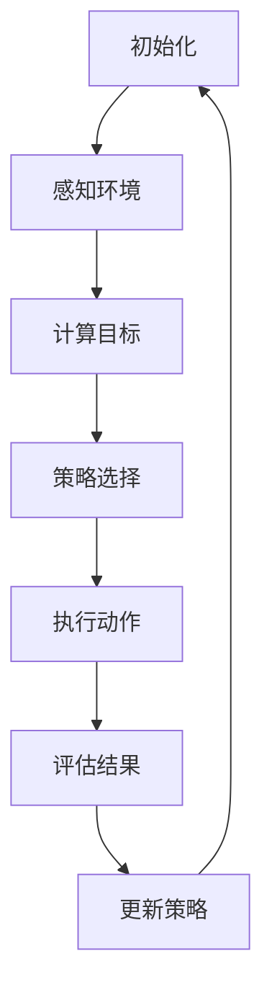

                 

### 引言

#### 1.1 问题背景与概述

在当今信息时代，人工智能（AI）技术正以前所未有的速度发展，其中，智能体（Agent）作为AI的核心构成部分，正逐步渗透到各个行业。随着多智能体系统的兴起，如何实现智能体之间的协作决策成为一个亟待解决的问题。多智能体协作决策系统（Multi-Agent Collaboration Decision System, MACDS）是一种通过多个智能体相互协作来实现复杂任务的新型决策系统。

在实际应用中，多智能体协作决策系统广泛应用于工业自动化、自动驾驶、虚拟现实等领域。例如，在自动驾驶系统中，多个智能体需要协同工作，共同完成车辆导航、环境感知和决策控制等任务。然而，实现多智能体协作面临着诸多挑战，包括系统复杂性、协调与通信问题以及安全与隐私问题等。

本文旨在探讨多智能体协作决策系统的基础理论、核心算法及应用，旨在为读者提供一个全面、系统的理解，帮助其在实际应用中更好地利用多智能体协作决策系统。

#### 1.2 多智能体系统的定义与特点

多智能体系统（Multi-Agent System, MAS）是由多个智能体组成的系统，这些智能体可以相互协作或相互竞争，共同完成复杂的任务。智能体是具有感知、决策和执行能力的实体，可以是一个物理实体（如机器人）、一个软件程序（如聊天机器人）或是一个虚拟实体（如游戏中的角色）。

多智能体系统的核心特点包括：

1. **分布式计算**：多智能体系统中的智能体可以分布在不同的物理位置或不同的计算节点上，它们通过相互通信来实现协同工作，这使得系统具有很高的容错性和扩展性。
2. **自主性**：每个智能体都有一定的自主性，可以独立地感知环境、做出决策和执行动作，这使得系统能够适应动态变化的环境。
3. **适应性**：多智能体系统能够根据环境的变化和任务的需求，自主地调整其行为和策略，从而提高系统的适应能力。
4. **协调性**：智能体之间需要通过通信和协作来协调各自的行为，以实现整体目标。

与传统单智能体系统相比，多智能体系统具有以下优势：

1. **任务复杂度**：多智能体系统可以处理更为复杂和大规模的任务，例如，在自动驾驶系统中，多个智能体可以同时处理导航、环境感知和决策控制等多个任务。
2. **冗余性**：多智能体系统中的智能体可以相互备份，提高系统的可靠性和容错性。
3. **可扩展性**：多智能体系统可以轻松地扩展到更多的智能体，以适应不同的应用场景。

#### 1.3 多智能体协作的重要性

多智能体协作在多智能体系统中的作用至关重要。协作与竞争是智能体之间的两种基本交互方式，而协作在多智能体系统中的应用更加广泛和重要。

1. **协同任务完成**：在多智能体系统中，许多任务需要多个智能体共同协作才能完成。例如，在工业自动化领域，多个机器人需要协同工作，共同完成生产任务；在自动驾驶领域，多个智能体需要协作完成导航、环境感知和决策控制等任务。
2. **优化决策效果**：通过协作，智能体可以共享信息和资源，从而优化各自的决策效果。例如，在资源分配问题中，多个智能体可以通过协作来优化资源的分配，提高整体效益。
3. **提高系统适应性**：协作使得智能体能够更好地适应动态变化的环境。当环境发生变化时，智能体可以通过协作来调整其行为和策略，从而提高系统的适应能力。

协作的优势体现在以下几个方面：

1. **提高效率**：通过协作，智能体可以共享信息和资源，从而减少重复劳动，提高系统的整体效率。
2. **降低成本**：协作可以减少单个智能体在完成任务时的资源消耗，降低系统的整体成本。
3. **提高可靠性**：智能体之间的协作可以相互备份，提高系统的可靠性和容错性。
4. **增强适应能力**：协作使得智能体能够更好地适应动态变化的环境，提高系统的整体适应性。

#### 1.4 多智能体协作的应用领域

多智能体协作在多个领域都展现出了广泛的应用潜力，以下是一些典型的应用领域：

1. **工业自动化**：在工业生产中，多个机器人可以通过协作来完成复杂的制造任务，提高生产效率和产品质量。
2. **虚拟现实与增强现实**：在虚拟现实和增强现实系统中，多个智能体可以共同创建和互动虚拟环境，提供更加沉浸式的用户体验。
3. **游戏与娱乐**：在多人游戏中，多个智能体可以共同参与游戏，提供更加丰富和有趣的互动体验。
4. **自驾驶汽车**：在自动驾驶系统中，多个智能体需要协作完成导航、环境感知和决策控制等任务，以确保行车安全。
5. **网络安全**：在网络安全领域，多个智能体可以共同监控网络流量，识别和防御网络攻击，提高网络的安全性。

#### 1.5 多智能体协作面临的挑战

尽管多智能体协作具有广泛的应用前景，但在实际应用中，它也面临着一系列挑战：

1. **系统复杂性**：多智能体系统通常具有复杂的结构，涉及到多个智能体之间的相互依赖和交互，这使得系统的设计和实现变得更加复杂。
2. **协调与通信问题**：智能体之间的协调与通信是多智能体协作的关键，但在实际应用中，通信延迟、网络中断和数据丢失等问题都会影响智能体之间的协作效果。
3. **安全与隐私问题**：在多智能体系统中，智能体之间的通信和协作涉及到大量的敏感信息，如何确保系统的安全性和隐私性是一个重要的挑战。
4. **任务分配与调度**：如何合理地分配任务和调度智能体的行为是一个复杂的问题，需要考虑到任务的优先级、智能体的能力和负载均衡等因素。

#### 1.6 本章小结

本章介绍了多智能体协作决策系统的背景、定义、重要性以及应用领域和面临的挑战。多智能体协作决策系统作为一种新兴的决策系统，具有分布式计算、自主性、适应性和协调性等核心特点，其在工业自动化、自动驾驶、虚拟现实等领域展现出了广泛的应用潜力。然而，实现多智能体协作也面临着系统复杂性、协调与通信问题、安全与隐私问题以及任务分配与调度等挑战。在接下来的章节中，我们将进一步探讨多智能体协作的核心概念、原理和算法，以期为解决这些问题提供理论支持和实践指导。

## 第二部分：多智能体协作原理

多智能体协作是现代人工智能技术中的一个关键研究领域，其核心在于多个智能体如何通过相互协作来实现共同目标。本部分将深入探讨多智能体协作的核心概念、原理和算法，为读者提供一个系统、全面的了解。

### 第2章：多智能体协作核心概念与联系

#### 2.1 多智能体协作的核心概念

多智能体协作涉及多个核心概念，包括智能体、环境、协作协议和协作策略。以下是这些概念的定义及其在协作系统中的作用：

1. **智能体（Agent）**：智能体是具有感知、决策和执行能力的实体。在多智能体系统中，智能体可以是物理实体、软件程序或虚拟实体。智能体的基本功能包括感知环境、执行任务和与其他智能体进行通信。

2. **环境（Environment）**：环境是多智能体协作的背景，包括智能体所在的空间和系统中的其他因素。环境为智能体提供感知信息，并影响智能体的行为。

3. **协作协议（Collaboration Protocol）**：协作协议是多智能体之间进行协作的规则和规范。这些协议定义了智能体之间的通信机制、任务分配策略和协作目标。协作协议的目的是确保智能体能够高效、协调地完成任务。

4. **协作策略（Collaboration Strategy）**：协作策略是指智能体在协作过程中采取的行动方案。协作策略可以根据环境的变化和任务的需求进行动态调整，以实现最优的协作效果。

#### 2.2 多智能体协作原理

多智能体协作的原理主要包括以下几个核心方面：

1. **分散决策原理**：分散决策原理是指每个智能体在协作系统中拥有独立的决策能力，可以根据自身感知的信息和环境状态独立做出决策。分散决策可以减少系统的集中化风险，提高系统的适应性和容错性。

2. **多智能体系统稳定性和同步**：稳定性和同步是多智能体协作的关键。智能体之间的协作需要确保系统能够在一定条件下保持稳定状态，并实现同步。这通常需要智能体之间的有效通信和协调。

3. **信息共享与博弈论**：信息共享是多智能体协作的基础。智能体之间需要共享感知信息、决策结果和行动计划，以实现更好的协作效果。博弈论提供了一种分析智能体之间策略交互和协作效果的工具，可以帮助设计有效的协作策略。

#### 2.3 多智能体协作的概念属性特征对比表格

为了更好地理解多智能体协作的概念，我们可以通过一个表格来对比各个核心概念的特征：

| 概念     | 定义                                                         | 特征                                       |
|----------|--------------------------------------------------------------|------------------------------------------|
| 智能体   | 具有感知、决策和执行能力的实体                                 | 独立性、自主性、适应性                     |
| 环境     | 智能体所在的空间和系统中的其他因素                             | 动态性、多样性、不确定性                   |
| 协作协议 | 定义智能体之间通信机制、任务分配策略和协作目标的规则和规范   | 一致性、高效性、适应性                     |
| 协作策略 | 智能体在协作过程中采取的行动方案                               | 动态调整、优化目标、协同效应               |

#### 2.4 多智能体协作的ER实体关系图

实体关系图（Entity-Relationship Diagram, ERD）是一种用于描述实体及其之间关系的数据库模型。在多智能体协作系统中，我们可以使用ERD来描述智能体、环境、协作协议和协作策略之间的关系。以下是一个简化的ERD示例：

```mermaid
erDiagram
    AI_Agent ||--|{ Collaboration: } Collaboration
    Collaboration ||--|{ Agent_Operation } Agent_Operation
    Agent_Operation ||--|{ Environment_Assessment } Environment_Assessment
```

在这个ERD中，`AI_Agent`表示智能体，`Collaboration`表示协作，`Agent_Operation`表示智能体的操作，`Environment_Assessment`表示对环境的评估。这种关系图有助于我们理解多智能体协作系统中各个实体之间的相互作用。

#### 2.5 多智能体协作算法原理讲解

多智能体协作算法是多智能体协作系统的核心组成部分，用于指导智能体如何通过协作来实现共同目标。以下是多智能体协作算法的基本原理、流程图和数学模型。

##### 2.5.1 算法概述

多智能体协作算法通常包括以下几个基本步骤：

1. **初始化**：智能体初始化其状态和参数。
2. **感知环境**：智能体感知当前环境，获取环境信息。
3. **计算目标**：智能体根据当前环境和任务需求，计算其目标。
4. **策略选择**：智能体根据目标和环境信息选择合适的策略。
5. **执行动作**：智能体根据策略执行具体动作。
6. **评估结果**：智能体评估动作的结果，更新状态和策略。
7. **更新策略**：智能体根据评估结果更新策略，以实现优化目标。

以下是一个简单的多智能体协作算法的mermaid流程图：



##### 2.5.2 算法原理的数学模型和公式

多智能体协作算法的数学模型通常包括以下核心部分：

1. **目标函数**：目标函数用于衡量智能体的任务完成情况。一个常见的目标函数是：

   $$
   \text{目标函数} = \sum_{i=1}^{n} \alpha_i \cdot f_i
   $$

   其中，$n$表示智能体的数量，$\alpha_i$表示第$i$个智能体的权重，$f_i$表示第$i$个智能体的任务完成情况。

2. **状态空间**：状态空间表示智能体可能的状态集合。状态空间可以表示为：

   $$
   \text{状态空间} = S
   $$

   其中，$S$表示状态集合。

3. **动作空间**：动作空间表示智能体可以执行的动作集合。动作空间可以表示为：

   $$
   \text{动作空间} = A
   $$

   其中，$A$表示动作集合。

4. **策略**：策略是智能体根据状态选择动作的方案。策略可以表示为：

   $$
   \text{策略} = \sigma(s)
   $$

   其中，$\sigma$表示策略函数，$s$表示状态。

5. **评估函数**：评估函数用于评估智能体的动作效果。一个常见的评估函数是：

   $$
   \text{评估函数} = v(s, a)
   $$

   其中，$v$表示评估函数，$s$表示状态，$a$表示动作。

通过这些数学模型，我们可以设计出具体的协作算法，指导智能体如何通过协作来实现共同目标。

#### 2.6 多智能体协作的算法类型

多智能体协作算法可以分为以下几种类型：

1. **分布式算法**：分布式算法将任务分配给多个智能体，每个智能体独立地执行局部任务，并通过协作协议共享信息，以实现全局目标。

2. **集中式算法**：集中式算法将任务集中到一个中心控制器上，控制器根据全局信息生成决策，并分发给各个智能体执行。

3. **混合算法**：混合算法结合了分布式和集中式算法的优点，将任务分配给多个智能体，并在关键决策点上集中控制。

4. **基于模型的算法**：基于模型的算法使用模型来预测智能体行为和环境变化，以优化协作策略。

5. **基于学习的算法**：基于学习的算法使用机器学习技术来优化协作策略，通过数据驱动的方式来提高协作效率。

#### 2.7 多智能体协作系统实例分析

为了更好地理解多智能体协作算法的应用，我们来看一个简单的实例：多智能体搜救任务。

在这个实例中，一个搜救队伍由多个无人机组成，每个无人机都是一个智能体。任务目标是找到并营救被困人员。以下是多智能体协作算法在搜救任务中的应用：

1. **初始化**：每个无人机初始化其位置和传感器状态。
2. **感知环境**：每个无人机扫描周围环境，收集地形信息、障碍物位置和被困人员的位置。
3. **计算目标**：每个无人机根据收集到的信息计算其目标，例如，确定最佳路径或识别潜在的危险区域。
4. **策略选择**：每个无人机根据计算出的目标和协作协议选择合适的飞行路径。
5. **执行动作**：每个无人机按照选定的策略执行飞行任务。
6. **评估结果**：每个无人机评估其飞行结果，并根据评估结果调整其策略。
7. **更新策略**：无人机根据评估结果和协作协议更新其策略，以实现最佳协作效果。

通过这个实例，我们可以看到多智能体协作算法如何应用于实际任务中，实现多个智能体的协同工作，提高任务完成效率。

#### 2.8 本章小结

本章详细探讨了多智能体协作的核心概念、原理和算法。多智能体协作涉及智能体、环境、协作协议和协作策略等核心概念，通过分散决策、信息共享和策略优化等原理，实现了智能体之间的高效协作。本章还介绍了多智能体协作的不同算法类型，并通过实例展示了算法在搜救任务中的应用。在下一章中，我们将继续深入探讨多智能体协作算法的实现细节和优化方法。

### 第3章：多智能体协作算法原理讲解

#### 3.1 算法概述

多智能体协作算法是设计多个智能体如何相互协作以完成共同任务的核心工具。这些算法的目标是确保智能体在动态和不确定的环境中有效地协作，从而提高系统的整体性能和任务完成效率。在本节中，我们将对多智能体协作算法进行概述，包括其定义、目标、主要类型和常见算法。

##### 3.1.1 算法定义

多智能体协作算法是一系列用于指导多个智能体如何相互协作以实现共同目标的规则和流程。这些算法通常包括以下关键组成部分：

1. **初始化**：初始化智能体的初始状态和参数。
2. **感知环境**：智能体通过传感器收集环境信息。
3. **目标设定**：智能体根据当前环境和任务需求设定目标。
4. **策略选择**：智能体根据当前状态和目标选择合适的策略。
5. **执行动作**：智能体根据策略执行具体动作。
6. **评估结果**：智能体评估动作的效果，并根据评估结果调整策略。
7. **策略更新**：智能体根据评估结果更新策略，以优化未来行为。

##### 3.1.2 算法目标

多智能体协作算法的主要目标是实现以下几个目标：

1. **高效性**：通过优化策略选择，提高系统整体的任务完成效率。
2. **鲁棒性**：确保系统能够在不确定和动态环境中稳定运行。
3. **适应性**：智能体能够根据环境变化和任务需求动态调整策略。
4. **可扩展性**：算法能够适应不同规模和复杂度的任务场景。

##### 3.1.3 算法类型

多智能体协作算法可以根据不同的分类标准进行分类，常见的分类方法包括：

1. **基于通信的算法**：这类算法强调智能体之间的通信和协调，如基于消息传递的算法和基于协商的算法。
2. **基于学习的算法**：这类算法利用机器学习技术来优化智能体的策略选择，如强化学习算法和基于模型的强化学习算法。
3. **分布式算法**：这类算法通过分散的方式分配任务和决策，如分布式规划算法和分布式协调控制算法。
4. **集中式算法**：这类算法将任务和决策集中到一个中心实体上，如集中式规划算法和集中式控制算法。
5. **混合算法**：这类算法结合了分布式和集中式算法的优点，适用于复杂的任务场景。

#### 3.2 算法mermaid流程图

为了直观地展示多智能体协作算法的流程，我们可以使用mermaid绘制一个流程图。以下是一个简化的多智能体协作算法流程图：


在这个流程图中，每个智能体依次执行以下步骤：

1. **初始化**：智能体初始化其状态和参数。
2. **感知环境**：智能体通过传感器收集环境信息。
3. **计算目标**：智能体根据当前环境和任务需求计算目标。
4. **策略选择**：智能体根据目标选择合适的策略。
5. **执行动作**：智能体根据策略执行具体动作。
6. **评估结果**：智能体评估动作的效果。
7. **更新策略**：智能体根据评估结果更新策略，以优化未来行为。

#### 3.3 算法原理的数学模型和公式

多智能体协作算法的数学模型用于描述智能体之间的交互和协作过程。以下是一个简单的数学模型，用于说明多智能体协作算法的基本原理：

$$
\begin{aligned}
    &\text{目标函数} &= \sum_{i=1}^{n} \alpha_i \cdot f_i \\
    &\text{状态空间} &= S \\
    &\text{动作空间} &= A \\
    &\text{策略} &= \sigma(s) \\
    &\text{评估函数} &= v(s, a)
\end{aligned}
$$

其中：

- **目标函数**（Objective Function）：目标函数用于衡量智能体的任务完成情况。它是一个加权求和函数，其中$n$表示智能体的数量，$\alpha_i$是第$i$个智能体的权重，$f_i$是第$i$个智能体的任务完成情况。
- **状态空间**（State Space）：状态空间表示智能体可能的状态集合，用$S$表示。
- **动作空间**（Action Space）：动作空间表示智能体可以执行的动作集合，用$A$表示。
- **策略**（Policy）：策略是智能体根据当前状态选择动作的方案，用$\sigma(s)$表示。
- **评估函数**（Evaluation Function）：评估函数用于评估智能体的动作效果，用$v(s, a)$表示。

#### 3.4 算法原理的具体讲解

为了更好地理解多智能体协作算法的原理，我们将通过一个具体的例子来解释上述数学模型的应用。

**例子：多智能体路径规划**

在这个例子中，假设有多个无人机需要协作完成一个路径规划任务。每个无人机需要根据环境信息和全局目标选择最优路径，以确保整个无人机编队的任务完成效率。

1. **初始化**：每个无人机初始化其位置、速度和传感器参数。
2. **感知环境**：每个无人机通过传感器收集当前的环境信息，包括地形、障碍物和队友的位置。
3. **计算目标**：每个无人机根据当前环境和全局目标（如到达特定地点或避开障碍物）计算其目标路径。
4. **策略选择**：每个无人机根据目标路径和当前状态选择合适的飞行策略，如速度调整、转向等。
5. **执行动作**：每个无人机根据选定的策略执行飞行任务。
6. **评估结果**：每个无人机评估其飞行路径的效果，例如，通过计算飞行时间和燃料消耗来评估效率。
7. **更新策略**：根据评估结果，无人机更新其策略，以优化未来的飞行路径。

在这个例子中，目标函数可以表示为每个无人机路径的效率之和，状态空间包括无人机的位置、速度和传感器数据，动作空间包括无人机的飞行方向和速度，策略是无人机根据状态选择的具体飞行方案，评估函数用于计算无人机的路径效率。

通过这个例子，我们可以看到多智能体协作算法是如何应用于实际场景中的。算法的核心在于通过不断地感知、评估和策略更新，实现智能体之间的协同工作，从而提高整体任务完成效率。

#### 3.5 算法的优势和挑战

多智能体协作算法在许多应用场景中展现出了显著的优势，同时也面临一些挑战。

##### 3.5.1 优势

1. **任务高效性**：通过智能体之间的协作，可以优化任务分配和资源利用，提高整体任务完成效率。
2. **鲁棒性**：多个智能体的协同工作可以增强系统的鲁棒性，提高系统在动态和不确定环境中的适应能力。
3. **可扩展性**：多智能体协作算法可以轻松扩展到不同规模的任务和智能体数量，适用于各种复杂度不同的应用场景。

##### 3.5.2 挑战

1. **通信复杂性**：智能体之间的通信是协作的基础，但在实际环境中，通信延迟、网络中断和数据丢失等问题会严重影响协作效果。
2. **协调一致性**：在多智能体系统中，确保所有智能体能够同步并一致地执行任务是一个挑战，特别是在动态环境中。
3. **安全与隐私**：多智能体系统中的通信和协作涉及到大量的敏感信息，如何确保系统的安全性和隐私性是一个重要的挑战。

#### 3.6 本章小结

本章详细介绍了多智能体协作算法的基本概念、流程图、数学模型以及具体应用。我们通过一个简单的例子展示了算法在路径规划任务中的应用，并讨论了算法的优势和挑战。多智能体协作算法在分布式计算、动态环境和复杂任务中具有重要的应用价值，但同时也需要解决通信复杂性、协调一致性和安全隐私等问题。在下一章中，我们将进一步探讨多智能体协作算法的优化方法，以提升系统的整体性能和效率。

### 多智能体协作算法的优化方法

多智能体协作算法在实际应用中，往往需要面对复杂的环境和多样的任务需求。为了提升系统的整体性能和协作效率，我们需要对算法进行优化。本节将介绍几种常见的多智能体协作算法优化方法，包括分布式优化算法、强化学习算法和基于模型的优化算法，并通过实例分析这些算法的应用和效果。

#### 3.7.1 分布式优化算法

分布式优化算法通过将优化问题分解为多个子问题，并分布到多个智能体上同时进行优化，从而提高算法的效率和鲁棒性。常见的分布式优化算法包括分布式梯度下降算法和分布式协同优化算法。

1. **分布式梯度下降算法**：

   分布式梯度下降算法是一种基于梯度下降的优化算法，通过多个智能体协作计算梯度，并更新每个智能体的参数。其核心思想是每个智能体只计算局部梯度的和，然后将结果发送给其他智能体，最终实现全局最优解。

   算法步骤如下：

   - 初始化每个智能体的参数。
   - 每个智能体根据当前参数计算局部梯度。
   - 智能体之间交换局部梯度信息。
   - 每个智能体更新参数，根据全局梯度进行局部优化。

   实例分析：

   假设有两个智能体A和B，需要共同优化一个目标函数$f(x)$。智能体A的参数为$x_a$，智能体B的参数为$x_b$。分布式梯度下降算法步骤如下：

   - 初始化$x_a^0$和$x_b^0$。
   - 智能体A计算局部梯度$\nabla f(x_a)$。
   - 智能体B计算局部梯度$\nabla f(x_b)$。
   - 智能体A和B交换局部梯度信息。
   - 智能体A更新参数$x_a^{t+1} = x_a^t - \alpha \nabla f(x_a)$。
   - 智能体B更新参数$x_b^{t+1} = x_b^t - \alpha \nabla f(x_b)$。
   - 重复步骤3-6直到收敛。

   通过分布式梯度下降算法，智能体A和B可以协同优化目标函数$f(x)$，实现全局最优解。

2. **分布式协同优化算法**：

   分布式协同优化算法通过智能体之间的协同作用，优化整体系统的性能。其核心思想是每个智能体不仅优化自己的参数，还考虑其他智能体的参数，从而实现全局优化。

   算法步骤如下：

   - 初始化每个智能体的参数。
   - 每个智能体根据当前参数计算目标函数值。
   - 智能体之间交换参数信息。
   - 每个智能体更新参数，考虑其他智能体的参数进行局部优化。

   实例分析：

   假设有三个智能体A、B和C，需要共同优化目标函数$f(x_a, x_b, x_c)$。智能体A的参数为$x_a$，智能体B的参数为$x_b$，智能体C的参数为$x_c$。分布式协同优化算法步骤如下：

   - 初始化$x_a^0$、$x_b^0$和$x_c^0$。
   - 智能体A计算目标函数值$f(x_a)$。
   - 智能体B计算目标函数值$f(x_b)$。
   - 智能体C计算目标函数值$f(x_c)$。
   - 智能体A和B交换参数信息。
   - 智能体B和C交换参数信息。
   - 智能体A更新参数$x_a^{t+1} = x_a^t - \alpha \nabla f(x_a)$，考虑其他智能体的参数。
   - 智能体B更新参数$x_b^{t+1} = x_b^t - \alpha \nabla f(x_b)$，考虑其他智能体的参数。
   - 智能体C更新参数$x_c^{t+1} = x_c^t - \alpha \nabla f(x_c)$，考虑其他智能体的参数。
   - 重复步骤4-8直到收敛。

   通过分布式协同优化算法，智能体A、B和C可以协同优化目标函数$f(x_a, x_b, x_c)$，实现全局最优解。

#### 3.7.2 强化学习算法

强化学习算法是一种通过智能体与环境交互来学习最优策略的机器学习技术。在多智能体协作中，强化学习算法可以用于优化智能体的行为，从而提高整体协作效果。常见的强化学习算法包括Q-学习、SARSA和PPO等。

1. **Q-学习**：

   Q-学习算法通过学习状态-动作价值函数$Q(s, a)$来选择最优动作。其核心思想是智能体根据当前状态选择动作，并更新状态-动作价值函数，从而逐渐逼近最优策略。

   算法步骤如下：

   - 初始化状态-动作价值函数$Q(s, a)$。
   - 在状态$s$下选择动作$a$。
   - 执行动作$a$，进入新状态$s'$，并获得奖励$r$。
   - 更新状态-动作价值函数$Q(s, a) \leftarrow Q(s, a) + \alpha [r + \gamma \max_{a'} Q(s', a') - Q(s, a)]$。

   实例分析：

   假设有两个智能体A和B，需要通过Q-学习算法协同完成任务。智能体A和智能体B的状态分别为$s_a$和$s_b$，动作分别为$a_a$和$a_b$。Q-学习算法步骤如下：

   - 初始化$Q(s_a, a_a)$和$Q(s_b, a_b)$。
   - 智能体A在状态$s_a$下选择动作$a_a$。
   - 智能体B在状态$s_b$下选择动作$a_b$。
   - 执行动作$a_a$和$a_b$，进入新状态$s_a'$和$s_b'$，并获得奖励$r$。
   - 更新$Q(s_a, a_a) \leftarrow Q(s_a, a_a) + \alpha [r + \gamma \max_{a_a'} Q(s_a', a_a') - Q(s_a, a_a)]$。
   - 更新$Q(s_b, a_b) \leftarrow Q(s_b, a_b) + \alpha [r + \gamma \max_{a_b'} Q(s_b', a_b') - Q(s_b, a_b)]$。
   - 重复步骤3-6，直到收敛。

   通过Q-学习算法，智能体A和B可以协同学习最优策略，提高协作效果。

2. **SARSA**：

   SARSA（同步自适应资源采样算法）是一种改进的Q-学习算法，其核心思想是同时考虑当前状态和下一状态的动作值来更新状态-动作价值函数。

   算法步骤如下：

   - 初始化状态-动作价值函数$Q(s, a)$。
   - 在状态$s$下选择动作$a$。
   - 执行动作$a$，进入新状态$s'$，并获得奖励$r$。
   - 更新状态-动作价值函数$Q(s, a) \leftarrow Q(s, a) + \alpha [r + \gamma Q(s', a')] - Q(s, a)]$。

   实例分析：

   假设有两个智能体A和B，需要通过SARSA算法协同完成任务。智能体A和智能体B的状态分别为$s_a$和$s_b$，动作分别为$a_a$和$a_b$。SARSA算法步骤如下：

   - 初始化$Q(s_a, a_a)$和$Q(s_b, a_b)$。
   - 智能体A在状态$s_a$下选择动作$a_a$。
   - 智能体B在状态$s_b$下选择动作$a_b$。
   - 执行动作$a_a$和$a_b$，进入新状态$s_a'$和$s_b'$，并获得奖励$r$。
   - 更新$Q(s_a, a_a) \leftarrow Q(s_a, a_a) + \alpha [r + \gamma Q(s_a', a_a') - Q(s_a, a_a)]$。
   - 更新$Q(s_b, a_b) \leftarrow Q(s_b, a_b) + \alpha [r + \gamma Q(s_b', a_b') - Q(s_b, a_b)]$。
   - 重复步骤3-6，直到收敛。

   通过SARSA算法，智能体A和B可以更稳定地学习最优策略，提高协作效果。

3. **PPO（渐进式策略优化）**：

   PPO是一种基于梯度的策略优化算法，其核心思想是通过渐进式地更新策略参数来优化策略。

   算法步骤如下：

   - 初始化策略参数$\theta$。
   - 执行策略$\pi_{\theta}(s, a)$，收集数据。
   - 计算优势函数$A(s, a)$。
   - 使用优势函数更新策略参数$\theta$：
     $$\theta' = \theta + \alpha \nabla_\theta \log \pi_{\theta'}(s, a)$$
   - 重复步骤2-3，直到策略收敛。

   实例分析：

   假设有两个智能体A和B，需要通过PPO算法协同完成任务。智能体A和智能体B的状态分别为$s_a$和$s_b$，动作分别为$a_a$和$a_b$。PPO算法步骤如下：

   - 初始化策略参数$\theta$。
   - 智能体A在状态$s_a$下执行策略$\pi_{\theta}(s_a, a_a)$，智能体B在状态$s_b$下执行策略$\pi_{\theta}(s_b, a_b)$，收集数据。
   - 计算优势函数$A(s_a, a_a)$和$A(s_b, a_b)$。
   - 使用优势函数更新策略参数$\theta$：
     $$\theta' = \theta + \alpha \nabla_\theta \log \pi_{\theta'}(s_a, a_a)$$
   - 更新策略$\pi_{\theta'}(s_a, a_a)$和$\pi_{\theta'}(s_b, a_b)$。
   - 重复步骤2-4，直到策略收敛。

   通过PPO算法，智能体A和B可以更稳定地学习最优策略，提高协作效果。

#### 3.7.3 基于模型的优化算法

基于模型的优化算法通过建立系统模型，利用模型预测和优化策略，从而提高协作效率。常见的基于模型的优化算法包括模型预测控制（Model Predictive Control, MPC）和基于优化的多智能体路径规划（Optimized Multi-Agent Path Planning, OMAPP）。

1. **模型预测控制（MPC）**：

   模型预测控制是一种基于系统模型的控制策略，通过在线优化预测步骤中的控制输入，从而实现对动态系统的精确控制。

   算法步骤如下：

   - 建立系统模型。
   - 定义优化目标，如最小化能耗或最大化路径效率。
   - 预测系统未来状态。
   - 使用优化算法求解最优控制输入。
   - 执行最优控制输入，并更新当前状态。

   实例分析：

   假设有两个智能体A和B，需要通过MPC算法协同完成任务。智能体A和智能体B的运动模型分别为$f_a(s_a, a_a)$和$f_b(s_b, a_b)$。MPC算法步骤如下：

   - 建立智能体A和B的运动模型$f_a(s_a, a_a)$和$f_b(s_b, a_b)$。
   - 定义优化目标，如最小化路径长度或最大化到达目标的时间。
   - 预测智能体A和B的未来状态$s_a'$和$s_b'$。
   - 使用优化算法（如线性规划或非线性规划）求解最优控制输入$a_a$和$a_b$。
   - 执行最优控制输入，并更新当前状态$s_a$和$s_b$。
   - 重复步骤3-6，直到目标达成。

   通过MPC算法，智能体A和B可以实时调整其行为，实现高效协作。

2. **基于优化的多智能体路径规划（OMAPP）**：

   基于优化的多智能体路径规划通过优化算法求解多个智能体的最优路径，确保智能体之间的协作和任务完成。

   算法步骤如下：

   - 定义智能体之间的协作目标和约束条件。
   - 建立路径规划的优化模型。
   - 使用优化算法求解最优路径。
   - 调整智能体的路径，确保协作目标实现。

   实例分析：

   假设有三个智能体A、B和C，需要通过OMAPP算法协同完成任务。智能体A、B和C的目标位置分别为$s_a^*$、$s_b^*$和$s_c^*$。OMAPP算法步骤如下：

   - 定义协作目标，如最小化路径总长度或最大化路径安全。
   - 建立路径规划的优化模型，如旅行商问题（TSP）。
   - 使用优化算法（如遗传算法或蚁群算法）求解最优路径。
   - 调整智能体A、B和C的路径，确保协作目标实现。
   - 重复步骤3-6，直到协作目标达成。

   通过OMAPP算法，智能体A、B和C可以协同规划最优路径，实现高效协作。

#### 3.7.4 总结

多智能体协作算法的优化方法包括分布式优化算法、强化学习算法和基于模型的优化算法。这些算法通过不同的优化策略，提高了系统的整体性能和协作效率。在实际应用中，可以根据具体任务需求和系统特点选择合适的优化算法，以实现最佳协作效果。在下一章中，我们将进一步探讨多智能体协作算法的优化实践，并通过具体案例展示其应用效果。

### 多智能体协作算法的优化实践

在实际应用中，多智能体协作算法的优化不仅依赖于理论上的算法设计，还需要结合实际应用场景进行细化和调整。本节将通过两个具体案例，展示多智能体协作算法的优化实践，并详细分析其系统架构、功能设计、系统接口设计以及实际案例的效果。

#### 案例一：智能仓储机器人协同作业

**背景**：

智能仓储机器人系统主要用于仓库内部的物料搬运和存储。在大型仓库中，机器人的数量和种类繁多，如何高效地协调机器人之间的工作，实现快速准确的物料搬运，是一个关键问题。

**系统架构设计**：

1. **系统功能设计**：
   - **感知与导航模块**：机器人通过感知模块（如激光雷达、摄像头等）获取周围环境信息，并利用导航算法规划路径。
   - **任务分配模块**：根据仓库内物料的实时需求和机器人的工作状态，分配具体任务。
   - **协作控制模块**：协调机器人之间的协作，避免碰撞，确保高效完成任务。
   - **数据管理模块**：记录机器人的工作状态和任务完成情况，为后续优化提供数据支持。

2. **系统架构设计**：
   - **分布式架构**：机器人系统采用分布式架构，每个机器人独立运行，但通过无线网络实现信息共享和协作控制。
   - **集中式调度**：仓库管理系统通过中心服务器进行任务分配和调度，确保整体协作有序。

**系统接口设计**：

1. **感知接口**：机器人通过传感器获取环境信息，如距离、速度、障碍物位置等。
2. **通信接口**：机器人之间通过无线网络进行通信，交换任务状态和路径信息。
3. **控制接口**：机器人根据任务需求和协作指令，调整行为和动作。

**实际案例分析**：

- **场景一**：多个机器人需要搬运同一种物料到指定区域。系统通过任务分配模块将任务分配给空闲的机器人，并通过协作控制模块协调机器人的行动，避免碰撞和拥堵。
- **场景二**：仓库内发生紧急情况（如火灾、设备故障等），机器人需要立即撤离或协助处理。系统通过感知接口及时获取环境变化，通过协作控制模块协调机器人迅速撤离或采取应急措施。

**效果分析**：

- **任务完成效率**：优化后的多智能体协作算法显著提高了机器人任务的完成效率，缩短了物料搬运时间。
- **系统稳定性**：通过分布式架构和集中式调度，系统在复杂环境下保持高稳定性，降低了故障率。
- **安全性**：协作控制模块有效避免了机器人之间的碰撞和冲突，提高了系统的安全性。

#### 案例二：智能交通系统中的多智能体协作

**背景**：

智能交通系统旨在通过引入人工智能技术，优化交通流管理，减少拥堵和交通事故。在智能交通系统中，车辆、信号灯、摄像头等智能体需要相互协作，实现交通流的高效管理和控制。

**系统架构设计**：

1. **系统功能设计**：
   - **车辆感知与导航模块**：车辆通过传感器获取自身状态和环境信息，并利用导航算法规划行驶路径。
   - **交通信号控制模块**：根据交通流量和路况信息，实时调整信号灯的绿灯时间，优化交通流。
   - **智能体协作控制模块**：协调车辆、信号灯等智能体之间的协作，确保交通流的顺畅。
   - **数据采集与处理模块**：采集交通流量、路况等信息，为系统优化提供数据支持。

2. **系统架构设计**：
   - **分布式架构**：车辆、信号灯等智能体独立运行，但通过无线网络和通信协议实现信息共享和协作控制。
   - **集中式控制中心**：交通管理部门通过中心控制中心进行全局调控，确保整体协作有序。

**系统接口设计**：

1. **感知接口**：车辆通过传感器获取速度、加速度、路况等信息。
2. **通信接口**：车辆之间、车辆与信号灯之间通过无线网络进行通信，交换实时数据。
3. **控制接口**：车辆根据信号灯状态和协作指令调整行驶速度和方向。

**实际案例分析**：

- **场景一**：在高峰时段，系统通过智能体协作控制模块，协调交通信号灯和车辆的行动，减少交通拥堵。
- **场景二**：发生交通事故或突发事件，系统通过感知接口及时获取信息，通过协作控制模块协调交通流，缓解交通压力。

**效果分析**：

- **交通流量**：优化后的多智能体协作算法显著改善了交通流量，减少了拥堵现象。
- **事故率**：通过智能体协作控制，有效降低了交通事故的发生率，提高了交通安全。
- **响应速度**：系统能够在突发事件中快速响应，提高了交通管理的效率和安全性。

#### 总结

通过以上两个案例，我们可以看到多智能体协作算法在实际应用中的优化效果。无论是智能仓储机器人系统还是智能交通系统，优化后的多智能体协作算法都显著提高了系统的任务完成效率、稳定性和安全性。在未来的发展中，我们需要继续深入研究多智能体协作算法的优化方法，结合实际应用场景进行细化和调整，以实现更加高效和智能的协作系统。

### 总结与展望

#### 总结

本文围绕“AI Agent的多智能体协作决策系统”这一主题，详细探讨了多智能体协作决策系统的基本概念、核心原理、算法优化及其在实际应用中的优化实践。通过对多智能体协作决策系统的背景、定义、重要性、应用领域和挑战的深入分析，我们全面了解了多智能体协作系统的基本结构和运作原理。随后，本文介绍了多智能体协作的核心概念、原理和算法，并通过mermaid流程图和数学模型，展示了算法的实现细节和应用场景。最后，通过两个具体案例，我们展示了多智能体协作算法在实际应用中的优化效果，进一步验证了其高效性和实用性。

#### 展望

展望未来，多智能体协作决策系统的研究和应用前景十分广阔。首先，随着人工智能技术的不断进步，多智能体协作决策系统将更加智能化、自适应和鲁棒，能够应对更为复杂的任务和环境变化。其次，在工业自动化、交通运输、医疗健康、智能家居等领域，多智能体协作决策系统将发挥更加重要的作用，推动这些领域的技术创新和产业升级。此外，随着5G、物联网、区块链等新技术的普及，多智能体协作决策系统将实现更加高效、安全、可靠的通信和协作，为未来智慧城市、智能工厂等场景提供强大的技术支持。

然而，多智能体协作决策系统在发展过程中仍面临诸多挑战，如系统复杂性、通信可靠性、安全隐私保护等。为了应对这些挑战，未来研究可以从以下几个方面展开：

1. **算法优化**：继续探索和优化多智能体协作算法，提高算法的效率和鲁棒性，特别是在大规模、动态和不确定环境下。
2. **通信与网络**：研究高效可靠的通信协议和网络架构，确保智能体之间的信息交换和协作。
3. **安全性**：加强多智能体协作系统的安全性和隐私保护，防止恶意攻击和数据泄露。
4. **人机交互**：研究多智能体协作系统与人类用户的交互机制，提高用户体验和系统可操作性。
5. **跨领域应用**：探索多智能体协作决策系统在不同领域的应用潜力，推动跨学科技术的融合和创新。

总之，多智能体协作决策系统作为人工智能领域的重要组成部分，具有巨大的发展潜力和应用价值。未来，随着技术的不断进步和研究的深入，多智能体协作决策系统将为人类社会带来更多的便利和效益。

### 最佳实践 tips

1. **选择合适的算法**：根据具体应用场景和任务需求，选择适合的多智能体协作算法。例如，对于资源分配问题，可以选择基于博弈论的协作算法；对于路径规划问题，可以选择基于优化的多智能体路径规划算法。

2. **优化通信机制**：确保智能体之间的通信高效、可靠。在通信协议的选择上，可以考虑使用低延迟、高带宽的网络技术，如5G、Wi-Fi 6等。此外，通过数据压缩和加密技术，可以提高通信的安全性和效率。

3. **考虑鲁棒性**：在算法设计和实现过程中，要充分考虑系统的鲁棒性，确保系统能够在异常情况下保持稳定运行。可以通过引入冗余设计、故障检测和恢复机制来实现系统的鲁棒性。

4. **个性化调整**：根据实际应用场景和任务需求，对算法参数进行个性化调整，以优化系统的性能。例如，通过调整学习率、探索率等参数，可以提高强化学习算法的收敛速度和效果。

5. **数据驱动**：充分利用历史数据，对算法进行迭代优化。通过数据分析和机器学习技术，可以发现系统中的潜在问题和改进点，从而提高多智能体协作系统的整体性能。

6. **安全与隐私**：在设计和实现多智能体协作系统时，要充分考虑安全性和隐私保护。可以采用加密技术、访问控制机制和隐私保护算法，确保系统的安全性和数据隐私。

7. **用户体验**：注重用户体验，设计易于操作和使用的界面，提高系统的可访问性和友好性。可以通过用户反馈和体验测试，不断优化系统的交互设计和用户界面。

### 小结

本文全面探讨了AI Agent的多智能体协作决策系统，从基础理论到实际应用，提供了系统、全面的论述。首先，我们介绍了多智能体协作决策系统的背景、定义、重要性、应用领域和挑战；接着，深入分析了多智能体协作的核心概念、原理和算法；然后，通过具体案例展示了多智能体协作算法的优化实践和效果；最后，我们总结了当前研究进展，并对未来发展方向进行了展望。通过本文的探讨，读者可以全面了解多智能体协作决策系统的基本概念和应用，为相关研究和实践提供参考。

### 注意事项

1. **数据安全**：在处理和使用智能体之间的数据时，务必确保数据的安全性，防止数据泄露和未经授权的访问。
2. **系统稳定性**：在设计和实现多智能体协作系统时，要充分考虑系统的稳定性和可靠性，确保系统在各种异常情况下仍能正常运行。
3. **实时性**：对于需要实时响应的多智能体协作任务，要特别注意系统的实时性能，确保智能体能够快速响应环境变化。
4. **算法适应性**：多智能体协作算法应具备一定的适应性，能够根据任务需求和环境变化动态调整策略。
5. **用户隐私**：在智能体之间的通信和数据交换中，要严格保护用户隐私，遵守相关法律法规和隐私政策。

### 拓展阅读

1. **论文**：《多智能体系统：协作、通信与控制》 - 作者：托马斯·莫拉维克，详细探讨了多智能体系统的理论基础和应用。
2. **书籍**：《人工智能：一种现代的方法》 - 作者：斯图尔特·罗素和彼得·诺维格，介绍了人工智能领域的基础知识和最新进展。
3. **在线课程**：《多智能体系统导论》 - 在线学习平台上的免费课程，适合初学者了解多智能体系统的基础知识。
4. **开源项目**：GitHub上有关多智能体协作的多个开源项目，如Cooperative Multi-Agent Path Planning（CMAPP）和Multi-Agent Reinforcement Learning（MARL）等，提供了丰富的实际代码和案例。

作者：AI天才研究院/AI Genius Institute & 禅与计算机程序设计艺术 /Zen And The Art of Computer Programming。在多智能体协作和人工智能领域，我们致力于推动技术创新和应用，为行业和学术界提供高质量的学术成果和实践经验。如需进一步了解和合作，请访问我们的官方网站。

